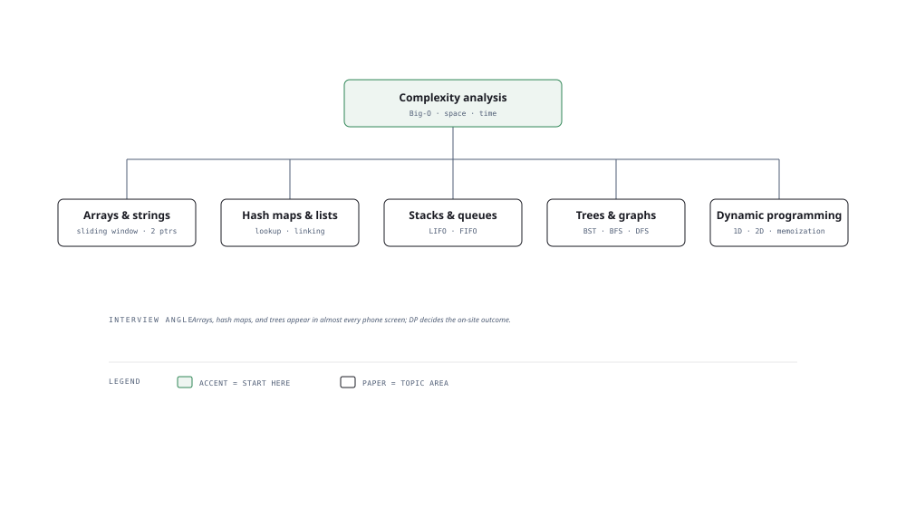

# Visual Notes — Data Structures & Algorithms

> One diagram, the full picture. Glance at this before reading the chapters and again before interviews.

## What the diagram shows

Everything in DSA hangs off one root — **complexity analysis** — with five branches:

1. **Arrays & strings** — the workhorses: sliding window and two pointers.
2. **Hash maps & linked lists** — the lookup game: hash maps for O(1) access, linked lists for order and splicing.
3. **Stacks & queues** — LIFO and FIFO: parse, undo, BFS.
4. **Trees & graphs** — the real world: BST, heap, trie, BFS/DFS, shortest paths, topological sort.
5. **Dynamic programming** — the differentiator: overlapping subproblems and optimal substructure, 1D and 2D.

## Why this matters for placement

- Arrays, hash maps, and trees appear in **almost every phone screen**; DP and graphs decide the on-site outcome.
- The interview isn't about memorizing solutions — it's about **recognizing the pattern** and picking the right structure in the first minute.

## Quick revision

- **Big-O by structure** — array index: O(1); array search: O(n); hash map insert/get: O(1) avg; BST search: O(log n); sort: O(n log n); DFS/BFS: O(V + E).
- **When to use what** — need fast lookup? hash map. Need order? array/linked list. Need fast min/max? heap. Need hierarchy? tree. Need connectivity? graph.
- **The two-pointer pattern** — sorted arrays, palindrome checks, removing duplicates, container with most water.
- **Sliding window** — subarray/substring problems with a constraint: expand the right, shrink the left.
- **DP tell** — "number of ways", "minimum cost", "longest subsequence" → likely DP. Write the recurrence, memoize, then convert to tabulation.
- **BFS vs DFS** — BFS for shortest path in unweighted graphs, DFS for connectivity and path existence.

## Related chapters

- [01 — Time & Space Complexity](01-time-and-space-complexity.md)
- [04 — Sliding Window](04-sliding-window.md)
- [05 — Two Pointers](05-two-pointers.md)
- [06 — Hash Maps and Sets](06-hash-maps-and-sets.md)
- [12 — Graphs BFS/DFS](12-graphs-bfs-dfs.md)
- [15 — Dynamic Programming 1D](15-dynamic-programming-1d.md)

---

**One-line answer for interviews:** *"I solve problems by pattern-matching the structure — what to store, in what, and at what cost."*
