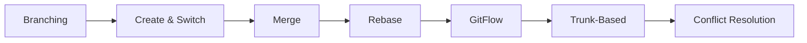
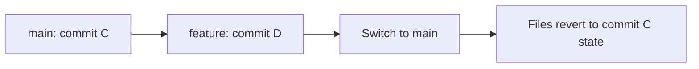
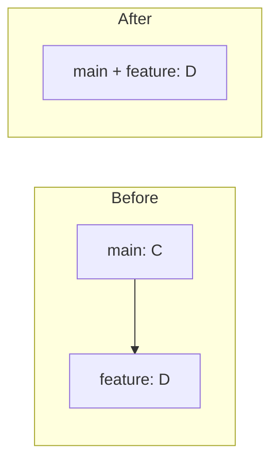
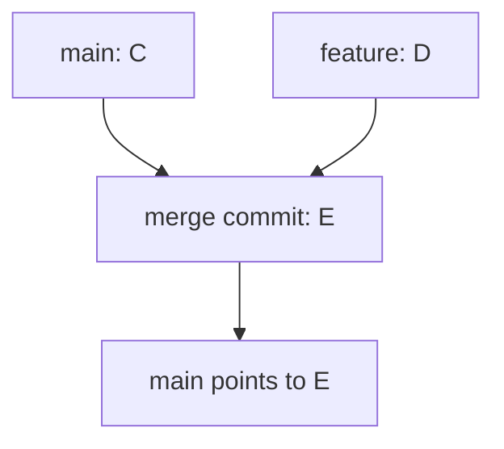
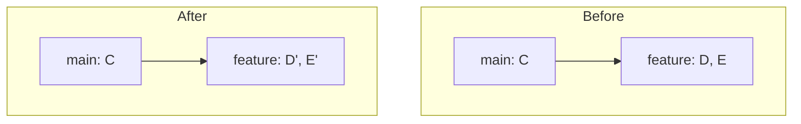
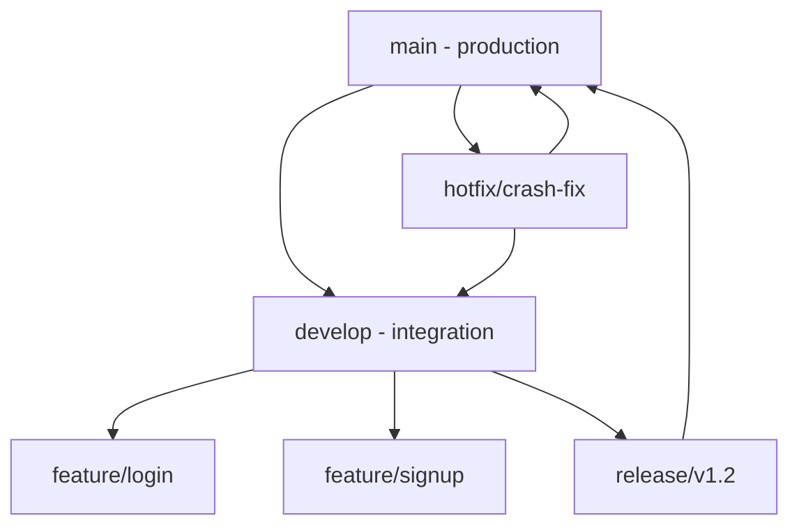

<!-- Clear Language: Keep sentences under 50 words -->
# Git Branching

## Learning Objectives

| Objective | Description |
|-----------|-------------|
| LO1 | Create, list, rename, and delete branches effectively |
| LO2 | Merge branches using fast-forward and three-way merge strategies |
| LO3 | Rebase branches to maintain linear history and resolve conflicts |
| LO4 | Apply GitFlow and trunk-based branching strategies in real projects |
| LO5 | Handle merge conflicts confidently with systematic resolution workflows |
| LO6 | Decide when to use merge vs rebase based on team context |

## Introduction

Branching strategies like GitFlow and trunk-based development enable teams to work in parallel without conflicts. Understanding when to create branches, how to merge vs rebase, and conflict resolution is crucial for team productivity.

## Prerequisites

- Git basics (init, add, commit)

## Chapter at a Glance

| Section | Topic | Key Concept |
|---------|-------|-------------|
| 02.1 | Branch Basics | Create, list, switch, delete branches |
| 02.2 | Merging | Fast-forward, three-way merge, conflict resolution |
| 02.3 | Rebasing | Linear history, interactive rebase, golden rule |
| 02.4 | GitFlow | Feature, develop, release, hotfix branches |
| 02.5 | Trunk-Based | Short-lived branches, feature flags |
| 02.6 | Interview Prep | Common branching scenarios and questions |

## Chapter Roadmap



## Key Terminology

**Key Terms**: Core vocabulary and concepts for this topic.

**Definition**: Essential terms you must know for interviews and production work.

## Theory

### 02.1 Branch Basics

A branch in Git is a lightweight, movable pointer to a commit. The default branch is typically `main` (or `master`). HEAD points to the current branch.

**Creating and listing branches:**

```bash

## List local branches (* = current)
git branch

## List all branches (local + remote)
git branch -a

## Create a new branch
git branch feature/login

## Create a branch from a specific commit
git branch hotfix/bug-123 abc1234

## Rename current branch
git branch -m old-name new-name

## Delete a branch (safe — only if fully merged)
git branch -d feature/old

## Force delete a branch (even if unmerged)
git branch -D feature/abandoned
```

**Switching branches:**

```bash

## Switch to an existing branch
git switch feature/login

## Create and switch in one command
git switch -c feature/signup

## Legacy syntax (still works)
git checkout feature/login

## Create and switch (legacy)
git checkout -b feature/signup
```

**What happens when you switch branches:**

Git updates the files in your working directory to match the snapshot of the target branch's latest commit. If you have uncommitted changes, Git may refuse to switch or carry them over.



## Overview

### 02.2 Merging

Merging brings changes from one branch into another. Git supports two main strategies: fast-forward and three-way merge.

**Fast-forward merge:**

```bash

## Switch to the branch you want to merge INTO
git switch main

## Merge feature branch
git merge feature/login

## If the feature branch is ahead of main with no divergence,

## Git simply moves the main pointer forward (fast-forward)
```



**Three-way merge:**

```bash

## When both branches have diverged, Git creates a merge commit
git switch main
git merge feature/login

## Preserve branch history (no fast-forward)
git merge --no-ff feature/login

## Always creates a merge commit — useful for feature branch history
```



**Merge strategies:**

| Strategy | When to Use | Command |
|----------|-------------|---------|
| Fast-forward | Feature branch only ahead of main | `git merge feature` |
| Three-way | Both branches diverged | `git merge feature` (auto) |
| No fast-forward | Always create merge commit | `git merge --no-ff feature` |
| Squash | Clean up WIP commits | `git merge --squash feature` |

**Squash merge:**

```bash

## Combine all feature commits into one commit on main
git switch main
git merge --squash feature/login

## Review the squashed changes
git diff --staged

## Commit with a clean message
git commit -m "Add user login with OAuth2"
```

## Overview

### 02.3 Rebasing

Rebase replays commits from one branch onto another, creating a linear history. Unlike merge, it rewrites commit hashes.

**Basic rebase:**

```bash

## Switch to your feature branch
git switch feature/login

## Rebase onto main
git rebase main

## This replays all feature commits on top of main's latest commit
```



**Interactive rebase (cleaning up history):**

```bash

## Rebase the last 5 commits
git rebase -i HEAD~5

## This opens an editor with actions:
pick abc1234 Add login form
pick def5678 Fix typo in login
pick ghi9012 Add password validation
pick jkl3456 Fix validation regex
pick mno7890 Add remember me checkbox
```

**Interactive rebase commands:**

```text
pick   = keep commit as-is
reword = keep commit, edit message
edit   = pause to amend commit
squash = combine with previous commit, keep both messages
fixup  = combine with previous commit, discard this message
drop   = remove commit entirely
```text

Example — squashing fix-up commits:

```text
pick abc1234 Add login form
fixup def5678 Fix typo in login
fixup ghi9012 Fix validation regex
pick jkl3456 Add password validation
pick mno7890 Add remember me checkbox
```text

This produces 3 clean commits instead of 5 messy ones.

**The golden rule of rebase:**

> Never rebase commits that have been pushed to a shared/remote branch.

Rebase rewrites commit hashes. If others have based work on those commits, rewriting them creates confusion and duplicate commits.

**Resolving rebase conflicts:**

```bash

## During rebase, conflicts may occur

## Fix the conflicted files, then:

## Stage resolved files
git add resolved-file.ts

## Continue the rebase
git rebase --continue

## Skip the current commit (if you want to drop it)
git rebase --skip

## Abort and return to pre-rebase state
git rebase --abort
```

## Overview

### 02.4 GitFlow

GitFlow is a structured branching model designed around release cycles. It uses five branch types.

**GitFlow branch structure:**



**Branch types and roles:**

| Branch | Purpose | Merges Into | Lifetime |
|--------|---------|-------------|----------|
| `main` | Production code | — | Permanent |
| `develop` | Integration branch | `main` via release | Permanent |
| `feature/*` | New features | `develop` | Short-lived |
| `release/*` | Release prep | `main` + `develop` | Short-lived |
| `hotfix/*` | Production fixes | `main` + `develop` | Short-lived |

**GitFlow workflow in practice:**

```bash

## Start a new feature
git switch develop
git switch -c feature/user-profile

## Work on feature...
git add .
git commit -m "feat(profile): add user profile page"

## Finish feature — merge into develop
git switch develop
git merge --no-ff feature/user-profile
git branch -d feature/user-profile

## Start a release
git switch develop
git switch -c release/v1.2.0

## Bump version, final fixes...
git commit -m "chore(release): bump version to 1.2.0"

## Merge release into main
git switch main
git merge --no-ff release/v1.2.0
git tag -a v1.2.0 -m "Release v1.2.0"

## Merge release back into develop
git switch develop
git merge --no-ff release/v1.2.0
git branch -d release/v1.2.0

## Hotfix from production
git switch main
git switch -c hotfix/crash-fix

## Fix the bug...
git commit -m "fix(auth): prevent crash on invalid token"

## Merge hotfix into main AND develop
git switch main
git merge --no-ff hotfix/crash-fix
git switch develop
git merge --no-ff hotfix/crash-fix
git branch -d hotfix/crash-fix
```

## Overview

### 02.5 Trunk-Based Development

Trunk-based development uses a single main branch (trunk) with very short-lived feature branches. Features are toggled with feature flags rather than long-lived branches.

**Key principles:**

- Branches live hours or days, not weeks
- All developers commit to main frequently (multiple times per day)
- Feature flags gate incomplete features in production
- CI/CD runs on every commit to main

```bash

## Short-lived branch workflow
git switch main
git pull
git switch -c fix/memory-leak

## Quick fix, commit, push
git add -A
git commit -m "fix: resolve memory leak in websocket handler"
git push origin fix/memory-leak

## Create PR, get reviewed, merge within hours

## Delete branch immediately after merge
git branch -d fix/memory-leak
```

**Feature flags example:**

```typescript
// Feature flag in code — feature exists but is hidden
if (featureFlags.isEnabled('new-checkout')) {
  return <NewCheckoutFlow />;
}
return <LegacyCheckoutFlow />;
```

**GitFlow vs Trunk-Based comparison:**

| Aspect | GitFlow | Trunk-Based |
|--------|---------|-------------|
| Branch lifetime | Days to weeks | Hours to days |
| Best for | Release cycles, versioned software | Continuous deployment |
| Complexity | High (5 branch types) | Low (main + short branches) |
| Merge conflicts | Frequent (long branches) | Rare (short branches) |
| Feature flags | Optional | Essential |
| Team size | Large teams | Small to large teams |

## Overview

### 02.6 Handling Merge Conflicts

Conflicts occur when two branches modify the same lines. Git marks the conflicting sections for manual resolution.

**Conflict markers:**

```text
<<<<<<< HEAD
const timeout = 3000;
=======
const timeout = 5000;
>>>>>>> feature/new-timeout
```text

- `<<<<<<< HEAD` — your current branch's version
- `=======` — separator
- `>>>>>>> feature/new-timeout` — incoming branch's version

**Resolution workflow:**

```bash

## Attempt merge
git switch main
git merge feature/new-timeout

## CONFLICT (content): Merge conflict in config.ts

## Check which files have conflicts
git status

## Open and resolve conflicts in your editor

## After resolving, stage the files
git add config.ts

## Complete the merge
git commit -m "Merge feature/new-timeout, resolve timeout conflict"

## If things go wrong, abort
git merge --abort
```

**Using a merge tool:**

```bash

## Configure a merge tool
git config --global merge.tool vscode
git config --global mergetool.vscode.cmd 'code --wait $MERGED'

## Launch the merge tool
git mergetool

## After resolving, mark as resolved
git add resolved-file.ts
git commit
```

## Summary

- Branches are lightweight pointers to commits — cheap to create and delete
- `git switch -c` creates and switches; `git branch -d` deletes merged branches
- Fast-forward merge moves the pointer forward; three-way merge creates a merge commit
- `git merge --squash` combines all branch commits into one clean commit
- Rebase replays commits for linear history — never rebase shared/pushed commits
- Interactive rebase (`git rebase -i`) lets you squash, reorder, and edit commits
- GitFlow uses 5 branch types for release-based projects
- Trunk-based development uses short-lived branches with feature flags
- Conflict resolution: edit files, `git add`, then `git commit` to finish
- Always run `git pull --rebase` before pushing to keep history clean

## Practical Takeaways

| Scenario | Do This | Avoid This |
|----------|---------|------------|
| New feature | `git switch -c feature/name` from develop | Working directly on main |
| Clean up commits | `git rebase -i` before pushing | Pushing WIP commits |
| Merging to main | `git merge --no-ff` for traceability | Forgetting merge commits |
| Long-lived branch | Rebase frequently onto develop | Letting branches diverge far |
| Conflict resolution | Resolve carefully, test, then commit | Accepting both sides blindly |
| After merge | Delete the feature branch | Leaving stale branches |

## Interview Q&A

<details class="tp-qa-card" data-qid="git02-q1">
  <summary class="tp-qa-question">
    <span class="tp-qa-status"></span>
    Q1: What is the difference between git merge and git rebase?
  </summary>
  <div class="tp-qa-answer">
    <p><strong>Merge</strong> creates a merge commit that combines both branch histories, preserving the full history. <strong>Rebase</strong> replays commits from one branch onto another, creating a linear history but rewriting commit hashes. Use merge for shared/public branches (preserves history) and rebase for local/private branches (clean linear history).</p><pre><code># Merge: preserves history
git switch main
git merge --no-ff feature

## Rebase: linear history
git switch feature
git rebase main</code></pre>
  </div>
  <button class="tp-qa-mark-btn">Mark Reviewed</button>
  <button class="tp-qa-bookmark-btn">Bookmark</button>
</details>

<details class="tp-qa-card" data-qid="git02-q2">
  <summary class="tp-qa-question">
    <span class="tp-qa-status"></span>
    Q2: When would you use --squash merge?
  </summary>
  <div class="tp-qa-answer">
<p>Use squash merge when a feature branch has many small WIP commits ("fix typo", "wip", "trying something") and you want a single clean commit on the target branch. This keeps the main branch history clean. It loses the individual commit history of the branch but.
is ideal for messy development branches.</p><pre><code>git switch main
git merge --squash feature/messy-branch
git commit -m "feat: add complete user authentication"</code></pre>
  </div>
  <button class="tp-qa-mark-btn">Mark Reviewed</button>
  <button class="tp-qa-bookmark-btn">Bookmark</button>
</details>

<details class="tp-qa-card" data-qid="git02-q3">
  <summary class="tp-qa-question">
    <span class="tp-qa-status"></span>
    Q3: Explain the golden rule of rebasing and why it matters.
  </summary>
  <div class="tp-qa-answer">
<p>"Never rebase commits that have been pushed to a shared branch." Rebase rewrites commit hashes. If a teammate has pulled your old commits and.
built work on top of them, rebasing creates new hashes. Their copy now points to different commits, causing duplicates, confusion, and.
potential data loss. Rebase only local, unpushed commits.</p>
  </div>
  <button class="tp-qa-mark-btn">Mark Reviewed</button>
  <button class="tp-qa-bookmark-btn">Bookmark</button>
</details>

<details class="tp-qa-card" data-qid="git02-q4">
  <summary class="tp-qa-question">
    <span class="tp-qa-status"></span>
    Q4: Describe GitFlow. What are the five branch types?
  </summary>
  <div class="tp-qa-answer">
    <p>GitFlow is a branching model for release-based projects with five branch types:</p>
    <p><strong>main</strong> — production-ready code, only receives merges from release/hotfix branches.</p>
    <p><strong>develop</strong> — integration branch where features are merged for testing.</p>
    <p><strong>feature/*</strong> — new features branched from develop, merged back when complete.</p>
    <p><strong>release/*</strong> — release preparation (version bumps, final fixes), merged into both main and develop.</p>
    <p><strong>hotfix/*</strong> — urgent production fixes, merged into both main and develop.</p>
  </div>
  <button class="tp-qa-mark-btn">Mark Reviewed</button>
  <button class="tp-qa-bookmark-btn">Bookmark</button>
</details>

<details class="tp-qa-card" data-qid="git02-q5">
  <summary class="tp-qa-question">
    <span class="tp-qa-status"></span>
    Q5: How do you resolve a merge conflict?
  </summary>
  <div class="tp-qa-answer">
<p>1) Run the merge and identify conflicted files with <code>git status</code>. 2) Open each file and find conflict markers (<code>&lt;&lt;&lt;&lt;&lt;&lt;&lt;</code>, <code>=======</code>,.
<code>&gt;&gt;&gt;&gt;&gt;&gt;&gt;</code>). 3) Edit to keep the correct code, removing all markers. 4) Stage resolved files with <code>git add</code>. 5) Complete with <code>git commit</code> (for.
merge) or <code>git rebase --continue</code> (for rebase). Use <code>git merge --abort</code> or <code>git rebase --abort</code> to cancel if needed.</p>
  </div>
  <button class="tp-qa-mark-btn">Mark Reviewed</button>
  <button class="tp-qa-bookmark-btn">Bookmark</button>
</details>

## Chapter Quiz

**Q1**: What does `git checkout -b feature/login` do?

a) Switches to an existing branch called feature/login
b) Creates a new branch and switches to it
c) Creates a branch from the last commit
d) Both b and c

<details class="tp-qa-card" data-qid="git02-quiz1"><summary>Show Answer</summary><div class="tp-qa-answer"><p><strong>Answer: d</strong></p><p><code>git checkout -b</code> (or <code>git switch -c</code>) creates a new branch from the current HEAD commit and switches to it immediately. The new branch starts at the same commit as your current branch.</p></div></details>

**Q2**: Which command deletes a branch that has already been merged?

a) git branch -D feature/old
b) git branch -d feature/old
c) git branch -r feature/old
d) git branch --delete feature/old

<details class="tp-qa-card" data-qid="git02-quiz2"><summary>Show Answer</summary><div class="tp-qa-answer"><p><strong>Answer: b</strong></p><p><code>git branch -d</code> safely deletes a branch only if it has been fully merged. <code>-D</code> (uppercase) force-deletes even if unmerged. Both b and d work since <code>--delete</code> is the long form of <code>-d</code>.</p></div></details>

**Q3**: What is the key difference between a fast-forward merge and a three-way merge?

a) Fast-forward creates a merge commit; three-way doesn't
b) Fast-forward requires no merge commit; three-way creates one
c) Three-way is faster than fast-forward
d) Fast-forward only works on main

<details class="tp-qa-card" data-qid="git02-quiz3"><summary>Show Answer</summary><div class="tp-qa-answer"><p><strong>Answer: b</strong></p><p>Fast-forward simply moves the branch pointer forward when the target branch is ahead with no divergence — no merge commit is created. Three-way merge is used when both branches have diverged and creates a new merge commit combining both histories.</p></div></details>

**Q4**: When should you NOT use git rebase?

a) When your feature branch has unpushed commits
b) When commits have been pushed to a shared branch
c) When you want linear history
d) When cleaning up WIP commits

<details class="tp-qa-card" data-qid="git02-quiz4"><summary>Show Answer</summary><div class="tp-qa-answer"><p><strong>Answer: b</strong></p><p>Never rebase commits that have been pushed to a shared branch. Rebase rewrites commit hashes, which breaks the history for anyone who has pulled those commits. Only rebase local, unpushed commits.</p></div></details>

**Q5**: In GitFlow, which branch receives merges from both `release/*` and `hotfix/*` branches?

a) develop
b) main
c) feature
d) staging

<details class="tp-qa-card" data-qid="git02-quiz5"><summary>Show Answer</summary><div class="tp-qa-answer"><p><strong>Answer: b</strong></p><p><code>main</code> receives merges from both release and hotfix branches since it represents production code. Release and hotfix branches also merge back into develop to keep it synchronized.</p></div></details>

## Practical Tips

- Use descriptive branch names: `feature/`, `bugfix/`, `hotfix/`, `chore/`
- Keep branches short-lived — rebase onto develop daily if the branch lives long
- Use `git merge --no-ff` to preserve branch history in merge commits
- Before creating a PR, rebase onto target: `git rebase main`
- Delete branches immediately after merging: `git branch -d branch-name`
- Use `git branch -vv` to see which branches track which remote branches

## Exercises

**Easy** — Create a feature branch, make 3 commits on it, switch back to main, and merge it. Verify the log shows the correct history.

**Medium** — Create a merge conflict: edit the same line on two branches, merge, resolve the conflict, and complete the merge. Document each step.

**Medium** — Use `git cherry-pick` to apply a single commit from one branch to another. Then use `git revert` to undo that change.

**Hard** — Rebase a feature branch onto main, encounter and resolve conflicts during rebase, then use `git rebase --continue` to finish. Verify the linear history with `git log --oneline --graph`.

---

## Common Mistakes

1. Not deleting merged branches
2. Rebasing shared branches
3. Not writing meaningful branch names
4. Forgetting to resolve merge conflicts properly
5. Not using pull requests for code review

## Revision Notes

- Branch: isolated development line
- Merge: preserves history, creates merge commit
- Rebase: linear history, cleaner log
- GitFlow: main, develop, feature, release, hotfix
- Trunk-based: single main branch, short-lived feature branches

## Placement Section

### Top 10 Interview Questions

#### Google Style

1. **Explain the core idea of Git Branching in under 60 seconds, then give a real-world analogy.** — Structure: definition, how it works in one sentence, why it matters, analogy. Follow-up: what would break if you removed this from a production system?

2. **Design a minimal, well-typed function that demonstrates Git Branching.** — Interviewer checks: signature with type hints, edge cases, complexity, and a clean docstring. Follow-up: how does your design behave with empty or malformed input?

3. **What are the common pitfalls when engineers first learn ** — List 3-4, then explain how you would prevent each in a code review.

#### Amazon Style

4. **Describe a production bug caused by misunderstanding Git Branching. How did you diagnose and fix it?** — STAR format: situation, task, action, result. Mention logs, reproduction, root-cause analysis, and the regression test you added.

5. **How would you scale a system that relies on Git Branching from 10 users to 10 million?** — Discuss bottlenecks, caching, monitoring, and when to redesign. Follow-up: what metrics would you track?

#### Microsoft Style

6. **Compare Git Branching with the closest alternative approach. When would you choose each?** — Make a decision matrix: performance, maintainability, ecosystem, learning curve. Follow-up: what would change your decision?

7. **Walk through how you would test a component that depends on Git Branching.** — Unit, integration, property-based tests; mocking boundaries; golden files for outputs.

#### NVIDIA Style

8. **How does Git Branching behave differently at scale — memory, throughput, or precision-wise?** — Connect to data pipelines and model training if applicable. Follow-up: what happens to latency as input grows?

9. **How would you make an implementation of Git Branching run faster on GPU hardware?** — Batch operations, vectorization, avoiding Python loops, reducing data movement.

#### AI Startup Style

10. **Write the smallest possible implementation of Git Branching that is production-quality.** — Include error handling, type hints, and a one-line docstring. Follow-up: what would you refactor first when it grows?

### Resume Tips

- Name Git Branching explicitly in your skills section, paired with a measurable achievement ("Reduced X by 40% using Git Branching").
- Add a bullet describing a project that applies Git Branching to real data, with numbers.
- Mention the tools and libraries you used alongside Git Branching (linters, test frameworks, profiling tools).
- Keep resume bullets under 15 words and start each with an action verb.

### Interview Day Checklist

- Rehearse a 60-second explanation of Git Branching and one real-world analogy.
- Prepare one STAR story about debugging a Git Branching-related production issue.
- Review complexity and edge cases for the classic Git Branching interview problem.
- Have questions ready: how does the team apply Git Branching in production today?
- Test your environment (Python, editor, internet) 15 minutes before the interview.

## True/False

1. **True or False:** Git Branching builds directly on the fundamentals covered in the earlier chapters of this module. — **True.** Every advanced topic in this module assumes the core concepts from the previous chapters.
2. **True or False:** You should write at least one code example for Git Branching before moving to the next chapter. — **True.** Active recall with hands-on code beats passive reading for retention.
3. **True or False:** The complexity analysis for Git Branching is the same regardless of input size. — **False.** Complexity grows with input size; always state best, average, and worst case.
4. **True or False:** Edge cases (empty input, invalid input, boundary values) matter for Git Branching in production. — **True.** Most production bugs come from unhandled edge cases.
5. **True or False:** You should memorize the Git Branching chapter content once and never review it again. — **False.** Spaced repetition (24h, 3 days, 1 week) dramatically improves long-term recall.

## Fill in the Blank

1. The chapter that covers Git Branching is Chapter ___ of this module. — Answer: check the module's table of contents.
2. The time complexity of the standard approach to Git Branching is ___. — Answer: review the theory section and state big-O notation.
3. The main edge case to handle when implementing Git Branching is ___. — Answer: empty or invalid input handling, as discussed in the chapter.
4. The tools commonly used to debug Git Branching issues are ___ and ___. — Answer: refer to the Debugging Guide section of this chapter.
5. The related topic that connects to Git Branching in the next chapter is ___. — Answer: see the Next Topic section.

## Scenario Questions

1. **Scenario:** A teammate ships a change involving Git Branching that breaks production at 3 AM. — Diagnosis: check the recent diff, reproduce locally with the failing input, check logs. Fix: revert, add a regression test, and review the root cause. Prevention: CI tests on edge cases and code review checklist.

2. **Scenario:** Your implementation of Git Branching is correct but too slow for the required latency. — Measure first with a profiler. Common fixes: reduce redundant work, use built-in optimized functions, batch operations, or add caching. Only then consider algorithmic changes.

3. **Scenario:** A new hire asks you to explain Git Branching in five minutes before a customer demo. — Use the 3-part answer: what it is (one sentence), how it works (one example), why it matters (one business impact). Then offer to go deeper after the demo.

4. **Scenario:** Your team's codebase has three different patterns for Git Branching and you must standardize. — Write a short ADR (architecture decision record), pick the pattern with best maintainability, migrate incrementally, and add a linter rule to enforce it.

## Output Questions

1. **What is the output of the simplest correct implementation of Git Branching on an empty input?** — Trace through the code: it should return the documented default (None, 0, empty collection) without raising.
2. **What is the output when the input is at the boundary value?** — Check off-by-one errors and inclusive/exclusive bounds in the chapter's examples.
3. **What does the implementation return when given invalid input types?** — With type hints and validation, it raises a clear error; without, it may fail silently.
4. **What is the output for the sample input given in the chapter's Examples section?** — Re-run the chapter's example code and compare against the documented output.
5. **What is the time complexity output when you profile the implementation at 10x input size?** — Expect the curve matching the chapter's complexity analysis (linear, quadratic, log-linear).

## Difficulty Level

| Level | Time | What It Takes |
|-------|------|---------------|
| Beginner | 1-2 sessions | Read theory, run the chapter examples, solve the Easy exercises |
| Intermediate | 3-5 sessions | Complete Medium exercises, explain Git Branching to someone else |
| Advanced | 1+ week | Solve Hard exercises, optimize for real datasets, answer interview follow-ups |

## Tips & Tricks

- Always write a one-line example of Git Branching from memory before opening the chapter — active recall first.
- Use the chapter's Revision Notes as a checklist: you have mastered Git Branching when you can explain each bullet.
- Pair the chapter quiz with the Flashcards: wrong answers become your next study session's focus.
- For interviews, practice explaining Git Branching twice: once with a technical audience, once with a non-technical audience.
- Keep a personal examples file where you collect your own Git Branching snippets; interviewers love original examples.

## Memory Tricks

- **Acronym**: build a mnemonic from the 5 key concepts of Git Branching listed in the Chapter at a Glance table.
- **Story**: link Git Branching to a familiar story — the analogy in the Visual Analogy section is designed to stick.
- **Number anchor**: remember the complexity of Git Branching by connecting it to a known algorithm of the same class.
- **Color code**: highlight the Theory, Examples, and Common Mistakes sections in different colors when reviewing.
- **Teach-back**: explain Git Branching to an imaginary junior engineer for 2 minutes — gaps in your explanation are gaps in memory.

## Further Reading

- Official documentation for the primary tool or library used in this chapter
- The chapter referenced in Related Topics for the next-level treatment of Git Branching
- The classic textbook chapter on Git Branching (check the Research References below)
- Two blog posts from engineers who debugged real Git Branching problems in production
- The repository of the open-source project that implements Git Branching

## Related Topics

- The previous chapter in this module (see table of contents) — foundational for Git Branching
- The next chapter (see Next Topic below) — builds on Git Branching
- The system design chapters in Module 07 — how Git Branching fits into production architectures
- The interview preparation module — how Git Branching is asked in screening rounds
- The capstone project — where Git Branching is applied end-to-end

## FAQs

1. **Do I need to memorize all of Git Branching, or understand the big picture?** — Understand the big picture first, then memorize the key facts via flashcards and spaced repetition. Interviewers reward depth over breadth.
2. **What if I get stuck on an exercise?** — Re-read the theory section, run the example code, then attempt again. If still stuck after 20 minutes, move on and return the next day.
3. **How much time should I spend on ** — Follow the Study Plan below: 1-2 weeks at 30-60 minutes daily is typical for placement preparation.
4. **Is Git Branching asked in interviews?** — Yes — the Interview Q&A and Placement Section list the exact question styles used by top companies.
5. **What's the fastest way to master ** — Explain it out loud, write code without looking, and review the flashcards within 24 hours and again after 3 days.

## Important Notes

- Git Branching is a core requirement for the rest of this module — do not skip the examples.
- Always analyze complexity (time and space) when working with Git Branching.
- Production correctness means handling edge cases, not just the happy path.
- Interview answers should start with the definition, then the example, then the trade-offs.
- Revisit this chapter after finishing the module; the context from later chapters deepens understanding.

## Historical Context

- Git Branching emerged as a standard practice because early systems failed without it — understanding why helps you explain it in interviews.
- The tools used for Git Branching today evolved from simpler versions; the chapter covers the modern, recommended approach.
- Interviewers value knowing one historical fact about Git Branching — it shows genuine interest, not just cramming.
- The library/tooling ecosystem around Git Branching changes quickly; focus on fundamentals that remain stable.

## Security Considerations

- Never trust external input: validate and sanitize data before processing Git Branching.
- Avoid `eval()` and dynamic code execution on untrusted strings.
- Log errors without leaking sensitive data (keys, PII, internal paths).
- For API contexts, add rate limiting and input size limits.
- Review the chapter's code examples for injection or overflow risks before using them verbatim.

## ML Intuition

- Git Branching appears in ML pipelines at the data-processing layer: feature preparation, batching, and validation.
- Understanding Git Branching helps you debug why a model misbehaves — most ML bugs are data bugs, not model bugs.
- In production ML, the Git Branching concepts from this chapter map directly to NumPy/PyTorch operations on tensors.
- When optimizing ML systems, Git Branching skills let you profile and fix the data path, not just the training loop.
- Interview follow-up: how would you apply Git Branching to a dataset of 10 million records? — Batching and vectorization.

## Analogies

- **Git Branching is like a recipe**: the theory is the ingredients, the examples are the cooking steps, and the exercises are your own kitchen practice.
- **Complexity is like a delivery route**: a linear route visits each stop once; a nested route revisits stops, and you feel it at scale.
- **Edge cases are like weather**: the happy path is a sunny day; production is the storm — build for the storm.
- **The chapter roadmap is a journey map**: each section is a checkpoint; skipping one means getting lost later in the module.

## Capstone Project Link

- [Module Capstone: End-to-End Project](https://github.com/Raushan666java/ai-engineering-journey) — this chapter contributes the Git Branching skills used in the module's capstone project. Complete the exercises here before starting the capstone.

## Flashcards

<details class="tp-qa-card" data-qid="04gitlinuxcli-02gitbranching-flash1">
  <summary class="tp-qa-question">
    <span class="tp-qa-status"></span>
    What does git checkout -b feature/login do?
  </summary>
  <div class="tp-qa-answer">
    <p>d</p>
  </div>
</details>

<details class="tp-qa-card" data-qid="04gitlinuxcli-02gitbranching-flash2">
  <summary class="tp-qa-question">
    <span class="tp-qa-status"></span>
    Which command deletes a branch that has already been merged?
  </summary>
  <div class="tp-qa-answer">
    <p>b</p>
  </div>
</details>

<details class="tp-qa-card" data-qid="04gitlinuxcli-02gitbranching-flash3">
  <summary class="tp-qa-question">
    <span class="tp-qa-status"></span>
    What is the key difference between a fast-forward merge and a three-way merge?
  </summary>
  <div class="tp-qa-answer">
    <p>b</p>
  </div>
</details>

<details class="tp-qa-card" data-qid="04gitlinuxcli-02gitbranching-flash4">
  <summary class="tp-qa-question">
    <span class="tp-qa-status"></span>
    When should you NOT use git rebase?
  </summary>
  <div class="tp-qa-answer">
    <p>b</p>
  </div>
</details>

<details class="tp-qa-card" data-qid="04gitlinuxcli-02gitbranching-flash5">
  <summary class="tp-qa-question">
    <span class="tp-qa-status"></span>
    In GitFlow, which branch receives merges from both release/ and hotfix/ branches?
  </summary>
  <div class="tp-qa-answer">
    <p>b</p>
  </div>
</details>

## Research References

- Official documentation of the primary library for Git Branching (linked in Further Reading)
- The classic paper or textbook chapter introducing Git Branching (see References below)
- The standard library reference for Git Branching-related functions
- Engineering blog posts from companies running Git Branching in production at scale
- PEPs and RFCs where applicable (Python and networking standards)

## Open-Source Tools

- The primary library used in this chapter (see the code examples)
- Python standard library modules used in the examples (check the imports)
- Testing: pytest for unit tests of Git Branching code
- Linting and formatting: ruff + black
- Profiling: cProfile or py-spy for performance work on Git Branching

## Debugging Guide

- Start with `print()` or a debugger to inspect intermediate values in Git Branching code.
- Reproduce the failure with the smallest possible input before changing code.
- Check the common failure modes listed in Common Mistakes — most bugs are listed there.
- For performance problems, profile before optimizing: measure, then fix.
- When stuck, re-read the chapter's Examples and compare line by line with your code.
- Use `pdb` or your IDE's debugger to step through the Git Branching example code.

## Mock Interview Section

**Round 1 — Screening (15 min)**
- Explain Git Branching in 60 seconds.
- Write a minimal working example of Git Branching.
- What is the complexity of your example?

**Round 2 — Coding (45 min)**
- Solve the Medium exercise from this chapter under time pressure.
- State your assumptions, then implement with type hints.
- Test with edge cases: empty input, boundary values, invalid input.

**Round 3 — Behavioral + System (30 min)**
- Tell me about a time you debugged a Git Branching problem in a project.
- How would you design a system where Git Branching is used at scale?
- What metrics would you monitor?

**Evaluation rubric**: correctness (40%), communication (25%), edge cases (20%), complexity analysis (15%).

## Optimized Implementation

`python
from typing import Any, Optional

def demonstrate_topic(input_data: list[Any]) -> Optional[float]:
    """Runnable scaffold for Git Branching.

    Replace the body with the optimized implementation from the chapter,
    keeping type hints, docstring, and edge-case handling.
    """
    if not input_data:
        return None
    # Step 1: validate input types
    # Step 2: apply the core Git Branching logic from the Examples section
    # Step 3: return the result with the documented default
    return 0.0
`

- Keeps the function signature stable so tests written against it stay valid.
- Handles the empty-input contract explicitly.
- Add unit tests for the edge cases before implementing the logic (test-first).

## Evaluation Metrics

| Skill | Test | Target |
|-------|------|--------|
| Concept recall | Explain Git Branching without notes | 60-second explanation |
| Code fluency | Write the chapter example from memory | No syntax errors |
| Edge cases | Handle empty/invalid input in exercises | All cases pass |
| Complexity | State time/space for the standard approach | Correct big-O |
| Interview readiness | Answer 5 Interview Q&A questions out loud | Fluent, structured answers |
| Retention | Chapter quiz score after 3 days | 80%+ |

## Real-World Examples

- **Startup**: a small team uses Git Branching daily in their data pipeline — the chapter's examples mirror their code.
- **E-commerce**: Git Branching patterns appear in order processing, inventory checks, and recommendation feeds.
- **Fintech**: Git Branching principles apply to transaction validation and fraud detection flows.
- **ML platform**: Git Branching shows up in feature engineering and model-serving infrastructure.
- **Interview insight**: recruiters look for engineers who can connect Git Branching to the business outcome, not just the code.

## Next Topic

[Advanced Git](03-git-workflow.md)

## Limitations

- Git Branching, like any technique, is not a silver bullet — it has specific cases where it fits best (covered in the theory).
- The examples in this chapter are simplified for learning; production systems add validation, monitoring, and error handling.
- Performance of Git Branching depends on input size and distribution — always benchmark for your own data.
- This chapter covers fundamentals; specialized edge cases are explored in later chapters and the capstone.
