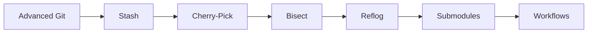

<!-- Clear Language: Keep sentences under 50 words -->
# Advanced Git

## Learning Objectives

| Objective | Description |
|-----------|-------------|
| LO1 | Use git stash to save and restore work-in-progress changes |
| LO2 | Apply specific commits across branches with cherry-pick |
| LO3 | Find buggy commits efficiently with git bisect |
| LO4 | Navigate and recover lost states using git reflog |
| LO5 | Manage external dependencies with git submodules |
| LO6 | Combine advanced Git tools for complex real-world workflows |

## Introduction

Advanced Git operations — stash, cherry-pick, bisect, reflog — give you powerful tools for managing complex workflows. These skills are essential for debugging, code review, and maintaining clean version history.

## Prerequisites

- Git basics
- Branching and merging

## Chapter at a Glance

| Section | Topic | Key Concept |
|---------|-------|-------------|
| 03.1 | Git Stash | Save, list, apply, and clean stashes |
| 03.2 | Cherry-Pick | Apply specific commits across branches |
| 03.3 | Git Bisect | Binary search for buggy commits |
| 03.4 | Git Reflog | Safety net for recovering lost commits |
| 03.5 | Submodules | Managing external repository dependencies |
| 03.6 | Real-World Workflows | Combining tools for production scenarios |

## Chapter Roadmap



## Key Terminology

**Key Terms**: Core vocabulary and concepts for this topic.

**Definition**: Essential terms you must know for interviews and production work.

## Theory

### 03.1 Git Stash

Stashing temporarily shelves changes in your working directory so you can work on something else and come back later. It's useful when you need to switch branches but aren't ready to commit.

**Basic stash operations:**

```bash

## Stash all modified tracked files
git stash

## Stash with a descriptive message
git stash push -m "WIP: half-finished login validation"

## Stash untracked files too
git stash -u

## Stash only specific files
git stash push -m "auth changes" src/auth.ts src/auth.test.ts

## Include ignored files in the stash
git stash -a
```

**Listing and viewing stashes:**

```bash

## List all stashes
git stash list

## Output: stash@{0}: On feature/login: WIP: half-finished login validation

##         stash@{1}: On main: Quick experiment

## Show stash contents
git stash show

## Show stash contents with full diff
git stash show -p

## Show a specific stash
git stash show -p stash@{1}
```

**Applying and popping stashes:**

```bash

## Apply the most recent stash (keep in stash list)
git stash apply

## Apply a specific stash
git stash apply stash@{2}

## Apply and remove from stash list
git stash pop

## Apply a specific stash and remove it
git stash pop stash@{1}
```

**Dropping and clearing stashes:**

```bash

## Drop a specific stash
git stash drop stash@{0}

## Drop the most recent stash
git stash drop

## Clear all stashes
git stash clear
```

**Branch-specific stash workflow:**

```bash

## Create a branch from stash
git stash branch feature/from-stash stash@{0}

## This creates the branch, checks it out, and applies the stash
```

**When to use stash:**

- Quick context switch to fix a bug on another branch
- Experimental changes you might want later
- Pulling changes when you have uncommitted modifications
- Cleaning working directory before switching branches

## Overview

### 03.2 Cherry-Pick

Cherry-pick applies a specific commit from one branch to another without merging the entire branch. It's useful for backporting fixes.

**Basic cherry-pick:**

```bash

## Apply a single commit to current branch
git cherry-pick abc1234

## Apply multiple commits
git cherry-pick abc1234 def5678 ghi9012

## Apply a range of commits (exclusive of start)
git cherry-pick abc1234..ghi9012

## Apply a range inclusive of both ends
git cherry-pick abc1234^..ghi9012
```

**Cherry-pick options:**

```bash

## Apply commit without committing (stage changes only)
git cherry-pick --no-commit abc1234

## Apply and create a new commit with a different message
git cherry-pick -x -m 1 abc1234

## -x adds "cherry-picked from" reference

## -m 1 specifies parent number for merge commits

## Abort a cherry-pick in progress
git cherry-pick --continue

## Abort and return to pre-cherry-pick state
git cherry-pick --abort
```

**Common cherry-pick scenarios:**

```bash

## Scenario 1: Backport a bug fix from develop to a release branch
git switch release/v1.0
git cherry-pick abc1234  # the fix commit from develop

## Scenario 2: Apply a commit that was on the wrong branch
git switch feature/correct-branch
git cherry-pick abc1234  # commit that was accidentally on main

## Scenario 3: Partial cherry-pick (stage only, don't commit)
git cherry-pick --no-commit abc1234

## Edit files if needed, then:
git commit -m "Adapted fix for v1.0 release"
```

**Cherry-pick vs merge:**

| Aspect | Cherry-Pick | Merge |
|--------|-------------|-------|
| Scope | Single commit | Entire branch |
| History | Clean, selective | Full branch history |
| Use case | Backport specific fixes | Integrate complete features |
| Risk | Duplicate changes if not careful | Merge conflicts |

## Overview

### 03.3 Git Bisect

Bisect performs a binary search through commit history to find the exact commit that introduced a bug. It's dramatically faster than manual bisection.

**Basic bisect workflow:**

```bash

## Start bisect session
git bisect start

## Mark current commit as bad (has the bug)
git bisect bad

## Mark a known good commit
git bisect good abc1234

## Git checks out a middle commit

## Test the code, then mark it:
git bisect good   # if the commit works
git bisect bad    # if the commit has the bug

## Repeat until Git finds the first bad commit

## When done, Git outputs:

## abc1234 is the first bad commit

## Return to original branch
git bisect reset
```

**Automated bisect:**

```bash

## Start bisect with a test script
git bisect start
git bisect bad HEAD
git bisect good abc1234

## Run your test script — Git auto-advances based on exit code
git bisect run npm test

## The script must exit 0 for good, non-zero for bad

## Git will binary-search and find the exact commit automatically

## Reset when done
git bisect reset
```

**Automated bisect example:**

```bash

## Find which commit broke the unit tests
git bisect start
git bisect bad HEAD
git bisect good v1.0.0
git bisect run pytest tests/ -x

## Find which commit broke a specific feature
git bisect start
git bisect bad HEAD
git bisect good v2.1.0
git bisect run bash -c "npm run build && node test-feature.js"
```

**Bisect with visualizing:**

```bash

## Start bisect
git bisect start HEAD v1.0.0

## View bisect log
git bisect log

## Skip a commit that can't be tested
git bisect skip

## Visualize the bisection progress
git bisect visualize
```

## Overview

### 03.4 Git Reflog

Reflog records every movement of HEAD and branch pointers. It's Git's safety net — almost nothing is truly lost as long as it was committed.

**Viewing reflog:**

```bash

## Show HEAD reflog (most recent first)
git reflog

## Output:

## abc1234 HEAD@{0}: reset: moving to HEAD~1

## def5678 HEAD@{1}: commit: Add feature X

## ghi9012 HEAD@{2}: checkout: moving from main to feature

## Show reflog for a specific branch
git reflog show feature/login

## Show reflog with dates
git reflog --date=iso
```

**Recovering from mistakes:**

```bash

## Scenario 1: Accidentally reset --hard and lost commits
git reflog

## Find the commit hash before the reset
git reset --hard HEAD@{2}

## Scenario 2: Accidentally deleted a branch
git reflog

## Find the last commit on the deleted branch
git branch feature/recovered HEAD@{5}

## Scenario 3: Bad rebase — return to pre-rebase state
git reflog

## Find the HEAD position before rebase started
git reset --hard HEAD@{n}

## Scenario 4: Amend went wrong — undo the amend
git reflog

## Find the commit before the amend
git reset --hard HEAD@{1}
```

**Reflog expiration:**

- Reflog entries expire after 90 days by default
- Unreachable objects are garbage-colled after expiration
- Run `git gc` to manually trigger garbage collection

```bash

## Check reflog expiration settings
git config --get gc.reflogExpire

## Set custom expiration
git config gc.reflogExpire "180 days"
```

**Reflog vs other recovery tools:**

| Tool | Use Case | Scope |
|------|----------|-------|
| `git reflog` | Recover lost commits/branches | Local only |
| `git restore` | Undo working directory changes | Current files |
| `git reset` | Move HEAD to a previous state | Commit history |
| `git revert` | Create undo commit on shared branch | Safe for shared |

## Overview

### 03.5 Git Submodules

Submodules let you include an external Git repository inside your project as a subdirectory. This is useful for managing shared libraries, vendor code, or monorepo dependencies.

**Adding a submodule:**

```bash

## Add a submodule
git submodule add https://github.com/user/library.git vendor/library

## Add a submodule at a specific branch
git submodule add -b main https://github.com/user/library.git vendor/library

## Commit the submodule reference
git commit -m "Add vendor/library submodule"
```

**Cloning a repo with submodules:**

```bash

## Clone with submodules (two-step)
git clone https://github.com/user/project.git
cd project
git submodule init
git submodule update

## Or clone recursively (one-step)
git clone --recurse-submodules https://github.com/user/project.git

## Update submodules to latest commits
git submodule update --remote

## Update and merge remote changes
git submodule update --remote --merge
```

**Working with submodules:**

```bash

## Enter the submodule directory
cd vendor/library

## Make changes inside the submodule

## ... edit files ...
git add .
git commit -m "Fix bug in library"

## Go back to parent repo and commit the updated reference
cd ../..
git add vendor/library
git commit -m "Update library submodule to latest"
```

**Removing a submodule:**

```bash

## Step 1: Deinit the submodule
git submodule deinit -f vendor/library

## Step 2: Remove from .git/modules
git rm -f vendor/library

## Step 3: Remove from .gitmodules (if it exists)

## Edit .gitmodules to remove the submodule entry

## Commit the removal
git commit -m "Remove vendor/library submodule"
```

**Submodule gotchas:**

```bash

## Problem: submodule shows as modified after pull
git submodule update --init --recursive

## Problem: someone else updated the submodule
git pull
git submodule update --remote

## Problem: detached HEAD in submodule
cd vendor/library
git checkout main
git pull

## Prevent detached HEAD issues
git config -f .gitmodules submodule.library.branch main
```

## Overview

### 03.6 Real-World Workflows

**Combining stash + cherry-pick for hotfixes:**

```bash

## You're working on a feature, but need a quick hotfix
git stash push -m "WIP: feature work"

## Create hotfix branch
git switch main
git switch -c hotfix/security-patch

## Make and commit the fix
git add -A
git commit -m "fix(security): patch XSS vulnerability"

## Merge to main and push
git switch main
git merge --no-ff hotfix/security-patch
git push origin main

## Back to your feature
git switch feature/my-feature
git stash pop
```

**Using bisect + test script for regression:**

```bash

## Find which commit broke the CI
git bisect start
git bisect bad HEAD
git bisect good v2.0.0

## Use automated test
git bisect run npm run test:integration

## Git finds the exact commit, reset when done
git bisect reset
```

**Recovering a dropped stash:**

```bash

## Accidentally dropped a stash? Reflog saves the day
git fsck --unreachable | grep commit

## Or check reflog for stash entries
git stash list
git log --oneline --all | grep stash

## Recover from reflog
git stash apply stash@{0}  # if still in list
git checkout HEAD@{1}      # if dropped but in reflog
```

## Summary

- `git stash` saves uncommitted changes temporarily — use when switching context
- `git stash push -m "msg"` creates named stashes; `git stash pop` applies and removes
- `git cherry-pick <hash>` applies a specific commit to the current branch
- Use `--no-commit` for partial cherry-picks; `-x` adds source reference
- `git bisect` binary-searches commit history to find the exact bug-introducing commit
- `git bisect run <script>` automates bisection with a test command
- `git reflog` records all HEAD movements — your safety net for recovering lost work
- `git submodule add` includes external repos; use `--recurse-submodules` when cloning
- Combine tools: stash for context switches, bisect for regression, reflog for recovery
- Always prefer `git revert` over `git reset` on shared branches

## Practical Takeaways

| Scenario | Tool | Command |
|----------|------|---------|
| Need to switch branches with uncommitted work | Stash | `git stash push -m "msg"` |
| Backport a specific fix to an older branch | Cherry-pick | `git cherry-pick <hash>` |
| Find which commit introduced a regression | Bisect | `git bisect start` + `git bisect run test.sh` |
| Recover a deleted branch or lost commit | Reflog | `git reflog` + `git reset --hard <hash>` |
| Include an external library in your project | Submodule | `git submodule add <url> <path>` |
| Undo a bad rebase | Reflog | `git reset --hard HEAD@{n}` |

## Interview Q&A

<details class="tp-qa-card" data-qid="git03-q1">
  <summary class="tp-qa-question">
    <span class="tp-qa-status"></span>
    Q1: When would you use git stash vs just committing on a temporary branch?
  </summary>
  <div class="tp-qa-answer">
    <p>Use <strong>stash</strong> for very temporary, personal context switches (minutes to hours) where a commit would clutter the history. Use a <strong>temporary branch</strong> when the work-in-progress is complex, you want a backup, or you need to collaborate on it. Stashes are local and not shareable; branches are visible to the team.</p>
  </div>
  <button class="tp-qa-mark-btn">Mark Reviewed</button>
  <button class="tp-qa-bookmark-btn">Bookmark</button>
</details>

<details class="tp-qa-card" data-qid="git03-q2">
  <summary class="tp-qa-question">
    <span class="tp-qa-status"></span>
    Q2: How does git bisect work and when is it most useful?
  </summary>
  <div class="tp-qa-answer">
<p>Git bisect performs binary search through commit history. You provide a known "good" and "bad" commit, and Git checks out the middle commit. You test it and.
mark it good/bad. Git halves the search space each time, finding the exact bug-introducing commit in O(log n) steps. It's invaluable when you can't pinpoint which of hundreds of commits broke something.</p><pre><code>git bisect start
git bisect bad HEAD
git bisect good v1.0
git bisect run npm test</code></pre>
  </div>
  <button class="tp-qa-mark-btn">Mark Reviewed</button>
  <button class="tp-qa-bookmark-btn">Bookmark</button>
</details>

<details class="tp-qa-card" data-qid="git03-q3">
  <summary class="tp-qa-question">
    <span class="tp-qa-status"></span>
    Q3: Explain git reflog and give a scenario where it saves you.
  </summary>
  <div class="tp-qa-answer">
<p>Reflog is a log of every reference update in the repo — every commit checkout, branch move, rebase, or reset. It's your safety net. Scenario: you accidentally run <code>git reset --hard HEAD~3</code> and.
lose 3 commits. <code>git reflog</code> shows the previous HEAD position. You run <code>git reset --hard HEAD@{1}</code> and all commits are restored. Reflog entries expire after 90 days.</p>
  </div>
  <button class="tp-qa-mark-btn">Mark Reviewed</button>
  <button class="tp-qa-bookmark-btn">Bookmark</button>
</details>

<details class="tp-qa-card" data-qid="git03-q4">
  <summary class="tp-qa-question">
    <span class="tp-qa-status"></span>
    Q4: What are git submodules and what problems do they solve?
  </summary>
  <div class="tp-qa-answer">
<p>Submodules let you include one Git repository inside another as a subdirectory. They solve the problem of depending on external code without copying it. Use cases: shared libraries across multiple projects,.
vendor dependencies, monorepo components. Main challenges: teammates must remember to run <code>git submodule update --init</code> after cloning, and submodules point to specific commits,.
so updates require explicit <code>--remote</code> fetches.</p>
  </div>
  <button class="tp-qa-mark-btn">Mark Reviewed</button>
  <button class="tp-qa-bookmark-btn">Bookmark</button>
</details>

<details class="tp-qa-card" data-qid="git03-q5">
  <summary class="tp-qa-question">
    <span class="tp-qa-status"></span>
    Q5: What is the difference between git cherry-pick and git merge?
  </summary>
  <div class="tp-qa-answer">
    <p><strong>Cherry-pick</strong> applies a single specific commit to the current branch. <strong>Merge</strong> integrates all commits from one branch into another. Use cherry-pick to backport individual fixes without merging entire feature branches. Cherry-pick creates a new commit with a different hash; merge creates a merge commit that ties both histories together.</p>
  </div>
  <button class="tp-qa-mark-btn">Mark Reviewed</button>
  <button class="tp-qa-bookmark-btn">Bookmark</button>
</details>

## Chapter Quiz

**Q1**: Which command saves your current uncommitted changes and returns a clean working directory?

a) git commit -m "WIP"
b) git stash push -m "WIP"
c) git save
d) git checkpoint

<details class="tp-qa-card" data-qid="git03-quiz1"><summary>Show Answer</summary><div class="tp-qa-answer"><p><strong>Answer: b</strong></p><p><code>git stash push -m "WIP"</code> saves your uncommitted changes to a stash and cleans the working directory. Stashes are stored separately from commits and can be applied later with <code>git stash pop</code>.</p></div></details>

**Q2**: You need to apply commit abc1234 from the develop branch to the release branch. Which command do you use?

a) git merge develop
b) git cherry-pick abc1234
c) git rebase develop
d) git apply abc1234

<details class="tp-qa-card" data-qid="git03-quiz2"><summary>Show Answer</summary><div class="tp-qa-answer"><p><strong>Answer: b</strong></p><p><code>git cherry-pick abc1234</code> applies that specific commit to the current branch without merging the entire develop branch. This is ideal for backporting individual fixes.</p></div></details>

**Q3**: How does `git bisect run` automate regression testing?

a) It runs all tests in the repository
b) It runs a script and uses the exit code to determine good/bad commits
c) It only checks the commit message for keywords
d) It compares file changes between commits

<details class="tp-qa-card" data-qid="git03-quiz3"><summary>Show Answer</summary><div class="tp-qa-answer"><p><strong>Answer: b</strong></p><p><code>git bisect run</code> executes your script for each bisected commit. Exit code 0 = good (no bug), non-zero = bad (bug present). Git uses these results to binary-search and find the exact commit that introduced the regression.</p></div></details>

**Q4**: You accidentally ran `git reset --hard HEAD~2` and lost two commits. What should you do first?

a) git clone the repository again
b) git reflog to find the lost commit hashes
c) git checkout HEAD~2
d) git fetch --all

<details class="tp-qa-card" data-qid="git03-quiz4"><summary>Show Answer</summary><div class="tp-qa-answer"><p><strong>Answer: b</strong></p><p><code>git reflog</code> shows the history of HEAD movements. Find the hash before the reset and use <code>git reset --hard &lt;hash&gt;</code> to restore. Reflog is Git's safety net for exactly this scenario.</p></div></details>

**Q5**: When cloning a repository with submodules, what command ensures submodules are initialized?

a) git clone --recursive
b) git submodule init && git submodule update
c) git clone --submodules
d) Both a and b

<details class="tp-qa-card" data-qid="git03-quiz5"><summary>Show Answer</summary><div class="tp-qa-answer"><p><strong>Answer: d</strong></p><p>Both <code>git clone --recurse-submodules</code> (or <code>--recursive</code>) and the two-step <code>git submodule init && git submodule update</code> initialize submodules. The --recursive flag is the most convenient one-liner.</p></div></details>

## Practical Tips

- Name stashes with `git stash push -m "descriptive message"` — unnamed stashes are hard to find
- Use `git stash branch` to create a branch from a stash — avoids conflicts
- Cherry-pick is for individual commits; for entire branches, use merge or rebase
- Automate bisect with `git bisect run` — manual testing is error-prone and slow
- Check `git reflog` before panicking about "lost" commits — they're usually still there
- Use `git submodule update --remote` to pull latest submodule changes

## Exercises

**Easy** — Stash your current changes, make a different commit on another branch, then pop the stash and verify your changes are restored.

**Medium** — Use `git bisect` with an automated test script to find which of the last 20 commits introduced a failing test. Document the process.

**Medium** — Set up a project with a git submodule. Make changes inside the submodule, commit them, then update the parent repository to reference the new submodule commit.

**Hard** — Accidentally delete a branch with unpushed commits. Use `git reflog` to recover every commit from the deleted branch and restore them to a new branch.

---

## Common Mistakes

1. Not stashing before switching branches
2. Using cherry-pick on merge commits
3. Not using bisect for efficient debugging
4. Forgetting that reflog is local only
5. Not understanding that stash is stack-based

## Revision Notes

- git stash: temporarily shelve changes
- git cherry-pick: apply specific commit
- git bisect: binary search for bug
- git reflog: recovery tool for lost commits
- git revert: undo commit by creating new commit

## Placement Section

### Top 10 Interview Questions

#### Google Style

1. **Explain the core idea of Advanced Git in under 60 seconds, then give a real-world analogy.** — Structure: definition, how it works in one sentence, why it matters, analogy. Follow-up: what would break if you removed this from a production system?

2. **Design a minimal, well-typed function that demonstrates Advanced Git.** — Interviewer checks: signature with type hints, edge cases, complexity, and a clean docstring. Follow-up: how does your design behave with empty or malformed input?

3. **What are the common pitfalls when engineers first learn ** — List 3-4, then explain how you would prevent each in a code review.

#### Amazon Style

4. **Describe a production bug caused by misunderstanding Advanced Git. How did you diagnose and fix it?** — STAR format: situation, task, action, result. Mention logs, reproduction, root-cause analysis, and the regression test you added.

5. **How would you scale a system that relies on Advanced Git from 10 users to 10 million?** — Discuss bottlenecks, caching, monitoring, and when to redesign. Follow-up: what metrics would you track?

#### Microsoft Style

6. **Compare Advanced Git with the closest alternative approach. When would you choose each?** — Make a decision matrix: performance, maintainability, ecosystem, learning curve. Follow-up: what would change your decision?

7. **Walk through how you would test a component that depends on Advanced Git.** — Unit, integration, property-based tests; mocking boundaries; golden files for outputs.

#### NVIDIA Style

8. **How does Advanced Git behave differently at scale — memory, throughput, or precision-wise?** — Connect to data pipelines and model training if applicable. Follow-up: what happens to latency as input grows?

9. **How would you make an implementation of Advanced Git run faster on GPU hardware?** — Batch operations, vectorization, avoiding Python loops, reducing data movement.

#### AI Startup Style

10. **Write the smallest possible implementation of Advanced Git that is production-quality.** — Include error handling, type hints, and a one-line docstring. Follow-up: what would you refactor first when it grows?

### Resume Tips

- Name Advanced Git explicitly in your skills section, paired with a measurable achievement ("Reduced X by 40% using Advanced Git").
- Add a bullet describing a project that applies Advanced Git to real data, with numbers.
- Mention the tools and libraries you used alongside Advanced Git (linters, test frameworks, profiling tools).
- Keep resume bullets under 15 words and start each with an action verb.

### Interview Day Checklist

- Rehearse a 60-second explanation of Advanced Git and one real-world analogy.
- Prepare one STAR story about debugging a Advanced Git-related production issue.
- Review complexity and edge cases for the classic Advanced Git interview problem.
- Have questions ready: how does the team apply Advanced Git in production today?
- Test your environment (Python, editor, internet) 15 minutes before the interview.

## True/False

1. **True or False:** Advanced Git builds directly on the fundamentals covered in the earlier chapters of this module. — **True.** Every advanced topic in this module assumes the core concepts from the previous chapters.
2. **True or False:** You should write at least one code example for Advanced Git before moving to the next chapter. — **True.** Active recall with hands-on code beats passive reading for retention.
3. **True or False:** The complexity analysis for Advanced Git is the same regardless of input size. — **False.** Complexity grows with input size; always state best, average, and worst case.
4. **True or False:** Edge cases (empty input, invalid input, boundary values) matter for Advanced Git in production. — **True.** Most production bugs come from unhandled edge cases.
5. **True or False:** You should memorize the Advanced Git chapter content once and never review it again. — **False.** Spaced repetition (24h, 3 days, 1 week) dramatically improves long-term recall.

## Fill in the Blank

1. The chapter that covers Advanced Git is Chapter ___ of this module. — Answer: check the module's table of contents.
2. The time complexity of the standard approach to Advanced Git is ___. — Answer: review the theory section and state big-O notation.
3. The main edge case to handle when implementing Advanced Git is ___. — Answer: empty or invalid input handling, as discussed in the chapter.
4. The tools commonly used to debug Advanced Git issues are ___ and ___. — Answer: refer to the Debugging Guide section of this chapter.
5. The related topic that connects to Advanced Git in the next chapter is ___. — Answer: see the Next Topic section.

## Scenario Questions

1. **Scenario:** A teammate ships a change involving Advanced Git that breaks production at 3 AM. — Diagnosis: check the recent diff, reproduce locally with the failing input, check logs. Fix: revert, add a regression test, and review the root cause. Prevention: CI tests on edge cases and code review checklist.

2. **Scenario:** Your implementation of Advanced Git is correct but too slow for the required latency. — Measure first with a profiler. Common fixes: reduce redundant work, use built-in optimized functions, batch operations, or add caching. Only then consider algorithmic changes.

3. **Scenario:** A new hire asks you to explain Advanced Git in five minutes before a customer demo. — Use the 3-part answer: what it is (one sentence), how it works (one example), why it matters (one business impact). Then offer to go deeper after the demo.

4. **Scenario:** Your team's codebase has three different patterns for Advanced Git and you must standardize. — Write a short ADR (architecture decision record), pick the pattern with best maintainability, migrate incrementally, and add a linter rule to enforce it.

## Output Questions

1. **What is the output of the simplest correct implementation of Advanced Git on an empty input?** — Trace through the code: it should return the documented default (None, 0, empty collection) without raising.
2. **What is the output when the input is at the boundary value?** — Check off-by-one errors and inclusive/exclusive bounds in the chapter's examples.
3. **What does the implementation return when given invalid input types?** — With type hints and validation, it raises a clear error; without, it may fail silently.
4. **What is the output for the sample input given in the chapter's Examples section?** — Re-run the chapter's example code and compare against the documented output.
5. **What is the time complexity output when you profile the implementation at 10x input size?** — Expect the curve matching the chapter's complexity analysis (linear, quadratic, log-linear).

## Difficulty Level

| Level | Time | What It Takes |
|-------|------|---------------|
| Beginner | 1-2 sessions | Read theory, run the chapter examples, solve the Easy exercises |
| Intermediate | 3-5 sessions | Complete Medium exercises, explain Advanced Git to someone else |
| Advanced | 1+ week | Solve Hard exercises, optimize for real datasets, answer interview follow-ups |

## Tips & Tricks

- Always write a one-line example of Advanced Git from memory before opening the chapter — active recall first.
- Use the chapter's Revision Notes as a checklist: you have mastered Advanced Git when you can explain each bullet.
- Pair the chapter quiz with the Flashcards: wrong answers become your next study session's focus.
- For interviews, practice explaining Advanced Git twice: once with a technical audience, once with a non-technical audience.
- Keep a personal examples file where you collect your own Advanced Git snippets; interviewers love original examples.

## Memory Tricks

- **Acronym**: build a mnemonic from the 5 key concepts of Advanced Git listed in the Chapter at a Glance table.
- **Story**: link Advanced Git to a familiar story — the analogy in the Visual Analogy section is designed to stick.
- **Number anchor**: remember the complexity of Advanced Git by connecting it to a known algorithm of the same class.
- **Color code**: highlight the Theory, Examples, and Common Mistakes sections in different colors when reviewing.
- **Teach-back**: explain Advanced Git to an imaginary junior engineer for 2 minutes — gaps in your explanation are gaps in memory.

## Further Reading

- Official documentation for the primary tool or library used in this chapter
- The chapter referenced in Related Topics for the next-level treatment of Advanced Git
- The classic textbook chapter on Advanced Git (check the Research References below)
- Two blog posts from engineers who debugged real Advanced Git problems in production
- The repository of the open-source project that implements Advanced Git

## Related Topics

- The previous chapter in this module (see table of contents) — foundational for Advanced Git
- The next chapter (see Next Topic below) — builds on Advanced Git
- The system design chapters in Module 07 — how Advanced Git fits into production architectures
- The interview preparation module — how Advanced Git is asked in screening rounds
- The capstone project — where Advanced Git is applied end-to-end

## FAQs

1. **Do I need to memorize all of Advanced Git, or understand the big picture?** — Understand the big picture first, then memorize the key facts via flashcards and spaced repetition. Interviewers reward depth over breadth.
2. **What if I get stuck on an exercise?** — Re-read the theory section, run the example code, then attempt again. If still stuck after 20 minutes, move on and return the next day.
3. **How much time should I spend on ** — Follow the Study Plan below: 1-2 weeks at 30-60 minutes daily is typical for placement preparation.
4. **Is Advanced Git asked in interviews?** — Yes — the Interview Q&A and Placement Section list the exact question styles used by top companies.
5. **What's the fastest way to master ** — Explain it out loud, write code without looking, and review the flashcards within 24 hours and again after 3 days.

## Important Notes

- Advanced Git is a core requirement for the rest of this module — do not skip the examples.
- Always analyze complexity (time and space) when working with Advanced Git.
- Production correctness means handling edge cases, not just the happy path.
- Interview answers should start with the definition, then the example, then the trade-offs.
- Revisit this chapter after finishing the module; the context from later chapters deepens understanding.

## Historical Context

- Advanced Git emerged as a standard practice because early systems failed without it — understanding why helps you explain it in interviews.
- The tools used for Advanced Git today evolved from simpler versions; the chapter covers the modern, recommended approach.
- Interviewers value knowing one historical fact about Advanced Git — it shows genuine interest, not just cramming.
- The library/tooling ecosystem around Advanced Git changes quickly; focus on fundamentals that remain stable.

## Security Considerations

- Never trust external input: validate and sanitize data before processing Advanced Git.
- Avoid `eval()` and dynamic code execution on untrusted strings.
- Log errors without leaking sensitive data (keys, PII, internal paths).
- For API contexts, add rate limiting and input size limits.
- Review the chapter's code examples for injection or overflow risks before using them verbatim.

## ML Intuition

- Advanced Git appears in ML pipelines at the data-processing layer: feature preparation, batching, and validation.
- Understanding Advanced Git helps you debug why a model misbehaves — most ML bugs are data bugs, not model bugs.
- In production ML, the Advanced Git concepts from this chapter map directly to NumPy/PyTorch operations on tensors.
- When optimizing ML systems, Advanced Git skills let you profile and fix the data path, not just the training loop.
- Interview follow-up: how would you apply Advanced Git to a dataset of 10 million records? — Batching and vectorization.

## Analogies

- **Advanced Git is like a recipe**: the theory is the ingredients, the examples are the cooking steps, and the exercises are your own kitchen practice.
- **Complexity is like a delivery route**: a linear route visits each stop once; a nested route revisits stops, and you feel it at scale.
- **Edge cases are like weather**: the happy path is a sunny day; production is the storm — build for the storm.
- **The chapter roadmap is a journey map**: each section is a checkpoint; skipping one means getting lost later in the module.

## Capstone Project Link

- [Module Capstone: End-to-End Project](https://github.com/Raushan666java/ai-engineering-journey) — this chapter contributes the Advanced Git skills used in the module's capstone project. Complete the exercises here before starting the capstone.

## Flashcards

<details class="tp-qa-card" data-qid="04gitlinuxcli-03gitworkflow-flash1">
  <summary class="tp-qa-question">
    <span class="tp-qa-status"></span>
    Which command saves your current uncommitted changes and returns a clean working directory?
  </summary>
  <div class="tp-qa-answer">
    <p>b</p>
  </div>
</details>

<details class="tp-qa-card" data-qid="04gitlinuxcli-03gitworkflow-flash2">
  <summary class="tp-qa-question">
    <span class="tp-qa-status"></span>
    You need to apply commit abc1234 from the develop branch to the release branch. Which command do you use?
  </summary>
  <div class="tp-qa-answer">
    <p>b</p>
  </div>
</details>

<details class="tp-qa-card" data-qid="04gitlinuxcli-03gitworkflow-flash3">
  <summary class="tp-qa-question">
    <span class="tp-qa-status"></span>
    How does git bisect run automate regression testing?
  </summary>
  <div class="tp-qa-answer">
    <p>b</p>
  </div>
</details>

<details class="tp-qa-card" data-qid="04gitlinuxcli-03gitworkflow-flash4">
  <summary class="tp-qa-question">
    <span class="tp-qa-status"></span>
    You accidentally ran git reset --hard HEAD~2 and lost two commits. What should you do first?
  </summary>
  <div class="tp-qa-answer">
    <p>b</p>
  </div>
</details>

<details class="tp-qa-card" data-qid="04gitlinuxcli-03gitworkflow-flash5">
  <summary class="tp-qa-question">
    <span class="tp-qa-status"></span>
    When cloning a repository with submodules, what command ensures submodules are initialized?
  </summary>
  <div class="tp-qa-answer">
    <p>d</p>
  </div>
</details>

## Research References

- Official documentation of the primary library for Advanced Git (linked in Further Reading)
- The classic paper or textbook chapter introducing Advanced Git (see References below)
- The standard library reference for Advanced Git-related functions
- Engineering blog posts from companies running Advanced Git in production at scale
- PEPs and RFCs where applicable (Python and networking standards)

## Open-Source Tools

- The primary library used in this chapter (see the code examples)
- Python standard library modules used in the examples (check the imports)
- Testing: pytest for unit tests of Advanced Git code
- Linting and formatting: ruff + black
- Profiling: cProfile or py-spy for performance work on Advanced Git

## Debugging Guide

- Start with `print()` or a debugger to inspect intermediate values in Advanced Git code.
- Reproduce the failure with the smallest possible input before changing code.
- Check the common failure modes listed in Common Mistakes — most bugs are listed there.
- For performance problems, profile before optimizing: measure, then fix.
- When stuck, re-read the chapter's Examples and compare line by line with your code.
- Use `pdb` or your IDE's debugger to step through the Advanced Git example code.

## Mock Interview Section

**Round 1 — Screening (15 min)**
- Explain Advanced Git in 60 seconds.
- Write a minimal working example of Advanced Git.
- What is the complexity of your example?

**Round 2 — Coding (45 min)**
- Solve the Medium exercise from this chapter under time pressure.
- State your assumptions, then implement with type hints.
- Test with edge cases: empty input, boundary values, invalid input.

**Round 3 — Behavioral + System (30 min)**
- Tell me about a time you debugged a Advanced Git problem in a project.
- How would you design a system where Advanced Git is used at scale?
- What metrics would you monitor?

**Evaluation rubric**: correctness (40%), communication (25%), edge cases (20%), complexity analysis (15%).

## Optimized Implementation

`python
from typing import Any, Optional

def demonstrate_topic(input_data: list[Any]) -> Optional[float]:
    """Runnable scaffold for Advanced Git.

    Replace the body with the optimized implementation from the chapter,
    keeping type hints, docstring, and edge-case handling.
    """
    if not input_data:
        return None
    # Step 1: validate input types
    # Step 2: apply the core Advanced Git logic from the Examples section
    # Step 3: return the result with the documented default
    return 0.0
`

- Keeps the function signature stable so tests written against it stay valid.
- Handles the empty-input contract explicitly.
- Add unit tests for the edge cases before implementing the logic (test-first).

## Evaluation Metrics

| Skill | Test | Target |
|-------|------|--------|
| Concept recall | Explain Advanced Git without notes | 60-second explanation |
| Code fluency | Write the chapter example from memory | No syntax errors |
| Edge cases | Handle empty/invalid input in exercises | All cases pass |
| Complexity | State time/space for the standard approach | Correct big-O |
| Interview readiness | Answer 5 Interview Q&A questions out loud | Fluent, structured answers |
| Retention | Chapter quiz score after 3 days | 80%+ |

## Real-World Examples

- **Startup**: a small team uses Advanced Git daily in their data pipeline — the chapter's examples mirror their code.
- **E-commerce**: Advanced Git patterns appear in order processing, inventory checks, and recommendation feeds.
- **Fintech**: Advanced Git principles apply to transaction validation and fraud detection flows.
- **ML platform**: Advanced Git shows up in feature engineering and model-serving infrastructure.
- **Interview insight**: recruiters look for engineers who can connect Advanced Git to the business outcome, not just the code.

## Next Topic

[Linux Commands](04-linux-commands.md)

## Limitations

- Advanced Git, like any technique, is not a silver bullet — it has specific cases where it fits best (covered in the theory).
- The examples in this chapter are simplified for learning; production systems add validation, monitoring, and error handling.
- Performance of Advanced Git depends on input size and distribution — always benchmark for your own data.
- This chapter covers fundamentals; specialized edge cases are explored in later chapters and the capstone.
