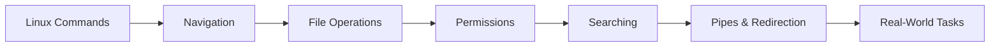

<!-- Clear Language: Keep sentences under 50 words -->
# Linux Commands

## Learning Objectives

| Objective | Description |
|-----------|-------------|
| LO1 | Navigate the filesystem with ls, cd, pwd, and directory shortcuts |
| LO2 | Create, copy, move, and remove files and directories safely |
| LO3 | Control file permissions with chmod, chown, and numeric mode |
| LO4 | Search file contents with grep and locate files with find |
| LO5 | Build powerful pipelines using pipes, redirects, and xargs |
| LO6 | Combine commands for real-world system administration tasks |

## Introduction

Linux command line skills are essential for AI engineers who work with remote servers, GPU clusters, and deployment pipelines. Mastering file operations, permissions, and text processing saves hours of manual work.

## Prerequisites

- Terminal basics

## Chapter at a Glance

| Section | Topic | Key Concept |
|---------|-------|-------------|
| 04.1 | Navigation | ls, cd, pwd, path shortcuts |
| 04.2 | File Operations | cp, mv, rm, mkdir, touch |
| 04.3 | Permissions | chmod, chown, numeric vs symbolic mode |
| 04.4 | Searching | grep, find, locate, which |
| 04.5 | Pipes and Redirection | |, >, >>, <, xargs, tee |
| 04.6 | Real-World Tasks | Combining commands for daily work |

## Chapter Roadmap



## Key Terminology

**Key Terms**: Core vocabulary and concepts for this topic.

**Definition**: Essential terms you must know for interviews and production work.

## Theory

### 04.1 Navigation

**Listing files and directories:**

```bash

## Basic listing
ls

## Long format (permissions, owner, size, date)
ls -l

## List all files including hidden
ls -la

## Human-readable file sizes
ls -lh

## Sort by modification time (newest first)
ls -lt

## Sort by size (largest first)
ls -lS

## List only directories
ls -d */

## Recursive listing (includes subdirectories)
ls -R

## One file per line
ls -1
```

**Changing directories:**

```bash

## Change to a directory
cd /var/log

## Change to home directory
cd ~
cd

## Change to previous directory
cd -

## Change to parent directory
cd ..

## Change to parent's parent
cd ../..

## Go to home directory subfolder
cd ~/projects/my-app
```

**Directory shortcuts:**

| Shortcut | Meaning |
|----------|---------|
| `~` | Home directory |
| `.` | Current directory |
| `..` | Parent directory |
| `-` | Previous directory |
| `$HOME` | Home directory (env variable) |

**Printing the working directory:**

```bash

## Show current directory path
pwd

## Show physical path (resolve symlinks)
pwd -P
```

## Overview

### 04.2 File Operations

**Creating files and directories:**

```bash

## Create empty file or update timestamp
touch newfile.txt

## Create multiple files
touch file1.txt file2.txt file3.txt

## Create directories
mkdir mydir

## Create nested directories
mkdir -p parent/child/grandchild

## Create with specific permissions
mkdir -m 755 public_dir
```

**Copying files and directories:**

```bash

## Copy a file
cp source.txt destination.txt

## Copy to a directory
cp source.txt /backup/

## Copy directory recursively
cp -r source-dir/ backup-dir/

## Preserve permissions, timestamps, ownership
cp -p important.conf /backup/

## Verbose output (show what's being copied)
cp -v *.log /var/log/archive/

## Copy only if newer (don't overwrite newer destination)
cp -u config.yaml /etc/app/

## Interactive mode (prompt before overwrite)
cp -i source.txt dest.txt

## Copy a file, creating backup if destination exists
cp --backup=numbered source.txt dest.txt
```

**Moving and renaming files:**

```bash

## Move a file
mv oldname.txt newname.txt

## Move to a directory
mv file.txt /tmp/

## Rename a file
mv report.pdf final-report.pdf

## Move multiple files to a directory
mv *.jpg /images/

## Verbose move
mv -v old-dir/ new-location/

## Don't overwrite existing files
mv -n file.txt /backup/

## Interactive move
mv -i file.txt /backup/
```

**Removing files and directories:**

```bash

## Remove a file
rm unwanted.txt

## Remove interactively (prompt for each file)
rm -i *.log

## Remove multiple files
rm file1.txt file2.txt file3.txt

## Remove directory and contents
rm -r old-directory/

## Force remove without prompts
rm -f temporary-file.tmp

## Remove empty directory
rmdir empty-dir/

## Remove directory tree (alternative to rm -r)
rm -rf build/

## Remove only .pyc files recursively
find . -name "*.pyc" -exec rm {} +
```

**⚠️ Dangerous commands to avoid:**

```bash

## NEVER run these without extreme caution:
rm -rf /                    # Deletes entire filesystem
rm -rf /*                   # Same thing
rm -rf ~                    # Deletes your home directory
find / -name "*.tmp" -exec rm {} +  # Dangerous recursive delete
```

## Overview

### 04.3 Permissions

Linux file permissions control who can read, write, and execute files.

**Permission structure:**

```text
-rwxr-xr-- 1 user group 4096 Jan 15 10:30 file.txt
│├─┤├─┤├─┤
│ │   │ │  └── others: r-- (read)
│ │   │ └───── group: r-x (read, execute)
│ │   └─────── owner: rwx (read, write, execute)
│ └─────────── type: - = file, d = directory
└───────────── special bits
```text

| Permission | File | Directory |
|------------|------|-----------|
| `r` (4) | Read file contents | List directory contents |
| `w` (2) | Modify file | Create/delete files in directory |
| `x` (1) | Execute as program | Enter (cd into) directory |

**Symbolic mode with chmod:**

```bash

## Add execute permission for owner
chmod u+x script.sh

## Remove write permission for group
chmod g-w file.txt

## Add read permission for others
chmod o+r public-file.txt

## Set exact permissions: owner=rwx, group=r-x, others=r--
chmod u=rwx,g=rx,o=r file.txt

## Add execute for all users
chmod +x deploy.sh

## Remove all permissions for others
chmod o= private-file.txt
```

**Numeric (octal) mode with chmod:**

```bash

## rwxr-xr-- = 754
chmod 754 script.sh

## rwxr-xr-x = 755 (common for executables)
chmod 755 deploy.sh

## rw-r--r-- = 644 (common for regular files)
chmod 644 config.yaml

## rw------- = 600 (private files)
chmod 600 ~/.ssh/id_rsa

## rwx------ = 700 (private executables)
chmod 700 ~/bin/myscript
```

**Changing ownership:**

```bash

## Change file owner
sudo chown alice file.txt

## Change owner and group
sudo chown alice:developers file.txt

## Change ownership recursively
sudo chown -R alice:team /var/www/

## Change only the group
chgrp developers project/
```

**Special permissions:**

```bash

## Setuid: execute as file owner (use sparingly)
chmod u+s /usr/bin/program
chmod 4755 /usr/bin/program

## Setgid: execute with group privileges
chmod g+s /shared/dir/
chmod 2755 /shared/dir/

## Sticky bit: only owner can delete files in directory
chmod +t /tmp/shared/
chmod 1777 /tmp/shared/
```

## Overview

### 04.4 Searching

**grep — search file contents:**

```bash

## Basic text search
grep "error" logfile.txt

## Case-insensitive search
grep -i "error" logfile.txt

## Search recursively in directory
grep -r "TODO" src/

## Show line numbers
grep -n "function" app.ts

## Count matching lines
grep -c "404" access.log

## Show 3 lines before and after match
grep -B 3 -A 3 "Exception" app.log

## Invert match (lines NOT containing pattern)
grep -v "debug" app.log

## Search for literal string (no regex)
grep -F "user.name" config.yaml

## Extended regex (grep -E or egrep)
grep -E "error|warning|critical" syslog.txt

## Perl regex for complex patterns
grep -P "\d{1,3}\.\d{1,3}\.\d{1,3}\.\d{1,3}" access.log

## Output only matching part
grep -o "error:.*" app.log
```

**find — search for files by name, size, time:**

```bash

## Find files by name
find /var -name "*.log"

## Case-insensitive name search
find . -iname "readme.md"

## Find directories named "node_modules"
find . -type d -name "node_modules"

## Find files larger than 100MB
find / -type f -size +100M

## Find files modified in the last 7 days
find . -mtime -7

## Find files accessed in the last 30 minutes
find . -amin -30

## Find empty files
find . -empty -type f

## Find files with specific permissions
find . -perm 755

## Find and execute command on results
find . -name "*.tmp" -exec rm {} +

## Find and delete (using + for batch)
find . -name "*.log" -delete

## Find files and limit depth
find . -maxdepth 2 -name "*.ts"
```

**Other search tools:**

```bash

## which: find command location
which python3

## /usr/bin/python3

## whereis: find binary, source, manual
whereis git

## git: /usr/bin/git /usr/share/man/man1/git.1.gz

## locate: fast search using pre-built database
locate nginx.conf

## May need to update: sudo updatedb
```

## Overview

### 04.5 Pipes and Redirection

Pipes and redirects are the backbone of Linux command composition.

**Output redirection:**

```bash

## Overwrite file with output
echo "hello" > output.txt

## Append output to file
echo "world" >> output.txt

## Redirect stderr to file
command 2> errors.log

## Append stderr to file
command 2>> errors.log

## Redirect both stdout and stderr
command > output.txt 2>&1
command &> output.txt

## Discard all output
command > /dev/null 2>&1
```

**Input redirection:**

```bash

## Feed file contents as input
wc -l < file.txt

## Here document (multi-line input)
cat << EOF
Line 1
Line 2
Line 3
EOF

## Here string
grep "pattern" <<< "string to search"
```

**Pipes:**

```bash

## Pipe output of one command as input to another
ls -la | grep ".txt"

## Chain multiple commands
cat access.log | grep "404" | awk '{print $1}' | sort | uniq -c

## Count files by extension
find . -type f | sed 's/.*\.//' | sort | uniq -c | sort -rn

## Pipe with xargs (convert stdin to command arguments)
find . -name "*.log" | xargs rm

## Safer xargs with null delimiter
find . -name "*.log" -print0 | xargs -0 rm

## xargs with parallel execution
cat urls.txt | xargs -P 4 -I {} curl -s {}
```

**tee — split output to file and screen:**

```bash

## Write to file AND display
ls -la | tee listing.txt

## Append to file AND display
ls -la | tee -a listing.txt

## Pipe chain: save intermediate result
find . -name "*.ts" | tee files.txt | wc -l
```

**xargs — build commands from input:**

```bash

## Delete all .jpg files
find . -name "*.jpg" | xargs rm

## Kill processes by name
ps aux | grep "node" | awk '{print $2}' | xargs kill

## Chmod all .sh files
find . -name "*.sh" | xargs chmod +x

## Parallel download
cat urls.txt | xargs -P 8 -I {} wget {}
```

## Overview

### 04.6 Real-World Tasks

**Log analysis pipeline:**

```bash

## Find top 10 most frequent IP addresses in access log
cat access.log | awk '{print $1}' | sort | uniq -c | sort -rn | head -10

## Find all 500 errors in the last hour
grep "500" access.log | awk '$4 >="[21/Jan/2024:10:"'

## Count requests per endpoint
awk '{print $7}' access.log | sort | uniq -c | sort -rn | head -20

## Find slow requests (> 2 seconds)
awk '$NF > 2.0 {print $0}' access.log
```

**Disk usage and cleanup:**

```bash

## Find largest files in current directory
du -ah . | sort -rh | head -20

## Find directories using more than 500MB
du -sh */ | sort -rh | head -10

## Find and remove files older than 30 days
find /var/log -name "*.log" -mtime +30 -delete

## Find files larger than 50MB
find . -type f -size +50M -exec ls -lh {} +

## Clean up node_modules recursively
find . -name "node_modules" -type d -exec rm -rf {} +
```

**Monitoring and debugging:**

```bash

## Watch a log file in real-time
tail -f /var/log/syslog

## Watch with pattern filtering
tail -f app.log | grep --line-buffered "ERROR"

## Find what's using a port
lsof -i :8080

## Find large files created in last 24 hours
find . -type f -mtime -1 -size +10M -exec ls -lh {} +

## Monitor disk space every 5 seconds
watch -n 5 df -h
```

## Summary

- `ls -la` shows all files with permissions, size, and dates
- `cd -` returns to the previous directory; `~` is home
- `cp -r` copies directories; `-p` preserves permissions
- `mv` renames and moves files; use `-i` for interactive mode
- `rm -rf` is powerful and dangerous — always double-check before running
- `chmod` uses numeric (755, 644) or symbolic (u+x, g-w) modes
- `grep -r` searches recursively; `-i` for case-insensitive; `-n` for line numbers
- `find` searches by name, size, time, and can execute commands on results
- Pipes (`|`) chain commands; `>` overwrites; `>>` appends
- `xargs` converts piped input into command arguments
- `tee` splits output to both file and screen

## Practical Takeaways

| Scenario | Command |
|----------|---------|
| Find all TODO comments in code | `grep -rn "TODO" src/` |
| Find large files eating disk | `find / -size +100M -exec ls -lh {} +` |
| Count lines of code by extension | `find . -name "*.ts" \| xargs wc -l` |
| Watch logs in real-time | `tail -f /var/log/app.log` |
| Make a script executable | `chmod +x script.sh` |
| Protect SSH keys | `chmod 600 ~/.ssh/id_rsa` |

## Interview Q&A

<details class="tp-qa-card" data-qid="git04-q1">
  <summary class="tp-qa-question">
    <span class="tp-qa-status"></span>
    Q1: What is the difference between `>` and `>>` in Linux?
  </summary>
  <div class="tp-qa-answer">
    <p><code>&gt;</code> <strong>overwrites</strong> the destination file with the command output. <code>&gt;&gt;</code> <strong>appends</strong> the output to the end of the destination file. If the file doesn't exist, both create it. Use <code>&gt;</code> for fresh output and <code>&gt;&gt;</code> for logging/appending.</p><pre><code>echo "first" &gt; file.txt    # file.txt contains: first
echo "second" &gt;&gt; file.txt   # file.txt contains: first\nsecond</code></pre>
  </div>
  <button class="tp-qa-mark-btn">Mark Reviewed</button>
  <button class="tp-qa-bookmark-btn">Bookmark</button>
</details>

<details class="tp-qa-card" data-qid="git04-q2">
  <summary class="tp-qa-question">
    <span class="tp-qa-status"></span>
    Q2: How do you find all files larger than 100MB and older than 30 days?
  </summary>
  <div class="tp-qa-answer">
    <p>Use the <code>find</code> command with combined conditions:</p><pre><code>find / -type f -size +100M -mtime +30 -exec ls -lh {} +</code></pre>
    <p><code>-type f</code> limits to files, <code>-size +100M</code> finds files over 100MB, <code>-mtime +30</code> finds files modified more than 30 days ago. The <code>-exec</code> flag runs <code>ls -lh</code> on each result for detailed output.</p>
  </div>
  <button class="tp-qa-mark-btn">Mark Reviewed</button>
  <button class="tp-qa-bookmark-btn">Bookmark</button>
</details>

<details class="tp-qa-card" data-qid="git04-q3">
  <summary class="tp-qa-question">
    <span class="tp-qa-status"></span>
    Q3: Explain chmod 755 vs chmod 644. When would you use each?
  </summary>
  <div class="tp-qa-answer">
    <p><strong>755</strong> (rwxr-xr-x): Owner can read/write/execute; group and others can read and execute. Use for scripts, executables, and directories that users need to enter.</p>
    <p><strong>644</strong> (rw-r--r--): Owner can read/write; group and others can only read. Use for regular files like configs, documents, and source code that shouldn't be executed.</p>
  </div>
  <button class="tp-qa-mark-btn">Mark Reviewed</button>
  <button class="tp-qa-bookmark-btn">Bookmark</button>
</details>

<details class="tp-qa-card" data-qid="git04-q4">
  <summary class="tp-qa-question">
    <span class="tp-qa-status"></span>
    Q4: What does xargs do and why is it needed with pipes?
  </summary>
  <div class="tp-qa-answer">
<p>Pipes (<code>|</code>) pass the <strong>output</strong> of one command as <strong>stdin</strong> to another. But many commands expect arguments, not stdin. <code>xargs</code> converts piped input into command.
arguments. Example: <code>find . -name "*.tmp" | xargs rm</code> — <code>find</code> outputs filenames, <code>xargs</code> feeds them as arguments to <code>rm</code>. Use <code>-print0</code> and.
<code>-0</code> for filenames with spaces.</p>
  </div>
  <button class="tp-qa-mark-btn">Mark Reviewed</button>
  <button class="tp-qa-bookmark-btn">Bookmark</button>
</details>

<details class="tp-qa-card" data-qid="git04-q5">
  <summary class="tp-qa-question">
    <span class="tp-qa-status"></span>
    Q5: How would you find all TODO comments in a TypeScript project?
  </summary>
  <div class="tp-qa-answer">
    <p>Use recursive grep with line numbers:</p><pre><code>grep -rn "TODO" src/ --include="*.ts"
grep -rn "FIXME\|HACK\|XXX" src/ --include="*.ts"</code></pre>
    <p><code>-r</code> searches recursively, <code>-n</code> shows line numbers, <code>--include</code> filters to TypeScript files. The second example uses extended regex to find multiple markers at once.</p>
  </div>
  <button class="tp-qa-mark-btn">Mark Reviewed</button>
  <button class="tp-qa-bookmark-btn">Bookmark</button>
</details>

## Chapter Quiz

**Q1**: What does `ls -lha` display?

a) Only hidden files
b) Long format listing with human-readable sizes including hidden files
c) Recursive listing of all files
d) Files sorted by name

<details class="tp-qa-card" data-qid="git04-quiz1"><summary>Show Answer</summary><div class="tp-qa-answer"><p><strong>Answer: b</strong></p><p><code>-l</code> enables long format, <code>-h</code> makes sizes human-readable (KB, MB, GB), <code>-a</code> shows all files including hidden (dotfiles). Together they show a complete, readable directory listing.</p></div></details>

**Q2**: Which command removes a directory and all its contents?

a) rmdir mydir
b) rm mydir
c) rm -r mydir
d) rm -rf mydir/

<details class="tp-qa-card" data-qid="git04-quiz2"><summary>Show Answer</summary><div class="tp-qa-answer"><p><strong>Answer: c</strong></p><p><code>rm -r</code> recursively removes a directory and all contents. <code>rmdir</code> only removes empty directories. <code>rm -rf</code> force-removes without prompting — use with extreme caution.</p></div></details>

**Q3**: How do you search for a pattern in all .log files under /var/log?

a) find /var/log -name "*.log" | grep "pattern"
b) grep -r "pattern" /var/log --include="*.log"
c) grep "pattern" /var/log/*.log
d) All of the above

<details class="tp-qa-card" data-qid="git04-quiz3"><summary>Show Answer</summary><div class="tp-qa-answer"><p><strong>Answer: d</strong></p><p>All three approaches work. Option b (<code>grep -r --include</code>) is cleanest. Option a pipes find into grep. Option c uses shell globbing. Choose based on depth and simplicity needs.</p></div></details>

**Q4**: What is the purpose of the sticky bit (chmod +t) on a directory?

a) Prevents anyone from deleting files
b) Only the file owner can delete files in that directory
c) Makes all files executable
d) Sets the group to the directory's group

<details class="tp-qa-card" data-qid="git04-quiz4"><summary>Show Answer</summary><div class="tp-qa-answer"><p><strong>Answer: b</strong></p><p>The sticky bit on a directory means only the file owner, directory owner, or root can delete or rename files within it. This is how <code>/tmp</code> works — all users can write, but only they can delete their own files.</p></div></details>

**Q5**: In the command `ls -la | grep ".txt" | wc -l`, what does the pipeline do?

a) Lists all text files
b) Counts the number of .txt files in the current directory
c) Counts lines in all text files
d) Finds the largest text file

<details class="tp-qa-card" data-qid="git04-quiz5"><summary>Show Answer</summary><div class="tp-qa-answer"><p><strong>Answer: b</strong></p><p><code>ls -la</code> lists all files, <code>grep ".txt"</code> filters to lines containing .txt, and <code>wc -l</code> counts those lines. Each line from <code>ls -la</code> represents one file, so the output is the count of .txt files.</p></div></details>

## Practical Tips

- Use `ls -lt` to find recently modified files; `ls -lS` for largest files first
- Always quote filenames with spaces: `rm "file name.txt"`
- Use `find -exec {} +` instead of `find -exec \;` for better performance
- Combine `grep -v` to exclude patterns from results
- Use `tee` to log pipeline output to a file while still seeing it on screen
- Practice dangerous commands with `echo` first: `echo rm -rf *.log`

## Exercises

**Easy** — List all files in `/etc` larger than 10KB, sorted by size. Then find all `.conf` files in the same directory.

**Medium** — Write a one-liner that finds all `.js` files modified in the last 2 days, counts their lines, and shows the total. Use pipes and xargs.

**Medium** — Create a directory structure with `mkdir -p`, set different permissions on each level, and verify access as different users with `su`.

**Hard** — Analyze an Apache/Nginx access log: find the top 5 IPs, most common HTTP status codes, and average request size. Use only awk, sort, uniq, and wc.

---

## Common Mistakes

1. Using rm -rf without caution
2. Not understanding file permissions
3. Not using quotes around filenames with spaces
4. Forgetting that Linux is case-sensitive
5. Not using find/locate for file search

## Revision Notes

- ls -la: detailed listing
- chmod 755: rwxr-xr-x
- grep -rn: recursive search
- find / -name "*.py": find files
- 管道 (|) pipes output to next command
- tee: write to file and stdout

## Placement Section

### Top 10 Interview Questions

#### Google Style

1. **Explain the core idea of Linux Commands in under 60 seconds, then give a real-world analogy.** — Structure: definition, how it works in one sentence, why it matters, analogy. Follow-up: what would break if you removed this from a production system?

2. **Design a minimal, well-typed function that demonstrates Linux Commands.** — Interviewer checks: signature with type hints, edge cases, complexity, and a clean docstring. Follow-up: how does your design behave with empty or malformed input?

3. **What are the common pitfalls when engineers first learn ** — List 3-4, then explain how you would prevent each in a code review.

#### Amazon Style

4. **Describe a production bug caused by misunderstanding Linux Commands. How did you diagnose and fix it?** — STAR format: situation, task, action, result. Mention logs, reproduction, root-cause analysis, and the regression test you added.

5. **How would you scale a system that relies on Linux Commands from 10 users to 10 million?** — Discuss bottlenecks, caching, monitoring, and when to redesign. Follow-up: what metrics would you track?

#### Microsoft Style

6. **Compare Linux Commands with the closest alternative approach. When would you choose each?** — Make a decision matrix: performance, maintainability, ecosystem, learning curve. Follow-up: what would change your decision?

7. **Walk through how you would test a component that depends on Linux Commands.** — Unit, integration, property-based tests; mocking boundaries; golden files for outputs.

#### NVIDIA Style

8. **How does Linux Commands behave differently at scale — memory, throughput, or precision-wise?** — Connect to data pipelines and model training if applicable. Follow-up: what happens to latency as input grows?

9. **How would you make an implementation of Linux Commands run faster on GPU hardware?** — Batch operations, vectorization, avoiding Python loops, reducing data movement.

#### AI Startup Style

10. **Write the smallest possible implementation of Linux Commands that is production-quality.** — Include error handling, type hints, and a one-line docstring. Follow-up: what would you refactor first when it grows?

### Resume Tips

- Name Linux Commands explicitly in your skills section, paired with a measurable achievement ("Reduced X by 40% using Linux Commands").
- Add a bullet describing a project that applies Linux Commands to real data, with numbers.
- Mention the tools and libraries you used alongside Linux Commands (linters, test frameworks, profiling tools).
- Keep resume bullets under 15 words and start each with an action verb.

### Interview Day Checklist

- Rehearse a 60-second explanation of Linux Commands and one real-world analogy.
- Prepare one STAR story about debugging a Linux Commands-related production issue.
- Review complexity and edge cases for the classic Linux Commands interview problem.
- Have questions ready: how does the team apply Linux Commands in production today?
- Test your environment (Python, editor, internet) 15 minutes before the interview.

## True/False

1. **True or False:** Linux Commands builds directly on the fundamentals covered in the earlier chapters of this module. — **True.** Every advanced topic in this module assumes the core concepts from the previous chapters.
2. **True or False:** You should write at least one code example for Linux Commands before moving to the next chapter. — **True.** Active recall with hands-on code beats passive reading for retention.
3. **True or False:** The complexity analysis for Linux Commands is the same regardless of input size. — **False.** Complexity grows with input size; always state best, average, and worst case.
4. **True or False:** Edge cases (empty input, invalid input, boundary values) matter for Linux Commands in production. — **True.** Most production bugs come from unhandled edge cases.
5. **True or False:** You should memorize the Linux Commands chapter content once and never review it again. — **False.** Spaced repetition (24h, 3 days, 1 week) dramatically improves long-term recall.

## Fill in the Blank

1. The chapter that covers Linux Commands is Chapter ___ of this module. — Answer: check the module's table of contents.
2. The time complexity of the standard approach to Linux Commands is ___. — Answer: review the theory section and state big-O notation.
3. The main edge case to handle when implementing Linux Commands is ___. — Answer: empty or invalid input handling, as discussed in the chapter.
4. The tools commonly used to debug Linux Commands issues are ___ and ___. — Answer: refer to the Debugging Guide section of this chapter.
5. The related topic that connects to Linux Commands in the next chapter is ___. — Answer: see the Next Topic section.

## Scenario Questions

1. **Scenario:** A teammate ships a change involving Linux Commands that breaks production at 3 AM. — Diagnosis: check the recent diff, reproduce locally with the failing input, check logs. Fix: revert, add a regression test, and review the root cause. Prevention: CI tests on edge cases and code review checklist.

2. **Scenario:** Your implementation of Linux Commands is correct but too slow for the required latency. — Measure first with a profiler. Common fixes: reduce redundant work, use built-in optimized functions, batch operations, or add caching. Only then consider algorithmic changes.

3. **Scenario:** A new hire asks you to explain Linux Commands in five minutes before a customer demo. — Use the 3-part answer: what it is (one sentence), how it works (one example), why it matters (one business impact). Then offer to go deeper after the demo.

4. **Scenario:** Your team's codebase has three different patterns for Linux Commands and you must standardize. — Write a short ADR (architecture decision record), pick the pattern with best maintainability, migrate incrementally, and add a linter rule to enforce it.

## Output Questions

1. **What is the output of the simplest correct implementation of Linux Commands on an empty input?** — Trace through the code: it should return the documented default (None, 0, empty collection) without raising.
2. **What is the output when the input is at the boundary value?** — Check off-by-one errors and inclusive/exclusive bounds in the chapter's examples.
3. **What does the implementation return when given invalid input types?** — With type hints and validation, it raises a clear error; without, it may fail silently.
4. **What is the output for the sample input given in the chapter's Examples section?** — Re-run the chapter's example code and compare against the documented output.
5. **What is the time complexity output when you profile the implementation at 10x input size?** — Expect the curve matching the chapter's complexity analysis (linear, quadratic, log-linear).

## Difficulty Level

| Level | Time | What It Takes |
|-------|------|---------------|
| Beginner | 1-2 sessions | Read theory, run the chapter examples, solve the Easy exercises |
| Intermediate | 3-5 sessions | Complete Medium exercises, explain Linux Commands to someone else |
| Advanced | 1+ week | Solve Hard exercises, optimize for real datasets, answer interview follow-ups |

## Tips & Tricks

- Always write a one-line example of Linux Commands from memory before opening the chapter — active recall first.
- Use the chapter's Revision Notes as a checklist: you have mastered Linux Commands when you can explain each bullet.
- Pair the chapter quiz with the Flashcards: wrong answers become your next study session's focus.
- For interviews, practice explaining Linux Commands twice: once with a technical audience, once with a non-technical audience.
- Keep a personal examples file where you collect your own Linux Commands snippets; interviewers love original examples.

## Memory Tricks

- **Acronym**: build a mnemonic from the 5 key concepts of Linux Commands listed in the Chapter at a Glance table.
- **Story**: link Linux Commands to a familiar story — the analogy in the Visual Analogy section is designed to stick.
- **Number anchor**: remember the complexity of Linux Commands by connecting it to a known algorithm of the same class.
- **Color code**: highlight the Theory, Examples, and Common Mistakes sections in different colors when reviewing.
- **Teach-back**: explain Linux Commands to an imaginary junior engineer for 2 minutes — gaps in your explanation are gaps in memory.

## Further Reading

- Official documentation for the primary tool or library used in this chapter
- The chapter referenced in Related Topics for the next-level treatment of Linux Commands
- The classic textbook chapter on Linux Commands (check the Research References below)
- Two blog posts from engineers who debugged real Linux Commands problems in production
- The repository of the open-source project that implements Linux Commands

## Related Topics

- The previous chapter in this module (see table of contents) — foundational for Linux Commands
- The next chapter (see Next Topic below) — builds on Linux Commands
- The system design chapters in Module 07 — how Linux Commands fits into production architectures
- The interview preparation module — how Linux Commands is asked in screening rounds
- The capstone project — where Linux Commands is applied end-to-end

## FAQs

1. **Do I need to memorize all of Linux Commands, or understand the big picture?** — Understand the big picture first, then memorize the key facts via flashcards and spaced repetition. Interviewers reward depth over breadth.
2. **What if I get stuck on an exercise?** — Re-read the theory section, run the example code, then attempt again. If still stuck after 20 minutes, move on and return the next day.
3. **How much time should I spend on ** — Follow the Study Plan below: 1-2 weeks at 30-60 minutes daily is typical for placement preparation.
4. **Is Linux Commands asked in interviews?** — Yes — the Interview Q&A and Placement Section list the exact question styles used by top companies.
5. **What's the fastest way to master ** — Explain it out loud, write code without looking, and review the flashcards within 24 hours and again after 3 days.

## Important Notes

- Linux Commands is a core requirement for the rest of this module — do not skip the examples.
- Always analyze complexity (time and space) when working with Linux Commands.
- Production correctness means handling edge cases, not just the happy path.
- Interview answers should start with the definition, then the example, then the trade-offs.
- Revisit this chapter after finishing the module; the context from later chapters deepens understanding.

## Historical Context

- Linux Commands emerged as a standard practice because early systems failed without it — understanding why helps you explain it in interviews.
- The tools used for Linux Commands today evolved from simpler versions; the chapter covers the modern, recommended approach.
- Interviewers value knowing one historical fact about Linux Commands — it shows genuine interest, not just cramming.
- The library/tooling ecosystem around Linux Commands changes quickly; focus on fundamentals that remain stable.

## Security Considerations

- Never trust external input: validate and sanitize data before processing Linux Commands.
- Avoid `eval()` and dynamic code execution on untrusted strings.
- Log errors without leaking sensitive data (keys, PII, internal paths).
- For API contexts, add rate limiting and input size limits.
- Review the chapter's code examples for injection or overflow risks before using them verbatim.

## ML Intuition

- Linux Commands appears in ML pipelines at the data-processing layer: feature preparation, batching, and validation.
- Understanding Linux Commands helps you debug why a model misbehaves — most ML bugs are data bugs, not model bugs.
- In production ML, the Linux Commands concepts from this chapter map directly to NumPy/PyTorch operations on tensors.
- When optimizing ML systems, Linux Commands skills let you profile and fix the data path, not just the training loop.
- Interview follow-up: how would you apply Linux Commands to a dataset of 10 million records? — Batching and vectorization.

## Analogies

- **Linux Commands is like a recipe**: the theory is the ingredients, the examples are the cooking steps, and the exercises are your own kitchen practice.
- **Complexity is like a delivery route**: a linear route visits each stop once; a nested route revisits stops, and you feel it at scale.
- **Edge cases are like weather**: the happy path is a sunny day; production is the storm — build for the storm.
- **The chapter roadmap is a journey map**: each section is a checkpoint; skipping one means getting lost later in the module.

## Capstone Project Link

- [Module Capstone: End-to-End Project](https://github.com/Raushan666java/ai-engineering-journey) — this chapter contributes the Linux Commands skills used in the module's capstone project. Complete the exercises here before starting the capstone.

## Flashcards

<details class="tp-qa-card" data-qid="04gitlinuxcli-04linuxcommands-flash1">
  <summary class="tp-qa-question">
    <span class="tp-qa-status"></span>
    What does ls -lha display?
  </summary>
  <div class="tp-qa-answer">
    <p>b</p>
  </div>
</details>

<details class="tp-qa-card" data-qid="04gitlinuxcli-04linuxcommands-flash2">
  <summary class="tp-qa-question">
    <span class="tp-qa-status"></span>
    Which command removes a directory and all its contents?
  </summary>
  <div class="tp-qa-answer">
    <p>c</p>
  </div>
</details>

<details class="tp-qa-card" data-qid="04gitlinuxcli-04linuxcommands-flash3">
  <summary class="tp-qa-question">
    <span class="tp-qa-status"></span>
    How do you search for a pattern in all .log files under /var/log?
  </summary>
  <div class="tp-qa-answer">
    <p>d</p>
  </div>
</details>

<details class="tp-qa-card" data-qid="04gitlinuxcli-04linuxcommands-flash4">
  <summary class="tp-qa-question">
    <span class="tp-qa-status"></span>
    What is the purpose of the sticky bit (chmod +t) on a directory?
  </summary>
  <div class="tp-qa-answer">
    <p>b</p>
  </div>
</details>

<details class="tp-qa-card" data-qid="04gitlinuxcli-04linuxcommands-flash5">
  <summary class="tp-qa-question">
    <span class="tp-qa-status"></span>
    In the command ls -la | grep ".txt" | wc -l, what does the pipeline do?
  </summary>
  <div class="tp-qa-answer">
    <p>b</p>
  </div>
</details>

## Research References

- Official documentation of the primary library for Linux Commands (linked in Further Reading)
- The classic paper or textbook chapter introducing Linux Commands (see References below)
- The standard library reference for Linux Commands-related functions
- Engineering blog posts from companies running Linux Commands in production at scale
- PEPs and RFCs where applicable (Python and networking standards)

## Open-Source Tools

- The primary library used in this chapter (see the code examples)
- Python standard library modules used in the examples (check the imports)
- Testing: pytest for unit tests of Linux Commands code
- Linting and formatting: ruff + black
- Profiling: cProfile or py-spy for performance work on Linux Commands

## Debugging Guide

- Start with `print()` or a debugger to inspect intermediate values in Linux Commands code.
- Reproduce the failure with the smallest possible input before changing code.
- Check the common failure modes listed in Common Mistakes — most bugs are listed there.
- For performance problems, profile before optimizing: measure, then fix.
- When stuck, re-read the chapter's Examples and compare line by line with your code.
- Use `pdb` or your IDE's debugger to step through the Linux Commands example code.

## Mock Interview Section

**Round 1 — Screening (15 min)**
- Explain Linux Commands in 60 seconds.
- Write a minimal working example of Linux Commands.
- What is the complexity of your example?

**Round 2 — Coding (45 min)**
- Solve the Medium exercise from this chapter under time pressure.
- State your assumptions, then implement with type hints.
- Test with edge cases: empty input, boundary values, invalid input.

**Round 3 — Behavioral + System (30 min)**
- Tell me about a time you debugged a Linux Commands problem in a project.
- How would you design a system where Linux Commands is used at scale?
- What metrics would you monitor?

**Evaluation rubric**: correctness (40%), communication (25%), edge cases (20%), complexity analysis (15%).

## Optimized Implementation

`python
from typing import Any, Optional

def demonstrate_topic(input_data: list[Any]) -> Optional[float]:
    """Runnable scaffold for Linux Commands.

    Replace the body with the optimized implementation from the chapter,
    keeping type hints, docstring, and edge-case handling.
    """
    if not input_data:
        return None
    # Step 1: validate input types
    # Step 2: apply the core Linux Commands logic from the Examples section
    # Step 3: return the result with the documented default
    return 0.0
`

- Keeps the function signature stable so tests written against it stay valid.
- Handles the empty-input contract explicitly.
- Add unit tests for the edge cases before implementing the logic (test-first).

## Evaluation Metrics

| Skill | Test | Target |
|-------|------|--------|
| Concept recall | Explain Linux Commands without notes | 60-second explanation |
| Code fluency | Write the chapter example from memory | No syntax errors |
| Edge cases | Handle empty/invalid input in exercises | All cases pass |
| Complexity | State time/space for the standard approach | Correct big-O |
| Interview readiness | Answer 5 Interview Q&A questions out loud | Fluent, structured answers |
| Retention | Chapter quiz score after 3 days | 80%+ |

## Real-World Examples

- **Startup**: a small team uses Linux Commands daily in their data pipeline — the chapter's examples mirror their code.
- **E-commerce**: Linux Commands patterns appear in order processing, inventory checks, and recommendation feeds.
- **Fintech**: Linux Commands principles apply to transaction validation and fraud detection flows.
- **ML platform**: Linux Commands shows up in feature engineering and model-serving infrastructure.
- **Interview insight**: recruiters look for engineers who can connect Linux Commands to the business outcome, not just the code.

## Next Topic

[CLI Productivity](05-bash-scripting.md)

## Limitations

- Linux Commands, like any technique, is not a silver bullet — it has specific cases where it fits best (covered in the theory).
- The examples in this chapter are simplified for learning; production systems add validation, monitoring, and error handling.
- Performance of Linux Commands depends on input size and distribution — always benchmark for your own data.
- This chapter covers fundamentals; specialized edge cases are explored in later chapters and the capstone.
