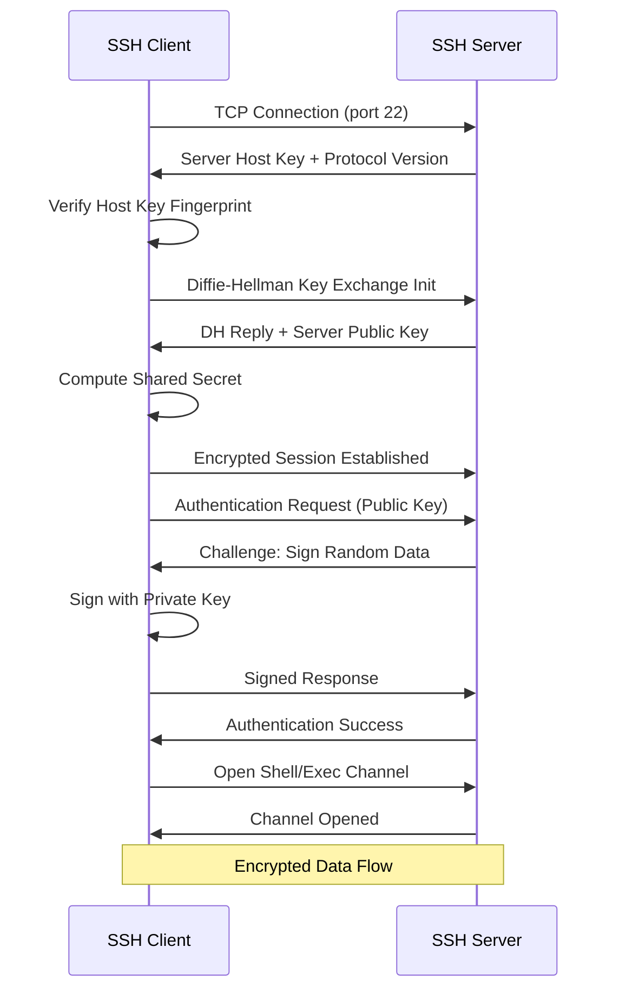
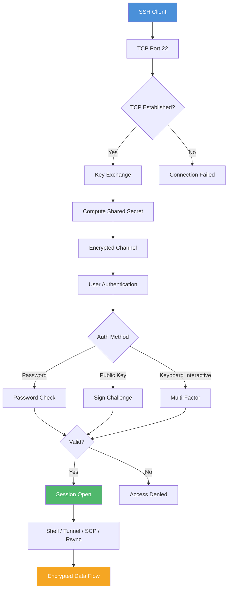

<!-- Clear Language: Keep sentences under 50 words -->
# SSH & Remote Access — Secure Shell, Key Management, Tunneling

## Learning Objectives

| Objective | Description |
|-----------|-------------|
| LO1 | Understand SSH protocol architecture and handshake flow |
| LO2 | Generate and manage SSH keys (Ed25519, RSA) with ssh-agent |
| LO3 | Configure SSH client and server using config files |
| LO4 | Set up port forwarding, SSH tunnels, and jump hosts |
| LO5 | Transfer files securely using scp and rsync |
| LO6 | Apply SSH for secure remote access in AI/ML workflows |

## Introduction

SSH (Secure Shell) is the standard protocol for secure remote access to servers, containers, and cloud instances. AI engineers use SSH daily to access training machines, deploy models, transfer datasets, and manage infrastructure.

## Prerequisites

- Basic Linux command line knowledge
- Understanding of TCP/IP and port numbers
- Familiarity with terminal and shell environments

## Key Terminology

**Key Terms**: Core vocabulary and concepts for this topic.

**Definition**: Essential terms you must know for interviews and production work.

## Theory

### SSH Protocol Architecture

SSH operates on a client-server model using TCP port 22 by default. The protocol has three layers:

1. **Transport Layer** — Server authentication, key exchange, encryption, integrity
2. **User Authentication Layer** — Verifies the client to the server (password, public key, keyboard-interactive)
3. **Connection Layer** — Multiplexes multiple channels over one connection (shell, exec, tunnel, X11)

### SSH Handshake Flow



**Key exchange algorithms**: Diffie-Hellman (DH), Elliptic Curve DH (ECDH), Curve25519.

**Symmetric ciphers**: AES-256-GCM, ChaCha20-Poly1305, AES-128-CTR.

**Host key types**: RSA (2048/4096 bit), ECDSA (256/384/521 bit), Ed25519 (256 bit).

### SSH Key Generation

Ed25519 is the recommended key type — faster, smaller, and more secure than RSA.

```bash
# Generate Ed25519 key (recommended)
ssh-keygen -t ed25519 -C "user@example.com"

# Generate RSA key (for legacy systems)
ssh-keygen -t rsa -b 4096 -C "user@example.com"

# Specify custom file location
ssh-keygen -t ed25519 -f ~/.ssh/github-key -C "github@example.com"

# View key fingerprint
ssh-keygen -lf ~/.ssh/id_ed25519

# View key in visual (ASCII art) format
ssh-keygen -lvf ~/.ssh/id_ed25519
```

**Key types comparison**:

| Type | Bit Length | Security | Speed | Compatibility |
|------|-----------|----------|-------|---------------|
| Ed25519 | 256 | High | Fast | Modern systems only |
| RSA | 4096 | High | Slow | Universal |
| ECDSA | 256/384 | High | Fast | Most systems |
| DSA | 1024 | Low | Slow | Deprecated |

### SSH Agent

ssh-agent holds decrypted private keys in memory so you don't re-enter passphrases.

```bash
# Start ssh-agent in background
eval "$(ssh-agent -s)"

# Add default key
ssh-add ~/.ssh/id_ed25519

# Add key with timeout (1 hour)
ssh-add -t 3600 ~/.ssh/id_ed25519

# List loaded keys
ssh-add -l

# List with fingerprints
ssh-add -L

# Remove all keys
ssh-add -D

# Automatic agent on macOS (keychain)
ssh-add --apple-use-keychain ~/.ssh/id_ed25519
```

**Agent forwarding** forwards your local agent to remote servers:

```bash
# Enable agent forwarding
ssh -A user@remote-server

# In SSH config
Host *
  ForwardAgent yes
```

**Warning**: Only use agent forwarding with trusted servers. An attacker with root on the remote can use your agent.

### SSH Config File

The config file at `~/.ssh/config` simplifies connections with host aliases and options.

```text
# Default settings for all hosts
Host *
  AddKeysToAgent yes
  UseKeychain yes
  ServerAliveInterval 60
  ServerAliveCountMax 3
  Compression yes
  LogLevel INFO

# GitHub
Host github.com
  HostName github.com
  User git
  IdentityFile ~/.ssh/github-key
  IdentitiesOnly yes

# EC2 instance with short alias
Host ml-server
  HostName ec2-54-123-45-67.compute-1.amazonaws.com
  User ubuntu
  Port 22
  IdentityFile ~/.ssh/ml-key.pem
  ForwardAgent no
  LocalForward 8888 localhost:8888

# Jump host pattern
Host jump-server
  HostName jump.example.com
  User admin
  IdentityFile ~/.ssh/jump-key

Host internal-*
  User appuser
  IdentityFile ~/.ssh/internal-key
  ProxyJump jump-server
  ForwardAgent no

# Bastion host direct connection
Host bastion
  HostName bastion.example.com
  User admin
  IdentityFile ~/.ssh/bastion-key
  LocalForward 5432 database.internal:5432

# Match patterns
Host *.compute.amazonaws.com
  User ec2-user
  IdentityFile ~/.ssh/aws-key.pem
  StrictHostKeyChecking no
```

**Config file directives**:

| Directive | Purpose |
|-----------|---------|
| HostName | Actual hostname to connect to |
| User | Default username |
| Port | Non-standard port |
| IdentityFile | Path to private key |
| IdentitiesOnly | Only use specified identities |
| ProxyJump | Connect via jump host |
| LocalForward | Local port forwarding |
| RemoteForward | Remote port forwarding |
| ServerAliveInterval | Keep connection alive |

### SSH into Servers

```bash
# Basic connection
ssh user@hostname

# Custom port
ssh -p 2222 user@hostname

# Using config alias
ssh ml-server

# With key explicitly
ssh -i ~/.ssh/custom-key user@hostname

# Verbose debugging
ssh -vvv user@hostname

# Run command and exit
ssh user@hostname "df -h && free -m"

# Copy public key to server
ssh-copy-id user@hostname

# Force password auth
ssh -o PreferredAuthentications=password user@hostname

# Disable host key checking (insecure, dev only)
ssh -o StrictHostKeyChecking=no user@hostname
```

### Port Forwarding & Tunneling

SSH tunneling creates encrypted tunnels for other protocols.

**Local port forwarding** — Forward local port to remote:

```bash
# Access remote service via local port
ssh -L 8888:localhost:8888 user@remote-server

# Access remote database
ssh -L 5432:database.internal:5432 user@bastion

# Multiple forwards
ssh -L 8080:web.internal:80 -L 5432:db.internal:5432 user@bastion
```

**Remote port forwarding** — Expose local service on remote:

```bash
# Make local server accessible from remote
ssh -R 9000:localhost:3000 user@public-server

# Expose local dev server to internet via VPS
ssh -R 80:localhost:8080 user@vps
```

**Dynamic port forwarding** (SOCKS proxy):

```bash
# Create SOCKS5 proxy on local port 1080
ssh -D 1080 user@remote-server

# Use with browser: set SOCKS proxy to localhost:1080
# All traffic routes through remote server
```

**SSH jump hosts**:

```bash
# Connect through a bastion host
ssh -J user@bastion user@internal-server

# Multiple jumps
ssh -J user@jump1,jump2 user@target

# Using config (ProxyJump)
ssh internal-server  # Uses config setting
```

### SCP & Rsync

**Secure copy (scp)**:

```bash
# Copy file to remote
scp file.txt user@remote:/path/

# Copy directory recursively
scp -r /local/dir user@remote:/remote/path/

# Copy from remote to local
scp user@remote:/remote/file.txt /local/

# Copy between two remotes
scp user1@host1:/file user2@host2:/

# Use specific key
scp -i ~/.ssh/key.pem file.txt user@remote:/

# Preserve permissions and timestamps
scp -p file.txt user@remote:/
```

**Rsync** (efficient, delta-transfer):

```bash
# Basic sync
rsync -av source/ user@remote:/dest/

# Archive mode (preserve all attributes)
rsync -az source/ user@remote:/dest/

# Show progress during transfer
rsync -avh --progress source/ user@remote:/dest/

# Dry run (show what would be transferred)
rsync -av --dry-run source/ user@remote:/dest/

# Delete files at destination not in source
rsync -av --delete source/ user@remote:/dest/

# Exclude patterns
rsync -av --exclude='*.tmp' --exclude='node_modules/' source/ user@remote:/dest/

# Bandwidth limit
rsync -av --bwlimit=1000 source/ user@remote:/dest/

# Compress during transfer
rsync -az source/ user@remote:/dest/

# Remote to local
rsync -av user@remote:/source/ /local/dest/

# Incremental backup with hard links
rsync -av --link-dest=/backup/yesterday /data/ user@remote:/backup/today/
```

**Rsync vs SCP**:

| Feature | rsync | scp |
|---------|-------|-----|
| Delta transfer | Yes | No |
| Resume interrupted | Yes | No |
| Compression | Yes (`-z`) | Yes (`-C`) |
| Preserve attributes | Yes (`-a`) | Yes (`-p`) |
| Bandwidth throttle | Yes | No |
| Delete at dest | Yes | No |

### SSH Security Hardening

Server-side configuration (`/etc/ssh/sshd_config`):

```text
# Disable root login
PermitRootLogin no

# Disable password authentication (keys only)
PasswordAuthentication no

# Use only Ed25519 or RSA keys
PubkeyAuthentication yes
PubkeyAcceptedAlgorithms ssh-ed25519,rsa-sha2-512

# Change default port (security through obscurity)
Port 2222

# Limit users who can SSH
AllowUsers alice bob

# Disable agent forwarding globally
AllowAgentForwarding no

# Disable X11 forwarding if not needed
X11Forwarding no

# Maximum auth attempts (prevents brute force)
MaxAuthTries 3

# Client alive interval
ClientAliveInterval 300
ClientAliveCountMax 2

# Use strong ciphers and MACs
Ciphers chacha20-poly1305@openssh.com,aes256-gcm@openssh.com
MACs hmac-sha2-512-etm@openssh.com,hmac-sha2-256-etm@openssh.com

# Log level
LogLevel VERBOSE
```

### SSH in AI Engineering Workflows

**Remote ML training**:

```bash
# Tunnel Jupyter notebook from remote
ssh -L 8888:localhost:8888 ml-server

# Tunnel TensorBoard
ssh -L 6006:localhost:6006 ml-server

# Copy datasets with rsync
rsync -az --progress datasets/ ml-server:/data/datasets/

# Run training script remotely
ssh ml-server "cd /project && python train.py --config config.yaml"

# Pull results
rsync -az ml-server:/project/outputs/ /local/results/

# Multi-GPU cluster access
ssh -J bastion cluster-master
```

**Container/Kubernetes access**:

```bash
# SSH into a running container
kubectl exec -it pod-name -- /bin/bash

# Port-forward a pod
kubectl port-forward pod-name 8080:80

# SSH tunnel to Kubernetes API
ssh -L 6443:localhost:6443 admin@cluster-master
```

### SSH Tunneling for Model Serving

```bash
# Access ML model API through SSH tunnel
ssh -L 8080:internal-model-server:8080 bastion

# Now access locally: http://localhost:8080/predict

# Secure database tunnel for feature store
ssh -L 5432:feature-store.internal:5432 bastion

# Tunnel with auto-reconnect (autossh)
autossh -M 0 -o "ServerAliveInterval 30" -o "ServerAliveCountMax 3" \
  -L 8888:localhost:8888 ml-server
```

## Visual Explanation



## Real Example

Think of SSH like a secure armored car service. Your laptop is the sender, the server is the recipient. The TCP connection is the road. Key exchange is verifying the driver's identity with a tamper-proof ID. The shared secret is a unique code only the two of you know. The encrypted channel is the armored vehicle — anyone on the road can see the vehicle, but they can't see what's inside. Authentication is showing your ticket before boarding. Port forwarding is like having a secure tunnel from your office directly to a specific room in the remote building.

## Code Example

```python
#!/usr/bin/env python3
"""SSH automation with paramiko for remote ML workflows"""

import paramiko
import os
from typing import Optional, List, Tuple


class SSHManager:
    """Manage SSH connections for remote ML training"""

    def __init__(self, hostname: str, username: str, key_path: str, port: int = 22):
        self.hostname = hostname
        self.username = username
        self.key_path = key_path
        self.port = port
        self.client: Optional[paramiko.SSHClient] = None

    def connect(self) -> None:
        """Establish SSH connection with key-based auth"""
        self.client = paramiko.SSHClient()
        self.client.set_missing_host_key_policy(paramiko.AutoAddPolicy())
        key = paramiko.Ed25519Key.from_private_key_file(self.key_path)
        self.client.connect(
            hostname=self.hostname,
            port=self.port,
            username=self.username,
            pkey=key,
            timeout=30
        )
        print(f"[+] Connected to {self.username}@{self.hostname}:{self.port}")

    def execute(self, command: str) -> Tuple[str, str]:
        """Run command on remote server and return stdout, stderr"""
        stdin, stdout, stderr = self.client.exec_command(command, timeout=300)
        exit_code = stdout.channel.recv_exit_status()
        out = stdout.read().decode().strip()
        err = stderr.read().decode().strip()
        if exit_code != 0:
            print(f"[-] Exit code {exit_code}: {err}")
        return out, err

    def transfer_file(self, local_path: str, remote_path: str, direction: str = "upload") -> None:
        """Transfer files using SFTP"""
        sftp = self.client.open_sftp()
        try:
            if direction == "upload":
                sftp.put(local_path, remote_path)
                print(f"[+] Uploaded {local_path} -> {remote_path}")
            else:
                sftp.get(remote_path, local_path)
                print(f"[+] Downloaded {remote_path} -> {local_path}")
        finally:
            sftp.close()

    def create_tunnel(self, local_port: int, remote_host: str, remote_port: int) -> None:
        """Create local port forwarding tunnel"""
        transport = self.client.get_transport()
        transport.request_port_forward("", local_port)
        channel = transport.open_channel(
            "direct-tcpip",
            (remote_host, remote_port),
            ("localhost", local_port)
        )
        print(f"[+] Tunnel: localhost:{local_port} -> {remote_host}:{remote_port}")

    def close(self) -> None:
        if self.client:
            self.client.close()
            print("[+] Connection closed")


if __name__ == "__main__":
    ssh = SSHManager(
        hostname="ec2-54-123-45-67.compute-1.amazonaws.com",
        username="ubuntu",
        key_path=os.path.expanduser("~/.ssh/ml-key.pem")
    )
    ssh.connect()

    # Check GPU status
    out, _ = ssh.execute("nvidia-smi --query-gpu=name,memory.used --format=csv")
    print(f"GPU Info:\n{out}")

    # Check disk space
    out, _ = ssh.execute("df -h /data")
    print(f"Disk:\n{out}")

    # Upload training script
    ssh.transfer_file("train.py", "/home/ubuntu/project/train.py")

    # Start training
    out, _ = ssh.execute("cd /home/ubuntu/project && python train.py --epochs 10 2>&1 | tail -5")
    print(f"Training output:\n{out}")

    ssh.close()
```

**Expected Output**:
```text
[+] Connected to ubuntu@ec2-54-123-45-67.compute-1.amazonaws.com:22
GPU Info:
name, memory.used [MiB]
Tesla T4, 512 MiB
Disk:
Filesystem      Size  Used Avail Use% Mounted on
/dev/nvme0n1p1  200G   45G  155G  23% /data
[+] Uploaded train.py -> /home/ubuntu/project/train.py
Training output:
Epoch 10/10, Loss: 0.0234, Acc: 0.9812
[+] Connection closed
```

## Interview Questions

<details class="tp-qa-card" data-qid="git07-q1">
  <summary class="tp-qa-question">
    <span class="tp-qa-status"></span>
    Q1: How does the SSH key exchange work and what makes it secure?
  </summary>
  <div class="tp-qa-answer">
    <p>SSH key exchange uses Diffie-Hellman (DH) or ECDH to establish a shared secret over an insecure channel. The server sends its host key. Both parties generate ephemeral key pairs and exchange public values. Each computes the shared secret using their private key and the other's public value. The shared secret is then hashed with the session ID to derive symmetric encryption keys. This provides perfect forward secrecy — even if the server's long-term host key is compromised, past session keys remain secure because ephemeral keys are never stored.</p>
  </div>
  <button class="tp-qa-mark-btn">Mark Reviewed</button>
  <button class="tp-qa-bookmark-btn">Bookmark</button>
</details>

<details class="tp-qa-card" data-qid="git07-q2">
  <summary class="tp-qa-question">
    <span class="tp-qa-status"></span>
    Q2: Why is Ed25519 recommended over RSA for SSH keys?
  </summary>
  <div class="tp-qa-answer">
    <p>Ed25519 offers multiple advantages: <strong>1) Speed</strong> — signing and verification are ~10x faster than RSA 4096. <strong>2) Size</strong> — 256-bit keys vs 4096-bit RSA, smaller public keys transfer faster. <strong>3) Security</strong> — provides 128-bit security level (equivalent to RSA 3072+). <strong>4) Deterministic</strong> — no random number generator needed for signing, avoiding RNG vulnerabilities. <strong>5) Side-channel resistance</strong> — constant-time execution prevents timing attacks. The only downside is compatibility: older systems (pre-2014) may not support Ed25519, in which case RSA 4096 is the fallback.</p>
  </div>
  <button class="tp-qa-mark-btn">Mark Reviewed</button>
  <button class="tp-qa-bookmark-btn">Bookmark</button>
</details>

<details class="tp-qa-card" data-qid="git07-q3">
  <summary class="tp-qa-question">
    <span class="tp-qa-status"></span>
    Q3: What is SSH agent forwarding and when should you use it?
  </summary>
  <div class="tp-qa-answer">
    <p>SSH agent forwarding allows your local ssh-agent to be used on a remote server. When you ssh from the remote server to another machine, the intermediate server forwards the authentication challenge back to your local agent. Use cases: deploying code from a remote server to GitHub, accessing a database through a bastion, multi-hop SSH into internal networks. <strong>Security risk</strong>: root on the intermediate server can use your agent to authenticate to other servers. Use <code>ProxyJump</code> instead when possible, or limit forwarding with <code>ssh -A</code> only for trusted servers.</p>
  </div>
  <button class="tp-qa-mark-btn">Mark Reviewed</button>
  <button class="tp-qa-bookmark-btn">Bookmark</button>
</details>

<details class="tp-qa-card" data-qid="git07-q4">
  <summary class="tp-qa-question">
    <span class="tp-qa-status"></span>
    Q4: Explain local, remote, and dynamic port forwarding in SSH.
  </summary>
  <div class="tp-qa-answer">
    <p><strong>Local forwarding (-L)</strong>: Listens on a local port and forwards connections through SSH to a destination. Example: <code>ssh -L 8888:internal-server:8888 bastion</code> makes internal-server:8888 accessible at localhost:8888. <strong>Remote forwarding (-R)</strong>: Listens on a remote port and forwards connections back to a local service. Example: <code>ssh -R 9000:localhost:3000 public-server</code> makes local port 3000 accessible at public-server:9000. <strong>Dynamic forwarding (-D)</strong>: Creates a SOCKS5 proxy on the local machine. All traffic routed through this proxy tunnels through SSH to the remote server, which then forwards to the actual destination.</p>
  </div>
  <button class="tp-qa-mark-btn">Mark Reviewed</button>
  <button class="tp-qa-bookmark-btn">Bookmark</button>
</details>

<details class="tp-qa-card" data-qid="git07-q5">
  <summary class="tp-qa-question">
    <span class="tp-qa-status"></span>
    Q5: How does rsync delta-transfer algorithm work?
  </summary>
  <div class="tp-qa-answer">
    <p>The rsync algorithm splits the source file into fixed-size blocks (typically 512-4096 bytes). For each block, it computes two checksums: a weak rolling checksum (Adler-32) for quick comparison, and a strong MD5 hash for verification. The receiver computes checksums for its version and sends them to the sender. The sender compares checksums to identify which blocks differ. Only the differing blocks and a reconstruction map are transferred. The receiver reconstructs the file using existing blocks plus new blocks. This makes rsync extremely efficient for incremental transfers, backups, and syncing large datasets.</p>
  </div>
  <button class="tp-qa-mark-btn">Mark Reviewed</button>
  <button class="tp-qa-bookmark-btn">Bookmark</button>
</details>

<details class="tp-qa-card" data-qid="git07-q6">
  <summary class="tp-qa-question">
    <span class="tp-qa-status"></span>
    Q6: How would you secure an SSH server against brute-force attacks?
  </summary>
  <div class="tp-qa-answer">
    <p><strong>1) Disable password authentication</strong> — use key-based auth only (<code>PasswordAuthentication no</code>). <strong>2) Change port</strong> — move from default port 22 (<code>Port 2222</code>). <strong>3) Fail2ban</strong> — configure to ban IPs after N failed attempts. <strong>4) AllowUsers</strong> — restrict which users can SSH. <strong>5) MaxAuthTries</strong> — limit to 3 attempts per connection. <strong>6) Rate limiting</strong> — use iptables/nftables to limit connection rate per IP. <strong>7) Two-factor auth</strong> — add Google Authenticator or U2F. <strong>8) IP whitelisting</strong> — allow only known IP ranges. <strong>9) Use a bastion host</strong> — single entry point with audit logging. <strong>10) Monitor logs</strong> — review <code>/var/log/auth.log</code> for suspicious activity.</p>
  </div>
  <button class="tp-qa-mark-btn">Mark Reviewed</button>
  <button class="tp-qa-bookmark-btn">Bookmark</button>
</details>

<details class="tp-qa-card" data-qid="git07-q7">
  <summary class="tp-qa-question">
    <span class="tp-qa-status"></span>
    Q7: What happens during SSH host key verification?
  </summary>
  <div class="tp-qa-answer">
    <p>On first connection, the client receives the server's host key and displays its fingerprint. The user must verify this fingerprint out-of-band (e.g., from cloud console or IT admin). The client stores the host key in <code>~/.ssh/known_hosts</code>. On subsequent connections, the client compares the received host key with the stored one. If they match, the connection proceeds. If the host key has changed, SSH warns about a possible man-in-the-middle attack and refuses to connect. <code>StrictHostKeyChecking yes</code> enforces this check; <code>accept-new</code> auto-accepts new hosts; <code>no</code> disables checking (insecure).</p>
  </div>
  <button class="tp-qa-mark-btn">Mark Reviewed</button>
  <button class="tp-qa-bookmark-btn">Bookmark</button>
</details>

<details class="tp-qa-card" data-qid="git07-q8">
  <summary class="tp-qa-question">
    <span class="tp-qa-status"></span>
    Q8: How do you use SSH for secure file transfer in automated pipelines?
  </summary>
  <div class="tp-qa-answer">
    <p>For CI/CD pipelines, use SSH keys with passphrase-less (or ssh-agent in CI) for automation. <strong>1) Deploy keys</strong> — add a dedicated deploy key with read-only access to the repository. <strong>2) SSH config</strong> — configure host aliases for different environments. <strong>3) rsync over SSH</strong> — <code>rsync -az --delete -e "ssh -i key" source/ user@host:/dest/</code>. <strong>4) SCP</strong> — <code>scp -i key artifact.tar.gz user@host:/deploy/</code>. <strong>5) SSH in scripts</strong> — <code>ssh user@host "systemctl restart my-service"</code>. <strong>6) Security</strong> — use dedicated service accounts, rotate keys regularly, restrict source IPs in <code>~/.ssh/authorized_keys</code> via <code>from="IP"</code> prefix.</p>
  </div>
  <button class="tp-qa-mark-btn">Mark Reviewed</button>
  <button class="tp-qa-bookmark-btn">Bookmark</button>
</details>

<details class="tp-qa-card" data-qid="git07-q9">
  <summary class="tp-qa-question">
    <span class="tp-qa-status"></span>
    Q9: What is a bastion host and how does it relate to SSH?
  </summary>
  <div class="tp-qa-answer">
    <p>A bastion host (or jump box) is a hardened server that acts as the single entry point to a private network. All SSH access to internal servers routes through the bastion. Benefits: <strong>1) Reduced attack surface</strong> — only one server exposes SSH to the internet. <strong>2) Audit trail</strong> — all access logged on the bastion. <strong>3) Access control</strong> — IAM integration, MFA on bastion only. <strong>4) Simpler firewall rules</strong> — allow SSH from bastion to internal, not from internet. Connect via <code>ssh -J user@bastion user@internal</code> or using <code>ProxyJump</code> in SSH config. AWS Systems Manager Session Manager is a modern alternative that eliminates bastion hosts entirely.</p>
  </div>
  <button class="tp-qa-mark-btn">Mark Reviewed</button>
  <button class="tp-qa-bookmark-btn">Bookmark</button>
</details>

<details class="tp-qa-card" data-qid="git07-q10">
  <summary class="tp-qa-question">
    <span class="tp-qa-status"></span>
    Q10: How does autossh keep SSH tunnels alive?
  </summary>
  <div class="tp-qa-answer">
    <p>autossh is a wrapper that monitors an SSH connection and restarts it if it drops. It uses a monitoring port (or echo service) to detect connection liveness. If the monitor detects that the SSH process has died or the connection is broken, autossh kills the old process and spawns a new SSH connection. Usage: <code>autossh -M 0 -o "ServerAliveInterval 30" -L 8888:localhost:8888 user@remote</code>. The <code>-M 0</code> flag disables the built-in monitor port (using SSH's own ServerAlive instead). This is essential for production tunnels used for database access, model serving, or monitoring dashboards that must stay up despite network interruptions.</p>
  </div>
  <button class="tp-qa-mark-btn">Mark Reviewed</button>
  <button class="tp-qa-bookmark-btn">Bookmark</button>
</details>

## Chapter Quiz

**Q1**: Which key type is recommended for SSH due to speed and security?

a) DSA
b) RSA 2048
c) Ed25519
d) ECDSA 521

<details class="tp-qa-card" data-qid="git07-quiz1"><summary>Show Answer</summary><div class="tp-qa-answer"><p><strong>Answer: c) Ed25519</strong></p><p>Ed25519 is faster, smaller, and more secure than RSA. It provides 128-bit security with 256-bit keys.</p></div></details>

**Q2**: What does `ssh -L 8888:localhost:8888 user@host` do?

a) Forwards remote port 8888 to local port 8888
b) Forwards local port 8888 to remote port 8888
c) Creates a SOCKS proxy on port 8888
d) Connects to SSH on port 8888

<details class="tp-qa-card" data-qid="git07-quiz2"><summary>Show Answer</summary><div class="tp-qa-answer"><p><strong>Answer: b) Forwards local port 8888 to remote port 8888</strong></p><p><code>-L</code> is local forwarding. Connections to localhost:8888 are tunneled to remote localhost:8888.</p></div></details>

**Q3**: Which command copies your public key to a remote server?

a) ssh-keygen -R
b) ssh-add
c) ssh-copy-id
d) scp-key

<details class="tp-qa-card" data-qid="git07-quiz3"><summary>Show Answer</summary><div class="tp-qa-answer"><p><strong>Answer: c) ssh-copy-id</strong></p><p><code>ssh-copy-id user@host</code> appends your public key to <code>~/.ssh/authorized_keys</code> on the remote server.</p></div></details>

**Q4**: What SSH config option specifies a bastion host to connect through?

a) ProxyCommand
b) ProxyJump
c) ForwardAgent
d) LocalForward

<details class="tp-qa-card" data-qid="git07-quiz4"><summary>Show Answer</summary><div class="tp-qa-answer"><p><strong>Answer: b) ProxyJump</strong></p><p><code>ProxyJump user@bastion</code> routes the SSH connection through the bastion host to the target.</p></div></details>

**Q5**: What does the rsync `--delete` flag do?

a) Deletes source files after transfer
b) Removes files at destination not present in source
c) Deletes empty directories
d) Removes temporary files

<details class="tp-qa-card" data-qid="git07-quiz5"><summary>Show Answer</summary><div class="tp-qa-answer"><p><strong>Answer: b) Removes files at destination not present in source</strong></p><p><code>--delete</code> makes destination an exact mirror of source by deleting extraneous files at the destination.</p></div></details>

## Exercises

**Easy** — Generate an Ed25519 key pair, add it to ssh-agent, and copy it to a remote server. Verify you can SSH without a password.

**Easy** — Create an SSH config file with entries for GitHub and an EC2 instance. Test connecting using the aliases.

**Medium** — Set up local port forwarding to access a remote Jupyter notebook running on port 8888. Verify you can open the notebook in your local browser.

**Medium** — Use rsync to back up a local directory to a remote server with compression, progress display, and exclusion of temporary files.

**Hard** — Set up a bastion host pattern: create an SSH config that connects to an internal server through a jump host, with port forwarding for a database and a web service.

**Hard** — Write a Python script using paramiko that connects to a remote server, checks GPU status, uploads a training script, runs it, and downloads the results.

## Common Mistakes

1. Using password authentication instead of key-based auth on production servers
2. Adding private keys to repositories or sharing them across teams
3. Disabling StrictHostKeyChecking in production (exposes to MITM attacks)
4. Using agent forwarding on untrusted intermediate servers
5. Forgetting to restrict SSH access with AllowUsers and IP whitelisting

## Revision Notes

- Ed25519 keys are recommended: 256-bit, fast, secure; RSA 4096 for legacy compatibility
- ssh-agent caches decrypted keys; use `-t` for timeout-limited agent sessions
- SSH config file at `~/.ssh/config` simplifies connections with Host aliases
- Local forwarding (`-L`): access remote services on local ports
- Remote forwarding (`-R`): expose local services on remote ports
- Dynamic forwarding (`-D`): SOCKS5 proxy through SSH
- ProxyJump (`-J`): connect through bastion hosts
- rsync beats scp for large transfers: delta algorithm, resume, compression
- Server hardening: disable passwords, change port, use Fail2ban
- Always verify host key fingerprints on first connection

## Placement Section

### Top 10 Interview Questions

#### Google Style
1. Explain how SSH key exchange achieves perfect forward secrecy. What if an attacker captures all network traffic?
2. Design a secure remote access system for a multi-region ML training infrastructure with 1000+ servers.

#### Amazon Style
1. Tell me about a time you used SSH tunneling to solve a connectivity problem in a restricted network.
2. How would you design a secure file transfer system for large datasets (100GB+) between data centers?

#### Microsoft Style
1. How does SSH integrate with Azure Bastion and Azure DevOps for secure CI/CD?
2. What are the compliance implications of SSH access in enterprise environments?

#### NVIDIA Style
1. How would you optimize rsync transfers for GPU cluster training data that changes incrementally?
2. What SSH configurations are critical for managing a multi-node GPU cluster with InfiniBand?

#### AI Startup Style
1. How would you set up secure remote access for a team of 5 ML engineers with minimal budget?
2. What's the fastest way to enable SSH access to a model API running on a cloud GPU instance?

### Resume Tips
- **Technical Skills**: SSH, key management, port forwarding, rsync, security hardening
- **Project Description**: "Designed and implemented secure SSH-based remote training infrastructure supporting 10+ GPU servers"
- **Keywords**: SSH protocol, Ed25519, ssh-agent, bastion host, tunneling, Scp, Rsync

### Interview Day Checklist
- [ ] Understand SSH handshake and key exchange flow
- [ ] Practice explaining port forwarding with diagrams
- [ ] Know the differences between Ed25519, RSA, ECDSA
- [ ] Be ready to design a bastion host architecture
- [ ] Have real examples of SSH troubleshooting

## Difficulty Level

**Level**: Intermediate
**Estimated Study Time**: 30-45 minutes
**Prerequisites**: Basic Linux command line, understanding of TCP/IP

## Tips & Tricks

**Tip**: Use `ssh -vvv` for debugging connection issues — it shows every step of key exchange and authentication.

**Tip**: Create SSH config aliases for all servers you access regularly to save typing.

**Pro Tip**: Use `Match` directives in sshd_config for conditional rules based on IP, user, or group.

**Pro Tip**: Combine SSH tunnels with `autossh` for permanent, self-healing connections in production.

## Memory Tricks

- **LARD**: Local (-L) starts with L — listening on Local
- **RARD**: Remote (-R) starts with R — listening on Remote
- **D**ynamic = **D**ifferent destinations (SOCKS proxy)
- **J**ump host = **J**ust a stepping stone
- Ed25519: **Ed** like **Ed**ucation, 25-5-19 like the date

## Further Reading

- SSH Protocol Architecture (RFC 4251)
- "SSH Mastery" by Michael W. Lucas
- OpenSSH Cookbook by Mike Freno
- Paramiko documentation for Python SSH automation

## Related Topics

- Linux networking and security fundamentals
- Cloud security groups and firewall rules
- CI/CD pipeline security with deploy keys
- Kubernetes pod access with kubectl exec

## FAQs

**Q: Can I use the same SSH key for multiple servers?**
**A**: Yes, but use different keys for different security zones (personal, work, production).

**Q: What port does SSH use by default?**
**A**: TCP port 22. Can be changed in sshd_config.

**Q: Is SSH over port 443 possible?**
**A**: Yes, useful for firewalls that only allow HTTPS. Configure sshd to listen on port 443.

## Important Notes

> **Note**: Never share your private key. Treat it like a password.

> **Note**: Always verify host key fingerprints on first connection to prevent MITM attacks.

> **Note**: Use `ssh-keygen -R hostname` to remove a host key from known_hosts after server rebuild.

## Security Considerations

- Private keys: 600 permissions (`chmod 600 ~/.ssh/id_ed25519`)
- Public keys: 644 permissions (`chmod 644 ~/.ssh/*.pub`)
- authorized_keys: 600 permissions, restrict with `from=` and `command=` prefixes
- Disable root SSH: `PermitRootLogin no`
- Audit SSH access: review auth.log, use `last` and `lastb`
- Implement 2FA for bastion hosts

## Next Topic

After mastering SSH, continue to process management with ps, top, systemd, and resource monitoring in the next chapter.
