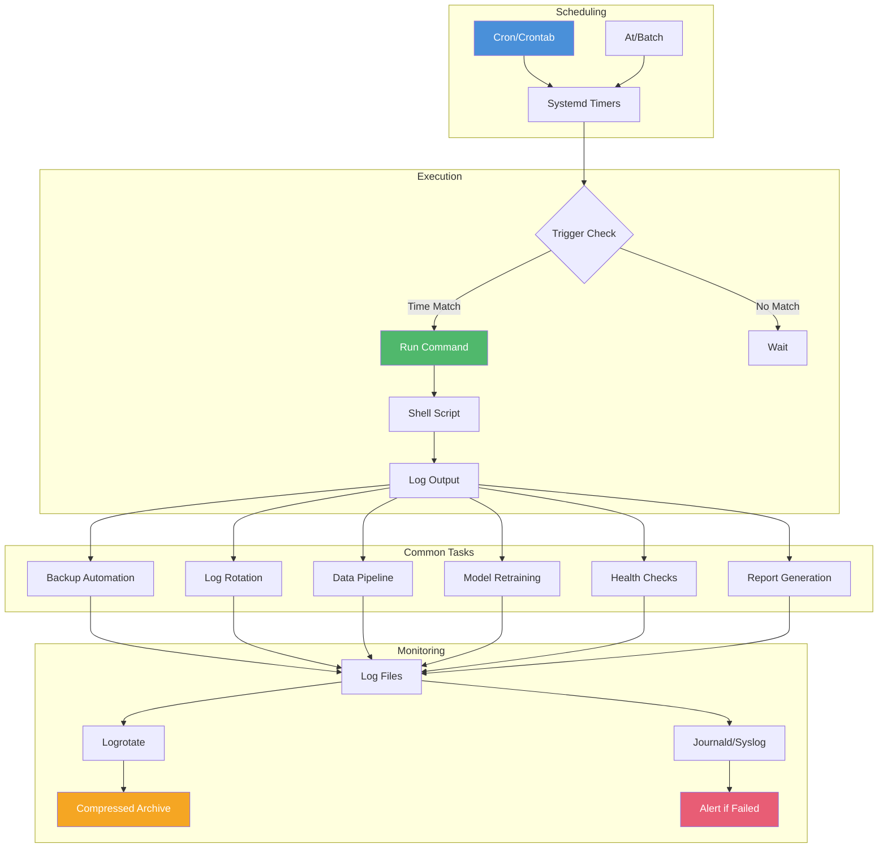
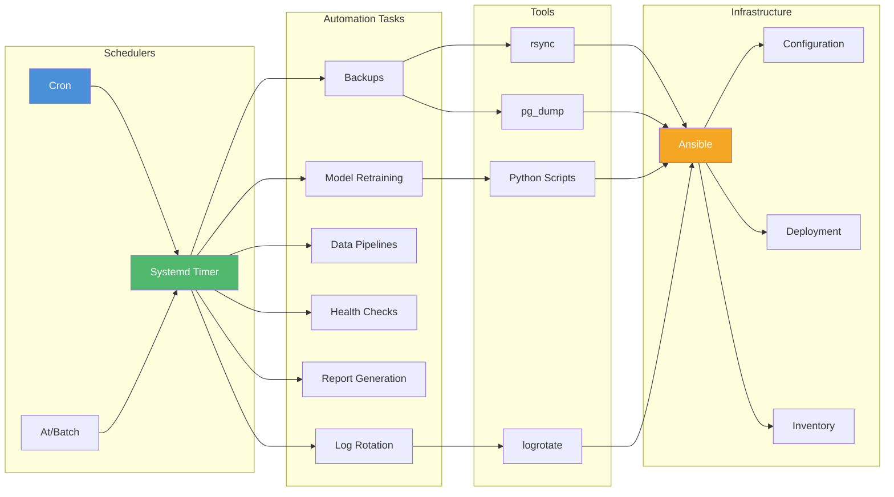

<!-- Clear Language: Keep sentences under 50 words -->
# Cron Automation — Scheduling, Systemd Timers, Backups, Ansible

## Learning Objectives

| Objective | Description |
|-----------|-------------|
| LO1 | Write cron expressions and manage crontab entries |
| LO2 | Create systemd timers as modern alternatives to cron |
| LO3 | Use at and batch for one-time scheduled tasks |
| LO4 | Configure logrotate for log management automation |
| LO5 | Design backup automation strategies for ML workflows |
| LO6 | Understand Ansible basics for infrastructure automation |

## Introduction

Automation is the backbone of reliable system administration. Cron jobs schedule repetitive tasks like backups, model retraining, and log rotation. AI engineers use these tools to automate data pipelines, model training schedules, and infrastructure management.

## Prerequisites

- Basic Linux command line skills
- Understanding of shell scripts
- Familiarity with systemd basics

## Key Terminology

**Key Terms**: Core vocabulary and concepts for this topic.

**Definition**: Essential terms you must know for interviews and production work.

## Theory

### Cron Syntax

Cron uses a five-field expression to define schedule timing:

```text
* * * * * command-to-execute
┬ ┬ ┬ ┬ ┬
│ │ │ │ └──── Day of week (0-7, 0/7 = Sunday)
│ │ │ └────── Month (1-12)
│ │ └──────── Day of month (1-31)
│ └────────── Hour (0-23)
└──────────── Minute (0-59)
```

**Special characters**:

| Char | Meaning | Example |
|------|---------|---------|
| `*` | Every | `* * * * *` = every minute |
| `,` | List | `1,15 * * * *` = minute 1 and 15 |
| `-` | Range | `9-17 * * * *` = 9 AM to 5 PM |
| `/` | Step | `*/5 * * * *` = every 5 minutes |

**Special keywords**:

| Keyword | Equivalent | Meaning |
|---------|------------|---------|
| @reboot | — | Run at system startup |
| @yearly | 0 0 1 1 * | Run once a year |
| @monthly | 0 0 1 * * | Run once a month |
| @weekly | 0 0 * * 0 | Run once a week |
| @daily | 0 0 * * * | Run once a day |
| @hourly | 0 * * * * | Run once an hour |

### Crontab Management

```bash
# Edit current user's crontab
crontab -e

# List cron jobs
crontab -l

# Remove all cron jobs
crontab -r

# Edit another user's crontab (root)
crontab -u mluser -e

# List another user's cron jobs
crontab -u mluser -l

# Install from file
crontab /path/to/cronfile

# Backup crontab
crontab -l > crontab-backup.txt

# Crontab file format:
# Each line is: schedule command
# Empty lines and lines starting with # are ignored
# Environment variables can be set:
# MAILTO=user@example.com
# SHELL=/bin/bash
# PATH=/usr/local/bin:/usr/bin:/bin
```

**Cron examples**:

```text
# Run every day at 2:30 AM
30 2 * * * /usr/local/bin/backup.sh

# Run every weekday (Mon-Fri) at 9 AM
0 9 * * 1-5 /usr/local/bin/daily-report.sh

# Run every 15 minutes
*/15 * * * * /usr/local/bin/health-check.sh

# Run on the 1st and 15th of every month at midnight
0 0 1,15 * * /usr/local/bin/monthly-cleanup.sh

# Run every Sunday at 3 AM
0 3 * * 0 /usr/local/bin/weekly-maintenance.sh

# Run at 8 AM and 6 PM every day
0 8,18 * * * /usr/local/bin/sync-data.sh

# Run at startup
@reboot /usr/local/bin/start-ml-service.sh

# Run hourly model validation
@hourly /usr/local/bin/validate-metrics.sh

# Run every 30 seconds (cron doesn't support seconds)
# Use sleep in script:
* * * * * /usr/local/bin/run-every-30s.sh
# run-every-30s.sh contains:
#   #!/bin/bash
#   /usr/local/bin/task.sh
#   sleep 30
#   /usr/local/bin/task.sh
```

### Systemd Timers (Modern Cron)

Systemd timers provide more features than cron: dependency management, persistent timers, randomized delays, and logging integration.

**Simple timer example**:

```text
# /etc/systemd/system/ml-daily-backup.service
[Unit]
Description=Daily ML Model Backup
Wants=network-online.target
After=network-online.target

[Service]
Type=oneshot
User=mluser
Group=mlgroup
ExecStart=/usr/local/bin/backup-models.sh
Environment=BACKUP_DIR=/data/backups
Environment=RETENTION_DAYS=30

# Resource limits
CPUQuota=50%
MemoryMax=4G

[Install]
WantedBy=multi-user.target
```

```text
# /etc/systemd/system/ml-daily-backup.timer
[Unit]
Description=Run ML backup daily at 3 AM
Requires=ml-daily-backup.service

[Timer]
# Run daily at 3:00 AM
OnCalendar=daily
OnCalendar=*-*-* 03:00:00

# Alternative schedules:
# OnCalendar=Mon..Fri 09:00:00  (weekdays at 9 AM)
# OnCalendar=*-*-01 00:00:00   (1st of month)
# OnCalendar=*:0/15:00        (every 15 minutes)

# Additional options
Persistent=true         # Run immediately if missed
RandomizedDelaySec=300  # Random delay up to 5 min
FixedRandomDelay=true   # Same random delay per host
AccuracySec=1sec        # Scheduling accuracy

[Install]
WantedBy=timers.target
```

**Timer management**:

```bash
# Enable and start timer
sudo systemctl enable ml-daily-backup.timer
sudo systemctl start ml-daily-backup.timer

# List all timers
systemctl list-timers --all

# Show next run
systemctl list-timers ml-daily-backup.timer

# View timer status
systemctl status ml-daily-backup.timer

# View service logs
journalctl -u ml-daily-backup.service

# Trigger service manually
sudo systemctl start ml-daily-backup.service

# Disable timer
sudo systemctl disable ml-daily-backup.timer

# Monitor timer events in real-time
journalctl -f -u ml-daily-backup.timer
```

**Timer schedules (OnCalendar formats)**:

| Expression | Meaning |
|------------|---------|
| `daily` | 00:00:00 every day |
| `hourly` | Every hour at :00 |
| `weekly` | Monday 00:00:00 |
| `monthly` | 1st of month 00:00:00 |
| `Mon..Fri *-*-* 09:00:00` | Weekdays at 9 AM |
| `*-*-01,15 00:00:00` | 1st and 15th at midnight |
| `*:0/15` | Every 15 minutes |
| `*-*-* 06..22:00/2:00` | Every 2 hours from 6-22 |

### At and Batch (One-Time Tasks)

```bash
# Schedule command at specific time
echo "python /opt/train.py --quick-test" | at now + 1 hour
echo "systemctl stop ml-training.service" | at 23:00 today

# Interactive mode
at 15:00
> python validate.py
> mail -s "Validation done" user@example.com < result.txt
> Ctrl+D

# Common time formats
at now + 5 minutes
at now + 2 hours
at noon tomorrow
at 3:00 PM next week
at 09:00 next Monday
at 2024-12-31 23:59

# List pending at jobs
atq

# Remove specific job
atrm 5   # Remove job number 5

# Batch (runs when load average < 1.5)
batch
> python heavy-training.py
> Ctrl+D

# View at daemon status
systemctl status atd
```

### Logrotate

Logrotate automates log rotation, compression, and deletion.

```text
# /etc/logrotate.conf
# Global defaults
weekly
rotate 4
create
compress
delaycompress
missingok
notifempty
su root root

# Include application-specific configs
include /etc/logrotate.d
```

```text
# /etc/logrotate.d/ml-training
/var/log/ml/training.log {
    # Rotate daily, keep 30 days
    daily
    rotate 30
    compress
    delaycompress          # Keep 1 uncompressed for viewing
    missingok
    notifempty
    copytruncate           # Works with running processes
    dateext                # Add date to rotated file
    dateformat -%Y%m%d
    maxsize 500M           # Also rotate if > 500MB
    minsize 100M           # Only rotate if > 100MB

    # Run post-rotation command
    postrotate
        systemctl reload ml-training.service > /dev/null 2>&1 || true
    endscript
}

# GPU cluster logs
/var/log/ml/gpu-monitor.log {
    size 100M              # Rotate at 100MB
    rotate 10
    compress
    copytruncate
    missingok
    notifempty
}

# Multiple log files
/var/log/ml/*.log {
    weekly
    rotate 12              # 3 months of weekly backups
    compress
    missingok
    sharedscripts          # Run postrotate once for all
    postrotate
        journalctl --vacuum-size=500M
    endscript
}
```

**Logrotate commands**:

```bash
# Test configuration
sudo logrotate -d /etc/logrotate.conf

# Force rotation
sudo logrotate -f /etc/logrotate.d/ml-training

# Run with verbose
sudo logrotate -v /etc/logrotate.conf

# Check last rotation time
ls -la /var/log/ml/*.gz

# View logrotate status
cat /var/lib/logrotate/status

# Dry run (no changes)
sudo logrotate -d /etc/logrotate.d/ml-training
```

### Backup Automation

**Incremental backup with rsync**:

```bash
#!/bin/bash
# /usr/local/bin/backup-models.sh

BACKUP_DIR="/data/backups"
SOURCE_DIR="/data/models"
DATE=$(date +%Y%m%d)
LATEST_LINK="$BACKUP_DIR/latest"

# Create daily backup with hard links to unchanged files
rsync -az --delete \
    --link-dest="$LATEST_LINK" \
    "$SOURCE_DIR/" \
    "$BACKUP_DIR/backup-$DATE/"

# Update latest symlink
rm -f "$LATEST_LINK"
ln -s "backup-$DATE" "$LATEST_LINK"

# Remove backups older than 30 days
find "$BACKUP_DIR" -maxdepth 1 -type d -name "backup-*" -mtime +30 -exec rm -rf {} \;

# Log success
logger "Backup completed: $DATE, size: $(du -sh $BACKUP_DIR/backup-$DATE | cut -f1)"
```

**Database backup automation**:

```bash
#!/bin/bash
# /usr/local/bin/backup-db.sh

DB_NAME="ml_experiments"
BACKUP_DIR="/data/db-backups"
RETENTION_DAYS=30

# Create backup
pg_dump -U mluser -d "$DB_NAME" \
    --format=custom \
    --compress=9 \
    --file="$BACKUP_DIR/${DB_NAME}_$(date +%Y%m%d_%H%M%S).dump"

# Encrypt backup
gpg --encrypt --recipient backup-key \
    "$BACKUP_DIR"/*.dump

# Upload to S3
aws s3 sync "$BACKUP_DIR/" "s3://ml-backups/db/"

# Cleanup old backups
find "$BACKUP_DIR" -name "*.dump" -mtime +"$RETENTION_DAYS" -delete

# Send notification
curl -X POST -H "Content-Type: application/json" \
    -d '{"text": "Database backup completed successfully"}' \
    "$SLACK_WEBHOOK_URL"
```

**Full ML workflow backup**:

```text
# Crontab for ML infrastructure
# /etc/cron.d/ml-backups

# Hourly: backup experiment metadata
0 * * * * mluser /usr/local/bin/backup-meta.sh

# Daily at 2 AM: backup model checkpoints
0 2 * * * mluser /usr/local/bin/backup-models.sh

# Daily at 3 AM: backup databases
0 3 * * * mluser /usr/local/bin/backup-db.sh

# Weekly on Sunday at 4 AM: full system backup
0 4 * * 0 root /usr/local/bin/full-system-backup.sh

# Monthly on 1st at 5 AM: archive old data
0 5 1 * * mluser /usr/local/bin/archive-monthly.sh
```

### Cron Workflow Diagram



### Ansible Basics

Ansible automates infrastructure provisioning and configuration management.

```bash
# Install Ansible
pip install ansible

# Check version
ansible --version

# Inventory file (hosts.ini)
cat > hosts.ini << EOF
[ml-servers]
gpu-01 ansible_host=10.0.1.1 ansible_user=ubuntu
gpu-02 ansible_host=10.0.1.2 ansible_user=ubuntu
gpu-03 ansible_host=10.0.1.3 ansible_user=ubuntu

[ml-servers:vars]
ansible_python_interpreter=/usr/bin/python3
ansible_ssh_private_key_file=~/.ssh/ml-key.pem
EOF

# Run ad-hoc command on all servers
ansible ml-servers -i hosts.ini -m ping
ansible ml-servers -i hosts.ini -m shell -a "nvidia-smi --query-gpu=name --format=csv,noheader"

# Copy file to all servers
ansible ml-servers -i hosts.ini -m copy -a "src=train.py dest=/opt/ml/train.py mode=0755"

# Install packages
ansible ml-servers -i hosts.ini -m apt -a "name=python3-pip state=present" --become
```

**Ansible playbook example**:

```yaml
---
# playbooks/ml-server-setup.yml
- name: Setup ML Training Server
  hosts: ml-servers
  become: yes
  vars:
    cuda_version: "12.1"
    python_version: "3.10"
    ml_user: "mluser"

  tasks:
    - name: Create ML user
      user:
        name: "{{ ml_user }}"
        state: present
        groups: sudo,docker
        shell: /bin/bash

    - name: Install system packages
      apt:
        name:
          - python3-pip
          - python3-venv
          - docker.io
          - nvidia-docker2
          - htop
          - rsync
          - postgresql-client
        state: present
        update_cache: yes

    - name: Install Python packages
      pip:
        name:
          - torch
          - transformers
          - datasets
          - scikit-learn
          - mlflow
        state: present

    - name: Create data directories
      file:
        path: "{{ item }}"
        state: directory
        owner: "{{ ml_user }}"
        group: "{{ ml_user }}"
        mode: 0755
      loop:
        - /data/models
        - /data/datasets
        - /data/backups

    - name: Deploy cron job for daily backup
      cron:
        name: "Daily model backup"
        minute: "0"
        hour: "2"
        job: "/usr/local/bin/backup-models.sh"
        user: "{{ ml_user }}"

    - name: Set up logrotate for ML logs
      copy:
        dest: /etc/logrotate.d/ml-training
        content: |
          /var/log/ml/*.log {
              daily
              rotate 30
              compress
              copytruncate
              missingok
              notifempty
          }

    - name: Restart services
      systemd:
        name: "{{ item }}"
        state: restarted
        daemon_reload: yes
      loop:
        - cron
        - docker

    - name: Verify GPU access
      shell: nvidia-smi
      register: gpu_check
      changed_when: false

    - name: Display GPU info
      debug:
        msg: "{{ gpu_check.stdout_lines }}"
```

**Running playbooks**:

```bash
# Run playbook
ansible-playbook -i hosts.ini playbooks/ml-server-setup.yml

# Check mode (dry run)
ansible-playbook -i hosts.ini playbooks/ml-server-setup.yml --check

# Limit to specific hosts
ansible-playbook -i hosts.ini playbooks/ml-server-setup.yml --limit gpu-01

# Run with specific user
ansible-playbook -i hosts.ini playbooks/ml-server-setup.yml -u ubuntu

# Ask for sudo password
ansible-playbook -i hosts.ini playbooks/ml-server-setup.yml -K

# Verbose output
ansible-playbook -i hosts.ini playbooks/ml-server-setup.yml -vvv

# Run specific tags
ansible-playbook -i hosts.ini playbooks/ml-server-setup.yml --tags backup

# List hosts that would be affected
ansible-playbook -i hosts.ini playbooks/ml-server-setup.yml --list-hosts

# List all tasks
ansible-playbook -i hosts.ini playbooks/ml-server-setup.yml --list-tasks
```

### Automation for ML Workflows

**Automated model retraining pipeline**:

```bash
#!/bin/bash
# /usr/local/bin/weekly-retrain.sh

MODEL_DIR="/data/models"
DATA_DIR="/data/datasets/current"
MLFLOW_URI="http://mlflow.internal:5000"
DATE=$(date +%Y%m%d)

echo "[$(date)] Starting weekly model retraining"

# 1. Check for new data
if [ ! -f "$DATA_DIR/new_data_available.flag" ]; then
    echo "No new data available. Skipping."
    exit 0
fi

# 2. Run training script
python3 /opt/ml/train.py \
    --data-dir "$DATA_DIR" \
    --output-dir "$MODEL_DIR/$DATE" \
    --mlflow-uri "$MLFLOW_URI" \
    --experiment "weekly-retrain"

# 3. Evaluate and compare with production
python3 /opt/ml/evaluate.py \
    --new-model "$MODEL_DIR/$DATE" \
    --production-model "$MODEL_DIR/production"

# 4. If new model is better, promote
if [ -f "$MODEL_DIR/$DATE/champion.flag" ]; then
    ln -sfn "$DATE" "$MODEL_DIR/production"
    echo "New champion model promoted: $DATE"
fi

# 5. Cleanup old models (keep last 20)
ls -t "$MODEL_DIR" | grep -E "^[0-9]{8}$" | tail -n +21 | \
    xargs -I {} rm -rf "$MODEL_DIR/{}"

echo "[$(date)] Weekly retraining complete"
```

**Monitoring cron jobs**:

```bash
#!/bin/bash
# /usr/local/bin/cron-monitor.sh
# Run this as a cron job to alert on failures

# Check if critical cron jobs ran recently
CRITICAL_JOBS=("backup" "retrain" "cleanup")
ALERT_EMAIL="team@example.com"

for job in "${CRITICAL_JOBS[@]}"; do
    # Check journalctl for the job's last run
    LAST_RUN=$(journalctl -u "ml-$job.service" --since "24 hours ago" | grep "Started" | tail -1)

    if [ -z "$LAST_RUN" ]; then
        echo "Job ml-$job did not run in last 24 hours" | \
            mail -s "CRON ALERT: $job not running" "$ALERT_EMAIL"
    fi
done

# Check disk space
DISK_USAGE=$(df /data | tail -1 | awk '{print $5}' | sed 's/%//')
if [ "$DISK_USAGE" -gt 85 ]; then
    echo "Disk usage at ${DISK_USAGE}% on /data" | \
        mail -s "DISK ALERT: ${DISK_USAGE}%" "$ALERT_EMAIL"
fi
```

## Visual Explanation



## Real Example

Think of cron like a school bell system. The cron expression is the schedule: "every weekday at 8 AM" (0 8 * * 1-5). The bell (system timer) rings at the correct time, the teacher (script) runs the lesson (backup/retraining). Systemd timers are like programmable digital bells — they can ring with random delay to prevent stampedes (RandomizedDelaySec), ring immediately if the school was closed and reopens (Persistent=true). Logrotate is like rotating notebooks — keep last 30 days, compress old ones, throw away expired. Ansible is like the principal's memo system — send one instruction to all classrooms and they all execute it consistently.

## Code Example

```python
#!/usr/bin/env python3
"""Cron job management and monitoring for ML infrastructure"""

import os
import sys
import subprocess
import json
from datetime import datetime, timedelta
from typing import Dict, List, Optional

class CronManager:
    """Manage and monitor cron jobs for ML workflows"""

    def __init__(self, user: str = "mluser"):
        self.user = user

    def list_jobs(self) -> List[Dict]:
        """List all cron jobs for the user"""
        try:
            result = subprocess.run(
                ["crontab", "-u", self.user, "-l"],
                capture_output=True, text=True, timeout=10
            )
            if result.returncode != 0:
                return []

            jobs = []
            for line in result.stdout.strip().split("\n"):
                line = line.strip()
                if line and not line.startswith("#"):
                    parts = line.split(None, 5)
                    if len(parts) >= 6:
                        jobs.append({
                            "schedule": " ".join(parts[:5]),
                            "command": parts[5],
                            "raw": line,
                        })
            return jobs
        except subprocess.TimeoutExpired:
            return []

    def add_job(self, schedule: str, command: str, comment: str = "") -> bool:
        """Add a new cron job"""
        try:
            # Get existing jobs
            result = subprocess.run(
                ["crontab", "-u", self.user, "-l"],
                capture_output=True, text=True, timeout=10
            )
            existing = result.stdout if result.returncode == 0 else ""

            # Create new entry
            new_entry = ""
            if comment:
                new_entry += f"# {comment}\n"
            new_entry += f"{schedule} {command}\n"

            full_crontab = existing + new_entry

            # Install new crontab
            proc = subprocess.Popen(
                ["crontab", "-u", self.user, "-"],
                stdin=subprocess.PIPE, text=True
            )
            proc.communicate(input=full_crontab, timeout=10)
            return proc.returncode == 0
        except subprocess.TimeoutExpired:
            return False

    def remove_job(self, command_pattern: str) -> bool:
        """Remove cron jobs matching pattern"""
        try:
            result = subprocess.run(
                ["crontab", "-u", self.user, "-l"],
                capture_output=True, text=True, timeout=10
            )
            if result.returncode != 0:
                return False

            lines = result.stdout.split("\n")
            filtered = [l for l in lines if command_pattern not in l]

            proc = subprocess.Popen(
                ["crontab", "-u", self.user, "-"],
                stdin=subprocess.PIPE, text=True
            )
            proc.communicate(input="\n".join(filtered), timeout=10)
            return proc.returncode == 0
        except subprocess.TimeoutExpired:
            return False

    def last_run(self, job_pattern: str) -> Optional[datetime]:
        """Check when a cron job last ran via journalctl"""
        try:
            result = subprocess.run(
                ["journalctl", "-u", f"cron.service",
                 "--since", "7 days ago", "--no-pager"],
                capture_output=True, text=True, timeout=30
            )
            # Look for the command in cron logs
            for line in result.stdout.split("\n"):
                if job_pattern in line and "CMD" in line:
                    timestamp_str = line.split()[0] + " " + line.split()[1]
                    timestamp = datetime.strptime(
                        timestamp_str.split(".")[0],
                        "%b %d %H:%M:%S"
                    )
                    # Replace year with current
                    now = datetime.now()
                    timestamp = timestamp.replace(year=now.year)
                    return timestamp
            return None
        except (subprocess.TimeoutExpired, ValueError):
            return None

class BackupOrchestrator:
    """Coordinate backup strategy for ML artifacts"""

    def __init__(self, config_path: str = "/etc/ml-backup/config.json"):
        self.config = self._load_config(config_path)

    def _load_config(self, path: str) -> Dict:
        default_config = {
            "backup_root": "/data/backups",
            "sources": [
                "/data/models",
                "/data/experiments",
                "/opt/ml/configs",
            ],
            "databases": ["ml_experiments", "metadata"],
            "retention_days": 30,
            "s3_bucket": "s3://ml-backups/",
            "slack_webhook": "",
        }
        if os.path.exists(path):
            with open(path) as f:
                return {**default_config, **json.load(f)}
        return default_config

    def backup_directory(self, source: str, dest: str) -> Dict:
        """Backup a directory using rsync"""
        result = subprocess.run(
            ["rsync", "-az", "--delete",
             source, dest],
            capture_output=True, text=True, timeout=3600
        )
        return {
            "source": source,
            "dest": dest,
            "success": result.returncode == 0,
            "output": result.stdout[:500],
        }

    def backup_database(self, db_name: str, dest_dir: str) -> Dict:
        """Backup a PostgreSQL database"""
        timestamp = datetime.now().strftime("%Y%m%d_%H%M%S")
        filename = f"{dest_dir}/{db_name}_{timestamp}.dump"

        result = subprocess.run(
            ["pg_dump", "-U", "mluser", "-d", db_name,
             "--format=custom", "--compress=9",
             "--file", filename],
            capture_output=True, text=True, timeout=3600
        )
        return {
            "database": db_name,
            "file": filename,
            "success": result.returncode == 0,
        }

    def run_full_backup(self) -> Dict:
        """Execute complete backup strategy"""
        results = {}
        date_str = datetime.now().strftime("%Y%m%d")
        backup_dir = f"{self.config['backup_root']}/backup-{date_str}"

        # Ensure backup directory exists
        os.makedirs(backup_dir, exist_ok=True)

        # Backup directories
        for source in self.config["sources"]:
            dest = f"{backup_dir}/{os.path.basename(source)}"
            results[f"dir_{os.path.basename(source)}"] = self.backup_directory(source, dest)

        # Backup databases
        for db in self.config["databases"]:
            results[f"db_{db}"] = self.backup_database(db, backup_dir)

        # Cleanup old backups
        cutoff = datetime.now() - timedelta(days=self.config["retention_days"])
        for item in os.listdir(self.config["backup_root"]):
            item_path = os.path.join(self.config["backup_root"], item)
            if os.path.isdir(item_path):
                mtime = datetime.fromtimestamp(os.path.getmtime(item_path))
                if mtime < cutoff:
                    subprocess.run(["rm", "-rf", item_path])

        return results

if __name__ == "__main__":
    # List existing cron jobs
    manager = CronManager()
    jobs = manager.list_jobs()
    print(f"Current cron jobs ({len(jobs)}):")
    for job in jobs:
        print(f"  {job['schedule']} -> {job['command'][:60]}...")

    # Add a training job
    manager.add_job(
        schedule="0 2 * * 1",
        command="/usr/local/bin/retrain-model.sh",
        comment="Weekly model retraining every Monday at 2 AM"
    )

    # Run backup
    backup = BackupOrchestrator()
    results = backup.run_full_backup()
    print(f"\nBackup results:")
    for key, value in results.items():
        status = "OK" if value.get("success") else "FAIL"
        print(f"  {key}: {status}")
```

**Expected Output**:
```text
Current cron jobs (3):
  0 2 * * * /usr/local/bin/backup-models.sh
  0 3 * * * /usr/local/bin/backup-db.sh
  */5 * * * * /usr/local/bin/health-check.sh

Backup results:
  dir_data/models: OK
  dir_data/experiments: OK
  dir_opt/ml/configs: OK
  db_ml_experiments: OK
  db_metadata: OK
```

## Summary

Cron automation is the backbone of reliable system administration, scheduling repetitive tasks such as backups, log rotation, model retraining, and health checks. Cron uses a five-field expression (minute, hour, day of month, month, day of week) managed through crontab, while systemd timers provide a more powerful modern alternative with Persistent=true for missed runs, RandomizedDelaySec to prevent thundering herds, dependency ordering, and journald logging. The at command schedules one-time tasks and batch defers them until system load drops. Logrotate automates rotation, compression, and deletion of log files, and backup automation combines rsync incremental snapshots, pg_dump database dumps, encryption, and offsite S3 sync. Ansible extends automation to infrastructure with agentless, idempotent YAML playbooks pushed over SSH. AI engineers use these tools to retrain models weekly, back up checkpoints hourly, and provision identical GPU servers. The trade-offs are operational: cron runs with a minimal PATH, jobs can overlap without locking, and untested backups are worthless.

- Cron syntax: minute hour day-of-month month day-of-week; */5 * * * * runs every 5 minutes.
- Systemd timers: OnCalendar, Persistent=true, RandomizedDelaySec, and journalctl logging.
- at schedules one-time tasks; batch runs them when load average is low.
- Logrotate: copytruncate rotates logs still open by running processes.
- rsync --link-dest creates incremental hard-link backups at near-zero extra cost.
- Ansible is agentless, push-based, and idempotent via YAML playbooks.

## Practical Takeaways

- **Cron syntax**: Minute Hour Day-of-month Month Day-of-week — `* * * * *` runs every minute, and cron has no seconds field; use sleep inside a script for sub-minute runs.
- **Full paths**: Cron runs with a minimal PATH, so always use absolute paths and set SHELL and MAILTO at the top of the crontab.
- **Systemd timers**: Use OnCalendar=daily with Persistent=true so missed jobs run right after downtime, and RandomizedDelaySec=300 to avoid thundering herd.
- **Overlap protection**: Wrap jobs with /usr/bin/flock -n /tmp/job.lock to prevent a second run from starting before the first finishes.
- **Logrotate**: Use copytruncate for logs held open by training processes, combine daily with maxsize 500M, keep 30 rotated files, and compress.
- **Backups**: Follow the 3-2-1 rule — rsync --link-dest incremental backups, pg_dump custom-format dumps, gpg encryption, offsite S3 sync, and monthly restore drills.
- **Ansible**: For N identical ML servers, use an idempotent playbook with inventory groups, --check for dry runs, and --limit for staged rollout.

## Interview Q&A

<details class="tp-qa-card" data-qid="git09-q1">
  <summary class="tp-qa-question">
    <span class="tp-qa-status"></span>
    Q1: Explain the cron syntax with examples for different scheduling patterns.
  </summary>
  <div class="tp-qa-answer">
    <p>Cron uses five fields: minute (0-59), hour (0-23), day of month (1-31), month (1-12), and day of week (0-7, 0/7=Sunday). <code>*</code> means every. <code>*/15</code> means every 15 units. <code>1,15</code> means at 1 and 15. <code>9-17</code> means range 9 to 17. Examples: Every day at 2:30 AM: <code>30 2 * * *</code>. Weekdays at 9 AM: <code>0 9 * * 1-5</code>. Every 5 minutes: <code>*/5 * * * *</code>. 1st of month at midnight: <code>0 0 1 * *</code>. Every Sunday at 3 AM: <code>0 3 * * 0</code>. Special keywords: @reboot, @daily, @hourly, @weekly, @monthly, @yearly.</p>
  </div>
  <button class="tp-qa-mark-btn">Mark Reviewed</button>
  <button class="tp-qa-bookmark-btn">Bookmark</button>
</details>

<details class="tp-qa-card" data-qid="git09-q2">
  <summary class="tp-qa-question">
    <span class="tp-qa-status"></span>
    Q2: How do systemd timers improve upon traditional cron?
  </summary>
  <div class="tp-qa-answer">
    <p>Systemd timers offer several advantages: <strong>1) Persistent=true</strong> — run missed jobs immediately after system downtime. <strong>2) RandomizedDelaySec</strong> — prevent thundering herd when many systems run the same job. <strong>3) Dependencies</strong> — use After/Requires with other systemd units. <strong>4) Logging</strong> — integrated journalctl logging. <strong>5) Resource control</strong> — cgroup-based CPU/memory limits via the service unit. <strong>6) Calendar syntax</strong> — more expressive than cron (e.g., <code>Mon..Fri *-*-* 09:00:00</code>). <strong>7) Monotonic timers</strong> — run relative to boot or activation. <strong>8) Unit activation</strong> — timers activate by socket, path, or device changes.</p>
  </div>
  <button class="tp-qa-mark-btn">Mark Reviewed</button>
  <button class="tp-qa-bookmark-btn">Bookmark</button>
</details>

<details class="tp-qa-card" data-qid="git09-q3">
  <summary class="tp-qa-question">
    <span class="tp-qa-status"></span>
    Q3: How does logrotate work and how would you configure it for ML training logs?
  </summary>
  <div class="tp-qa-answer">
    <p>Logrotate reads configuration files to determine how to rotate logs. On each cycle, it renames the current log file (adding suffix), creates a new empty log file, optionally compresses old logs, and runs postrotate scripts. Key directives: <strong>daily/weekly/monthly</strong> — rotation frequency. <strong>rotate N</strong> — keep N rotated files. <strong>compress</strong> — gzip old logs. <strong>copytruncate</strong> — copy and truncate (works with running processes). <strong>size</strong> — rotate at size threshold. For ML logs: use <code>copytruncate</code> (training processes hold file handles), rotate daily or at 500MB, compress, keep 30 days. The postrotate script can reload or signal the training service.</p>
  </div>
  <button class="tp-qa-mark-btn">Mark Reviewed</button>
  <button class="tp-qa-bookmark-btn">Bookmark</button>
</details>

<details class="tp-qa-card" data-qid="git09-q4">
  <summary class="tp-qa-question">
    <span class="tp-qa-status"></span>
    Q4: Design a backup strategy for ML training artifacts (models, datasets, configs, databases).
  </summary>
  <div class="tp-qa-answer">
    <p><strong>Frequency</strong>: Model checkpoints hourly (incremental), datasets daily, databases daily, full system weekly. <strong>Strategy</strong>: Use rsync with --link-dest for incremental hard-link backups — unchanged files take zero extra space. <strong>Databases</strong>: pg_dump with custom format and compression. <strong>Retention</strong>: Hourly for 7 days, daily for 30 days, weekly for 6 months, monthly for 1 year. <strong>Offsite</strong>: Encrypt backups with GPG and sync to S3/Glacier after local retention expires. <strong>Testing</strong>: Monthly restore test to verify backup integrity. <strong>Tools</strong>: rsync + cron for local, s3cmd/aws-cli for cloud, borg/restic for encrypted deduplicated backups.</p>
  </div>
  <button class="tp-qa-mark-btn">Mark Reviewed</button>
  <button class="tp-qa-bookmark-btn">Bookmark</button>
</details>

<details class="tp-qa-card" data-qid="git09-q5">
  <summary class="tp-qa-question">
    <span class="tp-qa-status"></span>
    Q5: What is Ansible and how does it compare to other configuration management tools?
  </summary>
  <div class="tp-qa-answer">
    <p>Ansible is an agentless configuration management and automation tool. It uses SSH to connect to nodes and executes YAML playbooks. <strong>Agentless</strong>: no software to install on managed nodes (unlike Puppet/Chef which require agents). <strong>Push-based</strong>: control node pushes config to nodes (vs pull-based in Puppet). <strong>Idempotent</strong>: running a playbook multiple times produces the same result. <strong>Modules</strong>: built-in modules for package management, file operations, systemd, cloud APIs. Ansible is simpler to learn than Puppet/Chef (YAML vs Ruby DSL), works well for ML infrastructure setup, but is slower for large deployments compared to SaltStack or Terraform for infrastructure provisioning.</p>
  </div>
  <button class="tp-qa-mark-btn">Mark Reviewed</button>
  <button class="tp-qa-bookmark-btn">Bookmark</button>
</details>

<details class="tp-qa-card" data-qid="git09-q6">
  <summary class="tp-qa-question">
    <span class="tp-qa-status"></span>
    Q6: How do you monitor cron jobs and alert on failures?
  </summary>
  <div class="tp-qa-answer">
    <p><strong>1) MAILTO</strong>: Set MAILTO in crontab to receive job output via email. <strong>2) Journalctl</strong>: systemd timers log to journald — <code>journalctl -u timer-name</code> shows execution history. <strong>3) Health check script</strong>: Monitor job with <code>/usr/local/bin/cron-monitor.sh</code> that checks last run time. <strong>4) Dead man's switch</strong>: Cron job pings an external service (e.g., healthchecks.io, Dead Man's Snitch) which alerts if no ping received. <strong>5) Metrics</strong>: Export last-run timestamp to Prometheus. <strong>6) Log monitoring</strong>: Use logwatch or custom watcher to scan for error patterns in job output. <strong>7) Exit codes</strong>: Ensure every script exits non-zero on failure so cron sends the output.</p>
  </div>
  <button class="tp-qa-mark-btn">Mark Reviewed</button>
  <button class="tp-qa-bookmark-btn">Bookmark</button>
</details>

<details class="tp-qa-card" data-qid="git09-q7">
  <summary class="tp-qa-question">
    <span class="tp-qa-status"></span>
    Q7: What is the difference between cron's @reboot and a systemd service with Restart=always?
  </summary>
  <div class="tp-qa-answer">
    <p><strong>@reboot</strong>: runs a script once when the system starts. It's a one-shot execution. If the script crashes or exits, it doesn't restart. No dependency management — runs after cron daemon starts, not necessarily after network. Logging only via cron's mail mechanism. <strong>systemd service with Restart=always</strong>: runs at boot (if enabled), restarts on failure (Restart=always), supports dependencies (After=network.target), integrated logging (journalctl), resource limits (cgroups), and security hardening (ProtectSystem, PrivateTmp). For ML services that must stay up (model serving, experiment trackers), use systemd. For one-time startup tasks (creating directories, cleaning temp files), @reboot is sufficient.</p>
  </div>
  <button class="tp-qa-mark-btn">Mark Reviewed</button>
  <button class="tp-qa-bookmark-btn">Bookmark</button>
</details>

<details class="tp-qa-card" data-qid="git09-q8">
  <summary class="tp-qa-question">
    <span class="tp-qa-status"></span>
    Q8: How would you schedule a training job that runs every 30 minutes but must complete before the next run?
  </summary>
  <div class="tp-qa-container">
    <div class="tp-qa-answer">
    <p>Three approaches: <strong>1) Cron + lockfile</strong>: Run every 30 minutes but use a lockfile to prevent overlap. <code>*/30 * * * * /usr/bin/flock -n /tmp/train.lock /usr/local/bin/train.sh</code>. <strong>2) systemd timer + service</strong>: Create a service with <code>StartLimitIntervalSec=1800</code>. Use <code>OnCalendar=*:0/30</code> and <code>ConditionPathExists=!/tmp/train.lock</code>. <strong>3) Internal scheduling</strong>: The training script itself checks the clock and only starts if the previous run completed and the window is open. <strong>4) Workflow manager</strong>: Use Airflow, Prefect, or Dagster for complex scheduling with dependency tracking — they handle retries, backfills, and SLA monitoring natively.</p>
  </div>
  <button class="tp-qa-mark-btn">Mark Reviewed</button>
  <button class="tp-qa-bookmark-btn">Bookmark</button>
</details>

<details class="tp-qa-card" data-qid="git09-q9">
  <summary class="tp-qa-question">
    <span class="tp-qa-status"></span>
    Q9: Explain the at command and when you'd use it over cron.
  </summary>
  <div class="tp-qa-answer">
    <p>at schedules a one-time task at a specific future time. Use cases: running a database migration during a maintenance window TONIGHT, deploying a model update after traffic drops at 2 AM, scheduling a resource-intensive experiment to run after hours, or setting a temporary alert to remind you to check a training job. Unlike cron (recurring), at is for one-offs. <code>echo "python train.py --quick-test" | at now + 2 hours</code>. batch is similar but runs when system load is low. View pending: atq. Remove: atrm. atd daemon must be running (<code>systemctl status atd</code>).</p>
  </div>
  <button class="tp-qa-mark-btn">Mark Reviewed</button>
  <button class="tp-qa-bookmark-btn">Bookmark</button>
</details>

<details class="tp-qa-card" data-qid="git09-q10">
  <summary class="tp-qa-question">
    <span class="tp-qa-status"></span>
    Q10: How would you automate the setup of 10 identical ML training servers?
  </summary>
  <div class="tp-qa-answer">
    <p>Use Ansible with the following approach: <strong>1) Inventory</strong>: Define <code>[ml-servers]</code> group with all 10 hosts in hosts.ini. <strong>2) Playbook</strong>: Write a playbook that installs CUDA drivers, Python, ML frameworks (PyTorch, TensorFlow), creates users, sets up data directories, configures SSH, deploys cron jobs, sets up logrotate, and configures monitoring. <strong>3) Variables</strong>: Use group_vars for shared settings (CUDA version, Python packages) and host_vars for unique settings (IP addresses, GPU type). <strong>4) Roles</strong>: Organize into roles: common, nvidia, ml-frameworks, monitoring, backup. <strong>5) Execution</strong>: <code>ansible-playbook -i hosts.ini site.yml -f 10</code> (parallel on 10 hosts). <strong>6) Idempotent</strong>: Run multiple times safely. Re-run weekly to ensure compliance.</p>
  </div>
  <button class="tp-qa-mark-btn">Mark Reviewed</button>
  <button class="tp-qa-bookmark-btn">Bookmark</button>
</details>

## Chapter Quiz

**Q1**: What cron expression runs a job every 15 minutes?

a) * 15 * * *
b) */15 * * * *
c) 15 * * * *
d) 0 15 * * *

<details class="tp-qa-card" data-qid="git09-quiz1"><summary>Show Answer</summary><div class="tp-qa-answer"><p><strong>Answer: b) */15 * * * *</strong></p><p>The / in the minute field means "every 15 minutes" — runs at :00, :15, :30, :45.</p></div></details>

**Q2**: What systemd timer directive runs a missed job after system downtime?

a) RandomizedDelaySec
b) OnBootSec
c) Persistent=true
d) AccuracySec

<details class="tp-qa-card" data-qid="git09-quiz2"><summary>Show Answer</summary><div class="tp-qa-answer"><p><strong>Answer: c) Persistent=true</strong></p><p>Persistent=true triggers the timer immediately after boot if the scheduled time was missed.</p></div></details>

**Q3**: Which logrotate directive allows rotating logs of running processes?

a) copytruncate
b) rotate
c) compress
d) postrotate

<details class="tp-qa-card" data-qid="git09-quiz3"><summary>Show Answer</summary><div class="tp-qa-answer"><p><strong>Answer: a) copytruncate</strong></p><p>copytruncate copies the file and truncates the original, allowing running processes to continue writing.</p></div></details>

**Q4**: What is Ansible's architecture called?

a) Agent-based pull
b) Agentless push
c) Master-slave
d) Peer-to-peer

<details class="tp-qa-card" data-qid="git09-quiz4"><summary>Show Answer</summary><div class="tp-qa-answer"><p><strong>Answer: b) Agentless push</strong></p><p>Ansible pushes configurations via SSH without requiring agents on managed nodes.</p></div></details>

**Q5**: Which command schedules a one-time task for later execution?

a) cron
b) at
c) systemd-run
d) scheduler

<details class="tp-qa-card" data-qid="git09-quiz5"><summary>Show Answer</summary><div class="tp-qa-answer"><p><strong>Answer: b) at</strong></p><p>at schedules one-time tasks. <code>echo "command" | at now + 1 hour</code>.</p></div></details>

## Exercises

**Easy** — Write a cron job that runs a Python script every hour and logs the output to a file. Verify it runs.

**Medium** — Convert a cron job to a systemd timer with persistent=true and RandomizedDelaySec=300. Compare behavior.

**Medium** — Set up logrotate for ML training logs with daily rotation, compression, and 30-day retention. Test with force rotation.

**Hard** — Write an Ansible playbook that sets up an ML training server (Python, PyTorch, CUDA, data directories, cron jobs, logrotate).

**Hard** — Build a complete backup automation system with rsync incremental backups, database dumps, S3 sync, and monitoring alerts.

## Common Mistakes

1. Forgetting that cron runs with a minimal PATH — always use full paths in cron commands
2. Not capturing and logging cron job output — failures go unnoticed
3. Using cron for tasks that need dependency management (use workflow tools instead)
4. Not testing backup restores — backups are only as good as the last successful restore
5. Running heavy workloads without locking — overlapping cron jobs cause resource contention

## Revision Notes

- Cron syntax: minute hour day month weekday; special keywords: @daily, @hourly, @reboot
- crontab -e edits, crontab -l lists, crontab -r removes
- Systemd timers: OnCalendar, Persistent, RandomizedDelaySec
- at for one-time, batch for load-dependent scheduling
- Logrotate: manage log files — rotate, compress, delete old logs
- Ansible: agentless, push-based, YAML playbooks, idempotent
- Backup 3-2-1 rule: 3 copies, 2 media types, 1 offsite
- Always test backups with restore drills
- Monitor cron with MAILTO, journalctl, health checks
- Use lockfiles to prevent overlapping cron job execution

## Placement Section

### Top 10 Interview Questions

#### Google Style

1. **Explain the core idea of Cron Automation — Scheduling, Systemd Timers, Backups, Ansible in under 60 seconds, then give a real-world analogy.** — Structure: definition, how it works in one sentence, why it matters, analogy. Follow-up: what would break if you removed this from a production system?

2. **Design a minimal, well-typed function that demonstrates Cron Automation — Scheduling, Systemd Timers, Backups, Ansible.** — Interviewer checks: signature with type hints, edge cases, complexity, and a clean docstring. Follow-up: how does your design behave with empty or malformed input?

3. **What are the common pitfalls when engineers first learn ** — List 3-4, then explain how you would prevent each in a code review.

#### Amazon Style

4. **Describe a production bug caused by misunderstanding Cron Automation — Scheduling, Systemd Timers, Backups, Ansible. How did you diagnose and fix it?** — STAR format: situation, task, action, result. Mention logs, reproduction, root-cause analysis, and the regression test you added.

5. **How would you scale a system that relies on Cron Automation — Scheduling, Systemd Timers, Backups, Ansible from 10 users to 10 million?** — Discuss bottlenecks, caching, monitoring, and when to redesign. Follow-up: what metrics would you track?

#### Microsoft Style

6. **Compare Cron Automation — Scheduling, Systemd Timers, Backups, Ansible with the closest alternative approach. When would you choose each?** — Make a decision matrix: performance, maintainability, ecosystem, learning curve. Follow-up: what would change your decision?

7. **Walk through how you would test a component that depends on Cron Automation — Scheduling, Systemd Timers, Backups, Ansible.** — Unit, integration, property-based tests; mocking boundaries; golden files for outputs.

#### NVIDIA Style

8. **How does Cron Automation — Scheduling, Systemd Timers, Backups, Ansible behave differently at scale — memory, throughput, or precision-wise?** — Connect to data pipelines and model training if applicable. Follow-up: what happens to latency as input grows?

9. **How would you make an implementation of Cron Automation — Scheduling, Systemd Timers, Backups, Ansible run faster on GPU hardware?** — Batch operations, vectorization, avoiding Python loops, reducing data movement.

#### AI Startup Style

10. **Write the smallest possible implementation of Cron Automation — Scheduling, Systemd Timers, Backups, Ansible that is production-quality.** — Include error handling, type hints, and a one-line docstring. Follow-up: what would you refactor first when it grows?

### Resume Tips

- Name Cron Automation — Scheduling, Systemd Timers, Backups, Ansible explicitly in your skills section, paired with a measurable achievement ("Reduced X by 40% using Cron Automation — Scheduling, Systemd Timers, Backups, Ansible").
- Add a bullet describing a project that applies Cron Automation — Scheduling, Systemd Timers, Backups, Ansible to real data, with numbers.
- Mention the tools and libraries you used alongside Cron Automation — Scheduling, Systemd Timers, Backups, Ansible (linters, test frameworks, profiling tools).
- Keep resume bullets under 15 words and start each with an action verb.

### Interview Day Checklist

- Rehearse a 60-second explanation of Cron Automation — Scheduling, Systemd Timers, Backups, Ansible and one real-world analogy.
- Prepare one STAR story about debugging a Cron Automation — Scheduling, Systemd Timers, Backups, Ansible-related production issue.
- Review complexity and edge cases for the classic Cron Automation — Scheduling, Systemd Timers, Backups, Ansible interview problem.
- Have questions ready: how does the team apply Cron Automation — Scheduling, Systemd Timers, Backups, Ansible in production today?
- Test your environment (Python, editor, internet) 15 minutes before the interview.

## True/False

1. **True or False:** Cron Automation — Scheduling, Systemd Timers, Backups, Ansible builds directly on the fundamentals covered in the earlier chapters of this module. — **True.** Every advanced topic in this module assumes the core concepts from the previous chapters.
2. **True or False:** You should write at least one code example for Cron Automation — Scheduling, Systemd Timers, Backups, Ansible before moving to the next chapter. — **True.** Active recall with hands-on code beats passive reading for retention.
3. **True or False:** The complexity analysis for Cron Automation — Scheduling, Systemd Timers, Backups, Ansible is the same regardless of input size. — **False.** Complexity grows with input size; always state best, average, and worst case.
4. **True or False:** Edge cases (empty input, invalid input, boundary values) matter for Cron Automation — Scheduling, Systemd Timers, Backups, Ansible in production. — **True.** Most production bugs come from unhandled edge cases.
5. **True or False:** You should memorize the Cron Automation — Scheduling, Systemd Timers, Backups, Ansible chapter content once and never review it again. — **False.** Spaced repetition (24h, 3 days, 1 week) dramatically improves long-term recall.

## Fill in the Blank

1. The chapter that covers Cron Automation — Scheduling, Systemd Timers, Backups, Ansible is Chapter ___ of this module. — Answer: check the module's table of contents.
2. The time complexity of the standard approach to Cron Automation — Scheduling, Systemd Timers, Backups, Ansible is ___. — Answer: review the theory section and state big-O notation.
3. The main edge case to handle when implementing Cron Automation — Scheduling, Systemd Timers, Backups, Ansible is ___. — Answer: empty or invalid input handling, as discussed in the chapter.
4. The tools commonly used to debug Cron Automation — Scheduling, Systemd Timers, Backups, Ansible issues are ___ and ___. — Answer: refer to the Debugging Guide section of this chapter.
5. The related topic that connects to Cron Automation — Scheduling, Systemd Timers, Backups, Ansible in the next chapter is ___. — Answer: see the Next Topic section.

## Scenario Questions

1. **Scenario:** A teammate ships a change involving Cron Automation — Scheduling, Systemd Timers, Backups, Ansible that breaks production at 3 AM. — Diagnosis: check the recent diff, reproduce locally with the failing input, check logs. Fix: revert, add a regression test, and review the root cause. Prevention: CI tests on edge cases and code review checklist.

2. **Scenario:** Your implementation of Cron Automation — Scheduling, Systemd Timers, Backups, Ansible is correct but too slow for the required latency. — Measure first with a profiler. Common fixes: reduce redundant work, use built-in optimized functions, batch operations, or add caching. Only then consider algorithmic changes.

3. **Scenario:** A new hire asks you to explain Cron Automation — Scheduling, Systemd Timers, Backups, Ansible in five minutes before a customer demo. — Use the 3-part answer: what it is (one sentence), how it works (one example), why it matters (one business impact). Then offer to go deeper after the demo.

4. **Scenario:** Your team's codebase has three different patterns for Cron Automation — Scheduling, Systemd Timers, Backups, Ansible and you must standardize. — Write a short ADR (architecture decision record), pick the pattern with best maintainability, migrate incrementally, and add a linter rule to enforce it.

## Output Questions

1. **What is the output of the simplest correct implementation of Cron Automation — Scheduling, Systemd Timers, Backups, Ansible on an empty input?** — Trace through the code: it should return the documented default (None, 0, empty collection) without raising.
2. **What is the output when the input is at the boundary value?** — Check off-by-one errors and inclusive/exclusive bounds in the chapter's examples.
3. **What does the implementation return when given invalid input types?** — With type hints and validation, it raises a clear error; without, it may fail silently.
4. **What is the output for the sample input given in the chapter's Examples section?** — Re-run the chapter's example code and compare against the documented output.
5. **What is the time complexity output when you profile the implementation at 10x input size?** — Expect the curve matching the chapter's complexity analysis (linear, quadratic, log-linear).

## Difficulty Level

| Level | Time | What It Takes |
|-------|------|---------------|
| Beginner | 1-2 sessions | Read theory, run the chapter examples, solve the Easy exercises |
| Intermediate | 3-5 sessions | Complete Medium exercises, explain Cron Automation — Scheduling, Systemd Timers, Backups, Ansible to someone else |
| Advanced | 1+ week | Solve Hard exercises, optimize for real datasets, answer interview follow-ups |

## Tips & Tricks

- Always write a one-line example of Cron Automation — Scheduling, Systemd Timers, Backups, Ansible from memory before opening the chapter — active recall first.
- Use the chapter's Revision Notes as a checklist: you have mastered Cron Automation — Scheduling, Systemd Timers, Backups, Ansible when you can explain each bullet.
- Pair the chapter quiz with the Flashcards: wrong answers become your next study session's focus.
- For interviews, practice explaining Cron Automation — Scheduling, Systemd Timers, Backups, Ansible twice: once with a technical audience, once with a non-technical audience.
- Keep a personal examples file where you collect your own Cron Automation — Scheduling, Systemd Timers, Backups, Ansible snippets; interviewers love original examples.

## Memory Tricks

- **Acronym**: build a mnemonic from the 5 key concepts of Cron Automation — Scheduling, Systemd Timers, Backups, Ansible listed in the Chapter at a Glance table.
- **Story**: link Cron Automation — Scheduling, Systemd Timers, Backups, Ansible to a familiar story — the analogy in the Visual Analogy section is designed to stick.
- **Number anchor**: remember the complexity of Cron Automation — Scheduling, Systemd Timers, Backups, Ansible by connecting it to a known algorithm of the same class.
- **Color code**: highlight the Theory, Examples, and Common Mistakes sections in different colors when reviewing.
- **Teach-back**: explain Cron Automation — Scheduling, Systemd Timers, Backups, Ansible to an imaginary junior engineer for 2 minutes — gaps in your explanation are gaps in memory.

## Further Reading

- Official documentation for the primary tool or library used in this chapter
- The chapter referenced in Related Topics for the next-level treatment of Cron Automation — Scheduling, Systemd Timers, Backups, Ansible
- The classic textbook chapter on Cron Automation — Scheduling, Systemd Timers, Backups, Ansible (check the Research References below)
- Two blog posts from engineers who debugged real Cron Automation — Scheduling, Systemd Timers, Backups, Ansible problems in production
- The repository of the open-source project that implements Cron Automation — Scheduling, Systemd Timers, Backups, Ansible

## Related Topics

- The previous chapter in this module (see table of contents) — foundational for Cron Automation — Scheduling, Systemd Timers, Backups, Ansible
- The next chapter (see Next Topic below) — builds on Cron Automation — Scheduling, Systemd Timers, Backups, Ansible
- The system design chapters in Module 07 — how Cron Automation — Scheduling, Systemd Timers, Backups, Ansible fits into production architectures
- The interview preparation module — how Cron Automation — Scheduling, Systemd Timers, Backups, Ansible is asked in screening rounds
- The capstone project — where Cron Automation — Scheduling, Systemd Timers, Backups, Ansible is applied end-to-end

## FAQs

1. **Do I need to memorize all of Cron Automation — Scheduling, Systemd Timers, Backups, Ansible, or understand the big picture?** — Understand the big picture first, then memorize the key facts via flashcards and spaced repetition. Interviewers reward depth over breadth.
2. **What if I get stuck on an exercise?** — Re-read the theory section, run the example code, then attempt again. If still stuck after 20 minutes, move on and return the next day.
3. **How much time should I spend on ** — Follow the Study Plan below: 1-2 weeks at 30-60 minutes daily is typical for placement preparation.
4. **Is Cron Automation — Scheduling, Systemd Timers, Backups, Ansible asked in interviews?** — Yes — the Interview Q&A and Placement Section list the exact question styles used by top companies.
5. **What's the fastest way to master ** — Explain it out loud, write code without looking, and review the flashcards within 24 hours and again after 3 days.

## Important Notes

- Cron Automation — Scheduling, Systemd Timers, Backups, Ansible is a core requirement for the rest of this module — do not skip the examples.
- Always analyze complexity (time and space) when working with Cron Automation — Scheduling, Systemd Timers, Backups, Ansible.
- Production correctness means handling edge cases, not just the happy path.
- Interview answers should start with the definition, then the example, then the trade-offs.
- Revisit this chapter after finishing the module; the context from later chapters deepens understanding.

## Historical Context

- Cron Automation — Scheduling, Systemd Timers, Backups, Ansible emerged as a standard practice because early systems failed without it — understanding why helps you explain it in interviews.
- The tools used for Cron Automation — Scheduling, Systemd Timers, Backups, Ansible today evolved from simpler versions; the chapter covers the modern, recommended approach.
- Interviewers value knowing one historical fact about Cron Automation — Scheduling, Systemd Timers, Backups, Ansible — it shows genuine interest, not just cramming.
- The library/tooling ecosystem around Cron Automation — Scheduling, Systemd Timers, Backups, Ansible changes quickly; focus on fundamentals that remain stable.

## Security Considerations

- Never trust external input: validate and sanitize data before processing Cron Automation — Scheduling, Systemd Timers, Backups, Ansible.
- Avoid `eval()` and dynamic code execution on untrusted strings.
- Log errors without leaking sensitive data (keys, PII, internal paths).
- For API contexts, add rate limiting and input size limits.
- Review the chapter's code examples for injection or overflow risks before using them verbatim.

## ML Intuition

- Cron Automation — Scheduling, Systemd Timers, Backups, Ansible appears in ML pipelines at the data-processing layer: feature preparation, batching, and validation.
- Understanding Cron Automation — Scheduling, Systemd Timers, Backups, Ansible helps you debug why a model misbehaves — most ML bugs are data bugs, not model bugs.
- In production ML, the Cron Automation — Scheduling, Systemd Timers, Backups, Ansible concepts from this chapter map directly to NumPy/PyTorch operations on tensors.
- When optimizing ML systems, Cron Automation — Scheduling, Systemd Timers, Backups, Ansible skills let you profile and fix the data path, not just the training loop.
- Interview follow-up: how would you apply Cron Automation — Scheduling, Systemd Timers, Backups, Ansible to a dataset of 10 million records? — Batching and vectorization.

## Analogies

- **Cron Automation — Scheduling, Systemd Timers, Backups, Ansible is like a recipe**: the theory is the ingredients, the examples are the cooking steps, and the exercises are your own kitchen practice.
- **Complexity is like a delivery route**: a linear route visits each stop once; a nested route revisits stops, and you feel it at scale.
- **Edge cases are like weather**: the happy path is a sunny day; production is the storm — build for the storm.
- **The chapter roadmap is a journey map**: each section is a checkpoint; skipping one means getting lost later in the module.

## Capstone Project Link

- [Module Capstone: End-to-End Project](https://github.com/Raushan666java/ai-engineering-journey) — this chapter contributes the Cron Automation — Scheduling, Systemd Timers, Backups, Ansible skills used in the module's capstone project. Complete the exercises here before starting the capstone.

## Flashcards

<details class="tp-qa-card" data-qid="04gitlinuxcli-09cronautomation-flash1">
  <summary class="tp-qa-question">
    <span class="tp-qa-status"></span>
    What cron expression runs a job every 15 minutes?
  </summary>
  <div class="tp-qa-answer">
    <p>b) */15 * * * *</p>
  </div>
</details>

<details class="tp-qa-card" data-qid="04gitlinuxcli-09cronautomation-flash2">
  <summary class="tp-qa-question">
    <span class="tp-qa-status"></span>
    What systemd timer directive runs a missed job after system downtime?
  </summary>
  <div class="tp-qa-answer">
    <p>c) Persistent=true</p>
  </div>
</details>

<details class="tp-qa-card" data-qid="04gitlinuxcli-09cronautomation-flash3">
  <summary class="tp-qa-question">
    <span class="tp-qa-status"></span>
    Which logrotate directive allows rotating logs of running processes?
  </summary>
  <div class="tp-qa-answer">
    <p>a) copytruncate</p>
  </div>
</details>

<details class="tp-qa-card" data-qid="04gitlinuxcli-09cronautomation-flash4">
  <summary class="tp-qa-question">
    <span class="tp-qa-status"></span>
    What is Ansible's architecture called?
  </summary>
  <div class="tp-qa-answer">
    <p>b) Agentless push</p>
  </div>
</details>

<details class="tp-qa-card" data-qid="04gitlinuxcli-09cronautomation-flash5">
  <summary class="tp-qa-question">
    <span class="tp-qa-status"></span>
    Which command schedules a one-time task for later execution?
  </summary>
  <div class="tp-qa-answer">
    <p>b) at</p>
  </div>
</details>

## Research References

- Official documentation of the primary library for Cron Automation — Scheduling, Systemd Timers, Backups, Ansible (linked in Further Reading)
- The classic paper or textbook chapter introducing Cron Automation — Scheduling, Systemd Timers, Backups, Ansible (see References below)
- The standard library reference for Cron Automation — Scheduling, Systemd Timers, Backups, Ansible-related functions
- Engineering blog posts from companies running Cron Automation — Scheduling, Systemd Timers, Backups, Ansible in production at scale
- PEPs and RFCs where applicable (Python and networking standards)

## Open-Source Tools

- The primary library used in this chapter (see the code examples)
- Python standard library modules used in the examples (check the imports)
- Testing: pytest for unit tests of Cron Automation — Scheduling, Systemd Timers, Backups, Ansible code
- Linting and formatting: ruff + black
- Profiling: cProfile or py-spy for performance work on Cron Automation — Scheduling, Systemd Timers, Backups, Ansible

## Debugging Guide

- Start with `print()` or a debugger to inspect intermediate values in Cron Automation — Scheduling, Systemd Timers, Backups, Ansible code.
- Reproduce the failure with the smallest possible input before changing code.
- Check the common failure modes listed in Common Mistakes — most bugs are listed there.
- For performance problems, profile before optimizing: measure, then fix.
- When stuck, re-read the chapter's Examples and compare line by line with your code.
- Use `pdb` or your IDE's debugger to step through the Cron Automation — Scheduling, Systemd Timers, Backups, Ansible example code.

## Mock Interview Section

**Round 1 — Screening (15 min)**
- Explain Cron Automation — Scheduling, Systemd Timers, Backups, Ansible in 60 seconds.
- Write a minimal working example of Cron Automation — Scheduling, Systemd Timers, Backups, Ansible.
- What is the complexity of your example?

**Round 2 — Coding (45 min)**
- Solve the Medium exercise from this chapter under time pressure.
- State your assumptions, then implement with type hints.
- Test with edge cases: empty input, boundary values, invalid input.

**Round 3 — Behavioral + System (30 min)**
- Tell me about a time you debugged a Cron Automation — Scheduling, Systemd Timers, Backups, Ansible problem in a project.
- How would you design a system where Cron Automation — Scheduling, Systemd Timers, Backups, Ansible is used at scale?
- What metrics would you monitor?

**Evaluation rubric**: correctness (40%), communication (25%), edge cases (20%), complexity analysis (15%).

## Optimized Implementation

`python
from typing import Any, Optional

def demonstrate_topic(input_data: list[Any]) -> Optional[float]:
    """Runnable scaffold for Cron Automation — Scheduling, Systemd Timers, Backups, Ansible.

    Replace the body with the optimized implementation from the chapter,
    keeping type hints, docstring, and edge-case handling.
    """
    if not input_data:
        return None
    # Step 1: validate input types
    # Step 2: apply the core Cron Automation — Scheduling, Systemd Timers, Backups, Ansible logic from the Examples section
    # Step 3: return the result with the documented default
    return 0.0
`

- Keeps the function signature stable so tests written against it stay valid.
- Handles the empty-input contract explicitly.
- Add unit tests for the edge cases before implementing the logic (test-first).

## Evaluation Metrics

| Skill | Test | Target |
|-------|------|--------|
| Concept recall | Explain Cron Automation — Scheduling, Systemd Timers, Backups, Ansible without notes | 60-second explanation |
| Code fluency | Write the chapter example from memory | No syntax errors |
| Edge cases | Handle empty/invalid input in exercises | All cases pass |
| Complexity | State time/space for the standard approach | Correct big-O |
| Interview readiness | Answer 5 Interview Q&A questions out loud | Fluent, structured answers |
| Retention | Chapter quiz score after 3 days | 80%+ |

## Real-World Examples

- **Startup**: a small team uses Cron Automation — Scheduling, Systemd Timers, Backups, Ansible daily in their data pipeline — the chapter's examples mirror their code.
- **E-commerce**: Cron Automation — Scheduling, Systemd Timers, Backups, Ansible patterns appear in order processing, inventory checks, and recommendation feeds.
- **Fintech**: Cron Automation — Scheduling, Systemd Timers, Backups, Ansible principles apply to transaction validation and fraud detection flows.
- **ML platform**: Cron Automation — Scheduling, Systemd Timers, Backups, Ansible shows up in feature engineering and model-serving infrastructure.
- **Interview insight**: recruiters look for engineers who can connect Cron Automation — Scheduling, Systemd Timers, Backups, Ansible to the business outcome, not just the code.

## Limitations

- Cron Automation — Scheduling, Systemd Timers, Backups, Ansible, like any technique, is not a silver bullet — it has specific cases where it fits best (covered in the theory).
- The examples in this chapter are simplified for learning; production systems add validation, monitoring, and error handling.
- Performance of Cron Automation — Scheduling, Systemd Timers, Backups, Ansible depends on input size and distribution — always benchmark for your own data.
- This chapter covers fundamentals; specialized edge cases are explored in later chapters and the capstone.
