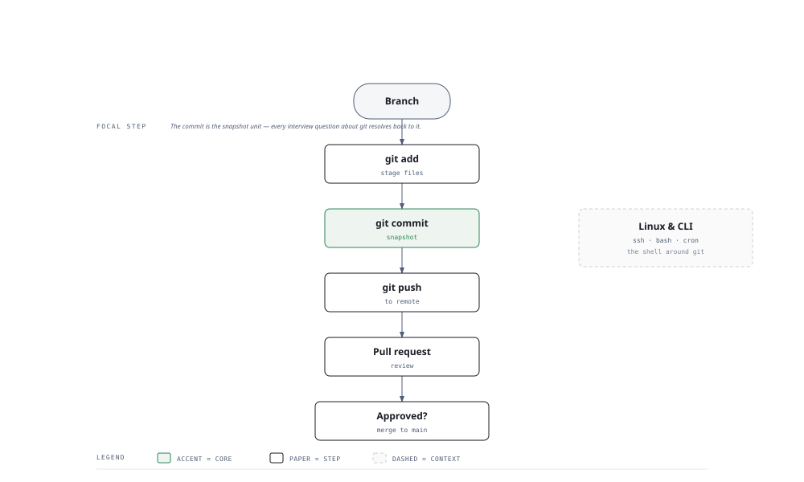

# Visual Notes — Git & Linux CLI

> One diagram, the full picture. Glance at this before reading the chapters and again before interviews.

## What the diagram shows

The lifecycle of a change — the mental model interviewers expect you to have:

1. **Branch** — carve off a new line of work from `main`.
2. **git add** — stage files into the index (the "pre-commit" area).
3. **git commit** — take a snapshot; the unit git is built around.
4. **git push** — send the snapshot to the remote.
5. **Pull request** — propose the change for review.
6. **Approved?** — if yes, merge to main; if no, revise and re-push.
7. **Linux & CLI** — the shell that sits around everything: ssh, bash, file ops, permissions.

## Why this matters for placement

- Git questions are **guaranteed** — every team uses it, and interviewers probe the *mental model*, not command flags.
- Three states (working tree → index → HEAD) and the difference between merge and rebase are the two most-recycled questions.

## Quick revision

- **Three states** — modified (working tree) → staged (index) → committed (HEAD). `git add` then `git commit` moves between them.
- **Undo** — `git restore <file>` (un-modify), `git restore --staged <file>` (un-stage), `git reset` vs `git revert` (history vs new commit).
- **Merge vs rebase** — merge preserves history with a merge commit; rebase replays your commits on top for a linear history. Never rebase shared branches.
- **Remotes** — `git clone`, `git push`, `git pull` (= fetch + merge); `git fetch` only updates local tracking refs.
- **Branching** — `git checkout -b feat/x`; `git branch`; `git merge --no-ff` for feature branches.
- **Linux basics that come up** — `ls`, `cd`, `grep`, `chmod`, `chown`, `ps`, `kill`, `ssh`, `tar`, `find`.

## Related chapters

- [01 — Git Basics](01-git-basics.md)
- [02 — Git Branching](02-git-branching.md)
- [03 — Git Workflow](03-git-workflow.md)
- [04 — Linux Commands](04-linux-commands.md)
- [07 — SSH & Remote Access](07-ssh-and-remote-access.md)

---

**One-line answer for interviews:** *"Git is a snapshot graph; I move changes from the working tree through the index to commits, and merge/rebase to integrate them."*
