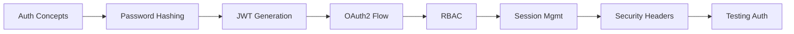
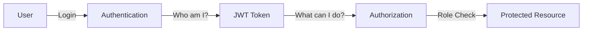

<!-- Clear Language: Keep sentences under 50 words -->
# Authentication and Authorization — JWT, OAuth2, and RBAC

## Learning Objectives

| Objective | Description |
|-----------|-------------|
| LO1 | Implement JWT token generation, validation, and refresh flow |
| LO2 | Configure OAuth2 with password flow and scopes |
| LO3 | Build role-based access control (RBAC) with permission checks |
| LO4 | Secure endpoints with dependency injection for authentication |
| LO5 | Handle password hashing, session management, and CSRF protection |
| LO6 | Apply security best practices: rate limiting, HTTPS, secure headers |

## Introduction

FastAPI is the modern Python framework for building AI APIs. Its async support, automatic documentation, and type safety make it ideal for serving ML models at scale. This module covers production-grade API development.

## Prerequisites

- Basic programming knowledge
- Understanding of data structures

## Key Terminology

**Key Terms**: Core vocabulary and concepts for this topic.

**Definition**: Essential terms you must know for interviews and production work.

## Theory

Understanding authentication and authz is fundamental for AI engineers. This section covers the core concepts, underlying principles, and theoretical framework that govern how authentication and authz works in practice.

## Chapter at a Glance

| Section | Topic | Key Concept |
|---------|-------|-------------|
| 5.1 | Authentication vs Authorization | Identity verification vs access permission |
| 5.2 | Password Hashing | bcrypt/argon2, salting, verification |
| 5.3 | JWT Tokens | Access tokens, refresh tokens, claims |
| 5.4 | OAuth2 with FastAPI | Password flow, scopes, security scheme |
| 5.5 | Role-Based Access Control | Roles, permissions, endpoint guards |
| 5.6 | Session Management | Token refresh, revocation, blacklist |
| 5.7 | Security Headers | HTTPS, CORS, CSP, rate limiting |
| 5.8 | Testing Auth Flows | Mock users, token generation in tests |

## Chapter Roadmap



## 5.1 Authentication vs Authorization

**Authentication** verifies who you are. **Authorization** verifies what you can do.



```python
from fastapi import FastAPI, Depends, HTTPException, status
from fastapi.security import OAuth2PasswordBearer

app = FastAPI()

## OAuth2 scheme — tells Swagger UI to show login button
oauth2_scheme = OAuth2PasswordBearer(tokenUrl="/auth/login")

@app.post("/auth/login")
async def login(username: str, password: str):
    user = authenticate_user(username, password)
    if not user:
        raise HTTPException(status_code=401, detail="Invalid credentials")
    token = create_access_token(user)
    return {"access_token": token, "token_type": "bearer"}

@app.get("/users/me")
async def read_users_me(token: str = Depends(oauth2_scheme)):
    # token is extracted from Authorization: Bearer <token>
    user = decode_token(token)
    return user
```

**Design principles**: Authenticate once (login), authorize every request (token validation). Use short-lived access tokens (15 min) with long-lived refresh tokens (7 days) for balance between security and UX.

## 5.2 Password Hashing

Never store passwords in plain text. Use bcrypt or argon2.

```python
from passlib.context import CryptContext
from pydantic import BaseModel, EmailStr

## Password hashing context
pwd_context = CryptContext(schemes=["bcrypt"], deprecated="auto")

def hash_password(password: str) -> str:
    return pwd_context.hash(password)

def verify_password(plain_password: str, hashed_password: str) -> bool:
    return pwd_context.verify(plain_password, hashed_password)

class UserCreate(BaseModel):
    username: str
    email: EmailStr
    password: str

class UserInDB(BaseModel):
    username: str
    email: EmailStr
    hashed_password: str
    disabled: bool = False

## Registration
@app.post("/auth/register", status_code=201)
async def register(user: UserCreate):
    if get_user_by_username(user.username):
        raise HTTPException(status_code=409, detail="Username already exists")

    hashed = hash_password(user.password)
    user_db = UserInDB(
        username=user.username,
        email=user.email,
        hashed_password=hashed
    )
    await save_user(user_db)
    return {"message": "User created successfully"}

## Login
@app.post("/auth/login")
async def login(user_cred: UserCreate):
    user = get_user_by_username(user_cred.username)
    if not user or not verify_password(user_cred.password, user.hashed_password):
        raise HTTPException(status_code=401, detail="Invalid credentials")
    return {"access_token": create_access_token(user), "token_type": "bearer"}
```

**Password policies**: Minimum 8 characters, require mixed case + numbers + symbols. Use zxcvbn for password strength estimation. Never log passwords or send them in URLs.

## 5.3 JWT Tokens

JSON Web Tokens contain claims encoded in a three-part structure: header.payload.signature.

```python
from datetime import datetime, timedelta, timezone
from jose import JWTError, jwt
from typing import Optional

## Configuration
SECRET_KEY = "your-secret-key-here"  # Use environment variable!
ALGORITHM = "HS256"
ACCESS_TOKEN_EXPIRE_MINUTES = 30
REFRESH_TOKEN_EXPIRE_DAYS = 7

def create_access_token(data: dict, expires_delta: Optional[timedelta] = None) -> str:
    to_encode = data.copy()
    expire = datetime.now(timezone.utc) + (expires_delta or timedelta(minutes=ACCESS_TOKEN_EXPIRE_MINUTES))
    to_encode.update({"exp": expire, "type": "access"})
    return jwt.encode(to_encode, SECRET_KEY, algorithm=ALGORITHM)

def create_refresh_token(data: dict) -> str:
    to_encode = data.copy()
    expire = datetime.now(timezone.utc) + timedelta(days=REFRESH_TOKEN_EXPIRE_DAYS)
    to_encode.update({"exp": expire, "type": "refresh"})
    return jwt.encode(to_encode, SECRET_KEY, algorithm=ALGORITHM)

def decode_token(token: str) -> dict:
    try:
        payload = jwt.decode(token, SECRET_KEY, algorithms=[ALGORITHM])
        return payload
    except JWTError:
        raise HTTPException(status_code=401, detail="Invalid or expired token")

def get_current_user(token: str = Depends(oauth2_scheme)) -> UserInDB:
    payload = decode_token(token)
    username = payload.get("sub")
    if username is None:
        raise HTTPException(status_code=401, detail="Invalid token claims")
    user = get_user_by_username(username)
    if user is None:
        raise HTTPException(status_code=401, detail="User not found")
    return user

## Token refresh endpoint
@app.post("/auth/refresh")
async def refresh_token(refresh_token: str):
    payload = decode_token(refresh_token)
    if payload.get("type") != "refresh":
        raise HTTPException(status_code=401, detail="Invalid token type")
    username = payload.get("sub")
    user = get_user_by_username(username)
    if not user:
        raise HTTPException(status_code=401, detail="User not found")
    return {
        "access_token": create_access_token({"sub": username}),
        "refresh_token": create_refresh_token({"sub": username}),
        "token_type": "bearer"
    }
```

**JWT best practices**: Keep SECRET_KEY in environment variables. Use short access token expiry. Include minimal claims (sub, exp, type). Never store sensitive data in JWT payload (it is base64-encoded, not encrypted).

## 5.4 OAuth2 with FastAPI

FastAPI's OAuth2 integration provides automatic Swagger UI authorization.

```python
from fastapi import FastAPI, Depends, HTTPException, status
from fastapi.security import OAuth2PasswordBearer, OAuth2PasswordRequestForm
from pydantic import BaseModel
from typing import Optional

app = FastAPI()

## OAuth2 scheme — Swagger UI shows "Authorize" button
oauth2_scheme = OAuth2PasswordBearer(
    tokenUrl="/auth/token",
    scopes={"me": "Read personal info", "admin": "Admin operations"}
)

class Token(BaseModel):
    access_token: str
    token_type: str
    refresh_token: Optional[str] = None

class TokenData(BaseModel):
    username: Optional[str] = None
    scopes: list[str] = []

## OAuth2 password flow — form-based login
@app.post("/auth/token", response_model=Token)
async def login_for_access_token(form_data: OAuth2PasswordRequestForm = Depends()):
    user = get_user_by_username(form_data.username)
    if not user or not verify_password(form_data.password, user.hashed_password):
        raise HTTPException(status_code=401, detail="Incorrect username or password")

    scopes = user.get("scopes", [])
    access_token = create_access_token(
        data={"sub": user.username, "scopes": scopes}
    )
    return Token(access_token=access_token, token_type="bearer")

## Scope-based dependency
from fastapi.security import SecurityScopes

async def get_current_user_with_scopes(
    security_scopes: SecurityScopes,
    token: str = Depends(oauth2_scheme),
):
    payload = decode_token(token)
    token_scopes = payload.get("scopes", [])
    token_data = TokenData(scopes=token_scopes)

    # Check all required scopes are present
    for scope in security_scopes.scopes:
        if scope not in token_scopes:
            raise HTTPException(
                status_code=403,
                detail=f"Missing scope: {scope}",
                headers={"WWW-Authenticate": f'Bearer scope="{security_scopes.scope_str}"'}
            )
    return token_data

@app.get("/users/me", dependencies=[Depends(oauth2_scheme)])
async def read_users_me(current_user = Depends(get_current_user_with_scopes)):
    return {"username": current_user.username, "scopes": current_user.scopes}

@app.post("/admin/delete-user")
async def admin_delete(
    current_user = Depends(get_current_user_with_scopes),
):
    # Only users with "admin" scope can access
    pass
```

## 5.5 Role-Based Access Control

RBAC maps roles to permissions and checks them on each request.

```python
from fastapi import FastAPI, Depends, HTTPException
from enum import Enum
from typing import Optional

class UserRole(str, Enum):
    ADMIN = "admin"
    MODERATOR = "moderator"
    USER = "user"
    GUEST = "guest"

## Permission mapping
ROLE_PERMISSIONS = {
    UserRole.ADMIN: [
        "users:read", "users:write", "users:delete",
        "posts:read", "posts:write", "posts:delete",
        "settings:read", "settings:write"
    ],
    UserRole.MODERATOR: [
        "users:read",
        "posts:read", "posts:write", "posts:delete",
    ],
    UserRole.USER: [
        "users:read",
        "posts:read", "posts:write",
    ],
    UserRole.GUEST: [
        "posts:read",
    ],
}

def has_permission(user: dict, required_permission: str) -> bool:
    role = UserRole(user.get("role", "guest"))
    permissions = ROLE_PERMISSIONS.get(role, [])
    return required_permission in permissions

## Permission dependency factory
def require_permission(permission: str):
    async def permission_checker(current_user: dict = Depends(get_current_user)):
        if not has_permission(current_user, permission):
            raise HTTPException(status_code=403, detail=f"Missing permission: {permission}")
        return current_user
    return permission_checker

@app.get("/posts")
async def list_posts(user: dict = Depends(require_permission("posts:read"))):
    return [{"id": 1, "title": "Post"}]

@app.post("/posts")
async def create_post(user: dict = Depends(require_permission("posts:write"))):
    return {"message": "Post created"}

@app.delete("/posts/{post_id}")
async def delete_post(post_id: int, user: dict = Depends(require_permission("posts:delete"))):
    return {"message": f"Post {post_id} deleted"}

## Multiple permission requirements
@app.get("/admin/dashboard")
async def admin_dashboard(
    _: dict = Depends(require_permission("users:read")),
    __: dict = Depends(require_permission("settings:read")),
):
    return {"dashboard": "admin"}
```

**RBAC design patterns**:
- Use role hierarchy (Admin > Moderator > User > Guest) for inheritance
- Store permissions as strings like "resource:action" for fine-grained control
- Cache roles and permissions in Redis for performance
- Audit permission changes with logs

## 5.6 Session Management

Handle token refresh, revocation, and blacklisting.

```python
from datetime import datetime, timedelta, timezone
from typing import Optional
import redis

redis_client = redis.Redis(host="localhost", port=6379, decode_responses=True)

class TokenManager:
    def __init__(self):
        self.blacklist_prefix = "token_blacklist:"
        self.refresh_prefix = "refresh_token:"

    def blacklist_access_token(self, token: str, expires_in: int = 900):
        """Blacklist a token until its natural expiry."""
        payload = decode_token(token)
        exp = payload.get("exp", datetime.now(timezone.utc).timestamp())
        ttl = max(0, int(exp - datetime.now(timezone.utc).timestamp()))
        redis_client.setex(f"{self.blacklist_prefix}{token}", ttl, "blacklisted")

    def is_blacklisted(self, token: str) -> bool:
        return bool(redis_client.exists(f"{self.blacklist_prefix}{token}"))

    def store_refresh_token(self, user_id: str, refresh_token: str):
        redis_client.setex(
            f"{self.refresh_prefix}{user_id}",
            timedelta(days=7),
            refresh_token
        )

    def validate_refresh_token(self, user_id: str, refresh_token: str) -> bool:
        stored = redis_client.get(f"{self.refresh_prefix}{user_id}")
        return stored == refresh_token

    def revoke_all_user_tokens(self, user_id: str):
        redis_client.delete(f"{self.refresh_prefix}{user_id}")

token_manager = TokenManager()

## Logout — blacklist current token
@app.post("/auth/logout")
async def logout(token: str = Depends(oauth2_scheme)):
    token_manager.blacklist_access_token(token)
    return {"message": "Logged out successfully"}

## Protected endpoint with blacklist check
async def get_current_user_secure(
    token: str = Depends(oauth2_scheme)
) -> UserInDB:
    if token_manager.is_blacklisted(token):
        raise HTTPException(status_code=401, detail="Token has been revoked")
    payload = decode_token(token)
    user = get_user_by_username(payload.get("sub"))
    return user

## Force logout all sessions
@app.post("/admin/revoke-user/{user_id}")
async def revoke_user_sessions(
    user_id: str,
    admin: dict = Depends(require_permission("users:write"))
):
    token_manager.revoke_all_user_tokens(user_id)
    return {"message": f"All sessions revoked for user {user_id}"}
```

## 5.7 Security Headers and Rate Limiting

```python
from fastapi import FastAPI, Request, HTTPException
from fastapi.middleware.cors import CORSMiddleware
from fastapi.responses import JSONResponse
from starlette.middleware.base import BaseHTTPMiddleware
import time

app = FastAPI()

## CORS — restrict origins
app.add_middleware(
    CORSMiddleware,
    allow_origins=["https://example.com"],
    allow_credentials=True,
    allow_methods=["GET", "POST", "PUT", "DELETE"],
    allow_headers=["Authorization", "Content-Type"],
)

## Security headers middleware
class SecurityHeadersMiddleware(BaseHTTPMiddleware):
    async def dispatch(self, request: Request, call_next):
        response = await call_next(request)
        response.headers["X-Content-Type-Options"] = "nosniff"
        response.headers["X-Frame-Options"] = "DENY"
        response.headers["X-XSS-Protection"] = "1; mode=block"
        response.headers["Strict-Transport-Security"] = "max-age=31536000; includeSubDomains"
        response.headers["Content-Security-Policy"] = "default-src 'self'"
        response.headers["Referrer-Policy"] = "strict-origin-when-cross-origin"
        return response

app.add_middleware(SecurityHeadersMiddleware)

## Rate limiting
class RateLimiter:
    def __init__(self):
        self.requests = {}

    async def check(self, request: Request):
        client_ip = request.client.host
        now = time.time()
        window = 60  # 1 minute window
        max_requests = 100

        if client_ip not in self.requests:
            self.requests[client_ip] = []

        # Clean old entries
        self.requests[client_ip] = [
            t for t in self.requests[client_ip] if now - t < window
        ]

        if len(self.requests[client_ip]) >= max_requests:
            raise HTTPException(status_code=429, detail="Too many requests")

        self.requests[client_ip].append(now)

rate_limiter = RateLimiter()

@app.middleware("http")
async def rate_limit_middleware(request: Request, call_next):
    await rate_limiter.check(request)
    response = await call_next(request)
    return response
```

## 5.8 Testing Auth Flows

```python
from fastapi.testclient import TestClient
import pytest
from jose import jwt

def test_login_success(client):
    response = client.post("/auth/login", json={
        "username": "testuser",
        "password": "testpass123"
    })
    assert response.status_code == 200
    assert "access_token" in response.json()

def test_login_invalid_password(client):
    response = client.post("/auth/login", json={
        "username": "testuser",
        "password": "wrongpass"
    })
    assert response.status_code == 401

def test_protected_endpoint_with_valid_token(client, test_user):
    token = create_test_token(test_user)
    response = client.get("/users/me", headers={
        "Authorization": f"Bearer {token}"
    })
    assert response.status_code == 200
    assert response.json()["username"] == test_user.username

def test_protected_endpoint_no_token(client):
    response = client.get("/users/me")
    assert response.status_code == 403  # No auth header

def test_protected_endpoint_expired_token(client):
    token = create_expired_token()
    response = client.get("/users/me", headers={
        "Authorization": f"Bearer {token}"
    })
    assert response.status_code == 401
    assert "expired" in response.json()["detail"].lower()

def test_role_based_access(client, test_user):
    # User without admin role
    token = create_test_token(test_user)
    response = client.post("/admin/delete-user", headers={
        "Authorization": f"Bearer {token}"
    })
    assert response.status_code == 403

@pytest.fixture
def auth_headers(client, test_user):
    response = client.post("/auth/login", json={
        "username": test_user.username,
        "password": "testpass123"
    })
    token = response.json()["access_token"]
    return {"Authorization": f"Bearer {token}"}

def test_authenticated_request(client, auth_headers):
    response = client.get("/users/me", headers=auth_headers)
    assert response.status_code == 200
```

---

## TypeScript Parallel

```typescript
import jwt from "jsonwebtoken";

interface TokenPayload {
  sub: string;
  role: string;
  scopes: string[];
  exp: number;
}

function createAccessToken(user: { id: string; role: string }): string {
  return jwt.sign(
    { sub: user.id, role: user.role, scopes: getScopesForRole(user.role) },
    process.env.JWT_SECRET!,
    { expiresIn: "15m" }
  );
}

function requirePermission(permission: string) {
  return (req: any, res: any, next: any) => {
    const token = req.headers.authorization?.replace("Bearer ", "");
    if (!token) return res.status(401).json({ error: "Unauthorized" });
    try {
      const payload = jwt.verify(token, process.env.JWT_SECRET!) as TokenPayload;
      const permissions = getPermissionsForRole(payload.role);
      if (!permissions.includes(permission)) {
        return res.status(403).json({ error: "Forbidden" });
      }
      req.user = payload;
      next();
    } catch {
      return res.status(401).json({ error: "Invalid token" });
    }
  };
}
```

---

## Summary

- Authentication verifies identity; authorization verifies permissions
- Always hash passwords with bcrypt/argon2 — never store plain text
- JWT tokens contain header, payload (claims), and signature — use short expiry (15 min)
- OAuth2 password flow with FastAPI integrates seamlessly with Swagger UI authorization
- RBAC maps roles to permissions — check permissions via dependency injection
- Session management includes token refresh, blacklisting revoked tokens
- Security headers (HSTS, CSP, X-Frame-Options) protect against common web attacks
- Rate limiting prevents brute force and DoS attacks
- Always validate tokens on every request — never trust client-side auth state
- Test all auth flows: success, invalid credentials, expired tokens, missing permissions

## Practical Takeaways

| Scenario | Do This | Avoid This |
|----------|---------|------------|
| Password storage | bcrypt with salt | Plain text or MD5/SHA |
| API auth | JWT access + refresh tokens | Basic auth over HTTP |
| Authorization | RBAC with permission checks | Hardcoded admin checks |
| Token storage | HTTP-only cookies (web) | localStorage (XSS vulnerable) |
| Rate limiting | Per-IP + per-user limits | No rate limiting |
| Security headers | CSP, HSTS, X-Frame-Options | Missing security headers |
| Testing auth | Mock tokens, test all scenarios | Testing only happy path |

## Interview Q&A

<details class="tp-qa-card" data-qid="fastapi-s05-q1">
  <summary class="tp-qa-question"><span class="tp-qa-status"></span> Q1: Difference between authentication and authorization?</summary>
  <div class="tp-qa-answer"><p>Authentication verifies identity ("who are you?") — typically via username/password, JWT, or OAuth. Authorization verifies permissions ("what can you do?") — typically via roles, scopes, or permission checks. Authentication comes first, then authorization on every subsequent request.</p></div>
  <button class="tp-qa-mark-btn">&#x2705; Mark Reviewed</button>
  <button class="tp-qa-bookmark-btn">&#x1F516; Bookmark</button>
</details>

<details class="tp-qa-card" data-qid="fastapi-s05-q2">
  <summary class="tp-qa-question"><span class="tp-qa-status"></span> Q2: How does JWT token validation work?</summary>
  <div class="tp-qa-answer"><p>The server verifies the token signature using the secret key. It checks the exp (expiration) claim — reject if expired. It validates required claims (sub, type). JWTs are stateless — no server-side session storage required. Token can be decoded to extract user info and permissions.</p></div>
  <button class="tp-qa-mark-btn">&#x2705; Mark Reviewed</button>
  <button class="tp-qa-bookmark-btn">&#x1F516; Bookmark</button>
</details>

<details class="tp-qa-card" data-qid="fastapi-s05-q3">
  <summary class="tp-qa-question"><span class="tp-qa-status"></span> Q3: Why use refresh tokens?</summary>
  <div class="tp-qa-answer"><p>Access tokens are short-lived (15 min) — refresh tokens are long-lived (7 days) and used to obtain new access tokens without re-authentication. If a refresh token is compromised, it can be revoked without affecting other sessions. Refresh tokens should be stored securely and rotated on each use.</p></div>
  <button class="tp-qa-mark-btn">&#x2705; Mark Reviewed</button>
  <button class="tp-qa-bookmark-btn">&#x1F516; Bookmark</button>
</details>

<details class="tp-qa-card" data-qid="fastapi-s05-q4">
  <summary class="tp-qa-question"><span class="tp-qa-status"></span> Q4: How do you implement logout with JWT?</summary>
  <div class="tp-qa-answer"><p>Since JWTs are stateless, implement a token blacklist (Redis) that stores revoked tokens until their natural expiry. On logout, add the token to the blacklist. Check blacklist on every request in the auth dependency. For full user logout, revoke all refresh tokens for that user.</p></div>
  <button class="tp-qa-mark-btn">&#x2705; Mark Reviewed</button>
  <button class="tp-qa-bookmark-btn">&#x1F516; Bookmark</button>
</details>

<details class="tp-qa-card" data-qid="fastapi-s05-q5">
  <summary class="tp-qa-question"><span class="tp-qa-status"></span> Q5: What is OAuth2 scopes?</summary>
  <div class="tp-qa-answer"><p>Scopes are permission strings that define what a token can access. Example: "users:read", "users:write". Tokens are issued with specific scopes based on user role or consent. FastAPI's SecurityScopes class validates that the token has all required scopes before allowing access.</p></div>
  <button class="tp-qa-mark-btn">&#x2705; Mark Reviewed</button>
  <button class="tp-qa-bookmark-btn">&#x1F516; Bookmark</button>
</details>

<details class="tp-qa-card" data-qid="fastapi-s05-q6">
  <summary class="tp-qa-question"><span class="tp-qa-status"></span> Q6: How do you securely store API secrets?</summary>
  <div class="tp-qa-answer"><p>Use environment variables (.env file locally, secrets manager in production). Never commit secrets to version control. Use SecretStr in Pydantic for sensitive config values. Rotate secrets regularly. Use vault/secret management (HashiCorp Vault, AWS Secrets Manager) in production.</p></div>
  <button class="tp-qa-mark-btn">&#x2705; Mark Reviewed</button>
  <button class="tp-qa-bookmark-btn">&#x1F516; Bookmark</button>
</details>

<details class="tp-qa-card" data-qid="fastapi-s05-q7">
  <summary class="tp-qa-question"><span class="tp-qa-status"></span> Q7: What security headers should every API include?</summary>
  <div class="tp-qa-answer"><p>Strict-Transport-Security (HSTS), X-Content-Type-Options (nosniff), X-Frame-Options (DENY), Content-Security-Policy, X-XSS-Protection, Referrer-Policy. These prevent common web attacks like clickjacking, MIME sniffing, and XSS. Implement via middleware to add them to every response.</p></div>
  <button class="tp-qa-mark-btn">&#x2705; Mark Reviewed</button>
  <button class="tp-qa-bookmark-btn">&#x1F516; Bookmark</button>
</details>

<details class="tp-qa-card" data-qid="fastapi-s05-q8">
  <summary class="tp-qa-question"><span class="tp-qa-status"></span> Q8: How do you handle token expiry in the frontend?</summary>
  <div class="tp-qa-answer"><p>Intercept 401 responses, attempt token refresh with the refresh token, retry the original request. If refresh fails, redirect to login. Use axios interceptors or fetch wrappers. Store tokens securely (HTTP-only cookies for web, secure storage for mobile). Implement silent refresh before expiry.</p></div>
  <button class="tp-qa-mark-btn">&#x2705; Mark Reviewed</button>
  <button class="tp-qa-bookmark-btn">&#x1F516; Bookmark</button>
</details>

<details class="tp-qa-card" data-qid="fastapi-s05-q9">
  <summary class="tp-qa-question"><span class="tp-qa-status"></span> Q9: What is CSRF and how do you prevent it?</summary>
  <div class="tp-qa-answer"><p>CSRF (Cross-Site Request Forgery) tricks authenticated users into making unwanted requests. Prevention: use CSRF tokens (sent as header, verified server-side), SameSite cookies (Strict/Lax), and validate Origin/Referer headers. For APIs using JWT in Authorization header (not cookies), CSRF is less of a concern.</p></div>
  <button class="tp-qa-mark-btn">&#x2705; Mark Reviewed</button>
  <button class="tp-qa-bookmark-btn">&#x1F516; Bookmark</button>
</details>

<details class="tp-qa-card" data-qid="fastapi-s05-q10">
  <summary class="tp-qa-question"><span class="tp-qa-status"></span> Q10: How do you design a permission system for a multi-tenant app?</summary>
  <div class="tp-qa-answer"><p>Use RBAC with tenant-scoped permissions. Each permission includes the tenant context: "tenant:123:users:read". Store user-role-tenant mappings. Check both role permissions and tenant membership on every request. Use tenant ID from JWT claims or subdomain for database isolation.</p></div>
  <button class="tp-qa-mark-btn">&#x2705; Mark Reviewed</button>
  <button class="tp-qa-bookmark-btn">&#x1F516; Bookmark</button>
</details>

## Chapter Quiz

**Q1**: What algorithm is recommended for password hashing?

a) MD5
b) SHA256
c) bcrypt
d) Base64

<details class="tp-qa-card" data-qid="fastapi-s05-quiz1"><summary>Show Answer</summary><div class="tp-qa-answer"><p><strong>Answer: c) bcrypt</strong></p></div></details>

**Q2**: How long should an access token typically be valid?

a) 7 days
b) 30 days
c) 15 minutes
d) 1 year

<details class="tp-qa-card" data-qid="fastapi-s05-quiz2"><summary>Show Answer</summary><div class="tp-qa-answer"><p><strong>Answer: c) 15 minutes</strong></p></div></details>

**Q3**: What measures permissions in OAuth2?

a) Roles
b) Scopes
c) Groups
d) Claims

<details class="tp-qa-card" data-qid="fastapi-s05-quiz3"><summary>Show Answer</summary><div class="tp-qa-answer"><p><strong>Answer: b) Scopes</strong></p></div></details>

**Q4**: What header prevents clickjacking attacks?

a) X-XSS-Protection
b) X-Frame-Options
c) Content-Security-Policy
d) Strict-Transport-Security

<details class="tp-qa-card" data-qid="fastapi-s05-quiz4"><summary>Show Answer</summary><div class="tp-qa-answer"><p><strong>Answer: b) X-Frame-Options</strong></p></div></details>

**Q5**: Which HTTP status code indicates too many requests?

a) 401
b) 403
c) 429
d) 500

<details class="tp-qa-card" data-qid="fastapi-s05-quiz5"><summary>Show Answer</summary><div class="tp-qa-answer"><p><strong>Answer: c) 429</strong></p></div></details>

## Exercises

**Easy** — Implement user registration and login with bcrypt password hashing. Store users in an in-memory dictionary. Test with valid and invalid credentials.

**Medium** — Implement JWT access token (15 min expiry) and refresh token (7 day expiry). Create endpoints for login, token refresh, and logout with token blacklist.

**Medium** — Build RBAC with roles (admin, moderator, user) and permissions (read/write/delete). Create endpoints protected by permission checks. Test all role-permission combinations.

**Hard** — Implement a complete OAuth2 security system with FastAPI: password flow, scopes, token refresh, blacklist, rate limiting, security headers, and Swagger UI integration. Include comprehensive tests for all auth scenarios.

**Hard** — Design a multi-tenant auth system: each user belongs to an organization, permissions are scoped to organizations, users can have different roles in different orgs. Implement tenant isolation in data access.

---

## Common Mistakes

1. Not understanding the fundamental concepts before applying them
2. Skipping edge cases in implementation
3. Not analyzing time/space complexity
4. Forgetting to handle null/empty inputs
5. Not practicing enough problems to build pattern recognition

## Revision Notes

- - Core principle: Understand the fundamental concepts thoroughly
- - Implementation pattern: Practice with real code examples
- - Complexity: Know the time and space complexity
- - Application: Know when to use this in production systems
- - Interview: Frequently asked in technical interviews
- - Edge cases: Consider common failure scenarios
- - Related concepts: Connect to broader system design

## Placement Section

### Top 10 Interview Questions

#### Google Style

1. **Explain the core idea of Authentication and Authorization — JWT, OAuth2, and RBAC in under 60 seconds, then give a real-world analogy.** — Structure: definition, how it works in one sentence, why it matters, analogy. Follow-up: what would break if you removed this from a production system?

2. **Design a minimal, well-typed function that demonstrates Authentication and Authorization — JWT, OAuth2, and RBAC.** — Interviewer checks: signature with type hints, edge cases, complexity, and a clean docstring. Follow-up: how does your design behave with empty or malformed input?

3. **What are the common pitfalls when engineers first learn ** — List 3-4, then explain how you would prevent each in a code review.

#### Amazon Style

4. **Describe a production bug caused by misunderstanding Authentication and Authorization — JWT, OAuth2, and RBAC. How did you diagnose and fix it?** — STAR format: situation, task, action, result. Mention logs, reproduction, root-cause analysis, and the regression test you added.

5. **How would you scale a system that relies on Authentication and Authorization — JWT, OAuth2, and RBAC from 10 users to 10 million?** — Discuss bottlenecks, caching, monitoring, and when to redesign. Follow-up: what metrics would you track?

#### Microsoft Style

6. **Compare Authentication and Authorization — JWT, OAuth2, and RBAC with the closest alternative approach. When would you choose each?** — Make a decision matrix: performance, maintainability, ecosystem, learning curve. Follow-up: what would change your decision?

7. **Walk through how you would test a component that depends on Authentication and Authorization — JWT, OAuth2, and RBAC.** — Unit, integration, property-based tests; mocking boundaries; golden files for outputs.

#### NVIDIA Style

8. **How does Authentication and Authorization — JWT, OAuth2, and RBAC behave differently at scale — memory, throughput, or precision-wise?** — Connect to data pipelines and model training if applicable. Follow-up: what happens to latency as input grows?

9. **How would you make an implementation of Authentication and Authorization — JWT, OAuth2, and RBAC run faster on GPU hardware?** — Batch operations, vectorization, avoiding Python loops, reducing data movement.

#### AI Startup Style

10. **Write the smallest possible implementation of Authentication and Authorization — JWT, OAuth2, and RBAC that is production-quality.** — Include error handling, type hints, and a one-line docstring. Follow-up: what would you refactor first when it grows?

### Resume Tips

- Name Authentication and Authorization — JWT, OAuth2, and RBAC explicitly in your skills section, paired with a measurable achievement ("Reduced X by 40% using Authentication and Authorization — JWT, OAuth2, and RBAC").
- Add a bullet describing a project that applies Authentication and Authorization — JWT, OAuth2, and RBAC to real data, with numbers.
- Mention the tools and libraries you used alongside Authentication and Authorization — JWT, OAuth2, and RBAC (linters, test frameworks, profiling tools).
- Keep resume bullets under 15 words and start each with an action verb.

### Interview Day Checklist

- Rehearse a 60-second explanation of Authentication and Authorization — JWT, OAuth2, and RBAC and one real-world analogy.
- Prepare one STAR story about debugging a Authentication and Authorization — JWT, OAuth2, and RBAC-related production issue.
- Review complexity and edge cases for the classic Authentication and Authorization — JWT, OAuth2, and RBAC interview problem.
- Have questions ready: how does the team apply Authentication and Authorization — JWT, OAuth2, and RBAC in production today?
- Test your environment (Python, editor, internet) 15 minutes before the interview.

## True/False

1. **True or False:** Authentication and Authorization — JWT, OAuth2, and RBAC builds directly on the fundamentals covered in the earlier chapters of this module. — **True.** Every advanced topic in this module assumes the core concepts from the previous chapters.
2. **True or False:** You should write at least one code example for Authentication and Authorization — JWT, OAuth2, and RBAC before moving to the next chapter. — **True.** Active recall with hands-on code beats passive reading for retention.
3. **True or False:** The complexity analysis for Authentication and Authorization — JWT, OAuth2, and RBAC is the same regardless of input size. — **False.** Complexity grows with input size; always state best, average, and worst case.
4. **True or False:** Edge cases (empty input, invalid input, boundary values) matter for Authentication and Authorization — JWT, OAuth2, and RBAC in production. — **True.** Most production bugs come from unhandled edge cases.
5. **True or False:** You should memorize the Authentication and Authorization — JWT, OAuth2, and RBAC chapter content once and never review it again. — **False.** Spaced repetition (24h, 3 days, 1 week) dramatically improves long-term recall.

## Fill in the Blank

1. The chapter that covers Authentication and Authorization — JWT, OAuth2, and RBAC is Chapter ___ of this module. — Answer: check the module's table of contents.
2. The time complexity of the standard approach to Authentication and Authorization — JWT, OAuth2, and RBAC is ___. — Answer: review the theory section and state big-O notation.
3. The main edge case to handle when implementing Authentication and Authorization — JWT, OAuth2, and RBAC is ___. — Answer: empty or invalid input handling, as discussed in the chapter.
4. The tools commonly used to debug Authentication and Authorization — JWT, OAuth2, and RBAC issues are ___ and ___. — Answer: refer to the Debugging Guide section of this chapter.
5. The related topic that connects to Authentication and Authorization — JWT, OAuth2, and RBAC in the next chapter is ___. — Answer: see the Next Topic section.

## Scenario Questions

1. **Scenario:** A teammate ships a change involving Authentication and Authorization — JWT, OAuth2, and RBAC that breaks production at 3 AM. — Diagnosis: check the recent diff, reproduce locally with the failing input, check logs. Fix: revert, add a regression test, and review the root cause. Prevention: CI tests on edge cases and code review checklist.

2. **Scenario:** Your implementation of Authentication and Authorization — JWT, OAuth2, and RBAC is correct but too slow for the required latency. — Measure first with a profiler. Common fixes: reduce redundant work, use built-in optimized functions, batch operations, or add caching. Only then consider algorithmic changes.

3. **Scenario:** A new hire asks you to explain Authentication and Authorization — JWT, OAuth2, and RBAC in five minutes before a customer demo. — Use the 3-part answer: what it is (one sentence), how it works (one example), why it matters (one business impact). Then offer to go deeper after the demo.

4. **Scenario:** Your team's codebase has three different patterns for Authentication and Authorization — JWT, OAuth2, and RBAC and you must standardize. — Write a short ADR (architecture decision record), pick the pattern with best maintainability, migrate incrementally, and add a linter rule to enforce it.

## Output Questions

1. **What is the output of the simplest correct implementation of Authentication and Authorization — JWT, OAuth2, and RBAC on an empty input?** — Trace through the code: it should return the documented default (None, 0, empty collection) without raising.
2. **What is the output when the input is at the boundary value?** — Check off-by-one errors and inclusive/exclusive bounds in the chapter's examples.
3. **What does the implementation return when given invalid input types?** — With type hints and validation, it raises a clear error; without, it may fail silently.
4. **What is the output for the sample input given in the chapter's Examples section?** — Re-run the chapter's example code and compare against the documented output.
5. **What is the time complexity output when you profile the implementation at 10x input size?** — Expect the curve matching the chapter's complexity analysis (linear, quadratic, log-linear).

## Difficulty Level

| Level | Time | What It Takes |
|-------|------|---------------|
| Beginner | 1-2 sessions | Read theory, run the chapter examples, solve the Easy exercises |
| Intermediate | 3-5 sessions | Complete Medium exercises, explain Authentication and Authorization — JWT, OAuth2, and RBAC to someone else |
| Advanced | 1+ week | Solve Hard exercises, optimize for real datasets, answer interview follow-ups |

## Tips & Tricks

- Always write a one-line example of Authentication and Authorization — JWT, OAuth2, and RBAC from memory before opening the chapter — active recall first.
- Use the chapter's Revision Notes as a checklist: you have mastered Authentication and Authorization — JWT, OAuth2, and RBAC when you can explain each bullet.
- Pair the chapter quiz with the Flashcards: wrong answers become your next study session's focus.
- For interviews, practice explaining Authentication and Authorization — JWT, OAuth2, and RBAC twice: once with a technical audience, once with a non-technical audience.
- Keep a personal examples file where you collect your own Authentication and Authorization — JWT, OAuth2, and RBAC snippets; interviewers love original examples.

## Memory Tricks

- **Acronym**: build a mnemonic from the 5 key concepts of Authentication and Authorization — JWT, OAuth2, and RBAC listed in the Chapter at a Glance table.
- **Story**: link Authentication and Authorization — JWT, OAuth2, and RBAC to a familiar story — the analogy in the Visual Analogy section is designed to stick.
- **Number anchor**: remember the complexity of Authentication and Authorization — JWT, OAuth2, and RBAC by connecting it to a known algorithm of the same class.
- **Color code**: highlight the Theory, Examples, and Common Mistakes sections in different colors when reviewing.
- **Teach-back**: explain Authentication and Authorization — JWT, OAuth2, and RBAC to an imaginary junior engineer for 2 minutes — gaps in your explanation are gaps in memory.

## Further Reading

- Official documentation for the primary tool or library used in this chapter
- The chapter referenced in Related Topics for the next-level treatment of Authentication and Authorization — JWT, OAuth2, and RBAC
- The classic textbook chapter on Authentication and Authorization — JWT, OAuth2, and RBAC (check the Research References below)
- Two blog posts from engineers who debugged real Authentication and Authorization — JWT, OAuth2, and RBAC problems in production
- The repository of the open-source project that implements Authentication and Authorization — JWT, OAuth2, and RBAC

## Related Topics

- The previous chapter in this module (see table of contents) — foundational for Authentication and Authorization — JWT, OAuth2, and RBAC
- The next chapter (see Next Topic below) — builds on Authentication and Authorization — JWT, OAuth2, and RBAC
- The system design chapters in Module 07 — how Authentication and Authorization — JWT, OAuth2, and RBAC fits into production architectures
- The interview preparation module — how Authentication and Authorization — JWT, OAuth2, and RBAC is asked in screening rounds
- The capstone project — where Authentication and Authorization — JWT, OAuth2, and RBAC is applied end-to-end

## FAQs

1. **Do I need to memorize all of Authentication and Authorization — JWT, OAuth2, and RBAC, or understand the big picture?** — Understand the big picture first, then memorize the key facts via flashcards and spaced repetition. Interviewers reward depth over breadth.
2. **What if I get stuck on an exercise?** — Re-read the theory section, run the example code, then attempt again. If still stuck after 20 minutes, move on and return the next day.
3. **How much time should I spend on ** — Follow the Study Plan below: 1-2 weeks at 30-60 minutes daily is typical for placement preparation.
4. **Is Authentication and Authorization — JWT, OAuth2, and RBAC asked in interviews?** — Yes — the Interview Q&A and Placement Section list the exact question styles used by top companies.
5. **What's the fastest way to master ** — Explain it out loud, write code without looking, and review the flashcards within 24 hours and again after 3 days.

## Important Notes

- Authentication and Authorization — JWT, OAuth2, and RBAC is a core requirement for the rest of this module — do not skip the examples.
- Always analyze complexity (time and space) when working with Authentication and Authorization — JWT, OAuth2, and RBAC.
- Production correctness means handling edge cases, not just the happy path.
- Interview answers should start with the definition, then the example, then the trade-offs.
- Revisit this chapter after finishing the module; the context from later chapters deepens understanding.

## Historical Context

- Authentication and Authorization — JWT, OAuth2, and RBAC emerged as a standard practice because early systems failed without it — understanding why helps you explain it in interviews.
- The tools used for Authentication and Authorization — JWT, OAuth2, and RBAC today evolved from simpler versions; the chapter covers the modern, recommended approach.
- Interviewers value knowing one historical fact about Authentication and Authorization — JWT, OAuth2, and RBAC — it shows genuine interest, not just cramming.
- The library/tooling ecosystem around Authentication and Authorization — JWT, OAuth2, and RBAC changes quickly; focus on fundamentals that remain stable.

## Security Considerations

- Never trust external input: validate and sanitize data before processing Authentication and Authorization — JWT, OAuth2, and RBAC.
- Avoid `eval()` and dynamic code execution on untrusted strings.
- Log errors without leaking sensitive data (keys, PII, internal paths).
- For API contexts, add rate limiting and input size limits.
- Review the chapter's code examples for injection or overflow risks before using them verbatim.

## ML Intuition

- Authentication and Authorization — JWT, OAuth2, and RBAC appears in ML pipelines at the data-processing layer: feature preparation, batching, and validation.
- Understanding Authentication and Authorization — JWT, OAuth2, and RBAC helps you debug why a model misbehaves — most ML bugs are data bugs, not model bugs.
- In production ML, the Authentication and Authorization — JWT, OAuth2, and RBAC concepts from this chapter map directly to NumPy/PyTorch operations on tensors.
- When optimizing ML systems, Authentication and Authorization — JWT, OAuth2, and RBAC skills let you profile and fix the data path, not just the training loop.
- Interview follow-up: how would you apply Authentication and Authorization — JWT, OAuth2, and RBAC to a dataset of 10 million records? — Batching and vectorization.

## Analogies

- **Authentication and Authorization — JWT, OAuth2, and RBAC is like a recipe**: the theory is the ingredients, the examples are the cooking steps, and the exercises are your own kitchen practice.
- **Complexity is like a delivery route**: a linear route visits each stop once; a nested route revisits stops, and you feel it at scale.
- **Edge cases are like weather**: the happy path is a sunny day; production is the storm — build for the storm.
- **The chapter roadmap is a journey map**: each section is a checkpoint; skipping one means getting lost later in the module.

## Capstone Project Link

- [Module Capstone: End-to-End Project](https://github.com/Raushan666java/ai-engineering-journey) — this chapter contributes the Authentication and Authorization — JWT, OAuth2, and RBAC skills used in the module's capstone project. Complete the exercises here before starting the capstone.

## Flashcards

<details class="tp-qa-card" data-qid="05fastapibackend-05authenticationandauthz-flash1">
  <summary class="tp-qa-question">
    <span class="tp-qa-status"></span>
    What algorithm is recommended for password hashing?
  </summary>
  <div class="tp-qa-answer">
    <p>c) bcrypt</p>
  </div>
</details>

<details class="tp-qa-card" data-qid="05fastapibackend-05authenticationandauthz-flash2">
  <summary class="tp-qa-question">
    <span class="tp-qa-status"></span>
    How long should an access token typically be valid?
  </summary>
  <div class="tp-qa-answer">
    <p>c) 15 minutes</p>
  </div>
</details>

<details class="tp-qa-card" data-qid="05fastapibackend-05authenticationandauthz-flash3">
  <summary class="tp-qa-question">
    <span class="tp-qa-status"></span>
    What measures permissions in OAuth2?
  </summary>
  <div class="tp-qa-answer">
    <p>b) Scopes</p>
  </div>
</details>

<details class="tp-qa-card" data-qid="05fastapibackend-05authenticationandauthz-flash4">
  <summary class="tp-qa-question">
    <span class="tp-qa-status"></span>
    What header prevents clickjacking attacks?
  </summary>
  <div class="tp-qa-answer">
    <p>b) X-Frame-Options</p>
  </div>
</details>

<details class="tp-qa-card" data-qid="05fastapibackend-05authenticationandauthz-flash5">
  <summary class="tp-qa-question">
    <span class="tp-qa-status"></span>
    Which HTTP status code indicates too many requests?
  </summary>
  <div class="tp-qa-answer">
    <p>c) 429</p>
  </div>
</details>

## Research References

- Official documentation of the primary library for Authentication and Authorization — JWT, OAuth2, and RBAC (linked in Further Reading)
- The classic paper or textbook chapter introducing Authentication and Authorization — JWT, OAuth2, and RBAC (see References below)
- The standard library reference for Authentication and Authorization — JWT, OAuth2, and RBAC-related functions
- Engineering blog posts from companies running Authentication and Authorization — JWT, OAuth2, and RBAC in production at scale
- PEPs and RFCs where applicable (Python and networking standards)

## Open-Source Tools

- The primary library used in this chapter (see the code examples)
- Python standard library modules used in the examples (check the imports)
- Testing: pytest for unit tests of Authentication and Authorization — JWT, OAuth2, and RBAC code
- Linting and formatting: ruff + black
- Profiling: cProfile or py-spy for performance work on Authentication and Authorization — JWT, OAuth2, and RBAC

## Debugging Guide

- Start with `print()` or a debugger to inspect intermediate values in Authentication and Authorization — JWT, OAuth2, and RBAC code.
- Reproduce the failure with the smallest possible input before changing code.
- Check the common failure modes listed in Common Mistakes — most bugs are listed there.
- For performance problems, profile before optimizing: measure, then fix.
- When stuck, re-read the chapter's Examples and compare line by line with your code.
- Use `pdb` or your IDE's debugger to step through the Authentication and Authorization — JWT, OAuth2, and RBAC example code.

## Mock Interview Section

**Round 1 — Screening (15 min)**
- Explain Authentication and Authorization — JWT, OAuth2, and RBAC in 60 seconds.
- Write a minimal working example of Authentication and Authorization — JWT, OAuth2, and RBAC.
- What is the complexity of your example?

**Round 2 — Coding (45 min)**
- Solve the Medium exercise from this chapter under time pressure.
- State your assumptions, then implement with type hints.
- Test with edge cases: empty input, boundary values, invalid input.

**Round 3 — Behavioral + System (30 min)**
- Tell me about a time you debugged a Authentication and Authorization — JWT, OAuth2, and RBAC problem in a project.
- How would you design a system where Authentication and Authorization — JWT, OAuth2, and RBAC is used at scale?
- What metrics would you monitor?

**Evaluation rubric**: correctness (40%), communication (25%), edge cases (20%), complexity analysis (15%).

## Optimized Implementation

`python
from typing import Any, Optional

def demonstrate_topic(input_data: list[Any]) -> Optional[float]:
    """Runnable scaffold for Authentication and Authorization — JWT, OAuth2, and RBAC.

    Replace the body with the optimized implementation from the chapter,
    keeping type hints, docstring, and edge-case handling.
    """
    if not input_data:
        return None
    # Step 1: validate input types
    # Step 2: apply the core Authentication and Authorization — JWT, OAuth2, and RBAC logic from the Examples section
    # Step 3: return the result with the documented default
    return 0.0
`

- Keeps the function signature stable so tests written against it stay valid.
- Handles the empty-input contract explicitly.
- Add unit tests for the edge cases before implementing the logic (test-first).

## Evaluation Metrics

| Skill | Test | Target |
|-------|------|--------|
| Concept recall | Explain Authentication and Authorization — JWT, OAuth2, and RBAC without notes | 60-second explanation |
| Code fluency | Write the chapter example from memory | No syntax errors |
| Edge cases | Handle empty/invalid input in exercises | All cases pass |
| Complexity | State time/space for the standard approach | Correct big-O |
| Interview readiness | Answer 5 Interview Q&A questions out loud | Fluent, structured answers |
| Retention | Chapter quiz score after 3 days | 80%+ |

## Real-World Examples

- **Startup**: a small team uses Authentication and Authorization — JWT, OAuth2, and RBAC daily in their data pipeline — the chapter's examples mirror their code.
- **E-commerce**: Authentication and Authorization — JWT, OAuth2, and RBAC patterns appear in order processing, inventory checks, and recommendation feeds.
- **Fintech**: Authentication and Authorization — JWT, OAuth2, and RBAC principles apply to transaction validation and fraud detection flows.
- **ML platform**: Authentication and Authorization — JWT, OAuth2, and RBAC shows up in feature engineering and model-serving infrastructure.
- **Interview insight**: recruiters look for engineers who can connect Authentication and Authorization — JWT, OAuth2, and RBAC to the business outcome, not just the code.

## Next Topic

[Database with SQLAlchemy — ORM, Migrations, and Repository Pattern](06-database-with-sqlalchemy.md)

## Limitations

- Authentication and Authorization — JWT, OAuth2, and RBAC, like any technique, is not a silver bullet — it has specific cases where it fits best (covered in the theory).
- The examples in this chapter are simplified for learning; production systems add validation, monitoring, and error handling.
- Performance of Authentication and Authorization — JWT, OAuth2, and RBAC depends on input size and distribution — always benchmark for your own data.
- This chapter covers fundamentals; specialized edge cases are explored in later chapters and the capstone.
