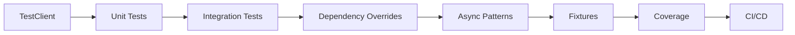

<!-- Clear Language: Keep sentences under 50 words -->
# Testing FastAPI — Unit Tests, Integration Tests, and TDD

## Learning Objectives

| Objective | Description |
|-----------|-------------|
| LO1 | Set up pytest with FastAPI's TestClient for HTTP testing |
| LO2 | Write unit tests for Pydantic models, dependencies, and business logic |
| LO3 | Implement integration tests with database fixtures |
| LO4 | Mock external services and override dependencies |
| LO5 | Apply test-driven development (TDD) for API endpoints |
| LO6 | Measure test coverage and implement CI pipeline testing |

## Introduction

FastAPI is the modern Python framework for building AI APIs. Its async support, automatic documentation, and type safety make it ideal for serving ML models at scale. This module covers production-grade API development.

## Prerequisites

- Basic programming knowledge
- Understanding of data structures

## Key Terminology

**Key Terms**: Core vocabulary and concepts for this topic.

**Definition**: Essential terms you must know for interviews and production work.

## Theory

Understanding testing fastapi is fundamental for AI engineers. This section covers the core concepts, underlying principles, and theoretical framework that govern how testing fastapi works in practice.

## Chapter at a Glance

| Section | Topic | Key Concept |
|---------|-------|-------------|
| 8.1 | TestClient Setup | pytest, TestClient, async tests |
| 8.2 | Unit Testing | Models, validators, pure functions |
| 8.3 | Integration Testing | Database, API endpoints, full workflows |
| 8.4 | Dependency Overrides | Mocking external services |
| 8.5 | Async Test Patterns | Testing async endpoints and tasks |
| 8.6 | Test Fixtures | Reusable test data and setup |
| 8.7 | Test Coverage | Measuring and improving coverage |
| 8.8 | CI/CD Testing | GitHub Actions, pre-commit hooks |

## Chapter Roadmap



## 8.1 TestClient Setup

FastAPI provides TestClient for making HTTP requests to your app without running a server.

```python

## requirements-dev.txt

## pytest

## httpx

## pytest-asyncio

## pytest-cov

## tests/conftest.py
import pytest
from fastapi.testclient import TestClient
from app.main import app

@pytest.fixture
def client():
    return TestClient(app)

## tests/test_main.py
def test_root_endpoint(client):
    response = client.get("/")
    assert response.status_code == 200
    assert response.json() == {"message": "Hello, FastAPI!"}

def test_create_user(client):
    response = client.post(
        "/users",
        json={"name": "Alice", "email": "alice@example.com"},
    )
    assert response.status_code == 201
    data = response.json()
    assert data["name"] == "Alice"
    assert "id" in data

def test_get_user_not_found(client):
    response = client.get("/users/999")
    assert response.status_code == 404
    assert response.json()["detail"] == "User not found"

def test_invalid_email(client):
    response = client.post(
        "/users",
        json={"name": "Bob", "email": "invalid-email"},
    )
    assert response.status_code == 422
    errors = response.json()["detail"]
    assert any("email" in str(e["loc"]) for e in errors)
```

**Async TestClient**:

```python
import pytest
from httpx import ASGITransport, AsyncClient

@pytest.fixture
async def async_client():
    transport = ASGITransport(app=app)
    async with AsyncClient(transport=transport, base_url="http://test") as client:
        yield client

@pytest.mark.asyncio
async def test_async_endpoint(async_client):
    response = await async_client.get("/async-data")
    assert response.status_code == 200
```

## 8.2 Unit Testing

Test pure functions, validators, and model logic in isolation.

```python

## app/models/user.py
from pydantic import BaseModel, field_validator, EmailStr

class UserCreate(BaseModel):
    username: str
    email: EmailStr
    password: str

    @field_validator("password")
    @classmethod
    def password_strength(cls, v: str) -> str:
        if len(v) < 8:
            raise ValueError("Password must be at least 8 characters")
        if not any(c.isupper() for c in v):
            raise ValueError("Password must contain an uppercase letter")
        if not any(c.isdigit() for c in v):
            raise ValueError("Password must contain a number")
        return v

## tests/test_models.py
import pytest
from app.models.user import UserCreate

def test_valid_user():
    user = UserCreate(
        username="alice",
        email="alice@example.com",
        password="SecurePass1",
    )
    assert user.username == "alice"

def test_weak_password():
    with pytest.raises(ValueError, match="at least 8 characters"):
        UserCreate(username="bob", email="bob@example.com", password="Sh0rt")

def test_missing_uppercase():
    with pytest.raises(ValueError, match="uppercase"):
        UserCreate(username="bob", email="bob@example.com", password="lowercase1")

def test_missing_digit():
    with pytest.raises(ValueError, match="number"):
        UserCreate(username="bob", email="bob@example.com", password="NoDigits!")

## Test utility functions

## app/utils/security.py
from passlib.context import CryptContext

pwd_context = CryptContext(schemes=["bcrypt"], deprecated="auto")

def hash_password(password: str) -> str:
    return pwd_context.hash(password)

def verify_password(plain: str, hashed: str) -> bool:
    return pwd_context.verify(plain, hashed)

## tests/test_security.py
def test_password_hash_and_verify():
    password = "SecurePass123!"
    hashed = hash_password(password)
    assert hashed != password
    assert verify_password(password, hashed)
    assert not verify_password("WrongPassword", hashed)
```

**Unit test best practices**:
- Test one thing per test function
- Use descriptive test names (test_function_scenario_expected)
- Test edge cases: empty input, boundary values, invalid types
- Mock external dependencies in unit tests
- Keep tests fast — no database or network calls

## 8.3 Integration Testing

Test the full stack — database, API, and services together.

```python

## tests/conftest.py — database fixture
import pytest
from sqlalchemy import create_engine
from sqlalchemy.orm import sessionmaker
from app.database import Base, get_db
from app.main import app

TEST_DATABASE_URL = "sqlite:///./test.db"
test_engine = create_engine(TEST_DATABASE_URL, connect_args={"check_same_thread": False})
TestSessionLocal = sessionmaker(autocommit=False, autoflush=False, bind=test_engine)

def override_get_db():
    db = TestSessionLocal()
    try:
        yield db
    finally:
        db.close()

app.dependency_overrides[get_db] = override_get_db

@pytest.fixture(autouse=True)
def setup_database():
    Base.metadata.create_all(bind=test_engine)
    yield
    Base.metadata.drop_all(bind=test_engine)

## tests/test_integration.py
def test_create_and_get_user(client):
    # Create user
    create_resp = client.post("/users", json={
        "username": "alice",
        "email": "alice@example.com",
        "password": "SecurePass1",
    })
    assert create_resp.status_code == 201
    user_id = create_resp.json()["id"]

    # Get user
    get_resp = client.get(f"/users/{user_id}")
    assert get_resp.status_code == 200
    assert get_resp.json()["username"] == "alice"

def test_list_users_pagination(client):
    # Create multiple users
    for i in range(15):
        client.post("/users", json={
            "username": f"user{i}", "email": f"user{i}@example.com", "password": "SecurePass1"
        })

    # Test pagination
    resp = client.get("/users?skip=0&limit=10")
    assert resp.status_code == 200
    assert len(resp.json()) == 10

    resp = client.get("/users?skip=10&limit=10")
    assert len(resp.json()) == 5

def test_full_user_workflow(client):
    # Register -> Login -> Update -> Delete
    reg_resp = client.post("/users", json={
        "username": "alice", "email": "alice@example.com", "password": "SecurePass1"
    })
    assert reg_resp.status_code == 201

    login_resp = client.post("/auth/login", json={
        "username": "alice", "password": "SecurePass1"
    })
    assert login_resp.status_code == 200
    token = login_resp.json()["access_token"]
    headers = {"Authorization": f"Bearer {token}"}

    update_resp = client.patch("/users/me", json={"full_name": "Alice Smith"}, headers=headers)
    assert update_resp.status_code == 200

    delete_resp = client.delete("/users/me", headers=headers)
    assert delete_resp.status_code == 204
```

## 8.4 Dependency Overrides

Mock external services by overriding FastAPI dependencies.

```python

## tests/conftest.py — mock email service
from app.dependencies import send_email

## Mock dependency
async def mock_send_email(to: str, subject: str, body: str):
    print(f"Mock email sent to {to}: {subject}")
    return {"status": "sent"}

app.dependency_overrides[send_email] = mock_send_email

## Mock authentication
from app.dependencies import get_current_user

mock_user = {"id": 1, "username": "testuser", "role": "admin"}

async def override_get_current_user():
    return mock_user

app.dependency_overrides[get_current_user] = override_get_current_user

## Test with mocked auth
def test_protected_endpoint_with_mock(client):
    response = client.get("/admin/dashboard")
    assert response.status_code == 200
    assert response.json()["user"] == mock_user

## Mock HTTPX external API calls
from unittest.mock import patch, AsyncMock

@patch("httpx.AsyncClient.get")
async def test_external_api_call(mock_get):
    mock_get.return_value.json = AsyncMock(return_value={"data": "mocked"})
    mock_get.return_value.status_code = 200

    async with AsyncClient(transport=ASGITransport(app=app), base_url="http://test") as client:
        response = await client.get("/external-data")
        assert response.status_code == 200

## Clear overrides after tests
@pytest.fixture(autouse=True)
def clear_overrides():
    yield
    app.dependency_overrides.clear()
```

**Mocking strategies**:

| Library | Use Case |
|---------|----------|
| unittest.mock | Standard Python mocking |
| pytest-mock | pytest integration |
| httpx-mock | HTTP client mocking |
| responses | Requests library mocking |
| moto | AWS service mocking |

## 8.5 Async Test Patterns

```python
import pytest
from httpx import ASGITransport, AsyncClient

## Async test configuration
@pytest.mark.asyncio
async def test_async_create_user():
    transport = ASGITransport(app=app)
    async with AsyncClient(transport=transport, base_url="http://test") as client:
        response = await client.post("/users", json={
            "name": "Alice", "email": "alice@example.com"
        })
        assert response.status_code == 201

## Testing WebSocket endpoints
def test_websocket():
    with TestClient(app) as client:
        with client.websocket_connect("/ws") as websocket:
            websocket.send_text("Hello!")
            data = websocket.receive_text()
            assert data == "Echo: Hello!"

## Testing background tasks
from unittest.mock import patch

def test_background_task_execution(client):
    with patch("app.tasks.send_welcome_email") as mock_task:
        response = client.post("/users", json={
            "name": "Bob", "email": "bob@example.com"
        })
        assert response.status_code == 201
        mock_task.assert_called_once()

## Testing async generators (database sessions)
@pytest.mark.asyncio
async def test_generator_dependency():
    async def mock_get_db():
        yield {"query": "mocked"}

    app.dependency_overrides[get_db] = mock_get_db
    async with AsyncClient(transport=ASGITransport(app=app), base_url="http://test") as client:
        response = await client.get("/users")
        assert response.status_code == 200
```

## 8.6 Test Fixtures

```python

## tests/factories.py — test data factories
import factory
from app.models.user import UserCreate

class UserFactory(factory.Factory):
    class Meta:
        model = dict

    username = factory.Sequence(lambda n: f"user{n}")
    email = factory.LazyAttribute(lambda o: f"{o.username}@example.com")
    password = "SecurePass1"
    full_name = factory.Faker("name")

## tests/conftest.py — fixtures
@pytest.fixture
def sample_user():
    return UserFactory()

@pytest.fixture
def sample_users_list():
    return [UserFactory() for _ in range(5)]

@pytest.fixture
def auth_token(client, sample_user):
    reg_resp = client.post("/users", json=sample_user)
    user_id = reg_resp.json()["id"]
    login_resp = client.post("/auth/login", json={
        "username": sample_user["username"],
        "password": sample_user["password"],
    })
    return login_resp.json()["access_token"]

@pytest.fixture
def auth_headers(auth_token):
    return {"Authorization": f"Bearer {auth_token}"}

## Using fixtures
def test_create_post(client, auth_headers):
    response = client.post("/posts", json={
        "title": "Test Post",
        "content": "Test content",
    }, headers=auth_headers)
    assert response.status_code == 201

def test_list_posts_with_auth(client, auth_headers):
    response = client.get("/posts", headers=auth_headers)
    assert response.status_code == 200
```

## 8.7 Test Coverage

```python

## Run coverage

## pytest --cov=app tests/ --cov-report=html --cov-report=term-missing

## .coveragerc
[run]
source = app
omit = */migrations/*,*/tests/*

[report]
exclude_lines =
    pragma: no cover
    def __repr__
    raise NotImplementedError
    if __name__ == .__main__.:
    pass

## Coverage targets

## Minimum: 80% line coverage

## Critical paths: 100%

## New code: 90%+

## tests/test_coverage.py
def test_all_endpoints_have_tests(client):
    """Check that all registered routes have at least one test."""
    routes = [route.path for route in app.routes if hasattr(route, "methods")]
    # Compare with collected test cases
    tested_routes = extract_tested_routes()
    untested = set(routes) - set(tested_routes)
    assert len(untested) == 0, f"Untested routes: {untested}"
```

**Coverage best practices**:
- Aim for 80%+ coverage, not 100%
- Focus on business logic coverage, not trivial getters/setters
- Use coverage reports to identify untested code paths
- Set coverage gates in CI pipeline
- Don't sacrifice test quality for coverage percentage

## 8.8 CI/CD Testing

```yaml

## .github/workflows/test.yml
name: Test
on: [push, pull_request]

jobs:
  test:
    runs-on: ubuntu-latest
    services:
      postgres:
        image: postgres:15
        env:
          POSTGRES_DB: testdb
          POSTGRES_USER: testuser
          POSTGRES_PASSWORD: testpass
        ports:
          - 5432:5432
      redis:
        image: redis:7
        ports:
          - 6379:6379

    steps:
      - uses: actions/checkout@v4
      - uses: actions/setup-python@v5
        with:
          python-version: "3.12"
      - name: Install dependencies
        run: |
          pip install -r requirements.txt
          pip install -r requirements-dev.txt
      - name: Lint
        run: ruff check app/
      - name: Type check
        run: mypy app/
      - name: Test with coverage
        run: |
          pytest tests/ --cov=app/ --cov-report=xml
      - name: Upload coverage
        uses: codecov/codecov-action@v3
```

```yaml

## pre-commit config
repos:
  - repo: https://github.com/pre-commit/pre-commit-hooks
    rev: v4.5.0
    hooks:
      - id: trailing-whitespace
      - id: end-of-file-fixer
  - repo: https://github.com/astral-sh/ruff-pre-commit
    rev: v0.1.0
    hooks:
      - id: ruff
  - repo: local
    hooks:
      - id: pytest
        name: pytest
        entry: pytest tests/
        language: system
        pass_filenames: false
        always_run: true
```

---

## TypeScript Parallel

```typescript
import { describe, it, expect, vi } from "vitest";
import request from "supertest";
import app from "../app";

describe("Users API", () => {
  it("creates a user", async () => {
    const res = await request(app)
      .post("/users")
      .send({ name: "Alice", email: "alice@test.com" });
    expect(res.status).toBe(201);
    expect(res.body).toHaveProperty("id");
  });

  it("returns 404 for unknown user", async () => {
    const res = await request(app).get("/users/999");
    expect(res.status).toBe(404);
  });
});

// Mock with vitest
vi.mock("../services/email", () => ({
  sendEmail: vi.fn().mockResolvedValue({ status: "sent" }),
}));
```

---

## Summary

- FastAPI TestClient wraps httpx for making HTTP requests without running a server
- Unit tests validate models, validators, and business logic in isolation
- Integration tests verify the full stack: database, API endpoints, and workflows
- Dependency overrides replace real services (database, email, auth) with mocks
- Async tests require pytest-asyncio and AsyncClient for WebSocket testing
- Test fixtures provide reusable setup data and context for tests
- Test coverage (pytest-cov) measures what code is exercised by tests
- CI/CD pipelines run tests automatically on every push
- Mock external HTTP calls, databases, and message queues in tests
- TDD leads to better API design and fewer bugs

## Practical Takeaways

| Scenario | Do This | Avoid This |
|----------|---------|------------|
| API testing | TestClient with pytest | Manual curl testing |
| Database | Test with test database | Using production database |
| External APIs | Mock HTTPX calls | Making real API calls |
| Auth endpoints | Mock user dependency | Hardcoded tokens |
| Coverage | 80%+ with pytest-cov | 100% coverage obsession |
| CI/CD | GitHub Actions for testing | Testing only locally |
| Test data | Factory fixtures | Hardcoded test data |

## Interview Q&A

<details class="tp-qa-card" data-qid="fastapi-s08-q1">
  <summary class="tp-qa-question"><span class="tp-qa-status"></span> Q1: How does TestClient work without a running server?</summary>
  <div class="tp-qa-answer"><p>TestClient uses Starlette's TestClient (based on httpx) which makes ASI calls directly to the application without opening a socket. It calls the ASGI application directly with the ASGI protocol, bypassing the network stack. This makes tests fast and eliminates the need to manage server processes.</p></div>
  <button class="tp-qa-mark-btn">&#x2705; Mark Reviewed</button>
  <button class="tp-qa-bookmark-btn">&#x1F516; Bookmark</button>
</details>

<details class="tp-qa-card" data-qid="fastapi-s08-q2">
  <summary class="tp-qa-question"><span class="tp-qa-status"></span> Q2: How do you test async endpoints in FastAPI?</summary>
  <div class="tp-qa-answer"><p>Use httpx.AsyncClient with ASGITransport for async tests. Mark tests with @pytest.mark.asyncio. The AsyncClient makes ASGI calls without blocking. For WebSocket testing, use TestClient's websocket_connect context manager.</p></div>
  <button class="tp-qa-mark-btn">&#x2705; Mark Reviewed</button>
  <button class="tp-qa-bookmark-btn">&#x1F516; Bookmark</button>
</details>

<details class="tp-qa-card" data-qid="fastapi-s08-q3">
  <summary class="tp-qa-question"><span class="tp-qa-status"></span> Q3: How do you mock database dependencies in tests?</summary>
  <div class="tp-qa-answer"><p>Create a test database (SQLite for unit tests, test PostgreSQL for integration). Override the get_db dependency with a function that returns a test session. Use fixtures to create tables before tests and drop them after. Use transaction rollback for isolation between tests.</p></div>
  <button class="tp-qa-mark-btn">&#x2705; Mark Reviewed</button>
  <button class="tp-qa-bookmark-btn">&#x1F516; Bookmark</button>
</details>

<details class="tp-qa-card" data-qid="fastapi-s08-q4">
  <summary class="tp-qa-question"><span class="tp-qa-status"></span> Q4: What is the difference between unit and integration tests?</summary>
  <div class="tp-qa-answer"><p>Unit tests test isolated components (models, validators, pure functions) with mocked dependencies. They are fast and focused. Integration tests test the full stack (API + database + external services) to verify components work together correctly. Both are essential — unit tests for speed, integration tests for confidence.</p></div>
  <button class="tp-qa-mark-btn">&#x2705; Mark Reviewed</button>
  <button class="tp-qa-bookmark-btn">&#x1F516; Bookmark</button>
</details>

<details class="tp-qa-card" data-qid="fastapi-s08-q5">
  <summary class="tp-qa-question"><span class="tp-qa-status"></span> Q5: How do you test WebSocket endpoints?</summary>
  <div class="tp-qa-answer"><p>Use TestClient's websocket_connect context manager: with client.websocket_connect("/ws") as websocket: websocket.send_text("msg"); data = websocket.receive_text(). Test connection acceptance, message echo, broadcasting, error handling, and disconnection scenarios.</p></div>
  <button class="tp-qa-mark-btn">&#x2705; Mark Reviewed</button>
  <button class="tp-qa-bookmark-btn">&#x1F516; Bookmark</button>
</details>

<details class="tp-qa-card" data-qid="fastapi-s08-q6">
  <summary class="tp-qa-question"><span class="tp-qa-status"></span> Q6: What is a good test coverage target?</summary>
  <div class="tp-qa-answer"><p>80% line coverage is a good minimum target. Focus on covering business logic — validation, authorization, data transformation. Don't chase 100% — getters, setters, and configuration files don't need exhaustive testing. Use coverage reports to find untested critical paths and edge cases.</p></div>
  <button class="tp-qa-mark-btn">&#x2705; Mark Reviewed</button>
  <button class="tp-qa-bookmark-btn">&#x1F516; Bookmark</button>
</details>

<details class="tp-qa-card" data-qid="fastapi-s08-q7">
  <summary class="tp-qa-question"><span class="tp-qa-status"></span> Q7: How do you test background tasks?</summary>
  <div class="tp-qa-answer"><p>Use unittest.mock to verify the background task function is called with correct arguments. Since tasks run after the response, check they were scheduled (not their execution result). For Celery tasks, test the task function directly (unit test) and verify task.delay() is called (integration test).</p></div>
  <button class="tp-qa-mark-btn">&#x2705; Mark Reviewed</button>
  <button class="tp-qa-bookmark-btn">&#x1F516; Bookmark</button>
</details>

<details class="tp-qa-card" data-qid="fastapi-s08-q8">
  <summary class="tp-qa-question"><span class="tp-qa-status"></span> Q8: How do you test file uploads?</summary>
  <div class="tp-qa-answer"><p>TestClient accepts files parameter: client.post("/upload", files={"file": ("test.txt", b"content", "text/plain")}). Test with various file types, sizes, and invalid content. Verify file is saved correctly. Test error cases: missing file, wrong content type, file too large.</p></div>
  <button class="tp-qa-mark-btn">&#x2705; Mark Reviewed</button>
  <button class="tp-qa-bookmark-btn">&#x1F516; Bookmark</button>
</details>

<details class="tp-qa-card" data-qid="fastapi-s08-q9">
  <summary class="tp-qa-question"><span class="tp-qa-status"></span> Q9: What is the purpose of conftest.py?</summary>
  <div class="tp-qa-answer"><p>conftest.py contains fixtures and hooks shared across test files. pytest automatically discovers conftest.py files in test directories. Define fixtures here: database setup, TestClient, authentication, mock services. Fixtures declared in conftest.py are available to all test files in the same directory hierarchy.</p></div>
  <button class="tp-qa-mark-btn">&#x2705; Mark Reviewed</button>
  <button class="tp-qa-bookmark-btn">&#x1F516; Bookmark</button>
</details>

<details class="tp-qa-card" data-qid="fastapi-s08-q10">
  <summary class="tp-qa-question"><span class="tp-qa-status"></span> Q10: How do you test error handling and edge cases?</summary>
  <div class="tp-qa-answer"><p>Test each 4xx and 5xx status code scenario: 400 (validation), 401 (no auth), 403 (wrong role), 404 (not found), 409 (conflict), 422 (invalid input), 429 (rate limit), 500 (server error). Test boundary values, empty inputs, missing required fields, malformed JSON, and concurrent requests.</p></div>
  <button class="tp-qa-mark-btn">&#x2705; Mark Reviewed</button>
  <button class="tp-qa-bookmark-btn">&#x1F516; Bookmark</button>
</details>

## Chapter Quiz

**Q1**: What class does FastAPI provide for HTTP testing?

a) TestHTTP
b) TestClient
c) APITester
d) MockClient

<details class="tp-qa-card" data-qid="fastapi-s08-quiz1"><summary>Show Answer</summary><div class="tp-qa-answer"><p><strong>Answer: b) TestClient</strong></p></div></details>

**Q2**: How do you override a dependency for testing?

a) app.override()
b) app.dependency_overrides[dependency] = mock
c) dependency.mock = True
d) patch(dependency)

<details class="tp-qa-card" data-qid="fastapi-s08-quiz2"><summary>Show Answer</summary><div class="tp-qa-answer"><p><strong>Answer: b) app.dependency_overrides[dependency] = mock</strong></p></div></details>

**Q3**: What is a good minimum test coverage target?

a) 50%
b) 60%
c) 80%
d) 100%

<details class="tp-qa-card" data-qid="fastapi-s08-quiz3"><summary>Show Answer</summary><div class="tp-qa-answer"><p><strong>Answer: c) 80%</strong></p></div></details>

**Q4**: How do you test async endpoints?

a) TestClient works automatically
b) Use AsyncClient with ASGITransport
c) Tests don't support async
d) Use async TestClient()

<details class="tp-qa-card" data-qid="fastapi-s08-quiz4"><summary>Show Answer</summary><div class="tp-qa-answer"><p><strong>Answer: b) Use AsyncClient with ASGITransport</strong></p></div></details>

**Q5**: What tool measures test coverage in pytest?

a) pytest-cov
b) pytest-cover
c) coverage.py
d) pytest-measure

<details class="tp-qa-card" data-qid="fastapi-s08-quiz5"><summary>Show Answer</summary><div class="tp-qa-answer"><p><strong>Answer: a) pytest-cov</strong></p></div></details>

## Exercises

**Easy** — Write unit tests for a UserRegistration Pydantic model with password validation rules. Test valid passwords, weak passwords, missing uppercase, and missing numbers.

**Medium** — Set up integration tests for a CRUD API with TestClient and an in-memory SQLite database. Test create, read, update, and delete operations. Include 404 and validation error tests.

**Medium** — Write tests that mock an external HTTP API. Create an endpoint that fetches weather data from an external service. Mock the HTTPX call and test both success and failure scenarios.

**Hard** — Implement a complete test suite for an authenticated API with JWT. Test: successful login, invalid credentials, expired token, blacklisted token, role-based access (admin vs user). Use fixture factories for test data.

**Hard** — Set up CI/CD pipeline with GitHub Actions: install dependencies, run linting (ruff), type checking (mypy), tests with coverage, and upload coverage report. Add pre-commit hooks for local testing.

---

## Common Mistakes

1. Not understanding the fundamental concepts before applying them
2. Skipping edge cases in implementation
3. Not analyzing time/space complexity
4. Forgetting to handle null/empty inputs
5. Not practicing enough problems to build pattern recognition

## Revision Notes

- - Core principle: Understand the fundamental concepts thoroughly
- - Implementation pattern: Practice with real code examples
- - Complexity: Know the time and space complexity
- - Application: Know when to use this in production systems
- - Interview: Frequently asked in technical interviews
- - Edge cases: Consider common failure scenarios
- - Related concepts: Connect to broader system design

## Placement Section

### Top 10 Interview Questions

#### Google Style

1. **Explain the core idea of Testing FastAPI — Unit Tests, Integration Tests, and TDD in under 60 seconds, then give a real-world analogy.** — Structure: definition, how it works in one sentence, why it matters, analogy. Follow-up: what would break if you removed this from a production system?

2. **Design a minimal, well-typed function that demonstrates Testing FastAPI — Unit Tests, Integration Tests, and TDD.** — Interviewer checks: signature with type hints, edge cases, complexity, and a clean docstring. Follow-up: how does your design behave with empty or malformed input?

3. **What are the common pitfalls when engineers first learn ** — List 3-4, then explain how you would prevent each in a code review.

#### Amazon Style

4. **Describe a production bug caused by misunderstanding Testing FastAPI — Unit Tests, Integration Tests, and TDD. How did you diagnose and fix it?** — STAR format: situation, task, action, result. Mention logs, reproduction, root-cause analysis, and the regression test you added.

5. **How would you scale a system that relies on Testing FastAPI — Unit Tests, Integration Tests, and TDD from 10 users to 10 million?** — Discuss bottlenecks, caching, monitoring, and when to redesign. Follow-up: what metrics would you track?

#### Microsoft Style

6. **Compare Testing FastAPI — Unit Tests, Integration Tests, and TDD with the closest alternative approach. When would you choose each?** — Make a decision matrix: performance, maintainability, ecosystem, learning curve. Follow-up: what would change your decision?

7. **Walk through how you would test a component that depends on Testing FastAPI — Unit Tests, Integration Tests, and TDD.** — Unit, integration, property-based tests; mocking boundaries; golden files for outputs.

#### NVIDIA Style

8. **How does Testing FastAPI — Unit Tests, Integration Tests, and TDD behave differently at scale — memory, throughput, or precision-wise?** — Connect to data pipelines and model training if applicable. Follow-up: what happens to latency as input grows?

9. **How would you make an implementation of Testing FastAPI — Unit Tests, Integration Tests, and TDD run faster on GPU hardware?** — Batch operations, vectorization, avoiding Python loops, reducing data movement.

#### AI Startup Style

10. **Write the smallest possible implementation of Testing FastAPI — Unit Tests, Integration Tests, and TDD that is production-quality.** — Include error handling, type hints, and a one-line docstring. Follow-up: what would you refactor first when it grows?

### Resume Tips

- Name Testing FastAPI — Unit Tests, Integration Tests, and TDD explicitly in your skills section, paired with a measurable achievement ("Reduced X by 40% using Testing FastAPI — Unit Tests, Integration Tests, and TDD").
- Add a bullet describing a project that applies Testing FastAPI — Unit Tests, Integration Tests, and TDD to real data, with numbers.
- Mention the tools and libraries you used alongside Testing FastAPI — Unit Tests, Integration Tests, and TDD (linters, test frameworks, profiling tools).
- Keep resume bullets under 15 words and start each with an action verb.

### Interview Day Checklist

- Rehearse a 60-second explanation of Testing FastAPI — Unit Tests, Integration Tests, and TDD and one real-world analogy.
- Prepare one STAR story about debugging a Testing FastAPI — Unit Tests, Integration Tests, and TDD-related production issue.
- Review complexity and edge cases for the classic Testing FastAPI — Unit Tests, Integration Tests, and TDD interview problem.
- Have questions ready: how does the team apply Testing FastAPI — Unit Tests, Integration Tests, and TDD in production today?
- Test your environment (Python, editor, internet) 15 minutes before the interview.

## True/False

1. **True or False:** Testing FastAPI — Unit Tests, Integration Tests, and TDD builds directly on the fundamentals covered in the earlier chapters of this module. — **True.** Every advanced topic in this module assumes the core concepts from the previous chapters.
2. **True or False:** You should write at least one code example for Testing FastAPI — Unit Tests, Integration Tests, and TDD before moving to the next chapter. — **True.** Active recall with hands-on code beats passive reading for retention.
3. **True or False:** The complexity analysis for Testing FastAPI — Unit Tests, Integration Tests, and TDD is the same regardless of input size. — **False.** Complexity grows with input size; always state best, average, and worst case.
4. **True or False:** Edge cases (empty input, invalid input, boundary values) matter for Testing FastAPI — Unit Tests, Integration Tests, and TDD in production. — **True.** Most production bugs come from unhandled edge cases.
5. **True or False:** You should memorize the Testing FastAPI — Unit Tests, Integration Tests, and TDD chapter content once and never review it again. — **False.** Spaced repetition (24h, 3 days, 1 week) dramatically improves long-term recall.

## Fill in the Blank

1. The chapter that covers Testing FastAPI — Unit Tests, Integration Tests, and TDD is Chapter ___ of this module. — Answer: check the module's table of contents.
2. The time complexity of the standard approach to Testing FastAPI — Unit Tests, Integration Tests, and TDD is ___. — Answer: review the theory section and state big-O notation.
3. The main edge case to handle when implementing Testing FastAPI — Unit Tests, Integration Tests, and TDD is ___. — Answer: empty or invalid input handling, as discussed in the chapter.
4. The tools commonly used to debug Testing FastAPI — Unit Tests, Integration Tests, and TDD issues are ___ and ___. — Answer: refer to the Debugging Guide section of this chapter.
5. The related topic that connects to Testing FastAPI — Unit Tests, Integration Tests, and TDD in the next chapter is ___. — Answer: see the Next Topic section.

## Scenario Questions

1. **Scenario:** A teammate ships a change involving Testing FastAPI — Unit Tests, Integration Tests, and TDD that breaks production at 3 AM. — Diagnosis: check the recent diff, reproduce locally with the failing input, check logs. Fix: revert, add a regression test, and review the root cause. Prevention: CI tests on edge cases and code review checklist.

2. **Scenario:** Your implementation of Testing FastAPI — Unit Tests, Integration Tests, and TDD is correct but too slow for the required latency. — Measure first with a profiler. Common fixes: reduce redundant work, use built-in optimized functions, batch operations, or add caching. Only then consider algorithmic changes.

3. **Scenario:** A new hire asks you to explain Testing FastAPI — Unit Tests, Integration Tests, and TDD in five minutes before a customer demo. — Use the 3-part answer: what it is (one sentence), how it works (one example), why it matters (one business impact). Then offer to go deeper after the demo.

4. **Scenario:** Your team's codebase has three different patterns for Testing FastAPI — Unit Tests, Integration Tests, and TDD and you must standardize. — Write a short ADR (architecture decision record), pick the pattern with best maintainability, migrate incrementally, and add a linter rule to enforce it.

## Output Questions

1. **What is the output of the simplest correct implementation of Testing FastAPI — Unit Tests, Integration Tests, and TDD on an empty input?** — Trace through the code: it should return the documented default (None, 0, empty collection) without raising.
2. **What is the output when the input is at the boundary value?** — Check off-by-one errors and inclusive/exclusive bounds in the chapter's examples.
3. **What does the implementation return when given invalid input types?** — With type hints and validation, it raises a clear error; without, it may fail silently.
4. **What is the output for the sample input given in the chapter's Examples section?** — Re-run the chapter's example code and compare against the documented output.
5. **What is the time complexity output when you profile the implementation at 10x input size?** — Expect the curve matching the chapter's complexity analysis (linear, quadratic, log-linear).

## Difficulty Level

| Level | Time | What It Takes |
|-------|------|---------------|
| Beginner | 1-2 sessions | Read theory, run the chapter examples, solve the Easy exercises |
| Intermediate | 3-5 sessions | Complete Medium exercises, explain Testing FastAPI — Unit Tests, Integration Tests, and TDD to someone else |
| Advanced | 1+ week | Solve Hard exercises, optimize for real datasets, answer interview follow-ups |

## Tips & Tricks

- Always write a one-line example of Testing FastAPI — Unit Tests, Integration Tests, and TDD from memory before opening the chapter — active recall first.
- Use the chapter's Revision Notes as a checklist: you have mastered Testing FastAPI — Unit Tests, Integration Tests, and TDD when you can explain each bullet.
- Pair the chapter quiz with the Flashcards: wrong answers become your next study session's focus.
- For interviews, practice explaining Testing FastAPI — Unit Tests, Integration Tests, and TDD twice: once with a technical audience, once with a non-technical audience.
- Keep a personal examples file where you collect your own Testing FastAPI — Unit Tests, Integration Tests, and TDD snippets; interviewers love original examples.

## Memory Tricks

- **Acronym**: build a mnemonic from the 5 key concepts of Testing FastAPI — Unit Tests, Integration Tests, and TDD listed in the Chapter at a Glance table.
- **Story**: link Testing FastAPI — Unit Tests, Integration Tests, and TDD to a familiar story — the analogy in the Visual Analogy section is designed to stick.
- **Number anchor**: remember the complexity of Testing FastAPI — Unit Tests, Integration Tests, and TDD by connecting it to a known algorithm of the same class.
- **Color code**: highlight the Theory, Examples, and Common Mistakes sections in different colors when reviewing.
- **Teach-back**: explain Testing FastAPI — Unit Tests, Integration Tests, and TDD to an imaginary junior engineer for 2 minutes — gaps in your explanation are gaps in memory.

## Further Reading

- Official documentation for the primary tool or library used in this chapter
- The chapter referenced in Related Topics for the next-level treatment of Testing FastAPI — Unit Tests, Integration Tests, and TDD
- The classic textbook chapter on Testing FastAPI — Unit Tests, Integration Tests, and TDD (check the Research References below)
- Two blog posts from engineers who debugged real Testing FastAPI — Unit Tests, Integration Tests, and TDD problems in production
- The repository of the open-source project that implements Testing FastAPI — Unit Tests, Integration Tests, and TDD

## Related Topics

- The previous chapter in this module (see table of contents) — foundational for Testing FastAPI — Unit Tests, Integration Tests, and TDD
- The next chapter (see Next Topic below) — builds on Testing FastAPI — Unit Tests, Integration Tests, and TDD
- The system design chapters in Module 07 — how Testing FastAPI — Unit Tests, Integration Tests, and TDD fits into production architectures
- The interview preparation module — how Testing FastAPI — Unit Tests, Integration Tests, and TDD is asked in screening rounds
- The capstone project — where Testing FastAPI — Unit Tests, Integration Tests, and TDD is applied end-to-end

## FAQs

1. **Do I need to memorize all of Testing FastAPI — Unit Tests, Integration Tests, and TDD, or understand the big picture?** — Understand the big picture first, then memorize the key facts via flashcards and spaced repetition. Interviewers reward depth over breadth.
2. **What if I get stuck on an exercise?** — Re-read the theory section, run the example code, then attempt again. If still stuck after 20 minutes, move on and return the next day.
3. **How much time should I spend on ** — Follow the Study Plan below: 1-2 weeks at 30-60 minutes daily is typical for placement preparation.
4. **Is Testing FastAPI — Unit Tests, Integration Tests, and TDD asked in interviews?** — Yes — the Interview Q&A and Placement Section list the exact question styles used by top companies.
5. **What's the fastest way to master ** — Explain it out loud, write code without looking, and review the flashcards within 24 hours and again after 3 days.

## Important Notes

- Testing FastAPI — Unit Tests, Integration Tests, and TDD is a core requirement for the rest of this module — do not skip the examples.
- Always analyze complexity (time and space) when working with Testing FastAPI — Unit Tests, Integration Tests, and TDD.
- Production correctness means handling edge cases, not just the happy path.
- Interview answers should start with the definition, then the example, then the trade-offs.
- Revisit this chapter after finishing the module; the context from later chapters deepens understanding.

## Historical Context

- Testing FastAPI — Unit Tests, Integration Tests, and TDD emerged as a standard practice because early systems failed without it — understanding why helps you explain it in interviews.
- The tools used for Testing FastAPI — Unit Tests, Integration Tests, and TDD today evolved from simpler versions; the chapter covers the modern, recommended approach.
- Interviewers value knowing one historical fact about Testing FastAPI — Unit Tests, Integration Tests, and TDD — it shows genuine interest, not just cramming.
- The library/tooling ecosystem around Testing FastAPI — Unit Tests, Integration Tests, and TDD changes quickly; focus on fundamentals that remain stable.

## Security Considerations

- Never trust external input: validate and sanitize data before processing Testing FastAPI — Unit Tests, Integration Tests, and TDD.
- Avoid `eval()` and dynamic code execution on untrusted strings.
- Log errors without leaking sensitive data (keys, PII, internal paths).
- For API contexts, add rate limiting and input size limits.
- Review the chapter's code examples for injection or overflow risks before using them verbatim.

## ML Intuition

- Testing FastAPI — Unit Tests, Integration Tests, and TDD appears in ML pipelines at the data-processing layer: feature preparation, batching, and validation.
- Understanding Testing FastAPI — Unit Tests, Integration Tests, and TDD helps you debug why a model misbehaves — most ML bugs are data bugs, not model bugs.
- In production ML, the Testing FastAPI — Unit Tests, Integration Tests, and TDD concepts from this chapter map directly to NumPy/PyTorch operations on tensors.
- When optimizing ML systems, Testing FastAPI — Unit Tests, Integration Tests, and TDD skills let you profile and fix the data path, not just the training loop.
- Interview follow-up: how would you apply Testing FastAPI — Unit Tests, Integration Tests, and TDD to a dataset of 10 million records? — Batching and vectorization.

## Analogies

- **Testing FastAPI — Unit Tests, Integration Tests, and TDD is like a recipe**: the theory is the ingredients, the examples are the cooking steps, and the exercises are your own kitchen practice.
- **Complexity is like a delivery route**: a linear route visits each stop once; a nested route revisits stops, and you feel it at scale.
- **Edge cases are like weather**: the happy path is a sunny day; production is the storm — build for the storm.
- **The chapter roadmap is a journey map**: each section is a checkpoint; skipping one means getting lost later in the module.

## Capstone Project Link

- [Module Capstone: End-to-End Project](https://github.com/Raushan666java/ai-engineering-journey) — this chapter contributes the Testing FastAPI — Unit Tests, Integration Tests, and TDD skills used in the module's capstone project. Complete the exercises here before starting the capstone.

## Flashcards

<details class="tp-qa-card" data-qid="05fastapibackend-08testingfastapi-flash1">
  <summary class="tp-qa-question">
    <span class="tp-qa-status"></span>
    What class does FastAPI provide for HTTP testing?
  </summary>
  <div class="tp-qa-answer">
    <p>b) TestClient</p>
  </div>
</details>

<details class="tp-qa-card" data-qid="05fastapibackend-08testingfastapi-flash2">
  <summary class="tp-qa-question">
    <span class="tp-qa-status"></span>
    How do you override a dependency for testing?
  </summary>
  <div class="tp-qa-answer">
    <p>b) app.dependency_overrides[dependency] = mock</p>
  </div>
</details>

<details class="tp-qa-card" data-qid="05fastapibackend-08testingfastapi-flash3">
  <summary class="tp-qa-question">
    <span class="tp-qa-status"></span>
    What is a good minimum test coverage target?
  </summary>
  <div class="tp-qa-answer">
    <p>c) 80%</p>
  </div>
</details>

<details class="tp-qa-card" data-qid="05fastapibackend-08testingfastapi-flash4">
  <summary class="tp-qa-question">
    <span class="tp-qa-status"></span>
    How do you test async endpoints?
  </summary>
  <div class="tp-qa-answer">
    <p>b) Use AsyncClient with ASGITransport</p>
  </div>
</details>

<details class="tp-qa-card" data-qid="05fastapibackend-08testingfastapi-flash5">
  <summary class="tp-qa-question">
    <span class="tp-qa-status"></span>
    What tool measures test coverage in pytest?
  </summary>
  <div class="tp-qa-answer">
    <p>a) pytest-cov</p>
  </div>
</details>

## Research References

- Official documentation of the primary library for Testing FastAPI — Unit Tests, Integration Tests, and TDD (linked in Further Reading)
- The classic paper or textbook chapter introducing Testing FastAPI — Unit Tests, Integration Tests, and TDD (see References below)
- The standard library reference for Testing FastAPI — Unit Tests, Integration Tests, and TDD-related functions
- Engineering blog posts from companies running Testing FastAPI — Unit Tests, Integration Tests, and TDD in production at scale
- PEPs and RFCs where applicable (Python and networking standards)

## Open-Source Tools

- The primary library used in this chapter (see the code examples)
- Python standard library modules used in the examples (check the imports)
- Testing: pytest for unit tests of Testing FastAPI — Unit Tests, Integration Tests, and TDD code
- Linting and formatting: ruff + black
- Profiling: cProfile or py-spy for performance work on Testing FastAPI — Unit Tests, Integration Tests, and TDD

## Debugging Guide

- Start with `print()` or a debugger to inspect intermediate values in Testing FastAPI — Unit Tests, Integration Tests, and TDD code.
- Reproduce the failure with the smallest possible input before changing code.
- Check the common failure modes listed in Common Mistakes — most bugs are listed there.
- For performance problems, profile before optimizing: measure, then fix.
- When stuck, re-read the chapter's Examples and compare line by line with your code.
- Use `pdb` or your IDE's debugger to step through the Testing FastAPI — Unit Tests, Integration Tests, and TDD example code.

## Mock Interview Section

**Round 1 — Screening (15 min)**
- Explain Testing FastAPI — Unit Tests, Integration Tests, and TDD in 60 seconds.
- Write a minimal working example of Testing FastAPI — Unit Tests, Integration Tests, and TDD.
- What is the complexity of your example?

**Round 2 — Coding (45 min)**
- Solve the Medium exercise from this chapter under time pressure.
- State your assumptions, then implement with type hints.
- Test with edge cases: empty input, boundary values, invalid input.

**Round 3 — Behavioral + System (30 min)**
- Tell me about a time you debugged a Testing FastAPI — Unit Tests, Integration Tests, and TDD problem in a project.
- How would you design a system where Testing FastAPI — Unit Tests, Integration Tests, and TDD is used at scale?
- What metrics would you monitor?

**Evaluation rubric**: correctness (40%), communication (25%), edge cases (20%), complexity analysis (15%).

## Optimized Implementation

`python
from typing import Any, Optional

def demonstrate_topic(input_data: list[Any]) -> Optional[float]:
    """Runnable scaffold for Testing FastAPI — Unit Tests, Integration Tests, and TDD.

    Replace the body with the optimized implementation from the chapter,
    keeping type hints, docstring, and edge-case handling.
    """
    if not input_data:
        return None
    # Step 1: validate input types
    # Step 2: apply the core Testing FastAPI — Unit Tests, Integration Tests, and TDD logic from the Examples section
    # Step 3: return the result with the documented default
    return 0.0
`

- Keeps the function signature stable so tests written against it stay valid.
- Handles the empty-input contract explicitly.
- Add unit tests for the edge cases before implementing the logic (test-first).

## Evaluation Metrics

| Skill | Test | Target |
|-------|------|--------|
| Concept recall | Explain Testing FastAPI — Unit Tests, Integration Tests, and TDD without notes | 60-second explanation |
| Code fluency | Write the chapter example from memory | No syntax errors |
| Edge cases | Handle empty/invalid input in exercises | All cases pass |
| Complexity | State time/space for the standard approach | Correct big-O |
| Interview readiness | Answer 5 Interview Q&A questions out loud | Fluent, structured answers |
| Retention | Chapter quiz score after 3 days | 80%+ |

## Real-World Examples

- **Startup**: a small team uses Testing FastAPI — Unit Tests, Integration Tests, and TDD daily in their data pipeline — the chapter's examples mirror their code.
- **E-commerce**: Testing FastAPI — Unit Tests, Integration Tests, and TDD patterns appear in order processing, inventory checks, and recommendation feeds.
- **Fintech**: Testing FastAPI — Unit Tests, Integration Tests, and TDD principles apply to transaction validation and fraud detection flows.
- **ML platform**: Testing FastAPI — Unit Tests, Integration Tests, and TDD shows up in feature engineering and model-serving infrastructure.
- **Interview insight**: recruiters look for engineers who can connect Testing FastAPI — Unit Tests, Integration Tests, and TDD to the business outcome, not just the code.

## Next Topic

[Error Handling and Logging — Robust API Design](09-error-handling-and-logging.md)

## Limitations

- Testing FastAPI — Unit Tests, Integration Tests, and TDD, like any technique, is not a silver bullet — it has specific cases where it fits best (covered in the theory).
- The examples in this chapter are simplified for learning; production systems add validation, monitoring, and error handling.
- Performance of Testing FastAPI — Unit Tests, Integration Tests, and TDD depends on input size and distribution — always benchmark for your own data.
- This chapter covers fundamentals; specialized edge cases are explored in later chapters and the capstone.
