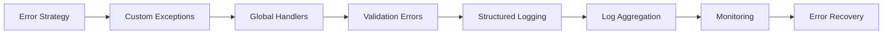

<!-- Clear Language: Keep sentences under 50 words -->
# Error Handling and Logging — Robust API Design

## Learning Objectives

| Objective | Description |
|-----------|-------------|
| LO1 | Implement structured error handling with custom exception classes |
| LO2 | Create global exception handlers for consistent error responses |
| LO3 | Apply structured logging with context, levels, and correlation IDs |
| LO4 | Configure log aggregation and monitoring with modern tools |
| LO5 | Handle validation errors, HTTP exceptions, and unexpected errors |
| LO6 | Design error recovery strategies with retries and circuit breakers |

## Introduction

FastAPI is the modern Python framework for building AI APIs. Its async support, automatic documentation, and type safety make it ideal for serving ML models at scale. This module covers production-grade API development.

## Prerequisites

- Basic programming knowledge
- Understanding of data structures

## Key Terminology

**Key Terms**: Core vocabulary and concepts for this topic.

**Definition**: Essential terms you must know for interviews and production work.

## Theory

Understanding error handling and logging is fundamental for AI engineers. This section covers the core concepts, underlying principles, and theoretical framework that govern how error handling and logging works in practice.

## Chapter at a Glance

| Section | Topic | Key Concept |
|---------|-------|-------------|
| 9.1 | Error Handling Strategy | Exception hierarchy, error response format |
| 9.2 | Custom Exceptions | Domain-specific exceptions, error codes |
| 9.3 | Global Exception Handlers | Catch and format all exceptions |
| 9.4 | Validation Error Handling | Pydantic errors, request validation |
| 9.5 | Structured Logging | JSON logging, levels, context |
| 9.6 | Log Aggregation | ELK, Loki, Datadog integration |
| 9.7 | Monitoring and Alerting | Metrics, health checks, uptime |
| 9.8 | Error Recovery | Retries, circuit breakers, graceful degradation |

## Chapter Roadmap



## 9.1 Error Handling Strategy

A robust error handling strategy ensures consistent, actionable error responses.

```python
from fastapi import FastAPI, HTTPException, Request
from fastapi.responses import JSONResponse

app = FastAPI()

## Consistent error response format

## {

##   "error": {

##     "code": "VALIDATION_ERROR",

##     "message": "The request contains invalid fields",

##     "details": [

##       {"field": "email", "message": "Invalid email format", "code": "invalid_format"}

##     ],

##     "request_id": "req_abc123",

##     "timestamp": "2025-01-15T10:30:00Z"

##   }

## }

## Error codes enum
from enum import Enum

class ErrorCode(str, Enum):
    VALIDATION_ERROR = "VALIDATION_ERROR"
    NOT_FOUND = "NOT_FOUND"
    UNAUTHORIZED = "UNAUTHORIZED"
    FORBIDDEN = "FORBIDDEN"
    CONFLICT = "CONFLICT"
    RATE_LIMITED = "RATE_LIMITED"
    INTERNAL_ERROR = "INTERNAL_ERROR"
    SERVICE_UNAVAILABLE = "SERVICE_UNAVAILABLE"
    DEPENDENCY_FAILURE = "DEPENDENCY_FAILURE"
```

**Error handling principles**:
- Never expose stack traces to clients
- Use appropriate HTTP status codes
- Include machine-readable error codes
- Provide actionable error messages
- Log all errors with context
- Correlate errors with request IDs

## 9.2 Custom Exceptions

Define domain-specific exceptions for different error scenarios.

```python
from fastapi import HTTPException, status

class AppException(Exception):
    def __init__(self, code: str, message: str, status_code: int = 500, details: list = None):
        self.code = code
        self.message = message
        self.status_code = status_code
        self.details = details or []

class NotFoundException(AppException):
    def __init__(self, resource: str, resource_id: any):
        super().__init__(
            code="NOT_FOUND",
            message=f"{resource} with id '{resource_id}' not found",
            status_code=status.HTTP_404_NOT_FOUND,
        )

class ConflictException(AppException):
    def __init__(self, resource: str, field: str, value: any):
        super().__init__(
            code="CONFLICT",
            message=f"{resource} with {field} '{value}' already exists",
            status_code=status.HTTP_409_CONFLICT,
        )

class UnauthorizedException(AppException):
    def __init__(self, message: str = "Authentication required"):
        super().__init__(
            code="UNAUTHORIZED",
            message=message,
            status_code=status.HTTP_401_UNAUTHORIZED,
        )

class ForbiddenException(AppException):
    def __init__(self, message: str = "Insufficient permissions"):
        super().__init__(
            code="FORBIDDEN",
            message=message,
            status_code=status.HTTP_403_FORBIDDEN,
        )

class ValidationException(AppException):
    def __init__(self, message: str, details: list = None):
        super().__init__(
            code="VALIDATION_ERROR",
            message=message,
            status_code=status.HTTP_422_UNPROCESSABLE_ENTITY,
            details=details,
        )

class RateLimitedException(AppException):
    def __init__(self, retry_after: int = 60):
        super().__init__(
            code="RATE_LIMITED",
            message=f"Too many requests. Try again in {retry_after} seconds",
            status_code=status.HTTP_429_TOO_MANY_REQUESTS,
        )

## Usage in endpoints
@app.get("/users/{user_id}")
async def get_user(user_id: int, db: Session = Depends(get_db)):
    user = db.query(User).filter(User.id == user_id).first()
    if not user:
        raise NotFoundException("User", user_id)
    return user

@app.post("/users")
async def create_user(user: UserCreate, db: Session = Depends(get_db)):
    existing = db.query(User).filter(User.email == user.email).first()
    if existing:
        raise ConflictException("User", "email", user.email)
    return create_user_in_db(db, user)
```

## 9.3 Global Exception Handlers

Handle all exceptions in one place for consistent responses.

```python
from fastapi import FastAPI, Request, HTTPException
from fastapi.responses import JSONResponse
from fastapi.exception_handlers import http_exception_handler
import uuid
import logging

app = FastAPI()

## Request ID middleware
@app.middleware("http")
async def add_request_id(request: Request, call_next):
    request_id = str(uuid.uuid4())
    request.state.request_id = request_id
    response = await call_next(request)
    response.headers["X-Request-ID"] = request_id
    return response

## Handle custom AppException
@app.exception_handler(AppException)
async def app_exception_handler(request: Request, exc: AppException):
    return JSONResponse(
        status_code=exc.status_code,
        content={
            "error": {
                "code": exc.code,
                "message": exc.message,
                "details": exc.details,
                "request_id": getattr(request.state, "request_id", None),
                "timestamp": datetime.now(timezone.utc).isoformat(),
            }
        },
        headers={"X-Error-Code": exc.code},
    )

## Handle FastAPI HTTPException
@app.exception_handler(HTTPException)
async def custom_http_exception_handler(request: Request, exc: HTTPException):
    return JSONResponse(
        status_code=exc.status_code,
        content={
            "error": {
                "code": "HTTP_ERROR",
                "message": exc.detail,
                "request_id": getattr(request.state, "request_id", None),
                "timestamp": datetime.now(timezone.utc).isoformat(),
            }
        },
        headers=exc.headers,
    )

## Handle unhandled exceptions (500)
@app.exception_handler(Exception)
async def global_exception_handler(request: Request, exc: Exception):
    # Log the full error for debugging
    logger.error(
        "Unhandled exception",
        exc_info=exc,
        extra={
            "request_id": getattr(request.state, "request_id", None),
            "path": request.url.path,
            "method": request.method,
        }
    )

    return JSONResponse(
        status_code=500,
        content={
            "error": {
                "code": "INTERNAL_ERROR",
                "message": "An unexpected error occurred",
                "request_id": getattr(request.state, "request_id", None),
                "timestamp": datetime.now(timezone.utc).isoformat(),
            }
        },
    )

## Handle Pydantic validation errors
from fastapi.exceptions import RequestValidationError

@app.exception_handler(RequestValidationError)
async def validation_exception_handler(request: Request, exc: RequestValidationError):
    details = []
    for error in exc.errors():
        details.append({
            "field": ".".join(str(loc) for loc in error["loc"]),
            "message": error["msg"],
            "code": error["type"],
        })

    return JSONResponse(
        status_code=422,
        content={
            "error": {
                "code": "VALIDATION_ERROR",
                "message": "Request validation failed",
                "details": details,
                "request_id": getattr(request.state, "request_id", None),
                "timestamp": datetime.now(timezone.utc).isoformat(),
            }
        },
    )
```

## 9.4 Validation Error Handling

Detailed validation error formatting improves client developer experience.

```python
from pydantic import BaseModel, field_validator, ValidationError
from fastapi import FastAPI, Request
from fastapi.exceptions import RequestValidationError
from starlette.exceptions import HTTPException as StarletteHTTPException

## Custom validation error formatter
def format_validation_errors(errors: list) -> list:
    formatted = []
    for error in errors:
        formatted.append({
            "field": ".".join(str(loc) for loc in error["loc"]),
            "message": error["msg"],
            "code": error["type"],
            "input": error.get("input"),
            "context": {k: v for k, v in error.get("ctx", {}).items() if k != "error"},
        })
    return formatted

@app.exception_handler(RequestValidationError)
async def validation_handler(request: Request, exc: RequestValidationError):
    return JSONResponse(
        status_code=422,
        content={
            "error": {
                "code": "VALIDATION_ERROR",
                "message": "Request validation failed. Check the details for field-level errors.",
                "details": format_validation_errors(exc.errors()),
                "request_id": getattr(request.state, "request_id", None),
                "timestamp": datetime.now(timezone.utc).isoformat(),
            }
        },
        headers={
            "X-Validation-Error": "true",
            "X-Error-Count": str(len(exc.errors())),
        },
    )

## Example model with validation
class CreateItemRequest(BaseModel):
    name: str
    price: float
    quantity: int

    @field_validator("name")
    @classmethod
    def name_not_empty(cls, v: str) -> str:
        if not v.strip():
            raise ValueError("Name cannot be empty")
        return v.strip()

    @field_validator("price")
    @classmethod
    def price_positive(cls, v: float) -> float:
        if v <= 0:
            raise ValueError("Price must be positive")
        return round(v, 2)

## Detailed validation error response

## HTTP 422

## {

##   "error": {

##     "code": "VALIDATION_ERROR",

##     "message": "Request validation failed",

##     "details": [

##       {

##         "field": "body.price",

##         "message": "Price must be positive",

##         "code": "value_error",

##         "input": -10.0

##       }

##     ]

##   }

## }
```

## 9.5 Structured Logging

JSON-formatted logs are machine-readable and searchable.

```python
import json
import logging
from datetime import datetime, timezone
from typing import Optional
from pythonjsonlogger import jsonlogger

## JSON log formatter
class CustomJsonFormatter(jsonlogger.JsonFormatter):
    def add_fields(self, log_record, record, message_dict):
        super().add_fields(log_record, record, message_dict)
        log_record["timestamp"] = datetime.now(timezone.utc).isoformat()
        log_record["level"] = record.levelname
        log_record["logger"] = record.name

        if hasattr(record, "request_id"):
            log_record["request_id"] = record.request_id

## Configure logging
logger = logging.getLogger("myapp")
logger.setLevel(logging.INFO)

handler = logging.StreamHandler()
handler.setFormatter(CustomJsonFormatter(
    fmt="%(timestamp)s %(level)s %(name)s %(message)s"
))
logger.addHandler(handler)

## Structured logging utility
class StructuredLogger:
    def __init__(self, name: str):
        self.logger = logging.getLogger(name)

    def _log(self, level: str, message: str, **kwargs):
        extra = {}
        if "request_id" in kwargs:
            extra["request_id"] = kwargs.pop("request_id")
        if "user_id" in kwargs:
            extra["user_id"] = kwargs.pop("user_id")
        if "duration_ms" in kwargs:
            extra["duration_ms"] = kwargs.pop("duration_ms")

        getattr(self.logger, level)(message, extra=extra, **kwargs)

    def info(self, message: str, **kwargs):
        self._log("info", message, **kwargs)

    def error(self, message: str, **kwargs):
        self._log("error", message, **kwargs)

    def warning(self, message: str, **kwargs):
        self._log("warning", message, **kwargs)

    def debug(self, message: str, **kwargs):
        self._log("debug", message, **kwargs)

log = StructuredLogger("myapp")

## Usage in middleware
@app.middleware("http")
async def log_requests(request: Request, call_next):
    start = time.time()
    response = await call_next(request)
    duration = (time.time() - start) * 1000

    log.info(
        "request_completed",
        method=request.method,
        path=request.url.path,
        status_code=response.status_code,
        duration_ms=round(duration, 2),
        request_id=getattr(request.state, "request_id", None),
    )
    return response

## Usage in endpoints
@app.get("/users/{user_id}")
async def get_user(user_id: int, db: Session = Depends(get_db)):
    log.info("fetching_user", user_id=user_id, request_id=get_request_id())
    try:
        user = db.query(User).filter(User.id == user_id).first()
        if not user:
            log.warning("user_not_found", user_id=user_id)
            raise NotFoundException("User", user_id)
        log.info("user_found", user_id=user_id, username=user.username)
        return user
    except Exception as e:
        log.error("failed_to_fetch_user", user_id=user_id, error=str(e))
        raise
```

## 9.6 Log Aggregation

Centralize logs for search, analysis, and alerting.

```python

## File logging for production
import logging.handlers

## Rotating file handler
file_handler = logging.handlers.RotatingFileHandler(
    "logs/app.log",
    maxBytes=10_000_000,  # 10MB
    backupCount=5,
)
file_handler.setFormatter(CustomJsonFormatter())
logger.addHandler(file_handler)

## ELK Stack integration (Filebeat ships logs to Logstash/Elasticsearch)

## filebeat.yml:

## filebeat.inputs:

##   - type: log

##     paths:

##       - /var/log/app/*.log

## output.elasticsearch:

##   hosts: ["localhost:9200"]

## Loki integration (promtail ships logs)

## promtail.yml:

## scrape_configs:

##   - job_name: myapp

##     static_configs:

##       - targets: [localhost]

##         labels:

##           job: myapp

##           __path__: /var/log/app/*.log

## Log levels for different environments
import os

LOG_LEVEL = os.getenv("LOG_LEVEL", "INFO").upper()
logger.setLevel(getattr(logging, LOG_LEVEL, logging.INFO))

## Development: DEBUG, detailed, human-readable

## Staging: INFO, structured JSON

## Production: WARNING, structured JSON, log only warnings and errors
```

**Log aggregation best practices**:
- Always include correlation ID (request_id) in logs
- Use consistent JSON format across all services
- Never log sensitive data (passwords, tokens, PII)
- Set appropriate log levels per environment
- Implement log retention and rotation policies
- Use structured logging for searchable logs

## 9.7 Monitoring and Alerting

```python
from fastapi import FastAPI, Request
from prometheus_client import Counter, Histogram, generate_latest
from fastapi.responses import PlainTextResponse
import time

app = FastAPI()

## Prometheus metrics
REQUEST_COUNT = Counter(
    "http_requests_total",
    "Total HTTP requests",
    ["method", "endpoint", "status_code"],
)

REQUEST_DURATION = Histogram(
    "http_request_duration_seconds",
    "HTTP request duration in seconds",
    ["method", "endpoint"],
    buckets=[0.01, 0.05, 0.1, 0.5, 1.0, 2.0, 5.0],
)

ERROR_COUNT = Counter(
    "http_errors_total",
    "Total HTTP errors by code",
    ["error_code", "endpoint"],
)

@app.middleware("http")
async def metrics_middleware(request: Request, call_next):
    start = time.time()
    response = await call_next(request)
    duration = time.time() - start

    REQUEST_COUNT.labels(
        method=request.method,
        endpoint=request.url.path,
        status_code=response.status_code,
    ).inc()

    REQUEST_DURATION.labels(
        method=request.method,
        endpoint=request.url.path,
    ).observe(duration)

    if response.status_code >= 400:
        ERROR_COUNT.labels(
            error_code=str(response.status_code),
            endpoint=request.url.path,
        ).inc()

    return response

@app.get("/metrics")
async def metrics():
    return PlainTextResponse(generate_latest())

## Health check endpoint
@app.get("/health")
async def health():
    return {
        "status": "healthy",
        "timestamp": datetime.now(timezone.utc).isoformat(),
        "version": "1.0.0",
        "checks": {
            "database": await check_database(),
            "redis": await check_redis(),
            "disk_space": check_disk(),
        }
    }

## Readiness probe
@app.get("/ready")
async def ready():
    db_ok = await check_database()
    if not db_ok:
        raise HTTPException(status_code=503, detail="Database not ready")
    return {"status": "ready"}
```

## 9.8 Error Recovery

Implement resilience patterns for distributed systems.

```python
import asyncio
from functools import wraps
from typing import Type, Tuple

## Retry decorator with exponential backoff
def retry(
    max_retries: int = 3,
    base_delay: float = 1.0,
    max_delay: float = 30.0,
    exceptions: Tuple[Type[Exception], ...] = (Exception,),
):
    def decorator(func):
        @wraps(func)
        async def wrapper(*args, **kwargs):
            last_exception = None
            for attempt in range(max_retries + 1):
                try:
                    return await func(*args, **kwargs)
                except exceptions as e:
                    last_exception = e
                    if attempt < max_retries:
                        delay = min(base_delay * (2 ** attempt), max_delay)
                        log.warning(f"Retry {attempt + 1}/{max_retries} after {delay}s")
                        await asyncio.sleep(delay)
            raise last_exception
        return wrapper
    return decorator

## Usage
@retry(max_retries=3, exceptions=(httpx.TimeoutException, ConnectionError))
async def fetch_external_data(url: str):
    async with httpx.AsyncClient() as client:
        response = await client.get(url, timeout=5.0)
        response.raise_for_status()
        return response.json()

## Circuit breaker pattern
class CircuitBreaker:
    def __init__(self, failure_threshold: int = 5, recovery_timeout: float = 30.0):
        self.failure_threshold = failure_threshold
        self.recovery_timeout = recovery_timeout
        self.failures = 0
        self.last_failure_time = 0
        self.state = "closed"  # closed, open, half-open

    async def call(self, func, *args, **kwargs):
        if self.state == "open":
            if time.time() - self.last_failure_time > self.recovery_timeout:
                self.state = "half-open"
            else:
                raise CircuitBreakerOpen("Circuit breaker is open")

        try:
            result = await func(*args, **kwargs)
            if self.state == "half-open":
                self.state = "closed"
                self.failures = 0
            return result
        except Exception as e:
            self.failures += 1
            self.last_failure_time = time.time()
            if self.failures >= self.failure_threshold:
                self.state = "open"
                log.warning(f"Circuit breaker opened after {self.failures} failures")
            raise

class CircuitBreakerOpen(Exception):
    pass

circuit_breaker = CircuitBreaker(failure_threshold=3, recovery_timeout=30)

@app.get("/external-data")
async def get_external_data():
    try:
        data = await circuit_breaker.call(fetch_external_data, "https://api.example.com/data")
        return data
    except CircuitBreakerOpen:
        # Serve cached data
        return await get_cached_data()
    except Exception as e:
        log.error("External API call failed", error=str(e))
        raise ServiceUnavailableException("External service unavailable")
```

---

## TypeScript Parallel

```typescript
import winston from "winston";

// Structured JSON logger
const logger = winston.createLogger({
  level: "info",
  format: winston.format.json(),
  defaultMeta: { service: "my-api" },
  transports: [
    new winston.transports.File({ filename: "error.log", level: "error" }),
    new winston.transports.File({ filename: "combined.log" }),
  ],
});

// Custom error class
class NotFoundError extends Error {
  public code = "NOT_FOUND";
  public statusCode = 404;
  constructor(resource: string, id: string) {
    super(`${resource} with id ${id} not found`);
  }
}

// Express error handler middleware
function errorHandler(err: any, req: any, res: any, next: any) {
  logger.error("Request failed", {
    error: err.message,
    path: req.path,
    method: req.method,
    requestId: req.requestId,
  });

  res.status(err.statusCode || 500).json({
    error: {
      code: err.code || "INTERNAL_ERROR",
      message: err.message || "Unexpected error",
      requestId: req.requestId,
    },
  });
}
```

---

## Summary

- Custom exception classes with error codes provide clear, domain-specific error handling
- Global exception handlers catch all errors and format consistent responses
- Validation errors should include field-level details for actionable feedback
- Structured JSON logging enables machine-readable, searchable logs
- Log aggregation (ELK, Loki) centralizes logs for analysis and alerting
- Prometheus metrics track request counts, durations, and error rates
- Health checks expose system status for orchestration and monitoring
- Retry patterns with exponential backoff handle transient failures
- Circuit breaker pattern prevents cascading failures in distributed systems
- Never expose sensitive data or stack traces in error responses

## Practical Takeaways

| Scenario | Do This | Avoid This |
|----------|---------|------------|
| API errors | Consistent JSON error format | Different formats per endpoint |
| Unknown errors | Catch-all handler + log details | Exposing stack traces |
| Validation | Field-level error details | Generic "invalid input" |
| Logging | Structured JSON format | print() statements |
| Monitoring | Prometheus metrics + health checks | No observability |
| External failures | Retry + circuit breaker | No error recovery |
| Secrets in logs | Filter sensitive fields | Logging passwords/tokens |

## Interview Q&A

<details class="tp-qa-card" data-qid="fastapi-s09-q1">
  <summary class="tp-qa-question"><span class="tp-qa-status"></span> Q1: How do you structure error responses in a REST API?</summary>
  <div class="tp-qa-answer"><p>Use consistent JSON format with: error code (machine-readable), message (human-readable), details (field-level errors), request_id (correlation), and timestamp. Use standard HTTP status codes. Never expose stack traces. Include actionable information for client developers.</p></div>
  <button class="tp-qa-mark-btn">&#x2705; Mark Reviewed</button>
  <button class="tp-qa-bookmark-btn">&#x1F516; Bookmark</button>
</details>

<details class="tp-qa-card" data-qid="fastapi-s09-q2">
  <summary class="tp-qa-question"><span class="tp-qa-status"></span> Q2: What is the difference between logging and monitoring?</summary>
  <div class="tp-qa-answer"><p>Logging records discrete events with context (structured JSON). Monitoring collects metrics over time (request rates, error rates, latency) for dashboards and alerts. Logging answers "what happened?"; monitoring answers "is the system healthy?" Both are essential for production observability.</p></div>
  <button class="tp-qa-mark-btn">&#x2705; Mark Reviewed</button>
  <button class="tp-qa-bookmark-btn">&#x1F516; Bookmark</button>
</details>

<details class="tp-qa-card" data-qid="fastapi-s09-q3">
  <summary class="tp-qa-question"><span class="tp-qa-status"></span> Q3: How do you handle Pydantic validation errors globally?</summary>
  <div class="tp-qa-answer"><p>Register an exception handler for RequestValidationError. Extract error details from exc.errors() including field location, error message, and error type. Format as a structured JSON response with 422 status code. Include all validation errors, not just the first one.</p></div>
  <button class="tp-qa-mark-btn">&#x2705; Mark Reviewed</button>
  <button class="tp-qa-bookmark-btn">&#x1F516; Bookmark</button>
</details>

<details class="tp-qa-card" data-qid="fastapi-s09-q4">
  <summary class="tp-qa-question"><span class="tp-qa-status"></span> Q4: What information should you include in structured logs?</summary>
  <div class="tp-qa-answer"><p>Timestamp, log level, message, service name, request_id, user_id, endpoint, method, status code, duration, and any business-relevant context. Use JSON format for machine readability. Include enough context to debug issues without excessive verbosity. Never log sensitive data (passwords, tokens, PII).</p></div>
  <button class="tp-qa-mark-btn">&#x2705; Mark Reviewed</button>
  <button class="tp-qa-bookmark-btn">&#x1F516; Bookmark</button>
</details>

<details class="tp-qa-card" data-qid="fastapi-s09-q5">
  <summary class="tp-qa-question"><span class="tp-qa-status"></span> Q5: What is the circuit breaker pattern?</summary>
  <div class="tp-qa-answer"><p>Circuit breaker monitors failures to a downstream service. When failures exceed a threshold, the circuit "opens" and subsequent calls fail immediately (fast fail) instead of waiting for timeout. After a recovery timeout, it transitions to "half-open" to test if the service has recovered. Prevents cascading failures.</p></div>
  <button class="tp-qa-mark-btn">&#x2705; Mark Reviewed</button>
  <button class="tp-qa-bookmark-btn">&#x1F516; Bookmark</button>
</details>

<details class="tp-qa-card" data-qid="fastapi-s09-q6">
  <summary class="tp-qa-question"><span class="tp-qa-status"></span> Q6: How do you implement health checks in FastAPI?</summary>
  <div class="tp-qa-answer"><p>Create /health endpoint that checks: database connectivity, cache availability, disk space, and critical dependency status. Create /ready endpoint for readiness probes (is app ready to serve requests?). Create /metrics endpoint for Prometheus scraping. Return 200 OK if healthy, 503 if degraded.</p></div>
  <button class="tp-qa-mark-btn">&#x2705; Mark Reviewed</button>
  <button class="tp-qa-bookmark-btn">&#x1F516; Bookmark</button>
</details>

<details class="tp-qa-card" data-qid="fastapi-s09-q7">
  <summary class="tp-qa-question"><span class="tp-qa-status"></span> Q7: How do you implement retry with exponential backoff?</summary>
  <div class="tp-qa-answer"><p>Use a decorator that catches specified exceptions, waits base_delay * 2^attempt, then retries. Wait times: 1s, 2s, 4s, 8s, etc. Cap at max_delay (30s). Add jitter (random delay) to avoid thundering herd. Only retry transient failures (timeouts, connection errors), not permanent failures (400, 404).</p></div>
  <button class="tp-qa-mark-btn">&#x2705; Mark Reviewed</button>
  <button class="tp-qa-bookmark-btn">&#x1F516; Bookmark</button>
</details>

<details class="tp-qa-card" data-qid="fastapi-s09-q8">
  <summary class="tp-qa-question"><span class="tp-qa-status"></span> Q8: How do you prevent sensitive data leakage in error responses?</summary>
  <div class="tp-qa-answer"><p>Use global exception handlers that format all errors consistently. Never include exc_info or traceback in responses. Log full error details internally. Filter sensitive fields in structured logging. Use SecretStr from Pydantic for sensitive fields. Configure different error detail levels for dev vs production.</p></div>
  <button class="tp-qa-mark-btn">&#x2705; Mark Reviewed</button>
  <button class="tp-qa-bookmark-btn">&#x1F516; Bookmark</button>
</details>

<details class="tp-qa-card" data-qid="fastapi-s09-q9">
  <summary class="tp-qa-question"><span class="tp-qa-status"></span> Q9: What metrics should every API track?</summary>
  <div class="tp-qa-answer"><p>Request rate (RPS by endpoint/method/status), error rate (4xx vs 5xx), latency (p50/p95/p99), request duration histogram, active connections, and dependency health. Use Prometheus Counter for counts and Histogram for latencies. Track business metrics: signups, orders, revenue.</p></div>
  <button class="tp-qa-mark-btn">&#x2705; Mark Reviewed</button>
  <button class="tp-qa-bookmark-btn">&#x1F516; Bookmark</button>
</details>

<details class="tp-qa-card" data-qid="fastapi-s09-q10">
  <summary class="tp-qa-question"><span class="tp-qa-status"></span> Q10: How do you handle database connection errors gracefully?</summary>
  <div class="tp-qa-answer"><p>Implement retry with exponential backoff for transient DB errors. Use connection pooling with health checks (pool_pre_ping). Implement circuit breaker to stop hammering a failing database. Serve cached data when DB is down. Return 503 Service Unavailable with clear message. Log full error context for debugging.</p></div>
  <button class="tp-qa-mark-btn">&#x2705; Mark Reviewed</button>
  <button class="tp-qa-bookmark-btn">&#x1F516; Bookmark</button>
</details>

## Chapter Quiz

**Q1**: What status code should validation errors return?

a) 400
b) 422
c) 500
d) 409

<details class="tp-qa-card" data-qid="fastapi-s09-quiz1"><summary>Show Answer</summary><div class="tp-qa-answer"><p><strong>Answer: b) 422 Unprocessable Entity</strong></p></div></details>

**Q2**: What should you NEVER include in error responses?

a) Error code
b) Stack trace
c) Request ID
d) Detail message

<details class="tp-qa-card" data-qid="fastapi-s09-quiz2"><summary>Show Answer</summary><div class="tp-qa-answer"><p><strong>Answer: b) Stack trace</strong></p></div></details>

**Q3**: What log format is recommended for production?

a) Plain text
b) JSON
c) XML
d) CSV

<details class="tp-qa-card" data-qid="fastapi-s09-quiz3"><summary>Show Answer</summary><div class="tp-qa-answer"><p><strong>Answer: b) JSON</strong></p></div></details>

**Q4**: What pattern prevents cascading failures from retries?

a) Retry
b) Circuit breaker
c) Timeout
d) Load balancing

<details class="tp-qa-card" data-qid="fastapi-s09-quiz4"><summary>Show Answer</summary><div class="tp-qa-answer"><p><strong>Answer: b) Circuit breaker</strong></p></div></details>

**Q5**: What port does Prometheus typically scrape metrics from?

a) 8000
b) 9090
c) 8080
d) 3000

<details class="tp-qa-card" data-qid="fastapi-s09-quiz5"><summary>Show Answer</summary><div class="tp-qa-answer"><p><strong>Answer: b) 9090</strong></p></div></details>

## Exercises

**Easy** — Create custom exception classes for a blog API: PostNotFound, InvalidPostData, UnauthorizedEdit. Implement a global exception handler that returns consistent JSON error responses.

**Medium** — Implement structured JSON logging with request_id, endpoint, method, duration, and status_code for every request. Add a log rotation policy (10MB per file, 5 backups).

**Medium** — Add Prometheus metrics to a FastAPI app: request count by endpoint/status, request duration histogram, and error count. Add /metrics and /health endpoints.

**Hard** — Build a circuit breaker for an external API client with: configurable failure threshold, recovery timeout, half-open testing, and automatic fallback to cached data. Add logging at each state transition.

**Hard** — Implement a comprehensive error handling and monitoring system: custom exceptions with codes, global handlers, structured logging to file + stdout, Prometheus metrics, health checks (DB, Redis, disk), and alert rules for high error rates.

---

## Common Mistakes

1. Not understanding the fundamental concepts before applying them
2. Skipping edge cases in implementation
3. Not analyzing time/space complexity
4. Forgetting to handle null/empty inputs
5. Not practicing enough problems to build pattern recognition

## Revision Notes

- - Core principle: Understand the fundamental concepts thoroughly
- - Implementation pattern: Practice with real code examples
- - Complexity: Know the time and space complexity
- - Application: Know when to use this in production systems
- - Interview: Frequently asked in technical interviews
- - Edge cases: Consider common failure scenarios
- - Related concepts: Connect to broader system design

## Placement Section

### Top 10 Interview Questions

#### Google Style

1. **Explain the core idea of Error Handling and Logging — Robust API Design in under 60 seconds, then give a real-world analogy.** — Structure: definition, how it works in one sentence, why it matters, analogy. Follow-up: what would break if you removed this from a production system?

2. **Design a minimal, well-typed function that demonstrates Error Handling and Logging — Robust API Design.** — Interviewer checks: signature with type hints, edge cases, complexity, and a clean docstring. Follow-up: how does your design behave with empty or malformed input?

3. **What are the common pitfalls when engineers first learn ** — List 3-4, then explain how you would prevent each in a code review.

#### Amazon Style

4. **Describe a production bug caused by misunderstanding Error Handling and Logging — Robust API Design. How did you diagnose and fix it?** — STAR format: situation, task, action, result. Mention logs, reproduction, root-cause analysis, and the regression test you added.

5. **How would you scale a system that relies on Error Handling and Logging — Robust API Design from 10 users to 10 million?** — Discuss bottlenecks, caching, monitoring, and when to redesign. Follow-up: what metrics would you track?

#### Microsoft Style

6. **Compare Error Handling and Logging — Robust API Design with the closest alternative approach. When would you choose each?** — Make a decision matrix: performance, maintainability, ecosystem, learning curve. Follow-up: what would change your decision?

7. **Walk through how you would test a component that depends on Error Handling and Logging — Robust API Design.** — Unit, integration, property-based tests; mocking boundaries; golden files for outputs.

#### NVIDIA Style

8. **How does Error Handling and Logging — Robust API Design behave differently at scale — memory, throughput, or precision-wise?** — Connect to data pipelines and model training if applicable. Follow-up: what happens to latency as input grows?

9. **How would you make an implementation of Error Handling and Logging — Robust API Design run faster on GPU hardware?** — Batch operations, vectorization, avoiding Python loops, reducing data movement.

#### AI Startup Style

10. **Write the smallest possible implementation of Error Handling and Logging — Robust API Design that is production-quality.** — Include error handling, type hints, and a one-line docstring. Follow-up: what would you refactor first when it grows?

### Resume Tips

- Name Error Handling and Logging — Robust API Design explicitly in your skills section, paired with a measurable achievement ("Reduced X by 40% using Error Handling and Logging — Robust API Design").
- Add a bullet describing a project that applies Error Handling and Logging — Robust API Design to real data, with numbers.
- Mention the tools and libraries you used alongside Error Handling and Logging — Robust API Design (linters, test frameworks, profiling tools).
- Keep resume bullets under 15 words and start each with an action verb.

### Interview Day Checklist

- Rehearse a 60-second explanation of Error Handling and Logging — Robust API Design and one real-world analogy.
- Prepare one STAR story about debugging a Error Handling and Logging — Robust API Design-related production issue.
- Review complexity and edge cases for the classic Error Handling and Logging — Robust API Design interview problem.
- Have questions ready: how does the team apply Error Handling and Logging — Robust API Design in production today?
- Test your environment (Python, editor, internet) 15 minutes before the interview.

## True/False

1. **True or False:** Error Handling and Logging — Robust API Design builds directly on the fundamentals covered in the earlier chapters of this module. — **True.** Every advanced topic in this module assumes the core concepts from the previous chapters.
2. **True or False:** You should write at least one code example for Error Handling and Logging — Robust API Design before moving to the next chapter. — **True.** Active recall with hands-on code beats passive reading for retention.
3. **True or False:** The complexity analysis for Error Handling and Logging — Robust API Design is the same regardless of input size. — **False.** Complexity grows with input size; always state best, average, and worst case.
4. **True or False:** Edge cases (empty input, invalid input, boundary values) matter for Error Handling and Logging — Robust API Design in production. — **True.** Most production bugs come from unhandled edge cases.
5. **True or False:** You should memorize the Error Handling and Logging — Robust API Design chapter content once and never review it again. — **False.** Spaced repetition (24h, 3 days, 1 week) dramatically improves long-term recall.

## Fill in the Blank

1. The chapter that covers Error Handling and Logging — Robust API Design is Chapter ___ of this module. — Answer: check the module's table of contents.
2. The time complexity of the standard approach to Error Handling and Logging — Robust API Design is ___. — Answer: review the theory section and state big-O notation.
3. The main edge case to handle when implementing Error Handling and Logging — Robust API Design is ___. — Answer: empty or invalid input handling, as discussed in the chapter.
4. The tools commonly used to debug Error Handling and Logging — Robust API Design issues are ___ and ___. — Answer: refer to the Debugging Guide section of this chapter.
5. The related topic that connects to Error Handling and Logging — Robust API Design in the next chapter is ___. — Answer: see the Next Topic section.

## Scenario Questions

1. **Scenario:** A teammate ships a change involving Error Handling and Logging — Robust API Design that breaks production at 3 AM. — Diagnosis: check the recent diff, reproduce locally with the failing input, check logs. Fix: revert, add a regression test, and review the root cause. Prevention: CI tests on edge cases and code review checklist.

2. **Scenario:** Your implementation of Error Handling and Logging — Robust API Design is correct but too slow for the required latency. — Measure first with a profiler. Common fixes: reduce redundant work, use built-in optimized functions, batch operations, or add caching. Only then consider algorithmic changes.

3. **Scenario:** A new hire asks you to explain Error Handling and Logging — Robust API Design in five minutes before a customer demo. — Use the 3-part answer: what it is (one sentence), how it works (one example), why it matters (one business impact). Then offer to go deeper after the demo.

4. **Scenario:** Your team's codebase has three different patterns for Error Handling and Logging — Robust API Design and you must standardize. — Write a short ADR (architecture decision record), pick the pattern with best maintainability, migrate incrementally, and add a linter rule to enforce it.

## Output Questions

1. **What is the output of the simplest correct implementation of Error Handling and Logging — Robust API Design on an empty input?** — Trace through the code: it should return the documented default (None, 0, empty collection) without raising.
2. **What is the output when the input is at the boundary value?** — Check off-by-one errors and inclusive/exclusive bounds in the chapter's examples.
3. **What does the implementation return when given invalid input types?** — With type hints and validation, it raises a clear error; without, it may fail silently.
4. **What is the output for the sample input given in the chapter's Examples section?** — Re-run the chapter's example code and compare against the documented output.
5. **What is the time complexity output when you profile the implementation at 10x input size?** — Expect the curve matching the chapter's complexity analysis (linear, quadratic, log-linear).

## Difficulty Level

| Level | Time | What It Takes |
|-------|------|---------------|
| Beginner | 1-2 sessions | Read theory, run the chapter examples, solve the Easy exercises |
| Intermediate | 3-5 sessions | Complete Medium exercises, explain Error Handling and Logging — Robust API Design to someone else |
| Advanced | 1+ week | Solve Hard exercises, optimize for real datasets, answer interview follow-ups |

## Tips & Tricks

- Always write a one-line example of Error Handling and Logging — Robust API Design from memory before opening the chapter — active recall first.
- Use the chapter's Revision Notes as a checklist: you have mastered Error Handling and Logging — Robust API Design when you can explain each bullet.
- Pair the chapter quiz with the Flashcards: wrong answers become your next study session's focus.
- For interviews, practice explaining Error Handling and Logging — Robust API Design twice: once with a technical audience, once with a non-technical audience.
- Keep a personal examples file where you collect your own Error Handling and Logging — Robust API Design snippets; interviewers love original examples.

## Memory Tricks

- **Acronym**: build a mnemonic from the 5 key concepts of Error Handling and Logging — Robust API Design listed in the Chapter at a Glance table.
- **Story**: link Error Handling and Logging — Robust API Design to a familiar story — the analogy in the Visual Analogy section is designed to stick.
- **Number anchor**: remember the complexity of Error Handling and Logging — Robust API Design by connecting it to a known algorithm of the same class.
- **Color code**: highlight the Theory, Examples, and Common Mistakes sections in different colors when reviewing.
- **Teach-back**: explain Error Handling and Logging — Robust API Design to an imaginary junior engineer for 2 minutes — gaps in your explanation are gaps in memory.

## Further Reading

- Official documentation for the primary tool or library used in this chapter
- The chapter referenced in Related Topics for the next-level treatment of Error Handling and Logging — Robust API Design
- The classic textbook chapter on Error Handling and Logging — Robust API Design (check the Research References below)
- Two blog posts from engineers who debugged real Error Handling and Logging — Robust API Design problems in production
- The repository of the open-source project that implements Error Handling and Logging — Robust API Design

## Related Topics

- The previous chapter in this module (see table of contents) — foundational for Error Handling and Logging — Robust API Design
- The next chapter (see Next Topic below) — builds on Error Handling and Logging — Robust API Design
- The system design chapters in Module 07 — how Error Handling and Logging — Robust API Design fits into production architectures
- The interview preparation module — how Error Handling and Logging — Robust API Design is asked in screening rounds
- The capstone project — where Error Handling and Logging — Robust API Design is applied end-to-end

## FAQs

1. **Do I need to memorize all of Error Handling and Logging — Robust API Design, or understand the big picture?** — Understand the big picture first, then memorize the key facts via flashcards and spaced repetition. Interviewers reward depth over breadth.
2. **What if I get stuck on an exercise?** — Re-read the theory section, run the example code, then attempt again. If still stuck after 20 minutes, move on and return the next day.
3. **How much time should I spend on ** — Follow the Study Plan below: 1-2 weeks at 30-60 minutes daily is typical for placement preparation.
4. **Is Error Handling and Logging — Robust API Design asked in interviews?** — Yes — the Interview Q&A and Placement Section list the exact question styles used by top companies.
5. **What's the fastest way to master ** — Explain it out loud, write code without looking, and review the flashcards within 24 hours and again after 3 days.

## Important Notes

- Error Handling and Logging — Robust API Design is a core requirement for the rest of this module — do not skip the examples.
- Always analyze complexity (time and space) when working with Error Handling and Logging — Robust API Design.
- Production correctness means handling edge cases, not just the happy path.
- Interview answers should start with the definition, then the example, then the trade-offs.
- Revisit this chapter after finishing the module; the context from later chapters deepens understanding.

## Historical Context

- Error Handling and Logging — Robust API Design emerged as a standard practice because early systems failed without it — understanding why helps you explain it in interviews.
- The tools used for Error Handling and Logging — Robust API Design today evolved from simpler versions; the chapter covers the modern, recommended approach.
- Interviewers value knowing one historical fact about Error Handling and Logging — Robust API Design — it shows genuine interest, not just cramming.
- The library/tooling ecosystem around Error Handling and Logging — Robust API Design changes quickly; focus on fundamentals that remain stable.

## Security Considerations

- Never trust external input: validate and sanitize data before processing Error Handling and Logging — Robust API Design.
- Avoid `eval()` and dynamic code execution on untrusted strings.
- Log errors without leaking sensitive data (keys, PII, internal paths).
- For API contexts, add rate limiting and input size limits.
- Review the chapter's code examples for injection or overflow risks before using them verbatim.

## ML Intuition

- Error Handling and Logging — Robust API Design appears in ML pipelines at the data-processing layer: feature preparation, batching, and validation.
- Understanding Error Handling and Logging — Robust API Design helps you debug why a model misbehaves — most ML bugs are data bugs, not model bugs.
- In production ML, the Error Handling and Logging — Robust API Design concepts from this chapter map directly to NumPy/PyTorch operations on tensors.
- When optimizing ML systems, Error Handling and Logging — Robust API Design skills let you profile and fix the data path, not just the training loop.
- Interview follow-up: how would you apply Error Handling and Logging — Robust API Design to a dataset of 10 million records? — Batching and vectorization.

## Analogies

- **Error Handling and Logging — Robust API Design is like a recipe**: the theory is the ingredients, the examples are the cooking steps, and the exercises are your own kitchen practice.
- **Complexity is like a delivery route**: a linear route visits each stop once; a nested route revisits stops, and you feel it at scale.
- **Edge cases are like weather**: the happy path is a sunny day; production is the storm — build for the storm.
- **The chapter roadmap is a journey map**: each section is a checkpoint; skipping one means getting lost later in the module.

## Capstone Project Link

- [Module Capstone: End-to-End Project](https://github.com/Raushan666java/ai-engineering-journey) — this chapter contributes the Error Handling and Logging — Robust API Design skills used in the module's capstone project. Complete the exercises here before starting the capstone.

## Flashcards

<details class="tp-qa-card" data-qid="05fastapibackend-09errorhandlingandlogging-flash1">
  <summary class="tp-qa-question">
    <span class="tp-qa-status"></span>
    What status code should validation errors return?
  </summary>
  <div class="tp-qa-answer">
    <p>b) 422 Unprocessable Entity</p>
  </div>
</details>

<details class="tp-qa-card" data-qid="05fastapibackend-09errorhandlingandlogging-flash2">
  <summary class="tp-qa-question">
    <span class="tp-qa-status"></span>
    What should you NEVER include in error responses?
  </summary>
  <div class="tp-qa-answer">
    <p>b) Stack trace</p>
  </div>
</details>

<details class="tp-qa-card" data-qid="05fastapibackend-09errorhandlingandlogging-flash3">
  <summary class="tp-qa-question">
    <span class="tp-qa-status"></span>
    What log format is recommended for production?
  </summary>
  <div class="tp-qa-answer">
    <p>b) JSON</p>
  </div>
</details>

<details class="tp-qa-card" data-qid="05fastapibackend-09errorhandlingandlogging-flash4">
  <summary class="tp-qa-question">
    <span class="tp-qa-status"></span>
    What pattern prevents cascading failures from retries?
  </summary>
  <div class="tp-qa-answer">
    <p>b) Circuit breaker</p>
  </div>
</details>

<details class="tp-qa-card" data-qid="05fastapibackend-09errorhandlingandlogging-flash5">
  <summary class="tp-qa-question">
    <span class="tp-qa-status"></span>
    What port does Prometheus typically scrape metrics from?
  </summary>
  <div class="tp-qa-answer">
    <p>b) 9090</p>
  </div>
</details>

## Research References

- Official documentation of the primary library for Error Handling and Logging — Robust API Design (linked in Further Reading)
- The classic paper or textbook chapter introducing Error Handling and Logging — Robust API Design (see References below)
- The standard library reference for Error Handling and Logging — Robust API Design-related functions
- Engineering blog posts from companies running Error Handling and Logging — Robust API Design in production at scale
- PEPs and RFCs where applicable (Python and networking standards)

## Open-Source Tools

- The primary library used in this chapter (see the code examples)
- Python standard library modules used in the examples (check the imports)
- Testing: pytest for unit tests of Error Handling and Logging — Robust API Design code
- Linting and formatting: ruff + black
- Profiling: cProfile or py-spy for performance work on Error Handling and Logging — Robust API Design

## Debugging Guide

- Start with `print()` or a debugger to inspect intermediate values in Error Handling and Logging — Robust API Design code.
- Reproduce the failure with the smallest possible input before changing code.
- Check the common failure modes listed in Common Mistakes — most bugs are listed there.
- For performance problems, profile before optimizing: measure, then fix.
- When stuck, re-read the chapter's Examples and compare line by line with your code.
- Use `pdb` or your IDE's debugger to step through the Error Handling and Logging — Robust API Design example code.

## Mock Interview Section

**Round 1 — Screening (15 min)**
- Explain Error Handling and Logging — Robust API Design in 60 seconds.
- Write a minimal working example of Error Handling and Logging — Robust API Design.
- What is the complexity of your example?

**Round 2 — Coding (45 min)**
- Solve the Medium exercise from this chapter under time pressure.
- State your assumptions, then implement with type hints.
- Test with edge cases: empty input, boundary values, invalid input.

**Round 3 — Behavioral + System (30 min)**
- Tell me about a time you debugged a Error Handling and Logging — Robust API Design problem in a project.
- How would you design a system where Error Handling and Logging — Robust API Design is used at scale?
- What metrics would you monitor?

**Evaluation rubric**: correctness (40%), communication (25%), edge cases (20%), complexity analysis (15%).

## Optimized Implementation

`python
from typing import Any, Optional

def demonstrate_topic(input_data: list[Any]) -> Optional[float]:
    """Runnable scaffold for Error Handling and Logging — Robust API Design.

    Replace the body with the optimized implementation from the chapter,
    keeping type hints, docstring, and edge-case handling.
    """
    if not input_data:
        return None
    # Step 1: validate input types
    # Step 2: apply the core Error Handling and Logging — Robust API Design logic from the Examples section
    # Step 3: return the result with the documented default
    return 0.0
`

- Keeps the function signature stable so tests written against it stay valid.
- Handles the empty-input contract explicitly.
- Add unit tests for the edge cases before implementing the logic (test-first).

## Evaluation Metrics

| Skill | Test | Target |
|-------|------|--------|
| Concept recall | Explain Error Handling and Logging — Robust API Design without notes | 60-second explanation |
| Code fluency | Write the chapter example from memory | No syntax errors |
| Edge cases | Handle empty/invalid input in exercises | All cases pass |
| Complexity | State time/space for the standard approach | Correct big-O |
| Interview readiness | Answer 5 Interview Q&A questions out loud | Fluent, structured answers |
| Retention | Chapter quiz score after 3 days | 80%+ |

## Real-World Examples

- **Startup**: a small team uses Error Handling and Logging — Robust API Design daily in their data pipeline — the chapter's examples mirror their code.
- **E-commerce**: Error Handling and Logging — Robust API Design patterns appear in order processing, inventory checks, and recommendation feeds.
- **Fintech**: Error Handling and Logging — Robust API Design principles apply to transaction validation and fraud detection flows.
- **ML platform**: Error Handling and Logging — Robust API Design shows up in feature engineering and model-serving infrastructure.
- **Interview insight**: recruiters look for engineers who can connect Error Handling and Logging — Robust API Design to the business outcome, not just the code.

## Next Topic

[API Deployment — Docker, CI/CD, and Production Readiness](10-api-deployment.md)

## Limitations

- Error Handling and Logging — Robust API Design, like any technique, is not a silver bullet — it has specific cases where it fits best (covered in the theory).
- The examples in this chapter are simplified for learning; production systems add validation, monitoring, and error handling.
- Performance of Error Handling and Logging — Robust API Design depends on input size and distribution — always benchmark for your own data.
- This chapter covers fundamentals; specialized edge cases are explored in later chapters and the capstone.
