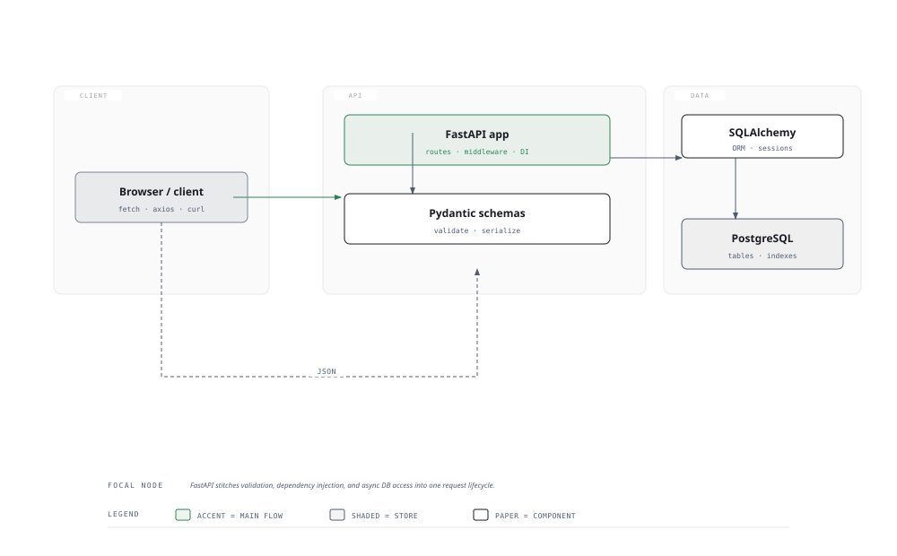

# Visual Notes — FastAPI Backend

> One diagram, the full picture. Glance at this before reading the chapters and again before interviews.

## What the diagram shows

One request, end to end, through three zones:

1. **CLIENT** — a browser or API caller sends an HTTP request (JSON).
2. **API** — **FastAPI** receives it. It validates the payload with **Pydantic schemas**, runs logic, and builds the response.
3. **DATA** — talking to **SQLAlchemy (ORM)** which turns Python calls into SQL for **PostgreSQL**.
4. The response — serialized JSON — is returned to the client.

The accent flow (client → FastAPI → Pydantic → SQLAlchemy → PostgreSQL) is the happy path every request takes.

## Why this matters for placement

- "Describe the architecture of an API you built" is a near-certain system-design question.
- FastAPI specifically is asked about because it's **async-first and typed** — `async def` endpoints and Pydantic validation are the two features candidates must explain.

## Quick revision

- **FastAPI basics** — `@app.get("/items")`, `async def`, path parameters, query parameters, request bodies via Pydantic models.
- **Pydantic** — `BaseModel` subclasses define the schema; FastAPI validates the incoming JSON against it and gives you typed objects (and 422 errors on mismatch).
- **Dependency injection** — `Depends()` for reusable logic (auth, DB session, config); the framework resolves it per-request.
- **SQLAlchemy** — models map Python classes to tables; a session wraps a unit of work; use `async_session` for async apps.
- **Auth** — JWT tokens and OAuth2; protect routes with a dependency that decodes the token.
- **Deployment** — run with a production server (Uvicorn), behind a reverse proxy (Nginx), with environment variables for secrets.

## Related chapters

- [02 — FastAPI Basics](02-fastapi-basics.md)
- [03 — Pydantic & Validation](03-pydantic-and-validation.md)
- [04 — Dependency Injection](04-dependency-injection.md)
- [06 — Database with SQLAlchemy](06-database-with-sqlalchemy.md)
- [10 — API Deployment](10-api-deployment.md)

---

**One-line answer for interviews:** *"FastAPI validates every request with Pydantic, runs route logic through dependency injection, and reads/writes via SQLAlchemy — all async and typed."*
