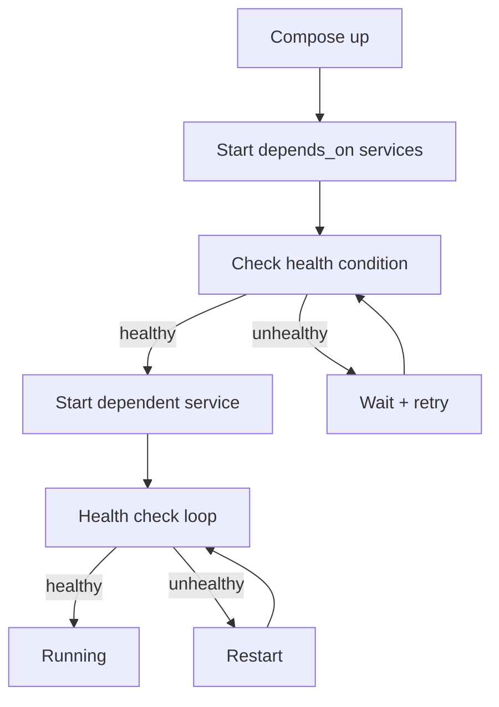

<!-- Clear Language: Keep sentences under 50 words -->
# Docker Compose — Multi-Container Orchestration

## Learning Objectives

| Objective | Description |
|-----------|-------------|
| LO1 | Understand Docker Compose architecture and use cases |
| LO2 | Write docker-compose.yml files with services, networks, and volumes |
| LO3 | Manage multi-container application lifecycle with Compose CLI |
| LO4 | Configure environment variables, dependencies, and health checks |
| LO5 | Scale services and manage load balancing with Compose |
| LO6 | Debug multi-container applications using Compose logs and exec |

## Introduction

Containers and cloud platforms are where AI models live in production. Docker packages your model, Kubernetes orchestrates it, and cloud platforms scale it. This module covers the full deployment stack.

## Prerequisites

- Basic programming knowledge
- Understanding of data structures

## Key Terminology

**Key Terms**: Core vocabulary and concepts for this topic.

**Definition**: Essential terms you must know for interviews and production work.

## Theory

Understanding docker compose is fundamental for AI engineers. This section covers the core concepts, underlying principles, and theoretical framework that govern how docker compose works in practice.

## Chapter at a Glance

| Section | Topic | Key Concept |
|---------|-------|-------------|
| 2.1 | What is Docker Compose | Declarative multi-container orchestration |
| 2.2 | Compose File Structure | services, networks, volumes, configs |
| 2.3 | Service Configuration | image, build, ports, volumes, environment |
| 2.4 | Networking in Compose | service discovery, custom networks, DNS |
| 2.5 | Dependencies and Health Checks | depends_on, healthcheck, restart policies |
| 2.6 | Environment Variables | .env file, env_file, variable substitution |
| 2.7 | Scaling and Load Balancing | docker compose up --scale, replicas |
| 2.8 | Debugging and Logging | logs, exec, port conflicts, troubleshooting |

## Chapter Roadmap


## 2.1 What is Docker Compose

Docker Compose is a tool for defining and running multi-container Docker applications. With a single YAML file, you declare your application stack — services, networks, volumes — and manage the entire lifecycle with simple commands.

**Why Compose matters for AI engineering**:

- Define ML pipeline components: data ingestion, preprocessing, training, serving
- Set up dependent infrastructure: databases, message brokers, vector stores
- Reproduce environments across development, CI/CD, and staging
- Onboard team members with a single `docker compose up` command

```bash

## Check Compose version
docker compose version

## Start all services
docker compose up -d

## Stop all services
docker compose down
```

**Compose V1 vs V2**: The original `docker-compose` (Python) is deprecated. The current `docker compose` (Go plugin) is integrated into the Docker CLI and is faster.

```mermaid
flowchart TD
    A[docker-compose.yml] --> B[Compose CLI]
    B --> C[Create default network]
    B --> D[Pull/Build images]
    B --> E[Create volumes]
    B --> F[Start containers in order]
    C --> G[app-network (bridge)]
    F --> H[api:8000]
    F --> I[db:5432]
    F --> J[redis:6379]
    H --> I
    H --> J
```

## 2.2 Compose File Structure

A Compose file follows a standard YAML structure with three top-level keys: `services`, `networks`, and `volumes`.

```yaml
version: "3.9"  # Compose specification version

services:       # Define application components
  app:
    build: .
    ports:
      - "8000:8000"
    depends_on:
      - db

  db:
    image: postgres:15
    volumes:
      - pgdata:/var/lib/postgresql/data

networks:       # Define custom networks
  frontend:
    driver: bridge
  backend:
    driver: bridge

volumes:        # Define named volumes
  pgdata:
    driver: local
```

**YAML basics for Compose**:
- Indentation matters (2 spaces preferred)
- Strings can be quoted or unquoted
- Lists use `-` prefix
- Maps use `key: value` pairs
- Supports anchors (`&`) and aliases (`*`) for reuse

```yaml

## YAML anchors for config reuse
x-logging: &default-logging
  driver: "json-file"
  options:
    max-size: "10m"
    max-file: "3"

services:
  api:
    logging: *default-logging
  worker:
    logging: *default-logging
```

## 2.3 Service Configuration

Each service defines how a container is built or pulled and how it runs.

```yaml
services:
  api:
    # Build from Dockerfile
    build:
      context: .
      dockerfile: Dockerfile.dev
      args:
        NODE_ENV: development

    # Or use a pre-built image
    image: nginx:alpine

    # Port mapping
    ports:
      - "8000:8000"           # HOST:CONTAINER
      - "9229:9229/tcp"       # protocol

    # Volume mounts
    volumes:
      - .:/app                # bind mount
      - app_data:/data        # named volume
      - /tmp/cache:/cache     # host path

    # Container config
    container_name: my-api
    restart: unless-stopped
    user: "1000:1000"
    working_dir: /app

    # Resource limits
    deploy:
      resources:
        limits:
          cpus: "0.5"
          memory: "512M"
        reservations:
          cpus: "0.25"
          memory: "256M"
```

**Build configuration**:

| Option | Purpose | Example |
|--------|---------|---------|
| context | Build directory | `./api` |
| dockerfile | Dockerfile path | `Dockerfile.prod` |
| args | Build arguments | `VERSION: 1.0` |
| target | Multi-stage target | `runtime` |
| cache_from | Cache sources | `type=registry,ref=image` |

## 2.4 Networking in Compose

Compose automatically creates a default bridge network and connects all services to it. Service names become hostnames that containers can use to reach each other.

```yaml
services:
  api:
    networks:
      - frontend
      - backend
    ports:
      - "8000:8000"

  db:
    networks:
      - backend

  web:
    networks:
      - frontend

networks:
  frontend:
    driver: bridge
    ipam:
      config:
        - subnet: "172.20.0.0/16"
  backend:
    driver: bridge
    internal: true  # no external access
```

**Service discovery**: Containers can reach each other by service name:

```python

## Inside api container — connects to db service
DATABASE_URL = "postgresql://postgres:password@db:5432/app"
```

**Static IP assignment**:

```yaml
services:
  db:
    networks:
      backend:
        ipv4_address: "172.20.0.10"
```

## 2.5 Dependencies and Health Checks

**depends_on** controls startup order but does not wait for the service to be ready.

```yaml
services:
  api:
    depends_on:
      db:
        condition: service_healthy
      redis:
        condition: service_started
```

**Health checks** ensure services are actually ready:

```yaml
services:
  db:
    image: postgres:15
    healthcheck:
      test: ["CMD-SHELL", "pg_isready -U postgres"]
      interval: 10s
      timeout: 5s
      retries: 5
      start_period: 30s

  api:
    build: .
    depends_on:
      db:
        condition: service_healthy
    healthcheck:
      test: ["CMD", "curl", "-f", "http://localhost:8000/health"]
      interval: 30s
      timeout: 10s
      retries: 3
```

**Restart policies**:

| Policy | Behavior |
|--------|----------|
| `no` | Never restart |
| `always` | Always restart regardless of exit code |
| `on-failure` | Restart only on non-zero exit |
| `unless-stopped` | Restart unless manually stopped |



## 2.6 Environment Variables

Compose supports multiple ways to inject environment variables.

```yaml
services:
  api:
    # Inline
    environment:
      - NODE_ENV=production
      - DEBUG=false

    # From file
    env_file:
      - .env
      - .env.production

    # Variable substitution
    image: myapp:${TAG:-latest}
    ports:
      - "${PORT:-8000}:8000"
```

**.env file** (placed alongside docker-compose.yml):

```env

## .env
PORT=8000
TAG=latest
DATABASE_URL=postgresql://postgres:password@db:5432/app
REDIS_URL=redis://redis:6379
```

**Variable substitution in Compose**:

| Syntax | Behavior |
|--------|----------|
| `${VAR}` | Use value of VAR, error if unset |
| `${VAR:-default}` | Use default if VAR is unset/null |
| `${VAR:?error}` | Error with message if VAR is unset |
| `${VAR:+replacement}` | Use replacement if VAR is set |

```yaml
services:
  api:
    image: myapp:${TAG:-latest}
    ports:
      - "${HOST_PORT:-8000}:${CONTAINER_PORT:-8000}"
    environment:
      - DATABASE_URL=${DATABASE_URL:?DATABASE_URL is required}
```

## 2.7 Scaling and Load Balancing

Compose can scale stateless services to multiple replicas.

```bash

## Scale API to 3 instances
docker compose up -d --scale api=3

## Scale with specific ports
docker compose up -d --scale api=3 --scale worker=2
```

**Service replica configuration**:

```yaml
services:
  api:
    build: .
    ports:
      - "8000-8002:8000"  # spread across replicas
    deploy:
      mode: replicated
      replicas: 3
      resources:
        limits:
          cpus: "0.5"
          memory: "512M"
```

**Using a reverse proxy for load balancing**:

```yaml
services:
  nginx:
    image: nginx:alpine
    ports:
      - "80:80"
    volumes:
      - ./nginx.conf:/etc/nginx/nginx.conf:ro
    depends_on:
      - api

  api:
    build: .
    scale: 3
    expose:
      - "8000"  # internal only
```

```nginx

## nginx.conf — load balance across API replicas
upstream api_servers {
    server api:8000;
    server api:8000;
    server api:8000;
}

server {
    listen 80;
    location / {
        proxy_pass http://api_servers;
    }
}
```

## 2.8 Debugging and Logging

**View logs**:

```bash

## All services
docker compose logs

## Specific service
docker compose logs api

## Follow mode
docker compose logs -f

## Tail last N lines
docker compose logs --tail=100 api

## Timestamps
docker compose logs -t
```

**Execute commands in running services**:

```bash

## Interactive shell
docker compose exec api bash

## Run command
docker compose exec db pg_dump -U postgres app > backup.sql

## As specific user
docker compose exec --user root api apt-get update
```

**Port conflicts**: If a host port is already in use, change the mapping or stop the conflicting process.

```bash

## Find process using port
netstat -ano | findstr :8000

## Or change port in Compose
services:
  api:
    ports:
      - "8001:8000"  # use different host port
```

**Common troubleshooting scenarios**:

| Issue | Symptom | Fix |
|-------|---------|-----|
| Port conflict | `port is already allocated` | Change host port or stop conflicting container |
| Image not found | `manifest not found` | Check image name and tag, pull manually |
| Volume permissions | `Permission denied` | Check user mapping, use `user:` in service |
| DNS resolution | `Could not resolve host` | Check network configuration and service names |
| Build cache issues | Stale code in container | `docker compose build --no-cache` |

```bash

## Full reset — remove everything and rebuild
docker compose down -v
docker compose build --no-cache
docker compose up -d
```

---

## TypeScript Parallel

TypeScript applications can dynamically generate and manage docker-compose configurations using libraries like `js-yaml`:

```typescript
import * as yaml from "js-yaml";
import * as fs from "fs";

interface ComposeService {
  image?: string;
  build?: string | { context: string; dockerfile: string };
  ports?: string[];
  environment?: Record<string, string>;
}

function generateCompose(services: Record<string, ComposeService>): string {
  const compose = {
    version: "3.9",
    services,
    networks: { app: { driver: "bridge" } },
  };
  return yaml.dump(compose, { indent: 2 });
}

const config = generateCompose({
  api: {
    build: "./api",
    ports: ["8000:8000"],
    environment: { NODE_ENV: "production" },
  },
  db: {
    image: "postgres:15",
    environment: { POSTGRES_PASSWORD: "secret" },
  },
});

fs.writeFileSync("docker-compose.yml", config);
```

---

## Summary

- Docker Compose defines multi-container applications declaratively in YAML — services, networks, and volumes are configured in a single file
- Service configuration includes build context, image, ports, volumes, environment variables, and resource limits
- Compose creates a default bridge network; service names serve as DNS hostnames for inter-service communication
- `depends_on` controls startup order; `healthcheck` ensures services are actually ready before dependents start
- Environment variables can be set inline, via env_file, or through .env variable substitution
- Scale stateless services with `docker compose up --scale service=N` for horizontal scaling
- Logs are aggregated per service; `docker compose logs -f` follows all services simultaneously
- Port conflicts and stale caches are common issues; use `down -v` and `build --no-cache` for clean restarts
- YAML anchors (`&` and `*`) reduce duplication across similar service configurations
- Compose is ideal for local development, CI/CD environments, and staging deployments before Kubernetes

## Practical Takeaways

| Scenario | Do This | Avoid This |
|----------|---------|------------|
| Local development | Bind mount source + hot-reload | Rebuilding image on every change |
| Database dependency | depends_on + healthcheck | depends_on without condition |
| Secrets | .env file in .gitignore | Hardcoding passwords in compose YAML |
| Multiple environments | Separate .env files per environment | Single .env for all environments |
| Service discovery | Use service name as hostname | Hardcoding IP addresses |
| Resource management | Set CPU/memory limits | Running unbounded containers |
| Log management | json-file driver with rotation | Default logging without limits |

## Interview Q&A

<details class="tp-qa-card" data-qid="docker-s02-q1">
  <summary class="tp-qa-question">
    <span class="tp-qa-status"></span>
    Q1: What problem does Docker Compose solve?
  </summary>
  <div class="tp-qa-answer">
    <p>Docker Compose solves the complexity of running multi-container applications. Without Compose, you would need to write long shell scripts with multiple <code>docker run</code> commands, manually create networks, and manage startup ordering.</p>
    <p>Compose provides a declarative YAML file that defines the entire application stack. A single <code>docker compose up</code> creates all networks, builds/pulls images, and starts containers in the correct order.</p>
    <p>For AI engineering, Compose is particularly valuable for defining ML pipelines that involve multiple services: data processing containers, model training jobs, inference servers, vector databases, and monitoring.</p>
  </div>
  <button class="tp-qa-mark-btn">✅ Mark Reviewed</button>
  <button class="tp-qa-bookmark-btn">🔖 Bookmark</button>
</details>

<details class="tp-qa-card" data-qid="docker-s02-q2">
  <summary class="tp-qa-question">
    <span class="tp-qa-status"></span>
    Q2: How does service discovery work in Docker Compose?
  </summary>
  <div class="tp-qa-answer">
    <p>Compose creates a default bridge network and registers each service by its service name as a DNS entry. Containers can reach each other using the service name as the hostname:</p>
    <pre><code># api service can reach db service
DATABASE_URL = "postgresql://user:pass@db:5432/mydb"

## From within api container
ping db  # resolves to db service container IP</code></pre>
    <p>This works because Docker's embedded DNS server resolves service names to container IPs. For custom domains or more complex routing, use an external service mesh or reverse proxy.</p>
  </div>
  <button class="tp-qa-mark-btn">✅ Mark Reviewed</button>
  <button class="tp-qa-bookmark-btn">🔖 Bookmark</button>
</details>

<details class="tp-qa-card" data-qid="docker-s02-q3">
  <summary class="tp-qa-question">
    <span class="tp-qa-status"></span>
    Q3: What is the difference between depends_on and healthcheck in Compose?
  </summary>
  <div class="tp-qa-answer">
    <p><strong>depends_on</strong> controls startup order — it ensures a container starts after its dependencies. However, it does not wait for the dependency to be "ready" (e.g., PostgreSQL accepting connections).</p>
    <p><strong>healthcheck</strong> periodically runs a command inside the container to verify it's working. Combined with <code>depends_on: condition: service_healthy</code>, Compose waits for the dependency to pass its health check before starting the dependent service.</p>
    <pre><code>services:
  db:
    image: postgres:15
    healthcheck:
      test: ["CMD-SHELL", "pg_isready -U postgres"]
      interval: 10s

  api:
    depends_on:
      db:
        condition: service_healthy  # waits for pg_isready</code></pre>
  </div>
  <button class="tp-qa-mark-btn">✅ Mark Reviewed</button>
  <button class="tp-qa-bookmark-btn">🔖 Bookmark</button>
</details>

<details class="tp-qa-card" data-qid="docker-s02-q4">
  <summary class="tp-qa-question">
    <span class="tp-qa-status"></span>
    Q4: How do you handle environment-specific configurations in Compose?
  </summary>
  <div class="tp-qa-answer">
    <p>Several strategies for environment-specific Compose configurations:</p>
    <ol>
      <li><strong>Multiple Compose files</strong>: Base file + override files
        <pre><code>docker compose -f docker-compose.yml -f docker-compose.prod.yml up</code></pre></li>
      <li><strong>.env file</strong>: Place a <code>.env</code> file in the same directory — Compose reads it automatically</li>
      <li><strong>Variable substitution</strong>: Use <code>${VAR:-default}</code> in the Compose file</li>
      <li><strong>env_file directive</strong>: Specify different files per service</li>
    </ol>
    <pre><code># docker-compose.override.yml — extends base config
services:
  api:
    volumes:
      - .:/app  # bind mount only in development
    environment:
      - DEBUG=true</code></pre>
  </div>
  <button class="tp-qa-mark-btn">✅ Mark Reviewed</button>
  <button class="tp-qa-bookmark-btn">🔖 Bookmark</button>
</details>

<details class="tp-qa-card" data-qid="docker-s02-q5">
  <summary class="tp-qa-question">
    <span class="tp-qa-status"></span>
    Q5: Can you scale services with Docker Compose? How is load balancing handled?
  </summary>
  <div class="tp-qa-answer">
    <p>Yes, stateless services can be scaled with <code>docker compose up --scale service=N</code>. Compose creates N container instances of the service.</p>
    <p>However, Compose does not include a built-in load balancer. You need to add one (typically Nginx or HAProxy):</p>
    <pre><code>services:
  nginx:
    image: nginx:alpine
    ports: ["80:80"]
    volumes: ["./nginx.conf:/etc/nginx/nginx.conf:ro"]

  api:
    build: .
    scale: 3

## nginx upstream must reference the service name
upstream api {
    server api:8000;
}</code></pre>
    <p>Docker's DNS does round-robin resolution, but for production load balancing, use a dedicated reverse proxy.</p>
  </div>
  <button class="tp-qa-mark-btn">✅ Mark Reviewed</button>
  <button class="tp-qa-bookmark-btn">🔖 Bookmark</button>
</details>

<details class="tp-qa-card" data-qid="docker-s02-q6">
  <summary class="tp-qa-question">
    <span class="tp-qa-status"></span>
    Q6: How do you persist database data when using docker compose down?
  </summary>
  <div class="tp-qa-answer">
    <p>Use named volumes that persist independently of container lifecycle:</p>
    <pre><code>services:
  db:
    image: postgres:15
    volumes:
      - pgdata:/var/lib/postgresql/data

volumes:
  pgdata:</code></pre>
    <p>Even after <code>docker compose down</code>, the volume persists. To remove it, use <code>docker compose down -v</code> (careful — this deletes all data).</p>
    <p>For backups:</p>
    <pre><code># Backup
docker compose exec db pg_dump -U postgres mydb &gt; backup.sql

## Restore
cat backup.sql | docker compose exec -T db psql -U postgres mydb</code></pre>
  </div>
  <button class="tp-qa-mark-btn">✅ Mark Reviewed</button>
  <button class="tp-qa-bookmark-btn">🔖 Bookmark</button>
</details>

<details class="tp-qa-card" data-qid="docker-s02-q7">
  <summary class="tp-qa-question">
    <span class="tp-qa-status"></span>
    Q7: Explain variable substitution in Docker Compose with examples.
  </summary>
  <div class="tp-qa-answer">
    <p>Compose supports shell-like variable substitution in YAML values:</p>
    <pre><code># .env file
PORT=8080
TAG=v2.1

## docker-compose.yml
services:
  api:
    image: myapp:${TAG:-latest}
    ports:
      - "${PORT}:8000"
    environment:
      - DATABASE_URL=${DATABASE_URL:?err}
      - CACHE_ENABLED=${CACHE:+true}</code></pre>
    <p>Compose reads the <code>.env</code> file from the same directory automatically. You can also pass variables explicitly: <code>PORT=9000 docker compose up</code>.</p>
  </div>
  <button class="tp-qa-mark-btn">✅ Mark Reviewed</button>
  <button class="tp-qa-bookmark-btn">🔖 Bookmark</button>
</details>

<details class="tp-qa-card" data-qid="docker-s02-q8">
  <summary class="tp-qa-question">
    <span class="tp-qa-status"></span>
    Q8: How do you debug a Compose application that fails to start?
  </summary>
  <div class="tp-qa-answer">
    <p>Step-by-step debugging approach:</p>
    <ol>
      <li><strong>Check logs</strong>: <code>docker compose logs</code> or <code>docker compose logs service_name</code></li>
      <li><strong>Verify port conflicts</strong>: <code>netstat -ano | findstr :PORT</code></li>
      <li><strong>Test individual services</strong>: <code>docker compose run --rm service_name command</code></li>
      <li><strong>Inspect network</strong>: <code>docker compose exec service_name ping other_service</code></li>
      <li><strong>Override entrypoint</strong>: Add <code>entrypoint: ["sh"]</code> to service config temporarily</li>
    </ol>
    <pre><code># Debug with interactive shell
services:
  api:
    entrypoint: ["tail", "-f", "/dev/null"]  # keeps container alive

## Then exec into it
docker compose exec api bash</code></pre>
  </div>
  <button class="tp-qa-mark-btn">✅ Mark Reviewed</button>
  <button class="tp-qa-bookmark-btn">🔖 Bookmark</button>
</details>

<details class="tp-qa-card" data-qid="docker-s02-q9">
  <summary class="tp-qa-question">
    <span class="tp-qa-status"></span>
    Q9: What is the difference between docker-compose (v1) and docker compose (v2)?
  </summary>
  <div class="tp-qa-answer">
    <p><strong>docker-compose</strong> (v1) was a standalone Python tool. It is now deprecated and being phased out.</p>
    <p><strong>docker compose</strong> (v2) is a Docker CLI plugin written in Go. Key differences:</p>
    <ul>
      <li>Integrated into Docker CLI (no separate install)</li>
      <li>Faster performance (Go vs Python)</li>
      <li>Compose Specification (not tied to version)</li>
      <li>Better support for profiles, GPU resources, and buildkit</li>
      <li>Uses <code>docker compose</code> (space, not hyphen) as the command</li>
    </ul>
    <p>The Compose file format is largely compatible between v1 and v2. Always use the new <code>docker compose</code> command for new projects.</p>
  </div>
  <button class="tp-qa-mark-btn">✅ Mark Reviewed</button>
  <button class="tp-qa-bookmark-btn">🔖 Bookmark</button>
</details>

<details class="tp-qa-card" data-qid="docker-s02-q10">
  <summary class="tp-qa-question">
    <span class="tp-qa-status"></span>
    Q10: How do you set resource limits for services in Docker Compose?
  </summary>
  <div class="tp-qa-answer">
    <p>Resource limits are set under the <code>deploy.resources</code> key:</p>
    <pre><code>services:
  api:
    deploy:
      resources:
        limits:
          cpus: "0.5"      # half a CPU core
          memory: "512M"    # 512 MB RAM
        reservations:
          cpus: "0.25"
          memory: "256M"</code></pre>
    <p><strong>CPU limits</strong>: Can be fractional (0.5 = half core) or integer. Docker uses Completely Fair Scheduler (CFS) quotas for enforcement.</p>
    <p><strong>Memory limits</strong>: Set in bytes (b, k, m, g). Exceeding memory causes the container to be OOM-killed.</p>
    <p><strong>GPU access</strong>:</p>
    <pre><code>services:
  train:
    image: pytorch/pytorch:latest
    deploy:
      resources:
        reservations:
          devices:
            - driver: nvidia
              count: 1
              capabilities: [gpu]</code></pre>
  </div>
  <button class="tp-qa-mark-btn">✅ Mark Reviewed</button>
  <button class="tp-qa-bookmark-btn">🔖 Bookmark</button>
</details>

## Chapter Quiz

**Q1**: Which command starts all services defined in a docker-compose.yml file in detached mode?

a) `docker compose run`
b) `docker compose start`
c) `docker compose up -d`
d) `docker compose launch`

<details class="tp-qa-card" data-qid="docker-s02-quiz1"><summary>Show Answer</summary><div class="tp-qa-answer"><p><strong>Answer: c) docker compose up -d</strong></p><p>The <code>up</code> command creates and starts containers; <code>-d</code> runs them in detached mode.</p></div></details>

**Q2**: How do services discover each other in a Docker Compose application?

a) By IP address
b) By container ID
c) By service name
d) By port number

<details class="tp-qa-card" data-qid="docker-s02-quiz2"><summary>Show Answer</summary><div class="tp-qa-answer"><p><strong>Answer: c) By service name</strong></p><p>Compose's embedded DNS resolves service names to container IPs automatically.</p></div></details>

**Q3**: What does `docker compose down -v` do that `docker compose down` does not?

a) Force stops containers
b) Removes volumes
c) Removes images
d) Deletes the compose file

<details class="tp-qa-card" data-qid="docker-s02-quiz3"><summary>Show Answer</summary><div class="tp-qa-answer"><p><strong>Answer: b) Removes volumes</strong></p><p>The <code>-v</code> flag removes named volumes declared in the compose file, permanently deleting persistent data.</p></div></details>

**Q4**: Which Compose configuration ensures a service only starts after its database is accepting connections?

a) `depends_on: - db`
b) `depends_on: db: condition: service_healthy`
c) `links: - db`
d) `needs: db`

<details class="tp-qa-card" data-qid="docker-s02-quiz4"><summary>Show Answer</summary><div class="tp-qa-answer"><p><strong>Answer: b) depends_on with condition: service_healthy</strong></p><p>This waits for the database's health check to pass before starting the dependent service.</p></div></details>

**Q5**: How can you scale a service to 3 replicas using Docker Compose?

a) `docker compose scale api=3`
b) `docker compose up --scale api=3`
c) Edit the compose file to add replicas: 3
d) Both b and c

<details class="tp-qa-card" data-qid="docker-s02-quiz5"><summary>Show Answer</summary><div class="tp-qa-answer"><p><strong>Answer: d) Both b and c</strong></p><p>You can scale at runtime with <code>--scale</code> or define replicas in the compose file under deploy.replicas.</p></div></details>

## Exercises

**Easy** — Create a docker-compose.yml that runs Nginx on port 8080 with a custom HTML page served from a bind-mounted host directory.

**Medium** — Write a Compose file for a FastAPI application with PostgreSQL and Redis. Include health checks for the database, proper depends_on, and persistent volumes.

**Medium** — Create a development Compose setup with two profiles: "dev" (with hot-reload and debug mode) and "prod" (optimized, no bind mounts, resource limits).

**Hard** — Build a multi-service ML inference pipeline with three services: a FastAPI inference API, a Redis message queue, and a worker service that processes inference requests from the queue. Include proper health checks, scaling configuration, and resource limits.

**Hard** — Debug and fix a broken docker-compose.yml that has port conflicts, incorrect depends_on, missing volume declarations, and invalid YAML syntax. Document each issue found and the fix applied.

---

## Common Mistakes

1. Not understanding the fundamental concepts before applying them
2. Skipping edge cases in implementation
3. Not analyzing time/space complexity
4. Forgetting to handle null/empty inputs
5. Not practicing enough problems to build pattern recognition

## Revision Notes

- - Core principle: Understand the fundamental concepts thoroughly
- - Implementation pattern: Practice with real code examples
- - Complexity: Know the time and space complexity
- - Application: Know when to use this in production systems
- - Interview: Frequently asked in technical interviews
- - Edge cases: Consider common failure scenarios
- - Related concepts: Connect to broader system design

## Placement Section

### Top 10 Interview Questions

#### Google Style

1. **Explain the core idea of Docker Compose — Multi-Container Orchestration in under 60 seconds, then give a real-world analogy.** — Structure: definition, how it works in one sentence, why it matters, analogy. Follow-up: what would break if you removed this from a production system?

2. **Design a minimal, well-typed function that demonstrates Docker Compose — Multi-Container Orchestration.** — Interviewer checks: signature with type hints, edge cases, complexity, and a clean docstring. Follow-up: how does your design behave with empty or malformed input?

3. **What are the common pitfalls when engineers first learn ** — List 3-4, then explain how you would prevent each in a code review.

#### Amazon Style

4. **Describe a production bug caused by misunderstanding Docker Compose — Multi-Container Orchestration. How did you diagnose and fix it?** — STAR format: situation, task, action, result. Mention logs, reproduction, root-cause analysis, and the regression test you added.

5. **How would you scale a system that relies on Docker Compose — Multi-Container Orchestration from 10 users to 10 million?** — Discuss bottlenecks, caching, monitoring, and when to redesign. Follow-up: what metrics would you track?

#### Microsoft Style

6. **Compare Docker Compose — Multi-Container Orchestration with the closest alternative approach. When would you choose each?** — Make a decision matrix: performance, maintainability, ecosystem, learning curve. Follow-up: what would change your decision?

7. **Walk through how you would test a component that depends on Docker Compose — Multi-Container Orchestration.** — Unit, integration, property-based tests; mocking boundaries; golden files for outputs.

#### NVIDIA Style

8. **How does Docker Compose — Multi-Container Orchestration behave differently at scale — memory, throughput, or precision-wise?** — Connect to data pipelines and model training if applicable. Follow-up: what happens to latency as input grows?

9. **How would you make an implementation of Docker Compose — Multi-Container Orchestration run faster on GPU hardware?** — Batch operations, vectorization, avoiding Python loops, reducing data movement.

#### AI Startup Style

10. **Write the smallest possible implementation of Docker Compose — Multi-Container Orchestration that is production-quality.** — Include error handling, type hints, and a one-line docstring. Follow-up: what would you refactor first when it grows?

### Resume Tips

- Name Docker Compose — Multi-Container Orchestration explicitly in your skills section, paired with a measurable achievement ("Reduced X by 40% using Docker Compose — Multi-Container Orchestration").
- Add a bullet describing a project that applies Docker Compose — Multi-Container Orchestration to real data, with numbers.
- Mention the tools and libraries you used alongside Docker Compose — Multi-Container Orchestration (linters, test frameworks, profiling tools).
- Keep resume bullets under 15 words and start each with an action verb.

### Interview Day Checklist

- Rehearse a 60-second explanation of Docker Compose — Multi-Container Orchestration and one real-world analogy.
- Prepare one STAR story about debugging a Docker Compose — Multi-Container Orchestration-related production issue.
- Review complexity and edge cases for the classic Docker Compose — Multi-Container Orchestration interview problem.
- Have questions ready: how does the team apply Docker Compose — Multi-Container Orchestration in production today?
- Test your environment (Python, editor, internet) 15 minutes before the interview.

## True/False

1. **True or False:** Docker Compose — Multi-Container Orchestration builds directly on the fundamentals covered in the earlier chapters of this module. — **True.** Every advanced topic in this module assumes the core concepts from the previous chapters.
2. **True or False:** You should write at least one code example for Docker Compose — Multi-Container Orchestration before moving to the next chapter. — **True.** Active recall with hands-on code beats passive reading for retention.
3. **True or False:** The complexity analysis for Docker Compose — Multi-Container Orchestration is the same regardless of input size. — **False.** Complexity grows with input size; always state best, average, and worst case.
4. **True or False:** Edge cases (empty input, invalid input, boundary values) matter for Docker Compose — Multi-Container Orchestration in production. — **True.** Most production bugs come from unhandled edge cases.
5. **True or False:** You should memorize the Docker Compose — Multi-Container Orchestration chapter content once and never review it again. — **False.** Spaced repetition (24h, 3 days, 1 week) dramatically improves long-term recall.

## Fill in the Blank

1. The chapter that covers Docker Compose — Multi-Container Orchestration is Chapter ___ of this module. — Answer: check the module's table of contents.
2. The time complexity of the standard approach to Docker Compose — Multi-Container Orchestration is ___. — Answer: review the theory section and state big-O notation.
3. The main edge case to handle when implementing Docker Compose — Multi-Container Orchestration is ___. — Answer: empty or invalid input handling, as discussed in the chapter.
4. The tools commonly used to debug Docker Compose — Multi-Container Orchestration issues are ___ and ___. — Answer: refer to the Debugging Guide section of this chapter.
5. The related topic that connects to Docker Compose — Multi-Container Orchestration in the next chapter is ___. — Answer: see the Next Topic section.

## Scenario Questions

1. **Scenario:** A teammate ships a change involving Docker Compose — Multi-Container Orchestration that breaks production at 3 AM. — Diagnosis: check the recent diff, reproduce locally with the failing input, check logs. Fix: revert, add a regression test, and review the root cause. Prevention: CI tests on edge cases and code review checklist.

2. **Scenario:** Your implementation of Docker Compose — Multi-Container Orchestration is correct but too slow for the required latency. — Measure first with a profiler. Common fixes: reduce redundant work, use built-in optimized functions, batch operations, or add caching. Only then consider algorithmic changes.

3. **Scenario:** A new hire asks you to explain Docker Compose — Multi-Container Orchestration in five minutes before a customer demo. — Use the 3-part answer: what it is (one sentence), how it works (one example), why it matters (one business impact). Then offer to go deeper after the demo.

4. **Scenario:** Your team's codebase has three different patterns for Docker Compose — Multi-Container Orchestration and you must standardize. — Write a short ADR (architecture decision record), pick the pattern with best maintainability, migrate incrementally, and add a linter rule to enforce it.

## Output Questions

1. **What is the output of the simplest correct implementation of Docker Compose — Multi-Container Orchestration on an empty input?** — Trace through the code: it should return the documented default (None, 0, empty collection) without raising.
2. **What is the output when the input is at the boundary value?** — Check off-by-one errors and inclusive/exclusive bounds in the chapter's examples.
3. **What does the implementation return when given invalid input types?** — With type hints and validation, it raises a clear error; without, it may fail silently.
4. **What is the output for the sample input given in the chapter's Examples section?** — Re-run the chapter's example code and compare against the documented output.
5. **What is the time complexity output when you profile the implementation at 10x input size?** — Expect the curve matching the chapter's complexity analysis (linear, quadratic, log-linear).

## Difficulty Level

| Level | Time | What It Takes |
|-------|------|---------------|
| Beginner | 1-2 sessions | Read theory, run the chapter examples, solve the Easy exercises |
| Intermediate | 3-5 sessions | Complete Medium exercises, explain Docker Compose — Multi-Container Orchestration to someone else |
| Advanced | 1+ week | Solve Hard exercises, optimize for real datasets, answer interview follow-ups |

## Tips & Tricks

- Always write a one-line example of Docker Compose — Multi-Container Orchestration from memory before opening the chapter — active recall first.
- Use the chapter's Revision Notes as a checklist: you have mastered Docker Compose — Multi-Container Orchestration when you can explain each bullet.
- Pair the chapter quiz with the Flashcards: wrong answers become your next study session's focus.
- For interviews, practice explaining Docker Compose — Multi-Container Orchestration twice: once with a technical audience, once with a non-technical audience.
- Keep a personal examples file where you collect your own Docker Compose — Multi-Container Orchestration snippets; interviewers love original examples.

## Memory Tricks

- **Acronym**: build a mnemonic from the 5 key concepts of Docker Compose — Multi-Container Orchestration listed in the Chapter at a Glance table.
- **Story**: link Docker Compose — Multi-Container Orchestration to a familiar story — the analogy in the Visual Analogy section is designed to stick.
- **Number anchor**: remember the complexity of Docker Compose — Multi-Container Orchestration by connecting it to a known algorithm of the same class.
- **Color code**: highlight the Theory, Examples, and Common Mistakes sections in different colors when reviewing.
- **Teach-back**: explain Docker Compose — Multi-Container Orchestration to an imaginary junior engineer for 2 minutes — gaps in your explanation are gaps in memory.

## Further Reading

- Official documentation for the primary tool or library used in this chapter
- The chapter referenced in Related Topics for the next-level treatment of Docker Compose — Multi-Container Orchestration
- The classic textbook chapter on Docker Compose — Multi-Container Orchestration (check the Research References below)
- Two blog posts from engineers who debugged real Docker Compose — Multi-Container Orchestration problems in production
- The repository of the open-source project that implements Docker Compose — Multi-Container Orchestration

## Related Topics

- The previous chapter in this module (see table of contents) — foundational for Docker Compose — Multi-Container Orchestration
- The next chapter (see Next Topic below) — builds on Docker Compose — Multi-Container Orchestration
- The system design chapters in Module 07 — how Docker Compose — Multi-Container Orchestration fits into production architectures
- The interview preparation module — how Docker Compose — Multi-Container Orchestration is asked in screening rounds
- The capstone project — where Docker Compose — Multi-Container Orchestration is applied end-to-end

## FAQs

1. **Do I need to memorize all of Docker Compose — Multi-Container Orchestration, or understand the big picture?** — Understand the big picture first, then memorize the key facts via flashcards and spaced repetition. Interviewers reward depth over breadth.
2. **What if I get stuck on an exercise?** — Re-read the theory section, run the example code, then attempt again. If still stuck after 20 minutes, move on and return the next day.
3. **How much time should I spend on ** — Follow the Study Plan below: 1-2 weeks at 30-60 minutes daily is typical for placement preparation.
4. **Is Docker Compose — Multi-Container Orchestration asked in interviews?** — Yes — the Interview Q&A and Placement Section list the exact question styles used by top companies.
5. **What's the fastest way to master ** — Explain it out loud, write code without looking, and review the flashcards within 24 hours and again after 3 days.

## Important Notes

- Docker Compose — Multi-Container Orchestration is a core requirement for the rest of this module — do not skip the examples.
- Always analyze complexity (time and space) when working with Docker Compose — Multi-Container Orchestration.
- Production correctness means handling edge cases, not just the happy path.
- Interview answers should start with the definition, then the example, then the trade-offs.
- Revisit this chapter after finishing the module; the context from later chapters deepens understanding.

## Historical Context

- Docker Compose — Multi-Container Orchestration emerged as a standard practice because early systems failed without it — understanding why helps you explain it in interviews.
- The tools used for Docker Compose — Multi-Container Orchestration today evolved from simpler versions; the chapter covers the modern, recommended approach.
- Interviewers value knowing one historical fact about Docker Compose — Multi-Container Orchestration — it shows genuine interest, not just cramming.
- The library/tooling ecosystem around Docker Compose — Multi-Container Orchestration changes quickly; focus on fundamentals that remain stable.

## Security Considerations

- Never trust external input: validate and sanitize data before processing Docker Compose — Multi-Container Orchestration.
- Avoid `eval()` and dynamic code execution on untrusted strings.
- Log errors without leaking sensitive data (keys, PII, internal paths).
- For API contexts, add rate limiting and input size limits.
- Review the chapter's code examples for injection or overflow risks before using them verbatim.

## ML Intuition

- Docker Compose — Multi-Container Orchestration appears in ML pipelines at the data-processing layer: feature preparation, batching, and validation.
- Understanding Docker Compose — Multi-Container Orchestration helps you debug why a model misbehaves — most ML bugs are data bugs, not model bugs.
- In production ML, the Docker Compose — Multi-Container Orchestration concepts from this chapter map directly to NumPy/PyTorch operations on tensors.
- When optimizing ML systems, Docker Compose — Multi-Container Orchestration skills let you profile and fix the data path, not just the training loop.
- Interview follow-up: how would you apply Docker Compose — Multi-Container Orchestration to a dataset of 10 million records? — Batching and vectorization.

## Analogies

- **Docker Compose — Multi-Container Orchestration is like a recipe**: the theory is the ingredients, the examples are the cooking steps, and the exercises are your own kitchen practice.
- **Complexity is like a delivery route**: a linear route visits each stop once; a nested route revisits stops, and you feel it at scale.
- **Edge cases are like weather**: the happy path is a sunny day; production is the storm — build for the storm.
- **The chapter roadmap is a journey map**: each section is a checkpoint; skipping one means getting lost later in the module.

## Capstone Project Link

- [Module Capstone: End-to-End Project](https://github.com/Raushan666java/ai-engineering-journey) — this chapter contributes the Docker Compose — Multi-Container Orchestration skills used in the module's capstone project. Complete the exercises here before starting the capstone.

## Flashcards

<details class="tp-qa-card" data-qid="06dockerkubernetescloud-02dockercompose-flash1">
  <summary class="tp-qa-question">
    <span class="tp-qa-status"></span>
    Which command starts all services defined in a docker-compose.yml file in detached mode?
  </summary>
  <div class="tp-qa-answer">
    <p>c) docker compose up -d</p>
  </div>
</details>

<details class="tp-qa-card" data-qid="06dockerkubernetescloud-02dockercompose-flash2">
  <summary class="tp-qa-question">
    <span class="tp-qa-status"></span>
    How do services discover each other in a Docker Compose application?
  </summary>
  <div class="tp-qa-answer">
    <p>c) By service name</p>
  </div>
</details>

<details class="tp-qa-card" data-qid="06dockerkubernetescloud-02dockercompose-flash3">
  <summary class="tp-qa-question">
    <span class="tp-qa-status"></span>
    What does docker compose down -v do that docker compose down does not?
  </summary>
  <div class="tp-qa-answer">
    <p>b) Removes volumes</p>
  </div>
</details>

<details class="tp-qa-card" data-qid="06dockerkubernetescloud-02dockercompose-flash4">
  <summary class="tp-qa-question">
    <span class="tp-qa-status"></span>
    Which Compose configuration ensures a service only starts after its database is accepting connections?
  </summary>
  <div class="tp-qa-answer">
    <p>b) depends_on with condition: service_healthy</p>
  </div>
</details>

<details class="tp-qa-card" data-qid="06dockerkubernetescloud-02dockercompose-flash5">
  <summary class="tp-qa-question">
    <span class="tp-qa-status"></span>
    How can you scale a service to 3 replicas using Docker Compose?
  </summary>
  <div class="tp-qa-answer">
    <p>d) Both b and c</p>
  </div>
</details>

## Research References

- Official documentation of the primary library for Docker Compose — Multi-Container Orchestration (linked in Further Reading)
- The classic paper or textbook chapter introducing Docker Compose — Multi-Container Orchestration (see References below)
- The standard library reference for Docker Compose — Multi-Container Orchestration-related functions
- Engineering blog posts from companies running Docker Compose — Multi-Container Orchestration in production at scale
- PEPs and RFCs where applicable (Python and networking standards)

## Open-Source Tools

- The primary library used in this chapter (see the code examples)
- Python standard library modules used in the examples (check the imports)
- Testing: pytest for unit tests of Docker Compose — Multi-Container Orchestration code
- Linting and formatting: ruff + black
- Profiling: cProfile or py-spy for performance work on Docker Compose — Multi-Container Orchestration

## Debugging Guide

- Start with `print()` or a debugger to inspect intermediate values in Docker Compose — Multi-Container Orchestration code.
- Reproduce the failure with the smallest possible input before changing code.
- Check the common failure modes listed in Common Mistakes — most bugs are listed there.
- For performance problems, profile before optimizing: measure, then fix.
- When stuck, re-read the chapter's Examples and compare line by line with your code.
- Use `pdb` or your IDE's debugger to step through the Docker Compose — Multi-Container Orchestration example code.

## Mock Interview Section

**Round 1 — Screening (15 min)**
- Explain Docker Compose — Multi-Container Orchestration in 60 seconds.
- Write a minimal working example of Docker Compose — Multi-Container Orchestration.
- What is the complexity of your example?

**Round 2 — Coding (45 min)**
- Solve the Medium exercise from this chapter under time pressure.
- State your assumptions, then implement with type hints.
- Test with edge cases: empty input, boundary values, invalid input.

**Round 3 — Behavioral + System (30 min)**
- Tell me about a time you debugged a Docker Compose — Multi-Container Orchestration problem in a project.
- How would you design a system where Docker Compose — Multi-Container Orchestration is used at scale?
- What metrics would you monitor?

**Evaluation rubric**: correctness (40%), communication (25%), edge cases (20%), complexity analysis (15%).

## Optimized Implementation

`python
from typing import Any, Optional

def demonstrate_topic(input_data: list[Any]) -> Optional[float]:
    """Runnable scaffold for Docker Compose — Multi-Container Orchestration.

    Replace the body with the optimized implementation from the chapter,
    keeping type hints, docstring, and edge-case handling.
    """
    if not input_data:
        return None
    # Step 1: validate input types
    # Step 2: apply the core Docker Compose — Multi-Container Orchestration logic from the Examples section
    # Step 3: return the result with the documented default
    return 0.0
`

- Keeps the function signature stable so tests written against it stay valid.
- Handles the empty-input contract explicitly.
- Add unit tests for the edge cases before implementing the logic (test-first).

## Evaluation Metrics

| Skill | Test | Target |
|-------|------|--------|
| Concept recall | Explain Docker Compose — Multi-Container Orchestration without notes | 60-second explanation |
| Code fluency | Write the chapter example from memory | No syntax errors |
| Edge cases | Handle empty/invalid input in exercises | All cases pass |
| Complexity | State time/space for the standard approach | Correct big-O |
| Interview readiness | Answer 5 Interview Q&A questions out loud | Fluent, structured answers |
| Retention | Chapter quiz score after 3 days | 80%+ |

## Real-World Examples

- **Startup**: a small team uses Docker Compose — Multi-Container Orchestration daily in their data pipeline — the chapter's examples mirror their code.
- **E-commerce**: Docker Compose — Multi-Container Orchestration patterns appear in order processing, inventory checks, and recommendation feeds.
- **Fintech**: Docker Compose — Multi-Container Orchestration principles apply to transaction validation and fraud detection flows.
- **ML platform**: Docker Compose — Multi-Container Orchestration shows up in feature engineering and model-serving infrastructure.
- **Interview insight**: recruiters look for engineers who can connect Docker Compose — Multi-Container Orchestration to the business outcome, not just the code.

## Next Topic

[Docker Best Practices — Security, Optimization, and Production Readiness](03-docker-best-practices.md)

## Limitations

- Docker Compose — Multi-Container Orchestration, like any technique, is not a silver bullet — it has specific cases where it fits best (covered in the theory).
- The examples in this chapter are simplified for learning; production systems add validation, monitoring, and error handling.
- Performance of Docker Compose — Multi-Container Orchestration depends on input size and distribution — always benchmark for your own data.
- This chapter covers fundamentals; specialized edge cases are explored in later chapters and the capstone.
