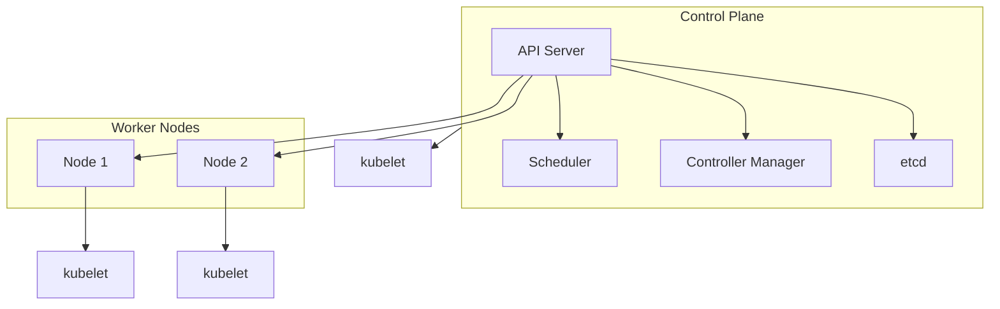

<!-- Clear Language: Keep sentences under 50 words -->
# Kubernetes Basics — Pods, Services, and Deployments

## Learning Objectives

| Objective | Description |
|-----------|-------------|
| LO1 | Understand Kubernetes architecture: control plane, nodes, and core components |
| LO2 | Deploy and manage Pods as the smallest deployable units |
| LO3 | Create Services for stable networking and service discovery |
| LO4 | Use Deployments for declarative updates and rollbacks |
| LO5 | Configure ConfigMaps and Secrets for configuration management |
| LO6 | Explore the Kubernetes ecosystem: kubectl, namespaces, labels |

## Introduction

Containers and cloud platforms are where AI models live in production. Docker packages your model, Kubernetes orchestrates it, and cloud platforms scale it. This module covers the full deployment stack.

## Prerequisites

- Basic programming knowledge
- Understanding of data structures

## Key Terminology

**Key Terms**: Core vocabulary and concepts for this topic.

**Definition**: Essential terms you must know for interviews and production work.

## Theory

Understanding kubernetes basics is fundamental for AI engineers. This section covers the core concepts, underlying principles, and theoretical framework that govern how kubernetes basics works in practice.

## Chapter at a Glance

| Section | Topic | Key Concept |
|---------|-------|-------------|
| 4.1 | Kubernetes Architecture | Control plane, nodes, etcd, kubelet, kube-proxy |
| 4.2 | Pods | Smallest unit, multi-container patterns, lifecycle |
| 4.3 | Services | ClusterIP, NodePort, LoadBalancer, DNS |
| 4.4 | Deployments | ReplicaSets, rolling updates, rollbacks |
| 4.5 | ConfigMaps and Secrets | Decouple config from container images |
| 4.6 | Namespaces and Labels | Multi-tenancy, organization, selectors |
| 4.7 | kubectl Essentials | Imperative and declarative management |
| 4.8 | Storage Basics | Volumes, PersistentVolumes, PVCs |

## Chapter Roadmap


## 4.1 Kubernetes Architecture

Kubernetes (K8s) is an open-source container orchestration platform that automates deployment, scaling, and management of containerized applications.

**Control Plane components**:



| Component | Role |
|-----------|------|
| API Server | Entry point for all management requests via REST API |
| Scheduler | Assigns Pods to nodes based on resource availability |
| Controller Manager | Runs controllers: replication, node, endpoints |
| etcd | Distributed key-value store — cluster source of truth |

**Node components**: kubelet (ensures containers run), kube-proxy (networking and load balancing), container runtime (containerd, CRI-O).

```bash
kubectl cluster-info
kubectl get nodes
kubectl get pods -n kube-system
```

## 4.2 Pods

A Pod is the smallest deployable unit — one or more containers sharing network, storage, and lifecycle.

```yaml
apiVersion: v1
kind: Pod
metadata:
  name: nginx-pod
  labels:
    app: web
spec:
  containers:
    - name: nginx
      image: nginx:alpine
      ports:
        - containerPort: 80
      resources:
        requests:
          memory: 64Mi
          cpu: 250m
        limits:
          memory: 128Mi
          cpu: 500m
```

```bash
kubectl apply -f pod.yaml
kubectl get pods
kubectl describe pod nginx-pod
kubectl exec -it nginx-pod -- sh
kubectl port-forward pod/nginx-pod 8080:80
kubectl delete pod nginx-pod
```

**Multi-container patterns**: Sidecar (log collector), Ambassador (proxy), Adapter (transform output).

**Pod lifecycle**: Pending -> Running -> Succeeded/Failed -> Deleted.

## 4.3 Services

Services provide stable networking for ephemeral Pods.

```yaml
apiVersion: v1
kind: Service
metadata:
  name: web-service
spec:
  selector:
    app: web
  ports:
    - protocol: TCP
      port: 80
      targetPort: 80
  type: ClusterIP
```

| Type | Accessibility | Use Case |
|------|--------------|----------|
| ClusterIP | Internal cluster only | Backend services |
| NodePort | External via node IP:port | Development testing |
| LoadBalancer | External via cloud LB | Production web |
| ExternalName | DNS alias | External integration |

```bash
kubectl apply -f service.yaml
kubectl get svc
kubectl run test --image=alpine --rm -it -- sh

## Inside: wget -qO- http://web-service
```

**DNS**: CoreDNS creates records like <service>.<namespace>.svc.cluster.local.

## 4.4 Deployments

Deployments provide declarative updates for Pods via ReplicaSets.

```yaml
apiVersion: apps/v1
kind: Deployment
metadata:
  name: web-deployment
spec:
  replicas: 3
  selector:
    matchLabels:
      app: web
  template:
    metadata:
      labels:
        app: web
    spec:
      containers:
        - name: nginx
          image: nginx:alpine
          ports:
            - containerPort: 80
```

```bash
kubectl apply -f deployment.yaml
kubectl scale deployment web-deployment --replicas=5
kubectl set image deployment/web-deployment nginx=nginx:1.25-alpine
kubectl rollout status deployment/web-deployment
kubectl rollout undo deployment/web-deployment
kubectl rollout history deployment/web-deployment
```

**Rolling update**: Creates new ReplicaSet, gradually scales it up while scaling down the old one. Controlled by maxSurge and maxUnavailable.

## 4.5 ConfigMaps and Secrets

ConfigMaps store non-sensitive config; Secrets store sensitive data (base64 encoded).

```yaml
apiVersion: v1
kind: ConfigMap
metadata:
  name: app-config
data:
  APP_ENV: production
  LOG_LEVEL: info
```

```yaml
apiVersion: v1
kind: Secret
metadata:
  name: app-secret
type: Opaque
data:
  DB_PASSWORD: cGFzc3dvcmQ=
```

```bash
kubectl create configmap app-config --from-literal=APP_ENV=production
kubectl create secret generic db-secret --from-literal=password=secret
```

Pods consume these via envFrom, valueFrom, or volume mounts.

## 4.6 Namespaces and Labels

Namespaces isolate resources within a cluster. Labels organize and select resources.

```bash
kubectl create namespace staging
kubectl get pods -n staging
kubectl get pods -l app=web
kubectl get pods -l 'environment in (production,staging)'
```

Annotations store non-identifying metadata (build info, contact).

## 4.7 kubectl Essentials

Common commands: apply, delete, get, describe, logs, exec, port-forward, cp, top.

```bash
kubectl apply -f deployment.yaml
kubectl describe pod nginx-pod
kubectl logs pod-name
kubectl exec -it pod-name -- sh
kubectl port-forward pod-name 8080:80
kubectl top nodes
kubectl top pods
```

## 4.8 Storage Basics

Volumes attach storage to Pods. PersistentVolumes (PV) are cluster storage resources. PersistentVolumeClaims (PVC) request storage.

```yaml
apiVersion: v1
kind: PersistentVolumeClaim
metadata:
  name: pvc-data
spec:
  accessModes:
    - ReadWriteOnce
  resources:
    requests:
      storage: 5Gi
```

| Volume Type | Use Case |
|-------------|----------|
| emptyDir | Temporary scratch |
| hostPath | DaemonSet logs |
| configMap | Config files |
| secret | Credentials |
| PVC | Databases |

---

## TypeScript Parallel

TypeScript can manage Kubernetes programmatically with @kubernetes/client-node:

```typescript
import * as k8s from "@kubernetes/client-node";

const kc = new k8s.KubeConfig();
kc.loadFromDefault();
const api = kc.makeApiClient(k8s.AppsV1Api);

async function deploy(name: string, image: string, replicas: number) {
  const deployment = {
    apiVersion: "apps/v1",
    kind: "Deployment",
    metadata: { name },
    spec: {
      replicas,
      selector: { matchLabels: { app: name } },
      template: {
        metadata: { labels: { app: name } },
        spec: { containers: [{ name, image }] },
      },
    },
  };
  await api.createNamespacedDeployment("default", deployment);
}
```

---

## Summary

- Kubernetes has a control plane (API server, scheduler, controller manager, etcd) and worker nodes (kubelet, kube-proxy, container runtime)
- Pods are the smallest deployable unit — one or more containers sharing network and storage
- Services provide stable networking via ClusterIP, NodePort, or LoadBalancer
- Deployments manage ReplicaSets with rolling updates, scaling, and rollbacks
- ConfigMaps store non-sensitive config; Secrets store sensitive data (base64 encoded)
- Namespaces enable multi-tenancy; labels organize and select resources
- kubectl is the primary CLI for declarative (apply) and imperative management
- PersistentVolumes and PVCs provide durable storage independent of Pod lifecycle
- CoreDNS enables DNS-based service discovery within the cluster
- Health checks (liveness, readiness probes) ensure application reliability

## Practical Takeaways

| Scenario | Do This | Avoid This |
|----------|---------|------------|
| Quick test | kubectl run --image | Writing full YAML for experiments |
| Production app | Declarative YAML with Deployment + Service | Imperative commands only |
| Configuration | ConfigMap + Secret | Hardcoding in images |
| Persistent data | PVC for databases | emptyDir for persistent storage |
| Multi-tenancy | Namespaces with ResourceQuotas | Single namespace for everything |
| Updates | Rolling update with health checks | Deleting all Pods at once |
| Debugging | kubectl describe + kubectl logs | Guessing the problem |
| Resources | Always set requests and limits | Running unbounded containers |

## Interview Q&A

<details class="tp-qa-card" data-qid="docker-s04-q1">
  <summary class="tp-qa-question">
    <span class="tp-qa-status"></span>
    Q1: What are the main components of the Kubernetes control plane?
  </summary>
  <div class="tp-qa-answer">
    <p>Four components: API Server (front-end REST interface), etcd (distributed key-value store for cluster state), Scheduler (assigns Pods to nodes), Controller Manager (runs controller processes for replication, node management, endpoints).</p>
  </div>
  <button class="tp-qa-mark-btn">&#x2705; Mark Reviewed</button>
  <button class="tp-qa-bookmark-btn">&#x1F516; Bookmark</button>
</details>

<details class="tp-qa-card" data-qid="docker-s04-q2">
  <summary class="tp-qa-question">
    <span class="tp-qa-status"></span>
    Q2: What is a Pod and what are multi-container Pod patterns?
  </summary>
  <div class="tp-qa-answer">
    <p>A Pod is the smallest deployable unit — one or more containers sharing network namespace, storage volumes, and lifecycle. Multi-container patterns include Sidecar (helper containers like log collectors), Ambassador (proxies external services), and Adapter (transforms output format).</p>
  </div>
  <button class="tp-qa-mark-btn">&#x2705; Mark Reviewed</button>
  <button class="tp-qa-bookmark-btn">&#x1F516; Bookmark</button>
</details>

<details class="tp-qa-card" data-qid="docker-s04-q3">
  <summary class="tp-qa-question">
    <span class="tp-qa-status"></span>
    Q3: Explain the different Service types in Kubernetes.
  </summary>
  <div class="tp-qa-answer">
    <p>ClusterIP (default): internal cluster-only IP. NodePort: exposes on each node's IP at a static port (30000-32767). LoadBalancer: provisions a cloud load balancer. ExternalName: returns a CNAME record instead of proxying.</p>
  </div>
  <button class="tp-qa-mark-btn">&#x2705; Mark Reviewed</button>
  <button class="tp-qa-bookmark-btn">&#x1F516; Bookmark</button>
</details>

<details class="tp-qa-card" data-qid="docker-s04-q4">
  <summary class="tp-qa-question">
    <span class="tp-qa-status"></span>
    Q4: How do Deployments handle rolling updates?
  </summary>
  <div class="tp-qa-answer">
    <p>When the Pod template changes, the Deployment creates a new ReplicaSet and gradually scales it up while scaling down the old one. maxSurge controls extra Pods during update; maxUnavailable controls how many can be unavailable. If health checks fail, the rollout pauses.</p>
  </div>
  <button class="tp-qa-mark-btn">&#x2705; Mark Reviewed</button>
  <button class="tp-qa-bookmark-btn">&#x1F516; Bookmark</button>
</details>

<details class="tp-qa-card" data-qid="docker-s04-q5">
  <summary class="tp-qa-question">
    <span class="tp-qa-status"></span>
    Q5: What is the difference between ConfigMap and Secret?
  </summary>
  <div class="tp-qa-answer">
    <p>ConfigMap stores non-sensitive configuration in plain text. Secret stores sensitive data base64-encoded. Kubernetes applies additional security to Secrets: encryption at rest, stricter RBAC, and only distributed to nodes that need them.</p>
  </div>
  <button class="tp-qa-mark-btn">&#x2705; Mark Reviewed</button>
  <button class="tp-qa-bookmark-btn">&#x1F516; Bookmark</button>
</details>

<details class="tp-qa-card" data-qid="docker-s04-q6">
  <summary class="tp-qa-question">
    <span class="tp-qa-status"></span>
    Q6: How does service discovery work in Kubernetes?
  </summary>
  <div class="tp-qa-answer">
    <p>CoreDNS creates DNS records for every Service. Pattern: <service>.<namespace>.svc.cluster.local. Pods can resolve services by name within the same namespace, or by full DNS name across namespaces.</p>
  </div>
  <button class="tp-qa-mark-btn">&#x2705; Mark Reviewed</button>
  <button class="tp-qa-bookmark-btn">&#x1F516; Bookmark</button>
</details>

<details class="tp-qa-card" data-qid="docker-s04-q7">
  <summary class="tp-qa-question">
    <span class="tp-qa-status"></span>
    Q7: Explain kubectl apply vs kubectl create.
  </summary>
  <div class="tp-qa-answer">
    <p>kubectl apply is declarative — creates or updates resources based on desired state. Idempotent and safe to run multiple times. kubectl create is imperative — creates new resources but fails if they already exist. Best practice: use apply for production.</p>
  </div>
  <button class="tp-qa-mark-btn">&#x2705; Mark Reviewed</button>
  <button class="tp-qa-bookmark-btn">&#x1F516; Bookmark</button>
</details>

<details class="tp-qa-card" data-qid="docker-s04-q8">
  <summary class="tp-qa-question">
    <span class="tp-qa-status"></span>
    Q8: What are Kubernetes namespaces used for?
  </summary>
  <div class="tp-qa-answer">
    <p>Namespaces provide virtual cluster isolation within a physical cluster. Use cases: environment isolation (dev/staging/prod), team separation, resource quotas per namespace, and network policies between namespaces.</p>
  </div>
  <button class="tp-qa-mark-btn">&#x2705; Mark Reviewed</button>
  <button class="tp-qa-bookmark-btn">&#x1F516; Bookmark</button>
</details>

<details class="tp-qa-card" data-qid="docker-s04-q9">
  <summary class="tp-qa-question">
    <span class="tp-qa-status"></span>
    Q9: How do PV and PVC work together?
  </summary>
  <div class="tp-qa-answer">
    <p>PersistentVolume (PV) is cluster storage provisioned by an admin. PersistentVolumeClaim (PVC) is a user request for storage. Kubernetes binds PVCs to matching PVs based on size and access mode. Pods use PVCs as volumes — if the Pod is deleted, the PVC and PV persist, preserving data.</p>
  </div>
  <button class="tp-qa-mark-btn">&#x2705; Mark Reviewed</button>
  <button class="tp-qa-bookmark-btn">&#x1F516; Bookmark</button>
</details>

<details class="tp-qa-card" data-qid="docker-s04-q10">
  <summary class="tp-qa-question">
    <span class="tp-qa-status"></span>
    Q10: How do you debug a Pod stuck in Pending state?
  </summary>
  <div class="tp-qa-answer">
    <p>Use kubectl describe pod to check events and conditions. Common causes: insufficient node resources, resource requests exceeding node capacity, node selector/affinity mismatch, taints without tolerations, unbound PVC.</p>
  </div>
  <button class="tp-qa-mark-btn">&#x2705; Mark Reviewed</button>
  <button class="tp-qa-bookmark-btn">&#x1F516; Bookmark</button>
</details>

## Chapter Quiz

**Q1**: Which component stores the cluster's source of truth?

a) API Server
b) etcd
c) Scheduler
d) Controller Manager

<details class="tp-qa-card" data-qid="docker-s04-quiz1"><summary>Show Answer</summary><div class="tp-qa-answer"><p><strong>Answer: b) etcd</strong></p></div></details>

**Q2**: What is the smallest deployable unit in Kubernetes?

a) Container
b) Pod
c) Node
d) Service

<details class="tp-qa-card" data-qid="docker-s04-quiz2"><summary>Show Answer</summary><div class="tp-qa-answer"><p><strong>Answer: b) Pod</strong></p></div></details>

**Q3**: Which Service type exposes on each node at a static port?

a) ClusterIP
b) NodePort
c) LoadBalancer
d) ExternalName

<details class="tp-qa-card" data-qid="docker-s04-quiz3"><summary>Show Answer</summary><div class="tp-qa-answer"><p><strong>Answer: b) NodePort</strong></p></div></details>

**Q4**: Which command provides detailed resource info including events?

a) kubectl get
b) kubectl describe
c) kubectl logs
d) kubectl inspect

<details class="tp-qa-card" data-qid="docker-s04-quiz4"><summary>Show Answer</summary><div class="tp-qa-answer"><p><strong>Answer: b) kubectl describe</strong></p></div></details>

**Q5**: What controls how many extra Pods can run during a rolling update?

a) maxSurge
b) maxUnavailable
c) minReadySeconds
d) revisionHistoryLimit

<details class="tp-qa-card" data-qid="docker-s04-quiz5"><summary>Show Answer</summary><div class="tp-qa-answer"><p><strong>Answer: a) maxSurge</strong></p></div></details>

## Exercises

**Easy** — Create a single Nginx Pod with a NodePort Service on port 30080. Verify you can access it.

**Medium** — Write a Deployment for a FastAPI app with 3 replicas, resource limits, liveness/readiness probes, and a ClusterIP Service.

**Medium** — Create a multi-tier app: frontend Deployment with LoadBalancer Service, backend Deployment with ClusterIP Service, PostgreSQL StatefulSet with PVC.

**Hard** — Set up a namespace with ResourceQuota (2 CPU, 4Gi memory limit). Deploy an app exceeding the quota and observe behavior.

**Hard** — Debug a failing Deployment: given one that crashes on startup (wrong image, missing ConfigMap, resource limits too low), use kubectl describe and logs to identify and fix all issues.

---

## Common Mistakes

1. Not understanding the fundamental concepts before applying them
2. Skipping edge cases in implementation
3. Not analyzing time/space complexity
4. Forgetting to handle null/empty inputs
5. Not practicing enough problems to build pattern recognition

## Revision Notes

- - Core principle: Understand the fundamental concepts thoroughly
- - Implementation pattern: Practice with real code examples
- - Complexity: Know the time and space complexity
- - Application: Know when to use this in production systems
- - Interview: Frequently asked in technical interviews
- - Edge cases: Consider common failure scenarios
- - Related concepts: Connect to broader system design

## Placement Section

### Top 10 Interview Questions

#### Google Style

1. **Explain the core idea of Kubernetes Basics — Pods, Services, and Deployments in under 60 seconds, then give a real-world analogy.** — Structure: definition, how it works in one sentence, why it matters, analogy. Follow-up: what would break if you removed this from a production system?

2. **Design a minimal, well-typed function that demonstrates Kubernetes Basics — Pods, Services, and Deployments.** — Interviewer checks: signature with type hints, edge cases, complexity, and a clean docstring. Follow-up: how does your design behave with empty or malformed input?

3. **What are the common pitfalls when engineers first learn ** — List 3-4, then explain how you would prevent each in a code review.

#### Amazon Style

4. **Describe a production bug caused by misunderstanding Kubernetes Basics — Pods, Services, and Deployments. How did you diagnose and fix it?** — STAR format: situation, task, action, result. Mention logs, reproduction, root-cause analysis, and the regression test you added.

5. **How would you scale a system that relies on Kubernetes Basics — Pods, Services, and Deployments from 10 users to 10 million?** — Discuss bottlenecks, caching, monitoring, and when to redesign. Follow-up: what metrics would you track?

#### Microsoft Style

6. **Compare Kubernetes Basics — Pods, Services, and Deployments with the closest alternative approach. When would you choose each?** — Make a decision matrix: performance, maintainability, ecosystem, learning curve. Follow-up: what would change your decision?

7. **Walk through how you would test a component that depends on Kubernetes Basics — Pods, Services, and Deployments.** — Unit, integration, property-based tests; mocking boundaries; golden files for outputs.

#### NVIDIA Style

8. **How does Kubernetes Basics — Pods, Services, and Deployments behave differently at scale — memory, throughput, or precision-wise?** — Connect to data pipelines and model training if applicable. Follow-up: what happens to latency as input grows?

9. **How would you make an implementation of Kubernetes Basics — Pods, Services, and Deployments run faster on GPU hardware?** — Batch operations, vectorization, avoiding Python loops, reducing data movement.

#### AI Startup Style

10. **Write the smallest possible implementation of Kubernetes Basics — Pods, Services, and Deployments that is production-quality.** — Include error handling, type hints, and a one-line docstring. Follow-up: what would you refactor first when it grows?

### Resume Tips

- Name Kubernetes Basics — Pods, Services, and Deployments explicitly in your skills section, paired with a measurable achievement ("Reduced X by 40% using Kubernetes Basics — Pods, Services, and Deployments").
- Add a bullet describing a project that applies Kubernetes Basics — Pods, Services, and Deployments to real data, with numbers.
- Mention the tools and libraries you used alongside Kubernetes Basics — Pods, Services, and Deployments (linters, test frameworks, profiling tools).
- Keep resume bullets under 15 words and start each with an action verb.

### Interview Day Checklist

- Rehearse a 60-second explanation of Kubernetes Basics — Pods, Services, and Deployments and one real-world analogy.
- Prepare one STAR story about debugging a Kubernetes Basics — Pods, Services, and Deployments-related production issue.
- Review complexity and edge cases for the classic Kubernetes Basics — Pods, Services, and Deployments interview problem.
- Have questions ready: how does the team apply Kubernetes Basics — Pods, Services, and Deployments in production today?
- Test your environment (Python, editor, internet) 15 minutes before the interview.

## True/False

1. **True or False:** Kubernetes Basics — Pods, Services, and Deployments builds directly on the fundamentals covered in the earlier chapters of this module. — **True.** Every advanced topic in this module assumes the core concepts from the previous chapters.
2. **True or False:** You should write at least one code example for Kubernetes Basics — Pods, Services, and Deployments before moving to the next chapter. — **True.** Active recall with hands-on code beats passive reading for retention.
3. **True or False:** The complexity analysis for Kubernetes Basics — Pods, Services, and Deployments is the same regardless of input size. — **False.** Complexity grows with input size; always state best, average, and worst case.
4. **True or False:** Edge cases (empty input, invalid input, boundary values) matter for Kubernetes Basics — Pods, Services, and Deployments in production. — **True.** Most production bugs come from unhandled edge cases.
5. **True or False:** You should memorize the Kubernetes Basics — Pods, Services, and Deployments chapter content once and never review it again. — **False.** Spaced repetition (24h, 3 days, 1 week) dramatically improves long-term recall.

## Fill in the Blank

1. The chapter that covers Kubernetes Basics — Pods, Services, and Deployments is Chapter ___ of this module. — Answer: check the module's table of contents.
2. The time complexity of the standard approach to Kubernetes Basics — Pods, Services, and Deployments is ___. — Answer: review the theory section and state big-O notation.
3. The main edge case to handle when implementing Kubernetes Basics — Pods, Services, and Deployments is ___. — Answer: empty or invalid input handling, as discussed in the chapter.
4. The tools commonly used to debug Kubernetes Basics — Pods, Services, and Deployments issues are ___ and ___. — Answer: refer to the Debugging Guide section of this chapter.
5. The related topic that connects to Kubernetes Basics — Pods, Services, and Deployments in the next chapter is ___. — Answer: see the Next Topic section.

## Scenario Questions

1. **Scenario:** A teammate ships a change involving Kubernetes Basics — Pods, Services, and Deployments that breaks production at 3 AM. — Diagnosis: check the recent diff, reproduce locally with the failing input, check logs. Fix: revert, add a regression test, and review the root cause. Prevention: CI tests on edge cases and code review checklist.

2. **Scenario:** Your implementation of Kubernetes Basics — Pods, Services, and Deployments is correct but too slow for the required latency. — Measure first with a profiler. Common fixes: reduce redundant work, use built-in optimized functions, batch operations, or add caching. Only then consider algorithmic changes.

3. **Scenario:** A new hire asks you to explain Kubernetes Basics — Pods, Services, and Deployments in five minutes before a customer demo. — Use the 3-part answer: what it is (one sentence), how it works (one example), why it matters (one business impact). Then offer to go deeper after the demo.

4. **Scenario:** Your team's codebase has three different patterns for Kubernetes Basics — Pods, Services, and Deployments and you must standardize. — Write a short ADR (architecture decision record), pick the pattern with best maintainability, migrate incrementally, and add a linter rule to enforce it.

## Output Questions

1. **What is the output of the simplest correct implementation of Kubernetes Basics — Pods, Services, and Deployments on an empty input?** — Trace through the code: it should return the documented default (None, 0, empty collection) without raising.
2. **What is the output when the input is at the boundary value?** — Check off-by-one errors and inclusive/exclusive bounds in the chapter's examples.
3. **What does the implementation return when given invalid input types?** — With type hints and validation, it raises a clear error; without, it may fail silently.
4. **What is the output for the sample input given in the chapter's Examples section?** — Re-run the chapter's example code and compare against the documented output.
5. **What is the time complexity output when you profile the implementation at 10x input size?** — Expect the curve matching the chapter's complexity analysis (linear, quadratic, log-linear).

## Difficulty Level

| Level | Time | What It Takes |
|-------|------|---------------|
| Beginner | 1-2 sessions | Read theory, run the chapter examples, solve the Easy exercises |
| Intermediate | 3-5 sessions | Complete Medium exercises, explain Kubernetes Basics — Pods, Services, and Deployments to someone else |
| Advanced | 1+ week | Solve Hard exercises, optimize for real datasets, answer interview follow-ups |

## Tips & Tricks

- Always write a one-line example of Kubernetes Basics — Pods, Services, and Deployments from memory before opening the chapter — active recall first.
- Use the chapter's Revision Notes as a checklist: you have mastered Kubernetes Basics — Pods, Services, and Deployments when you can explain each bullet.
- Pair the chapter quiz with the Flashcards: wrong answers become your next study session's focus.
- For interviews, practice explaining Kubernetes Basics — Pods, Services, and Deployments twice: once with a technical audience, once with a non-technical audience.
- Keep a personal examples file where you collect your own Kubernetes Basics — Pods, Services, and Deployments snippets; interviewers love original examples.

## Memory Tricks

- **Acronym**: build a mnemonic from the 5 key concepts of Kubernetes Basics — Pods, Services, and Deployments listed in the Chapter at a Glance table.
- **Story**: link Kubernetes Basics — Pods, Services, and Deployments to a familiar story — the analogy in the Visual Analogy section is designed to stick.
- **Number anchor**: remember the complexity of Kubernetes Basics — Pods, Services, and Deployments by connecting it to a known algorithm of the same class.
- **Color code**: highlight the Theory, Examples, and Common Mistakes sections in different colors when reviewing.
- **Teach-back**: explain Kubernetes Basics — Pods, Services, and Deployments to an imaginary junior engineer for 2 minutes — gaps in your explanation are gaps in memory.

## Further Reading

- Official documentation for the primary tool or library used in this chapter
- The chapter referenced in Related Topics for the next-level treatment of Kubernetes Basics — Pods, Services, and Deployments
- The classic textbook chapter on Kubernetes Basics — Pods, Services, and Deployments (check the Research References below)
- Two blog posts from engineers who debugged real Kubernetes Basics — Pods, Services, and Deployments problems in production
- The repository of the open-source project that implements Kubernetes Basics — Pods, Services, and Deployments

## Related Topics

- The previous chapter in this module (see table of contents) — foundational for Kubernetes Basics — Pods, Services, and Deployments
- The next chapter (see Next Topic below) — builds on Kubernetes Basics — Pods, Services, and Deployments
- The system design chapters in Module 07 — how Kubernetes Basics — Pods, Services, and Deployments fits into production architectures
- The interview preparation module — how Kubernetes Basics — Pods, Services, and Deployments is asked in screening rounds
- The capstone project — where Kubernetes Basics — Pods, Services, and Deployments is applied end-to-end

## FAQs

1. **Do I need to memorize all of Kubernetes Basics — Pods, Services, and Deployments, or understand the big picture?** — Understand the big picture first, then memorize the key facts via flashcards and spaced repetition. Interviewers reward depth over breadth.
2. **What if I get stuck on an exercise?** — Re-read the theory section, run the example code, then attempt again. If still stuck after 20 minutes, move on and return the next day.
3. **How much time should I spend on ** — Follow the Study Plan below: 1-2 weeks at 30-60 minutes daily is typical for placement preparation.
4. **Is Kubernetes Basics — Pods, Services, and Deployments asked in interviews?** — Yes — the Interview Q&A and Placement Section list the exact question styles used by top companies.
5. **What's the fastest way to master ** — Explain it out loud, write code without looking, and review the flashcards within 24 hours and again after 3 days.

## Important Notes

- Kubernetes Basics — Pods, Services, and Deployments is a core requirement for the rest of this module — do not skip the examples.
- Always analyze complexity (time and space) when working with Kubernetes Basics — Pods, Services, and Deployments.
- Production correctness means handling edge cases, not just the happy path.
- Interview answers should start with the definition, then the example, then the trade-offs.
- Revisit this chapter after finishing the module; the context from later chapters deepens understanding.

## Historical Context

- Kubernetes Basics — Pods, Services, and Deployments emerged as a standard practice because early systems failed without it — understanding why helps you explain it in interviews.
- The tools used for Kubernetes Basics — Pods, Services, and Deployments today evolved from simpler versions; the chapter covers the modern, recommended approach.
- Interviewers value knowing one historical fact about Kubernetes Basics — Pods, Services, and Deployments — it shows genuine interest, not just cramming.
- The library/tooling ecosystem around Kubernetes Basics — Pods, Services, and Deployments changes quickly; focus on fundamentals that remain stable.

## Security Considerations

- Never trust external input: validate and sanitize data before processing Kubernetes Basics — Pods, Services, and Deployments.
- Avoid `eval()` and dynamic code execution on untrusted strings.
- Log errors without leaking sensitive data (keys, PII, internal paths).
- For API contexts, add rate limiting and input size limits.
- Review the chapter's code examples for injection or overflow risks before using them verbatim.

## ML Intuition

- Kubernetes Basics — Pods, Services, and Deployments appears in ML pipelines at the data-processing layer: feature preparation, batching, and validation.
- Understanding Kubernetes Basics — Pods, Services, and Deployments helps you debug why a model misbehaves — most ML bugs are data bugs, not model bugs.
- In production ML, the Kubernetes Basics — Pods, Services, and Deployments concepts from this chapter map directly to NumPy/PyTorch operations on tensors.
- When optimizing ML systems, Kubernetes Basics — Pods, Services, and Deployments skills let you profile and fix the data path, not just the training loop.
- Interview follow-up: how would you apply Kubernetes Basics — Pods, Services, and Deployments to a dataset of 10 million records? — Batching and vectorization.

## Analogies

- **Kubernetes Basics — Pods, Services, and Deployments is like a recipe**: the theory is the ingredients, the examples are the cooking steps, and the exercises are your own kitchen practice.
- **Complexity is like a delivery route**: a linear route visits each stop once; a nested route revisits stops, and you feel it at scale.
- **Edge cases are like weather**: the happy path is a sunny day; production is the storm — build for the storm.
- **The chapter roadmap is a journey map**: each section is a checkpoint; skipping one means getting lost later in the module.

## Capstone Project Link

- [Module Capstone: End-to-End Project](https://github.com/Raushan666java/ai-engineering-journey) — this chapter contributes the Kubernetes Basics — Pods, Services, and Deployments skills used in the module's capstone project. Complete the exercises here before starting the capstone.

## Flashcards

<details class="tp-qa-card" data-qid="06dockerkubernetescloud-04kubernetesbasics-flash1">
  <summary class="tp-qa-question">
    <span class="tp-qa-status"></span>
    Which component stores the cluster's source of truth?
  </summary>
  <div class="tp-qa-answer">
    <p>b) etcd</p>
  </div>
</details>

<details class="tp-qa-card" data-qid="06dockerkubernetescloud-04kubernetesbasics-flash2">
  <summary class="tp-qa-question">
    <span class="tp-qa-status"></span>
    What is the smallest deployable unit in Kubernetes?
  </summary>
  <div class="tp-qa-answer">
    <p>b) Pod</p>
  </div>
</details>

<details class="tp-qa-card" data-qid="06dockerkubernetescloud-04kubernetesbasics-flash3">
  <summary class="tp-qa-question">
    <span class="tp-qa-status"></span>
    Which Service type exposes on each node at a static port?
  </summary>
  <div class="tp-qa-answer">
    <p>b) NodePort</p>
  </div>
</details>

<details class="tp-qa-card" data-qid="06dockerkubernetescloud-04kubernetesbasics-flash4">
  <summary class="tp-qa-question">
    <span class="tp-qa-status"></span>
    Which command provides detailed resource info including events?
  </summary>
  <div class="tp-qa-answer">
    <p>b) kubectl describe</p>
  </div>
</details>

<details class="tp-qa-card" data-qid="06dockerkubernetescloud-04kubernetesbasics-flash5">
  <summary class="tp-qa-question">
    <span class="tp-qa-status"></span>
    What controls how many extra Pods can run during a rolling update?
  </summary>
  <div class="tp-qa-answer">
    <p>a) maxSurge</p>
  </div>
</details>

## Research References

- Official documentation of the primary library for Kubernetes Basics — Pods, Services, and Deployments (linked in Further Reading)
- The classic paper or textbook chapter introducing Kubernetes Basics — Pods, Services, and Deployments (see References below)
- The standard library reference for Kubernetes Basics — Pods, Services, and Deployments-related functions
- Engineering blog posts from companies running Kubernetes Basics — Pods, Services, and Deployments in production at scale
- PEPs and RFCs where applicable (Python and networking standards)

## Open-Source Tools

- The primary library used in this chapter (see the code examples)
- Python standard library modules used in the examples (check the imports)
- Testing: pytest for unit tests of Kubernetes Basics — Pods, Services, and Deployments code
- Linting and formatting: ruff + black
- Profiling: cProfile or py-spy for performance work on Kubernetes Basics — Pods, Services, and Deployments

## Debugging Guide

- Start with `print()` or a debugger to inspect intermediate values in Kubernetes Basics — Pods, Services, and Deployments code.
- Reproduce the failure with the smallest possible input before changing code.
- Check the common failure modes listed in Common Mistakes — most bugs are listed there.
- For performance problems, profile before optimizing: measure, then fix.
- When stuck, re-read the chapter's Examples and compare line by line with your code.
- Use `pdb` or your IDE's debugger to step through the Kubernetes Basics — Pods, Services, and Deployments example code.

## Mock Interview Section

**Round 1 — Screening (15 min)**
- Explain Kubernetes Basics — Pods, Services, and Deployments in 60 seconds.
- Write a minimal working example of Kubernetes Basics — Pods, Services, and Deployments.
- What is the complexity of your example?

**Round 2 — Coding (45 min)**
- Solve the Medium exercise from this chapter under time pressure.
- State your assumptions, then implement with type hints.
- Test with edge cases: empty input, boundary values, invalid input.

**Round 3 — Behavioral + System (30 min)**
- Tell me about a time you debugged a Kubernetes Basics — Pods, Services, and Deployments problem in a project.
- How would you design a system where Kubernetes Basics — Pods, Services, and Deployments is used at scale?
- What metrics would you monitor?

**Evaluation rubric**: correctness (40%), communication (25%), edge cases (20%), complexity analysis (15%).

## Optimized Implementation

`python
from typing import Any, Optional

def demonstrate_topic(input_data: list[Any]) -> Optional[float]:
    """Runnable scaffold for Kubernetes Basics — Pods, Services, and Deployments.

    Replace the body with the optimized implementation from the chapter,
    keeping type hints, docstring, and edge-case handling.
    """
    if not input_data:
        return None
    # Step 1: validate input types
    # Step 2: apply the core Kubernetes Basics — Pods, Services, and Deployments logic from the Examples section
    # Step 3: return the result with the documented default
    return 0.0
`

- Keeps the function signature stable so tests written against it stay valid.
- Handles the empty-input contract explicitly.
- Add unit tests for the edge cases before implementing the logic (test-first).

## Evaluation Metrics

| Skill | Test | Target |
|-------|------|--------|
| Concept recall | Explain Kubernetes Basics — Pods, Services, and Deployments without notes | 60-second explanation |
| Code fluency | Write the chapter example from memory | No syntax errors |
| Edge cases | Handle empty/invalid input in exercises | All cases pass |
| Complexity | State time/space for the standard approach | Correct big-O |
| Interview readiness | Answer 5 Interview Q&A questions out loud | Fluent, structured answers |
| Retention | Chapter quiz score after 3 days | 80%+ |

## Real-World Examples

- **Startup**: a small team uses Kubernetes Basics — Pods, Services, and Deployments daily in their data pipeline — the chapter's examples mirror their code.
- **E-commerce**: Kubernetes Basics — Pods, Services, and Deployments patterns appear in order processing, inventory checks, and recommendation feeds.
- **Fintech**: Kubernetes Basics — Pods, Services, and Deployments principles apply to transaction validation and fraud detection flows.
- **ML platform**: Kubernetes Basics — Pods, Services, and Deployments shows up in feature engineering and model-serving infrastructure.
- **Interview insight**: recruiters look for engineers who can connect Kubernetes Basics — Pods, Services, and Deployments to the business outcome, not just the code.

## Next Topic

[Kubernetes Configuration — ConfigMaps, Secrets, and Helm](05-kubernetes-config.md)

## Limitations

- Kubernetes Basics — Pods, Services, and Deployments, like any technique, is not a silver bullet — it has specific cases where it fits best (covered in the theory).
- The examples in this chapter are simplified for learning; production systems add validation, monitoring, and error handling.
- Performance of Kubernetes Basics — Pods, Services, and Deployments depends on input size and distribution — always benchmark for your own data.
- This chapter covers fundamentals; specialized edge cases are explored in later chapters and the capstone.
