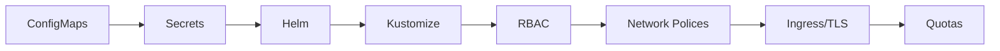

<!-- Clear Language: Keep sentences under 50 words -->
# Kubernetes Configuration — ConfigMaps, Secrets, and Helm

## Learning Objectives

| Objective | Description |
|-----------|-------------|
| LO1 | Manage application configuration with ConfigMaps and Secrets |
| LO2 | Inject configuration into Pods via env vars and volumes |
| LO3 | Understand Helm charts for package management |
| LO4 | Use Kustomize for environment-specific overlays |
| LO5 | Implement RBAC, service accounts, network policies |
| LO6 | Manage TLS certificates and Ingress resources |

## Introduction

Containers and cloud platforms are where AI models live in production. Docker packages your model, Kubernetes orchestrates it, and cloud platforms scale it. This module covers the full deployment stack.

## Prerequisites

- Basic programming knowledge
- Understanding of data structures

## Key Terminology

**Key Terms**: Core vocabulary and concepts for this topic.

**Definition**: Essential terms you must know for interviews and production work.

## Theory

Understanding kubernetes config is fundamental for AI engineers. This section covers the core concepts, underlying principles, and theoretical framework that govern how kubernetes config works in practice.

## Chapter at a Glance

| Section | Topic | Key Concept |
|---------|-------|-------------|
| 5.1 | ConfigMaps in Depth | Create, consume, update strategies |
| 5.2 | Secrets Management | Encryption, external stores |
| 5.3 | Helm Package Manager | Charts, releases, repositories |
| 5.4 | Kustomize | Base/overlay, patches |
| 5.5 | RBAC and Service Accounts | Roles, bindings |
| 5.6 | Network Policies | Ingress/egress rules |
| 5.7 | Ingress and TLS | Ingress controller, cert-manager |
| 5.8 | Resource Quotas | LimitRange, ResourceQuota |

## Chapter Roadmap



## 5.1 ConfigMaps in Depth

ConfigMaps decouple configuration from container images.

```bash
kubectl create configmap app-config --from-literal=APP_ENV=production
kubectl create configmap app-config --from-file=config.json
kubectl create configmap app-config --from-env-file=.env
```

**Consumption**:

```yaml
spec:
  containers:
    - name: app
      envFrom:
        - configMapRef:
            name: app-config
      volumeMounts:
        - name: config
          mountPath: /etc/config
  volumes:
    - name: config
      configMap:
        name: app-config
```

Updates: env vars require Pod restart; volume mounts sync within ~2 minutes.

## 5.2 Secrets Management

Secrets are base64 encoded. Use encryption at rest for production.

```bash
kubectl create secret generic db-secret --from-literal=password=secret
kubectl create secret docker-registry regcred --docker-server=registry.example.com --docker-username=user --docker-password=pass
```

**External Secrets Operator**:

```yaml
apiVersion: external-secrets.io/v1beta1
kind: ExternalSecret
spec:
  secretStoreRef:
    name: aws-parameter-store
  target:
    name: app-secret
  data:
    - secretKey: DB_PASSWORD
      remoteRef:
        key: /production/db/password
```

**Sealed Secrets**: Encrypt with kubeseal for safe Git storage.

## 5.3 Helm Package Manager

```bash
helm repo add bitnami https://charts.bitnami.com/bitnami
helm install my-release bitnami/nginx --set service.type=LoadBalancer
helm list
helm upgrade my-release -f values-prod.yaml
helm rollback my-release 1
helm uninstall my-release
```

**Chart structure**: Chart.yaml, values.yaml, templates/, charts/.

## 5.4 Kustomize

```yaml

## base/kustomization.yaml
apiVersion: kustomize.config.k8s.io/v1beta1
kind: Kustomization
resources:
  - deployment.yaml
commonLabels:
  app: my-app
```

```bash
kubectl apply -k overlays/production/
```

## 5.5 RBAC and Service Accounts

```yaml
apiVersion: rbac.authorization.k8s.io/v1
kind: Role
metadata:
  name: pod-reader
rules:
  - apiGroups: [""]
    resources: ["pods"]
    verbs: ["get", "list", "watch"]
---
apiVersion: v1
kind: ServiceAccount
metadata:
  name: my-app-sa
```

## 5.6 Network Policies

```yaml
apiVersion: networking.k8s.io/v1
kind: NetworkPolicy
metadata:
  name: api-policy
spec:
  podSelector:
    matchLabels:
      app: api
  ingress:
    - from:
        - podSelector:
            matchLabels:
              app: frontend
      ports:
        - port: 8000
```

## 5.7 Ingress and TLS

```yaml
apiVersion: networking.k8s.io/v1
kind: Ingress
metadata:
  annotations:
    cert-manager.io/cluster-issuer: letsencrypt-prod
spec:
  ingressClassName: nginx
  tls:
    - hosts:
        - app.example.com
      secretName: app-tls
  rules:
    - host: app.example.com
      http:
        paths:
          - path: /api
            pathType: Prefix
            backend:
              service:
                name: api-service
                port:
                  number: 8000
```

## 5.8 Resource Quotas and Limits

```yaml
apiVersion: v1
kind: LimitRange
metadata:
  name: resource-limits
spec:
  limits:
    - default:
        cpu: 500m
        memory: 512Mi
      defaultRequest:
        cpu: 200m
        memory: 256Mi
---
apiVersion: v1
kind: ResourceQuota
metadata:
  name: compute-quota
spec:
  hard:
    requests.cpu: "4"
    requests.memory: 8Gi
    pods: "10"
```

---

## TypeScript Parallel

```typescript
function generateDeployment(name: string, image: string, replicas: number): string {
  const lines = [
    "apiVersion: apps/v1",
    "kind: Deployment",
    "metadata:",
    "  name: " + name,
    "spec:",
    "  replicas: " + replicas,
  ];
  return lines.join("\n");
}
```

---

## Summary

- ConfigMaps store non-sensitive config; consumed as env vars or volume mounts
- Secrets are base64-encoded; use encryption at rest and external stores
- Helm packages resources into versioned charts with templates
- Kustomize customizes YAML through overlays/patches without templating
- RBAC uses Roles/RoleBindings and ClusterRoles/ClusterRoleBindings
- ServiceAccounts provide Pod identity for API auth
- Network Policies control traffic based on selectors and ports
- Ingress routes HTTP/HTTPS; cert-manager automates TLS
- ResourceQuota caps namespace usage; LimitRange sets per-container defaults
- PriorityClass determines scheduling priority

## Practical Takeaways

| Scenario | Do This | Avoid This |
|----------|---------|------------|
| Configuration | ConfigMap + Volume Mount | Hardcoding in image |
| Secrets in Git | Sealed Secrets | Plain text in repo |
| Multi-env | Kustomize overlays | Copy-pasted manifests |
| Distribution | Helm chart repo | Raw YAML |
| Permissions | Dedicated ServiceAccount | Default SA |
| TLS | cert-manager | Manual certs |
| Resources | ResourceQuota + LimitRange | No limits |
| Traffic | Network Policies | Default allow-all |

## Interview Q&A

<details class="tp-qa-card" data-qid="docker-s05-q1">
  <summary class="tp-qa-question"><span class="tp-qa-status"></span> Q1: ConfigMap vs Secret?</summary>
  <div class="tp-qa-answer"><p>ConfigMap: non-sensitive plain text. Secret: base64-encoded sensitive data with encryption at rest and stricter RBAC.</p></div>
  <button class="tp-qa-mark-btn">&#x2705; Mark Reviewed</button>
  <button class="tp-qa-bookmark-btn">&#x1F516; Bookmark</button>
</details>

<details class="tp-qa-card" data-qid="docker-s05-q2">
  <summary class="tp-qa-question"><span class="tp-qa-status"></span> Q2: Helm chart structure?</summary>
  <div class="tp-qa-answer"><p>Chart.yaml, values.yaml, templates/ (Go templates), charts/ (sub-charts). Installed as releases with version history.</p></div>
  <button class="tp-qa-mark-btn">&#x2705; Mark Reviewed</button>
  <button class="tp-qa-bookmark-btn">&#x1F516; Bookmark</button>
</details>

<details class="tp-qa-card" data-qid="docker-s05-q3">
  <summary class="tp-qa-question"><span class="tp-qa-status"></span> Q3: Kustomize vs Helm?</summary>
  <div class="tp-qa-answer"><p>Helm: Go templating, logic, sub-charts. Kustomize: pure YAML patches, base/overlay pattern. Kustomize built into kubectl.</p></div>
  <button class="tp-qa-mark-btn">&#x2705; Mark Reviewed</button>
  <button class="tp-qa-bookmark-btn">&#x1F516; Bookmark</button>
</details>

<details class="tp-qa-card" data-qid="docker-s05-q4">
  <summary class="tp-qa-question"><span class="tp-qa-status"></span> Q4: RBAC resource types?</summary>
  <div class="tp-qa-answer"><p>Role (namespace), ClusterRole (cluster-wide), RoleBinding, ClusterRoleBinding.</p></div>
  <button class="tp-qa-mark-btn">&#x2705; Mark Reviewed</button>
  <button class="tp-qa-bookmark-btn">&#x1F516; Bookmark</button>
</details>

<details class="tp-qa-card" data-qid="docker-s05-q5">
  <summary class="tp-qa-question"><span class="tp-qa-status"></span> Q5: ServiceAccount purpose?</summary>
  <div class="tp-qa-answer"><p>Pod identity for Kubernetes API authentication. Used by CI/CD, operators, apps.</p></div>
  <button class="tp-qa-mark-btn">&#x2705; Mark Reviewed</button>
  <button class="tp-qa-bookmark-btn">&#x1F516; Bookmark</button>
</details>

<details class="tp-qa-card" data-qid="docker-s05-q6">
  <summary class="tp-qa-question"><span class="tp-qa-status"></span> Q6: Network Policies?</summary>
  <div class="tp-qa-answer"><p>Firewall rules for Pods using podSelector, policyTypes, ingress/egress rules. Adding a policy denies unallowed traffic.</p></div>
  <button class="tp-qa-mark-btn">&#x2705; Mark Reviewed</button>
  <button class="tp-qa-bookmark-btn">&#x1F516; Bookmark</button>
</details>

<details class="tp-qa-card" data-qid="docker-s05-q7">
  <summary class="tp-qa-question"><span class="tp-qa-status"></span> Q7: cert-manager workflow?</summary>
  <div class="tp-qa-answer"><p>ClusterIssuer -> watch Ingress annotations -> solve ACME challenge -> store cert as Secret -> Ingress uses Secret.</p></div>
  <button class="tp-qa-mark-btn">&#x2705; Mark Reviewed</button>
  <button class="tp-qa-bookmark-btn">&#x1F516; Bookmark</button>
</details>

<details class="tp-qa-card" data-qid="docker-s05-q8">
  <summary class="tp-qa-question"><span class="tp-qa-status"></span> Q8: ResourceQuota vs LimitRange?</summary>
  <div class="tp-qa-answer"><p>ResourceQuota: namespace aggregate caps. LimitRange: per-container defaults and min/max.</p></div>
  <button class="tp-qa-mark-btn">&#x2705; Mark Reviewed</button>
  <button class="tp-qa-bookmark-btn">&#x1F516; Bookmark</button>
</details>

<details class="tp-qa-card" data-qid="docker-s05-q9">
  <summary class="tp-qa-question"><span class="tp-qa-status"></span> Q9: Secrets in GitOps?</summary>
  <div class="tp-qa-answer"><p>Sealed Secrets (encrypt with kubeseal), External Secrets Operator, SOPS with Flux/ArgoCD. Never raw secrets in Git.</p></div>
  <button class="tp-qa-mark-btn">&#x2705; Mark Reviewed</button>
  <button class="tp-qa-bookmark-btn">&#x1F516; Bookmark</button>
</details>

<details class="tp-qa-card" data-qid="docker-s05-q10">
  <summary class="tp-qa-question"><span class="tp-qa-status"></span> Q10: How does Ingress work?</summary>
  <div class="tp-qa-answer"><p>Ingress resource defines routing rules. Ingress controller configures proxy. Traffic routes to correct Service based on host/path.</p></div>
  <button class="tp-qa-mark-btn">&#x2705; Mark Reviewed</button>
  <button class="tp-qa-bookmark-btn">&#x1F516; Bookmark</button>
</details>

## Chapter Quiz

**Q1**: Which stores non-sensitive config?

a) Secret
b) ConfigMap
c) EnvironmentConfig
d) ConfigResource

<details class="tp-qa-card" data-qid="docker-s05-quiz1"><summary>Show Answer</summary><div class="tp-qa-answer"><p><strong>Answer: b) ConfigMap</strong></p></div></details>

**Q2**: What encrypts Secrets for Git?

a) Helm
b) Kustomize
c) Sealed Secrets
d) cert-manager

<details class="tp-qa-card" data-qid="docker-s05-quiz2"><summary>Show Answer</summary><div class="tp-qa-answer"><p><strong>Answer: c) Sealed Secrets</strong></p></div></details>

**Q3**: Which command installs a Helm chart?

a) helm deploy
b) helm install
c) helm apply
d) helm create

<details class="tp-qa-card" data-qid="docker-s05-quiz3"><summary>Show Answer</summary><div class="tp-qa-answer"><p><strong>Answer: b) helm install</strong></p></div></details>

**Q4**: What does a ServiceAccount provide?

a) Store credentials
b) Pod identity for API auth
c) Create users
d) Manage traffic

<details class="tp-qa-card" data-qid="docker-s05-quiz4"><summary>Show Answer</summary><div class="tp-qa-answer"><p><strong>Answer: b) Pod identity for API auth</strong></p></div></details>

**Q5**: What controls Pod-to-Pod traffic?

a) Ingress
b) NetworkPolicy
c) Service
d) Gateway

<details class="tp-qa-card" data-qid="docker-s05-quiz5"><summary>Show Answer</summary><div class="tp-qa-answer"><p><strong>Answer: b) NetworkPolicy</strong></p></div></details>

## Exercises

**Easy** — Create a ConfigMap with 3 env vars. Mount into a Pod. Verify readable.

**Medium** — Write a Helm chart for a web app with configurable replica count and image tag. Install and upgrade.

**Medium** — Create Kustomize base + two overlays (dev, prod). Prod has more replicas and different config.

**Hard** — Set up: ServiceAccount with RBAC, NetworkPolicy, Ingress with TLS, ResourceQuota on namespace.

**Hard** — Migrate raw YAML manifests to Helm charts. Add DB dependency. Create CI pipeline.

## Advanced Helm Patterns

**Dependency management**: Helm charts can depend on other charts using the `dependencies` field in Chart.yaml.

```yaml

## Chart.yaml
dependencies:
  - name: postgresql
    version: "12.x"
    repository: "https://charts.bitnami.com/bitnami"
    condition: postgresql.enabled
    alias: db

## Install with dependencies

## helm dependency update

## helm install my-release . --set db.postgresql.enabled=true
```

**Go template functions in Helm templates**:

```yaml

## templates/configmap.yaml
apiVersion: v1
kind: ConfigMap
metadata:
  name: {{ .Release.Name }}-config
  labels:
    app.kubernetes.io/managed-by: {{ .Release.Service }}
    app.kubernetes.io/instance: {{ .Release.Name }}
data:
  APP_ENV: {{ .Values.environment | default "production" | quote }}
  APP_VERSION: {{ .Chart.AppVersion | quote }}
  REPLICA_COUNT: {{ .Values.replicaCount | toString | quote }}
  {{- if .Values.features.metrics }}
  METRICS_ENABLED: "true"
  {{- end }}
```

**Helm hooks** for lifecycle management:

```yaml

## templates/migration-job.yaml
apiVersion: batch/v1
kind: Job
metadata:
  name: {{ .Release.Name }}-db-migrate
  annotations:
    "helm.sh/hook": pre-upgrade,pre-install
    "helm.sh/hook-weight": "-5"
    "helm.sh/hook-delete-policy": hook-succeeded
spec:
  template:
    spec:
      restartPolicy: Never
      containers:
        - name: migrate
          image: "{{ .Values.image.repository }}:{{ .Values.image.tag }}"
          command: ["python", "manage.py", "migrate"]
```

## Pod Security Standards

**Pod Security Admission** (replaces PSP in K8s 1.25+):

```yaml
apiVersion: v1
kind: Namespace
metadata:
  name: secure-ns
  labels:
    pod-security.kubernetes.io/enforce: restricted
    pod-security.kubernetes.io/audit: restricted
    pod-security.kubernetes.io/warn: baseline
```

**Security context best practices**:

```yaml
apiVersion: v1
kind: Pod
metadata:
  name: secure-pod
spec:
  securityContext:
    runAsNonRoot: true
    runAsUser: 1000
    fsGroup: 2000
    seccompProfile:
      type: RuntimeDefault
  containers:
    - name: app
      image: myapp:latest
      securityContext:
        allowPrivilegeEscalation: false
        capabilities:
          drop: ["ALL"]
        readOnlyRootFilesystem: true
```

## Common Troubleshooting Commands

| Command | Purpose |
|---------|---------|
| `kubectl describe pod <name>` | Detailed pod status and events |
| `kubectl logs <pod> -c <container>` | View container logs |
| `kubectl exec -it <pod> -- sh` | Shell into container |
| `kubectl get events --sort-by=.lastTimestamp` | View cluster events |
| `kubectl top pod` | Resource usage metrics |
| `kubectl get all -n <ns>` | All resources in namespace |

---

## Common Mistakes

1. Not understanding the fundamental concepts before applying them
2. Skipping edge cases in implementation
3. Not analyzing time/space complexity
4. Forgetting to handle null/empty inputs
5. Not practicing enough problems to build pattern recognition

## Revision Notes

- - Core principle: Understand the fundamental concepts thoroughly
- - Implementation pattern: Practice with real code examples
- - Complexity: Know the time and space complexity
- - Application: Know when to use this in production systems
- - Interview: Frequently asked in technical interviews
- - Edge cases: Consider common failure scenarios
- - Related concepts: Connect to broader system design

## Placement Section

### Top 10 Interview Questions

#### Google Style

1. **Explain the core idea of Kubernetes Configuration — ConfigMaps, Secrets, and Helm in under 60 seconds, then give a real-world analogy.** — Structure: definition, how it works in one sentence, why it matters, analogy. Follow-up: what would break if you removed this from a production system?

2. **Design a minimal, well-typed function that demonstrates Kubernetes Configuration — ConfigMaps, Secrets, and Helm.** — Interviewer checks: signature with type hints, edge cases, complexity, and a clean docstring. Follow-up: how does your design behave with empty or malformed input?

3. **What are the common pitfalls when engineers first learn ** — List 3-4, then explain how you would prevent each in a code review.

#### Amazon Style

4. **Describe a production bug caused by misunderstanding Kubernetes Configuration — ConfigMaps, Secrets, and Helm. How did you diagnose and fix it?** — STAR format: situation, task, action, result. Mention logs, reproduction, root-cause analysis, and the regression test you added.

5. **How would you scale a system that relies on Kubernetes Configuration — ConfigMaps, Secrets, and Helm from 10 users to 10 million?** — Discuss bottlenecks, caching, monitoring, and when to redesign. Follow-up: what metrics would you track?

#### Microsoft Style

6. **Compare Kubernetes Configuration — ConfigMaps, Secrets, and Helm with the closest alternative approach. When would you choose each?** — Make a decision matrix: performance, maintainability, ecosystem, learning curve. Follow-up: what would change your decision?

7. **Walk through how you would test a component that depends on Kubernetes Configuration — ConfigMaps, Secrets, and Helm.** — Unit, integration, property-based tests; mocking boundaries; golden files for outputs.

#### NVIDIA Style

8. **How does Kubernetes Configuration — ConfigMaps, Secrets, and Helm behave differently at scale — memory, throughput, or precision-wise?** — Connect to data pipelines and model training if applicable. Follow-up: what happens to latency as input grows?

9. **How would you make an implementation of Kubernetes Configuration — ConfigMaps, Secrets, and Helm run faster on GPU hardware?** — Batch operations, vectorization, avoiding Python loops, reducing data movement.

#### AI Startup Style

10. **Write the smallest possible implementation of Kubernetes Configuration — ConfigMaps, Secrets, and Helm that is production-quality.** — Include error handling, type hints, and a one-line docstring. Follow-up: what would you refactor first when it grows?

### Resume Tips

- Name Kubernetes Configuration — ConfigMaps, Secrets, and Helm explicitly in your skills section, paired with a measurable achievement ("Reduced X by 40% using Kubernetes Configuration — ConfigMaps, Secrets, and Helm").
- Add a bullet describing a project that applies Kubernetes Configuration — ConfigMaps, Secrets, and Helm to real data, with numbers.
- Mention the tools and libraries you used alongside Kubernetes Configuration — ConfigMaps, Secrets, and Helm (linters, test frameworks, profiling tools).
- Keep resume bullets under 15 words and start each with an action verb.

### Interview Day Checklist

- Rehearse a 60-second explanation of Kubernetes Configuration — ConfigMaps, Secrets, and Helm and one real-world analogy.
- Prepare one STAR story about debugging a Kubernetes Configuration — ConfigMaps, Secrets, and Helm-related production issue.
- Review complexity and edge cases for the classic Kubernetes Configuration — ConfigMaps, Secrets, and Helm interview problem.
- Have questions ready: how does the team apply Kubernetes Configuration — ConfigMaps, Secrets, and Helm in production today?
- Test your environment (Python, editor, internet) 15 minutes before the interview.

## True/False

1. **True or False:** Kubernetes Configuration — ConfigMaps, Secrets, and Helm builds directly on the fundamentals covered in the earlier chapters of this module. — **True.** Every advanced topic in this module assumes the core concepts from the previous chapters.
2. **True or False:** You should write at least one code example for Kubernetes Configuration — ConfigMaps, Secrets, and Helm before moving to the next chapter. — **True.** Active recall with hands-on code beats passive reading for retention.
3. **True or False:** The complexity analysis for Kubernetes Configuration — ConfigMaps, Secrets, and Helm is the same regardless of input size. — **False.** Complexity grows with input size; always state best, average, and worst case.
4. **True or False:** Edge cases (empty input, invalid input, boundary values) matter for Kubernetes Configuration — ConfigMaps, Secrets, and Helm in production. — **True.** Most production bugs come from unhandled edge cases.
5. **True or False:** You should memorize the Kubernetes Configuration — ConfigMaps, Secrets, and Helm chapter content once and never review it again. — **False.** Spaced repetition (24h, 3 days, 1 week) dramatically improves long-term recall.

## Fill in the Blank

1. The chapter that covers Kubernetes Configuration — ConfigMaps, Secrets, and Helm is Chapter ___ of this module. — Answer: check the module's table of contents.
2. The time complexity of the standard approach to Kubernetes Configuration — ConfigMaps, Secrets, and Helm is ___. — Answer: review the theory section and state big-O notation.
3. The main edge case to handle when implementing Kubernetes Configuration — ConfigMaps, Secrets, and Helm is ___. — Answer: empty or invalid input handling, as discussed in the chapter.
4. The tools commonly used to debug Kubernetes Configuration — ConfigMaps, Secrets, and Helm issues are ___ and ___. — Answer: refer to the Debugging Guide section of this chapter.
5. The related topic that connects to Kubernetes Configuration — ConfigMaps, Secrets, and Helm in the next chapter is ___. — Answer: see the Next Topic section.

## Scenario Questions

1. **Scenario:** A teammate ships a change involving Kubernetes Configuration — ConfigMaps, Secrets, and Helm that breaks production at 3 AM. — Diagnosis: check the recent diff, reproduce locally with the failing input, check logs. Fix: revert, add a regression test, and review the root cause. Prevention: CI tests on edge cases and code review checklist.

2. **Scenario:** Your implementation of Kubernetes Configuration — ConfigMaps, Secrets, and Helm is correct but too slow for the required latency. — Measure first with a profiler. Common fixes: reduce redundant work, use built-in optimized functions, batch operations, or add caching. Only then consider algorithmic changes.

3. **Scenario:** A new hire asks you to explain Kubernetes Configuration — ConfigMaps, Secrets, and Helm in five minutes before a customer demo. — Use the 3-part answer: what it is (one sentence), how it works (one example), why it matters (one business impact). Then offer to go deeper after the demo.

4. **Scenario:** Your team's codebase has three different patterns for Kubernetes Configuration — ConfigMaps, Secrets, and Helm and you must standardize. — Write a short ADR (architecture decision record), pick the pattern with best maintainability, migrate incrementally, and add a linter rule to enforce it.

## Output Questions

1. **What is the output of the simplest correct implementation of Kubernetes Configuration — ConfigMaps, Secrets, and Helm on an empty input?** — Trace through the code: it should return the documented default (None, 0, empty collection) without raising.
2. **What is the output when the input is at the boundary value?** — Check off-by-one errors and inclusive/exclusive bounds in the chapter's examples.
3. **What does the implementation return when given invalid input types?** — With type hints and validation, it raises a clear error; without, it may fail silently.
4. **What is the output for the sample input given in the chapter's Examples section?** — Re-run the chapter's example code and compare against the documented output.
5. **What is the time complexity output when you profile the implementation at 10x input size?** — Expect the curve matching the chapter's complexity analysis (linear, quadratic, log-linear).

## Difficulty Level

| Level | Time | What It Takes |
|-------|------|---------------|
| Beginner | 1-2 sessions | Read theory, run the chapter examples, solve the Easy exercises |
| Intermediate | 3-5 sessions | Complete Medium exercises, explain Kubernetes Configuration — ConfigMaps, Secrets, and Helm to someone else |
| Advanced | 1+ week | Solve Hard exercises, optimize for real datasets, answer interview follow-ups |

## Tips & Tricks

- Always write a one-line example of Kubernetes Configuration — ConfigMaps, Secrets, and Helm from memory before opening the chapter — active recall first.
- Use the chapter's Revision Notes as a checklist: you have mastered Kubernetes Configuration — ConfigMaps, Secrets, and Helm when you can explain each bullet.
- Pair the chapter quiz with the Flashcards: wrong answers become your next study session's focus.
- For interviews, practice explaining Kubernetes Configuration — ConfigMaps, Secrets, and Helm twice: once with a technical audience, once with a non-technical audience.
- Keep a personal examples file where you collect your own Kubernetes Configuration — ConfigMaps, Secrets, and Helm snippets; interviewers love original examples.

## Memory Tricks

- **Acronym**: build a mnemonic from the 5 key concepts of Kubernetes Configuration — ConfigMaps, Secrets, and Helm listed in the Chapter at a Glance table.
- **Story**: link Kubernetes Configuration — ConfigMaps, Secrets, and Helm to a familiar story — the analogy in the Visual Analogy section is designed to stick.
- **Number anchor**: remember the complexity of Kubernetes Configuration — ConfigMaps, Secrets, and Helm by connecting it to a known algorithm of the same class.
- **Color code**: highlight the Theory, Examples, and Common Mistakes sections in different colors when reviewing.
- **Teach-back**: explain Kubernetes Configuration — ConfigMaps, Secrets, and Helm to an imaginary junior engineer for 2 minutes — gaps in your explanation are gaps in memory.

## Further Reading

- Official documentation for the primary tool or library used in this chapter
- The chapter referenced in Related Topics for the next-level treatment of Kubernetes Configuration — ConfigMaps, Secrets, and Helm
- The classic textbook chapter on Kubernetes Configuration — ConfigMaps, Secrets, and Helm (check the Research References below)
- Two blog posts from engineers who debugged real Kubernetes Configuration — ConfigMaps, Secrets, and Helm problems in production
- The repository of the open-source project that implements Kubernetes Configuration — ConfigMaps, Secrets, and Helm

## Related Topics

- The previous chapter in this module (see table of contents) — foundational for Kubernetes Configuration — ConfigMaps, Secrets, and Helm
- The next chapter (see Next Topic below) — builds on Kubernetes Configuration — ConfigMaps, Secrets, and Helm
- The system design chapters in Module 07 — how Kubernetes Configuration — ConfigMaps, Secrets, and Helm fits into production architectures
- The interview preparation module — how Kubernetes Configuration — ConfigMaps, Secrets, and Helm is asked in screening rounds
- The capstone project — where Kubernetes Configuration — ConfigMaps, Secrets, and Helm is applied end-to-end

## FAQs

1. **Do I need to memorize all of Kubernetes Configuration — ConfigMaps, Secrets, and Helm, or understand the big picture?** — Understand the big picture first, then memorize the key facts via flashcards and spaced repetition. Interviewers reward depth over breadth.
2. **What if I get stuck on an exercise?** — Re-read the theory section, run the example code, then attempt again. If still stuck after 20 minutes, move on and return the next day.
3. **How much time should I spend on ** — Follow the Study Plan below: 1-2 weeks at 30-60 minutes daily is typical for placement preparation.
4. **Is Kubernetes Configuration — ConfigMaps, Secrets, and Helm asked in interviews?** — Yes — the Interview Q&A and Placement Section list the exact question styles used by top companies.
5. **What's the fastest way to master ** — Explain it out loud, write code without looking, and review the flashcards within 24 hours and again after 3 days.

## Important Notes

- Kubernetes Configuration — ConfigMaps, Secrets, and Helm is a core requirement for the rest of this module — do not skip the examples.
- Always analyze complexity (time and space) when working with Kubernetes Configuration — ConfigMaps, Secrets, and Helm.
- Production correctness means handling edge cases, not just the happy path.
- Interview answers should start with the definition, then the example, then the trade-offs.
- Revisit this chapter after finishing the module; the context from later chapters deepens understanding.

## Historical Context

- Kubernetes Configuration — ConfigMaps, Secrets, and Helm emerged as a standard practice because early systems failed without it — understanding why helps you explain it in interviews.
- The tools used for Kubernetes Configuration — ConfigMaps, Secrets, and Helm today evolved from simpler versions; the chapter covers the modern, recommended approach.
- Interviewers value knowing one historical fact about Kubernetes Configuration — ConfigMaps, Secrets, and Helm — it shows genuine interest, not just cramming.
- The library/tooling ecosystem around Kubernetes Configuration — ConfigMaps, Secrets, and Helm changes quickly; focus on fundamentals that remain stable.

## Security Considerations

- Never trust external input: validate and sanitize data before processing Kubernetes Configuration — ConfigMaps, Secrets, and Helm.
- Avoid `eval()` and dynamic code execution on untrusted strings.
- Log errors without leaking sensitive data (keys, PII, internal paths).
- For API contexts, add rate limiting and input size limits.
- Review the chapter's code examples for injection or overflow risks before using them verbatim.

## ML Intuition

- Kubernetes Configuration — ConfigMaps, Secrets, and Helm appears in ML pipelines at the data-processing layer: feature preparation, batching, and validation.
- Understanding Kubernetes Configuration — ConfigMaps, Secrets, and Helm helps you debug why a model misbehaves — most ML bugs are data bugs, not model bugs.
- In production ML, the Kubernetes Configuration — ConfigMaps, Secrets, and Helm concepts from this chapter map directly to NumPy/PyTorch operations on tensors.
- When optimizing ML systems, Kubernetes Configuration — ConfigMaps, Secrets, and Helm skills let you profile and fix the data path, not just the training loop.
- Interview follow-up: how would you apply Kubernetes Configuration — ConfigMaps, Secrets, and Helm to a dataset of 10 million records? — Batching and vectorization.

## Analogies

- **Kubernetes Configuration — ConfigMaps, Secrets, and Helm is like a recipe**: the theory is the ingredients, the examples are the cooking steps, and the exercises are your own kitchen practice.
- **Complexity is like a delivery route**: a linear route visits each stop once; a nested route revisits stops, and you feel it at scale.
- **Edge cases are like weather**: the happy path is a sunny day; production is the storm — build for the storm.
- **The chapter roadmap is a journey map**: each section is a checkpoint; skipping one means getting lost later in the module.

## Capstone Project Link

- [Module Capstone: End-to-End Project](https://github.com/Raushan666java/ai-engineering-journey) — this chapter contributes the Kubernetes Configuration — ConfigMaps, Secrets, and Helm skills used in the module's capstone project. Complete the exercises here before starting the capstone.

## Flashcards

<details class="tp-qa-card" data-qid="06dockerkubernetescloud-05kubernetesconfig-flash1">
  <summary class="tp-qa-question">
    <span class="tp-qa-status"></span>
    Which stores non-sensitive config?
  </summary>
  <div class="tp-qa-answer">
    <p>b) ConfigMap</p>
  </div>
</details>

<details class="tp-qa-card" data-qid="06dockerkubernetescloud-05kubernetesconfig-flash2">
  <summary class="tp-qa-question">
    <span class="tp-qa-status"></span>
    What encrypts Secrets for Git?
  </summary>
  <div class="tp-qa-answer">
    <p>c) Sealed Secrets</p>
  </div>
</details>

<details class="tp-qa-card" data-qid="06dockerkubernetescloud-05kubernetesconfig-flash3">
  <summary class="tp-qa-question">
    <span class="tp-qa-status"></span>
    Which command installs a Helm chart?
  </summary>
  <div class="tp-qa-answer">
    <p>b) helm install</p>
  </div>
</details>

<details class="tp-qa-card" data-qid="06dockerkubernetescloud-05kubernetesconfig-flash4">
  <summary class="tp-qa-question">
    <span class="tp-qa-status"></span>
    What does a ServiceAccount provide?
  </summary>
  <div class="tp-qa-answer">
    <p>b) Pod identity for API auth</p>
  </div>
</details>

<details class="tp-qa-card" data-qid="06dockerkubernetescloud-05kubernetesconfig-flash5">
  <summary class="tp-qa-question">
    <span class="tp-qa-status"></span>
    What controls Pod-to-Pod traffic?
  </summary>
  <div class="tp-qa-answer">
    <p>b) NetworkPolicy</p>
  </div>
</details>

## Research References

- Official documentation of the primary library for Kubernetes Configuration — ConfigMaps, Secrets, and Helm (linked in Further Reading)
- The classic paper or textbook chapter introducing Kubernetes Configuration — ConfigMaps, Secrets, and Helm (see References below)
- The standard library reference for Kubernetes Configuration — ConfigMaps, Secrets, and Helm-related functions
- Engineering blog posts from companies running Kubernetes Configuration — ConfigMaps, Secrets, and Helm in production at scale
- PEPs and RFCs where applicable (Python and networking standards)

## Open-Source Tools

- The primary library used in this chapter (see the code examples)
- Python standard library modules used in the examples (check the imports)
- Testing: pytest for unit tests of Kubernetes Configuration — ConfigMaps, Secrets, and Helm code
- Linting and formatting: ruff + black
- Profiling: cProfile or py-spy for performance work on Kubernetes Configuration — ConfigMaps, Secrets, and Helm

## Debugging Guide

- Start with `print()` or a debugger to inspect intermediate values in Kubernetes Configuration — ConfigMaps, Secrets, and Helm code.
- Reproduce the failure with the smallest possible input before changing code.
- Check the common failure modes listed in Common Mistakes — most bugs are listed there.
- For performance problems, profile before optimizing: measure, then fix.
- When stuck, re-read the chapter's Examples and compare line by line with your code.
- Use `pdb` or your IDE's debugger to step through the Kubernetes Configuration — ConfigMaps, Secrets, and Helm example code.

## Mock Interview Section

**Round 1 — Screening (15 min)**
- Explain Kubernetes Configuration — ConfigMaps, Secrets, and Helm in 60 seconds.
- Write a minimal working example of Kubernetes Configuration — ConfigMaps, Secrets, and Helm.
- What is the complexity of your example?

**Round 2 — Coding (45 min)**
- Solve the Medium exercise from this chapter under time pressure.
- State your assumptions, then implement with type hints.
- Test with edge cases: empty input, boundary values, invalid input.

**Round 3 — Behavioral + System (30 min)**
- Tell me about a time you debugged a Kubernetes Configuration — ConfigMaps, Secrets, and Helm problem in a project.
- How would you design a system where Kubernetes Configuration — ConfigMaps, Secrets, and Helm is used at scale?
- What metrics would you monitor?

**Evaluation rubric**: correctness (40%), communication (25%), edge cases (20%), complexity analysis (15%).

## Optimized Implementation

`python
from typing import Any, Optional

def demonstrate_topic(input_data: list[Any]) -> Optional[float]:
    """Runnable scaffold for Kubernetes Configuration — ConfigMaps, Secrets, and Helm.

    Replace the body with the optimized implementation from the chapter,
    keeping type hints, docstring, and edge-case handling.
    """
    if not input_data:
        return None
    # Step 1: validate input types
    # Step 2: apply the core Kubernetes Configuration — ConfigMaps, Secrets, and Helm logic from the Examples section
    # Step 3: return the result with the documented default
    return 0.0
`

- Keeps the function signature stable so tests written against it stay valid.
- Handles the empty-input contract explicitly.
- Add unit tests for the edge cases before implementing the logic (test-first).

## Evaluation Metrics

| Skill | Test | Target |
|-------|------|--------|
| Concept recall | Explain Kubernetes Configuration — ConfigMaps, Secrets, and Helm without notes | 60-second explanation |
| Code fluency | Write the chapter example from memory | No syntax errors |
| Edge cases | Handle empty/invalid input in exercises | All cases pass |
| Complexity | State time/space for the standard approach | Correct big-O |
| Interview readiness | Answer 5 Interview Q&A questions out loud | Fluent, structured answers |
| Retention | Chapter quiz score after 3 days | 80%+ |

## Real-World Examples

- **Startup**: a small team uses Kubernetes Configuration — ConfigMaps, Secrets, and Helm daily in their data pipeline — the chapter's examples mirror their code.
- **E-commerce**: Kubernetes Configuration — ConfigMaps, Secrets, and Helm patterns appear in order processing, inventory checks, and recommendation feeds.
- **Fintech**: Kubernetes Configuration — ConfigMaps, Secrets, and Helm principles apply to transaction validation and fraud detection flows.
- **ML platform**: Kubernetes Configuration — ConfigMaps, Secrets, and Helm shows up in feature engineering and model-serving infrastructure.
- **Interview insight**: recruiters look for engineers who can connect Kubernetes Configuration — ConfigMaps, Secrets, and Helm to the business outcome, not just the code.

## Next Topic

[Kubernetes Scaling — HPA, Autoscaling, and Cluster Management](06-kubernetes-scaling.md)

## Limitations

- Kubernetes Configuration — ConfigMaps, Secrets, and Helm, like any technique, is not a silver bullet — it has specific cases where it fits best (covered in the theory).
- The examples in this chapter are simplified for learning; production systems add validation, monitoring, and error handling.
- Performance of Kubernetes Configuration — ConfigMaps, Secrets, and Helm depends on input size and distribution — always benchmark for your own data.
- This chapter covers fundamentals; specialized edge cases are explored in later chapters and the capstone.
