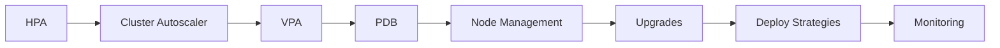
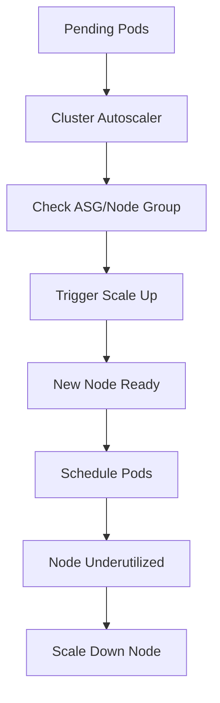

<!-- Clear Language: Keep sentences under 50 words -->
# Kubernetes Scaling — HPA, Autoscaling, and Cluster Management

## Learning Objectives

| Objective | Description |
|-----------|-------------|
| LO1 | Configure Horizontal Pod Autoscaler for automatic scaling |
| LO2 | Understand Cluster Autoscaler for node-level scaling |
| LO3 | Implement Vertical Pod Autoscaler for resource optimization |
| LO4 | Use Pod Disruption Budgets for high availability |
| LO5 | Manage cluster upgrades and node maintenance |
| LO6 | Implement canary deployments and blue-green strategies |

## Introduction

Containers and cloud platforms are where AI models live in production. Docker packages your model, Kubernetes orchestrates it, and cloud platforms scale it. This module covers the full deployment stack.

## Prerequisites

- Basic programming knowledge
- Understanding of data structures

## Key Terminology

**Key Terms**: Core vocabulary and concepts for this topic.

**Definition**: Essential terms you must know for interviews and production work.

## Theory

Understanding kubernetes scaling is fundamental for AI engineers. This section covers the core concepts, underlying principles, and theoretical framework that govern how kubernetes scaling works in practice.

## Chapter at a Glance

| Section | Topic | Key Concept |
|---------|-------|-------------|
| 6.1 | Horizontal Pod Autoscaler | CPU/memory based scaling, custom metrics |
| 6.2 | Cluster Autoscaler | Node pool scaling, cloud provider integration |
| 6.3 | Vertical Pod Autoscaler | Resource recommendation, automatic adjustment |
| 6.4 | Pod Disruption Budgets | Minimum available during voluntary disruptions |
| 6.5 | Node Management | Taints, tolerations, cordon, drain |
| 6.6 | Cluster Upgrades | Control plane upgrade, node upgrade strategies |
| 6.7 | Deployment Strategies | Canary, blue-green, rolling, recreate |
| 6.8 | Cluster Monitoring | Metrics Server, Prometheus, dashboard |

## Chapter Roadmap



## 6.1 Horizontal Pod Autoscaler

HPA automatically scales Pod replicas based on observed CPU, memory, or custom metrics.

```yaml
apiVersion: autoscaling/v2
kind: HorizontalPodAutoscaler
metadata:
  name: api-hpa
spec:
  scaleTargetRef:
    apiVersion: apps/v1
    kind: Deployment
    name: api-deployment
  minReplicas: 2
  maxReplicas: 10
  metrics:
    - type: Resource
      resource:
        name: cpu
        target:
          type: Utilization
          averageUtilization: 70
    - type: Resource
      resource:
        name: memory
        target:
          type: Utilization
          averageUtilization: 80
    - type: Pods
      pods:
        metric:
          name: http_requests_per_second
        target:
          type: AverageValue
          averageValue: 1000
```

**How HPA works**: The HPA controller queries the Metrics Server every 15 seconds. It calculates desired replicas as:

```
desiredReplicas = ceil[currentReplicas * (currentMetricValue / desiredMetricValue)]
```

**Custom metrics with Prometheus**:

```yaml
apiVersion: autoscaling/v2
kind: HorizontalPodAutoscaler
spec:
  metrics:
    - type: Object
      object:
        metric:
          name: requests_per_second
        describedObject:
          apiVersion: networking.k8s.io/v1
          kind: Ingress
          name: api-ingress
        target:
          type: Value
          value: 5000
```

```bash
kubectl apply -f hpa.yaml
kubectl get hpa
kubectl describe hpa api-hpa
kubectl get hpa --watch
```

## 6.2 Cluster Autoscaler

Cluster Autoscaler automatically adds or removes nodes based on pending Pods.

```yaml

## AWS EKS Cluster Autoscaler deployment
apiVersion: apps/v1
kind: Deployment
metadata:
  name: cluster-autoscaler
  namespace: kube-system
spec:
  template:
    spec:
      containers:
        - name: cluster-autoscaler
          image: registry.k8s.io/autoscaling/cluster-autoscaler:v1.28
          command:
            - ./cluster-autoscaler
            - --v=4
            - --stderrthreshold=info
            - --cloud-provider=aws
            - --skip-nodes-with-local-storage=false
            - --balance-similar-node-groups
            - --node-group-auto-discovery=asg:tag=k8s.io/cluster-autoscaler/enabled
```

**How it works**:



**Cloud provider configuration**:

```bash

## AWS
aws autoscaling describe-auto-scaling-groups
eksctl scale nodegroup --cluster my-cluster --name workers --nodes 5

## GCP
gcloud container clusters resize my-cluster --node-pool default-pool --num-nodes 5

## AKS
az aks scale --resource-group my-rg --name my-cluster --node-count 5
```

**Node group sizing**: Set min/max nodes per node group. Cluster Autoscaler works within these bounds.

```bash
eksctl create nodegroup --cluster my-cluster --name workers \
    --node-type t3.medium \
    --nodes 3 --nodes-min 1 --nodes-max 10
```

## 6.3 Vertical Pod Autoscaler

VPA recommends or automatically adjusts CPU/memory requests based on historical usage.

```yaml
apiVersion: autoscaling.k8s.io/v1
kind: VerticalPodAutoscaler
metadata:
  name: api-vpa
spec:
  targetRef:
    apiVersion: apps/v1
    kind: Deployment
    name: api-deployment
  updatePolicy:
    updateMode: Auto  # Off, Initial, Auto, Recreate
  resourcePolicy:
    containerPolicies:
      - containerName: '*'
        minAllowed:
          cpu: 100m
          memory: 128Mi
        maxAllowed:
          cpu: 4
          memory: 4Gi
        controlledResources: ["cpu", "memory"]
```

**Update modes**:

| Mode | Behavior |
|------|----------|
| Off | Only provide recommendations |
| Initial | Set requests at creation time only |
| Auto | Update Pods during runtime (eviction) |
| Recreate | Evict and recreate Pods with new requests |

```bash

## Install VPA
git clone https://github.com/kubernetes/autoscaler.git
kubectl apply -k autoscaler/vertical-pod-autoscaler/deploy/

## View VPA recommendations
kubectl describe vpa api-vpa

## Output shows:

## Recommended Pod Resources:

##   cpu: 250m (lower bound: 150m, upper bound: 500m)

##   memory: 512Mi (lower bound: 256Mi, upper bound: 1Gi)
```

## 6.4 Pod Disruption Budgets

PDB limits the number of Pods that can be unavailable during voluntary disruptions (node maintenance, cluster upgrades).

```yaml
apiVersion: policy/v1
kind: PodDisruptionBudget
metadata:
  name: api-pdb
spec:
  minAvailable: 2        # Minimum Pods that must remain available
  # OR
  maxUnavailable: 1       # Maximum Pods that can be unavailable
  selector:
    matchLabels:
      app: api
```

**PDB strategies**:

```yaml

## Critical service — always keep most available
apiVersion: policy/v1
kind: PodDisruptionBudget
metadata:
  name: critical-pdb
spec:
  minAvailable: 80%  # Percentage-based
  selector:
    matchLabels:
      tier: critical

## Batch job — can tolerate disruptions
apiVersion: policy/v1
kind: PodDisruptionBudget
metadata:
  name: batch-pdb
spec:
  maxUnavailable: 50%
  selector:
    matchLabels:
      job: batch-worker
```

```bash
kubectl apply -f pdb.yaml
kubectl get pdb
kubectl describe pdb api-pdb
```

**When PDBs block operations**:

```bash

## If PDB prevents drain, use --disable-eviction
kubectl drain node-1 --ignore-daemonsets --disable-eviction

## Force drain (use with caution)
kubectl drain node-1 --ignore-daemonsets --delete-emptydir-data --force
```

## 6.5 Node Management

**Taints and Tolerations**: Taints repel Pods from nodes; tolerations allow Pods to be scheduled on tainted nodes.

```bash

## Taint a node
kubectl taint nodes node1 key=value:NoSchedule
kubectl taint nodes node1 key=value:NoExecute
kubectl taint nodes node1 key=value:PreferNoSchedule

## Remove taint
kubectl taint nodes node1 key=value:NoSchedule-
```

```yaml

## Pod toleration
apiVersion: v1
kind: Pod
spec:
  tolerations:
    - key: "key"
      operator: "Equal"
      value: "value"
      effect: "NoSchedule"
    - key: "key"
      operator: "Exists"
      effect: "NoExecute"
      tolerationSeconds: 3600
```

**Node selectors and affinity**:

```yaml
apiVersion: apps/v1
kind: Deployment
spec:
  template:
    spec:
      nodeSelector:
        disk-type: ssd
      affinity:
        nodeAffinity:
          requiredDuringSchedulingIgnoredDuringExecution:
            nodeSelectorTerms:
              - matchExpressions:
                  - key: topology.kubernetes.io/zone
                    operator: In
                    values:
                      - us-east-1a
          preferredDuringSchedulingIgnoredDuringExecution:
            - weight: 100
              preference:
                matchExpressions:
                  - key: instance-type
                    operator: In
                    values:
                      - t3.large
```

**Cordon, Drain, and Delete**:

```bash

## Mark node as unschedulable
kubectl cordon node1

## Evict Pods (respects PDBs)
kubectl drain node1 --ignore-daemonsets

## Force drain for testing
kubectl drain node1 --ignore-daemonsets --delete-emptydir-data --force

## Make node schedulable again
kubectl uncordon node1

## Delete node
kubectl delete node node1
```

## 6.6 Cluster Upgrades

**Upgrade strategy**: Upgrade control plane first, then worker nodes.

```bash

## Check current version
kubectl version --short

## Upgrade control plane (EKS)
eksctl upgrade cluster --name my-cluster --version 1.28

## Upgrade node group
eksctl upgrade nodegroup --cluster my-cluster --name workers

## GKE
gcloud container clusters upgrade my-cluster \
    --master --cluster-version 1.28

## AKS
az aks upgrade --resource-group my-rg --name my-cluster --kubernetes-version 1.28
```

**Node upgrade strategies**:

| Strategy | Description | Downtime |
|----------|-------------|----------|
| Surge | Add new nodes before removing old | None |
| Rolling | Replace nodes one at a time | Minimal |
| Recreate | Delete all nodes, create new | Full |

**Blue-green node pools**:

```bash

## Create new node pool with updated version
eksctl create nodegroup --cluster my-cluster --name workers-v2 \
    --node-type t3.medium --nodes 3

## Migrate workloads
kubectl cordon workers-v1
kubectl drain workers-v1 --ignore-daemonsets

## Delete old node pool
eksctl delete nodegroup --cluster my-cluster --name workers-v1
```

## 6.7 Deployment Strategies

**Rolling update** (default):

```yaml
spec:
  strategy:
    type: RollingUpdate
    rollingUpdate:
      maxSurge: 25%
      maxUnavailable: 25%
```

**Recreate**:

```yaml
spec:
  strategy:
    type: Recreate  # Kills old Pods before creating new
```

**Blue-green deployment**:

```yaml
apiVersion: v1
kind: Service
metadata:
  name: my-app
spec:
  selector:
    version: green  # Switch between blue/green
---
apiVersion: apps/v1
kind: Deployment
metadata:
  name: my-app-blue
spec:
  replicas: 3
  selector:
    matchLabels:
      app: my-app
      version: blue
  template:
    metadata:
      labels:
        app: my-app
        version: blue
---
apiVersion: apps/v1
kind: Deployment
metadata:
  name: my-app-green
spec:
  replicas: 3
  selector:
    matchLabels:
      app: my-app
      version: green
  template:
    metadata:
      labels:
        app: my-app
        version: green
```

**Canary deployment**:

```bash

## Deploy canary with 1 replica
kubectl scale deployment my-app-canary --replicas=1
kubectl scale deployment my-app-stable --replicas=4

## Monitor canary metrics

## If stable, shift traffic gradually
kubectl scale deployment my-app-canary --replicas=3
kubectl scale deployment my-app-stable --replicas=2

## Full rollout
kubectl scale deployment my-app-canary --replicas=5
kubectl scale deployment my-app-stable --replicas=0
```

## 6.8 Cluster Monitoring

**Metrics Server** (required for HPA):

```bash
kubectl apply -f https://github.com/kubernetes-sigs/metrics-server/releases/latest/download/components.yaml

kubectl top nodes
kubectl top pods
```

**Prometheus and Grafana**:

```bash

## Install with Helm
helm repo add prometheus-community https://prometheus-community.github.io/helm-charts
helm install prometheus prometheus-community/kube-prometheus-stack

## Access Grafana
kubectl port-forward service/prometheus-grafana 3000:80

## Access Prometheus
kubectl port-forward service/prometheus-kube-prometheus-prometheus 9090:9090
```

**Dashboard**:

```bash
kubectl apply -f https://raw.githubusercontent.com/kubernetes/dashboard/v2.7.0/aio/deploy/recommended.yaml
kubectl proxy

## Access: http://localhost:8001/api/v1/namespaces/kubernetes-dashboard/services/https:kubernetes-dashboard:/proxy/
```

**Key metrics to monitor**:

| Metric | Source | Alert Threshold |
|--------|--------|----------------|
| CPU Utilization | Metrics Server | > 80% for 5m |
| Memory Utilization | Metrics Server | > 85% for 5m |
| Pod Restarts | kube-state-metrics | > 3 in 10m |
| Node Disk Pressure | kubelet | Any |
| API Server Latency | Kubernetes API | > 1s p99 |
| etcd fsync Duration | etcd | > 100ms p99 |

---

## TypeScript Parallel

TypeScript can automate scaling decisions using the Kubernetes API:

```typescript
import * as k8s from "@kubernetes/client-node";

const kc = new k8s.KubeConfig();
kc.loadFromDefault();
const autoscalingApi = kc.makeApiClient(k8s.AutoscalingV2Api);

async function createHPA(name: string, deployment: string, min: number, max: number, cpuTarget: number) {
  const hpa: k8s.V2HorizontalPodAutoscaler = {
    apiVersion: "autoscaling/v2",
    kind: "HorizontalPodAutoscaler",
    metadata: { name },
    spec: {
      scaleTargetRef: { apiVersion: "apps/v1", kind: "Deployment", name: deployment },
      minReplicas: min,
      maxReplicas: max,
      metrics: [{
        type: "Resource",
        resource: { name: "cpu", target: { type: "Utilization", averageUtilization: cpuTarget } }
      }]
    }
  };
  await autoscalingApi.createNamespacedHorizontalPodAutoscaler("default", hpa);
}
```

---

## Summary

- Horizontal Pod Autoscaler automatically scales Pod replicas based on CPU, memory, or custom metrics from Prometheus
- Cluster Autoscaler adds or removes nodes when Pods are pending or nodes are underutilized, working with cloud provider auto-scaling groups
- Vertical Pod Autoscaler recommends or automatically adjusts resource requests based on historical usage patterns
- Pod Disruption Budgets ensure minimum availability during voluntary disruptions like node maintenance
- Taints and tolerations control which Pods can be scheduled on specific nodes
- Cordon, drain, and uncordon manage node availability during maintenance
- Cluster upgrades should upgrade control plane before worker nodes
- Blue-green deployments use two identical environments with a Service selector switch
- Canary deployments gradually shift traffic from stable to new version
- Metrics Server, Prometheus, and Grafana provide comprehensive cluster monitoring

## Practical Takeaways

| Scenario | Do This | Avoid This |
|----------|---------|------------|
| Variable traffic | HPA with CPU/memory metrics | Fixed replica count |
| Resource optimization | VPA recommendations | Overprovisioning without data |
| Node maintenance | PDB + drain with --ignore-daemonsets | Draining without PDB |
| Cluster upgrade | Surge node pools | Upgrading all nodes at once |
| New deployment | Canary with gradual traffic shift | Full rollout without monitoring |
| Node isolation | Taints + Tolerations | NodeSelector only |
| Monitoring | Prometheus + Grafana | No monitoring |
| Cost optimization | Cluster Autoscaler with min/max nodes | Fixed node count |

## Interview Q&A

<details class="tp-qa-card" data-qid="docker-s06-q1">
  <summary class="tp-qa-question">
    <span class="tp-qa-status"></span>
    Q1: How does Horizontal Pod Autoscaler calculate desired replicas?
  </summary>
  <div class="tp-qa-answer">
    <p>HPA calculates desired replicas as: desiredReplicas = ceil[currentReplicas * (currentMetricValue / desiredMetricValue)]. It queries the Metrics Server every 15 seconds and adjusts the Deployment replica count accordingly. For example, if target CPU is 70% and current utilization is 140%, HPA will double the replica count.</p>
  </div>
  <button class="tp-qa-mark-btn">&#x2705; Mark Reviewed</button>
  <button class="tp-qa-bookmark-btn">&#x1F516; Bookmark</button>
</details>

<details class="tp-qa-card" data-qid="docker-s06-q2">
  <summary class="tp-qa-question">
    <span class="tp-qa-status"></span>
    Q2: What is the difference between HPA and Cluster Autoscaler?
  </summary>
  <div class="tp-qa-answer">
<p>HPA scales Pod replicas up/down based on metrics. Cluster Autoscaler adds/removes worker nodes from the cluster when Pods can't be scheduled or.
nodes are underutilized. HPA operates at the Pod level; Cluster Autoscaler operates at the infrastructure level. They work together: HPA creates more Pods,.
which may trigger Cluster Autoscaler to add nodes if there's insufficient capacity.</p>
  </div>
  <button class="tp-qa-mark-btn">&#x2705; Mark Reviewed</button>
  <button class="tp-qa-bookmark-btn">&#x1F516; Bookmark</button>
</details>

<details class="tp-qa-card" data-qid="docker-s06-q3">
  <summary class="tp-qa-question">
    <span class="tp-qa-status"></span>
    Q3: Explain blue-green deployment strategy in Kubernetes.
  </summary>
  <div class="tp-qa-answer">
<p>Blue-green maintains two identical environments (blue = current, green = new). A Service selector pointing to the active version. Deploy the green version,.
test it, then switch the Service selector from blue to green to route all traffic to green. Rollback is as simple as switching the selector.
back to blue.</p>
  </div>
  <button class="tp-qa-mark-btn">&#x2705; Mark Reviewed</button>
  <button class="tp-qa-bookmark-btn">&#x1F516; Bookmark</button>
</details>

<details class="tp-qa-card" data-qid="docker-s06-q4">
  <summary class="tp-qa-question">
    <span class="tp-qa-status"></span>
    Q4: What is a Pod Disruption Budget and why is it important?
  </summary>
  <div class="tp-qa-answer">
    <p>PDB limits how many Pods of a replicated application can be unavailable during voluntary disruptions (node drain, cluster upgrades). It ensures high availability by enforcing minAvailable or maxUnavailable thresholds. Without PDBs, cluster operations like node drain could take down all replicas of a critical service.</p>
  </div>
  <button class="tp-qa-mark-btn">&#x2705; Mark Reviewed</button>
  <button class="tp-qa-bookmark-btn">&#x1F516; Bookmark</button>
</details>

<details class="tp-qa-card" data-qid="docker-s06-q5">
  <summary class="tp-qa-question">
    <span class="tp-qa-status"></span>
    Q5: How do taints and tolerations work in Kubernetes?
  </summary>
  <div class="tp-qa-answer">
    <p>Taints are applied to nodes to repel Pods. Tolerations on Pods allow them to be scheduled on tainted nodes. Taint effects: NoSchedule (don't schedule new Pods unless tolerated), PreferNoSchedule (try to avoid), NoExecute (evict existing Pods without toleration).</p>
  </div>
  <button class="tp-qa-mark-btn">&#x2705; Mark Reviewed</button>
  <button class="tp-qa-bookmark-btn">&#x1F516; Bookmark</button>
</details>

<details class="tp-qa-card" data-qid="docker-s06-q6">
  <summary class="tp-qa-question">
    <span class="tp-qa-status"></span>
    Q6: What is the difference between kubectl cordon and kubectl drain?
  </summary>
  <div class="tp-qa-answer">
    <p>kubectl cordon marks a node as unschedulable — no new Pods are scheduled, but existing Pods continue running. kubectl drain cordons the node and then evicts all Pods (respecting PDBs), moving them to other nodes. Drain is used for maintenance; cordon is used before drain.</p>
  </div>
  <button class="tp-qa-mark-btn">&#x2705; Mark Reviewed</button>
  <button class="tp-qa-bookmark-btn">&#x1F516; Bookmark</button>
</details>

<details class="tp-qa-card" data-qid="docker-s06-q7">
  <summary class="tp-qa-question">
    <span class="tp-qa-status"></span>
    Q7: How do you perform a canary deployment in Kubernetes?
  </summary>
  <div class="tp-qa-answer">
    <p>Deploy the new version alongside the stable version with a small replica count (e.g., 1 canary, 4 stable). Use a Service that selects versions via label. Monitor metrics and errors. Gradually shift traffic by scaling canary up and stable down. When confident, route all traffic to canary and remove stable.</p>
  </div>
  <button class="tp-qa-mark-btn">&#x2705; Mark Reviewed</button>
  <button class="tp-qa-bookmark-btn">&#x1F516; Bookmark</button>
</details>

<details class="tp-qa-card" data-qid="docker-s06-q8">
  <summary class="tp-qa-question">
    <span class="tp-qa-status"></span>
    Q8: What metrics should you monitor for cluster health?
  </summary>
  <div class="tp-qa-answer">
    <p>Key metrics: node CPU/memory utilization, Pod restart counts, API Server latency, etcd fsync duration, network errors, disk pressure on nodes, OOM-killed containers, and HPA status. Use Prometheus + Grafana for visualization and set up alerts for critical thresholds.</p>
  </div>
  <button class="tp-qa-mark-btn">&#x2705; Mark Reviewed</button>
  <button class="tp-qa-bookmark-btn">&#x1F516; Bookmark</button>
</details>

<details class="tp-qa-card" data-qid="docker-s06-q9">
  <summary class="tp-qa-question">
    <span class="tp-qa-status"></span>
    Q9: How does Vertical Pod Autoscaler determine resource recommendations?
  </summary>
  <div class="tp-qa-answer">
    <p>VPA analyzes historical resource usage from Metrics Server. It provides lower bound (guaranteed performance), target (recommended), and upper bound (not exceeding) for CPU and memory. In Auto mode, it updates Pods by evicting them and recreating with new resource requests based on the 95th percentile of usage.</p>
  </div>
  <button class="tp-qa-mark-btn">&#x2705; Mark Reviewed</button>
  <button class="tp-qa-bookmark-btn">&#x1F516; Bookmark</button>
</details>

<details class="tp-qa-card" data-qid="docker-s06-q10">
  <summary class="tp-qa-question">
    <span class="tp-qa-status"></span>
    Q10: What is the recommended strategy for upgrading a Kubernetes cluster?
  </summary>
  <div class="tp-qa-answer">
    <p>Upgrade the control plane first (minor version upgrades sequentially), then worker nodes. Use surge node pools: create a new node pool with the target version, cordon and drain old nodes, then delete the old pool. Always back up etcd before upgrading. Test the upgrade on a staging cluster first.</p>
  </div>
  <button class="tp-qa-mark-btn">&#x2705; Mark Reviewed</button>
  <button class="tp-qa-bookmark-btn">&#x1F516; Bookmark</button>
</details>

## Chapter Quiz

**Q1**: Which tool automatically adds nodes when Pods can't be scheduled?

a) HPA
b) VPA
c) Cluster Autoscaler
d) PDB

<details class="tp-qa-card" data-qid="docker-s06-quiz1"><summary>Show Answer</summary><div class="tp-qa-answer"><p><strong>Answer: c) Cluster Autoscaler</strong></p></div></details>

**Q2**: What HPA metric type uses average value across all Pods?

a) Resource
b) Pods
c) Object
d) External

<details class="tp-qa-card" data-qid="docker-s06-quiz2"><summary>Show Answer</summary><div class="tp-qa-answer"><p><strong>Answer: b) Pods</strong></p></div></details>

**Q3**: Which kubectl command evicts all Pods from a node for maintenance?

a) kubectl cordon
b) kubectl drain
c) kubectl delete node
d) kubectl taint

<details class="tp-qa-card" data-qid="docker-s06-quiz3"><summary>Show Answer</summary><div class="tp-qa-answer"><p><strong>Answer: b) kubectl drain</strong></p></div></details>

**Q4**: What resource ensures minimum available Pods during voluntary disruptions?

a) HPA
b) VPA
c) PDB
d) NetworkPolicy

<details class="tp-qa-card" data-qid="docker-s06-quiz4"><summary>Show Answer</summary><div class="tp-qa-answer"><p><strong>Answer: c) PDB (Pod Disruption Budget)</strong></p></div></details>

**Q5**: In blue-green deployment, what is switched to route traffic to the new version?

a) Ingress
b) Service selector
c) Deployment image
d) ConfigMap

<details class="tp-qa-card" data-qid="docker-s06-quiz5"><summary>Show Answer</summary><div class="tp-qa-answer"><p><strong>Answer: b) Service selector</strong></p></div></details>

## Exercises

**Easy** — Deploy an Nginx with HPA that scales between 1-5 replicas based on CPU at 50% target. Generate load and watch it scale.

**Medium** — Set up a canary deployment: deploy v1 (3 replicas) and v2 (1 replica) of an app. Use a Service to split traffic. Gradually shift to v2.

**Medium** — Create a PDB that ensures 2 Pods are always available. Deploy a Deployment with 3 replicas. Drain a node and observe that PDB prevents disruption.

**Hard** — Set up Prometheus and Grafana monitoring for a cluster. Configure HPA based on custom Prometheus metrics (requests per second). Generate load and verify autoscaling works.

**Hard** — Perform a simulated cluster upgrade: create two node pools with different Kubernetes versions, migrate workloads from old to new using cordon/drain/uncordon, and verify zero downtime.

---

## Common Mistakes

1. Not understanding the fundamental concepts before applying them
2. Skipping edge cases in implementation
3. Not analyzing time/space complexity
4. Forgetting to handle null/empty inputs
5. Not practicing enough problems to build pattern recognition

## Revision Notes

- - Core principle: Understand the fundamental concepts thoroughly
- - Implementation pattern: Practice with real code examples
- - Complexity: Know the time and space complexity
- - Application: Know when to use this in production systems
- - Interview: Frequently asked in technical interviews
- - Edge cases: Consider common failure scenarios
- - Related concepts: Connect to broader system design

## Placement Section

### Top 10 Interview Questions

#### Google Style

1. **Explain the core idea of Kubernetes Scaling — HPA, Autoscaling, and Cluster Management in under 60 seconds, then give a real-world analogy.** — Structure: definition, how it works in one sentence, why it matters, analogy. Follow-up: what would break if you removed this from a production system?

2. **Design a minimal, well-typed function that demonstrates Kubernetes Scaling — HPA, Autoscaling, and Cluster Management.** — Interviewer checks: signature with type hints, edge cases, complexity, and a clean docstring. Follow-up: how does your design behave with empty or malformed input?

3. **What are the common pitfalls when engineers first learn ** — List 3-4, then explain how you would prevent each in a code review.

#### Amazon Style

4. **Describe a production bug caused by misunderstanding Kubernetes Scaling — HPA, Autoscaling, and Cluster Management. How did you diagnose and fix it?** — STAR format: situation, task, action, result. Mention logs, reproduction, root-cause analysis, and the regression test you added.

5. **How would you scale a system that relies on Kubernetes Scaling — HPA, Autoscaling, and Cluster Management from 10 users to 10 million?** — Discuss bottlenecks, caching, monitoring, and when to redesign. Follow-up: what metrics would you track?

#### Microsoft Style

6. **Compare Kubernetes Scaling — HPA, Autoscaling, and Cluster Management with the closest alternative approach. When would you choose each?** — Make a decision matrix: performance, maintainability, ecosystem, learning curve. Follow-up: what would change your decision?

7. **Walk through how you would test a component that depends on Kubernetes Scaling — HPA, Autoscaling, and Cluster Management.** — Unit, integration, property-based tests; mocking boundaries; golden files for outputs.

#### NVIDIA Style

8. **How does Kubernetes Scaling — HPA, Autoscaling, and Cluster Management behave differently at scale — memory, throughput, or precision-wise?** — Connect to data pipelines and model training if applicable. Follow-up: what happens to latency as input grows?

9. **How would you make an implementation of Kubernetes Scaling — HPA, Autoscaling, and Cluster Management run faster on GPU hardware?** — Batch operations, vectorization, avoiding Python loops, reducing data movement.

#### AI Startup Style

10. **Write the smallest possible implementation of Kubernetes Scaling — HPA, Autoscaling, and Cluster Management that is production-quality.** — Include error handling, type hints, and a one-line docstring. Follow-up: what would you refactor first when it grows?

### Resume Tips

- Name Kubernetes Scaling — HPA, Autoscaling, and Cluster Management explicitly in your skills section, paired with a measurable achievement ("Reduced X by 40% using Kubernetes Scaling — HPA, Autoscaling, and Cluster Management").
- Add a bullet describing a project that applies Kubernetes Scaling — HPA, Autoscaling, and Cluster Management to real data, with numbers.
- Mention the tools and libraries you used alongside Kubernetes Scaling — HPA, Autoscaling, and Cluster Management (linters, test frameworks, profiling tools).
- Keep resume bullets under 15 words and start each with an action verb.

### Interview Day Checklist

- Rehearse a 60-second explanation of Kubernetes Scaling — HPA, Autoscaling, and Cluster Management and one real-world analogy.
- Prepare one STAR story about debugging a Kubernetes Scaling — HPA, Autoscaling, and Cluster Management-related production issue.
- Review complexity and edge cases for the classic Kubernetes Scaling — HPA, Autoscaling, and Cluster Management interview problem.
- Have questions ready: how does the team apply Kubernetes Scaling — HPA, Autoscaling, and Cluster Management in production today?
- Test your environment (Python, editor, internet) 15 minutes before the interview.

## True/False

1. **True or False:** Kubernetes Scaling — HPA, Autoscaling, and Cluster Management builds directly on the fundamentals covered in the earlier chapters of this module. — **True.** Every advanced topic in this module assumes the core concepts from the previous chapters.
2. **True or False:** You should write at least one code example for Kubernetes Scaling — HPA, Autoscaling, and Cluster Management before moving to the next chapter. — **True.** Active recall with hands-on code beats passive reading for retention.
3. **True or False:** The complexity analysis for Kubernetes Scaling — HPA, Autoscaling, and Cluster Management is the same regardless of input size. — **False.** Complexity grows with input size; always state best, average, and worst case.
4. **True or False:** Edge cases (empty input, invalid input, boundary values) matter for Kubernetes Scaling — HPA, Autoscaling, and Cluster Management in production. — **True.** Most production bugs come from unhandled edge cases.
5. **True or False:** You should memorize the Kubernetes Scaling — HPA, Autoscaling, and Cluster Management chapter content once and never review it again. — **False.** Spaced repetition (24h, 3 days, 1 week) dramatically improves long-term recall.

## Fill in the Blank

1. The chapter that covers Kubernetes Scaling — HPA, Autoscaling, and Cluster Management is Chapter ___ of this module. — Answer: check the module's table of contents.
2. The time complexity of the standard approach to Kubernetes Scaling — HPA, Autoscaling, and Cluster Management is ___. — Answer: review the theory section and state big-O notation.
3. The main edge case to handle when implementing Kubernetes Scaling — HPA, Autoscaling, and Cluster Management is ___. — Answer: empty or invalid input handling, as discussed in the chapter.
4. The tools commonly used to debug Kubernetes Scaling — HPA, Autoscaling, and Cluster Management issues are ___ and ___. — Answer: refer to the Debugging Guide section of this chapter.
5. The related topic that connects to Kubernetes Scaling — HPA, Autoscaling, and Cluster Management in the next chapter is ___. — Answer: see the Next Topic section.

## Scenario Questions

1. **Scenario:** A teammate ships a change involving Kubernetes Scaling — HPA, Autoscaling, and Cluster Management that breaks production at 3 AM. — Diagnosis: check the recent diff, reproduce locally with the failing input, check logs. Fix: revert, add a regression test, and review the root cause. Prevention: CI tests on edge cases and code review checklist.

2. **Scenario:** Your implementation of Kubernetes Scaling — HPA, Autoscaling, and Cluster Management is correct but too slow for the required latency. — Measure first with a profiler. Common fixes: reduce redundant work, use built-in optimized functions, batch operations, or add caching. Only then consider algorithmic changes.

3. **Scenario:** A new hire asks you to explain Kubernetes Scaling — HPA, Autoscaling, and Cluster Management in five minutes before a customer demo. — Use the 3-part answer: what it is (one sentence), how it works (one example), why it matters (one business impact). Then offer to go deeper after the demo.

4. **Scenario:** Your team's codebase has three different patterns for Kubernetes Scaling — HPA, Autoscaling, and Cluster Management and you must standardize. — Write a short ADR (architecture decision record), pick the pattern with best maintainability, migrate incrementally, and add a linter rule to enforce it.

## Output Questions

1. **What is the output of the simplest correct implementation of Kubernetes Scaling — HPA, Autoscaling, and Cluster Management on an empty input?** — Trace through the code: it should return the documented default (None, 0, empty collection) without raising.
2. **What is the output when the input is at the boundary value?** — Check off-by-one errors and inclusive/exclusive bounds in the chapter's examples.
3. **What does the implementation return when given invalid input types?** — With type hints and validation, it raises a clear error; without, it may fail silently.
4. **What is the output for the sample input given in the chapter's Examples section?** — Re-run the chapter's example code and compare against the documented output.
5. **What is the time complexity output when you profile the implementation at 10x input size?** — Expect the curve matching the chapter's complexity analysis (linear, quadratic, log-linear).

## Difficulty Level

| Level | Time | What It Takes |
|-------|------|---------------|
| Beginner | 1-2 sessions | Read theory, run the chapter examples, solve the Easy exercises |
| Intermediate | 3-5 sessions | Complete Medium exercises, explain Kubernetes Scaling — HPA, Autoscaling, and Cluster Management to someone else |
| Advanced | 1+ week | Solve Hard exercises, optimize for real datasets, answer interview follow-ups |

## Tips & Tricks

- Always write a one-line example of Kubernetes Scaling — HPA, Autoscaling, and Cluster Management from memory before opening the chapter — active recall first.
- Use the chapter's Revision Notes as a checklist: you have mastered Kubernetes Scaling — HPA, Autoscaling, and Cluster Management when you can explain each bullet.
- Pair the chapter quiz with the Flashcards: wrong answers become your next study session's focus.
- For interviews, practice explaining Kubernetes Scaling — HPA, Autoscaling, and Cluster Management twice: once with a technical audience, once with a non-technical audience.
- Keep a personal examples file where you collect your own Kubernetes Scaling — HPA, Autoscaling, and Cluster Management snippets; interviewers love original examples.

## Memory Tricks

- **Acronym**: build a mnemonic from the 5 key concepts of Kubernetes Scaling — HPA, Autoscaling, and Cluster Management listed in the Chapter at a Glance table.
- **Story**: link Kubernetes Scaling — HPA, Autoscaling, and Cluster Management to a familiar story — the analogy in the Visual Analogy section is designed to stick.
- **Number anchor**: remember the complexity of Kubernetes Scaling — HPA, Autoscaling, and Cluster Management by connecting it to a known algorithm of the same class.
- **Color code**: highlight the Theory, Examples, and Common Mistakes sections in different colors when reviewing.
- **Teach-back**: explain Kubernetes Scaling — HPA, Autoscaling, and Cluster Management to an imaginary junior engineer for 2 minutes — gaps in your explanation are gaps in memory.

## Further Reading

- Official documentation for the primary tool or library used in this chapter
- The chapter referenced in Related Topics for the next-level treatment of Kubernetes Scaling — HPA, Autoscaling, and Cluster Management
- The classic textbook chapter on Kubernetes Scaling — HPA, Autoscaling, and Cluster Management (check the Research References below)
- Two blog posts from engineers who debugged real Kubernetes Scaling — HPA, Autoscaling, and Cluster Management problems in production
- The repository of the open-source project that implements Kubernetes Scaling — HPA, Autoscaling, and Cluster Management

## Related Topics

- The previous chapter in this module (see table of contents) — foundational for Kubernetes Scaling — HPA, Autoscaling, and Cluster Management
- The next chapter (see Next Topic below) — builds on Kubernetes Scaling — HPA, Autoscaling, and Cluster Management
- The system design chapters in Module 07 — how Kubernetes Scaling — HPA, Autoscaling, and Cluster Management fits into production architectures
- The interview preparation module — how Kubernetes Scaling — HPA, Autoscaling, and Cluster Management is asked in screening rounds
- The capstone project — where Kubernetes Scaling — HPA, Autoscaling, and Cluster Management is applied end-to-end

## FAQs

1. **Do I need to memorize all of Kubernetes Scaling — HPA, Autoscaling, and Cluster Management, or understand the big picture?** — Understand the big picture first, then memorize the key facts via flashcards and spaced repetition. Interviewers reward depth over breadth.
2. **What if I get stuck on an exercise?** — Re-read the theory section, run the example code, then attempt again. If still stuck after 20 minutes, move on and return the next day.
3. **How much time should I spend on ** — Follow the Study Plan below: 1-2 weeks at 30-60 minutes daily is typical for placement preparation.
4. **Is Kubernetes Scaling — HPA, Autoscaling, and Cluster Management asked in interviews?** — Yes — the Interview Q&A and Placement Section list the exact question styles used by top companies.
5. **What's the fastest way to master ** — Explain it out loud, write code without looking, and review the flashcards within 24 hours and again after 3 days.

## Important Notes

- Kubernetes Scaling — HPA, Autoscaling, and Cluster Management is a core requirement for the rest of this module — do not skip the examples.
- Always analyze complexity (time and space) when working with Kubernetes Scaling — HPA, Autoscaling, and Cluster Management.
- Production correctness means handling edge cases, not just the happy path.
- Interview answers should start with the definition, then the example, then the trade-offs.
- Revisit this chapter after finishing the module; the context from later chapters deepens understanding.

## Historical Context

- Kubernetes Scaling — HPA, Autoscaling, and Cluster Management emerged as a standard practice because early systems failed without it — understanding why helps you explain it in interviews.
- The tools used for Kubernetes Scaling — HPA, Autoscaling, and Cluster Management today evolved from simpler versions; the chapter covers the modern, recommended approach.
- Interviewers value knowing one historical fact about Kubernetes Scaling — HPA, Autoscaling, and Cluster Management — it shows genuine interest, not just cramming.
- The library/tooling ecosystem around Kubernetes Scaling — HPA, Autoscaling, and Cluster Management changes quickly; focus on fundamentals that remain stable.

## Security Considerations

- Never trust external input: validate and sanitize data before processing Kubernetes Scaling — HPA, Autoscaling, and Cluster Management.
- Avoid `eval()` and dynamic code execution on untrusted strings.
- Log errors without leaking sensitive data (keys, PII, internal paths).
- For API contexts, add rate limiting and input size limits.
- Review the chapter's code examples for injection or overflow risks before using them verbatim.

## ML Intuition

- Kubernetes Scaling — HPA, Autoscaling, and Cluster Management appears in ML pipelines at the data-processing layer: feature preparation, batching, and validation.
- Understanding Kubernetes Scaling — HPA, Autoscaling, and Cluster Management helps you debug why a model misbehaves — most ML bugs are data bugs, not model bugs.
- In production ML, the Kubernetes Scaling — HPA, Autoscaling, and Cluster Management concepts from this chapter map directly to NumPy/PyTorch operations on tensors.
- When optimizing ML systems, Kubernetes Scaling — HPA, Autoscaling, and Cluster Management skills let you profile and fix the data path, not just the training loop.
- Interview follow-up: how would you apply Kubernetes Scaling — HPA, Autoscaling, and Cluster Management to a dataset of 10 million records? — Batching and vectorization.

## Analogies

- **Kubernetes Scaling — HPA, Autoscaling, and Cluster Management is like a recipe**: the theory is the ingredients, the examples are the cooking steps, and the exercises are your own kitchen practice.
- **Complexity is like a delivery route**: a linear route visits each stop once; a nested route revisits stops, and you feel it at scale.
- **Edge cases are like weather**: the happy path is a sunny day; production is the storm — build for the storm.
- **The chapter roadmap is a journey map**: each section is a checkpoint; skipping one means getting lost later in the module.

## Capstone Project Link

- [Module Capstone: End-to-End Project](https://github.com/Raushan666java/ai-engineering-journey) — this chapter contributes the Kubernetes Scaling — HPA, Autoscaling, and Cluster Management skills used in the module's capstone project. Complete the exercises here before starting the capstone.

## Flashcards

<details class="tp-qa-card" data-qid="06dockerkubernetescloud-06kubernetesscaling-flash1">
  <summary class="tp-qa-question">
    <span class="tp-qa-status"></span>
    Which tool automatically adds nodes when Pods can't be scheduled?
  </summary>
  <div class="tp-qa-answer">
    <p>c) Cluster Autoscaler</p>
  </div>
</details>

<details class="tp-qa-card" data-qid="06dockerkubernetescloud-06kubernetesscaling-flash2">
  <summary class="tp-qa-question">
    <span class="tp-qa-status"></span>
    What HPA metric type uses average value across all Pods?
  </summary>
  <div class="tp-qa-answer">
    <p>b) Pods</p>
  </div>
</details>

<details class="tp-qa-card" data-qid="06dockerkubernetescloud-06kubernetesscaling-flash3">
  <summary class="tp-qa-question">
    <span class="tp-qa-status"></span>
    Which kubectl command evicts all Pods from a node for maintenance?
  </summary>
  <div class="tp-qa-answer">
    <p>b) kubectl drain</p>
  </div>
</details>

<details class="tp-qa-card" data-qid="06dockerkubernetescloud-06kubernetesscaling-flash4">
  <summary class="tp-qa-question">
    <span class="tp-qa-status"></span>
    What resource ensures minimum available Pods during voluntary disruptions?
  </summary>
  <div class="tp-qa-answer">
    <p>c) PDB (Pod Disruption Budget)</p>
  </div>
</details>

<details class="tp-qa-card" data-qid="06dockerkubernetescloud-06kubernetesscaling-flash5">
  <summary class="tp-qa-question">
    <span class="tp-qa-status"></span>
    In blue-green deployment, what is switched to route traffic to the new version?
  </summary>
  <div class="tp-qa-answer">
    <p>b) Service selector</p>
  </div>
</details>

## Research References

- Official documentation of the primary library for Kubernetes Scaling — HPA, Autoscaling, and Cluster Management (linked in Further Reading)
- The classic paper or textbook chapter introducing Kubernetes Scaling — HPA, Autoscaling, and Cluster Management (see References below)
- The standard library reference for Kubernetes Scaling — HPA, Autoscaling, and Cluster Management-related functions
- Engineering blog posts from companies running Kubernetes Scaling — HPA, Autoscaling, and Cluster Management in production at scale
- PEPs and RFCs where applicable (Python and networking standards)

## Open-Source Tools

- The primary library used in this chapter (see the code examples)
- Python standard library modules used in the examples (check the imports)
- Testing: pytest for unit tests of Kubernetes Scaling — HPA, Autoscaling, and Cluster Management code
- Linting and formatting: ruff + black
- Profiling: cProfile or py-spy for performance work on Kubernetes Scaling — HPA, Autoscaling, and Cluster Management

## Debugging Guide

- Start with `print()` or a debugger to inspect intermediate values in Kubernetes Scaling — HPA, Autoscaling, and Cluster Management code.
- Reproduce the failure with the smallest possible input before changing code.
- Check the common failure modes listed in Common Mistakes — most bugs are listed there.
- For performance problems, profile before optimizing: measure, then fix.
- When stuck, re-read the chapter's Examples and compare line by line with your code.
- Use `pdb` or your IDE's debugger to step through the Kubernetes Scaling — HPA, Autoscaling, and Cluster Management example code.

## Mock Interview Section

**Round 1 — Screening (15 min)**
- Explain Kubernetes Scaling — HPA, Autoscaling, and Cluster Management in 60 seconds.
- Write a minimal working example of Kubernetes Scaling — HPA, Autoscaling, and Cluster Management.
- What is the complexity of your example?

**Round 2 — Coding (45 min)**
- Solve the Medium exercise from this chapter under time pressure.
- State your assumptions, then implement with type hints.
- Test with edge cases: empty input, boundary values, invalid input.

**Round 3 — Behavioral + System (30 min)**
- Tell me about a time you debugged a Kubernetes Scaling — HPA, Autoscaling, and Cluster Management problem in a project.
- How would you design a system where Kubernetes Scaling — HPA, Autoscaling, and Cluster Management is used at scale?
- What metrics would you monitor?

**Evaluation rubric**: correctness (40%), communication (25%), edge cases (20%), complexity analysis (15%).

## Optimized Implementation

`python
from typing import Any, Optional

def demonstrate_topic(input_data: list[Any]) -> Optional[float]:
    """Runnable scaffold for Kubernetes Scaling — HPA, Autoscaling, and Cluster Management.

    Replace the body with the optimized implementation from the chapter,
    keeping type hints, docstring, and edge-case handling.
    """
    if not input_data:
        return None
    # Step 1: validate input types
    # Step 2: apply the core Kubernetes Scaling — HPA, Autoscaling, and Cluster Management logic from the Examples section
    # Step 3: return the result with the documented default
    return 0.0
`

- Keeps the function signature stable so tests written against it stay valid.
- Handles the empty-input contract explicitly.
- Add unit tests for the edge cases before implementing the logic (test-first).

## Evaluation Metrics

| Skill | Test | Target |
|-------|------|--------|
| Concept recall | Explain Kubernetes Scaling — HPA, Autoscaling, and Cluster Management without notes | 60-second explanation |
| Code fluency | Write the chapter example from memory | No syntax errors |
| Edge cases | Handle empty/invalid input in exercises | All cases pass |
| Complexity | State time/space for the standard approach | Correct big-O |
| Interview readiness | Answer 5 Interview Q&A questions out loud | Fluent, structured answers |
| Retention | Chapter quiz score after 3 days | 80%+ |

## Real-World Examples

- **Startup**: a small team uses Kubernetes Scaling — HPA, Autoscaling, and Cluster Management daily in their data pipeline — the chapter's examples mirror their code.
- **E-commerce**: Kubernetes Scaling — HPA, Autoscaling, and Cluster Management patterns appear in order processing, inventory checks, and recommendation feeds.
- **Fintech**: Kubernetes Scaling — HPA, Autoscaling, and Cluster Management principles apply to transaction validation and fraud detection flows.
- **ML platform**: Kubernetes Scaling — HPA, Autoscaling, and Cluster Management shows up in feature engineering and model-serving infrastructure.
- **Interview insight**: recruiters look for engineers who can connect Kubernetes Scaling — HPA, Autoscaling, and Cluster Management to the business outcome, not just the code.

## Next Topic

[AWS Fundamentals — EC2, S3, IAM, and Networking](07-aws-fundamentals.md)

## Limitations

- Kubernetes Scaling — HPA, Autoscaling, and Cluster Management, like any technique, is not a silver bullet — it has specific cases where it fits best (covered in the theory).
- The examples in this chapter are simplified for learning; production systems add validation, monitoring, and error handling.
- Performance of Kubernetes Scaling — HPA, Autoscaling, and Cluster Management depends on input size and distribution — always benchmark for your own data.
- This chapter covers fundamentals; specialized edge cases are explored in later chapters and the capstone.
