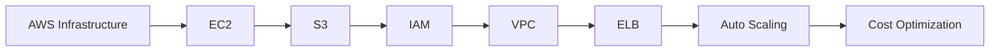
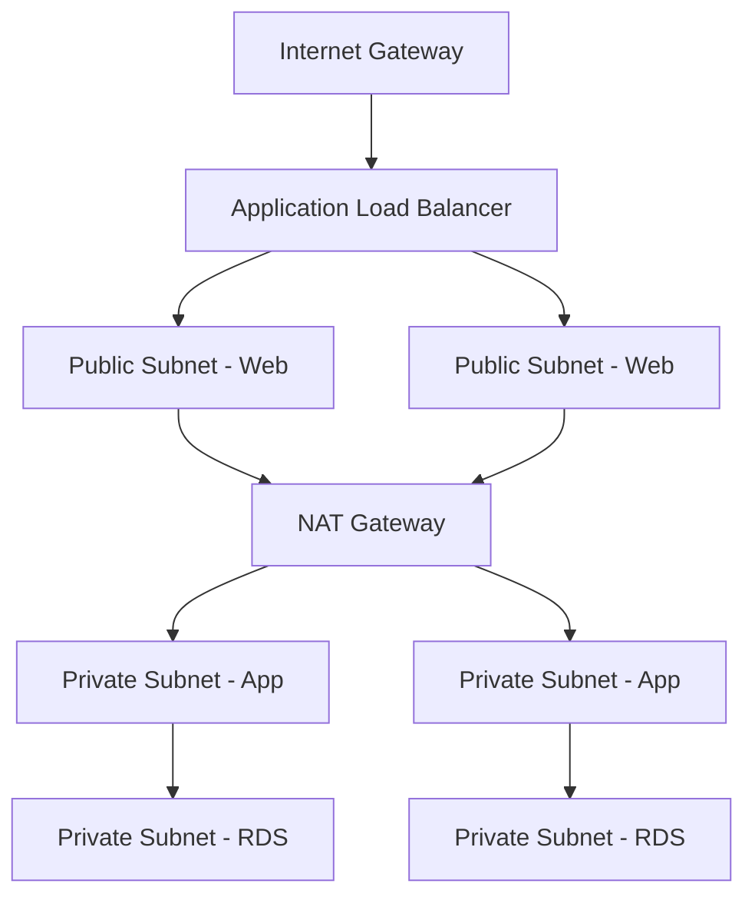

<!-- Clear Language: Keep sentences under 50 words -->
# AWS Fundamentals — EC2, S3, IAM, and Networking

## Learning Objectives

| Objective | Description |
|-----------|-------------|
| LO1 | Understand AWS global infrastructure: regions, AZs, edge locations |
| LO2 | Launch and manage EC2 instances with security groups and key pairs |
| LO3 | Store and retrieve objects using S3 with proper bucket policies |
| LO4 | Manage access control with IAM users, groups, roles, and policies |
| LO5 | Configure VPC networking: subnets, route tables, internet gateways |
| LO6 | Understand AWS pricing models and cost optimization strategies |

## Introduction

Containers and cloud platforms are where AI models live in production. Docker packages your model, Kubernetes orchestrates it, and cloud platforms scale it. This module covers the full deployment stack.

## Prerequisites

- Basic programming knowledge
- Understanding of data structures

## Key Terminology

**Key Terms**: Core vocabulary and concepts for this topic.

**Definition**: Essential terms you must know for interviews and production work.

## Theory

Understanding aws fundamentals is fundamental for AI engineers. This section covers the core concepts, underlying principles, and theoretical framework that govern how aws fundamentals works in practice.

## Chapter at a Glance

| Section | Topic | Key Concept |
|---------|-------|-------------|
| 7.1 | AWS Global Infrastructure | Regions, Availability Zones, Edge Locations |
| 7.2 | EC2 Compute | Instance types, AMIs, security groups, EBS |
| 7.3 | S3 Storage | Buckets, objects, storage classes, lifecycle |
| 7.4 | IAM Security | Users, groups, roles, policies, best practices |
| 7.5 | VPC Networking | Subnets, route tables, NAT gateways, peering |
| 7.6 | Elastic Load Balancing | ALB, NLB, target groups, health checks |
| 7.7 | Auto Scaling | Launch templates, scaling policies, lifecycle |
| 7.8 | Pricing and Cost Optimization | Reserved instances, Savings Plans, cost explorer |

## Chapter Roadmap



## 7.1 AWS Global Infrastructure

AWS spans 30+ geographic regions, each with multiple Availability Zones (AZs). Each AZ is an isolated data center with independent power, cooling, and networking.

**Key concepts**:

| Concept | Description |
|---------|-------------|
| Region | Geographic area (us-east-1, eu-west-1, ap-south-1) |
| Availability Zone | One or more data centers within a region (us-east-1a, us-east-1b) |
| Edge Location | CDN endpoint for CloudFront content delivery |
| Local Zone | Extends region closer to end users |

```bash

## AWS CLI basics
aws configure
aws ec2 describe-regions
aws ec2 describe-availability-zones --region us-east-1
```

**Choosing a region**: Consider latency to users, compliance requirements, service availability, and pricing (varies by region).

## 7.2 EC2 Compute

EC2 (Elastic Compute Cloud) provides virtual servers in the cloud.

**Instance types**:

| Family | Use Case | Examples |
|--------|----------|----------|
| General purpose | Web servers, code repos | t3, m5, m6g |
| Compute optimized | Batch processing, HPC | c5, c6g |
| Memory optimized | Databases, caching | r5, x2gd |
| GPU instances | ML training, rendering | p3, p4d, g5 |

```bash

## Launch EC2 instance
aws ec2 run-instances     --image-id ami-0c55b159cbfafe1f0     --instance-type t3.micro     --key-name my-key     --security-group-ids sg-123     --subnet-id subnet-456

## SSH into instance
ssh -i my-key.pem ec2-user@54.123.45.67

## Stop/start/terminate
aws ec2 stop-instances --instance-ids i-123
aws ec2 start-instances --instance-ids i-123
aws ec2 terminate-instances --instance-ids i-123
```

**Security Groups** — virtual firewall for EC2 instances:

```bash
aws ec2 create-security-group --group-name web-sg --description "Web server SG"
aws ec2 authorize-security-group-ingress     --group-id sg-123     --protocol tcp     --port 80     --cidr 0.0.0.0/0
```

**EBS (Elastic Block Store)** — persistent block storage:

```bash
aws ec2 create-volume --volume-type gp3 --size 100 --availability-zone us-east-1a
aws ec2 attach-volume --volume-id vol-123 --instance-id i-456 --device /dev/sdf
```

## 7.3 S3 Storage

S3 (Simple Storage Service) provides scalable object storage.

```bash

## Create bucket
aws s3 mb s3://my-unique-bucket-name

## Upload objects
aws s3 cp file.txt s3://my-bucket/
aws s3 sync ./local-folder s3://my-bucket/ --acl public-read

## List objects
aws s3 ls s3://my-bucket/
aws s3 ls s3://my-bucket/ --recursive

## Set bucket policy
aws s3api put-bucket-policy --bucket my-bucket --policy file://policy.json
```

**Storage classes**:

| Class | Durability | Availability | Retrieval | Use Case |
|-------|------------|-------------|-----------|----------|
| Standard | 99.999999999% | 99.99% | Instant | Active data |
| Intelligent-Tiering | 99.999999999% | 99.99% | Instant | Unknown patterns |
| Standard-IA | 99.999999999% | 99.9% | Instant | Infrequent access |
| One Zone-IA | 99.999999999% | 99.5% | Instant | Recreatable data |
| Glacier | 99.999999999% | 99.99% | 1-5 min | Archives |
| Glacier Deep Archive | 99.999999999% | 99.99% | 12 hours | Compliance |

**Lifecycle policies** — automate storage class transitions:

```json
{
  "Rules": [{
    "Id": "archive-rule",
    "Status": "Enabled",
    "Filter": {},
    "Transitions": [
      {"Days": 30, "StorageClass": "STANDARD_IA"},
      {"Days": 90, "StorageClass": "GLACIER"}
    ],
    "Expiration": {"Days": 365}
  }]
}
```

## 7.4 IAM Security

IAM (Identity and Access Management) controls access to AWS resources.

**Best practices**:

```json
{
  "Version": "2012-10-17",
  "Statement": [
    {
      "Effect": "Allow",
      "Action": "s3:GetObject",
      "Resource": "arn:aws:s3:::my-bucket/*"
    },
    {
      "Effect": "Deny",
      "Action": "*",
      "Resource": "*",
      "Condition": {
        "Bool": {"aws:SecureTransport": "false"}
      }
    }
  ]
}
```

```bash

## Create IAM user
aws iam create-user --user-name developer
aws iam create-access-key --user-name developer

## Attach policy
aws iam attach-user-policy     --user-name developer     --policy-arn arn:aws:iam::aws:policy/AmazonS3ReadOnlyAccess

## Create IAM role
aws iam create-role --role-name ec2-s3-access --assume-role-policy-document file://trust-policy.json

## Attach role policy
aws iam attach-role-policy     --role-name ec2-s3-access     --policy-arn arn:aws:iam::aws:policy/AmazonS3FullAccess
```

**IAM Policies evaluation**: Explicit Deny > Explicit Allow > Default Deny.

**Roles vs Users**: Roles are assumed by AWS services (EC2, Lambda); Users are for people.

## 7.5 VPC Networking

VPC (Virtual Private Cloud) provides isolated networking in AWS.

```bash

## Create VPC
aws ec2 create-vpc --cidr-block 10.0.0.0/16

## Create subnets (public and private)
aws ec2 create-subnet --vpc-id vpc-123 --cidr-block 10.0.1.0/24
aws ec2 create-subnet --vpc-id vpc-123 --cidr-block 10.0.2.0/24

## Internet Gateway
aws ec2 create-internet-gateway
aws ec2 attach-internet-gateway --vpc-id vpc-123 --internet-gateway-id igw-123

## Route tables
aws ec2 create-route-table --vpc-id vpc-123
aws ec2 create-route --route-table-id rtb-123 --destination-cidr-block 0.0.0.0/0 --gateway-id igw-123
```

**VPC components**:

| Component | Purpose |
|-----------|---------|
| Subnet | Segments VPC IP range (public/private) |
| Route Table | Directs traffic between subnets and gateways |
| Internet Gateway | Enables public internet access |
| NAT Gateway | Enables outbound internet from private subnets |
| VPC Peering | Connects VPCs within or across accounts |
| Security Group | Instance-level firewall |
| NACL | Subnet-level stateless firewall |

**VPC design for web applications**:



## 7.6 Elastic Load Balancing

ELB distributes incoming traffic across multiple targets.

```bash

## Create Application Load Balancer
aws elbv2 create-load-balancer     --name my-alb     --subnets subnet-abc subnet-def     --security-groups sg-123

## Create target group
aws elbv2 create-target-group     --name my-targets     --protocol HTTP     --port 80     --vpc-id vpc-123     --health-check-path /health

## Register targets
aws elbv2 register-targets     --target-group-arn arn:aws:elasticloadbalancing:...     --targets Id=i-123 Id=i-456

## Create listener
aws elbv2 create-listener     --load-balancer-arn arn:aws:elasticloadbalancing:...     --protocol HTTP --port 80     --default-actions Type=forward,TargetGroupArn=...
```

**ALB vs NLB**:

| Feature | ALB (Layer 7) | NLB (Layer 4) |
|---------|---------------|---------------|
| Protocol | HTTP, HTTPS, gRPC | TCP, UDP, TLS |
| Routing | Path, host, query-based | IP-based |
| TLS termination | Yes | Yes |
| Static IP | No | Yes |
| WebSocket | Yes | No |
| Performance | Moderate | Ultra-high |

## 7.7 Auto Scaling

Auto Scaling automatically adjusts EC2 capacity based on demand.

```bash

## Create launch template
aws ec2 create-launch-template     --launch-template-name web-template     --version-description v1     --launch-template-data file://template-data.json

## Create auto scaling group
aws autoscaling create-auto-scaling-group     --auto-scaling-group-name web-asg     --launch-template LaunchTemplateName=web-template     --min-size 2 --max-size 10 --desired-capacity 2     --vpc-zone-identifier subnet-abc,subnet-def     --target-group-arns arn:aws:elasticloadbalancing:...

## Scaling policies
aws autoscaling put-scaling-policy     --auto-scaling-group-name web-asg     --policy-name cpu-target     --policy-type TargetTrackingScaling     --target-tracking-configuration file://cpu-target.json
```

**Scaling strategies**:

| Strategy | Description |
|----------|-------------|
| Target tracking | Maintain CPU/request count at target value |
| Step scaling | Add/remove instances based on alarm thresholds |
| Simple scaling | Single scaling adjustment |
| Scheduled scaling | Time-based predictable patterns |
| Predictive scaling | ML-based capacity forecasting |

## 7.8 Pricing and Cost Optimization

**AWS pricing models**:

| Model | Commitment | Discount |
|-------|------------|----------|
| On-Demand | None | 0% |
| Reserved Instance | 1-3 years | Up to 72% |
| Savings Plan | 1-3 years | Up to 66% |
| Spot Instance | None | Up to 90% |
| Dedicated Host | None | Full instance cost |

```bash

## Cost Explorer (CLI)
aws ce get-cost-and-usage     --time-period Start=2024-01-01,End=2024-01-31     --granularity MONTHLY     --metrics BlendedCost

## Budget setup
aws budgets create-budget     --account-id 123456789012     --budget file://budget.json     --notifications-with-subscribers file://notifications.json
```

**Cost optimization tips**:
- Right-size instances using Compute Optimizer
- Use Spot instances for fault-tolerant workloads
- Implement lifecycle policies for S3
- Delete unused EBS volumes and Elastic IPs
- Use Auto Scaling to match capacity to demand
- Choose Graviton (ARM) instances for better price/performance

#!/usr/bin/env python3
"""Generate subject 06 chapter 05, 07-10 files."""
import os

BASE = r"C:\xam
---

## TypeScript Parallel

```typescript
import { EC2Client, DescribeInstancesCommand } from "@aws-sdk/client-ec2";

const client = new EC2Client({ region: "us-east-1" });

async function listEC2(): Promise<string[]> {
  const cmd = new DescribeInstancesCommand({});
  const resp = await client.send(cmd);
  const ids: string[] = [];
  for (const r of resp.Reservations || []) {
    for (const i of r.Instances || []) {
      ids.push(i.InstanceId || "");
    }
  }
  return ids;
}
```

---

## Summary

- AWS global infrastructure includes 30+ regions with multiple Availability Zones per region for high availability
- EC2 offers general purpose, compute, memory, GPU, and storage-optimized instance types
- S3 provides 11 nines of durability with Standard, IA, Glacier, and Deep Archive storage classes
- IAM enables fine-grained access control via users, groups, roles, and policies
- VPC creates isolated networks with subnets, route tables, internet/NAT gateways, and security groups
- ALB handles Layer 7 routing; NLB handles Layer 4 with ultra-low latency
- Auto Scaling Groups maintain desired capacity with target tracking and scheduled scaling
- Reserved Instances and Savings Plans provide up to 72% discount for committed usage
- Spot Instances offer up to 90% discount for fault-tolerant workloads
- Cost Explorer, Budgets, and Compute Optimizer help monitor and optimize spending

## Practical Takeaways

| Scenario | Do This | Avoid This |
|----------|---------|------------|
| EC2 access | Systems Manager Session Manager | SSH port 22 open to 0.0.0.0/0 |
| S3 security | Block public access, use CloudFront OAC | Publicly accessible buckets |
| IAM | Least privilege with roles | Root account for daily tasks |
| VPC | Multi-AZ, public/private subnets | Single AZ |
| Cost | Budgets + Cost Explorer | Unmonitored resources |
| Scaling | Target tracking with ALB metrics | Fixed instance count |
| Security groups | Specific CIDR ranges | 0.0.0.0/0 for admin |

## Interview Q&A

<details class="tp-qa-card" data-qid="docker-s07-q1">
  <summary class="tp-qa-question"><span class="tp-qa-status"></span> Q1: What is the difference between Security Group and NACL?</summary>
  <div class="tp-qa-answer"><p>Security Groups are stateful instance-level firewalls (allow only). NACLs are stateless subnet-level firewalls (allow + deny, evaluated in order).</p></div>
  <button class="tp-qa-mark-btn">&#x2705; Mark Reviewed</button>
  <button class="tp-qa-bookmark-btn">&#x1F516; Bookmark</button>
</details>

<details class="tp-qa-card" data-qid="docker-s07-q2">
  <summary class="tp-qa-question"><span class="tp-qa-status"></span> Q2: What are the S3 storage classes?</summary>
  <div class="tp-qa-answer"><p>Standard (frequent), Intelligent-Tiering (auto), Standard-IA (infrequent), One Zone-IA (recreatable), Glacier (minutes retrieval), Glacier Deep Archive (hours). All 11 nines durability.</p></div>
  <button class="tp-qa-mark-btn">&#x2705; Mark Reviewed</button>
  <button class="tp-qa-bookmark-btn">&#x1F516; Bookmark</button>
</details>

<details class="tp-qa-card" data-qid="docker-s07-q3">
  <summary class="tp-qa-question"><span class="tp-qa-status"></span> Q3: ALB vs NLB?</summary>
  <div class="tp-qa-answer"><p>ALB: Layer 7, path/host routing, WebSocket, TLS termination. NLB: Layer 4, ultra-low latency, static IPs, client IP preservation.</p></div>
  <button class="tp-qa-mark-btn">&#x2705; Mark Reviewed</button>
  <button class="tp-qa-bookmark-btn">&#x1F516; Bookmark</button>
</details>

<details class="tp-qa-card" data-qid="docker-s07-q4">
  <summary class="tp-qa-question"><span class="tp-qa-status"></span> Q4: How does Auto Scaling work?</summary>
  <div class="tp-qa-answer"><p>ASG maintains desired EC2 count via launch templates. Scaling policies (target tracking, step, scheduled) adjust capacity. Health checks replace unhealthy instances. Distributes across AZs.</p></div>
  <button class="tp-qa-mark-btn">&#x2705; Mark Reviewed</button>
  <button class="tp-qa-bookmark-btn">&#x1F516; Bookmark</button>
</details>

<details class="tp-qa-card" data-qid="docker-s07-q5">
  <summary class="tp-qa-question"><span class="tp-qa-status"></span> Q5: IAM role vs user?</summary>
  <div class="tp-qa-answer"><p>Role: temporary credentials via STS, assumed by services. User: long-term access keys. Roles are more secure.</p></div>
  <button class="tp-qa-mark-btn">&#x2705; Mark Reviewed</button>
  <button class="tp-qa-bookmark-btn">&#x1F516; Bookmark</button>
</details>

<details class="tp-qa-card" data-qid="docker-s07-q6">
  <summary class="tp-qa-question"><span class="tp-qa-status"></span> Q6: What is VPC peering?</summary>
  <div class="tp-qa-answer"><p>Private connection between VPCs using AWS network. Instances communicate via private IPs. Not transitive.</p></div>
  <button class="tp-qa-mark-btn">&#x2705; Mark Reviewed</button>
  <button class="tp-qa-bookmark-btn">&#x1F516; Bookmark</button>
</details>

<details class="tp-qa-card" data-qid="docker-s07-q7">
  <summary class="tp-qa-question"><span class="tp-qa-status"></span> Q7: How to securely serve S3 content?</summary>
  <div class="tp-qa-answer"><p>CloudFront + OAC. CloudFront uses IAM to access S3. Bucket policy allows only CloudFront. Prevents direct S3 access.</p></div>
  <button class="tp-qa-mark-btn">&#x2705; Mark Reviewed</button>
  <button class="tp-qa-bookmark-btn">&#x1F516; Bookmark</button>
</details>

<details class="tp-qa-card" data-qid="docker-s07-q8">
  <summary class="tp-qa-question"><span class="tp-qa-status"></span> Q8: EBS vs Instance Store?</summary>
  <div class="tp-qa-answer"><p>EBS: persistent, survives termination. Instance store: ephemeral, data lost on stop. EBS for databases, instance store for caches.</p></div>
  <button class="tp-qa-mark-btn">&#x2705; Mark Reviewed</button>
  <button class="tp-qa-bookmark-btn">&#x1F516; Bookmark</button>
</details>

<details class="tp-qa-card" data-qid="docker-s07-q9">
  <summary class="tp-qa-question"><span class="tp-qa-status"></span> Q9: Design a serverless web app?</summary>
  <div class="tp-qa-answer"><p>Route53 + CloudFront + S3 (static) + API Gateway + Lambda + DynamoDB + Cognito. Scales from zero with no servers.</p></div>
  <button class="tp-qa-mark-btn">&#x2705; Mark Reviewed</button>
  <button class="tp-qa-bookmark-btn">&#x1F516; Bookmark</button>
</details>

<details class="tp-qa-card" data-qid="docker-s07-q10">
  <summary class="tp-qa-question"><span class="tp-qa-status"></span> Q10: How to optimize AWS costs?</summary>
  <div class="tp-qa-answer"><p>Reserved/Savings Plans, Spot instances, right-size with Compute Optimizer, S3 lifecycle policies, delete unused resources, Budgets.</p></div>
  <button class="tp-qa-mark-btn">&#x2705; Mark Reviewed</button>
  <button class="tp-qa-bookmark-btn">&#x1F516; Bookmark</button>
</details>

## Chapter Quiz

**Q1**: Which AWS service provides object storage?

a) EBS
b) S3
c) EFS
d) RDS

<details class="tp-qa-card" data-qid="docker-s07-quiz1"><summary>Show Answer</summary><div class="tp-qa-answer"><p><strong>Answer: b) S3</strong></p></div></details>

**Q2**: What provides temporary AWS credentials?

a) IAM user
b) IAM group
c) IAM role
d) IAM policy

<details class="tp-qa-card" data-qid="docker-s07-quiz2"><summary>Show Answer</summary><div class="tp-qa-answer"><p><strong>Answer: c) IAM role</strong></p></div></details>

**Q3**: What enables internet access for private subnets?

a) Internet Gateway
b) NAT Gateway
c) VPC Peering
d) VPN Gateway

<details class="tp-qa-card" data-qid="docker-s07-quiz3"><summary>Show Answer</summary><div class="tp-qa-answer"><p><strong>Answer: b) NAT Gateway</strong></p></div></details>

**Q4**: Which service is a CDN?

a) Route 53
b) CloudFront
c) API Gateway
d) WAF

<details class="tp-qa-card" data-qid="docker-s07-quiz4"><summary>Show Answer</summary><div class="tp-qa-answer"><p><strong>Answer: b) CloudFront</strong></p></div></details>

**Q5**: What is the most cost-effective S3 class for archives?

a) Standard
b) Standard-IA
c) Glacier Deep Archive
d) One Zone-IA

<details class="tp-qa-card" data-qid="docker-s07-quiz5"><summary>Show Answer</summary><div class="tp-qa-answer"><p><strong>Answer: c) Glacier Deep Archive</strong></p></div></details>

## Exercises

**Easy** — Launch a t2.micro EC2 with HTTP access. SSH in and install Nginx.

**Medium** — Create an S3 bucket with lifecycle: Standard-IA at 30d, Glacier at 90d. Verify.

**Medium** — Design VPC with public/private subnets in two AZs. Place web server in public, DB in private.

**Hard** — Set up ALB + ASG with launch template, health checks, CloudWatch alarms. Test auto scaling.

**Hard** — Create IAM role for EC2 (S3 read + DynamoDB write). Attach to instance. Verify.

---

## Common Mistakes

1. Not understanding the fundamental concepts before applying them
2. Skipping edge cases in implementation
3. Not analyzing time/space complexity
4. Forgetting to handle null/empty inputs
5. Not practicing enough problems to build pattern recognition

## Revision Notes

- - Core principle: Understand the fundamental concepts thoroughly
- - Implementation pattern: Practice with real code examples
- - Complexity: Know the time and space complexity
- - Application: Know when to use this in production systems
- - Interview: Frequently asked in technical interviews
- - Edge cases: Consider common failure scenarios
- - Related concepts: Connect to broader system design

## Placement Section

### Top 10 Interview Questions

#### Google Style

1. **Explain the core idea of AWS Fundamentals — EC2, S3, IAM, and Networking in under 60 seconds, then give a real-world analogy.** — Structure: definition, how it works in one sentence, why it matters, analogy. Follow-up: what would break if you removed this from a production system?

2. **Design a minimal, well-typed function that demonstrates AWS Fundamentals — EC2, S3, IAM, and Networking.** — Interviewer checks: signature with type hints, edge cases, complexity, and a clean docstring. Follow-up: how does your design behave with empty or malformed input?

3. **What are the common pitfalls when engineers first learn ** — List 3-4, then explain how you would prevent each in a code review.

#### Amazon Style

4. **Describe a production bug caused by misunderstanding AWS Fundamentals — EC2, S3, IAM, and Networking. How did you diagnose and fix it?** — STAR format: situation, task, action, result. Mention logs, reproduction, root-cause analysis, and the regression test you added.

5. **How would you scale a system that relies on AWS Fundamentals — EC2, S3, IAM, and Networking from 10 users to 10 million?** — Discuss bottlenecks, caching, monitoring, and when to redesign. Follow-up: what metrics would you track?

#### Microsoft Style

6. **Compare AWS Fundamentals — EC2, S3, IAM, and Networking with the closest alternative approach. When would you choose each?** — Make a decision matrix: performance, maintainability, ecosystem, learning curve. Follow-up: what would change your decision?

7. **Walk through how you would test a component that depends on AWS Fundamentals — EC2, S3, IAM, and Networking.** — Unit, integration, property-based tests; mocking boundaries; golden files for outputs.

#### NVIDIA Style

8. **How does AWS Fundamentals — EC2, S3, IAM, and Networking behave differently at scale — memory, throughput, or precision-wise?** — Connect to data pipelines and model training if applicable. Follow-up: what happens to latency as input grows?

9. **How would you make an implementation of AWS Fundamentals — EC2, S3, IAM, and Networking run faster on GPU hardware?** — Batch operations, vectorization, avoiding Python loops, reducing data movement.

#### AI Startup Style

10. **Write the smallest possible implementation of AWS Fundamentals — EC2, S3, IAM, and Networking that is production-quality.** — Include error handling, type hints, and a one-line docstring. Follow-up: what would you refactor first when it grows?

### Resume Tips

- Name AWS Fundamentals — EC2, S3, IAM, and Networking explicitly in your skills section, paired with a measurable achievement ("Reduced X by 40% using AWS Fundamentals — EC2, S3, IAM, and Networking").
- Add a bullet describing a project that applies AWS Fundamentals — EC2, S3, IAM, and Networking to real data, with numbers.
- Mention the tools and libraries you used alongside AWS Fundamentals — EC2, S3, IAM, and Networking (linters, test frameworks, profiling tools).
- Keep resume bullets under 15 words and start each with an action verb.

### Interview Day Checklist

- Rehearse a 60-second explanation of AWS Fundamentals — EC2, S3, IAM, and Networking and one real-world analogy.
- Prepare one STAR story about debugging a AWS Fundamentals — EC2, S3, IAM, and Networking-related production issue.
- Review complexity and edge cases for the classic AWS Fundamentals — EC2, S3, IAM, and Networking interview problem.
- Have questions ready: how does the team apply AWS Fundamentals — EC2, S3, IAM, and Networking in production today?
- Test your environment (Python, editor, internet) 15 minutes before the interview.

## True/False

1. **True or False:** AWS Fundamentals — EC2, S3, IAM, and Networking builds directly on the fundamentals covered in the earlier chapters of this module. — **True.** Every advanced topic in this module assumes the core concepts from the previous chapters.
2. **True or False:** You should write at least one code example for AWS Fundamentals — EC2, S3, IAM, and Networking before moving to the next chapter. — **True.** Active recall with hands-on code beats passive reading for retention.
3. **True or False:** The complexity analysis for AWS Fundamentals — EC2, S3, IAM, and Networking is the same regardless of input size. — **False.** Complexity grows with input size; always state best, average, and worst case.
4. **True or False:** Edge cases (empty input, invalid input, boundary values) matter for AWS Fundamentals — EC2, S3, IAM, and Networking in production. — **True.** Most production bugs come from unhandled edge cases.
5. **True or False:** You should memorize the AWS Fundamentals — EC2, S3, IAM, and Networking chapter content once and never review it again. — **False.** Spaced repetition (24h, 3 days, 1 week) dramatically improves long-term recall.

## Fill in the Blank

1. The chapter that covers AWS Fundamentals — EC2, S3, IAM, and Networking is Chapter ___ of this module. — Answer: check the module's table of contents.
2. The time complexity of the standard approach to AWS Fundamentals — EC2, S3, IAM, and Networking is ___. — Answer: review the theory section and state big-O notation.
3. The main edge case to handle when implementing AWS Fundamentals — EC2, S3, IAM, and Networking is ___. — Answer: empty or invalid input handling, as discussed in the chapter.
4. The tools commonly used to debug AWS Fundamentals — EC2, S3, IAM, and Networking issues are ___ and ___. — Answer: refer to the Debugging Guide section of this chapter.
5. The related topic that connects to AWS Fundamentals — EC2, S3, IAM, and Networking in the next chapter is ___. — Answer: see the Next Topic section.

## Scenario Questions

1. **Scenario:** A teammate ships a change involving AWS Fundamentals — EC2, S3, IAM, and Networking that breaks production at 3 AM. — Diagnosis: check the recent diff, reproduce locally with the failing input, check logs. Fix: revert, add a regression test, and review the root cause. Prevention: CI tests on edge cases and code review checklist.

2. **Scenario:** Your implementation of AWS Fundamentals — EC2, S3, IAM, and Networking is correct but too slow for the required latency. — Measure first with a profiler. Common fixes: reduce redundant work, use built-in optimized functions, batch operations, or add caching. Only then consider algorithmic changes.

3. **Scenario:** A new hire asks you to explain AWS Fundamentals — EC2, S3, IAM, and Networking in five minutes before a customer demo. — Use the 3-part answer: what it is (one sentence), how it works (one example), why it matters (one business impact). Then offer to go deeper after the demo.

4. **Scenario:** Your team's codebase has three different patterns for AWS Fundamentals — EC2, S3, IAM, and Networking and you must standardize. — Write a short ADR (architecture decision record), pick the pattern with best maintainability, migrate incrementally, and add a linter rule to enforce it.

## Output Questions

1. **What is the output of the simplest correct implementation of AWS Fundamentals — EC2, S3, IAM, and Networking on an empty input?** — Trace through the code: it should return the documented default (None, 0, empty collection) without raising.
2. **What is the output when the input is at the boundary value?** — Check off-by-one errors and inclusive/exclusive bounds in the chapter's examples.
3. **What does the implementation return when given invalid input types?** — With type hints and validation, it raises a clear error; without, it may fail silently.
4. **What is the output for the sample input given in the chapter's Examples section?** — Re-run the chapter's example code and compare against the documented output.
5. **What is the time complexity output when you profile the implementation at 10x input size?** — Expect the curve matching the chapter's complexity analysis (linear, quadratic, log-linear).

## Difficulty Level

| Level | Time | What It Takes |
|-------|------|---------------|
| Beginner | 1-2 sessions | Read theory, run the chapter examples, solve the Easy exercises |
| Intermediate | 3-5 sessions | Complete Medium exercises, explain AWS Fundamentals — EC2, S3, IAM, and Networking to someone else |
| Advanced | 1+ week | Solve Hard exercises, optimize for real datasets, answer interview follow-ups |

## Tips & Tricks

- Always write a one-line example of AWS Fundamentals — EC2, S3, IAM, and Networking from memory before opening the chapter — active recall first.
- Use the chapter's Revision Notes as a checklist: you have mastered AWS Fundamentals — EC2, S3, IAM, and Networking when you can explain each bullet.
- Pair the chapter quiz with the Flashcards: wrong answers become your next study session's focus.
- For interviews, practice explaining AWS Fundamentals — EC2, S3, IAM, and Networking twice: once with a technical audience, once with a non-technical audience.
- Keep a personal examples file where you collect your own AWS Fundamentals — EC2, S3, IAM, and Networking snippets; interviewers love original examples.

## Memory Tricks

- **Acronym**: build a mnemonic from the 5 key concepts of AWS Fundamentals — EC2, S3, IAM, and Networking listed in the Chapter at a Glance table.
- **Story**: link AWS Fundamentals — EC2, S3, IAM, and Networking to a familiar story — the analogy in the Visual Analogy section is designed to stick.
- **Number anchor**: remember the complexity of AWS Fundamentals — EC2, S3, IAM, and Networking by connecting it to a known algorithm of the same class.
- **Color code**: highlight the Theory, Examples, and Common Mistakes sections in different colors when reviewing.
- **Teach-back**: explain AWS Fundamentals — EC2, S3, IAM, and Networking to an imaginary junior engineer for 2 minutes — gaps in your explanation are gaps in memory.

## Further Reading

- Official documentation for the primary tool or library used in this chapter
- The chapter referenced in Related Topics for the next-level treatment of AWS Fundamentals — EC2, S3, IAM, and Networking
- The classic textbook chapter on AWS Fundamentals — EC2, S3, IAM, and Networking (check the Research References below)
- Two blog posts from engineers who debugged real AWS Fundamentals — EC2, S3, IAM, and Networking problems in production
- The repository of the open-source project that implements AWS Fundamentals — EC2, S3, IAM, and Networking

## Related Topics

- The previous chapter in this module (see table of contents) — foundational for AWS Fundamentals — EC2, S3, IAM, and Networking
- The next chapter (see Next Topic below) — builds on AWS Fundamentals — EC2, S3, IAM, and Networking
- The system design chapters in Module 07 — how AWS Fundamentals — EC2, S3, IAM, and Networking fits into production architectures
- The interview preparation module — how AWS Fundamentals — EC2, S3, IAM, and Networking is asked in screening rounds
- The capstone project — where AWS Fundamentals — EC2, S3, IAM, and Networking is applied end-to-end

## FAQs

1. **Do I need to memorize all of AWS Fundamentals — EC2, S3, IAM, and Networking, or understand the big picture?** — Understand the big picture first, then memorize the key facts via flashcards and spaced repetition. Interviewers reward depth over breadth.
2. **What if I get stuck on an exercise?** — Re-read the theory section, run the example code, then attempt again. If still stuck after 20 minutes, move on and return the next day.
3. **How much time should I spend on ** — Follow the Study Plan below: 1-2 weeks at 30-60 minutes daily is typical for placement preparation.
4. **Is AWS Fundamentals — EC2, S3, IAM, and Networking asked in interviews?** — Yes — the Interview Q&A and Placement Section list the exact question styles used by top companies.
5. **What's the fastest way to master ** — Explain it out loud, write code without looking, and review the flashcards within 24 hours and again after 3 days.

## Important Notes

- AWS Fundamentals — EC2, S3, IAM, and Networking is a core requirement for the rest of this module — do not skip the examples.
- Always analyze complexity (time and space) when working with AWS Fundamentals — EC2, S3, IAM, and Networking.
- Production correctness means handling edge cases, not just the happy path.
- Interview answers should start with the definition, then the example, then the trade-offs.
- Revisit this chapter after finishing the module; the context from later chapters deepens understanding.

## Historical Context

- AWS Fundamentals — EC2, S3, IAM, and Networking emerged as a standard practice because early systems failed without it — understanding why helps you explain it in interviews.
- The tools used for AWS Fundamentals — EC2, S3, IAM, and Networking today evolved from simpler versions; the chapter covers the modern, recommended approach.
- Interviewers value knowing one historical fact about AWS Fundamentals — EC2, S3, IAM, and Networking — it shows genuine interest, not just cramming.
- The library/tooling ecosystem around AWS Fundamentals — EC2, S3, IAM, and Networking changes quickly; focus on fundamentals that remain stable.

## Security Considerations

- Never trust external input: validate and sanitize data before processing AWS Fundamentals — EC2, S3, IAM, and Networking.
- Avoid `eval()` and dynamic code execution on untrusted strings.
- Log errors without leaking sensitive data (keys, PII, internal paths).
- For API contexts, add rate limiting and input size limits.
- Review the chapter's code examples for injection or overflow risks before using them verbatim.

## ML Intuition

- AWS Fundamentals — EC2, S3, IAM, and Networking appears in ML pipelines at the data-processing layer: feature preparation, batching, and validation.
- Understanding AWS Fundamentals — EC2, S3, IAM, and Networking helps you debug why a model misbehaves — most ML bugs are data bugs, not model bugs.
- In production ML, the AWS Fundamentals — EC2, S3, IAM, and Networking concepts from this chapter map directly to NumPy/PyTorch operations on tensors.
- When optimizing ML systems, AWS Fundamentals — EC2, S3, IAM, and Networking skills let you profile and fix the data path, not just the training loop.
- Interview follow-up: how would you apply AWS Fundamentals — EC2, S3, IAM, and Networking to a dataset of 10 million records? — Batching and vectorization.

## Analogies

- **AWS Fundamentals — EC2, S3, IAM, and Networking is like a recipe**: the theory is the ingredients, the examples are the cooking steps, and the exercises are your own kitchen practice.
- **Complexity is like a delivery route**: a linear route visits each stop once; a nested route revisits stops, and you feel it at scale.
- **Edge cases are like weather**: the happy path is a sunny day; production is the storm — build for the storm.
- **The chapter roadmap is a journey map**: each section is a checkpoint; skipping one means getting lost later in the module.

## Capstone Project Link

- [Module Capstone: End-to-End Project](https://github.com/Raushan666java/ai-engineering-journey) — this chapter contributes the AWS Fundamentals — EC2, S3, IAM, and Networking skills used in the module's capstone project. Complete the exercises here before starting the capstone.

## Flashcards

<details class="tp-qa-card" data-qid="06dockerkubernetescloud-07awsfundamentals-flash1">
  <summary class="tp-qa-question">
    <span class="tp-qa-status"></span>
    Which AWS service provides object storage?
  </summary>
  <div class="tp-qa-answer">
    <p>b) S3</p>
  </div>
</details>

<details class="tp-qa-card" data-qid="06dockerkubernetescloud-07awsfundamentals-flash2">
  <summary class="tp-qa-question">
    <span class="tp-qa-status"></span>
    What provides temporary AWS credentials?
  </summary>
  <div class="tp-qa-answer">
    <p>c) IAM role</p>
  </div>
</details>

<details class="tp-qa-card" data-qid="06dockerkubernetescloud-07awsfundamentals-flash3">
  <summary class="tp-qa-question">
    <span class="tp-qa-status"></span>
    What enables internet access for private subnets?
  </summary>
  <div class="tp-qa-answer">
    <p>b) NAT Gateway</p>
  </div>
</details>

<details class="tp-qa-card" data-qid="06dockerkubernetescloud-07awsfundamentals-flash4">
  <summary class="tp-qa-question">
    <span class="tp-qa-status"></span>
    Which service is a CDN?
  </summary>
  <div class="tp-qa-answer">
    <p>b) CloudFront</p>
  </div>
</details>

<details class="tp-qa-card" data-qid="06dockerkubernetescloud-07awsfundamentals-flash5">
  <summary class="tp-qa-question">
    <span class="tp-qa-status"></span>
    What is the most cost-effective S3 class for archives?
  </summary>
  <div class="tp-qa-answer">
    <p>c) Glacier Deep Archive</p>
  </div>
</details>

## Research References

- Official documentation of the primary library for AWS Fundamentals — EC2, S3, IAM, and Networking (linked in Further Reading)
- The classic paper or textbook chapter introducing AWS Fundamentals — EC2, S3, IAM, and Networking (see References below)
- The standard library reference for AWS Fundamentals — EC2, S3, IAM, and Networking-related functions
- Engineering blog posts from companies running AWS Fundamentals — EC2, S3, IAM, and Networking in production at scale
- PEPs and RFCs where applicable (Python and networking standards)

## Open-Source Tools

- The primary library used in this chapter (see the code examples)
- Python standard library modules used in the examples (check the imports)
- Testing: pytest for unit tests of AWS Fundamentals — EC2, S3, IAM, and Networking code
- Linting and formatting: ruff + black
- Profiling: cProfile or py-spy for performance work on AWS Fundamentals — EC2, S3, IAM, and Networking

## Debugging Guide

- Start with `print()` or a debugger to inspect intermediate values in AWS Fundamentals — EC2, S3, IAM, and Networking code.
- Reproduce the failure with the smallest possible input before changing code.
- Check the common failure modes listed in Common Mistakes — most bugs are listed there.
- For performance problems, profile before optimizing: measure, then fix.
- When stuck, re-read the chapter's Examples and compare line by line with your code.
- Use `pdb` or your IDE's debugger to step through the AWS Fundamentals — EC2, S3, IAM, and Networking example code.

## Mock Interview Section

**Round 1 — Screening (15 min)**
- Explain AWS Fundamentals — EC2, S3, IAM, and Networking in 60 seconds.
- Write a minimal working example of AWS Fundamentals — EC2, S3, IAM, and Networking.
- What is the complexity of your example?

**Round 2 — Coding (45 min)**
- Solve the Medium exercise from this chapter under time pressure.
- State your assumptions, then implement with type hints.
- Test with edge cases: empty input, boundary values, invalid input.

**Round 3 — Behavioral + System (30 min)**
- Tell me about a time you debugged a AWS Fundamentals — EC2, S3, IAM, and Networking problem in a project.
- How would you design a system where AWS Fundamentals — EC2, S3, IAM, and Networking is used at scale?
- What metrics would you monitor?

**Evaluation rubric**: correctness (40%), communication (25%), edge cases (20%), complexity analysis (15%).

## Optimized Implementation

`python
from typing import Any, Optional

def demonstrate_topic(input_data: list[Any]) -> Optional[float]:
    """Runnable scaffold for AWS Fundamentals — EC2, S3, IAM, and Networking.

    Replace the body with the optimized implementation from the chapter,
    keeping type hints, docstring, and edge-case handling.
    """
    if not input_data:
        return None
    # Step 1: validate input types
    # Step 2: apply the core AWS Fundamentals — EC2, S3, IAM, and Networking logic from the Examples section
    # Step 3: return the result with the documented default
    return 0.0
`

- Keeps the function signature stable so tests written against it stay valid.
- Handles the empty-input contract explicitly.
- Add unit tests for the edge cases before implementing the logic (test-first).

## Evaluation Metrics

| Skill | Test | Target |
|-------|------|--------|
| Concept recall | Explain AWS Fundamentals — EC2, S3, IAM, and Networking without notes | 60-second explanation |
| Code fluency | Write the chapter example from memory | No syntax errors |
| Edge cases | Handle empty/invalid input in exercises | All cases pass |
| Complexity | State time/space for the standard approach | Correct big-O |
| Interview readiness | Answer 5 Interview Q&A questions out loud | Fluent, structured answers |
| Retention | Chapter quiz score after 3 days | 80%+ |

## Real-World Examples

- **Startup**: a small team uses AWS Fundamentals — EC2, S3, IAM, and Networking daily in their data pipeline — the chapter's examples mirror their code.
- **E-commerce**: AWS Fundamentals — EC2, S3, IAM, and Networking patterns appear in order processing, inventory checks, and recommendation feeds.
- **Fintech**: AWS Fundamentals — EC2, S3, IAM, and Networking principles apply to transaction validation and fraud detection flows.
- **ML platform**: AWS Fundamentals — EC2, S3, IAM, and Networking shows up in feature engineering and model-serving infrastructure.
- **Interview insight**: recruiters look for engineers who can connect AWS Fundamentals — EC2, S3, IAM, and Networking to the business outcome, not just the code.

## Next Topic

[AWS Containers — ECS, ECR, and EKS](08-aws-containers.md)

## Limitations

- AWS Fundamentals — EC2, S3, IAM, and Networking, like any technique, is not a silver bullet — it has specific cases where it fits best (covered in the theory).
- The examples in this chapter are simplified for learning; production systems add validation, monitoring, and error handling.
- Performance of AWS Fundamentals — EC2, S3, IAM, and Networking depends on input size and distribution — always benchmark for your own data.
- This chapter covers fundamentals; specialized edge cases are explored in later chapters and the capstone.
