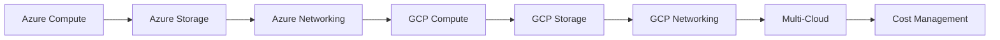

<!-- Clear Language: Keep sentences under 50 words -->
# Azure and GCP Basics — Cloud Providers Comparison

## Learning Objectives

| Objective | Description |
|-----------|-------------|
| LO1 | Understand Microsoft Azure core services: VMs, Blob Storage, AKS |
| LO2 | Understand Google Cloud Platform core services: Compute Engine, GKE, Cloud Storage |
| LO3 | Compare compute services across AWS, Azure, and GCP |
| LO4 | Compare storage and database offerings across providers |
| LO5 | Manage multi-cloud identity and access management |
| LO6 | Implement cloud cost management across providers |

## Introduction

Containers and cloud platforms are where AI models live in production. Docker packages your model, Kubernetes orchestrates it, and cloud platforms scale it. This module covers the full deployment stack.

## Prerequisites

- Basic programming knowledge
- Understanding of data structures

## Key Terminology

**Key Terms**: Core vocabulary and concepts for this topic.

**Definition**: Essential terms you must know for interviews and production work.

## Theory

Understanding azure and gcp basics is fundamental for AI engineers. This section covers the core concepts, underlying principles, and theoretical framework that govern how azure and gcp basics works in practice.

## Chapter at a Glance

| Section | Topic | Key Concept |
|---------|-------|-------------|
| 9.1 | Azure Compute | VMs, Scale Sets, App Service, AKS |
| 9.2 | Azure Storage | Blob Storage, Azure Files, Cosmos DB |
| 9.3 | Azure Networking | VNet, Load Balancer, Azure DNS |
| 9.4 | GCP Compute | Compute Engine, GKE, Cloud Run, App Engine |
| 9.5 | GCP Storage | Cloud Storage, Cloud SQL, Firestore |
| 9.6 | GCP Networking | VPC, Cloud CDN, Cloud Load Balancing |
| 9.7 | Multi-Cloud Comparison | Services mapping, migration strategies |
| 9.8 | Cloud Cost Management | Pricing models, cost tools, optimization |

## Chapter Roadmap



## 9.1 Azure Compute

Azure provides several compute options for different workloads.

**Azure Virtual Machines**:

```bash

## Create VM
az vm create     --resource-group my-rg     --name my-vm     --image UbuntuLTS     --size Standard_B2s     --admin-username azureuser     --generate-ssh-keys

## SSH
ssh azureuser@PUBLIC_IP

## Stop/start
az vm stop --resource-group my-rg --name my-vm
az vm start --resource-group my-rg --name my-vm
```

**Azure App Service** — PaaS for web apps:

```bash
az webapp create     --resource-group my-rg     --plan my-plan     --name my-unique-app     --runtime "NODE:18-lts"
```

**Azure Kubernetes Service (AKS)**:

```bash

## Create cluster
az aks create     --resource-group my-rg     --name my-cluster     --node-count 3     --enable-managed-identity

## Get credentials
az aks get-credentials --resource-group my-rg --name my-cluster

## Deploy
kubectl apply -f deployment.yaml
```

| Azure Compute | AWS Equivalent | Use Case |
|---------------|----------------|----------|
| Virtual Machines | EC2 | Full control, custom images |
| App Service | Elastic Beanstalk | PaaS web apps |
| Azure Functions | Lambda | Serverless functions |
| AKS | EKS | Managed Kubernetes |
| Container Instances | Fargate | Serverless containers |
| Batch | Batch | HPC, batch processing |

## 9.2 Azure Storage

**Blob Storage** — object storage (equivalent to S3):

```bash

## Create storage account
az storage account create     --name mystorageaccount     --resource-group my-rg     --location eastus     --sku Standard_LRS

## Upload blob
az storage blob upload     --account-name mystorageaccount     --container-name mycontainer     --name file.txt     --file ./file.txt

## List blobs
az storage blob list     --account-name mystorageaccount     --container-name mycontainer     --output table
```

**Azure Files** — managed file shares (SMB/NFS):

```bash
az storage share create --name myshare --account-name mystorageaccount
```

**Cosmos DB** — globally distributed NoSQL:

```bash
az cosmosdb create --name my-cosmos-db --resource-group my-rg
az cosmosdb sql database create --account-name my-cosmos-db --name my-database
```

## 9.3 Azure Networking

**Virtual Network (VNet)**:

```bash
az network vnet create     --resource-group my-rg     --name my-vnet     --address-prefix 10.0.0.0/16     --subnet-name default     --subnet-prefix 10.0.1.0/24

## Load Balancer
az network lb create     --resource-group my-rg     --name my-lb     --sku Standard     --frontend-ip-name my-frontend     --public-ip-address my-public-ip

## Application Gateway (Layer 7)
az network application-gateway create     --resource-group my-rg     --name my-gateway     --sku Standard_v2     --capacity 2     --vnet-name my-vnet     --subnet appgw-subnet
```

## 9.4 GCP Compute

**Compute Engine**:

```bash

## Create VM
gcloud compute instances create my-instance     --zone us-central1-a     --machine-type e2-medium     --image-family ubuntu-2204-lts     --image-project ubuntu-os-cloud

## SSH
gcloud compute ssh my-instance --zone us-central1-a

## Stop/start
gcloud compute instances stop my-instance --zone us-central1-a
gcloud compute instances start my-instance --zone us-central1-a
```

**Google Kubernetes Engine (GKE)**:

```bash

## Create cluster
gcloud container clusters create my-cluster     --zone us-central1-a     --num-nodes 3     --machine-type e2-standard-2

## Get credentials
gcloud container clusters get-credentials my-cluster --zone us-central1-a

## Deploy
kubectl apply -f deployment.yaml
```

**Cloud Run** — serverless containers:

```bash

## Deploy container
gcloud run deploy my-service     --image gcr.io/my-project/my-image:latest     --platform managed     --region us-central1     --allow-unauthenticated
```

**App Engine** — PaaS:

```bash
gcloud app deploy app.yaml --project my-project
```

| GCP Compute | AWS Equivalent | Use Case |
|-------------|----------------|----------|
| Compute Engine | EC2 | VMs with custom images |
| GKE | EKS | Managed Kubernetes |
| Cloud Run | Fargate + App Runner | Serverless containers |
| App Engine | Elastic Beanstalk | PaaS apps |
| Cloud Functions | Lambda | Serverless functions |
| Cloud Build | CodeBuild | CI/CD |

## 9.5 GCP Storage

**Cloud Storage** — object storage (equivalent to S3):

```bash

## Create bucket
gsutil mb gs://my-unique-bucket/

## Upload
gsutil cp file.txt gs://my-bucket/
gsutil rsync -r ./local-folder gs://my-bucket/

## Set lifecycle
gsutil lifecycle set lifecycle.json gs://my-bucket/

## Storage classes
gsutil cp file.txt gs://my-bucket/ --storage-class NEARLINE
gsutil rewrite -s COLDLINE gs://my-bucket/file.txt
```

**Cloud SQL** — managed relational databases:

```bash
gcloud sql instances create my-instance     --database-version POSTGRES_15     --cpu 2 --memory 8GB     --region us-central1
```

**Firestore** — NoSQL document database:

```bash
gcloud firestore databases create --region us-central1

## Use client libraries for CRUD operations
```

## 9.6 GCP Networking

**VPC**:

```bash

## Create VPC
gcloud compute networks create my-vpc --subnet-mode custom

## Create subnet
gcloud compute networks subnets create my-subnet     --network my-vpc     --region us-central1     --range 10.0.1.0/24

## Firewall rules
gcloud compute firewall-rules create allow-http     --network my-vpc     --allow tcp:80     --source-ranges 0.0.0.0/0
```

**Cloud Load Balancing**:

```bash
gcloud compute forwarding-rules create my-rule     --region us-central1     --load-balancing-scheme EXTERNAL     --ports 80     --target-http-proxy my-proxy
```

## 9.7 Multi-Cloud Comparison

| Service Category | AWS | Azure | GCP |
|-----------------|-----|-------|-----|
| Compute | EC2 | Virtual Machines | Compute Engine |
| Containers | ECS/EKS | AKS | GKE/Cloud Run |
| Serverless | Lambda | Functions | Cloud Functions |
| Object Storage | S3 | Blob Storage | Cloud Storage |
| Relational DB | RDS | SQL Database | Cloud SQL |
| NoSQL | DynamoDB | Cosmos DB | Firestore |
| Cache | ElastiCache | Redis Cache | Memorystore |
| CDN | CloudFront | Azure CDN | Cloud CDN |
| DNS | Route 53 | Azure DNS | Cloud DNS |
| Load Balancer | ALB/NLB | Load Balancer | Cloud LB |
| Monitoring | CloudWatch | Monitor | Cloud Monitoring |
| IAM | IAM | Entra ID | Cloud IAM |
| CI/CD | CodePipeline | DevOps | Cloud Build |

**Migration strategies**:

| Strategy | Description | Effort |
|----------|-------------|--------|
| Lift and shift | Move as-is to cloud VMs | Low |
| Re-platform | Move to PaaS services | Medium |
| Re-factor | Re-architect for cloud-native | High |
| Re-purchase | Switch to SaaS | Low |
| Retire | Decommission unused | None |

## 9.8 Cloud Cost Management

**Cost comparison by provider**:

```bash

## AWS Cost Explorer
aws ce get-cost-and-usage --time-period Start=2024-01-01,End=2024-01-31 --granularity MONTHLY --metrics BlendedCost

## Azure Cost Management
az consumption usage list --billing-period-name 202401

## GCP Cost
gcloud billing accounts list
gcloud billing projects describe PROJECT_ID
```

**Cost optimization across clouds**:

| Strategy | AWS | Azure | GCP |
|----------|-----|-------|-----|
| Reserved instances | Reserved Instances | Reserved Instances | Committed Use |
| Spot/preemptible | Spot | Low Priority | Preemptible |
| Auto scaling | Auto Scaling | Scale Sets | Managed Instance Groups |
| Storage tiering | S3 Lifecycle | Blob Lifecycle | Object Lifecycle |
| Rightsizing | Compute Optimizer | Advisor | Recommender |

---

## TypeScript Parallel

```typescript
interface CloudProvider {
  name: string;
  region: string;
  computeService: string;
  storageService: string;
}

const providers: CloudProvider[] = [
  { name: "AWS", region: "us-east-1", computeService: "EC2", storageService: "S3" },
  { name: "Azure", region: "eastus", computeService: "Virtual Machines", storageService: "Blob Storage" },
  { name: "GCP", region: "us-central1", computeService: "Compute Engine", storageService: "Cloud Storage" },
];

function getServiceMapping(provider: string, category: string): string {
  const mapping: Record<string, Record<string, string>> = {
    "compute": { "AWS": "EC2", "Azure": "VM", "GCP": "Compute Engine" },
    "serverless": { "AWS": "Lambda", "Azure": "Functions", "GCP": "Cloud Functions" },
  };
  return mapping[category]?.[provider] || "Unknown";
}
```

---

## Summary

- Azure VMs, App Service, and AKS provide compute options similar to EC2, Beanstalk, and EKS
- Azure Blob Storage is equivalent to S3; Azure Files provides managed SMB/NFS shares
- GCP Compute Engine, GKE, and Cloud Run mirror EC2, EKS, and Fargate respectively
- Cloud Storage offers the same durability as S3 with similar storage classes
- A multi-cloud strategy uses services from multiple providers for redundancy and best-of-breed
- Cloud cost management involves rightsizing, reserved capacity, and storage tiering
- Lift-and-shift is the fastest migration; re-factoring provides the most benefit long-term
- Each provider offers equivalent services with different naming and minor feature differences
- IAM is critical across all clouds — use least privilege and regular audits
- Cost monitoring tools (Cost Explorer, Cost Management, Cloud Billing) are essential

## Practical Takeaways

| Scenario | AWS | Azure | GCP |
|----------|-----|-------|-----|
| VMs | EC2 | Virtual Machines | Compute Engine |
| Containers | EKS | AKS | GKE |
| Serverless | Lambda | Functions | Cloud Functions |
| Object Storage | S3 | Blob Storage | Cloud Storage |
| Cost savings | Reserved + Spot | Reserved + Low Priority | Committed + Preemptible |
| Multi-cloud | Use consistent IAM and monitoring across providers | Same left | Same left |

## Interview Q&A

<details class="tp-qa-card" data-qid="docker-s09-q1">
  <summary class="tp-qa-question"><span class="tp-qa-status"></span> Q1: Compare AWS, Azure, and GCP compute services.</summary>
  <div class="tp-qa-answer"><p>AWS: EC2 (VMs), ECS/EKS (containers), Lambda (serverless). Azure: Virtual Machines, AKS, Functions. GCP: Compute Engine, GKE, Cloud Run/Functions. All three have equivalent offerings with different naming and slight feature differences.</p></div>
  <button class="tp-qa-mark-btn">&#x2705; Mark Reviewed</button>
  <button class="tp-qa-bookmark-btn">&#x1F516; Bookmark</button>
</details>

<details class="tp-qa-card" data-qid="docker-s09-q2">
  <summary class="tp-qa-question"><span class="tp-qa-status"></span> Q2: What is the equivalent of AWS S3 on Azure and GCP?</summary>
  <div class="tp-qa-answer"><p>Azure Blob Storage and GCP Cloud Storage. All three provide 11 nines durability, tiered storage classes (standard, infrequent access, archive/glacier), and lifecycle management.</p></div>
  <button class="tp-qa-mark-btn">&#x2705; Mark Reviewed</button>
  <button class="tp-qa-bookmark-btn">&#x1F516; Bookmark</button>
</details>

<details class="tp-qa-card" data-qid="docker-s09-q3">
  <summary class="tp-qa-question"><span class="tp-qa-status"></span> Q3: What is Cloud Run and when would you use it?</summary>
  <div class="tp-qa-answer"><p>Cloud Run is GCP's serverless container platform. You deploy container images and Cloud Run automatically scales based on request traffic (including scaling to zero). Use for HTTP-driven applications, APIs, and event-driven workloads.</p></div>
  <button class="tp-qa-mark-btn">&#x2705; Mark Reviewed</button>
  <button class="tp-qa-bookmark-btn">&#x1F516; Bookmark</button>
</details>

<details class="tp-qa-card" data-qid="docker-s09-q4">
  <summary class="tp-qa-question"><span class="tp-qa-status"></span> Q4: What migration strategies exist for moving to the cloud?</summary>
  <div class="tp-qa-answer"><p>Lift and shift (fastest, least benefit), re-platform (move to PaaS), re-factor (re-architect for cloud-native), re-purchase (SaaS), retire (decommission). The 6 Rs of migration: Rehost, Replatform, Refactor, Repurchase, Retire, Retain.</p></div>
  <button class="tp-qa-mark-btn">&#x2705; Mark Reviewed</button>
  <button class="tp-qa-bookmark-btn">&#x1F516; Bookmark</button>
</details>

<details class="tp-qa-card" data-qid="docker-s09-q5">
  <summary class="tp-qa-question"><span class="tp-qa-status"></span> Q5: How do you manage costs across multiple cloud providers?</summary>
  <div class="tp-qa-answer"><p>Use native cost tools (AWS Cost Explorer, Azure Cost Management, GCP Cost Table). Tag resources consistently. Set budgets and alerts. Use reserved/committed capacity. Implement auto scaling. Monitor with third-party tools (CloudHealth, CloudCheckr).</p></div>
  <button class="tp-qa-mark-btn">&#x2705; Mark Reviewed</button>
  <button class="tp-qa-bookmark-btn">&#x1F516; Bookmark</button>
</details>

<details class="tp-qa-card" data-qid="docker-s09-q6">
  <summary class="tp-qa-question"><span class="tp-qa-status"></span> Q6: What are the differences between GKE, AKS, and EKS?</summary>
  <div class="tp-qa-answer"><p>GKE offers auto-pilot mode and faster node scaling. AKS integrates deeply with Azure AD and Azure DevOps. EKS has the largest community and broadest CNCF compatibility. All manage the K8s control plane and offer managed node groups.</p></div>
  <button class="tp-qa-mark-btn">&#x2705; Mark Reviewed</button>
  <button class="tp-qa-bookmark-btn">&#x1F516; Bookmark</button>
</details>

<details class="tp-qa-card" data-qid="docker-s09-q7">
  <summary class="tp-qa-question"><span class="tp-qa-status"></span> Q7: What is Azure Functions and how does it compare to Lambda?</summary>
  <div class="tp-qa-answer"><p>Azure Functions is Microsoft's serverless compute, equivalent to AWS Lambda. Both support event-driven execution, automatic scaling, and pay-per-execution pricing. Azure Functions has tighter integration with Microsoft ecosystem (Office 365, Teams, Dynamics).</p></div>
  <button class="tp-qa-mark-btn">&#x2705; Mark Reviewed</button>
  <button class="tp-qa-bookmark-btn">&#x1F516; Bookmark</button>
</details>

<details class="tp-qa-card" data-qid="docker-s09-q8">
  <summary class="tp-qa-question"><span class="tp-qa-status"></span> Q8: How does VPC differ between AWS, Azure, and GCP?</summary>
  <div class="tp-qa-answer"><p>AWS VPC: region-scoped with Availability Zone subnets. Azure VNet: region-scoped with availability zone support. GCP VPC: global, spans regions; subnets are regional. GCP's global VPC is unique — resources in different regions can communicate using internal IPs.</p></div>
  <button class="tp-qa-mark-btn">&#x2705; Mark Reviewed</button>
  <button class="tp-qa-bookmark-btn">&#x1F516; Bookmark</button>
</details>

<details class="tp-qa-card" data-qid="docker-s09-q9">
  <summary class="tp-qa-question"><span class="tp-qa-status"></span> Q9: What is multi-cloud and what are the benefits?</summary>
  <div class="tp-qa-answer"><p>Multi-cloud uses services from multiple cloud providers simultaneously. Benefits: avoid vendor lock-in, use best-of-breed services from each provider, geographic redundancy, cost optimization through competition, compliance with local data regulations.</p></div>
  <button class="tp-qa-mark-btn">&#x2705; Mark Reviewed</button>
  <button class="tp-qa-bookmark-btn">&#x1F516; Bookmark</button>
</details>

<details class="tp-qa-card" data-qid="docker-s09-q10">
  <summary class="tp-qa-question"><span class="tp-qa-status"></span> Q10: How do you implement IAM across multiple clouds?</summary>
  <div class="tp-qa-answer"><p>Use a central identity provider (Azure AD, Okta, Google Workspace) with federation/SAML. Each cloud has its own IAM: AWS IAM, Azure Entra ID/RBAC, GCP Cloud IAM. Use infrastructure-as-code (Terraform) to manage policies consistently. Implement least privilege everywhere.</p></div>
  <button class="tp-qa-mark-btn">&#x2705; Mark Reviewed</button>
  <button class="tp-qa-bookmark-btn">&#x1F516; Bookmark</button>
</details>

## Chapter Quiz

**Q1**: Which GCP service provides serverless containers?

a) Compute Engine
b) GKE
c) Cloud Run
d) App Engine

<details class="tp-qa-card" data-qid="docker-s09-quiz1"><summary>Show Answer</summary><div class="tp-qa-answer"><p><strong>Answer: c) Cloud Run</strong></p></div></details>

**Q2**: What is Azure's equivalent of AWS Lambda?

a) Azure App Service
b) Azure Functions
c) Azure VMs
d) Azure AKS

<details class="tp-qa-card" data-qid="docker-s09-quiz2"><summary>Show Answer</summary><div class="tp-qa-answer"><p><strong>Answer: b) Azure Functions</strong></p></div></details>

**Q3**: Which cloud provider offers a global VPC?

a) AWS
b) Azure
c) GCP
d) All three

<details class="tp-qa-card" data-qid="docker-s09-quiz3"><summary>Show Answer</summary><div class="tp-qa-answer"><p><strong>Answer: c) GCP</strong></p></div></details>

**Q4**: What does GCP's Cloud Storage offer that is equivalent to AWS S3 Glacier?

a) Coldline
b) Archive
c) Nearline
d) Standard

<details class="tp-qa-card" data-qid="docker-s09-quiz4"><summary>Show Answer</summary><div class="tp-qa-answer"><p><strong>Answer: b) Archive (Coldline is IA-equivalent)</strong></p></div></details>

**Q5**: Which migration strategy involves the least effort?

a) Re-factor
b) Re-platform
c) Lift and shift
d) Re-purchase

<details class="tp-qa-card" data-qid="docker-s09-quiz5"><summary>Show Answer</summary><div class="tp-qa-answer"><p><strong>Answer: c) Lift and shift</strong></p></div></details>

## Exercises

**Easy** — Create a VM in each cloud provider (AWS EC2, Azure VM, GCP Compute Engine) and verify you can SSH into it.

**Medium** — Deploy a containerized web app to Azure AKS and GCP GKE. Compare the deployment process.

**Medium** — Set up cost budgets and alerts for each cloud provider. Create a cost comparison report.

**Hard** — Design a multi-cloud architecture: app frontend on AWS, ML training on GCP (TPUs), database on Azure (Cosmos DB). Implement IAM federation and secure networking between clouds.

**Hard** — Write a Terraform configuration that deploys the same infrastructure (VPC, compute, storage) across all three providers using modules.

## Azure Identity and Access Management

**Azure Entra ID** (formerly Azure AD):

```bash

## Create service principal
az ad sp create-for-rbac --name my-app-sp --role Contributor --scopes /subscriptions/SUBSCRIPTION_ID

## Managed Identity for Azure resources
az vm identity assign --resource-group my-rg --name my-vm
az webapp identity assign --resource-group my-rg --name my-app

## Role assignments
az role assignment create --assignee <principal-id> --role Reader --resource-group my-rg
az role assignment list --assignee <principal-id> --output table
```

**Azure Policy** enforces compliance rules across resources:

```bash

## Assign built-in policy
az policy assignment create --name "require-tags" --policy "require-sql-server-encryption" --resource-group my-rg

## Create custom policy
az policy definition create --name "allowed-locations" --rules policy-rules.json --params policy-params.json
```

## GCP Identity and Access Management

**Service accounts**:

```bash

## Create service account
gcloud iam service-accounts create my-sa --display-name "My Service Account"

## Grant roles
gcloud projects add-iam-policy-binding my-project \
    --member "serviceAccount:my-sa@my-project.iam.gserviceaccount.com" \
    --role "roles/storage.objectViewer"

## Create key for external use
gcloud iam service-accounts keys create key.json --iam-account my-sa@my-project.iam.gserviceaccount.com
```

**GCP Resource Manager** organizes resources hierarchically:

```text
Organization
├── Folder (Teams)
│   ├── Project (Production)
│   │   ├── VPC
│   │   ├── GKE Cluster
│   │   └── Cloud Storage Buckets
│   └── Project (Development)
└── Folder (Platform)
    ├── Shared Networking
    └── Shared CI/CD
```text

## Serverless Comparison

| Feature | Azure Functions | GCP Cloud Functions |
|---------|----------------|---------------------|
| Runtime | Python, Node, Java, .NET, Go | Python, Node, Go, Java, .NET |
| Trigger types | HTTP, Timer, Queue, Event Grid, Cosmos DB | HTTP, Cloud Pub/Sub, Cloud Storage, Firestore |
| Cold start | ~300ms-1s (Premium: ~100ms) | ~100ms-500ms |
| Max timeout | 10 min (Consumption), 60 min (Premium) | 9 min (1st gen), 60 min (2nd gen) |
| Concurrency | 1 per instance (default) | 1 per instance (default) |
| Pricing | Pay per execution + resources | Pay per execution + resources |

---

## Common Mistakes

1. Not understanding the fundamental concepts before applying them
2. Skipping edge cases in implementation
3. Not analyzing time/space complexity
4. Forgetting to handle null/empty inputs
5. Not practicing enough problems to build pattern recognition

## Revision Notes

- - Core principle: Understand the fundamental concepts thoroughly
- - Implementation pattern: Practice with real code examples
- - Complexity: Know the time and space complexity
- - Application: Know when to use this in production systems
- - Interview: Frequently asked in technical interviews
- - Edge cases: Consider common failure scenarios
- - Related concepts: Connect to broader system design

## Placement Section

### Top 10 Interview Questions

#### Google Style

1. **Explain the core idea of Azure and GCP Basics — Cloud Providers Comparison in under 60 seconds, then give a real-world analogy.** — Structure: definition, how it works in one sentence, why it matters, analogy. Follow-up: what would break if you removed this from a production system?

2. **Design a minimal, well-typed function that demonstrates Azure and GCP Basics — Cloud Providers Comparison.** — Interviewer checks: signature with type hints, edge cases, complexity, and a clean docstring. Follow-up: how does your design behave with empty or malformed input?

3. **What are the common pitfalls when engineers first learn ** — List 3-4, then explain how you would prevent each in a code review.

#### Amazon Style

4. **Describe a production bug caused by misunderstanding Azure and GCP Basics — Cloud Providers Comparison. How did you diagnose and fix it?** — STAR format: situation, task, action, result. Mention logs, reproduction, root-cause analysis, and the regression test you added.

5. **How would you scale a system that relies on Azure and GCP Basics — Cloud Providers Comparison from 10 users to 10 million?** — Discuss bottlenecks, caching, monitoring, and when to redesign. Follow-up: what metrics would you track?

#### Microsoft Style

6. **Compare Azure and GCP Basics — Cloud Providers Comparison with the closest alternative approach. When would you choose each?** — Make a decision matrix: performance, maintainability, ecosystem, learning curve. Follow-up: what would change your decision?

7. **Walk through how you would test a component that depends on Azure and GCP Basics — Cloud Providers Comparison.** — Unit, integration, property-based tests; mocking boundaries; golden files for outputs.

#### NVIDIA Style

8. **How does Azure and GCP Basics — Cloud Providers Comparison behave differently at scale — memory, throughput, or precision-wise?** — Connect to data pipelines and model training if applicable. Follow-up: what happens to latency as input grows?

9. **How would you make an implementation of Azure and GCP Basics — Cloud Providers Comparison run faster on GPU hardware?** — Batch operations, vectorization, avoiding Python loops, reducing data movement.

#### AI Startup Style

10. **Write the smallest possible implementation of Azure and GCP Basics — Cloud Providers Comparison that is production-quality.** — Include error handling, type hints, and a one-line docstring. Follow-up: what would you refactor first when it grows?

### Resume Tips

- Name Azure and GCP Basics — Cloud Providers Comparison explicitly in your skills section, paired with a measurable achievement ("Reduced X by 40% using Azure and GCP Basics — Cloud Providers Comparison").
- Add a bullet describing a project that applies Azure and GCP Basics — Cloud Providers Comparison to real data, with numbers.
- Mention the tools and libraries you used alongside Azure and GCP Basics — Cloud Providers Comparison (linters, test frameworks, profiling tools).
- Keep resume bullets under 15 words and start each with an action verb.

### Interview Day Checklist

- Rehearse a 60-second explanation of Azure and GCP Basics — Cloud Providers Comparison and one real-world analogy.
- Prepare one STAR story about debugging a Azure and GCP Basics — Cloud Providers Comparison-related production issue.
- Review complexity and edge cases for the classic Azure and GCP Basics — Cloud Providers Comparison interview problem.
- Have questions ready: how does the team apply Azure and GCP Basics — Cloud Providers Comparison in production today?
- Test your environment (Python, editor, internet) 15 minutes before the interview.

## True/False

1. **True or False:** Azure and GCP Basics — Cloud Providers Comparison builds directly on the fundamentals covered in the earlier chapters of this module. — **True.** Every advanced topic in this module assumes the core concepts from the previous chapters.
2. **True or False:** You should write at least one code example for Azure and GCP Basics — Cloud Providers Comparison before moving to the next chapter. — **True.** Active recall with hands-on code beats passive reading for retention.
3. **True or False:** The complexity analysis for Azure and GCP Basics — Cloud Providers Comparison is the same regardless of input size. — **False.** Complexity grows with input size; always state best, average, and worst case.
4. **True or False:** Edge cases (empty input, invalid input, boundary values) matter for Azure and GCP Basics — Cloud Providers Comparison in production. — **True.** Most production bugs come from unhandled edge cases.
5. **True or False:** You should memorize the Azure and GCP Basics — Cloud Providers Comparison chapter content once and never review it again. — **False.** Spaced repetition (24h, 3 days, 1 week) dramatically improves long-term recall.

## Fill in the Blank

1. The chapter that covers Azure and GCP Basics — Cloud Providers Comparison is Chapter ___ of this module. — Answer: check the module's table of contents.
2. The time complexity of the standard approach to Azure and GCP Basics — Cloud Providers Comparison is ___. — Answer: review the theory section and state big-O notation.
3. The main edge case to handle when implementing Azure and GCP Basics — Cloud Providers Comparison is ___. — Answer: empty or invalid input handling, as discussed in the chapter.
4. The tools commonly used to debug Azure and GCP Basics — Cloud Providers Comparison issues are ___ and ___. — Answer: refer to the Debugging Guide section of this chapter.
5. The related topic that connects to Azure and GCP Basics — Cloud Providers Comparison in the next chapter is ___. — Answer: see the Next Topic section.

## Scenario Questions

1. **Scenario:** A teammate ships a change involving Azure and GCP Basics — Cloud Providers Comparison that breaks production at 3 AM. — Diagnosis: check the recent diff, reproduce locally with the failing input, check logs. Fix: revert, add a regression test, and review the root cause. Prevention: CI tests on edge cases and code review checklist.

2. **Scenario:** Your implementation of Azure and GCP Basics — Cloud Providers Comparison is correct but too slow for the required latency. — Measure first with a profiler. Common fixes: reduce redundant work, use built-in optimized functions, batch operations, or add caching. Only then consider algorithmic changes.

3. **Scenario:** A new hire asks you to explain Azure and GCP Basics — Cloud Providers Comparison in five minutes before a customer demo. — Use the 3-part answer: what it is (one sentence), how it works (one example), why it matters (one business impact). Then offer to go deeper after the demo.

4. **Scenario:** Your team's codebase has three different patterns for Azure and GCP Basics — Cloud Providers Comparison and you must standardize. — Write a short ADR (architecture decision record), pick the pattern with best maintainability, migrate incrementally, and add a linter rule to enforce it.

## Output Questions

1. **What is the output of the simplest correct implementation of Azure and GCP Basics — Cloud Providers Comparison on an empty input?** — Trace through the code: it should return the documented default (None, 0, empty collection) without raising.
2. **What is the output when the input is at the boundary value?** — Check off-by-one errors and inclusive/exclusive bounds in the chapter's examples.
3. **What does the implementation return when given invalid input types?** — With type hints and validation, it raises a clear error; without, it may fail silently.
4. **What is the output for the sample input given in the chapter's Examples section?** — Re-run the chapter's example code and compare against the documented output.
5. **What is the time complexity output when you profile the implementation at 10x input size?** — Expect the curve matching the chapter's complexity analysis (linear, quadratic, log-linear).

## Difficulty Level

| Level | Time | What It Takes |
|-------|------|---------------|
| Beginner | 1-2 sessions | Read theory, run the chapter examples, solve the Easy exercises |
| Intermediate | 3-5 sessions | Complete Medium exercises, explain Azure and GCP Basics — Cloud Providers Comparison to someone else |
| Advanced | 1+ week | Solve Hard exercises, optimize for real datasets, answer interview follow-ups |

## Tips & Tricks

- Always write a one-line example of Azure and GCP Basics — Cloud Providers Comparison from memory before opening the chapter — active recall first.
- Use the chapter's Revision Notes as a checklist: you have mastered Azure and GCP Basics — Cloud Providers Comparison when you can explain each bullet.
- Pair the chapter quiz with the Flashcards: wrong answers become your next study session's focus.
- For interviews, practice explaining Azure and GCP Basics — Cloud Providers Comparison twice: once with a technical audience, once with a non-technical audience.
- Keep a personal examples file where you collect your own Azure and GCP Basics — Cloud Providers Comparison snippets; interviewers love original examples.

## Memory Tricks

- **Acronym**: build a mnemonic from the 5 key concepts of Azure and GCP Basics — Cloud Providers Comparison listed in the Chapter at a Glance table.
- **Story**: link Azure and GCP Basics — Cloud Providers Comparison to a familiar story — the analogy in the Visual Analogy section is designed to stick.
- **Number anchor**: remember the complexity of Azure and GCP Basics — Cloud Providers Comparison by connecting it to a known algorithm of the same class.
- **Color code**: highlight the Theory, Examples, and Common Mistakes sections in different colors when reviewing.
- **Teach-back**: explain Azure and GCP Basics — Cloud Providers Comparison to an imaginary junior engineer for 2 minutes — gaps in your explanation are gaps in memory.

## Further Reading

- Official documentation for the primary tool or library used in this chapter
- The chapter referenced in Related Topics for the next-level treatment of Azure and GCP Basics — Cloud Providers Comparison
- The classic textbook chapter on Azure and GCP Basics — Cloud Providers Comparison (check the Research References below)
- Two blog posts from engineers who debugged real Azure and GCP Basics — Cloud Providers Comparison problems in production
- The repository of the open-source project that implements Azure and GCP Basics — Cloud Providers Comparison

## Related Topics

- The previous chapter in this module (see table of contents) — foundational for Azure and GCP Basics — Cloud Providers Comparison
- The next chapter (see Next Topic below) — builds on Azure and GCP Basics — Cloud Providers Comparison
- The system design chapters in Module 07 — how Azure and GCP Basics — Cloud Providers Comparison fits into production architectures
- The interview preparation module — how Azure and GCP Basics — Cloud Providers Comparison is asked in screening rounds
- The capstone project — where Azure and GCP Basics — Cloud Providers Comparison is applied end-to-end

## FAQs

1. **Do I need to memorize all of Azure and GCP Basics — Cloud Providers Comparison, or understand the big picture?** — Understand the big picture first, then memorize the key facts via flashcards and spaced repetition. Interviewers reward depth over breadth.
2. **What if I get stuck on an exercise?** — Re-read the theory section, run the example code, then attempt again. If still stuck after 20 minutes, move on and return the next day.
3. **How much time should I spend on ** — Follow the Study Plan below: 1-2 weeks at 30-60 minutes daily is typical for placement preparation.
4. **Is Azure and GCP Basics — Cloud Providers Comparison asked in interviews?** — Yes — the Interview Q&A and Placement Section list the exact question styles used by top companies.
5. **What's the fastest way to master ** — Explain it out loud, write code without looking, and review the flashcards within 24 hours and again after 3 days.

## Important Notes

- Azure and GCP Basics — Cloud Providers Comparison is a core requirement for the rest of this module — do not skip the examples.
- Always analyze complexity (time and space) when working with Azure and GCP Basics — Cloud Providers Comparison.
- Production correctness means handling edge cases, not just the happy path.
- Interview answers should start with the definition, then the example, then the trade-offs.
- Revisit this chapter after finishing the module; the context from later chapters deepens understanding.

## Historical Context

- Azure and GCP Basics — Cloud Providers Comparison emerged as a standard practice because early systems failed without it — understanding why helps you explain it in interviews.
- The tools used for Azure and GCP Basics — Cloud Providers Comparison today evolved from simpler versions; the chapter covers the modern, recommended approach.
- Interviewers value knowing one historical fact about Azure and GCP Basics — Cloud Providers Comparison — it shows genuine interest, not just cramming.
- The library/tooling ecosystem around Azure and GCP Basics — Cloud Providers Comparison changes quickly; focus on fundamentals that remain stable.

## Security Considerations

- Never trust external input: validate and sanitize data before processing Azure and GCP Basics — Cloud Providers Comparison.
- Avoid `eval()` and dynamic code execution on untrusted strings.
- Log errors without leaking sensitive data (keys, PII, internal paths).
- For API contexts, add rate limiting and input size limits.
- Review the chapter's code examples for injection or overflow risks before using them verbatim.

## ML Intuition

- Azure and GCP Basics — Cloud Providers Comparison appears in ML pipelines at the data-processing layer: feature preparation, batching, and validation.
- Understanding Azure and GCP Basics — Cloud Providers Comparison helps you debug why a model misbehaves — most ML bugs are data bugs, not model bugs.
- In production ML, the Azure and GCP Basics — Cloud Providers Comparison concepts from this chapter map directly to NumPy/PyTorch operations on tensors.
- When optimizing ML systems, Azure and GCP Basics — Cloud Providers Comparison skills let you profile and fix the data path, not just the training loop.
- Interview follow-up: how would you apply Azure and GCP Basics — Cloud Providers Comparison to a dataset of 10 million records? — Batching and vectorization.

## Analogies

- **Azure and GCP Basics — Cloud Providers Comparison is like a recipe**: the theory is the ingredients, the examples are the cooking steps, and the exercises are your own kitchen practice.
- **Complexity is like a delivery route**: a linear route visits each stop once; a nested route revisits stops, and you feel it at scale.
- **Edge cases are like weather**: the happy path is a sunny day; production is the storm — build for the storm.
- **The chapter roadmap is a journey map**: each section is a checkpoint; skipping one means getting lost later in the module.

## Capstone Project Link

- [Module Capstone: End-to-End Project](https://github.com/Raushan666java/ai-engineering-journey) — this chapter contributes the Azure and GCP Basics — Cloud Providers Comparison skills used in the module's capstone project. Complete the exercises here before starting the capstone.

## Flashcards

<details class="tp-qa-card" data-qid="06dockerkubernetescloud-09azureandgcpbasics-flash1">
  <summary class="tp-qa-question">
    <span class="tp-qa-status"></span>
    Which GCP service provides serverless containers?
  </summary>
  <div class="tp-qa-answer">
    <p>c) Cloud Run</p>
  </div>
</details>

<details class="tp-qa-card" data-qid="06dockerkubernetescloud-09azureandgcpbasics-flash2">
  <summary class="tp-qa-question">
    <span class="tp-qa-status"></span>
    What is Azure's equivalent of AWS Lambda?
  </summary>
  <div class="tp-qa-answer">
    <p>b) Azure Functions</p>
  </div>
</details>

<details class="tp-qa-card" data-qid="06dockerkubernetescloud-09azureandgcpbasics-flash3">
  <summary class="tp-qa-question">
    <span class="tp-qa-status"></span>
    Which cloud provider offers a global VPC?
  </summary>
  <div class="tp-qa-answer">
    <p>c) GCP</p>
  </div>
</details>

<details class="tp-qa-card" data-qid="06dockerkubernetescloud-09azureandgcpbasics-flash4">
  <summary class="tp-qa-question">
    <span class="tp-qa-status"></span>
    What does GCP's Cloud Storage offer that is equivalent to AWS S3 Glacier?
  </summary>
  <div class="tp-qa-answer">
    <p>b) Archive (Coldline is IA-equivalent)</p>
  </div>
</details>

<details class="tp-qa-card" data-qid="06dockerkubernetescloud-09azureandgcpbasics-flash5">
  <summary class="tp-qa-question">
    <span class="tp-qa-status"></span>
    Which migration strategy involves the least effort?
  </summary>
  <div class="tp-qa-answer">
    <p>c) Lift and shift</p>
  </div>
</details>

## Research References

- Official documentation of the primary library for Azure and GCP Basics — Cloud Providers Comparison (linked in Further Reading)
- The classic paper or textbook chapter introducing Azure and GCP Basics — Cloud Providers Comparison (see References below)
- The standard library reference for Azure and GCP Basics — Cloud Providers Comparison-related functions
- Engineering blog posts from companies running Azure and GCP Basics — Cloud Providers Comparison in production at scale
- PEPs and RFCs where applicable (Python and networking standards)

## Open-Source Tools

- The primary library used in this chapter (see the code examples)
- Python standard library modules used in the examples (check the imports)
- Testing: pytest for unit tests of Azure and GCP Basics — Cloud Providers Comparison code
- Linting and formatting: ruff + black
- Profiling: cProfile or py-spy for performance work on Azure and GCP Basics — Cloud Providers Comparison

## Debugging Guide

- Start with `print()` or a debugger to inspect intermediate values in Azure and GCP Basics — Cloud Providers Comparison code.
- Reproduce the failure with the smallest possible input before changing code.
- Check the common failure modes listed in Common Mistakes — most bugs are listed there.
- For performance problems, profile before optimizing: measure, then fix.
- When stuck, re-read the chapter's Examples and compare line by line with your code.
- Use `pdb` or your IDE's debugger to step through the Azure and GCP Basics — Cloud Providers Comparison example code.

## Mock Interview Section

**Round 1 — Screening (15 min)**
- Explain Azure and GCP Basics — Cloud Providers Comparison in 60 seconds.
- Write a minimal working example of Azure and GCP Basics — Cloud Providers Comparison.
- What is the complexity of your example?

**Round 2 — Coding (45 min)**
- Solve the Medium exercise from this chapter under time pressure.
- State your assumptions, then implement with type hints.
- Test with edge cases: empty input, boundary values, invalid input.

**Round 3 — Behavioral + System (30 min)**
- Tell me about a time you debugged a Azure and GCP Basics — Cloud Providers Comparison problem in a project.
- How would you design a system where Azure and GCP Basics — Cloud Providers Comparison is used at scale?
- What metrics would you monitor?

**Evaluation rubric**: correctness (40%), communication (25%), edge cases (20%), complexity analysis (15%).

## Optimized Implementation

`python
from typing import Any, Optional

def demonstrate_topic(input_data: list[Any]) -> Optional[float]:
    """Runnable scaffold for Azure and GCP Basics — Cloud Providers Comparison.

    Replace the body with the optimized implementation from the chapter,
    keeping type hints, docstring, and edge-case handling.
    """
    if not input_data:
        return None
    # Step 1: validate input types
    # Step 2: apply the core Azure and GCP Basics — Cloud Providers Comparison logic from the Examples section
    # Step 3: return the result with the documented default
    return 0.0
`

- Keeps the function signature stable so tests written against it stay valid.
- Handles the empty-input contract explicitly.
- Add unit tests for the edge cases before implementing the logic (test-first).

## Evaluation Metrics

| Skill | Test | Target |
|-------|------|--------|
| Concept recall | Explain Azure and GCP Basics — Cloud Providers Comparison without notes | 60-second explanation |
| Code fluency | Write the chapter example from memory | No syntax errors |
| Edge cases | Handle empty/invalid input in exercises | All cases pass |
| Complexity | State time/space for the standard approach | Correct big-O |
| Interview readiness | Answer 5 Interview Q&A questions out loud | Fluent, structured answers |
| Retention | Chapter quiz score after 3 days | 80%+ |

## Real-World Examples

- **Startup**: a small team uses Azure and GCP Basics — Cloud Providers Comparison daily in their data pipeline — the chapter's examples mirror their code.
- **E-commerce**: Azure and GCP Basics — Cloud Providers Comparison patterns appear in order processing, inventory checks, and recommendation feeds.
- **Fintech**: Azure and GCP Basics — Cloud Providers Comparison principles apply to transaction validation and fraud detection flows.
- **ML platform**: Azure and GCP Basics — Cloud Providers Comparison shows up in feature engineering and model-serving infrastructure.
- **Interview insight**: recruiters look for engineers who can connect Azure and GCP Basics — Cloud Providers Comparison to the business outcome, not just the code.

## Next Topic

[CI/CD Pipelines — Continuous Integration and Delivery](10-ci-cd-pipelines.md)

## Limitations

- Azure and GCP Basics — Cloud Providers Comparison, like any technique, is not a silver bullet — it has specific cases where it fits best (covered in the theory).
- The examples in this chapter are simplified for learning; production systems add validation, monitoring, and error handling.
- Performance of Azure and GCP Basics — Cloud Providers Comparison depends on input size and distribution — always benchmark for your own data.
- This chapter covers fundamentals; specialized edge cases are explored in later chapters and the capstone.
