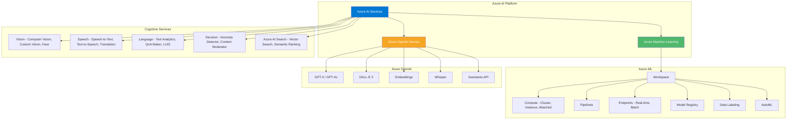
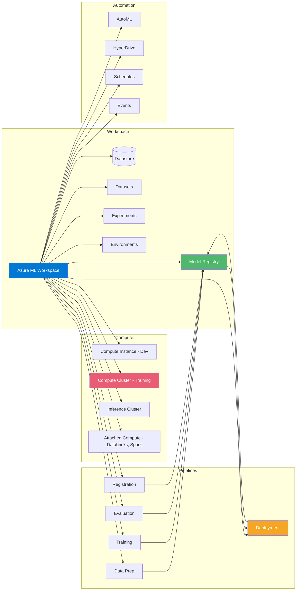
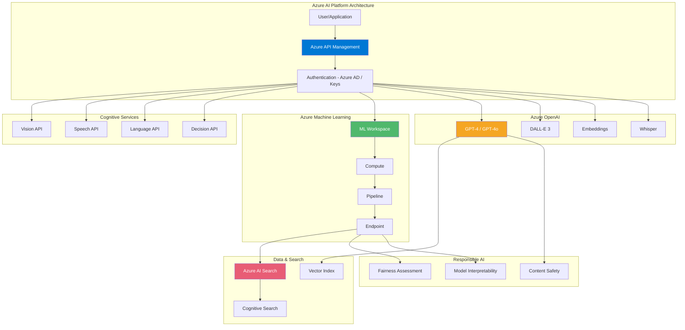

<!-- Clear Language: Keep sentences under 50 words -->
# Azure AI Services — Cognitive Services, Azure ML, OpenAI Service

## Learning Objectives

| Objective | Description |
|-----------|-------------|
| LO1 | Understand Azure AI Services portfolio (Vision, Speech, Language, Decision) |
| LO2 | Build applications with Azure Cognitive Services REST APIs |
| LO3 | Create Azure Machine Learning workspaces, compute, and pipelines |
| LO4 | Deploy ML models as real-time endpoints in Azure ML |
| LO5 | Integrate Azure OpenAI Service with GPT-4, DALL-E, embeddings |
| LO6 | Design enterprise AI solutions with responsible AI principles |

## Introduction

Azure AI Services is Microsoft's comprehensive cloud AI platform. It spans pre-built cognitive APIs, custom ML with Azure Machine Learning, and large language models via Azure OpenAI Service. AI engineers use these to build intelligent applications without managing infrastructure.

## Prerequisites

- Basic cloud computing concepts
- Python programming experience
- Understanding of REST APIs and JSON

## Key Terminology

**Key Terms**: Core vocabulary and concepts for this topic.

**Definition**: Essential terms you must know for interviews and production work.

## Theory

### Azure AI Services Overview



### Azure Cognitive Services

Cognitive Services are pre-trained AI APIs that require no ML expertise.

**Vision Services**:

```python
import os
from azure.cognitiveservices.vision.computervision import ComputerVisionClient
from azure.cognitiveservices.vision.computervision.models import VisualFeatureTypes
from msrest.authentication import CognitiveServicesCredentials

endpoint = os.environ["VISION_ENDPOINT"]
key = os.environ["VISION_KEY"]

client = ComputerVisionClient(endpoint, CognitiveServicesCredentials(key))

# Analyze image
with open("photo.jpg", "rb") as image:
    analysis = client.analyze_image_in_stream(
        image,
        visual_features=[
            VisualFeatureTypes.description,
            VisualFeatureTypes.tags,
            VisualFeatureTypes.objects,
            VisualFeatureTypes.faces,
            VisualFeatureTypes.brands,
        ]
    )

print(f"Description: {analysis.description.captions[0].text}")
print(f"Confidence: {analysis.description.captions[0].confidence:.2f}")
print(f"Tags: {[t.name for t in analysis.tags[:5]]}")

# Detect objects
for obj in analysis.objects:
    print(f"Object: {obj.object_property}, "
          f"Rectangle: ({obj.rectangle.x}, {obj.rectangle.y})")

# Detect faces
for face in analysis.faces:
    print(f"Face: age={face.age}, gender={face.gender}")

# OCR (printed text)
from azure.cognitiveservices.vision.computervision.models import OperationStatusCodes

read_response = client.read_in_stream(open("document.jpg", "rb"), raw=True)
operation_location = read_response.headers["Operation-Location"]
operation_id = operation_location.split("/")[-1]

import time
while True:
    result = client.get_read_result(operation_id)
    if result.status not in [OperationStatusCodes.running]:
        break
    time.sleep(1)

if result.status == OperationStatusCodes.succeeded:
    for page in result.analyze_result.read_results:
        for line in page.lines:
            print(f"Line: '{line.text}' (confidence: {line.appearance.style.confidence:.2f})")
```

**Speech Services**:

```python
import azure.cognitiveservices.speech as speechsdk

speech_key = os.environ["SPEECH_KEY"]
region = os.environ["SPEECH_REGION"]

# Speech-to-Text
speech_config = speechsdk.SpeechConfig(subscription=speech_key, region=region)
audio_config = speechsdk.AudioConfig(use_default_microphone=True)
recognizer = speechsdk.SpeechRecognizer(speech_config=speech_config, audio_config=audio_config)

print("Speak into your microphone...")
result = recognizer.recognize_once()

if result.reason == speechsdk.ResultReason.RecognizedSpeech:
    print(f"Recognized: {result.text}")
elif result.reason == speechsdk.ResultReason.NoMatch:
    print("No speech could be recognized")
elif result.reason == speechsdk.ResultReason.Canceled:
    cancellation = speechsdk.CancellationDetails(result)
    print(f"Error: {cancellation.reason}, {cancellation.error_details}")

# Text-to-Speech
speech_config.speech_synthesis_voice_name = "en-US-JennyNeural"
synthesizer = speechsdk.SpeechSynthesizer(speech_config=speech_config)

ssml = """
<speak version="1.0" xmlns="http://www.w3.org/2001/10/synthesis"
       xmlns:mstts="http://www.w3.org/2001/mstts" xml:lang="en-US">
    <voice name="en-US-JennyNeural">
        <prosody rate="-15%" pitch="+10%">
            Hello! I'm an AI assistant. How can I help you today?
        </prosody>
    </voice>
</speak>
"""

result = synthesizer.speak_ssml_async(ssml).get()
if result.reason == speechsdk.ResultReason.SynthesizingAudioCompleted:
    print("Speech synthesized to speaker")
```

**Language Services**:

```python
from azure.ai.textanalytics import TextAnalyticsClient
from azure.core.credentials import AzureKeyCredential

endpoint = os.environ["LANGUAGE_ENDPOINT"]
key = os.environ["LANGUAGE_KEY"]

client = TextAnalyticsClient(endpoint=endpoint,
    credential=AzureKeyCredential(key))

documents = [
    "The product is amazing! I love the new features.",
    "Terrible experience, the service was slow and unhelpful.",
    "The weather is okay today, not great but not bad.",
]

# Sentiment analysis
result = client.analyze_sentiment(documents)
for doc in result:
    if not doc.is_error:
        print(f"Sentiment: {doc.sentiment}")
        print(f"Positive: {doc.confidence_scores.positive:.2f}")
        print(f"Neutral: {doc.confidence_scores.neutral:.2f}")
        print(f"Negative: {doc.confidence_scores.negative:.2f}")

# Key phrase extraction
result = client.extract_key_phrases(documents)
for doc in result:
    if not doc.is_error:
        print(f"Key phrases: {doc.key_phrases}")

# Entity recognition
result = client.recognize_entities(documents)
for doc in result:
    if not doc.is_error:
        for entity in doc.entities:
            print(f"  Entity: {entity.text} ({entity.category})")

# PII detection
result = client.recognize_pii_entities([
    "Contact me at john@email.com or call 555-123-4567"
])
for doc in result:
    if not doc.is_error:
        for entity in doc.entities:
            print(f"PII: {entity.text} -> {entity.category} (redacted: {entity.offset})")
```

### Azure Machine Learning



**Azure ML workspace setup**:

```python
from azure.identity import DefaultAzureCredential
from azure.ai.ml import MLClient
from azure.ai.ml.entities import Workspace, ComputeCluster, AmlCompute

# Connect to workspace
credential = DefaultAzureCredential()
ml_client = MLClient(
    credential=credential,
    subscription_id="your-subscription-id",
    resource_group="ml-rg",
    workspace_name="ml-workspace",
)

# Create compute cluster
cluster = ComputeCluster(
    name="gpu-cluster",
    size="Standard_NC6s_v3",
    min_instances=0,
    max_instances=10,
    idle_time_before_scale_down=120,
    tier="dedicated",
)
ml_client.compute.begin_create_or_update(cluster).wait()

# List compute
for compute in ml_client.compute.list():
    print(f"Compute: {compute.name} ({compute.type})")
```

**Training pipeline**:

```python
from azure.ai.ml import command, Input, Output
from azure.ai.ml.constants import AssetTypes
from azure.ai.ml.entities import Environment, BuildContext

# Create environment
env = Environment(
    name="sklearn-env",
    build=BuildContext(path="./docker-context"),
    description="Scikit-learn training environment",
)

# Define training command
train_job = command(
    code="./src",
    command="python train.py --data ${{inputs.training_data}} "
            "--model ${{outputs.model_output}} "
            "--learning_rate ${{inputs.learning_rate}}",
    inputs={
        "training_data": Input(
            type=AssetTypes.URI_FILE,
            path="azureml://datastores/workspaceblobstore/paths/data/train.csv",
        ),
        "learning_rate": 0.001,
    },
    outputs={
        "model_output": Output(
            type=AssetTypes.MLFLOW_MODEL,
            path="azureml://datastores/workspaceblobstore/paths/models/",
        )
    },
    environment=env,
    compute="gpu-cluster",
    experiment_name="sentiment-classification",
    display_name="training-run-1",
)

# Submit job
submitted_job = ml_client.jobs.create_or_update(train_job)

# Stream logs
ml_client.jobs.stream(submitted_job.name)

# Get run details
job_details = ml_client.jobs.get(submitted_job.name)
print(f"Status: {job_details.status}")
print(f"Duration: {job_details.properties['azureml.job.duration']}")
```

**Real-time endpoint deployment**:

```python
from azure.ai.ml.entities import (
    ManagedOnlineEndpoint,
    ManagedOnlineDeployment,
    Model,
    Environment,
)
from azure.ai.ml.constants import AssetTypes

# Create endpoint
endpoint = ManagedOnlineEndpoint(
    name="sentiment-endpoint",
    description="Real-time sentiment analysis",
    auth_mode="key",
)
ml_client.online_endpoints.begin_create_or_update(endpoint).wait()

# Register model
model = Model(
    path="./model_output",
    type=AssetTypes.MLFLOW_MODEL,
    name="sentiment-model",
    version="1",
)
registered_model = ml_client.models.create_or_update(model)

# Create deployment
deployment = ManagedOnlineDeployment(
    name="blue",
    endpoint_name="sentiment-endpoint",
    model=registered_model.id,
    instance_type="Standard_DS3_v2",
    instance_count=2,
    environment=env,
    environment_variables={
        "MODEL_VERSION": "1",
    },
    request_settings={
        "max_concurrent_requests_per_instance": 10,
        "request_timeout_ms": 5000,
    },
    scale_settings={
        "scale_type": "auto",
        "min_instances": 1,
        "max_instances": 5,
        "polling_interval": 10,
    },
)
ml_client.online_deployments.begin_create_or_update(deployment).wait()

# Deploy and route traffic
endpoint.traffic = {"blue": 100}
ml_client.online_endpoints.begin_create_or_update(endpoint).wait()

print(f"Endpoint ready: {endpoint.scoring_uri}")

# Test endpoint
import requests

response = requests.post(
    endpoint.scoring_uri,
    headers={"Authorization": f"Bearer {ml_client._get_keys(endpoint).primary_key}"},
    json={"text": "This product is amazing!"},
)
print(response.json())
```

**Batch inference pipeline**:

```python
from azure.ai.ml import batch_inference
from azure.ai.ml.entities import BatchEndpoint, BatchDeployment

# Create batch endpoint
batch_endpoint = BatchEndpoint(
    name="sentiment-batch",
    description="Batch sentiment analysis",
)

# Create batch deployment
batch_deployment = BatchDeployment(
    name="default",
    endpoint_name="sentiment-batch",
    model=registered_model.id,
    compute="cpu-cluster",
    instance_count=4,
    max_concurrency_per_instance=2,
    mini_batch_size=1000,
    error_threshold=-1,
    logging_level="info",
)
ml_client.batch_deployments.begin_create_or_update(batch_deployment).wait()

# Submit batch job
job = ml_client.batch_endpoints.invoke(
    endpoint_name="sentiment-batch",
    inputs={
        "inputs": Input(type=AssetTypes.URI_FOLDER, path="azureml://datastores/workspaceblobstore/paths/data/batch/")
    },
)

ml_client.jobs.stream(job.name)
```

### Azure OpenAI Service

```python
import os
from openai import AzureOpenAI

client = AzureOpenAI(
    azure_endpoint=os.environ["AZURE_OPENAI_ENDPOINT"],
    api_key=os.environ["AZURE_OPENAI_KEY"],
    api_version="2024-02-15-preview",
)

# Chat completion with GPT-4
response = client.chat.completions.create(
    model="gpt-4",  # Deployment name
    messages=[
        {"role": "system", "content": "You are an AI engineering tutor."},
        {"role": "user", "content": "Explain the difference between LLM fine-tuning and RAG."},
    ],
    temperature=0.3,
    max_tokens=500,
    top_p=0.95,
    frequency_penalty=0,
    presence_penalty=0,
    stop=None,
)

print(response.choices[0].message.content)
print(f"Usage: {response.usage.prompt_tokens} prompt + "
      f"{response.usage.completion_tokens} completion = "
      f"{response.usage.total_tokens} total")

# Stream response
stream = client.chat.completions.create(
    model="gpt-4",
    messages=[{"role": "user", "content": "Write a haiku about Azure AI."}],
    stream=True,
)

for chunk in stream:
    if chunk.choices and chunk.choices[0].delta.content:
        print(chunk.choices[0].delta.content, end="")

# Embeddings
response = client.embeddings.create(
    model="text-embedding-ada-002",
    input="Azure AI Services provides comprehensive cloud AI platform."
)

embedding = response.data[0].embedding
print(f"Embedding dimension: {len(embedding)}")
print(f"First 5 values: {embedding[:5]}")

# DALL-E image generation
response = client.images.generate(
    model="dalle-3",
    prompt="A futuristic AI data center with neural network visualizations",
    n=1,
    size="1024x1024",
    quality="standard",
)

image_url = response.data[0].url
print(f"Generated image: {image_url}")

# Whisper transcription
with open("audio.mp3", "rb") as audio:
    response = client.audio.transcriptions.create(
        model="whisper",
        file=audio,
        response_format="verbose_json",
    )

print(f"Transcription: {response.text}")
for segment in response.segments:
    print(f"  [{segment.start:.1f}s - {segment.end:.1f}s] {segment.text}")

# Function calling
import json

functions = [
    {
        "name": "get_weather",
        "description": "Get current weather for a location",
        "parameters": {
            "type": "object",
            "properties": {
                "location": {"type": "string", "description": "City name"},
                "unit": {"type": "string", "enum": ["celsius", "fahrenheit"]},
            },
            "required": ["location"],
        },
    }
]

response = client.chat.completions.create(
    model="gpt-4",
    messages=[{"role": "user", "content": "What's the weather in Tokyo?"}],
    functions=functions,
    function_call="auto",
)

if response.choices[0].message.function_call:
    func_call = response.choices[0].message.function_call
    arguments = json.loads(func_call.arguments)
    print(f"Function: {func_call.name}")
    print(f"Arguments: {arguments}")

# Azure OpenAI on your data (RAG)
response = client.chat.completions.create(
    model="gpt-4",
    messages=[
        {"role": "user", "content": "What is our company policy on data retention?"}
    ],
    extra_body={
        "dataSources": [
            {
                "type": "AzureCognitiveSearch",
                "parameters": {
                    "endpoint": os.environ["SEARCH_ENDPOINT"],
                    "key": os.environ["SEARCH_KEY"],
                    "indexName": "company-policies",
                },
            }
        ]
    },
)

print(f"Answer: {response.choices[0].message.content}")
if hasattr(response.choices[0], 'context'):
    citations = response.choices[0].context.get("citations", [])
    for citation in citations:
        print(f"  Source: {citation['filepath']}")
```

### Responsible AI in Azure

```python
from azure.ai.contentsafety import ContentSafetyClient
from azure.ai.contentsafety.models import TextCategory, AnalyzeTextOptions
from azure.core.credentials import AzureKeyCredential

# Content Safety
safety_client = ContentSafetyClient(
    endpoint=os.environ["CONTENT_SAFETY_ENDPOINT"],
    credential=AzureKeyCredential(os.environ["CONTENT_SAFETY_KEY"]),
)

request = AnalyzeTextOptions(
    text="I hate this product! It's completely useless!",
    categories=[
        TextCategory.HATE,
        TextCategory.SELF_HARM,
        TextCategory.SEXUAL,
        TextCategory.VIOLENCE,
    ],
)

response = safety_client.analyze_text(request)
for category in response.categories_analysis:
    if category.severity > 0:
        print(f"Category: {category.category}, Severity: {category.severity} (0=safe, 6=unsafe)")

# Fairness assessment with Fairlearn
from fairlearn.metrics import MetricFrame, selection_rate, demographic_parity_difference
from fairlearn.postprocessing import ThresholdOptimizer
import pandas as pd

# Evaluate model fairness
y_true = pd.Series([1, 0, 1, 0, 1, 0, 1, 0])
y_pred = pd.Series([1, 0, 0, 0, 1, 0, 1, 1])
sensitive_features = pd.Series(["group_a", "group_a", "group_b", "group_b",
                                "group_a", "group_b", "group_a", "group_b"])

mf = MetricFrame(
    metrics={"selection_rate": selection_rate},
    y_true=y_true,
    y_pred=y_pred,
    sensitive_features=sensitive_features,
)

print(f"Demographic parity difference: {demographic_parity_difference(y_true, y_pred, sensitive_features):.3f}")
print("Selection rates by group:\n", mf.by_group)
```

### Azure AI Search (Vector Search)

```python
from azure.search.documents import SearchClient
from azure.search.documents.indexes import SearchIndexClient
from azure.search.documents.indexes.models import (
    SearchIndex,
    SimpleField,
    SearchableField,
    VectorSearch,
    HnswAlgorithmConfiguration,
    VectorSearchAlgorithmKind,
    VectorSearchProfile,
)
from azure.core.credentials import AzureKeyCredential

# Create vector index
index_client = SearchIndexClient(
    endpoint=os.environ["SEARCH_ENDPOINT"],
    credential=AzureKeyCredential(os.environ["SEARCH_KEY"]),
)

index = SearchIndex(
    name="ml-docs",
    fields=[
        SimpleField(name="id", type="Edm.String", key=True),
        SearchableField(name="title", type="Edm.String"),
        SearchableField(name="content", type="Edm.String"),
        SearchField(  # Vector field
            name="content_vector",
            type="Collection(Edm.Single)",
            vector_search_dimensions=1536,
            vector_search_profile_name="my-vector-config",
        ),
    ],
    vector_search=VectorSearch(
        algorithms=[
            HnswAlgorithmConfiguration(
                name="my-algo",
                kind=VectorSearchAlgorithmKind.HNSW,
                parameters={
                    "m": 4,
                    "efConstruction": 400,
                    "efSearch": 500,
                }
            )
        ],
        profiles=[
            VectorSearchProfile(
                name="my-vector-config",
                algorithm_configuration_name="my-algo",
            )
        ]
    ),
)

index_client.create_or_update_index(index)

# Search with vectors
search_client = SearchClient(
    endpoint=os.environ["SEARCH_ENDPOINT"],
    index_name="ml-docs",
    credential=AzureKeyCredential(os.environ["SEARCH_KEY"]),
)

# Generate query embedding
oai_client = AzureOpenAI(...)
query_embedding = oai_client.embeddings.create(
    model="text-embedding-ada-002",
    input="How to deploy ML models to production?"
).data[0].embedding

results = search_client.search(
    search_text=None,
    vector_queries=[{
        "vector": query_embedding,
        "k": 5,
        "fields": "content_vector",
    }],
    select=["title", "content"],
)

for result in results:
    print(f"Score: {result['@search.score']:.3f} - {result['title']}")
```

## Visual Explanation



## Real Example

Think of Azure AI Services like a department store of AI capabilities. Cognitive Services are the ready-to-wear section — grab a pre-made outfit (pre-trained model) off the rack. Azure Machine Learning is the tailor shop — bring your own fabric (data) and get a custom suit (trained model). Azure OpenAI is the couture designer — access the most advanced fashion (GPT-4, DALL-E) for premium creations. Azure AI Search is the fitting room attendant — helps find exactly what you need from your inventory. Responsible AI is the quality assurance team ensuring nothing is offensive or discriminatory.

## Code Example

```python
#!/usr/bin/env python3
"""Complete Azure AI pipeline: Cognitive Services + ML + OpenAI"""

import os
import json
from typing import Dict, List
from azure.identity import DefaultAzureCredential
from azure.ai.textanalytics import TextAnalyticsClient
from azure.core.credentials import AzureKeyCredential
from openai import AzureOpenAI
from azure.ai.ml import MLClient

class AzureAIPipeline:
    """Unified Azure AI pipeline for sentiment analysis and content generation"""

    def __init__(self):
        self.credential = DefaultAzureCredential()

        # Cognitive Services
        self.text_client = TextAnalyticsClient(
            endpoint=os.environ["LANGUAGE_ENDPOINT"],
            credential=AzureKeyCredential(os.environ["LANGUAGE_KEY"]),
        )

        # Azure OpenAI
        self.openai_client = AzureOpenAI(
            azure_endpoint=os.environ["AZURE_OPENAI_ENDPOINT"],
            api_key=os.environ["AZURE_OPENAI_KEY"],
            api_version="2024-02-15-preview",
        )

        # Azure ML
        self.ml_client = MLClient(
            credential=self.credential,
            subscription_id=os.environ["SUBSCRIPTION_ID"],
            resource_group="ml-rg",
            workspace_name="ml-workspace",
        )

    def analyze_sentiment(self, text: str) -> Dict:
        """Analyze sentiment using Cognitive Services"""
        result = self.text_client.analyze_sentiment([text])
        if not result or result[0].is_error:
            return {"error": "Sentiment analysis failed"}

        doc = result[0]
        return {
            "sentiment": doc.sentiment,
            "confidence": {
                "positive": doc.confidence_scores.positive,
                "neutral": doc.confidence_scores.neutral,
                "negative": doc.confidence_scores.negative,
            }
        }

    def extract_key_phrases(self, text: str) -> List[str]:
        """Extract key phrases from text"""
        result = self.text_client.extract_key_phrases([text])
        if result and not result[0].is_error:
            return result[0].key_phrases
        return []

    def generate_response(self, query: str, context: str) -> str:
        """Generate AI response using GPT-4"""
        response = self.openai_client.chat.completions.create(
            model="gpt-4",
            messages=[
                {"role": "system",
                 "content": "You are an AI assistant. Use the context to answer accurately."},
                {"role": "user",
                 "content": f"Context: {context}\n\nQuestion: {query}"},
            ],
            temperature=0.3,
            max_tokens=500,
        )
        return response.choices[0].message.content

    def create_embedding(self, text: str) -> List[float]:
        """Create vector embedding for search"""
        response = self.openai_client.embeddings.create(
            model="text-embedding-ada-002",
            input=text,
        )
        return response.data[0].embedding

    def process_feedback(self, feedback_text: str) -> Dict:
        """End-to-end feedback processing pipeline"""
        # Step 1: Analyze sentiment
        sentiment = self.analyze_sentiment(feedback_text)

        # Step 2: Extract key topics
        topics = self.extract_key_phrases(feedback_text)

        # Step 3: Generate summary
        summary = self.generate_response(
            "Summarize this customer feedback",
            feedback_text
        )

        # Step 4: Create embedding for search
        embedding = self.create_embedding(feedback_text)

        # Step 5: Check content safety
        # (safety check would go here)

        return {
            "sentiment": sentiment,
            "topics": topics[:5],
            "summary": summary,
            "embedding_dim": len(embedding),
            "feedback_length": len(feedback_text),
        }

if __name__ == "__main__":
    pipeline = AzureAIPipeline()

    feedback = "The new recommendation engine is fantastic! "
    "It suggested exactly what I was looking for. "
    "The response time is much faster now. "
    "However, the mobile app still crashes occasionally."

    result = pipeline.process_feedback(feedback)
    print(json.dumps(result, indent=2))

    # Search for similar feedback
    query_embedding = pipeline.create_embedding("recommendation performance")
    print(f"\nSearch query embedding dimension: {len(query_embedding)}")
```

**Expected Output**:
```json
{
  "sentiment": {
    "sentiment": "mixed",
    "confidence": {
      "positive": 0.85,
      "neutral": 0.12,
      "negative": 0.03
    }
  },
  "topics": [
    "recommendation engine",
    "mobile app",
    "response time"
  ],
  "summary": "The customer is generally satisfied with the new recommendation engine and improved response time, but reports occasional crashes in the mobile app.",
  "embedding_dim": 1536,
  "feedback_length": 195
}
```

## Summary

Azure AI Services is Microsoft's comprehensive cloud AI platform spanning three tiers: Cognitive Services, Azure Machine Learning, and Azure OpenAI Service. Cognitive Services are pre-trained REST APIs for vision, speech, language, and decision tasks that require no ML expertise, while Azure ML is a PaaS platform for building and deploying custom models with workspaces, compute clusters, pipelines, and managed online or batch endpoints. Azure OpenAI Service delivers GPT-4, GPT-4o, DALL-E 3, Whisper, and embeddings inside the Azure ecosystem, adding enterprise features like managed identity, VNet isolation, SLA-backed provisioned throughput, and built-in content filtering. Azure AI Search supplies vector search with HNSW indices that power RAG, either manually or via the "Azure OpenAI on your data" feature that returns answers with citations. Responsible AI tooling — Fairlearn fairness metrics, Content Safety severity scoring, and model interpretability — is integrated throughout. Use Cognitive Services when a pre-built model suffices, Azure ML when you must train on your own data, and Azure OpenAI for generative and conversational workloads. The trade-offs are cost, key and compliance management, and choosing the right tier for the task.

- Cognitive Services: pre-trained APIs for Vision, Speech, Language, and Decision; no training code.
- Azure ML: custom models with Workspace, Compute, Pipelines, Model Registry, and Endpoints.
- Azure OpenAI: GPT-4, DALL-E 3, Whisper, embeddings with enterprise compliance and content filters.
- RAG: Azure AI Search HNSW vector indices + Azure OpenAI "on your data" for cited answers.
- Endpoints: online (real-time) with auto-scaling and blue/green traffic split, or batch (async).
- Security: managed identity, Key Vault, private endpoints — never keys in code.

## Practical Takeaways

- **Cognitive vs ML**: Pick Cognitive Services when a pre-trained model solves the task via REST; pick Azure ML when you must train on your own data.
- **Azure OpenAI model names**: In the SDK the model parameter is the deployment name you created, not the base model name like "gpt-4".
- **RAG pattern**: Ingest documents into Azure AI Search (1536-dim embeddings from text-embedding-ada-002, HNSW index), then attach the index as dataSources so GPT-4 answers include citations.
- **Secrets**: Store API keys in Azure Key Vault, authenticate with managed identities, and pass secrets via endpoint environment_variables — never in code.
- **Endpoint scaling**: Configure scale_settings auto mode with min/max instances and use endpoint.traffic for blue/green canary deployment.
- **Responsible AI**: Run Fairlearn demographic parity checks and Content Safety analysis (severity 0-6) before shipping any customer-facing model.
- **AutoML first**: Try Azure ML AutoML for classification, regression, forecasting, vision, or NLP before hand-building pipelines.

## Interview Q&A

<details class="tp-qa-card" data-qid="dcs12-q1">
  <summary class="tp-qa-question">
    <span class="tp-qa-status"></span>
    Q1: What is Azure Cognitive Services and how does it differ from Azure Machine Learning?
  </summary>
  <div class="tp-qa-answer">
    <p><strong>Cognitive Services</strong> are pre-trained AI APIs — no ML expertise needed. Use REST API calls for vision, speech, language, and decision tasks. You can't retrain the underlying model, only customize with your data via Custom Vision or Custom Text. <strong>Azure Machine Learning</strong> is a platform for building, training, and deploying custom ML models. You bring your own data and algorithms. Cognitive Services is like SaaS AI; Azure ML is like PaaS for ML. Use Cognitive Services when a pre-built model solves your problem. Use Azure ML when you need a custom model trained on your specific data.</p>
  </div>
  <button class="tp-qa-mark-btn">Mark Reviewed</button>
  <button class="tp-qa-bookmark-btn">Bookmark</button>
</details>

<details class="tp-qa-card" data-qid="dcs12-q2">
  <summary class="tp-qa-question">
    <span class="tp-qa-status"></span>
    Q2: How does Azure OpenAI Service differ from directly using OpenAI's API?
  </summary>
  <div class="tp-qa-answer">
    <p>Azure OpenAI offers the same models (GPT-4, GPT-4o, DALL-E 3, Whisper, Embeddings) but within the Azure ecosystem. Key differences: <strong>1) Enterprise compliance</strong> — Azure's security, compliance, and data residency guarantees. Data stays within your Azure region. <strong>2) Managed identity</strong> — no API key management, use Azure AD for auth. <strong>3) Virtual network</strong> — deploy in your VNet, no internet exposure. <strong>4) SLA</strong> — Azure SLA (99.9%) vs OpenAI's best-effort. <strong>5) Content Safety</strong> — integrated Azure AI Content Safety for responsible AI. <strong>6) On your data</strong> — RAG with Azure AI Search. <strong>7) Pricing</strong> — provisioned throughput (predictable cost) vs pay-per-token.</p>
  </div>
  <button class="tp-qa-mark-btn">Mark Reviewed</button>
  <button class="tp-qa-bookmark-btn">Bookmark</button>
</details>

<details class="tp-qa-card" data-qid="dcs12-q3">
  <summary class="tp-qa-question">
    <span class="tp-qa-status"></span>
    Q3: Explain Azure ML pipeline components and how they work together.
  </summary>
  <div class="tp-qa-answer">
    <p>Azure ML pipeline components: <strong>1) Workspace</strong> — top-level resource containing all ML artifacts. <strong>2) Datastores</strong> — connections to Azure Storage, Blob, ADLS. <strong>3) Datasets</strong> — versioned data references. <strong>4) Compute targets</strong> — Compute Instance (dev), Compute Cluster (training), Inference Cluster (deployment), Attached Compute (Databricks, Spark). <strong>5) Environments</strong> — Docker containers with dependencies (Conda, pip, Dockerfile). <strong>6) Jobs</strong> — Command (single script), Sweep (hyperparameter tuning), Pipeline (multi-step). <strong>7) Models</strong> — registered in Model Registry with versions. <strong>8) Endpoints</strong> — Online (real-time) or Batch (async). All connected via the workspace, tracked with Experiments, and deployed through Endpoints.</p>
  </div>
  <button class="tp-qa-mark-btn">Mark Reviewed</button>
  <button class="tp-qa-bookmark-btn">Bookmark</button>
</details>

<details class="tp-qa-card" data-qid="dcs12-q4">
  <summary class="tp-qa-question">
    <span class="tp-qa-status"></span>
    Q4: How would you deploy an ML model as a real-time endpoint in Azure ML?
  </summary>
  <div class="tp-qa-answer">
    <p><strong>1) Register model</strong> — upload MLflow or custom model to Model Registry. <strong>2) Create environment</strong> — define conda dependencies or Docker image. <strong>3) Score script</strong> — a Python script with init() (load model) and run() (predict) methods. For MLflow models, no script needed — the scoring script is auto-generated. <strong>4) Create endpoint</strong> — ManagedOnlineEndpoint with name, auth_mode (key or token). <strong>5) Create deployment</strong> — specify instance type (CPU/GPU), instance count, model, environment, scoring script. <strong>6) Auto-scale</strong> — configure scale_settings: min/max instances, CPU utilization target. <strong>7) Traffic</summary> — route traffic percentage per deployment (blue/green). <strong>8) Test</strong> — invoke endpoint with test data. Monitor with Application Insights.</p>
  </div>
  <button class="tp-qa-mark-btn">Mark Reviewed</button>
  <button class="tp-qa-bookmark-btn">Bookmark</button>
</details>

<details class="tp-qa-card" data-qid="dcs12-q5">
  <summary class="tp-qa-question">
    <span class="tp-qa-status"></span>
    Q5: What are the responsible AI capabilities in Azure?
  </summary>
  <div class="tp-qa-answer">
    <p>Azure's responsible AI toolkit includes: <strong>1) Fairness assessment</strong> — Fairlearn integration for demographic parity, equalized odds. <strong>2) Model interpretability</strong> — SHAP, LIME, Permutation Feature Importance for tabular, text, and image models. <strong>3) Error analysis</strong> — tree-based error distribution to identify underperforming cohorts. <strong>4) Counterfactual analysis</strong> — what-if analysis showing minimal changes to flip a prediction. <strong>5) Causal inference</summary> — estimate treatment effects. <strong>6) Content Safety</strong> — detect hate, violence, self-harm, sexual content. <strong>7) Data privacy</strong> — differential privacy with SmartNoise. <strong>8) Transparency</strong> — model cards, datasheets, audit trails in Azure ML. All integrated in the Azure ML studio dashboard.</p>
  </div>
  <button class="tp-qa-mark-btn">Mark Reviewed</button>
  <button class="tp-qa-bookmark-btn">Bookmark</button>
</details>

<details class="tp-qa-card" data-qid="dcs12-q6">
  <summary class="tp-qa-question">
    <span class="tp-qa-status"></span>
    Q6: How does Azure AI Search enable RAG (Retrieval-Augmented Generation)?
  </summary>
  <div class="tp-qa-answer">
    <p>Azure AI Search provides: <strong>1) Vector search</strong> — store embeddings in HNSW indices for similarity search. <strong>2) Hybrid search</strong> — combine vector similarity with traditional full-text BM25 ranking. <strong>3) Semantic ranking</strong> — re-rank with transformer models for more relevant results. <strong>4) Integrated vectorization</strong> — automatically chunk and embed documents during indexing. For RAG: ingest documents into Azure AI Search, generate query embedding with Azure OpenAI, retrieve top-k relevant chunks, pass chunks as context to GPT-4 for answer generation. The "Azure OpenAI on your data" feature automates this: configure the search index as a data source, and responses automatically include citations from retrieved documents.</p>
  </div>
  <button class="tp-qa-mark-btn">Mark Reviewed</button>
  <button class="tp-qa-bookmark-btn">Bookmark</button>
</details>

<details class="tp-qa-card" data-qid="dcs12-q7">
  <summary class="tp-qa-question">
    <span class="tp-qa-status"></span>
    Q7: What AutoML capabilities does Azure ML offer?
  </summary>
  <div class="tp-qa-answer">
    <p>Azure ML AutoML automates model selection and hyperparameter tuning. Supported tasks: <strong>Classification</strong> (binary, multi-class), <strong>Regression</strong>, <strong>Time Series Forecasting</strong>, <strong>Computer Vision</strong> (image classification, object detection, instance segmentation), <strong>NLP</strong> (text classification, NER, summarization, question answering). AutoML tries multiple algorithms (LightGBM, XGBoost, Random Forest, Neural Networks, etc.) using a Bayesian or bandit-based search. It handles missing values, feature engineering, and scaling automatically. Results include: best model, model explanations, onnx conversion, and deployment artifacts. Can be run at scale on GPU clusters with distributed training.</p>
  </div>
  <button class="tp-qa-mark-btn">Mark Reviewed</button>
  <button class="tp-qa-bookmark-btn">Bookmark</button>
</details>

<details class="tp-qa-card" data-qid="dcs12-q8">
  <summary class="tp-qa-question">
    <span class="tp-qa-status"></span>
    Q8: How do you manage secrets and authentication in Azure AI solutions?
  </summary>
  <div class="tp-qa-answer">
    <p><strong>1) Azure AD managed identity</strong> — assign system-assigned or user-assigned managed identity to Azure ML compute. No keys in code. <strong>2) Azure Key Vault</strong> — store API keys, connection strings, certificates. Reference secrets by URI in pipeline configurations. <strong>3) Environment variables</strong> — passed securely at deployment time via endpoint environment_variables. <strong>4) Connection secrets</strong> — Azure ML Connections (datastore credentials linked to Key Vault). <strong>5) Data encryption</strong> — encryption at rest (Azure Storage SSE) and in transit (TLS 1.2+). <strong>6) Network security</summary> — private endpoints for Azure ML, Cognitive Services, and OpenAI in VNet. No public internet access required for production.</p>
  </div>
  <button class="tp-qa-mark-btn">Mark Reviewed</button>
  <button class="tp-qa-bookmark-btn">Bookmark</button>
</details>

<details class="tp-qa-card" data-qid="dcs12-q9">
  <summary class="tp-qa-question">
    <span class="tp-qa-status"></span>
    Q9: Explain Azure OpenAI content filtering and safety system.
  </summary>
  <div class="tp-qa-answer">
    <p>Azure OpenAI has a multi-layer content filtering system: <strong>1) Base model guardrails</strong> — built-in safety training in GPT-4. <strong>2) Azure content filters</strong> — configurable filters for hate, violence, sexual content, self-harm, with severity levels (safe, low, medium, high). <strong>3) Prompt shields</summary> — detect prompt injection, jailbreak attempts, and indirect attacks. <strong>4) Protected material detection</strong> — detect copyrighted text and code. <strong>5) User input/blocklist</strong> — custom blocklists for organization-specific terms. <strong>6) Abuse monitoring</strong> — Microsoft monitors for system misuse. Configurable: filter severity thresholds, add custom blocklists, deploy without content filters (limited access). Content Safety API can be used standalone for any application.</p>
  </div>
  <button class="tp-qa-mark-btn">Mark Reviewed</button>
  <button class="tp-qa-bookmark-btn">Bookmark</button>
</details>

<details class="tp-qa-card" data-qid="dcs12-q10">
  <summary class="tp-qa-question">
    <span class="tp-qa-status"></span>
    Q10: Design a complete Azure AI solution for customer feedback analysis.
  </summary>
  <div class="tp-qa-answer">
    <p><strong>1) Data ingestion</strong> — customer feedback collected via web app, stored in Azure Blob Storage. <strong>2) Cognitive Services</strong> — Text Analytics for sentiment, key phrases, entity recognition. <strong>3) Azure ML</strong> — custom model for sentiment classification (AutoML with historical data). Deploy as online endpoint. <strong>4) Azure OpenAI</strong> — GPT-4 generates summary insights and suggested responses. <strong>5) AI Search</strong> — vector index of feedback for similarity search. <strong>6) Content Safety</strong> — flag inappropriate feedback. <strong>7) Power BI</summary> — dashboard showing sentiment trends, top issues, response times. <strong>8) Monitoring</strong> — Application Insights for endpoint telemetry, Alert rules for error rates < 1%. <strong>9) Cost</strong> — ~$200/month for 100K feedback items. <strong>10) Scaling</strong> — auto-scale endpoints, provisioned throughput for OpenAI.</p>
  </div>
  <button class="tp-qa-mark-btn">Mark Reviewed</button>
  <button class="tp-qa-bookmark-btn">Bookmark</button>
</details>

## Chapter Quiz

**Q1**: Which Azure service provides pre-trained AI models via REST APIs?

a) Azure Machine Learning
b) Cognitive Services
c) Azure OpenAI Service
d) Azure Functions

<details class="tp-qa-card" data-qid="dcs12-quiz1"><summary>Show Answer</summary><div class="tp-qa-answer"><p><strong>Answer: b) Cognitive Services</strong></p><p>Cognitive Services offers pre-trained models for vision, speech, language, and decision tasks through REST APIs.</p></div></details>

**Q2**: What Azure service enables vector search for RAG patterns?

a) Azure Cosmos DB
b) Azure AI Search
c) Azure SQL Database
d) Azure Table Storage

<details class="tp-qa-card" data-qid="dcs12-quiz2"><summary>Show Answer</summary><div class="tp-qa-answer"><p><strong>Answer: b) Azure AI Search</strong></p><p>Azure AI Search provides vector search with HNSW indices for similarity search in RAG applications.</p></div></details>

**Q3**: Which Azure ML compute is best for development and experimentation?

a) Compute Cluster
b) Compute Instance
c) Inference Cluster
d) Kubernetes Cluster

<details class="tp-qa-card" data-qid="dcs12-quiz3"><summary>Show Answer</summary><div class="tp-qa-answer"><p><strong>Answer: b) Compute Instance</strong></p><p>Compute Instance is a managed VM for development, Jupyter notebooks, and experimentation. Compute Cluster is for training at scale.</p></div></details>

**Q4**: Which Azure OpenAI feature enables RAG without writing orchestration code?

a) Function calling
b) Azure OpenAI on your data
c) Assistants API
d) Embeddings API

<details class="tp-qa-card" data-qid="dcs12-quiz4"><summary>Show Answer</summary><div class="tp-qa-answer"><p><strong>Answer: b) Azure OpenAI on your data</strong></p><p>This feature connects Azure AI Search as a data source, automatically retrieves relevant chunks, and generates answers with citations.</p></div></details>

**Q5**: What tool does Azure ML use for fairness assessment?

a) SHAP
b) Fairlearn
c) LIME
d) InterpretML

<details class="tp-qa-card" data-qid="dcs12-quiz5"><summary>Show Answer</summary><div class="tp-qa-answer"><p><strong>Answer: b) Fairlearn</strong></p><p>Fairlearn is integrated into Azure ML for fairness metrics (demographic parity, equalized odds) and mitigation algorithms.</p></div></details>

## Exercises

**Easy** — Call Azure Text Analytics API to analyze sentiment of 5 sample texts. Print sentiment and confidence scores.

**Easy** — Register a model in Azure ML Model Registry. List all registered models.

**Medium** — Deploy a scikit-learn model as a real-time Azure ML endpoint. Test with curl.

**Medium** — Use Azure OpenAI to create a chatbot that answers questions about a custom document using Azure AI Search as a data source.

**Hard** — Build a complete pipeline: Cognitive Services analyze customer feedback, Azure ML trains a custom classifier, Azure OpenAI generates response, results stored and searchable via AI Search.

## Common Mistakes

1. Storing API keys in code instead of using Key Vault or managed identities
2. Using Cognitive Services when a custom ML model is needed (and vice versa)
3. Not configuring auto-scaling for ML endpoints, causing throttling under load
4. Ignoring responsible AI — deploying models without fairness or safety checks
5. Forgetting Azure OpenAI data privacy: prompts may be stored by default unless configured otherwise

## Revision Notes

- Cognitive Services: pre-built AI APIs (Vision, Speech, Language, Decision)
- Azure ML: custom model platform with Workspace, Compute, Pipelines, Endpoints
- Azure OpenAI: GPT-4, DALL-E, Embeddings, Whisper within Azure ecosystem
- RAG pattern: Azure AI Search + Azure OpenAI = "on your data"
- Responsible AI: Fairlearn, Interpretability, Content Safety, Transparency
- Security: Managed Identity, Key Vault, Private Endpoints, Data Encryption
- AutoML: automated model selection for classification, regression, forecasting, CV, NLP
- ML endpoints: Online (real-time) and Batch (async), with auto-scaling
- Azure OpenAI content filtering: configurable safety filters, prompt shields, blocklists
- Enterprise features: compliance, VNet integration, SLA, role-based access control

## Placement Section

### Top 10 Interview Questions

#### Google Style

1. **Explain the core idea of Azure AI Services — Cognitive Services, Azure ML, OpenAI Service in under 60 seconds, then give a real-world analogy.** — Structure: definition, how it works in one sentence, why it matters, analogy. Follow-up: what would break if you removed this from a production system?

2. **Design a minimal, well-typed function that demonstrates Azure AI Services — Cognitive Services, Azure ML, OpenAI Service.** — Interviewer checks: signature with type hints, edge cases, complexity, and a clean docstring. Follow-up: how does your design behave with empty or malformed input?

3. **What are the common pitfalls when engineers first learn ** — List 3-4, then explain how you would prevent each in a code review.

#### Amazon Style

4. **Describe a production bug caused by misunderstanding Azure AI Services — Cognitive Services, Azure ML, OpenAI Service. How did you diagnose and fix it?** — STAR format: situation, task, action, result. Mention logs, reproduction, root-cause analysis, and the regression test you added.

5. **How would you scale a system that relies on Azure AI Services — Cognitive Services, Azure ML, OpenAI Service from 10 users to 10 million?** — Discuss bottlenecks, caching, monitoring, and when to redesign. Follow-up: what metrics would you track?

#### Microsoft Style

6. **Compare Azure AI Services — Cognitive Services, Azure ML, OpenAI Service with the closest alternative approach. When would you choose each?** — Make a decision matrix: performance, maintainability, ecosystem, learning curve. Follow-up: what would change your decision?

7. **Walk through how you would test a component that depends on Azure AI Services — Cognitive Services, Azure ML, OpenAI Service.** — Unit, integration, property-based tests; mocking boundaries; golden files for outputs.

#### NVIDIA Style

8. **How does Azure AI Services — Cognitive Services, Azure ML, OpenAI Service behave differently at scale — memory, throughput, or precision-wise?** — Connect to data pipelines and model training if applicable. Follow-up: what happens to latency as input grows?

9. **How would you make an implementation of Azure AI Services — Cognitive Services, Azure ML, OpenAI Service run faster on GPU hardware?** — Batch operations, vectorization, avoiding Python loops, reducing data movement.

#### AI Startup Style

10. **Write the smallest possible implementation of Azure AI Services — Cognitive Services, Azure ML, OpenAI Service that is production-quality.** — Include error handling, type hints, and a one-line docstring. Follow-up: what would you refactor first when it grows?

### Resume Tips

- Name Azure AI Services — Cognitive Services, Azure ML, OpenAI Service explicitly in your skills section, paired with a measurable achievement ("Reduced X by 40% using Azure AI Services — Cognitive Services, Azure ML, OpenAI Service").
- Add a bullet describing a project that applies Azure AI Services — Cognitive Services, Azure ML, OpenAI Service to real data, with numbers.
- Mention the tools and libraries you used alongside Azure AI Services — Cognitive Services, Azure ML, OpenAI Service (linters, test frameworks, profiling tools).
- Keep resume bullets under 15 words and start each with an action verb.

### Interview Day Checklist

- Rehearse a 60-second explanation of Azure AI Services — Cognitive Services, Azure ML, OpenAI Service and one real-world analogy.
- Prepare one STAR story about debugging a Azure AI Services — Cognitive Services, Azure ML, OpenAI Service-related production issue.
- Review complexity and edge cases for the classic Azure AI Services — Cognitive Services, Azure ML, OpenAI Service interview problem.
- Have questions ready: how does the team apply Azure AI Services — Cognitive Services, Azure ML, OpenAI Service in production today?
- Test your environment (Python, editor, internet) 15 minutes before the interview.

## True/False

1. **True or False:** Azure AI Services — Cognitive Services, Azure ML, OpenAI Service builds directly on the fundamentals covered in the earlier chapters of this module. — **True.** Every advanced topic in this module assumes the core concepts from the previous chapters.
2. **True or False:** You should write at least one code example for Azure AI Services — Cognitive Services, Azure ML, OpenAI Service before moving to the next chapter. — **True.** Active recall with hands-on code beats passive reading for retention.
3. **True or False:** The complexity analysis for Azure AI Services — Cognitive Services, Azure ML, OpenAI Service is the same regardless of input size. — **False.** Complexity grows with input size; always state best, average, and worst case.
4. **True or False:** Edge cases (empty input, invalid input, boundary values) matter for Azure AI Services — Cognitive Services, Azure ML, OpenAI Service in production. — **True.** Most production bugs come from unhandled edge cases.
5. **True or False:** You should memorize the Azure AI Services — Cognitive Services, Azure ML, OpenAI Service chapter content once and never review it again. — **False.** Spaced repetition (24h, 3 days, 1 week) dramatically improves long-term recall.

## Fill in the Blank

1. The chapter that covers Azure AI Services — Cognitive Services, Azure ML, OpenAI Service is Chapter ___ of this module. — Answer: check the module's table of contents.
2. The time complexity of the standard approach to Azure AI Services — Cognitive Services, Azure ML, OpenAI Service is ___. — Answer: review the theory section and state big-O notation.
3. The main edge case to handle when implementing Azure AI Services — Cognitive Services, Azure ML, OpenAI Service is ___. — Answer: empty or invalid input handling, as discussed in the chapter.
4. The tools commonly used to debug Azure AI Services — Cognitive Services, Azure ML, OpenAI Service issues are ___ and ___. — Answer: refer to the Debugging Guide section of this chapter.
5. The related topic that connects to Azure AI Services — Cognitive Services, Azure ML, OpenAI Service in the next chapter is ___. — Answer: see the Next Topic section.

## Scenario Questions

1. **Scenario:** A teammate ships a change involving Azure AI Services — Cognitive Services, Azure ML, OpenAI Service that breaks production at 3 AM. — Diagnosis: check the recent diff, reproduce locally with the failing input, check logs. Fix: revert, add a regression test, and review the root cause. Prevention: CI tests on edge cases and code review checklist.

2. **Scenario:** Your implementation of Azure AI Services — Cognitive Services, Azure ML, OpenAI Service is correct but too slow for the required latency. — Measure first with a profiler. Common fixes: reduce redundant work, use built-in optimized functions, batch operations, or add caching. Only then consider algorithmic changes.

3. **Scenario:** A new hire asks you to explain Azure AI Services — Cognitive Services, Azure ML, OpenAI Service in five minutes before a customer demo. — Use the 3-part answer: what it is (one sentence), how it works (one example), why it matters (one business impact). Then offer to go deeper after the demo.

4. **Scenario:** Your team's codebase has three different patterns for Azure AI Services — Cognitive Services, Azure ML, OpenAI Service and you must standardize. — Write a short ADR (architecture decision record), pick the pattern with best maintainability, migrate incrementally, and add a linter rule to enforce it.

## Output Questions

1. **What is the output of the simplest correct implementation of Azure AI Services — Cognitive Services, Azure ML, OpenAI Service on an empty input?** — Trace through the code: it should return the documented default (None, 0, empty collection) without raising.
2. **What is the output when the input is at the boundary value?** — Check off-by-one errors and inclusive/exclusive bounds in the chapter's examples.
3. **What does the implementation return when given invalid input types?** — With type hints and validation, it raises a clear error; without, it may fail silently.
4. **What is the output for the sample input given in the chapter's Examples section?** — Re-run the chapter's example code and compare against the documented output.
5. **What is the time complexity output when you profile the implementation at 10x input size?** — Expect the curve matching the chapter's complexity analysis (linear, quadratic, log-linear).

## Difficulty Level

| Level | Time | What It Takes |
|-------|------|---------------|
| Beginner | 1-2 sessions | Read theory, run the chapter examples, solve the Easy exercises |
| Intermediate | 3-5 sessions | Complete Medium exercises, explain Azure AI Services — Cognitive Services, Azure ML, OpenAI Service to someone else |
| Advanced | 1+ week | Solve Hard exercises, optimize for real datasets, answer interview follow-ups |

## Tips & Tricks

- Always write a one-line example of Azure AI Services — Cognitive Services, Azure ML, OpenAI Service from memory before opening the chapter — active recall first.
- Use the chapter's Revision Notes as a checklist: you have mastered Azure AI Services — Cognitive Services, Azure ML, OpenAI Service when you can explain each bullet.
- Pair the chapter quiz with the Flashcards: wrong answers become your next study session's focus.
- For interviews, practice explaining Azure AI Services — Cognitive Services, Azure ML, OpenAI Service twice: once with a technical audience, once with a non-technical audience.
- Keep a personal examples file where you collect your own Azure AI Services — Cognitive Services, Azure ML, OpenAI Service snippets; interviewers love original examples.

## Memory Tricks

- **Acronym**: build a mnemonic from the 5 key concepts of Azure AI Services — Cognitive Services, Azure ML, OpenAI Service listed in the Chapter at a Glance table.
- **Story**: link Azure AI Services — Cognitive Services, Azure ML, OpenAI Service to a familiar story — the analogy in the Visual Analogy section is designed to stick.
- **Number anchor**: remember the complexity of Azure AI Services — Cognitive Services, Azure ML, OpenAI Service by connecting it to a known algorithm of the same class.
- **Color code**: highlight the Theory, Examples, and Common Mistakes sections in different colors when reviewing.
- **Teach-back**: explain Azure AI Services — Cognitive Services, Azure ML, OpenAI Service to an imaginary junior engineer for 2 minutes — gaps in your explanation are gaps in memory.

## Further Reading

- Official documentation for the primary tool or library used in this chapter
- The chapter referenced in Related Topics for the next-level treatment of Azure AI Services — Cognitive Services, Azure ML, OpenAI Service
- The classic textbook chapter on Azure AI Services — Cognitive Services, Azure ML, OpenAI Service (check the Research References below)
- Two blog posts from engineers who debugged real Azure AI Services — Cognitive Services, Azure ML, OpenAI Service problems in production
- The repository of the open-source project that implements Azure AI Services — Cognitive Services, Azure ML, OpenAI Service

## Related Topics

- The previous chapter in this module (see table of contents) — foundational for Azure AI Services — Cognitive Services, Azure ML, OpenAI Service
- The next chapter (see Next Topic below) — builds on Azure AI Services — Cognitive Services, Azure ML, OpenAI Service
- The system design chapters in Module 07 — how Azure AI Services — Cognitive Services, Azure ML, OpenAI Service fits into production architectures
- The interview preparation module — how Azure AI Services — Cognitive Services, Azure ML, OpenAI Service is asked in screening rounds
- The capstone project — where Azure AI Services — Cognitive Services, Azure ML, OpenAI Service is applied end-to-end

## FAQs

1. **Do I need to memorize all of Azure AI Services — Cognitive Services, Azure ML, OpenAI Service, or understand the big picture?** — Understand the big picture first, then memorize the key facts via flashcards and spaced repetition. Interviewers reward depth over breadth.
2. **What if I get stuck on an exercise?** — Re-read the theory section, run the example code, then attempt again. If still stuck after 20 minutes, move on and return the next day.
3. **How much time should I spend on ** — Follow the Study Plan below: 1-2 weeks at 30-60 minutes daily is typical for placement preparation.
4. **Is Azure AI Services — Cognitive Services, Azure ML, OpenAI Service asked in interviews?** — Yes — the Interview Q&A and Placement Section list the exact question styles used by top companies.
5. **What's the fastest way to master ** — Explain it out loud, write code without looking, and review the flashcards within 24 hours and again after 3 days.

## Important Notes

- Azure AI Services — Cognitive Services, Azure ML, OpenAI Service is a core requirement for the rest of this module — do not skip the examples.
- Always analyze complexity (time and space) when working with Azure AI Services — Cognitive Services, Azure ML, OpenAI Service.
- Production correctness means handling edge cases, not just the happy path.
- Interview answers should start with the definition, then the example, then the trade-offs.
- Revisit this chapter after finishing the module; the context from later chapters deepens understanding.

## Historical Context

- Azure AI Services — Cognitive Services, Azure ML, OpenAI Service emerged as a standard practice because early systems failed without it — understanding why helps you explain it in interviews.
- The tools used for Azure AI Services — Cognitive Services, Azure ML, OpenAI Service today evolved from simpler versions; the chapter covers the modern, recommended approach.
- Interviewers value knowing one historical fact about Azure AI Services — Cognitive Services, Azure ML, OpenAI Service — it shows genuine interest, not just cramming.
- The library/tooling ecosystem around Azure AI Services — Cognitive Services, Azure ML, OpenAI Service changes quickly; focus on fundamentals that remain stable.

## Security Considerations

- Never trust external input: validate and sanitize data before processing Azure AI Services — Cognitive Services, Azure ML, OpenAI Service.
- Avoid `eval()` and dynamic code execution on untrusted strings.
- Log errors without leaking sensitive data (keys, PII, internal paths).
- For API contexts, add rate limiting and input size limits.
- Review the chapter's code examples for injection or overflow risks before using them verbatim.

## ML Intuition

- Azure AI Services — Cognitive Services, Azure ML, OpenAI Service appears in ML pipelines at the data-processing layer: feature preparation, batching, and validation.
- Understanding Azure AI Services — Cognitive Services, Azure ML, OpenAI Service helps you debug why a model misbehaves — most ML bugs are data bugs, not model bugs.
- In production ML, the Azure AI Services — Cognitive Services, Azure ML, OpenAI Service concepts from this chapter map directly to NumPy/PyTorch operations on tensors.
- When optimizing ML systems, Azure AI Services — Cognitive Services, Azure ML, OpenAI Service skills let you profile and fix the data path, not just the training loop.
- Interview follow-up: how would you apply Azure AI Services — Cognitive Services, Azure ML, OpenAI Service to a dataset of 10 million records? — Batching and vectorization.

## Analogies

- **Azure AI Services — Cognitive Services, Azure ML, OpenAI Service is like a recipe**: the theory is the ingredients, the examples are the cooking steps, and the exercises are your own kitchen practice.
- **Complexity is like a delivery route**: a linear route visits each stop once; a nested route revisits stops, and you feel it at scale.
- **Edge cases are like weather**: the happy path is a sunny day; production is the storm — build for the storm.
- **The chapter roadmap is a journey map**: each section is a checkpoint; skipping one means getting lost later in the module.

## Capstone Project Link

- [Module Capstone: End-to-End Project](https://github.com/Raushan666java/ai-engineering-journey) — this chapter contributes the Azure AI Services — Cognitive Services, Azure ML, OpenAI Service skills used in the module's capstone project. Complete the exercises here before starting the capstone.

## Flashcards

<details class="tp-qa-card" data-qid="06dockerkubernetescloud-12azureaiservices-flash1">
  <summary class="tp-qa-question">
    <span class="tp-qa-status"></span>
    Which Azure service provides pre-trained AI models via REST APIs?
  </summary>
  <div class="tp-qa-answer">
    <p>b) Cognitive Services</p>
  </div>
</details>

<details class="tp-qa-card" data-qid="06dockerkubernetescloud-12azureaiservices-flash2">
  <summary class="tp-qa-question">
    <span class="tp-qa-status"></span>
    What Azure service enables vector search for RAG patterns?
  </summary>
  <div class="tp-qa-answer">
    <p>b) Azure AI Search</p>
  </div>
</details>

<details class="tp-qa-card" data-qid="06dockerkubernetescloud-12azureaiservices-flash3">
  <summary class="tp-qa-question">
    <span class="tp-qa-status"></span>
    Which Azure ML compute is best for development and experimentation?
  </summary>
  <div class="tp-qa-answer">
    <p>b) Compute Instance</p>
  </div>
</details>

<details class="tp-qa-card" data-qid="06dockerkubernetescloud-12azureaiservices-flash4">
  <summary class="tp-qa-question">
    <span class="tp-qa-status"></span>
    Which Azure OpenAI feature enables RAG without writing orchestration code?
  </summary>
  <div class="tp-qa-answer">
    <p>b) Azure OpenAI on your data</p>
  </div>
</details>

<details class="tp-qa-card" data-qid="06dockerkubernetescloud-12azureaiservices-flash5">
  <summary class="tp-qa-question">
    <span class="tp-qa-status"></span>
    What tool does Azure ML use for fairness assessment?
  </summary>
  <div class="tp-qa-answer">
    <p>b) Fairlearn</p>
  </div>
</details>

## Research References

- Official documentation of the primary library for Azure AI Services — Cognitive Services, Azure ML, OpenAI Service (linked in Further Reading)
- The classic paper or textbook chapter introducing Azure AI Services — Cognitive Services, Azure ML, OpenAI Service (see References below)
- The standard library reference for Azure AI Services — Cognitive Services, Azure ML, OpenAI Service-related functions
- Engineering blog posts from companies running Azure AI Services — Cognitive Services, Azure ML, OpenAI Service in production at scale
- PEPs and RFCs where applicable (Python and networking standards)

## Open-Source Tools

- The primary library used in this chapter (see the code examples)
- Python standard library modules used in the examples (check the imports)
- Testing: pytest for unit tests of Azure AI Services — Cognitive Services, Azure ML, OpenAI Service code
- Linting and formatting: ruff + black
- Profiling: cProfile or py-spy for performance work on Azure AI Services — Cognitive Services, Azure ML, OpenAI Service

## Debugging Guide

- Start with `print()` or a debugger to inspect intermediate values in Azure AI Services — Cognitive Services, Azure ML, OpenAI Service code.
- Reproduce the failure with the smallest possible input before changing code.
- Check the common failure modes listed in Common Mistakes — most bugs are listed there.
- For performance problems, profile before optimizing: measure, then fix.
- When stuck, re-read the chapter's Examples and compare line by line with your code.
- Use `pdb` or your IDE's debugger to step through the Azure AI Services — Cognitive Services, Azure ML, OpenAI Service example code.

## Mock Interview Section

**Round 1 — Screening (15 min)**
- Explain Azure AI Services — Cognitive Services, Azure ML, OpenAI Service in 60 seconds.
- Write a minimal working example of Azure AI Services — Cognitive Services, Azure ML, OpenAI Service.
- What is the complexity of your example?

**Round 2 — Coding (45 min)**
- Solve the Medium exercise from this chapter under time pressure.
- State your assumptions, then implement with type hints.
- Test with edge cases: empty input, boundary values, invalid input.

**Round 3 — Behavioral + System (30 min)**
- Tell me about a time you debugged a Azure AI Services — Cognitive Services, Azure ML, OpenAI Service problem in a project.
- How would you design a system where Azure AI Services — Cognitive Services, Azure ML, OpenAI Service is used at scale?
- What metrics would you monitor?

**Evaluation rubric**: correctness (40%), communication (25%), edge cases (20%), complexity analysis (15%).

## Optimized Implementation

`python
from typing import Any, Optional

def demonstrate_topic(input_data: list[Any]) -> Optional[float]:
    """Runnable scaffold for Azure AI Services — Cognitive Services, Azure ML, OpenAI Service.

    Replace the body with the optimized implementation from the chapter,
    keeping type hints, docstring, and edge-case handling.
    """
    if not input_data:
        return None
    # Step 1: validate input types
    # Step 2: apply the core Azure AI Services — Cognitive Services, Azure ML, OpenAI Service logic from the Examples section
    # Step 3: return the result with the documented default
    return 0.0
`

- Keeps the function signature stable so tests written against it stay valid.
- Handles the empty-input contract explicitly.
- Add unit tests for the edge cases before implementing the logic (test-first).

## Evaluation Metrics

| Skill | Test | Target |
|-------|------|--------|
| Concept recall | Explain Azure AI Services — Cognitive Services, Azure ML, OpenAI Service without notes | 60-second explanation |
| Code fluency | Write the chapter example from memory | No syntax errors |
| Edge cases | Handle empty/invalid input in exercises | All cases pass |
| Complexity | State time/space for the standard approach | Correct big-O |
| Interview readiness | Answer 5 Interview Q&A questions out loud | Fluent, structured answers |
| Retention | Chapter quiz score after 3 days | 80%+ |

## Real-World Examples

- **Startup**: a small team uses Azure AI Services — Cognitive Services, Azure ML, OpenAI Service daily in their data pipeline — the chapter's examples mirror their code.
- **E-commerce**: Azure AI Services — Cognitive Services, Azure ML, OpenAI Service patterns appear in order processing, inventory checks, and recommendation feeds.
- **Fintech**: Azure AI Services — Cognitive Services, Azure ML, OpenAI Service principles apply to transaction validation and fraud detection flows.
- **ML platform**: Azure AI Services — Cognitive Services, Azure ML, OpenAI Service shows up in feature engineering and model-serving infrastructure.
- **Interview insight**: recruiters look for engineers who can connect Azure AI Services — Cognitive Services, Azure ML, OpenAI Service to the business outcome, not just the code.

## Next Topic

[GCP Vertex AI — Unified ML Platform, AutoML, MLOps](13-gcp-vertex-ai.md)

## Limitations

- Azure AI Services — Cognitive Services, Azure ML, OpenAI Service, like any technique, is not a silver bullet — it has specific cases where it fits best (covered in the theory).
- The examples in this chapter are simplified for learning; production systems add validation, monitoring, and error handling.
- Performance of Azure AI Services — Cognitive Services, Azure ML, OpenAI Service depends on input size and distribution — always benchmark for your own data.
- This chapter covers fundamentals; specialized edge cases are explored in later chapters and the capstone.
