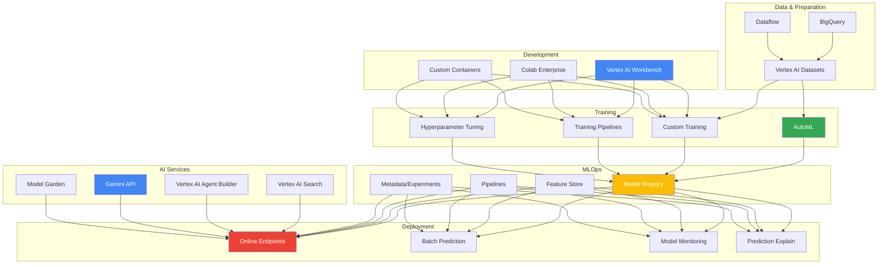
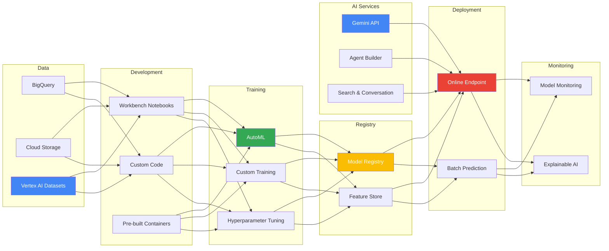

<!-- Clear Language: Keep sentences under 50 words -->
# GCP Vertex AI — Unified ML Platform, AutoML, MLOps

## Learning Objectives

| Objective | Description |
|-----------|-------------|
| LO1 | Navigate Vertex AI suite: Workbench, Training, Prediction, Pipelines |
| LO2 | Build AutoML models for tabular, image, text, and video data |
| LO3 | Implement custom training with pre-built and custom containers |
| LO4 | Deploy models to endpoints with autoscaling and monitoring |
| LO5 | Use Model Registry, Feature Store, and Pipelines for MLOps |
| LO6 | Build AI agents with Vertex AI Agent Builder and Gemini |

## Introduction

Vertex AI is Google Cloud's unified ML platform that combines AutoML, custom training, model deployment, and MLOps. It integrates with BigQuery, Dataflow, and other GCP services. AI engineers use Vertex AI to build end-to-end ML pipelines at scale.

## Prerequisites

- Basic cloud computing knowledge
- Python programming and ML fundamentals
- Familiarity with Docker containers

## Key Terminology

**Key Terms**: Core vocabulary and concepts for this topic.

**Definition**: Essential terms you must know for interviews and production work.

## Theory

### Vertex AI Suite Overview



### Vertex AI Workbench

```python
# Vertex AI Workbench provides Jupyter-based development environment
# Pre-installed with: TensorFlow, PyTorch, JAX, CUDA, cuDNN

# Check environment
import vertexai
from google.cloud import aiplatform

vertexai.init(project="my-project", location="us-central1")
print(f"Vertex AI version: {aiplatform.__version__}")

!gcloud config list project
!nvidia-smi  # Check GPU if using GPU instance
```

### Vertex AI Datasets

```python
from google.cloud import aiplatform

# Create tabular dataset from BigQuery
dataset = aiplatform.TabularDataset.create(
    display_name="customer_churn_data",
    gcs_source="gs://my-bucket/data/churn_data.csv",
    project="my-project",
    location="us-central1",
)

# Import from BigQuery
bq_dataset = aiplatform.TabularDataset.create(
    display_name="churn_from_bq",
    bq_source="bq://project.dataset.churn_table",
)

# Image dataset
image_dataset = aiplatform.ImageDataset.create(
    display_name="product_images",
    gcs_source="gs://my-bucket/images/*.csv",
    import_schema_uri=aiplatform.schema.dataset.ioformat.image.single_label_classification,
)

# Text dataset
text_dataset = aiplatform.TextDataset.create(
    display_name="customer_reviews",
    gcs_source="gs://my-bucket/reviews/*.jsonl",
    import_schema_uri=aiplatform.schema.dataset.ioformat.text.single_label_classification,
)
```

### AutoML Training

```python
from google.cloud import aiplatform

# AutoML Tabular classification
job = aiplatform.AutoMLTabularTrainingJob(
    display_name="churn_automl",
    optimization_prediction_type="classification",
    optimization_objective="maximize-au-roc",
    budget_milli_node_hours=1000,  # ~1 hour training
)

model = job.run(
    dataset=dataset,
    target_column="churned",
    training_fraction_split=0.8,
    validation_fraction_split=0.1,
    test_fraction_split=0.1,
    predefined_split_column_name=None,
    weight_column=None,
    budget_milli_node_hours=1000,
    disable_early_stopping=False,
    export_evaluated_data_items=True,
    export_evaluated_data_items_bigquery_destination="bq://project.dataset.evaluations",
)

print(f"Model: {model.resource_name}")
print(f"Model URI: {model.uri}")

# Evaluate
evaluation = model.evaluate()
for metric in evaluation.metrics:
    print(f"{metric.name}: {metric.value}")

# List model evaluations
eval_list = model.list_model_evaluations()
for ev in eval_list:
    print(f"AUC ROC: {ev.metrics['auRoc']}")
    print(f"Log Loss: {ev.metrics['logLoss']}")
    print(f"Precision/Recall: available at thresholds")

# AutoML Image classification
image_job = aiplatform.AutoMLImageTrainingJob(
    display_name="product_classifier",
    prediction_type="classification",
    multi_label=False,
    model_type="CLOUD",
    budget_milli_node_hours=20000,
)

image_model = image_job.run(
    dataset=image_dataset,
    model_display_name="product_classifier_v1",
    training_fraction_split=0.8,
    test_fraction_split=0.2,
)

# AutoML Text classification
text_job = aiplatform.AutoMLTextTrainingJob(
    display_name="sentiment_automl",
    prediction_type="classification",
)

text_model = text_job.run(
    dataset=text_dataset,
    model_display_name="sentiment_v1",
    training_fraction_split=0.8,
    validation_fraction_split=0.1,
    test_fraction_split=0.1,
)
```

### Custom Training

```python
from google.cloud import aiplatform
from google.cloud.aiplatform import training_jobs

# Custom container training
custom_job = training_jobs.CustomTrainingJob(
    display_name="custom_churn_model",
    container_uri="us-docker.pkg.dev/vertex-ai/training/tf-cpu.2-14:latest",
    model_serving_container_image_uri="us-docker.pkg.dev/vertex-ai/prediction/tf2-cpu.2-14:latest",
    project="my-project",
    location="us-central1",
    staging_bucket="gs://my-bucket/staging",
)

model = custom_job.run(
    script_path="trainer/train.py",  # Must include setup.py or requirements.txt
    model_display_name="custom_churn_v1",
    args=[
        "--data-dir", "gs://my-bucket/data/",
        "--epochs", "10",
        "--batch-size", "64",
        "--learning-rate", "0.001",
        "--model-dir", "gs://my-bucket/models/custom_churn_v1/",
    ],
    replica_count=1,
    machine_type="n1-standard-8",
    accelerator_type="NVIDIA_TESLA_T4",
    accelerator_count=1,
    worker_count=0,
    parameter_server_count=0,
    base_output_dir="gs://my-bucket/training_output/",
)

# Custom Python package training
custom_python_job = training_jobs.CustomPythonPackageTrainingJob(
    display_name="sklearn_churn_model",
    python_package_gcs_uri="gs://my-bucket/packages/trainer-0.1.tar.gz",
    python_module_name="trainer.task",
    container_uri="us-docker.pkg.dev/vertex-ai/training/tf-cpu.2-14:latest",
    model_serving_container_image_uri="us-docker.pkg.dev/vertex-ai/prediction/sklearn-cpu.0:latest",
)

# Hyperparameter tuning (HyperparameterTuningJob)
from google.cloud.aiplatform import hyperparameter_tuning as hp

parameter_spec = {
    "learning_rate": hp.DoubleParameterSpec(min=0.0001, max=0.1, scale="log"),
    "batch_size": hp.IntegerParameterSpec(min=32, max=256, scale="linear"),
    "optimizer": hp.CategoricalParameterSpec(values=["adam", "sgd", "rmsprop"]),
    "dropout_rate": hp.DoubleParameterSpec(min=0.1, max=0.5, scale="linear"),
}

hp_job = aiplatform.HyperparameterTuningJob(
    display_name="churn_hp_tuning",
    custom_job=custom_job,
    metric_spec={"accuracy": "maximize"},
    parameter_spec=parameter_spec,
    max_trial_count=50,
    parallel_trial_count=5,
    max_failed_trial_count=3,
    search_algorithm="grid"  # "grid", "random", "algo_study"
)

hp_job.run()
print(f"Best trial: {hp_job.best_trial}")
```

### Model Registry and Deployment

```python
from google.cloud import aiplatform

# List registered models
models = aiplatform.Model.list()
for model in models:
    print(f"Model: {model.display_name}, Version: {model.version_id}")

# Upload model to registry
model = aiplatform.Model.upload(
    display_name="churn_model_v2",
    artifact_uri="gs://my-bucket/models/churn_v2/",
    serving_container_image_uri="us-docker.pkg.dev/vertex-ai/prediction/sklearn-cpu.0:latest",
    description="Customer churn prediction model v2",
    parent_model="projects/my-project/locations/us-central1/models/123456789",  # For versioning
    is_default_version=True,
    version_aliases=["production", "stable"],
)

print(f"Uploaded model: {model.resource_name}")

# Deploy to online endpoint
endpoint = aiplatform.Endpoint.create(
    display_name="churn-prediction-endpoint",
    project="my-project",
    location="us-central1",
)

# Deploy model
deployment = endpoint.deploy(
    model=model,
    traffic_percentage=100,
    machine_type="n1-standard-4",
    min_replica_count=1,
    max_replica_count=5,
    accelerator_type=None,
    accelerator_count=None,
    enable_access_logging=True,
    enable_container_logging=True,
    deployed_model_display_name="churn_model_v2_deployment",
    explanation_metadata=None,
    explanation_parameters=None,
)

print(f"Endpoint: {endpoint.resource_name}")
print(f"Endpoint URI: {endpoint.uri}")

# Predict
instances = [
    {"age": 35, "tenure": 12, "monthly_charges": 75.50, "contract_type": "month-to-month"},
]
response = endpoint.predict(instances=instances)
for prediction in response.predictions:
    print(f"Churn probability: {prediction[0][0]:.4f}")

# Batch prediction
batch_job = model.batch_predict(
    job_display_name="churn_batch_prediction",
    gcs_source="gs://my-bucket/input/batch_input.jsonl",
    gcs_destination_prefix="gs://my-bucket/output/batch_predictions/",
    machine_type="n1-standard-4",
    batch_size=64,
    max_replica_count=10,
)
batch_job.wait()
print(f"Batch predictions at: {batch_job.output_info.gcs_output_directory}")
```

### Vertex AI Pipelines

```python
from google.cloud.aiplatform import pipeline_jobs
import kfp
from kfp import compiler, dsl

# Define pipeline components
@dsl.component(
    packages_to_install=["pandas", "scikit-learn"],
    base_image="python:3.10",
)
def load_data(project: str, dataset_id: str, output_dataset: dsl.Output[dsl.Dataset]):
    """Load data from BigQuery"""
    from google.cloud import bigquery
    import pandas as pd

    client = bigquery.Client(project=project)
    query = f"SELECT * FROM `{project}.{dataset_id}`"
    df = client.query(query).to_dataframe()
    df.to_csv(output_dataset.path, index=False)
    print(f"Loaded {len(df)} rows")

@dsl.component(
    packages_to_install=["scikit-learn", "pandas", "joblib"],
    base_image="python:3.10",
)
def train_model(
    input_dataset: dsl.Input[dsl.Dataset],
    output_model: dsl.Output[dsl.Model],
    learning_rate: float = 0.001,
    n_estimators: int = 100,
):
    """Train XGBoost model"""
    import pandas as pd
    import joblib
    from sklearn.ensemble import GradientBoostingClassifier
    from sklearn.model_selection import train_test_split

    df = pd.read_csv(input_dataset.path)
    X = df.drop("target", axis=1)
    y = df["target"]

    model = GradientBoostingClassifier(
        learning_rate=learning_rate,
        n_estimators=n_estimators,
    )
    model.fit(X, y)
    joblib.dump(model, output_model.path)
    print(f"Model trained with {n_estimators} estimators")

@dsl.component(
    packages_to_install=["scikit-learn", "pandas", "joblib"],
    base_image="python:3.10",
)
def evaluate_model(
    input_dataset: dsl.Input[dsl.Dataset],
    input_model: dsl.Input[dsl.Model],
    metrics_output: dsl.Output[dsl.Metrics],
):
    """Evaluate model performance"""
    import pandas as pd
    import joblib
    from sklearn.metrics import accuracy_score, roc_auc_score

    df = pd.read_csv(input_dataset.path)
    X = df.drop("target", axis=1)
    y = df["target"]

    model = joblib.load(input_model.path)
    y_pred = model.predict(X)
    y_prob = model.predict_proba(X)[:, 1]

    accuracy = accuracy_score(y, y_pred)
    auc = roc_auc_score(y, y_prob)

    metrics_output.log_metric("accuracy", accuracy)
    metrics_output.log_metric("auc_roc", auc)
    print(f"Accuracy: {accuracy:.4f}, AUC: {auc:.4f}")

@dsl.pipeline(name="churn-training-pipeline")
def churn_pipeline(
    project: str = "my-project",
    dataset_id: str = "ml_dataset.churn_data",
    learning_rate: float = 0.01,
    n_estimators: int = 100,
):
    load_op = load_data(project=project, dataset_id=dataset_id)
    train_op = train_model(
        input_dataset=load_op.outputs["output_dataset"],
        learning_rate=learning_rate,
        n_estimators=n_estimators,
    )
    evaluate_model(
        input_dataset=load_op.outputs["output_dataset"],
        input_model=train_op.outputs["output_model"],
    )

# Compile and run
compiler.Compiler().compile(churn_pipeline, "churn_pipeline.json")

pipeline_job = pipeline_jobs.PipelineJob(
    display_name="churn-training-pipeline-run-1",
    template_path="churn_pipeline.json",
    pipeline_root="gs://my-bucket/pipeline_root/",
    parameter_values={
        "project": "my-project",
        "dataset_id": "ml_dataset.churn_data",
        "learning_rate": 0.01,
        "n_estimators": 150,
    },
    enable_caching=True,
)

pipeline_job.run(sync=False)
print(f"Pipeline job: {pipeline_job.resource_name}")
```

### Vertex AI Feature Store

```python
from google.cloud.aiplatform import Featurestore, EntityType, Feature

# Create feature store
fs = Featurestore.create(
    display_name="customer_features",
    project="my-project",
    location="us-central1",
    online_serving_config={"fixed_node_count": 3},
)

# Create entity type (like a table)
entity = EntityType.create(
    display_name="customer",
    featurestore_id=fs.name,
    description="Customer demographic and behavioral features",
    labels={"team": "ml", "environment": "prod"},
)

# Create features
features = [
    Feature.create(
        display_name="age",
        entity_type_id=entity.name,
        value_type="DOUBLE",
        description="Customer age",
    ),
    Feature.create(
        display_name="tenure_months",
        entity_type_id=entity.name,
        value_type="DOUBLE",
    ),
    Feature.create(
        display_name="avg_monthly_spend",
        entity_type_id=entity.name,
        value_type="DOUBLE",
    ),
    Feature.create(
        display_name="num_support_tickets",
        entity_type_id=entity.name,
        value_type="DOUBLE",
    ),
    Feature.create(
        display_name="contract_type",
        entity_type_id=entity.name,
        value_type="STRING",
    ),
]

# Ingest features from BigQuery
fs.ingest_from_bq(
    featurestore_id=fs.name,
    entity_type_id=entity.name,
    bq_source_uri="bq://project.dataset.customer_features_latest",
    feature_ids=["age", "tenure_months", "avg_monthly_spend",
                 "num_support_tickets", "contract_type"],
    disable_online_serving=False,
)

# Online serving for real-time inference
from google.cloud.aiplatform import FeaturestoreOnlineServingClient
online_client = FeaturestoreOnlineServingClient()

features = online_client.read_feature_values(
    entity_type=entity.name,
    entity_ids=["customer_12345", "customer_67890"],
    feature_selector={"id_config": {"allowed_feature_ids": ["age", "tenure_months"]}},
)

for entity_id, feature_map in features:
    print(f"Entity: {entity_id}")
    for feat_name, feat_value in feature_map.items():
        print(f"  {feat_name}: {feat_value}")
```

### Vertex AI Gemini API

```python
import vertexai
from vertexai.preview.generative_models import GenerativeModel, Part, HarmCategory, HarmBlockThreshold
from vertexai.language_models import TextEmbeddingModel, ChatModel

vertexai.init(project="my-project", location="us-central1")

# Gemini Pro
model = GenerativeModel("gemini-1.5-pro")

response = model.generate_content(
    "Explain the difference between AutoML and custom training in Vertex AI.",
    generation_config={
        "max_output_tokens": 500,
        "temperature": 0.2,
        "top_p": 0.95,
        "top_k": 40,
    },
    safety_settings={
        HarmCategory.HARM_CATEGORY_HATE_SPEECH: HarmBlockThreshold.BLOCK_MEDIUM_AND_ABOVE,
        HarmCategory.HARM_CATEGORY_DANGEROUS_CONTENT: HarmBlockThreshold.BLOCK_MEDIUM_AND_ABOVE,
    },
)
print(response.text)

# Multimodal: image + text
image_response = model.generate_content([
    Part.from_uri("gs://my-bucket/images/product.jpg", mime_type="image/jpeg"),
    "Describe this product and suggest similar items.",
])
print(image_response.text)

# Streaming
stream = model.generate_content(
    "Write a detailed blog post about MLOps best practices on Vertex AI.",
    stream=True,
)
for chunk in stream:
    print(chunk.text, end="")

# Chat with history
chat = model.start_chat()
chat.send_message("What is Vertex AI Pipelines?")
print(chat.last.text)

chat.send_message("How does it compare to Kubeflow?")
print(chat.last.text)

# Embeddings
embedding_model = TextEmbeddingModel.from_pretrained("textembedding-gecko@003")
embeddings = embedding_model.get_embeddings([
    "Vertex AI is Google's unified ML platform",
    "AutoML automates model training",
])
for emb in embeddings:
    print(f"Dimension: {len(emb.values)}, First 3 values: {emb.values[:3]}")

# Count tokens
tokens = model.count_tokens("How do I deploy a model to Vertex AI?")
print(f"Token count: {tokens.total_tokens}")
```

### Vertex AI Agent Builder

```python
# Vertex AI Agent Builder (formerly Generative AI Studio)
# Build search apps and conversational agents

from vertexai.preview.generative_models import GenerativeModel
from vertexai.preview import rag
from vertexai.preview.rag import RagCorpus, RagResource

# Create a RAG corpus for search
rag_corpus = RagCorpus.create(
    display_name="company_docs",
    description="Company documentation for RAG-based search",
)

# Import documents
rag.import_files(
    corpus_name=rag_corpus.name,
    paths=[
        "gs://my-bucket/docs/policy.pdf",
        "gs://my-bucket/docs/faq.pdf",
        "gs://my-bucket/docs/onboarding.md",
    ],
    chunk_size=1024,
    chunk_overlap=200,
)

# Search with RAG
rag_model = GenerativeModel("gemini-1.5-pro")
rag_response = rag_model.generate_content(
    "What is the company's remote work policy?",
    tools=[rag_corpus],
)

for citation in rag_response.citations:
    print(f"Source: {citation.title}")
    print(f"Text: {citation.text[:200]}...")

print(f"\nAnswer: {rag_response.text}")

# Conversational agent
from vertexai.preview.generative_models import ChatSession

agent = GenerativeModel(
    "gemini-1.5-pro",
    system_instruction=[
        "You are a helpful customer support agent for an ML platform.",
        "Answer accurately based on the documentation provided.",
        "If you don't know the answer, say you'll escalate to a human.",
    ],
)

chat_session = agent.start_chat()
response = chat_session.send_message("How do I deploy a TensorFlow model?")
print(response.text)
```

### Model Monitoring

```python
from google.cloud import aiplatform

# Enable model monitoring on deployed endpoint
endpoint = aiplatform.Endpoint(endpoint_name="projects/my-project/locations/us-central1/endpoints/12345")

# Get existing deployment
deployed_model = endpoint.list_deployed_models()[0]

# Enable monitoring
endpoint.update(
    deployed_model_id=deployed_model.id,
    enable_model_monitoring=True,
    model_monitoring_config={
        "objective_config": {
            "skew_thresholds": {
                "age": {"value": 0.3},
                "tenure_months": {"value": 0.3},
            },
            "drift_thresholds": {
                "age": {"value": 0.3},
                "avg_monthly_spend": {"value": 0.3},
            },
            "prediction_drift_threshold": 0.3,
            "explanation_config": {
                "enable_feature_attributes": True,
            },
        },
        "alert_config": {
            "enable_alerting": True,
            "email_alert_configs": [
                {"user_emails": ["ml-team@example.com"]}
            ],
        },
        "sampling_rate": 0.8,
        "monitoring_interval_days": 1,
    },
)

print("Model monitoring enabled")

# List monitoring jobs
monitoring_jobs = aiplatform.ModelMonitoringJob.list()
for job in monitoring_jobs:
    print(f"Monitoring job: {job.display_name}, status: {job.state}")
    if job.statistics:
        for stat in job.statistics.tabular_statistics:
            print(f"  Feature: {stat.feature_name}")
            print(f"  Skew: {stat.skew}")
            print(f"  Drift: {stat.drift}")
```

### Vertex AI Pipeline Diagram



## Real Example

Think of Vertex AI as a complete car factory. AutoML is the assembly line robot — feed it raw materials (data) and it produces a car (model) automatically. Custom training is the master mechanic — you design the engine architecture, choose the parts, and tune every component. Model Registry is the showroom where finished cars are stored with version tags. Endpoints are the dealership test drives — customers (applications) take the car for a spin (inference). Feature Store is the parts catalog — standardized components (features) shared across multiple car models. Pipelines are the factory conveyor belt — each step (data prep, assembly, painting, inspection) happens in sequence automatically. Model Monitoring is the quality control team that checks for wear and tear (drift) over time.

## Code Example

```python
#!/usr/bin/env python3
"""Complete Vertex AI MLOps pipeline: training, deployment, monitoring"""

import json
import time
from typing import Dict, List
import vertexai
from google.cloud import aiplatform
from vertexai.preview.generative_models import GenerativeModel

class VertexAIMLOps:
    """End-to-end MLOps workflow on Vertex AI"""

    def __init__(self, project: str, location: str = "us-central1", staging_bucket: str = None):
        vertexai.init(project=project, location=location, staging_bucket=staging_bucket)
        self.project = project
        self.location = location
        self.staging_bucket = staging_bucket

    def create_dataset(self, gcs_source: str, display_name: str) -> aiplatform.TabularDataset:
        """Create and import tabular dataset"""
        dataset = aiplatform.TabularDataset.create(
            display_name=display_name,
            gcs_source=gcs_source,
        )
        print(f"Dataset created: {dataset.resource_name}")
        return dataset

    def train_automl(self, dataset: aiplatform.TabularDataset, target: str,
                     display_name: str, budget_hours: int = 1) -> aiplatform.Model:
        """Train AutoML model"""
        job = aiplatform.AutoMLTabularTrainingJob(
            display_name=display_name,
            optimization_prediction_type="classification",
            budget_milli_node_hours=budget_hours * 1000,
        )
        model = job.run(
            dataset=dataset,
            target_column=target,
            training_fraction_split=0.8,
            validation_fraction_split=0.1,
            test_fraction_split=0.1,
            disable_early_stopping=False,
        )
        print(f"Model trained: {model.display_name}")
        print(f"Resource name: {model.resource_name}")
        return model

    def deploy_model(self, model: aiplatform.Model, display_name: str,
                     machine_type: str = "n1-standard-4",
                     min_replicas: int = 1, max_replicas: int = 3) -> aiplatform.Endpoint:
        """Deploy model to online endpoint with autoscaling"""
        endpoint = aiplatform.Endpoint.create(
            display_name=f"{display_name}-endpoint",
        )
        endpoint.deploy(
            model=model,
            traffic_percentage=100,
            machine_type=machine_type,
            min_replica_count=min_replicas,
            max_replica_count=max_replicas,
            enable_access_logging=True,
        )
        print(f"Endpoint deployed: {endpoint.resource_name}")
        print(f"Endpoint URI: {endpoint.uri}")
        return endpoint

    def predict(self, endpoint: aiplatform.Endpoint, instances: List[Dict]) -> List:
        """Run prediction on deployed endpoint"""
        response = endpoint.predict(instances=instances)
        return response.predictions

    def batch_predict(self, model: aiplatform.Model, input_uri: str,
                      output_uri: str, display_name: str) -> str:
        """Run batch prediction"""
        job = model.batch_predict(
            job_display_name=display_name,
            gcs_source=input_uri,
            gcs_destination_prefix=output_uri,
            machine_type="n1-standard-4",
            max_replica_count=5,
        )
        job.wait()
        output_dir = job.output_info.gcs_output_directory
        print(f"Batch predictions saved to: {output_dir}")
        return output_dir

    def generate_explanation(self, model: aiplatform.Model, endpoint: aiplatform.Endpoint,
                             instances: List[Dict]) -> None:
        """Get model explanations (feature importance)"""
        endpoint.deploy(
            model=model,
            traffic_percentage=100,
            machine_type="n1-standard-4",
            min_replica_count=1,
            explanation_metadata={
                "inputs": {},
                "outputs": {},
            },
            explanation_parameters={"sampled_shapley_attribution": {"path_count": 10}},
        )

        response = endpoint.explain(instances=instances)
        for i, explanation in enumerate(response.explanations):
            print(f"\nInstance {i + 1}:")
            for attribution in explanation.attributions:
                for feat, val in zip(attribution.feature_attributes, attribution.attribution_values):
                    print(f"  {feat}: {val:.4f}")

    def query_gemini(self, prompt: str) -> str:
        """Query Gemini model"""
        model = GenerativeModel("gemini-1.5-pro")
        response = model.generate_content(prompt)
        return response.text

if __name__ == "__main__":
    mops = VertexAIMLOps(
        project="my-gcp-project",
        location="us-central1",
        staging_bucket="gs://ml-staging-bucket",
    )

    # 1. Create dataset
    dataset = mops.create_dataset(
        gcs_source="gs://data-bucket/churn/data_*.csv",
        display_name="customer_churn",
    )

    # 2. Train AutoML model
    model = mops.train_automl(
        dataset=dataset,
        target="churned",
        display_name="churn_automl_v1",
        budget_hours=2,
    )

    # 3. Deploy endpoint
    endpoint = mops.deploy_model(
        model=model,
        display_name="churn-predictor",
        machine_type="n1-standard-4",
        min_replicas=1,
        max_replicas=3,
    )

    # 4. Test prediction
    test_instances = [
        {"age": 45, "tenure": 24, "monthly_charges": 89.99,
         "contract_type": "two_year", "num_tickets": 0},
    ]
    predictions = mops.predict(endpoint, test_instances)
    print(f"Prediction: {predictions}")

    # 5. Get Gemini summary of model
    summary = mops.query_gemini(
        f"Summarize the deployment of model {model.display_name} to Vertex AI."
    )
    print(f"AI Summary: {summary}")
```

**Expected Output**:
```text
Dataset created: projects/my-gcp-project/locations/us-central1/datasets/12345
Model trained: churn_automl_v1
Resource name: projects/my-gcp-project/locations/us-central1/models/67890
Endpoint deployed: projects/my-gcp-project/locations/us-central1/endpoints/11111
Endpoint URI: https://us-central1-aiplatform.googleapis.com/v1/...
Prediction: [[0.0923, 0.9077]]
AI Summary: The model churn_automl_v1 is deployed to Vertex AI endpoint...
```

## Summary

Vertex AI is Google Cloud's unified ML platform that combines AutoML, custom training, model deployment, and MLOps into one service. AutoML automates the full training loop for tabular, image, text, and video data without writing code, while custom training accepts your own Python, TensorFlow, PyTorch, or JAX code on pre-built or custom containers with hyperparameter tuning. Trained models are versioned in the Model Registry and deployed to online endpoints with autoscaling and traffic splitting, or to batch prediction jobs. Vertex AI Pipelines orchestrates multi-step workflows as serverless KFP-based DAGs with caching and metadata tracking, and the Feature Store serves consistent features for both online inference and offline training to prevent training-serving skew. Model Monitoring continuously detects training-serving skew and prediction drift with configurable alerts, and Model Garden provides curated foundation models such as Gemini, Gemma, Llama, and Claude for API use, fine-tuning, or deployment. It integrates natively with BigQuery, Dataflow, and Cloud Storage. Use AutoML for standard tasks fast, custom training for novel architectures and LLM fine-tuning, and Feature Store plus Monitoring for production MLOps. The trade-off is lock-in to the GCP ecosystem and the complexity of managing pipelines and endpoints at scale.

- Vertex AI: unified platform for AutoML, custom training, endpoints, and MLOps.
- AutoML needs no code; custom training gives full control over architecture and training loop.
- Endpoints autoscale via min/max replica counts with traffic splitting for canaries.
- Feature Store serves online and offline features to avoid training-serving skew.
- Model Monitoring detects skew (JS divergence, chi-squared) and prediction drift daily.
- Pipelines: serverless KFP-based DAGs with component caching and metadata tracking.

## Practical Takeaways

- **AutoML vs custom**: Use AutoML for standard tabular/image/text tasks without code; use custom training for novel architectures, research, and LLM fine-tuning.
- **Autoscaling**: Deploy with min_replica_count=1 and max_replica_count=5 so the endpoint scales with load without idle cost; use traffic_percentage for canary testing.
- **Model Registry**: Upload models with version_aliases like "staging"/"production" and is_default_version=true before deploying.
- **Feature Store**: Serve features from BigQuery for training and online serving for inference so training and production values never diverge.
- **Model Monitoring**: Set skew_thresholds and drift_thresholds (0.3) with email alerts, then retrain when drift is detected.
- **Pipelines**: Enable enable_caching=true on PipelineJob so unchanged components are skipped, cutting re-run cost and time.
- **RAG agents**: Build RAG with RagCorpus using chunk_size=1024 and chunk_overlap=200, then attach the corpus as a tool to Gemini for cited answers.

## Interview Q&A

<details class="tp-qa-card" data-qid="dcs13-q1">
  <summary class="tp-qa-question">
    <span class="tp-qa-status"></span>
    Q1: What is the difference between AutoML and Custom Training in Vertex AI?
  </summary>
  <div class="tp-qa-answer">
    <p><strong>AutoML</strong> is Google's automated ML service. You provide labeled data, AutoML automatically: selects the best algorithm (neural architecture search), performs feature engineering, tunes hyperparameters, and handles train/val/test splits. You don't write training code. Best for: tabular classification/regression, image classification, text classification. Limited control over the model architecture. <strong>Custom Training</strong> lets you bring your own code (Python, TensorFlow, PyTorch, JAX, scikit-learn). You control: model architecture, training loop, preprocessing, evaluation. Run on pre-built containers (TF, PyTorch) or custom Docker images. Best for: novel architectures, research, complex pipelines, fine-tuning LLMs.</p>
  </div>
  <button class="tp-qa-mark-btn">Mark Reviewed</button>
  <button class="tp-qa-bookmark-btn">Bookmark</button>
</details>

<details class="tp-qa-card" data-qid="dcs13-q2">
  <summary class="tp-qa-question">
    <span class="tp-qa-status"></span>
    Q2: Explain Vertex AI Pipelines and how they differ from Kubeflow Pipelines.
  </summary>
  <div class="tp-qa-answer">
    <p>Vertex AI Pipelines is a serverless ML pipeline orchestration service built on Kubeflow Pipelines (KFP) and Apache Beam. <strong>Vertex AI Pipelines</strong> advantages: <strong>1) Serverless</strong> — no cluster to manage. <strong>2) Integration</strong> — native with Vertex AI services (AutoML, custom training, endpoints). <strong>3) Caching</strong> — automatic caching of component outputs. <strong>4) ML Metadata</strong> — built-in experiment tracking. <strong>5) Monitoring</strong> — integrated with Cloud Logging and Monitoring. <strong>Kubeflow Pipelines</strong> runs on your own Kubernetes cluster (GKE). More flexible but requires cluster management. Vertex AI Pipelines is the managed version. Both use the same KFP SDK for pipeline definition. Choose Vertex AI Pipelines for managed MLOps; choose KFP for full control.</p>
  </div>
  <button class="tp-qa-mark-btn">Mark Reviewed</button>
  <button class="tp-qa-bookmark-btn">Bookmark</button>
</details>

<details class="tp-qa-card" data-qid="dcs13-q3">
  <summary class="tp-qa-question">
    <span class="tp-qa-status"></span>
    Q3: How does Vertex AI Feature Store work and when should you use it?
  </summary>
  <div class="tp-qa-answer">
    <p>Feature Store is a centralized repository for ML features. <strong>Entity types</strong> define logical groups (e.g., "customer", "product"). <strong>Features</strong> are typed attributes (age, category, embedding). Features have <strong>online serving</strong> (low-latency for real-time inference) and <strong>offline serving</strong> (BigQuery for batch training). <strong>Use when</strong>: multiple models share the same features, features need consistent values between training and serving (avoiding training-serving skew), features have complex transformations, or teams need feature discovery. <strong>Don't use</strong>: for simple datasets used by one model, or when latency requirements are sub-millisecond (use in-memory cache).</p>
  </div>
  <button class="tp-qa-mark-btn">Mark Reviewed</button>
  <button class="tp-qa-bookmark-btn">Bookmark</button>
</details>

<details class="tp-qa-card" data-qid="dcs13-q4">
  <summary class="tp-qa-question">
    <span class="tp-qa-status"></span>
    Q4: How do you deploy a model to Vertex AI with autoscaling?
  </summary>
  <div class="tp-qa-answer">
    <p>First, upload the model to Model Registry with artifact URI and serving container. Then create an Endpoint and deploy. Autoscaling config: <strong>min_replica_count</strong> — minimum instances (usually 1). <strong>max_replica_count</strong> — maximum instances (e.g., 10). Vertex AI automatically scales based on CPU utilization and requests per second. <strong>Scaling metrics</strong>: you can set target CPU utilization. <strong>Traffic splitting</strong>: deploy multiple versions to the same endpoint with traffic percentages for canary testing. <strong>Monitoring</strong>: enable access logging, container logging, and model monitoring for skew/drift detection. Use <code>gcloud ai endpoints deploy-model</code> or Python SDK's <code>endpoint.deploy()</code>.</p>
  </div>
  <button class="tp-qa-mark-btn">Mark Reviewed</button>
  <button class="tp-qa-bookmark-btn">Bookmark</button>
</details>

<details class="tp-qa-card" data-qid="dcs13-q5">
  <summary class="tp-qa-question">
    <span class="tp-qa-status"></span>
    Q5: Explain Vertex AI Model Monitoring and how it detects drift.
  </summary>
  <div class="tp-qa-answer">
    <p>Model Monitoring continuously checks deployed models for <strong>training-serving skew</strong> (difference between training data and online serving data) and <strong>prediction drift</strong> (changes in prediction distribution over time). It compares online predictions against a baseline (training data or a previous time window) using statistical tests. For numerical features: JS divergence, L-infinity distance. For categorical features: chi-squared test. Configurable alert thresholds per feature. Monitoring runs daily, samples a configurable percentage of predictions. Results are written to BigQuery and alerts can be sent via email, Pub/Sub, or Cloud Monitoring. If drift is detected, the model should be retrained with more recent data.</p>
  </div>
  <button class="tp-qa-mark-btn">Mark Reviewed</button>
  <button class="tp-qa-bookmark-btn">Bookmark</button>
</details>

<details class="tp-qa-card" data-qid="dcs13-q6">
  <summary class="tp-qa-question">
    <span class="tp-qa-status"></span>
    Q6: What is Vertex AI Model Garden and what models does it offer?
  </summary>
  <div class="tp-qa-answer">
    <p>Model Garden is a curated hub of foundation models and ML tools. It offers: <strong>Google models</strong>: Gemini 1.5 Pro/Flash, Gemma open models (2B, 7B, 27B), PaLM 2, Codey, Imagen (image generation). <strong>Open source models</strong>: Llama 3, Mistral, Claude 3 (Anthropic), Falcon, Stable Diffusion. <strong>Task-specific models</strong>: Chirp (speech), Med-PaLM (healthcare), Sec-PaLM (security). <strong>Model types</strong>: Foundation models (generative), task-specific (classification, entity extraction, summarization), embedding models. Models can be: <strong>used via API</strong> (Gemini, Imagen), <strong>fine-tuned</strong> (Gemma, Llama), or <strong>deployed</strong> to endpoints. Model Garden simplifies discovery and deployment of pre-built models.</p>
  </div>
  <button class="tp-qa-mark-btn">Mark Reviewed</button>
  <button class="tp-qa-bookmark-btn">Bookmark</button>
</details>

<details class="tp-qa-card" data-qid="dcs13-q7">
  <summary class="tp-qa-question">
    <span class="tp-qa-status"></span>
    Q7: How does Vertex AI Workbench compare to JupyterLab or Colab?
  </summary>
  <div class="tp-qa-answer">
    <p>Vertex AI Workbench is a managed JupyterLab environment pre-integrated with GCP services. <strong>Advantages over JupyterLab</strong>: pre-installed ML frameworks (TF, PyTorch, JAX, CUDA), one-click GPU attachment, auto-shutdown to save costs, deep GCP integration (BigQuery, Dataflow, Vertex AI), version-controlled notebooks with Git sync, team collaboration with shared instances. <strong>vs Colab</strong>: Colab is free but limited (12-hour runtime, 16GB RAM, T4 GPU). Workbench is enterprise-grade: persistent storage (100GB+), custom machine types (up to A100 GPUs), VPC network control, no session timeouts (if you configure). Best for: ML development teams, production ML research, and training large models.</p>
  </div>
  <button class="tp-qa-mark-btn">Mark Reviewed</button>
  <button class="tp-qa-bookmark-btn">Bookmark</button>
</details>

<details class="tp-qa-card" data-qid="dcs13-q8">
  <summary class="tp-qa-question">
    <span class="tp-qa-status"></span>
    Q8: Describe a complete MLOps workflow using Vertex AI.
  </summary>
  <div class="tp-qa-answer">
    <p><strong>1) Data preparation</strong>: Store data in BigQuery or GCS. Use Dataflow for transformations. <strong>2) Dataset</strong>: Create Vertex AI Dataset with labels for supervised learning. <strong>3) Pipeline</strong>: Define Vertex AI Pipeline with steps: data validation, training, evaluation, deployment. <strong>4) Training</strong>: AutoML or Custom Training with hyperparameter tuning. Track experiments in Vertex AI Experiments. <strong>5) Model Registry</strong>: Register the best model with version aliases (staging, production). <strong>6) Feature Store</strong>: Store engineered features for consistent online/offline serving. <strong>7) Deployment</strong>: Deploy to online endpoint with autoscaling and traffic splitting. <strong>8) Monitoring</strong>: Enable Model Monitoring for skew/drift detection. <strong>9) Trigger</strong>: Use Cloud Scheduler or Eventarc to trigger retraining pipelines based on schedule or drift alerts. <strong>10) CI/CD</strong>: Use Cloud Build + Vertex AI Pipelines for continuous training and deployment.</p>
  </div>
  <button class="tp-qa-mark-btn">Mark Reviewed</button>
  <button class="tp-qa-bookmark-btn">Bookmark</button>
</details>

<details class="tp-qa-card" data-qid="dcs13-q9">
  <summary class="tp-qa-question">
    <span class="tp-qa-status"></span>
    Q9: How does Vertex AI support LLM fine-tuning and deployment?
  </summary>
  <div class="tp-qa-answer">
    <p><strong>Fine-tuning</strong>: Vertex AI supports supervised fine-tuning (SFT) for foundation models in Model Garden. Use the <code>tuningJobs</code> API or UI to fine-tune Gemma, Llama, or other models. Configure: base model, training data (text or instruction format), learning rate, batch size, and training steps. Supports LoRA (Low-Rank Adaptation) for efficient fine-tuning. <strong>Deployment</strong>: Deploy fine-tuned models as endpoints with GPU support (T4, V100, A100). <strong>Serving</strong>: TensorRT-LLM or vLLM for optimized inference. <strong>Cost optimization</strong>: Use model quantization (int8, int4) and continuous batching. <strong>Prompt optimization</strong>: Vertex AI prompt design tools and automated prompt tuning (optimization).</p>
  </div>
  <button class="tp-qa-mark-btn">Mark Reviewed</button>
  <button class="tp-qa-bookmark-btn">Bookmark</button>
</details>

<details class="tp-qa-card" data-qid="dcs13-q10">
  <summary class="tp-qa-question">
    <span class="tp-qa-status"></span>
    Q10: Compare Vertex AI with SageMaker (AWS) and Azure ML.
  </summary>
  <div class="tp-qa-answer">
    <p><strong>Vertex AI</strong>: Best integration with GCP ecosystem (BigQuery, Dataflow, GCS, Gemini). Strong in: AutoML (tabular, image, video), pipelines (KFP-based), Model Garden (foundation models), and explainable AI. MLOps capabilities are modern with ML Metadata and experiment tracking built-in. <strong>SageMaker</strong>: Most mature with longest track record. Strong in: built-in algorithms, Clarify (bias detection), Model Monitor, Ground Truth (data labeling), and Canvas (no-code ML). <strong>Azure ML</strong>: Best enterprise integration (Active Directory, Azure DevOps). Strong in: AutoML, designer (drag-and-drop), responsible AI dashboard, and ONNX export. All three support custom training, GPU clusters, and MLOps. Choose based on your cloud ecosystem.</p>
  </div>
  <button class="tp-qa-mark-btn">Mark Reviewed</button>
  <button class="tp-qa-bookmark-btn">Bookmark</button>
</details>

## Chapter Quiz

**Q1**: Which Vertex AI service provides automated model training without writing code?

a) Custom Training
b) AutoML
c) Workbench
d) Pipelines

<details class="tp-qa-card" data-qid="dcs13-quiz1"><summary>Show Answer</summary><div class="tp-qa-answer"><p><strong>Answer: b) AutoML</strong></p><p>AutoML automatically selects algorithms, engineers features, and tunes hyperparameters — no code needed.</p></div></details>

**Q2**: What is the recommended approach for feature management across multiple models?

a) BigQuery
b) Cloud Storage
c) Feature Store
d) Model Registry

<details class="tp-qa-card" data-qid="dcs13-quiz2"><summary>Show Answer</summary><div class="tp-qa-answer"><p><strong>Answer: c) Feature Store</strong></p><p>Feature Store provides consistent feature serving for both training (offline) and inference (online) across models.</p></div></details>

**Q3**: Which foundation model is available in Vertex AI Model Garden?

a) Gemini
b) GPT-4
c) Claude 3
d) Both a and c

<details class="tp-qa-card" data-qid="dcs13-quiz3"><summary>Show Answer</summary><div class="tp-qa-answer"><p><strong>Answer: d) Both a and c</strong></p><p>Model Garden offers Google's Gemini and third-party models like Claude 3 (Anthropic), Llama 3 (Meta), and Mistral.</p></div></details>

**Q4**: What does Vertex AI Model Monitoring detect?

a) Model accuracy degradation
b) Data skew and prediction drift
c) Infrastructure failures
d) Cost overruns

<details class="tp-qa-card" data-qid="dcs13-quiz4"><summary>Show Answer</summary><div class="tp-qa-answer"><p><strong>Answer: b) Data skew and prediction drift</strong></p><p>Model Monitoring detects training-serving skew (difference from training data) and prediction drift (changes in predictions over time).</p></div></details>

**Q5**: Which Vertex AI component orchestrates multi-step ML workflows?

a) Workbench
b) Pipelines
c) Feature Store
d) Batch Prediction

<details class="tp-qa-card" data-qid="dcs13-quiz5"><summary>Show Answer</summary><div class="tp-qa-answer"><p><strong>Answer: b) Pipelines</strong></p><p>Vertex AI Pipelines orchestrates ML workflows with steps like data validation, training, evaluation, and deployment in a DAG.</p></div></details>

## Exercises

**Easy** — Create a Vertex AI dataset from a CSV file in GCS. List the features and preview the data.

**Easy** — Train an AutoML tabular classification model on a public dataset. View evaluation metrics.

**Medium** — Deploy a model to an online endpoint with autoscaling (min=1, max=3). Send test predictions.

**Medium** — Create a Vertex AI Pipeline with three steps: data loading, training, and evaluation. Run the pipeline.

**Hard** — Build a complete MLOps system: AutoML model, Feature Store for features, online endpoint, and Model Monitoring with skew detection alerts.

## Common Mistakes

1. Not using Vertex AI Feature Store — leads to training-serving skew from inconsistent features
2. Ignoring model monitoring — deployed models degrade silently as data drifts
3. Over-provisioning endpoints — set min/max replicas for cost-effective autoscaling
4. Using AutoML for tasks requiring custom architecture (e.g., custom neural network designs)
5. Not caching pipeline components — re-running unchanged steps wastes time and money

## Revision Notes

- Vertex AI: unified ML platform — AutoML, Custom Training, Pipelines, Endpoints
- AutoML: no-code ML for tabular, image, text, video; limited to standard architectures
- Custom Training: bring your own code, containers; full control over model and training
- Pipelines: serverless KFP-based DAGs with caching, component reuse, and metadata tracking
- Model Registry: versioned model storage with aliases (staging, production)
- Feature Store: centralized features with online (low-latency) and offline (BigQuery) serving
- Endpoints: online (real-time) and batch (async) with autoscaling and traffic splitting
- Model Monitoring: skew/drift detection with configurable alerts
- Model Garden: curated hub of foundation models (Gemini, Llama, Claude)
- Workbench: managed JupyterLab with GPU, GCP integration

## Placement Section

### Top 10 Interview Questions

#### Google Style

1. **Explain the core idea of GCP Vertex AI — Unified ML Platform, AutoML, MLOps in under 60 seconds, then give a real-world analogy.** — Structure: definition, how it works in one sentence, why it matters, analogy. Follow-up: what would break if you removed this from a production system?

2. **Design a minimal, well-typed function that demonstrates GCP Vertex AI — Unified ML Platform, AutoML, MLOps.** — Interviewer checks: signature with type hints, edge cases, complexity, and a clean docstring. Follow-up: how does your design behave with empty or malformed input?

3. **What are the common pitfalls when engineers first learn ** — List 3-4, then explain how you would prevent each in a code review.

#### Amazon Style

4. **Describe a production bug caused by misunderstanding GCP Vertex AI — Unified ML Platform, AutoML, MLOps. How did you diagnose and fix it?** — STAR format: situation, task, action, result. Mention logs, reproduction, root-cause analysis, and the regression test you added.

5. **How would you scale a system that relies on GCP Vertex AI — Unified ML Platform, AutoML, MLOps from 10 users to 10 million?** — Discuss bottlenecks, caching, monitoring, and when to redesign. Follow-up: what metrics would you track?

#### Microsoft Style

6. **Compare GCP Vertex AI — Unified ML Platform, AutoML, MLOps with the closest alternative approach. When would you choose each?** — Make a decision matrix: performance, maintainability, ecosystem, learning curve. Follow-up: what would change your decision?

7. **Walk through how you would test a component that depends on GCP Vertex AI — Unified ML Platform, AutoML, MLOps.** — Unit, integration, property-based tests; mocking boundaries; golden files for outputs.

#### NVIDIA Style

8. **How does GCP Vertex AI — Unified ML Platform, AutoML, MLOps behave differently at scale — memory, throughput, or precision-wise?** — Connect to data pipelines and model training if applicable. Follow-up: what happens to latency as input grows?

9. **How would you make an implementation of GCP Vertex AI — Unified ML Platform, AutoML, MLOps run faster on GPU hardware?** — Batch operations, vectorization, avoiding Python loops, reducing data movement.

#### AI Startup Style

10. **Write the smallest possible implementation of GCP Vertex AI — Unified ML Platform, AutoML, MLOps that is production-quality.** — Include error handling, type hints, and a one-line docstring. Follow-up: what would you refactor first when it grows?

### Resume Tips

- Name GCP Vertex AI — Unified ML Platform, AutoML, MLOps explicitly in your skills section, paired with a measurable achievement ("Reduced X by 40% using GCP Vertex AI — Unified ML Platform, AutoML, MLOps").
- Add a bullet describing a project that applies GCP Vertex AI — Unified ML Platform, AutoML, MLOps to real data, with numbers.
- Mention the tools and libraries you used alongside GCP Vertex AI — Unified ML Platform, AutoML, MLOps (linters, test frameworks, profiling tools).
- Keep resume bullets under 15 words and start each with an action verb.

### Interview Day Checklist

- Rehearse a 60-second explanation of GCP Vertex AI — Unified ML Platform, AutoML, MLOps and one real-world analogy.
- Prepare one STAR story about debugging a GCP Vertex AI — Unified ML Platform, AutoML, MLOps-related production issue.
- Review complexity and edge cases for the classic GCP Vertex AI — Unified ML Platform, AutoML, MLOps interview problem.
- Have questions ready: how does the team apply GCP Vertex AI — Unified ML Platform, AutoML, MLOps in production today?
- Test your environment (Python, editor, internet) 15 minutes before the interview.

## True/False

1. **True or False:** GCP Vertex AI — Unified ML Platform, AutoML, MLOps builds directly on the fundamentals covered in the earlier chapters of this module. — **True.** Every advanced topic in this module assumes the core concepts from the previous chapters.
2. **True or False:** You should write at least one code example for GCP Vertex AI — Unified ML Platform, AutoML, MLOps before moving to the next chapter. — **True.** Active recall with hands-on code beats passive reading for retention.
3. **True or False:** The complexity analysis for GCP Vertex AI — Unified ML Platform, AutoML, MLOps is the same regardless of input size. — **False.** Complexity grows with input size; always state best, average, and worst case.
4. **True or False:** Edge cases (empty input, invalid input, boundary values) matter for GCP Vertex AI — Unified ML Platform, AutoML, MLOps in production. — **True.** Most production bugs come from unhandled edge cases.
5. **True or False:** You should memorize the GCP Vertex AI — Unified ML Platform, AutoML, MLOps chapter content once and never review it again. — **False.** Spaced repetition (24h, 3 days, 1 week) dramatically improves long-term recall.

## Fill in the Blank

1. The chapter that covers GCP Vertex AI — Unified ML Platform, AutoML, MLOps is Chapter ___ of this module. — Answer: check the module's table of contents.
2. The time complexity of the standard approach to GCP Vertex AI — Unified ML Platform, AutoML, MLOps is ___. — Answer: review the theory section and state big-O notation.
3. The main edge case to handle when implementing GCP Vertex AI — Unified ML Platform, AutoML, MLOps is ___. — Answer: empty or invalid input handling, as discussed in the chapter.
4. The tools commonly used to debug GCP Vertex AI — Unified ML Platform, AutoML, MLOps issues are ___ and ___. — Answer: refer to the Debugging Guide section of this chapter.
5. The related topic that connects to GCP Vertex AI — Unified ML Platform, AutoML, MLOps in the next chapter is ___. — Answer: see the Next Topic section.

## Scenario Questions

1. **Scenario:** A teammate ships a change involving GCP Vertex AI — Unified ML Platform, AutoML, MLOps that breaks production at 3 AM. — Diagnosis: check the recent diff, reproduce locally with the failing input, check logs. Fix: revert, add a regression test, and review the root cause. Prevention: CI tests on edge cases and code review checklist.

2. **Scenario:** Your implementation of GCP Vertex AI — Unified ML Platform, AutoML, MLOps is correct but too slow for the required latency. — Measure first with a profiler. Common fixes: reduce redundant work, use built-in optimized functions, batch operations, or add caching. Only then consider algorithmic changes.

3. **Scenario:** A new hire asks you to explain GCP Vertex AI — Unified ML Platform, AutoML, MLOps in five minutes before a customer demo. — Use the 3-part answer: what it is (one sentence), how it works (one example), why it matters (one business impact). Then offer to go deeper after the demo.

4. **Scenario:** Your team's codebase has three different patterns for GCP Vertex AI — Unified ML Platform, AutoML, MLOps and you must standardize. — Write a short ADR (architecture decision record), pick the pattern with best maintainability, migrate incrementally, and add a linter rule to enforce it.

## Output Questions

1. **What is the output of the simplest correct implementation of GCP Vertex AI — Unified ML Platform, AutoML, MLOps on an empty input?** — Trace through the code: it should return the documented default (None, 0, empty collection) without raising.
2. **What is the output when the input is at the boundary value?** — Check off-by-one errors and inclusive/exclusive bounds in the chapter's examples.
3. **What does the implementation return when given invalid input types?** — With type hints and validation, it raises a clear error; without, it may fail silently.
4. **What is the output for the sample input given in the chapter's Examples section?** — Re-run the chapter's example code and compare against the documented output.
5. **What is the time complexity output when you profile the implementation at 10x input size?** — Expect the curve matching the chapter's complexity analysis (linear, quadratic, log-linear).

## Difficulty Level

| Level | Time | What It Takes |
|-------|------|---------------|
| Beginner | 1-2 sessions | Read theory, run the chapter examples, solve the Easy exercises |
| Intermediate | 3-5 sessions | Complete Medium exercises, explain GCP Vertex AI — Unified ML Platform, AutoML, MLOps to someone else |
| Advanced | 1+ week | Solve Hard exercises, optimize for real datasets, answer interview follow-ups |

## Tips & Tricks

- Always write a one-line example of GCP Vertex AI — Unified ML Platform, AutoML, MLOps from memory before opening the chapter — active recall first.
- Use the chapter's Revision Notes as a checklist: you have mastered GCP Vertex AI — Unified ML Platform, AutoML, MLOps when you can explain each bullet.
- Pair the chapter quiz with the Flashcards: wrong answers become your next study session's focus.
- For interviews, practice explaining GCP Vertex AI — Unified ML Platform, AutoML, MLOps twice: once with a technical audience, once with a non-technical audience.
- Keep a personal examples file where you collect your own GCP Vertex AI — Unified ML Platform, AutoML, MLOps snippets; interviewers love original examples.

## Memory Tricks

- **Acronym**: build a mnemonic from the 5 key concepts of GCP Vertex AI — Unified ML Platform, AutoML, MLOps listed in the Chapter at a Glance table.
- **Story**: link GCP Vertex AI — Unified ML Platform, AutoML, MLOps to a familiar story — the analogy in the Visual Analogy section is designed to stick.
- **Number anchor**: remember the complexity of GCP Vertex AI — Unified ML Platform, AutoML, MLOps by connecting it to a known algorithm of the same class.
- **Color code**: highlight the Theory, Examples, and Common Mistakes sections in different colors when reviewing.
- **Teach-back**: explain GCP Vertex AI — Unified ML Platform, AutoML, MLOps to an imaginary junior engineer for 2 minutes — gaps in your explanation are gaps in memory.

## Further Reading

- Official documentation for the primary tool or library used in this chapter
- The chapter referenced in Related Topics for the next-level treatment of GCP Vertex AI — Unified ML Platform, AutoML, MLOps
- The classic textbook chapter on GCP Vertex AI — Unified ML Platform, AutoML, MLOps (check the Research References below)
- Two blog posts from engineers who debugged real GCP Vertex AI — Unified ML Platform, AutoML, MLOps problems in production
- The repository of the open-source project that implements GCP Vertex AI — Unified ML Platform, AutoML, MLOps

## Related Topics

- The previous chapter in this module (see table of contents) — foundational for GCP Vertex AI — Unified ML Platform, AutoML, MLOps
- The next chapter (see Next Topic below) — builds on GCP Vertex AI — Unified ML Platform, AutoML, MLOps
- The system design chapters in Module 07 — how GCP Vertex AI — Unified ML Platform, AutoML, MLOps fits into production architectures
- The interview preparation module — how GCP Vertex AI — Unified ML Platform, AutoML, MLOps is asked in screening rounds
- The capstone project — where GCP Vertex AI — Unified ML Platform, AutoML, MLOps is applied end-to-end

## FAQs

1. **Do I need to memorize all of GCP Vertex AI — Unified ML Platform, AutoML, MLOps, or understand the big picture?** — Understand the big picture first, then memorize the key facts via flashcards and spaced repetition. Interviewers reward depth over breadth.
2. **What if I get stuck on an exercise?** — Re-read the theory section, run the example code, then attempt again. If still stuck after 20 minutes, move on and return the next day.
3. **How much time should I spend on ** — Follow the Study Plan below: 1-2 weeks at 30-60 minutes daily is typical for placement preparation.
4. **Is GCP Vertex AI — Unified ML Platform, AutoML, MLOps asked in interviews?** — Yes — the Interview Q&A and Placement Section list the exact question styles used by top companies.
5. **What's the fastest way to master ** — Explain it out loud, write code without looking, and review the flashcards within 24 hours and again after 3 days.

## Important Notes

- GCP Vertex AI — Unified ML Platform, AutoML, MLOps is a core requirement for the rest of this module — do not skip the examples.
- Always analyze complexity (time and space) when working with GCP Vertex AI — Unified ML Platform, AutoML, MLOps.
- Production correctness means handling edge cases, not just the happy path.
- Interview answers should start with the definition, then the example, then the trade-offs.
- Revisit this chapter after finishing the module; the context from later chapters deepens understanding.

## Historical Context

- GCP Vertex AI — Unified ML Platform, AutoML, MLOps emerged as a standard practice because early systems failed without it — understanding why helps you explain it in interviews.
- The tools used for GCP Vertex AI — Unified ML Platform, AutoML, MLOps today evolved from simpler versions; the chapter covers the modern, recommended approach.
- Interviewers value knowing one historical fact about GCP Vertex AI — Unified ML Platform, AutoML, MLOps — it shows genuine interest, not just cramming.
- The library/tooling ecosystem around GCP Vertex AI — Unified ML Platform, AutoML, MLOps changes quickly; focus on fundamentals that remain stable.

## Security Considerations

- Never trust external input: validate and sanitize data before processing GCP Vertex AI — Unified ML Platform, AutoML, MLOps.
- Avoid `eval()` and dynamic code execution on untrusted strings.
- Log errors without leaking sensitive data (keys, PII, internal paths).
- For API contexts, add rate limiting and input size limits.
- Review the chapter's code examples for injection or overflow risks before using them verbatim.

## ML Intuition

- GCP Vertex AI — Unified ML Platform, AutoML, MLOps appears in ML pipelines at the data-processing layer: feature preparation, batching, and validation.
- Understanding GCP Vertex AI — Unified ML Platform, AutoML, MLOps helps you debug why a model misbehaves — most ML bugs are data bugs, not model bugs.
- In production ML, the GCP Vertex AI — Unified ML Platform, AutoML, MLOps concepts from this chapter map directly to NumPy/PyTorch operations on tensors.
- When optimizing ML systems, GCP Vertex AI — Unified ML Platform, AutoML, MLOps skills let you profile and fix the data path, not just the training loop.
- Interview follow-up: how would you apply GCP Vertex AI — Unified ML Platform, AutoML, MLOps to a dataset of 10 million records? — Batching and vectorization.

## Analogies

- **GCP Vertex AI — Unified ML Platform, AutoML, MLOps is like a recipe**: the theory is the ingredients, the examples are the cooking steps, and the exercises are your own kitchen practice.
- **Complexity is like a delivery route**: a linear route visits each stop once; a nested route revisits stops, and you feel it at scale.
- **Edge cases are like weather**: the happy path is a sunny day; production is the storm — build for the storm.
- **The chapter roadmap is a journey map**: each section is a checkpoint; skipping one means getting lost later in the module.

## Capstone Project Link

- [Module Capstone: End-to-End Project](https://github.com/Raushan666java/ai-engineering-journey) — this chapter contributes the GCP Vertex AI — Unified ML Platform, AutoML, MLOps skills used in the module's capstone project. Complete the exercises here before starting the capstone.

## Flashcards

<details class="tp-qa-card" data-qid="06dockerkubernetescloud-13gcpvertexai-flash1">
  <summary class="tp-qa-question">
    <span class="tp-qa-status"></span>
    Which Vertex AI service provides automated model training without writing code?
  </summary>
  <div class="tp-qa-answer">
    <p>b) AutoML</p>
  </div>
</details>

<details class="tp-qa-card" data-qid="06dockerkubernetescloud-13gcpvertexai-flash2">
  <summary class="tp-qa-question">
    <span class="tp-qa-status"></span>
    What is the recommended approach for feature management across multiple models?
  </summary>
  <div class="tp-qa-answer">
    <p>c) Feature Store</p>
  </div>
</details>

<details class="tp-qa-card" data-qid="06dockerkubernetescloud-13gcpvertexai-flash3">
  <summary class="tp-qa-question">
    <span class="tp-qa-status"></span>
    Which foundation model is available in Vertex AI Model Garden?
  </summary>
  <div class="tp-qa-answer">
    <p>d) Both a and c</p>
  </div>
</details>

<details class="tp-qa-card" data-qid="06dockerkubernetescloud-13gcpvertexai-flash4">
  <summary class="tp-qa-question">
    <span class="tp-qa-status"></span>
    What does Vertex AI Model Monitoring detect?
  </summary>
  <div class="tp-qa-answer">
    <p>b) Data skew and prediction drift</p>
  </div>
</details>

<details class="tp-qa-card" data-qid="06dockerkubernetescloud-13gcpvertexai-flash5">
  <summary class="tp-qa-question">
    <span class="tp-qa-status"></span>
    Which Vertex AI component orchestrates multi-step ML workflows?
  </summary>
  <div class="tp-qa-answer">
    <p>b) Pipelines</p>
  </div>
</details>

## Research References

- Official documentation of the primary library for GCP Vertex AI — Unified ML Platform, AutoML, MLOps (linked in Further Reading)
- The classic paper or textbook chapter introducing GCP Vertex AI — Unified ML Platform, AutoML, MLOps (see References below)
- The standard library reference for GCP Vertex AI — Unified ML Platform, AutoML, MLOps-related functions
- Engineering blog posts from companies running GCP Vertex AI — Unified ML Platform, AutoML, MLOps in production at scale
- PEPs and RFCs where applicable (Python and networking standards)

## Open-Source Tools

- The primary library used in this chapter (see the code examples)
- Python standard library modules used in the examples (check the imports)
- Testing: pytest for unit tests of GCP Vertex AI — Unified ML Platform, AutoML, MLOps code
- Linting and formatting: ruff + black
- Profiling: cProfile or py-spy for performance work on GCP Vertex AI — Unified ML Platform, AutoML, MLOps

## Debugging Guide

- Start with `print()` or a debugger to inspect intermediate values in GCP Vertex AI — Unified ML Platform, AutoML, MLOps code.
- Reproduce the failure with the smallest possible input before changing code.
- Check the common failure modes listed in Common Mistakes — most bugs are listed there.
- For performance problems, profile before optimizing: measure, then fix.
- When stuck, re-read the chapter's Examples and compare line by line with your code.
- Use `pdb` or your IDE's debugger to step through the GCP Vertex AI — Unified ML Platform, AutoML, MLOps example code.

## Mock Interview Section

**Round 1 — Screening (15 min)**
- Explain GCP Vertex AI — Unified ML Platform, AutoML, MLOps in 60 seconds.
- Write a minimal working example of GCP Vertex AI — Unified ML Platform, AutoML, MLOps.
- What is the complexity of your example?

**Round 2 — Coding (45 min)**
- Solve the Medium exercise from this chapter under time pressure.
- State your assumptions, then implement with type hints.
- Test with edge cases: empty input, boundary values, invalid input.

**Round 3 — Behavioral + System (30 min)**
- Tell me about a time you debugged a GCP Vertex AI — Unified ML Platform, AutoML, MLOps problem in a project.
- How would you design a system where GCP Vertex AI — Unified ML Platform, AutoML, MLOps is used at scale?
- What metrics would you monitor?

**Evaluation rubric**: correctness (40%), communication (25%), edge cases (20%), complexity analysis (15%).

## Optimized Implementation

`python
from typing import Any, Optional

def demonstrate_topic(input_data: list[Any]) -> Optional[float]:
    """Runnable scaffold for GCP Vertex AI — Unified ML Platform, AutoML, MLOps.

    Replace the body with the optimized implementation from the chapter,
    keeping type hints, docstring, and edge-case handling.
    """
    if not input_data:
        return None
    # Step 1: validate input types
    # Step 2: apply the core GCP Vertex AI — Unified ML Platform, AutoML, MLOps logic from the Examples section
    # Step 3: return the result with the documented default
    return 0.0
`

- Keeps the function signature stable so tests written against it stay valid.
- Handles the empty-input contract explicitly.
- Add unit tests for the edge cases before implementing the logic (test-first).

## Evaluation Metrics

| Skill | Test | Target |
|-------|------|--------|
| Concept recall | Explain GCP Vertex AI — Unified ML Platform, AutoML, MLOps without notes | 60-second explanation |
| Code fluency | Write the chapter example from memory | No syntax errors |
| Edge cases | Handle empty/invalid input in exercises | All cases pass |
| Complexity | State time/space for the standard approach | Correct big-O |
| Interview readiness | Answer 5 Interview Q&A questions out loud | Fluent, structured answers |
| Retention | Chapter quiz score after 3 days | 80%+ |

## Real-World Examples

- **Startup**: a small team uses GCP Vertex AI — Unified ML Platform, AutoML, MLOps daily in their data pipeline — the chapter's examples mirror their code.
- **E-commerce**: GCP Vertex AI — Unified ML Platform, AutoML, MLOps patterns appear in order processing, inventory checks, and recommendation feeds.
- **Fintech**: GCP Vertex AI — Unified ML Platform, AutoML, MLOps principles apply to transaction validation and fraud detection flows.
- **ML platform**: GCP Vertex AI — Unified ML Platform, AutoML, MLOps shows up in feature engineering and model-serving infrastructure.
- **Interview insight**: recruiters look for engineers who can connect GCP Vertex AI — Unified ML Platform, AutoML, MLOps to the business outcome, not just the code.

## Limitations

- GCP Vertex AI — Unified ML Platform, AutoML, MLOps, like any technique, is not a silver bullet — it has specific cases where it fits best (covered in the theory).
- The examples in this chapter are simplified for learning; production systems add validation, monitoring, and error handling.
- Performance of GCP Vertex AI — Unified ML Platform, AutoML, MLOps depends on input size and distribution — always benchmark for your own data.
- This chapter covers fundamentals; specialized edge cases are explored in later chapters and the capstone.
