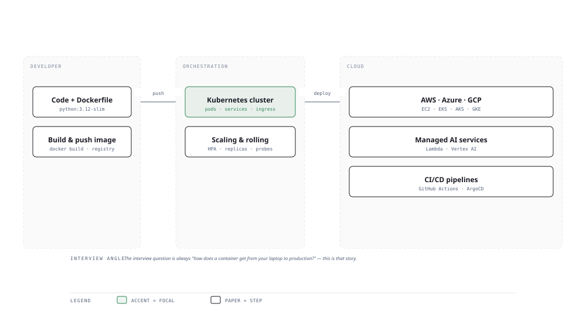

# Visual Notes — Container-to-Cloud Deployment Stack

> One diagram, the full picture. This page is meant to be glanced at before reading the chapters, and again before interviews.

# What the diagram shows

1. **Developer zone** — Code and a Dockerfile become an image, then a `docker build` pushes it to a container registry. Everything reproducible starts here.
1. **Orchestration zone** — Kubernetes schedules pods, services and ingress. The HPA scales replicas, rolling updates replace releases with zero downtime.
1. **Cloud zone** — EKS/GKE/AKS run the cluster; managed AI services and serverless functions absorb the spikey work; CI/CD ships the change end-to-end.

# Why this matters for placement

- "Walk me through how a container reaches production" is a top-3 DevOps question — have this diagram memorised.
- Knowing which cloud primitive maps to which layer proves you can run AI workloads, not just write them.

# Quick revision

- Image = build once, tag with hash; container = running image; registry = the source of truth for versions.
- Keep recreating pods declaratively: never `docker exec` to patch — change the manifest, not the running pod.
- Probes: liveness (resurrect), readiness (route traffic), startup (slow apps).
- HPA scales on metrics; VPA rightsizes requests; autoscaling is the interview favourite.
- Serverless (Lambda) trades cold starts for zero idle cost — pair with RAG/embeddings at modest QPS.

# Related chapters

- [Docker basics](01-docker-basics.md)
- [Kubernetes basics](04-kubernetes-basics.md)
- [CI/CD pipelines](10-ci-cd-pipelines.md)
- [Serverless Lambda](11-serverless-lambda.md)

---

**One-line answer for interviews:** *"My image is built once, versioned in a registry, and orchestrated by Kubernetes regardless of which cloud runs it."*
