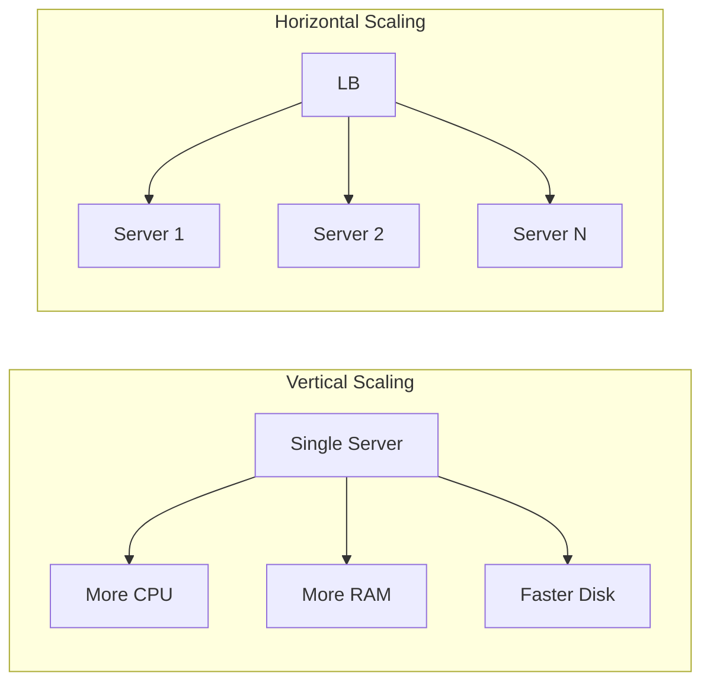
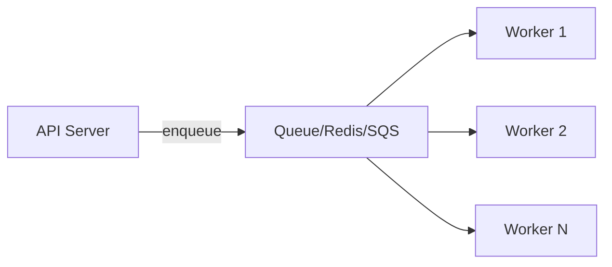

<!-- Clear Language: Keep sentences under 50 words -->
# Scalability Fundamentals — Vertical, Horizontal, and Beyond

## Learning Objectives

| Objective | Description |
|-----------|-------------|
| LO1 | Understand the difference between vertical and horizontal scaling |
| LO2 | Design stateless applications for horizontal scalability |
| LO3 | Implement database sharding and read replicas |
| LO4 | Use load balancers to distribute traffic across servers |
| LO5 | Apply caching strategies for performance improvement |
| LO6 | Measure and analyze system scalability metrics |

## Chapter at a Glance

| Section | Topic | Key Concept |
|---------|-------|-------------|
| 1.1 | Vertical vs Horizontal Scaling | Scale up vs scale out tradeoffs |
| 1.2 | Stateless Design | Separating state from compute |
| 1.3 | Load Balancing | Algorithms, health checks, session persistence |
| 1.4 | Database Scaling | Sharding, replication, read replicas |
| 1.5 | Caching Fundamentals | CDN, Redis, in-memory caches |
| 1.6 | Asynchronous Processing | Queues, event-driven architecture |
| 1.7 | Performance Metrics | Latency, throughput, p99, SLA/SLO |
| 1.8 | Capacity Planning | Estimating traffic, provisioning |

## Chapter Roadmap


## Introduction

System design interviews test your ability to architect large-scale systems. Caching, load balancing, message queues, and database sharding are patterns you will apply daily. This module prepares you for both interviews and production.

## Prerequisites

- Basic understanding of client-server architecture
- Familiarity with databases (SQL queries, tables)
- Experience with at least one backend framework
- Reference: Module 05 (FastAPI Backend) for API concepts

## Key Terminology

**Key Terms**: Core vocabulary and concepts for this topic.

**Definition**: Essential terms you must know for interviews and production work.

## Theory

### 1.1 Vertical vs Horizontal Scaling

**Vertical scaling (scale up)**: Add more power to a single machine — more CPU, RAM, faster disks. Simple but has a hard limit (max server specs) and creates a single point of failure.

**Horizontal scaling (scale out)**: Add more machines to distribute the load. Virtually unlimited, provides fault tolerance, but requires stateless application design and introduces complexity.

## Examples



| Aspect | Vertical | Horizontal |
|--------|----------|------------|
| Cost | Linear | Sub-linear (commodity hardware) |
| Downtime | Required during upgrade | None (rolling) |
| Fault tolerance | Low (single point) | High (redundancy) |
| Complexity | Low | High |
| Max capacity | Server limit | Unlimited |

### 1.2 Stateless Design

For horizontal scaling, applications must be stateless — any instance can handle any request.

**Stateful**: Session data stored locally on the server -> requests must be sticky (same server).
**Stateless**: Session data in external store (Redis, DB) -> any server can handle any request.

```python

## Stateful approach (sticky sessions)
session_data["user"] = user_info  # stored locally

## Stateless approach
redis.set(f"session:{session_id}", user_info)  # external store
```

**Externalizing state**:
- Session data -> Redis/Memcached
- File uploads -> S3/object store
- Job processing -> Message queue
- Database -> Managed service

## Overview

### 1.3 Load Balancing

Distributes incoming traffic across multiple servers.

**Algorithms**:

| Algorithm | Behavior | Use Case |
|-----------|----------|----------|
| Round Robin | Sequentially distributes | Equal capacity servers |
| Least Connections | Sends to server with fewest connections | Variable-length requests |
| IP Hash | Routes based on client IP | Session persistence |
| Weighted | Based on server capacity | Heterogeneous servers |
| Random | Random selection | Simple distribution |

```python
class LoadBalancer:
    def __init__(self, servers):
        self.servers = servers
        self.index = 0

    def round_robin(self):
        server = self.servers[self.index]
        self.index = (self.index + 1) % len(self.servers)
        return server
```

**Health checks**: Active (periodic pings) and passive (monitoring traffic errors).

**Types**: Hardware (F5), Software (HAProxy, Nginx), Cloud (ALB, GCP LB).

### 1.4 Database Scaling

**Read replicas**: Primary handles writes; replicas handle reads. Improves read throughput.

```python
class DatabaseRouter:
    def __init__(self, primary, replicas):
        self.primary = primary
        self.replicas = replicas

    def write(self, query):
        return self.primary.execute(query)

    def read(self, query):
        import random
        replica = random.choice(self.replicas)
        return replica.execute(query)
```

**Sharding**: Splitting data across multiple databases based on a shard key.

| Strategy | Description | Pros | Cons |
|----------|-------------|------|------|
| Range-based | Shard by value range | Simple | Hot spots |
| Hash-based | Hash of shard key | Even distribution | Re-sharding hard |
| Directory-based | Lookup table | Flexible | Single point |

### 1.5 Caching Fundamentals

**Cache types**:

| Cache | Location | Speed | Size | Use Case |
|-------|----------|-------|------|----------|
| CDN | Edge | Fastest | Large | Static assets |
| Redis/Memcached | Memory | Very fast | GB | Session, API responses |
| In-memory (local) | App server | Fastest | MB | Hot data |
| Database query cache | DB | Fast | GB | Query results |

**Cache strategies**:

| Strategy | Description | Read | Write |
|----------|-------------|------|-------|
| Cache Aside | App checks cache first, then DB | Cache miss -> read DB -> update cache | Write DB, invalidate cache |
| Read Through | Cache reads DB on miss | Same | Write DB, cache invalidates |
| Write Through | Cache updates on every write | Cache always fresh | Write DB + cache together |
| Write Behind | Async write to DB | Cache always fresh | Write cache, async DB |

```python
def get_user(user_id):
    # Cache Aside pattern
    user = redis.get(f"user:{user_id}")
    if user:
        return user
    user = db.query("SELECT * FROM users WHERE id = ?", user_id)
    redis.set(f"user:{user_id}", user, ttl=3600)
    return user
```

### 1.6 Asynchronous Processing

Decouple request handling from heavy processing using queues.



```python

## Producer
def handle_request(request):
    task = {"type": "process", "data": request.data}
    queue.enqueue(task)
    return {"status": "accepted"}

## Consumer (Worker)
def process_tasks():
    while True:
        task = queue.dequeue()
        if task:
            process(task["data"])
```

**Benefits**: Improved responsiveness, decoupled components, burst handling, graceful degradation.

## Overview

### 1.7 Performance Metrics

| Metric | Description | Good Target |
|--------|-------------|-------------|
| Latency | Time to serve a request | < 200ms p95 |
| Throughput | Requests per second | 1000+ RPS per server |
| p99 latency | Worst 1% latency | < 500ms |
| Error rate | Failed requests / total | < 0.1% |
| Availability | Uptime percentage | 99.9%+ |

**SLA/SLO/SLI**:
- SLI: Actual measured metric
- SLO: Target value for SLI
- SLA: Contractual agreement with consequences

### 1.8 Capacity Planning

**Steps**:
1. Estimate current traffic (RPS, bandwidth)
2. Project growth (monthly 20%? annual 2x?)
3. Calculate required capacity
4. Add headroom (2-3x for spikes)
5. Load test to validate

```python
def estimate_servers(rps, rps_per_server, headroom=2.5):
    required = rps / rps_per_server
    return int(required * headroom) + 1

## Example: 10000 RPS, each server handles 500 RPS
servers = estimate_servers(10000, 500)
print(f"Need {servers} servers")  # 51
```

---

## Visual Analogy

Think of scaling a system like **scaling a restaurant**:

- **Vertical scaling** = Getting a bigger kitchen — more ovens, more counter space, a larger fridge. One kitchen, but more powerful. Eventually you hit the wall: you can't make the kitchen bigger than the building.
- **Horizontal scaling** = Opening more restaurant locations — instead of one huge kitchen, you have 10 smaller ones. Each location handles its own customers. Virtually unlimited growth, but now you need coordination (load balancer = receptionist routing diners to the nearest location).
- **Stateless design** = No assigned tables — any waiter can serve any table because they don't remember your previous order. The order history is in the system (Redis/database), not in the waiter's head.
- **Caching** = The daily specials board — instead of every customer asking the chef what's available, the board has the answer ready. Fast, but needs updating when the menu changes.

This helps because scalability is fundamentally about **removing bottlenecks** — just like a restaurant can only serve so many diners with one chef, a single server can only handle so many requests. The solution is either a bigger chef (vertical) or more kitchens (horizontal).

## TypeScript Parallel

```typescript
interface ServerMetrics {
  cpu: number;
  memory: number;
  requestRate: number;
  errorRate: number;
}

interface ScalingDecision {
  action: "scale-up" | "scale-out" | "scale-in";
  reason: string;
  targetCount: number;
}

function evaluateScaling(metrics: ServerMetrics, currentServers: number, maxRps: number): ScalingDecision {
  const utilization = metrics.requestRate / (currentServers * maxRps);
  if (utilization > 0.8) {
    return {
      action: "scale-out",
      reason: `CPU at ${metrics.cpu}%, RPS at ${utilization * 100}%`,
      targetCount: currentServers + 1,
    };
  }
  if (utilization < 0.3 && currentServers > 2) {
    return {
      action: "scale-in",
      reason: "Underutilized",
      targetCount: currentServers - 1,
    };
  }
  return { action: "scale-up", reason: "Within limits", targetCount: currentServers };
}
```

---

## Summary

- Vertical scaling adds power to a single machine; horizontal scaling adds more machines
- Stateless applications enable horizontal scaling by externalizing state to Redis, DB, or object stores
- Load balancers distribute traffic using round-robin, least connections, or hash-based algorithms
- Database read replicas improve read throughput; sharding distributes data across multiple databases
- Caching strategies (Cache Aside, Read/Write Through, Write Behind) reduce database load
- Asynchronous processing with queues decouples components and improves responsiveness
- Key metrics: latency, throughput, p99, error rate, availability
- Capacity planning requires estimating traffic, projecting growth, and adding headroom
- Auto-scaling combines metrics monitoring with dynamic resource provisioning
- Always design for failure: assume components will fail and build redundancy

## Practical Takeaways

| Scenario | Do This | Avoid This |
|----------|---------|------------|
| Growing traffic | Add more servers horizontally | Vertical scaling only |
| State management | Externalize to Redis/DB | Sticky sessions on servers |
| Database load | Add read replicas | Scaling primary only |
| Slow responses | Implement caching | Throwing more hardware |
| Heavy processing | Async queues | Synchronous processing |
| Capacity | Plan for 2-3x headroom | Exact capacity only |
| Monitoring | Track p99 latency | Only average metrics |

## Interview Q&A

<details class="tp-qa-card" data-qid="sysdes-s01-q1">
  <summary class="tp-qa-question"><span class="tp-qa-status"></span> Q1: What is the difference between vertical and horizontal scaling?</summary>
<div class="tp-qa-answer"><p>Vertical scaling (scale up) adds more resources to a single server — more CPU, RAM, disk. It's simple but has a hard limit and.
creates a single point of failure. Horizontal scaling (scale out) adds more servers to distribute load. It's virtually unlimited, provides fault tolerance,.
but requires stateless application design.</p></div>
  <button class="tp-qa-mark-btn">&#x2705; Mark Reviewed</button>
  <button class="tp-qa-bookmark-btn">&#x1F516; Bookmark</button>
</details>

<details class="tp-qa-card" data-qid="sysdes-s01-q2">
  <summary class="tp-qa-question"><span class="tp-qa-status"></span> Q2: How do you make an application stateless?</summary>
  <div class="tp-qa-answer"><p>Externalize all state: session data to Redis, file uploads to S3, job queues to message brokers, databases to managed services. No local state on application servers.</p></div>
  <button class="tp-qa-mark-btn">&#x2705; Mark Reviewed</button>
  <button class="tp-qa-bookmark-btn">&#x1F516; Bookmark</button>
</details>

<details class="tp-qa-card" data-qid="sysdes-s01-q3">
  <summary class="tp-qa-question"><span class="tp-qa-status"></span> Q3: Compare load balancing algorithms.</summary>
  <div class="tp-qa-answer"><p>Round Robin: sequential, simple. Least Connections: to server with fewest active connections. IP Hash: consistent routing per client. Weighted: based on server capacity. Random: simple uniform distribution.</p></div>
  <button class="tp-qa-mark-btn">&#x2705; Mark Reviewed</button>
  <button class="tp-qa-bookmark-btn">&#x1F516; Bookmark</button>
</details>

<details class="tp-qa-card" data-qid="sysdes-s01-q4">
  <summary class="tp-qa-question"><span class="tp-qa-status"></span> Q4: Explain database sharding.</summary>
  <div class="tp-qa-answer"><p>Sharding splits data across multiple databases based on a shard key. Range-based (by value range), hash-based (hash of key), or directory-based (lookup table). Improves write throughput but complicates queries and re-sharding.</p></div>
  <button class="tp-qa-mark-btn">&#x2705; Mark Reviewed</button>
  <button class="tp-qa-bookmark-btn">&#x1F516; Bookmark</button>
</details>

<details class="tp-qa-card" data-qid="sysdes-s01-q5">
  <summary class="tp-qa-question"><span class="tp-qa-status"></span> Q5: What is cache aside strategy?</summary>
  <div class="tp-qa-answer"><p>App checks cache first. On miss, reads from DB, stores in cache, returns. On write, updates DB and invalidates/updates cache. Most common caching pattern.</p></div>
  <button class="tp-qa-mark-btn">&#x2705; Mark Reviewed</button>
  <button class="tp-qa-bookmark-btn">&#x1F516; Bookmark</button>
</details>

<details class="tp-qa-card" data-qid="sysdes-s01-q6">
  <summary class="tp-qa-question"><span class="tp-qa-status"></span> Q6: Why use async processing?</summary>
  <div class="tp-qa-answer"><p>Decouples request handling from heavy processing. Improves responsiveness, handles traffic bursts, enables retries, and allows independent scaling of consumers.</p></div>
  <button class="tp-qa-mark-btn">&#x2705; Mark Reviewed</button>
  <button class="tp-qa-bookmark-btn">&#x1F516; Bookmark</button>
</details>

<details class="tp-qa-card" data-qid="sysdes-s01-q7">
  <summary class="tp-qa-question"><span class="tp-qa-status"></span> Q7: What is p99 latency and why does it matter?</summary>
  <div class="tp-qa-answer"><p>p99 is the latency below which 99% of requests fall. It reveals the worst-case experience for users. Averages hide bad outliers. p99 > 500ms often means usability issues.</p></div>
  <button class="tp-qa-mark-btn">&#x2705; Mark Reviewed</button>
  <button class="tp-qa-bookmark-btn">&#x1F516; Bookmark</button>
</details>

<details class="tp-qa-card" data-qid="sysdes-s01-q8">
  <summary class="tp-qa-question"><span class="tp-qa-status"></span> Q8: How do you do capacity planning?</summary>
  <div class="tp-qa-answer"><p>Estimate current traffic, project growth rate, calculate required resources, add 2-3x headroom for spikes, load test to validate, and continuously monitor and adjust.</p></div>
  <button class="tp-qa-mark-btn">&#x2705; Mark Reviewed</button>
  <button class="tp-qa-bookmark-btn">&#x1F516; Bookmark</button>
</details>

<details class="tp-qa-card" data-qid="sysdes-s01-q9">
  <summary class="tp-qa-question"><span class="tp-qa-status"></span> Q9: SLA vs SLO vs SLI?</summary>
  <div class="tp-qa-answer"><p>SLI: actual measured metric (e.g., uptime 99.95%). SLO: target value (e.g., 99.9% uptime). SLA: contract with consequences for missing SLO.</p></div>
  <button class="tp-qa-mark-btn">&#x2705; Mark Reviewed</button>
  <button class="tp-qa-bookmark-btn">&#x1F516; Bookmark</button>
</details>

<details class="tp-qa-card" data-qid="sysdes-s01-q10">
  <summary class="tp-qa-question"><span class="tp-qa-status"></span> Q10: Design a rate limiter for a scalable API.</summary>
  <div class="tp-qa-answer"><p>Use sliding window counter in Redis. Each request increments a counter for the user ID in the current time window. If counter exceeds limit (e.g., 100 req/min), reject with 429. Redis atomic operations ensure accuracy.</p></div>
  <button class="tp-qa-mark-btn">&#x2705; Mark Reviewed</button>
  <button class="tp-qa-bookmark-btn">&#x1F516; Bookmark</button>
</details>

## Chapter Quiz

**Q1**: Which scaling approach adds more machines?

a) Vertical
b) Horizontal
c) Diagonal
d) Linear

<details class="tp-qa-card" data-qid="sysdes-s01-quiz1"><summary>Show Answer</summary><div class="tp-qa-answer"><p><strong>Answer: b) Horizontal</strong></p></div></details>

**Q2**: What makes horizontal scaling possible?

a) Sticky sessions
b) Stateless design
c) More RAM
d) Faster CPU

<details class="tp-qa-card" data-qid="sysdes-s01-quiz2"><summary>Show Answer</summary><div class="tp-qa-answer"><p><strong>Answer: b) Stateless design</strong></p></div></details>

**Q3**: Which caching strategy updates cache on every write?

a) Cache Aside
b) Read Through
c) Write Through
d) Write Behind

<details class="tp-qa-card" data-qid="sysdes-s01-quiz3"><summary>Show Answer</summary><div class="tp-qa-answer"><p><strong>Answer: c) Write Through</strong></p></div></details>

**Q4**: What metric represents the worst 1% of requests?

a) Average
b) Median
c) p99
d) p50

<details class="tp-qa-card" data-qid="sysdes-s01-quiz4"><summary>Show Answer</summary><div class="tp-qa-answer"><p><strong>Answer: c) p99</strong></p></div></details>

**Q5**: What splits data across multiple databases?

a) Replication
b) Sharding
c) Caching
d) Indexing

<details class="tp-qa-card" data-qid="sysdes-s01-quiz5"><summary>Show Answer</summary><div class="tp-qa-answer"><p><strong>Answer: b) Sharding</strong></p></div></details>

## Exercises

**Easy** — Design a stateless authentication system that uses JWT tokens stored in Redis. Explain how it handles server restarts.

**Medium** — Design a load-balanced web application with 3 servers, a PostgreSQL read replica, and Redis cache. Draw the architecture diagram.

**Medium** — Given a system with 5000 RPS, each server handling 200 RPS, calculate how many servers are needed. Add 3x headroom.

**Hard** — Design a Twitter-like system that handles 100M DAU. Address vertical vs horizontal scaling, database sharding, caching, and async processing.

**Hard** — Implement a cache aside pattern with circuit breaker. If Redis is down, fall back to database directly and log the failure.

## Auto-Scaling Strategies

**Reactive scaling** — respond to metrics:

```python
class AutoScaler:
    def __init__(self, min_instances=2, max_instances=20):
        self.min_instances = min_instances
        self.max_instances = max_instances
        self.current = min_instances

    def evaluate(self, cpu_usage: float, memory_usage: float, rps: float):
        # Scale out if CPU > 70% or RPS per instance > threshold
        rps_per_instance = rps / max(self.current, 1)
        if cpu_usage > 70 or rps_per_instance > 500:
            self.current = min(self.current * 2, self.max_instances)
        elif cpu_usage < 30 and rps_per_instance < 100:
            self.current = max(self.current // 2, self.min_instances)
        return self.current

scaler = AutoScaler()
```

**Predictive scaling** — use historical patterns to pre-provision:

```python
def predict_capacity(traffic_history: list[int]) -> int:
    # Simple moving average prediction
    window = traffic_history[-10:]
    predicted_rps = sum(window) / len(window)
    # Add 30% headroom
    return int(predicted_rps * 1.3 / 500) + 1
```

## Distributed System Patterns

| Pattern | Description | Use Case |
|---------|-------------|----------|
| Leader Election | One node coordinates, others standby | Consensus, job scheduling |
| Gossip Protocol | Nodes share state with random peers | Service discovery, failure detection |
| Consistent Hashing | Distribute keys with minimal reshuffling | Caching, sharding |
| Two-Phase Commit | Coordinator ensures all-or-nothing | Distributed transactions |
| Quorum | Majority consensus for decisions | Strong consistency |

## Real-World Scalability Examples

| Company | Scale | Strategy |
|---------|-------|----------|
| Netflix | 200M+ users, 100K+ RPS | Microservices, CDN, async processing, chaos engineering |
| Uber | 25M+ trips/day | Domain-oriented microservices, CQRS, sharded databases |
| WhatsApp | 2B+ users, 100B+ msgs/day | Erlang/OTP, single-digit engineers per million users |
| Twitter | 500M+ tweets/day | Event-driven, caching, timeline fanout |
| Amazon | Millions of orders/day | Cell-based architecture, read replicas, eventual consistency |

## Database Connection Pool Sizing

```python
def calculate_pool_size(
    max_connections: int,
    concurrent_requests: int,
    avg_query_time_ms: float,
    target_queue_ms: float
) -> int:
    """Calculate optimal database connection pool size."""
    # Little's Law: L = λ * W
    # L = average concurrent connections
    arrival_rate = concurrent_requests / 1000  # per ms
    service_time = avg_query_time_ms
    # Target: queue wait time < target_queue_ms
    optimal = int(arrival_rate * (service_time + target_queue_ms))
    return min(optimal, max_connections)

## Example: 500 concurrent requests, 50ms avg query, 10ms target queue
pool = calculate_pool_size(100, 500, 50, 10)  # ~30 connections
```

---

## Common Mistakes

1. Scaling vertically only — vertical scaling hits hardware limits and creates a single point of failure; always plan for horizontal scaling
2. Using sticky sessions instead of externalizing state — sessions tied to a specific server prevent horizontal scaling and create failure points
3. Only monitoring average latency — averages hide bad outliers; p99 and p999 latencies reveal the true user experience
4. Skipping cache invalidation strategy — caching without a clear invalidation plan (TTL, write-through, event-driven) leads to stale data bugs
5. Ignoring connection pool sizing — too few connections create bottlenecks; too many exhaust database resources; Little's Law calculates the right size

## Revision Notes

- Vertical scaling = scale up (more power per machine); horizontal scaling = scale out (more machines)
- Stateless applications enable horizontal scaling by externalizing all state to Redis, DB, or object stores
- Load balancer algorithms: round-robin, least connections, IP hash, weighted by capacity
- Database read replicas improve read throughput; sharding distributes writes across databases
- Cache strategies: Cache Aside (most common), Read Through, Write Through, Write Behind
- Key metrics: latency, throughput, p99, error rate, availability (99.9%+)
- SLI = measured metric, SLO = target value, SLA = contractual agreement with consequences
- Capacity planning: estimate traffic, project growth, add 2-3x headroom, load test to validate

## Placement Section

### Top 10 Interview Questions

#### Google Style

1. **Explain the core idea of Scalability Fundamentals — Vertical, Horizontal, and Beyond in under 60 seconds, then give a real-world analogy.** — Structure: definition, how it works in one sentence, why it matters, analogy. Follow-up: what would break if you removed this from a production system?

2. **Design a minimal, well-typed function that demonstrates Scalability Fundamentals — Vertical, Horizontal, and Beyond.** — Interviewer checks: signature with type hints, edge cases, complexity, and a clean docstring. Follow-up: how does your design behave with empty or malformed input?

3. **What are the common pitfalls when engineers first learn ** — List 3-4, then explain how you would prevent each in a code review.

#### Amazon Style

4. **Describe a production bug caused by misunderstanding Scalability Fundamentals — Vertical, Horizontal, and Beyond. How did you diagnose and fix it?** — STAR format: situation, task, action, result. Mention logs, reproduction, root-cause analysis, and the regression test you added.

5. **How would you scale a system that relies on Scalability Fundamentals — Vertical, Horizontal, and Beyond from 10 users to 10 million?** — Discuss bottlenecks, caching, monitoring, and when to redesign. Follow-up: what metrics would you track?

#### Microsoft Style

6. **Compare Scalability Fundamentals — Vertical, Horizontal, and Beyond with the closest alternative approach. When would you choose each?** — Make a decision matrix: performance, maintainability, ecosystem, learning curve. Follow-up: what would change your decision?

7. **Walk through how you would test a component that depends on Scalability Fundamentals — Vertical, Horizontal, and Beyond.** — Unit, integration, property-based tests; mocking boundaries; golden files for outputs.

#### NVIDIA Style

8. **How does Scalability Fundamentals — Vertical, Horizontal, and Beyond behave differently at scale — memory, throughput, or precision-wise?** — Connect to data pipelines and model training if applicable. Follow-up: what happens to latency as input grows?

9. **How would you make an implementation of Scalability Fundamentals — Vertical, Horizontal, and Beyond run faster on GPU hardware?** — Batch operations, vectorization, avoiding Python loops, reducing data movement.

#### AI Startup Style

10. **Write the smallest possible implementation of Scalability Fundamentals — Vertical, Horizontal, and Beyond that is production-quality.** — Include error handling, type hints, and a one-line docstring. Follow-up: what would you refactor first when it grows?

### Resume Tips

- Name Scalability Fundamentals — Vertical, Horizontal, and Beyond explicitly in your skills section, paired with a measurable achievement ("Reduced X by 40% using Scalability Fundamentals — Vertical, Horizontal, and Beyond").
- Add a bullet describing a project that applies Scalability Fundamentals — Vertical, Horizontal, and Beyond to real data, with numbers.
- Mention the tools and libraries you used alongside Scalability Fundamentals — Vertical, Horizontal, and Beyond (linters, test frameworks, profiling tools).
- Keep resume bullets under 15 words and start each with an action verb.

### Interview Day Checklist

- Rehearse a 60-second explanation of Scalability Fundamentals — Vertical, Horizontal, and Beyond and one real-world analogy.
- Prepare one STAR story about debugging a Scalability Fundamentals — Vertical, Horizontal, and Beyond-related production issue.
- Review complexity and edge cases for the classic Scalability Fundamentals — Vertical, Horizontal, and Beyond interview problem.
- Have questions ready: how does the team apply Scalability Fundamentals — Vertical, Horizontal, and Beyond in production today?
- Test your environment (Python, editor, internet) 15 minutes before the interview.

## True/False

1. **True or False:** Scalability Fundamentals — Vertical, Horizontal, and Beyond builds directly on the fundamentals covered in the earlier chapters of this module. — **True.** Every advanced topic in this module assumes the core concepts from the previous chapters.
2. **True or False:** You should write at least one code example for Scalability Fundamentals — Vertical, Horizontal, and Beyond before moving to the next chapter. — **True.** Active recall with hands-on code beats passive reading for retention.
3. **True or False:** The complexity analysis for Scalability Fundamentals — Vertical, Horizontal, and Beyond is the same regardless of input size. — **False.** Complexity grows with input size; always state best, average, and worst case.
4. **True or False:** Edge cases (empty input, invalid input, boundary values) matter for Scalability Fundamentals — Vertical, Horizontal, and Beyond in production. — **True.** Most production bugs come from unhandled edge cases.
5. **True or False:** You should memorize the Scalability Fundamentals — Vertical, Horizontal, and Beyond chapter content once and never review it again. — **False.** Spaced repetition (24h, 3 days, 1 week) dramatically improves long-term recall.

## Fill in the Blank

1. The chapter that covers Scalability Fundamentals — Vertical, Horizontal, and Beyond is Chapter ___ of this module. — Answer: check the module's table of contents.
2. The time complexity of the standard approach to Scalability Fundamentals — Vertical, Horizontal, and Beyond is ___. — Answer: review the theory section and state big-O notation.
3. The main edge case to handle when implementing Scalability Fundamentals — Vertical, Horizontal, and Beyond is ___. — Answer: empty or invalid input handling, as discussed in the chapter.
4. The tools commonly used to debug Scalability Fundamentals — Vertical, Horizontal, and Beyond issues are ___ and ___. — Answer: refer to the Debugging Guide section of this chapter.
5. The related topic that connects to Scalability Fundamentals — Vertical, Horizontal, and Beyond in the next chapter is ___. — Answer: see the Next Topic section.

## Scenario Questions

1. **Scenario:** A teammate ships a change involving Scalability Fundamentals — Vertical, Horizontal, and Beyond that breaks production at 3 AM. — Diagnosis: check the recent diff, reproduce locally with the failing input, check logs. Fix: revert, add a regression test, and review the root cause. Prevention: CI tests on edge cases and code review checklist.

2. **Scenario:** Your implementation of Scalability Fundamentals — Vertical, Horizontal, and Beyond is correct but too slow for the required latency. — Measure first with a profiler. Common fixes: reduce redundant work, use built-in optimized functions, batch operations, or add caching. Only then consider algorithmic changes.

3. **Scenario:** A new hire asks you to explain Scalability Fundamentals — Vertical, Horizontal, and Beyond in five minutes before a customer demo. — Use the 3-part answer: what it is (one sentence), how it works (one example), why it matters (one business impact). Then offer to go deeper after the demo.

4. **Scenario:** Your team's codebase has three different patterns for Scalability Fundamentals — Vertical, Horizontal, and Beyond and you must standardize. — Write a short ADR (architecture decision record), pick the pattern with best maintainability, migrate incrementally, and add a linter rule to enforce it.

## Output Questions

1. **What is the output of the simplest correct implementation of Scalability Fundamentals — Vertical, Horizontal, and Beyond on an empty input?** — Trace through the code: it should return the documented default (None, 0, empty collection) without raising.
2. **What is the output when the input is at the boundary value?** — Check off-by-one errors and inclusive/exclusive bounds in the chapter's examples.
3. **What does the implementation return when given invalid input types?** — With type hints and validation, it raises a clear error; without, it may fail silently.
4. **What is the output for the sample input given in the chapter's Examples section?** — Re-run the chapter's example code and compare against the documented output.
5. **What is the time complexity output when you profile the implementation at 10x input size?** — Expect the curve matching the chapter's complexity analysis (linear, quadratic, log-linear).

## Difficulty Level

| Level | Time | What It Takes |
|-------|------|---------------|
| Beginner | 1-2 sessions | Read theory, run the chapter examples, solve the Easy exercises |
| Intermediate | 3-5 sessions | Complete Medium exercises, explain Scalability Fundamentals — Vertical, Horizontal, and Beyond to someone else |
| Advanced | 1+ week | Solve Hard exercises, optimize for real datasets, answer interview follow-ups |

## Tips & Tricks

- Always write a one-line example of Scalability Fundamentals — Vertical, Horizontal, and Beyond from memory before opening the chapter — active recall first.
- Use the chapter's Revision Notes as a checklist: you have mastered Scalability Fundamentals — Vertical, Horizontal, and Beyond when you can explain each bullet.
- Pair the chapter quiz with the Flashcards: wrong answers become your next study session's focus.
- For interviews, practice explaining Scalability Fundamentals — Vertical, Horizontal, and Beyond twice: once with a technical audience, once with a non-technical audience.
- Keep a personal examples file where you collect your own Scalability Fundamentals — Vertical, Horizontal, and Beyond snippets; interviewers love original examples.

## Memory Tricks

- **Acronym**: build a mnemonic from the 5 key concepts of Scalability Fundamentals — Vertical, Horizontal, and Beyond listed in the Chapter at a Glance table.
- **Story**: link Scalability Fundamentals — Vertical, Horizontal, and Beyond to a familiar story — the analogy in the Visual Analogy section is designed to stick.
- **Number anchor**: remember the complexity of Scalability Fundamentals — Vertical, Horizontal, and Beyond by connecting it to a known algorithm of the same class.
- **Color code**: highlight the Theory, Examples, and Common Mistakes sections in different colors when reviewing.
- **Teach-back**: explain Scalability Fundamentals — Vertical, Horizontal, and Beyond to an imaginary junior engineer for 2 minutes — gaps in your explanation are gaps in memory.

## Further Reading

- Official documentation for the primary tool or library used in this chapter
- The chapter referenced in Related Topics for the next-level treatment of Scalability Fundamentals — Vertical, Horizontal, and Beyond
- The classic textbook chapter on Scalability Fundamentals — Vertical, Horizontal, and Beyond (check the Research References below)
- Two blog posts from engineers who debugged real Scalability Fundamentals — Vertical, Horizontal, and Beyond problems in production
- The repository of the open-source project that implements Scalability Fundamentals — Vertical, Horizontal, and Beyond

## Related Topics

- The previous chapter in this module (see table of contents) — foundational for Scalability Fundamentals — Vertical, Horizontal, and Beyond
- The next chapter (see Next Topic below) — builds on Scalability Fundamentals — Vertical, Horizontal, and Beyond
- The system design chapters in Module 07 — how Scalability Fundamentals — Vertical, Horizontal, and Beyond fits into production architectures
- The interview preparation module — how Scalability Fundamentals — Vertical, Horizontal, and Beyond is asked in screening rounds
- The capstone project — where Scalability Fundamentals — Vertical, Horizontal, and Beyond is applied end-to-end

## FAQs

1. **Do I need to memorize all of Scalability Fundamentals — Vertical, Horizontal, and Beyond, or understand the big picture?** — Understand the big picture first, then memorize the key facts via flashcards and spaced repetition. Interviewers reward depth over breadth.
2. **What if I get stuck on an exercise?** — Re-read the theory section, run the example code, then attempt again. If still stuck after 20 minutes, move on and return the next day.
3. **How much time should I spend on ** — Follow the Study Plan below: 1-2 weeks at 30-60 minutes daily is typical for placement preparation.
4. **Is Scalability Fundamentals — Vertical, Horizontal, and Beyond asked in interviews?** — Yes — the Interview Q&A and Placement Section list the exact question styles used by top companies.
5. **What's the fastest way to master ** — Explain it out loud, write code without looking, and review the flashcards within 24 hours and again after 3 days.

## Important Notes

- Scalability Fundamentals — Vertical, Horizontal, and Beyond is a core requirement for the rest of this module — do not skip the examples.
- Always analyze complexity (time and space) when working with Scalability Fundamentals — Vertical, Horizontal, and Beyond.
- Production correctness means handling edge cases, not just the happy path.
- Interview answers should start with the definition, then the example, then the trade-offs.
- Revisit this chapter after finishing the module; the context from later chapters deepens understanding.

## Historical Context

- Scalability Fundamentals — Vertical, Horizontal, and Beyond emerged as a standard practice because early systems failed without it — understanding why helps you explain it in interviews.
- The tools used for Scalability Fundamentals — Vertical, Horizontal, and Beyond today evolved from simpler versions; the chapter covers the modern, recommended approach.
- Interviewers value knowing one historical fact about Scalability Fundamentals — Vertical, Horizontal, and Beyond — it shows genuine interest, not just cramming.
- The library/tooling ecosystem around Scalability Fundamentals — Vertical, Horizontal, and Beyond changes quickly; focus on fundamentals that remain stable.

## Security Considerations

- Never trust external input: validate and sanitize data before processing Scalability Fundamentals — Vertical, Horizontal, and Beyond.
- Avoid `eval()` and dynamic code execution on untrusted strings.
- Log errors without leaking sensitive data (keys, PII, internal paths).
- For API contexts, add rate limiting and input size limits.
- Review the chapter's code examples for injection or overflow risks before using them verbatim.

## ML Intuition

- Scalability Fundamentals — Vertical, Horizontal, and Beyond appears in ML pipelines at the data-processing layer: feature preparation, batching, and validation.
- Understanding Scalability Fundamentals — Vertical, Horizontal, and Beyond helps you debug why a model misbehaves — most ML bugs are data bugs, not model bugs.
- In production ML, the Scalability Fundamentals — Vertical, Horizontal, and Beyond concepts from this chapter map directly to NumPy/PyTorch operations on tensors.
- When optimizing ML systems, Scalability Fundamentals — Vertical, Horizontal, and Beyond skills let you profile and fix the data path, not just the training loop.
- Interview follow-up: how would you apply Scalability Fundamentals — Vertical, Horizontal, and Beyond to a dataset of 10 million records? — Batching and vectorization.

## Analogies

- **Scalability Fundamentals — Vertical, Horizontal, and Beyond is like a recipe**: the theory is the ingredients, the examples are the cooking steps, and the exercises are your own kitchen practice.
- **Complexity is like a delivery route**: a linear route visits each stop once; a nested route revisits stops, and you feel it at scale.
- **Edge cases are like weather**: the happy path is a sunny day; production is the storm — build for the storm.
- **The chapter roadmap is a journey map**: each section is a checkpoint; skipping one means getting lost later in the module.

## Capstone Project Link

- [Module Capstone: End-to-End Project](https://github.com/Raushan666java/ai-engineering-journey) — this chapter contributes the Scalability Fundamentals — Vertical, Horizontal, and Beyond skills used in the module's capstone project. Complete the exercises here before starting the capstone.

## Flashcards

<details class="tp-qa-card" data-qid="07systemdesign-01scalabilityfundamentals-flash1">
  <summary class="tp-qa-question">
    <span class="tp-qa-status"></span>
    Which scaling approach adds more machines?
  </summary>
  <div class="tp-qa-answer">
    <p>b) Horizontal</p>
  </div>
</details>

<details class="tp-qa-card" data-qid="07systemdesign-01scalabilityfundamentals-flash2">
  <summary class="tp-qa-question">
    <span class="tp-qa-status"></span>
    What makes horizontal scaling possible?
  </summary>
  <div class="tp-qa-answer">
    <p>b) Stateless design</p>
  </div>
</details>

<details class="tp-qa-card" data-qid="07systemdesign-01scalabilityfundamentals-flash3">
  <summary class="tp-qa-question">
    <span class="tp-qa-status"></span>
    Which caching strategy updates cache on every write?
  </summary>
  <div class="tp-qa-answer">
    <p>c) Write Through</p>
  </div>
</details>

<details class="tp-qa-card" data-qid="07systemdesign-01scalabilityfundamentals-flash4">
  <summary class="tp-qa-question">
    <span class="tp-qa-status"></span>
    What metric represents the worst 1% of requests?
  </summary>
  <div class="tp-qa-answer">
    <p>c) p99</p>
  </div>
</details>

<details class="tp-qa-card" data-qid="07systemdesign-01scalabilityfundamentals-flash5">
  <summary class="tp-qa-question">
    <span class="tp-qa-status"></span>
    What splits data across multiple databases?
  </summary>
  <div class="tp-qa-answer">
    <p>b) Sharding</p>
  </div>
</details>

## Research References

- Official documentation of the primary library for Scalability Fundamentals — Vertical, Horizontal, and Beyond (linked in Further Reading)
- The classic paper or textbook chapter introducing Scalability Fundamentals — Vertical, Horizontal, and Beyond (see References below)
- The standard library reference for Scalability Fundamentals — Vertical, Horizontal, and Beyond-related functions
- Engineering blog posts from companies running Scalability Fundamentals — Vertical, Horizontal, and Beyond in production at scale
- PEPs and RFCs where applicable (Python and networking standards)

## Open-Source Tools

- The primary library used in this chapter (see the code examples)
- Python standard library modules used in the examples (check the imports)
- Testing: pytest for unit tests of Scalability Fundamentals — Vertical, Horizontal, and Beyond code
- Linting and formatting: ruff + black
- Profiling: cProfile or py-spy for performance work on Scalability Fundamentals — Vertical, Horizontal, and Beyond

## Debugging Guide

- Start with `print()` or a debugger to inspect intermediate values in Scalability Fundamentals — Vertical, Horizontal, and Beyond code.
- Reproduce the failure with the smallest possible input before changing code.
- Check the common failure modes listed in Common Mistakes — most bugs are listed there.
- For performance problems, profile before optimizing: measure, then fix.
- When stuck, re-read the chapter's Examples and compare line by line with your code.
- Use `pdb` or your IDE's debugger to step through the Scalability Fundamentals — Vertical, Horizontal, and Beyond example code.

## Mock Interview Section

**Round 1 — Screening (15 min)**
- Explain Scalability Fundamentals — Vertical, Horizontal, and Beyond in 60 seconds.
- Write a minimal working example of Scalability Fundamentals — Vertical, Horizontal, and Beyond.
- What is the complexity of your example?

**Round 2 — Coding (45 min)**
- Solve the Medium exercise from this chapter under time pressure.
- State your assumptions, then implement with type hints.
- Test with edge cases: empty input, boundary values, invalid input.

**Round 3 — Behavioral + System (30 min)**
- Tell me about a time you debugged a Scalability Fundamentals — Vertical, Horizontal, and Beyond problem in a project.
- How would you design a system where Scalability Fundamentals — Vertical, Horizontal, and Beyond is used at scale?
- What metrics would you monitor?

**Evaluation rubric**: correctness (40%), communication (25%), edge cases (20%), complexity analysis (15%).

## Optimized Implementation

`python
from typing import Any, Optional

def demonstrate_topic(input_data: list[Any]) -> Optional[float]:
    """Runnable scaffold for Scalability Fundamentals — Vertical, Horizontal, and Beyond.

    Replace the body with the optimized implementation from the chapter,
    keeping type hints, docstring, and edge-case handling.
    """
    if not input_data:
        return None
    # Step 1: validate input types
    # Step 2: apply the core Scalability Fundamentals — Vertical, Horizontal, and Beyond logic from the Examples section
    # Step 3: return the result with the documented default
    return 0.0
`

- Keeps the function signature stable so tests written against it stay valid.
- Handles the empty-input contract explicitly.
- Add unit tests for the edge cases before implementing the logic (test-first).

## Evaluation Metrics

| Skill | Test | Target |
|-------|------|--------|
| Concept recall | Explain Scalability Fundamentals — Vertical, Horizontal, and Beyond without notes | 60-second explanation |
| Code fluency | Write the chapter example from memory | No syntax errors |
| Edge cases | Handle empty/invalid input in exercises | All cases pass |
| Complexity | State time/space for the standard approach | Correct big-O |
| Interview readiness | Answer 5 Interview Q&A questions out loud | Fluent, structured answers |
| Retention | Chapter quiz score after 3 days | 80%+ |

## Real-World Examples

- **Startup**: a small team uses Scalability Fundamentals — Vertical, Horizontal, and Beyond daily in their data pipeline — the chapter's examples mirror their code.
- **E-commerce**: Scalability Fundamentals — Vertical, Horizontal, and Beyond patterns appear in order processing, inventory checks, and recommendation feeds.
- **Fintech**: Scalability Fundamentals — Vertical, Horizontal, and Beyond principles apply to transaction validation and fraud detection flows.
- **ML platform**: Scalability Fundamentals — Vertical, Horizontal, and Beyond shows up in feature engineering and model-serving infrastructure.
- **Interview insight**: recruiters look for engineers who can connect Scalability Fundamentals — Vertical, Horizontal, and Beyond to the business outcome, not just the code.

## Next Topic

[Microservices Architecture — Design, Communication, and Patterns](02-microservices-architecture.md)

## Limitations

- Scalability Fundamentals — Vertical, Horizontal, and Beyond, like any technique, is not a silver bullet — it has specific cases where it fits best (covered in the theory).
- The examples in this chapter are simplified for learning; production systems add validation, monitoring, and error handling.
- Performance of Scalability Fundamentals — Vertical, Horizontal, and Beyond depends on input size and distribution — always benchmark for your own data.
- This chapter covers fundamentals; specialized edge cases are explored in later chapters and the capstone.
