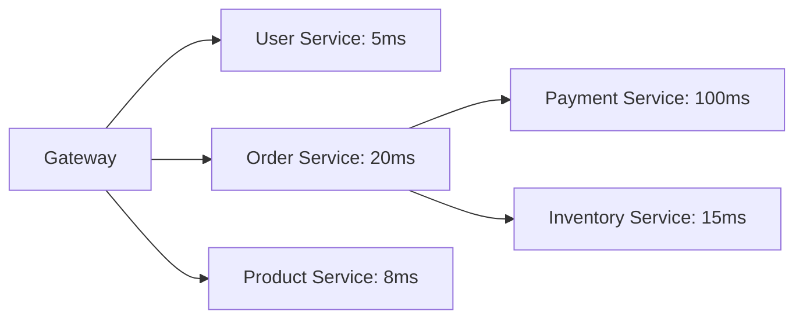
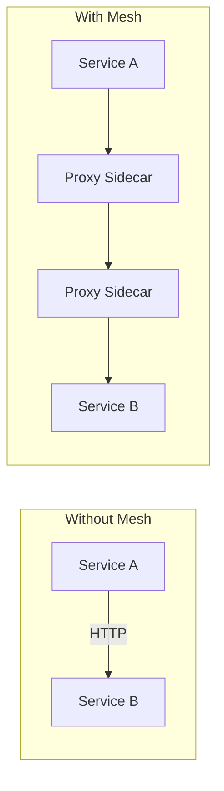

<!-- Clear Language: Keep sentences under 50 words -->
# Microservices Architecture — Design, Communication, and Patterns

## Learning Objectives

| Objective | Description |
|-----------|-------------|
| LO1 | Understand microservices principles and advantages over monoliths |
| LO2 | Design services based on bounded contexts |
| LO3 | Implement inter-service communication with REST and gRPC |
| LO4 | Use API Gateway for routing, auth, and aggregation |
| LO5 | Handle distributed data and transactions (Saga pattern) |
| LO6 | Apply observability: logging, metrics, distributed tracing |

## Introduction

System design interviews test your ability to architect large-scale systems. Caching, load balancing, message queues, and database sharding are patterns you will apply daily. This module prepares you for both interviews and production.

## Prerequisites

- Basic programming knowledge
- Understanding of data structures

## Key Terminology

**Key Terms**: Core vocabulary and concepts for this topic.

**Definition**: Essential terms you must know for interviews and production work.

## Theory

Understanding microservices architecture is fundamental for AI engineers. This section covers the core concepts, underlying principles, and theoretical framework that govern how microservices architecture works in practice.

## Chapter at a Glance

| Section | Topic | Key Concept |
|---------|-------|-------------|
| 2.1 | Monolith vs Microservices | Trade-offs, decomposition strategies |
| 2.2 | Domain-Driven Design | Bounded contexts, aggregates, events |
| 2.3 | Service Communication | REST, gRPC, GraphQL, message queues |
| 2.4 | API Gateway | Routing, authentication, rate limiting |
| 2.5 | Service Discovery | DNS, Consul, Kubernetes DNS, client-side |
| 2.6 | Data Management | Database per service, Saga pattern |
| 2.7 | Observability | Logging, metrics, distributed tracing |
| 2.8 | Deployment Patterns | Blue-green, canary, feature flags |

## Chapter Roadmap


## 2.1 Monolith vs Microservices

**Monolith**: Single deployment unit. Simple development, testing, and deployment. Becomes hard to maintain as it grows.

**Microservices**: Independent services, each with its own database, deployable separately.

| Aspect | Monolith | Microservices |
|--------|----------|---------------|
| Deployment | Single unit | Independent services |
| Scaling | Everything | Per service |
| Development | Simple initially | Complex coordination |
| Testing | End-to-end easy | Integration testing required |
| Team autonomy | Low | High |
| Operational overhead | Low | High |

**When to choose microservices**: Large team (10+), complex domain, need for independent scaling, polyglot technology stack.

**When NOT to choose**: Small team, simple application, early-stage startup, no clear service boundaries.

## 2.2 Domain-Driven Design

DDD helps identify service boundaries.

**Bounded Context**: A boundary within which a particular domain model applies. Each microservice should align with one bounded context.

**Aggregate**: A cluster of domain objects treated as a single unit. Changes within an aggregate are atomic.

**Ubiquitous Language**: Common language shared by developers and domain experts.

```python

## Order bounded context
class Order:
    def __init__(self, order_id, user_id, items, total):
        self.order_id = order_id
        self.user_id = user_id
        self.items = items
        self.total = total
        self.status = "pending"

    def confirm(self):
        self.status = "confirmed"
        # Emit domain event
        DomainEvents.raise(OrderConfirmed(self.order_id))
```

## 2.3 Service Communication

**Synchronous**: REST (HTTP), gRPC, GraphQL. Simple but creates coupling.

```python

## REST communication
import requests

def get_user_orders(user_id):
    response = requests.get(f"http://order-service/users/{user_id}/orders")
    return response.json()

## gRPC (protocol buffers)

## service OrderService {

##   rpc GetUserOrders (UserRequest) returns (OrderList);

## }
```

**Asynchronous**: Message queues (RabbitMQ, Kafka), event-driven. Loose coupling.

```python

## Event-driven communication
class OrderService:
    def create_order(self, order_data):
        order = Order.create(order_data)
        event = OrderCreatedEvent(order.id, order.user_id, order.total)
        message_bus.publish("order.created", event)

class NotificationService:
    def on_order_created(self, event):
        send_email(event.user_id, f"Order {event.order_id} confirmed")
```

| Pattern | Pros | Cons |
|---------|------|------|
| Request/Response | Simple, easy to debug | Coupling, latency |
| Event-driven | Loose coupling, scalable | Eventual consistency, debugging hard |
| Command Query (CQRS) | Optimized reads/writes | Complexity |

## 2.4 API Gateway

Single entry point for all clients. Routes requests to appropriate services.

```python
class APIGateway:
    def __init__(self):
        self.routes = {
            "/users": "user-service",
            "/orders": "order-service",
            "/products": "product-service",
        }

    def handle_request(self, request):
        service = self.find_service(request.path)
        if not service:
            return 404
        # Add auth, rate limiting, logging
        response = forward_to_service(service, request)
        return response
```

**Gateway responsibilities**:
- Request routing
- Authentication/authorization
- Rate limiting
- Request/response transformation
- Aggregation (combine multiple service responses)
- Circuit breaking

## 2.5 Service Discovery

Services need to find each other's locations (host:port).

**Server-side**: Load balancer (ALB, Nginx) knows service locations. Client hits load balancer.

**Client-side**: Client queries a service registry (Consul, etcd, K8s DNS) to get service locations, then picks one.

```python
class ServiceRegistry:
    def __init__(self):
        self.services = {}

    def register(self, name, host, port):
        self.services[name] = {"host": host, "port": port}

    def discover(self, name):
        return self.services.get(name)
```

## 2.6 Data Management

**Database per service**: Each service owns its data. No shared databases.

**Saga pattern**: Distributed transaction across services using a sequence of local transactions with compensating actions on failure.

```python

## Choreography-based Saga
class OrderSaga:
    def create_order(self, order_data):
        try:
            order = order_service.create(order_data)
            payment = payment_service.charge(order.user_id, order.total)
            inventory = inventory_service.reserve(order.items)
            notification = notification_service.send_confirmation(order)
            return order
        except PaymentFailed:
            order_service.cancel(order.id)
            raise
        except InventoryShortage:
            payment_service.refund(order.user_id, order.total)
            order_service.cancel(order.id)
            raise
```

## 2.7 Observability

**Logging**: Structured logs (JSON), correlation IDs across services.

```python
import logging
import json

class StructuredLogger:
    def info(self, message, **kwargs):
        log_entry = {"message": message, "level": "info", **kwargs}
        print(json.dumps(log_entry))
```

**Metrics**: Request rate, error rate, latency (Prometheus metrics).

**Distributed tracing**: Trace a request across multiple services (Jaeger, Zipkin).



## 2.8 Deployment Patterns

| Pattern | Description | Risk |
|---------|-------------|------|
| Blue-Green | Two environments, switch traffic | Low |
| Canary | Gradual traffic shift | Very low |
| Rolling | Incremental replacement | Low |
| Feature Flags | Toggle functionality | Minimal |

---

## TypeScript Parallel

```typescript
interface ServiceDefinition {
  name: string;
  port: number;
  endpoints: string[];
  dependencies: string[];
}

class MicroserviceOrchestrator {
  private services: Map<string, ServiceDefinition> = new Map();

  register(def: ServiceDefinition): void {
    this.services.set(def.name, def);
  }

  getService(name: string): ServiceDefinition | undefined {
    return this.services.get(name);
  }

  getDependencyGraph(): Map<string, string[]> {
    const graph = new Map<string, string[]>();
    for (const [name, def] of this.services) {
      graph.set(name, def.dependencies);
    }
    return graph;
  }
}
```

---

## Summary

- Microservices decompose applications into independently deployable services with their own databases
- Domain-Driven Design helps identify service boundaries using bounded contexts
- Services communicate synchronously (REST, gRPC) or asynchronously (events, queues)
- API Gateway provides a single entry point with routing, auth, and rate limiting
- Service discovery enables services to find each other via registries or DNS
- Database per service ensures loose coupling; Saga pattern handles distributed transactions
- Observability requires structured logging, metrics, and distributed tracing
- Deployment strategies (blue-green, canary) minimize risk during releases
- Microservices increase operational complexity but improve team autonomy and scalability
- Not every application needs microservices — start with monolith, decompose when necessary

## Practical Takeaways

| Scenario | Do This | Avoid This |
|----------|---------|------------|
| Service boundaries | Bounded contexts from DDD | Splitting by technical layers |
| Communication | Prefer async/events for cross-service | Synchronous calls in chains |
| API Gateway | Use managed gateway (Kong, AWS) | Building from scratch |
| Data | Database per service | Shared database microservices |
| Transactions | Saga pattern | Distributed transactions (2PC) |
| Debugging | Correlation IDs + tracing | Disconnected logs |
| Deployment | Blue-green with feature flags | Big bang releases |

## Interview Q&A

<details class="tp-qa-card" data-qid="sysdes-s02-q1">
  <summary class="tp-qa-question"><span class="tp-qa-status"></span> Q1: Monolith vs Microservices trade-offs?</summary>
  <div class="tp-qa-answer"><p>Monolith: simpler development/testing, harder to scale and maintain as it grows. Microservices: independent scaling and deployment, but higher operational complexity, network latency, and debugging difficulty.</p></div>
  <button class="tp-qa-mark-btn">&#x2705; Mark Reviewed</button>
  <button class="tp-qa-bookmark-btn">&#x1F516; Bookmark</button>
</details>

<details class="tp-qa-card" data-qid="sysdes-s02-q2">
  <summary class="tp-qa-question"><span class="tp-qa-status"></span> Q2: What is a bounded context in DDD?</summary>
  <div class="tp-qa-answer"><p>A boundary within which a domain model applies. Each microservice should align with one bounded context. Within a context, terms have specific meanings; between contexts, translation may be needed.</p></div>
  <button class="tp-qa-mark-btn">&#x2705; Mark Reviewed</button>
  <button class="tp-qa-bookmark-btn">&#x1F516; Bookmark</button>
</details>

<details class="tp-qa-card" data-qid="sysdes-s02-q3">
  <summary class="tp-qa-question"><span class="tp-qa-status"></span> Q3: What is the Saga pattern?</summary>
  <div class="tp-qa-answer"><p>Saga manages distributed transactions across services via a sequence of local transactions with compensating actions on failure. Choreography-based (services react to events) or orchestrator-based (central coordinator).</p></div>
  <button class="tp-qa-mark-btn">&#x2705; Mark Reviewed</button>
  <button class="tp-qa-bookmark-btn">&#x1F516; Bookmark</button>
</details>

<details class="tp-qa-card" data-qid="sysdes-s02-q4">
  <summary class="tp-qa-question"><span class="tp-qa-status"></span> Q4: What does an API Gateway do?</summary>
  <div class="tp-qa-answer"><p>Single entry point: request routing, authentication, rate limiting, request/response transformation, API aggregation, circuit breaking, and cross-cutting concerns.</p></div>
  <button class="tp-qa-mark-btn">&#x2705; Mark Reviewed</button>
  <button class="tp-qa-bookmark-btn">&#x1F516; Bookmark</button>
</details>

<details class="tp-qa-card" data-qid="sysdes-s02-q5">
  <summary class="tp-qa-question"><span class="tp-qa-status"></span> Q5: How do services discover each other?</summary>
  <div class="tp-qa-answer"><p>Client-side: services register with a registry (Consul, etcd), clients query the registry. Server-side: load balancer (ALB, Nginx) knows service locations. K8s uses DNS-based discovery.</p></div>
  <button class="tp-qa-mark-btn">&#x2705; Mark Reviewed</button>
  <button class="tp-qa-bookmark-btn">&#x1F516; Bookmark</button>
</details>

<details class="tp-qa-card" data-qid="sysdes-s02-q6">
  <summary class="tp-qa-question"><span class="tp-qa-status"></span> Q6: Why database per service?</summary>
  <div class="tp-qa-answer"><p>Ensures loose coupling — services own their data schema and can choose the best database type. No shared schema changes across teams. Prevents one service from directly accessing another's data.</p></div>
  <button class="tp-qa-mark-btn">&#x2705; Mark Reviewed</button>
  <button class="tp-qa-bookmark-btn">&#x1F516; Bookmark</button>
</details>

<details class="tp-qa-card" data-qid="sysdes-s02-q7">
  <summary class="tp-qa-question"><span class="tp-qa-status"></span> Q7: What is distributed tracing?</summary>
  <div class="tp-qa-answer"><p>Tracking a request across multiple services. Each service adds a span with timing information. A trace ID correlates all spans. Tools: Jaeger, Zipkin, OpenTelemetry.</p></div>
  <button class="tp-qa-mark-btn">&#x2705; Mark Reviewed</button>
  <button class="tp-qa-bookmark-btn">&#x1F516; Bookmark</button>
</details>

<details class="tp-qa-card" data-qid="sysdes-s02-q8">
  <summary class="tp-qa-question"><span class="tp-qa-status"></span> Q8: When should you NOT use microservices?</summary>
  <div class="tp-qa-answer"><p>Small team (< 10), simple CRUD applications, early-stage startups needing fast iteration, when service boundaries are unclear, or when operational expertise is limited.</p></div>
  <button class="tp-qa-mark-btn">&#x2705; Mark Reviewed</button>
  <button class="tp-qa-bookmark-btn">&#x1F516; Bookmark</button>
</details>

<details class="tp-qa-card" data-qid="sysdes-s02-q9">
  <summary class="tp-qa-question"><span class="tp-qa-status"></span> Q9: Async vs sync communication?</summary>
  <div class="tp-qa-answer"><p>Sync (REST/gRPC): simple, real-time, but creates coupling and cascading failures. Async (events/queues): loose coupling, resilient, handles bursts, but eventual consistency and harder debugging.</p></div>
  <button class="tp-qa-mark-btn">&#x2705; Mark Reviewed</button>
  <button class="tp-qa-bookmark-btn">&#x1F516; Bookmark</button>
</details>

<details class="tp-qa-card" data-qid="sysdes-s02-q10">
  <summary class="tp-qa-question"><span class="tp-qa-status"></span> Q10: How do you decompose a monolith into microservices?</summary>
  <div class="tp-qa-answer"><p>Identify bounded contexts via DDD. Start with the most independent module. Extract it as a service with its own database. Set up communication (API/events). Repeat incrementally. Use strangler fig pattern.</p></div>
  <button class="tp-qa-mark-btn">&#x2705; Mark Reviewed</button>
  <button class="tp-qa-bookmark-btn">&#x1F516; Bookmark</button>
</details>

## Chapter Quiz

**Q1**: What DDD concept defines service boundaries?

a) Entity
b) Value Object
c) Bounded Context
d) Aggregate

<details class="tp-qa-card" data-qid="sysdes-s02-quiz1"><summary>Show Answer</summary><div class="tp-qa-answer"><p><strong>Answer: c) Bounded Context</strong></p></div></details>

**Q2**: Which pattern handles distributed transactions?

a) 2PC
b) Saga
c) CQRS
d) Event Sourcing

<details class="tp-qa-card" data-qid="sysdes-s02-quiz2"><summary>Show Answer</summary><div class="tp-qa-answer"><p><strong>Answer: b) Saga</strong></p></div></details>

**Q3**: What does an API Gateway NOT typically do?

a) Authentication
b) Business logic
c) Rate limiting
d) Request routing

<details class="tp-qa-card" data-qid="sysdes-s02-quiz3"><summary>Show Answer</summary><div class="tp-qa-answer"><p><strong>Answer: b) Business logic</strong></p></div></details>

**Q4**: Which communication pattern has loose coupling?

a) REST
b) gRPC
c) Events
d) GraphQL

<details class="tp-qa-card" data-qid="sysdes-s02-quiz4"><summary>Show Answer</summary><div class="tp-qa-answer"><p><strong>Answer: c) Events</strong></p></div></details>

**Q5**: What is the strangler fig pattern?

a) A database migration strategy
b) Incrementally replacing a monolith with microservices
c) A load balancing algorithm
d) A caching strategy

<details class="tp-qa-card" data-qid="sysdes-s02-quiz5"><summary>Show Answer</summary><div class="tp-qa-answer"><p><strong>Answer: b) Incrementally replacing a monolith with microservices</strong></p></div></details>

## Exercises

**Easy** — List and explain 5 signs that a monolith should be decomposed into microservices.

**Medium** — Design an API Gateway for a system with user, order, product, and payment services. Show routing rules, authentication flow, and rate limiting.

**Medium** — Design a Saga for a ride-booking system: book ride, charge payment, notify driver, notify passenger. Include compensating transactions.

**Hard** — Design a complete microservices architecture for an e-commerce platform. Show service boundaries, communication patterns, data storage, and deployment strategy.

**Hard** — Implement an event-driven notification system: UserService publishes UserRegistered, OrderService publishes OrderPlaced, NotificationService subscribes and sends email/SMS. Use a message broker.

## Service Mesh

A service mesh handles inter-service communication at the infrastructure layer.



**Istio features**:

```yaml

## Traffic management
apiVersion: networking.istio.io/v1beta1
kind: VirtualService
metadata:
  name: reviews
spec:
  hosts:
    - reviews
  http:
    - match:
        - headers:
            end-user:
              exact: jason
      route:
        - destination:
            host: reviews
            subset: v2
    - route:
        - destination:
            host: reviews
            subset: v1
```

**Service mesh capabilities**:
- Traffic splitting (canary, blue-green)
- Mutual TLS between services
- Circuit breaking and retries
- Distributed tracing
- Metrics collection
- Access policies

## Chaos Engineering

Test system resilience by intentionally injecting failures.

```python
class ChaosExperiment:
    def __init__(self, name: str, probability: float = 0.1):
        self.name = name
        self.probability = probability

    def inject_latency(self, service: str, delay_ms: int):
        """Add artificial latency to service calls."""
        if random.random() < self.probability:
            time.sleep(delay_ms / 1000)
            logger.warning(f"Injected {delay_ms}ms latency to {service}")

    def kill_service(self, service: str):
        """Simulate service failure."""
        if random.random() < self.probability:
            raise ServiceUnavailable(f"Chaos: killed {service}")

    def corrupt_response(self, response: dict) -> dict:
        """Corrupt response data."""
        if random.random() < self.probability:
            response["data"] = "CORRUPTED"
        return response

chaos = ChaosExperiment("api-failure", 0.05)
```

**Principles of chaos engineering**:
- Start with a steady-state hypothesis
- Introduce realistic variables
- Run experiments in production (or staging)
- Automate experiments to run continuously
- Minimize blast radius

## Event Sourcing and CQRS

**Event Sourcing**: Store events as the source of truth, not current state.

```python
class EventStore:
    def __init__(self):
        self.events = []

    def append(self, event: dict):
        self.events.append(event)

    def get_events(self, aggregate_id: str) -> list[dict]:
        return [e for e in self.events if e["aggregate_id"] == aggregate_id]

    def replay(self, aggregate_id: str) -> dict:
        state = {}
        for event in self.get_events(aggregate_id):
            state.update(event["data"])
        return state
```

**CQRS** (Command Query Responsibility Segregation):

```python
class CommandHandler:
    def handle_create_order(self, command):
        # Write model — validates business rules
        event = OrderCreatedEvent(command.user_id, command.items)
        event_store.append(event)

class QueryHandler:
    def get_order_summary(self, user_id):
        # Read model — optimized denormalized view
        return read_db.query(
            "SELECT * FROM order_summaries WHERE user_id = ?", user_id
        )
```

## Microservices Migration Patterns

| Pattern | Description | Risk |
|---------|-------------|------|
| Strangler Fig | Incrementally replace monolith pieces | Low |
| Anti-Corruption Layer | Translate between old and new systems | Medium |
| Branch by Abstraction | Abstract before extracting | Low |
| Parallel Run | Run old + new, compare results | Medium |
| Feature Toggle | Toggle between old and new | Low |
| Database View | Use DB views to separate schemas | Medium |

---

## Common Mistakes

1. Not understanding the fundamental concepts before applying them
2. Skipping edge cases in implementation
3. Not analyzing time/space complexity
4. Forgetting to handle null/empty inputs
5. Not practicing enough problems to build pattern recognition

## Revision Notes

- - Core principle: Understand the fundamental concepts thoroughly
- - Implementation pattern: Practice with real code examples
- - Complexity: Know the time and space complexity
- - Application: Know when to use this in production systems
- - Interview: Frequently asked in technical interviews
- - Edge cases: Consider common failure scenarios
- - Related concepts: Connect to broader system design

## Placement Section

### Top 10 Interview Questions

#### Google Style

1. **Explain the core idea of Microservices Architecture — Design, Communication, and Patterns in under 60 seconds, then give a real-world analogy.** — Structure: definition, how it works in one sentence, why it matters, analogy. Follow-up: what would break if you removed this from a production system?

2. **Design a minimal, well-typed function that demonstrates Microservices Architecture — Design, Communication, and Patterns.** — Interviewer checks: signature with type hints, edge cases, complexity, and a clean docstring. Follow-up: how does your design behave with empty or malformed input?

3. **What are the common pitfalls when engineers first learn ** — List 3-4, then explain how you would prevent each in a code review.

#### Amazon Style

4. **Describe a production bug caused by misunderstanding Microservices Architecture — Design, Communication, and Patterns. How did you diagnose and fix it?** — STAR format: situation, task, action, result. Mention logs, reproduction, root-cause analysis, and the regression test you added.

5. **How would you scale a system that relies on Microservices Architecture — Design, Communication, and Patterns from 10 users to 10 million?** — Discuss bottlenecks, caching, monitoring, and when to redesign. Follow-up: what metrics would you track?

#### Microsoft Style

6. **Compare Microservices Architecture — Design, Communication, and Patterns with the closest alternative approach. When would you choose each?** — Make a decision matrix: performance, maintainability, ecosystem, learning curve. Follow-up: what would change your decision?

7. **Walk through how you would test a component that depends on Microservices Architecture — Design, Communication, and Patterns.** — Unit, integration, property-based tests; mocking boundaries; golden files for outputs.

#### NVIDIA Style

8. **How does Microservices Architecture — Design, Communication, and Patterns behave differently at scale — memory, throughput, or precision-wise?** — Connect to data pipelines and model training if applicable. Follow-up: what happens to latency as input grows?

9. **How would you make an implementation of Microservices Architecture — Design, Communication, and Patterns run faster on GPU hardware?** — Batch operations, vectorization, avoiding Python loops, reducing data movement.

#### AI Startup Style

10. **Write the smallest possible implementation of Microservices Architecture — Design, Communication, and Patterns that is production-quality.** — Include error handling, type hints, and a one-line docstring. Follow-up: what would you refactor first when it grows?

### Resume Tips

- Name Microservices Architecture — Design, Communication, and Patterns explicitly in your skills section, paired with a measurable achievement ("Reduced X by 40% using Microservices Architecture — Design, Communication, and Patterns").
- Add a bullet describing a project that applies Microservices Architecture — Design, Communication, and Patterns to real data, with numbers.
- Mention the tools and libraries you used alongside Microservices Architecture — Design, Communication, and Patterns (linters, test frameworks, profiling tools).
- Keep resume bullets under 15 words and start each with an action verb.

### Interview Day Checklist

- Rehearse a 60-second explanation of Microservices Architecture — Design, Communication, and Patterns and one real-world analogy.
- Prepare one STAR story about debugging a Microservices Architecture — Design, Communication, and Patterns-related production issue.
- Review complexity and edge cases for the classic Microservices Architecture — Design, Communication, and Patterns interview problem.
- Have questions ready: how does the team apply Microservices Architecture — Design, Communication, and Patterns in production today?
- Test your environment (Python, editor, internet) 15 minutes before the interview.

## True/False

1. **True or False:** Microservices Architecture — Design, Communication, and Patterns builds directly on the fundamentals covered in the earlier chapters of this module. — **True.** Every advanced topic in this module assumes the core concepts from the previous chapters.
2. **True or False:** You should write at least one code example for Microservices Architecture — Design, Communication, and Patterns before moving to the next chapter. — **True.** Active recall with hands-on code beats passive reading for retention.
3. **True or False:** The complexity analysis for Microservices Architecture — Design, Communication, and Patterns is the same regardless of input size. — **False.** Complexity grows with input size; always state best, average, and worst case.
4. **True or False:** Edge cases (empty input, invalid input, boundary values) matter for Microservices Architecture — Design, Communication, and Patterns in production. — **True.** Most production bugs come from unhandled edge cases.
5. **True or False:** You should memorize the Microservices Architecture — Design, Communication, and Patterns chapter content once and never review it again. — **False.** Spaced repetition (24h, 3 days, 1 week) dramatically improves long-term recall.

## Fill in the Blank

1. The chapter that covers Microservices Architecture — Design, Communication, and Patterns is Chapter ___ of this module. — Answer: check the module's table of contents.
2. The time complexity of the standard approach to Microservices Architecture — Design, Communication, and Patterns is ___. — Answer: review the theory section and state big-O notation.
3. The main edge case to handle when implementing Microservices Architecture — Design, Communication, and Patterns is ___. — Answer: empty or invalid input handling, as discussed in the chapter.
4. The tools commonly used to debug Microservices Architecture — Design, Communication, and Patterns issues are ___ and ___. — Answer: refer to the Debugging Guide section of this chapter.
5. The related topic that connects to Microservices Architecture — Design, Communication, and Patterns in the next chapter is ___. — Answer: see the Next Topic section.

## Scenario Questions

1. **Scenario:** A teammate ships a change involving Microservices Architecture — Design, Communication, and Patterns that breaks production at 3 AM. — Diagnosis: check the recent diff, reproduce locally with the failing input, check logs. Fix: revert, add a regression test, and review the root cause. Prevention: CI tests on edge cases and code review checklist.

2. **Scenario:** Your implementation of Microservices Architecture — Design, Communication, and Patterns is correct but too slow for the required latency. — Measure first with a profiler. Common fixes: reduce redundant work, use built-in optimized functions, batch operations, or add caching. Only then consider algorithmic changes.

3. **Scenario:** A new hire asks you to explain Microservices Architecture — Design, Communication, and Patterns in five minutes before a customer demo. — Use the 3-part answer: what it is (one sentence), how it works (one example), why it matters (one business impact). Then offer to go deeper after the demo.

4. **Scenario:** Your team's codebase has three different patterns for Microservices Architecture — Design, Communication, and Patterns and you must standardize. — Write a short ADR (architecture decision record), pick the pattern with best maintainability, migrate incrementally, and add a linter rule to enforce it.

## Output Questions

1. **What is the output of the simplest correct implementation of Microservices Architecture — Design, Communication, and Patterns on an empty input?** — Trace through the code: it should return the documented default (None, 0, empty collection) without raising.
2. **What is the output when the input is at the boundary value?** — Check off-by-one errors and inclusive/exclusive bounds in the chapter's examples.
3. **What does the implementation return when given invalid input types?** — With type hints and validation, it raises a clear error; without, it may fail silently.
4. **What is the output for the sample input given in the chapter's Examples section?** — Re-run the chapter's example code and compare against the documented output.
5. **What is the time complexity output when you profile the implementation at 10x input size?** — Expect the curve matching the chapter's complexity analysis (linear, quadratic, log-linear).

## Difficulty Level

| Level | Time | What It Takes |
|-------|------|---------------|
| Beginner | 1-2 sessions | Read theory, run the chapter examples, solve the Easy exercises |
| Intermediate | 3-5 sessions | Complete Medium exercises, explain Microservices Architecture — Design, Communication, and Patterns to someone else |
| Advanced | 1+ week | Solve Hard exercises, optimize for real datasets, answer interview follow-ups |

## Tips & Tricks

- Always write a one-line example of Microservices Architecture — Design, Communication, and Patterns from memory before opening the chapter — active recall first.
- Use the chapter's Revision Notes as a checklist: you have mastered Microservices Architecture — Design, Communication, and Patterns when you can explain each bullet.
- Pair the chapter quiz with the Flashcards: wrong answers become your next study session's focus.
- For interviews, practice explaining Microservices Architecture — Design, Communication, and Patterns twice: once with a technical audience, once with a non-technical audience.
- Keep a personal examples file where you collect your own Microservices Architecture — Design, Communication, and Patterns snippets; interviewers love original examples.

## Memory Tricks

- **Acronym**: build a mnemonic from the 5 key concepts of Microservices Architecture — Design, Communication, and Patterns listed in the Chapter at a Glance table.
- **Story**: link Microservices Architecture — Design, Communication, and Patterns to a familiar story — the analogy in the Visual Analogy section is designed to stick.
- **Number anchor**: remember the complexity of Microservices Architecture — Design, Communication, and Patterns by connecting it to a known algorithm of the same class.
- **Color code**: highlight the Theory, Examples, and Common Mistakes sections in different colors when reviewing.
- **Teach-back**: explain Microservices Architecture — Design, Communication, and Patterns to an imaginary junior engineer for 2 minutes — gaps in your explanation are gaps in memory.

## Further Reading

- Official documentation for the primary tool or library used in this chapter
- The chapter referenced in Related Topics for the next-level treatment of Microservices Architecture — Design, Communication, and Patterns
- The classic textbook chapter on Microservices Architecture — Design, Communication, and Patterns (check the Research References below)
- Two blog posts from engineers who debugged real Microservices Architecture — Design, Communication, and Patterns problems in production
- The repository of the open-source project that implements Microservices Architecture — Design, Communication, and Patterns

## Related Topics

- The previous chapter in this module (see table of contents) — foundational for Microservices Architecture — Design, Communication, and Patterns
- The next chapter (see Next Topic below) — builds on Microservices Architecture — Design, Communication, and Patterns
- The system design chapters in Module 07 — how Microservices Architecture — Design, Communication, and Patterns fits into production architectures
- The interview preparation module — how Microservices Architecture — Design, Communication, and Patterns is asked in screening rounds
- The capstone project — where Microservices Architecture — Design, Communication, and Patterns is applied end-to-end

## FAQs

1. **Do I need to memorize all of Microservices Architecture — Design, Communication, and Patterns, or understand the big picture?** — Understand the big picture first, then memorize the key facts via flashcards and spaced repetition. Interviewers reward depth over breadth.
2. **What if I get stuck on an exercise?** — Re-read the theory section, run the example code, then attempt again. If still stuck after 20 minutes, move on and return the next day.
3. **How much time should I spend on ** — Follow the Study Plan below: 1-2 weeks at 30-60 minutes daily is typical for placement preparation.
4. **Is Microservices Architecture — Design, Communication, and Patterns asked in interviews?** — Yes — the Interview Q&A and Placement Section list the exact question styles used by top companies.
5. **What's the fastest way to master ** — Explain it out loud, write code without looking, and review the flashcards within 24 hours and again after 3 days.

## Important Notes

- Microservices Architecture — Design, Communication, and Patterns is a core requirement for the rest of this module — do not skip the examples.
- Always analyze complexity (time and space) when working with Microservices Architecture — Design, Communication, and Patterns.
- Production correctness means handling edge cases, not just the happy path.
- Interview answers should start with the definition, then the example, then the trade-offs.
- Revisit this chapter after finishing the module; the context from later chapters deepens understanding.

## Historical Context

- Microservices Architecture — Design, Communication, and Patterns emerged as a standard practice because early systems failed without it — understanding why helps you explain it in interviews.
- The tools used for Microservices Architecture — Design, Communication, and Patterns today evolved from simpler versions; the chapter covers the modern, recommended approach.
- Interviewers value knowing one historical fact about Microservices Architecture — Design, Communication, and Patterns — it shows genuine interest, not just cramming.
- The library/tooling ecosystem around Microservices Architecture — Design, Communication, and Patterns changes quickly; focus on fundamentals that remain stable.

## Security Considerations

- Never trust external input: validate and sanitize data before processing Microservices Architecture — Design, Communication, and Patterns.
- Avoid `eval()` and dynamic code execution on untrusted strings.
- Log errors without leaking sensitive data (keys, PII, internal paths).
- For API contexts, add rate limiting and input size limits.
- Review the chapter's code examples for injection or overflow risks before using them verbatim.

## ML Intuition

- Microservices Architecture — Design, Communication, and Patterns appears in ML pipelines at the data-processing layer: feature preparation, batching, and validation.
- Understanding Microservices Architecture — Design, Communication, and Patterns helps you debug why a model misbehaves — most ML bugs are data bugs, not model bugs.
- In production ML, the Microservices Architecture — Design, Communication, and Patterns concepts from this chapter map directly to NumPy/PyTorch operations on tensors.
- When optimizing ML systems, Microservices Architecture — Design, Communication, and Patterns skills let you profile and fix the data path, not just the training loop.
- Interview follow-up: how would you apply Microservices Architecture — Design, Communication, and Patterns to a dataset of 10 million records? — Batching and vectorization.

## Analogies

- **Microservices Architecture — Design, Communication, and Patterns is like a recipe**: the theory is the ingredients, the examples are the cooking steps, and the exercises are your own kitchen practice.
- **Complexity is like a delivery route**: a linear route visits each stop once; a nested route revisits stops, and you feel it at scale.
- **Edge cases are like weather**: the happy path is a sunny day; production is the storm — build for the storm.
- **The chapter roadmap is a journey map**: each section is a checkpoint; skipping one means getting lost later in the module.

## Capstone Project Link

- [Module Capstone: End-to-End Project](https://github.com/Raushan666java/ai-engineering-journey) — this chapter contributes the Microservices Architecture — Design, Communication, and Patterns skills used in the module's capstone project. Complete the exercises here before starting the capstone.

## Flashcards

<details class="tp-qa-card" data-qid="07systemdesign-02microservicesarchitecture-flash1">
  <summary class="tp-qa-question">
    <span class="tp-qa-status"></span>
    What DDD concept defines service boundaries?
  </summary>
  <div class="tp-qa-answer">
    <p>c) Bounded Context</p>
  </div>
</details>

<details class="tp-qa-card" data-qid="07systemdesign-02microservicesarchitecture-flash2">
  <summary class="tp-qa-question">
    <span class="tp-qa-status"></span>
    Which pattern handles distributed transactions?
  </summary>
  <div class="tp-qa-answer">
    <p>b) Saga</p>
  </div>
</details>

<details class="tp-qa-card" data-qid="07systemdesign-02microservicesarchitecture-flash3">
  <summary class="tp-qa-question">
    <span class="tp-qa-status"></span>
    What does an API Gateway NOT typically do?
  </summary>
  <div class="tp-qa-answer">
    <p>b) Business logic</p>
  </div>
</details>

<details class="tp-qa-card" data-qid="07systemdesign-02microservicesarchitecture-flash4">
  <summary class="tp-qa-question">
    <span class="tp-qa-status"></span>
    Which communication pattern has loose coupling?
  </summary>
  <div class="tp-qa-answer">
    <p>c) Events</p>
  </div>
</details>

<details class="tp-qa-card" data-qid="07systemdesign-02microservicesarchitecture-flash5">
  <summary class="tp-qa-question">
    <span class="tp-qa-status"></span>
    What is the strangler fig pattern?
  </summary>
  <div class="tp-qa-answer">
    <p>b) Incrementally replacing a monolith with microservices</p>
  </div>
</details>

## Research References

- Official documentation of the primary library for Microservices Architecture — Design, Communication, and Patterns (linked in Further Reading)
- The classic paper or textbook chapter introducing Microservices Architecture — Design, Communication, and Patterns (see References below)
- The standard library reference for Microservices Architecture — Design, Communication, and Patterns-related functions
- Engineering blog posts from companies running Microservices Architecture — Design, Communication, and Patterns in production at scale
- PEPs and RFCs where applicable (Python and networking standards)

## Open-Source Tools

- The primary library used in this chapter (see the code examples)
- Python standard library modules used in the examples (check the imports)
- Testing: pytest for unit tests of Microservices Architecture — Design, Communication, and Patterns code
- Linting and formatting: ruff + black
- Profiling: cProfile or py-spy for performance work on Microservices Architecture — Design, Communication, and Patterns

## Debugging Guide

- Start with `print()` or a debugger to inspect intermediate values in Microservices Architecture — Design, Communication, and Patterns code.
- Reproduce the failure with the smallest possible input before changing code.
- Check the common failure modes listed in Common Mistakes — most bugs are listed there.
- For performance problems, profile before optimizing: measure, then fix.
- When stuck, re-read the chapter's Examples and compare line by line with your code.
- Use `pdb` or your IDE's debugger to step through the Microservices Architecture — Design, Communication, and Patterns example code.

## Mock Interview Section

**Round 1 — Screening (15 min)**
- Explain Microservices Architecture — Design, Communication, and Patterns in 60 seconds.
- Write a minimal working example of Microservices Architecture — Design, Communication, and Patterns.
- What is the complexity of your example?

**Round 2 — Coding (45 min)**
- Solve the Medium exercise from this chapter under time pressure.
- State your assumptions, then implement with type hints.
- Test with edge cases: empty input, boundary values, invalid input.

**Round 3 — Behavioral + System (30 min)**
- Tell me about a time you debugged a Microservices Architecture — Design, Communication, and Patterns problem in a project.
- How would you design a system where Microservices Architecture — Design, Communication, and Patterns is used at scale?
- What metrics would you monitor?

**Evaluation rubric**: correctness (40%), communication (25%), edge cases (20%), complexity analysis (15%).

## Optimized Implementation

`python
from typing import Any, Optional

def demonstrate_topic(input_data: list[Any]) -> Optional[float]:
    """Runnable scaffold for Microservices Architecture — Design, Communication, and Patterns.

    Replace the body with the optimized implementation from the chapter,
    keeping type hints, docstring, and edge-case handling.
    """
    if not input_data:
        return None
    # Step 1: validate input types
    # Step 2: apply the core Microservices Architecture — Design, Communication, and Patterns logic from the Examples section
    # Step 3: return the result with the documented default
    return 0.0
`

- Keeps the function signature stable so tests written against it stay valid.
- Handles the empty-input contract explicitly.
- Add unit tests for the edge cases before implementing the logic (test-first).

## Evaluation Metrics

| Skill | Test | Target |
|-------|------|--------|
| Concept recall | Explain Microservices Architecture — Design, Communication, and Patterns without notes | 60-second explanation |
| Code fluency | Write the chapter example from memory | No syntax errors |
| Edge cases | Handle empty/invalid input in exercises | All cases pass |
| Complexity | State time/space for the standard approach | Correct big-O |
| Interview readiness | Answer 5 Interview Q&A questions out loud | Fluent, structured answers |
| Retention | Chapter quiz score after 3 days | 80%+ |

## Real-World Examples

- **Startup**: a small team uses Microservices Architecture — Design, Communication, and Patterns daily in their data pipeline — the chapter's examples mirror their code.
- **E-commerce**: Microservices Architecture — Design, Communication, and Patterns patterns appear in order processing, inventory checks, and recommendation feeds.
- **Fintech**: Microservices Architecture — Design, Communication, and Patterns principles apply to transaction validation and fraud detection flows.
- **ML platform**: Microservices Architecture — Design, Communication, and Patterns shows up in feature engineering and model-serving infrastructure.
- **Interview insight**: recruiters look for engineers who can connect Microservices Architecture — Design, Communication, and Patterns to the business outcome, not just the code.

## Next Topic

[Message Queues — RabbitMQ, Kafka, and Event-Driven Architecture](03-message-queues.md)

## Limitations

- Microservices Architecture — Design, Communication, and Patterns, like any technique, is not a silver bullet — it has specific cases where it fits best (covered in the theory).
- The examples in this chapter are simplified for learning; production systems add validation, monitoring, and error handling.
- Performance of Microservices Architecture — Design, Communication, and Patterns depends on input size and distribution — always benchmark for your own data.
- This chapter covers fundamentals; specialized edge cases are explored in later chapters and the capstone.
