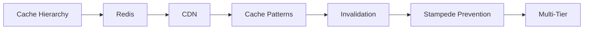
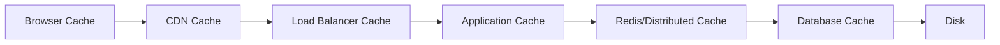

<!-- Clear Language: Keep sentences under 50 words -->
# Caching Strategies — Redis, CDN, and Application Cache

## Learning Objectives

| Objective | Description |
|-----------|-------------|
| LO1 | Understand caching fundamentals and the cache hierarchy |
| LO2 | Implement Redis for distributed caching |
| LO3 | Configure CDN caching for static assets |
| LO4 | Apply cache invalidation strategies |
| LO5 | Handle cache stampede and thundering herd |
| LO6 | Design multi-tier caching for optimal performance |

## Introduction

System design interviews test your ability to architect large-scale systems. Caching, load balancing, message queues, and database sharding are patterns you will apply daily. This module prepares you for both interviews and production.

## Prerequisites

- Basic programming knowledge
- Understanding of data structures

## Key Terminology

**Key Terms**: Core vocabulary and concepts for this topic.

**Definition**: Essential terms you must know for interviews and production work.

## Theory

Understanding caching strategies is fundamental for AI engineers. This section covers the core concepts, underlying principles, and theoretical framework that govern how caching strategies works in practice.

## Chapter at a Glance

| Section | Topic | Key Concept |
|---------|-------|-------------|
| 4.1 | Cache Hierarchy | L1/L2/L3, CDN, browser, app, database |
| 4.2 | Redis Caching | Data structures, expiration, persistence |
| 4.3 | CDN Caching | Edge locations, TTL, purge |
| 4.4 | Cache Patterns | Aside, through, behind, stampede protection |
| 4.5 | Cache Invalidation | TTL, write-through, event-driven |
| 4.6 | Cache Stampede | Mutex, early recompute, probabilistic |
| 4.7 | Multi-Tier Caching | Combining local + distributed cache |

## Chapter Roadmap



## 4.1 Cache Hierarchy

Caches exist at multiple levels in a system:



| Level | Location | Speed | Size | Example |
|-------|----------|-------|------|---------|
| L1 | CPU | 1ns | KB | CPU cache |
| Browser | Client | 10ms | MB | HTTP cache |
| CDN | Edge | 20ms | GB | CloudFront |
| App | Memory | 1ms | MB | In-memory dict |
| Distributed | Network | 3ms | GB | Redis |
| Database | Disk | 10ms | GB | Query cache |

## 4.2 Redis Caching

Redis is an in-memory data structure store used as cache.

```python
import redis

r = redis.Redis(host="localhost", port=6379, decode_responses=True)

## Basic operations
r.set("user:123", '{"name": "Alice", "email": "alice@example.com"}', ex=3600)
data = r.get("user:123")

## Cache with TTL
r.setex("session:abc", 86400, session_data)

## Atomic operations
r.incr("page_views:home")
r.expire("page_views:home", 60)

## Data structures
r.lpush("recent_views:123", "product_456")
r.ltrim("recent_views:123", 0, 9)  # Keep last 10
```

**Redis eviction policies**:

| Policy | Behavior |
|--------|----------|
| noeviction | Return errors on write |
| allkeys-lru | Evict least recently used |
| allkeys-lfu | Evict least frequently used |
| volatile-lru | Evict LRU among keys with TTL |
| volatile-ttl | Evict key with shortest TTL |

## 4.3 CDN Caching

CDNs cache content at edge locations close to users.

```python

## CloudFront with Lambda@Edge for cache optimization
def viewer_request(event):
    request = event["Records"][0]["cf"]["request"]
    headers = request["headers"]

    # Set cache control
    headers["cache-control"] = [{"key": "Cache-Control", "value": "public, max-age=86400"}]
    return request

## Cache behavior rules

## /static/* -> long TTL (30 days)

## /api/user/* -> short TTL (60 seconds)

## /api/* -> no cache
```

**CDN best practices**:
- Cache static assets aggressively (1 year)
- Version assets in URL (bundle.v2.js)
- Use cache invalidations for updates
- Serve compressed content (gzip/brotli)
- Set proper Cache-Control headers

## 4.4 Cache Patterns

**Cache Aside**: Application manages cache and database.

```python
def get_user(user_id):
    # Try cache
    user = cache.get(f"user:{user_id}")
    if user:
        return user
    # Cache miss - read from DB
    user = db.query("SELECT * FROM users WHERE id = ?", user_id)
    if user:
        cache.set(f"user:{user_id}", user, ex=3600)
    return user

def update_user(user_id, data):
    db.execute("UPDATE users SET ... WHERE id = ?", data, user_id)
    cache.delete(f"user:{user_id}")  # Invalidate cache
```

**Read Through**: Cache library handles DB reads.

**Write Through**: Cache is updated on every write.

**Write Behind**: Async batch write to DB.

## 4.5 Cache Invalidation

Invalidation is one of the two hard things in computer science.

| Strategy | Description | Pros | Cons |
|----------|-------------|------|------|
| TTL | Expire after time | Simple | Stale data |
| Write-through | Update on write | Fresh data | Write latency |
| Write-behind | Async DB write | Fast writes | Potential data loss |
| Event-driven | Invalidate on event | Targeted | Complex |

```python

## Event-driven invalidation
def on_user_updated(event):
    user_id = event["user_id"]
    cache.delete(f"user:{user_id}")
    cache.delete(f"user_orders:{user_id}")
```

## 4.6 Cache Stampede

When many requests miss cache simultaneously and all hit the database.

**Solutions**:

```python

## Mutex lock
def get_expensive_data(key):
    data = cache.get(key)
    if data:
        return data

    # Only one thread fetches from DB
    lock_key = f"lock:{key}"
    if cache.setnx(lock_key, "1", ex=10):
        data = db.query("SELECT ...")
        cache.set(key, data, ex=300)
        cache.delete(lock_key)
    else:
        # Wait for first thread
        time.sleep(0.1)
        return cache.get(key)
    return data

## Early recompute (recompute before TTL expires)
def get_with_early_recompute(key, ttl=300, early_ttl=60):
    data = cache.get(key)
    if data:
        # Check if nearing expiration
        remaining = cache.ttl(key)
        if remaining < early_ttl:
            # Async refresh (don't block)
            thread = Thread(target=refresh_cache, args=(key,))
            thread.start()
        return data
    return refresh_cache(key)
```

## 4.7 Multi-Tier Caching

Combine local (in-process) cache with distributed (Redis) cache.

```python
class MultiTierCache:
    def __init__(self):
        self.local = {}  # In-memory dict
        self.redis = redis.Redis()

    def get(self, key):
        # L1: Local cache (fastest)
        if key in self.local:
            return self.local[key]

        # L2: Redis
        data = self.redis.get(key)
        if data:
            self.local[key] = data  # Populate L1
            return data

        return None

    def set(self, key, value, ttl=300):
        self.local[key] = value
        self.redis.setex(key, ttl, value)

    def invalidate(self, key):
        self.local.pop(key, None)
        self.redis.delete(key)
```

---

## TypeScript Parallel

```typescript
interface CacheEntry<T> {
  value: T;
  expiresAt: number;
}

class InMemoryCache<T> {
  private store = new Map<string, CacheEntry<T>>();

  get(key: string): T | undefined {
    const entry = this.store.get(key);
    if (!entry) return undefined;
    if (Date.now() > entry.expiresAt) {
      this.store.delete(key);
      return undefined;
    }
    return entry.value;
  }

  set(key: string, value: T, ttlMs: number): void {
    this.store.set(key, { value, expiresAt: Date.now() + ttlMs });
  }

  delete(key: string): void {
    this.store.delete(key);
  }
}
```

---

## Summary

- Cache hierarchy ranges from L1 CPU cache to CDN edge locations, each with different speed/capacity tradeoffs
- Redis provides distributed in-memory caching with data structures, TTL, and atomic operations
- CDNs cache static assets at edge locations with long TTLs for fast global content delivery
- Cache Aside is the most common pattern: check cache first, fall back to DB, update cache
- Cache invalidation strategies include TTL, write-through, write-behind, and event-driven
- Cache stampede occurs when many requests miss cache simultaneously; use mutex locks or early recompute
- Multi-tier caching combines local (fast, small) with distributed (slower, larger) caches
- Redis eviction policies (LRU, LFU, TTL) manage memory when full
- Versioned asset URLs enable aggressive CDN caching with controlled invalidation
- Always set appropriate TTLs and monitor cache hit rates

## Practical Takeaways

| Scenario | Do This | Avoid This |
|----------|---------|------------|
| Static assets | CDN with versioned URLs | No cache headers |
| API responses | Redis Cache Aside with TTL | No caching |
| User sessions | Redis with TTL | In-memory session storage |
| Cache invalidation | Event-driven + TTL | Only TTL (stale data) |
| High traffic | Multi-tier cache + stampede protection | Single cache layer |
| Memory management | Set eviction policy and maxmemory | Unlimited growth |

## Interview Q&A

<details class="tp-qa-card" data-qid="sysdes-s04-q1">
  <summary class="tp-qa-question"><span class="tp-qa-status"></span> Q1: What is cache aside pattern?</summary>
  <div class="tp-qa-answer"><p>Application checks cache first. On miss, reads from DB, stores in cache with TTL, returns data. On write, updates DB and invalidates/updates cache. Most common caching pattern.</p></div>
  <button class="tp-qa-mark-btn">&#x2705; Mark Reviewed</button>
  <button class="tp-qa-bookmark-btn">&#x1F516; Bookmark</button>
</details>

<details class="tp-qa-card" data-qid="sysdes-s04-q2">
  <summary class="tp-qa-question"><span class="tp-qa-status"></span> Q2: What is cache stampede and how to prevent it?</summary>
  <div class="tp-qa-answer"><p>When many requests miss cache simultaneously and hit DB. Solutions: mutex lock (only one thread fetches), early recompute (refresh before expiration), probabilistic expiration (random early expiration).</p></div>
  <button class="tp-qa-mark-btn">&#x2705; Mark Reviewed</button>
  <button class="tp-qa-bookmark-btn">&#x1F516; Bookmark</button>
</details>

<details class="tp-qa-card" data-qid="sysdes-s04-q3">
  <summary class="tp-qa-question"><span class="tp-qa-status"></span> Q3: Redis eviction policies?</summary>
  <div class="tp-qa-answer"><p>noeviction (error), allkeys-lru (least recently used), allkeys-lfu (least frequently used), volatile-lru (LRU among keys with TTL), volatile-ttl (shortest TTL first).</p></div>
  <button class="tp-qa-mark-btn">&#x2705; Mark Reviewed</button>
  <button class="tp-qa-bookmark-btn">&#x1F516; Bookmark</button>
</details>

<details class="tp-qa-card" data-qid="sysdes-s04-q4">
  <summary class="tp-qa-question"><span class="tp-qa-status"></span> Q4: What is write-through cache?</summary>
  <div class="tp-qa-answer"><p>Cache is updated on every write operation before the write is acknowledged. Ensures cache is always fresh but adds latency to writes. Good for read-heavy workloads.</p></div>
  <button class="tp-qa-mark-btn">&#x2705; Mark Reviewed</button>
  <button class="tp-qa-bookmark-btn">&#x1F516; Bookmark</button>
</details>

<details class="tp-qa-card" data-qid="sysdes-s04-q5">
  <summary class="tp-qa-question"><span class="tp-qa-status"></span> Q5: How does CDN caching work?</summary>
  <div class="tp-qa-answer"><p>Content is cached at edge servers worldwide. Users receive content from the nearest edge. Cache-Control headers determine TTL. Versioned URLs enable long-term caching with controlled invalidations.</p></div>
  <button class="tp-qa-mark-btn">&#x2705; Mark Reviewed</button>
  <button class="tp-qa-bookmark-btn">&#x1F516; Bookmark</button>
</details>

<details class="tp-qa-card" data-qid="sysdes-s04-q6">
  <summary class="tp-qa-question"><span class="tp-qa-status"></span> Q6: How do you measure cache effectiveness?</summary>
  <div class="tp-qa-answer"><p>Cache hit rate (hits / total requests). High hit rate (>90%) indicates effective caching. Also monitor: miss rate, latency improvement, DB query reduction.</p></div>
  <button class="tp-qa-mark-btn">&#x2705; Mark Reviewed</button>
  <button class="tp-qa-bookmark-btn">&#x1F516; Bookmark</button>
</details>

<details class="tp-qa-card" data-qid="sysdes-s04-q7">
  <summary class="tp-qa-question"><span class="tp-qa-status"></span> Q7: When should you NOT use cache?</summary>
  <div class="tp-qa-answer"><p>Real-time data requiring immediate consistency, rapidly changing data (caching overhead > benefit), small datasets (DB is fast enough), write-heavy workloads with low read ratio.</p></div>
  <button class="tp-qa-mark-btn">&#x2705; Mark Reviewed</button>
  <button class="tp-qa-bookmark-btn">&#x1F516; Bookmark</button>
</details>

<details class="tp-qa-card" data-qid="sysdes-s04-q8">
  <summary class="tp-qa-question"><span class="tp-qa-status"></span> Q8: What is multi-tier caching?</summary>
  <div class="tp-qa-answer"><p>Combining multiple cache layers: L1 (in-process memory, fastest, small), L2 (Redis, fast, large), L3 (CDN, slower, global). Each layer compensates for the limitations of others.</p></div>
  <button class="tp-qa-mark-btn">&#x2705; Mark Reviewed</button>
  <button class="tp-qa-bookmark-btn">&#x1F516; Bookmark</button>
</details>

<details class="tp-qa-card" data-qid="sysdes-s04-q9">
  <summary class="tp-qa-question"><span class="tp-qa-status"></span> Q9: How do you invalidate cached content?</summary>
  <div class="tp-qa-answer"><p>TTL expiration (simplest), write-through invalidation (update cache on write), event-driven (publish invalidation events), cache purge (remove by pattern for CDN), versioned keys.</p></div>
  <button class="tp-qa-mark-btn">&#x2705; Mark Reviewed</button>
  <button class="tp-qa-bookmark-btn">&#x1F516; Bookmark</button>
</details>

<details class="tp-qa-card" data-qid="sysdes-s04-q10">
  <summary class="tp-qa-question"><span class="tp-qa-status"></span> Q10: Design a cache for a social media feed.</summary>
  <div class="tp-qa-answer"><p>Multi-tier: CDN for images/videos, Redis for user feed data (precomputed, TTL 5 min), local cache for hot users. Invalidation via event when new post created. Precompute feeds for active users asynchronously.</p></div>
  <button class="tp-qa-mark-btn">&#x2705; Mark Reviewed</button>
  <button class="tp-qa-bookmark-btn">&#x1F516; Bookmark</button>
</details>

## Chapter Quiz

**Q1**: Which cache level has the fastest access time?

a) CDN
b) Redis
c) L1 CPU
d) Browser

<details class="tp-qa-card" data-qid="sysdes-s04-quiz1"><summary>Show Answer</summary><div class="tp-qa-answer"><p><strong>Answer: c) L1 CPU (~1ns)</strong></p></div></details>

**Q2**: What Redis eviction policy removes the least recently used keys?

a) volatile-ttl
b) allkeys-lru
c) allkeys-lfu
d) noeviction

<details class="tp-qa-card" data-qid="sysdes-s04-quiz2"><summary>Show Answer</summary><div class="tp-qa-answer"><p><strong>Answer: b) allkeys-lru</strong></p></div></details>

**Q3**: What prevents cache stampede with a distributed lock?

a) Cache aside
b) Mutex
c) Write through
d) CDN

<details class="tp-qa-card" data-qid="sysdes-s04-quiz3"><summary>Show Answer</summary><div class="tp-qa-answer"><p><strong>Answer: b) Mutex</strong></p></div></details>

**Q4**: Which CDN caching strategy enables controlled invalidation?

a) Short TTL
b) Versioned URLs
c) Cache purge
d) No cache

<details class="tp-qa-card" data-qid="sysdes-s04-quiz4"><summary>Show Answer</summary><div class="tp-qa-answer"><p><strong>Answer: b) Versioned URLs</strong></p></div></details>

**Q5**: What metric indicates cache effectiveness?

a) Cache size
b) Hit rate
c) TTL length
d) Number of keys

<details class="tp-qa-card" data-qid="sysdes-s04-quiz5"><summary>Show Answer</summary><div class="tp-qa-answer"><p><strong>Answer: b) Hit rate</strong></p></div></details>

## Exercises

**Easy** — Set up Redis, implement Cache Aside pattern for user profiles with 5-minute TTL. Measure hit rate.

**Medium** — Implement multi-tier cache: local in-memory cache + Redis. Write get, set, and invalidate methods. Handle cache stampede with mutex.

**Medium** — Configure CDN caching for static assets. Set appropriate Cache-Control headers for (a) immutable assets (1 year), (b) CSS/JS (1 day), (c) HTML (no cache).

**Hard** — Design a caching system for a news website. Handle: real-time breaking news (no cache), articles (CDN + Redis with event-driven invalidation), user profiles (Cache Aside), ad content (short TTL).

**Hard** — Implement write-behind caching with Redis and PostgreSQL. Batch writes to DB asynchronously. Handle: cache coherency, batch failures, retry logic, and data loss prevention.

## Cache-Aside vs Read-Through vs Write-Through

**Implementation comparison**:

```python

## Cache-Aside (most common)
class CacheAside:
    def get(self, key):
        value = cache.get(key)
        if value is None:  # Cache miss
            value = db.query("SELECT * FROM data WHERE key = ?", key)
            cache.set(key, value, ttl=300)
        return value

    def set(self, key, value):
        db.update("UPDATE data SET value = ? WHERE key = ?", value, key)
        cache.delete(key)  # Invalidate cache

## Read-Through (cache knows how to fetch from DB)
class ReadThroughCache:
    def get(self, key):
        # Cache itself handles DB fallback
        return cache.get_or_compute(key, lambda: db.query("SELECT * FROM data WHERE key = ?", key), ttl=300)

## Write-Through (cache updated on every write)
class WriteThroughCache:
    def get(self, key):
        return cache.get(key)  # Always fresh

    def set(self, key, value):
        cache.set(key, value)
        db.insert("INSERT INTO data (key, value) VALUES (?, ?)", key, value)

## Write-Behind (async DB write)
class WriteBehindCache:
    def __init__(self):
        self.write_queue = Queue()

    def set(self, key, value):
        cache.set(key, value)
        self.write_queue.put((key, value))  # Deferred DB write

    def flush(self):
        while not self.write_queue.empty():
            key, value = self.write_queue.get()
            db.insert("INSERT INTO data (key, value) VALUES (?, ?)", key, value)
```

## Content Delivery Network (CDN) Deep Dive

**CDN caching headers**:

```python
from fastapi import FastAPI, Response

app = FastAPI()

@app.get("/static/{file_path:path}")
async def serve_static(file_path: str):
    # Immutable content — cache forever
    if file_path.endswith((".js", ".css")):
        return Response(
            content=get_file(file_path),
            headers={
                "Cache-Control": "public, max-age=31536000, immutable",
                "ETag": generate_etag(file_path),
            }
        )

    # API response — short cache
    return Response(
        content=get_api_data(file_path),
        headers={
            "Cache-Control": "public, max-age=60, stale-while-revalidate=300",
        }
    )

    # User-specific — no cache
    return Response(
        content=get_user_data(file_path),
        headers={
            "Cache-Control": "private, no-cache, no-store, must-revalidate",
        }
    )
```

**CDN cache invalidation strategies**:

| Strategy | Trigger | Latency | Cost |
|----------|---------|---------|------|
| TTL expiration | Time-based | Variable | Free |
| URL versioning | New deploy | Instant | URL management |
| Cache purge | API call | Minutes | API calls |
| Cache tags | Tag-based invalidation | Seconds | CDN feature |

## Cache Monitoring

```python
class CacheMonitor:
    def __init__(self, redis_client):
        self.redis = redis_client
        self.metrics = {"hits": 0, "misses": 0, "sets": 0, "evictions": 0}

    def track_hit(self):
        self.metrics["hits"] += 1

    def track_miss(self):
        self.metrics["misses"] += 1

    def hit_rate(self) -> float:
        total = self.metrics["hits"] + self.metrics["misses"]
        return self.metrics["hits"] / total if total > 0 else 0.0

    def report(self) -> dict:
        return {
            "hit_rate": f"{self.hit_rate():.1%}",
            "hits": self.metrics["hits"],
            "misses": self.metrics["misses"],
            "used_memory": self.redis.info("memory")["used_memory_human"],
            "keys": self.redis.dbsize(),
            "hit_rate_status": "good" if self.hit_rate() > 0.9 else "needs_improvement"
        }

## Usage
monitor = CacheMonitor(redis_client)

def get_user(user_id):
    cache_key = f"user:{user_id}"
    user = cache.get(cache_key)
    if user:
        monitor.track_hit()
        return user
    monitor.track_miss()
    user = db.query("SELECT * FROM users WHERE id = ?", user_id)
    cache.set(cache_key, user, ex=3600)
    return user
```

---

## Common Mistakes

1. Not understanding the fundamental concepts before applying them
2. Skipping edge cases in implementation
3. Not analyzing time/space complexity
4. Forgetting to handle null/empty inputs
5. Not practicing enough problems to build pattern recognition

## Revision Notes

- - Core principle: Understand the fundamental concepts thoroughly
- - Implementation pattern: Practice with real code examples
- - Complexity: Know the time and space complexity
- - Application: Know when to use this in production systems
- - Interview: Frequently asked in technical interviews
- - Edge cases: Consider common failure scenarios
- - Related concepts: Connect to broader system design

## Placement Section

### Top 10 Interview Questions

#### Google Style

1. **Explain the core idea of Caching Strategies — Redis, CDN, and Application Cache in under 60 seconds, then give a real-world analogy.** — Structure: definition, how it works in one sentence, why it matters, analogy. Follow-up: what would break if you removed this from a production system?

2. **Design a minimal, well-typed function that demonstrates Caching Strategies — Redis, CDN, and Application Cache.** — Interviewer checks: signature with type hints, edge cases, complexity, and a clean docstring. Follow-up: how does your design behave with empty or malformed input?

3. **What are the common pitfalls when engineers first learn ** — List 3-4, then explain how you would prevent each in a code review.

#### Amazon Style

4. **Describe a production bug caused by misunderstanding Caching Strategies — Redis, CDN, and Application Cache. How did you diagnose and fix it?** — STAR format: situation, task, action, result. Mention logs, reproduction, root-cause analysis, and the regression test you added.

5. **How would you scale a system that relies on Caching Strategies — Redis, CDN, and Application Cache from 10 users to 10 million?** — Discuss bottlenecks, caching, monitoring, and when to redesign. Follow-up: what metrics would you track?

#### Microsoft Style

6. **Compare Caching Strategies — Redis, CDN, and Application Cache with the closest alternative approach. When would you choose each?** — Make a decision matrix: performance, maintainability, ecosystem, learning curve. Follow-up: what would change your decision?

7. **Walk through how you would test a component that depends on Caching Strategies — Redis, CDN, and Application Cache.** — Unit, integration, property-based tests; mocking boundaries; golden files for outputs.

#### NVIDIA Style

8. **How does Caching Strategies — Redis, CDN, and Application Cache behave differently at scale — memory, throughput, or precision-wise?** — Connect to data pipelines and model training if applicable. Follow-up: what happens to latency as input grows?

9. **How would you make an implementation of Caching Strategies — Redis, CDN, and Application Cache run faster on GPU hardware?** — Batch operations, vectorization, avoiding Python loops, reducing data movement.

#### AI Startup Style

10. **Write the smallest possible implementation of Caching Strategies — Redis, CDN, and Application Cache that is production-quality.** — Include error handling, type hints, and a one-line docstring. Follow-up: what would you refactor first when it grows?

### Resume Tips

- Name Caching Strategies — Redis, CDN, and Application Cache explicitly in your skills section, paired with a measurable achievement ("Reduced X by 40% using Caching Strategies — Redis, CDN, and Application Cache").
- Add a bullet describing a project that applies Caching Strategies — Redis, CDN, and Application Cache to real data, with numbers.
- Mention the tools and libraries you used alongside Caching Strategies — Redis, CDN, and Application Cache (linters, test frameworks, profiling tools).
- Keep resume bullets under 15 words and start each with an action verb.

### Interview Day Checklist

- Rehearse a 60-second explanation of Caching Strategies — Redis, CDN, and Application Cache and one real-world analogy.
- Prepare one STAR story about debugging a Caching Strategies — Redis, CDN, and Application Cache-related production issue.
- Review complexity and edge cases for the classic Caching Strategies — Redis, CDN, and Application Cache interview problem.
- Have questions ready: how does the team apply Caching Strategies — Redis, CDN, and Application Cache in production today?
- Test your environment (Python, editor, internet) 15 minutes before the interview.

## True/False

1. **True or False:** Caching Strategies — Redis, CDN, and Application Cache builds directly on the fundamentals covered in the earlier chapters of this module. — **True.** Every advanced topic in this module assumes the core concepts from the previous chapters.
2. **True or False:** You should write at least one code example for Caching Strategies — Redis, CDN, and Application Cache before moving to the next chapter. — **True.** Active recall with hands-on code beats passive reading for retention.
3. **True or False:** The complexity analysis for Caching Strategies — Redis, CDN, and Application Cache is the same regardless of input size. — **False.** Complexity grows with input size; always state best, average, and worst case.
4. **True or False:** Edge cases (empty input, invalid input, boundary values) matter for Caching Strategies — Redis, CDN, and Application Cache in production. — **True.** Most production bugs come from unhandled edge cases.
5. **True or False:** You should memorize the Caching Strategies — Redis, CDN, and Application Cache chapter content once and never review it again. — **False.** Spaced repetition (24h, 3 days, 1 week) dramatically improves long-term recall.

## Fill in the Blank

1. The chapter that covers Caching Strategies — Redis, CDN, and Application Cache is Chapter ___ of this module. — Answer: check the module's table of contents.
2. The time complexity of the standard approach to Caching Strategies — Redis, CDN, and Application Cache is ___. — Answer: review the theory section and state big-O notation.
3. The main edge case to handle when implementing Caching Strategies — Redis, CDN, and Application Cache is ___. — Answer: empty or invalid input handling, as discussed in the chapter.
4. The tools commonly used to debug Caching Strategies — Redis, CDN, and Application Cache issues are ___ and ___. — Answer: refer to the Debugging Guide section of this chapter.
5. The related topic that connects to Caching Strategies — Redis, CDN, and Application Cache in the next chapter is ___. — Answer: see the Next Topic section.

## Scenario Questions

1. **Scenario:** A teammate ships a change involving Caching Strategies — Redis, CDN, and Application Cache that breaks production at 3 AM. — Diagnosis: check the recent diff, reproduce locally with the failing input, check logs. Fix: revert, add a regression test, and review the root cause. Prevention: CI tests on edge cases and code review checklist.

2. **Scenario:** Your implementation of Caching Strategies — Redis, CDN, and Application Cache is correct but too slow for the required latency. — Measure first with a profiler. Common fixes: reduce redundant work, use built-in optimized functions, batch operations, or add caching. Only then consider algorithmic changes.

3. **Scenario:** A new hire asks you to explain Caching Strategies — Redis, CDN, and Application Cache in five minutes before a customer demo. — Use the 3-part answer: what it is (one sentence), how it works (one example), why it matters (one business impact). Then offer to go deeper after the demo.

4. **Scenario:** Your team's codebase has three different patterns for Caching Strategies — Redis, CDN, and Application Cache and you must standardize. — Write a short ADR (architecture decision record), pick the pattern with best maintainability, migrate incrementally, and add a linter rule to enforce it.

## Output Questions

1. **What is the output of the simplest correct implementation of Caching Strategies — Redis, CDN, and Application Cache on an empty input?** — Trace through the code: it should return the documented default (None, 0, empty collection) without raising.
2. **What is the output when the input is at the boundary value?** — Check off-by-one errors and inclusive/exclusive bounds in the chapter's examples.
3. **What does the implementation return when given invalid input types?** — With type hints and validation, it raises a clear error; without, it may fail silently.
4. **What is the output for the sample input given in the chapter's Examples section?** — Re-run the chapter's example code and compare against the documented output.
5. **What is the time complexity output when you profile the implementation at 10x input size?** — Expect the curve matching the chapter's complexity analysis (linear, quadratic, log-linear).

## Difficulty Level

| Level | Time | What It Takes |
|-------|------|---------------|
| Beginner | 1-2 sessions | Read theory, run the chapter examples, solve the Easy exercises |
| Intermediate | 3-5 sessions | Complete Medium exercises, explain Caching Strategies — Redis, CDN, and Application Cache to someone else |
| Advanced | 1+ week | Solve Hard exercises, optimize for real datasets, answer interview follow-ups |

## Tips & Tricks

- Always write a one-line example of Caching Strategies — Redis, CDN, and Application Cache from memory before opening the chapter — active recall first.
- Use the chapter's Revision Notes as a checklist: you have mastered Caching Strategies — Redis, CDN, and Application Cache when you can explain each bullet.
- Pair the chapter quiz with the Flashcards: wrong answers become your next study session's focus.
- For interviews, practice explaining Caching Strategies — Redis, CDN, and Application Cache twice: once with a technical audience, once with a non-technical audience.
- Keep a personal examples file where you collect your own Caching Strategies — Redis, CDN, and Application Cache snippets; interviewers love original examples.

## Memory Tricks

- **Acronym**: build a mnemonic from the 5 key concepts of Caching Strategies — Redis, CDN, and Application Cache listed in the Chapter at a Glance table.
- **Story**: link Caching Strategies — Redis, CDN, and Application Cache to a familiar story — the analogy in the Visual Analogy section is designed to stick.
- **Number anchor**: remember the complexity of Caching Strategies — Redis, CDN, and Application Cache by connecting it to a known algorithm of the same class.
- **Color code**: highlight the Theory, Examples, and Common Mistakes sections in different colors when reviewing.
- **Teach-back**: explain Caching Strategies — Redis, CDN, and Application Cache to an imaginary junior engineer for 2 minutes — gaps in your explanation are gaps in memory.

## Further Reading

- Official documentation for the primary tool or library used in this chapter
- The chapter referenced in Related Topics for the next-level treatment of Caching Strategies — Redis, CDN, and Application Cache
- The classic textbook chapter on Caching Strategies — Redis, CDN, and Application Cache (check the Research References below)
- Two blog posts from engineers who debugged real Caching Strategies — Redis, CDN, and Application Cache problems in production
- The repository of the open-source project that implements Caching Strategies — Redis, CDN, and Application Cache

## Related Topics

- The previous chapter in this module (see table of contents) — foundational for Caching Strategies — Redis, CDN, and Application Cache
- The next chapter (see Next Topic below) — builds on Caching Strategies — Redis, CDN, and Application Cache
- The system design chapters in Module 07 — how Caching Strategies — Redis, CDN, and Application Cache fits into production architectures
- The interview preparation module — how Caching Strategies — Redis, CDN, and Application Cache is asked in screening rounds
- The capstone project — where Caching Strategies — Redis, CDN, and Application Cache is applied end-to-end

## FAQs

1. **Do I need to memorize all of Caching Strategies — Redis, CDN, and Application Cache, or understand the big picture?** — Understand the big picture first, then memorize the key facts via flashcards and spaced repetition. Interviewers reward depth over breadth.
2. **What if I get stuck on an exercise?** — Re-read the theory section, run the example code, then attempt again. If still stuck after 20 minutes, move on and return the next day.
3. **How much time should I spend on ** — Follow the Study Plan below: 1-2 weeks at 30-60 minutes daily is typical for placement preparation.
4. **Is Caching Strategies — Redis, CDN, and Application Cache asked in interviews?** — Yes — the Interview Q&A and Placement Section list the exact question styles used by top companies.
5. **What's the fastest way to master ** — Explain it out loud, write code without looking, and review the flashcards within 24 hours and again after 3 days.

## Important Notes

- Caching Strategies — Redis, CDN, and Application Cache is a core requirement for the rest of this module — do not skip the examples.
- Always analyze complexity (time and space) when working with Caching Strategies — Redis, CDN, and Application Cache.
- Production correctness means handling edge cases, not just the happy path.
- Interview answers should start with the definition, then the example, then the trade-offs.
- Revisit this chapter after finishing the module; the context from later chapters deepens understanding.

## Historical Context

- Caching Strategies — Redis, CDN, and Application Cache emerged as a standard practice because early systems failed without it — understanding why helps you explain it in interviews.
- The tools used for Caching Strategies — Redis, CDN, and Application Cache today evolved from simpler versions; the chapter covers the modern, recommended approach.
- Interviewers value knowing one historical fact about Caching Strategies — Redis, CDN, and Application Cache — it shows genuine interest, not just cramming.
- The library/tooling ecosystem around Caching Strategies — Redis, CDN, and Application Cache changes quickly; focus on fundamentals that remain stable.

## Security Considerations

- Never trust external input: validate and sanitize data before processing Caching Strategies — Redis, CDN, and Application Cache.
- Avoid `eval()` and dynamic code execution on untrusted strings.
- Log errors without leaking sensitive data (keys, PII, internal paths).
- For API contexts, add rate limiting and input size limits.
- Review the chapter's code examples for injection or overflow risks before using them verbatim.

## ML Intuition

- Caching Strategies — Redis, CDN, and Application Cache appears in ML pipelines at the data-processing layer: feature preparation, batching, and validation.
- Understanding Caching Strategies — Redis, CDN, and Application Cache helps you debug why a model misbehaves — most ML bugs are data bugs, not model bugs.
- In production ML, the Caching Strategies — Redis, CDN, and Application Cache concepts from this chapter map directly to NumPy/PyTorch operations on tensors.
- When optimizing ML systems, Caching Strategies — Redis, CDN, and Application Cache skills let you profile and fix the data path, not just the training loop.
- Interview follow-up: how would you apply Caching Strategies — Redis, CDN, and Application Cache to a dataset of 10 million records? — Batching and vectorization.

## Analogies

- **Caching Strategies — Redis, CDN, and Application Cache is like a recipe**: the theory is the ingredients, the examples are the cooking steps, and the exercises are your own kitchen practice.
- **Complexity is like a delivery route**: a linear route visits each stop once; a nested route revisits stops, and you feel it at scale.
- **Edge cases are like weather**: the happy path is a sunny day; production is the storm — build for the storm.
- **The chapter roadmap is a journey map**: each section is a checkpoint; skipping one means getting lost later in the module.

## Capstone Project Link

- [Module Capstone: End-to-End Project](https://github.com/Raushan666java/ai-engineering-journey) — this chapter contributes the Caching Strategies — Redis, CDN, and Application Cache skills used in the module's capstone project. Complete the exercises here before starting the capstone.

## Flashcards

<details class="tp-qa-card" data-qid="07systemdesign-04cachingstrategies-flash1">
  <summary class="tp-qa-question">
    <span class="tp-qa-status"></span>
    Which cache level has the fastest access time?
  </summary>
  <div class="tp-qa-answer">
    <p>c) L1 CPU (~1ns)</p>
  </div>
</details>

<details class="tp-qa-card" data-qid="07systemdesign-04cachingstrategies-flash2">
  <summary class="tp-qa-question">
    <span class="tp-qa-status"></span>
    What Redis eviction policy removes the least recently used keys?
  </summary>
  <div class="tp-qa-answer">
    <p>b) allkeys-lru</p>
  </div>
</details>

<details class="tp-qa-card" data-qid="07systemdesign-04cachingstrategies-flash3">
  <summary class="tp-qa-question">
    <span class="tp-qa-status"></span>
    What prevents cache stampede with a distributed lock?
  </summary>
  <div class="tp-qa-answer">
    <p>b) Mutex</p>
  </div>
</details>

<details class="tp-qa-card" data-qid="07systemdesign-04cachingstrategies-flash4">
  <summary class="tp-qa-question">
    <span class="tp-qa-status"></span>
    Which CDN caching strategy enables controlled invalidation?
  </summary>
  <div class="tp-qa-answer">
    <p>b) Versioned URLs</p>
  </div>
</details>

<details class="tp-qa-card" data-qid="07systemdesign-04cachingstrategies-flash5">
  <summary class="tp-qa-question">
    <span class="tp-qa-status"></span>
    What metric indicates cache effectiveness?
  </summary>
  <div class="tp-qa-answer">
    <p>b) Hit rate</p>
  </div>
</details>

## Research References

- Official documentation of the primary library for Caching Strategies — Redis, CDN, and Application Cache (linked in Further Reading)
- The classic paper or textbook chapter introducing Caching Strategies — Redis, CDN, and Application Cache (see References below)
- The standard library reference for Caching Strategies — Redis, CDN, and Application Cache-related functions
- Engineering blog posts from companies running Caching Strategies — Redis, CDN, and Application Cache in production at scale
- PEPs and RFCs where applicable (Python and networking standards)

## Open-Source Tools

- The primary library used in this chapter (see the code examples)
- Python standard library modules used in the examples (check the imports)
- Testing: pytest for unit tests of Caching Strategies — Redis, CDN, and Application Cache code
- Linting and formatting: ruff + black
- Profiling: cProfile or py-spy for performance work on Caching Strategies — Redis, CDN, and Application Cache

## Debugging Guide

- Start with `print()` or a debugger to inspect intermediate values in Caching Strategies — Redis, CDN, and Application Cache code.
- Reproduce the failure with the smallest possible input before changing code.
- Check the common failure modes listed in Common Mistakes — most bugs are listed there.
- For performance problems, profile before optimizing: measure, then fix.
- When stuck, re-read the chapter's Examples and compare line by line with your code.
- Use `pdb` or your IDE's debugger to step through the Caching Strategies — Redis, CDN, and Application Cache example code.

## Mock Interview Section

**Round 1 — Screening (15 min)**
- Explain Caching Strategies — Redis, CDN, and Application Cache in 60 seconds.
- Write a minimal working example of Caching Strategies — Redis, CDN, and Application Cache.
- What is the complexity of your example?

**Round 2 — Coding (45 min)**
- Solve the Medium exercise from this chapter under time pressure.
- State your assumptions, then implement with type hints.
- Test with edge cases: empty input, boundary values, invalid input.

**Round 3 — Behavioral + System (30 min)**
- Tell me about a time you debugged a Caching Strategies — Redis, CDN, and Application Cache problem in a project.
- How would you design a system where Caching Strategies — Redis, CDN, and Application Cache is used at scale?
- What metrics would you monitor?

**Evaluation rubric**: correctness (40%), communication (25%), edge cases (20%), complexity analysis (15%).

## Optimized Implementation

`python
from typing import Any, Optional

def demonstrate_topic(input_data: list[Any]) -> Optional[float]:
    """Runnable scaffold for Caching Strategies — Redis, CDN, and Application Cache.

    Replace the body with the optimized implementation from the chapter,
    keeping type hints, docstring, and edge-case handling.
    """
    if not input_data:
        return None
    # Step 1: validate input types
    # Step 2: apply the core Caching Strategies — Redis, CDN, and Application Cache logic from the Examples section
    # Step 3: return the result with the documented default
    return 0.0
`

- Keeps the function signature stable so tests written against it stay valid.
- Handles the empty-input contract explicitly.
- Add unit tests for the edge cases before implementing the logic (test-first).

## Evaluation Metrics

| Skill | Test | Target |
|-------|------|--------|
| Concept recall | Explain Caching Strategies — Redis, CDN, and Application Cache without notes | 60-second explanation |
| Code fluency | Write the chapter example from memory | No syntax errors |
| Edge cases | Handle empty/invalid input in exercises | All cases pass |
| Complexity | State time/space for the standard approach | Correct big-O |
| Interview readiness | Answer 5 Interview Q&A questions out loud | Fluent, structured answers |
| Retention | Chapter quiz score after 3 days | 80%+ |

## Real-World Examples

- **Startup**: a small team uses Caching Strategies — Redis, CDN, and Application Cache daily in their data pipeline — the chapter's examples mirror their code.
- **E-commerce**: Caching Strategies — Redis, CDN, and Application Cache patterns appear in order processing, inventory checks, and recommendation feeds.
- **Fintech**: Caching Strategies — Redis, CDN, and Application Cache principles apply to transaction validation and fraud detection flows.
- **ML platform**: Caching Strategies — Redis, CDN, and Application Cache shows up in feature engineering and model-serving infrastructure.
- **Interview insight**: recruiters look for engineers who can connect Caching Strategies — Redis, CDN, and Application Cache to the business outcome, not just the code.

## Next Topic

[Database Scaling — Replication, Sharding, and Indexing](05-database-scaling.md)

## Limitations

- Caching Strategies — Redis, CDN, and Application Cache, like any technique, is not a silver bullet — it has specific cases where it fits best (covered in the theory).
- The examples in this chapter are simplified for learning; production systems add validation, monitoring, and error handling.
- Performance of Caching Strategies — Redis, CDN, and Application Cache depends on input size and distribution — always benchmark for your own data.
- This chapter covers fundamentals; specialized edge cases are explored in later chapters and the capstone.
