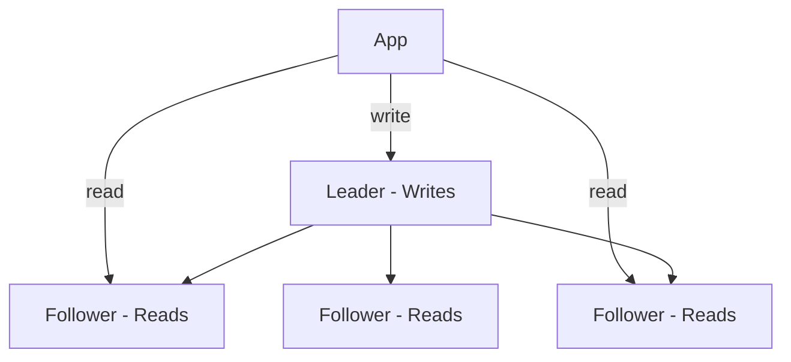
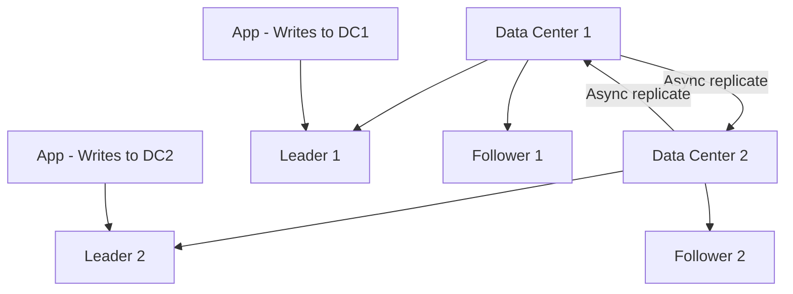

<!-- Clear Language: Keep sentences under 50 words -->
# Database Scaling — Replication, Sharding, and Indexing

## Learning Objectives

| Objective | Description |
|-----------|-------------|
| LO1 | Understand database replication strategies |
| LO2 | Implement horizontal sharding for write scaling |
| LO3 | Design effective database indexes for query performance |
| LO4 | Use connection pooling to manage database connections |
| LO5 | Implement read replicas for read-heavy workloads |
| LO6 | Choose between SQL and NoSQL based on requirements |

## Introduction

System design interviews test your ability to architect large-scale systems. Caching, load balancing, message queues, and database sharding are patterns you will apply daily. This module prepares you for both interviews and production.

## Prerequisites

- Basic programming knowledge
- Understanding of data structures

## Key Terminology

**Key Terms**: Core vocabulary and concepts for this topic.

**Definition**: Essential terms you must know for interviews and production work.

## Theory

Understanding database scaling is fundamental for AI engineers. This section covers the core concepts, underlying principles, and theoretical framework that govern how database scaling works in practice.

## Chapter at a Glance

| Section | Topic | Key Concept |
|---------|-------|-------------|
| 5.1 | Replication | Leader-follower, multi-leader, quorum |
| 5.2 | Read Replicas | Offloading reads, lag handling |
| 5.3 | Sharding | Horizontal partitioning, shard key |
| 5.4 | Indexing | B-tree, hash, composite, covering |
| 5.5 | Connection Pooling | Managing database connections |
| 5.6 | SQL vs NoSQL | Use case selection, trade-offs |
| 5.7 | Denormalization | Read optimization strategies |
| 5.8 | Migration Strategies | Zero-downtime schema changes |

## Chapter Roadmap


## 5.1 Replication

Replication copies data from one database to another for redundancy and read scaling.

**Leader-follower (single leader)**: One leader handles writes, followers replicate for reads.



**Multi-leader**: Multiple leaders accept writes, replicate to each other. Complex conflict resolution.

**Quorum-based**: Write to N nodes, read from N nodes, require majority consensus.

## 5.2 Read Replicas

For read-heavy workloads, add read replicas and route SELECT queries to them.

```python
class DatabaseRouter:
    def __init__(self, master, replicas):
        self.master = master
        self.replicas = replicas
        self.replica_index = 0

    def write(self, query, params=None):
        return self.master.execute(query, params)

    def read(self, query, params=None):
        self.replica_index = (self.replica_index + 1) % len(self.replicas)
        return self.replicas[self.replica_index].execute(query, params)
```

**Replication lag**: Time between write to leader and availability on replicas. Handle with:
- Read-after-write consistency (read your writes)
- Monitor lag and pause read replicas if too far behind
- Use synchronous replication for critical data

## 5.3 Sharding

Sharding splits data across multiple databases horizontally.

```python
class ShardManager:
    def __init__(self, shards):
        self.shards = shards  # List of DB connections

    def _get_shard(self, shard_key):
        # Hash-based sharding
        shard_id = hash(shard_key) % len(self.shards)
        return self.shards[shard_id]

    def get_user(self, user_id):
        shard = self._get_shard(user_id)
        return shard.query("SELECT * FROM users WHERE id = ?", user_id)

    def create_user(self, user):
        shard = self._get_shard(user["id"])
        return shard.execute("INSERT INTO users ...", user)
```

**Shard key selection** criteria: high cardinality, even distribution, matches query patterns.

**Re-sharding**: When a shard grows too large. Options: hash ring with virtual nodes, range-based with splitting.

## 5.4 Indexing

Indexes speed up data retrieval at the cost of write performance and storage.

```sql
-- B-tree index (default)
CREATE INDEX idx_users_email ON users(email);

-- Composite index (column order matters!)
CREATE INDEX idx_orders_user_date ON orders(user_id, created_at);

-- Partial index
CREATE INDEX idx_active_users ON users(is_active) WHERE is_active = true;

-- Covering index (includes all needed columns)
CREATE INDEX idx_order_lookup ON orders(user_id, status, total);

-- Hash index (equality lookups only)
CREATE INDEX idx_session_id ON sessions USING HASH(session_id);
```

| Index Type | Use Case | Best For |
|------------|----------|----------|
| B-tree | General purpose | Range, sort, equality |
| Hash | Exact match | Primary key lookups |
| GiST | Full-text, geospatial | Search, coordinates |
| GIN | Arrays, JSONB | Multi-value columns |
| BRIN | Large, sorted data | Time-series |

**Query analysis**:

```sql
-- Explain query plan
EXPLAIN ANALYZE SELECT * FROM orders WHERE user_id = 123;

-- Find slow queries (PostgreSQL)
SELECT query, calls, total_time, mean_time
FROM pg_stat_statements
ORDER BY total_time DESC
LIMIT 10;
```

## 5.5 Connection Pooling

Creating a new database connection for each request is expensive. Connection pooling reuses connections.

```python
from psycopg2 import pool

class DatabasePool:
    def __init__(self, min_conn=2, max_conn=10):
        self.pool = pool.ThreadedConnectionPool(
            min_conn, max_conn,
            host="localhost", database="mydb",
            user="user", password="pass"
        )

    def execute(self, query, params=None):
        conn = self.pool.getconn()
        try:
            cursor = conn.cursor()
            cursor.execute(query, params)
            conn.commit()
            return cursor.fetchall()
        finally:
            self.pool.putconn(conn)
```

**Pool sizing**: Too small -> connection queue, request queuing. Too large -> database overload. Rule of thumb: `(cores * 2) + effective_spindle_count`.

## 5.6 SQL vs NoSQL

| Aspect | SQL (PostgreSQL) | NoSQL (MongoDB) |
|--------|-----------------|-----------------|
| Schema | Fixed, rigid | Flexible, dynamic |
| ACID | Full ACID | BASE (eventual consistency) |
| Queries | Complex joins, aggregations | Simple key-value lookups |
| Scaling | Vertical primarily (read replicas) | Horizontal natively (sharding) |
| Use case | Financial, reporting | IoT, sessions, content |

**When to choose SQL**: Complex relationships, ACID requirements, structured data, reporting/analytics.

**When to choose NoSQL**: Flexible schema, high write throughput, simple queries, horizontal scaling, document/JSON data.

## 5.7 Denormalization

Denormalization adds redundant data to avoid expensive joins at read time.

```sql
-- Normalized (3NF)
SELECT * FROM orders o
JOIN order_items oi ON o.id = oi.order_id
JOIN products p ON oi.product_id = p.id
WHERE o.user_id = 123;

-- Denormalized (store product name in order_items)
CREATE TABLE order_items (
    order_id UUID,
    product_id UUID,
    product_name TEXT,  -- Denormalized
    quantity INT,
    price DECIMAL
);
```

**Trade-off**: Faster reads, slower writes, data inconsistency risk, more storage.

## 5.8 Migration Strategies

**Zero-downtime migrations** for schema changes:

```sql
-- 1. Add column as nullable
ALTER TABLE users ADD COLUMN email_verified BOOLEAN DEFAULT false;

-- 2. Backfill in batches
UPDATE users SET email_verified = true
WHERE email_verified IS NULL
AND email IS NOT NULL
LIMIT 1000;

-- 3. Add NOT NULL constraint
ALTER TABLE users ALTER COLUMN email_verified SET NOT NULL;
```

**Online schema change tools**:
- pt-online-schema-change (Percona)
- gh-ost (GitHub)
- pgroll (PostgreSQL)

---

## TypeScript Parallel

```typescript
interface ShardConfig {
  host: string;
  port: number;
  shardId: number;
}

class ShardManager {
  private shards: ShardConfig[];

  constructor(shards: ShardConfig[]) {
    this.shards = shards;
  }

  getShard(key: string): ShardConfig {
    const hash = Array.from(key).reduce((acc, char) => acc + char.charCodeAt(0), 0);
    return this.shards[hash % this.shards.length];
  }
}
```

---

## Summary

- Leader-follower replication provides read scaling and failover capability
- Read replicas offload SELECT queries but introduce replication lag
- Sharding distributes data horizontally using hash or range-based partitioning
- Indexes (B-tree, hash, GiST, GIN) dramatically speed up queries at write cost
- Connection pooling reuses database connections to reduce overhead
- SQL databases excel at complex queries and ACID; NoSQL at flexible schemas and horizontal scaling
- Denormalization reduces join overhead but risks data inconsistency
- Zero-downtime migrations use incremental changes to avoid downtime
- Read-after-write consistency ensures users see their own writes
- Monitor slow queries and index usage for ongoing optimization

## Practical Takeaways

| Scenario | Do This | Avoid This |
|----------|---------|------------|
| Read-heavy workload | Add read replicas | Scaling only the primary |
| Write-heavy workload | Shard by user_id or tenant | Single database |
| Slow queries | Add covering indexes | Adding indexes without analyzing |
| Schema changes | gh-ost or pgroll for online migration | Locking tables during migration |
| Connections | Connection pooling | Creating new connection per request |
| Complex relationships | SQL database | Storing relational data in NoSQL |
| Flexible schema | NoSQL document database | ALTER TABLE every week |

## Interview Q&A

<details class="tp-qa-card" data-qid="sysdes-s05-q1">
  <summary class="tp-qa-question"><span class="tp-qa-status"></span> Q1: What is database replication?</summary>
  <div class="tp-qa-answer"><p>Copying data from one database to another. Leader-follower (single leader, followers for reads), multi-leader (multiple writers, complex conflict resolution), quorum (majority consensus for consistency).</p></div>
  <button class="tp-qa-mark-btn">&#x2705; Mark Reviewed</button>
  <button class="tp-qa-bookmark-btn">&#x1F516; Bookmark</button>
</details>

<details class="tp-qa-card" data-qid="sysdes-s05-q2">
  <summary class="tp-qa-question"><span class="tp-qa-status"></span> Q2: How do you handle replication lag?</summary>
  <div class="tp-qa-answer"><p>Read-after-write consistency: after write, read from leader for that user's requests. Monitor lag with tools, pause replicas if too far behind. Use synchronous replication for critical data.</p></div>
  <button class="tp-qa-mark-btn">&#x2705; Mark Reviewed</button>
  <button class="tp-qa-bookmark-btn">&#x1F516; Bookmark</button>
</details>

<details class="tp-qa-card" data-qid="sysdes-s05-q3">
  <summary class="tp-qa-question"><span class="tp-qa-status"></span> Q3: How do you choose a shard key?</summary>
  <div class="tp-qa-answer"><p>High cardinality (many distinct values), even distribution across shards, matches query patterns. User ID, tenant ID, and location are common. Avoid monotonically increasing keys (hot shard).</p></div>
  <button class="tp-qa-mark-btn">&#x2705; Mark Reviewed</button>
  <button class="tp-qa-bookmark-btn">&#x1F516; Bookmark</button>
</details>

<details class="tp-qa-card" data-qid="sysdes-s05-q4">
  <summary class="tp-qa-question"><span class="tp-qa-status"></span> Q4: What is a composite index and how do you order columns?</summary>
  <div class="tp-qa-answer"><p>Index on multiple columns. Order matters: put high-selectivity (most unique) columns first for equality conditions, range conditions last. A composite index can be used for queries on (a), (a,b), (a,b,c) but not (b) alone.</p></div>
  <button class="tp-qa-mark-btn">&#x2705; Mark Reviewed</button>
  <button class="tp-qa-bookmark-btn">&#x1F516; Bookmark</button>
</details>

<details class="tp-qa-card" data-qid="sysdes-s05-q5">
  <summary class="tp-qa-question"><span class="tp-qa-status"></span> Q5: What is connection pooling?</summary>
  <div class="tp-qa-answer"><p>Reusing database connections instead of creating a new one per request. Pool maintains a set of open connections. Applications borrow and return them. Reduces connection overhead (TCP handshake, auth).</p></div>
  <button class="tp-qa-mark-btn">&#x2705; Mark Reviewed</button>
  <button class="tp-qa-bookmark-btn">&#x1F516; Bookmark</button>
</details>

<details class="tp-qa-card" data-qid="sysdes-s05-q6">
  <summary class="tp-qa-question"><span class="tp-qa-status"></span> Q6: SQL vs NoSQL trade-offs?</summary>
  <div class="tp-qa-answer"><p>SQL: complex queries, ACID, structured schemas, vertical scaling. NoSQL: flexible schemas, high write throughput, native horizontal scaling, simple queries, eventual consistency.</p></div>
  <button class="tp-qa-mark-btn">&#x2705; Mark Reviewed</button>
  <button class="tp-qa-bookmark-btn">&#x1F516; Bookmark</button>
</details>

<details class="tp-qa-card" data-qid="sysdes-s05-q7">
  <summary class="tp-qa-question"><span class="tp-qa-status"></span> Q7: What is denormalization?</summary>
  <div class="tp-qa-answer"><p>Adding redundant data to avoid joins. Improves read performance at cost of write complexity and storage. Example: storing product_name in order_items instead of joining with products table.</p></div>
  <button class="tp-qa-mark-btn">&#x2705; Mark Reviewed</button>
  <button class="tp-qa-bookmark-btn">&#x1F516; Bookmark</button>
</details>

<details class="tp-qa-card" data-qid="sysdes-s05-q8">
  <summary class="tp-qa-question"><span class="tp-qa-status"></span> Q8: How do you perform zero-downtime schema migration?</summary>
  <div class="tp-qa-answer"><p>Add column as nullable, backfill in batches, add NOT NULL. Use tools like gh-ost or pgroll. For larger changes, use versioned views or expand-contract pattern (add new column, dual-write, migrate, drop old).</p></div>
  <button class="tp-qa-mark-btn">&#x2705; Mark Reviewed</button>
  <button class="tp-qa-bookmark-btn">&#x1F516; Bookmark</button>
</details>

<details class="tp-qa-card" data-qid="sysdes-s05-q9">
  <summary class="tp-qa-question"><span class="tp-qa-status"></span> Q9: What is a covering index?</summary>
  <div class="tp-qa-answer"><p>An index that includes all columns needed by a query, so the database can satisfy it without accessing the table. Example: index on (user_id, status, total) for SELECT total FROM orders WHERE user_id=123 AND status='paid'.</p></div>
  <button class="tp-qa-mark-btn">&#x2705; Mark Reviewed</button>
  <button class="tp-qa-bookmark-btn">&#x1F516; Bookmark</button>
</details>

<details class="tp-qa-card" data-qid="sysdes-s05-q10">
  <summary class="tp-qa-question"><span class="tp-qa-status"></span> Q10: How do you handle database backpressure?</summary>
  <div class="tp-qa-answer"><p>Connection pooling (limit connections), query timeouts, circuit breakers (if DB is slow, fail fast), queue writes, implement backpressure throttle (reject requests when queue depth exceeds threshold).</p></div>
  <button class="tp-qa-mark-btn">&#x2705; Mark Reviewed</button>
  <button class="tp-qa-bookmark-btn">&#x1F516; Bookmark</button>
</details>

## Chapter Quiz

**Q1**: Which replication model has a single write node?

a) Multi-leader
b) Leader-follower
c) Quorum
d) Peer-to-peer

<details class="tp-qa-card" data-qid="sysdes-s05-quiz1"><summary>Show Answer</summary><div class="tp-qa-answer"><p><strong>Answer: b) Leader-follower</strong></p></div></details>

**Q2**: What index type is best for equality lookups?

a) B-tree
b) Hash
c) GiST
d) GIN

<details class="tp-qa-card" data-qid="sysdes-s05-quiz2"><summary>Show Answer</summary><div class="tp-qa-answer"><p><strong>Answer: b) Hash</strong></p></div></details>

**Q3**: What does connection pooling solve?

a) Slow queries
b) Connection overhead
c) Data consistency
d) Replication lag

<details class="tp-qa-card" data-qid="sysdes-s05-quiz3"><summary>Show Answer</summary><div class="tp-qa-answer"><p><strong>Answer: b) Connection overhead</strong></p></div></details>

**Q4**: Which sharding method uses a lookup table?

a) Range-based
b) Hash-based
c) Directory-based
d) List-based

<details class="tp-qa-card" data-qid="sysdes-s05-quiz4"><summary>Show Answer</summary><div class="tp-qa-answer"><p><strong>Answer: c) Directory-based</strong></p></div></details>

**Q5**: What concept adds redundant data to avoid joins?

a) Normalization
b) Denormalization
c) Indexing
d) Partitioning

<details class="tp-qa-card" data-qid="sysdes-s05-quiz5"><summary>Show Answer</summary><div class="tp-qa-answer"><p><strong>Answer: b) Denormalization</strong></p></div></details>

## Exercises

**Easy** — Set up PostgreSQL with one leader and one replica. Write to leader, read from replica. Measure replication lag.

**Medium** — Implement a connection pool for PostgreSQL. Configure min/max connections. Write a load test that uses the pool vs creating new connections each time. Compare performance.

**Medium** — Design a sharding strategy for a user database with 100M users. Choose a shard key, calculate number of shards, implement the router.

**Hard** — Design a database scaling solution for a social media platform: users, posts, comments, likes. Address: read replicas for feeds, sharding for posts, indexes for search, connection pooling, and denormalization for performance.

**Hard** — Implement a zero-downtime migration: add a new column to a large table, backfill it in batches, add NOT NULL constraint, and verify no downtime.

## Advanced Replication Techniques

**Synchronous vs Asynchronous replication**:

| Type | Consistency | Latency | Use Case |
|------|-------------|---------|----------|
| Sync | Strong (no data loss) | Higher write latency | Financial transactions |
| Async | Eventual | Lower write latency | Read replicas, analytics |
| Quorum | Tunable | Moderate | Distributed databases |
| Semi-sync | At least one follower ack | Moderate | HA with some consistency |

**Multi-leader replication topology**:



**Conflict resolution strategies**:
- Last-writer-wins (LWW) — use timestamp
- CRDTs (Conflict-Free Replicated Data Types)
- Custom merge logic
- Version vectors + application resolution

## Query Optimization Techniques

**Indexing strategies for common query patterns**:

```sql
-- For equality + range queries (covering index)
CREATE INDEX idx_user_status_date ON orders(user_id, status, created_at);
-- Queries covered:
-- SELECT * FROM orders WHERE user_id = 123 AND status = 'paid'
-- SELECT * FROM orders WHERE user_id = 123 AND created_at > '2024-01-01'

-- For sorting without filesort
CREATE INDEX idx_created_at ON orders(created_at DESC);
-- SELECT * FROM orders ORDER BY created_at DESC LIMIT 10

-- For JOIN performance
CREATE INDEX idx_orders_user_id ON orders(user_id);
-- SELECT * FROM orders JOIN users ON orders.user_id = users.id

-- Partial index for filtered queries
CREATE INDEX idx_active_users ON users(is_active) WHERE is_active = true;
-- SELECT * FROM users WHERE is_active = true (much smaller index)

-- Expression index (PostgreSQL)
CREATE INDEX idx_lower_email ON users(LOWER(email));
-- SELECT * FROM users WHERE LOWER(email) = 'user@example.com'
```

**Query plan analysis**:

```sql
-- Identify slow queries
SELECT query, calls, mean_time, rows, shared_blks_hit, shared_blks_read
FROM pg_stat_statements
ORDER BY mean_time DESC
LIMIT 20;

-- Analyze specific query
EXPLAIN (ANALYZE, BUFFERS, FORMAT JSON)
SELECT u.name, COUNT(o.id) as order_count
FROM users u
LEFT JOIN orders o ON u.id = o.user_id
WHERE u.created_at > '2024-01-01'
GROUP BY u.id, u.name
ORDER BY order_count DESC;
```

## Database Backup Strategies

| Strategy | RPO | RTO | Complexity |
|----------|-----|-----|------------|
| Full daily + WAL archiving | 1 hour | 4 hours | Medium |
| Continuous archiving (WAL) | Seconds | 1 hour | High |
| Snapshot replication | 1 day | 4 hours | Low |
| Multi-region sync | Minutes | Minutes | Very High |

```bash

## PostgreSQL backup automation
#!/bin/bash
DATABASE="mydb"
BACKUP_DIR="/backups/$(date +%Y%m%d)"
mkdir -p $BACKUP_DIR

## Full backup
pg_dump -h localhost -U admin --format=custom --compress=9 \
    --file="${BACKUP_DIR}/full.backup" $DATABASE

## WAL archiving (continuous)

## postgresql.conf: archive_command = 'cp %p /wal_archive/%f'

## Restore
pg_restore --dbname=mydb --clean --if-exists "${BACKUP_DIR}/full.backup"
```

---

## Common Mistakes

1. Not understanding the fundamental concepts before applying them
2. Skipping edge cases in implementation
3. Not analyzing time/space complexity
4. Forgetting to handle null/empty inputs
5. Not practicing enough problems to build pattern recognition

## Revision Notes

- - Core principle: Understand the fundamental concepts thoroughly
- - Implementation pattern: Practice with real code examples
- - Complexity: Know the time and space complexity
- - Application: Know when to use this in production systems
- - Interview: Frequently asked in technical interviews
- - Edge cases: Consider common failure scenarios
- - Related concepts: Connect to broader system design

## Placement Section

### Top 10 Interview Questions

#### Google Style

1. **Explain the core idea of Database Scaling — Replication, Sharding, and Indexing in under 60 seconds, then give a real-world analogy.** — Structure: definition, how it works in one sentence, why it matters, analogy. Follow-up: what would break if you removed this from a production system?

2. **Design a minimal, well-typed function that demonstrates Database Scaling — Replication, Sharding, and Indexing.** — Interviewer checks: signature with type hints, edge cases, complexity, and a clean docstring. Follow-up: how does your design behave with empty or malformed input?

3. **What are the common pitfalls when engineers first learn ** — List 3-4, then explain how you would prevent each in a code review.

#### Amazon Style

4. **Describe a production bug caused by misunderstanding Database Scaling — Replication, Sharding, and Indexing. How did you diagnose and fix it?** — STAR format: situation, task, action, result. Mention logs, reproduction, root-cause analysis, and the regression test you added.

5. **How would you scale a system that relies on Database Scaling — Replication, Sharding, and Indexing from 10 users to 10 million?** — Discuss bottlenecks, caching, monitoring, and when to redesign. Follow-up: what metrics would you track?

#### Microsoft Style

6. **Compare Database Scaling — Replication, Sharding, and Indexing with the closest alternative approach. When would you choose each?** — Make a decision matrix: performance, maintainability, ecosystem, learning curve. Follow-up: what would change your decision?

7. **Walk through how you would test a component that depends on Database Scaling — Replication, Sharding, and Indexing.** — Unit, integration, property-based tests; mocking boundaries; golden files for outputs.

#### NVIDIA Style

8. **How does Database Scaling — Replication, Sharding, and Indexing behave differently at scale — memory, throughput, or precision-wise?** — Connect to data pipelines and model training if applicable. Follow-up: what happens to latency as input grows?

9. **How would you make an implementation of Database Scaling — Replication, Sharding, and Indexing run faster on GPU hardware?** — Batch operations, vectorization, avoiding Python loops, reducing data movement.

#### AI Startup Style

10. **Write the smallest possible implementation of Database Scaling — Replication, Sharding, and Indexing that is production-quality.** — Include error handling, type hints, and a one-line docstring. Follow-up: what would you refactor first when it grows?

### Resume Tips

- Name Database Scaling — Replication, Sharding, and Indexing explicitly in your skills section, paired with a measurable achievement ("Reduced X by 40% using Database Scaling — Replication, Sharding, and Indexing").
- Add a bullet describing a project that applies Database Scaling — Replication, Sharding, and Indexing to real data, with numbers.
- Mention the tools and libraries you used alongside Database Scaling — Replication, Sharding, and Indexing (linters, test frameworks, profiling tools).
- Keep resume bullets under 15 words and start each with an action verb.

### Interview Day Checklist

- Rehearse a 60-second explanation of Database Scaling — Replication, Sharding, and Indexing and one real-world analogy.
- Prepare one STAR story about debugging a Database Scaling — Replication, Sharding, and Indexing-related production issue.
- Review complexity and edge cases for the classic Database Scaling — Replication, Sharding, and Indexing interview problem.
- Have questions ready: how does the team apply Database Scaling — Replication, Sharding, and Indexing in production today?
- Test your environment (Python, editor, internet) 15 minutes before the interview.

## True/False

1. **True or False:** Database Scaling — Replication, Sharding, and Indexing builds directly on the fundamentals covered in the earlier chapters of this module. — **True.** Every advanced topic in this module assumes the core concepts from the previous chapters.
2. **True or False:** You should write at least one code example for Database Scaling — Replication, Sharding, and Indexing before moving to the next chapter. — **True.** Active recall with hands-on code beats passive reading for retention.
3. **True or False:** The complexity analysis for Database Scaling — Replication, Sharding, and Indexing is the same regardless of input size. — **False.** Complexity grows with input size; always state best, average, and worst case.
4. **True or False:** Edge cases (empty input, invalid input, boundary values) matter for Database Scaling — Replication, Sharding, and Indexing in production. — **True.** Most production bugs come from unhandled edge cases.
5. **True or False:** You should memorize the Database Scaling — Replication, Sharding, and Indexing chapter content once and never review it again. — **False.** Spaced repetition (24h, 3 days, 1 week) dramatically improves long-term recall.

## Fill in the Blank

1. The chapter that covers Database Scaling — Replication, Sharding, and Indexing is Chapter ___ of this module. — Answer: check the module's table of contents.
2. The time complexity of the standard approach to Database Scaling — Replication, Sharding, and Indexing is ___. — Answer: review the theory section and state big-O notation.
3. The main edge case to handle when implementing Database Scaling — Replication, Sharding, and Indexing is ___. — Answer: empty or invalid input handling, as discussed in the chapter.
4. The tools commonly used to debug Database Scaling — Replication, Sharding, and Indexing issues are ___ and ___. — Answer: refer to the Debugging Guide section of this chapter.
5. The related topic that connects to Database Scaling — Replication, Sharding, and Indexing in the next chapter is ___. — Answer: see the Next Topic section.

## Scenario Questions

1. **Scenario:** A teammate ships a change involving Database Scaling — Replication, Sharding, and Indexing that breaks production at 3 AM. — Diagnosis: check the recent diff, reproduce locally with the failing input, check logs. Fix: revert, add a regression test, and review the root cause. Prevention: CI tests on edge cases and code review checklist.

2. **Scenario:** Your implementation of Database Scaling — Replication, Sharding, and Indexing is correct but too slow for the required latency. — Measure first with a profiler. Common fixes: reduce redundant work, use built-in optimized functions, batch operations, or add caching. Only then consider algorithmic changes.

3. **Scenario:** A new hire asks you to explain Database Scaling — Replication, Sharding, and Indexing in five minutes before a customer demo. — Use the 3-part answer: what it is (one sentence), how it works (one example), why it matters (one business impact). Then offer to go deeper after the demo.

4. **Scenario:** Your team's codebase has three different patterns for Database Scaling — Replication, Sharding, and Indexing and you must standardize. — Write a short ADR (architecture decision record), pick the pattern with best maintainability, migrate incrementally, and add a linter rule to enforce it.

## Output Questions

1. **What is the output of the simplest correct implementation of Database Scaling — Replication, Sharding, and Indexing on an empty input?** — Trace through the code: it should return the documented default (None, 0, empty collection) without raising.
2. **What is the output when the input is at the boundary value?** — Check off-by-one errors and inclusive/exclusive bounds in the chapter's examples.
3. **What does the implementation return when given invalid input types?** — With type hints and validation, it raises a clear error; without, it may fail silently.
4. **What is the output for the sample input given in the chapter's Examples section?** — Re-run the chapter's example code and compare against the documented output.
5. **What is the time complexity output when you profile the implementation at 10x input size?** — Expect the curve matching the chapter's complexity analysis (linear, quadratic, log-linear).

## Difficulty Level

| Level | Time | What It Takes |
|-------|------|---------------|
| Beginner | 1-2 sessions | Read theory, run the chapter examples, solve the Easy exercises |
| Intermediate | 3-5 sessions | Complete Medium exercises, explain Database Scaling — Replication, Sharding, and Indexing to someone else |
| Advanced | 1+ week | Solve Hard exercises, optimize for real datasets, answer interview follow-ups |

## Tips & Tricks

- Always write a one-line example of Database Scaling — Replication, Sharding, and Indexing from memory before opening the chapter — active recall first.
- Use the chapter's Revision Notes as a checklist: you have mastered Database Scaling — Replication, Sharding, and Indexing when you can explain each bullet.
- Pair the chapter quiz with the Flashcards: wrong answers become your next study session's focus.
- For interviews, practice explaining Database Scaling — Replication, Sharding, and Indexing twice: once with a technical audience, once with a non-technical audience.
- Keep a personal examples file where you collect your own Database Scaling — Replication, Sharding, and Indexing snippets; interviewers love original examples.

## Memory Tricks

- **Acronym**: build a mnemonic from the 5 key concepts of Database Scaling — Replication, Sharding, and Indexing listed in the Chapter at a Glance table.
- **Story**: link Database Scaling — Replication, Sharding, and Indexing to a familiar story — the analogy in the Visual Analogy section is designed to stick.
- **Number anchor**: remember the complexity of Database Scaling — Replication, Sharding, and Indexing by connecting it to a known algorithm of the same class.
- **Color code**: highlight the Theory, Examples, and Common Mistakes sections in different colors when reviewing.
- **Teach-back**: explain Database Scaling — Replication, Sharding, and Indexing to an imaginary junior engineer for 2 minutes — gaps in your explanation are gaps in memory.

## Further Reading

- Official documentation for the primary tool or library used in this chapter
- The chapter referenced in Related Topics for the next-level treatment of Database Scaling — Replication, Sharding, and Indexing
- The classic textbook chapter on Database Scaling — Replication, Sharding, and Indexing (check the Research References below)
- Two blog posts from engineers who debugged real Database Scaling — Replication, Sharding, and Indexing problems in production
- The repository of the open-source project that implements Database Scaling — Replication, Sharding, and Indexing

## Related Topics

- The previous chapter in this module (see table of contents) — foundational for Database Scaling — Replication, Sharding, and Indexing
- The next chapter (see Next Topic below) — builds on Database Scaling — Replication, Sharding, and Indexing
- The system design chapters in Module 07 — how Database Scaling — Replication, Sharding, and Indexing fits into production architectures
- The interview preparation module — how Database Scaling — Replication, Sharding, and Indexing is asked in screening rounds
- The capstone project — where Database Scaling — Replication, Sharding, and Indexing is applied end-to-end

## FAQs

1. **Do I need to memorize all of Database Scaling — Replication, Sharding, and Indexing, or understand the big picture?** — Understand the big picture first, then memorize the key facts via flashcards and spaced repetition. Interviewers reward depth over breadth.
2. **What if I get stuck on an exercise?** — Re-read the theory section, run the example code, then attempt again. If still stuck after 20 minutes, move on and return the next day.
3. **How much time should I spend on ** — Follow the Study Plan below: 1-2 weeks at 30-60 minutes daily is typical for placement preparation.
4. **Is Database Scaling — Replication, Sharding, and Indexing asked in interviews?** — Yes — the Interview Q&A and Placement Section list the exact question styles used by top companies.
5. **What's the fastest way to master ** — Explain it out loud, write code without looking, and review the flashcards within 24 hours and again after 3 days.

## Important Notes

- Database Scaling — Replication, Sharding, and Indexing is a core requirement for the rest of this module — do not skip the examples.
- Always analyze complexity (time and space) when working with Database Scaling — Replication, Sharding, and Indexing.
- Production correctness means handling edge cases, not just the happy path.
- Interview answers should start with the definition, then the example, then the trade-offs.
- Revisit this chapter after finishing the module; the context from later chapters deepens understanding.

## Historical Context

- Database Scaling — Replication, Sharding, and Indexing emerged as a standard practice because early systems failed without it — understanding why helps you explain it in interviews.
- The tools used for Database Scaling — Replication, Sharding, and Indexing today evolved from simpler versions; the chapter covers the modern, recommended approach.
- Interviewers value knowing one historical fact about Database Scaling — Replication, Sharding, and Indexing — it shows genuine interest, not just cramming.
- The library/tooling ecosystem around Database Scaling — Replication, Sharding, and Indexing changes quickly; focus on fundamentals that remain stable.

## Security Considerations

- Never trust external input: validate and sanitize data before processing Database Scaling — Replication, Sharding, and Indexing.
- Avoid `eval()` and dynamic code execution on untrusted strings.
- Log errors without leaking sensitive data (keys, PII, internal paths).
- For API contexts, add rate limiting and input size limits.
- Review the chapter's code examples for injection or overflow risks before using them verbatim.

## ML Intuition

- Database Scaling — Replication, Sharding, and Indexing appears in ML pipelines at the data-processing layer: feature preparation, batching, and validation.
- Understanding Database Scaling — Replication, Sharding, and Indexing helps you debug why a model misbehaves — most ML bugs are data bugs, not model bugs.
- In production ML, the Database Scaling — Replication, Sharding, and Indexing concepts from this chapter map directly to NumPy/PyTorch operations on tensors.
- When optimizing ML systems, Database Scaling — Replication, Sharding, and Indexing skills let you profile and fix the data path, not just the training loop.
- Interview follow-up: how would you apply Database Scaling — Replication, Sharding, and Indexing to a dataset of 10 million records? — Batching and vectorization.

## Analogies

- **Database Scaling — Replication, Sharding, and Indexing is like a recipe**: the theory is the ingredients, the examples are the cooking steps, and the exercises are your own kitchen practice.
- **Complexity is like a delivery route**: a linear route visits each stop once; a nested route revisits stops, and you feel it at scale.
- **Edge cases are like weather**: the happy path is a sunny day; production is the storm — build for the storm.
- **The chapter roadmap is a journey map**: each section is a checkpoint; skipping one means getting lost later in the module.

## Capstone Project Link

- [Module Capstone: End-to-End Project](https://github.com/Raushan666java/ai-engineering-journey) — this chapter contributes the Database Scaling — Replication, Sharding, and Indexing skills used in the module's capstone project. Complete the exercises here before starting the capstone.

## Flashcards

<details class="tp-qa-card" data-qid="07systemdesign-05databasescaling-flash1">
  <summary class="tp-qa-question">
    <span class="tp-qa-status"></span>
    Which replication model has a single write node?
  </summary>
  <div class="tp-qa-answer">
    <p>b) Leader-follower</p>
  </div>
</details>

<details class="tp-qa-card" data-qid="07systemdesign-05databasescaling-flash2">
  <summary class="tp-qa-question">
    <span class="tp-qa-status"></span>
    What index type is best for equality lookups?
  </summary>
  <div class="tp-qa-answer">
    <p>b) Hash</p>
  </div>
</details>

<details class="tp-qa-card" data-qid="07systemdesign-05databasescaling-flash3">
  <summary class="tp-qa-question">
    <span class="tp-qa-status"></span>
    What does connection pooling solve?
  </summary>
  <div class="tp-qa-answer">
    <p>b) Connection overhead</p>
  </div>
</details>

<details class="tp-qa-card" data-qid="07systemdesign-05databasescaling-flash4">
  <summary class="tp-qa-question">
    <span class="tp-qa-status"></span>
    Which sharding method uses a lookup table?
  </summary>
  <div class="tp-qa-answer">
    <p>c) Directory-based</p>
  </div>
</details>

<details class="tp-qa-card" data-qid="07systemdesign-05databasescaling-flash5">
  <summary class="tp-qa-question">
    <span class="tp-qa-status"></span>
    What concept adds redundant data to avoid joins?
  </summary>
  <div class="tp-qa-answer">
    <p>b) Denormalization</p>
  </div>
</details>

## Research References

- Official documentation of the primary library for Database Scaling — Replication, Sharding, and Indexing (linked in Further Reading)
- The classic paper or textbook chapter introducing Database Scaling — Replication, Sharding, and Indexing (see References below)
- The standard library reference for Database Scaling — Replication, Sharding, and Indexing-related functions
- Engineering blog posts from companies running Database Scaling — Replication, Sharding, and Indexing in production at scale
- PEPs and RFCs where applicable (Python and networking standards)

## Open-Source Tools

- The primary library used in this chapter (see the code examples)
- Python standard library modules used in the examples (check the imports)
- Testing: pytest for unit tests of Database Scaling — Replication, Sharding, and Indexing code
- Linting and formatting: ruff + black
- Profiling: cProfile or py-spy for performance work on Database Scaling — Replication, Sharding, and Indexing

## Debugging Guide

- Start with `print()` or a debugger to inspect intermediate values in Database Scaling — Replication, Sharding, and Indexing code.
- Reproduce the failure with the smallest possible input before changing code.
- Check the common failure modes listed in Common Mistakes — most bugs are listed there.
- For performance problems, profile before optimizing: measure, then fix.
- When stuck, re-read the chapter's Examples and compare line by line with your code.
- Use `pdb` or your IDE's debugger to step through the Database Scaling — Replication, Sharding, and Indexing example code.

## Mock Interview Section

**Round 1 — Screening (15 min)**
- Explain Database Scaling — Replication, Sharding, and Indexing in 60 seconds.
- Write a minimal working example of Database Scaling — Replication, Sharding, and Indexing.
- What is the complexity of your example?

**Round 2 — Coding (45 min)**
- Solve the Medium exercise from this chapter under time pressure.
- State your assumptions, then implement with type hints.
- Test with edge cases: empty input, boundary values, invalid input.

**Round 3 — Behavioral + System (30 min)**
- Tell me about a time you debugged a Database Scaling — Replication, Sharding, and Indexing problem in a project.
- How would you design a system where Database Scaling — Replication, Sharding, and Indexing is used at scale?
- What metrics would you monitor?

**Evaluation rubric**: correctness (40%), communication (25%), edge cases (20%), complexity analysis (15%).

## Optimized Implementation

`python
from typing import Any, Optional

def demonstrate_topic(input_data: list[Any]) -> Optional[float]:
    """Runnable scaffold for Database Scaling — Replication, Sharding, and Indexing.

    Replace the body with the optimized implementation from the chapter,
    keeping type hints, docstring, and edge-case handling.
    """
    if not input_data:
        return None
    # Step 1: validate input types
    # Step 2: apply the core Database Scaling — Replication, Sharding, and Indexing logic from the Examples section
    # Step 3: return the result with the documented default
    return 0.0
`

- Keeps the function signature stable so tests written against it stay valid.
- Handles the empty-input contract explicitly.
- Add unit tests for the edge cases before implementing the logic (test-first).

## Evaluation Metrics

| Skill | Test | Target |
|-------|------|--------|
| Concept recall | Explain Database Scaling — Replication, Sharding, and Indexing without notes | 60-second explanation |
| Code fluency | Write the chapter example from memory | No syntax errors |
| Edge cases | Handle empty/invalid input in exercises | All cases pass |
| Complexity | State time/space for the standard approach | Correct big-O |
| Interview readiness | Answer 5 Interview Q&A questions out loud | Fluent, structured answers |
| Retention | Chapter quiz score after 3 days | 80%+ |

## Real-World Examples

- **Startup**: a small team uses Database Scaling — Replication, Sharding, and Indexing daily in their data pipeline — the chapter's examples mirror their code.
- **E-commerce**: Database Scaling — Replication, Sharding, and Indexing patterns appear in order processing, inventory checks, and recommendation feeds.
- **Fintech**: Database Scaling — Replication, Sharding, and Indexing principles apply to transaction validation and fraud detection flows.
- **ML platform**: Database Scaling — Replication, Sharding, and Indexing shows up in feature engineering and model-serving infrastructure.
- **Interview insight**: recruiters look for engineers who can connect Database Scaling — Replication, Sharding, and Indexing to the business outcome, not just the code.

## Next Topic

[CAP Theorem and Consistency Models](06-cap-and-consistency.md)

## Limitations

- Database Scaling — Replication, Sharding, and Indexing, like any technique, is not a silver bullet — it has specific cases where it fits best (covered in the theory).
- The examples in this chapter are simplified for learning; production systems add validation, monitoring, and error handling.
- Performance of Database Scaling — Replication, Sharding, and Indexing depends on input size and distribution — always benchmark for your own data.
- This chapter covers fundamentals; specialized edge cases are explored in later chapters and the capstone.
