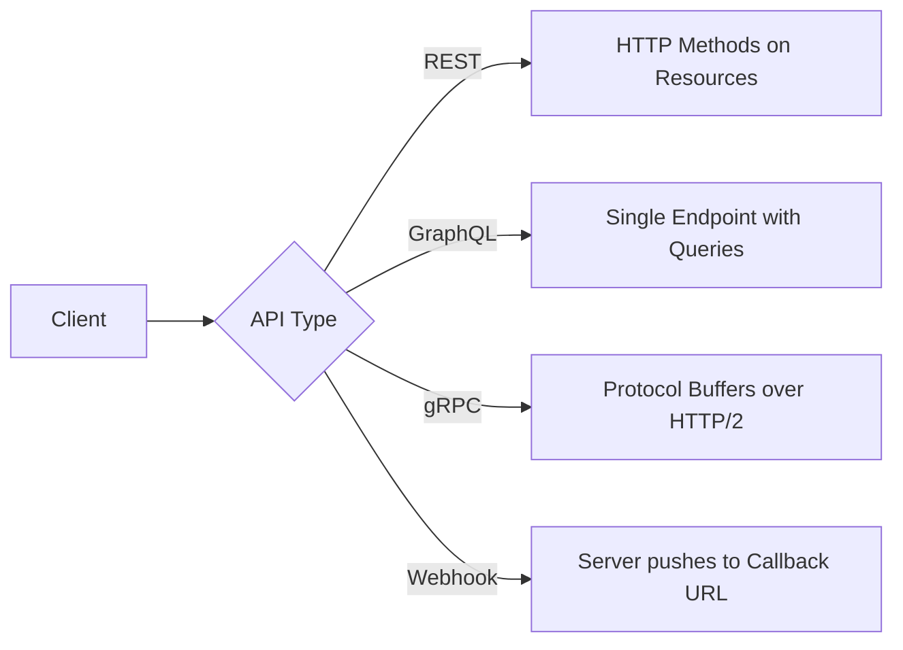

<!-- Clear Language: Keep sentences under 50 words -->
# API Design Patterns — REST, GraphQL, gRPC, Webhooks

## Learning Objectives

| Objective | Description |
|-----------|-------------|
| LO1 | Design RESTful APIs following resource-oriented design principles |
| LO2 | Implement GraphQL schemas with efficient queries and mutations |
| LO3 | Build gRPC services with Protocol Buffers and bidirectional streaming |
| LO4 | Design webhook architectures with delivery guarantees and retry logic |
| LO5 | Compare REST, GraphQL, gRPC, and webhooks for different use cases |
| LO6 | Apply API versioning, pagination, error handling, and documentation standards |

## Introduction

System design interviews test your ability to architect large-scale systems. Caching, load balancing, message queues, and database sharding are patterns you will apply daily. This module prepares you for both interviews and production.

## Prerequisites

- Basic programming knowledge
- Understanding of data structures

## Key Terminology

**Key Terms**: Core vocabulary and concepts for this topic.

**Definition**: Essential terms you must know for interviews and production work.

## Theory

Understanding api design patterns is fundamental for AI engineers. This section covers the core concepts, underlying principles, and theoretical framework that govern how api design patterns works in practice.

## Chapter at a Glance

| Section | Topic | Key Concept |
|---------|-------|-------------|
| 7.1 | RESTful API Design | Resources, HTTP methods, status codes, HATEOAS |
| 7.2 | GraphQL | Schema, resolvers, N+1 problem, subscriptions |
| 7.3 | gRPC & Protocol Buffers | Service definition, streaming, interceptors |
| 7.4 | Webhooks | Delivery, retry, idempotency, security verification |
| 7.5 | API Versioning | URL, header, query parameter strategies |
| 7.6 | Documentation & Standards | OpenAPI, JSON Schema, API gateways |

## Chapter Roadmap


## 7.1 RESTful API Design

REST (Representational State Transfer) uses resources identified by URLs and manipulated via standard HTTP methods. Each resource has a unique URL, a representation format (typically JSON), and supports GET, POST, PUT, PATCH, DELETE operations.

```typescript
import express from "express";
const app = express();

app.get("/api/v1/users/:id", async (req, res) => {
  const user = await db.users.findUnique({ where: { id: req.params.id } });
  if (!user) return res.status(404).json({ error: "not_found" });
  res.json(user);
});
```

**HTTP status codes**: 200 (OK), 201 (Created), 204 (No Content), 400 (Bad Request), 401 (Unauthorized), 403 (Forbidden), 404 (Not Found), 409 (Conflict), 422 (Validation Error), 429 (Rate Limited), 500 (Server Error). Use consistent error response format with machine-readable error codes.

---

## 7.2 GraphQL

GraphQL lets clients request exactly the data they need through a single endpoint. Built around three operation types: Query (read), Mutation (write), Subscription (real-time).

```typescript
import { ApolloServer, gql } from "apollo-server";
import DataLoader from "dataloader";

const typeDefs = gql`
  type User { id: ID!; name: String!; posts: [Post!]! }
  type Post { id: ID!; title: String!; author: User! }
  type Query { user(id: ID!): User; posts(limit: Int): [Post!]! }
  type Mutation { createPost(title: String!): Post! }
`;

const userLoader = new DataLoader(async (ids: readonly string[]) => {
  const users = await db.users.findMany({ where: { id: { in: ids as string[] } } });
  return ids.map((id) => users.find((u) => u.id === id) || null);
});

const resolvers = {
  Query: { user: (_, { id }) => userLoader.load(id) },
  Post: { author: (post) => userLoader.load(post.authorId) },
};
```

**N+1 problem**: DataLoader batches individual loads into a single query per request tick, solving the N+1 problem where fetching N posts and their authors would otherwise require N+1 queries.

---

## 7.3 gRPC & Protocol Buffers

gRPC uses Protocol Buffers for interface definition and HTTP/2 for transport. Supports four streaming patterns: unary, server streaming, client streaming, and bidirectional streaming.

```protobuf
syntax = "proto3";
package userservice;

service UserService {
  rpc GetUser (GetUserRequest) returns (User);
  rpc ListUsers (ListUsersRequest) returns (stream User);
  rpc TrackActivity (stream ActivityEvent) returns (ActivitySummary);
  rpc Chat (stream ChatMessage) returns (stream ChatMessage);
}

message User { string id = 1; string name = 2; string email = 3; }
message GetUserRequest { string id = 1; }
message ChatMessage { string user_id = 1; string room_id = 2; string content = 3; }
```

**Advantages**: Binary serialization (3-10x faster than JSON), strong typing with code generation, native streaming support, HTTP/2 multiplexing and header compression.

---

## 7.4 Webhooks

Webhooks are user-defined HTTP callbacks triggered by server events. The server pushes data to the client's endpoint when an event occurs, enabling event-driven architectures.

```typescript
class WebhookDelivery {
  private retries = [1000, 5000, 15000, 60000, 300000];

  async deliver(url: string, event: any, secret: string): Promise<boolean> {
    for (let i = 0; i < this.retries.length; i++) {
      try {
        const sig = this.sign(event, secret);
        const res = await fetch(url, {
          method: "POST",
          headers: {
            "Content-Type": "application/json",
            "X-Signature": sig,
            "X-Event-ID": event.id,
          },
          body: JSON.stringify(event),
        });
        if (res.ok) return true;
        if ([400, 401, 403].includes(res.status)) return false;
      } catch {
        // Network error, retry
      }
      if (i < this.retries.length - 1)
        await new Promise((r) => setTimeout(r, this.retries[i]));
    }
    return false;
  }

  private sign(payload: any, secret: string): string {
    const crypto = require("crypto");
    return crypto
      .createHmac("sha256", secret)
      .update(JSON.stringify(payload))
      .digest("hex");
  }
}
```

**Best practices**: HMAC signature verification, HTTPS-only endpoints, idempotency keys for deduplication, exponential backoff with dead-letter queue after exhausting retries.

---

## 7.5 API Versioning

Four main versioning strategies: URL path (/api/v1/users), header-based (Accept: application/vnd.myapp.v1+json), query parameter (?version=1), and content negotiation.

```typescript
class VersioningMiddleware {
  private supported: string[];
  private default: string;

  constructor(supported: string[], defaultVer: string) {
    this.supported = supported;
    this.default = defaultVer;
  }

  middleware() {
    return (req: any, res: any, next: any) => {
      const version =
        req.headers["accept-version"] || req.query.version || this.default;
      if (!this.supported.includes(version)) {
        return res.status(400).json({
          error: "unsupported_version",
          supported: this.supported,
        });
      }
      req.apiVersion = version;
      next();
    };
  }
}
```

**Recommendation**: URL path versioning for public APIs (explicit, easy to route, cache-friendly). Support at least two versions simultaneously with deprecation headers (Sunset, Deprecation).

---

## 7.6 API Documentation & Standards

OpenAPI (Swagger) is the industry standard for documenting REST APIs with machine-readable specifications. JSON Schema provides type definitions for request/response bodies.

```typescript
function generateOpenAPISpec() {
  return {
    openapi: "3.0.3",
    info: { title: "Platform API", version: "1.0.0" },
    servers: [{ url: "https://api.example.com/v1" }],
    paths: {
      "/users/{id}": {
        get: {
          summary: "Get user by ID",
          parameters: [
            { name: "id", in: "path", required: true, schema: { type: "string" } },
          ],
          responses: { "200": { description: "User found" } },
        },
      },
    },
  };
}
```

**API gateways** (Kong, Envoy, AWS API Gateway): centralize rate limiting, authentication, routing, logging, and monitoring at a single entry point.

---

## TypeScript Parallel

```typescript
class APIClient {
  constructor(private baseUrl: string) {}

  async get<T>(path: string): Promise<T> {
    const res = await fetch(`${this.baseUrl}${path}`);
    if (!res.ok) throw new Error(`API error: ${res.status}`);
    return res.json();
  }

  async graphql<T>(query: string, vars?: any): Promise<T> {
    const res = await fetch(`${this.baseUrl}/graphql`, {
      method: "POST",
      headers: { "Content-Type": "application/json" },
      body: JSON.stringify({ query, variables: vars }),
    });
    const { data, errors } = await res.json();
    if (errors) throw new Error(errors[0].message);
    return data;
  }
}
```

---

## Summary

- REST uses resource-oriented URLs with standard HTTP methods and status codes
- GraphQL solves over-fetching and under-fetching but requires DataLoader for the N+1 problem
- gRPC with Protocol Buffers provides high-performance binary serialization and four streaming patterns
- Webhooks enable event-driven architecture with push delivery and HMAC security verification
- URL path versioning is the most common and pragmatic versioning strategy for public APIs
- OpenAPI (Swagger) is the industry standard for documenting REST APIs
- API gateways centralize cross-cutting concerns: authentication, rate limiting, routing, logging
- DataLoader batches individual loads into a single query, solving the GraphQL N+1 problem
- Webhook delivery should include exponential backoff retry and dead-letter queue
- Choose API style based on use case: REST for simple CRUD, GraphQL for complex data graphs, gRPC for inter-service communication

## Practical Takeaways

| Scenario | Do This | Avoid This |
|----------|---------|------------|
| Public API | REST with OpenAPI documentation | gRPC (poor browser support) |
| Complex data queries | GraphQL with DataLoader | REST (multiple round-trips) |
| Inter-service communication | gRPC with binary protocol | REST with JSON overhead |
| Real-time events | Webhooks with HMAC verification | Polling (resource waste) |
| Bidirectional streaming | gRPC bidirectional streaming | REST polling (high latency) |
| Microservices | gRPC or async messaging | REST synchronous blocking |

## Interview Q&A

<details class="tp-qa-card" data-qid="sd07-q1">
  <summary class="tp-qa-question">
    <span class="tp-qa-status"></span>
    Q1: Compare REST and GraphQL. When would you use each?
  </summary>
  <div class="tp-qa-answer">
    <p><strong>REST</strong> is resource-oriented with multiple endpoints. Best for simple CRUD, public APIs, when caching is important (URLs are cache keys). <strong>GraphQL</strong> has a single endpoint with client-specified fields. Best for complex data graphs (dashboards, social feeds), mobile APIs (bandwidth constrained), when client data requirements vary significantly. Use REST for stability and simplicity; use GraphQL when clients need flexible data shapes.</p>
  </div>
  <button class="tp-qa-mark-btn">✅ Mark Reviewed</button>
  <button class="tp-qa-bookmark-btn">🔖 Bookmark</button>
</details>

<details class="tp-qa-card" data-qid="sd07-q2">
  <summary class="tp-qa-question">
    <span class="tp-qa-status"></span>
    Q2: How do you handle the N+1 problem in GraphQL?
  </summary>
  <div class="tp-qa-answer">
    <p>Use <strong>DataLoader</strong> which batches individual loads within a request tick and caches results. Instead of loading each post's author separately, DataLoader collects all author IDs, dispatches a single batched query, and distributes results. Also consider: look-ahead patterns to eagerly load related data, query complexity analysis to reject expensive queries, and field-level resolvers with DataLoader.</p>
  </div>
  <button class="tp-qa-mark-btn">✅ Mark Reviewed</button>
  <button class="tp-qa-bookmark-btn">🔖 Bookmark</button>
</details>

<details class="tp-qa-card" data-qid="sd07-q3">
  <summary class="tp-qa-question">
    <span class="tp-qa-status"></span>
    Q3: What are the advantages of gRPC over REST for microservices?
  </summary>
  <div class="tp-qa-answer">
    <p><strong>1)</strong> Protocol Buffers are 3-10x faster than JSON with smaller payloads. <strong>2)</strong> HTTP/2 multiplexing and header compression reduce overhead. <strong>3)</strong> Strong typing with code generation across multiple languages. <strong>4)</strong> Native streaming support (4 patterns). <strong>5)</strong> Built-in deadline/timeout propagation. Trade-offs: browser support requires gRPC-Web proxy, less human-readable debugging, smaller ecosystem compared to REST.</p>
  </div>
  <button class="tp-qa-mark-btn">✅ Mark Reviewed</button>
  <button class="tp-qa-bookmark-btn">🔖 Bookmark</button>
</details>

<details class="tp-qa-card" data-qid="sd07-q4">
  <summary class="tp-qa-question">
    <span class="tp-qa-status"></span>
    Q4: How do you design a reliable webhook delivery system?
  </summary>
  <div class="tp-qa-answer">
    <p><strong>1)</strong> Persistent delivery queue (Redis, SQS) with at-least-once delivery. <strong>2)</strong> Exponential backoff retry: 1s, 5s, 15s, 1m, 5m, then dead-letter. <strong>3)</strong> HMAC signature for payload verification. <strong>4)</strong> Idempotency key for deduplication. <strong>5)</strong> Circuit breaker for failing consumers. <strong>6)</strong> Monitoring on delivery success rate and dead-letter queue size.</p>
  </div>
  <button class="tp-qa-mark-btn">✅ Mark Reviewed</button>
  <button class="tp-qa-bookmark-btn">🔖 Bookmark</button>
</details>

<details class="tp-qa-card" data-qid="sd07-q5">
  <summary class="tp-qa-question">
    <span class="tp-qa-status"></span>
    Q5: What API versioning strategy do you recommend for a public API?
  </summary>
  <div class="tp-qa-answer">
    <p>URL path versioning (/api/v1/) is the most pragmatic. It's explicit, easy to route, and cache-friendly. Support at least the current plus previous version simultaneously. Communicate deprecation via Sunset and Deprecation HTTP headers with a minimum 6-month migration window. Avoid query-parameter versioning (pollutes caching). Use header-based versioning only if you need the cleanest URLs.</p>
  </div>
  <button class="tp-qa-mark-btn">✅ Mark Reviewed</button>
  <button class="tp-qa-bookmark-btn">🔖 Bookmark</button>
</details>

<details class="tp-qa-card" data-qid="sd07-q6">
  <summary class="tp-qa-question">
    <span class="tp-qa-status"></span>
    Q6: What is HATEOAS and do you need it?
  </summary>
  <div class="tp-qa-answer">
    <p>HATEOAS (Hypermedia as the Engine of Application State) means API responses include links to related operations, allowing clients to navigate dynamically. Example: a user response includes links to their orders and profile edit. Pros: self-documenting, decouples clients from URL structure, enables API evolution. Cons: increases payload size, complex to implement, few clients use the links dynamically. Valuable for public APIs with diverse clients; optional for internal microservices.</p>
  </div>
  <button class="tp-qa-mark-btn">✅ Mark Reviewed</button>
  <button class="tp-qa-bookmark-btn">🔖 Bookmark</button>
</details>

<details class="tp-qa-card" data-qid="sd07-q7">
  <summary class="tp-qa-question">
    <span class="tp-qa-status"></span>
    Q7: How do you handle pagination in REST APIs?
  </summary>
  <div class="tp-qa-answer">
    <p><strong>Cursor-based</strong> (recommended for most cases): GET /api/users?cursor=eyJpZCI6IDQyfQ==&limit=20. Consistent even when data changes. <strong>Offset-based</strong>: simple but inconsistent when items are inserted between pages. <strong>Keyset-based</strong>: filter by last seen value (?after_id=42). Best for immutable ordering (created_at). Always include next_cursor and has_more in responses.</p>
  </div>
  <button class="tp-qa-mark-btn">✅ Mark Reviewed</button>
  <button class="tp-qa-bookmark-btn">🔖 Bookmark</button>
</details>

<details class="tp-qa-card" data-qid="sd07-q8">
  <summary class="tp-qa-question">
    <span class="tp-qa-status"></span>
    Q8: What role does an API gateway serve?
  </summary>
  <div class="tp-qa-answer">
    <p>An API gateway centralizes: <strong>1)</strong> Request routing to appropriate services. <strong>2)</strong> Authentication (JWT, OAuth, API keys). <strong>3)</strong> Rate limiting per client. <strong>4)</strong> Load balancing across instances. <strong>5)</strong> Response caching. <strong>6)</strong> Request/response transformation. <strong>7)</strong> Centralized logging and metrics. <strong>8)</strong> Circuit breaking. Popular gateways: Kong, Envoy, AWS API Gateway, NGINX Plus, Traefik.</p>
  </div>
  <button class="tp-qa-mark-btn">✅ Mark Reviewed</button>
  <button class="tp-qa-bookmark-btn">🔖 Bookmark</button>
</details>

<details class="tp-qa-card" data-qid="sd07-q9">
  <summary class="tp-qa-question">
    <span class="tp-qa-status"></span>
    Q9: Explain the difference between PUT and PATCH in REST.
  </summary>
  <div class="tp-qa-answer">
    <p><strong>PUT</strong>: Full resource replacement. The client sends the complete resource; missing fields are set to null/default. Idempotent. <strong>PATCH</strong>: Partial update. The client sends only the fields to change. Not necessarily idempotent. Use PATCH for partial updates to avoid sending the entire resource and to prevent accidentally clearing fields. Example: updating just email: PATCH /users/42 with {"email": "new@example.com"}.</p>
  </div>
  <button class="tp-qa-mark-btn">✅ Mark Reviewed</button>
  <button class="tp-qa-bookmark-btn">🔖 Bookmark</button>
</details>

<details class="tp-qa-card" data-qid="sd07-q10">
  <summary class="tp-qa-question">
    <span class="tp-qa-status"></span>
    Q10: How do you design error responses in REST APIs?
  </summary>
  <div class="tp-qa-answer">
    <p>Consistent error format across all endpoints. Use standard HTTP status codes for the category, detailed errors in the body. Format: {"error": {"code": "validation_error", "message": "Invalid input", "details": [{"field": "email", "reason": "invalid_format"}], "request_id": "req_abc123"}}. Include: machine-readable error code, human-readable message, request ID for debugging, validation details for field errors. Never expose stack traces or internal implementation details.</p>
  </div>
  <button class="tp-qa-mark-btn">✅ Mark Reviewed</button>
  <button class="tp-qa-bookmark-btn">🔖 Bookmark</button>
</details>

## Chapter Quiz

**Q1**: Which HTTP status code indicates a resource was successfully created?

a) 200 OK
b) 201 Created
c) 202 Accepted
d) 204 No Content

<details class="tp-qa-card" data-qid="sd07-quiz1"><summary>Show Answer</summary><div class="tp-qa-answer"><p><strong>Answer: b) 201 Created</strong></p><p>POST requests that create a resource should return 201 Created with the resource representation.</p></div></details>

**Q2**: What pattern solves the N+1 problem in GraphQL?

a) Memoization
b) DataLoader
c) Lazy loading
d) Query batching

<details class="tp-qa-card" data-qid="sd07-quiz2"><summary>Show Answer</summary><div class="tp-qa-answer"><p><strong>Answer: b) DataLoader</strong></p><p>DataLoader batches and caches individual data loads into a single batched query per request tick.</p></div></details>

**Q3**: Which gRPC streaming pattern allows the server and client to send messages independently?

a) Unary
b) Server streaming
c) Client streaming
d) Bidirectional streaming

<details class="tp-qa-card" data-qid="sd07-quiz3"><summary>Show Answer</summary><div class="tp-qa-answer"><p><strong>Answer: d) Bidirectional streaming</strong></p><p>Bidirectional streaming allows both client and server to send independent streams of messages concurrently.</p></div></details>

**Q4**: What is the primary security mechanism for verifying webhook payload integrity?

a) Basic auth
b) HMAC signature
c) JWT token
d) API key

<details class="tp-qa-card" data-qid="sd07-quiz4"><summary>Show Answer</summary><div class="tp-qa-answer"><p><strong>Answer: b) HMAC signature</strong></p><p>HMAC-SHA256 signature of the payload verifies it came from the expected sender and wasn't tampered with.</p></div></details>

**Q5**: Which API versioning strategy is most widely adopted for public APIs?

a) Query parameter
b) Header-based
c) URL path
d) Content negotiation

<details class="tp-qa-card" data-qid="sd07-quiz5"><summary>Show Answer</summary><div class="tp-qa-answer"><p><strong>Answer: c) URL path</strong></p><p>URL path versioning (e.g., /api/v1/) is most common because it's explicit and easy to route.</p></div></details>

## Exercises

**Easy** — Design REST endpoints for a blog platform with users, posts, and comments. Define HTTP methods, URL patterns, and response formats.

**Easy** — Write an OpenAPI 3.0 specification for a todos CRUD API with create, read, update, and delete operations.

**Medium** — Implement a DataLoader in TypeScript that batches 100 individual user lookups into a single batched database query. Include request-scoped caching.

**Medium** — Build a webhook delivery system with HMAC signing, exponential backoff retry (max 5 attempts), and a dead-letter queue for failed deliveries.

**Hard** — Implement a GraphQL-like query resolver that takes a nested field selection string and automatically resolves it using a schema of resolvers with DataLoader integration for batching.

**Hard** — Design and implement a gRPC service definition in Protocol Buffers for a real-time chat application with bidirectional streaming, chat rooms, and typing indicators.

## API Security Patterns

**API Key authentication**:

```typescript
function validateApiKey(req: any, res: any, next: any) {
  const apiKey = req.headers["x-api-key"];
  if (!apiKey) return res.status(401).json({ error: "Missing API key" });
  const keyData = apiKeys.get(apiKey);
  if (!keyData) return res.status(403).json({ error: "Invalid API key" });
  req.client = keyData;
  next();
}

// Rate limiting per API key
const rateLimits = new Map<string, { count: number; resetAt: number }>();

function rateLimit(maxRequests: number, windowMs: number) {
  return (req: any, res: any, next: any) => {
    const key = req.client?.id || req.ip;
    const now = Date.now();
    let limit = rateLimits.get(key);
    if (!limit || now > limit.resetAt) {
      limit = { count: 0, resetAt: now + windowMs };
      rateLimits.set(key, limit);
    }
    limit.count++;
    res.setHeader("X-RateLimit-Remaining", Math.max(0, maxRequests - limit.count));
    if (limit.count > maxRequests) {
      return res.status(429).json({ error: "Rate limit exceeded" });
    }
    next();
  };
}
```

## GraphQL Subscriptions and Real-Time

```typescript
import { PubSub } from "graphql-subscriptions";

const pubsub = new PubSub();

const typeDefs = gql`
  type Subscription {
    orderUpdated(orderId: ID!): Order
    newNotification(userId: ID!): Notification
  }
`;

const resolvers = {
  Subscription: {
    orderUpdated: {
      subscribe: (_, { orderId }) => pubsub.asyncIterator(`ORDER_UPDATED_${orderId}`),
    },
    newNotification: {
      subscribe: (_, { userId }) => pubsub.asyncIterator(`NOTIFICATION_${userId}`),
    },
  },
};

// Publish when order changes
function publishOrderUpdate(order: Order) {
  pubsub.publish(`ORDER_UPDATED_${order.id}`, { orderUpdated: order });
}
```

## API Design Anti-Patterns

| Anti-Pattern | Problem | Solution |
|-------------|---------|----------|
| God endpoint | Single endpoint does everything | Split into focused resources |
| Inconsistent naming | getUser, create_user, DeleteUser | Consistent: GET /users, POST /users, DELETE /users/:id |
| Missing error bodies | Just status codes | Include error details in body |
| No pagination | Returns all results | Implement cursor/offset pagination |
| Synchronous long ops | Request waits minutes | Return 202 + status endpoint |
| Leaking internals | Returns DB IDs, stack traces | Map to public IDs, sanitize errors |
| No versioning | Breaking changes break clients | Version via URL path or headers |
| Chatty APIs | Many round-trips for related data | GraphQL or batch endpoints |

## Rate Limiting Strategies

```typescript
// Sliding window counter (Redis-based)
class SlidingWindowRateLimiter {
  private redis: Redis;

  async checkLimit(key: string, limit: number, windowMs: number): Promise<boolean> {
    const now = Date.now();
    const windowStart = now - windowMs;

    // Remove old entries outside window
    await this.redis.zremrangeByScore(key, 0, windowStart);
    const count = await this.redis.zcard(key);

    if (count >= limit) return false;

    // Add current request
    await this.redis.zadd(key, now, `${now}-${Math.random()}`);
    await this.redis.expire(key, Math.ceil(windowMs / 1000));
    return true;
  }
}

// Token bucket algorithm
class TokenBucket {
  private tokens: number;
  private lastRefill: number;

  constructor(private capacity: number, private refillRate: number) {
    this.tokens = capacity;
    this.lastRefill = Date.now();
  }

  tryConsume(count: number = 1): boolean {
    this.refill();
    if (this.tokens >= count) {
      this.tokens -= count;
      return true;
    }
    return false;
  }

  private refill() {
    const now = Date.now();
    const elapsed = (now - this.lastRefill) / 1000;
    this.tokens = Math.min(this.capacity, this.tokens + elapsed * this.refillRate);
    this.lastRefill = now;
  }
}
```

---

## Common Mistakes

1. Not understanding the fundamental concepts before applying them
2. Skipping edge cases in implementation
3. Not analyzing time/space complexity
4. Forgetting to handle null/empty inputs
5. Not practicing enough problems to build pattern recognition

## Revision Notes

- - Core principle: Understand the fundamental concepts thoroughly
- - Implementation pattern: Practice with real code examples
- - Complexity: Know the time and space complexity
- - Application: Know when to use this in production systems
- - Interview: Frequently asked in technical interviews
- - Edge cases: Consider common failure scenarios
- - Related concepts: Connect to broader system design

## Placement Section

### Top 10 Interview Questions

#### Google Style
1. Explain the time and space trade-offs of 07-system-design. When would you choose one approach over another?
2. Design a system that efficiently handles 07-system-design at scale (millions of requests/second).

#### Amazon Style
1. Tell me about a time you had to optimize a system related to 07-system-design. What was your approach and what was the result?
2. How would you explain 07-system-design to a non-technical stakeholder?

#### Microsoft Style
1. How does 07-system-design integrate with enterprise systems and cloud architectures?
2. What are the security implications of 07-system-design?

#### NVIDIA Style
1. How would you optimize 07-system-design for GPU-accelerated computing?
2. What parallel processing patterns apply to 07-system-design?

#### AI Startup Style
1. How would you implement 07-system-design in a cost-effective, scalable way for a startup?
2. What's the fastest way to prototype a solution using 07-system-design?

### Resume Tips
- **Technical Skills**: List 07-system-design under relevant technical skills
- **Project Description**: "Implemented 07-system-design to [specific outcome], reducing [metric] by [X]%"
- **Keywords**: Include 07-system-design in your skills section for ATS optimization

### Interview Day Checklist
- [ ] Review core concepts of 07-system-design
- [ ] Practice 3-5 problems related to 07-system-design
- [ ] Prepare 2 real-world examples of using 07-system-design
- [ ] Know the time/space complexity of common 07-system-design operations
- [ ] Have questions ready about how the company uses 07-system-design> **Next**: [Rate Limiting & Idempotency](08-rate-limiting-and-idempotency.md)

## True/False

1. **True or False:** API Design Patterns — REST, GraphQL, gRPC, Webhooks builds directly on the fundamentals covered in the earlier chapters of this module. — **True.** Every advanced topic in this module assumes the core concepts from the previous chapters.
2. **True or False:** You should write at least one code example for API Design Patterns — REST, GraphQL, gRPC, Webhooks before moving to the next chapter. — **True.** Active recall with hands-on code beats passive reading for retention.
3. **True or False:** The complexity analysis for API Design Patterns — REST, GraphQL, gRPC, Webhooks is the same regardless of input size. — **False.** Complexity grows with input size; always state best, average, and worst case.
4. **True or False:** Edge cases (empty input, invalid input, boundary values) matter for API Design Patterns — REST, GraphQL, gRPC, Webhooks in production. — **True.** Most production bugs come from unhandled edge cases.
5. **True or False:** You should memorize the API Design Patterns — REST, GraphQL, gRPC, Webhooks chapter content once and never review it again. — **False.** Spaced repetition (24h, 3 days, 1 week) dramatically improves long-term recall.

## Fill in the Blank

1. The chapter that covers API Design Patterns — REST, GraphQL, gRPC, Webhooks is Chapter ___ of this module. — Answer: check the module's table of contents.
2. The time complexity of the standard approach to API Design Patterns — REST, GraphQL, gRPC, Webhooks is ___. — Answer: review the theory section and state big-O notation.
3. The main edge case to handle when implementing API Design Patterns — REST, GraphQL, gRPC, Webhooks is ___. — Answer: empty or invalid input handling, as discussed in the chapter.
4. The tools commonly used to debug API Design Patterns — REST, GraphQL, gRPC, Webhooks issues are ___ and ___. — Answer: refer to the Debugging Guide section of this chapter.
5. The related topic that connects to API Design Patterns — REST, GraphQL, gRPC, Webhooks in the next chapter is ___. — Answer: see the Next Topic section.

## Scenario Questions

1. **Scenario:** A teammate ships a change involving API Design Patterns — REST, GraphQL, gRPC, Webhooks that breaks production at 3 AM. — Diagnosis: check the recent diff, reproduce locally with the failing input, check logs. Fix: revert, add a regression test, and review the root cause. Prevention: CI tests on edge cases and code review checklist.

2. **Scenario:** Your implementation of API Design Patterns — REST, GraphQL, gRPC, Webhooks is correct but too slow for the required latency. — Measure first with a profiler. Common fixes: reduce redundant work, use built-in optimized functions, batch operations, or add caching. Only then consider algorithmic changes.

3. **Scenario:** A new hire asks you to explain API Design Patterns — REST, GraphQL, gRPC, Webhooks in five minutes before a customer demo. — Use the 3-part answer: what it is (one sentence), how it works (one example), why it matters (one business impact). Then offer to go deeper after the demo.

4. **Scenario:** Your team's codebase has three different patterns for API Design Patterns — REST, GraphQL, gRPC, Webhooks and you must standardize. — Write a short ADR (architecture decision record), pick the pattern with best maintainability, migrate incrementally, and add a linter rule to enforce it.

## Output Questions

1. **What is the output of the simplest correct implementation of API Design Patterns — REST, GraphQL, gRPC, Webhooks on an empty input?** — Trace through the code: it should return the documented default (None, 0, empty collection) without raising.
2. **What is the output when the input is at the boundary value?** — Check off-by-one errors and inclusive/exclusive bounds in the chapter's examples.
3. **What does the implementation return when given invalid input types?** — With type hints and validation, it raises a clear error; without, it may fail silently.
4. **What is the output for the sample input given in the chapter's Examples section?** — Re-run the chapter's example code and compare against the documented output.
5. **What is the time complexity output when you profile the implementation at 10x input size?** — Expect the curve matching the chapter's complexity analysis (linear, quadratic, log-linear).

## Difficulty Level

**Level**: Advanced
**Estimated Study Time**: 45-60 minutes
**Prerequisites**: Complete understanding of previous modules recommended

## Tips & Tricks

**Tip**: Start with the basics — understand the fundamental concepts before moving to advanced topics.

**Tip**: Practice actively — don't just read, implement the code examples yourself.

**Tip**: Connect to prior knowledge — relate new concepts to what you learned in previous modules.

**Pro Tip**: Focus on understanding, not memorizing — understand why things work, not just how.

**Pro Tip**: Review regularly — revisit key concepts after a few days to reinforce learning.

## Memory Tricks

- **Acronym Method**: Create acronyms for lists of concepts
- **Visualization**: Draw diagrams to visualize abstract concepts
- **Teach someone else**: Explaining concepts to others reinforces your understanding
- **Connect to real-world**: Relate technical concepts to everyday experiences
- **Chunking**: Break complex topics into smaller, manageable pieces

## Further Reading

- Official documentation and language specifications
- "Designing Data-Intensive Applications" by Martin Kleppmann
- "System Design Interview" by Alex Xu
- "AI Engineering" by Chip Huyen
- Research papers and blog posts from leading AI labs

## Related Topics

- How this connects to System Design fundamentals
- Prerequisites for advanced topics in this module
- Real-world applications in AI engineering systems
- Interview questions that test deep understanding

## FAQs

**Q: How long does it take to master api design patterns?
**A**: With consistent practice, 2-4 weeks for basic proficiency, 2-3 months for advanced mastery.

**Q: Do I need to memorize all the details?
**A**: Focus on understanding the core principles. Details can be looked up, but understanding cannot.

**Q: What's the best way to practice?
**A**: Implement the code examples, then modify them to solve different problems. Build small projects.

**Q: How often should I review this material?
**A**: Review after 1 day, 3 days, 1 week, and 1 month for long-term retention.

## Important Notes

> **Note**: Understanding the fundamentals is more important than memorizing syntax.

> **Note**: Don't skip the exercises — they reinforce critical concepts.

> **Note**: This topic frequently appears in technical interviews at top companies.

> **Note**: In real systems, these concepts are used daily by AI engineers.

## Historical Context

The Evolution of this technology reflects decades of research and practical engineering experience.

Understanding the evolution of api design patterns helps appreciate why current approaches exist. These concepts have been developed over decades of computer science research and practical engineering experience.

## Security Considerations

- **Input Validation**: Always validate and sanitize inputs
- **Error Handling**: Don't expose internal details in error messages
- **Resource Limits**: Set appropriate limits to prevent denial of service
- **Authentication**: Ensure proper authentication and authorization
- **Data Protection**: Handle sensitive data according to security best practices

## ML Intuition

For AI engineering, understanding api design patterns at an intuitive level is crucial. Think of it as building mental models that help you reason about system behavior, debug issues, and make architectural decisions.

## Analogies

Think of api design patterns like learning a new language — start with basic vocabulary (fundamentals), then learn grammar (rules), and finally practice conversation (application). The more you practice, the more natural it becomes.

## Capstone Project Link

**Project**: Apply api design patterns concepts in a mini-project
**Goal**: Build a small application that demonstrates understanding of core principles
**Duration**: 2-4 hours
**Outcome**: Working implementation with documentation

## Flashcards

**Card 1**: What is the core concept of api design patterns?
**Answer**: The fundamental principle that enables efficient and scalable systems.

**Card 2**: When would you apply api design patterns in real systems?
**Answer**: When building production AI systems that require reliability, scalability, and maintainability.

**Card 3**: What are the common pitfalls to avoid?
**Answer**: Over-engineering, ignoring edge cases, and not considering production requirements.

## Research References

- Academic papers and conference proceedings (NeurIPS, ICML, ICLR)
- Industry whitepapers from leading AI companies
- Technical blogs from Google, Meta, OpenAI, Anthropic
- Open-source implementations and documentation

## Open-Source Tools

- **LangChain**: Framework for building LLM-powered applications
- **LlamaIndex**: Data framework for connecting LLMs with external data
- **Hugging Face Transformers**: State-of-the-art ML models and datasets
- **Weights & Biases**: Experiment tracking and model evaluation
- **MLflow**: Open-source platform for ML lifecycle management
- **Prometheus + Grafana**: Monitoring and observability stack

## Debugging Guide

**Common Issues**:
- Check input validation and data types
- Verify API keys and authentication
- Monitor resource usage (CPU, memory, GPU)
- Review error logs for stack traces

**Debugging Steps**:
1. Reproduce the issue with minimal input
2. Add logging at key points
3. Check external dependencies
4. Verify configuration settings
5. Test with known-good inputs

## Mock Interview Section

**Quick Fire Questions**:
1. What is the core concept of System Design?
2. When would you use this in production?
3. What are the trade-offs?
4. How does this scale?
5. What are common pitfalls?

**Follow-up Questions**:
- How would you optimize this for 10x scale?
- What monitoring would you add?
- How would you test this in production?

## Optimized Implementation

`python
from typing import Any, Optional

def demonstrate_topic(input_data: list[Any]) -> Optional[float]:
    """Runnable scaffold for API Design Patterns — REST, GraphQL, gRPC, Webhooks.

    Replace the body with the optimized implementation from the chapter,
    keeping type hints, docstring, and edge-case handling.
    """
    if not input_data:
        return None
    # Step 1: validate input types
    # Step 2: apply the core API Design Patterns — REST, GraphQL, gRPC, Webhooks logic from the Examples section
    # Step 3: return the result with the documented default
    return 0.0
`

- Keeps the function signature stable so tests written against it stay valid.
- Handles the empty-input contract explicitly.
- Add unit tests for the edge cases before implementing the logic (test-first).

## Evaluation Metrics

**Model Evaluation**:
- Accuracy, Precision, Recall, F1-Score
- BLEU, ROUGE for text generation
- Latency, Throughput, Cost per inference

**System Evaluation**:
- End-to-end latency (p50, p95, p99)
- Error rate and availability
- Resource utilization (CPU, memory, GPU)

## Real-World Examples

**Industry Applications**:
- Google: Search ranking, translation, autocomplete
- Amazon: Product recommendations, Alexa, fraud detection
- Netflix: Content recommendations, personalization
- Tesla: Autonomous driving, computer vision
- OpenAI: ChatGPT, DALL-E, Codex

## Next Topic

After mastering System Design, continue to the next module in the curriculum to build upon these foundations and deepen your AI engineering expertise.

## Limitations

- API Design Patterns — REST, GraphQL, gRPC, Webhooks, like any technique, is not a silver bullet — it has specific cases where it fits best (covered in the theory).
- The examples in this chapter are simplified for learning; production systems add validation, monitoring, and error handling.
- Performance of API Design Patterns — REST, GraphQL, gRPC, Webhooks depends on input size and distribution — always benchmark for your own data.
- This chapter covers fundamentals; specialized edge cases are explored in later chapters and the capstone.
