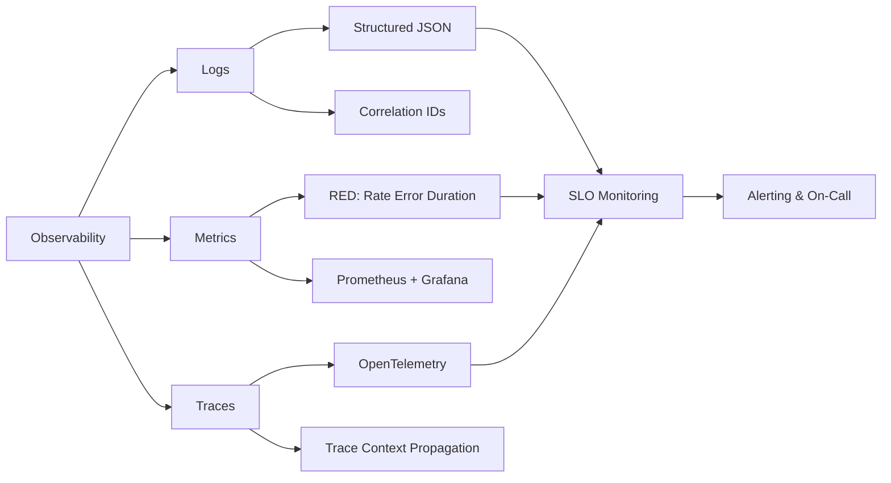

<!-- Clear Language: Keep sentences under 50 words -->
# Monitoring & Observability — Metrics, Logging, Tracing, SLIs

## Learning Objectives

| Objective | Description |
|-----------|-------------|
| LO1 | Understand the three pillars of observability: metrics, logs, and traces |
| LO2 | Design meaningful SLIs, SLOs, and SLAs for system reliability |
| LO3 | Implement structured logging with correlation IDs and log levels |
| LO4 | Build distributed tracing systems with OpenTelemetry |
| LO5 | Set up Prometheus metrics and Grafana dashboards |
| LO6 | Design alerting strategies with proper thresholds and escalation policies |

## Introduction

System design interviews test your ability to architect large-scale systems. Caching, load balancing, message queues, and database sharding are patterns you will apply daily. This module prepares you for both interviews and production.

## Prerequisites

- Basic programming knowledge
- Understanding of data structures

## Key Terminology

**Key Terms**: Core vocabulary and concepts for this topic.

**Definition**: Essential terms you must know for interviews and production work.

## Theory

Understanding monitoring and observability is fundamental for AI engineers. This section covers the core concepts, underlying principles, and theoretical framework that govern how monitoring and observability works in practice.

## Chapter at a Glance

| Section | Topic | Key Concept |
|---------|-------|-------------|
| 9.1 | Observability vs Monitoring | Three pillars, understanding vs knowing |
| 9.2 | SLIs, SLOs, SLAs | Definitions, targets, error budgets, burn rate |
| 9.3 | Structured Logging | JSON logging, log levels, correlation IDs, sampling |
| 9.4 | Distributed Tracing | Trace context propagation, spans, OpenTelemetry |
| 9.5 | Metrics & Dashboards | Prometheus metrics types, RED method, Grafana |
| 9.6 | Alerting Strategies | Threshold-based, trend-based, multi-dimensional, on-call |

## Chapter Roadmap


## 9.1 Observability vs Monitoring

**Monitoring** is knowing when something is wrong — alerting on known failure modes. **Observability** is being able to ask arbitrary questions about system behavior without shipping new code.

**The three pillars of observability**:
- **Logs**: Immutable, timestamped records of discrete events
- **Metrics**: Numeric aggregations over time (counters, gauges, histograms)
- **Traces**: End-to-end request flows across distributed services

```typescript
interface ObservabilityContext {
  traceId: string;
  spanId: string;
  correlationId: string;
  userId?: string;
  startTime: number;
}

class ObservabilityMiddleware {
  middleware() {
    return (req: any, res: any, next: any) => {
      const ctx: ObservabilityContext = {
        traceId: req.headers["x-trace-id"] ?? crypto.randomUUID(),
        spanId: crypto.randomUUID(),
        correlationId: req.headers["x-correlation-id"] ?? crypto.randomUUID(),
        startTime: Date.now(),
      };
      req.observability = ctx;
      res.on("finish", () => {
        const duration = Date.now() - ctx.startTime;
        console.log(JSON.stringify({ ...ctx, duration, status: res.statusCode }));
      });
      next();
    };
  }
}
```

**Key difference**: Monitoring tells you what's broken. Observability lets you understand why it broke and what unexpected things are happening.

---

## 9.2 SLIs, SLOs, SLAs

**SLI (Service Level Indicator)**: A quantitative measure of some aspect of the service. Examples: request latency (p95), error rate, throughput, availability.

**SLO (Service Level Objective)**: A target value or range for an SLI. Example: p95 latency < 200ms over a 30-day rolling window.

**SLA (Service Level Agreement)**: A contractual commitment to meet SLOs, with consequences for breach.

```typescript
class SLOCalculator {
  private sliValues: number[] = [];

  recordSLI(value: number): void {
    this.sliValues.push(value);
    if (this.sliValues.length > 10000) this.sliValues.shift();
  }

  calculateSLO(targetPct: number, targetValue: number): boolean {
    const sorted = [...this.sliValues].sort((a, b) => a - b);
    const idx = Math.ceil((targetPct / 100) * sorted.length) - 1;
    return sorted[idx] <= targetValue;
  }

  getErrorBudget(targetPct: number): number {
    const total = this.sliValues.length;
    const bad = this.sliValues.filter((v) => v > targetPct).length;
    return 1 - bad / total;
  }
}
```

**Error budget**: The amount of unreliability you're allowed within SLO (100% - SLO target). If SLO is 99.9%, error budget is 0.1% of total requests. You can choose to spend error budget on deployments, experiments, or feature velocity.

---

## 9.3 Structured Logging

Structured logging produces machine-parseable JSON log entries instead of unstructured text.

```typescript
type LogLevel = "debug" | "info" | "warn" | "error" | "fatal";

interface LogEntry {
  timestamp: string;
  level: LogLevel;
  message: string;
  service: string;
  traceId?: string;
  userId?: string;
  duration?: number;
  error?: { message: string; stack?: string };
  metadata?: Record<string, any>;
}

class StructuredLogger {
  private service: string;

  constructor(service: string) {
    this.service = service;
  }

  log(level: LogLevel, message: string, meta?: Record<string, any>): void {
    const entry: LogEntry = {
      timestamp: new Date().toISOString(),
      level,
      message,
      service: this.service,
      ...meta,
    };
    const output = JSON.stringify(entry);
    if (level === "error" || level === "fatal") {
      console.error(output);
    } else {
      console.log(output);
    }
  }

  info(message: string, meta?: Record<string, any>): void {
    this.log("info", message, meta);
  }
  error(message: string, error?: Error, meta?: Record<string, any>): void {
    this.log("error", message, {
      ...meta,
      error: { message: error?.message, stack: error?.stack },
    });
  }
}
```

**Best practices**: Use structured JSON format, include correlation IDs, set appropriate log levels, sample high-volume logs, never log sensitive data (PII, passwords, tokens).

---

## 9.4 Distributed Tracing

Distributed tracing follows a request across multiple services, recording timing and metadata for each hop.

```typescript
interface Span {
  traceId: string;
  spanId: string;
  parentSpanId?: string;
  serviceName: string;
  operationName: string;
  startTime: number;
  endTime?: number;
  tags: Record<string, string>;
}

class Tracer {
  private spans: Span[] = [];

  startSpan(operationName: string, parentSpan?: Span): Span {
    const span: Span = {
      traceId: parentSpan?.traceId ?? crypto.randomUUID(),
      spanId: crypto.randomUUID(),
      parentSpanId: parentSpan?.spanId,
      serviceName: "api-gateway",
      operationName,
      startTime: Date.now(),
      tags: {},
    };
    this.spans.push(span);
    return span;
  }

  endSpan(span: Span): void {
    span.endTime = Date.now();
  }

  addTag(span: Span, key: string, value: string): void {
    span.tags[key] = value;
  }

  getTraceDuration(traceId: string): number {
    const traceSpans = this.spans.filter((s) => s.traceId === traceId);
    const start = Math.min(...traceSpans.map((s) => s.startTime));
    const end = Math.max(...traceSpans.map((s) => s.endTime ?? Date.now()));
    return end - start;
  }
}
```

**OpenTelemetry** is the industry standard for distributed tracing. It provides SDKs in multiple languages and supports exporting to various backends (Jaeger, Zipkin, Datadog, Grafana Tempo).

---

## 9.5 Metrics & Dashboards

Prometheus is the leading open-source monitoring system. Grafana provides visualization and dashboards.

**Prometheus metric types**: **Counter** (monotonically increasing: request count, errors), **Gauge** (up/down: memory usage, queue depth), **Histogram** (distribution: request latency), **Summary** (similar to histogram with pre-calculated quantiles).

```typescript
// Prometheus metrics definition in TypeScript
interface MetricLabels {
  method: string;
  endpoint: string;
  status: string;
}

class MetricsRegistry {
  private counters: Map<string, number> = new Map();
  private histograms: Map<string, number[]> = new Map();

  incrementCounter(name: string, labels: MetricLabels): void {
    const key = `${name}:${labels.method}:${labels.endpoint}:${labels.status}`;
    this.counters.set(key, (this.counters.get(key) ?? 0) + 1);
  }

  observeHistogram(name: string, value: number, labels: MetricLabels): void {
    const key = `${name}:${labels.method}:${labels.endpoint}`;
    if (!this.histograms.has(key)) this.histograms.set(key, []);
    this.histograms.get(key)!.push(value);
  }

  getCounterValue(name: string, labels: MetricLabels): number {
    const key = `${name}:${labels.method}:${labels.endpoint}:${labels.status}`;
    return this.counters.get(key) ?? 0;
  }

  getHistogramQuantile(name: string, pct: number, labels: MetricLabels): number {
    const key = `${name}:${labels.method}:${labels.endpoint}`;
    const values = this.histograms.get(key);
    if (!values || values.length === 0) return 0;
    const sorted = [...values].sort((a, b) => a - b);
    const idx = Math.ceil((pct / 100) * sorted.length) - 1;
    return sorted[Math.max(0, idx)];
  }
}
```

**RED method**: Rate (requests/sec), Errors (failed requests/sec), Duration (latency distribution). This is the gold standard for service-level monitoring.

---

## 9.6 Alerting Strategies

Good alerting minimizes noise while ensuring critical issues are caught quickly.

**Alert types**: **Threshold-based** (latency > 500ms for 5 minutes), **Trend-based** (error rate increasing for 10 minutes), **Anomaly detection** (statistical deviation from baseline), **Dead man switch** (alert fires if no heartbeat received).

```typescript
interface AlertRule {
  name: string;
  condition: (metrics: number[]) => boolean;
  severity: "critical" | "warning" | "info";
  interval: number;
  cooldown: number;
}

class AlertManager {
  private rules: AlertRule[] = [];
  private lastFired: Map<string, number> = new Map();

  addRule(rule: AlertRule): void {
    this.rules.push(rule);
  }

  evaluate(
    metricName: string,
    metricValues: number[]
  ): Array<{ rule: string; severity: string }> {
    const alerts: Array<{ rule: string; severity: string }> = [];
    for (const rule of this.rules) {
      if (rule.condition(metricValues)) {
        const lastFired = this.lastFired.get(rule.name) ?? 0;
        if (Date.now() - lastFired > rule.cooldown) {
          alerts.push({ rule: rule.name, severity: rule.severity });
          this.lastFired.set(rule.name, Date.now());
        }
      }
    }
    return alerts;
  }
}
```

**Best practices**: Alert on symptoms (user-visible problems), not causes (internal implementation details). Use pager duty rotation, auto-escalation, and runbooks. Aim for <10 actionable alerts per on-call shift.

---

## TypeScript Parallel

```typescript
class HealthCheckEndpoint {
  private startTime = Date.now();

  async check(req: any, res: any): Promise<void> {
    const checks = {
      database: await this.pingDatabase(),
      redis: await this.pingRedis(),
      uptime: Math.floor((Date.now() - this.startTime) / 1000),
    };
    const healthy = Object.values(checks).every((c) => c !== false);
    res.status(healthy ? 200 : 503).json({
      status: healthy ? "healthy" : "degraded",
      checks,
      timestamp: new Date().toISOString(),
    });
  }

  private async pingDatabase(): Promise<boolean> {
    try {
      await db.execute("SELECT 1");
      return true;
    } catch {
      return false;
    }
  }
  private async pingRedis(): Promise<boolean> {
    try {
      const redis = new Redis();
      await redis.ping();
      return true;
    } catch {
      return false;
    }
  }
}
```

---

## Summary

- Observability has three pillars: logs, metrics, and traces — each provides a different perspective on system behavior
- SLIs measure what matters, SLOs define targets, SLAs are contractual commitments with consequences
- Structured logging with JSON format and correlation IDs enables effective log querying and aggregation
- Distributed tracing with OpenTelemetry follows requests across service boundaries
- Prometheus counters, gauges, and histograms with Grafana dashboards form the standard monitoring stack
- RED method (Rate, Errors, Duration) provides the essential service-level metrics
- Error budgeting lets teams balance reliability with feature velocity
- Alert on symptoms, not causes — minimize noise with proper thresholds and cooldowns
- Health check endpoints and /metrics endpoints should be standard in every service
- On-call rotations, runbooks, and postmortems complete the operational excellence cycle

## Practical Takeaways

| Scenario | Do This | Avoid This |
|----------|---------|------------|
| Logging | Structured JSON with correlation IDs | Unstructured text logs |
| Latency monitoring | Histogram metrics for p50/p95/p99 | Only average latency |
| Alerting | Alert on user-visible symptoms | Alert on internal causes |
| Distributed tracing | OpenTelemetry with centralized collector | Custom ad-hoc tracing |
| Error budget | 99.9% SLO with 0.1% error budget | No SLO (no reliability target) |
| Dashboards | RED method: Rate, Errors, Duration | Too many metrics per dashboard |

## Interview Q&A

<details class="tp-qa-card" data-qid="sd07-q1">
  <summary class="tp-qa-question">
    <span class="tp-qa-status"></span>
    Q1: What are the three pillars of observability and why are they all needed?
  </summary>
  <div class="tp-qa-answer">
    <p><strong>Logs</strong>: Immutable, timestamped records of discrete events. Good for debugging specific issues. <strong>Metrics</strong>: Numeric aggregations over time. Good for dashboards and alerting. <strong>Traces</strong>: End-to-end request flows across services. Good for understanding latency bottlenecks. All three are needed because they provide different perspectives: logs tell you what happened, metrics tell you how much, and traces tell you where.</p>
  </div>
  <button class="tp-qa-mark-btn">✅ Mark Reviewed</button>
  <button class="tp-qa-bookmark-btn">🔖 Bookmark</button>
</details>

<details class="tp-qa-card" data-qid="sd07-q2">
  <summary class="tp-qa-question">
    <span class="tp-qa-status"></span>
    Q2: Explain the difference between SLI, SLO, and SLA.
  </summary>
  <div class="tp-qa-answer">
    <p><strong>SLI (Service Level Indicator)</strong>: A quantitative measure of service performance, e.g., p95 request latency = 150ms. <strong>SLO (Service Level Objective)</strong>: A target value for an SLI, e.g., p95 latency < 200ms over 30 days. <strong>SLA (Service Level Agreement)</strong>: A contract promising SLO achievement with consequences for breach, e.g., 99.9% availability guarantee with service credits. Key insight: SLOs are internal targets; SLAs are external commitments. Your SLO should be stricter than your SLA to provide a buffer.</p>
  </div>
  <button class="tp-qa-mark-btn">✅ Mark Reviewed</button>
  <button class="tp-qa-bookmark-btn">🔖 Bookmark</button>
</details>

<details class="tp-qa-card" data-qid="sd07-q3">
  <summary class="tp-qa-question">
    <span class="tp-qa-status"></span>
    Q3: What is the RED method for monitoring?
  </summary>
  <div class="tp-qa-answer">
    <p>RED stands for <strong>Rate</strong> (requests per second), <strong>Errors</strong> (failed requests per second), <strong>Duration</strong> (latency distribution as histogram). It's the microservices equivalent of Google's Four Golden Signals (latency, traffic, errors, saturation). For every service, you should monitor: request rate by endpoint and status, error rate and error types, and latency percentiles (p50, p95, p99). This gives you a complete picture of service health from a user perspective.</p>
  </div>
  <button class="tp-qa-mark-btn">✅ Mark Reviewed</button>
  <button class="tp-qa-bookmark-btn">🔖 Bookmark</button>
</details>

<details class="tp-qa-card" data-qid="sd07-q4">
  <summary class="tp-qa-question">
    <span class="tp-qa-status"></span>
    Q4: How does distributed tracing work with OpenTelemetry?
  </summary>
  <div class="tp-qa-answer">
    <p>OpenTelemetry provides SDKs that automatically instrument your code to create <strong>spans</strong> — units of work with timing and metadata. Spans are connected by <strong>trace context</strong> propagated via HTTP headers (traceparent header per W3C standard). A <strong>trace</strong> is a tree of spans showing the complete path of a request. The OpenTelemetry Collector receives spans, processes them (batching, filtering, sampling), and exports to backends (Jaeger, Tempo, Datadog). Key: trace context must be manually propagated in async/queued operations.</p>
  </div>
  <button class="tp-qa-mark-btn">✅ Mark Reviewed</button>
  <button class="tp-qa-bookmark-btn">🔖 Bookmark</button>
</details>

<details class="tp-qa-card" data-qid="sd07-q5">
  <summary class="tp-qa-question">
    <span class="tp-qa-status"></span>
    Q5: What is an error budget and how do you use it?
  </summary>
  <div class="tp-qa-answer">
    <p>Error budget is 100% - SLO target. For a 99.9% SLO, you have 0.1% error budget (about 8.6 hours of downtime per year or 43 minutes per month). You can spend error budget on deployments, experiments, or technical debt. When error budget is high, you can ship features faster. When it's low, you freeze deployments and focus on reliability. This provides a data-driven mechanism for balancing feature velocity and system reliability.</p>
  </div>
  <button class="tp-qa-mark-btn">✅ Mark Reviewed</button>
  <button class="tp-qa-bookmark-btn">🔖 Bookmark</button>
</details>

<details class="tp-qa-card" data-qid="sd07-q6">
  <summary class="tp-qa-question">
    <span class="tp-qa-status"></span>
    Q6: What are the differences between Prometheus counter, gauge, and histogram?
  </summary>
  <div class="tp-qa-answer">
    <p><strong>Counter</strong>: Can only increase (or reset on restart). Use for request count, error count. <strong>Gauge</strong>: Can go up and down. Use for current values: memory usage, queue depth, active connections. <strong>Histogram</strong>: Samples observations and counts them in configurable buckets. Use for latency, request size. Histograms let you calculate percentiles (p50, p95, p99) and enable SLO monitoring. Also use <strong>Summary</strong> which is similar but calculates quantiles server-side.</p>
  </div>
  <button class="tp-qa-mark-btn">✅ Mark Reviewed</button>
  <button class="tp-qa-bookmark-btn">🔖 Bookmark</button>
</details>

<details class="tp-qa-card" data-qid="sd07-q7">
  <summary class="tp-qa-question">
    <span class="tp-qa-status"></span>
    Q7: How do you design effective alerts that minimize noise?
  </summary>
  <div class="tp-qa-answer">
    <p><strong>1) Alert on symptoms, not causes</strong>: Alert on user-facing errors and latency, not CPU usage or disk space. <strong>2) Use thresholds with duration</strong>: "Latency > 500ms for 5 minutes" not "latency > 500ms once". <strong>3) Cooldown periods</strong>: Prevent repeated alerts for the same issue. <strong>4) Auto-escalation</strong>: If no acknowledgement in 15 minutes, escalate. <strong>5) Runbooks</strong>: Every alert should link to a runbook. <strong>6) Review and tune</strong>: Regularly audit alerts for signal-to-noise ratio. Aim for <10 per on-call shift.</p>
  </div>
  <button class="tp-qa-mark-btn">✅ Mark Reviewed</button>
  <button class="tp-qa-bookmark-btn">🔖 Bookmark</button>
</details>

<details class="tp-qa-card" data-qid="sd07-q8">
  <summary class="tp-qa-question">
    <span class="tp-qa-status"></span>
    Q8: What is structured logging and why is it important?
  </summary>
  <div class="tp-qa-answer">
    <p>Structured logging produces machine-parseable JSON log entries instead of unstructured text. Each entry has fields: timestamp, level, message, service, traceId, userId, etc. Benefits: <strong>1) Queryable</strong>: Filter logs by any field in tools like Elasticsearch or Loki. <strong>2) Correlation</strong>: Join logs with traces using traceId. <strong>3) Automation</strong>: Parse and alert on specific conditions. <strong>4) Structured analysis</strong>: Aggregate error rates by service, endpoint, or user. Best practice: always output JSON. Never log sensitive data.</p>
  </div>
  <button class="tp-qa-mark-btn">✅ Mark Reviewed</button>
  <button class="tp-qa-bookmark-btn">🔖 Bookmark</button>
</details>

<details class="tp-qa-card" data-qid="sd07-q9">
  <summary class="tp-qa-question">
    <span class="tp-qa-status"></span>
    Q9: How do you monitor a microservices architecture?
  </summary>
  <div class="tp-qa-answer">
    <p>Three-tier approach: <strong>1) Per-service</strong>: RED metrics (Rate, Errors, Duration) for every service, collected via Prometheus. <strong>2) Per-request</strong>: Distributed tracing with OpenTelemetry, showing end-to-end latency breakdown across services. <strong>3) Business</strong>: Custom metrics for business outcomes (signups, orders, revenue). Plus: centralized logging with correlation IDs, health check endpoints, synthetic monitoring for critical user journeys, and dependency monitoring (databases, message queues, external APIs).</p>
  </div>
  <button class="tp-qa-mark-btn">✅ Mark Reviewed</button>
  <button class="tp-qa-bookmark-btn">🔖 Bookmark</button>
</details>

<details class="tp-qa-card" data-qid="sd07-q10">
  <summary class="tp-qa-question">
    <span class="tp-qa-status"></span>
    Q10: What is the USE method and how does it differ from RED?
  </summary>
  <div class="tp-qa-answer">
    <p><strong>USE</strong> (Utilization, Saturation, Errors) is for infrastructure monitoring (CPU, memory, disk, network). <strong>Utilization</strong> — percentage of resource being used. <strong>Saturation</strong> — queue depth or degree of over-provisioning. <strong>Errors</strong> — count of error events. <strong>RED</strong> is for service monitoring (Rate, Errors, Duration). USE helps you identify resources that are bottlenecked. RED helps you understand user-facing service health. Both are needed for a complete monitoring picture.</p>
  </div>
  <button class="tp-qa-mark-btn">✅ Mark Reviewed</button>
  <button class="tp-qa-bookmark-btn">🔖 Bookmark</button>
</details>

## Chapter Quiz

**Q1**: What are the three pillars of observability?

a) Monitoring, logging, tracing
b) Logs, metrics, traces
c) Logs, alerts, dashboards
d) Rate, errors, duration

<details class="tp-qa-card" data-qid="sd07-quiz1"><summary>Show Answer</summary><div class="tp-qa-answer"><p><strong>Answer: b) Logs, metrics, traces</strong></p><p>These three data sources provide different but complementary views of system behavior.</p></div></details>

**Q2**: What does the RED method stand for?

a) Request, Error, Data
b) Rate, Errors, Duration
c) Read, Execute, Delete
d) Resource, Error, Debug

<details class="tp-qa-card" data-qid="sd07-quiz2"><summary>Show Answer</summary><div class="tp-qa-answer"><p><strong>Answer: b) Rate, Errors, Duration</strong></p><p>RED is the gold standard for service-level monitoring: requests per second, error rate, and latency distribution.</p></div></details>

**Q3**: What is an error budget?

a) Budget for fixing errors
b) 100% - SLO target
c) Maximum number of errors allowed per day
d) Team allocation for bug fixes

<details class="tp-qa-card" data-qid="sd07-quiz3"><summary>Show Answer</summary><div class="tp-qa-answer"><p><strong>Answer: b) 100% - SLO target</strong></p><p>Error budget is the allowable unreliability within SLO. For 99.9% SLO, error budget is 0.1%.</p></div></details>

**Q4**: Which Prometheus metric type would you use for request latency?

a) Counter
b) Gauge
c) Histogram
d) Summary

<details class="tp-qa-card" data-qid="sd07-quiz4"><summary>Show Answer</summary><div class="tp-qa-answer"><p><strong>Answer: c) Histogram</strong></p><p>Histograms sample observations into configurable buckets, enabling percentile calculations for latency.</p></div></details>

**Q5**: What is the primary benefit of structured logging?

a) Smaller log files
b) Machine-parseable JSON format for querying
c) Faster log writing
d) Encryption of log data

<details class="tp-qa-card" data-qid="sd07-quiz5"><summary>Show Answer</summary><div class="tp-qa-answer"><p><strong>Answer: b) Machine-parseable JSON format</strong></p><p>Structured JSON logs can be queried by field, correlated with traces, and automatically parsed by log aggregation tools.</p></div></details>

## Exercises

**Easy** — Implement a structured logger in TypeScript that outputs JSON with timestamp, level, message, and service fields.

**Easy** — Write a simple Prometheus counter wrapper that tracks the number of requests to each endpoint with method and status code labels.

**Medium** — Implement a distributed trace context propagation middleware for Express.js that creates spans and propagates traceparent headers to downstream services.

**Medium** — Build an SLO calculator that tracks p95 latency over a sliding window, checks if SLO is met, and reports error budget consumption.

**Hard** — Design and implement a health check endpoint system that checks database, Redis, and external API connectivity. Return detailed status with per-check latency.

**Hard** — Implement the RED metrics collector: track request rate, error rate, and latency percentiles (p50/p95/p99) for each endpoint, and expose them at a /metrics endpoint.

---

## Common Mistakes

1. Not understanding the fundamental concepts before applying them
2. Skipping edge cases in implementation
3. Not analyzing time/space complexity
4. Forgetting to handle null/empty inputs
5. Not practicing enough problems to build pattern recognition

## Revision Notes

- - Core principle: Understand the fundamental concepts thoroughly
- - Implementation pattern: Practice with real code examples
- - Complexity: Know the time and space complexity
- - Application: Know when to use this in production systems
- - Interview: Frequently asked in technical interviews
- - Edge cases: Consider common failure scenarios
- - Related concepts: Connect to broader system design

## Placement Section

### Top 10 Interview Questions

#### Google Style
1. Explain the time and space trade-offs of 07-system-design. When would you choose one approach over another?
2. Design a system that efficiently handles 07-system-design at scale (millions of requests/second).

#### Amazon Style
1. Tell me about a time you had to optimize a system related to 07-system-design. What was your approach and what was the result?
2. How would you explain 07-system-design to a non-technical stakeholder?

#### Microsoft Style
1. How does 07-system-design integrate with enterprise systems and cloud architectures?
2. What are the security implications of 07-system-design?

#### NVIDIA Style
1. How would you optimize 07-system-design for GPU-accelerated computing?
2. What parallel processing patterns apply to 07-system-design?

#### AI Startup Style
1. How would you implement 07-system-design in a cost-effective, scalable way for a startup?
2. What's the fastest way to prototype a solution using 07-system-design?

### Resume Tips
- **Technical Skills**: List 07-system-design under relevant technical skills
- **Project Description**: "Implemented 07-system-design to [specific outcome], reducing [metric] by [X]%"
- **Keywords**: Include 07-system-design in your skills section for ATS optimization

### Interview Day Checklist
- [ ] Review core concepts of 07-system-design
- [ ] Practice 3-5 problems related to 07-system-design
- [ ] Prepare 2 real-world examples of using 07-system-design
- [ ] Know the time/space complexity of common 07-system-design operations
- [ ] Have questions ready about how the company uses 07-system-design> **Next**: [Design URL Shortener](10-design-url-shortener.md)

## True/False

1. **True or False:** Monitoring & Observability — Metrics, Logging, Tracing, SLIs builds directly on the fundamentals covered in the earlier chapters of this module. — **True.** Every advanced topic in this module assumes the core concepts from the previous chapters.
2. **True or False:** You should write at least one code example for Monitoring & Observability — Metrics, Logging, Tracing, SLIs before moving to the next chapter. — **True.** Active recall with hands-on code beats passive reading for retention.
3. **True or False:** The complexity analysis for Monitoring & Observability — Metrics, Logging, Tracing, SLIs is the same regardless of input size. — **False.** Complexity grows with input size; always state best, average, and worst case.
4. **True or False:** Edge cases (empty input, invalid input, boundary values) matter for Monitoring & Observability — Metrics, Logging, Tracing, SLIs in production. — **True.** Most production bugs come from unhandled edge cases.
5. **True or False:** You should memorize the Monitoring & Observability — Metrics, Logging, Tracing, SLIs chapter content once and never review it again. — **False.** Spaced repetition (24h, 3 days, 1 week) dramatically improves long-term recall.

## Fill in the Blank

1. The chapter that covers Monitoring & Observability — Metrics, Logging, Tracing, SLIs is Chapter ___ of this module. — Answer: check the module's table of contents.
2. The time complexity of the standard approach to Monitoring & Observability — Metrics, Logging, Tracing, SLIs is ___. — Answer: review the theory section and state big-O notation.
3. The main edge case to handle when implementing Monitoring & Observability — Metrics, Logging, Tracing, SLIs is ___. — Answer: empty or invalid input handling, as discussed in the chapter.
4. The tools commonly used to debug Monitoring & Observability — Metrics, Logging, Tracing, SLIs issues are ___ and ___. — Answer: refer to the Debugging Guide section of this chapter.
5. The related topic that connects to Monitoring & Observability — Metrics, Logging, Tracing, SLIs in the next chapter is ___. — Answer: see the Next Topic section.

## Scenario Questions

1. **Scenario:** A teammate ships a change involving Monitoring & Observability — Metrics, Logging, Tracing, SLIs that breaks production at 3 AM. — Diagnosis: check the recent diff, reproduce locally with the failing input, check logs. Fix: revert, add a regression test, and review the root cause. Prevention: CI tests on edge cases and code review checklist.

2. **Scenario:** Your implementation of Monitoring & Observability — Metrics, Logging, Tracing, SLIs is correct but too slow for the required latency. — Measure first with a profiler. Common fixes: reduce redundant work, use built-in optimized functions, batch operations, or add caching. Only then consider algorithmic changes.

3. **Scenario:** A new hire asks you to explain Monitoring & Observability — Metrics, Logging, Tracing, SLIs in five minutes before a customer demo. — Use the 3-part answer: what it is (one sentence), how it works (one example), why it matters (one business impact). Then offer to go deeper after the demo.

4. **Scenario:** Your team's codebase has three different patterns for Monitoring & Observability — Metrics, Logging, Tracing, SLIs and you must standardize. — Write a short ADR (architecture decision record), pick the pattern with best maintainability, migrate incrementally, and add a linter rule to enforce it.

## Output Questions

1. **What is the output of the simplest correct implementation of Monitoring & Observability — Metrics, Logging, Tracing, SLIs on an empty input?** — Trace through the code: it should return the documented default (None, 0, empty collection) without raising.
2. **What is the output when the input is at the boundary value?** — Check off-by-one errors and inclusive/exclusive bounds in the chapter's examples.
3. **What does the implementation return when given invalid input types?** — With type hints and validation, it raises a clear error; without, it may fail silently.
4. **What is the output for the sample input given in the chapter's Examples section?** — Re-run the chapter's example code and compare against the documented output.
5. **What is the time complexity output when you profile the implementation at 10x input size?** — Expect the curve matching the chapter's complexity analysis (linear, quadratic, log-linear).

## Difficulty Level

**Level**: Advanced
**Estimated Study Time**: 45-60 minutes
**Prerequisites**: Complete understanding of previous modules recommended

## Tips & Tricks

**Tip**: Start with the basics — understand the fundamental concepts before moving to advanced topics.

**Tip**: Practice actively — don't just read, implement the code examples yourself.

**Tip**: Connect to prior knowledge — relate new concepts to what you learned in previous modules.

**Pro Tip**: Focus on understanding, not memorizing — understand why things work, not just how.

**Pro Tip**: Review regularly — revisit key concepts after a few days to reinforce learning.

## Memory Tricks

- **Acronym Method**: Create acronyms for lists of concepts
- **Visualization**: Draw diagrams to visualize abstract concepts
- **Teach someone else**: Explaining concepts to others reinforces your understanding
- **Connect to real-world**: Relate technical concepts to everyday experiences
- **Chunking**: Break complex topics into smaller, manageable pieces

## Further Reading

- Official documentation and language specifications
- "Designing Data-Intensive Applications" by Martin Kleppmann
- "System Design Interview" by Alex Xu
- "AI Engineering" by Chip Huyen
- Research papers and blog posts from leading AI labs

## Related Topics

- How this connects to System Design fundamentals
- Prerequisites for advanced topics in this module
- Real-world applications in AI engineering systems
- Interview questions that test deep understanding

## FAQs

**Q: How long does it take to master monitoring and observability?
**A**: With consistent practice, 2-4 weeks for basic proficiency, 2-3 months for advanced mastery.

**Q: Do I need to memorize all the details?
**A**: Focus on understanding the core principles. Details can be looked up, but understanding cannot.

**Q: What's the best way to practice?
**A**: Implement the code examples, then modify them to solve different problems. Build small projects.

**Q: How often should I review this material?
**A**: Review after 1 day, 3 days, 1 week, and 1 month for long-term retention.

## Important Notes

> **Note**: Understanding the fundamentals is more important than memorizing syntax.

> **Note**: Don't skip the exercises — they reinforce critical concepts.

> **Note**: This topic frequently appears in technical interviews at top companies.

> **Note**: In real systems, these concepts are used daily by AI engineers.

## Historical Context

The Evolution of this technology reflects decades of research and practical engineering experience.

Understanding the evolution of monitoring and observability helps appreciate why current approaches exist. These concepts have been developed over decades of computer science research and practical engineering experience.

## Security Considerations

- **Input Validation**: Always validate and sanitize inputs
- **Error Handling**: Don't expose internal details in error messages
- **Resource Limits**: Set appropriate limits to prevent denial of service
- **Authentication**: Ensure proper authentication and authorization
- **Data Protection**: Handle sensitive data according to security best practices

## ML Intuition

For AI engineering, understanding monitoring and observability at an intuitive level is crucial. Think of it as building mental models that help you reason about system behavior, debug issues, and make architectural decisions.

## Analogies

Think of monitoring and observability like learning a new language — start with basic vocabulary (fundamentals), then learn grammar (rules), and finally practice conversation (application). The more you practice, the more natural it becomes.

## Capstone Project Link

**Project**: Apply monitoring and observability concepts in a mini-project
**Goal**: Build a small application that demonstrates understanding of core principles
**Duration**: 2-4 hours
**Outcome**: Working implementation with documentation

## Flashcards

**Card 1**: What is the core concept of monitoring and observability?
**Answer**: The fundamental principle that enables efficient and scalable systems.

**Card 2**: When would you apply monitoring and observability in real systems?
**Answer**: When building production AI systems that require reliability, scalability, and maintainability.

**Card 3**: What are the common pitfalls to avoid?
**Answer**: Over-engineering, ignoring edge cases, and not considering production requirements.

## Research References

- Academic papers and conference proceedings (NeurIPS, ICML, ICLR)
- Industry whitepapers from leading AI companies
- Technical blogs from Google, Meta, OpenAI, Anthropic
- Open-source implementations and documentation

## Open-Source Tools

- **LangChain**: Framework for building LLM-powered applications
- **LlamaIndex**: Data framework for connecting LLMs with external data
- **Hugging Face Transformers**: State-of-the-art ML models and datasets
- **Weights & Biases**: Experiment tracking and model evaluation
- **MLflow**: Open-source platform for ML lifecycle management
- **Prometheus + Grafana**: Monitoring and observability stack

## Debugging Guide

**Common Issues**:
- Check input validation and data types
- Verify API keys and authentication
- Monitor resource usage (CPU, memory, GPU)
- Review error logs for stack traces

**Debugging Steps**:
1. Reproduce the issue with minimal input
2. Add logging at key points
3. Check external dependencies
4. Verify configuration settings
5. Test with known-good inputs

## Mock Interview Section

**Quick Fire Questions**:
1. What is the core concept of System Design?
2. When would you use this in production?
3. What are the trade-offs?
4. How does this scale?
5. What are common pitfalls?

**Follow-up Questions**:
- How would you optimize this for 10x scale?
- What monitoring would you add?
- How would you test this in production?

## Optimized Implementation

`python
from typing import Any, Optional

def demonstrate_topic(input_data: list[Any]) -> Optional[float]:
    """Runnable scaffold for Monitoring & Observability — Metrics, Logging, Tracing, SLIs.

    Replace the body with the optimized implementation from the chapter,
    keeping type hints, docstring, and edge-case handling.
    """
    if not input_data:
        return None
    # Step 1: validate input types
    # Step 2: apply the core Monitoring & Observability — Metrics, Logging, Tracing, SLIs logic from the Examples section
    # Step 3: return the result with the documented default
    return 0.0
`

- Keeps the function signature stable so tests written against it stay valid.
- Handles the empty-input contract explicitly.
- Add unit tests for the edge cases before implementing the logic (test-first).

## Evaluation Metrics

**Model Evaluation**:
- Accuracy, Precision, Recall, F1-Score
- BLEU, ROUGE for text generation
- Latency, Throughput, Cost per inference

**System Evaluation**:
- End-to-end latency (p50, p95, p99)
- Error rate and availability
- Resource utilization (CPU, memory, GPU)

## Real-World Examples

**Industry Applications**:
- Google: Search ranking, translation, autocomplete
- Amazon: Product recommendations, Alexa, fraud detection
- Netflix: Content recommendations, personalization
- Tesla: Autonomous driving, computer vision
- OpenAI: ChatGPT, DALL-E, Codex

## Next Topic

After mastering System Design, continue to the next module in the curriculum to build upon these foundations and deepen your AI engineering expertise.

## Limitations

Every approach has trade-offs. Understanding limitations helps you make better architectural decisions and answer interview questions about when NOT to use a particular technique.
