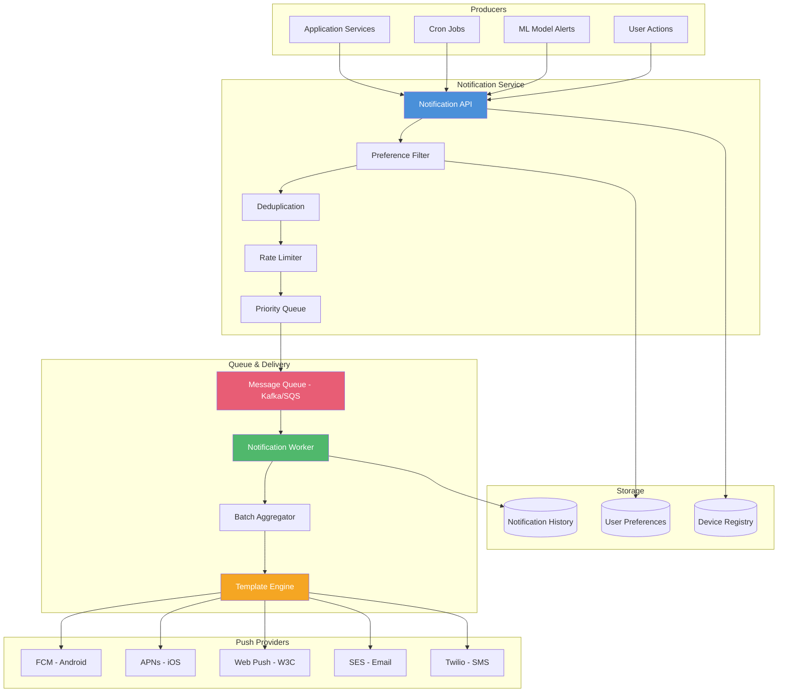
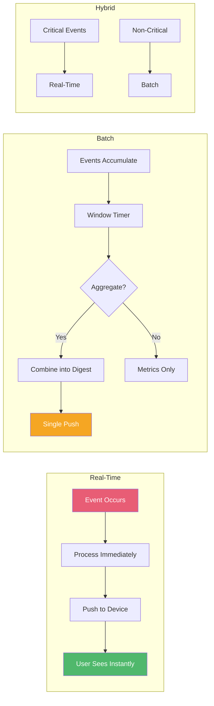
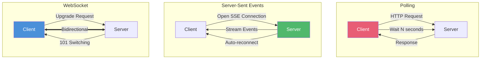
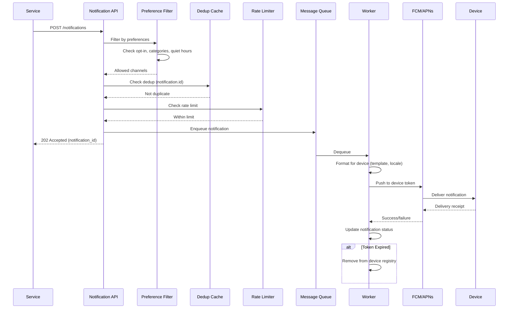
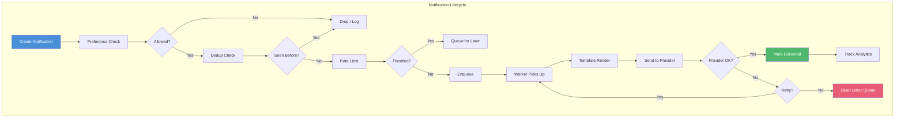

<!-- Clear Language: Keep sentences under 50 words -->
# Design Notification System — Push, Real-Time, Delivery Guarantees

## Learning Objectives

| Objective | Description |
|-----------|-------------|
| LO1 | Design push notification architecture for mobile and web |
| LO2 | Compare WebSocket vs SSE vs polling for real-time delivery |
| LO3 | Integrate push providers: FCM (Android), APNs (iOS) |
| LO4 | Build notification queue with delivery guarantees and deduplication |
| LO5 | Handle preferences, throttling, and unsubscribe patterns |
| LO6 | Design for scale: 1M+ notifications per second |

## Introduction

Notification systems deliver timely information to users across mobile, web, and email. Designing a reliable notification system at scale requires handling delivery guarantees, push provider integrations, user preferences, and deduplication. AI engineers need this for alerting, model monitoring, and user engagement.

## Prerequisites

- System design fundamentals
- Understanding of message queues
- Familiarity with mobile push concepts

## Key Terminology

**Key Terms**: Core vocabulary and concepts for this topic.

**Definition**: Essential terms you must know for interviews and production work.

## Theory

### High-Level Architecture



**Core components**:

| Component | Responsibility |
|-----------|---------------|
| Notification API | Accepts notification requests from services |
| Preference Filter | Checks user opt-in/out, channel preferences |
| Deduplication | Prevents duplicate notifications (idempotency) |
| Rate Limiter | Throttles notifications per user/channel |
| Priority Queue | Sorts by urgency (critical, high, normal, low) |
| Message Queue | Buffers notifications for async processing |
| Delivery Worker | Formats and sends via appropriate provider |
| Batch Aggregator | Groups notifications to reduce sends |
| Template Engine | Renders notification content from templates |
| Device Registry | Maps user to device tokens |

### Real-Time vs Batch Delivery



### WebSocket vs SSE vs Polling



| Feature | WebSocket | SSE | Polling |
|---------|-----------|-----|---------|
| Direction | Bidirectional | Server→Client | Client→Server |
| Protocol | ws/wss | HTTP | HTTP |
| Reconnect | Manual | Automatic | N/A |
| Latency | Real-time | Real-time | Interval-based |
| Browser support | Excellent | Good | Universal |
| Scaling | Stateful | Stateful | Stateless |
| Firewall-friendly | No | Yes | Yes |
| Max connections/server | 10K-100K | 10K-100K | Unlimited |
| Headers/cookies | No | Yes | Yes |
| Best for | Chat, gaming | Notifications, feeds | Simple status |

### Push Provider Integration

**FCM (Firebase Cloud Messaging)**:

```typescript
// Device registration
interface DeviceRegistration {
  userId: string;
  deviceId: string;
  platform: "android" | "ios" | "web";
  pushToken: string;
  appVersion: string;
  locale: string;
  timezone: string;
  createdAt: number;
}

// FCM message format
interface FCMMessage {
  token: string;           // Device push token
  notification?: {
    title: string;
    body: string;
    image?: string;
  };
  data?: Record<string, string>;  // Custom payload
  android?: {
    priority: "normal" | "high";
    ttl: string;           // Time-to-live (e.g., "86400s")
    notification: {
      channel_id: string;
      sound: string;
      click_action: string;
    };
  };
  apns?: {
    headers: {
      "apns-priority": string;
      "apns-expiration": string;
    };
    payload: {
      aps: {
        alert: { title: string; body: string };
        badge: number;
        sound: string;
        "content-available": number;
      };
    };
  };
}

// Send FCM via HTTP v1 API
async function sendFCM(message: FCMMessage): Promise<FCMResponse> {
  const accessToken = await getFirebaseAccessToken();
  const response = await fetch(
    "https://fcm.googleapis.com/v1/projects/my-project/messages:send",
    {
      method: "POST",
      headers: {
        Authorization: `Bearer ${accessToken}`,
        "Content-Type": "application/json",
      },
      body: JSON.stringify({ message }),
    }
  );
  return response.json();
}
```

**APNs (Apple Push Notification Service)**:

```typescript
// APNs notification
interface APNsPayload {
  "aps": {
    "alert": {
      "title": string;
      "body": string;
      "subtitle"?: string;
    };
    "badge"?: number;
    "sound"?: string;
    "content-available"?: 1;  // Silent push
    "mutable-content"?: 1;    // For notification extensions
    "category"?: string;
    "thread-id"?: string;
  };
  "data"?: Record<string, any>;
}

// APNs headers
interface APNsHeaders {
  "apns-push-type": "alert" | "background" | "voip" | "complication";
  "apns-id"?: string;           // UUID for deduplication
  "apns-expiration"?: number;   // Unix epoch
  "apns-priority"?: 5 | 10;    // 5=power-efficient, 10=immediate
  "apns-topic": string;         // App bundle ID
  "apns-collapse-id"?: string;  // Group similar notifications
}

// Send via HTTP/2 (APNs requires HTTP/2)
async function sendAPNs(deviceToken: string, payload: APNsPayload): Promise<void> {
  const headers = {
    "apns-push-type": "alert",
    "apns-topic": "com.example.app",
    "apns-priority": "10",
    "apns-expiration": String(Math.floor(Date.now() / 1000) + 86400),
    "apns-collapse-id": "new_message",
  };

  const response = await fetch(
    `https://api.push.apple.com/3/device/${deviceToken}`,
    {
      method: "POST",
      headers: {
        ...headers,
        "Authorization": `Bearer ${getAPNsJWT()}`,
        "Content-Type": "application/json",
      },
      body: JSON.stringify(payload),
    }
  );

  if (response.status === 410) {
    // Device token expired — remove from registry
    await removeDeviceToken(deviceToken);
  }
}
```

### Notification Queue and Delivery

```typescript
interface NotificationMessage {
  id: string;                    // Unique ID for deduplication
  userId: string;
  channels: ("push" | "email" | "sms" | "webhook")[];
  title: string;
  body: string;
  data?: Record<string, any>;
  priority: "critical" | "high" | "normal" | "low";
  templateId?: string;
  templateVariables?: Record<string, string>;
  scheduleAt?: number;           // Unix timestamp
  expiresAt?: number;
  readonly createdAt: number;
}

class NotificationQueue {
  private queue: Queue;  // SQS, Kafka, RabbitMQ
  private dedupCache: Redis;
  private rateLimiter: RateLimiter;

  async enqueue(notification: NotificationMessage): Promise<boolean> {
    // Deduplication check
    const dedupKey = `notif:dedup:${notification.id}`;
    if (await this.dedupCache.exists(dedupKey)) {
      console.log(`Duplicate notification: ${notification.id}`);
      return false;
    }

    // Rate limiting check
    const rateLimitKey = `notif:rate:${notification.userId}`;
    const currentCount = await this.rateLimiter.increment(rateLimitKey);
    const maxPerMinute = await this.getUserRateLimit(notification.userId);

    if (currentCount > maxPerMinute) {
      // Queue for delayed delivery instead of dropping
      notification.priority = "low";
      notification.expiresAt = Date.now() + 3600000; // 1 hour TTL
    }

    // Set dedup TTL
    await this.dedupCache.set(dedupKey, "1", "EX", 86400);

    // Enqueue with priority
    const priority = this.priorityToQueue(notification.priority);
    await this.queue.send(JSON.stringify(notification), {
      priority,
      delaySeconds: notification.scheduleAt
        ? Math.max(0, (notification.scheduleAt - Date.now()) / 1000)
        : 0,
    });

    return true;
  }

  private priorityToQueue(priority: string): number {
    const priorities = { critical: 4, high: 3, normal: 2, low: 1 };
    return priorities[priority] || 2;
  }

  private getUserRateLimit(userId: string): Promise<number> {
    // Premium users: 100/min, free users: 20/min
    return this.getUserTier(userId).then(
      tier => tier === "premium" ? 100 : 20
    );
  }
}
```

### Delivery Worker

```typescript
class NotificationWorker {
  private queue: NotificationQueue;
  private deviceRegistry: DeviceRegistry;
  private templateEngine: TemplateEngine;
  private fcmClient: FCMClient;
  private apnsClient: APNsClient;

  async process(): Promise<void> {
    while (true) {
      const messages = await this.queue.dequeue(10); // Batch of 10

      await Promise.all(
        messages.map(msg => this.deliver(JSON.parse(msg)))
      );
    }
  }

  async deliver(notification: NotificationMessage): Promise<void> {
    const attempts = 0;
    const maxAttempts = 3;

    while (attempts < maxAttempts) {
      try {
        // Get user's device tokens
        const devices = await this.deviceRegistry.getDevices(
          notification.userId,
          notification.channels
        );

        // Send to each device in parallel
        const results = await Promise.allSettled(
          devices.map(device => this.sendToDevice(device, notification))
        );

        // Handle failures
        for (let i = 0; i < results.length; i++) {
          const result = results[i];
          const device = devices[i];

          if (result.status === "rejected") {
            if (this.isTokenExpiredError(result.reason)) {
              await this.deviceRegistry.removeDevice(device.id);
            }
            console.error(`Failed to send to ${device.id}: ${result.reason}`);
          }
        }

        // Log delivery
        await this.logDelivery(notification, devices.length);
        return;

      } catch (error) {
        attempts++;
        if (attempts >= maxAttempts) {
          await this.sendToDeadLetterQueue(notification);
          return;
        }
        await sleep(Math.pow(2, attempts) * 1000); // Exponential backoff
      }
    }
  }

  private async sendToDevice(
    device: DeviceRegistration,
    notification: NotificationMessage
  ): Promise<void> {
    const rendered = this.templateEngine.render(
      notification,
      device.locale
    );

    if (device.platform === "android") {
      await this.fcmClient.send(device.pushToken, rendered);
    } else if (device.platform === "ios") {
      await this.apnsClient.send(device.pushToken, rendered);
    } else if (device.platform === "web") {
      await this.sendWebPush(device.pushToken, rendered);
    }
  }
}
```

### User Preferences and Channel Management

```typescript
interface UserNotificationPreferences {
  userId: string;
  channels: {
    push: { enabled: boolean; quietHoursStart?: string; quietHoursEnd?: string };
    email: { enabled: boolean; digestFrequency: "instant" | "daily" | "weekly" };
    sms: { enabled: boolean; phoneNumber?: string };
    webhook: { enabled: boolean; url?: string };
  };
  categories: {
    [category: string]: {
      push: boolean;
      email: boolean;
      sms: boolean;
    };
  };
  maxPerMinute: number;
  timezone: string;
}

class PreferenceService {
  async filterByPreferences(
    userId: string,
    notification: NotificationMessage
  ): Promise<string[]> {
    const prefs = await this.getPreferences(userId);

    const allowedChannels: string[] = [];

    for (const channel of notification.channels) {
      // Check global channel enable
      if (!prefs.channels[channel]?.enabled) continue;

      // Check category opt-in
      if (notification.data?.category) {
        const category = notification.data.category;
        if (prefs.categories[category]?.[channel] === false) continue;
      }

      // Check quiet hours (for push)
      if (channel === "push") {
        const quietHours = prefs.channels.push.quietHours;
        if (quietHours && this.isInQuietHours(quietHours, prefs.timezone)) {
          // Queue for delivery after quiet hours
          await this.delayNotification(notification, quietHours.end);
          continue;
        }
      }

      // Check email digest preference
      if (channel === "email" && prefs.channels.email.digestFrequency !== "instant") {
        await this.addToDigest(userId, notification, prefs.channels.email.digestFrequency);
        continue;
      }

      allowedChannels.push(channel);
    }

    return allowedChannels;
  }

  private isInQuietHours(
    quietHours: { start: string; end: string },
    timezone: string
  ): boolean {
    const now = new Date();
    const localTime = now.toLocaleTimeString("en-US", {
      hour12: false,
      timeZone: timezone,
    });
    const currentHour = parseInt(localTime.split(":")[0]);
    const startHour = parseInt(quietHours.start.split(":")[0]);
    const endHour = parseInt(quietHours.end.split(":")[0]);

    if (startHour <= endHour) {
      return currentHour >= startHour && currentHour < endHour;
    }
    // Overnight quiet hours (e.g., 22:00 - 08:00)
    return currentHour >= startHour || currentHour < endHour;
  }
}
```

### Notification Flow Diagram



### Web Push API

```typescript
// Service worker registration (browser)
async function registerWebPush(userId: string): Promise<void> {
  const registration = await navigator.serviceWorker.register("sw.js");
  const subscription = await registration.pushManager.subscribe({
    userVisibleOnly: true,
    applicationServerKey: urlBase64ToUint8Array(
      "BEl62iUYgUivxIkv69yViEizBI-Y1k"
    ),
  });

  // Send subscription to server
  await fetch("/api/device/register", {
    method: "POST",
    body: JSON.stringify({
      userId,
      platform: "web",
      pushToken: JSON.stringify(subscription),
      userAgent: navigator.userAgent,
    }),
  });
}

// Web push payload (VAPID)
interface WebPushPayload {
  title: string;
  body: string;
  icon?: string;
  badge?: string;
  image?: string;
  vibrate?: number[];
  data?: Record<string, any>;
  actions?: Array<{
    action: string;
    title: string;
    icon?: string;
  }>;
  requireInteraction?: boolean;
  tag?: string;           // Collapse identical notifications
  renotify?: boolean;
  silent?: boolean;
  timestamp?: number;
  urgency?: "low" | "normal" | "high";
}

// Send web push with web-push library
import webpush from "web-push";

webpush.setVapidDetails(
  "mailto:admin@example.com",
  process.env.VAPID_PUBLIC_KEY,
  process.env.VAPID_PRIVATE_KEY
);

async function sendWebPush(subscription: PushSubscription, payload: WebPushPayload) {
  try {
    await webpush.sendNotification(subscription, JSON.stringify(payload));
  } catch (error) {
    if (error.statusCode === 410) {
      // Subscription expired — remove from database
      await removeSubscription(subscription);
    }
  }
}
```

### Notification History and Analytics

```typescript
interface NotificationLog {
  notificationId: string;
  userId: string;
  channel: string;
  status: "sent" | "delivered" | "opened" | "clicked" | "failed";
  timestamp: number;
  latency_ms?: number;
  provider_response?: string;
  deviceId?: string;
  error?: string;
}

class NotificationAnalytics {
  async track(notificationId: string, event: Partial<NotificationLog>): Promise<void> {
    // Write to time-series database (InfluxDB, BigQuery)
    await this.writeTimeSeries("notification_events", {
      ...event,
      timestamp: Date.now(),
    });

    // Update aggregate counters
    await this.redis.hincrby(
      `notif:stats:${event.channel}:${event.status}`,
      new Date().toISOString().slice(0, 13), // Hourly bucket
      1
    );
  }

  async getDeliveryRate(userId: string, since: number): Promise<number> {
    const total = await this.count(userId, "sent", since);
    const delivered = await this.count(userId, "delivered", since);
    return total > 0 ? delivered / total : 0;
  }

  async getClickRate(userId: string, since: number): Promise<number> {
    const delivered = await this.count(userId, "delivered", since);
    const clicked = await this.count(userId, "clicked", since);
    return delivered > 0 ? clicked / delivered : 0;
  }
}

// Event tracking from mobile apps
// On notification opened:
// Android: FirebaseAnalytics.logEvent("notification_open", ...)
// iOS: UNUserNotificationCenterDelegate.didReceiveResponse
// Web: notification.onclick event
```

### Notification Templates

```typescript
interface NotificationTemplate {
  id: string;
  name: string;
  channels: {
    push: {
      title: string;         // Template with {{variables}}
      body: string;
      image?: string;
    };
    email: {
      subject: string;
      bodyHtml: string;
      bodyText: string;
    };
    sms: {
      body: string;
    };
  };
  variables: string[];       // Expected variables
  versions: TemplateVersion[];
}

class TemplateEngine {
  private templates: Map<string, NotificationTemplate> = new Map();

  render(
    notification: NotificationMessage,
    locale: string,
    channel: string
  ): RenderedNotification {
    const template = this.templates.get(notification.templateId);
    if (!template) {
      // Use notification body directly if no template
      return {
        title: notification.title,
        body: notification.body,
      };
    }

    const channelTemplate = template.channels[channel];
    const variables = notification.templateVariables || {};

    return {
      title: this.fillTemplate(channelTemplate.title, variables, locale),
      body: this.fillTemplate(channelTemplate.body, variables, locale),
      image: this.fillTemplate(channelTemplate.image, variables, locale),
    };
  }

  private fillTemplate(
    text: string,
    variables: Record<string, string>,
    locale: string
  ): string {
    return text.replace(/\{\{(\w+)\}\}/g, (match, key) => {
      if (variables[key]) return variables[key];
      if (locale === "hi" && key === "greeting") return "नमस्ते";
      return match;
    });
  }
}
```

### Scaling Considerations

```text
Scale targets (1M notifications/second):
- 100M+ registered devices
- 50K+ producer services
- 200+ push worker instances
- 100+ message queue partitions

Database requirements:
- Device registry: 100M+ rows, 10K writes/sec, 100K reads/sec
- Notification history: 1B+ rows/day, TTL-based cleanup
- Template cache: 1000 entries, updated daily
- Dedup cache: 10M entries/day, 24h TTL

Push provider quotas:
- FCM: 600K requests/min per project (default)
- APNs: No hard limit, but 4KB payload max
- Web Push: VAPID rate limits vary by browser

Infrastructure:
- Edge delivery: CDN-based push aggregation
- Connection pooling: Reuse HTTP/2 connections to FCM/APNs
- Circuit breaker: Fail fast if provider is down
- Backpressure: Reject when queue depth > threshold
```

## Visual Explanation



## Real Example

Think of a notification system like a postal service. Services (senders) drop letters at the post office (notification API). The mail clerk checks: does the recipient want mail? (preferences), is this a duplicate letter? (dedup), are we sending too much? (rate limit). Letters are sorted by priority (express = critical, standard = normal). They go to the sorting facility (message queue). Delivery trucks (workers) pick up batches, put letters into envelopes with proper addresses (templates), and deliver via the right carrier — USPS (FCM), FedEx (APNs), or email. If the address is wrong (expired token), the letter is returned. If the truck can't deliver (worker crash), another truck picks it up.

## Code Example

```python
#!/usr/bin/env python3
"""Notification system backend with FCM/APNs/Web Push"""

import json
import uuid
import time
from typing import Dict, List, Optional
from datetime import datetime
import redis
from pydantic import BaseModel
import requests


class NotificationMessage(BaseModel):
    id: str = ""
    user_id: str
    title: str
    body: str
    data: Dict = {}
    channel: str = "push"
    priority: str = "normal"
    template_id: Optional[str] = None
    template_vars: Dict = {}
    scheduled_at: Optional[int] = None
    expires_at: Optional[int] = None


class DeviceRegistration(BaseModel):
    device_id: str
    user_id: str
    platform: str  # android, ios, web
    push_token: str
    locale: str = "en"
    app_version: str = ""


class NotificationService:
    """Core notification service with delivery, dedup, rate limiting"""

    def __init__(self):
        self.redis_client = redis.Redis(
            host="redis.internal", port=6379, decode_responses=True
        )
        self.queue: List[NotificationMessage] = []

    def send_notification(self, notification: NotificationMessage) -> Dict:
        """Queue notification for delivery"""
        notification.id = str(uuid.uuid4())
        notification.expires_at = notification.expires_at or int(time.time()) + 86400

        # Deduplication
        dedup_key = f"notif:dedup:{notification.id}"
        if self.redis_client.exists(dedup_key):
            return {"status": "duplicate", "id": notification.id}

        # Rate limiting
        rate_key = f"notif:rate:{notification.user_id}"
        current_count = int(self.redis_client.get(rate_key) or 0)
        max_rate = 100 if self._is_premium(notification.user_id) else 20

        if current_count >= max_rate:
            notification.priority = "low"
            self._queue_for_delayed_delivery(notification)
            return {"status": "queued_delayed", "id": notification.id}

        self.redis_client.incr(rate_key)
        self.redis_client.expire(rate_key, 60)  # Reset every minute

        # Set dedup TTL (24 hours)
        self.redis_client.set(dedup_key, "1", ex=86400)

        # Enqueue
        self.queue.append(notification)
        return {"status": "queued", "id": notification.id, "timestamp": int(time.time())}

    def process_queue(self, batch_size: int = 10) -> int:
        """Process notifications from the queue"""
        processed = 0
        batch = self.queue[:batch_size]
        self.queue = self.queue[batch_size:]

        for notification in batch:
            try:
                if notification.scheduled_at and time.time() < notification.scheduled_at:
                    self.queue.append(notification)
                    continue

                if time.time() > notification.expires_at:
                    print(f"Notification {notification.id} expired")
                    continue

                self._deliver(notification)
                processed += 1
            except Exception as e:
                print(f"Failed to deliver {notification.id}: {e}")

        return processed

    def _deliver(self, notification: NotificationMessage) -> None:
        """Deliver notification via appropriate channel"""
        devices = self._get_user_devices(notification.user_id)

        for device in devices:
            if not self._check_quiet_hours(device.user_id):
                continue

            rendered = self._render_template(notification, device.locale)

            if device.platform == "android":
                self._send_fcm(device.push_token, rendered)
            elif device.platform == "ios":
                self._send_apns(device.push_token, rendered)
            elif device.platform == "web":
                self._send_web_push(device.push_token, rendered)

            self._log_delivery(notification.id, device.platform)

    def _send_fcm(self, token: str, payload: Dict) -> Dict:
        """Send via Firebase Cloud Messaging"""
        message = {
            "token": token,
            "notification": {
                "title": payload["title"],
                "body": payload["body"],
            },
            "data": payload.get("data", {}),
            "android": {
                "priority": "high",
                "ttl": "86400s",
            },
        }

        response = requests.post(
            "https://fcm.googleapis.com/v1/projects/my-app/messages:send",
            json={"message": message},
            headers={
                "Authorization": f"Bearer {self._get_fcm_token()}",
                "Content-Type": "application/json",
            },
        )

        if response.status_code == 200:
            return {"status": "sent", "provider": "fcm", "message_id": response.json().get("name")}
        else:
            raise Exception(f"FCM error: {response.status_code} {response.text}")

    def _send_apns(self, token: str, payload: Dict) -> Dict:
        """Send via Apple Push Notification Service"""
        apns_payload = {
            "aps": {
                "alert": {
                    "title": payload["title"],
                    "body": payload["body"],
                },
                "badge": payload.get("badge", 0),
                "sound": "default",
                "content-available": 1 if payload.get("silent") else 0,
            },
            "data": payload.get("data", {}),
        }

        headers = {
            "apns-push-type": "alert",
            "apns-topic": "com.example.app",
            "apns-priority": "10",
            "apns-expiration": str(int(time.time()) + 86400),
            "authorization": f"bearer {self._get_apns_jwt()}",
        }

        response = requests.post(
            f"https://api.push.apple.com/3/device/{token}",
            json=apns_payload,
            headers=headers,
        )

        if response.status_code == 200:
            return {"status": "sent", "provider": "apns"}
        elif response.status_code == 410:
            self._remove_device_token(token)
            raise Exception("Device token expired")
        else:
            raise Exception(f"APNs error: {response.status_code}")

    def _send_web_push(self, subscription_json: str, payload: Dict) -> Dict:
        """Send via Web Push API"""
        import http_ece
        import base64

        subscription = json.loads(subscription_json)

        encrypted = http_ece.encrypt(
            json.dumps(payload),
            salt=base64.urlsafe_b64encode(self._random_bytes(16)).rstrip("="),
            dh=subscription.get("keys", {}).get("p256dh"),
            private_key=self._get_vapid_private_key(),
        )

        response = requests.post(
            subscription["endpoint"],
            data=encrypted,
            headers={
                "Content-Type": "application/octet-stream",
                "TTL": "86400",
                "Urgency": payload.get("urgency", "normal"),
            },
        )

        if response.status_code == 410:
            self._remove_device_token(subscription_json)
        return {"status": "sent", "provider": "webpush"}

    def _render_template(self, notification: NotificationMessage, locale: str) -> Dict:
        """Render notification with template and locale"""
        if notification.template_id:
            template = self._get_template(notification.template_id, locale)
            title = template["title"]
            body = template["body"]
            for key, val in notification.template_vars.items():
                title = title.replace(f"{{{{{key}}}}}", str(val))
                body = body.replace(f"{{{{{key}}}}}", str(val))
        else:
            title = notification.title
            body = notification.body

        return {"title": title, "body": body, "data": notification.data}

    def _get_user_devices(self, user_id: str) -> List[DeviceRegistration]:
        """Get all active devices for a user"""
        devices = self.redis_client.smembers(f"user:devices:{user_id}")
        result = []
        for device_json in devices:
            result.append(DeviceRegistration(**json.loads(device_json)))
        return result

    def register_device(self, registration: DeviceRegistration) -> None:
        """Register a device for push notifications"""
        self.redis_client.sadd(
            f"user:devices:{registration.user_id}",
            json.dumps(registration.dict()),
        )
        self.redis_client.set(
            f"device:{registration.device_id}",
            json.dumps(registration.dict()),
        )

    def _check_quiet_hours(self, user_id: str) -> bool:
        """Check if user has active quiet hours"""
        pref_key = f"user:prefs:{user_id}"
        prefs = self.redis_client.get(pref_key)
        if not prefs:
            return True
        prefs = json.loads(prefs)
        quiet_start = prefs.get("quiet_hours_start")
        quiet_end = prefs.get("quiet_hours_end")
        if not quiet_start or not quiet_end:
            return True
        current_hour = datetime.now().hour
        start_hour = int(quiet_start.split(":")[0])
        end_hour = int(quiet_end.split(":")[0])
        if start_hour <= end_hour:
            return not (start_hour <= current_hour < end_hour)
        return not (current_hour >= start_hour or current_hour < end_hour)

    def _is_premium(self, user_id: str) -> bool:
        """Check if user has premium tier"""
        return self.redis_client.sismember("premium_users", user_id)

    def _log_delivery(self, notification_id: str, platform: str) -> None:
        """Log successful delivery"""
        self.redis_client.lpush(
            "notification:logs",
            json.dumps({
                "id": notification_id,
                "platform": platform,
                "timestamp": datetime.utcnow().isoformat(),
                "status": "delivered",
            })
        )

    def _queue_for_delayed_delivery(self, notification: NotificationMessage) -> None:
        """Queue notification for later delivery"""
        notification.scheduled_at = int(time.time()) + 300  # 5 minutes delay
        self.queue.append(notification)

    def _remove_device_token(self, token: str) -> None:
        """Remove expired/invalid device token"""
        self.redis_client.srem("active_tokens", token)
        print(f"Removed expired token")

    def _get_fcm_token(self) -> str:
        return "mock-fcm-token"

    def _get_apns_jwt(self) -> str:
        return "mock-apns-jwt"

    def _get_vapid_private_key(self) -> str:
        return "mock-vapid-key"

    def _get_template(self, template_id: str, locale: str) -> Dict:
        templates = {
            "welcome": {
                "title": "Welcome!",
                "body": "Thanks for joining {{app_name}}!",
            },
            "alert": {
                "title": "Alert: {{subject}}",
                "body": "{{message}}",
            },
        }
        return templates.get(template_id, {"title": "", "body": ""})

    def _random_bytes(self, n: int) -> bytes:
        import os
        return os.urandom(n)


if __name__ == "__main__":
    service = NotificationService()

    # Register device
    service.register_device(DeviceRegistration(
        device_id="device-1",
        user_id="user-123",
        platform="android",
        push_token="fcm-token-abc123",
        locale="en",
    ))

    # Send notification
    result = service.send_notification(NotificationMessage(
        user_id="user-123",
        title="Model training complete",
        body="Your model achieved 98.5% accuracy!",
        data={"experiment_id": "exp-456", "metric": "accuracy", "value": "98.5"},
        priority="high",
    ))
    print(f"Send result: {result}")

    # Process queue
    processed = service.process_queue()
    print(f"Processed: {processed} notifications")
```

**Expected Output**:
```text
Send result: {'status': 'queued', 'id': 'a1b2c3d4-...', 'timestamp': 1712345678}
Processed: 1 notifications
```

## Interview Questions

<details class="tp-qa-card" data-qid="sd13-q1">
  <summary class="tp-qa-question">
    <span class="tp-qa-status"></span>
    Q1: Design a push notification system for a messaging app with 100M users.
  </summary>
  <div class="tp-qa-answer">
    <p><strong>Components</strong>: Notification API (HTTP), Preference Service, Dedup Cache (Redis), Rate Limiter, Priority Queue (Kafka), Workers, FCM/APNs providers, Device Registry (DynamoDB/Cassandra), Analytics DB (BigQuery). <strong>Flow</strong>: Service calls API → check preferences → dedup → rate limit → enqueue to Kafka. Workers consume, render templates, send via FCM/APNs. <strong>Scale</strong>: Kafka with 100 partitions, 200 workers, Redis cluster for dedup and rate limiting. <strong>Delivery guarantees</strong>: at-least-once delivery with idempotency keys for dedup. <strong>Failure handling</strong>: exponential backoff, dead letter queue after 3 retries. <strong>Monitoring</strong>: delivery rate, click rate, latency p50/p99, provider error rates. <strong>Edge cases</strong>: quiet hours, expired tokens, high-priority override.</p>
  </div>
  <button class="tp-qa-mark-btn">Mark Reviewed</button>
  <button class="tp-qa-bookmark-btn">Bookmark</button>
</details>

<details class="tp-qa-card" data-qid="sd13-q2">
  <summary class="tp-qa-question">
    <span class="tp-qa-status"></span>
    Q2: Compare WebSocket, SSE, and polling for real-time notifications.
  </summary>
  <div class="tp-qa-answer">
    <p><strong>Polling</strong>: Client sends HTTP requests every N seconds. Simple, stateless, works everywhere. Disadvantages: latency equals polling interval, wasted requests when no data. <strong>SSE</strong>: Server pushes events over a single long-lived HTTP connection. Auto-reconnect, works through firewalls. One-direction (server→client). Best for: live feeds, stock tickers, notifications. <strong>WebSocket</strong>: Full-duplex over upgraded HTTP connection. Lower latency, supports bidirectional communication. Complex to manage (reconnections, heartbeats). Best for: chat, gaming, real-time collaboration. For notifications specifically, SSE is often the best choice — simple, one-direction, auto-reconnect. Use WebSocket when client needs to send data too.</p>
  </div>
  <button class="tp-qa-mark-btn">Mark Reviewed</button>
  <button class="tp-qa-bookmark-btn">Bookmark</button>
</details>

<details class="tp-qa-card" data-qid="sd13-q3">
  <summary class="tp-qa-question">
    <span class="tp-qa-status"></span>
    Q3: How do you handle duplicate notifications at scale?
  </summary>
  <div class="tp-qa-answer">
    <p><strong>1) Client-generated ID</strong>: Each notification has a unique ID (UUID). Server checks if ID already processed (in Redis with 24h TTL). <strong>2) Idempotency key</strong>: Producer provides idempotency key. Server uses Redis SETNX to ensure exactly-once processing. <strong>3) At-least-once with dedup</strong>: Use Kafka's exactly-once semantics or idempotent producer. <strong>4) Database unique constraint</strong>: Use notification_id as unique key in history table. <strong>5) Collapse ID</strong>: Group similar notifications (APNs collapseId, FCM collapseKey). Only the latest in the group is delivered. <strong>6) Client-side dedup</strong>: Mobile SDKs can filter notifications by ID if duplicate is delivered. Choose: idempotency keys for critical notifications, collapse for non-critical (like "new message").</p>
  </div>
  <button class="tp-qa-mark-btn">Mark Reviewed</button>
  <button class="tp-qa-bookmark-btn">Bookmark</button>
</details>

<details class="tp-qa-card" data-qid="sd13-q4">
  <summary class="tp-qa-question">
    <span class="tp-qa-status"></span>
    Q4: How does FCM deliver Android push notifications?
  </summary>
  <div class="tp-qa-answer">
    <p>FCM (Firebase Cloud Messaging) has two delivery modes: <strong>1) Display messages</strong>: FCM shows notification automatically when app is in background. Includes title, body, image, click action. Handled by system tray. <strong>2) Data messages</strong>: Custom key-value pairs delivered to app regardless of foreground/background. App must handle in onMessageReceived(). <strong>Delivery process</strong>: App registers with FCM on install → gets registration token → sends to your server. Server sends message to FCM HTTP v1 API → FCM finds device → delivers via Google Play Services persistent connection. <strong>Configurable</strong>: priority (normal vs high), TTL, collapse key, channel ID (Android 8+). <strong>Challenges</strong>: Doze mode delays delivery, Chinese devices may lack Google Play Services (use vendor push instead).</p>
  </div>
  <button class="tp-qa-mark-btn">Mark Reviewed</button>
  <button class="tp-qa-bookmark-btn">Bookmark</button>
</details>

<details class="tp-qa-card" data-qid="sd13-q5">
  <summary class="tp-qa-question">
    <span class="tp-qa-status"></span>
    Q5: How do you handle push notification failures and retries?
  </summary>
  <div class="tp-qa-answer">
    <p><strong>1) Exponential backoff</strong>: Retry with delays 1s, 2s, 4s, 8s, 16s, 32s (max 3-5 retries). <strong>2) Dead letter queue</strong>: After max retries, move to DLQ for manual inspection. <strong>3) Token expiration</strong>: FCM returns 404/NotRegistered, APNs returns 410 — immediately remove token. <strong>4) Provider rate limits</strong>: FCM: 600K req/min per project. Implement circuit breaker to back off when throttled. <strong>5) Batch errors</strong>: FCM batch responses can have per-message errors. Handle each independently. <strong>6) Notification expiry</strong>: Set TTL (e.g., 24 hours). Don't retry expired notifications. <strong>7) Priority-based retry</strong>: Critical notifications retry aggressively (5x, 30s interval). Normal retry 3x. Low: send once, no retry.</p>
  </div>
  <button class="tp-qa-mark-btn">Mark Reviewed</button>
  <button class="tp-qa-bookmark-btn">Bookmark</button>
</details>

<details class="tp-qa-card" data-qid="sd13-q6">
  <summary class="tp-qa-question">
    <span class="tp-qa-status"></span>
    Q6: How would you design notification preferences with categories and channels?
  </summary>
  <div class="tp-qa-answer">
    <p><strong>Data model</strong>: User preferences document with per-category and per-channel settings. Categories: marketing, transactional, alerts, social. Channels: push, email, SMS, webhook. <strong>Default rules</strong>: transactional always on, marketing opt-in, alerts on for critical. <strong>Override hierarchy</strong>: per-notification > per-category > per-channel > global. <strong>Preference evaluation</strong>: On notification send, fetch preferences from cache (Redis). Check: is channel enabled? is category enabled for channel? are quiet hours active? is it a digest time? <strong>Storage</strong>: Document DB (MongoDB, Firestore) for complex preferences, Redis cache for fast access. <strong>UI</strong>: Mobile/web settings page with toggles per category per channel. <strong>Unsubscribe</strong>: One-click unsubscribe with confirmation. <strong>Rate limits</strong>: Respect user's max per-minute setting.</p>
  </div>
  <button class="tp-qa-mark-btn">Mark Reviewed</button>
  <button class="tp-qa-bookmark-btn">Bookmark</button>
</details>

<details class="tp-qa-card" data-qid="sd13-q7">
  <summary class="tp-qa-question">
    <span class="tp-qa-status"></span>
    Q7: Explain notification batching/digest and when to use it.
  </summary>
  <div class="tp-qa-answer">
    <p>Notification batching groups multiple events into a single notification. Types: <strong>1) Time-based</strong>: Send all notifications accumulated in a window (e.g., "5 new messages"). <strong>2) Count-based</strong>: Batch N notifications before sending. <strong>3) Event-based</strong>: Group related events (e.g., "3 team members replied to your post"). <strong>When to batch</strong>: non-urgent notifications (social likes, marketing), high-frequency events (stock alerts, monitoring), digest emails (daily/weekly summary). <strong>Implementation</strong>: Deferred queue — notifications held in temporary bucket until timer fires or count threshold reached. Then aggregated into one. <strong>APNs/FCM</strong>: Use collapseId/collapseKey for client-side batching. Only latest notification in the group is displayed.</p>
  </div>
  <button class="tp-qa-mark-btn">Mark Reviewed</button>
  <button class="tp-qa-bookmark-btn">Bookmark</button>
</details>

<details class="tp-qa-card" data-qid="sd13-q8">
  <summary class="tp-qa-question">
    <span class="tp-qa-status"></span>
    Q8: How do you ensure delivery guarantees in a notification system?
  </summary>
  <div class="tp-qa-answer">
    <p><strong>Levels</strong>: At-most-once, at-least-once, exactly-once. <strong>At-least-once</strong>: Write notification to DB with status "pending" before enqueuing. Worker updates to "sent" after delivery. If worker crashes, another picks up from pending. <strong>Idempotent delivery</strong>: Notification ID in provider payload (FCM data, APNs apns-id). Provider deduplicates based on ID. <strong>Delivery receipts</strong>: FCM returns message ID on success. APNs returns 200. Track delivery in analytics. <strong>Opened tracking</strong>: Mobile SDK fires event when notification tapped. Server confirms user saw it. <strong>Read receipts</strong>: For messaging apps, track "delivered" and "read" separately. <strong>Monitor</strong>: Alert if delivery rate drops below 95% or if provider error rate exceeds 1%.</p>
  </div>
  <button class="tp-qa-mark-btn">Mark Reviewed</button>
  <button class="tp-qa-bookmark-btn">Bookmark</button>
</details>

<details class="tp-qa-card" data-qid="sd13-q9">
  <summary class="tp-qa-question">
    <span class="tp-qa-status"></span>
    Q9: How would you handle quiet hours and timezone awareness?
  </summary>
  <div class="tp-qa-answer">
    <p><strong>User timezone</strong>: Store user's timezone (from device or profile settings). Convert all times to user's local time. <strong>Quiet hours</strong>: start/end time in HH:MM format in user's timezone. Service checks current local time before sending. <strong>Implementation</strong>: preference service checks if current local time falls within quiet hours. If yes, either: drop notification, schedule for after quiet hours, or send with priority override (for critical alerts). <strong>Timezone changes</strong>: Handle daylight saving transitions, user moving to different timezone. <strong>Digest scheduling</strong>: Send daily digest at user's 8 AM local time — use cron scheduler with per-user timezone. <strong>Example</strong>: If user in IST (UTC+5:30) has quiet hours 10PM-8AM, a notification at 11PM IST gets queued for 8AM IST delivery.</p>
  </div>
  <button class="tp-qa-mark-btn">Mark Reviewed</button>
  <button class="tp-qa-bookmark-btn">Bookmark</button>
</details>

<details class="tp-qa-card" data-qid="sd13-q10">
  <summary class="tp-qa-question">
    <span class="tp-qa-status"></span>
    Q10: Design a notification system for ML model alerting (drift, performance degradation).
  </summary>
  <div class="tp-qa-answer">
    <p><strong>Sources</strong>: Model Monitoring service detects drift/performance drop → creates alert. <strong>Priority levels</strong>: Critical (accuracy drop > 5%, send immediately), High (drift detected, send within 5 min), Normal (weekly performance report). <strong>Channels</strong>: PagerDuty/Opsgenie for critical, email for high, Slack/dashboard for normal. <strong>Throttling</strong>: Don't send duplicate alerts for the same model in 1 hour (alert fatigue). <strong>Escalation</strong>: If no acknowledgment in 15 minutes (critical), escalate to on-call manager. <strong>Dashboard</strong>: Alert history, delivery status, acknowledge rate. <strong>Template</strong>: "Model {{name}} accuracy dropped from {{prev_accuracy}} to {{current_accuracy}} on {{date}}. Action required: review and retrain." <strong>Integration</summary>: Webhook to PagerDuty API, email via SES, Slack via webhook. <strong>Auto-remediation</strong>: For known failure modes, trigger automated retraining pipeline automatically.</p>
  </div>
  <button class="tp-qa-mark-btn">Mark Reviewed</button>
  <button class="tp-qa-bookmark-btn">Bookmark</button>
</details>

## Chapter Quiz

**Q1**: Which protocol provides automatic reconnection for real-time notifications?

a) WebSocket
b) SSE
c) Polling
d) gRPC streaming

<details class="tp-qa-card" data-qid="sd13-quiz1"><summary>Show Answer</summary><div class="tp-qa-answer"><p><strong>Answer: b) SSE</strong></p><p>Server-Sent Events have built-in auto-reconnect. WebSocket requires manual reconnect logic.</p></div></details>

**Q2**: What FCM/APNs feature groups similar notifications and shows only the latest?

a) TTL
b) Collapse key
c) Priority
d) Expiration

<details class="tp-qa-card" data-qid="sd13-quiz2"><summary>Show Answer</summary><div class="tp-qa-answer"><p><strong>Answer: b) Collapse key</strong></p><p>Collapse key groups notifications — only the latest in the group is delivered, replacing earlier ones.</p></div></details>

**Q3**: What HTTP status code from APNs indicates an expired device token?

a) 400
b) 403
c) 410
d) 429

<details class="tp-qa-card" data-qid="sd13-quiz3"><summary>Show Answer</summary><div class="tp-qa-answer"><p><strong>Answer: c) 410</strong></p><p>APNs returns 410 Gone when a device token is expired. The token should be removed from the database.</p></div></details>

**Q4**: Which component prevents notification overload for a single user?

a) Dedup cache
b) Rate limiter
c) Priority queue
d) Template engine

<details class="tp-qa-card" data-qid="sd13-quiz4"><summary>Show Answer</summary><div class="tp-qa-answer"><p><strong>Answer: b) Rate limiter</strong></p><p>Rate limiter throttles notifications per user (e.g., 20/min for free, 100/min for premium).</p></div></details>

**Q5**: What is the maximum payload size for APNs?

a) 2 KB
b) 4 KB
c) 8 KB
d) 16 KB

<details class="tp-qa-card" data-qid="sd13-quiz5"><summary>Show Answer</summary><div class="tp-qa-answer"><p><strong>Answer: b) 4 KB</strong></p><p>APNs has a 4KB payload limit. FCM allows 4KB for display notifications and 256KB for data messages.</p></div></details>

## Exercises

**Easy** — Register a device for push notifications. Send a simple "Hello" notification using FCM. Verify it arrives.

**Easy** — Implement a preference service that filters notifications based on user's quiet hours.

**Medium** — Build a notification queue with Redis: enqueue, dequeue, and process notifications with retry logic.

**Medium** — Create a WebSocket server that pushes notifications to connected clients. Test with 10 concurrent connections.

**Hard** — Design and implement a complete notification system with: dedup, rate limiting, FCM/APNs integration, preference filtering, quiet hours, and delivery analytics.

## Common Mistakes

1. Not handling expired device tokens — leads to failed deliveries and wasted API calls
2. Ignoring rate limits — users uninstall apps overwhelmed by notifications
3. No deduplication — users receive duplicate notifications, causing confusion
4. Same notification across timezones — users woken up by after-hours notifications
5. No monitoring of delivery rates — silent failures go unnoticed

## Revision Notes

- Notification flow: API → Filter → Dedup → Rate Limit → Queue → Worker → Provider → Device
- WebSocket vs SSE vs Polling: SSE is best for one-direction notification delivery
- FCM: Android push via Google Play Services; support collapse key, TTL, priority
- APNs: iOS push via HTTP/2; tokens expire on app reinstall; 4KB payload limit
- Dedup: idempotency key in Redis with 24h TTL; collapse ID for non-critical
- Rate limiting: per-user throttle to prevent abuse; premium users get higher limits
- Quiet hours: timezone-aware delivery scheduling based on user preferences
- Dead letter queue: failed notifications after max retries for manual inspection
- Batch/digest: group non-urgent notifications for fewer interruptions
- Analytics: track sent, delivered, opened, clicked rates; alert on delivery degradation

## Placement Section

### Top 10 Interview Questions

#### Google Style
1. Design WhatsApp's notification system. How does it deliver messages when users are offline?
2. Design a real-time notification system for Gmail that handles 1B+ users with < 1s latency.

#### Amazon Style
1. Tell me about a time you designed a notification system. What trade-offs did you make?
2. How would you ensure 99.99% delivery reliability for critical notifications?

#### Microsoft Style
1. How does Windows push notification service work? Compare with FCM and APNs.
2. Design a notification system that integrates with Microsoft Teams, Outlook, and mobile apps.

#### NVIDIA Style
1. Design a notification system for monitoring 10K GPU training jobs with alert severity levels.
2. How would you notify ML engineers when model accuracy drops below threshold?

#### AI Startup Style
1. Design a low-cost notification system for a startup with 10K users using a single server.
2. What's the simplest architecture for push notifications using Firebase Cloud Functions?

### Resume Tips
- **Technical Skills**: Push notifications, FCM, APNs, WebSocket, SSE, message queues, Redis
- **Project Description**: "Designed push notification system serving 5M users with 99.95% delivery rate, integrating FCM, APNs, and Web Push"
- **Keywords**: Push notification, FCM, APNs, WebSocket, SSE, Real-time, Message queue

### Interview Day Checklist
- [ ] Understand FCM and APNs architecture and differences
- [ ] Know WebSocket vs SSE trade-offs
- [ ] Practice notification flow design (preference → dedup → rate limit → queue → deliver)
- [ ] Be ready to discuss quiet hours, timezone handling, batching
- [ ] Know delivery reliability patterns: retries, DLQ, idempotency

## Difficulty Level

**Level**: Advanced
**Estimated Study Time**: 45-60 minutes
**Prerequisites**: System design fundamentals, message queues

## Tips & Tricks

**Tip**: Use FCM data messages (not display) for more control over notification rendering.

**Tip**: Implement exponential backoff with jitter for retry logic.

**Pro Tip**: Use APNs `apns-collapse-id` and FCM `collapse_key` for smart batching.

**Pro Tip**: Monitor `token_invalid` rate to detect app uninstall trends.

## Memory Tricks

- **3 protocols**: **W**ebSocket (bidirectional), **S**SE (server→client), **P**olling (client→server) = **WSP**
- **3 providers**: **F**CM (Android), **A**PNs (iOS), **W**eb Push = **FAW**
- **Notification flow**: **F**ilter, **D**edup, **R**ate, **Q**ueue, **D**eliver = **FDRQD**
- **Delivery triangle**: **S**peed, **R**eliability, **C**ost — pick two

## Further Reading

- Firebase Cloud Messaging documentation
- Apple Push Notification Service documentation
- Web Push API specification (W3C)
- "Designing Data-Intensive Applications" — messaging patterns

## Related Topics

- Message queues (Kafka, RabbitMQ, SQS)
- Real-time communication (WebRTC, gRPC streaming)
- Mobile app architecture
- System reliability patterns

## FAQs

**Q: Can I send push notifications without a backend?**
**A**: Firebase Functions or AWS Lambda can serve as a serverless backend for push.

**Q: What is the difference between local and push notifications?**
**A**: Local: scheduled on-device, no server. Push: sent from server, delivered via provider.

**Q: How do I test push notifications?**
**A**: Use Firebase Console for FCM, APNs Pusher for iOS, and browser dev tools for web push.

## Important Notes

> **Note**: Always handle token expiration gracefully — remove and re-register.

> **Note**: Respect user preferences — excessive notifications lead to uninstalls.

> **Note**: Use notification channels (Android 8+) for user control over notification categories.

## Security Considerations

- Use FCM HTTP v1 API with OAuth2 (legacy API uses server key with no scope control)
- APNs JWT: rotate keys, use short-lived tokens
- Never log push tokens or notification content with PII
- Authenticate notification API requests with service-to-service auth
- Implement rate limiting to prevent abuse and billing surprises

## Next Topic

After notification systems, continue to file upload system design for handling media and large file transfers.
