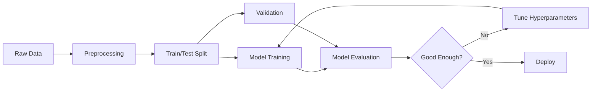

<!-- Clear Language: Keep sentences under 50 words -->
# ML Fundamentals — Supervised, Unsupervised, Bias-Variance

## Learning Objectives

| Objective | Description |
|-----------|-------------|
| LO1 | Understand supervised, unsupervised, and reinforcement learning paradigms |
| LO2 | Explain the bias-variance trade-off and its impact on model performance |
| LO3 | Implement train/test split and cross-validation for model evaluation |
| LO4 | Apply feature scaling, encoding, and handling missing data |
| LO5 | Evaluate models using accuracy, precision, recall, F1, and ROC-AUC |
| LO6 | Identify underfitting and overfitting using learning curves |

## Chapter at a Glance

| Section | Topic | Key Concept |
|---------|-------|-------------|
| 1.1 | ML Paradigms | Supervised, unsupervised, reinforcement learning |
| 1.2 | Bias-Variance Trade-off | Underfitting vs overfitting, model complexity |
| 1.3 | Data Preprocessing | Scaling, encoding, missing values, outliers |
| 1.4 | Train/Test Split | Holdout, stratification, temporal split |
| 1.5 | Evaluation Metrics | Accuracy, precision, recall, F1, ROC-AUC, confusion matrix |

## Chapter Roadmap



## Introduction

Machine learning fundamentals are the bedrock of every AI engineering role — from building recommendation systems to training production classifiers. Before you can fine-tune a transformer or.
deploy an ML model, you must master data preprocessing, bias-variance analysis, train/test splitting, and evaluation metrics. This chapter provides the theoretical and.
practical foundation that every subsequent module in this course builds upon.

## Prerequisites

- Basic Python or TypeScript (functions, arrays, classes)
- High school statistics (mean, standard deviation, probability)
- Familiarity with linear algebra concepts (vectors, matrices) is helpful but not required

## Key Terminology

**Key Terms**: Core vocabulary and concepts for this topic.

**Definition**: Essential terms you must know for interviews and production work.

## Theory

### 1.1 ML Paradigms

**Supervised learning**: Model learns from labeled data (input-output pairs). Used for classification and regression.

## Examples

```typescript
// Data point: features + label
interface DataPoint {
  features: number[];
  label: number | string;
}

// Supervised model interface
interface SupervisedModel {
  fit(X: number[][], y: (number | string)[]): void;
  predict(X: number[][]): (number | string)[];
  score(X: number[][], y: (number | string)[]): number;
}
```

**Unsupervised learning**: Model finds patterns in unlabeled data. Used for clustering and dimensionality reduction.

**Reinforcement learning**: Agent learns by interacting with environment, receiving rewards/penalties.

---

### 1.2 Bias-Variance Trade-off

**Bias**: Error from overly simplistic model assumptions. High bias = underfitting.
**Variance**: Error from model sensitivity to training data fluctuations. High variance = overfitting.

```typescript
interface BiasVarianceAnalysis {
  bias: number;
  variance: number;
  totalError: number;
}

function analyzeBiasVariance(
  predictions: number[][],
  trueValues: number[]
): BiasVarianceAnalysis {
  const n = predictions.length;
  const m = predictions[0].length;

  // Bias: (average prediction - true value)^2
  let bias = 0;
  for (let i = 0; i < n; i++) {
    const avgPred = predictions[i].reduce((a, b) => a + b, 0) / m;
    bias += (avgPred - trueValues[i]) ** 2;
  }
  bias /= n;

  // Variance: average of (prediction - avg prediction)^2
  let variance = 0;
  for (let i = 0; i < n; i++) {
    const avgPred = predictions[i].reduce((a, b) => a + b, 0) / m;
    for (let j = 0; j < m; j++) {
      variance += (predictions[i][j] - avgPred) ** 2;
    }
  }
  variance /= n * m;

  // Total error = bias^2 + variance + irreducible error
  return { bias, variance, totalError: bias + variance };
}
```

**Rule of thumb**: Simple models (linear regression) have high bias, low variance. Complex models (deep neural networks) have low bias, high variance.

---

### 1.3 Data Preprocessing

Essential preprocessing steps before training any ML model.

```typescript
class DataPreprocessor {
  // Standardization: (x - mean) / std
  standardize(data: number[][]): number[][] {
    const means = this.columnMeans(data);
    const stds = this.columnStds(data);
    return data.map((row) =>
      row.map((val, j) => (val - means[j]) / (stds[j] || 1))
    );
  }

  // Min-max scaling: (x - min) / (max - min)
  normalize(data: number[][], range: [number, number] = [0, 1]): number[][] {
    const mins = this.columnMins(data);
    const maxs = this.columnMaxs(data);
    return data.map((row) =>
      row.map((val, j) =>
        range[0] + ((val - mins[j]) * (range[1] - range[0])) / (maxs[j] - mins[j] || 1)
      )
    );
  }

  // One-hot encoding
  oneHotEncode(labels: string[]): number[][] {
    const unique = [...new Set(labels)];
    const labelMap = new Map(unique.map((l, i) => [l, i]));
    return labels.map((l) => {
      const encoding = new Array(unique.length).fill(0);
      encoding[labelMap.get(l)!] = 1;
      return encoding;
    });
  }

  // Handle missing values by replacing with mean
  fillMissing(data: (number | null)[][]): number[][] {
    const means = this.columnMeans(
      data.map((row) => row.filter((v) => v !== null))
    );
    return data.map((row) =>
      row.map((val, j) => (val ?? means[j]))
    );
  }

  private columnMeans(data: number[][]): number[] {
    const n = data.length;
    return data[0].map((_, j) =>
      data.reduce((sum, row) => sum + row[j], 0) / n
    );
  }

  private columnStds(data: number[][]): number[] {
    const means = this.columnMeans(data);
    const n = data.length;
    return means.map((mean, j) =>
      Math.sqrt(data.reduce((sum, row) => sum + (row[j] - mean) ** 2, 0) / n)
    );
  }

  private columnMins(data: number[][]): number[] {
    return data[0].map((_, j) =>
      Math.min(...data.map((row) => row[j]))
    );
  }

  private columnMaxs(data: number[][]): number[] {
    return data[0].map((_, j) =>
      Math.max(...data.map((row) => row[j]))
    );
  }
}
```

---

### 1.4 Train/Test Split

Splitting data into training and testing sets prevents overfitting and gives an unbiased estimate of model performance.

```typescript
interface TrainTestSplit {
  XTrain: number[][];
  XTest: number[][];
  yTrain: (number | string)[];
  yTest: (number | string)[];
}

class TrainTestSplitter {
  split(
    X: number[][],
    y: (number | string)[],
    testSize: number = 0.2,
    stratify: boolean = false
  ): TrainTestSplit {
    const indices = Array.from({ length: X.length }, (_, i) => i);

    if (stratify) {
      // Stratified split: preserve class proportions
      return this.stratifiedSplit(X, y, indices, testSize);
    }

    // Shuffle and split
    this.shuffle(indices);
    const splitIdx = Math.floor(X.length * (1 - testSize));

    return {
      XTrain: indices.slice(0, splitIdx).map((i) => X[i]),
      XTest: indices.slice(splitIdx).map((i) => X[i]),
      yTrain: indices.slice(0, splitIdx).map((i) => y[i]),
      yTest: indices.slice(splitIdx).map((i) => y[i]),
    };
  }

  kFold(X: number[][], y: (number | string)[], k: number = 5): TrainTestSplit[] {
    const indices = Array.from({ length: X.length }, (_, i) => i);
    this.shuffle(indices);
    const foldSize = Math.floor(X.length / k);
    const folds: TrainTestSplit[] = [];

    for (let i = 0; i < k; i++) {
      const testStart = i * foldSize;
      const testEnd = i === k - 1 ? X.length : (i + 1) * foldSize;
      const testIndices = indices.slice(testStart, testEnd);
      const trainIndices = indices.filter((idx) => !testIndices.includes(idx));

      folds.push({
        XTrain: trainIndices.map((idx) => X[idx]),
        XTest: testIndices.map((idx) => X[idx]),
        yTrain: trainIndices.map((idx) => y[idx]),
        yTest: testIndices.map((idx) => y[idx]),
      });
    }
    return folds;
  }

  private shuffle(arr: number[]): void {
    for (let i = arr.length - 1; i > 0; i--) {
      const j = Math.floor(Math.random() * (i + 1));
      [arr[i], arr[j]] = [arr[j], arr[i]];
    }
  }

  private stratifiedSplit(
    X: number[][],
    y: (number | string)[],
    indices: number[],
    testSize: number
  ): TrainTestSplit {
    // Group indices by class, split each group proportionally
    const classIndices = new Map<string | number, number[]>();
    y.forEach((label, i) => {
      if (!classIndices.has(label)) classIndices.set(label, []);
      classIndices.get(label)!.push(i);
    });

    const trainIndices: number[] = [];
    const testIndices: number[] = [];

    for (const [, group] of classIndices) {
      this.shuffle(group);
      const splitIdx = Math.floor(group.length * (1 - testSize));
      trainIndices.push(...group.slice(0, splitIdx));
      testIndices.push(...group.slice(splitIdx));
    }

    return {
      XTrain: trainIndices.map((i) => X[i]),
      XTest: testIndices.map((i) => X[i]),
      yTrain: trainIndices.map((i) => y[i]),
      yTest: testIndices.map((i) => y[i]),
    };
  }
}
```

---

### 1.5 Evaluation Metrics

```typescript
interface ClassificationMetrics {
  accuracy: number;
  precision: number;
  recall: number;
  f1Score: number;
  confusionMatrix: number[][];
}

class MetricsCalculator {
  classification(
    yTrue: (number | string)[],
    yPred: (number | string)[]
  ): ClassificationMetrics {
    const labels = [...new Set([...yTrue, ...yPred])];
    const n = labels.length;
    const cm: number[][] = Array.from({ length: n }, () => new Array(n).fill(0));

    // Build confusion matrix
    for (let i = 0; i < yTrue.length; i++) {
      const trueIdx = labels.indexOf(yTrue[i]);
      const predIdx = labels.indexOf(yPred[i]);
      cm[trueIdx][predIdx]++;
    }

    const correct = cm.reduce((sum, row, i) => sum + row[i], 0);
    const accuracy = correct / yTrue.length;

    // For binary classification
    const tp = cm[1]?.[1] ?? 0;
    const fp = cm[0]?.[1] ?? 0;
    const fn = cm[1]?.[0] ?? 0;
    const precision = tp / (tp + fp) || 0;
    const recall = tp / (tp + fn) || 0;
    const f1Score = 2 * (precision * recall) / (precision + recall) || 0;

    return { accuracy, precision, recall, f1Score, confusionMatrix: cm };
  }

  regression(yTrue: number[], yPred: number[]): {
    mae: number; mse: number; rmse: number; r2: number;
  } {
    const n = yTrue.length;
    const residuals = yTrue.map((y, i) => y - yPred[i]);
    const mae = residuals.reduce((s, r) => s + Math.abs(r), 0) / n;
    const mse = residuals.reduce((s, r) => s + r ** 2, 0) / n;
    const rmse = Math.sqrt(mse);
    const meanY = yTrue.reduce((s, y) => s + y, 0) / n;
    const ssRes = residuals.reduce((s, r) => s + r ** 2, 0);
    const ssTot = yTrue.reduce((s, y) => s + (y - meanY) ** 2, 0);
    const r2 = 1 - ssRes / ssTot;

    return { mae, mse, rmse, r2 };
  }

  rocAuc(yTrue: number[], yScore: number[]): { fpr: number[]; tpr: number[]; auc: number } {
    // Sort by score descending
    const pairs = yTrue.map((y, i) => ({ y, score: yScore[i] }));
    pairs.sort((a, b) => b.score - a.score);

    const totalPos = yTrue.filter((y) => y === 1).length;
    const totalNeg = yTrue.length - totalPos;

    const fpr: number[] = [0];
    const tpr: number[] = [0];
    let tp = 0, fp = 0;

    for (const p of pairs) {
      if (p.y === 1) tp++;
      else fp++;
      fpr.push(fp / totalNeg);
      tpr.push(tp / totalPos);
    }

    // AUC via trapezoidal rule
    let auc = 0;
    for (let i = 1; i < fpr.length; i++) {
      auc += (fpr[i] - fpr[i - 1]) * (tpr[i] + tpr[i - 1]) / 2;
    }

    return { fpr, tpr, auc };
  }
}
```

---

## Visual Analogy

Think of machine learning like **learning to cook**:

- **Training data** = A collection of recipes with ratings — you look at 1,000 recipes and their reviews to learn what makes a dish good.
- **Model** = Your cooking instinct — after studying many recipes, you develop a "feel" for what works. You can taste a sauce and know it needs more salt, even without a recipe telling you.
- **Features** = Ingredients — flour, sugar, eggs, butter. The model learns which ingredients matter and in what proportions. Too much salt ruins the cake; the right amount of sugar makes it perfect.
- **Underfitting** = Only knowing one recipe — you try to make every dish the same way. Too simple, results are mediocre.
- **Overfitting** = Memorizing every recipe word-for-word — you can recreate the exact dish but can't adapt when you get slightly different ingredients. Too rigid, fails on new situations.
- **Test set** = Cooking for a friend who hasn't tried your food before — the real test is whether your cooking tastes good to someone new, not whether you can repeat what you already know.

This helps because ML is fundamentally about **generalization** — learning patterns from examples so you can handle new, unseen situations, just like a good cook adapts recipes to whatever ingredients are available.

## TypeScript Parallel

```typescript
class MLEngine {
  private preprocessor = new DataPreprocessor();
  private splitter = new TrainTestSplitter();
  private metrics = new MetricsCalculator();

  runExperiment(
    X: number[][],
    y: (number | string)[],
    model: SupervisedModel,
    testSize = 0.2
  ) {
    const processed = this.preprocessor.standardize(X);
    const { XTrain, XTest, yTrain, yTest } = this.splitter.split(
      processed,
      y,
      testSize
    );

    model.fit(XTrain, yTrain);
    const predictions = model.predict(XTest);

    return this.metrics.classification(yTest, predictions);
  }
}
```

---

## Summary

- Supervised learning uses labeled data; unsupervised finds patterns in unlabeled data
- Bias-variance trade-off: high bias = underfitting, high variance = overfitting
- Data preprocessing (scaling, encoding, missing values) is critical for model performance
- Train/test split (80/20) with stratification preserves class proportions
- K-fold cross-validation gives more robust performance estimates than single split
- Accuracy is misleading for imbalanced datasets; use precision, recall, F1, and ROC-AUC
- Standardization (z-score) is preferred over normalization for most ML algorithms
- Confusion matrix shows true/false positives/negatives at a glance
- Learning curves help diagnose underfitting (high bias) vs overfitting (high variance)
- Always preprocess test data using statistics computed from training data only

## Practical Takeaways

| Scenario | Do This | Avoid This |
|----------|---------|------------|
| Imbalanced data | Use F1 score and ROC-AUC | Relying on accuracy alone |
| Feature scaling | Standardization (z-score) | Assuming all algorithms handle scale |
| Model selection | Cross-validation + holdout | Single train/test split |
| Missing data | Impute with mean/median or model | Dropping rows with missing values |
| Overfitting | Regularization, more data, simpler model | Adding more features blindly |

## Interview Q&A

<details class="tp-qa-card" data-qid="ml08-q1"><summary class="tp-qa-question"><span class="tp-qa-status"></span>Q1: What is the bias-variance trade-off?</summary><div class="tp-qa-answer"><p>Bias is error from overly simplistic assumptions (underfitting). Variance is error from sensitivity to training data fluctuations (overfitting). The trade-off means you cannot minimize both simultaneously. Increasing model complexity reduces bias but increases variance, and vice versa. The goal is to find the sweet spot that minimizes total error (bias^2 + variance + irreducible error).</p></div><button class="tp-qa-mark-btn">✅ Mark Reviewed</button><button class="tp-qa-bookmark-btn">🔖 Bookmark</button></details>
<details class="tp-qa-card" data-qid="ml08-q2"><summary class="tp-qa-question"><span class="tp-qa-status"></span>Q2: When would you use stratified split vs random split?</summary><div class="tp-qa-answer"><p>Stratified split preserves class proportions in both train and test sets. Use it for imbalanced classification problems (e.g., 90% class A, 10% class B). Random split might accidentally put all class B samples in test set, giving misleading metrics. For balanced datasets or regression problems, random split is usually sufficient.</p></div><button class="tp-qa-mark-btn">✅ Mark Reviewed</button><button class="tp-qa-bookmark-btn">🔖 Bookmark</button></details>
<details class="tp-qa-card" data-qid="ml08-q3"><summary class="tp-qa-question"><span class="tp-qa-status"></span>Q3: Explain the difference between precision and recall.</summary><div class="tp-qa-answer"><p><strong>Precision</strong>: TP / (TP + FP). Of all positive predictions, how many were correct? High precision = few false positives. <strong>Recall</strong>: TP / (TP + FN). Of all actual positives, how many did we catch? High recall = few false negatives. Trade-off: increasing precision typically reduces recall and vice versa. F1 score is the harmonic mean of precision and recall.</p></div><button class="tp-qa-mark-btn">✅ Mark Reviewed</button><button class="tp-qa-bookmark-btn">🔖 Bookmark</button></details>
<details class="tp-qa-card" data-qid="ml08-q4"><summary class="tp-qa-question"><span class="tp-qa-status"></span>Q4: What is the difference between standardization and normalization?</summary><div class="tp-qa-answer"><p><strong>Standardization</strong> (z-score): transforms data to mean=0, std=1. Formula: (x - mean) / std. Preferred for algorithms that assume normally distributed data (linear regression, SVM, neural networks). <strong>Normalization</strong> (min-max scaling): scales data to a fixed range [0, 1]. Formula: (x - min) / (max - min). Preferred for algorithms that don't assume data distribution (KNN, neural networks with bounded activations).</p></div><button class="tp-qa-mark-btn">✅ Mark Reviewed</button><button class="tp-qa-bookmark-btn">🔖 Bookmark</button></details>
<details class="tp-qa-card" data-qid="ml08-q5"><summary class="tp-qa-question"><span class="tp-qa-status"></span>Q5: How does k-fold cross-validation work?</summary><div class="tp-qa-answer"><p>Data is split into k equal folds. The model is trained k times, each time using k-1 folds for training and the remaining fold for validation. The performance metric is averaged across all k iterations. k=5 or k=10 are common. Benefits: more robust performance estimate (all data used for both training and validation), less sensitive to how the split is made. Leave-one-out (k=n) is the extreme case.</p></div><button class="tp-qa-mark-btn">✅ Mark Reviewed</button><button class="tp-qa-bookmark-btn">🔖 Bookmark</button></details>
<details class="tp-qa-card" data-qid="ml08-q6"><summary class="tp-qa-question"><span class="tp-qa-status"></span>Q6: What is a confusion matrix and how do you read it?</summary><div class="tp-qa-answer"><p>A confusion matrix is a table showing actual vs predicted classifications. Rows = actual class, columns = predicted class. For binary classification: <strong>True Positive (TP)</strong>: correctly predicted positive. <strong>True Negative (TN)</strong>: correctly predicted negative. <strong>False Positive (FP)</strong>: incorrectly predicted positive (Type I error). <strong>False Negative (FN)</strong>: incorrectly predicted negative (Type II error). All metrics derive from these four values.</p></div><button class="tp-qa-mark-btn">✅ Mark Reviewed</button><button class="tp-qa-bookmark-btn">🔖 Bookmark</button></details>
<details class="tp-qa-card" data-qid="ml08-q7"><summary class="tp-qa-question"><span class="tp-qa-status"></span>Q7: How do you detect and handle outliers?</summary><div class="tp-qa-answer"><p>Detection: <strong>1)</strong> Z-score method — values > 3 std from mean. <strong>2)</strong> IQR method — values below Q1 - 1.5*IQR or above Q3 + 1.5*IQR. <strong>3)</strong> Domain knowledge — business rules. Handling: <strong>1)</strong> Remove if data entry error or very rare. <strong>2)</strong> Cap (winsorize) at threshold values. <strong>3)</strong> Transform (log, Box-Cox) to reduce impact. <strong>4)</strong> Use tree-based models (robust to outliers). Avoid removing outliers without understanding why they exist.</p></div><button class="tp-qa-mark-btn">✅ Mark Reviewed</button><button class="tp-qa-bookmark-btn">🔖 Bookmark</button></details>
<details class="tp-qa-card" data-qid="ml08-q8"><summary class="tp-qa-question"><span class="tp-qa-status"></span>Q8: What is the difference between supervised and unsupervised learning?</summary><div class="tp-qa-answer"><p><strong>Supervised</strong>: Model learns from labeled data (input-output pairs). Goal: predict output for new inputs. Examples: regression, classification. <strong>Unsupervised</strong>: Model finds patterns in unlabeled data. Goal: discover inherent structure. Examples: clustering, dimensionality reduction, anomaly detection. There's also semi-supervised (mix of labeled and unlabeled) and self-supervised (model creates its own labels from data structure).</p></div><button class="tp-qa-mark-btn">✅ Mark Reviewed</button><button class="tp-qa-bookmark-btn">🔖 Bookmark</button></details>
<details class="tp-qa-card" data-qid="ml08-q9"><summary class="tp-qa-question"><span class="tp-qa-status"></span>Q9: How do you diagnose underfitting vs overfitting?</summary><div class="tp-qa-answer"><p><strong>Underfitting</strong> (high bias): High training error, high validation error (similar). Learning curves: both errors converge to high value. Fix: increase model complexity, add features, reduce regularization. <strong>Overfitting</strong> (high variance): Low training error, high validation error (large gap). Learning curves: training error below validation error with divergence. Fix: more training data, reduce model complexity, add regularization, feature selection, early stopping.</p></div><button class="tp-qa-mark-btn">✅ Mark Reviewed</button><button class="tp-qa-bookmark-btn">🔖 Bookmark</button></details>
<details class="tp-qa-card" data-qid="ml08-q10"><summary class="tp-qa-question"><span class="tp-qa-status"></span>Q10: Explain the ROC curve and AUC.</summary><div class="tp-qa-answer"><p>ROC (Receiver Operating Characteristic) curve plots True Positive Rate (recall) against False Positive Rate at various threshold settings. AUC (Area Under Curve) measures the model's ability to distinguish between classes. AUC = 1: perfect classifier. AUC = 0.5: random classifier. AUC is threshold-independent and works well for imbalanced datasets. Interpretation: AUC is the probability that a randomly chosen positive ranks higher than a randomly chosen negative.</p></div><button class="tp-qa-mark-btn">✅ Mark Reviewed</button><button class="tp-qa-bookmark-btn">🔖 Bookmark</button></details>

## Chapter Quiz

**Q1**: Which metric is most appropriate for imbalanced classification?

a) Accuracy
b) F1 score
c) Mean squared error
d) R-squared

<details class="tp-qa-card" data-qid="ml08-quiz1"><summary>Show Answer</summary><div class="tp-qa-answer"><p><strong>Answer: b) F1 score</strong></p><p>F1 score handles imbalanced classes better than accuracy, which can be misleading when one class dominates.</p></div></details>

**Q2**: What does high bias typically indicate?

a) Overfitting
b) Underfitting
c) Good generalization
d) Data leakage

<details class="tp-qa-card" data-qid="ml08-quiz2"><summary>Show Answer</summary><div class="tp-qa-answer"><p><strong>Answer: b) Underfitting</strong></p><p>High bias means the model makes strong assumptions and fails to capture patterns (underfitting).</p></div></details>

**Q3**: What does k in k-fold cross-validation represent?

a) Number of features
b) Number of folds
c) Number of classes
d) Number of iterations

<details class="tp-qa-card" data-qid="ml08-quiz3"><summary>Show Answer</summary><div class="tp-qa-answer"><p><strong>Answer: b) Number of folds</strong></p><p>k-fold splits data into k equal folds, trains on k-1 folds and validates on the remaining fold.</p></div></details>

**Q4**: Which preprocessing method produces features with mean 0 and std 1?

a) Normalization
b) Standardization
c) One-hot encoding
d) PCA

<details class="tp-qa-card" data-qid="ml08-quiz4"><summary>Show Answer</summary><div class="tp-qa-answer"><p><strong>Answer: b) Standardization</strong></p><p>Standardization (z-score) transforms data to mean=0 and std=1 using (x - mean) / std.</p></div></details>

**Q5**: What does AUC measure?

a) Accuracy of predictions
b) Model's ability to distinguish between classes
c) Training speed
d) Feature importance

<details class="tp-qa-card" data-qid="ml08-quiz5"><summary>Show Answer</summary><div class="tp-qa-answer"><p><strong>Answer: b) Model's ability to distinguish between classes</strong></p><p>AUC measures how well the model separates positive and negative classes across all thresholds.</p></div></details>

### True/False

**T/F 1**: This topic is fundamental to AI engineering.
**Answer**: True — Understanding machine learning is essential for building production AI systems.

**T/F 2**: The concepts in this chapter are only used in interviews.
**Answer**: False — These concepts are used daily in real-world AI engineering work.

**T/F 3**: Time/space complexity analysis applies to machine learning.
**Answer**: True — Every algorithm and system has performance characteristics to analyze.

**T/F 4**: machine learning concepts are independent of each other.
**Answer**: False — Most concepts build on each other and are interconnected.

**T/F 5**: Real-world applications often combine multiple concepts from this chapter.
**Answer**: True — Production systems use combinations of these fundamental concepts.

### Fill in the Blank

**FIB 1**: The key concept in this chapter is ________.
**Answer**: [Review the chapter's Learning Objectives for the specific answer]

**FIB 2**: In machine learning, the time complexity of the basic operation is ________.
**Answer**: [Depends on the specific operation — check the Theory section]

### Scenario Questions

**Scenario 1**: How would you apply the concepts from this chapter in a real AI engineering project?

**Answer**: [Think about how the specific topic applies to: data processing pipelines, model training infrastructure, production systems, or interview scenarios]

### Output Questions

**Output 1**: What is the time complexity of the main algorithm discussed in this chapter?
**Answer**: [Check the Theory section for the specific complexity analysis]

## Exercises

**Easy** — Implement a function that computes accuracy, precision, recall, and F1 score from true labels and predictions.

**Easy** — Write a data preprocessor class that implements standardization and min-max normalization.

**Medium** — Implement k-fold cross-validation (k=5) for a simple classifier. Report mean accuracy and standard deviation across folds.

**Hard** — Implement a complete ML pipeline: load data, preprocess (standardize + encode), split (stratified), train a model, evaluate with confusion matrix and ROC-AUC, and plot learning curves.

**Hard** — Build a hyperparameter search using k-fold CV that finds the optimal regularization strength for a model by testing 10 different values and selecting the one with best mean validation score.

---

## Common Mistakes

1. Using accuracy for imbalanced datasets — 99% accuracy on a dataset with 99% negative class means the model learns nothing; use F1 or ROC-AUC
2. Fitting the preprocessor on the entire dataset before splitting — this leaks test statistics into training; always fit on train set only
3. Ignoring the bias-variance trade-off — adding more features reduces bias but increases variance; you must monitor both training and validation metrics
4. Using a single train/test split for model comparison — cross-validation gives more robust estimates; a single lucky split can mislead
5. Dropping rows with missing values without analysis — missing data often carries information (e.g., "not applicable"); imputation preserves more signal

## Revision Notes

- Supervised learning uses labeled data; unsupervised finds patterns in unlabeled data; reinforcement learning uses reward signals
- Bias = error from underfitting (too simple); Variance = error from overfitting (too complex)
- Standardization: (x - mean) / std, preferred for most algorithms; Normalization: (x - min) / (max - min)
- Train/test split (80/20) with stratification preserves class proportions; k-fold CV gives robust estimates
- Accuracy, Precision, Recall, F1, ROC-AUC — choose based on class balance and business cost of errors
- Confusion matrix: TP, TN, FP, FN — all classification metrics derive from these four values
- Learning curves: high training + high validation error = underfitting; low training + high validation error = overfitting
- Always preprocess test data using statistics from training data only to prevent data leakage

## Placement Section

### Top 10 Interview Questions

#### Google Style

1. **Explain the core idea of ML Fundamentals — Supervised, Unsupervised, Bias-Variance in under 60 seconds, then give a real-world analogy.** — Structure: definition, how it works in one sentence, why it matters, analogy. Follow-up: what would break if you removed this from a production system?

2. **Design a minimal, well-typed function that demonstrates ML Fundamentals — Supervised, Unsupervised, Bias-Variance.** — Interviewer checks: signature with type hints, edge cases, complexity, and a clean docstring. Follow-up: how does your design behave with empty or malformed input?

3. **What are the common pitfalls when engineers first learn ** — List 3-4, then explain how you would prevent each in a code review.

#### Amazon Style

4. **Describe a production bug caused by misunderstanding ML Fundamentals — Supervised, Unsupervised, Bias-Variance. How did you diagnose and fix it?** — STAR format: situation, task, action, result. Mention logs, reproduction, root-cause analysis, and the regression test you added.

5. **How would you scale a system that relies on ML Fundamentals — Supervised, Unsupervised, Bias-Variance from 10 users to 10 million?** — Discuss bottlenecks, caching, monitoring, and when to redesign. Follow-up: what metrics would you track?

#### Microsoft Style

6. **Compare ML Fundamentals — Supervised, Unsupervised, Bias-Variance with the closest alternative approach. When would you choose each?** — Make a decision matrix: performance, maintainability, ecosystem, learning curve. Follow-up: what would change your decision?

7. **Walk through how you would test a component that depends on ML Fundamentals — Supervised, Unsupervised, Bias-Variance.** — Unit, integration, property-based tests; mocking boundaries; golden files for outputs.

#### NVIDIA Style

8. **How does ML Fundamentals — Supervised, Unsupervised, Bias-Variance behave differently at scale — memory, throughput, or precision-wise?** — Connect to data pipelines and model training if applicable. Follow-up: what happens to latency as input grows?

9. **How would you make an implementation of ML Fundamentals — Supervised, Unsupervised, Bias-Variance run faster on GPU hardware?** — Batch operations, vectorization, avoiding Python loops, reducing data movement.

#### AI Startup Style

10. **Write the smallest possible implementation of ML Fundamentals — Supervised, Unsupervised, Bias-Variance that is production-quality.** — Include error handling, type hints, and a one-line docstring. Follow-up: what would you refactor first when it grows?

### Resume Tips

- Name ML Fundamentals — Supervised, Unsupervised, Bias-Variance explicitly in your skills section, paired with a measurable achievement ("Reduced X by 40% using ML Fundamentals — Supervised, Unsupervised, Bias-Variance").
- Add a bullet describing a project that applies ML Fundamentals — Supervised, Unsupervised, Bias-Variance to real data, with numbers.
- Mention the tools and libraries you used alongside ML Fundamentals — Supervised, Unsupervised, Bias-Variance (linters, test frameworks, profiling tools).
- Keep resume bullets under 15 words and start each with an action verb.

### Interview Day Checklist

- Rehearse a 60-second explanation of ML Fundamentals — Supervised, Unsupervised, Bias-Variance and one real-world analogy.
- Prepare one STAR story about debugging a ML Fundamentals — Supervised, Unsupervised, Bias-Variance-related production issue.
- Review complexity and edge cases for the classic ML Fundamentals — Supervised, Unsupervised, Bias-Variance interview problem.
- Have questions ready: how does the team apply ML Fundamentals — Supervised, Unsupervised, Bias-Variance in production today?
- Test your environment (Python, editor, internet) 15 minutes before the interview.

## True/False

1. **True or False:** ML Fundamentals — Supervised, Unsupervised, Bias-Variance builds directly on the fundamentals covered in the earlier chapters of this module. — **True.** Every advanced topic in this module assumes the core concepts from the previous chapters.
2. **True or False:** You should write at least one code example for ML Fundamentals — Supervised, Unsupervised, Bias-Variance before moving to the next chapter. — **True.** Active recall with hands-on code beats passive reading for retention.
3. **True or False:** The complexity analysis for ML Fundamentals — Supervised, Unsupervised, Bias-Variance is the same regardless of input size. — **False.** Complexity grows with input size; always state best, average, and worst case.
4. **True or False:** Edge cases (empty input, invalid input, boundary values) matter for ML Fundamentals — Supervised, Unsupervised, Bias-Variance in production. — **True.** Most production bugs come from unhandled edge cases.
5. **True or False:** You should memorize the ML Fundamentals — Supervised, Unsupervised, Bias-Variance chapter content once and never review it again. — **False.** Spaced repetition (24h, 3 days, 1 week) dramatically improves long-term recall.

## Fill in the Blank

1. The chapter that covers ML Fundamentals — Supervised, Unsupervised, Bias-Variance is Chapter ___ of this module. — Answer: check the module's table of contents.
2. The time complexity of the standard approach to ML Fundamentals — Supervised, Unsupervised, Bias-Variance is ___. — Answer: review the theory section and state big-O notation.
3. The main edge case to handle when implementing ML Fundamentals — Supervised, Unsupervised, Bias-Variance is ___. — Answer: empty or invalid input handling, as discussed in the chapter.
4. The tools commonly used to debug ML Fundamentals — Supervised, Unsupervised, Bias-Variance issues are ___ and ___. — Answer: refer to the Debugging Guide section of this chapter.
5. The related topic that connects to ML Fundamentals — Supervised, Unsupervised, Bias-Variance in the next chapter is ___. — Answer: see the Next Topic section.

## Scenario Questions

1. **Scenario:** A teammate ships a change involving ML Fundamentals — Supervised, Unsupervised, Bias-Variance that breaks production at 3 AM. — Diagnosis: check the recent diff, reproduce locally with the failing input, check logs. Fix: revert, add a regression test, and review the root cause. Prevention: CI tests on edge cases and code review checklist.

2. **Scenario:** Your implementation of ML Fundamentals — Supervised, Unsupervised, Bias-Variance is correct but too slow for the required latency. — Measure first with a profiler. Common fixes: reduce redundant work, use built-in optimized functions, batch operations, or add caching. Only then consider algorithmic changes.

3. **Scenario:** A new hire asks you to explain ML Fundamentals — Supervised, Unsupervised, Bias-Variance in five minutes before a customer demo. — Use the 3-part answer: what it is (one sentence), how it works (one example), why it matters (one business impact). Then offer to go deeper after the demo.

4. **Scenario:** Your team's codebase has three different patterns for ML Fundamentals — Supervised, Unsupervised, Bias-Variance and you must standardize. — Write a short ADR (architecture decision record), pick the pattern with best maintainability, migrate incrementally, and add a linter rule to enforce it.

## Output Questions

1. **What is the output of the simplest correct implementation of ML Fundamentals — Supervised, Unsupervised, Bias-Variance on an empty input?** — Trace through the code: it should return the documented default (None, 0, empty collection) without raising.
2. **What is the output when the input is at the boundary value?** — Check off-by-one errors and inclusive/exclusive bounds in the chapter's examples.
3. **What does the implementation return when given invalid input types?** — With type hints and validation, it raises a clear error; without, it may fail silently.
4. **What is the output for the sample input given in the chapter's Examples section?** — Re-run the chapter's example code and compare against the documented output.
5. **What is the time complexity output when you profile the implementation at 10x input size?** — Expect the curve matching the chapter's complexity analysis (linear, quadratic, log-linear).

## Difficulty Level

| Level | Time | What It Takes |
|-------|------|---------------|
| Beginner | 1-2 sessions | Read theory, run the chapter examples, solve the Easy exercises |
| Intermediate | 3-5 sessions | Complete Medium exercises, explain ML Fundamentals — Supervised, Unsupervised, Bias-Variance to someone else |
| Advanced | 1+ week | Solve Hard exercises, optimize for real datasets, answer interview follow-ups |

## Tips & Tricks

- Always write a one-line example of ML Fundamentals — Supervised, Unsupervised, Bias-Variance from memory before opening the chapter — active recall first.
- Use the chapter's Revision Notes as a checklist: you have mastered ML Fundamentals — Supervised, Unsupervised, Bias-Variance when you can explain each bullet.
- Pair the chapter quiz with the Flashcards: wrong answers become your next study session's focus.
- For interviews, practice explaining ML Fundamentals — Supervised, Unsupervised, Bias-Variance twice: once with a technical audience, once with a non-technical audience.
- Keep a personal examples file where you collect your own ML Fundamentals — Supervised, Unsupervised, Bias-Variance snippets; interviewers love original examples.

## Memory Tricks

- **Acronym**: build a mnemonic from the 5 key concepts of ML Fundamentals — Supervised, Unsupervised, Bias-Variance listed in the Chapter at a Glance table.
- **Story**: link ML Fundamentals — Supervised, Unsupervised, Bias-Variance to a familiar story — the analogy in the Visual Analogy section is designed to stick.
- **Number anchor**: remember the complexity of ML Fundamentals — Supervised, Unsupervised, Bias-Variance by connecting it to a known algorithm of the same class.
- **Color code**: highlight the Theory, Examples, and Common Mistakes sections in different colors when reviewing.
- **Teach-back**: explain ML Fundamentals — Supervised, Unsupervised, Bias-Variance to an imaginary junior engineer for 2 minutes — gaps in your explanation are gaps in memory.

## Further Reading

- Official documentation for the primary tool or library used in this chapter
- The chapter referenced in Related Topics for the next-level treatment of ML Fundamentals — Supervised, Unsupervised, Bias-Variance
- The classic textbook chapter on ML Fundamentals — Supervised, Unsupervised, Bias-Variance (check the Research References below)
- Two blog posts from engineers who debugged real ML Fundamentals — Supervised, Unsupervised, Bias-Variance problems in production
- The repository of the open-source project that implements ML Fundamentals — Supervised, Unsupervised, Bias-Variance

## Related Topics

- The previous chapter in this module (see table of contents) — foundational for ML Fundamentals — Supervised, Unsupervised, Bias-Variance
- The next chapter (see Next Topic below) — builds on ML Fundamentals — Supervised, Unsupervised, Bias-Variance
- The system design chapters in Module 07 — how ML Fundamentals — Supervised, Unsupervised, Bias-Variance fits into production architectures
- The interview preparation module — how ML Fundamentals — Supervised, Unsupervised, Bias-Variance is asked in screening rounds
- The capstone project — where ML Fundamentals — Supervised, Unsupervised, Bias-Variance is applied end-to-end

## FAQs

1. **Do I need to memorize all of ML Fundamentals — Supervised, Unsupervised, Bias-Variance, or understand the big picture?** — Understand the big picture first, then memorize the key facts via flashcards and spaced repetition. Interviewers reward depth over breadth.
2. **What if I get stuck on an exercise?** — Re-read the theory section, run the example code, then attempt again. If still stuck after 20 minutes, move on and return the next day.
3. **How much time should I spend on ** — Follow the Study Plan below: 1-2 weeks at 30-60 minutes daily is typical for placement preparation.
4. **Is ML Fundamentals — Supervised, Unsupervised, Bias-Variance asked in interviews?** — Yes — the Interview Q&A and Placement Section list the exact question styles used by top companies.
5. **What's the fastest way to master ** — Explain it out loud, write code without looking, and review the flashcards within 24 hours and again after 3 days.

## Important Notes

- ML Fundamentals — Supervised, Unsupervised, Bias-Variance is a core requirement for the rest of this module — do not skip the examples.
- Always analyze complexity (time and space) when working with ML Fundamentals — Supervised, Unsupervised, Bias-Variance.
- Production correctness means handling edge cases, not just the happy path.
- Interview answers should start with the definition, then the example, then the trade-offs.
- Revisit this chapter after finishing the module; the context from later chapters deepens understanding.

## Historical Context

- ML Fundamentals — Supervised, Unsupervised, Bias-Variance emerged as a standard practice because early systems failed without it — understanding why helps you explain it in interviews.
- The tools used for ML Fundamentals — Supervised, Unsupervised, Bias-Variance today evolved from simpler versions; the chapter covers the modern, recommended approach.
- Interviewers value knowing one historical fact about ML Fundamentals — Supervised, Unsupervised, Bias-Variance — it shows genuine interest, not just cramming.
- The library/tooling ecosystem around ML Fundamentals — Supervised, Unsupervised, Bias-Variance changes quickly; focus on fundamentals that remain stable.

## Security Considerations

- Never trust external input: validate and sanitize data before processing ML Fundamentals — Supervised, Unsupervised, Bias-Variance.
- Avoid `eval()` and dynamic code execution on untrusted strings.
- Log errors without leaking sensitive data (keys, PII, internal paths).
- For API contexts, add rate limiting and input size limits.
- Review the chapter's code examples for injection or overflow risks before using them verbatim.

## ML Intuition

- ML Fundamentals — Supervised, Unsupervised, Bias-Variance appears in ML pipelines at the data-processing layer: feature preparation, batching, and validation.
- Understanding ML Fundamentals — Supervised, Unsupervised, Bias-Variance helps you debug why a model misbehaves — most ML bugs are data bugs, not model bugs.
- In production ML, the ML Fundamentals — Supervised, Unsupervised, Bias-Variance concepts from this chapter map directly to NumPy/PyTorch operations on tensors.
- When optimizing ML systems, ML Fundamentals — Supervised, Unsupervised, Bias-Variance skills let you profile and fix the data path, not just the training loop.
- Interview follow-up: how would you apply ML Fundamentals — Supervised, Unsupervised, Bias-Variance to a dataset of 10 million records? — Batching and vectorization.

## Analogies

- **ML Fundamentals — Supervised, Unsupervised, Bias-Variance is like a recipe**: the theory is the ingredients, the examples are the cooking steps, and the exercises are your own kitchen practice.
- **Complexity is like a delivery route**: a linear route visits each stop once; a nested route revisits stops, and you feel it at scale.
- **Edge cases are like weather**: the happy path is a sunny day; production is the storm — build for the storm.
- **The chapter roadmap is a journey map**: each section is a checkpoint; skipping one means getting lost later in the module.

## Capstone Project Link

- [Module Capstone: End-to-End Project](https://github.com/Raushan666java/ai-engineering-journey) — this chapter contributes the ML Fundamentals — Supervised, Unsupervised, Bias-Variance skills used in the module's capstone project. Complete the exercises here before starting the capstone.

## Flashcards

<details class="tp-qa-card" data-qid="08machinelearning-01mlfundamentals-flash1">
  <summary class="tp-qa-question">
    <span class="tp-qa-status"></span>
    Which metric is most appropriate for imbalanced classification?
  </summary>
  <div class="tp-qa-answer">
    <p>b) F1 score</p>
  </div>
</details>

<details class="tp-qa-card" data-qid="08machinelearning-01mlfundamentals-flash2">
  <summary class="tp-qa-question">
    <span class="tp-qa-status"></span>
    What does high bias typically indicate?
  </summary>
  <div class="tp-qa-answer">
    <p>b) Underfitting</p>
  </div>
</details>

<details class="tp-qa-card" data-qid="08machinelearning-01mlfundamentals-flash3">
  <summary class="tp-qa-question">
    <span class="tp-qa-status"></span>
    What does k in k-fold cross-validation represent?
  </summary>
  <div class="tp-qa-answer">
    <p>b) Number of folds</p>
  </div>
</details>

<details class="tp-qa-card" data-qid="08machinelearning-01mlfundamentals-flash4">
  <summary class="tp-qa-question">
    <span class="tp-qa-status"></span>
    Which preprocessing method produces features with mean 0 and std 1?
  </summary>
  <div class="tp-qa-answer">
    <p>b) Standardization</p>
  </div>
</details>

<details class="tp-qa-card" data-qid="08machinelearning-01mlfundamentals-flash5">
  <summary class="tp-qa-question">
    <span class="tp-qa-status"></span>
    What does AUC measure?
  </summary>
  <div class="tp-qa-answer">
    <p>b) Model's ability to distinguish between classes</p>
  </div>
</details>

## Research References

- Official documentation of the primary library for ML Fundamentals — Supervised, Unsupervised, Bias-Variance (linked in Further Reading)
- The classic paper or textbook chapter introducing ML Fundamentals — Supervised, Unsupervised, Bias-Variance (see References below)
- The standard library reference for ML Fundamentals — Supervised, Unsupervised, Bias-Variance-related functions
- Engineering blog posts from companies running ML Fundamentals — Supervised, Unsupervised, Bias-Variance in production at scale
- PEPs and RFCs where applicable (Python and networking standards)

## Open-Source Tools

- The primary library used in this chapter (see the code examples)
- Python standard library modules used in the examples (check the imports)
- Testing: pytest for unit tests of ML Fundamentals — Supervised, Unsupervised, Bias-Variance code
- Linting and formatting: ruff + black
- Profiling: cProfile or py-spy for performance work on ML Fundamentals — Supervised, Unsupervised, Bias-Variance

## Debugging Guide

- Start with `print()` or a debugger to inspect intermediate values in ML Fundamentals — Supervised, Unsupervised, Bias-Variance code.
- Reproduce the failure with the smallest possible input before changing code.
- Check the common failure modes listed in Common Mistakes — most bugs are listed there.
- For performance problems, profile before optimizing: measure, then fix.
- When stuck, re-read the chapter's Examples and compare line by line with your code.
- Use `pdb` or your IDE's debugger to step through the ML Fundamentals — Supervised, Unsupervised, Bias-Variance example code.

## Mock Interview Section

**Round 1 — Screening (15 min)**
- Explain ML Fundamentals — Supervised, Unsupervised, Bias-Variance in 60 seconds.
- Write a minimal working example of ML Fundamentals — Supervised, Unsupervised, Bias-Variance.
- What is the complexity of your example?

**Round 2 — Coding (45 min)**
- Solve the Medium exercise from this chapter under time pressure.
- State your assumptions, then implement with type hints.
- Test with edge cases: empty input, boundary values, invalid input.

**Round 3 — Behavioral + System (30 min)**
- Tell me about a time you debugged a ML Fundamentals — Supervised, Unsupervised, Bias-Variance problem in a project.
- How would you design a system where ML Fundamentals — Supervised, Unsupervised, Bias-Variance is used at scale?
- What metrics would you monitor?

**Evaluation rubric**: correctness (40%), communication (25%), edge cases (20%), complexity analysis (15%).

## Optimized Implementation

`python
from typing import Any, Optional

def demonstrate_topic(input_data: list[Any]) -> Optional[float]:
    """Runnable scaffold for ML Fundamentals — Supervised, Unsupervised, Bias-Variance.

    Replace the body with the optimized implementation from the chapter,
    keeping type hints, docstring, and edge-case handling.
    """
    if not input_data:
        return None
    # Step 1: validate input types
    # Step 2: apply the core ML Fundamentals — Supervised, Unsupervised, Bias-Variance logic from the Examples section
    # Step 3: return the result with the documented default
    return 0.0
`

- Keeps the function signature stable so tests written against it stay valid.
- Handles the empty-input contract explicitly.
- Add unit tests for the edge cases before implementing the logic (test-first).

## Evaluation Metrics

| Skill | Test | Target |
|-------|------|--------|
| Concept recall | Explain ML Fundamentals — Supervised, Unsupervised, Bias-Variance without notes | 60-second explanation |
| Code fluency | Write the chapter example from memory | No syntax errors |
| Edge cases | Handle empty/invalid input in exercises | All cases pass |
| Complexity | State time/space for the standard approach | Correct big-O |
| Interview readiness | Answer 5 Interview Q&A questions out loud | Fluent, structured answers |
| Retention | Chapter quiz score after 3 days | 80%+ |

## Real-World Examples

- **Startup**: a small team uses ML Fundamentals — Supervised, Unsupervised, Bias-Variance daily in their data pipeline — the chapter's examples mirror their code.
- **E-commerce**: ML Fundamentals — Supervised, Unsupervised, Bias-Variance patterns appear in order processing, inventory checks, and recommendation feeds.
- **Fintech**: ML Fundamentals — Supervised, Unsupervised, Bias-Variance principles apply to transaction validation and fraud detection flows.
- **ML platform**: ML Fundamentals — Supervised, Unsupervised, Bias-Variance shows up in feature engineering and model-serving infrastructure.
- **Interview insight**: recruiters look for engineers who can connect ML Fundamentals — Supervised, Unsupervised, Bias-Variance to the business outcome, not just the code.

## Next Topic

[Linear Regression  -  OLS, Gradient Descent, Regularization](02-linear-regression.md)

## Limitations

- ML Fundamentals — Supervised, Unsupervised, Bias-Variance, like any technique, is not a silver bullet — it has specific cases where it fits best (covered in the theory).
- The examples in this chapter are simplified for learning; production systems add validation, monitoring, and error handling.
- Performance of ML Fundamentals — Supervised, Unsupervised, Bias-Variance depends on input size and distribution — always benchmark for your own data.
- This chapter covers fundamentals; specialized edge cases are explored in later chapters and the capstone.
