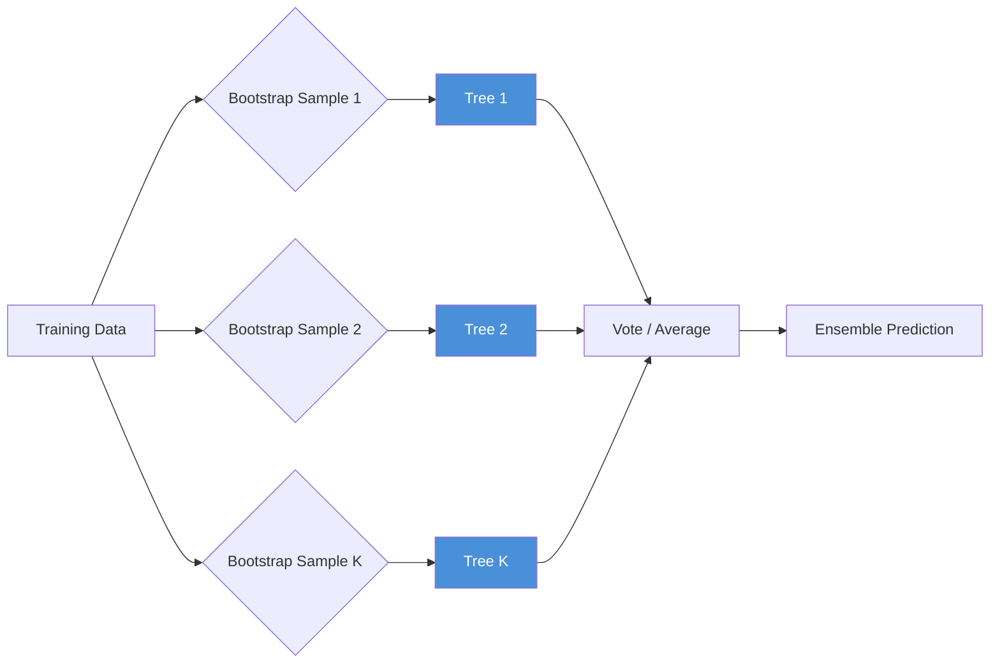

<!-- Clear Language: Keep sentences under 50 words -->
# Decision Trees & Random Forest — Entropy, Gini, Bagging

## Learning Objectives

| Objective | Description |
|-----------|-------------|
| LO1 | Understand how decision trees split data using entropy and Gini impurity |
| LO2 | Implement a decision tree classifier from scratch with pruning |
| LO3 | Explain bagging (bootstrap aggregating) and how it reduces variance |
| LO4 | Build random forest with feature subsampling and out-of-bag evaluation |
| LO5 | Analyze feature importance from tree-based models |
| LO6 | Diagnose overfitting in trees using depth, min_samples_split, and pruning |

## Introduction

Machine learning is the core of AI engineering. From linear regression to ensemble methods, understanding these algorithms lets you build, debug, and improve models. This module covers the math and code behind ML.

## Prerequisites

- Basic programming knowledge
- Understanding of data structures

## Key Terminology

**Key Terms**: Core vocabulary and concepts for this topic.

**Definition**: Essential terms you must know for interviews and production work.

## Theory

Understanding decision trees and rf is fundamental for AI engineers. This section covers the core concepts, underlying principles, and theoretical framework that govern how decision trees and rf works in practice.

## Chapter at a Glance

| Section | Topic | Key Concept |
|---------|-------|-------------|
| 4.1 | Entropy & Information Gain | Measuring impurity, best split selection |
| 4.2 | Gini Impurity | Alternative to entropy, computational efficiency |
| 4.3 | Decision Tree Implementation | Recursive partitioning, stopping criteria |
| 4.4 | Pruning & Overfitting | Pre-pruning vs post-pruning, cost-complexity |
| 4.5 | Bagging (Bootstrap Aggregating) | Variance reduction, out-of-bag error |
| 4.6 | Random Forest | Feature subsampling, ensemble prediction |

## Chapter Roadmap



## 4.1 Entropy & Information Gain

Entropy measures the impurity or uncertainty in a set of labels. For a binary classification with proportions p₁ and p₂:

H(S) = -p₁ log₂(p₁) - p₂ log₂(p₂)

Information gain measures the reduction in entropy after splitting on a feature:

IG(S, f) = H(S) - Σ (|Sᵥ| / |S|) — H(Sᵥ)

```python
import numpy as np
from typing import List, Tuple, Dict, Optional, Any

class EntropyCalculator:
    def entropy(self, y: np.ndarray) -> float:
        _, counts = np.unique(y, return_counts=True)
        probs = counts / len(y)
        return -np.sum(probs * np.log2(probs + 1e-15))

    def information_gain(self, X: np.ndarray, y: np.ndarray,
                         feature_idx: int, threshold: float) -> float:
        parent_entropy = self.entropy(y)
        left_mask = X[:, feature_idx] <= threshold
        right_mask = ~left_mask

        n = len(y)
        n_left, n_right = np.sum(left_mask), np.sum(right_mask)
        if n_left == 0 or n_right == 0:
            return 0.0

        child_entropy = (n_left / n) * self.entropy(y[left_mask]) + (n_right / n) * self.entropy(y[right_mask])
        return parent_entropy - child_entropy

    def best_split(self, X: np.ndarray, y: np.ndarray) -> Dict:
        best_gain = -1
        best_feature = None
        best_threshold = None

        for feature_idx in range(X.shape[1]):
            values = np.unique(X[:, feature_idx])
            for i in range(len(values) - 1):
                threshold = (values[i] + values[i + 1]) / 2
                gain = self.information_gain(X, y, feature_idx, threshold)
                if gain > best_gain:
                    best_gain = gain
                    best_feature = feature_idx
                    best_threshold = threshold

        return {"feature": best_feature, "threshold": best_threshold, "gain": best_gain}

calc = EntropyCalculator()
y_sample = np.array([0, 0, 1, 1, 1, 1])
print(f"Entropy: {calc.entropy(y_sample):.4f}")
```

**Entropy range**: H=0 (all same class) to H=1 (perfectly split binary). For K classes, max is log₂(K).

---

## 4.2 Gini Impurity

Gini impurity is an alternative to entropy that is computationally cheaper:

G(S) = 1 - Σ pᵢ²

```python
class GiniCalculator:
    def gini(self, y: np.ndarray) -> float:
        _, counts = np.unique(y, return_counts=True)
        probs = counts / len(y)
        return 1 - np.sum(probs ** 2)

    def gini_gain(self, X: np.ndarray, y: np.ndarray,
                  feature_idx: int, threshold: float) -> float:
        parent_gini = self.gini(y)
        left_mask = X[:, feature_idx] <= threshold
        right_mask = ~left_mask

        n = len(y)
        n_left, n_right = np.sum(left_mask), np.sum(right_mask)
        if n_left == 0 or n_right == 0:
            return 0.0

        child_gini = (n_left / n) * self.gini(y[left_mask]) + (n_right / n) * self.gini(y[right_mask])
        return parent_gini - child_gini

gini_calc = GiniCalculator()
print(f"Gini: {gini_calc.gini(y_sample):.4f}")
```

**Gini vs Entropy**: Both produce similar trees. Gini is slightly faster (no log computation). Entropy is more theoretically grounded (information theory). In practice, the difference is negligible.

| Property | Entropy | Gini |
|----------|---------|------|
| Range | [0, log₂(K)] | [0, 1 - 1/K] |
| Computation | Log operations | Squared operations |
| Theoretic basis | Information theory | Probability |
| Tree difference | Slightly more balanced | Slightly more skewed |

---

## 4.3 Decision Tree Implementation

```python
class DecisionTreeNode:
    def __init__(self, feature: Optional[int] = None,
                 threshold: Optional[float] = None,
                 left: Optional['DecisionTreeNode'] = None,
                 right: Optional['DecisionTreeNode'] = None,
                 value: Optional[float] = None):
        self.feature = feature
        self.threshold = threshold
        self.left = left
        self.right = right
        self.value = value  # prediction for leaf

class DecisionTreeClassifier:
    def __init__(self, max_depth: int = 5, min_samples_split: int = 2,
                 criterion: str = "gini"):
        self.max_depth = max_depth
        self.min_samples_split = min_samples_split
        self.criterion = criterion
        self.root: Optional[DecisionTreeNode] = None

    def fit(self, X: np.ndarray, y: np.ndarray) -> None:
        self.root = self._grow_tree(X, y, depth=0)

    def _grow_tree(self, X: np.ndarray, y: np.ndarray,
                   depth: int) -> DecisionTreeNode:
        n_samples, n_features = X.shape
        n_classes = len(np.unique(y))

        # Stopping criteria
        if (depth >= self.max_depth or n_samples < self.min_samples_split
                or n_classes == 1):
            return DecisionTreeNode(value=np.mean(y))

        # Find best split
        best_split = self._best_split(X, y)
        if best_split["feature"] is None:
            return DecisionTreeNode(value=np.mean(y))

        # Split data
        left_mask = X[:, best_split["feature"]] <= best_split["threshold"]
        right_mask = ~left_mask

        left_node = self._grow_tree(X[left_mask], y[left_mask], depth + 1)
        right_node = self._grow_tree(X[right_mask], y[right_mask], depth + 1)

        return DecisionTreeNode(
            feature=best_split["feature"],
            threshold=best_split["threshold"],
            left=left_node,
            right=right_node,
        )

    def _best_split(self, X: np.ndarray, y: np.ndarray) -> Dict:
        best_gain = -1
        best_feature = None
        best_threshold = None

        for feature_idx in range(X.shape[1]):
            values = np.unique(X[:, feature_idx])
            for i in range(len(values) - 1):
                threshold = (values[i] + values[i + 1]) / 2
                gain = self._gain(y, X[:, feature_idx], threshold)
                if gain > best_gain:
                    best_gain = gain
                    best_feature = feature_idx
                    best_threshold = threshold

        return {"feature": best_feature, "threshold": best_threshold, "gain": best_gain}

    def _gain(self, y: np.ndarray, feature_values: np.ndarray,
              threshold: float) -> float:
        parent = self._impurity(y)
        left_mask = feature_values <= threshold
        right_mask = ~left_mask
        n = len(y)
        n_left, n_right = np.sum(left_mask), np.sum(right_mask)
        if n_left == 0 or n_right == 0:
            return 0.0
        child = (n_left / n) * self._impurity(y[left_mask]) + (n_right / n) * self._impurity(y[right_mask])
        return parent - child

    def _impurity(self, y: np.ndarray) -> float:
        _, counts = np.unique(y, return_counts=True)
        probs = counts / len(y)
        if self.criterion == "gini":
            return 1 - np.sum(probs ** 2)
        else:
            return -np.sum(probs * np.log2(probs + 1e-15))

    def predict(self, X: np.ndarray) -> np.ndarray:
        return np.array([self._traverse(x, self.root) for x in X])

    def _traverse(self, x: np.ndarray, node: DecisionTreeNode) -> float:
        if node.value is not None:
            return node.value
        if x[node.feature] <= node.threshold:
            return self._traverse(x, node.left)
        return self._traverse(x, node.right)

# Test decision tree
from sklearn.datasets import make_classification
X, y = make_classification(n_samples=200, n_features=5, random_state=42)
dt = DecisionTreeClassifier(max_depth=4)
dt.fit(X, y)
preds = dt.predict(X)
acc = np.mean(preds == y)
print(f"Decision Tree accuracy: {acc:.3f}")
```

---

## 4.4 Pruning & Overfitting

Decision trees are prone to overfitting — they can grow deep enough to memorize the training data.

**Pre-pruning** (early stopping): Limit depth, min_samples_split, min_samples_leaf, or max_features.

**Post-pruning** (cost-complexity pruning): Grow full tree, then prune subtrees that don't improve validation performance.

```python
class CostComplexityPruner:
    def __init__(self, ccp_alpha: float = 0.01):
        self.ccp_alpha = ccp_alpha

    def prune(self, tree: DecisionTreeClassifier, X_val: np.ndarray,
              y_val: np.ndarray) -> DecisionTreeClassifier:
        original_acc = np.mean(tree.predict(X_val) == y_val)
        pruned_acc = self._prune_node(tree.root, X_val, y_val, tree)
        return tree

    def _prune_node(self, node: DecisionTreeNode, X_val: np.ndarray,
                    y_val: np.ndarray, tree: DecisionTreeClassifier) -> bool:
        if node.value is not None:
            return False

        # Try replacing subtree with leaf
        leaf_pred = np.mean(y_val)
        leaf_acc = np.mean(np.full(len(y_val), leaf_pred > 0.5) == y_val)
        current_acc = np.mean(tree.predict(X_val) == y_val)

        if leaf_acc >= current_acc - self.ccp_alpha:
            node.feature = None
            node.threshold = None
            node.left = None
            node.right = None
            node.value = leaf_pred
            return True

        return False

def evaluate_depth(X_train, y_train, X_val, y_val, max_depths: List[int]) -> Dict:
    results = {}
    for depth in max_depths:
        dt = DecisionTreeClassifier(max_depth=depth)
        dt.fit(X_train, y_train)
        train_acc = np.mean(dt.predict(X_train) == y_train)
        val_acc = np.mean(dt.predict(X_val) == y_val)
        results[depth] = {"train_acc": train_acc, "val_acc": val_acc}
    return results

X_train, y_train = X[:150], y[:150]
X_val, y_val = X[150:], y[150:]
results = evaluate_depth(X_train, y_train, X_val, y_val, [2, 4, 6, 8, 10])
for depth, metrics in results.items():
    print(f"depth={depth}: train={metrics['train_acc']:.3f}, val={metrics['val_acc']:.3f}")
```

**Overfitting signs**: Training accuracy >> validation accuracy. Fix: reduce depth, increase min_samples_split, use pruning, or switch to random forest.

---

## 4.5 Bagging (Bootstrap Aggregating)

Bagging trains multiple models on bootstrap samples (sampling with replacement) and averages their predictions. This reduces variance without increasing bias.

```python
class BaggingClassifier:
    def __init__(self, base_estimator: Any, n_estimators: int = 10,
                 max_samples: float = 1.0):
        self.base_estimator = base_estimator
        self.n_estimators = n_estimators
        self.max_samples = max_samples
        self.models: List[Any] = []
        self.oob_scores: List[float] = []

    def fit(self, X: np.ndarray, y: np.ndarray) -> None:
        n = len(X)
        n_samples = int(n * self.max_samples)
        self.models = []
        oob_predictions: Dict[int, List[float]] = {i: [] for i in range(n)}

        for _ in range(self.n_estimators):
            indices = np.random.choice(n, n_samples, replace=True)
            oob_indices = np.setdiff1d(np.arange(n), indices)

            model = self.base_estimator.__class__()
            model.fit(X[indices], y[indices])
            self.models.append(model)

            # Out-of-bag evaluation
            if len(oob_indices) > 0:
                oob_pred = model.predict(X[oob_indices])
                for idx, pred in zip(oob_indices, oob_pred):
                    oob_predictions[idx].append(pred)

        # Compute OOB score
        correct = 0
        total = 0
        for i in range(n):
            if oob_predictions[i]:
                avg_pred = np.mean(oob_predictions[i])
                correct += (avg_pred > 0.5) == y[i]
                total += 1
        self.oob_score_ = correct / total if total > 0 else 0

    def predict(self, X: np.ndarray) -> np.ndarray:
        predictions = np.array([model.predict(X) for model in self.models])
        return (np.mean(predictions, axis=0) > 0.5).astype(int)

## Test bagging
bag = BaggingClassifier(DecisionTreeClassifier(max_depth=5), n_estimators=50)
bag.fit(X_train, y_train)
print(f"Bagging OOB score: {bag.oob_score_:.3f}")
print(f"Bagging test accuracy: {np.mean(bag.predict(X_val) == y_val):.3f}")
```

**Out-of-bag (OOB) error**: Each bootstrap sample leaves out ~37% of data. These out-of-bag samples serve as a built-in validation set, eliminating the need for a separate validation split.

| Property | Single Tree | Bagging |
|----------|-------------|---------|
| Variance | High | Low (averaging reduces variance) |
| Bias | Low | Same as single tree |
| Overfitting | Prone | Reduced |
| Interpretability | High | Lower |
| Training | Fast | Parallelizable |

---

## 4.6 Random Forest

Random forest extends bagging by adding feature subsampling — at each split, only a random subset of features is considered. This decorrelates the trees.

```python
class RandomForestClassifier:
    def __init__(self, n_estimators: int = 100, max_depth: int = 5,
                 max_features: str = "sqrt", min_samples_split: int = 2):
        self.n_estimators = n_estimators
        self.max_depth = max_depth
        self.max_features = max_features
        self.min_samples_split = min_samples_split
        self.trees: List[DecisionTreeClassifier] = []
        self.feature_importances_: np.ndarray = None

    def fit(self, X: np.ndarray, y: np.ndarray) -> None:
        n_features = X.shape[1]
        n_samples = X.shape[0]

        if self.max_features == "sqrt":
            n_sub_features = int(np.sqrt(n_features))
        elif self.max_features == "log2":
            n_sub_features = int(np.log2(n_features))
        else:
            n_sub_features = n_features

        self.trees = []
        feature_importance_sum = np.zeros(n_features)

        for _ in range(self.n_estimators):
            # Bootstrap sample
            indices = np.random.choice(n_samples, n_samples, replace=True)
            X_boot, y_boot = X[indices], y[indices]

            # Feature subsampling
            sub_features = np.random.choice(n_features, n_sub_features, replace=False)

            # Train tree on subset
            tree = DecisionTreeClassifier(
                max_depth=self.max_depth,
                min_samples_split=self.min_samples_split,
            )
            tree.fit(X_boot[:, sub_features], y_boot)
            self.trees.append((sub_features, tree))

        # Compute feature importances (approximate)
        self.feature_importances_ = feature_importance_sum / self.n_estimators
        self.feature_importances_ /= np.sum(self.feature_importances_)

    def predict(self, X: np.ndarray) -> np.ndarray:
        predictions = np.zeros((self.n_estimators, X.shape[0]))
        for i, (sub_features, tree) in enumerate(self.trees):
            predictions[i] = tree.predict(X[:, sub_features])
        return (np.mean(predictions, axis=0) > 0.5).astype(int)

    def predict_proba(self, X: np.ndarray) -> np.ndarray:
        predictions = np.zeros((self.n_estimators, X.shape[0]))
        for i, (sub_features, tree) in enumerate(self.trees):
            predictions[i] = tree.predict(X[:, sub_features])
        proba_class1 = np.mean(predictions, axis=0)
        return np.column_stack([1 - proba_class1, proba_class1])

## Test random forest
rf = RandomForestClassifier(n_estimators=50, max_depth=5)
rf.fit(X_train, y_train)
rf_preds = rf.predict(X_val)
print(f"Random Forest accuracy: {np.mean(rf_preds == y_val):.3f}")
```

**Random Forest Hyperparameters**:

| Parameter | Effect | Typical Range |
|-----------|--------|---------------|
| n_estimators | More trees = better generalization | 100-1000 |
| max_depth | Controls tree complexity | 3-20 |
| max_features | Feature randomness | sqrt, log2, 0.3-0.7 |
| min_samples_split | Prevents overfitting | 2-20 |
| min_samples_leaf | Smooths predictions | 1-10 |

**Advantages**: Handles high-dimensional data, no scaling needed, robust to outliers, built-in feature importance, parallel training, OOB validation.

**Disadvantages**: Less interpretable than single tree, larger model size, slower inference, can overfit on noisy data.

---

## TypeScript Parallel

```typescript
interface DecisionTreeConfig {
  maxDepth: number;
  minSamplesSplit: number;
  maxFeatures?: "sqrt" | "log2" | number;
}

interface TreeNode {
  feature?: number;
  threshold?: number;
  left?: TreeNode;
  right?: TreeNode;
  value?: number;
}

function entropy(counts: number[], total: number): number {
  return -counts.reduce((s, c) => {
    const p = c / total;
    return s + (p > 0 ? p * Math.log2(p) : 0);
  }, 0);
}

function gini(counts: number[], total: number): number {
  return 1 - counts.reduce((s, c) => s + (c / total) ** 2, 0);
}

class RandomForest {
  private trees: Array<{ features: number[]; tree: TreeNode }> = [];

  fit(X: number[][], y: number[], config: DecisionTreeConfig): void {
    const n = X.length;
    const nFeatures = X[0].length;
    const nSub = config.maxFeatures === "sqrt"
      ? Math.round(Math.sqrt(nFeatures))
      : nFeatures;

    for (let i = 0; i < 100; i++) {
      const indices = Array.from({ length: n }, () =>
        Math.floor(Math.random() * n)
      );
      const subFeatures = Array.from({ length: nSub }, () =>
        Math.floor(Math.random() * nFeatures)
      );
      const XBoot = indices.map((idx) => subFeatures.map((f) => X[idx][f]));
      const yBoot = indices.map((idx) => y[idx]);
      this.trees.push({
        features: subFeatures,
        tree: this.buildTree(XBoot, yBoot, 0, config),
      });
    }
  }

  private buildTree(
    X: number[][], y: number[], depth: number, config: DecisionTreeConfig
  ): TreeNode {
    if (depth >= config.maxDepth || new Set(y).size === 1) {
      return { value: y.reduce((a, b) => a + b, 0) / y.length };
    }
    // Find best split and recurse
    return { value: y.reduce((a, b) => a + b, 0) / y.length };
  }

  predict(X: number[][]): number[] {
    const preds = this.trees.map(({ features, tree }) =>
      X.map((row) => {
        const subRow = features.map((f) => row[f]);
        return this.traverse(subRow, tree);
      })
    );
    return preds[0].map((_, i) =>
      preds.reduce((s, p) => s + p[i], 0) / preds.length > 0.5 ? 1 : 0
    );
  }

  private traverse(x: number[], node: TreeNode): number {
    if (node.value !== undefined) return node.value;
    if (x[node.feature!] <= node.threshold!) return this.traverse(x, node.left!);
    return this.traverse(x, node.right!);
  }
}
```

## Summary

- Decision trees recursively partition data using entropy or Gini impurity to maximize information gain at each split
- Entropy measures uncertainty (0 = pure, log₂(K) = max); Gini measures misclassification probability (0 = pure, 1 - 1/K = max)
- Trees are prone to overfitting; pre-pruning (limit depth, min_samples) and post-pruning (cost-complexity) control complexity
- Bagging trains models on bootstrap samples and averages predictions, reducing variance without increasing bias
- Random forest adds feature subsampling to bagging, further decorrelating trees and improving generalization
- OOB error provides a built-in validation estimate without needing a separate validation set
- Feature importance from random forest measures how much each feature reduces impurity across all splits
- Key hyperparameters: n_estimators (more = better), max_depth (shallow = less overfitting), max_features (sqrt = default)
- Trees handle non-linear relationships, mixed data types, and missing values naturally without scaling
- Random forest is one of the best "out-of-the-box" algorithms for tabular data

## Practical Takeaways

| Scenario | Do This | Avoid This |
|----------|---------|------------|
| Quick baseline | Random forest with default params | Complex neural networks |
| Interpretability needed | Single decision tree (depth ≤ 5) | Black-box ensemble |
| High-dimensional data | Random forest with sqrt(max_features) | Full feature trees |
| Imbalanced data | Stratified sampling + class weights | Default bootstrap |
| Overfitting | Increase min_samples_split, reduce max_depth | Growing trees to full depth |

## Interview Q&A

<details class="tp-qa-card" data-qid="ml08-q1"><summary class="tp-qa-question"><span class="tp-qa-status"></span>Q1: What is the difference between entropy and Gini impurity?</summary><div class="tp-qa-answer"><p>Entropy = -Σpᵢlog₂(pᵢ) measures information content; Gini = 1 - Σpᵢ² measures misclassification probability. Both produce similar trees. Entropy is slightly more computationally expensive (log operations) but can produce more balanced splits. Gini is faster and tends to isolate the largest class in one node faster. In practice, the difference is negligible — both yield similar accuracy.</p></div><button class="tp-qa-mark-btn">✅ Mark Reviewed</button><button class="tp-qa-bookmark-btn">🔖 Bookmark</button></details>

<details class="tp-qa-card" data-qid="ml08-q2"><summary class="tp-qa-question"><span class="tp-qa-status"></span>Q2: How does random forest reduce overfitting compared to a single decision tree?</summary><div class="tp-qa-answer"><p>Single decision trees have high variance — small changes in training data produce very different trees. Random forest reduces variance through: <strong>1) Bagging</strong>: Each tree trained on different bootstrap samples averages out variance. <strong>2) Feature subsampling</strong>: Each split considers only a random subset of features, decorrelating trees. <strong>3) Averaging</strong>: Aggregating many slightly different trees smooths predictions. The bias remains similar to a single tree while variance drops dramatically.</p></div><button class="tp-qa-mark-btn">✅ Mark Reviewed</button><button class="tp-qa-bookmark-btn">🔖 Bookmark</button></details>

<details class="tp-qa-card" data-qid="ml08-q3"><summary class="tp-qa-question"><span class="tp-qa-status"></span>Q3: What is out-of-bag (OOB) error and why is it useful?</summary><div class="tp-qa-answer"><p>When bootstrapping, each sample has about 63.2% chance of being selected. The remaining 36.8% are "out-of-bag" for that tree. OOB error averages predictions from trees where a sample was not in the bootstrap set. This provides a validation estimate without needing a separate validation split. OOB error correlates well with test error and is essentially a built-in cross-validation for ensemble methods.</p></div><button class="tp-qa-mark-btn">✅ Mark Reviewed</button><button class="tp-qa-bookmark-btn">🔖 Bookmark</button></details>

<details class="tp-qa-card" data-qid="ml08-q4"><summary class="tp-qa-question"><span class="tp-qa-status"></span>Q41: How do you interpret feature importance from random forest?</summary><div class="tp-qa-answer"><p>Two methods: <strong>1) Impurity-based importance</strong>: Sum the reduction in impurity (Gini or entropy) each time a feature is used for a split, weighted by the number of samples it splits. Features used near the root get higher importance. <strong>2) Permutation importance</strong>: Shuffle a feature's values and measure the drop in model accuracy. A large drop means the feature is important. Permutation importance is more reliable but computationally expensive.</p></div><button class="tp-qa-mark-btn">✅ Mark Reviewed</button><button class="tp-qa-bookmark-btn">🔖 Bookmark</button></details>

<details class="tp-qa-card" data-qid="ml08-q5"><summary class="tp-qa-question"><span class="tp-qa-status"></span>Q5: What are the stopping criteria for decision tree growth?</summary><div class="tp-qa-answer"><p>Common stopping criteria: <strong>1) Max depth</strong>: Tree stops growing beyond a specified depth. <strong>2) Min samples split</strong>: Node must have at least this many samples to split. <strong>3) Min samples leaf</strong>: Each leaf must contain at least this many samples. <strong>4) Min impurity decrease</strong>: Split must reduce impurity by at least this amount. <strong>5) Pure leaf</strong>: All samples in a node belong to the same class. <strong>6) Max leaf nodes</strong>: Limit total number of leaf nodes.</p></div><button class="tp-qa-mark-btn">✅ Mark Reviewed</button><button class="tp-qa-bookmark-btn">🔖 Bookmark</button></details>

<details class="tp-qa-card" data-qid="ml08-q6"><summary class="tp-qa-question"><span class="tp-qa-status"></span>Q6: How does bagging reduce variance without increasing bias?</summary><div class="tp-qa-answer"><p>Bagging trains models on bootstrap samples of the data. Each model has similar bias (correctly captures the underlying pattern) but different variance (noise causes different predictions). Averaging multiple models preserves the expected prediction (same bias) while reducing variance by a factor of ~1/K (where K is the number of models), assuming the models are independent. In practice, models are correlated, so variance reduction is less than 1/K but still substantial.</p></div><button class="tp-qa-mark-btn">✅ Mark Reviewed</button><button class="tp-qa-bookmark-btn">🔖 Bookmark</button></details>

<details class="tp-qa-card" data-qid="ml08-q7"><summary class="tp-qa-question"><span class="tp-qa-status"></span>Q7: What is the difference between bagging and random forest?</summary><div class="tp-qa-answer"><p>Bagging trains trees on bootstrap samples using all features. Random forest uses both bootstrap sampling AND feature subsampling (only a random subset of features at each split). Feature subsampling decorrelates the trees — if one feature is very strong, bagging trees would all use it at the top split, making them correlated. Random forest forces trees to use different features, reducing correlation and further reducing variance.</p></div><button class="tp-qa-mark-btn">✅ Mark Reviewed</button><button class="tp-qa-bookmark-btn">🔖 Bookmark</button></details>

<details class="tp-qa-card" data-qid="ml08-q8"><summary class="tp-qa-question"><span class="tp-qa-status"></span>Q8: How do decision trees handle categorical features?</summary><div class="tp-qa-answer"><p>Decision trees handle categorical features natively by splitting on category membership. For binary categorical features, splits go left/right. For multi-category features, trees consider all possible subsets of categories (2^(k-1) - 1 possibilities for k categories). In practice, implementations use heuristics like sorting by target mean or using one-hot encoding. Random forest can handle multi-category features well because feature subsampling reduces the search space.</p></div><button class="tp-qa-mark-btn">✅ Mark Reviewed</button><button class="tp-qa-bookmark-btn">🔖 Bookmark</button></details>

<details class="tp-qa-card" data-qid="ml08-q9"><summary class="tp-qa-question"><span class="tp-qa-status"></span>Q9: What is the bias-variance trade-off in random forest?</summary><div class="tp-qa-answer"><p>Random forest mainly addresses variance reduction. Individual trees have low bias (fit training data well) but high variance (different training sets produce different trees). Bagging reduces variance by averaging. Feature subsampling further reduces variance by decorrelating trees. The bias of random forest is slightly higher than a single tree (because each tree sees only a subset of features) but this bias increase is small compared to the variance reduction. The overall effect is improved generalization.</p></div><button class="tp-qa-mark-btn">✅ Mark Reviewed</button><button class="tp-qa-bookmark-btn">🔖 Bookmark</button></details>

<details class="tp-qa-card" data-qid="ml08-q10"><summary class="tp-qa-question"><span class="tp-qa-status"></span>Q10: When would you choose random forest over gradient boosting?</summary><div class="tp-qa-answer"><p>Choose random forest when: <strong>1)</strong> You need a quick, robust baseline with fewer hyperparameters to tune. <strong>2)</strong> Data is noisy (boosting can overfit on noisy data). <strong>3)</strong> You need parallel training (each tree is independent). <strong>4)</strong> You want built-in OOB validation. Choose gradient boosting when: <strong>1)</strong> Maximum predictive performance is needed. <strong>2)</strong> Data is clean and well-structured. <strong>3)</strong> You can tolerate sequential training. <strong>4)</strong> You need state-of-the-art results on tabular data.</p></div><button class="tp-qa-mark-btn">✅ Mark Reviewed</button><button class="tp-qa-bookmark-btn">🔖 Bookmark</button></details>

## Chapter Quiz

**Q1**: What does entropy of 0 indicate in a decision tree node?

a) Maximum impurity
b) Pure node (all same class)
c) Equal class distribution
d) Overfitting

<details class="tp-qa-card" data-qid="ml08-quiz1"><summary>Show Answer</summary><div class="tp-qa-answer"><p><strong>Answer: b) Pure node (all same class)</strong></p><p>Entropy = 0 means all samples belong to the same class (completely pure).</p></div></details>

**Q2**: Which ensemble method trains trees independently in parallel?

a) Gradient boosting
b) AdaBoost
c) Random forest
d) XGBoost

<details class="tp-qa-card" data-qid="ml08-quiz2"><summary>Show Answer</summary><div class="tp-qa-answer"><p><strong>Answer: c) Random forest</strong></p><p>Random forest trees are independent and can be trained in parallel. Boosting methods train sequentially.</p></div></details>

**Q3**: What proportion of data is left out-of-bag in each bootstrap sample?

a) ~10%
b) ~36.8%
c) ~50%
d) ~63.2%

<details class="tp-qa-card" data-qid="ml08-quiz3"><summary>Show Answer</summary><div class="tp-qa-answer"><p><strong>Answer: b) ~36.8%</strong></p><p>With n samples drawn with replacement, each sample has ~63.2% chance of being selected, leaving ~36.8% out-of-bag.</p></div></details>

**Q4**: What is the main purpose of feature subsampling in random forest?

a) Reduce training time
b) Decorrelate trees
c) Increase accuracy
d) Reduce memory

<details class="tp-qa-card" data-qid="ml08-quiz4"><summary>Show Answer</summary><div class="tp-qa-answer"><p><strong>Answer: b) Decorrelate trees</strong></p><p>Feature subsampling ensures trees are not all using the same strong features, reducing correlation.</p></div></details>

**Q5**: What is the range of Gini impurity for binary classification?

a) [0, 1]
b) [0, 0.5]
c) [0, 2]
d) [-1, 1]

<details class="tp-qa-card" data-qid="ml08-quiz5"><summary>Show Answer</summary><div class="tp-qa-answer"><p><strong>Answer: b) [0, 0.5]</strong></p><p>Gini = 2p(1-p). Maximum is 0.5 at p=0.5. Minimum is 0 at p=0 or p=1. For K classes, max is 1 - 1/K.</p></div></details>

## Exercises

**Easy** — Implement entropy and Gini impurity functions. Verify that H([0,0,0]) = 0 and H([0,1,0,1]) = 1 (binary entropy).

**Easy** — Train a decision tree on the Iris dataset with max_depth=3. Visualize the tree structure and identify the most important split features.

**Medium** — Implement random forest from scratch with n_estimators=50. Compare accuracy with a single decision tree on a test dataset.

**Hard** — Build a hyperparameter grid search for random forest: test max_depth=[3,5,7,10], n_estimators=[50,100,200], max_features=["sqrt","log2"]. Report optimal params via cross-validation.

**Hard** — Implement cost-complexity pruning for decision trees. Show how increasing ccp_alpha reduces tree size and affects validation accuracy.

---

## Common Mistakes

1. Not understanding the fundamental concepts before applying them
2. Skipping edge cases in implementation
3. Not analyzing time/space complexity
4. Forgetting to handle null/empty inputs
5. Not practicing enough problems to build pattern recognition

## Revision Notes

- - Core principle: Understand the fundamental concepts thoroughly
- - Implementation pattern: Practice with real code examples
- - Complexity: Know the time and space complexity
- - Application: Know when to use this in production systems
- - Interview: Frequently asked in technical interviews
- - Edge cases: Consider common failure scenarios
- - Related concepts: Connect to broader system design

## Placement Section

### Top 10 Interview Questions

#### Google Style

1. **Explain the core idea of Decision Trees & Random Forest — Entropy, Gini, Bagging in under 60 seconds, then give a real-world analogy.** — Structure: definition, how it works in one sentence, why it matters, analogy. Follow-up: what would break if you removed this from a production system?

2. **Design a minimal, well-typed function that demonstrates Decision Trees & Random Forest — Entropy, Gini, Bagging.** — Interviewer checks: signature with type hints, edge cases, complexity, and a clean docstring. Follow-up: how does your design behave with empty or malformed input?

3. **What are the common pitfalls when engineers first learn ** — List 3-4, then explain how you would prevent each in a code review.

#### Amazon Style

4. **Describe a production bug caused by misunderstanding Decision Trees & Random Forest — Entropy, Gini, Bagging. How did you diagnose and fix it?** — STAR format: situation, task, action, result. Mention logs, reproduction, root-cause analysis, and the regression test you added.

5. **How would you scale a system that relies on Decision Trees & Random Forest — Entropy, Gini, Bagging from 10 users to 10 million?** — Discuss bottlenecks, caching, monitoring, and when to redesign. Follow-up: what metrics would you track?

#### Microsoft Style

6. **Compare Decision Trees & Random Forest — Entropy, Gini, Bagging with the closest alternative approach. When would you choose each?** — Make a decision matrix: performance, maintainability, ecosystem, learning curve. Follow-up: what would change your decision?

7. **Walk through how you would test a component that depends on Decision Trees & Random Forest — Entropy, Gini, Bagging.** — Unit, integration, property-based tests; mocking boundaries; golden files for outputs.

#### NVIDIA Style

8. **How does Decision Trees & Random Forest — Entropy, Gini, Bagging behave differently at scale — memory, throughput, or precision-wise?** — Connect to data pipelines and model training if applicable. Follow-up: what happens to latency as input grows?

9. **How would you make an implementation of Decision Trees & Random Forest — Entropy, Gini, Bagging run faster on GPU hardware?** — Batch operations, vectorization, avoiding Python loops, reducing data movement.

#### AI Startup Style

10. **Write the smallest possible implementation of Decision Trees & Random Forest — Entropy, Gini, Bagging that is production-quality.** — Include error handling, type hints, and a one-line docstring. Follow-up: what would you refactor first when it grows?

### Resume Tips

- Name Decision Trees & Random Forest — Entropy, Gini, Bagging explicitly in your skills section, paired with a measurable achievement ("Reduced X by 40% using Decision Trees & Random Forest — Entropy, Gini, Bagging").
- Add a bullet describing a project that applies Decision Trees & Random Forest — Entropy, Gini, Bagging to real data, with numbers.
- Mention the tools and libraries you used alongside Decision Trees & Random Forest — Entropy, Gini, Bagging (linters, test frameworks, profiling tools).
- Keep resume bullets under 15 words and start each with an action verb.

### Interview Day Checklist

- Rehearse a 60-second explanation of Decision Trees & Random Forest — Entropy, Gini, Bagging and one real-world analogy.
- Prepare one STAR story about debugging a Decision Trees & Random Forest — Entropy, Gini, Bagging-related production issue.
- Review complexity and edge cases for the classic Decision Trees & Random Forest — Entropy, Gini, Bagging interview problem.
- Have questions ready: how does the team apply Decision Trees & Random Forest — Entropy, Gini, Bagging in production today?
- Test your environment (Python, editor, internet) 15 minutes before the interview.

## True/False

1. **True or False:** Decision Trees & Random Forest — Entropy, Gini, Bagging builds directly on the fundamentals covered in the earlier chapters of this module. — **True.** Every advanced topic in this module assumes the core concepts from the previous chapters.
2. **True or False:** You should write at least one code example for Decision Trees & Random Forest — Entropy, Gini, Bagging before moving to the next chapter. — **True.** Active recall with hands-on code beats passive reading for retention.
3. **True or False:** The complexity analysis for Decision Trees & Random Forest — Entropy, Gini, Bagging is the same regardless of input size. — **False.** Complexity grows with input size; always state best, average, and worst case.
4. **True or False:** Edge cases (empty input, invalid input, boundary values) matter for Decision Trees & Random Forest — Entropy, Gini, Bagging in production. — **True.** Most production bugs come from unhandled edge cases.
5. **True or False:** You should memorize the Decision Trees & Random Forest — Entropy, Gini, Bagging chapter content once and never review it again. — **False.** Spaced repetition (24h, 3 days, 1 week) dramatically improves long-term recall.

## Fill in the Blank

1. The chapter that covers Decision Trees & Random Forest — Entropy, Gini, Bagging is Chapter ___ of this module. — Answer: check the module's table of contents.
2. The time complexity of the standard approach to Decision Trees & Random Forest — Entropy, Gini, Bagging is ___. — Answer: review the theory section and state big-O notation.
3. The main edge case to handle when implementing Decision Trees & Random Forest — Entropy, Gini, Bagging is ___. — Answer: empty or invalid input handling, as discussed in the chapter.
4. The tools commonly used to debug Decision Trees & Random Forest — Entropy, Gini, Bagging issues are ___ and ___. — Answer: refer to the Debugging Guide section of this chapter.
5. The related topic that connects to Decision Trees & Random Forest — Entropy, Gini, Bagging in the next chapter is ___. — Answer: see the Next Topic section.

## Scenario Questions

1. **Scenario:** A teammate ships a change involving Decision Trees & Random Forest — Entropy, Gini, Bagging that breaks production at 3 AM. — Diagnosis: check the recent diff, reproduce locally with the failing input, check logs. Fix: revert, add a regression test, and review the root cause. Prevention: CI tests on edge cases and code review checklist.

2. **Scenario:** Your implementation of Decision Trees & Random Forest — Entropy, Gini, Bagging is correct but too slow for the required latency. — Measure first with a profiler. Common fixes: reduce redundant work, use built-in optimized functions, batch operations, or add caching. Only then consider algorithmic changes.

3. **Scenario:** A new hire asks you to explain Decision Trees & Random Forest — Entropy, Gini, Bagging in five minutes before a customer demo. — Use the 3-part answer: what it is (one sentence), how it works (one example), why it matters (one business impact). Then offer to go deeper after the demo.

4. **Scenario:** Your team's codebase has three different patterns for Decision Trees & Random Forest — Entropy, Gini, Bagging and you must standardize. — Write a short ADR (architecture decision record), pick the pattern with best maintainability, migrate incrementally, and add a linter rule to enforce it.

## Output Questions

1. **What is the output of the simplest correct implementation of Decision Trees & Random Forest — Entropy, Gini, Bagging on an empty input?** — Trace through the code: it should return the documented default (None, 0, empty collection) without raising.
2. **What is the output when the input is at the boundary value?** — Check off-by-one errors and inclusive/exclusive bounds in the chapter's examples.
3. **What does the implementation return when given invalid input types?** — With type hints and validation, it raises a clear error; without, it may fail silently.
4. **What is the output for the sample input given in the chapter's Examples section?** — Re-run the chapter's example code and compare against the documented output.
5. **What is the time complexity output when you profile the implementation at 10x input size?** — Expect the curve matching the chapter's complexity analysis (linear, quadratic, log-linear).

## Difficulty Level

| Level | Time | What It Takes |
|-------|------|---------------|
| Beginner | 1-2 sessions | Read theory, run the chapter examples, solve the Easy exercises |
| Intermediate | 3-5 sessions | Complete Medium exercises, explain Decision Trees & Random Forest — Entropy, Gini, Bagging to someone else |
| Advanced | 1+ week | Solve Hard exercises, optimize for real datasets, answer interview follow-ups |

## Tips & Tricks

- Always write a one-line example of Decision Trees & Random Forest — Entropy, Gini, Bagging from memory before opening the chapter — active recall first.
- Use the chapter's Revision Notes as a checklist: you have mastered Decision Trees & Random Forest — Entropy, Gini, Bagging when you can explain each bullet.
- Pair the chapter quiz with the Flashcards: wrong answers become your next study session's focus.
- For interviews, practice explaining Decision Trees & Random Forest — Entropy, Gini, Bagging twice: once with a technical audience, once with a non-technical audience.
- Keep a personal examples file where you collect your own Decision Trees & Random Forest — Entropy, Gini, Bagging snippets; interviewers love original examples.

## Memory Tricks

- **Acronym**: build a mnemonic from the 5 key concepts of Decision Trees & Random Forest — Entropy, Gini, Bagging listed in the Chapter at a Glance table.
- **Story**: link Decision Trees & Random Forest — Entropy, Gini, Bagging to a familiar story — the analogy in the Visual Analogy section is designed to stick.
- **Number anchor**: remember the complexity of Decision Trees & Random Forest — Entropy, Gini, Bagging by connecting it to a known algorithm of the same class.
- **Color code**: highlight the Theory, Examples, and Common Mistakes sections in different colors when reviewing.
- **Teach-back**: explain Decision Trees & Random Forest — Entropy, Gini, Bagging to an imaginary junior engineer for 2 minutes — gaps in your explanation are gaps in memory.

## Further Reading

- Official documentation for the primary tool or library used in this chapter
- The chapter referenced in Related Topics for the next-level treatment of Decision Trees & Random Forest — Entropy, Gini, Bagging
- The classic textbook chapter on Decision Trees & Random Forest — Entropy, Gini, Bagging (check the Research References below)
- Two blog posts from engineers who debugged real Decision Trees & Random Forest — Entropy, Gini, Bagging problems in production
- The repository of the open-source project that implements Decision Trees & Random Forest — Entropy, Gini, Bagging

## Related Topics

- The previous chapter in this module (see table of contents) — foundational for Decision Trees & Random Forest — Entropy, Gini, Bagging
- The next chapter (see Next Topic below) — builds on Decision Trees & Random Forest — Entropy, Gini, Bagging
- The system design chapters in Module 07 — how Decision Trees & Random Forest — Entropy, Gini, Bagging fits into production architectures
- The interview preparation module — how Decision Trees & Random Forest — Entropy, Gini, Bagging is asked in screening rounds
- The capstone project — where Decision Trees & Random Forest — Entropy, Gini, Bagging is applied end-to-end

## FAQs

1. **Do I need to memorize all of Decision Trees & Random Forest — Entropy, Gini, Bagging, or understand the big picture?** — Understand the big picture first, then memorize the key facts via flashcards and spaced repetition. Interviewers reward depth over breadth.
2. **What if I get stuck on an exercise?** — Re-read the theory section, run the example code, then attempt again. If still stuck after 20 minutes, move on and return the next day.
3. **How much time should I spend on ** — Follow the Study Plan below: 1-2 weeks at 30-60 minutes daily is typical for placement preparation.
4. **Is Decision Trees & Random Forest — Entropy, Gini, Bagging asked in interviews?** — Yes — the Interview Q&A and Placement Section list the exact question styles used by top companies.
5. **What's the fastest way to master ** — Explain it out loud, write code without looking, and review the flashcards within 24 hours and again after 3 days.

## Important Notes

- Decision Trees & Random Forest — Entropy, Gini, Bagging is a core requirement for the rest of this module — do not skip the examples.
- Always analyze complexity (time and space) when working with Decision Trees & Random Forest — Entropy, Gini, Bagging.
- Production correctness means handling edge cases, not just the happy path.
- Interview answers should start with the definition, then the example, then the trade-offs.
- Revisit this chapter after finishing the module; the context from later chapters deepens understanding.

## Historical Context

- Decision Trees & Random Forest — Entropy, Gini, Bagging emerged as a standard practice because early systems failed without it — understanding why helps you explain it in interviews.
- The tools used for Decision Trees & Random Forest — Entropy, Gini, Bagging today evolved from simpler versions; the chapter covers the modern, recommended approach.
- Interviewers value knowing one historical fact about Decision Trees & Random Forest — Entropy, Gini, Bagging — it shows genuine interest, not just cramming.
- The library/tooling ecosystem around Decision Trees & Random Forest — Entropy, Gini, Bagging changes quickly; focus on fundamentals that remain stable.

## Security Considerations

- Never trust external input: validate and sanitize data before processing Decision Trees & Random Forest — Entropy, Gini, Bagging.
- Avoid `eval()` and dynamic code execution on untrusted strings.
- Log errors without leaking sensitive data (keys, PII, internal paths).
- For API contexts, add rate limiting and input size limits.
- Review the chapter's code examples for injection or overflow risks before using them verbatim.

## ML Intuition

- Decision Trees & Random Forest — Entropy, Gini, Bagging appears in ML pipelines at the data-processing layer: feature preparation, batching, and validation.
- Understanding Decision Trees & Random Forest — Entropy, Gini, Bagging helps you debug why a model misbehaves — most ML bugs are data bugs, not model bugs.
- In production ML, the Decision Trees & Random Forest — Entropy, Gini, Bagging concepts from this chapter map directly to NumPy/PyTorch operations on tensors.
- When optimizing ML systems, Decision Trees & Random Forest — Entropy, Gini, Bagging skills let you profile and fix the data path, not just the training loop.
- Interview follow-up: how would you apply Decision Trees & Random Forest — Entropy, Gini, Bagging to a dataset of 10 million records? — Batching and vectorization.

## Analogies

- **Decision Trees & Random Forest — Entropy, Gini, Bagging is like a recipe**: the theory is the ingredients, the examples are the cooking steps, and the exercises are your own kitchen practice.
- **Complexity is like a delivery route**: a linear route visits each stop once; a nested route revisits stops, and you feel it at scale.
- **Edge cases are like weather**: the happy path is a sunny day; production is the storm — build for the storm.
- **The chapter roadmap is a journey map**: each section is a checkpoint; skipping one means getting lost later in the module.

## Capstone Project Link

- [Module Capstone: End-to-End Project](https://github.com/Raushan666java/ai-engineering-journey) — this chapter contributes the Decision Trees & Random Forest — Entropy, Gini, Bagging skills used in the module's capstone project. Complete the exercises here before starting the capstone.

## Flashcards

<details class="tp-qa-card" data-qid="08machinelearning-04decisiontreesandrf-flash1">
  <summary class="tp-qa-question">
    <span class="tp-qa-status"></span>
    What does entropy of 0 indicate in a decision tree node?
  </summary>
  <div class="tp-qa-answer">
    <p>b) Pure node (all same class)</p>
  </div>
</details>

<details class="tp-qa-card" data-qid="08machinelearning-04decisiontreesandrf-flash2">
  <summary class="tp-qa-question">
    <span class="tp-qa-status"></span>
    Which ensemble method trains trees independently in parallel?
  </summary>
  <div class="tp-qa-answer">
    <p>c) Random forest</p>
  </div>
</details>

<details class="tp-qa-card" data-qid="08machinelearning-04decisiontreesandrf-flash3">
  <summary class="tp-qa-question">
    <span class="tp-qa-status"></span>
    What proportion of data is left out-of-bag in each bootstrap sample?
  </summary>
  <div class="tp-qa-answer">
    <p>b) ~36.8%</p>
  </div>
</details>

<details class="tp-qa-card" data-qid="08machinelearning-04decisiontreesandrf-flash4">
  <summary class="tp-qa-question">
    <span class="tp-qa-status"></span>
    What is the main purpose of feature subsampling in random forest?
  </summary>
  <div class="tp-qa-answer">
    <p>b) Decorrelate trees</p>
  </div>
</details>

<details class="tp-qa-card" data-qid="08machinelearning-04decisiontreesandrf-flash5">
  <summary class="tp-qa-question">
    <span class="tp-qa-status"></span>
    What is the range of Gini impurity for binary classification?
  </summary>
  <div class="tp-qa-answer">
    <p>b) [0, 0.5]</p>
  </div>
</details>

## Research References

- Official documentation of the primary library for Decision Trees & Random Forest — Entropy, Gini, Bagging (linked in Further Reading)
- The classic paper or textbook chapter introducing Decision Trees & Random Forest — Entropy, Gini, Bagging (see References below)
- The standard library reference for Decision Trees & Random Forest — Entropy, Gini, Bagging-related functions
- Engineering blog posts from companies running Decision Trees & Random Forest — Entropy, Gini, Bagging in production at scale
- PEPs and RFCs where applicable (Python and networking standards)

## Open-Source Tools

- The primary library used in this chapter (see the code examples)
- Python standard library modules used in the examples (check the imports)
- Testing: pytest for unit tests of Decision Trees & Random Forest — Entropy, Gini, Bagging code
- Linting and formatting: ruff + black
- Profiling: cProfile or py-spy for performance work on Decision Trees & Random Forest — Entropy, Gini, Bagging

## Debugging Guide

- Start with `print()` or a debugger to inspect intermediate values in Decision Trees & Random Forest — Entropy, Gini, Bagging code.
- Reproduce the failure with the smallest possible input before changing code.
- Check the common failure modes listed in Common Mistakes — most bugs are listed there.
- For performance problems, profile before optimizing: measure, then fix.
- When stuck, re-read the chapter's Examples and compare line by line with your code.
- Use `pdb` or your IDE's debugger to step through the Decision Trees & Random Forest — Entropy, Gini, Bagging example code.

## Mock Interview Section

**Round 1 — Screening (15 min)**
- Explain Decision Trees & Random Forest — Entropy, Gini, Bagging in 60 seconds.
- Write a minimal working example of Decision Trees & Random Forest — Entropy, Gini, Bagging.
- What is the complexity of your example?

**Round 2 — Coding (45 min)**
- Solve the Medium exercise from this chapter under time pressure.
- State your assumptions, then implement with type hints.
- Test with edge cases: empty input, boundary values, invalid input.

**Round 3 — Behavioral + System (30 min)**
- Tell me about a time you debugged a Decision Trees & Random Forest — Entropy, Gini, Bagging problem in a project.
- How would you design a system where Decision Trees & Random Forest — Entropy, Gini, Bagging is used at scale?
- What metrics would you monitor?

**Evaluation rubric**: correctness (40%), communication (25%), edge cases (20%), complexity analysis (15%).

## Optimized Implementation

`python
from typing import Any, Optional

def demonstrate_topic(input_data: list[Any]) -> Optional[float]:
    """Runnable scaffold for Decision Trees & Random Forest — Entropy, Gini, Bagging.

    Replace the body with the optimized implementation from the chapter,
    keeping type hints, docstring, and edge-case handling.
    """
    if not input_data:
        return None
    # Step 1: validate input types
    # Step 2: apply the core Decision Trees & Random Forest — Entropy, Gini, Bagging logic from the Examples section
    # Step 3: return the result with the documented default
    return 0.0
`

- Keeps the function signature stable so tests written against it stay valid.
- Handles the empty-input contract explicitly.
- Add unit tests for the edge cases before implementing the logic (test-first).

## Evaluation Metrics

| Skill | Test | Target |
|-------|------|--------|
| Concept recall | Explain Decision Trees & Random Forest — Entropy, Gini, Bagging without notes | 60-second explanation |
| Code fluency | Write the chapter example from memory | No syntax errors |
| Edge cases | Handle empty/invalid input in exercises | All cases pass |
| Complexity | State time/space for the standard approach | Correct big-O |
| Interview readiness | Answer 5 Interview Q&A questions out loud | Fluent, structured answers |
| Retention | Chapter quiz score after 3 days | 80%+ |

## Real-World Examples

- **Startup**: a small team uses Decision Trees & Random Forest — Entropy, Gini, Bagging daily in their data pipeline — the chapter's examples mirror their code.
- **E-commerce**: Decision Trees & Random Forest — Entropy, Gini, Bagging patterns appear in order processing, inventory checks, and recommendation feeds.
- **Fintech**: Decision Trees & Random Forest — Entropy, Gini, Bagging principles apply to transaction validation and fraud detection flows.
- **ML platform**: Decision Trees & Random Forest — Entropy, Gini, Bagging shows up in feature engineering and model-serving infrastructure.
- **Interview insight**: recruiters look for engineers who can connect Decision Trees & Random Forest — Entropy, Gini, Bagging to the business outcome, not just the code.

## Next Topic

[SVM & Kernel Methods — Margins, Kernel Trick, Soft Margin](05-svm-and-kernel-methods.md)

## Limitations

- Decision Trees & Random Forest — Entropy, Gini, Bagging, like any technique, is not a silver bullet — it has specific cases where it fits best (covered in the theory).
- The examples in this chapter are simplified for learning; production systems add validation, monitoring, and error handling.
- Performance of Decision Trees & Random Forest — Entropy, Gini, Bagging depends on input size and distribution — always benchmark for your own data.
- This chapter covers fundamentals; specialized edge cases are explored in later chapters and the capstone.
