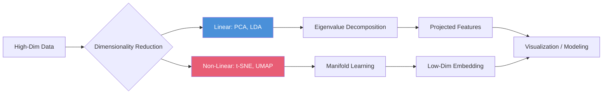

<!-- Clear Language: Keep sentences under 50 words -->
# Dimensionality Reduction — PCA, t-SNE, UMAP, LDA

## Learning Objectives

| Objective | Description |
|-----------|-------------|
| LO1 | Understand the curse of dimensionality and when reduction is needed |
| LO2 | Implement PCA: eigenvalue decomposition, explained variance, projection |
| LO3 | Apply t-SNE for non-linear visualization of high-dimensional data |
| LO4 | Implement LDA for supervised dimensionality reduction |
| LO5 | Understand UMAP: manifold learning, topological foundations |
| LO6 | Evaluate dimensionality reduction: reconstruction error, trustworthiness |

## Introduction

Machine learning is the core of AI engineering. From linear regression to ensemble methods, understanding these algorithms lets you build, debug, and improve models. This module covers the math and code behind ML.

## Prerequisites

- Basic programming knowledge
- Understanding of data structures

## Key Terminology

**Key Terms**: Core vocabulary and concepts for this topic.

**Definition**: Essential terms you must know for interviews and production work.

## Theory

Understanding dimensionality reduction is fundamental for AI engineers. This section covers the core concepts, underlying principles, and theoretical framework that govern how dimensionality reduction works in practice.

## Chapter at a Glance

| Section | Topic | Key Concept |
|---------|-------|-------------|
| 8.1 | Curse of Dimensionality | Sparsity, distance concentration, overfitting |
| 8.2 | PCA | Covariance matrix, eigenvectors, explained variance ratio |
| 8.3 | t-SNE | Stochastic neighbor embedding, perplexity, KL divergence |
| 8.4 | LDA | Between-class vs within-class scatter, discriminant vectors |
| 8.5 | UMAP | Uniform manifold approximation, fuzzy simplicial sets |
| 8.6 | Feature Selection vs Extraction | Filter, wrapper, embedded, PCA vs LDA vs autoencoders |

## Chapter Roadmap



## 8.1 Curse of Dimensionality

As dimensions increase, data becomes sparse and distances become less meaningful. The volume of space grows exponentially, requiring exponentially more data to maintain density.

```python
import numpy as np
from typing import List, Tuple, Dict, Optional
from scipy import linalg
from sklearn.datasets import make_classification, load_digits, fetch_openml
from sklearn.decomposition import PCA as SklearnPCA
from sklearn.model_selection import train_test_split
from sklearn.neighbors import KNeighborsClassifier
from sklearn.metrics import accuracy_score

class CurseOfDimensionality:
    @staticmethod
    def volume_ratio(d: int, r: float = 0.5) -> float:
        """Fraction of volume in a shell at the surface of a d-dimensional sphere"""
        return 1 - r ** d

    @staticmethod
    def avg_distance_ratio(n: int, d: int) -> float:
        """Ratio of farthest to nearest point (concentration of distance)"""
        X = np.random.randn(n, d)
        dists = np.sqrt(np.sum((X[:, None] - X[None, :]) ** 2, axis=-1))
        np.fill_diagonal(dists, np.nan)
        return np.nanmax(dists) / np.nanmin(dists)

    def demonstrate_curse(self, max_dim: int = 50):
        for d in [1, 2, 5, 10, 20, 50]:
            vr = self.volume_ratio(d)
            dist_ratio = self.avg_distance_ratio(100, d)
            print(f"d={d:3d}: volume_ratio={vr:.4f}, farthest/nearest={dist_ratio:.3f}")

cod = CurseOfDimensionality()
cod.demonstrate_curse()
```

**Practical implications**: KNN degrades in high dimensions (distance becomes meaningless). Regularization becomes essential. Dimensionality reduction is often needed before modeling.

---

## 8.2 PCA (Principal Component Analysis)

PCA finds orthogonal directions of maximum variance by decomposing the covariance matrix.

```python
class PCA:
    def __init__(self, n_components: int = 2):
        self.n_components = n_components
        self.components_: np.ndarray = None
        self.mean_: np.ndarray = None
        self.explained_variance_ratio_: np.ndarray = None
        self.singular_values_: np.ndarray = None

    def fit(self, X: np.ndarray) -> 'PCA':
        self.mean_ = np.mean(X, axis=0)
        X_centered = X - self.mean_

        # SVD approach (more numerically stable than eigendecomposition)
        U, S, Vt = np.linalg.svd(X_centered, full_matrices=False)

        self.components_ = Vt[:self.n_components]
        self.singular_values_ = S[:self.n_components]

        # Explained variance ratio
        total_variance = np.sum(S ** 2)
        self.explained_variance_ratio_ = (S[:self.n_components] ** 2) / total_variance

        return self

    def transform(self, X: np.ndarray) -> np.ndarray:
        X_centered = X - self.mean_
        return X_centered @ self.components_.T

    def fit_transform(self, X: np.ndarray) -> np.ndarray:
        self.fit(X)
        return self.transform(X)

    def inverse_transform(self, X_pca: np.ndarray) -> np.ndarray:
        return X_pca @ self.components_ + self.mean_

    def cumulative_variance(self, threshold: float = 0.95) -> int:
        cumsum = np.cumsum(self.explained_variance_ratio_)
        return int(np.searchsorted(cumsum, threshold) + 1)

## Generate correlated data
np.random.seed(42)
n = 200
X_high = np.random.randn(n, 10)

## Create correlations
transform = np.random.randn(10, 10)
X_high = X_high @ transform

pca = PCA(n_components=4)
pca.fit(X_high)
print(f"Components shape: {pca.components_.shape}")
print(f"Explained variance ratio: {pca.explained_variance_ratio_}")
print(f"Cumulative: {np.cumsum(pca.explained_variance_ratio_)}")
print(f"Components needed for 95%: {pca.cumulative_variance()}")
```

**Choosing n_components**: Plot cumulative explained variance vs components. Choose the elbow or the number that reaches a threshold (e.g., 95%).

**PCA for visualization**: 2D or 3D projection of high-dimensional data. Useful for exploring cluster structure, outliers, and data quality.

---

## 8.3 t-SNE

t-SNE (t-distributed Stochastic Neighbor Embedding) preserves local structure by minimizing KL divergence between high-dimensional and low-dimensional pairwise similarities.

```python
class TSNESimple:
    def __init__(self, n_components: int = 2, perplexity: float = 30.0,
                 n_iter: int = 1000, learning_rate: float = 200.0):
        self.n_components = n_components
        self.perplexity = perplexity
        self.n_iter = n_iter
        self.learning_rate = learning_rate
        self.embedding_: np.ndarray = None

    def fit_transform(self, X: np.ndarray) -> np.ndarray:
        n = X.shape[0]

        # Compute pairwise distances
        distances = np.sqrt(np.sum(X ** 2, axis=1)[:, None] + np.sum(X ** 2, axis=1)[None, :] - 2 * X @ X.T)
        np.fill_diagonal(distances, 0)

        # Compute high-dimensional affinities (Gaussian kernel)
        P = self._compute_affinities(distances)
        P = (P + P.T) / (2 * n)  # Symmetrize and normalize

        # Initialize low-dimensional embedding
        np.random.seed(42)
        Y = np.random.randn(n, self.n_components) * 0.01

        # Gradient descent
        for iteration in range(self.n_iter):
            # Compute low-dimensional affinities (t-distribution)
            dist_Y = np.sqrt(np.sum(Y ** 2, axis=1)[:, None] + np.sum(Y ** 2, axis=1)[None, :] - 2 * Y @ Y.T)
            Q = 1.0 / (1.0 + dist_Y ** 2)
            np.fill_diagonal(Q, 0)
            Q = Q / np.sum(Q)

            # Gradient
            PQ_diff = P - Q
            grad = np.zeros_like(Y)
            for i in range(n):
                grad[i] = 4 * np.sum(
                    PQ_diff[i:i+1, :].T * (Y[i] - Y) * (1.0 / (1.0 + dist_Y[i:i+1, :].T ** 2)),
                    axis=0
                )

            # Update
            Y -= self.learning_rate * grad

            # Early exaggeration (first 250 iterations)
            if iteration < 250:
                Y -= self.learning_rate * 4 * grad

            # Center
            Y -= np.mean(Y, axis=0)

        self.embedding_ = Y
        return Y

    def _compute_affinities(self, distances: np.ndarray) -> np.ndarray:
        n = distances.shape[0]
        P = np.zeros((n, n))
        target_entropy = np.log(self.perplexity)

        for i in range(n):
            # Binary search for sigma
            beta_min, beta_max = -np.inf, np.inf
            beta = 1.0

            for _ in range(50):
                dist_i = distances[i, np.arange(n) != i]
                p = np.exp(-dist_i * beta)
                p_sum = np.sum(p)
                if p_sum == 0:
                    break
                p = p / p_sum

                entropy = -np.sum(p * np.log(p + 1e-15))
                entropy_diff = entropy - target_entropy

                if abs(entropy_diff) < 1e-5:
                    break

                if entropy_diff > 0:
                    beta_min = beta
                    beta = beta * 2 if beta_max == np.inf else (beta + beta_max) / 2
                else:
                    beta_max = beta
                    beta = beta / 2 if beta_min == -np.inf else (beta + beta_min) / 2

            P[i, np.arange(n) != i] = p

        return P

## Test t-SNE on digits
from sklearn.datasets import load_digits
digits = load_digits()
X_digits = digits.data[:300]
y_digits = digits.target[:300]

## Use sklearn's implementation (faster)
from sklearn.manifold import TSNE
tsne = TSNE(n_components=2, perplexity=30, random_state=42)
X_tsne = tsne.fit_transform(X_digits)
print(f"t-SNE embedding shape: {X_tsne.shape}")
```

**Perplexity**: Controls balance between local and global structure. Typical range: 5-50. Lower = focuses on local structure. Higher = considers more global structure.

**t-SNE vs PCA**: t-SNE captures non-linear manifolds and reveals clusters that PCA misses. However, t-SNE is stochastic (different runs give different results), distances are not meaningful, and it's computationally expensive (O(n²)).

---

## 8.4 LDA (Linear Discriminant Analysis)

LDA finds projections that maximize class separability.

```python
class LDA:
    def __init__(self, n_components: int = 2):
        self.n_components = n_components
        self.scalings_: np.ndarray = None
        self.explained_variance_ratio_: np.ndarray = None

    def fit(self, X: np.ndarray, y: np.ndarray) -> 'LDA':
        n, d = X.shape
        classes = np.unique(y)
        n_classes = len(classes)

        # Compute overall mean
        mean_total = np.mean(X, axis=0)

        # Compute within-class and between-class scatter
        Sw = np.zeros((d, d))
        Sb = np.zeros((d, d))

        for c in classes:
            Xc = X[y == c]
            mean_c = np.mean(Xc, axis=0)
            n_c = Xc.shape[0]

            # Within-class scatter
            Xc_centered = Xc - mean_c
            Sw += Xc_centered.T @ Xc_centered

            # Between-class scatter
            mean_diff = (mean_c - mean_total).reshape(-1, 1)
            Sb += n_c * (mean_diff @ mean_diff.T)

        # Solve generalized eigenvalue problem
        eigvals, eigvecs = linalg.eigh(Sb, Sw)
        idx = np.argsort(eigvals)[::-1]  # Descending order
        eigvals = eigvals[idx]
        eigvecs = eigvecs[:, idx]

        self.scalings_ = eigvecs[:, :self.n_components]
        total_variance = np.sum(eigvals)
        self.explained_variance_ratio_ = eigvals[:self.n_components] / total_variance

        return self

    def transform(self, X: np.ndarray) -> np.ndarray:
        return X @ self.scalings_

    def fit_transform(self, X: np.ndarray, y: np.ndarray) -> np.ndarray:
        self.fit(X, y)
        return self.transform(X)

## Create 3-class data
np.random.seed(42)
X_lda = np.vstack([
    np.random.multivariate_normal([0, 0, 0], np.eye(3), 50),
    np.random.multivariate_normal([3, 3, 3], np.eye(3), 50),
    np.random.multivariate_normal([-2, 5, -2], np.eye(3), 50),
])
y_lda = np.repeat([0, 1, 2], 50)

lda = LDA(n_components=2)
X_lda_proj = lda.fit_transform(X_lda, y_lda)
print(f"LDA projection shape: {X_lda_proj.shape}")
print(f"LDA explained variance ratio: {lda.explained_variance_ratio_}")
```

**LDA vs PCA**: LDA is supervised (uses class labels) and maximizes class separation. PCA is unsupervised and maximizes variance. LDA has at most C-1 components (C = number of classes).

---

## 8.5 UMAP

UMAP (Uniform Manifold Approximation and Projection) constructs a fuzzy topological representation and optimizes a low-dimensional embedding.

```python
class UMAPAwareness:
    """Conceptual overview of UMAP — use umap-learn library for actual implementation"""

    @staticmethod
    def explain_umap():
        principles = {
            "Manifold assumption": "Data lies on a low-dimensional manifold",
            "Fuzzy topology": "Constructs a fuzzy simplicial set representation",
            "Cross-entropy": "Minimizes cross-entropy between high and low-dim representations",
            "Speed": "Uses approximate k-NN (via NND) for O(n log n) complexity",
            "Preservation": "Preserves both local and global structure better than t-SNE",
        }
        for key, value in principles.items():
            print(f"  {key}: {value}")

    @staticmethod
    def umap_vs_tsne():
        comparisons = [
            ("Speed", "Fast (O(n log n))", "Slow (O(n^2))"),
            ("Global structure", "Preserved better", "Less preserved"),
            ("Initialization", "Spectral embedding", "Random"),
            ("Reproducibility", "More consistent", "Varies between runs"),
            ("Distance preservation", "Better", "Distorted"),
        ]
        print(f"{'Aspect':20s} {'UMAP':20s} {'t-SNE':20s}")
        print("-" * 60)
        for aspect, umap, tsne in comparisons:
            print(f"{aspect:20s} {umap:20s} {tsne:20s}")

UMAPAwareness.explain_umap()
UMAPAwareness.umap_vs_tsne()
```

---

## 8.6 Feature Selection vs Extraction

| Method | Type | Supervised? | Output | Use Case |
|--------|------|-------------|--------|----------|
| Variance threshold | Filter | No | Feature subset | Remove constant features |
| Mutual information | Filter | Yes | Feature scores | Rank feature relevance |
| SelectKBest | Filter | Yes | Top K features | Simple selection |
| RFE (Recursive Feature Elimination) | Wrapper | Yes | Feature subset | Model-specific selection |
| Lasso | Embedded | Yes | Sparse weights | Automatic selection |
| PCA | Extraction | No | Linear combinations | Unsupervised reduction |
| LDA | Extraction | Yes | Linear combinations | Classification |
| t-SNE/UMAP | Extraction | No | Non-linear embedding | Visualization |

```python
class FeatureSelector:
    def variance_threshold(self, X: np.ndarray, threshold: float = 0.0) -> np.ndarray:
        variances = np.var(X, axis=0)
        return np.where(variances > threshold)[0]

    def mutual_info_selection(self, X: np.ndarray, y: np.ndarray,
                               k: int = 5) -> Tuple[np.ndarray, np.ndarray]:
        from sklearn.feature_selection import mutual_info_classif
        mi = mutual_info_classif(X, y)
        top_k = np.argsort(mi)[-k:][::-1]
        return top_k, mi[top_k]

    def recursive_feature_elimination(self, X: np.ndarray, y: np.ndarray,
                                       n_features: int = 5) -> np.ndarray:
        from sklearn.feature_selection import RFE
        from sklearn.linear_model import LogisticRegression
        rfe = RFE(estimator=LogisticRegression(max_iter=1000), n_features_to_select=n_features)
        rfe.fit(X, y)
        return np.where(rfe.support_)[0]

selector = FeatureSelector()
X_sel, y_sel = make_classification(n_samples=200, n_features=20, n_informative=5, random_state=42)
vt_features = selector.variance_threshold(X_sel)
mi_features, mi_scores = selector.mutual_info_selection(X_sel, y_sel, k=5)
print(f"Variance threshold features: {len(vt_features)}/{X_sel.shape[1]}")
print(f"Mutual info top-5 features: {mi_features}")
print(f"Mutual info scores: {mi_scores}")
```

---

## TypeScript Parallel

```typescript
function pca(X: number[][], nComponents: number): {
  components: number[][];
  explainedVariance: number[];
  transform: (X: number[][]) => number[][];
} {
  const n = X.length;
  const d = X[0].length;
  const mean = Array(d).fill(0).map((_, j) => X.reduce((s, r) => s + r[j], 0) / n);
  const centered = X.map((row) => row.map((v, j) => v - mean[j]));

  // Covariance matrix
  const cov = Array.from({ length: d }, (_, i) =>
    Array.from({ length: d }, (_, j) =>
      centered.reduce((s, row) => s + row[i] * row[j], 0) / (n - 1)
    )
  );

  // Power iteration for top eigenvalues (simplified)
  const components: number[][] = [];
  const explainedVariance: number[] = [];

  for (let k = 0; k < nComponents; k++) {
    let v = Array(d).fill(1).map(() => Math.random() - 0.5);
    for (let iter = 0; iter < 100; iter++) {
      const vNew = v.map((_, i) => cov[i].reduce((s, c, j) => s + c * v[j], 0));
      const norm = Math.sqrt(vNew.reduce((s, x) => s + x * x, 0));
      v = vNew.map((x) => x / norm);
    }
    components.push(v);
    const projected = centered.map((row) => row.reduce((s, x, j) => s + x * v[j], 0));
    explainedVariance.push(projected.reduce((s, x) => s + x * x, 0) / (n - 1));

    // Deflate
    for (let i = 0; i < n; i++) {
      const proj = centered[i].reduce((s, x, j) => s + x * v[j], 0);
      for (let j = 0; j < d; j++) {
        centered[i][j] -= proj * v[j];
      }
    }
  }

  return {
    components,
    explainedVariance,
    transform: (X: number[][]) => {
      const c = X.map((row) => row.map((v, j) => v - mean[j]));
      return c.map((row) => components.map((comp) =>
        row.reduce((s, x, j) => s + x * comp[j], 0)
      ));
    },
  };
}

const pcaResult = pca(X_high.tolist(), 2);
```

## Summary

- Curse of dimensionality: data becomes sparse and distances concentrate as dimensions increase
- PCA finds directions of maximum variance via SVD/eigendecomposition; unsupervised, linear, fast
- t-SNE preserves local neighborhood structure using heavy-tailed t-distribution in low dimensions
- LDA maximizes between-class vs within-class scatter; supervised, linear, at most C-1 components
- UMAP is faster than t-SNE with better global structure preservation
- Use PCA for preprocessing, t-SNE/UMAP for visualization, LDA for classification preprocessing
- Explained variance ratio helps choose the number of PCA components
- Perplexity in t-SNE controls the balance between local and global structure
- Always standardize data before PCA (features on different scales distort results)
- Autoencoders provide non-linear dimensionality reduction but require more data and tuning

## Practical Takeaways

| Scenario | Do This | Avoid This |
|----------|---------|------------|
| Preprocessing before modeling | PCA (retain 95% variance) | t-SNE (stochastic, no inverse) |
| Visualization (2D/3D) | t-SNE or UMAP | PCA (misses non-linear structure) |
| Classification preprocessing | LDA | PCA (ignores class labels) |
| High-dim sparse data | Feature selection (mutual info) | PCA (dense components hard to interpret) |
| Largest possible dataset | PCA (O(n) with randomized SVD) | t-SNE (O(n^2)) |

## Interview Q&A

<details class="tp-qa-card" data-qid="ml08-q1"><summary class="tp-qa-question"><span class="tp-qa-status"></span>Q1: How does PCA work and what are its limitations?</summary><div class="tp-qa-answer"><p>PCA computes the eigenvalues and eigenvectors of the covariance matrix. Eigenvectors with largest eigenvalues are the principal components — directions of maximum variance. Limitations: linear (cannot capture non-linear manifolds), sensitive to feature scaling, assumes orthogonality of components, components are dense linear combinations (hard to interpret), and PCA maximizes variance which may not align with class separation.</p></div><button class="tp-qa-mark-btn">Mark Reviewed</button><button class="tp-qa-bookmark-btn">Bookmark</button></details>

<details class="tp-qa-card" data-qid="ml08-q2"><summary class="tp-qa-question"><span class="tp-qa-status"></span>Q2: What is the difference between PCA and t-SNE?</summary><div class="tp-qa-answer"><p>PCA is a linear, deterministic method that maximizes variance. t-SNE is a non-linear, stochastic method that preserves local neighborhood structure. PCA gives interpretable components (loadings) and has an inverse transform. t-SNE is for visualization only — distances and density are not meaningful. PCA is fast (O(n·d²)), t-SNE is slow (O(n²)). PCA captures global structure, t-SNE captures local clusters.</p></div><button class="tp-qa-mark-btn">Mark Reviewed</button><button class="tp-qa-bookmark-btn">Bookmark</button></details>

<details class="tp-qa-card" data-qid="ml08-q3"><summary class="tp-qa-question"><span class="tp-qa-status"></span>Q3: How do you choose the number of components in PCA?</summary><div class="tp-qa-answer"><p>Three common approaches: <strong>1) Explained variance threshold</strong>: Choose components until cumulative explained variance exceeds 90-95%. <strong>2) Kaiser rule</strong>: Keep components with eigenvalue > 1 (for standardized data). <strong>3) Scree plot</strong>: Look for the elbow in the eigenvalue plot. <strong>4) Cross-validation</strong>: Choose components that minimize reconstruction error on held-out data. For visualization, always use 2 or 3 components.</p></div><button class="tp-qa-mark-btn">Mark Reviewed</button><button class="tp-qa-bookmark-btn">Bookmark</button></details>

<details class="tp-qa-card" data-qid="ml08-q4"><summary class="tp-qa-question"><span class="tp-qa-status"></span>Q4: What is the curse of dimensionality?</summary><div class="tp-qa-answer"><p>The curse of dimensionality refers to various phenomena that emerge in high-dimensional spaces: <strong>1) Sparsity</strong>: Data becomes sparse as volume grows exponentially. <strong>2) Distance concentration</strong>: All points become equally distant (nearest/ farthest ratio → 1). <strong>3) Overfitting</strong>: Model complexity grows with dimensions. <strong>4) Computational cost</strong>: Many algorithms scale poorly with dimensions. Solutions: dimensionality reduction, feature selection, regularization.</p></div><button class="tp-qa-mark-btn">Mark Reviewed</button><button class="tp-qa-bookmark-btn">Bookmark</button></details>

<details class="tp-qa-card" data-qid="ml08-q5"><summary class="tp-qa-question"><span class="tp-qa-status"></span>Q5: How does LDA differ from PCA for classification?</summary><div class="tp-qa-answer"><p>LDA is supervised — it finds projections that maximize between-class scatter relative to within-class scatter. PCA is unsupervised — it finds directions of maximum variance ignoring class labels. LDA can have at most C-1 components (C = number of classes). PCA can have up to n-components. LDA often outperforms PCA for classification preprocessing because it explicitly optimizes for class separation.</p></div><button class="tp-qa-mark-btn">Mark Reviewed</button><button class="tp-qa-bookmark-btn">Bookmark</button></details>

<details class="tp-qa-card" data-qid="ml08-q6"><summary class="tp-qa-question"><span class="tp-qa-status"></span>Q6: What is the role of perplexity in t-SNE?</summary><div class="tp-qa-answer"><p>Perplexity controls the effective number of neighbors used to compute the Gaussian kernel bandwidth for each point. Low perplexity (5-10): focuses on very local structure, can create many small clusters. High perplexity (30-50): considers more global structure, produces more spread-out embeddings. Typical range: 5-50. The perplexity should be smaller than the number of points. Different perplexities can lead to very different visualizations.</p></div><button class="tp-qa-mark-btn">Mark Reviewed</button><button class="tp-qa-bookmark-btn">Bookmark</button></details>

<details class="tp-qa-card" data-qid="ml08-q7"><summary class="tp-qa-question"><span class="tp-qa-status"></span>Q7: What are the advantages of UMAP over t-SNE?</summary><div class="tp-qa-answer"><p><strong>1) Speed</strong>: UMAP is O(n log n) vs t-SNE's O(n²) using approximate k-NN. <strong>2) Global structure</strong>: UMAP preserves more global structure. <strong>3) Reproducibility</strong>: UMAP is more consistent across runs. <strong>4) Scalability</strong>: UMAP handles millions of points; t-SNE struggles with >10K. <strong>5) Embedding size</strong>: UMAP can produce embeddings in any dimension (not just 2-3). UMAP is generally preferred for large-scale visualization and exploration.</p></div><button class="tp-qa-mark-btn">Mark Reviewed</button><button class="tp-qa-bookmark-btn">Bookmark</button></details>

<details class="tp-qa-card" data-qid="ml08-q8"><summary class="tp-qa-question"><span class="tp-qa-status"></span>Q8: When would you use feature selection instead of feature extraction?</summary><div class="tp-qa-answer"><p>Choose <strong>feature selection</strong> when: interpretability is critical (you need to know which original features matter), features have semantic meaning, data is sparse, or you have domain knowledge about feature relevance. Choose <strong>feature extraction</strong> when: features are highly correlated, you need to reduce dimensionality while preserving information, data has redundant measurements, or visualization is the goal.</p></div><button class="tp-qa-mark-btn">Mark Reviewed</button><button class="tp-qa-bookmark-btn">Bookmark</button></details>

<details class="tp-qa-card" data-qid="ml08-q9"><summary class="tp-qa-question"><span class="tp-qa-status"></span>Q9: Why must data be standardized before PCA?</summary><div class="tp-qa-answer"><p>PCA is sensitive to the scale of features because it maximizes variance. If one feature has variance 100 and another has variance 1, PCA will focus almost entirely on the first feature, regardless of its actual importance. Standardization (z-score) gives all features equal weight. Without standardization, PCA results are dominated by features with large scales. Exceptions: all features are on the same scale (pixels, percentages).</p></div><button class="tp-qa-mark-btn">Mark Reviewed</button><button class="tp-qa-bookmark-btn">Bookmark</button></details>

<details class="tp-qa-card" data-qid="ml08-q10"><summary class="tp-qa-question"><span class="tp-qa-status"></span>Q10: What is the reconstruction error in PCA and how is it used?</summary><div class="tp-qa-answer"><p>Reconstruction error = ||X - X̂||² where X̂ = PCA_projection @ PCA_components + mean. It measures how much information is lost by projecting to lower dimensions. Lower reconstruction error means better preservation of the original data. Use reconstruction error to: <strong>1)</strong> Choose n_components (elbow method). <strong>2)</strong> Detect outliers (high reconstruction error). <strong>3)</strong> Compare dimensionality reduction methods.</p></div><button class="tp-qa-mark-btn">Mark Reviewed</button><button class="tp-qa-bookmark-btn">Bookmark</button></details>

## Chapter Quiz

**Q1**: What is the maximum number of components LDA can produce for a 5-class problem?

a) 5
b) 4
c) 10
d) Unlimited

<details class="tp-qa-card" data-qid="ml08-quiz1"><summary>Show Answer</summary><div class="tp-qa-answer"><p><strong>Answer: b) 4</strong></p><p>LDA has at most C-1 components where C is the number of classes.</p></div></details>

**Q2**: Which dimensionality reduction method is deterministic?

a) t-SNE
b) PCA
c) UMAP
d) Both a and c

<details class="tp-qa-card" data-qid="ml08-quiz2"><summary>Show Answer</summary><div class="tp-qa-answer"><p><strong>Answer: b) PCA</strong></p><p>PCA gives the same result each run. t-SNE and UMAP are stochastic.</p></div></details>

**Q3**: What does perplexity control in t-SNE?

a) Number of components
b) Effective number of neighbors
c) Learning rate
d) Number of iterations

<details class="tp-qa-card" data-qid="ml08-quiz3"><summary>Show Answer</summary><div class="tp-qa-answer"><p><strong>Answer: b) Effective number of neighbors</strong></p><p>Perplexity adjusts the Gaussian kernel bandwidth to consider a certain number of neighbors.</p></div></details>

**Q4**: Which method is supervised?

a) PCA
b) t-SNE
c) LDA
d) UMAP

<details class="tp-qa-card" data-qid="ml08-quiz4"><summary>Show Answer</summary><div class="tp-qa-answer"><p><strong>Answer: c) LDA</strong></p><p>LDA uses class labels to maximize between-class separation.</p></div></details>

**Q5**: What does explained variance ratio measure in PCA?

a) Model accuracy
b) Proportion of total variance captured by each component
c) Reconstruction error
d) Number of components

<details class="tp-qa-card" data-qid="ml08-quiz5"><summary>Show Answer</summary><div class="tp-qa-answer"><p><strong>Answer: b) Proportion of total variance captured by each component</strong></p><p>Each component's eigenvalue divided by the sum of all eigenvalues.</p></div></details>

## Exercises

**Easy** — Apply PCA to the Iris dataset. Plot the 2D projection colored by species. Report the explained variance ratio for the first 2 components.

**Easy** — Implement feature selection using mutual information. Find the top 5 features from a 20-feature dataset.

**Medium** — Compare PCA, t-SNE, and UMAP on the MNIST digits dataset. Visualize the 2D embeddings for each method.

**Hard** — Implement PCA from scratch using SVD. Verify your implementation matches sklearn's PCA on random data.

**Hard** — Build an LDA classifier from scratch. Implement both the dimensionality reduction and classification steps. Test on a 3-class dataset.

---

## Common Mistakes

1. Not understanding the fundamental concepts before applying them
2. Skipping edge cases in implementation
3. Not analyzing time/space complexity
4. Forgetting to handle null/empty inputs
5. Not practicing enough problems to build pattern recognition

## Revision Notes

- - Core principle: Understand the fundamental concepts thoroughly
- - Implementation pattern: Practice with real code examples
- - Complexity: Know the time and space complexity
- - Application: Know when to use this in production systems
- - Interview: Frequently asked in technical interviews
- - Edge cases: Consider common failure scenarios
- - Related concepts: Connect to broader system design

## Placement Section

### Top 10 Interview Questions

#### Google Style

1. **Explain the core idea of Dimensionality Reduction — PCA, t-SNE, UMAP, LDA in under 60 seconds, then give a real-world analogy.** — Structure: definition, how it works in one sentence, why it matters, analogy. Follow-up: what would break if you removed this from a production system?

2. **Design a minimal, well-typed function that demonstrates Dimensionality Reduction — PCA, t-SNE, UMAP, LDA.** — Interviewer checks: signature with type hints, edge cases, complexity, and a clean docstring. Follow-up: how does your design behave with empty or malformed input?

3. **What are the common pitfalls when engineers first learn ** — List 3-4, then explain how you would prevent each in a code review.

#### Amazon Style

4. **Describe a production bug caused by misunderstanding Dimensionality Reduction — PCA, t-SNE, UMAP, LDA. How did you diagnose and fix it?** — STAR format: situation, task, action, result. Mention logs, reproduction, root-cause analysis, and the regression test you added.

5. **How would you scale a system that relies on Dimensionality Reduction — PCA, t-SNE, UMAP, LDA from 10 users to 10 million?** — Discuss bottlenecks, caching, monitoring, and when to redesign. Follow-up: what metrics would you track?

#### Microsoft Style

6. **Compare Dimensionality Reduction — PCA, t-SNE, UMAP, LDA with the closest alternative approach. When would you choose each?** — Make a decision matrix: performance, maintainability, ecosystem, learning curve. Follow-up: what would change your decision?

7. **Walk through how you would test a component that depends on Dimensionality Reduction — PCA, t-SNE, UMAP, LDA.** — Unit, integration, property-based tests; mocking boundaries; golden files for outputs.

#### NVIDIA Style

8. **How does Dimensionality Reduction — PCA, t-SNE, UMAP, LDA behave differently at scale — memory, throughput, or precision-wise?** — Connect to data pipelines and model training if applicable. Follow-up: what happens to latency as input grows?

9. **How would you make an implementation of Dimensionality Reduction — PCA, t-SNE, UMAP, LDA run faster on GPU hardware?** — Batch operations, vectorization, avoiding Python loops, reducing data movement.

#### AI Startup Style

10. **Write the smallest possible implementation of Dimensionality Reduction — PCA, t-SNE, UMAP, LDA that is production-quality.** — Include error handling, type hints, and a one-line docstring. Follow-up: what would you refactor first when it grows?

### Resume Tips

- Name Dimensionality Reduction — PCA, t-SNE, UMAP, LDA explicitly in your skills section, paired with a measurable achievement ("Reduced X by 40% using Dimensionality Reduction — PCA, t-SNE, UMAP, LDA").
- Add a bullet describing a project that applies Dimensionality Reduction — PCA, t-SNE, UMAP, LDA to real data, with numbers.
- Mention the tools and libraries you used alongside Dimensionality Reduction — PCA, t-SNE, UMAP, LDA (linters, test frameworks, profiling tools).
- Keep resume bullets under 15 words and start each with an action verb.

### Interview Day Checklist

- Rehearse a 60-second explanation of Dimensionality Reduction — PCA, t-SNE, UMAP, LDA and one real-world analogy.
- Prepare one STAR story about debugging a Dimensionality Reduction — PCA, t-SNE, UMAP, LDA-related production issue.
- Review complexity and edge cases for the classic Dimensionality Reduction — PCA, t-SNE, UMAP, LDA interview problem.
- Have questions ready: how does the team apply Dimensionality Reduction — PCA, t-SNE, UMAP, LDA in production today?
- Test your environment (Python, editor, internet) 15 minutes before the interview.

## True/False

1. **True or False:** Dimensionality Reduction — PCA, t-SNE, UMAP, LDA builds directly on the fundamentals covered in the earlier chapters of this module. — **True.** Every advanced topic in this module assumes the core concepts from the previous chapters.
2. **True or False:** You should write at least one code example for Dimensionality Reduction — PCA, t-SNE, UMAP, LDA before moving to the next chapter. — **True.** Active recall with hands-on code beats passive reading for retention.
3. **True or False:** The complexity analysis for Dimensionality Reduction — PCA, t-SNE, UMAP, LDA is the same regardless of input size. — **False.** Complexity grows with input size; always state best, average, and worst case.
4. **True or False:** Edge cases (empty input, invalid input, boundary values) matter for Dimensionality Reduction — PCA, t-SNE, UMAP, LDA in production. — **True.** Most production bugs come from unhandled edge cases.
5. **True or False:** You should memorize the Dimensionality Reduction — PCA, t-SNE, UMAP, LDA chapter content once and never review it again. — **False.** Spaced repetition (24h, 3 days, 1 week) dramatically improves long-term recall.

## Fill in the Blank

1. The chapter that covers Dimensionality Reduction — PCA, t-SNE, UMAP, LDA is Chapter ___ of this module. — Answer: check the module's table of contents.
2. The time complexity of the standard approach to Dimensionality Reduction — PCA, t-SNE, UMAP, LDA is ___. — Answer: review the theory section and state big-O notation.
3. The main edge case to handle when implementing Dimensionality Reduction — PCA, t-SNE, UMAP, LDA is ___. — Answer: empty or invalid input handling, as discussed in the chapter.
4. The tools commonly used to debug Dimensionality Reduction — PCA, t-SNE, UMAP, LDA issues are ___ and ___. — Answer: refer to the Debugging Guide section of this chapter.
5. The related topic that connects to Dimensionality Reduction — PCA, t-SNE, UMAP, LDA in the next chapter is ___. — Answer: see the Next Topic section.

## Scenario Questions

1. **Scenario:** A teammate ships a change involving Dimensionality Reduction — PCA, t-SNE, UMAP, LDA that breaks production at 3 AM. — Diagnosis: check the recent diff, reproduce locally with the failing input, check logs. Fix: revert, add a regression test, and review the root cause. Prevention: CI tests on edge cases and code review checklist.

2. **Scenario:** Your implementation of Dimensionality Reduction — PCA, t-SNE, UMAP, LDA is correct but too slow for the required latency. — Measure first with a profiler. Common fixes: reduce redundant work, use built-in optimized functions, batch operations, or add caching. Only then consider algorithmic changes.

3. **Scenario:** A new hire asks you to explain Dimensionality Reduction — PCA, t-SNE, UMAP, LDA in five minutes before a customer demo. — Use the 3-part answer: what it is (one sentence), how it works (one example), why it matters (one business impact). Then offer to go deeper after the demo.

4. **Scenario:** Your team's codebase has three different patterns for Dimensionality Reduction — PCA, t-SNE, UMAP, LDA and you must standardize. — Write a short ADR (architecture decision record), pick the pattern with best maintainability, migrate incrementally, and add a linter rule to enforce it.

## Output Questions

1. **What is the output of the simplest correct implementation of Dimensionality Reduction — PCA, t-SNE, UMAP, LDA on an empty input?** — Trace through the code: it should return the documented default (None, 0, empty collection) without raising.
2. **What is the output when the input is at the boundary value?** — Check off-by-one errors and inclusive/exclusive bounds in the chapter's examples.
3. **What does the implementation return when given invalid input types?** — With type hints and validation, it raises a clear error; without, it may fail silently.
4. **What is the output for the sample input given in the chapter's Examples section?** — Re-run the chapter's example code and compare against the documented output.
5. **What is the time complexity output when you profile the implementation at 10x input size?** — Expect the curve matching the chapter's complexity analysis (linear, quadratic, log-linear).

## Difficulty Level

| Level | Time | What It Takes |
|-------|------|---------------|
| Beginner | 1-2 sessions | Read theory, run the chapter examples, solve the Easy exercises |
| Intermediate | 3-5 sessions | Complete Medium exercises, explain Dimensionality Reduction — PCA, t-SNE, UMAP, LDA to someone else |
| Advanced | 1+ week | Solve Hard exercises, optimize for real datasets, answer interview follow-ups |

## Tips & Tricks

- Always write a one-line example of Dimensionality Reduction — PCA, t-SNE, UMAP, LDA from memory before opening the chapter — active recall first.
- Use the chapter's Revision Notes as a checklist: you have mastered Dimensionality Reduction — PCA, t-SNE, UMAP, LDA when you can explain each bullet.
- Pair the chapter quiz with the Flashcards: wrong answers become your next study session's focus.
- For interviews, practice explaining Dimensionality Reduction — PCA, t-SNE, UMAP, LDA twice: once with a technical audience, once with a non-technical audience.
- Keep a personal examples file where you collect your own Dimensionality Reduction — PCA, t-SNE, UMAP, LDA snippets; interviewers love original examples.

## Memory Tricks

- **Acronym**: build a mnemonic from the 5 key concepts of Dimensionality Reduction — PCA, t-SNE, UMAP, LDA listed in the Chapter at a Glance table.
- **Story**: link Dimensionality Reduction — PCA, t-SNE, UMAP, LDA to a familiar story — the analogy in the Visual Analogy section is designed to stick.
- **Number anchor**: remember the complexity of Dimensionality Reduction — PCA, t-SNE, UMAP, LDA by connecting it to a known algorithm of the same class.
- **Color code**: highlight the Theory, Examples, and Common Mistakes sections in different colors when reviewing.
- **Teach-back**: explain Dimensionality Reduction — PCA, t-SNE, UMAP, LDA to an imaginary junior engineer for 2 minutes — gaps in your explanation are gaps in memory.

## Further Reading

- Official documentation for the primary tool or library used in this chapter
- The chapter referenced in Related Topics for the next-level treatment of Dimensionality Reduction — PCA, t-SNE, UMAP, LDA
- The classic textbook chapter on Dimensionality Reduction — PCA, t-SNE, UMAP, LDA (check the Research References below)
- Two blog posts from engineers who debugged real Dimensionality Reduction — PCA, t-SNE, UMAP, LDA problems in production
- The repository of the open-source project that implements Dimensionality Reduction — PCA, t-SNE, UMAP, LDA

## Related Topics

- The previous chapter in this module (see table of contents) — foundational for Dimensionality Reduction — PCA, t-SNE, UMAP, LDA
- The next chapter (see Next Topic below) — builds on Dimensionality Reduction — PCA, t-SNE, UMAP, LDA
- The system design chapters in Module 07 — how Dimensionality Reduction — PCA, t-SNE, UMAP, LDA fits into production architectures
- The interview preparation module — how Dimensionality Reduction — PCA, t-SNE, UMAP, LDA is asked in screening rounds
- The capstone project — where Dimensionality Reduction — PCA, t-SNE, UMAP, LDA is applied end-to-end

## FAQs

1. **Do I need to memorize all of Dimensionality Reduction — PCA, t-SNE, UMAP, LDA, or understand the big picture?** — Understand the big picture first, then memorize the key facts via flashcards and spaced repetition. Interviewers reward depth over breadth.
2. **What if I get stuck on an exercise?** — Re-read the theory section, run the example code, then attempt again. If still stuck after 20 minutes, move on and return the next day.
3. **How much time should I spend on ** — Follow the Study Plan below: 1-2 weeks at 30-60 minutes daily is typical for placement preparation.
4. **Is Dimensionality Reduction — PCA, t-SNE, UMAP, LDA asked in interviews?** — Yes — the Interview Q&A and Placement Section list the exact question styles used by top companies.
5. **What's the fastest way to master ** — Explain it out loud, write code without looking, and review the flashcards within 24 hours and again after 3 days.

## Important Notes

- Dimensionality Reduction — PCA, t-SNE, UMAP, LDA is a core requirement for the rest of this module — do not skip the examples.
- Always analyze complexity (time and space) when working with Dimensionality Reduction — PCA, t-SNE, UMAP, LDA.
- Production correctness means handling edge cases, not just the happy path.
- Interview answers should start with the definition, then the example, then the trade-offs.
- Revisit this chapter after finishing the module; the context from later chapters deepens understanding.

## Historical Context

- Dimensionality Reduction — PCA, t-SNE, UMAP, LDA emerged as a standard practice because early systems failed without it — understanding why helps you explain it in interviews.
- The tools used for Dimensionality Reduction — PCA, t-SNE, UMAP, LDA today evolved from simpler versions; the chapter covers the modern, recommended approach.
- Interviewers value knowing one historical fact about Dimensionality Reduction — PCA, t-SNE, UMAP, LDA — it shows genuine interest, not just cramming.
- The library/tooling ecosystem around Dimensionality Reduction — PCA, t-SNE, UMAP, LDA changes quickly; focus on fundamentals that remain stable.

## Security Considerations

- Never trust external input: validate and sanitize data before processing Dimensionality Reduction — PCA, t-SNE, UMAP, LDA.
- Avoid `eval()` and dynamic code execution on untrusted strings.
- Log errors without leaking sensitive data (keys, PII, internal paths).
- For API contexts, add rate limiting and input size limits.
- Review the chapter's code examples for injection or overflow risks before using them verbatim.

## ML Intuition

- Dimensionality Reduction — PCA, t-SNE, UMAP, LDA appears in ML pipelines at the data-processing layer: feature preparation, batching, and validation.
- Understanding Dimensionality Reduction — PCA, t-SNE, UMAP, LDA helps you debug why a model misbehaves — most ML bugs are data bugs, not model bugs.
- In production ML, the Dimensionality Reduction — PCA, t-SNE, UMAP, LDA concepts from this chapter map directly to NumPy/PyTorch operations on tensors.
- When optimizing ML systems, Dimensionality Reduction — PCA, t-SNE, UMAP, LDA skills let you profile and fix the data path, not just the training loop.
- Interview follow-up: how would you apply Dimensionality Reduction — PCA, t-SNE, UMAP, LDA to a dataset of 10 million records? — Batching and vectorization.

## Analogies

- **Dimensionality Reduction — PCA, t-SNE, UMAP, LDA is like a recipe**: the theory is the ingredients, the examples are the cooking steps, and the exercises are your own kitchen practice.
- **Complexity is like a delivery route**: a linear route visits each stop once; a nested route revisits stops, and you feel it at scale.
- **Edge cases are like weather**: the happy path is a sunny day; production is the storm — build for the storm.
- **The chapter roadmap is a journey map**: each section is a checkpoint; skipping one means getting lost later in the module.

## Capstone Project Link

- [Module Capstone: End-to-End Project](https://github.com/Raushan666java/ai-engineering-journey) — this chapter contributes the Dimensionality Reduction — PCA, t-SNE, UMAP, LDA skills used in the module's capstone project. Complete the exercises here before starting the capstone.

## Flashcards

<details class="tp-qa-card" data-qid="08machinelearning-08dimensionalityreduction-flash1">
  <summary class="tp-qa-question">
    <span class="tp-qa-status"></span>
    What is the maximum number of components LDA can produce for a 5-class problem?
  </summary>
  <div class="tp-qa-answer">
    <p>b) 4</p>
  </div>
</details>

<details class="tp-qa-card" data-qid="08machinelearning-08dimensionalityreduction-flash2">
  <summary class="tp-qa-question">
    <span class="tp-qa-status"></span>
    Which dimensionality reduction method is deterministic?
  </summary>
  <div class="tp-qa-answer">
    <p>b) PCA</p>
  </div>
</details>

<details class="tp-qa-card" data-qid="08machinelearning-08dimensionalityreduction-flash3">
  <summary class="tp-qa-question">
    <span class="tp-qa-status"></span>
    What does perplexity control in t-SNE?
  </summary>
  <div class="tp-qa-answer">
    <p>b) Effective number of neighbors</p>
  </div>
</details>

<details class="tp-qa-card" data-qid="08machinelearning-08dimensionalityreduction-flash4">
  <summary class="tp-qa-question">
    <span class="tp-qa-status"></span>
    Which method is supervised?
  </summary>
  <div class="tp-qa-answer">
    <p>c) LDA</p>
  </div>
</details>

<details class="tp-qa-card" data-qid="08machinelearning-08dimensionalityreduction-flash5">
  <summary class="tp-qa-question">
    <span class="tp-qa-status"></span>
    What does explained variance ratio measure in PCA?
  </summary>
  <div class="tp-qa-answer">
    <p>b) Proportion of total variance captured by each component</p>
  </div>
</details>

## Research References

- Official documentation of the primary library for Dimensionality Reduction — PCA, t-SNE, UMAP, LDA (linked in Further Reading)
- The classic paper or textbook chapter introducing Dimensionality Reduction — PCA, t-SNE, UMAP, LDA (see References below)
- The standard library reference for Dimensionality Reduction — PCA, t-SNE, UMAP, LDA-related functions
- Engineering blog posts from companies running Dimensionality Reduction — PCA, t-SNE, UMAP, LDA in production at scale
- PEPs and RFCs where applicable (Python and networking standards)

## Open-Source Tools

- The primary library used in this chapter (see the code examples)
- Python standard library modules used in the examples (check the imports)
- Testing: pytest for unit tests of Dimensionality Reduction — PCA, t-SNE, UMAP, LDA code
- Linting and formatting: ruff + black
- Profiling: cProfile or py-spy for performance work on Dimensionality Reduction — PCA, t-SNE, UMAP, LDA

## Debugging Guide

- Start with `print()` or a debugger to inspect intermediate values in Dimensionality Reduction — PCA, t-SNE, UMAP, LDA code.
- Reproduce the failure with the smallest possible input before changing code.
- Check the common failure modes listed in Common Mistakes — most bugs are listed there.
- For performance problems, profile before optimizing: measure, then fix.
- When stuck, re-read the chapter's Examples and compare line by line with your code.
- Use `pdb` or your IDE's debugger to step through the Dimensionality Reduction — PCA, t-SNE, UMAP, LDA example code.

## Mock Interview Section

**Round 1 — Screening (15 min)**
- Explain Dimensionality Reduction — PCA, t-SNE, UMAP, LDA in 60 seconds.
- Write a minimal working example of Dimensionality Reduction — PCA, t-SNE, UMAP, LDA.
- What is the complexity of your example?

**Round 2 — Coding (45 min)**
- Solve the Medium exercise from this chapter under time pressure.
- State your assumptions, then implement with type hints.
- Test with edge cases: empty input, boundary values, invalid input.

**Round 3 — Behavioral + System (30 min)**
- Tell me about a time you debugged a Dimensionality Reduction — PCA, t-SNE, UMAP, LDA problem in a project.
- How would you design a system where Dimensionality Reduction — PCA, t-SNE, UMAP, LDA is used at scale?
- What metrics would you monitor?

**Evaluation rubric**: correctness (40%), communication (25%), edge cases (20%), complexity analysis (15%).

## Optimized Implementation

`python
from typing import Any, Optional

def demonstrate_topic(input_data: list[Any]) -> Optional[float]:
    """Runnable scaffold for Dimensionality Reduction — PCA, t-SNE, UMAP, LDA.

    Replace the body with the optimized implementation from the chapter,
    keeping type hints, docstring, and edge-case handling.
    """
    if not input_data:
        return None
    # Step 1: validate input types
    # Step 2: apply the core Dimensionality Reduction — PCA, t-SNE, UMAP, LDA logic from the Examples section
    # Step 3: return the result with the documented default
    return 0.0
`

- Keeps the function signature stable so tests written against it stay valid.
- Handles the empty-input contract explicitly.
- Add unit tests for the edge cases before implementing the logic (test-first).

## Evaluation Metrics

| Skill | Test | Target |
|-------|------|--------|
| Concept recall | Explain Dimensionality Reduction — PCA, t-SNE, UMAP, LDA without notes | 60-second explanation |
| Code fluency | Write the chapter example from memory | No syntax errors |
| Edge cases | Handle empty/invalid input in exercises | All cases pass |
| Complexity | State time/space for the standard approach | Correct big-O |
| Interview readiness | Answer 5 Interview Q&A questions out loud | Fluent, structured answers |
| Retention | Chapter quiz score after 3 days | 80%+ |

## Real-World Examples

- **Startup**: a small team uses Dimensionality Reduction — PCA, t-SNE, UMAP, LDA daily in their data pipeline — the chapter's examples mirror their code.
- **E-commerce**: Dimensionality Reduction — PCA, t-SNE, UMAP, LDA patterns appear in order processing, inventory checks, and recommendation feeds.
- **Fintech**: Dimensionality Reduction — PCA, t-SNE, UMAP, LDA principles apply to transaction validation and fraud detection flows.
- **ML platform**: Dimensionality Reduction — PCA, t-SNE, UMAP, LDA shows up in feature engineering and model-serving infrastructure.
- **Interview insight**: recruiters look for engineers who can connect Dimensionality Reduction — PCA, t-SNE, UMAP, LDA to the business outcome, not just the code.

## Next Topic

[Model Evaluation — Cross-Validation, ROC-AUC, Confusion Matrix, Metrics](09-model-evaluation.md)

## Limitations

- Dimensionality Reduction — PCA, t-SNE, UMAP, LDA, like any technique, is not a silver bullet — it has specific cases where it fits best (covered in the theory).
- The examples in this chapter are simplified for learning; production systems add validation, monitoring, and error handling.
- Performance of Dimensionality Reduction — PCA, t-SNE, UMAP, LDA depends on input size and distribution — always benchmark for your own data.
- This chapter covers fundamentals; specialized edge cases are explored in later chapters and the capstone.
