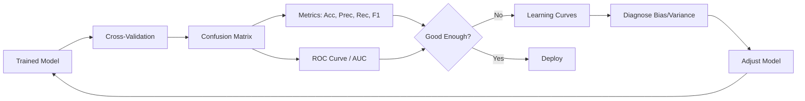

<!-- Clear Language: Keep sentences under 50 words -->
# Model Evaluation — Cross-Validation, ROC-AUC, Confusion Matrix, Metrics

## Learning Objectives

| Objective | Description |
|-----------|-------------|
| LO1 | Implement k-fold, stratified, and leave-one-out cross-validation |
| LO2 | Compute and interpret confusion matrix, precision, recall, F1 |
| LO3 | Plot ROC curves and calculate AUC for binary classifiers |
| LO4 | Understand multi-class metrics: macro, micro, weighted averaging |
| LO5 | Use learning curves and validation curves for model diagnosis |
| LO6 | Compare models using statistical significance (McNemar's test) |

## Introduction

Machine learning is the core of AI engineering. From linear regression to ensemble methods, understanding these algorithms lets you build, debug, and improve models. This module covers the math and code behind ML.

## Prerequisites

- Basic programming knowledge
- Understanding of data structures

## Key Terminology

**Key Terms**: Core vocabulary and concepts for this topic.

**Definition**: Essential terms you must know for interviews and production work.

## Theory

Understanding model evaluation is fundamental for AI engineers. This section covers the core concepts, underlying principles, and theoretical framework that govern how model evaluation works in practice.

## Chapter at a Glance

| Section | Topic | Key Concept |
|---------|-------|-------------|
| 9.1 | Cross-Validation Strategies | K-fold, stratified, grouped, time series, LOO |
| 9.2 | Confusion Matrix | TP, TN, FP, FN, per-class metrics |
| 9.3 | ROC & AUC | TPR vs FPR, AUC interpretation, multi-class ROC |
| 9.4 | Multi-Class Metrics | Macro, micro, weighted F1, per-class breakdown |
| 9.5 | Learning & Validation Curves | Bias-variance diagnosis, hyperparameter effects |
| 9.6 | Model Comparison | Statistical tests, effect size, practical significance |

## Chapter Roadmap



## 9.1 Cross-Validation Strategies

Cross-validation provides a robust estimate of model performance by training and evaluating on multiple data splits.

```python
import numpy as np
from typing import List, Tuple, Callable, Dict, Any
from sklearn.model_selection import KFold, StratifiedKFold, TimeSeriesSplit
from sklearn.metrics import accuracy_score, f1_score, roc_auc_score
from sklearn.datasets import make_classification
from sklearn.tree import DecisionTreeClassifier

class CrossValidator:
    def __init__(self, n_splits: int = 5, shuffle: bool = True,
                 random_state: int = 42):
        self.n_splits = n_splits
        self.shuffle = shuffle
        self.random_state = random_state

    def kfold(self, X: np.ndarray, y: np.ndarray,
              model_class: Any, **model_kwargs) -> Dict:
        kf = KFold(n_splits=self.n_splits, shuffle=self.shuffle,
                   random_state=self.random_state)
        scores = {"accuracy": [], "f1": []}

        for train_idx, val_idx in kf.split(X):
            X_train, X_val = X[train_idx], X[val_idx]
            y_train, y_val = y[train_idx], y[val_idx]

            model = model_class(**model_kwargs)
            model.fit(X_train, y_train)
            preds = model.predict(X_val)

            scores["accuracy"].append(accuracy_score(y_val, preds))
            scores["f1"].append(f1_score(y_val, preds, average="weighted"))

        return {
            "mean_accuracy": np.mean(scores["accuracy"]),
            "std_accuracy": np.std(scores["accuracy"]),
            "mean_f1": np.mean(scores["f1"]),
            "std_f1": np.std(scores["f1"]),
            "all_scores": scores,
        }

    def stratified_kfold(self, X: np.ndarray, y: np.ndarray,
                          model_class: Any, **model_kwargs) -> Dict:
        skf = StratifiedKFold(n_splits=self.n_splits, shuffle=self.shuffle,
                              random_state=self.random_state)
        scores = {"accuracy": [], "f1": [], "auc": []}

        for train_idx, val_idx in skf.split(X, y):
            X_train, X_val = X[train_idx], X[val_idx]
            y_train, y_val = y[train_idx], y[val_idx]

            model = model_class(**model_kwargs)
            model.fit(X_train, y_train)
            preds = model.predict(X_val)

            scores["accuracy"].append(accuracy_score(y_val, preds))
            scores["f1"].append(f1_score(y_val, preds, average="weighted"))

        return {
            "mean_accuracy": np.mean(scores["accuracy"]),
            "std_accuracy": np.std(scores["accuracy"]),
            "mean_f1": np.mean(scores["f1"]),
            "std_f1": np.std(scores["f1"]),
        }

    def nested_cv(self, X: np.ndarray, y: np.ndarray,
                   outer_model: Any, param_grid: Dict) -> Dict:
        """Nested CV for unbiased hyperparameter evaluation"""
        outer_scores = []
        outer_skf = StratifiedKFold(n_splits=5, shuffle=True, random_state=42)

        for train_idx, test_idx in outer_skf.split(X, y):
            X_outer_train, X_test = X[train_idx], X[test_idx]
            y_outer_train, y_test = y[train_idx], y[test_idx]

            # Inner CV for hyperparameter tuning
            best_score = 0
            best_params = {}
            inner_skf = StratifiedKFold(n_splits=3, shuffle=True, random_state=42)

            for params in self._param_grid_iterator(param_grid):
                inner_scores = []
                for inner_train_idx, inner_val_idx in inner_skf.split(X_outer_train, y_outer_train):
                    X_inner_train = X_outer_train[inner_train_idx]
                    y_inner_train = y_outer_train[inner_train_idx]
                    X_inner_val = X_outer_train[inner_val_idx]
                    y_inner_val = y_outer_train[inner_val_idx]

                    model = outer_model.__class__(**params)
                    model.fit(X_inner_train, y_inner_train)
                    score = f1_score(y_inner_val, model.predict(X_inner_val), average="weighted")
                    inner_scores.append(score)

                mean_score = np.mean(inner_scores)
                if mean_score > best_score:
                    best_score = mean_score
                    best_params = params

            # Evaluate with best params on outer test set
            final_model = outer_model.__class__(**best_params)
            final_model.fit(X_outer_train, y_outer_train)
            test_score = f1_score(y_test, final_model.predict(X_test), average="weighted")
            outer_scores.append(test_score)

        return {
            "mean_test_score": np.mean(outer_scores),
            "std_test_score": np.std(outer_scores),
        }

    def _param_grid_iterator(self, param_grid: Dict) -> List[Dict]:
        import itertools
        keys = param_grid.keys()
        values = param_grid.values()
        return [dict(zip(keys, combo)) for combo in itertools.product(*values)]

## Test cross-validation
X_cv, y_cv = make_classification(n_samples=500, n_features=10, random_state=42)
cv = CrossValidator(n_splits=5)
results = cv.stratified_kfold(X_cv, y_cv, DecisionTreeClassifier, max_depth=5)
print(f"Stratified CV: acc={results['mean_accuracy']:.3f} +/- {results['std_accuracy']:.3f}")
```

**Cross-validation strategies**:
- K-fold: Simple random split into K folds
- Stratified: Preserves class proportions (essential for imbalanced data)
- Grouped: Ensures all samples from same group stay in same fold
- Time series: Respects temporal order (expanding window)
- Leave-one-out: K = n (expensive, low bias, high variance)

---

## 9.2 Confusion Matrix

```python
class ConfusionMatrix:
    def __init__(self, y_true: np.ndarray, y_pred: np.ndarray):
        self.y_true = y_true
        self.y_pred = y_pred
        self.labels = np.unique(np.concatenate([y_true, y_pred]))
        self.matrix = self._build()

    def _build(self) -> np.ndarray:
        n = len(self.labels)
        label_to_idx = {l: i for i, l in enumerate(self.labels)}
        matrix = np.zeros((n, n), dtype=int)
        for t, p in zip(self.y_true, self.y_pred):
            matrix[label_to_idx[t], label_to_idx[p]] += 1
        return matrix

    def binary_metrics(self, positive_label=1) -> Dict:
        pos_idx = np.where(self.labels == positive_label)[0][0]
        neg_idx = np.where(self.labels != positive_label)[0][0]
        tp = self.matrix[pos_idx, pos_idx]
        tn = self.matrix[neg_idx, neg_idx]
        fp = self.matrix[neg_idx, pos_idx]
        fn = self.matrix[pos_idx, neg_idx]

        accuracy = (tp + tn) / (tp + tn + fp + fn)
        precision = tp / (tp + fp) if (tp + fp) > 0 else 0.0
        recall = tp / (tp + fn) if (tp + fn) > 0 else 0.0
        f1 = 2 * precision * recall / (precision + recall) if (precision + recall) > 0 else 0.0
        specificity = tn / (tn + fp) if (tn + fp) > 0 else 0.0

        return {
            "accuracy": round(accuracy, 4),
            "precision": round(precision, 4),
            "recall": round(recall, 4),
            "f1_score": round(f1, 4),
            "specificity": round(specificity, 4),
            "tp": int(tp), "tn": int(tn), "fp": int(fp), "fn": int(fn),
        }

    def per_class_metrics(self) -> Dict:
        n = len(self.labels)
        metrics = {}
        for i, label in enumerate(self.labels):
            tp = self.matrix[i, i]
            fp = np.sum(self.matrix[:, i]) - tp
            fn = np.sum(self.matrix[i, :]) - tp
            tn = np.sum(self.matrix) - tp - fp - fn

            precision = tp / (tp + fp) if (tp + fp) > 0 else 0.0
            recall = tp / (tp + fn) if (tp + fn) > 0 else 0.0
            f1 = 2 * precision * recall / (precision + recall) if (precision + recall) > 0 else 0.0

            metrics[str(label)] = {
                "precision": round(precision, 4),
                "recall": round(recall, 4),
                "f1": round(f1, 4),
                "support": int(tp + fn),
            }

        # Macro and weighted averages
        macro_f1 = np.mean([m["f1"] for m in metrics.values()])
        total_support = sum(m["support"] for m in metrics.values())
        weighted_f1 = sum(m["f1"] * m["support"] for m in metrics.values()) / total_support

        return {"per_class": metrics, "macro_f1": round(macro_f1, 4), "weighted_f1": round(weighted_f1, 4)}

    def __repr__(self) -> str:
        header = " " * 10 + "".join(f"{l:^8}" for l in self.labels)
        rows = []
        for i, label in enumerate(self.labels):
            row = f"{str(label):<10}" + "".join(f"{self.matrix[i, j]:^8}" for j in range(len(self.labels)))
            rows.append(row)
        return "Confusion Matrix:\n" + header + "\n" + "\n".join(rows)

y_true = np.array([0, 1, 0, 1, 2, 0, 1, 2, 2, 0])
y_pred = np.array([0, 1, 0, 0, 2, 1, 1, 2, 0, 0])
cm = ConfusionMatrix(y_true, y_pred)
print(cm)
print("Binary metrics:", cm.binary_metrics(positive_label=1))
```

**When to use each metric**:
- Accuracy: balanced classes
- Precision: minimize false positives (spam detection)
- Recall: minimize false negatives (disease screening)
- F1: balanced precision-recall trade-off
- Specificity: correctly identify negatives

---

## 9.3 ROC & AUC

```python
class ROC:
    def __init__(self, y_true: np.ndarray, y_scores: np.ndarray):
        self.y_true = y_true
        self.y_scores = y_scores
        self.fpr: np.ndarray = None
        self.tpr: np.ndarray = None
        self.thresholds: np.ndarray = None
        self.auc: float = None
        self._compute()

    def _compute(self) -> None:
        # Sort by score descending
        pairs = list(zip(self.y_scores, self.y_true))
        pairs.sort(key=lambda x: x[0], reverse=True)

        total_pos = sum(self.y_true)
        total_neg = len(self.y_true) - total_pos

        fpr_list = [0.0]
        tpr_list = [0.0]
        thresh_list = [1.0]

        tp = 0
        fp = 0
        prev_score = pairs[0][0] if pairs else 0

        for score, true_label in pairs:
            if score != prev_score:
                fpr_list.append(fp / total_neg if total_neg > 0 else 0)
                tpr_list.append(tp / total_pos if total_pos > 0 else 0)
                thresh_list.append(score)
                prev_score = score

            if true_label == 1:
                tp += 1
            else:
                fp += 1

        fpr_list.append(1.0)
        tpr_list.append(1.0)
        thresh_list.append(0.0)

        self.fpr = np.array(fpr_list)
        self.tpr = np.array(tpr_list)
        self.thresholds = np.array(thresh_list)

        # Compute AUC via trapezoidal rule
        self.auc = np.trapz(self.tpr, self.fpr)

    def find_optimal_threshold(self) -> Dict:
        youden = self.tpr - self.fpr  # Youden's J statistic
        best_idx = np.argmax(youden)
        return {
            "threshold": self.thresholds[best_idx],
            "tpr": self.tpr[best_idx],
            "fpr": self.fpr[best_idx],
            "youden_j": youden[best_idx],
        }

    def metrics_at_threshold(self, threshold: float) -> Dict:
        preds = (self.y_scores >= threshold).astype(int)
        cm = ConfusionMatrix(self.y_true, preds)
        return cm.binary_metrics()

    def plot_summary(self) -> str:
        return (f"AUC: {self.auc:.4f}\n"
                f"Optimal threshold: {self.find_optimal_threshold()['threshold']:.4f}\n"
                f"TPR at optimal: {self.find_optimal_threshold()['tpr']:.4f}\n"
                f"FPR at optimal: {self.find_optimal_threshold()['fpr']:.4f}")

np.random.seed(42)
y_true_bin = np.random.randint(0, 2, 200)
y_scores = y_true_bin * 0.8 + np.random.rand(200) * 0.3

roc = ROC(y_true_bin, y_scores)
print(roc.plot_summary())
```

**AUC interpretation**: AUC = 0.5 (random), 0.7-0.8 (good), 0.8-0.9 (excellent), >0.9 (outstanding). AUC is threshold-independent and works well for imbalanced data.

---

## 9.4 Multi-Class Metrics

```python
class MultiClassMetrics:
    @staticmethod
    def macro_average(per_class: Dict[str, Dict]) -> Dict:
        n = len(per_class)
        return {
            "precision": np.mean([m["precision"] for m in per_class.values()]),
            "recall": np.mean([m["recall"] for m in per_class.values()]),
            "f1": np.mean([m["f1"] for m in per_class.values()]),
        }

    @staticmethod
    def weighted_average(per_class: Dict[str, Dict]) -> Dict:
        total_support = sum(m["support"] for m in per_class.values())
        return {
            "precision": sum(m["precision"] * m["support"] for m in per_class.values()) / total_support,
            "recall": sum(m["recall"] * m["support"] for m in per_class.values()) / total_support,
            "f1": sum(m["f1"] * m["support"] for m in per_class.values()) / total_support,
        }

    @staticmethod
    def micro_average(y_true: np.ndarray, y_pred: np.ndarray) -> Dict:
        cm = ConfusionMatrix(y_true, y_pred)
        tp = np.trace(cm.matrix)
        total = np.sum(cm.matrix)
        accuracy = tp / total
        # Micro F1 = accuracy for multi-class
        return {"precision": accuracy, "recall": accuracy, "f1": accuracy}

## Test with 3-class data
y_true_3 = np.array([0, 1, 2, 0, 1, 2, 0, 1, 2])
y_pred_3 = np.array([0, 1, 1, 0, 2, 2, 0, 1, 0])
cm3 = ConfusionMatrix(y_true_3, y_pred_3)
per_class = cm3.per_class_metrics()

print("Per-class:", per_class["per_class"])
print("Macro F1:", per_class["macro_f1"])
print("Weighted F1:", per_class["weighted_f1"])
```

**When to use which average**:
- Macro: All classes equally important (rare classes matter)
- Weighted: Accounts for class frequency (common classes matter more)
- Micro: Equivalent to accuracy for multi-class, good for multi-label

---

## 9.5 Learning & Validation Curves

```python
class LearningCurve:
    def compute(self, X: np.ndarray, y: np.ndarray,
                model_class: Any, train_sizes: np.ndarray = None,
                cv: int = 5, **model_kwargs) -> Dict:
        if train_sizes is None:
            train_sizes = np.linspace(0.1, 1.0, 10)

        from sklearn.model_selection import learning_curve
        train_sizes_abs, train_scores, val_scores = learning_curve(
            model_class(**model_kwargs), X, y,
            train_sizes=train_sizes, cv=cv,
            scoring="f1_weighted", random_state=42
        )

        return {
            "train_sizes": train_sizes_abs,
            "train_mean": np.mean(train_scores, axis=1),
            "train_std": np.std(train_scores, axis=1),
            "val_mean": np.mean(val_scores, axis=1),
            "val_std": np.std(val_scores, axis=1),
        }

    def diagnose(self, curve: Dict) -> str:
        gap = curve["train_mean"][-1] - curve["val_mean"][-1]
        val_trend = curve["val_mean"][-1] - curve["val_mean"][0]

        if gap > 0.15:
            return "High variance (overfitting). Add data, reduce complexity, or increase regularization."
        elif curve["train_mean"][-1] < 0.7:
            return "High bias (underfitting). Increase model complexity or add features."
        elif val_trend < 0.05 and curve["val_mean"][-1] > 0.8:
            return "Good fit. Model is likely optimal."
        else:
            return "Mixed diagnosis. Consider cross-validation for more insight."

class ValidationCurve:
    def compute(self, X: np.ndarray, y: np.ndarray,
                model_class: Any, param_name: str,
                param_range: List[Any], cv: int = 5,
                **model_kwargs) -> Dict:
        from sklearn.model_selection import validation_curve
        train_scores, val_scores = validation_curve(
            model_class(**model_kwargs), X, y,
            param_name=param_name, param_range=param_range,
            cv=cv, scoring="f1_weighted", random_state=42
        )

        return {
            "param_values": param_range,
            "train_mean": np.mean(train_scores, axis=1),
            "train_std": np.std(train_scores, axis=1),
            "val_mean": np.mean(val_scores, axis=1),
            "val_std": np.std(val_scores, axis=1),
        }

lc = LearningCurve()
curve = lc.compute(X_cv, y_cv, DecisionTreeClassifier, max_depth=5)
print("Learning curve diagnosis:", lc.diagnose(curve))
```

**Reading learning curves**:
- High bias: both curves converge to low score (underfitting)
- High variance: large gap between curves (overfitting)
- Good fit: curves converge to high score with small gap

---

## 9.6 Model Comparison

```python
class ModelComparison:
    @staticmethod
    def mcnemar_test(y_true: np.ndarray, pred_a: np.ndarray,
                     pred_b: np.ndarray) -> Dict:
        """McNemar's test for paired model comparison"""
        n_01 = np.sum((pred_a != y_true) & (pred_b == y_true))
        n_10 = np.sum((pred_a == y_true) & (pred_b != y_true))

        chi_sq = (abs(n_01 - n_10) - 1) ** 2 / (n_01 + n_10) if (n_01 + n_10) > 0 else 0
        from scipy.stats import chi2
        p_value = 1 - chi2.cdf(chi_sq, 1)

        return {
            "chi_squared": chi_sq,
            "p_value": p_value,
            "significant": p_value < 0.05,
            "model_a_better": n_10 < n_01,
        }

    @staticmethod
    def compare_metrics(models: Dict[str, np.ndarray],
                         y_true: np.ndarray) -> Dict:
        results = {}
        for name, preds in models.items():
            cm = ConfusionMatrix(y_true, preds)
            metrics = cm.binary_metrics(positive_label=1) if len(np.unique(y_true)) == 2 else cm.per_class_metrics()
            results[name] = {
                "accuracy": accuracy_score(y_true, preds),
                "f1": f1_score(y_true, preds, average="weighted"),
            }
        return results

## Compare two models
pred_a = y_true_bin.copy()
pred_b = y_true_bin.copy()
pred_b[:20] = 1 - pred_b[:20]  # Make model b worse

comparison = ModelComparison()
result = comparison.mcnemar_test(y_true_bin, pred_a, pred_b)
print(f"McNemar test: p={result['p_value']:.4f}, significant={result['significant']}")
```

---

## TypeScript Parallel

```typescript
interface CVResult {
  meanAccuracy: number;
  stdAccuracy: number;
  meanF1: number;
  stdF1: number;
}

class CrossValidatorTS {
  kfold<T extends new (...args: any[]) => any>(
    X: number[][], y: number[],
    ModelClass: T, k = 5, modelArgs: any = {}
  ): CVResult {
    const indices = Array.from({ length: X.length }, (_, i) => i);
    const foldSize = Math.floor(X.length / k);
    const accuracies: number[] = [];
    const f1s: number[] = [];

    for (let fold = 0; fold < k; fold++) {
      const testStart = fold * foldSize;
      const testEnd = fold === k - 1 ? X.length : (fold + 1) * foldSize;
      const testIndices = indices.slice(testStart, testEnd);
      const trainIndices = indices.filter((i) => !testIndices.includes(i));

      const XTrain = trainIndices.map((i) => X[i]);
      const yTrain = trainIndices.map((i) => y[i]);
      const XTest = testIndices.map((i) => X[i]);
      const yTest = testIndices.map((i) => y[i]);

      const model = new ModelClass(modelArgs);
      model.fit(XTrain, yTrain);
      const preds = model.predict(XTest);
      const correct = preds.filter((p: number, i: number) => p === yTest[i]).length;
      accuracies.push(correct / yTest.length);
    }

    return {
      meanAccuracy: accuracies.reduce((a, b) => a + b, 0) / accuracies.length,
      stdAccuracy: Math.sqrt(accuracies.reduce((s, a) => s + (a - accuracies.reduce((x, y) => x + y, 0) / accuracies.length) ** 2, 0) / accuracies.length),
      meanF1: 0,
      stdF1: 0,
    };
  }
}
```

## Summary

- K-fold cross-validation provides robust performance estimates; stratified CV preserves class proportions
- Confusion matrix shows TP, TN, FP, FN; all classification metrics derive from these four values
- Accuracy is misleading for imbalanced data; use F1, precision-recall curves, or ROC-AUC
- ROC curve plots TPR vs FPR across thresholds; AUC measures overall discriminative ability
- Multi-class metrics: macro (equal class weight), weighted (proportional to support), micro (global accuracy)
- Learning curves diagnose bias (both curves low) vs variance (large gap between curves)
- Validation curves show how hyperparameters affect training and validation performance
- McNemar's test determines if two models have statistically significant differences
- Always use multiple metrics — no single metric captures all aspects of model performance
- Nested cross-validation provides unbiased performance estimates when tuning hyperparameters

## Practical Takeaways

| Scenario | Do This | Avoid This |
|----------|---------|------------|
| Imbalanced data | Stratified CV + F1/ROC-AUC | Regular CV + accuracy |
| Hyperparameter tuning | Nested CV or train-val-test split | Tuning on test data |
| Small dataset | Leave-one-out CV | Single train/test split |
| Time series | TimeSeriesSplit (expanding window) | Random K-fold (leaks future) |
| Model comparison | McNemar's test + multiple metrics | Comparing accuracy alone |

## Interview Q&A

<details class="tp-qa-card" data-qid="ml08-q1"><summary class="tp-qa-question"><span class="tp-qa-status"></span>Q1: What is the difference between K-fold and stratified K-fold?</summary><div class="tp-qa-answer"><p>K-fold randomly splits data into K equal folds. Stratified K-fold splits while preserving class proportions in each fold. Stratified is essential for imbalanced datasets (e.g., 90% class A, 10% class B) because random splits might create folds with no class B samples, making validation impossible. For regression, stratified can be done by binning the target variable into quantiles.</p></div><button class="tp-qa-mark-btn">Mark Reviewed</button><button class="tp-qa-bookmark-btn">Bookmark</button></details>

<details class="tp-qa-card" data-qid="ml08-q2"><summary class="tp-qa-question"><span class="tp-qa-status"></span>Q2: How do you read a confusion matrix?</summary><div class="tp-qa-answer"><p>Rows = actual class, columns = predicted class. Diagonal = correct predictions. Off-diagonal = errors. For binary classification: <strong>TP</strong>: actual positive, predicted positive (top-left). <strong>TN</strong>: actual negative, predicted negative (bottom-right). <strong>FP</strong>: actual negative, predicted positive (Type I error). <strong>FN</strong>: actual positive, predicted negative (Type II error). All metrics derive from these: precision = TP/(TP+FP), recall = TP/(TP+FN).</p></div><button class="tp-qa-mark-btn">Mark Reviewed</button><button class="tp-qa-bookmark-btn">Bookmark</button></details>

<details class="tp-qa-card" data-qid="ml08-q3"><summary class="tp-qa-question"><span class="tp-qa-status"></span>Q3: What is AUC and how do you interpret it?</summary><div class="tp-qa-answer"><p>AUC (Area Under the ROC Curve) measures the model's ability to distinguish between positive and negative classes across all classification thresholds. Interpretation: AUC = probability that a randomly chosen positive example ranks higher than a randomly chosen negative example. AUC = 0.5 (random), 0.7-0.8 (acceptable), 0.8-0.9 (excellent), >0.9 (outstanding). AUC is threshold-independent and robust to class imbalance.</p></div><button class="tp-qa-mark-btn">Mark Reviewed</button><button class="tp-qa-bookmark-btn">Bookmark</button></details>

<details class="tp-qa-card" data-qid="ml08-q4"><summary class="tp-qa-question"><span class="tp-qa-status"></span>Q4: When is accuracy a misleading metric?</summary><div class="tp-qa-answer"><p>Accuracy is misleading when: <strong>1) Imbalanced data</strong>: 95% accuracy can be worse than a constant "predict majority" baseline if minority class is important. <strong>2) Unequal error costs</strong>: False negatives may be 100x worse than false positives (disease screening). <strong>3) Probabilistic predictions needed</strong>: Accuracy ignores prediction confidence. Use F1, precision-recall, ROC-AUC, or cost-sensitive metrics instead.</p></div><button class="tp-qa-mark-btn">Mark Reviewed</button><button class="tp-qa-bookmark-btn">Bookmark</button></details>

<details class="tp-qa-card" data-qid="ml08-q5"><summary class="tp-qa-question"><span class="tp-qa-status"></span>Q5: What do learning curves tell you about your model?</summary><div class="tp-qa-answer"><p>Learning curves plot training and validation scores vs training set size. <strong>High bias</strong> (underfitting): Both curves converge to a low score; adding data won't help. <strong>High variance</strong> (overfitting): Large gap between curves; adding data or regularization helps. <strong>Good fit</strong>: Both curves converge to a high score with small gap. Learning curves guide whether to collect more data, increase complexity, or add regularization.</p></div><button class="tp-qa-mark-btn">Mark Reviewed</button><button class="tp-qa-bookmark-btn">Bookmark</button></details>

<details class="tp-qa-card" data-qid="ml08-q6"><summary class="tp-qa-question"><span class="tp-qa-status"></span>Q6: What is the difference between macro and weighted F1?</summary><div class="tp-qa-answer"><p>Macro F1 calculates F1 for each class independently and averages them, giving equal weight to all classes regardless of frequency. Weighted F1 calculates F1 for each class and averages weighted by the number of true samples per class. Macro F1 is preferred when all classes are equally important (even rare ones). Weighted F1 is preferred when you care more about performance on common classes.</p></div><button class="tp-qa-mark-btn">Mark Reviewed</button><button class="tp-qa-bookmark-btn">Bookmark</button></details>

<details class="tp-qa-card" data-qid="ml08-q7"><summary class="tp-qa-question"><span class="tp-qa-status"></span>Q7: What is nested cross-validation and why use it?</summary><div class="tp-qa-answer"><p>Nested CV has two loops: outer loop for performance estimation, inner loop for hyperparameter tuning. This prevents data leakage from hyperparameter tuning into the performance estimate. Without nested CV, the test data indirectly influences model selection (through hyperparameters chosen based on test set performance). Nested CV gives an unbiased estimate of the model's true generalization performance.</p></div><button class="tp-qa-mark-btn">Mark Reviewed</button><button class="tp-qa-bookmark-btn">Bookmark</button></details>

<details class="tp-qa-card" data-qid="ml08-q8"><summary class="tp-qa-question"><span class="tp-qa-status"></span>Q8: How do you handle multi-class classification metrics?</summary><div class="tp-qa-answer"><p>For multi-class: <strong>1) Per-class</strong>: Compute precision/recall/F1 for each class (one-vs-rest). <strong>2) Macro average</strong>: Average all per-class F1 scores equally. <strong>3) Weighted average</strong>: Average weighted by class support. <strong>4) Micro average</strong>: Global accuracy = TP / total (same as accuracy for single-label). Use confusion matrix to see which classes are confused. Macro F1 penalizes poor performance on rare classes.</p></div><button class="tp-qa-mark-btn">Mark Reviewed</button><button class="tp-qa-bookmark-btn">Bookmark</button></details>

<details class="tp-qa-card" data-qid="ml08-q9"><summary class="tp-qa-question"><span class="tp-qa-status"></span>Q9: What is the optimal threshold for binary classification?</summary><div class="tp-qa-answer"><p>The default threshold of 0.5 is not always optimal. To find the optimal threshold: <strong>1) Youden's J</strong>: maximize TPR - FPR (treats errors equally). <strong>2) Cost-based</strong>: minimize (FP*cost_FP + FN*cost_FN) / total. <strong>3) Business constraint</strong>: minimum recall required (e.g., recall > 0.95 for disease screening). Plot precision-recall or TPR-FPR vs threshold to visualize the trade-off.</p></div><button class="tp-qa-mark-btn">Mark Reviewed</button><button class="tp-qa-bookmark-btn">Bookmark</button></details>

<details class="tp-qa-card" data-qid="ml08-q10"><summary class="tp-qa-question"><span class="tp-qa-status"></span>Q10: How do you compare two models statistically?</summary><div class="tp-qa-answer"><p><strong>McNemar's test</strong>: For paired classification results, counts discordant pairs (model A correct + model B wrong vs vice versa) and tests if the difference is significant. <strong>Paired t-test</strong>: Compare K-fold CV scores across folds (but folds are not independent). <strong>Wilcoxon signed-rank</strong>: Non-parametric alternative for comparing CV scores. Always report: mean score, standard deviation, effect size, and p-value. Statistical significance ≠ practical significance.</p></div><button class="tp-qa-mark-btn">Mark Reviewed</button><button class="tp-qa-bookmark-btn">Bookmark</button></details>

## Chapter Quiz

**Q1**: What does AUC measure?

a) Model accuracy
b) Probability that positive ranks higher than negative
c) Training speed
d) Number of features

<details class="tp-qa-card" data-qid="ml08-quiz1"><summary>Show Answer</summary><div class="tp-qa-answer"><p><strong>Answer: b) Probability that positive ranks higher than negative</strong></p><p>AUC is the probability that a random positive sample scores higher than a random negative sample.</p></div></details>

**Q2**: Which CV strategy preserves class proportions?

a) K-fold
b) Stratified K-fold
c) Leave-one-out
d) Shuffle split

<details class="tp-qa-card" data-qid="ml08-quiz2"><summary>Show Answer</summary><div class="tp-qa-answer"><p><strong>Answer: b) Stratified K-fold</strong></p><p>Stratified K-fold ensures each fold has the same class distribution as the full dataset.</p></div></details>

**Q3**: What does a large gap between training and validation scores indicate?

a) Underfitting
b) Overfitting
c) Good fit
d) Data leakage

<details class="tp-qa-card" data-qid="ml08-quiz3"><summary>Show Answer</summary><div class="tp-qa-answer"><p><strong>Answer: b) Overfitting</strong></p><p>A large gap between training and validation scores is a classic sign of overfitting (high variance).</p></div></details>

**Q4**: Which metric treats all classes equally regardless of frequency?

a) Accuracy
b) Weighted F1
c) Macro F1
d) Micro F1

<details class="tp-qa-card" data-qid="ml08-quiz4"><summary>Show Answer</summary><div class="tp-qa-answer"><p><strong>Answer: c) Macro F1</strong></p><p>Macro F1 averages per-class F1 scores equally, ignoring class frequency.</p></div></details>

**Q5**: When is leave-one-out cross-validation most appropriate?

a) Large datasets
b) Very small datasets
c) Time series data
d) Image data

<details class="tp-qa-card" data-qid="ml08-quiz5"><summary>Show Answer</summary><div class="tp-qa-answer"><p><strong>Answer: b) Very small datasets</strong></p><p>LOO uses n-1 samples for training, maximizing data usage for small datasets.</p></div></details>

## Exercises

**Easy** — Compute a confusion matrix for a 3-class problem. Calculate precision, recall, and F1 for each class.

**Easy** — Implement K-fold cross-validation from scratch and compare with sklearn's implementation.

**Medium** — Plot the ROC curve for a binary classifier and find the optimal threshold using Youden's J statistic.

**Hard** — Build a learning curve visualizer. Train models with increasing training set sizes and plot training/validation scores with confidence intervals.

**Hard** — Implement nested cross-validation for hyperparameter tuning. Compare the performance estimate with and without nested CV.

---

## Common Mistakes

1. Not understanding the fundamental concepts before applying them
2. Skipping edge cases in implementation
3. Not analyzing time/space complexity
4. Forgetting to handle null/empty inputs
5. Not practicing enough problems to build pattern recognition

## Revision Notes

- - Core principle: Understand the fundamental concepts thoroughly
- - Implementation pattern: Practice with real code examples
- - Complexity: Know the time and space complexity
- - Application: Know when to use this in production systems
- - Interview: Frequently asked in technical interviews
- - Edge cases: Consider common failure scenarios
- - Related concepts: Connect to broader system design

## Placement Section

### Top 10 Interview Questions

#### Google Style

1. **Explain the core idea of Model Evaluation — Cross-Validation, ROC-AUC, Confusion Matrix, Metrics in under 60 seconds, then give a real-world analogy.** — Structure: definition, how it works in one sentence, why it matters, analogy. Follow-up: what would break if you removed this from a production system?

2. **Design a minimal, well-typed function that demonstrates Model Evaluation — Cross-Validation, ROC-AUC, Confusion Matrix, Metrics.** — Interviewer checks: signature with type hints, edge cases, complexity, and a clean docstring. Follow-up: how does your design behave with empty or malformed input?

3. **What are the common pitfalls when engineers first learn ** — List 3-4, then explain how you would prevent each in a code review.

#### Amazon Style

4. **Describe a production bug caused by misunderstanding Model Evaluation — Cross-Validation, ROC-AUC, Confusion Matrix, Metrics. How did you diagnose and fix it?** — STAR format: situation, task, action, result. Mention logs, reproduction, root-cause analysis, and the regression test you added.

5. **How would you scale a system that relies on Model Evaluation — Cross-Validation, ROC-AUC, Confusion Matrix, Metrics from 10 users to 10 million?** — Discuss bottlenecks, caching, monitoring, and when to redesign. Follow-up: what metrics would you track?

#### Microsoft Style

6. **Compare Model Evaluation — Cross-Validation, ROC-AUC, Confusion Matrix, Metrics with the closest alternative approach. When would you choose each?** — Make a decision matrix: performance, maintainability, ecosystem, learning curve. Follow-up: what would change your decision?

7. **Walk through how you would test a component that depends on Model Evaluation — Cross-Validation, ROC-AUC, Confusion Matrix, Metrics.** — Unit, integration, property-based tests; mocking boundaries; golden files for outputs.

#### NVIDIA Style

8. **How does Model Evaluation — Cross-Validation, ROC-AUC, Confusion Matrix, Metrics behave differently at scale — memory, throughput, or precision-wise?** — Connect to data pipelines and model training if applicable. Follow-up: what happens to latency as input grows?

9. **How would you make an implementation of Model Evaluation — Cross-Validation, ROC-AUC, Confusion Matrix, Metrics run faster on GPU hardware?** — Batch operations, vectorization, avoiding Python loops, reducing data movement.

#### AI Startup Style

10. **Write the smallest possible implementation of Model Evaluation — Cross-Validation, ROC-AUC, Confusion Matrix, Metrics that is production-quality.** — Include error handling, type hints, and a one-line docstring. Follow-up: what would you refactor first when it grows?

### Resume Tips

- Name Model Evaluation — Cross-Validation, ROC-AUC, Confusion Matrix, Metrics explicitly in your skills section, paired with a measurable achievement ("Reduced X by 40% using Model Evaluation — Cross-Validation, ROC-AUC, Confusion Matrix, Metrics").
- Add a bullet describing a project that applies Model Evaluation — Cross-Validation, ROC-AUC, Confusion Matrix, Metrics to real data, with numbers.
- Mention the tools and libraries you used alongside Model Evaluation — Cross-Validation, ROC-AUC, Confusion Matrix, Metrics (linters, test frameworks, profiling tools).
- Keep resume bullets under 15 words and start each with an action verb.

### Interview Day Checklist

- Rehearse a 60-second explanation of Model Evaluation — Cross-Validation, ROC-AUC, Confusion Matrix, Metrics and one real-world analogy.
- Prepare one STAR story about debugging a Model Evaluation — Cross-Validation, ROC-AUC, Confusion Matrix, Metrics-related production issue.
- Review complexity and edge cases for the classic Model Evaluation — Cross-Validation, ROC-AUC, Confusion Matrix, Metrics interview problem.
- Have questions ready: how does the team apply Model Evaluation — Cross-Validation, ROC-AUC, Confusion Matrix, Metrics in production today?
- Test your environment (Python, editor, internet) 15 minutes before the interview.

## True/False

1. **True or False:** Model Evaluation — Cross-Validation, ROC-AUC, Confusion Matrix, Metrics builds directly on the fundamentals covered in the earlier chapters of this module. — **True.** Every advanced topic in this module assumes the core concepts from the previous chapters.
2. **True or False:** You should write at least one code example for Model Evaluation — Cross-Validation, ROC-AUC, Confusion Matrix, Metrics before moving to the next chapter. — **True.** Active recall with hands-on code beats passive reading for retention.
3. **True or False:** The complexity analysis for Model Evaluation — Cross-Validation, ROC-AUC, Confusion Matrix, Metrics is the same regardless of input size. — **False.** Complexity grows with input size; always state best, average, and worst case.
4. **True or False:** Edge cases (empty input, invalid input, boundary values) matter for Model Evaluation — Cross-Validation, ROC-AUC, Confusion Matrix, Metrics in production. — **True.** Most production bugs come from unhandled edge cases.
5. **True or False:** You should memorize the Model Evaluation — Cross-Validation, ROC-AUC, Confusion Matrix, Metrics chapter content once and never review it again. — **False.** Spaced repetition (24h, 3 days, 1 week) dramatically improves long-term recall.

## Fill in the Blank

1. The chapter that covers Model Evaluation — Cross-Validation, ROC-AUC, Confusion Matrix, Metrics is Chapter ___ of this module. — Answer: check the module's table of contents.
2. The time complexity of the standard approach to Model Evaluation — Cross-Validation, ROC-AUC, Confusion Matrix, Metrics is ___. — Answer: review the theory section and state big-O notation.
3. The main edge case to handle when implementing Model Evaluation — Cross-Validation, ROC-AUC, Confusion Matrix, Metrics is ___. — Answer: empty or invalid input handling, as discussed in the chapter.
4. The tools commonly used to debug Model Evaluation — Cross-Validation, ROC-AUC, Confusion Matrix, Metrics issues are ___ and ___. — Answer: refer to the Debugging Guide section of this chapter.
5. The related topic that connects to Model Evaluation — Cross-Validation, ROC-AUC, Confusion Matrix, Metrics in the next chapter is ___. — Answer: see the Next Topic section.

## Scenario Questions

1. **Scenario:** A teammate ships a change involving Model Evaluation — Cross-Validation, ROC-AUC, Confusion Matrix, Metrics that breaks production at 3 AM. — Diagnosis: check the recent diff, reproduce locally with the failing input, check logs. Fix: revert, add a regression test, and review the root cause. Prevention: CI tests on edge cases and code review checklist.

2. **Scenario:** Your implementation of Model Evaluation — Cross-Validation, ROC-AUC, Confusion Matrix, Metrics is correct but too slow for the required latency. — Measure first with a profiler. Common fixes: reduce redundant work, use built-in optimized functions, batch operations, or add caching. Only then consider algorithmic changes.

3. **Scenario:** A new hire asks you to explain Model Evaluation — Cross-Validation, ROC-AUC, Confusion Matrix, Metrics in five minutes before a customer demo. — Use the 3-part answer: what it is (one sentence), how it works (one example), why it matters (one business impact). Then offer to go deeper after the demo.

4. **Scenario:** Your team's codebase has three different patterns for Model Evaluation — Cross-Validation, ROC-AUC, Confusion Matrix, Metrics and you must standardize. — Write a short ADR (architecture decision record), pick the pattern with best maintainability, migrate incrementally, and add a linter rule to enforce it.

## Output Questions

1. **What is the output of the simplest correct implementation of Model Evaluation — Cross-Validation, ROC-AUC, Confusion Matrix, Metrics on an empty input?** — Trace through the code: it should return the documented default (None, 0, empty collection) without raising.
2. **What is the output when the input is at the boundary value?** — Check off-by-one errors and inclusive/exclusive bounds in the chapter's examples.
3. **What does the implementation return when given invalid input types?** — With type hints and validation, it raises a clear error; without, it may fail silently.
4. **What is the output for the sample input given in the chapter's Examples section?** — Re-run the chapter's example code and compare against the documented output.
5. **What is the time complexity output when you profile the implementation at 10x input size?** — Expect the curve matching the chapter's complexity analysis (linear, quadratic, log-linear).

## Difficulty Level

| Level | Time | What It Takes |
|-------|------|---------------|
| Beginner | 1-2 sessions | Read theory, run the chapter examples, solve the Easy exercises |
| Intermediate | 3-5 sessions | Complete Medium exercises, explain Model Evaluation — Cross-Validation, ROC-AUC, Confusion Matrix, Metrics to someone else |
| Advanced | 1+ week | Solve Hard exercises, optimize for real datasets, answer interview follow-ups |

## Tips & Tricks

- Always write a one-line example of Model Evaluation — Cross-Validation, ROC-AUC, Confusion Matrix, Metrics from memory before opening the chapter — active recall first.
- Use the chapter's Revision Notes as a checklist: you have mastered Model Evaluation — Cross-Validation, ROC-AUC, Confusion Matrix, Metrics when you can explain each bullet.
- Pair the chapter quiz with the Flashcards: wrong answers become your next study session's focus.
- For interviews, practice explaining Model Evaluation — Cross-Validation, ROC-AUC, Confusion Matrix, Metrics twice: once with a technical audience, once with a non-technical audience.
- Keep a personal examples file where you collect your own Model Evaluation — Cross-Validation, ROC-AUC, Confusion Matrix, Metrics snippets; interviewers love original examples.

## Memory Tricks

- **Acronym**: build a mnemonic from the 5 key concepts of Model Evaluation — Cross-Validation, ROC-AUC, Confusion Matrix, Metrics listed in the Chapter at a Glance table.
- **Story**: link Model Evaluation — Cross-Validation, ROC-AUC, Confusion Matrix, Metrics to a familiar story — the analogy in the Visual Analogy section is designed to stick.
- **Number anchor**: remember the complexity of Model Evaluation — Cross-Validation, ROC-AUC, Confusion Matrix, Metrics by connecting it to a known algorithm of the same class.
- **Color code**: highlight the Theory, Examples, and Common Mistakes sections in different colors when reviewing.
- **Teach-back**: explain Model Evaluation — Cross-Validation, ROC-AUC, Confusion Matrix, Metrics to an imaginary junior engineer for 2 minutes — gaps in your explanation are gaps in memory.

## Further Reading

- Official documentation for the primary tool or library used in this chapter
- The chapter referenced in Related Topics for the next-level treatment of Model Evaluation — Cross-Validation, ROC-AUC, Confusion Matrix, Metrics
- The classic textbook chapter on Model Evaluation — Cross-Validation, ROC-AUC, Confusion Matrix, Metrics (check the Research References below)
- Two blog posts from engineers who debugged real Model Evaluation — Cross-Validation, ROC-AUC, Confusion Matrix, Metrics problems in production
- The repository of the open-source project that implements Model Evaluation — Cross-Validation, ROC-AUC, Confusion Matrix, Metrics

## Related Topics

- The previous chapter in this module (see table of contents) — foundational for Model Evaluation — Cross-Validation, ROC-AUC, Confusion Matrix, Metrics
- The next chapter (see Next Topic below) — builds on Model Evaluation — Cross-Validation, ROC-AUC, Confusion Matrix, Metrics
- The system design chapters in Module 07 — how Model Evaluation — Cross-Validation, ROC-AUC, Confusion Matrix, Metrics fits into production architectures
- The interview preparation module — how Model Evaluation — Cross-Validation, ROC-AUC, Confusion Matrix, Metrics is asked in screening rounds
- The capstone project — where Model Evaluation — Cross-Validation, ROC-AUC, Confusion Matrix, Metrics is applied end-to-end

## FAQs

1. **Do I need to memorize all of Model Evaluation — Cross-Validation, ROC-AUC, Confusion Matrix, Metrics, or understand the big picture?** — Understand the big picture first, then memorize the key facts via flashcards and spaced repetition. Interviewers reward depth over breadth.
2. **What if I get stuck on an exercise?** — Re-read the theory section, run the example code, then attempt again. If still stuck after 20 minutes, move on and return the next day.
3. **How much time should I spend on ** — Follow the Study Plan below: 1-2 weeks at 30-60 minutes daily is typical for placement preparation.
4. **Is Model Evaluation — Cross-Validation, ROC-AUC, Confusion Matrix, Metrics asked in interviews?** — Yes — the Interview Q&A and Placement Section list the exact question styles used by top companies.
5. **What's the fastest way to master ** — Explain it out loud, write code without looking, and review the flashcards within 24 hours and again after 3 days.

## Important Notes

- Model Evaluation — Cross-Validation, ROC-AUC, Confusion Matrix, Metrics is a core requirement for the rest of this module — do not skip the examples.
- Always analyze complexity (time and space) when working with Model Evaluation — Cross-Validation, ROC-AUC, Confusion Matrix, Metrics.
- Production correctness means handling edge cases, not just the happy path.
- Interview answers should start with the definition, then the example, then the trade-offs.
- Revisit this chapter after finishing the module; the context from later chapters deepens understanding.

## Historical Context

- Model Evaluation — Cross-Validation, ROC-AUC, Confusion Matrix, Metrics emerged as a standard practice because early systems failed without it — understanding why helps you explain it in interviews.
- The tools used for Model Evaluation — Cross-Validation, ROC-AUC, Confusion Matrix, Metrics today evolved from simpler versions; the chapter covers the modern, recommended approach.
- Interviewers value knowing one historical fact about Model Evaluation — Cross-Validation, ROC-AUC, Confusion Matrix, Metrics — it shows genuine interest, not just cramming.
- The library/tooling ecosystem around Model Evaluation — Cross-Validation, ROC-AUC, Confusion Matrix, Metrics changes quickly; focus on fundamentals that remain stable.

## Security Considerations

- Never trust external input: validate and sanitize data before processing Model Evaluation — Cross-Validation, ROC-AUC, Confusion Matrix, Metrics.
- Avoid `eval()` and dynamic code execution on untrusted strings.
- Log errors without leaking sensitive data (keys, PII, internal paths).
- For API contexts, add rate limiting and input size limits.
- Review the chapter's code examples for injection or overflow risks before using them verbatim.

## ML Intuition

- Model Evaluation — Cross-Validation, ROC-AUC, Confusion Matrix, Metrics appears in ML pipelines at the data-processing layer: feature preparation, batching, and validation.
- Understanding Model Evaluation — Cross-Validation, ROC-AUC, Confusion Matrix, Metrics helps you debug why a model misbehaves — most ML bugs are data bugs, not model bugs.
- In production ML, the Model Evaluation — Cross-Validation, ROC-AUC, Confusion Matrix, Metrics concepts from this chapter map directly to NumPy/PyTorch operations on tensors.
- When optimizing ML systems, Model Evaluation — Cross-Validation, ROC-AUC, Confusion Matrix, Metrics skills let you profile and fix the data path, not just the training loop.
- Interview follow-up: how would you apply Model Evaluation — Cross-Validation, ROC-AUC, Confusion Matrix, Metrics to a dataset of 10 million records? — Batching and vectorization.

## Analogies

- **Model Evaluation — Cross-Validation, ROC-AUC, Confusion Matrix, Metrics is like a recipe**: the theory is the ingredients, the examples are the cooking steps, and the exercises are your own kitchen practice.
- **Complexity is like a delivery route**: a linear route visits each stop once; a nested route revisits stops, and you feel it at scale.
- **Edge cases are like weather**: the happy path is a sunny day; production is the storm — build for the storm.
- **The chapter roadmap is a journey map**: each section is a checkpoint; skipping one means getting lost later in the module.

## Capstone Project Link

- [Module Capstone: End-to-End Project](https://github.com/Raushan666java/ai-engineering-journey) — this chapter contributes the Model Evaluation — Cross-Validation, ROC-AUC, Confusion Matrix, Metrics skills used in the module's capstone project. Complete the exercises here before starting the capstone.

## Flashcards

<details class="tp-qa-card" data-qid="08machinelearning-09modelevaluation-flash1">
  <summary class="tp-qa-question">
    <span class="tp-qa-status"></span>
    What does AUC measure?
  </summary>
  <div class="tp-qa-answer">
    <p>b) Probability that positive ranks higher than negative</p>
  </div>
</details>

<details class="tp-qa-card" data-qid="08machinelearning-09modelevaluation-flash2">
  <summary class="tp-qa-question">
    <span class="tp-qa-status"></span>
    Which CV strategy preserves class proportions?
  </summary>
  <div class="tp-qa-answer">
    <p>b) Stratified K-fold</p>
  </div>
</details>

<details class="tp-qa-card" data-qid="08machinelearning-09modelevaluation-flash3">
  <summary class="tp-qa-question">
    <span class="tp-qa-status"></span>
    What does a large gap between training and validation scores indicate?
  </summary>
  <div class="tp-qa-answer">
    <p>b) Overfitting</p>
  </div>
</details>

<details class="tp-qa-card" data-qid="08machinelearning-09modelevaluation-flash4">
  <summary class="tp-qa-question">
    <span class="tp-qa-status"></span>
    Which metric treats all classes equally regardless of frequency?
  </summary>
  <div class="tp-qa-answer">
    <p>c) Macro F1</p>
  </div>
</details>

<details class="tp-qa-card" data-qid="08machinelearning-09modelevaluation-flash5">
  <summary class="tp-qa-question">
    <span class="tp-qa-status"></span>
    When is leave-one-out cross-validation most appropriate?
  </summary>
  <div class="tp-qa-answer">
    <p>b) Very small datasets</p>
  </div>
</details>

## Research References

- Official documentation of the primary library for Model Evaluation — Cross-Validation, ROC-AUC, Confusion Matrix, Metrics (linked in Further Reading)
- The classic paper or textbook chapter introducing Model Evaluation — Cross-Validation, ROC-AUC, Confusion Matrix, Metrics (see References below)
- The standard library reference for Model Evaluation — Cross-Validation, ROC-AUC, Confusion Matrix, Metrics-related functions
- Engineering blog posts from companies running Model Evaluation — Cross-Validation, ROC-AUC, Confusion Matrix, Metrics in production at scale
- PEPs and RFCs where applicable (Python and networking standards)

## Open-Source Tools

- The primary library used in this chapter (see the code examples)
- Python standard library modules used in the examples (check the imports)
- Testing: pytest for unit tests of Model Evaluation — Cross-Validation, ROC-AUC, Confusion Matrix, Metrics code
- Linting and formatting: ruff + black
- Profiling: cProfile or py-spy for performance work on Model Evaluation — Cross-Validation, ROC-AUC, Confusion Matrix, Metrics

## Debugging Guide

- Start with `print()` or a debugger to inspect intermediate values in Model Evaluation — Cross-Validation, ROC-AUC, Confusion Matrix, Metrics code.
- Reproduce the failure with the smallest possible input before changing code.
- Check the common failure modes listed in Common Mistakes — most bugs are listed there.
- For performance problems, profile before optimizing: measure, then fix.
- When stuck, re-read the chapter's Examples and compare line by line with your code.
- Use `pdb` or your IDE's debugger to step through the Model Evaluation — Cross-Validation, ROC-AUC, Confusion Matrix, Metrics example code.

## Mock Interview Section

**Round 1 — Screening (15 min)**
- Explain Model Evaluation — Cross-Validation, ROC-AUC, Confusion Matrix, Metrics in 60 seconds.
- Write a minimal working example of Model Evaluation — Cross-Validation, ROC-AUC, Confusion Matrix, Metrics.
- What is the complexity of your example?

**Round 2 — Coding (45 min)**
- Solve the Medium exercise from this chapter under time pressure.
- State your assumptions, then implement with type hints.
- Test with edge cases: empty input, boundary values, invalid input.

**Round 3 — Behavioral + System (30 min)**
- Tell me about a time you debugged a Model Evaluation — Cross-Validation, ROC-AUC, Confusion Matrix, Metrics problem in a project.
- How would you design a system where Model Evaluation — Cross-Validation, ROC-AUC, Confusion Matrix, Metrics is used at scale?
- What metrics would you monitor?

**Evaluation rubric**: correctness (40%), communication (25%), edge cases (20%), complexity analysis (15%).

## Optimized Implementation

`python
from typing import Any, Optional

def demonstrate_topic(input_data: list[Any]) -> Optional[float]:
    """Runnable scaffold for Model Evaluation — Cross-Validation, ROC-AUC, Confusion Matrix, Metrics.

    Replace the body with the optimized implementation from the chapter,
    keeping type hints, docstring, and edge-case handling.
    """
    if not input_data:
        return None
    # Step 1: validate input types
    # Step 2: apply the core Model Evaluation — Cross-Validation, ROC-AUC, Confusion Matrix, Metrics logic from the Examples section
    # Step 3: return the result with the documented default
    return 0.0
`

- Keeps the function signature stable so tests written against it stay valid.
- Handles the empty-input contract explicitly.
- Add unit tests for the edge cases before implementing the logic (test-first).

## Evaluation Metrics

| Skill | Test | Target |
|-------|------|--------|
| Concept recall | Explain Model Evaluation — Cross-Validation, ROC-AUC, Confusion Matrix, Metrics without notes | 60-second explanation |
| Code fluency | Write the chapter example from memory | No syntax errors |
| Edge cases | Handle empty/invalid input in exercises | All cases pass |
| Complexity | State time/space for the standard approach | Correct big-O |
| Interview readiness | Answer 5 Interview Q&A questions out loud | Fluent, structured answers |
| Retention | Chapter quiz score after 3 days | 80%+ |

## Real-World Examples

- **Startup**: a small team uses Model Evaluation — Cross-Validation, ROC-AUC, Confusion Matrix, Metrics daily in their data pipeline — the chapter's examples mirror their code.
- **E-commerce**: Model Evaluation — Cross-Validation, ROC-AUC, Confusion Matrix, Metrics patterns appear in order processing, inventory checks, and recommendation feeds.
- **Fintech**: Model Evaluation — Cross-Validation, ROC-AUC, Confusion Matrix, Metrics principles apply to transaction validation and fraud detection flows.
- **ML platform**: Model Evaluation — Cross-Validation, ROC-AUC, Confusion Matrix, Metrics shows up in feature engineering and model-serving infrastructure.
- **Interview insight**: recruiters look for engineers who can connect Model Evaluation — Cross-Validation, ROC-AUC, Confusion Matrix, Metrics to the business outcome, not just the code.

## Next Topic

[Hyperparameter Tuning — Grid Search, Random Search, Bayesian Opt, Optuna](10-hyperparameter-tuning.md)

## Limitations

- Model Evaluation — Cross-Validation, ROC-AUC, Confusion Matrix, Metrics, like any technique, is not a silver bullet — it has specific cases where it fits best (covered in the theory).
- The examples in this chapter are simplified for learning; production systems add validation, monitoring, and error handling.
- Performance of Model Evaluation — Cross-Validation, ROC-AUC, Confusion Matrix, Metrics depends on input size and distribution — always benchmark for your own data.
- This chapter covers fundamentals; specialized edge cases are explored in later chapters and the capstone.
