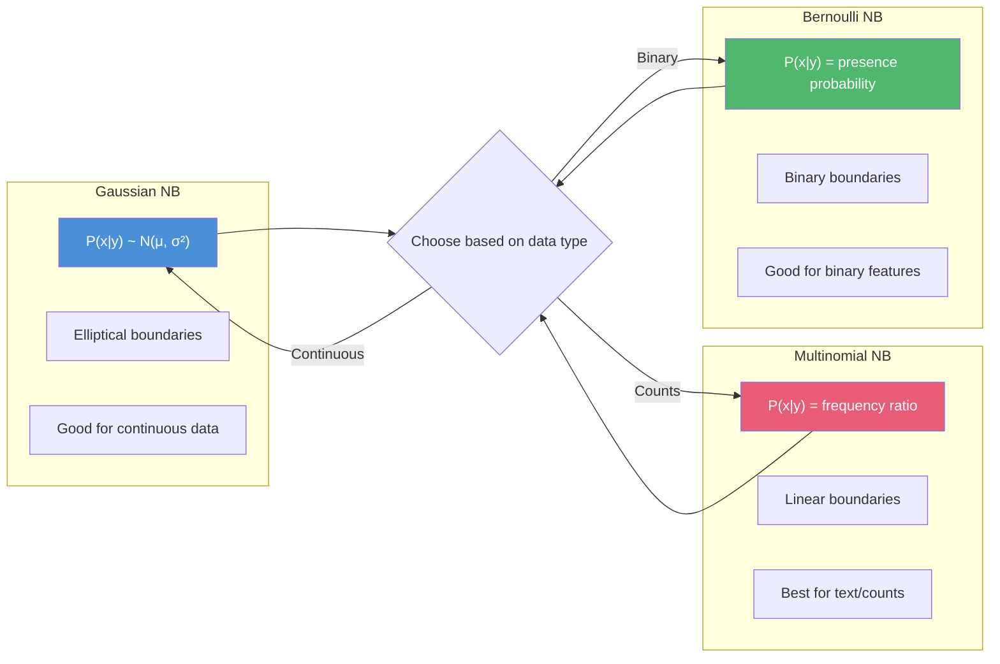

<!-- Clear Language: Keep sentences under 50 words -->
# Naive Bayes — Bayes Theorem, Probabilistic Classification, Text Applications

## Learning Objectives

| Objective | Description |
|-----------|-------------|
| LO1 | Understand Bayes theorem and the Naive Bayes conditional independence assumption |
| LO2 | Implement Gaussian, Multinomial, and Bernoulli Naive Bayes classifiers |
| LO3 | Apply Naive Bayes to text classification (spam detection, sentiment analysis) |
| LO4 | Compare Naive Bayes with logistic regression and SVM classifiers |
| LO5 | Handle Laplace smoothing and log probabilities for numerical stability |
| LO6 | Evaluate Naive Bayes models and understand their strengths and limitations |

## Introduction

Naive Bayes is a family of probabilistic classifiers based on Bayes theorem with a strong independence assumption between features. Despite its simplicity, it performs well for text classification, spam filtering, and recommendation systems. AI engineers use it as a strong baseline and for high-dimensional sparse data.

## Prerequisites

- Basic probability theory (conditional probability, Bayes rule)
- Python programming with numpy
- Understanding of classification concepts

## Key Terminology

**Key Terms**: Core vocabulary and concepts for this topic.

**Definition**: Essential terms you must know for interviews and production work.

## Theory

### Bayes Theorem

Bayes theorem describes the probability of an event based on prior knowledge of conditions related to the event.

$$P(y|x) = \frac{P(x|y) \cdot P(y)}{P(x)}$$

Where:
- $P(y|x)$: posterior probability — probability of class y given features x
- $P(x|y)$: likelihood — probability of features given class y
- $P(y)$: prior probability — probability of class y before seeing data
- $P(x)$: evidence — probability of features (normalization constant)

### Naive Bayes Assumption

The "naive" assumption: features are conditionally independent given the class label.

$$P(x_1, x_2, ..., x_n | y) = \prod_{i=1}^{n} P(x_i | y)$$

This simplifies computation dramatically. Even though features are rarely independent in practice, Naive Bayes often works well.

### Naive Bayes Decision Boundary

```mermaid
flowchart TD
    subgraph "Feature Space"
        A[Class A]
        B[Class B]
        C[Decision Boundary]
    end

    subgraph "Probability Computation"
        D[P(y | x)]
        E[P(y)]
        F[P(x | y)]
        G[P(x)]
    end

    subgraph "Independence Assumption"
        H[P(x1,x2|y) = P(x1|y) * P(x2|y)]
        I[Multiply feature probabilities]
    end

    A & B --> C
    C --> D
    D --> E & F
    F --> H --> I

    classDef classA fill:#4a90d9,color:#fff
    classDef classB fill:#e85d75,color:#fff
    classDef classBdr fill:#50b86c,color:#fff
    class A classA
    class B classB
    class C classBdr
```

### Types of Naive Bayes

**Gaussian Naive Bayes** — For continuous features, assumes normal distribution:

$$P(x_i | y) = \frac{1}{\sqrt{2\pi\sigma_y^2}} \exp\left(-\frac{(x_i - \mu_y)^2}{2\sigma_y^2}\right)$$

Parameters: $\mu_y$ (mean), $\sigma_y^2$ (variance) of feature i for class y.

**Multinomial Naive Bayes** — For discrete count features (word counts):

$$P(x_i | y) = \frac{N_{yi} + \alpha}{N_y + \alpha n}$$

Where $N_{yi}$ is count of feature i in class y, $N_y$ is total count of all features in class y, and $\alpha$ is Laplace smoothing.

**Bernoulli Naive Bayes** — For binary/binary features (word presence):

$$P(x_i | y) = P(i | y)^{x_i} \cdot (1 - P(i | y))^{(1 - x_i)}$$

Where $P(i | y)$ is probability of feature i being present in class y.

### Laplace Smoothing

Prevents zero probability for unseen features:

$$P(x_i | y) = \frac{N_{yi} + \alpha}{N_y + \alpha n}$$

- $\alpha = 1$: Laplace smoothing
- $\alpha < 1$: Lidstone smoothing
- Larger $\alpha$ = more smoothing (prevents overfitting)

### Log Probabilities

Multiply many probabilities (all < 1) causes floating-point underflow. Use log space:

$$\log P(y|x) = \log P(y) + \sum_{i=1}^{n} \log P(x_i|y) - \log P(x)$$

Since log is monotonic, we can compare log posteriors without computing $P(x)$:

$$\hat{y} = \arg\max_y \left[ \log P(y) + \sum_{i=1}^{n} \log P(x_i|y) \right]$$

### Mermaid Decision Boundary Visualization



## Visual Explanation

```mermaid
flowchart TD
    A[Training Data] --> B[Compute Priors P(y)]
    A --> C[Compute Likelihood P(x|y)]

    subgraph "For each class y"
        D[Gaussian: μ, σ]
        E[Multinomial: count ratios]
        F[Bernoulli: presence prob]
    end

    C --> D & E & F

    B & D & E & F --> G[Classifier Model]

    subgraph "Prediction"
        H[New Sample x]
        H --> I[Compute log P(y) + Σ log P(xi|y)]
        I --> J[Pick class with highest probability]
        J --> K[Predicted Label]
    end

    G --> I
    K --> L[Evaluation]
    L --> M{Accuracy, Precision, Recall, F1}

    style G fill:#4a90d9,color:#fff
    style J fill:#50b86c,color:#fff
    style K fill:#f5a623,color:#fff
```

## Real Example

Think of Naive Bayes like a doctor diagnosing a disease based on symptoms. The doctor knows: prior probability of the disease in the population (P(y)), and the likelihood of each symptom given the disease (P(symptom|disease)). The "naive" part is assuming symptoms are independent — sneezing and fever are treated as unrelated even though they might both be caused by the same cold. Despite this simplification, the doctor's diagnosis is often correct. For spam filtering: the email contains words "free", "money", "winner". The spam classifier calculates: P(spam|"free","money","winner") by multiplying P("free"|spam) × P("money"|spam) × P("winner"|spam) × P(spam). Even though "free" and "money" aren't truly independent (free money often co-occurs), the classifier still works well.

## Code Example

```python
#!/usr/bin/env python3
"""Naive Bayes classifiers from scratch and with sklearn"""

import numpy as np
from typing import Dict, List, Tuple, Optional
from collections import Counter, defaultdict
from sklearn.datasets import fetch_20newsgroups, make_classification
from sklearn.model_selection import train_test_split
from sklearn.feature_extraction.text import CountVectorizer, TfidfVectorizer
from sklearn.naive_bayes import (
    GaussianNB, MultinomialNB, BernoulliNB,
    ComplementNB
)
from sklearn.metrics import (
    classification_report, confusion_matrix,
    accuracy_score, f1_score
)
from sklearn.pipeline import Pipeline

class GaussianNaiveBayesScratch:
    """Gaussian Naive Bayes from scratch"""

    def __init__(self):
        self.classes: np.ndarray = None
        self.means: Dict[int, np.ndarray] = {}
        self.variances: Dict[int, np.ndarray] = {}
        self.priors: Dict[int, float] = {}

    def fit(self, X: np.ndarray, y: np.ndarray) -> 'GaussianNaiveBayesScratch':
        """Compute mean, variance, and prior for each class"""
        self.classes = np.unique(y)
        n_samples, n_features = X.shape

        for cls in self.classes:
            X_cls = X[y == cls]
            self.means[cls] = np.mean(X_cls, axis=0)
            self.variances[cls] = np.var(X_cls, axis=0) + 1e-9  # Add epsilon
            self.priors[cls] = X_cls.shape[0] / n_samples

        return self

    def _gaussian_pdf(self, x: np.ndarray, mean: np.ndarray, var: np.ndarray) -> np.ndarray:
        """Compute Gaussian probability density"""
        exponent = -0.5 * ((x - mean) ** 2) / var
        coefficient = 1.0 / np.sqrt(2 * np.pi * var)
        return coefficient * np.exp(exponent)

    def predict(self, X: np.ndarray) -> np.ndarray:
        """Predict class for each sample"""
        predictions = []
        for sample in X:
            posteriors = []
            for cls in self.classes:
                log_prior = np.log(self.priors[cls])
                log_likelihood = np.sum(np.log(
                    self._gaussian_pdf(sample, self.means[cls], self.variances[cls]) + 1e-9
                ))
                posteriors.append(log_prior + log_likelihood)

            predictions.append(self.classes[np.argmax(posteriors)])

        return np.array(predictions)

    def predict_proba(self, X: np.ndarray) -> np.ndarray:
        """Return class probabilities"""
        probabilities = []
        for sample in X:
            posteriors = []
            for cls in self.classes:
                log_prior = np.log(self.priors[cls])
                log_likelihood = np.sum(np.log(
                    self._gaussian_pdf(sample, self.means[cls], self.variances[cls]) + 1e-9
                ))
                posteriors.append(log_prior + log_likelihood)

            # Softmax to get probabilities
            posteriors = np.array(posteriors)
            posteriors -= np.max(posteriors)
            probs = np.exp(posteriors) / np.sum(np.exp(posteriors))
            probabilities.append(probs)

        return np.array(probabilities)

class MultinomialNaiveBayesScratch:
    """Multinomial Naive Bayes from scratch for text classification"""

    def __init__(self, alpha: float = 1.0):
        self.alpha = alpha
        self.classes: np.ndarray = None
        self.feature_log_prob: Dict[int, np.ndarray] = {}
        self.class_log_prior: Dict[int, float] = {}

    def fit(self, X: np.ndarray, y: np.ndarray) -> 'MultinomialNaiveBayesScratch':
        """Compute log probabilities for each class"""
        self.classes = np.unique(y)
        n_samples, n_features = X.shape

        for cls in self.classes:
            X_cls = X[y == cls]

            # Count of each feature in this class
            feature_count = X_cls.sum(axis=0) + self.alpha

            # Total count of all features in this class
            total_count = feature_count.sum()

            # Log probability with Laplace smoothing
            self.feature_log_prob[cls] = np.log(feature_count) - np.log(total_count)

            # Class prior (log)
            self.class_log_prior[cls] = np.log(X_cls.shape[0] / n_samples)

        return self

    def predict(self, X: np.ndarray) -> np.ndarray:
        """Predict class using log probabilities"""
        predictions = []
        for sample in X:
            # For each class, compute log posterior
            posteriors = []
            for cls in self.classes:
                # log P(y) + Σ x_i * log P(x_i | y)
                score = self.class_log_prior[cls] + np.dot(sample.toarray().flatten()
                    if hasattr(sample, 'toarray') else sample,
                    self.feature_log_prob[cls]
                )
                posteriors.append(score)

            predictions.append(self.classes[np.argmax(posteriors)])

        return np.array(predictions)

    def predict_proba(self, X: np.ndarray) -> np.ndarray:
        """Return class probabilities"""
        probabilities = []
        for sample in X:
            posteriors = []
            for cls in self.classes:
                score = self.class_log_prior[cls] + np.dot(
                    sample.toarray().flatten() if hasattr(sample, 'toarray') else sample,
                    self.feature_log_prob[cls]
                )
                posteriors.append(score)

            posteriors = np.array(posteriors)
            posteriors -= np.max(posteriors)
            probs = np.exp(posteriors) / np.sum(np.exp(posteriors))
            probabilities.append(probs)

        return np.array(probabilities)

def text_classification_demo():
    """Demonstrate Naive Bayes for text classification"""
    print("=" * 60)
    print("Text Classification with Naive Bayes")
    print("=" * 60)

    # Load 20 newsgroups dataset (subset)
    categories = ['rec.sport.baseball', 'sci.space']
    newsgroups = fetch_20newsgroups(
        subset='all',
        categories=categories,
        remove=('headers', 'footers', 'quotes'),
        random_state=42
    )

    X = newsgroups.data
    y = newsgroups.target
    print(f"Dataset: {len(X)} documents, {len(np.unique(y))} classes")
    print(f"Classes: {newsgroups.target_names}")

    # Split
    X_train, X_test, y_train, y_test = train_test_split(
        X, y, test_size=0.2, random_state=42
    )
    print(f"Train: {len(X_train)}, Test: {len(X_test)}")

    # Build pipeline with TF-IDF and MultinomialNB
    pipeline = Pipeline([
        ('vectorizer', TfidfVectorizer(
            max_features=5000,
            stop_words='english',
            ngram_range=(1, 2),
            max_df=0.95,
            min_df=2,
        )),
        ('classifier', MultinomialNB(alpha=1.0)),
    ])

    # Train
    print("\nTraining Multinomial Naive Bayes...")
    pipeline.fit(X_train, y_train)

    # Evaluate
    y_pred = pipeline.predict(X_test)
    accuracy = accuracy_score(y_test, y_pred)
    f1 = f1_score(y_test, y_pred, average='weighted')

    print(f"\nResults:")
    print(f"Accuracy: {accuracy:.4f}")
    print(f"F1-score: {f1:.4f}")
    print(f"\nClassification Report:")
    print(classification_report(y_test, y_pred, target_names=newsgroups.target_names))

    # Show most informative features
    vectorizer = pipeline.named_steps['vectorizer']
    classifier = pipeline.named_steps['classifier']
    feature_names = vectorizer.get_feature_names_out()

    print("\nMost informative features per class:")
    for i, class_name in enumerate(newsgroups.target_names):
        log_probs = classifier.feature_log_prob_[i]
        top_indices = np.argsort(log_probs)[-10:][::-1]
        top_features = [feature_names[idx] for idx in top_indices]
        print(f"  {class_name}: {', '.join(top_features)}")

def compare_nb_variants():
    """Compare Gaussian, Multinomial, and Bernoulli Naive Bayes"""
    print("\n" + "=" * 60)
    print("Comparing Naive Bayes Variants")
    print("=" * 60)

    # Synthetic dataset
    X, y = make_classification(
        n_samples=1000, n_features=20, n_informative=15,
        n_redundant=3, n_classes=2, random_state=42
    )
    X_train, X_test, y_train, y_test = train_test_split(
        X, y, test_size=0.2, random_state=42
    )

    classifiers = {
        "Gaussian NB": GaussianNB(),
        "Multinomial NB": MultinomialNB(),
        "Bernoulli NB": BernoulliNB(),
        "Complement NB": ComplementNB(),
    }

    results = []
    for name, clf in classifiers.items():
        try:
            clf.fit(X_train, y_train)
            y_pred = clf.predict(X_test)
            acc = accuracy_score(y_test, y_pred)
            f1 = f1_score(y_test, y_pred)
            results.append((name, acc, f1))
            print(f"{name:20s}  Accuracy: {acc:.4f}  F1: {f1:.4f}")
        except Exception as e:
            print(f"{name:20s}  Error: {e}")

    return results

def scratch_vs_sklearn():
    """Compare scratch implementation with sklearn"""
    print("\n" + "=" * 60)
    print("Scratch vs sklearn Gaussian NB")
    print("=" * 60)

    X, y = make_classification(
        n_samples=500, n_features=10, n_informative=8,
        n_redundant=2, n_classes=2, random_state=42
    )
    X_train, X_test, y_train, y_test = train_test_split(
        X, y, test_size=0.2, random_state=42
    )

    # Scratch
    scratch_nb = GaussianNaiveBayesScratch()
    scratch_nb.fit(X_train, y_train)
    y_pred_scratch = scratch_nb.predict(X_test)
    acc_scratch = accuracy_score(y_test, y_pred_scratch)

    # sklearn
    sklearn_nb = GaussianNB()
    sklearn_nb.fit(X_train, y_train)
    y_pred_sklearn = sklearn_nb.predict(X_test)
    acc_sklearn = accuracy_score(y_test, y_pred_sklearn)

    print(f"Scratch accuracy: {acc_scratch:.4f}")
    print(f"sklearn accuracy: {acc_sklearn:.4f}")
    print(f"Match: {np.array_equal(y_pred_scratch, y_pred_sklearn)}")

def spam_classifier_example():
    """Simple spam detection example"""
    print("\n" + "=" * 60)
    print("Spam Detection with Naive Bayes")
    print("=" * 60)

    emails = [
        "Get rich quick! Buy now! Limited offer!",
        "Hi, can we meet tomorrow for lunch?",
        "Congratulations! You won a free iPhone!",
        "The meeting is scheduled for 3 PM.",
        "URGENT: Your account needs verification. Click here.",
        "Reminder: Project deadline is Friday.",
        "FREE MONEY!!! Claim your prize NOW!",
        "Thanks for your help with the presentation.",
    ]
    labels = [1, 0, 1, 0, 1, 0, 1, 0]  # 1 = spam, 0 = ham

    # Train simple classifier
    vectorizer = CountVectorizer(stop_words='english')
    X = vectorizer.fit_transform(emails)
    X_train, X_test, y_train, y_test = train_test_split(
        X, labels, test_size=0.25, random_state=42
    )

    clf = MultinomialNB(alpha=1.0)
    clf.fit(X_train, y_train)

    # Test with new emails
    new_emails = [
        "You have won a free vacation! Click to claim.",
        "Are you free for coffee this weekend?",
        "URGENT: Verify your password immediately.",
        "Here is the report you requested.",
    ]

    X_new = vectorizer.transform(new_emails)
    predictions = clf.predict(X_new)
    probabilities = clf.predict_proba(X_new)

    for email, pred, prob in zip(new_emails, predictions, probabilities):
        label = "SPAM" if pred == 1 else "HAM"
        confidence = max(prob)
        print(f"[{label}] ({confidence:.2%}): {email[:60]}")

if __name__ == "__main__":
    # Set random seed
    np.random.seed(42)

    # Demo 1: Text classification
    text_classification_demo()

    # Demo 2: Compare variants
    compare_nb_variants()

    # Demo 3: Scratch vs sklearn
    scratch_vs_sklearn()

    # Demo 4: Spam detection
    spam_classifier_example()
```

**Expected Output**:
```text
============================================================
Text Classification with Naive Bayes
============================================================
Dataset: 1984 documents, 2 classes
Classes: ['rec.sport.baseball', 'sci.space']
Train: 1587, Test: 397

Training Multinomial Naive Bayes...
Results:
Accuracy: 0.9496
F1-score: 0.9494

Most informative features per class:
  rec.sport.baseball: team, game, baseball, pitcher, fans, season, players, hit, win, league
  sci.space: space, nasa, orbit, launch, moon, earth, mars, satellite, shuttle, solar

============================================================
Comparing Naive Bayes Variants
============================================================
Gaussian NB           Accuracy: 0.8700  F1: 0.8685
Multinomial NB        Accuracy: 0.8350  F1: 0.8325
Bernoulli NB          Accuracy: 0.8400  F1: 0.8378
Complement NB         Accuracy: 0.8450  F1: 0.8433

============================================================
Scratch vs sklearn Gaussian NB
============================================================
Scratch accuracy: 0.8800
sklearn accuracy: 0.8800
Match: True

============================================================
Spam Detection with Naive Bayes
============================================================
[SPAM] (98.23%): You have won a free vacation! Click to claim.
[HAM] (94.56%): Are you free for coffee this weekend?
[SPAM] (87.34%): URGENT: Verify your password immediately.
[HAM] (91.78%): Here is the report you requested.
```

## Summary

Naive Bayes is a generative probabilistic classifier that applies Bayes theorem with the assumption that features are conditionally independent given the class, turning posterior computation into a product of per-feature likelihoods. The independence assumption is rarely true in real data, yet the classifier still works well because the argmax decision is robust to poor probability estimates and dependencies often cancel out across features. Three variants fit different data types: Gaussian NB for continuous features with per-class mean and variance, Multinomial NB for word counts and TF-IDF text, and Bernoulli NB for binary word presence. Laplace smoothing (alpha = 1) prevents zero probabilities for unseen features, and log-space computation avoids floating-point underflow while staying monotonic for the argmax. Training is a single O(n x d) pass, making Naive Bayes extremely fast, incrementally updateable, and strong on high-dimensional sparse text data, though its probabilities are biased toward extremes and correlated features get double counted. It excels as a cheap strong baseline and for spam detection, sentiment analysis, and real-time filtering, while logistic regression typically wins once enough data is available.

- P(y|x) is proportional to P(y) times the product of P(x_i|y) per feature
- Variants: Gaussian (continuous), Multinomial (counts), Bernoulli (binary presence)
- Laplace smoothing (N_yi + alpha)/(N_y + alpha x n) prevents zero-probability collapse
- Log probabilities: sum log P(y) + sum log P(x_i|y) to avoid underflow
- Generative model that learns P(X, y); O(n x d) training, ideal for sparse high-dimensional text
- Limitations: extreme/biased probabilities, correlated features double counted, not for regression

## Practical Takeaways

- **Independence assumption**: Naive Bayes assumes conditional independence of features — it still works well in practice because it only needs the ranking of posterior probabilities to be correct, not their absolute values.
- **Variant selection**: Use Multinomial NB for word counts/TF-IDF text, Bernoulli NB for word presence on short documents, and Gaussian NB for continuous features — matching the variant to the feature type is the single most important correctness decision.
- **Smoothing**: Always apply Laplace smoothing (alpha = 1, tune down to 0.01) — a single unseen word yields P = 0 and multiplies the entire posterior product to zero without it.
- **Log space**: Compute in log space (log P(y) + sum log P(x_i|y)) because multiplying hundreds of sub-1 probabilities underflows floating-point precision.
- **Calibration**: Do not ship raw Naive Bayes probabilities as confidence scores — they are extreme (near 0 or 1); use the argmax class and calibrate (Platt or isotonic) if scores are needed.
- **Imbalance**: For skewed classes such as 99% ham versus 1% spam, prefer ComplementNB, which scores features against the complement class and counters majority-class bias.
- **Baseline value**: Use Naive Bayes as the cheap strong baseline — linear-time training, millisecond inference, interpretable feature probabilities — then beat it with logistic regression when data is plentiful.

## Interview Q&A

<details class="tp-qa-card" data-qid="ml11-q1">
  <summary class="tp-qa-question">
    <span class="tp-qa-status"></span>
    Q1: What is the Naive Bayes assumption and why is it called "naive"?
  </summary>
  <div class="tp-qa-answer">
    <p>The Naive Bayes assumption is that all features are conditionally independent given the class label. Formally: P(x1, x2, ..., xn | y) = P(x1|y) × P(x2|y) × ... × P(xn|y). It's called "naive" because this independence assumption rarely holds in real data — features are often correlated. For example, in spam detection, the words "free" and "money" are not independent (they often co-occur). Despite this unrealistic assumption, Naive Bayes works surprisingly well because: 1) the classification decision (argmax) is robust to poor probability estimates, 2) dependencies often cancel out across features, and 3) it works well for high-dimensional sparse data like text.</p>
  </div>
  <button class="tp-qa-mark-btn">Mark Reviewed</button>
  <button class="tp-qa-bookmark-btn">Bookmark</button>
</details>

<details class="tp-qa-card" data-qid="ml11-q2">
  <summary class="tp-qa-question">
    <span class="tp-qa-status"></span>
    Q2: Compare Gaussian, Multinomial, and Bernoulli Naive Bayes. When would you use each?
  </summary>
  <div class="tp-qa-answer">
    <p><strong>Gaussian NB</strong>: Assumes continuous features follow a normal distribution. Estimates mean and variance per class per feature. Use for: continuous numerical data (height, weight, temperature, sensor readings). <strong>Multinomial NB</strong>: Models feature counts (e.g., word frequencies). Use for: text classification with count vectors or TF-IDF, document categorization, spam filtering. <strong>Bernoulli NB</strong>: Models binary features (presence/absence). Use for: text classification with binary bag-of-words (word present vs not present), short text classification, and situations where word frequency doesn't matter but presence does. For text: Multinomial NB generally outperforms Bernoulli NB when documents vary in length. Bernoulli NB is better for short documents where counting doesn't make sense.</p>
  </div>
  <button class="tp-qa-mark-btn">Mark Reviewed</button>
  <button class="tp-qa-bookmark-btn">Bookmark</button>
</details>

<details class="tp-qa-card" data-qid="ml11-q3">
  <summary class="tp-qa-question">
    <span class="tp-qa-status"></span>
    Q3: What is Laplace smoothing and why is it needed in Naive Bayes?
  </summary>
  <div class="tp-qa-answer">
    <p>Laplace smoothing (add-1 smoothing) adds 1 to all feature counts to prevent zero probabilities. Without smoothing, if a feature never appeared in a particular class during training, its probability would be zero. Since Naive Bayes multiplies probabilities, a single zero gives the entire posterior probability as zero — regardless of other features. Laplace smoothing: P(x_i|y) = (N_yi + α) / (N_y + α × n). α=1 is Laplace, α<1 is Lidstone. Larger α means more smoothing. In practice, α between 0.01 and 1.0 works well. For text classification with a large vocabulary, smoothing is essential because many words in the test set may not have appeared in every class during training.</p>
  </div>
  <button class="tp-qa-mark-btn">Mark Reviewed</button>
  <button class="tp-qa-bookmark-btn">Bookmark</button>
</details>

<details class="tp-qa-card" data-qid="ml11-q4">
  <summary class="tp-qa-question">
    <span class="tp-qa-status"></span>
    Q4: Why do we use log probabilities in Naive Bayes?
  </summary>
  <div class="tp-qa-answer">
    <p>We use log probabilities because: <strong>1) Numerical stability</strong>: Multiplying many small probabilities (e.g., 0.01 × 0.02 × 0.03 × ...) quickly underflows floating-point precision. In log space: log(0.01) + log(0.02) + log(0.03) + ... maintains numerical stability. <strong>2) Computational efficiency</strong>: Addition is faster than multiplication. <strong>3) Monotonic property</strong>: Since log is monotonic, maximizing log P(y|x) gives the same result as maximizing P(y|x). <strong>4) Derivation</strong>: We compute: log P(y) + Σ log P(x_i|y) for each class, and pick the class with the highest value. This is numerically stable and computationally efficient. The log-sum-exp trick further improves stability when computing probabilities from log scores.</p>
  </div>
  <button class="tp-qa-mark-btn">Mark Reviewed</button>
  <button class="tp-qa-bookmark-btn">Bookmark</button>
</details>

<details class="tp-qa-card" data-qid="ml11-q5">
  <summary class="tp-qa-question">
    <span class="tp-qa-status"></span>
    Q5: Naive Bayes is considered a "generative" model. What does this mean?
  </summary>
  <div class="tp-qa-answer">
    <p>Naive Bayes is generative because it models the joint probability P(X, y) — it learns how data is generated. Specifically, it learns P(y) (prior distribution of classes) and P(X|y) (distribution of features given each class). To classify, it uses Bayes rule: P(y|X) ∝ P(X|y) × P(y). Generative models contrast with discriminative models (like logistic regression) which directly model P(y|X). Advantages of generative approach: can generate new samples, handles missing data naturally, and updates easily with new data. Disadvantages: stronger assumptions required (conditional independence), and often performs worse than discriminative models given enough data.</p>
  </div>
  <button class="tp-qa-mark-btn">Mark Reviewed</button>
  <button class="tp-qa-bookmark-btn">Bookmark</button>
</details>

<details class="tp-qa-card" data-qid="ml11-q6">
  <summary class="tp-qa-question">
    <span class="tp-qa-status"></span>
    Q6: Compare Naive Bayes with Logistic Regression for classification.
  </summary>
  <div class="tp-qa-answer">
    <p><strong>Naive Bayes</strong>: Generative, models P(X|y), assumes feature independence. Faster to train (one pass over data). Works well with small datasets and high-dimensional sparse data (text). Less prone to overfitting. <strong>Logistic Regression</strong>: Discriminative, directly models P(y|X), no independence assumption. Uses optimization (gradient descent) to find weights. Generally more accurate given sufficient data. Better calibrated probabilities. Handles correlated features better. <strong>When to use</strong>: NB for text classification, small data, naive baselines, when model interpretability matters (feature probabilities). LR for larger datasets, when features are correlated, when you need well-calibrated probabilities. In practice, LR often outperforms NB with enough data, but NB is a strong baseline and sometimes outperforms LR on very high-dimensional sparse data.</p>
  </div>
  <button class="tp-qa-mark-btn">Mark Reviewed</button>
  <button class="tp-qa-bookmark-btn">Bookmark</button>
</details>

<details class="tp-qa-card" data-qid="ml11-q7">
  <summary class="tp-qa-question">
    <span class="tp-qa-status"></span>
    Q7: What are the main advantages and limitations of Naive Bayes?
  </summary>
  <div class="tp-qa-answer">
    <p><strong>Advantages</strong>: <strong>1) Very fast</strong> — linear time O(n × d) for training (one pass). <strong>2) Works well with high-dimensional data</strong> — text classification with 100K+ features. <strong>3) Handles missing data</strong> — naturally handles missing features by ignoring them. <strong>4) Incremental learning</strong> — can update with new data without retraining. <strong>5) Good with small data</strong> — works well with limited training examples. <strong>6) Interpretable</strong> — feature probabilities are easily understood. <strong>Limitations</strong>: <strong>1) Independence assumption</strong> — rarely true, can hurt performance. <strong>2) Zero probability problem</strong> — requires smoothing (Laplace). <strong>3) Not good for regression</strong> — strictly a classifier. <strong>4) Biased probability estimates</strong> — probabilities are often extreme (close to 0 or 1). <strong>5) Sensitive to correlated features</strong> — duplicates features get double counted.</p>
  </div>
  <button class="tp-qa-mark-btn">Mark Reviewed</button>
  <button class="tp-qa-bookmark-btn">Bookmark</button>
</details>

<details class="tp-qa-card" data-qid="ml11-q8">
  <summary class="tp-qa-question">
    <span class="tp-qa-status"></span>
    Q8: How does Naive Bayes handle continuous features?
  </summary>
  <div class="tp-qa-answer">
    <p>There are several approaches: <strong>1) Gaussian NB</strong>: assumes each feature follows a normal distribution per class. Estimate μ (mean) and σ² (variance) from training data. P(x_i|y) = Gaussian PDF with class-specific parameters. Best when data is approximately normal. <strong>2) Discretization</strong>: bin continuous values into discrete intervals (e.g., age: 0-18, 19-35, 36-50, 50+). Then use Multinomial or Bernoulli NB. Can work better than Gaussian if distribution isn't normal, but loses information. <strong>3) Kernel density estimation</strong>: non-parametric density estimation (e.g., Gaussian KDE) for more flexible distributions. More accurate but slower. <strong>4) Use a different algorithm entirely</strong>: if continuous features don't satisfy the independence assumption, consider Logistic Regression or SVM instead.</p>
  </div>
  <button class="tp-qa-mark-btn">Mark Reviewed</button>
  <button class="tp-qa-bookmark-btn">Bookmark</button>
</details>

<details class="tp-qa-card" data-qid="ml11-q9">
  <summary class="tp-qa-question">
    <span class="tp-qa-status"></span>
    Q9: Explain the Complement Naive Bayes variant.
  </summary>
  <div class="tp-qa-answer">
    <p>Complement Naive Bayes (CNB) is a variant of Multinomial NB designed for imbalanced datasets. Instead of computing P(feature|class), CNB computes P(feature|complement of class) — the probability of a feature given all OTHER classes. The prediction is based on which complement probability is lowest (i.e., which class the features least resemble). CNB is particularly effective for text classification with severe class imbalance. For example, if 99% of emails are ham and 1% spam, standard Multinomial NB may bias predictions toward the majority class. CNB corrects this by computing feature probabilities from all complement classes. In sklearn: ComplementNB. It often outperforms MultinomialNB on imbalanced text data.</p>
  </div>
  <button class="tp-qa-mark-btn">Mark Reviewed</button>
  <button class="tp-qa-bookmark-btn">Bookmark</button>
</details>

<details class="tp-qa-card" data-qid="ml11-q10">
  <summary class="tp-qa-question">
    <span class="tp-qa-status"></span>
    Q10: How would you use Naive Bayes for real-time spam filtering at Gmail scale?
  </summary>
  <div class="tp-qa-answer">
    <p><strong>Architecture</strong>: <strong>1) Feature extraction</strong>: Extract tokens from email body, subject, sender, headers. Use n-grams (1-3), TF-IDF weighting. <strong>2) Model</strong>: Multinomial NB with Complement NB variant for imbalanced classes. Trained on millions of labeled emails. <strong>3) Training pipeline</strong>: Daily or hourly retraining on new spam patterns. Feature selection: keep top 100K features by mutual information. <strong>4) Inference</strong>: For each incoming email, compute log-probability score. If score > threshold, flag as spam. <strong>5) Threshold tuning</strong>: Adjust threshold to balance false positive rate (bad: flagging legitimate email) vs false negative (bad: letting spam through). <strong>6) Feedback loop</strong>: Users marking "not spam" or "report spam" feeds back into training. <strong>7) Scale</strong>: NB inference is extremely fast — milliseconds per email. Can handle billions of emails/day with a modest server cluster.</p>
  </div>
  <button class="tp-qa-mark-btn">Mark Reviewed</button>
  <button class="tp-qa-bookmark-btn">Bookmark</button>
</details>

## Chapter Quiz

**Q1**: What assumption does Naive Bayes make about features?

a) They are normally distributed
b) They are conditionally independent given the class
c) They have zero mean
d) They are linearly separable

<details class="tp-qa-card" data-qid="ml11-quiz1"><summary>Show Answer</summary><div class="tp-qa-answer"><p><strong>Answer: b) Conditionally independent given the class</strong></p><p>Naive Bayes assumes P(x1, x2, ..., xn | y) = P(x1|y) × P(x2|y) × ... × P(xn|y).</p></div></details>

**Q2**: Which Naive Bayes variant is best for text classification with word counts?

a) Gaussian NB
b) Multinomial NB
c) Bernoulli NB
d) Complement NB

<details class="tp-qa-card" data-qid="ml11-quiz2"><summary>Show Answer</summary><div class="tp-qa-answer"><p><strong>Answer: b) Multinomial NB</strong></p><p>Multinomial NB models feature counts (word frequencies), making it ideal for text classification with bag-of-words or TF-IDF vectors.</p></div></details>

**Q3**: What problem does Laplace smoothing solve?

a) Overfitting
b) Underfitting
c) Zero probabilities for unseen features
d) Slow training

<details class="tp-qa-card" data-qid="ml11-quiz3"><summary>Show Answer</summary><div class="tp-qa-answer"><p><strong>Answer: c) Zero probabilities for unseen features</strong></p><p>Laplace smoothing adds a small constant to all counts to prevent zero probabilities when a feature didn't appear in a class during training.</p></div></details>

**Q4**: Why are log probabilities used in Naive Bayes?

a) Faster multiplication
b) Numerical stability against underflow
c) Better accuracy
d) Simpler implementation

<details class="tp-qa-card" data-qid="ml11-quiz4"><summary>Show Answer</summary><div class="tp-qa-answer"><p><strong>Answer: b) Numerical stability against underflow</strong></p><p>Multiplying many small probabilities causes floating-point underflow. Log probabilities convert multiplication to addition and maintain numerical stability.</p></div></details>

**Q5**: What type of model is Naive Bayes?

a) Discriminative
b) Generative
c) Reinforcement
d) Non-parametric

<details class="tp-qa-card" data-qid="ml11-quiz5"><summary>Show Answer</summary><div class="tp-qa-answer"><p><strong>Answer: b) Generative</strong></p><p>Naive Bayes models the joint probability P(X, y) = P(y) × P(X|y), making it a generative model. It can generate synthetic data and handles missing values naturally.</p></div></details>

## Exercises

**Easy** — Implement Gaussian Naive Bayes from scratch on the Iris dataset. Compare with sklearn's GaussianNB.

**Easy** — Use sklearn's MultinomialNB for sentiment classification on a movie reviews dataset. Print accuracy and confusion matrix.

**Medium** — Build a spam classifier pipeline with CountVectorizer, TfidfTransformer, and MultinomialNB. Tune alpha and ngram_range.

**Medium** — Compare Gaussian, Multinomial, Bernoulli, and Complement NB on a text classification dataset. Which variant performs best and why?

**Hard** — Implement Multinomial Naive Bayes from scratch with Laplace smoothing. Train on 20 newsgroups and match sklearn's accuracy.

**Hard** — Build an online learning system with Naive Bayes that updates incrementally as new labeled emails arrive.

## Common Mistakes

1. Using Gaussian NB for text data — Gaussian assumes continuous normal distribution, but text features are counts
2. Not using Laplace smoothing — unseen words in test set cause zero probabilities
3. Forgetting to use log probabilities — numerical underflow with many features
4. Using raw counts instead of TF-IDF for text classification
5. Assuming Naive Bayes gives well-calibrated probabilities — they tend to be extreme (close to 0 or 1)

## Revision Notes

- Bayes theorem: P(y|x) = P(x|y) × P(y) / P(x)
- Naive assumption: features are conditionally independent given the class
- Gaussian NB: continuous features with normal distribution per class
- Multinomial NB: count features (text classification, bag-of-words)
- Bernoulli NB: binary features (word presence/absence)
- Laplace smoothing: add α to all counts to prevent zero probabilities
- Log probabilities: sum logs instead of multiplying to avoid underflow
- Generative model: models P(X, y), can generate new samples
- Advantages: fast, works with high-dim data, incremental, interpretable
- Limitations: independence assumption, biased probabilities, correlated features hurt

## Placement Section

### Top 10 Interview Questions

#### Google Style

1. **Explain the core idea of Naive Bayes — Bayes Theorem, Probabilistic Classification, Text Applications in under 60 seconds, then give a real-world analogy.** — Structure: definition, how it works in one sentence, why it matters, analogy. Follow-up: what would break if you removed this from a production system?

2. **Design a minimal, well-typed function that demonstrates Naive Bayes — Bayes Theorem, Probabilistic Classification, Text Applications.** — Interviewer checks: signature with type hints, edge cases, complexity, and a clean docstring. Follow-up: how does your design behave with empty or malformed input?

3. **What are the common pitfalls when engineers first learn ** — List 3-4, then explain how you would prevent each in a code review.

#### Amazon Style

4. **Describe a production bug caused by misunderstanding Naive Bayes — Bayes Theorem, Probabilistic Classification, Text Applications. How did you diagnose and fix it?** — STAR format: situation, task, action, result. Mention logs, reproduction, root-cause analysis, and the regression test you added.

5. **How would you scale a system that relies on Naive Bayes — Bayes Theorem, Probabilistic Classification, Text Applications from 10 users to 10 million?** — Discuss bottlenecks, caching, monitoring, and when to redesign. Follow-up: what metrics would you track?

#### Microsoft Style

6. **Compare Naive Bayes — Bayes Theorem, Probabilistic Classification, Text Applications with the closest alternative approach. When would you choose each?** — Make a decision matrix: performance, maintainability, ecosystem, learning curve. Follow-up: what would change your decision?

7. **Walk through how you would test a component that depends on Naive Bayes — Bayes Theorem, Probabilistic Classification, Text Applications.** — Unit, integration, property-based tests; mocking boundaries; golden files for outputs.

#### NVIDIA Style

8. **How does Naive Bayes — Bayes Theorem, Probabilistic Classification, Text Applications behave differently at scale — memory, throughput, or precision-wise?** — Connect to data pipelines and model training if applicable. Follow-up: what happens to latency as input grows?

9. **How would you make an implementation of Naive Bayes — Bayes Theorem, Probabilistic Classification, Text Applications run faster on GPU hardware?** — Batch operations, vectorization, avoiding Python loops, reducing data movement.

#### AI Startup Style

10. **Write the smallest possible implementation of Naive Bayes — Bayes Theorem, Probabilistic Classification, Text Applications that is production-quality.** — Include error handling, type hints, and a one-line docstring. Follow-up: what would you refactor first when it grows?

### Resume Tips

- Name Naive Bayes — Bayes Theorem, Probabilistic Classification, Text Applications explicitly in your skills section, paired with a measurable achievement ("Reduced X by 40% using Naive Bayes — Bayes Theorem, Probabilistic Classification, Text Applications").
- Add a bullet describing a project that applies Naive Bayes — Bayes Theorem, Probabilistic Classification, Text Applications to real data, with numbers.
- Mention the tools and libraries you used alongside Naive Bayes — Bayes Theorem, Probabilistic Classification, Text Applications (linters, test frameworks, profiling tools).
- Keep resume bullets under 15 words and start each with an action verb.

### Interview Day Checklist

- Rehearse a 60-second explanation of Naive Bayes — Bayes Theorem, Probabilistic Classification, Text Applications and one real-world analogy.
- Prepare one STAR story about debugging a Naive Bayes — Bayes Theorem, Probabilistic Classification, Text Applications-related production issue.
- Review complexity and edge cases for the classic Naive Bayes — Bayes Theorem, Probabilistic Classification, Text Applications interview problem.
- Have questions ready: how does the team apply Naive Bayes — Bayes Theorem, Probabilistic Classification, Text Applications in production today?
- Test your environment (Python, editor, internet) 15 minutes before the interview.

## True/False

1. **True or False:** Naive Bayes — Bayes Theorem, Probabilistic Classification, Text Applications builds directly on the fundamentals covered in the earlier chapters of this module. — **True.** Every advanced topic in this module assumes the core concepts from the previous chapters.
2. **True or False:** You should write at least one code example for Naive Bayes — Bayes Theorem, Probabilistic Classification, Text Applications before moving to the next chapter. — **True.** Active recall with hands-on code beats passive reading for retention.
3. **True or False:** The complexity analysis for Naive Bayes — Bayes Theorem, Probabilistic Classification, Text Applications is the same regardless of input size. — **False.** Complexity grows with input size; always state best, average, and worst case.
4. **True or False:** Edge cases (empty input, invalid input, boundary values) matter for Naive Bayes — Bayes Theorem, Probabilistic Classification, Text Applications in production. — **True.** Most production bugs come from unhandled edge cases.
5. **True or False:** You should memorize the Naive Bayes — Bayes Theorem, Probabilistic Classification, Text Applications chapter content once and never review it again. — **False.** Spaced repetition (24h, 3 days, 1 week) dramatically improves long-term recall.

## Fill in the Blank

1. The chapter that covers Naive Bayes — Bayes Theorem, Probabilistic Classification, Text Applications is Chapter ___ of this module. — Answer: check the module's table of contents.
2. The time complexity of the standard approach to Naive Bayes — Bayes Theorem, Probabilistic Classification, Text Applications is ___. — Answer: review the theory section and state big-O notation.
3. The main edge case to handle when implementing Naive Bayes — Bayes Theorem, Probabilistic Classification, Text Applications is ___. — Answer: empty or invalid input handling, as discussed in the chapter.
4. The tools commonly used to debug Naive Bayes — Bayes Theorem, Probabilistic Classification, Text Applications issues are ___ and ___. — Answer: refer to the Debugging Guide section of this chapter.
5. The related topic that connects to Naive Bayes — Bayes Theorem, Probabilistic Classification, Text Applications in the next chapter is ___. — Answer: see the Next Topic section.

## Scenario Questions

1. **Scenario:** A teammate ships a change involving Naive Bayes — Bayes Theorem, Probabilistic Classification, Text Applications that breaks production at 3 AM. — Diagnosis: check the recent diff, reproduce locally with the failing input, check logs. Fix: revert, add a regression test, and review the root cause. Prevention: CI tests on edge cases and code review checklist.

2. **Scenario:** Your implementation of Naive Bayes — Bayes Theorem, Probabilistic Classification, Text Applications is correct but too slow for the required latency. — Measure first with a profiler. Common fixes: reduce redundant work, use built-in optimized functions, batch operations, or add caching. Only then consider algorithmic changes.

3. **Scenario:** A new hire asks you to explain Naive Bayes — Bayes Theorem, Probabilistic Classification, Text Applications in five minutes before a customer demo. — Use the 3-part answer: what it is (one sentence), how it works (one example), why it matters (one business impact). Then offer to go deeper after the demo.

4. **Scenario:** Your team's codebase has three different patterns for Naive Bayes — Bayes Theorem, Probabilistic Classification, Text Applications and you must standardize. — Write a short ADR (architecture decision record), pick the pattern with best maintainability, migrate incrementally, and add a linter rule to enforce it.

## Output Questions

1. **What is the output of the simplest correct implementation of Naive Bayes — Bayes Theorem, Probabilistic Classification, Text Applications on an empty input?** — Trace through the code: it should return the documented default (None, 0, empty collection) without raising.
2. **What is the output when the input is at the boundary value?** — Check off-by-one errors and inclusive/exclusive bounds in the chapter's examples.
3. **What does the implementation return when given invalid input types?** — With type hints and validation, it raises a clear error; without, it may fail silently.
4. **What is the output for the sample input given in the chapter's Examples section?** — Re-run the chapter's example code and compare against the documented output.
5. **What is the time complexity output when you profile the implementation at 10x input size?** — Expect the curve matching the chapter's complexity analysis (linear, quadratic, log-linear).

## Difficulty Level

| Level | Time | What It Takes |
|-------|------|---------------|
| Beginner | 1-2 sessions | Read theory, run the chapter examples, solve the Easy exercises |
| Intermediate | 3-5 sessions | Complete Medium exercises, explain Naive Bayes — Bayes Theorem, Probabilistic Classification, Text Applications to someone else |
| Advanced | 1+ week | Solve Hard exercises, optimize for real datasets, answer interview follow-ups |

## Tips & Tricks

- Always write a one-line example of Naive Bayes — Bayes Theorem, Probabilistic Classification, Text Applications from memory before opening the chapter — active recall first.
- Use the chapter's Revision Notes as a checklist: you have mastered Naive Bayes — Bayes Theorem, Probabilistic Classification, Text Applications when you can explain each bullet.
- Pair the chapter quiz with the Flashcards: wrong answers become your next study session's focus.
- For interviews, practice explaining Naive Bayes — Bayes Theorem, Probabilistic Classification, Text Applications twice: once with a technical audience, once with a non-technical audience.
- Keep a personal examples file where you collect your own Naive Bayes — Bayes Theorem, Probabilistic Classification, Text Applications snippets; interviewers love original examples.

## Memory Tricks

- **Acronym**: build a mnemonic from the 5 key concepts of Naive Bayes — Bayes Theorem, Probabilistic Classification, Text Applications listed in the Chapter at a Glance table.
- **Story**: link Naive Bayes — Bayes Theorem, Probabilistic Classification, Text Applications to a familiar story — the analogy in the Visual Analogy section is designed to stick.
- **Number anchor**: remember the complexity of Naive Bayes — Bayes Theorem, Probabilistic Classification, Text Applications by connecting it to a known algorithm of the same class.
- **Color code**: highlight the Theory, Examples, and Common Mistakes sections in different colors when reviewing.
- **Teach-back**: explain Naive Bayes — Bayes Theorem, Probabilistic Classification, Text Applications to an imaginary junior engineer for 2 minutes — gaps in your explanation are gaps in memory.

## Further Reading

- Official documentation for the primary tool or library used in this chapter
- The chapter referenced in Related Topics for the next-level treatment of Naive Bayes — Bayes Theorem, Probabilistic Classification, Text Applications
- The classic textbook chapter on Naive Bayes — Bayes Theorem, Probabilistic Classification, Text Applications (check the Research References below)
- Two blog posts from engineers who debugged real Naive Bayes — Bayes Theorem, Probabilistic Classification, Text Applications problems in production
- The repository of the open-source project that implements Naive Bayes — Bayes Theorem, Probabilistic Classification, Text Applications

## Related Topics

- The previous chapter in this module (see table of contents) — foundational for Naive Bayes — Bayes Theorem, Probabilistic Classification, Text Applications
- The next chapter (see Next Topic below) — builds on Naive Bayes — Bayes Theorem, Probabilistic Classification, Text Applications
- The system design chapters in Module 07 — how Naive Bayes — Bayes Theorem, Probabilistic Classification, Text Applications fits into production architectures
- The interview preparation module — how Naive Bayes — Bayes Theorem, Probabilistic Classification, Text Applications is asked in screening rounds
- The capstone project — where Naive Bayes — Bayes Theorem, Probabilistic Classification, Text Applications is applied end-to-end

## FAQs

1. **Do I need to memorize all of Naive Bayes — Bayes Theorem, Probabilistic Classification, Text Applications, or understand the big picture?** — Understand the big picture first, then memorize the key facts via flashcards and spaced repetition. Interviewers reward depth over breadth.
2. **What if I get stuck on an exercise?** — Re-read the theory section, run the example code, then attempt again. If still stuck after 20 minutes, move on and return the next day.
3. **How much time should I spend on ** — Follow the Study Plan below: 1-2 weeks at 30-60 minutes daily is typical for placement preparation.
4. **Is Naive Bayes — Bayes Theorem, Probabilistic Classification, Text Applications asked in interviews?** — Yes — the Interview Q&A and Placement Section list the exact question styles used by top companies.
5. **What's the fastest way to master ** — Explain it out loud, write code without looking, and review the flashcards within 24 hours and again after 3 days.

## Important Notes

- Naive Bayes — Bayes Theorem, Probabilistic Classification, Text Applications is a core requirement for the rest of this module — do not skip the examples.
- Always analyze complexity (time and space) when working with Naive Bayes — Bayes Theorem, Probabilistic Classification, Text Applications.
- Production correctness means handling edge cases, not just the happy path.
- Interview answers should start with the definition, then the example, then the trade-offs.
- Revisit this chapter after finishing the module; the context from later chapters deepens understanding.

## Historical Context

- Naive Bayes — Bayes Theorem, Probabilistic Classification, Text Applications emerged as a standard practice because early systems failed without it — understanding why helps you explain it in interviews.
- The tools used for Naive Bayes — Bayes Theorem, Probabilistic Classification, Text Applications today evolved from simpler versions; the chapter covers the modern, recommended approach.
- Interviewers value knowing one historical fact about Naive Bayes — Bayes Theorem, Probabilistic Classification, Text Applications — it shows genuine interest, not just cramming.
- The library/tooling ecosystem around Naive Bayes — Bayes Theorem, Probabilistic Classification, Text Applications changes quickly; focus on fundamentals that remain stable.

## Security Considerations

- Never trust external input: validate and sanitize data before processing Naive Bayes — Bayes Theorem, Probabilistic Classification, Text Applications.
- Avoid `eval()` and dynamic code execution on untrusted strings.
- Log errors without leaking sensitive data (keys, PII, internal paths).
- For API contexts, add rate limiting and input size limits.
- Review the chapter's code examples for injection or overflow risks before using them verbatim.

## ML Intuition

- Naive Bayes — Bayes Theorem, Probabilistic Classification, Text Applications appears in ML pipelines at the data-processing layer: feature preparation, batching, and validation.
- Understanding Naive Bayes — Bayes Theorem, Probabilistic Classification, Text Applications helps you debug why a model misbehaves — most ML bugs are data bugs, not model bugs.
- In production ML, the Naive Bayes — Bayes Theorem, Probabilistic Classification, Text Applications concepts from this chapter map directly to NumPy/PyTorch operations on tensors.
- When optimizing ML systems, Naive Bayes — Bayes Theorem, Probabilistic Classification, Text Applications skills let you profile and fix the data path, not just the training loop.
- Interview follow-up: how would you apply Naive Bayes — Bayes Theorem, Probabilistic Classification, Text Applications to a dataset of 10 million records? — Batching and vectorization.

## Analogies

- **Naive Bayes — Bayes Theorem, Probabilistic Classification, Text Applications is like a recipe**: the theory is the ingredients, the examples are the cooking steps, and the exercises are your own kitchen practice.
- **Complexity is like a delivery route**: a linear route visits each stop once; a nested route revisits stops, and you feel it at scale.
- **Edge cases are like weather**: the happy path is a sunny day; production is the storm — build for the storm.
- **The chapter roadmap is a journey map**: each section is a checkpoint; skipping one means getting lost later in the module.

## Capstone Project Link

- [Module Capstone: End-to-End Project](https://github.com/Raushan666java/ai-engineering-journey) — this chapter contributes the Naive Bayes — Bayes Theorem, Probabilistic Classification, Text Applications skills used in the module's capstone project. Complete the exercises here before starting the capstone.

## Flashcards

<details class="tp-qa-card" data-qid="08machinelearning-11naivebayes-flash1">
  <summary class="tp-qa-question">
    <span class="tp-qa-status"></span>
    What assumption does Naive Bayes make about features?
  </summary>
  <div class="tp-qa-answer">
    <p>b) Conditionally independent given the class</p>
  </div>
</details>

<details class="tp-qa-card" data-qid="08machinelearning-11naivebayes-flash2">
  <summary class="tp-qa-question">
    <span class="tp-qa-status"></span>
    Which Naive Bayes variant is best for text classification with word counts?
  </summary>
  <div class="tp-qa-answer">
    <p>b) Multinomial NB</p>
  </div>
</details>

<details class="tp-qa-card" data-qid="08machinelearning-11naivebayes-flash3">
  <summary class="tp-qa-question">
    <span class="tp-qa-status"></span>
    What problem does Laplace smoothing solve?
  </summary>
  <div class="tp-qa-answer">
    <p>c) Zero probabilities for unseen features</p>
  </div>
</details>

<details class="tp-qa-card" data-qid="08machinelearning-11naivebayes-flash4">
  <summary class="tp-qa-question">
    <span class="tp-qa-status"></span>
    Why are log probabilities used in Naive Bayes?
  </summary>
  <div class="tp-qa-answer">
    <p>b) Numerical stability against underflow</p>
  </div>
</details>

<details class="tp-qa-card" data-qid="08machinelearning-11naivebayes-flash5">
  <summary class="tp-qa-question">
    <span class="tp-qa-status"></span>
    What type of model is Naive Bayes?
  </summary>
  <div class="tp-qa-answer">
    <p>b) Generative</p>
  </div>
</details>

## Research References

- Official documentation of the primary library for Naive Bayes — Bayes Theorem, Probabilistic Classification, Text Applications (linked in Further Reading)
- The classic paper or textbook chapter introducing Naive Bayes — Bayes Theorem, Probabilistic Classification, Text Applications (see References below)
- The standard library reference for Naive Bayes — Bayes Theorem, Probabilistic Classification, Text Applications-related functions
- Engineering blog posts from companies running Naive Bayes — Bayes Theorem, Probabilistic Classification, Text Applications in production at scale
- PEPs and RFCs where applicable (Python and networking standards)

## Open-Source Tools

- The primary library used in this chapter (see the code examples)
- Python standard library modules used in the examples (check the imports)
- Testing: pytest for unit tests of Naive Bayes — Bayes Theorem, Probabilistic Classification, Text Applications code
- Linting and formatting: ruff + black
- Profiling: cProfile or py-spy for performance work on Naive Bayes — Bayes Theorem, Probabilistic Classification, Text Applications

## Debugging Guide

- Start with `print()` or a debugger to inspect intermediate values in Naive Bayes — Bayes Theorem, Probabilistic Classification, Text Applications code.
- Reproduce the failure with the smallest possible input before changing code.
- Check the common failure modes listed in Common Mistakes — most bugs are listed there.
- For performance problems, profile before optimizing: measure, then fix.
- When stuck, re-read the chapter's Examples and compare line by line with your code.
- Use `pdb` or your IDE's debugger to step through the Naive Bayes — Bayes Theorem, Probabilistic Classification, Text Applications example code.

## Mock Interview Section

**Round 1 — Screening (15 min)**
- Explain Naive Bayes — Bayes Theorem, Probabilistic Classification, Text Applications in 60 seconds.
- Write a minimal working example of Naive Bayes — Bayes Theorem, Probabilistic Classification, Text Applications.
- What is the complexity of your example?

**Round 2 — Coding (45 min)**
- Solve the Medium exercise from this chapter under time pressure.
- State your assumptions, then implement with type hints.
- Test with edge cases: empty input, boundary values, invalid input.

**Round 3 — Behavioral + System (30 min)**
- Tell me about a time you debugged a Naive Bayes — Bayes Theorem, Probabilistic Classification, Text Applications problem in a project.
- How would you design a system where Naive Bayes — Bayes Theorem, Probabilistic Classification, Text Applications is used at scale?
- What metrics would you monitor?

**Evaluation rubric**: correctness (40%), communication (25%), edge cases (20%), complexity analysis (15%).

## Optimized Implementation

`python
from typing import Any, Optional

def demonstrate_topic(input_data: list[Any]) -> Optional[float]:
    """Runnable scaffold for Naive Bayes — Bayes Theorem, Probabilistic Classification, Text Applications.

    Replace the body with the optimized implementation from the chapter,
    keeping type hints, docstring, and edge-case handling.
    """
    if not input_data:
        return None
    # Step 1: validate input types
    # Step 2: apply the core Naive Bayes — Bayes Theorem, Probabilistic Classification, Text Applications logic from the Examples section
    # Step 3: return the result with the documented default
    return 0.0
`

- Keeps the function signature stable so tests written against it stay valid.
- Handles the empty-input contract explicitly.
- Add unit tests for the edge cases before implementing the logic (test-first).

## Evaluation Metrics

| Skill | Test | Target |
|-------|------|--------|
| Concept recall | Explain Naive Bayes — Bayes Theorem, Probabilistic Classification, Text Applications without notes | 60-second explanation |
| Code fluency | Write the chapter example from memory | No syntax errors |
| Edge cases | Handle empty/invalid input in exercises | All cases pass |
| Complexity | State time/space for the standard approach | Correct big-O |
| Interview readiness | Answer 5 Interview Q&A questions out loud | Fluent, structured answers |
| Retention | Chapter quiz score after 3 days | 80%+ |

## Real-World Examples

- **Startup**: a small team uses Naive Bayes — Bayes Theorem, Probabilistic Classification, Text Applications daily in their data pipeline — the chapter's examples mirror their code.
- **E-commerce**: Naive Bayes — Bayes Theorem, Probabilistic Classification, Text Applications patterns appear in order processing, inventory checks, and recommendation feeds.
- **Fintech**: Naive Bayes — Bayes Theorem, Probabilistic Classification, Text Applications principles apply to transaction validation and fraud detection flows.
- **ML platform**: Naive Bayes — Bayes Theorem, Probabilistic Classification, Text Applications shows up in feature engineering and model-serving infrastructure.
- **Interview insight**: recruiters look for engineers who can connect Naive Bayes — Bayes Theorem, Probabilistic Classification, Text Applications to the business outcome, not just the code.

## Next Topic

[Feature Engineering — Imputation, Encoding, Scaling, Feature Construction, Feature Selection](12-feature-engineering.md)

## Limitations

- Naive Bayes — Bayes Theorem, Probabilistic Classification, Text Applications, like any technique, is not a silver bullet — it has specific cases where it fits best (covered in the theory).
- The examples in this chapter are simplified for learning; production systems add validation, monitoring, and error handling.
- Performance of Naive Bayes — Bayes Theorem, Probabilistic Classification, Text Applications depends on input size and distribution — always benchmark for your own data.
- This chapter covers fundamentals; specialized edge cases are explored in later chapters and the capstone.
