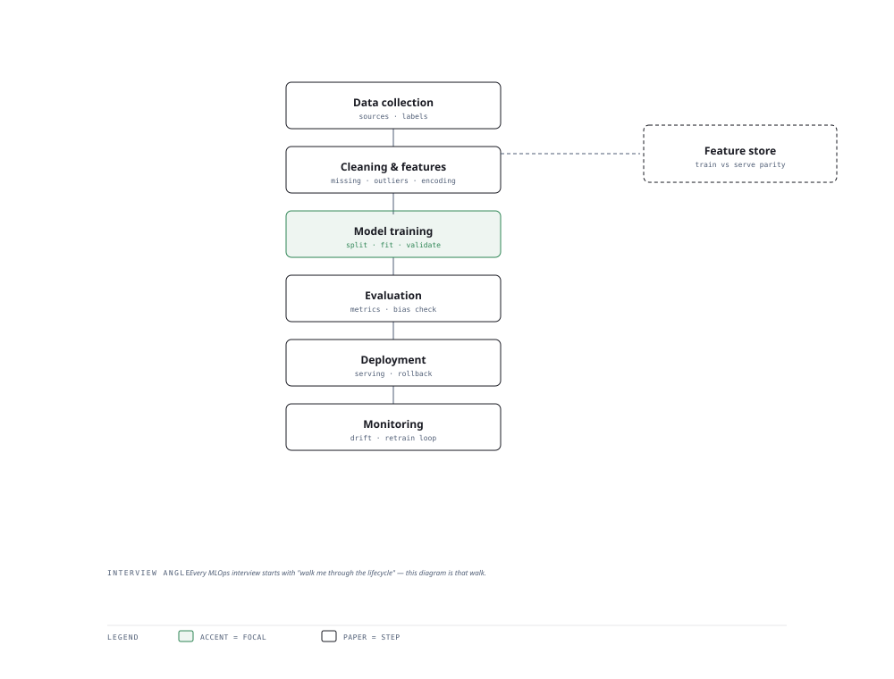

# Visual Notes — The ML Lifecycle

> One diagram, the full picture. This page is meant to be glanced at before reading the chapters, and again before interviews.

# What the diagram shows

1. **Data trunk** — Collection and cleaning are 80% of real effort; garbage in beats even the best model.
1. **Modelling branch** — Feature engineering, then training a model, then honest evaluation — splitting train/val/test from the start.
1. **Operations branch** — Deploy, serve and monitor; drift or bad metrics loop you straight back to data.

# Why this matters for placement

- Interviewers weigh "how do you evaluate" and "how do you know it works" as much as the model itself.
- Explaining the loop shows you understand production ML, not just sklearn notebooks.

# Quick revision

- Bias–variance: underfit = high bias; overfit = high variance; regularise instead of more data.
- Precision vs recall: precision = what you returned is right; recall = you returned what was right.
- Cross-validation beats a single holdout for small data.
- Feature engineering: scaling, encoding, handling missing values, leakage detection.
- Metrics must match the business: ROC AUC is not accuracy in a class-imbalanced world.

# Related chapters

- [ML fundamentals](01-ml-fundamentals.md)
- [Model evaluation](09-model-evaluation.md)
- [Feature engineering](12-feature-engineering.md)
- [Unsupervised learning](07-unsupervised-learning.md)

---

**One-line answer for interviews:** *"ML is a loop: collect → clean → engineer → train → evaluate → ship → monitor, and feedback restarts it."*
