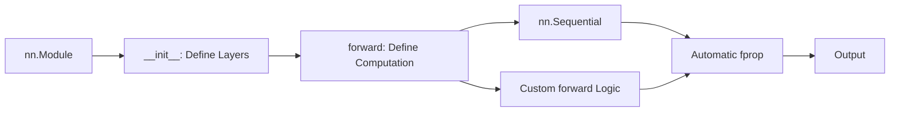

<!-- Clear Language: Keep sentences under 50 words -->
# PyTorch nn.Module — nn.Module, nn.Sequential, Custom Layers, Weight Init

## Learning Objectives

| Objective | Description |
|-----------|-------------|
| LO1 | Build neural networks using nn.Module and nn.Sequential |
| LO2 | Implement custom layers by subclassing nn.Module |
| LO3 | Apply weight initialization strategies for different activations |
| LO4 | Understand parameter management, hooks, and module registration |
| LO5 | Use nn.ModuleList and nn.ModuleDict for dynamic architectures |
| LO6 | Implement forward hooks and backward hooks for debugging |

## Introduction

Deep learning powers modern AI breakthroughs. PyTorch is the framework of choice for researchers and production engineers alike. This module covers neural networks, CNNs, RNNs, and deployment best practices.

## Prerequisites

- Basic programming knowledge
- Understanding of data structures

## Key Terminology

**Key Terms**: Core vocabulary and concepts for this topic.

**Definition**: Essential terms you must know for interviews and production work.

## Theory

Understanding pytorch nn module is fundamental for AI engineers. This section covers the core concepts, underlying principles, and theoretical framework that govern how pytorch nn module works in practice.

## Chapter at a Glance

| Section | Topic | Key Concept |
|---------|-------|-------------|
| 3.1 | nn.Module Basics | Subclass, __init__, forward, parameters, train/eval |
| 3.2 | nn.Sequential | Sequential containers, dict vs list, add_module |
| 3.3 | Custom Layers | Parameter registration, weight init, forward logic |
| 3.4 | Weight Initialization | apply(), reset_parameters(), custom init |
| 3.5 | Parameter Management | named_parameters(), buffers, modules(), state_dict |
| 3.6 | Hooks | forward hooks, backward hooks, feature extraction |

## Chapter Roadmap



## 3.1 nn.Module Basics

All neural network components in PyTorch inherit from nn.Module.

```python
import torch
import torch.nn as nn
import torch.nn.functional as F

class SimpleMLP(nn.Module):
    def __init__(self, input_dim: int, hidden_dim: int, output_dim: int):
        super().__init__()
        self.fc1 = nn.Linear(input_dim, hidden_dim)
        self.fc2 = nn.Linear(hidden_dim, hidden_dim)
        self.fc3 = nn.Linear(hidden_dim, output_dim)
        self.dropout = nn.Dropout(0.2)

    def forward(self, x: torch.Tensor) -> torch.Tensor:
        x = F.relu(self.fc1(x))
        x = self.dropout(x)
        x = F.relu(self.fc2(x))
        x = self.fc3(x)
        return x

model = SimpleMLP(10, 64, 2)
print(f"Parameters: {sum(p.numel() for p in model.parameters()):,}")
x = torch.randn(5, 10)
output = model(x)
print(f"Output shape: {output.shape}")
model.train()
print(f"Training mode: {model.training}")
model.eval()
print(f"Evaluation mode: {model.training}")
```

**nn.Module provides**: Automatic parameter tracking, train()/eval() mode, to(device), state_dict(), register_buffer().

---

## 3.2 nn.Sequential

Sequential is a container for layers called in order.

```python
model = nn.Sequential(
    nn.Linear(10, 64), nn.ReLU(), nn.Dropout(0.2),
    nn.Linear(64, 32), nn.ReLU(), nn.Linear(32, 2),
)
x = torch.randn(5, 10)
print(f"Sequential output: {model(x).shape}")

## Named sequential
model2 = nn.Sequential(OrderedDict([
    ("fc1", nn.Linear(10, 64)),
    ("relu", nn.ReLU()),
    ("fc2", nn.Linear(64, 2)),
]))
model2.add_module("dropout", nn.Dropout(0.1))
```

**When to use Sequential**: Simple feed-forward without branching or skip connections.

---

## 3.3 Custom Layers

```python
class CustomLinear(nn.Module):
    def __init__(self, in_features: int, out_features: int, bias: bool = True):
        super().__init__()
        self.weight = nn.Parameter(torch.randn(out_features, in_features) * 0.01)
        if bias:
            self.bias = nn.Parameter(torch.zeros(out_features))
        else:
            self.register_parameter("bias", None)

    def forward(self, x: torch.Tensor) -> torch.Tensor:
        output = x @ self.weight.T
        if self.bias is not None:
            output += self.bias
        return output

class ResidualBlock(nn.Module):
    def __init__(self, dim: int):
        super().__init__()
        self.net = nn.Sequential(
            nn.Linear(dim, dim), nn.BatchNorm1d(dim), nn.ReLU(),
            nn.Linear(dim, dim), nn.BatchNorm1d(dim),
        )

    def forward(self, x: torch.Tensor) -> torch.Tensor:
        return F.relu(self.net(x) + x)

custom = CustomLinear(10, 20)
block = ResidualBlock(64)
x = torch.randn(5, 64)
print(f"Residual output: {block(x).shape}")
```

---

## 3.4 Weight Initialization

```python
def init_weights(m: nn.Module):
    if isinstance(m, nn.Linear):
        nn.init.kaiming_normal_(m.weight, mode="fan_in", nonlinearity="relu")
        nn.init.zeros_(m.bias)

model = nn.Sequential(nn.Linear(100, 200), nn.ReLU(), nn.Linear(200, 10))
model.apply(init_weights)

## Various init schemes
layer = nn.Linear(100, 100)
nn.init.xavier_uniform_(layer.weight)
nn.init.kaiming_normal_(layer.weight, mode="fan_out")
nn.init.orthogonal_(layer.weight)
nn.init.sparse_(layer.weight, sparsity=0.9, std=0.01)
print(f"Init schemes tested on Linear(100,100)")
```

---

## 3.5 Parameter Management

```python
model = SimpleMLP(10, 64, 2)
for name, param in model.named_parameters():
    print(f"{name}: {param.shape}, grad={param.requires_grad}")
for name, module in model.named_modules():
    print(f"Module: {name} -> {type(module).__name__}")

total = sum(p.numel() for p in model.parameters())
trainable = sum(p.numel() for p in model.parameters() if p.requires_grad)
print(f"Total: {total:,}, Trainable: {trainable:,}")

## Freeze layers
for param in model.fc1.parameters():
    param.requires_grad = False

## Buffers (non-trainable)
bn = nn.BatchNorm1d(10)
print(f"Buffers: {[n for n, _ in bn.named_buffers()]}")
```

---

## 3.6 Hooks

```python
model = SimpleMLP(10, 64, 2)
activations = {}

def get_activation(name):
    def hook(module, input, output):
        activations[name] = output.detach()
    return hook

model.fc1.register_forward_hook(get_activation("fc1"))
model.fc2.register_forward_hook(get_activation("fc2"))

x = torch.randn(5, 10)
output = model(x)
for name, act in activations.items():
    print(f"{name}: shape={act.shape}, mean={act.mean():.4f}")

## Backward hook
gradients = {}
def get_grad(name):
    def hook(module, grad_input, grad_output):
        gradients[name] = grad_output[0].detach()
    return hook
model.fc3.register_backward_hook(get_grad("fc3"))
y = torch.randn(5, 2)
F.mse_loss(model(x), y).backward()
```

---

## 3.7 Model Surgery and Dynamic Architectures

Sometimes we need to modify an existing model by swapping layers, adding branches, or composing sub-networks dynamically.

```python

## Replace last layer for transfer learning
model = SimpleMLP(10, 64, 2)
model.fc3 = nn.Linear(64, 10)  # Replace last layer
print(f"New output: {model(torch.randn(5, 10)).shape}")

## Add a new branch
class DualOutputMLP(nn.Module):
    def __init__(self, base: SimpleMLP, extra_dim: int):
        super().__init__()
        self.base = base
        self.extra_head = nn.Linear(64, extra_dim)

    def forward(self, x: torch.Tensor):
        x = F.relu(self.base.fc1(x))
        x = F.relu(self.base.fc2(x))
        main = self.base.fc3(x)
        extra = self.extra_head(x)
        return main, extra

base = SimpleMLP(10, 64, 2)
dual = DualOutputMLP(base, 5)
m, e = dual(torch.randn(5, 10))
print(f"Main: {m.shape}, Extra: {e.shape}")
```

**Use cases**: Multi-task learning, auxiliary loss computation, feature pyramid networks.

---

## TypeScript Parallel

```typescript
abstract class ModuleTS {
  protected params: Map<string, number[][]> = new Map();
  training = true;
  abstract forward(x: number[][]): number[][];
  train() { this.training = true; }
  eval() { this.training = false; }
}

class LinearTS extends ModuleTS {
  private w: number[][]; private b: number[];
  constructor(inF: number, outF: number) {
    super();
    const std = Math.sqrt(2 / inF);
    this.w = Array.from({length: outF}, () => Array.from({length: inF}, () => (Math.random()*2-1)*std));
    this.b = new Array(outF).fill(0);
  }
  forward(x: number[][]): number[][] {
    return x.map(row => this.w.map(w => w.reduce((s, wi, i) => s + wi*row[i], 0)));
  }
}

const seq = new LinearTS(10, 64);
const out = seq.forward(Array.from({length: 5}, () => Array.from({length: 10}, () => Math.random())));
console.log(`Output shape: [${out.length}, ${out[0].length}]`);
```

## Summary

- nn.Module is the base class for all PyTorch neural network components, providing parameter tracking, device management, and serialization
- nn.Sequential provides simple layer-by-layer composition for feed-forward architectures without branching
- Custom layers require subclassing nn.Module and registering parameters with nn.Parameter or nn.ParameterList for dynamic parameters
- He (Kaiming) initialization is best for ReLU activations; Xavier for tanh/sigmoid; Orthogonal for RNNs; LeCun for SELU
- model.apply() applies functions recursively to all submodules and is the standard way to initialize weights across a model
- named_parameters() and state_dict() provide complete access to all model parameters for saving, loading, and inspection
- Buffers (register_buffer) store non-trainable tensors like BatchNorm running mean/variance and are included in state_dict
- Freeze parameters by setting requires_grad = False; unfrozen layers are ignored by the optimizer when using filter()
- Forward hooks extract intermediate activations without modifying model code; backward hooks capture gradients
- Hooks are useful for debugging, feature extraction, gradient penalization, and visualization
- Model surgery (swapping branches, adding heads) enables transfer learning and multi-task architectures
- DistributedDataParallel wraps nn.Module for multi-GPU training with minimal code changes

## Practical Takeaways

| Scenario | Do This | Avoid This |
|----------|---------|------------|
| Simple linear stack | nn.Sequential | Custom Module (overkill) |
| Complex forward logic | Custom nn.Module | nn.Sequential with workarounds |
| Extract features | Forward hooks | Modifying model forward pass |
| Load pretrained weights | model.load_state_dict(torch.load(path)) | Direct weight assignment |
| Freeze backbone | Set requires_grad=False on backbone | Removing backbone parameters |
| Dynamic number of layers | nn.ModuleList | Python list (parameters not tracked) |
| Multi-GPU training | DistributedDataParallel | DataParallel (slower, GIL issues) |
| Weight initialization | model.apply(init_fn) | Manual per-layer loops |
| Scripting for production | torch.jit.script | Relying on full Python runtime |
| Deploy cross-platform | torch.onnx.export | Framework-specific format |

## Interview Q&A

<details class="tp-qa-card" data-qid="dl09-q1"><summary>Q1: What is the difference between nn.Module and nn.Sequential?</summary><div class="tp-qa-answer"><p>nn.Module is the base class for all neural network components. You subclass it to define custom architectures with arbitrary forward logic. nn.Sequential is a container that calls layers in order, suitable for simple feed-forward networks. Module gives full control (skip connections, multiple inputs/outputs); Sequential trades flexibility for conciseness.</p></div><button class="tp-qa-mark-btn">Mark Reviewed</button><button class="tp-qa-bookmark-btn">Bookmark</button></details>

<details class="tp-qa-card" data-qid="dl09-q2"><summary>Q2: How do you register a parameter in a custom nn.Module?</summary><div class="tp-qa-answer"><p>Assign a nn.Parameter to self as an attribute: self.weight = nn.Parameter(torch.randn(...)). PyTorch automatically detects nn.Parameter attributes and registers them. For non-trainable tensors, use self.register_buffer("name", tensor). For parameter groups not directly assignable, use self.register_parameter("name", param). All registered parameters appear in model.parameters() and model.named_parameters().</p></div><button class="tp-qa-mark-btn">Mark Reviewed</button><button class="tp-qa-bookmark-btn">Bookmark</button></details>

<details class="tp-qa-card" data-qid="dl09-q3"><summary>Q3: What is the purpose of model.apply()?</summary><div class="tp-qa-answer"><p>model.apply(fn) applies the function fn recursively to every submodule in the model. It's commonly used for weight initialization: model.apply(init_weights) where init_weights checks isinstance(m, nn.Linear) and applies the desired initialization. Also useful for: setting dropout rates, enabling/disabling batch norm tracking, or any module-level configuration that needs to be applied recursively.</p></div><button class="tp-qa-mark-btn">Mark Reviewed</button><button class="tp-qa-bookmark-btn">Bookmark</button></details>

<details class="tp-qa-card" data-qid="dl09-q4"><summary>Q4: How do you freeze specific layers in a pretrained model?</summary><div class="tp-qa-answer"><p>Iterate over the layer's parameters and set requires_grad = False: for param in model.layer.parameters(): param.requires_grad = False. Then pass only trainable parameters to the optimizer: optimizer = optim.SGD(filter(lambda p: p.requires_grad, model.parameters()), lr=0.001). Common use case: freeze a pretrained backbone and only train the classification head (transfer learning).</p></div><button class="tp-qa-mark-btn">Mark Reviewed</button><button class="tp-qa-bookmark-btn">Bookmark</button></details>

<details class="tp-qa-card" data-qid="dl09-q5"><summary>Q5: What are forward hooks and when would you use them?</summary><div class="tp-qa-answer"><p>Forward hooks are functions called during the forward pass of a module. They receive the module, input, and output. Uses: extracting intermediate features for visualization, debugging activation statistics, implementing custom regularization (e.g., activation penalization), feature extraction from pretrained models, and model surgery without modifying the original code. Register with module.register_forward_hook(hook_fn).</p></div><button class="tp-qa-mark-btn">Mark Reviewed</button><button class="tp-qa-bookmark-btn">Bookmark</button></details>

<details class="tp-qa-card" data-qid="dl09-q6"><summary>Q6: What is nn.ModuleList and how is it different from a Python list?</summary><div class="tp-qa-answer"><p>nn.ModuleList is a container that registers its contents as submodules. A plain Python list doesn't register modules, so their parameters won't be discovered by model.parameters(). Use ModuleList when you have a variable number of layers: self.layers = nn.ModuleList([nn.Linear(10,10) for _ in range(n)]). Access elements by index like a list. Similarly, nn.ModuleDict stores modules by name.</p></div><button class="tp-qa-mark-btn">Mark Reviewed</button><button class="tp-qa-bookmark-btn">Bookmark</button></details>

<details class="tp-qa-card" data-qid="dl09-q7"><summary>Q7: How do you save and load a PyTorch model?</summary><div class="tp-qa-answer"><p>Best practice: save only the state_dict (parameters and buffers): torch.save(model.state_dict(), "model.pth"). Load: model.load_state_dict(torch.load("model.pth"), strict=True). Save the full model (architecture + weights) with torch.save(model, "full.pth"). Load with model = torch.load("full.pth") but this requires the model class to be importable. Always use .pt or .pth extension.</p></div><button class="tp-qa-mark-btn">Mark Reviewed</button><button class="tp-qa-bookmark-btn">Bookmark</button></details>

<details class="tp-qa-card" data-qid="dl09-q8"><summary>Q8: What is the difference between model.eval() and torch.no_grad()?</summary><div class="tp-qa-answer"><p>model.eval() sets the model to evaluation mode: affects BatchNorm (uses running stats) and Dropout (disables). torch.no_grad() disables gradient computation globally. Use both for inference: model.eval() + torch.no_grad(). Use model.train() to re-enable training behavior. You can use no_grad without eval (e.g., for gradient computation in validation) and eval without no_grad (e.g., for computing gradients of eval metrics).</p></div><button class="tp-qa-mark-btn">Mark Reviewed</button><button class="tp-qa-bookmark-btn">Bookmark</button></details>

<details class="tp-qa-card" data-qid="dl09-q9"><summary>Q9: How do you handle multiple GPUs with nn.Module?</summary><div class="tp-qa-answer"><p>Use nn.DataParallel for simple multi-GPU: model = nn.DataParallel(model). This splits the batch across GPUs, runs the same model on each, and gathers outputs. For better performance, use DistributedDataParallel (DDP): model = DDP(model, device_ids=[local_rank]). DDP is faster (avoids GIL) and recommended for large-scale training. Use torch.nn.parallel.DistributedDataParallel with torch.distributed.launch.</p></div><button class="tp-qa-mark-btn">Mark Reviewed</button><button class="tp-qa-bookmark-btn">Bookmark</button></details>

<details class="tp-qa-card" data-qid="dl09-q10"><summary>Q10: What is torch.jit.script and torch.onnx.export used for?</summary><div class="tp-qa-answer"><p>torch.jit.script (TorchScript) compiles a PyTorch model into a serializable, optimizable representation that can run without Python dependency. torch.onnx.export exports to ONNX format for interoperability with other frameworks (TensorFlow, ONNX Runtime). Both are used for production deployment where you need: faster inference, mobile deployment, or integration with non-Python environments.</p></div><button class="tp-qa-mark-btn">Mark Reviewed</button><button class="tp-qa-bookmark-btn">Bookmark</button></details>

## Chapter Quiz

**Q1**: What is the base class for all PyTorch neural network components?

a) nn.Sequential
b) nn.Module
c) nn.Layer
d) nn.Network

<details class="tp-qa-card" data-qid="dl09-quiz1"><summary>Show Answer</summary><div class="tp-qa-answer"><p><strong>Answer: b) nn.Module</strong></p><p>All neural network components inherit from nn.Module.</p></div></details>

**Q2**: Which method applies a function recursively to all submodules?

a) model.forward()
b) model.apply()
c) model.run()
d) model.call()

<details class="tp-qa-card" data-qid="dl09-quiz2"><summary>Show Answer</summary><div class="tp-qa-answer"><p><strong>Answer: b) model.apply()</strong></p><p>model.apply(fn) applies fn to every submodule recursively.</p></div></details>

**Q3**: How do you register a non-trainable tensor in a module?

a) self.tensor = torch.zeros(10)
b) self.register_buffer("tensor", torch.zeros(10))
c) self.register_parameter("tensor", torch.zeros(10))
d) self.buffer = torch.zeros(10)

<details class="tp-qa-card" data-qid="dl09-quiz3"><summary>Show Answer</summary><div class="tp-qa-answer"><p><strong>Answer: b) self.register_buffer("tensor", torch.zeros(10))</strong></p><p>Buffers are non-trainable tensors tracked by the module.</p></div></details>

**Q4**: What happens when you use a plain Python list for layers instead of nn.ModuleList?

a) Same behavior
b) Layer parameters won't be registered
c) Error
d) Only first layer works

<details class="tp-qa-card" data-qid="dl09-quiz4"><summary>Show Answer</summary><div class="tp-qa-answer"><p><strong>Answer: b) Layer parameters won't be registered</strong></p><p>Python lists don't register submodules; ModuleList does.</p></div></details>

**Q5**: How do you freeze a layer's parameters?

a) layer.freeze()
b) param.requires_grad = False
c) del param
d) layer.trainable = False

<details class="tp-qa-card" data-qid="dl09-quiz5"><summary>Show Answer</summary><div class="tp-qa-answer"><p><strong>Answer: b) param.requires_grad = False</strong></p><p>Setting requires_grad=False prevents gradient computation and parameter updates.</p></div></details>

### Advanced: Custom Autograd Function

Sometimes you need a custom operation not covered by standard nn.Modules. Define a custom autograd Function:

```python
class ClampFunction(torch.autograd.Function):
    @staticmethod
    def forward(ctx, x, lo, hi):
        ctx.save_for_backward(x, torch.tensor([lo, hi]))
        return torch.clamp(x, lo, hi)

    @staticmethod
    def backward(ctx, grad_output):
        x, bounds = ctx.saved_tensors
        lo, hi = bounds[0].item(), bounds[1].item()
        grad_input = grad_output.clone()
        grad_input[x < lo] = 0
        grad_input[x > hi] = 0
        return grad_input, None, None
```

Use it: `output = ClampFunction.apply(x, -1.0, 1.0)`

## Exercises

**Easy** — Create a 3-layer MLP using nn.Sequential. Count the number of parameters.

**Easy** — Implement a custom Linear layer without using nn.Linear. Verify it produces the same output.

**Medium** — Build a ResidualBlock with skip connection. Test that the gradient flows through both paths.

**Hard** — Implement a FeatureExtractor using hooks that extracts activations from specified layers during forward pass.

**Hard** — Build a model with dynamic number of layers using nn.ModuleList. Experiment with different depths.

---

## Common Mistakes

1. Not understanding the fundamental concepts before applying them
2. Skipping edge cases in implementation
3. Not analyzing time/space complexity
4. Forgetting to handle null/empty inputs
5. Not practicing enough problems to build pattern recognition

## Revision Notes

- - Core principle: Understand the fundamental concepts thoroughly
- - Implementation pattern: Practice with real code examples
- - Complexity: Know the time and space complexity
- - Application: Know when to use this in production systems
- - Interview: Frequently asked in technical interviews
- - Edge cases: Consider common failure scenarios
- - Related concepts: Connect to broader system design

## Placement Section

### Top 10 Interview Questions

#### Google Style

1. **Explain the core idea of PyTorch nn.Module — nn.Module, nn.Sequential, Custom Layers, Weight Init in under 60 seconds, then give a real-world analogy.** — Structure: definition, how it works in one sentence, why it matters, analogy. Follow-up: what would break if you removed this from a production system?

2. **Design a minimal, well-typed function that demonstrates PyTorch nn.Module — nn.Module, nn.Sequential, Custom Layers, Weight Init.** — Interviewer checks: signature with type hints, edge cases, complexity, and a clean docstring. Follow-up: how does your design behave with empty or malformed input?

3. **What are the common pitfalls when engineers first learn ** — List 3-4, then explain how you would prevent each in a code review.

#### Amazon Style

4. **Describe a production bug caused by misunderstanding PyTorch nn.Module — nn.Module, nn.Sequential, Custom Layers, Weight Init. How did you diagnose and fix it?** — STAR format: situation, task, action, result. Mention logs, reproduction, root-cause analysis, and the regression test you added.

5. **How would you scale a system that relies on PyTorch nn.Module — nn.Module, nn.Sequential, Custom Layers, Weight Init from 10 users to 10 million?** — Discuss bottlenecks, caching, monitoring, and when to redesign. Follow-up: what metrics would you track?

#### Microsoft Style

6. **Compare PyTorch nn.Module — nn.Module, nn.Sequential, Custom Layers, Weight Init with the closest alternative approach. When would you choose each?** — Make a decision matrix: performance, maintainability, ecosystem, learning curve. Follow-up: what would change your decision?

7. **Walk through how you would test a component that depends on PyTorch nn.Module — nn.Module, nn.Sequential, Custom Layers, Weight Init.** — Unit, integration, property-based tests; mocking boundaries; golden files for outputs.

#### NVIDIA Style

8. **How does PyTorch nn.Module — nn.Module, nn.Sequential, Custom Layers, Weight Init behave differently at scale — memory, throughput, or precision-wise?** — Connect to data pipelines and model training if applicable. Follow-up: what happens to latency as input grows?

9. **How would you make an implementation of PyTorch nn.Module — nn.Module, nn.Sequential, Custom Layers, Weight Init run faster on GPU hardware?** — Batch operations, vectorization, avoiding Python loops, reducing data movement.

#### AI Startup Style

10. **Write the smallest possible implementation of PyTorch nn.Module — nn.Module, nn.Sequential, Custom Layers, Weight Init that is production-quality.** — Include error handling, type hints, and a one-line docstring. Follow-up: what would you refactor first when it grows?

### Resume Tips

- Name PyTorch nn.Module — nn.Module, nn.Sequential, Custom Layers, Weight Init explicitly in your skills section, paired with a measurable achievement ("Reduced X by 40% using PyTorch nn.Module — nn.Module, nn.Sequential, Custom Layers, Weight Init").
- Add a bullet describing a project that applies PyTorch nn.Module — nn.Module, nn.Sequential, Custom Layers, Weight Init to real data, with numbers.
- Mention the tools and libraries you used alongside PyTorch nn.Module — nn.Module, nn.Sequential, Custom Layers, Weight Init (linters, test frameworks, profiling tools).
- Keep resume bullets under 15 words and start each with an action verb.

### Interview Day Checklist

- Rehearse a 60-second explanation of PyTorch nn.Module — nn.Module, nn.Sequential, Custom Layers, Weight Init and one real-world analogy.
- Prepare one STAR story about debugging a PyTorch nn.Module — nn.Module, nn.Sequential, Custom Layers, Weight Init-related production issue.
- Review complexity and edge cases for the classic PyTorch nn.Module — nn.Module, nn.Sequential, Custom Layers, Weight Init interview problem.
- Have questions ready: how does the team apply PyTorch nn.Module — nn.Module, nn.Sequential, Custom Layers, Weight Init in production today?
- Test your environment (Python, editor, internet) 15 minutes before the interview.

## True/False

1. **True or False:** PyTorch nn.Module — nn.Module, nn.Sequential, Custom Layers, Weight Init builds directly on the fundamentals covered in the earlier chapters of this module. — **True.** Every advanced topic in this module assumes the core concepts from the previous chapters.
2. **True or False:** You should write at least one code example for PyTorch nn.Module — nn.Module, nn.Sequential, Custom Layers, Weight Init before moving to the next chapter. — **True.** Active recall with hands-on code beats passive reading for retention.
3. **True or False:** The complexity analysis for PyTorch nn.Module — nn.Module, nn.Sequential, Custom Layers, Weight Init is the same regardless of input size. — **False.** Complexity grows with input size; always state best, average, and worst case.
4. **True or False:** Edge cases (empty input, invalid input, boundary values) matter for PyTorch nn.Module — nn.Module, nn.Sequential, Custom Layers, Weight Init in production. — **True.** Most production bugs come from unhandled edge cases.
5. **True or False:** You should memorize the PyTorch nn.Module — nn.Module, nn.Sequential, Custom Layers, Weight Init chapter content once and never review it again. — **False.** Spaced repetition (24h, 3 days, 1 week) dramatically improves long-term recall.

## Fill in the Blank

1. The chapter that covers PyTorch nn.Module — nn.Module, nn.Sequential, Custom Layers, Weight Init is Chapter ___ of this module. — Answer: check the module's table of contents.
2. The time complexity of the standard approach to PyTorch nn.Module — nn.Module, nn.Sequential, Custom Layers, Weight Init is ___. — Answer: review the theory section and state big-O notation.
3. The main edge case to handle when implementing PyTorch nn.Module — nn.Module, nn.Sequential, Custom Layers, Weight Init is ___. — Answer: empty or invalid input handling, as discussed in the chapter.
4. The tools commonly used to debug PyTorch nn.Module — nn.Module, nn.Sequential, Custom Layers, Weight Init issues are ___ and ___. — Answer: refer to the Debugging Guide section of this chapter.
5. The related topic that connects to PyTorch nn.Module — nn.Module, nn.Sequential, Custom Layers, Weight Init in the next chapter is ___. — Answer: see the Next Topic section.

## Scenario Questions

1. **Scenario:** A teammate ships a change involving PyTorch nn.Module — nn.Module, nn.Sequential, Custom Layers, Weight Init that breaks production at 3 AM. — Diagnosis: check the recent diff, reproduce locally with the failing input, check logs. Fix: revert, add a regression test, and review the root cause. Prevention: CI tests on edge cases and code review checklist.

2. **Scenario:** Your implementation of PyTorch nn.Module — nn.Module, nn.Sequential, Custom Layers, Weight Init is correct but too slow for the required latency. — Measure first with a profiler. Common fixes: reduce redundant work, use built-in optimized functions, batch operations, or add caching. Only then consider algorithmic changes.

3. **Scenario:** A new hire asks you to explain PyTorch nn.Module — nn.Module, nn.Sequential, Custom Layers, Weight Init in five minutes before a customer demo. — Use the 3-part answer: what it is (one sentence), how it works (one example), why it matters (one business impact). Then offer to go deeper after the demo.

4. **Scenario:** Your team's codebase has three different patterns for PyTorch nn.Module — nn.Module, nn.Sequential, Custom Layers, Weight Init and you must standardize. — Write a short ADR (architecture decision record), pick the pattern with best maintainability, migrate incrementally, and add a linter rule to enforce it.

## Output Questions

1. **What is the output of the simplest correct implementation of PyTorch nn.Module — nn.Module, nn.Sequential, Custom Layers, Weight Init on an empty input?** — Trace through the code: it should return the documented default (None, 0, empty collection) without raising.
2. **What is the output when the input is at the boundary value?** — Check off-by-one errors and inclusive/exclusive bounds in the chapter's examples.
3. **What does the implementation return when given invalid input types?** — With type hints and validation, it raises a clear error; without, it may fail silently.
4. **What is the output for the sample input given in the chapter's Examples section?** — Re-run the chapter's example code and compare against the documented output.
5. **What is the time complexity output when you profile the implementation at 10x input size?** — Expect the curve matching the chapter's complexity analysis (linear, quadratic, log-linear).

## Difficulty Level

| Level | Time | What It Takes |
|-------|------|---------------|
| Beginner | 1-2 sessions | Read theory, run the chapter examples, solve the Easy exercises |
| Intermediate | 3-5 sessions | Complete Medium exercises, explain PyTorch nn.Module — nn.Module, nn.Sequential, Custom Layers, Weight Init to someone else |
| Advanced | 1+ week | Solve Hard exercises, optimize for real datasets, answer interview follow-ups |

## Tips & Tricks

- Always write a one-line example of PyTorch nn.Module — nn.Module, nn.Sequential, Custom Layers, Weight Init from memory before opening the chapter — active recall first.
- Use the chapter's Revision Notes as a checklist: you have mastered PyTorch nn.Module — nn.Module, nn.Sequential, Custom Layers, Weight Init when you can explain each bullet.
- Pair the chapter quiz with the Flashcards: wrong answers become your next study session's focus.
- For interviews, practice explaining PyTorch nn.Module — nn.Module, nn.Sequential, Custom Layers, Weight Init twice: once with a technical audience, once with a non-technical audience.
- Keep a personal examples file where you collect your own PyTorch nn.Module — nn.Module, nn.Sequential, Custom Layers, Weight Init snippets; interviewers love original examples.

## Memory Tricks

- **Acronym**: build a mnemonic from the 5 key concepts of PyTorch nn.Module — nn.Module, nn.Sequential, Custom Layers, Weight Init listed in the Chapter at a Glance table.
- **Story**: link PyTorch nn.Module — nn.Module, nn.Sequential, Custom Layers, Weight Init to a familiar story — the analogy in the Visual Analogy section is designed to stick.
- **Number anchor**: remember the complexity of PyTorch nn.Module — nn.Module, nn.Sequential, Custom Layers, Weight Init by connecting it to a known algorithm of the same class.
- **Color code**: highlight the Theory, Examples, and Common Mistakes sections in different colors when reviewing.
- **Teach-back**: explain PyTorch nn.Module — nn.Module, nn.Sequential, Custom Layers, Weight Init to an imaginary junior engineer for 2 minutes — gaps in your explanation are gaps in memory.

## Further Reading

- Official documentation for the primary tool or library used in this chapter
- The chapter referenced in Related Topics for the next-level treatment of PyTorch nn.Module — nn.Module, nn.Sequential, Custom Layers, Weight Init
- The classic textbook chapter on PyTorch nn.Module — nn.Module, nn.Sequential, Custom Layers, Weight Init (check the Research References below)
- Two blog posts from engineers who debugged real PyTorch nn.Module — nn.Module, nn.Sequential, Custom Layers, Weight Init problems in production
- The repository of the open-source project that implements PyTorch nn.Module — nn.Module, nn.Sequential, Custom Layers, Weight Init

## Related Topics

- The previous chapter in this module (see table of contents) — foundational for PyTorch nn.Module — nn.Module, nn.Sequential, Custom Layers, Weight Init
- The next chapter (see Next Topic below) — builds on PyTorch nn.Module — nn.Module, nn.Sequential, Custom Layers, Weight Init
- The system design chapters in Module 07 — how PyTorch nn.Module — nn.Module, nn.Sequential, Custom Layers, Weight Init fits into production architectures
- The interview preparation module — how PyTorch nn.Module — nn.Module, nn.Sequential, Custom Layers, Weight Init is asked in screening rounds
- The capstone project — where PyTorch nn.Module — nn.Module, nn.Sequential, Custom Layers, Weight Init is applied end-to-end

## FAQs

1. **Do I need to memorize all of PyTorch nn.Module — nn.Module, nn.Sequential, Custom Layers, Weight Init, or understand the big picture?** — Understand the big picture first, then memorize the key facts via flashcards and spaced repetition. Interviewers reward depth over breadth.
2. **What if I get stuck on an exercise?** — Re-read the theory section, run the example code, then attempt again. If still stuck after 20 minutes, move on and return the next day.
3. **How much time should I spend on ** — Follow the Study Plan below: 1-2 weeks at 30-60 minutes daily is typical for placement preparation.
4. **Is PyTorch nn.Module — nn.Module, nn.Sequential, Custom Layers, Weight Init asked in interviews?** — Yes — the Interview Q&A and Placement Section list the exact question styles used by top companies.
5. **What's the fastest way to master ** — Explain it out loud, write code without looking, and review the flashcards within 24 hours and again after 3 days.

## Important Notes

- PyTorch nn.Module — nn.Module, nn.Sequential, Custom Layers, Weight Init is a core requirement for the rest of this module — do not skip the examples.
- Always analyze complexity (time and space) when working with PyTorch nn.Module — nn.Module, nn.Sequential, Custom Layers, Weight Init.
- Production correctness means handling edge cases, not just the happy path.
- Interview answers should start with the definition, then the example, then the trade-offs.
- Revisit this chapter after finishing the module; the context from later chapters deepens understanding.

## Historical Context

- PyTorch nn.Module — nn.Module, nn.Sequential, Custom Layers, Weight Init emerged as a standard practice because early systems failed without it — understanding why helps you explain it in interviews.
- The tools used for PyTorch nn.Module — nn.Module, nn.Sequential, Custom Layers, Weight Init today evolved from simpler versions; the chapter covers the modern, recommended approach.
- Interviewers value knowing one historical fact about PyTorch nn.Module — nn.Module, nn.Sequential, Custom Layers, Weight Init — it shows genuine interest, not just cramming.
- The library/tooling ecosystem around PyTorch nn.Module — nn.Module, nn.Sequential, Custom Layers, Weight Init changes quickly; focus on fundamentals that remain stable.

## Security Considerations

- Never trust external input: validate and sanitize data before processing PyTorch nn.Module — nn.Module, nn.Sequential, Custom Layers, Weight Init.
- Avoid `eval()` and dynamic code execution on untrusted strings.
- Log errors without leaking sensitive data (keys, PII, internal paths).
- For API contexts, add rate limiting and input size limits.
- Review the chapter's code examples for injection or overflow risks before using them verbatim.

## ML Intuition

- PyTorch nn.Module — nn.Module, nn.Sequential, Custom Layers, Weight Init appears in ML pipelines at the data-processing layer: feature preparation, batching, and validation.
- Understanding PyTorch nn.Module — nn.Module, nn.Sequential, Custom Layers, Weight Init helps you debug why a model misbehaves — most ML bugs are data bugs, not model bugs.
- In production ML, the PyTorch nn.Module — nn.Module, nn.Sequential, Custom Layers, Weight Init concepts from this chapter map directly to NumPy/PyTorch operations on tensors.
- When optimizing ML systems, PyTorch nn.Module — nn.Module, nn.Sequential, Custom Layers, Weight Init skills let you profile and fix the data path, not just the training loop.
- Interview follow-up: how would you apply PyTorch nn.Module — nn.Module, nn.Sequential, Custom Layers, Weight Init to a dataset of 10 million records? — Batching and vectorization.

## Analogies

- **PyTorch nn.Module — nn.Module, nn.Sequential, Custom Layers, Weight Init is like a recipe**: the theory is the ingredients, the examples are the cooking steps, and the exercises are your own kitchen practice.
- **Complexity is like a delivery route**: a linear route visits each stop once; a nested route revisits stops, and you feel it at scale.
- **Edge cases are like weather**: the happy path is a sunny day; production is the storm — build for the storm.
- **The chapter roadmap is a journey map**: each section is a checkpoint; skipping one means getting lost later in the module.

## Capstone Project Link

- [Module Capstone: End-to-End Project](https://github.com/Raushan666java/ai-engineering-journey) — this chapter contributes the PyTorch nn.Module — nn.Module, nn.Sequential, Custom Layers, Weight Init skills used in the module's capstone project. Complete the exercises here before starting the capstone.

## Flashcards

<details class="tp-qa-card" data-qid="09deeplearningpytorch-03pytorchnnmodule-flash1">
  <summary class="tp-qa-question">
    <span class="tp-qa-status"></span>
    What is the base class for all PyTorch neural network components?
  </summary>
  <div class="tp-qa-answer">
    <p>b) nn.Module</p>
  </div>
</details>

<details class="tp-qa-card" data-qid="09deeplearningpytorch-03pytorchnnmodule-flash2">
  <summary class="tp-qa-question">
    <span class="tp-qa-status"></span>
    Which method applies a function recursively to all submodules?
  </summary>
  <div class="tp-qa-answer">
    <p>b) model.apply()</p>
  </div>
</details>

<details class="tp-qa-card" data-qid="09deeplearningpytorch-03pytorchnnmodule-flash3">
  <summary class="tp-qa-question">
    <span class="tp-qa-status"></span>
    How do you register a non-trainable tensor in a module?
  </summary>
  <div class="tp-qa-answer">
    <p>b) self.register_buffer("tensor", torch.zeros(10))</p>
  </div>
</details>

<details class="tp-qa-card" data-qid="09deeplearningpytorch-03pytorchnnmodule-flash4">
  <summary class="tp-qa-question">
    <span class="tp-qa-status"></span>
    What happens when you use a plain Python list for layers instead of nn.ModuleList?
  </summary>
  <div class="tp-qa-answer">
    <p>b) Layer parameters won't be registered</p>
  </div>
</details>

<details class="tp-qa-card" data-qid="09deeplearningpytorch-03pytorchnnmodule-flash5">
  <summary class="tp-qa-question">
    <span class="tp-qa-status"></span>
    How do you freeze a layer's parameters?
  </summary>
  <div class="tp-qa-answer">
    <p>b) param.requires_grad = False</p>
  </div>
</details>

## Research References

- Official documentation of the primary library for PyTorch nn.Module — nn.Module, nn.Sequential, Custom Layers, Weight Init (linked in Further Reading)
- The classic paper or textbook chapter introducing PyTorch nn.Module — nn.Module, nn.Sequential, Custom Layers, Weight Init (see References below)
- The standard library reference for PyTorch nn.Module — nn.Module, nn.Sequential, Custom Layers, Weight Init-related functions
- Engineering blog posts from companies running PyTorch nn.Module — nn.Module, nn.Sequential, Custom Layers, Weight Init in production at scale
- PEPs and RFCs where applicable (Python and networking standards)

## Open-Source Tools

- The primary library used in this chapter (see the code examples)
- Python standard library modules used in the examples (check the imports)
- Testing: pytest for unit tests of PyTorch nn.Module — nn.Module, nn.Sequential, Custom Layers, Weight Init code
- Linting and formatting: ruff + black
- Profiling: cProfile or py-spy for performance work on PyTorch nn.Module — nn.Module, nn.Sequential, Custom Layers, Weight Init

## Debugging Guide

- Start with `print()` or a debugger to inspect intermediate values in PyTorch nn.Module — nn.Module, nn.Sequential, Custom Layers, Weight Init code.
- Reproduce the failure with the smallest possible input before changing code.
- Check the common failure modes listed in Common Mistakes — most bugs are listed there.
- For performance problems, profile before optimizing: measure, then fix.
- When stuck, re-read the chapter's Examples and compare line by line with your code.
- Use `pdb` or your IDE's debugger to step through the PyTorch nn.Module — nn.Module, nn.Sequential, Custom Layers, Weight Init example code.

## Mock Interview Section

**Round 1 — Screening (15 min)**
- Explain PyTorch nn.Module — nn.Module, nn.Sequential, Custom Layers, Weight Init in 60 seconds.
- Write a minimal working example of PyTorch nn.Module — nn.Module, nn.Sequential, Custom Layers, Weight Init.
- What is the complexity of your example?

**Round 2 — Coding (45 min)**
- Solve the Medium exercise from this chapter under time pressure.
- State your assumptions, then implement with type hints.
- Test with edge cases: empty input, boundary values, invalid input.

**Round 3 — Behavioral + System (30 min)**
- Tell me about a time you debugged a PyTorch nn.Module — nn.Module, nn.Sequential, Custom Layers, Weight Init problem in a project.
- How would you design a system where PyTorch nn.Module — nn.Module, nn.Sequential, Custom Layers, Weight Init is used at scale?
- What metrics would you monitor?

**Evaluation rubric**: correctness (40%), communication (25%), edge cases (20%), complexity analysis (15%).

## Optimized Implementation

`python
from typing import Any, Optional

def demonstrate_topic(input_data: list[Any]) -> Optional[float]:
    """Runnable scaffold for PyTorch nn.Module — nn.Module, nn.Sequential, Custom Layers, Weight Init.

    Replace the body with the optimized implementation from the chapter,
    keeping type hints, docstring, and edge-case handling.
    """
    if not input_data:
        return None
    # Step 1: validate input types
    # Step 2: apply the core PyTorch nn.Module — nn.Module, nn.Sequential, Custom Layers, Weight Init logic from the Examples section
    # Step 3: return the result with the documented default
    return 0.0
`

- Keeps the function signature stable so tests written against it stay valid.
- Handles the empty-input contract explicitly.
- Add unit tests for the edge cases before implementing the logic (test-first).

## Evaluation Metrics

| Skill | Test | Target |
|-------|------|--------|
| Concept recall | Explain PyTorch nn.Module — nn.Module, nn.Sequential, Custom Layers, Weight Init without notes | 60-second explanation |
| Code fluency | Write the chapter example from memory | No syntax errors |
| Edge cases | Handle empty/invalid input in exercises | All cases pass |
| Complexity | State time/space for the standard approach | Correct big-O |
| Interview readiness | Answer 5 Interview Q&A questions out loud | Fluent, structured answers |
| Retention | Chapter quiz score after 3 days | 80%+ |

## Real-World Examples

- **Startup**: a small team uses PyTorch nn.Module — nn.Module, nn.Sequential, Custom Layers, Weight Init daily in their data pipeline — the chapter's examples mirror their code.
- **E-commerce**: PyTorch nn.Module — nn.Module, nn.Sequential, Custom Layers, Weight Init patterns appear in order processing, inventory checks, and recommendation feeds.
- **Fintech**: PyTorch nn.Module — nn.Module, nn.Sequential, Custom Layers, Weight Init principles apply to transaction validation and fraud detection flows.
- **ML platform**: PyTorch nn.Module — nn.Module, nn.Sequential, Custom Layers, Weight Init shows up in feature engineering and model-serving infrastructure.
- **Interview insight**: recruiters look for engineers who can connect PyTorch nn.Module — nn.Module, nn.Sequential, Custom Layers, Weight Init to the business outcome, not just the code.

## Next Topic

[CNN Fundamentals](04-cnn-fundamentals.md)

## Limitations

- PyTorch nn.Module — nn.Module, nn.Sequential, Custom Layers, Weight Init, like any technique, is not a silver bullet — it has specific cases where it fits best (covered in the theory).
- The examples in this chapter are simplified for learning; production systems add validation, monitoring, and error handling.
- Performance of PyTorch nn.Module — nn.Module, nn.Sequential, Custom Layers, Weight Init depends on input size and distribution — always benchmark for your own data.
- This chapter covers fundamentals; specialized edge cases are explored in later chapters and the capstone.
