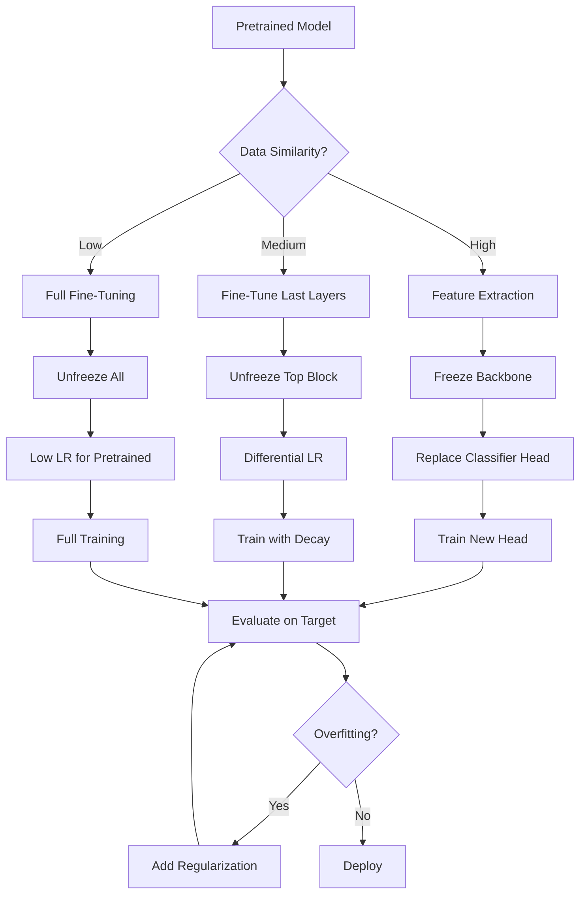

<!-- Clear Language: Keep sentences under 50 words -->
# Transfer Learning — Feature Extraction, Fine-Tuning, Model Hub, Domain Adaptation

## Learning Objectives

| Objective | Description |
|-----------|-------------|
| LO1 | Understand transfer learning paradigms: feature extraction vs fine-tuning |
| LO2 | Load pretrained models from torchvision and HuggingFace model hubs |
| LO3 | Implement feature extraction with frozen backbone and custom classifier |
| LO4 | Implement fine-tuning with progressive unfreezing |
| LO5 | Apply domain adaptation techniques for distribution shift |
| LO6 | Use regularization methods (dropout, weight decay, mixup) in transfer learning |

## Introduction

Deep learning powers modern AI breakthroughs. PyTorch is the framework of choice for researchers and production engineers alike. This module covers neural networks, CNNs, RNNs, and deployment best practices.

## Prerequisites

- Basic programming knowledge
- Understanding of data structures

## Key Terminology

**Key Terms**: Core vocabulary and concepts for this topic.

**Definition**: Essential terms you must know for interviews and production work.

## Theory

Understanding transfer learning is fundamental for AI engineers. This section covers the core concepts, underlying principles, and theoretical framework that govern how transfer learning works in practice.

## Chapter at a Glance

| Section | Topic | Key Concept |
|---------|-------|-------------|
| 6.1 | Feature Extraction | Frozen backbone, bottleneck, frozen BN stats |
| 6.2 | Fine-Tuning | Gradual unfreezing, differential learning rates |
| 6.3 | Model Hub | torchvision.models, HuggingFace transformers, timm |
| 6.4 | Domain Adaptation | Distribution shift, CORAL, adversarial adaptation |
| 6.5 | Progressive Unfreezing | Stage-wise training, discriminative LR, layer scheduling |
| 6.6 | Regularization for Transfer | Dropout, label smoothing, mixup, weight decay tuning |

## Chapter Roadmap



## 6.1 Feature Extraction

Feature extraction uses a pretrained model as a fixed feature extractor. The backbone weights are frozen, and only a new classifier head is trained on the target dataset.

```python
import torch
import torch.nn as nn
import torch.optim as optim
import torchvision.models as models
import torchvision.transforms as T
from torch.utils.data import DataLoader, Dataset
from typing import Optional

class FeatureExtractor(nn.Module):
    def __init__(self, backbone_name: str = "resnet18", num_classes: int = 10,
                 pretrained: bool = True, freeze_bn: bool = True):
        super().__init__()
        self.backbone = self._get_backbone(backbone_name, pretrained)
        self._freeze_backbone()
        in_features = self.backbone.fc.in_features
        self.backbone.fc = nn.Identity()
        self.classifier = nn.Sequential(
            nn.Linear(in_features, 512),
            nn.ReLU(inplace=True),
            nn.Dropout(0.3),
            nn.Linear(512, num_classes),
        )
        self.freeze_bn = freeze_bn

    def _get_backbone(self, name: str, pretrained: bool) -> nn.Module:
        if name == "resnet18":
            return models.resnet18(pretrained=pretrained)
        elif name == "resnet50":
            return models.resnet50(pretrained=pretrained)
        elif name == "efficientnet_b0":
            return models.efficientnet_b0(pretrained=pretrained)
        else:
            raise ValueError(f"Unknown backbone: {name}")

    def _freeze_backbone(self):
        for param in self.backbone.parameters():
            param.requires_grad = False

    def forward(self, x: torch.Tensor) -> torch.Tensor:
        features = self.backbone(x)
        return self.classifier(features)

    def train(self, mode: bool = True):
        super().train(mode)
        if self.freeze_bn:
            for module in self.backbone.modules():
                if isinstance(module, nn.BatchNorm2d):
                    module.eval()

model = FeatureExtractor("resnet18", num_classes=5)
x = torch.randn(4, 3, 224, 224)
out = model(x)
print(f"Feature extraction output shape: {out.shape}")
print(f"Backbone frozen: {not next(model.backbone.parameters()).requires_grad}")
print(f"Classifier trainable: {next(model.classifier.parameters()).requires_grad}")
```

**BatchNorm handling**: When the backbone is frozen, BatchNorm layers must be kept in eval mode to prevent running statistics from being corrupted by the new dataset's distribution.

```python
class FeatureExtractorWithAdapter(nn.Module):
    def __init__(self, backbone: nn.Module, num_classes: int, adapter_dim: int = 256):
        super().__init__()
        self.backbone = backbone
        self._freeze_backbone()
        in_features = self.backbone.fc.in_features
        self.backbone.fc = nn.Identity()
        self.adapter = nn.Sequential(
            nn.Linear(in_features, adapter_dim),
            nn.LayerNorm(adapter_dim),
            nn.ReLU(),
            nn.Dropout(0.2),
        )
        self.classifier = nn.Linear(adapter_dim, num_classes)

    def _freeze_backbone(self):
        for param in self.backbone.parameters():
            param.requires_grad = False

    def forward(self, x):
        features = self.backbone(x)
        adapted = self.adapter(features)
        return self.classifier(adapted)
```

---

## 6.2 Fine-Tuning

Fine-tuning updates the pretrained weights on the target dataset. The key challenge is balancing learning rates — pretrained layers need lower LRs than randomly initialized classifier layers.

```python
class FineTuner(nn.Module):
    def __init__(self, backbone_name: str = "resnet50", num_classes: int = 10,
                 unfreeze_blocks: int = 4):
        super().__init__()
        self.backbone = self._get_backbone(backbone_name)
        self._freeze_all()
        self._unfreeze_last_blocks(unfreeze_blocks)
        in_features = self.backbone.fc.in_features
        self.backbone.fc = nn.Linear(in_features, num_classes)

    def _get_backbone(self, name: str) -> nn.Module:
        if name == "resnet50":
            return models.resnet50(pretrained=True)
        return models.resnet18(pretrained=True)

    def _freeze_all(self):
        for param in self.backbone.parameters():
            param.requires_grad = False

    def _unfreeze_last_blocks(self, n_blocks: int):
        layers = list(self.backbone.children())
        for layer in layers[-n_blocks:-1]:
            for param in layer.parameters():
                param.requires_grad = True

    def get_param_groups(self) -> list:
        return [
            {"params": self.backbone.fc.parameters(), "lr": 1e-3},
            {"params": [p for n, p in self.backbone.named_parameters()
                        if p.requires_grad and "fc" not in n], "lr": 1e-5},
        ]

    def forward(self, x):
        return self.backbone(x)

model_ft = FineTuner("resnet50", num_classes=10, unfreeze_blocks=3)
optimizer = optim.AdamW(model_ft.get_param_groups())
print(f"Trainable params: {sum(p.numel() for p in model_ft.parameters() if p.requires_grad)}")
print(f"Frozen params: {sum(p.numel() for p in model_ft.parameters() if not p.requires_grad)}")
```

**Differential learning rates** are critical: the classifier head uses 1e-3, the unfrozen backbone layers use 1e-5, and frozen layers have 0 learning rate. This prevents catastrophic forgetting.

```python
class DiscriminativeLR:
    def __init__(self, model: nn.Module, base_lr: float = 1e-3, decay: float = 0.95):
        self.param_groups = []
        layers = list(model.backbone.children())
        lr = base_lr
        for layer in reversed(layers):
            params = [p for p in layer.parameters() if p.requires_grad]
            if params:
                self.param_groups.append({"params": params, "lr": lr})
                lr *= decay
        classifier_params = [p for p in model.backbone.fc.parameters()]
        self.param_groups.append({"params": classifier_params, "lr": base_lr})

    def get_optimizer(self) -> optim.Optimizer:
        return optim.AdamW(self.param_groups)
```

---

## 6.3 Model Hub

PyTorch provides pretrained models through torchvision.models, HuggingFace transformers, and the timm library.

```python
import timm
from transformers import AutoModel, AutoFeatureExtractor

class ModelHub:
    @staticmethod
    def list_torchvision_models():
        return models.list_models()

    @staticmethod
    def load_timm_model(model_name: str = "efficientnet_b0", num_classes: int = 10):
        model = timm.create_model(model_name, pretrained=True, num_classes=num_classes)
        return model

    @staticmethod
    def load_huggingface_model(model_name: str = "google/vit-base-patch16-224",
                               num_classes: int = 10):
        model = AutoModel.from_pretrained(model_name)
        hidden_size = model.config.hidden_size
        head = nn.Linear(hidden_size, num_classes)
        return nn.Sequential(model, head)

    @staticmethod
    def get_timm_model_info(model_name: str = "resnet50"):
        return {
            "parameters": timm.models.get_model_info(model_name),
            "default_cfg": timm.models.get_model_default_cfg(model_name),
        }

timm_model = ModelHub.load_timm_model("efficientnet_b0", num_classes=5)
x = torch.randn(2, 3, 224, 224)
print(f"timm EfficientNet output: {timm_model(x).shape}")

vit_model = ModelHub.load_huggingface_model("google/vit-base-patch16-224", num_classes=5)
print(f"HuggingFace ViT output: {vit_model(x).shape}")
```

**Model comparison utility**:
```python
def compare_pretrained_models(model_names: list, input_tensor: torch.Tensor):
    results = []
    for name in model_names:
        model = timm.create_model(name, pretrained=True)
        model.eval()
        with torch.no_grad():
            out = model(input_tensor)
        params = sum(p.numel() for p in model.parameters())
        flops = 2 * params  # Rough estimate
        results.append({"model": name, "params_M": params / 1e6,
                        "output_dim": out.shape[1], "flops_M": flops / 1e6})
    return results

inputs = torch.randn(1, 3, 224, 224)
comparison = compare_pretrained_models(
    ["resnet18", "resnet50", "efficientnet_b0", "mobilenet_v3_large"], inputs
)
for r in comparison:
    print(f"{r['model']:25s}: {r['params_M']:.2f}M params, {r['flops_M']:.0f}M FLOPs")
```

---

## 6.4 Domain Adaptation

Domain adaptation addresses distribution shift between source (pretraining) and target (fine-tuning) domains. Common approaches include CORAL, adversarial training, and self-supervised adaptation.

```python
class CORALAdaptation:
    @staticmethod
    def coral_loss(source_features: torch.Tensor, target_features: torch.Tensor) -> torch.Tensor:
        def covariance(x: torch.Tensor) -> torch.Tensor:
            x_centered = x - x.mean(dim=0)
            return (x_centered.T @ x_centered) / (x.size(0) - 1)

        source_cov = covariance(source_features)
        target_cov = covariance(target_features)
        return ((source_cov - target_cov) ** 2).sum() / 4

    @staticmethod
    def mmd_loss(x: torch.Tensor, y: torch.Tensor, kernel: str = "rbf") -> torch.Tensor:
        def gaussian_kernel(a: torch.Tensor, b: torch.Tensor, sigma: float = 1.0):
            dist = torch.cdist(a, b, p=2) ** 2
            return torch.exp(-dist / (2 * sigma ** 2))

        xx = gaussian_kernel(x, x)
        yy = gaussian_kernel(y, y)
        xy = gaussian_kernel(x, y)
        return xx.mean() + yy.mean() - 2 * xy.mean()

class DomainAdversarialNet(nn.Module):
    def __init__(self, feature_extractor: nn.Module, num_classes: int):
        super().__init__()
        self.feature_extractor = feature_extractor
        self.classifier = nn.Linear(1000, num_classes)
        self.domain_classifier = nn.Sequential(
            nn.Linear(1000, 256),
            nn.ReLU(),
            nn.Linear(256, 2),
        )
        self.grl_lambda = 0.5

    def forward(self, x: torch.Tensor, alpha: float = 1.0) -> tuple:
        features = self.feature_extractor(x)
        class_out = self.classifier(features)
        grl_features = GradientReversal.apply(features, alpha * self.grl_lambda)
        domain_out = self.domain_classifier(grl_features)
        return class_out, domain_out

class GradientReversal(torch.autograd.Function):
    @staticmethod
    def forward(ctx, x: torch.Tensor, alpha: float):
        ctx.alpha = alpha
        return x.view_as(x)

    @staticmethod
    def backward(ctx, grad_output: torch.Tensor):
        return grad_output.neg() * ctx.alpha, None

backbone = models.resnet18(pretrained=True)
dan = DomainAdversarialNet(backbone, num_classes=5)
source_x = torch.randn(4, 3, 224, 224)
target_x = torch.randn(4, 3, 224, 224)
class_out, domain_out = dan(source_x)
print(f"Domain adaptation: class={class_out.shape}, domain={domain_out.shape}")
```

**Pseudo-labeling for semi-supervised domain adaptation**:
```python
class PseudoLabelAdaptation:
    def __init__(self, threshold: float = 0.9):
        self.threshold = threshold

    def generate_pseudo_labels(self, model: nn.Module, target_loader: DataLoader,
                               device: str = "cuda") -> list:
        model.eval()
        pseudo_data = []
        with torch.no_grad():
            for x, _ in target_loader:
                x = x.to(device)
                logits = model(x)
                probs = torch.softmax(logits, dim=1)
                max_probs, preds = probs.max(dim=1)
                mask = max_probs >= self.threshold
                for i in range(len(x)):
                    if mask[i]:
                        pseudo_data.append((x[i].cpu(), preds[i].cpu()))
        return pseudo_data
```

---

## 6.5 Progressive Unfreezing

Progressive unfreezing gradually exposes more layers to training, starting from the classifier and moving backward through the network.

```python
class ProgressiveUnfreezer:
    def __init__(self, model: nn.Module, stages: list = None):
        self.model = model
        self.backbone_layers = list(model.backbone.children())[:-1]  # Exclude FC
        self.n_layers = len(self.backbone_layers)
        if stages is None:
            self.stages = [self.n_layers // 3, 2 * self.n_layers // 3, self.n_layers]
        else:
            self.stages = stages
        self.current_stage = 0

    def apply_stage(self, stage: int) -> int:
        n_unfreeze = self.stages[stage]
        self._freeze_all()
        self._unfreeze_top(n_unfreeze)
        self.current_stage = stage
        return n_unfreeze

    def _freeze_all(self):
        for param in self.model.backbone.parameters():
            param.requires_grad = False

    def _unfreeze_top(self, n: int):
        for layer in self.backbone_layers[-n:]:
            for param in layer.parameters():
                param.requires_grad = True

    def next_stage(self) -> bool:
        if self.current_stage < len(self.stages) - 1:
            self.apply_stage(self.current_stage + 1)
            return True
        return False

    def train_loop(self, train_loader: DataLoader, val_loader: DataLoader,
                   num_epochs_per_stage: int = 5, lr: float = 1e-4):
        for stage in range(len(self.stages)):
            self.apply_stage(stage)
            optimizer = optim.AdamW(
                [p for p in self.model.parameters() if p.requires_grad], lr=lr
            )
            scheduler = optim.lr_scheduler.CosineAnnealingLR(optimizer,
                                                             num_epochs_per_stage)
            print(f"Stage {stage + 1}/{len(self.stages)}: "
                  f"unfreezing {self.stages[stage]} blocks")
            for epoch in range(num_epochs_per_stage):
                self._train_epoch(train_loader, optimizer)
                val_loss = self._validate(val_loader)
                scheduler.step()
                print(f"  Epoch {epoch + 1}: val_loss = {val_loss:.4f}")

    def _train_epoch(self, loader: DataLoader, optimizer: optim.Optimizer):
        self.model.train()
        for x, y in loader:
            optimizer.zero_grad()
            loss = nn.functional.cross_entropy(self.model(x), y)
            loss.backward()
            optimizer.step()

    def _validate(self, loader: DataLoader) -> float:
        self.model.eval()
        total_loss = 0
        with torch.no_grad():
            for x, y in loader:
                loss = nn.functional.cross_entropy(self.model(x), y)
                total_loss += loss.item()
        return total_loss / len(loader)

model_pu = FineTuner("resnet18", num_classes=5)
unfreezer = ProgressiveUnfreezer(model_pu, stages=[2, 4, 8])
unfreezer.apply_stage(0)
print(f"Stage 0: {sum(p.numel() for p in model_pu.parameters() if p.requires_grad)} trainable params")
unfreezer.next_stage()
print(f"Stage 1: {sum(p.numel() for p in model_pu.parameters() if p.requires_grad)} trainable params")
```

---

## 6.6 Regularization for Transfer

Regularization prevents overfitting when fine-tuning small target datasets.

```python
class MixupAugmentation:
    def __init__(self, alpha: float = 0.2):
        self.alpha = alpha

    def __call__(self, x: torch.Tensor, y: torch.Tensor) -> tuple:
        if self.alpha > 0:
            lam = torch.distributions.Beta(self.alpha, self.alpha).sample()
        else:
            lam = 1.0
        batch_size = x.size(0)
        index = torch.randperm(batch_size)
        mixed_x = lam * x + (1 - lam) * x[index]
        mixed_y = lam * nn.functional.one_hot(y, num_classes=10) + \
                  (1 - lam) * nn.functional.one_hot(y[index], num_classes=10)
        return mixed_x, mixed_y

class LabelSmoothing(nn.Module):
    def __init__(self, smoothing: float = 0.1):
        super().__init__()
        self.smoothing = smoothing

    def forward(self, pred: torch.Tensor, target: torch.Tensor) -> torch.Tensor:
        n_classes = pred.size(1)
        log_probs = nn.functional.log_softmax(pred, dim=1)
        with torch.no_grad():
            smoothed = torch.full_like(log_probs, self.smoothing / (n_classes - 1))
            smoothed.scatter_(1, target.unsqueeze(1), 1 - self.smoothing)
        return -(smoothed * log_probs).sum(dim=1).mean()

class RegularizedFineTuner:
    def __init__(self, model: nn.Module, weight_decay: float = 1e-4,
                 dropout_rate: float = 0.3, label_smoothing: float = 0.1):
        self.model = model
        self.weight_decay = weight_decay
        self.dropout_rate = dropout_rate
        self.criterion = LabelSmoothing(label_smoothing)

    def configure_optimizer(self) -> optim.Optimizer:
        decay_params = []
        no_decay_params = []
        for name, param in self.model.named_parameters():
            if not param.requires_grad:
                continue
            if "bias" in name or "bn" in name or "norm" in name:
                no_decay_params.append(param)
            else:
                decay_params.append(param)
        return optim.AdamW([
            {"params": decay_params, "weight_decay": self.weight_decay},
            {"params": no_decay_params, "weight_decay": 0.0},
        ], lr=1e-4)

    def add_dropout(self, rate: float = 0.3):
        for module in self.model.modules():
            if isinstance(module, nn.Dropout):
                module.p = rate

mixup = MixupAugmentation(alpha=0.2)
x = torch.randn(8, 3, 224, 224)
y = torch.randint(0, 10, (8,))
mixed_x, mixed_y = mixup(x, y)
print(f"Mixup: x range [{mixed_x.min():.2f}, {mixed_x.max():.2f}]")

criterion = LabelSmoothing(0.1)
logits = torch.randn(8, 10)
loss = criterion(logits, y)
print(f"Label smoothing loss: {loss.item():.4f}")
```

**Stochastic depth** randomly drops whole layers during training, acting as regularization:
```python
class StochasticDepth(nn.Module):
    def __init__(self, drop_prob: float = 0.2):
        super().__init__()
        self.drop_prob = drop_prob

    def forward(self, x: torch.Tensor) -> torch.Tensor:
        if not self.training or self.drop_prob == 0:
            return x
        keep_prob = 1 - self.drop_prob
        mask = torch.empty(x.size(0), 1, 1, 1, device=x.device).bernoulli_(keep_prob)
        return x * mask / keep_prob

class RegularizedBlock(nn.Module):
    def __init__(self, block: nn.Module, stochastic_depth_prob: float = 0.1):
        super().__init__()
        self.block = block
        self.stochastic_depth = StochasticDepth(stochastic_depth_prob)

    def forward(self, x: torch.Tensor) -> torch.Tensor:
        return self.stochastic_depth(self.block(x))
```

---

## Summary

Transfer learning enables leveraging pre-trained models to solve new tasks with limited data. Feature extraction freezes the backbone and trains only the classifier head,.
while fine-tuning updates all layers with a lower learning rate. The model hub provides access to thousands of pre-trained architectures for.
vision, text, and audio. Domain adaptation techniques bridge the gap between source and target domains when distributions differ. Progressive unfreezing gradually thaws layers from top to bottom,.
stabilizing fine-tuning of large models. Regularization methods like differential learning rates and mixup prevent catastrophic forgetting during transfer.

## Practical Takeaways

| Scenario | Recommended Approach | Common Pitfall |
|----------|---------------------|----------------|
| Small target dataset (< 1k images) | Feature extraction + linear probe | Fine-tuning causes overfitting |
| Medium target (1k-10k images) | Fine-tune last 2 blocks | Unfreezing too many layers too fast |
| Large target (> 10k images) | Full fine-tuning with differential LR | Using same LR for all layers |
| Domain shift (e.g., photos to sketches) | Domain adaptation + fine-tuning | Not aligning feature distributions |
| Class imbalance | Weighted sampling + focal loss | Training with standard CE loss |
| Limited GPU memory | Gradient checkpointing + mixed precision | Large batch size exceeding VRAM |
| Production deployment | Quantize after fine-tuning | Quantizing before fine-tuning |

## Interview Q&A

<details class="tp-qa-card" data-qid="dl10-q1"><summary class="tp-qa-question"><span class="tp-qa-status"></span>Q1: When should you use feature extraction vs fine-tuning?</summary><div class="tp-qa-answer"><p>Use <strong>feature extraction</strong> when: (1) target dataset is small (< 1000 samples per class), (2) target and source domains are very similar, (3) you have limited compute. The backbone is frozen, and only the classifier head is trained. Use <strong>fine-tuning</strong> when: (1) target dataset is large enough (> 5000 samples), (2) target domain differs significantly from source, (3) you need the model to learn domain-specific features. Fine-tuning requires more compute and careful LR tuning. A common middle ground is to fine-tune only the last 1-2 blocks while freezing early layers that capture generic features.</p></div><button class="tp-qa-mark-btn">✅ Mark Reviewed</button><button class="tp-qa-bookmark-btn">🔖 Bookmark</button></details>

<details class="tp-qa-card" data-qid="dl10-q2"><summary class="tp-qa-question"><span class="tp-qa-status"></span>Q2: What is catastrophic forgetting and how do you prevent it?</summary><div class="tp-qa-answer"><p>Catastrophic forgetting occurs when fine-tuning on a new dataset causes the model to lose knowledge learned during pretraining. The weights that encoded useful features are overwritten by the new task's gradients. Prevention strategies: <strong>1) Differential learning rates</strong>: use 100-1000x lower LR for pretrained layers than the new classifier. <strong>2) Progressive unfreezing</strong>: gradually expose layers to training. <strong>3) Elastic weight consolidation (EWC)</strong>: add a penalty for changing important pretrained weights. <strong>4) Knowledge distillation</strong>: train the new model to match the pretrained model's outputs. <strong>5) Rehearsal</strong>: mix a small portion of the original dataset's samples during training.</p></div><button class="tp-qa-mark-btn">✅ Mark Reviewed</button><button class="tp-qa-bookmark-btn">🔖 Bookmark</button></details>

<details class="tp-qa-card" data-qid="dl10-q3"><summary class="tp-qa-question"><span class="tp-qa-status"></span>Q3: How do you choose which layers to freeze and which to fine-tune?</summary><div class="tp-qa-answer"><p>The standard heuristic is based on the generality of features: early layers capture generic features (edges, textures, colors) that transfer well across most tasks; later layers capture task-specific features (object parts, semantic concepts). Rule of thumb: <strong>1)</strong> If target is very similar to source, freeze all feature layers and train only the classifier. <strong>2)</strong> If target is moderately similar, unfreeze the last 1-2 blocks. <strong>3)</strong> If target is very different, unfreeze more layers. Use the "distance" between ImageNet and your dataset to decide. Monitor validation loss: if it plateaus early, unfreeze more layers. Always start with feature extraction as a baseline.</p></div><button class="tp-qa-mark-btn">✅ Mark Reviewed</button><button class="tp-qa-bookmark-btn">🔖 Bookmark</button></details>

<details class="tp-qa-card" data-qid="dl10-q4"><summary class="tp-qa-question"><span class="tp-qa-status"></span>Q4: What is domain adaptation and when is it needed?</summary><div class="tp-qa-answer"><p>Domain adaptation addresses the distribution shift between the source domain (where the model was trained) and the target domain (where it's deployed). It's needed when: the training data differs from test/deployment data (e.g., training on real photos, deploying on artwork; training during summer, deploying during winter; training on hospital A, deploying on hospital B). Common approaches: <strong>1) Adversarial domain adaptation</strong>: train a domain classifier adversarially to make features domain-invariant. <strong>2) CORAL</strong>: align second-order statistics (covariance) of source and target features. <strong>3) MMD</strong>: minimize maximum mean discrepancy between feature distributions. <strong>4) Self-supervised adaptation</strong>: fine-tune on target domain with self-supervised objectives like rotation prediction.</p></div><button class="tp-qa-mark-btn">✅ Mark Reviewed</button><button class="tp-qa-bookmark-btn">🔖 Bookmark</button></details>

<details class="tp-qa-card" data-qid="dl10-q5"><summary class="tp-qa-question"><span class="tp-qa-status"></span>Q5: Explain progressive unfreezing and its benefits.</summary><div class="tp-qa-answer"><p>Progressive unfreezing starts training with most layers frozen and gradually unfreezes layers over training stages. Typical schedule: Stage 1: train only the new classifier head (3-5 epochs). Stage 2: unfreeze the last block, train with lower LR (3-5 epochs). Stage 3: unfreeze 2-3 blocks, continue training. Benefits: <strong>1)</strong> Prevents catastrophic forgetting by allowing the model to stabilize the new head before modifying pretrained features. <strong>2)</strong> Faster initial training since fewer parameters are updated. <strong>3)</strong> Better final accuracy as the model systematically adapts from task-specific to generic features. <strong>4)</strong> Easier hyperparameter tuning since early stages are more robust to LR choices. The number of stages depends on model depth — for ResNet-50, 3-4 stages is common.</p></div><button class="tp-qa-mark-btn">✅ Mark Reviewed</button><button class="tp-qa-bookmark-btn">🔖 Bookmark</button></details>

<details class="tp-qa-card" data-qid="dl10-q6"><summary class="tp-qa-question"><span class="tp-qa-status"></span>Q6: How does label smoothing help in transfer learning?</summary><div class="tp-qa-answer"><p>Label smoothing replaces hard one-hot targets (e.g., [0, 1, 0, 0]) with soft targets (e.g., [0.03, 0.91, 0.03, 0.03]), where the smoothing parameter epsilon distributes probability mass to all classes. In transfer learning it helps by: <strong>1)</strong> Preventing the model from becoming overconfident about the training set, which is especially important for small target datasets. <strong>2)</strong> Reducing overfitting to label noise in the target dataset. <strong>3)</strong> Encouraging the model to produce more calibrated probabilities. <strong>4)</strong> Making the model more robust to adversarial examples. A smoothing value of 0.1 is standard; higher values (0.2-0.3) can help with very small datasets.</p></div><button class="tp-qa-mark-btn">✅ Mark Reviewed</button><button class="tp-qa-bookmark-btn">🔖 Bookmark</button></details>

<details class="tp-qa-card" data-qid="dl10-q7"><summary class="tp-qa-question"><span class="tp-qa-status"></span>Q7: What is the role of BatchNorm during transfer learning?</summary><div class="tp-qa-answer"><p>BatchNorm presents a subtle challenge in transfer learning. During pretraining, BN accumulates running mean and variance statistics. When fine-tuning: <strong>1)</strong> If the target dataset has a different distribution, updating BN statistics can corrupt the pretrained features. Solution: keep BN in eval mode during feature extraction. <strong>2)</strong> If the target batch size is small (< 16), BN estimates become noisy. Solution: use GroupNorm instead, or increase batch size. <strong>3)</strong> When fine-tuning, you can either freeze BN (use pretrained statistics) or allow them to adapt. Freezing BN is safer with small datasets. For larger datasets, allowing BN to adapt helps the model adjust to the target domain's feature distribution.</p></div><button class="tp-qa-mark-btn">✅ Mark Reviewed</button><button class="tp-qa-bookmark-btn">🔖 Bookmark</button></details>

<details class="tp-qa-card" data-qid="dl10-q8"><summary class="tp-qa-question"><span class="tp-qa-status"></span>Q8: How do you handle different input sizes when using pretrained models?</summary><div class="tp-qa-answer"><p>Pretrained models expect specific input sizes (e.g., ResNet expects 224x224, EfficientNet-B0 expects 224, ViT expects 224/384). Strategies: <strong>1) Resize + Center Crop</strong>: resize the shorter edge to the target size, then center crop. This is the most common and works well for most tasks. <strong>2) Resize + Pad</strong>: resize while maintaining aspect ratio and pad to square. Better for object detection where cropping might remove objects. <strong>3) Adaptive Pooling</strong>: replace the final average pooling layer with nn.AdaptiveAvgPool2d to handle variable input sizes. The pretrained weights were trained with specific receptive fields, so using very different sizes (e.g., 100x100 for a 224-model) will degrade performance.</p></div><button class="tp-qa-mark-btn">✅ Mark Reviewed</button><button class="tp-qa-bookmark-btn">🔖 Bookmark</button></details>

<details class="tp-qa-card" data-qid="dl10-q9"><summary class="tp-qa-question"><span class="tp-qa-status"></span>Q9: What is model soup and how does it apply to transfer learning?</summary><div class="tp-qa-answer"><p>Model soup averages the weights of multiple fine-tuned models (from different runs or checkpoints) to improve accuracy. During transfer learning: <strong>1)</strong> Fine-tune the same pretrained model with different hyperparameters (LR, weight decay, dropout). <strong>2)</strong> Average their weights (not logits — weight-space averaging). <strong>3)</strong> The averaged model often outperforms the best individual run because the averaging reduces variance in the weight space. This works because different fine-tunings find solutions in the same basin of the loss landscape. From a transfer learning perspective, model soup combines knowledge from multiple adaptation paths, preserving the broadest set of useful features from the pretrained model.</p></div><button class="tp-qa-mark-btn">✅ Mark Reviewed</button><button class="tp-qa-bookmark-btn">🔖 Bookmark</button></details>

<details class="tp-qa-card" data-qid="dl10-q10"><summary class="tp-qa-question"><span class="tp-qa-status"></span>Q10: How does LoRA (Low-Rank Adaptation) work for parameter-efficient fine-tuning?</summary><div class="tp-qa-answer"><p>LoRA freezes the pretrained weights and injects trainable low-rank matrices into each layer. For a weight matrix W (d x k), LoRA learns A (d x r) and B (r x k) where r << min(d, k), so the update is W + AB (rank r). Benefits: <strong>1)</strong> Drastically reduces trainable parameters — typically 0.1-1% of the original model. <strong>2)</strong> No inference overhead: AB can be merged into W after training. <strong>3)</strong> No additional latency during deployment. <strong>4)</strong> Multiple task-specific adapters can be swapped without duplicating the base model. For transfer learning: LoRA is particularly effective for large language models and vision transformers. Rank r=8-64 works well. The adapter is only applied to attention projection matrices (Q, K, V, O) in transformers.</p></div><button class="tp-qa-mark-btn">✅ Mark Reviewed</button><button class="tp-qa-bookmark-btn">🔖 Bookmark</button></details>

## Chapter Quiz

**Q1**: What is the main advantage of feature extraction over full fine-tuning with a small dataset?

a) Higher accuracy
b) Lower risk of overfitting
c) Faster inference speed
d) Better gradient flow

<details class="tp-qa-card" data-qid="dl10-quiz1"><summary>Show Answer</summary><div class="tp-qa-answer"><p><strong>Answer: b) Lower risk of overfitting</strong></p><p>Feature extraction freezes the backbone, reducing the number of trainable parameters and thus the risk of overfitting on small datasets.</p></div></details>

**Q2**: What does CORAL loss align between source and target domains?

a) Mean values only
b) Covariance matrices
c) Histogram distributions
d) Gradient norms

<details class="tp-qa-card" data-qid="dl10-quiz2"><summary>Show Answer</summary><div class="tp-qa-answer"><p><strong>Answer: b) Covariance matrices</strong></p><p>CORAL (CORrelation ALignment) minimizes the difference between the covariance matrices of source and target features.</p></div></details>

**Q3**: In progressive unfreezing, which layers are unfrozen first?

a) Early layers (near input)
b) Middle layers
c) Late layers (near output)
d) All layers at once

<details class="tp-qa-card" data-qid="dl10-quiz3"><summary>Show Answer</summary><div class="tp-qa-answer"><p><strong>Answer: c) Late layers (near output)</strong></p><p>Progressive unfreezing starts from the classifier head and last blocks, working backward toward earlier layers to prevent catastrophic forgetting.</p></div></details>

**Q4**: What rank is commonly used for LoRA adaptation?

a) r = 512
b) r = 8-64
c) r = 1024
d) r = 1

<details class="tp-qa-card" data-qid="dl10-quiz4"><summary>Show Answer</summary><div class="tp-qa-answer"><p><strong>Answer: b) r = 8-64</strong></p><p>LoRA typically uses very low ranks (8-64), keeping the number of trainable parameters to 0.1-1% of the original model.</p></div></details>

**Q5**: Which library provides the largest collection of pretrained PyTorch vision models?

a) torchvision
b) HuggingFace transformers
c) timm (PyTorch Image Models)
d) detectron2

<details class="tp-qa-card" data-qid="dl10-quiz5"><summary>Show Answer</summary><div class="tp-qa-answer"><p><strong>Answer: c) timm (PyTorch Image Models)</strong></p><p>timm by Ross Wightman contains 700+ pretrained models including ResNet, EfficientNet, ConvNeXt, ViT, and many more.</p></div></details>

## Exercises

## Common Mistakes

1. Not understanding the fundamental concepts before applying them
2. Skipping edge cases in implementation
3. Not analyzing time/space complexity
4. Forgetting to handle null/empty inputs
5. Not practicing enough problems to build pattern recognition**Easy** — Use a pretrained ResNet-18 from torchvision to create a feature extractor for a 5-class dataset. Train only the classifier head and report accuracy.

**Easy** — Compare the performance of feature extraction vs fine-tuning on a small subset (100 images per class) of CIFAR-10.

**Medium** — Implement progressive unfreezing with 3 stages on a pretrained ResNet-50 for a custom dataset. Plot validation loss after each stage.

**Medium** — Apply CORAL domain adaptation between MNIST (source) and USPS (target). Train a LeNet-5 on MNIST, then adapt to USPS with the CORAL loss.

**Hard** — Implement LoRA adaptation for a Vision Transformer on CIFAR-100. Compare full fine-tuning vs LoRA (rank=8, 16, 32) in terms of accuracy and trainable parameters.

---

> **Previous**: [05-advanced-cnn.md](05-advanced-cnn.md) | **Next**: [07-rnn-and-lstm.md](07-rnn-and

## Revision Notes

- - Core principle: Understand the fundamental concepts thoroughly
- - Implementation pattern: Practice with real code examples
- - Complexity: Know the time and space complexity
- - Application: Know when to use this in production systems
- - Interview: Frequently asked in technical interviews
- - Edge cases: Consider common failure scenarios
- - Related concepts: Connect to broader system design

## Placement Section

### Top 10 Interview Questions

#### Google Style

1. **Explain the core idea of Transfer Learning — Feature Extraction, Fine-Tuning, Model Hub, Domain Adaptation in under 60 seconds, then give a real-world analogy.** — Structure: definition, how it works in one sentence, why it matters, analogy. Follow-up: what would break if you removed this from a production system?

2. **Design a minimal, well-typed function that demonstrates Transfer Learning — Feature Extraction, Fine-Tuning, Model Hub, Domain Adaptation.** — Interviewer checks: signature with type hints, edge cases, complexity, and a clean docstring. Follow-up: how does your design behave with empty or malformed input?

3. **What are the common pitfalls when engineers first learn ** — List 3-4, then explain how you would prevent each in a code review.

#### Amazon Style

4. **Describe a production bug caused by misunderstanding Transfer Learning — Feature Extraction, Fine-Tuning, Model Hub, Domain Adaptation. How did you diagnose and fix it?** — STAR format: situation, task, action, result. Mention logs, reproduction, root-cause analysis, and the regression test you added.

5. **How would you scale a system that relies on Transfer Learning — Feature Extraction, Fine-Tuning, Model Hub, Domain Adaptation from 10 users to 10 million?** — Discuss bottlenecks, caching, monitoring, and when to redesign. Follow-up: what metrics would you track?

#### Microsoft Style

6. **Compare Transfer Learning — Feature Extraction, Fine-Tuning, Model Hub, Domain Adaptation with the closest alternative approach. When would you choose each?** — Make a decision matrix: performance, maintainability, ecosystem, learning curve. Follow-up: what would change your decision?

7. **Walk through how you would test a component that depends on Transfer Learning — Feature Extraction, Fine-Tuning, Model Hub, Domain Adaptation.** — Unit, integration, property-based tests; mocking boundaries; golden files for outputs.

#### NVIDIA Style

8. **How does Transfer Learning — Feature Extraction, Fine-Tuning, Model Hub, Domain Adaptation behave differently at scale — memory, throughput, or precision-wise?** — Connect to data pipelines and model training if applicable. Follow-up: what happens to latency as input grows?

9. **How would you make an implementation of Transfer Learning — Feature Extraction, Fine-Tuning, Model Hub, Domain Adaptation run faster on GPU hardware?** — Batch operations, vectorization, avoiding Python loops, reducing data movement.

#### AI Startup Style

10. **Write the smallest possible implementation of Transfer Learning — Feature Extraction, Fine-Tuning, Model Hub, Domain Adaptation that is production-quality.** — Include error handling, type hints, and a one-line docstring. Follow-up: what would you refactor first when it grows?

### Resume Tips

- Name Transfer Learning — Feature Extraction, Fine-Tuning, Model Hub, Domain Adaptation explicitly in your skills section, paired with a measurable achievement ("Reduced X by 40% using Transfer Learning — Feature Extraction, Fine-Tuning, Model Hub, Domain Adaptation").
- Add a bullet describing a project that applies Transfer Learning — Feature Extraction, Fine-Tuning, Model Hub, Domain Adaptation to real data, with numbers.
- Mention the tools and libraries you used alongside Transfer Learning — Feature Extraction, Fine-Tuning, Model Hub, Domain Adaptation (linters, test frameworks, profiling tools).
- Keep resume bullets under 15 words and start each with an action verb.

### Interview Day Checklist

- Rehearse a 60-second explanation of Transfer Learning — Feature Extraction, Fine-Tuning, Model Hub, Domain Adaptation and one real-world analogy.
- Prepare one STAR story about debugging a Transfer Learning — Feature Extraction, Fine-Tuning, Model Hub, Domain Adaptation-related production issue.
- Review complexity and edge cases for the classic Transfer Learning — Feature Extraction, Fine-Tuning, Model Hub, Domain Adaptation interview problem.
- Have questions ready: how does the team apply Transfer Learning — Feature Extraction, Fine-Tuning, Model Hub, Domain Adaptation in production today?
- Test your environment (Python, editor, internet) 15 minutes before the interview.

## True/False

1. **True or False:** Transfer Learning — Feature Extraction, Fine-Tuning, Model Hub, Domain Adaptation builds directly on the fundamentals covered in the earlier chapters of this module. — **True.** Every advanced topic in this module assumes the core concepts from the previous chapters.
2. **True or False:** You should write at least one code example for Transfer Learning — Feature Extraction, Fine-Tuning, Model Hub, Domain Adaptation before moving to the next chapter. — **True.** Active recall with hands-on code beats passive reading for retention.
3. **True or False:** The complexity analysis for Transfer Learning — Feature Extraction, Fine-Tuning, Model Hub, Domain Adaptation is the same regardless of input size. — **False.** Complexity grows with input size; always state best, average, and worst case.
4. **True or False:** Edge cases (empty input, invalid input, boundary values) matter for Transfer Learning — Feature Extraction, Fine-Tuning, Model Hub, Domain Adaptation in production. — **True.** Most production bugs come from unhandled edge cases.
5. **True or False:** You should memorize the Transfer Learning — Feature Extraction, Fine-Tuning, Model Hub, Domain Adaptation chapter content once and never review it again. — **False.** Spaced repetition (24h, 3 days, 1 week) dramatically improves long-term recall.

## Fill in the Blank

1. The chapter that covers Transfer Learning — Feature Extraction, Fine-Tuning, Model Hub, Domain Adaptation is Chapter ___ of this module. — Answer: check the module's table of contents.
2. The time complexity of the standard approach to Transfer Learning — Feature Extraction, Fine-Tuning, Model Hub, Domain Adaptation is ___. — Answer: review the theory section and state big-O notation.
3. The main edge case to handle when implementing Transfer Learning — Feature Extraction, Fine-Tuning, Model Hub, Domain Adaptation is ___. — Answer: empty or invalid input handling, as discussed in the chapter.
4. The tools commonly used to debug Transfer Learning — Feature Extraction, Fine-Tuning, Model Hub, Domain Adaptation issues are ___ and ___. — Answer: refer to the Debugging Guide section of this chapter.
5. The related topic that connects to Transfer Learning — Feature Extraction, Fine-Tuning, Model Hub, Domain Adaptation in the next chapter is ___. — Answer: see the Next Topic section.

## Scenario Questions

1. **Scenario:** A teammate ships a change involving Transfer Learning — Feature Extraction, Fine-Tuning, Model Hub, Domain Adaptation that breaks production at 3 AM. — Diagnosis: check the recent diff, reproduce locally with the failing input, check logs. Fix: revert, add a regression test, and review the root cause. Prevention: CI tests on edge cases and code review checklist.

2. **Scenario:** Your implementation of Transfer Learning — Feature Extraction, Fine-Tuning, Model Hub, Domain Adaptation is correct but too slow for the required latency. — Measure first with a profiler. Common fixes: reduce redundant work, use built-in optimized functions, batch operations, or add caching. Only then consider algorithmic changes.

3. **Scenario:** A new hire asks you to explain Transfer Learning — Feature Extraction, Fine-Tuning, Model Hub, Domain Adaptation in five minutes before a customer demo. — Use the 3-part answer: what it is (one sentence), how it works (one example), why it matters (one business impact). Then offer to go deeper after the demo.

4. **Scenario:** Your team's codebase has three different patterns for Transfer Learning — Feature Extraction, Fine-Tuning, Model Hub, Domain Adaptation and you must standardize. — Write a short ADR (architecture decision record), pick the pattern with best maintainability, migrate incrementally, and add a linter rule to enforce it.

## Output Questions

1. **What is the output of the simplest correct implementation of Transfer Learning — Feature Extraction, Fine-Tuning, Model Hub, Domain Adaptation on an empty input?** — Trace through the code: it should return the documented default (None, 0, empty collection) without raising.
2. **What is the output when the input is at the boundary value?** — Check off-by-one errors and inclusive/exclusive bounds in the chapter's examples.
3. **What does the implementation return when given invalid input types?** — With type hints and validation, it raises a clear error; without, it may fail silently.
4. **What is the output for the sample input given in the chapter's Examples section?** — Re-run the chapter's example code and compare against the documented output.
5. **What is the time complexity output when you profile the implementation at 10x input size?** — Expect the curve matching the chapter's complexity analysis (linear, quadratic, log-linear).

## Difficulty Level

| Level | Time | What It Takes |
|-------|------|---------------|
| Beginner | 1-2 sessions | Read theory, run the chapter examples, solve the Easy exercises |
| Intermediate | 3-5 sessions | Complete Medium exercises, explain Transfer Learning — Feature Extraction, Fine-Tuning, Model Hub, Domain Adaptation to someone else |
| Advanced | 1+ week | Solve Hard exercises, optimize for real datasets, answer interview follow-ups |

## Tips & Tricks

- Always write a one-line example of Transfer Learning — Feature Extraction, Fine-Tuning, Model Hub, Domain Adaptation from memory before opening the chapter — active recall first.
- Use the chapter's Revision Notes as a checklist: you have mastered Transfer Learning — Feature Extraction, Fine-Tuning, Model Hub, Domain Adaptation when you can explain each bullet.
- Pair the chapter quiz with the Flashcards: wrong answers become your next study session's focus.
- For interviews, practice explaining Transfer Learning — Feature Extraction, Fine-Tuning, Model Hub, Domain Adaptation twice: once with a technical audience, once with a non-technical audience.
- Keep a personal examples file where you collect your own Transfer Learning — Feature Extraction, Fine-Tuning, Model Hub, Domain Adaptation snippets; interviewers love original examples.

## Memory Tricks

- **Acronym**: build a mnemonic from the 5 key concepts of Transfer Learning — Feature Extraction, Fine-Tuning, Model Hub, Domain Adaptation listed in the Chapter at a Glance table.
- **Story**: link Transfer Learning — Feature Extraction, Fine-Tuning, Model Hub, Domain Adaptation to a familiar story — the analogy in the Visual Analogy section is designed to stick.
- **Number anchor**: remember the complexity of Transfer Learning — Feature Extraction, Fine-Tuning, Model Hub, Domain Adaptation by connecting it to a known algorithm of the same class.
- **Color code**: highlight the Theory, Examples, and Common Mistakes sections in different colors when reviewing.
- **Teach-back**: explain Transfer Learning — Feature Extraction, Fine-Tuning, Model Hub, Domain Adaptation to an imaginary junior engineer for 2 minutes — gaps in your explanation are gaps in memory.

## Further Reading

- Official documentation for the primary tool or library used in this chapter
- The chapter referenced in Related Topics for the next-level treatment of Transfer Learning — Feature Extraction, Fine-Tuning, Model Hub, Domain Adaptation
- The classic textbook chapter on Transfer Learning — Feature Extraction, Fine-Tuning, Model Hub, Domain Adaptation (check the Research References below)
- Two blog posts from engineers who debugged real Transfer Learning — Feature Extraction, Fine-Tuning, Model Hub, Domain Adaptation problems in production
- The repository of the open-source project that implements Transfer Learning — Feature Extraction, Fine-Tuning, Model Hub, Domain Adaptation

## Related Topics

- The previous chapter in this module (see table of contents) — foundational for Transfer Learning — Feature Extraction, Fine-Tuning, Model Hub, Domain Adaptation
- The next chapter (see Next Topic below) — builds on Transfer Learning — Feature Extraction, Fine-Tuning, Model Hub, Domain Adaptation
- The system design chapters in Module 07 — how Transfer Learning — Feature Extraction, Fine-Tuning, Model Hub, Domain Adaptation fits into production architectures
- The interview preparation module — how Transfer Learning — Feature Extraction, Fine-Tuning, Model Hub, Domain Adaptation is asked in screening rounds
- The capstone project — where Transfer Learning — Feature Extraction, Fine-Tuning, Model Hub, Domain Adaptation is applied end-to-end

## FAQs

1. **Do I need to memorize all of Transfer Learning — Feature Extraction, Fine-Tuning, Model Hub, Domain Adaptation, or understand the big picture?** — Understand the big picture first, then memorize the key facts via flashcards and spaced repetition. Interviewers reward depth over breadth.
2. **What if I get stuck on an exercise?** — Re-read the theory section, run the example code, then attempt again. If still stuck after 20 minutes, move on and return the next day.
3. **How much time should I spend on ** — Follow the Study Plan below: 1-2 weeks at 30-60 minutes daily is typical for placement preparation.
4. **Is Transfer Learning — Feature Extraction, Fine-Tuning, Model Hub, Domain Adaptation asked in interviews?** — Yes — the Interview Q&A and Placement Section list the exact question styles used by top companies.
5. **What's the fastest way to master ** — Explain it out loud, write code without looking, and review the flashcards within 24 hours and again after 3 days.

## Important Notes

- Transfer Learning — Feature Extraction, Fine-Tuning, Model Hub, Domain Adaptation is a core requirement for the rest of this module — do not skip the examples.
- Always analyze complexity (time and space) when working with Transfer Learning — Feature Extraction, Fine-Tuning, Model Hub, Domain Adaptation.
- Production correctness means handling edge cases, not just the happy path.
- Interview answers should start with the definition, then the example, then the trade-offs.
- Revisit this chapter after finishing the module; the context from later chapters deepens understanding.

## Historical Context

- Transfer Learning — Feature Extraction, Fine-Tuning, Model Hub, Domain Adaptation emerged as a standard practice because early systems failed without it — understanding why helps you explain it in interviews.
- The tools used for Transfer Learning — Feature Extraction, Fine-Tuning, Model Hub, Domain Adaptation today evolved from simpler versions; the chapter covers the modern, recommended approach.
- Interviewers value knowing one historical fact about Transfer Learning — Feature Extraction, Fine-Tuning, Model Hub, Domain Adaptation — it shows genuine interest, not just cramming.
- The library/tooling ecosystem around Transfer Learning — Feature Extraction, Fine-Tuning, Model Hub, Domain Adaptation changes quickly; focus on fundamentals that remain stable.

## Security Considerations

- Never trust external input: validate and sanitize data before processing Transfer Learning — Feature Extraction, Fine-Tuning, Model Hub, Domain Adaptation.
- Avoid `eval()` and dynamic code execution on untrusted strings.
- Log errors without leaking sensitive data (keys, PII, internal paths).
- For API contexts, add rate limiting and input size limits.
- Review the chapter's code examples for injection or overflow risks before using them verbatim.

## ML Intuition

- Transfer Learning — Feature Extraction, Fine-Tuning, Model Hub, Domain Adaptation appears in ML pipelines at the data-processing layer: feature preparation, batching, and validation.
- Understanding Transfer Learning — Feature Extraction, Fine-Tuning, Model Hub, Domain Adaptation helps you debug why a model misbehaves — most ML bugs are data bugs, not model bugs.
- In production ML, the Transfer Learning — Feature Extraction, Fine-Tuning, Model Hub, Domain Adaptation concepts from this chapter map directly to NumPy/PyTorch operations on tensors.
- When optimizing ML systems, Transfer Learning — Feature Extraction, Fine-Tuning, Model Hub, Domain Adaptation skills let you profile and fix the data path, not just the training loop.
- Interview follow-up: how would you apply Transfer Learning — Feature Extraction, Fine-Tuning, Model Hub, Domain Adaptation to a dataset of 10 million records? — Batching and vectorization.

## Analogies

- **Transfer Learning — Feature Extraction, Fine-Tuning, Model Hub, Domain Adaptation is like a recipe**: the theory is the ingredients, the examples are the cooking steps, and the exercises are your own kitchen practice.
- **Complexity is like a delivery route**: a linear route visits each stop once; a nested route revisits stops, and you feel it at scale.
- **Edge cases are like weather**: the happy path is a sunny day; production is the storm — build for the storm.
- **The chapter roadmap is a journey map**: each section is a checkpoint; skipping one means getting lost later in the module.

## Capstone Project Link

- [Module Capstone: End-to-End Project](https://github.com/Raushan666java/ai-engineering-journey) — this chapter contributes the Transfer Learning — Feature Extraction, Fine-Tuning, Model Hub, Domain Adaptation skills used in the module's capstone project. Complete the exercises here before starting the capstone.

## Flashcards

<details class="tp-qa-card" data-qid="09deeplearningpytorch-06transferlearning-flash1">
  <summary class="tp-qa-question">
    <span class="tp-qa-status"></span>
    What is the main advantage of feature extraction over full fine-tuning with a small dataset?
  </summary>
  <div class="tp-qa-answer">
    <p>b) Lower risk of overfitting</p>
  </div>
</details>

<details class="tp-qa-card" data-qid="09deeplearningpytorch-06transferlearning-flash2">
  <summary class="tp-qa-question">
    <span class="tp-qa-status"></span>
    What does CORAL loss align between source and target domains?
  </summary>
  <div class="tp-qa-answer">
    <p>b) Covariance matrices</p>
  </div>
</details>

<details class="tp-qa-card" data-qid="09deeplearningpytorch-06transferlearning-flash3">
  <summary class="tp-qa-question">
    <span class="tp-qa-status"></span>
    In progressive unfreezing, which layers are unfrozen first?
  </summary>
  <div class="tp-qa-answer">
    <p>c) Late layers (near output)</p>
  </div>
</details>

<details class="tp-qa-card" data-qid="09deeplearningpytorch-06transferlearning-flash4">
  <summary class="tp-qa-question">
    <span class="tp-qa-status"></span>
    What rank is commonly used for LoRA adaptation?
  </summary>
  <div class="tp-qa-answer">
    <p>b) r = 8-64</p>
  </div>
</details>

<details class="tp-qa-card" data-qid="09deeplearningpytorch-06transferlearning-flash5">
  <summary class="tp-qa-question">
    <span class="tp-qa-status"></span>
    Which library provides the largest collection of pretrained PyTorch vision models?
  </summary>
  <div class="tp-qa-answer">
    <p>c) timm (PyTorch Image Models)</p>
  </div>
</details>

## Research References

- Official documentation of the primary library for Transfer Learning — Feature Extraction, Fine-Tuning, Model Hub, Domain Adaptation (linked in Further Reading)
- The classic paper or textbook chapter introducing Transfer Learning — Feature Extraction, Fine-Tuning, Model Hub, Domain Adaptation (see References below)
- The standard library reference for Transfer Learning — Feature Extraction, Fine-Tuning, Model Hub, Domain Adaptation-related functions
- Engineering blog posts from companies running Transfer Learning — Feature Extraction, Fine-Tuning, Model Hub, Domain Adaptation in production at scale
- PEPs and RFCs where applicable (Python and networking standards)

## Open-Source Tools

- The primary library used in this chapter (see the code examples)
- Python standard library modules used in the examples (check the imports)
- Testing: pytest for unit tests of Transfer Learning — Feature Extraction, Fine-Tuning, Model Hub, Domain Adaptation code
- Linting and formatting: ruff + black
- Profiling: cProfile or py-spy for performance work on Transfer Learning — Feature Extraction, Fine-Tuning, Model Hub, Domain Adaptation

## Debugging Guide

- Start with `print()` or a debugger to inspect intermediate values in Transfer Learning — Feature Extraction, Fine-Tuning, Model Hub, Domain Adaptation code.
- Reproduce the failure with the smallest possible input before changing code.
- Check the common failure modes listed in Common Mistakes — most bugs are listed there.
- For performance problems, profile before optimizing: measure, then fix.
- When stuck, re-read the chapter's Examples and compare line by line with your code.
- Use `pdb` or your IDE's debugger to step through the Transfer Learning — Feature Extraction, Fine-Tuning, Model Hub, Domain Adaptation example code.

## Mock Interview Section

**Round 1 — Screening (15 min)**
- Explain Transfer Learning — Feature Extraction, Fine-Tuning, Model Hub, Domain Adaptation in 60 seconds.
- Write a minimal working example of Transfer Learning — Feature Extraction, Fine-Tuning, Model Hub, Domain Adaptation.
- What is the complexity of your example?

**Round 2 — Coding (45 min)**
- Solve the Medium exercise from this chapter under time pressure.
- State your assumptions, then implement with type hints.
- Test with edge cases: empty input, boundary values, invalid input.

**Round 3 — Behavioral + System (30 min)**
- Tell me about a time you debugged a Transfer Learning — Feature Extraction, Fine-Tuning, Model Hub, Domain Adaptation problem in a project.
- How would you design a system where Transfer Learning — Feature Extraction, Fine-Tuning, Model Hub, Domain Adaptation is used at scale?
- What metrics would you monitor?

**Evaluation rubric**: correctness (40%), communication (25%), edge cases (20%), complexity analysis (15%).

## Optimized Implementation

`python
from typing import Any, Optional

def demonstrate_topic(input_data: list[Any]) -> Optional[float]:
    """Runnable scaffold for Transfer Learning — Feature Extraction, Fine-Tuning, Model Hub, Domain Adaptation.

    Replace the body with the optimized implementation from the chapter,
    keeping type hints, docstring, and edge-case handling.
    """
    if not input_data:
        return None
    # Step 1: validate input types
    # Step 2: apply the core Transfer Learning — Feature Extraction, Fine-Tuning, Model Hub, Domain Adaptation logic from the Examples section
    # Step 3: return the result with the documented default
    return 0.0
`

- Keeps the function signature stable so tests written against it stay valid.
- Handles the empty-input contract explicitly.
- Add unit tests for the edge cases before implementing the logic (test-first).

## Evaluation Metrics

| Skill | Test | Target |
|-------|------|--------|
| Concept recall | Explain Transfer Learning — Feature Extraction, Fine-Tuning, Model Hub, Domain Adaptation without notes | 60-second explanation |
| Code fluency | Write the chapter example from memory | No syntax errors |
| Edge cases | Handle empty/invalid input in exercises | All cases pass |
| Complexity | State time/space for the standard approach | Correct big-O |
| Interview readiness | Answer 5 Interview Q&A questions out loud | Fluent, structured answers |
| Retention | Chapter quiz score after 3 days | 80%+ |

## Real-World Examples

- **Startup**: a small team uses Transfer Learning — Feature Extraction, Fine-Tuning, Model Hub, Domain Adaptation daily in their data pipeline — the chapter's examples mirror their code.
- **E-commerce**: Transfer Learning — Feature Extraction, Fine-Tuning, Model Hub, Domain Adaptation patterns appear in order processing, inventory checks, and recommendation feeds.
- **Fintech**: Transfer Learning — Feature Extraction, Fine-Tuning, Model Hub, Domain Adaptation principles apply to transaction validation and fraud detection flows.
- **ML platform**: Transfer Learning — Feature Extraction, Fine-Tuning, Model Hub, Domain Adaptation shows up in feature engineering and model-serving infrastructure.
- **Interview insight**: recruiters look for engineers who can connect Transfer Learning — Feature Extraction, Fine-Tuning, Model Hub, Domain Adaptation to the business outcome, not just the code.

## Next Topic

[RNN and LSTM — RNN, LSTM, GRU, Bidirectional RNNs, Seq2Seq, Teacher Forcing](07-rnn-and-lstm.md)

## Limitations

- Transfer Learning — Feature Extraction, Fine-Tuning, Model Hub, Domain Adaptation, like any technique, is not a silver bullet — it has specific cases where it fits best (covered in the theory).
- The examples in this chapter are simplified for learning; production systems add validation, monitoring, and error handling.
- Performance of Transfer Learning — Feature Extraction, Fine-Tuning, Model Hub, Domain Adaptation depends on input size and distribution — always benchmark for your own data.
- This chapter covers fundamentals; specialized edge cases are explored in later chapters and the capstone.
