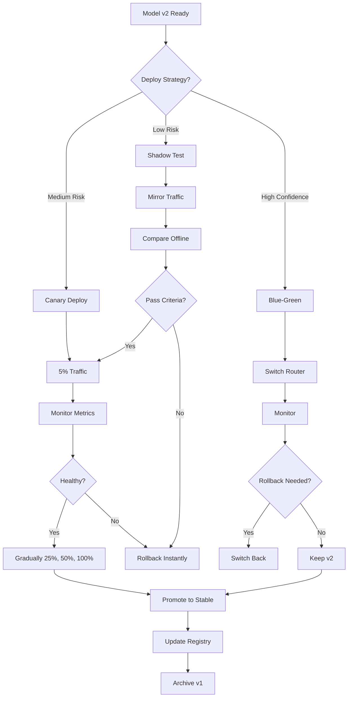

<!-- Clear Language: Keep sentences under 50 words -->
# Deployment Best Practices — A/B Testing, Monitoring, Model Versioning, Rollback

## Learning Objectives

| Objective | Description |
|-----------|-------------|
| LO1 | Design A/B testing frameworks for comparing model versions in production |
| LO2 | Implement monitoring dashboards for model performance and drift detection |
| LO3 | Manage model versioning with registry, lineage, and metadata tracking |
| LO4 | Design rollback strategies for safe model deployment |
| LO5 | Implement canary deployments and shadow testing patterns |
| LO6 | Performance benchmark models under production workloads |

## Introduction

Deep learning powers modern AI breakthroughs. PyTorch is the framework of choice for researchers and production engineers alike. This module covers neural networks, CNNs, RNNs, and deployment best practices.

## Prerequisites

- Basic programming knowledge
- Understanding of data structures

## Key Terminology

**Key Terms**: Core vocabulary and concepts for this topic.

**Definition**: Essential terms you must know for interviews and production work.

## Theory

Understanding deployment best practices is fundamental for AI engineers. This section covers the core concepts, underlying principles, and theoretical framework that govern how deployment best practices works in practice.

## Chapter at a Glance

| Section | Topic | Key Concept |
|---------|-------|-------------|
| 10.1 | A/B Testing | Traffic splitting, statistical significance, metrics comparison |
| 10.2 | Monitoring | Latency, throughput, error rate, data drift, concept drift |
| 10.3 | Model Versioning | Registry, semantic versioning, lineage tracking, metadata |
| 10.4 | Rollback Strategies | Blue-green, canary, feature flags, automated rollback |
| 10.5 | Canary Deployments | Gradual traffic shifting, health checks, auto-promotion |
| 10.6 | Shadow Testing | Dark launches, traffic mirroring, offline validation |
| 10.7 | Performance Benchmarking | Throughput, latency percentiles, resource profiling, load testing |

## Chapter Roadmap



## 10.1 A/B Testing

A/B testing compares two model versions (A = control/current, B = treatment/candidate) by splitting real traffic and measuring key metrics.

```python
import time
import json
import random
import statistics
import numpy as np
from typing import Any, Callable, Dict, List, Optional, Tuple
from dataclasses import dataclass, field
from enum import Enum
from collections import defaultdict
from pathlib import Path

class ExperimentStatus(Enum):
    RUNNING = "running"
    COMPLETED = "completed"
    ROLLED_BACK = "rolled_back"
    FAILED = "failed"

@dataclass
class ExperimentConfig:
    name: str
    model_a_name: str
    model_b_name: str
    traffic_split: float = 0.5  # Fraction to model B
    min_sample_size: int = 1000
    confidence_level: float = 0.95
    metrics: List[str] = field(default_factory=lambda: ["accuracy", "latency_ms"])
    duration_hours: int = 24

@dataclass
class ExperimentResult:
    config: ExperimentConfig
    samples_a: List[dict] = field(default_factory=list)
    samples_b: List[dict] = field(default_factory=list)
    status: ExperimentStatus = ExperimentStatus.RUNNING
    start_time: float = field(default_factory=time.time)

class ABTestFramework:
    def __init__(self):
        self.experiments: Dict[str, ExperimentResult] = {}

    def create_experiment(self, config: ExperimentConfig) -> str:
        result = ExperimentResult(config=config)
        self.experiments[config.name] = result
        return config.name

    def assign_treatment(self, experiment_name: str, user_id: str) -> str:
        experiment = self.experiments[experiment_name]
        if experiment.status != ExperimentStatus.RUNNING:
            return experiment.config.model_a_name
        # Deterministic assignment based on user_id hash
        hash_val = hash(f"{experiment_name}:{user_id}") % 1000
        if hash_val < experiment.config.traffic_split * 1000:
            return experiment.config.model_b_name
        return experiment.config.model_a_name

    def record_result(self, experiment_name: str, model_name: str,
                      result: dict):
        experiment = self.experiments[experiment_name]
        if model_name == experiment.config.model_a_name:
            experiment.samples_a.append(result)
        else:
            experiment.samples_b.append(result)

    def analyze(self, experiment_name: str) -> dict:
        experiment = self.experiments[experiment_name]
        a = experiment.samples_a
        b = experiment.samples_b
        analysis = {}
        for metric in experiment.config.metrics:
            vals_a = [s.get(metric, 0) for s in a]
            vals_b = [s.get(metric, 0) for s in b]
            if not vals_a or not vals_b:
                analysis[metric] = {"error": "insufficient data"}
                continue
            mean_a = statistics.mean(vals_a)
            mean_b = statistics.mean(vals_b)
            improvement = (mean_b - mean_a) / mean_a * 100
            p_value = self._t_test(vals_a, vals_b)
            significant = p_value < (1 - experiment.config.confidence_level)
            analysis[metric] = {
                "mean_a": mean_a,
                "mean_b": mean_b,
                "improvement_pct": improvement,
                "p_value": p_value,
                "significant": significant,
                "sample_size_a": len(vals_a),
                "sample_size_b": len(vals_b),
            }
        return analysis

    def _t_test(self, a: List[float], b: List[float]) -> float:
        import scipy.stats as stats
        try:
            _, p_value = stats.ttest_ind(a, b)
            return float(p_value)
        except ImportError:
            return 0.5

    def evaluate_winning_model(self, experiment_name: str) -> Optional[str]:
        analysis = self.analyze(experiment_name)
        wins_a = 0
        wins_b = 0
        for metric, result in analysis.items():
            if result.get("significant"):
                if result.get("improvement_pct", 0) > 0:
                    wins_b += 1
                else:
                    wins_a += 1
        config = self.experiments[experiment_name].config
        if wins_b > wins_a:
            return config.model_b_name
        elif wins_a > wins_b:
            return config.model_a_name
        return None

class ABTestMonitor:
    def __init__(self, framework: ABTestFramework):
        self.framework = framework

    def generate_report(self, experiment_name: str) -> str:
        analysis = self.framework.analyze(experiment_name)
        experiment = self.framework.experiments[experiment_name]
        lines = [
            f"=== A/B Test Report: {experiment_name} ===",
            f"Models: {experiment.config.model_a_name} vs {experiment.config.model_b_name}",
            f"Traffic split: {experiment.config.traffic_split:.0%} to B",
            f"Status: {experiment.status.value}",
            f"Samples: A={len(experiment.samples_a)}, B={len(experiment.samples_b)}",
            "",
        ]
        for metric, result in analysis.items():
            if "error" in result:
                lines.append(f"  {metric}: {result['error']}")
            else:
                sig = "SIGNIFICANT" if result["significant"] else "not significant"
                lines.append(f"  {metric}: A={result['mean_a']:.4f}, "
                             f"B={result['mean_b']:.4f}, "
                             f"Δ={result['improvement_pct']:+.2f}% ({sig})")
        winner = self.framework.evaluate_winning_model(experiment_name)
        if winner:
            lines.append(f"\nWinner: {winner}")
        return "\n".join(lines)

## Demo
ab_test = ABTestFramework()
config = ExperimentConfig(
    name="v1_vs_v2_classifier", model_a_name="resnet_v1", model_b_name="resnet_v2",
    traffic_split=0.3, min_sample_size=100
)
exp_name = ab_test.create_experiment(config)

for user_id in range(200):
    treatment = ab_test.assign_treatment(exp_name, f"user_{user_id}")
    latency = 45 + random.gauss(0, 5) if "v1" in treatment else 42 + random.gauss(0, 5)
    accuracy = 0.88 + random.gauss(0, 0.02) if "v1" in treatment else 0.91 + random.gauss(0, 0.02)
    ab_test.record_result(exp_name, treatment, {"accuracy": accuracy, "latency_ms": latency})

report = ABTestMonitor(ab_test).generate_report(exp_name)
print(report)
```

---

## 10.2 Monitoring

Production model monitoring tracks performance metrics, data drift, and system health.

```python
@dataclass
class MetricValue:
    value: float
    timestamp: float
    labels: Dict[str, str] = field(default_factory=dict)

class MetricsCollector:
    def __init__(self, window_size: int = 1000):
        self.window_size = window_size
        self.metrics: Dict[str, List[MetricValue]] = defaultdict(list)

    def record(self, name: str, value: float, labels: dict = None):
        if labels is None:
            labels = {}
        self.metrics[name].append(MetricValue(value, time.time(), labels))
        if len(self.metrics[name]) > self.window_size:
            self.metrics[name].pop(0)

    def get_statistics(self, name: str, recent_seconds: float = 300) -> dict:
        values = self.metrics.get(name, [])
        cutoff = time.time() - recent_seconds
        recent = [m.value for m in values if m.timestamp >= cutoff]
        if not recent:
            return {}
        return {
            "count": len(recent),
            "mean": statistics.mean(recent),
            "median": statistics.median(recent),
            "p50": np.percentile(recent, 50),
            "p90": np.percentile(recent, 90),
            "p95": np.percentile(recent, 95),
            "p99": np.percentile(recent, 99),
            "min": min(recent),
            "max": max(recent),
            "std": statistics.stdev(recent) if len(recent) > 1 else 0,
        }

class DriftDetector:
    def __init__(self, reference_distribution: np.ndarray, threshold: float = 0.05):
        self.reference = reference_distribution
        self.threshold = threshold

    def ks_test(self, current: np.ndarray) -> dict:
        from scipy.stats import ks_2samp
        try:
            stat, p_value = ks_2samp(self.reference, current)
            drift_detected = p_value < self.threshold
            return {"statistic": float(stat), "p_value": float(p_value),
                    "drift_detected": drift_detected}
        except ImportError:
            return {"drift_detected": False, "error": "scipy not available"}

    def population_stability_index(self, current: np.ndarray,
                                   n_bins: int = 10) -> float:
        ref_hist, edges = np.histogram(self.reference, bins=n_bins, density=True)
        cur_hist, _ = np.histogram(current, bins=edges, density=True)
        eps = 1e-10
        ref_hist = ref_hist + eps
        cur_hist = cur_hist + eps
        psi = np.sum((cur_hist - ref_hist) * np.log(cur_hist / ref_hist))
        return float(psi)

class MonitoringDashboard:
    def __init__(self, collector: MetricsCollector):
        self.collector = collector

    def summary(self) -> dict:
        keys = list(self.collector.metrics.keys())
        result = {}
        for key in keys:
            result[key] = self.collector.get_statistics(key)
        return result

    def alert_if_needed(self, latency_threshold_ms: float = 500,
                        error_rate_threshold: float = 0.05) -> List[str]:
        alerts = []
        latency = self.collector.get_statistics("inference_latency_ms")
        if latency and latency.get("p99", 0) > latency_threshold:
            alerts.append(f"ALERT: P99 latency {latency['p99']:.0f}ms exceeds {latency_threshold}ms")
        errors = self.collector.get_statistics("error_rate")
        if errors and errors.get("mean", 0) > error_rate_threshold:
            alerts.append(f"ALERT: Error rate {errors['mean']:.2%} exceeds {error_rate_threshold:.2%}")
        return alerts

class ModelMonitor:
    def __init__(self, model_name: str, version: str):
        self.model_name = model_name
        self.version = version
        self.metrics = MetricsCollector()
        self.reference_predictions: List[float] = []
        self.reference_features: Optional[np.ndarray] = None

    def log_prediction(self, features: np.ndarray, prediction: Any,
                       latency_ms: float, error: bool = False):
        self.metrics.record("inference_latency_ms", latency_ms,
                            {"model": self.model_name, "version": self.version})
        self.metrics.record("prediction_count", 1,
                            {"model": self.model_name})
        if error:
            self.metrics.record("error_count", 1,
                                {"model": self.model_name})
        if isinstance(prediction, (int, float)):
            self.reference_predictions.append(float(prediction))

    def compute_accuracy(self, ground_truth: List[float],
                         predictions: List[float]) -> dict:
        if not ground_truth or not predictions:
            return {"error": "no data"}
        from sklearn.metrics import accuracy_score, precision_recall_fscore_support
        try:
            acc = accuracy_score(ground_truth, predictions)
            precision, recall, f1, _ = precision_recall_fscore_support(
                ground_truth, predictions, average="weighted"
            )
            return {"accuracy": float(acc), "precision": float(precision),
                    "recall": float(recall), "f1": float(f1)}
        except ImportError:
            correct = sum(1 for g, p in zip(ground_truth, predictions) if g == p)
            return {"accuracy": correct / len(ground_truth)}

monitor = ModelMonitor("resnet_classifier", "v2.1.0")
for _ in range(100):
    feat = np.random.randn(10)
    pred = 1 if np.mean(feat) > 0 else 0
    monitor.log_prediction(feat, pred, latency_ms=45 + random.random() * 10)

stats = monitor.metrics.get_statistics("inference_latency_ms")
print(f"Latency: p50={stats['p50']:.1f}ms, p95={stats['p95']:.1f}ms, p99={stats['p99']:.1f}ms")
print(f"QPS: {stats['count'] / 300:.1f} req/s (last 5min)")
```

---

## 10.3 Model Versioning

Model versioning tracks the full lifecycle of deployed models including metadata, lineage, and performance history.

```python
@dataclass
class ModelMetadata:
    name: str
    version: str
    framework: str = "pytorch"
    architecture: str = ""
    training_dataset: str = ""
    training_date: str = ""
    accuracy: float = 0.0
    model_size_mb: float = 0.0
    input_shape: tuple = ()
    output_classes: int = 0
    git_commit_hash: str = ""
    experiment_id: str = ""
    tags: Dict[str, str] = field(default_factory=dict)

class ModelRegistry:
    def __init__(self, storage_path: str = "model_registry"):
        self.storage_path = Path(storage_path)
        self.storage_path.mkdir(parents=True, exist_ok=True)
        self.registry_file = self.storage_path / "registry.json"
        self.registry: Dict[str, List[ModelMetadata]] = self._load()

    def _load(self) -> Dict[str, List[ModelMetadata]]:
        if self.registry_file.exists():
            with open(self.registry_file) as f:
                data = json.load(f)
            return {k: [ModelMetadata(**m) for m in v] for k, v in data.items()}
        return {}

    def _save(self):
        data = {k: [vars(m) for m in v] for k, v in self.registry.items()}
        with open(self.registry_file, "w") as f:
            json.dump(data, f, indent=2, default=str)

    def register(self, metadata: ModelMetadata):
        if metadata.name not in self.registry:
            self.registry[metadata.name] = []
        self.registry[metadata.name].append(metadata)
        self.registry[metadata.name].sort(
            key=lambda m: [int(x) for x in m.version.split(".")],
            reverse=True
        )
        self._save()

    def get_latest(self, name: str) -> Optional[ModelMetadata]:
        versions = self.registry.get(name, [])
        return versions[0] if versions else None

    def get_version(self, name: str, version: str) -> Optional[ModelMetadata]:
        for m in self.registry.get(name, []):
            if m.version == version:
                return m
        return None

    def list_models(self) -> List[str]:
        return list(self.registry.keys())

    def list_versions(self, name: str) -> List[str]:
        return [m.version for m in self.registry.get(name, [])]

    def delete_version(self, name: str, version: str) -> bool:
        models = self.registry.get(name, [])
        self.registry[name] = [m for m in models if m.version != version]
        self._save()
        return True

    def compare_versions(self, name: str, v1: str, v2: str) -> dict:
        m1 = self.get_version(name, v1)
        m2 = self.get_version(name, v2)
        if not m1 or not m2:
            return {"error": "version not found"}
        return {
            f"{v1}_accuracy": m1.accuracy,
            f"{v2}_accuracy": m2.accuracy,
            "accuracy_diff": m2.accuracy - m1.accuracy,
            f"{v1}_size_mb": m1.model_size_mb,
            f"{v2}_size_mb": m2.model_size_mb,
        }

class ModelLineage:
    def __init__(self):
        self.graph: Dict[str, List[str]] = {}

    def add_edge(self, parent_version: str, child_version: str):
        if parent_version not in self.graph:
            self.graph[parent_version] = []
        self.graph[parent_version].append(child_version)

    def get_parents(self, version: str) -> List[str]:
        return [k for k, v in self.graph.items() if version in v]

    def get_children(self, version: str) -> List[str]:
        return self.graph.get(version, [])

    def get_lineage_path(self, start: str, end: str) -> List[str]:
        visited = set()
        path = []

        def dfs(current: str) -> bool:
            if current == end:
                path.append(current)
                return True
            visited.add(current)
            for child in self.graph.get(current, []):
                if child not in visited:
                    if dfs(child):
                        path.insert(0, current)
                        return True
            return False

        dfs(start)
        return path

registry = ModelRegistry()
meta_v1 = ModelMetadata(name="sentiment_model", version="1.0.0",
                        architecture="BiLSTM", accuracy=0.89,
                        training_dataset="imdb_reviews",
                        training_date="2025-06-01", model_size_mb=45.2)
meta_v2 = ModelMetadata(name="sentiment_model", version="2.0.0",
                        architecture="BERT-base", accuracy=0.93,
                        training_dataset="imdb_reviews+amazon",
                        training_date="2025-07-15", model_size_mb=440.0)
registry.register(meta_v1)
registry.register(meta_v2)
print(f"Models: {registry.list_models()}")
print(f"Latest: {registry.get_latest('sentiment_model').version}")
print(f"Comparison: {registry.compare_versions('sentiment_model', '1.0.0', '2.0.0')}")
```

---

## 10.4 Rollback Strategies

Rollback strategies ensure quick recovery when a new model version causes issues.

```python
class DeploymentState(Enum):
    STABLE = "stable"
    CANDIDATE = "candidate"
    ROLLING_OUT = "rolling_out"
    ROLLING_BACK = "rolling_back"
    FAILED = "failed"

@dataclass
class Deployment:
    model_name: str
    version: str
    state: DeploymentState = DeploymentState.CANDIDATE
    traffic_percentage: int = 0
    healthy: bool = True
    deploy_time: float = field(default_factory=time.time)
    metrics_snapshot: Dict[str, float] = field(default_factory=dict)

class RollbackManager:
    def __init__(self):
        self.active_deployments: Dict[str, Deployment] = {}
        self.history: List[Deployment] = []
        self.rollback_thresholds = {
            "error_rate": 0.05,
            "latency_p99_ms": 500,
            "accuracy_drop": 0.02,
        }

    def deploy_candidate(self, model_name: str, version: str) -> Deployment:
        dep = Deployment(model_name=model_name, version=version)
        self.active_deployments[model_name] = dep
        return dep

    def check_health(self, model_name: str, metrics: Dict[str, float]) -> bool:
        dep = self.active_deployments.get(model_name)
        if not dep:
            return False
        healthy = True
        issues = []
        if metrics.get("error_rate", 0) > self.rollback_thresholds["error_rate"]:
            healthy = False
            issues.append(f"error_rate={metrics['error_rate']:.2%}")
        if metrics.get("latency_p99_ms", 0) > self.rollback_thresholds["latency_p99_ms"]:
            healthy = False
            issues.append(f"latency={metrics['latency_p99_ms']:.0f}ms")
        dep.healthy = healthy
        dep.metrics_snapshot = metrics
        if not healthy:
            self.rollback(model_name, f"Health check failed: {', '.join(issues)}")
        return healthy

    def rollback(self, model_name: str, reason: str) -> Deployment:
        dep = self.active_deployments.get(model_name)
        if dep:
            dep.state = DeploymentState.ROLLING_BACK
            dep.traffic_percentage = 0
            print(f"Rolled back {model_name} v{dep.version}: {reason}")
            self.history.append(dep)
        return dep

    def promote_to_stable(self, model_name: str) -> Deployment:
        dep = self.active_deployments.get(model_name)
        if dep:
            dep.state = DeploymentState.STABLE
            dep.traffic_percentage = 100
            print(f"Promoted {model_name} v{dep.version} to stable")
        return dep

    def get_rollback_history(self, model_name: str) -> List[Deployment]:
        return [d for d in self.history if d.model_name == model_name]

class BlueGreenDeployment:
    def __init__(self, router: Callable):
        self.router = router
        self.blue_version: Optional[str] = None  # Current stable
        self.green_version: Optional[str] = None  # Candidate

    def switch(self) -> str:
        self.blue_version, self.green_version = self.green_version, self.blue_version
        print(f"Switched: active={self.blue_version}, standby={self.green_version}")
        return self.blue_version

    def deploy_green(self, version: str):
        self.green_version = version
        print(f"Green (standby) updated to {version}")

    def get_active(self) -> Optional[str]:
        return self.blue_version

class FeatureFlagDeployment:
    def __init__(self):
        self.flags: Dict[str, float] = {}  # flag_name -> rollout_percentage

    def set_flag(self, flag_name: str, percentage: int):
        self.flags[flag_name] = min(100, max(0, percentage))

    def is_enabled(self, flag_name: str, user_id: str) -> bool:
        percentage = self.flags.get(flag_name, 0)
        if percentage >= 100:
            return True
        if percentage <= 0:
            return False
        return (hash(f"{flag_name}:{user_id}") % 100) < percentage

rollback_mgr = RollbackManager()
dep = rollback_mgr.deploy_candidate("classifier", "2.1.0")
print(f"Deployed {dep.model_name} v{dep.version}")

health_metrics = {"error_rate": 0.03, "latency_p99_ms": 320, "accuracy": 0.92}
is_healthy = rollback_mgr.check_health("classifier", health_metrics)
print(f"Health check: {'PASS' if is_healthy else 'FAIL'}")

bad_metrics = {"error_rate": 0.12, "latency_p99_ms": 800, "accuracy": 0.85}
is_healthy = rollback_mgr.check_health("classifier", bad_metrics)
print(f"Health check: {'PASS' if is_healthy else 'FAIL'}")
```

---

## 10.5 Canary Deployments

Canary deployments gradually shift traffic to a new model while monitoring for issues.

```python
class CanaryDeployer:
    def __init__(self, name: str, stable_version: str,
                 candidate_version: str, steps: List[int] = None):
        self.name = name
        self.stable_version = stable_version
        self.candidate_version = candidate_version
        self.steps = steps or [5, 10, 25, 50, 100]
        self.current_step = 0
        self.candidate_pct = 0
        self.healthy = True
        self.metrics_history: List[dict] = []

    def advance(self) -> int:
        if self.current_step >= len(self.steps):
            return 100
        self.candidate_pct = self.steps[self.current_step]
        self.current_step += 1
        return self.candidate_pct

    def rollback(self) -> int:
        self.candidate_pct = 0
        self.current_step = 0
        print(f"Canary {self.name} rolled back to 0%")
        return 0

    def check_and_promote(self, metrics: Dict[str, float],
                          thresholds: Dict[str, float]) -> str:
        self.metrics_history.append(metrics)
        issues = []
        for metric, value in metrics.items():
            threshold = thresholds.get(metric)
            if threshold and value > threshold:
                issues.append(f"{metric}={value:.3f} > {threshold:.3f}")
        if issues:
            self.healthy = False
            self.rollback()
            return f"ROLLED_BACK: {', '.join(issues)}"
        if self.candidate_pct >= 100:
            return "PROMOTED_TO_STABLE"
        next_pct = self.advance()
        return f"ADVANCED_TO_{next_pct}%"

    def get_status(self) -> dict:
        return {
            "name": self.name,
            "stable": self.stable_version,
            "candidate": self.candidate_version,
            "traffic_pct": self.candidate_pct,
            "step": self.current_step,
            "healthy": self.healthy,
        }

class CanaryAutomation:
    def __init__(self, deployer: CanaryDeployer, metrics_source: Callable,
                 health_check_interval_sec: int = 30):
        self.deployer = deployer
        self.metrics_source = metrics_source
        self.interval = health_check_interval_sec

    def run(self, max_duration_sec: int = 3600) -> str:
        start = time.time()
        while time.time() - start < max_duration_sec:
            status = self.deployer.get_status()
            if status["traffic_pct"] >= 100:
                return "PROMOTED"
            if not status["healthy"]:
                return "ROLLED_BACK"
            metrics = self.metrics_source(self.deployer.name)
            thresholds = {"error_rate": 0.03, "p99_latency_ms": 400}
            result = self.deployer.check_and_promote(metrics, thresholds)
            print(f"Canary check: {result}")
            if "ROLLED_BACK" in result or "PROMOTED" in result:
                return result
            time.sleep(self.interval)
        return "TIMEOUT"

def mock_metrics_source(model_name: str) -> dict:
    return {
        "error_rate": random.uniform(0.001, 0.02),
        "p99_latency_ms": random.uniform(50, 200),
        "accuracy": random.uniform(0.90, 0.95),
    }

canary = CanaryDeployer("text_classifier", "v1", "v2", steps=[10, 30, 60, 100])
print(f"Initial: {canary.get_status()}")
canary.advance()
print(f"After advance: {canary.get_status()}")

result = canary.check_and_promote({"error_rate": 0.01, "p99_latency_ms": 120},
                                  {"error_rate": 0.03, "p99_latency_ms": 400})
print(f"Check result: {result}")
```

---

## 10.6 Shadow Testing

Shadow testing runs a candidate model alongside the production model without serving its results to users.

```python
@dataclass
class ShadowResult:
    timestamp: float
    request_id: str
    stable_prediction: Any
    shadow_prediction: Any
    stable_latency_ms: float
    shadow_latency_ms: float
    stable_confidence: float
    shadow_confidence: float
    features_hash: str
    agreement: bool

class ShadowTestRunner:
    def __init__(self, stable_model_fn: Callable, shadow_model_fn: Callable):
        self.stable_model = stable_model_fn
        self.shadow_model = shadow_model_fn
        self.results: List[ShadowResult] = []
        self.agreements: List[bool] = []

    def run_shadow(self, features: np.ndarray, request_id: str) -> ShadowResult:
        # Stable model runs in production path
        t0 = time.perf_counter()
        stable_pred, stable_conf = self.stable_model(features)
        stable_latency = (time.perf_counter() - t0) * 1000

        # Shadow model runs in parallel (doesn't affect response)
        t0 = time.perf_counter()
        shadow_pred, shadow_conf = self.shadow_model(features)
        shadow_latency = (time.perf_counter() - t0) * 1000

        agreement = stable_pred == shadow_pred
        result = ShadowResult(
            timestamp=time.time(),
            request_id=request_id,
            stable_prediction=stable_pred,
            shadow_prediction=shadow_pred,
            stable_latency_ms=stable_latency,
            shadow_latency_ms=shadow_latency,
            stable_confidence=stable_conf,
            shadow_confidence=shadow_conf,
            features_hash=hash(features.tobytes()),
            agreement=agreement,
        )
        self.results.append(result)
        self.agreements.append(agreement)
        return result

    def analyze(self) -> dict:
        if not self.results:
            return {}
        n = len(self.results)
        agreements_pct = sum(self.agreements) / n * 100
        stable_latencies = [r.stable_latency_ms for r in self.results]
        shadow_latencies = [r.shadow_latency_ms for r in self.results]
        return {
            "total_requests": n,
            "agreement_pct": round(agreements_pct, 2),
            "stable_latency_p50": round(np.median(stable_latencies), 2),
            "stable_latency_p99": round(np.percentile(stable_latencies, 99), 2),
            "shadow_latency_p50": round(np.median(shadow_latencies), 2),
            "shadow_latency_p99": round(np.percentile(shadow_latencies, 99), 2),
            "disagreements": n - sum(self.agreements),
        }

    def get_disagreements(self, limit: int = 10) -> List[ShadowResult]:
        return [r for r in self.results if not r.agreement][:limit]

    def save_results(self, path: str = "shadow_results.jsonl"):
        with open(path, "w") as f:
            for r in self.results:
                f.write(json.dumps(vars(r, default=str)) + "\n")
        print(f"Saved {len(self.results)} shadow results to {path}")

def stable_model_fn(x):
    pred = 1 if np.mean(x) > 0 else 0
    conf = 0.8 + random.random() * 0.15
    return pred, conf

def shadow_model_fn(x):
    pred = 1 if np.sum(x) > 0.5 else 0  # Slightly different logic
    conf = 0.7 + random.random() * 0.25
    return pred, conf

shadow = ShadowTestRunner(stable_model_fn, shadow_model_fn)
for i in range(500):
    features = np.random.randn(10)
    shadow.run_shadow(features, f"req_{i}")

analysis = shadow.analyze()
print(f"Shadow test completed: {analysis['total_requests']} requests")
print(f"Agreement: {analysis['agreement_pct']:.1f}%")
print(f"Disagreements: {analysis['disagreements']}")
print(f"Stable latency: p50={analysis['stable_latency_p50']}ms, "
      f"p99={analysis['stable_latency_p99']}ms")
print(f"Shadow latency: p50={analysis['shadow_latency_p50']}ms, "
      f"p99={analysis['shadow_latency_p99']}ms")
```

---

## 10.7 Performance Benchmarking

Rigorous benchmarking ensures models meet production latency and throughput requirements.

```python
class LoadTester:
    def __init__(self, model_fn: Callable, input_generator: Callable):
        self.model_fn = model_fn
        self.input_generator = input_generator

    def benchmark(self, num_requests: int = 1000, concurrency: int = 10
                  ) -> dict:
        import concurrent.futures
        latencies = []
        errors = 0

        def single_request(_):
            try:
                t0 = time.perf_counter()
                self.model_fn(self.input_generator())
                return (time.perf_counter() - t0) * 1000
            except Exception:
                return None

        with concurrent.futures.ThreadPoolExecutor(max_workers=concurrency) as ex:
            futures = [ex.submit(single_request, i) for i in range(num_requests)]
            for f in concurrent.futures.as_completed(futures):
                result = f.result()
                if result is not None:
                    latencies.append(result)
                else:
                    errors += 1

        latencies.sort()
        return {
            "total_requests": num_requests,
            "successful": len(latencies),
            "errors": errors,
            "error_rate": errors / num_requests,
            "min_ms": min(latencies),
            "max_ms": max(latencies),
            "mean_ms": statistics.mean(latencies),
            "median_ms": statistics.median(latencies),
            "p50_ms": latencies[len(latencies) // 2],
            "p90_ms": latencies[int(len(latencies) * 0.90)],
            "p95_ms": latencies[int(len(latencies) * 0.95)],
            "p99_ms": latencies[int(len(latencies) * 0.99)],
            "throughput_qps": len(latencies) / (sum(latencies) / 1000)
            if latencies else 0,
        }

class ResourceProfiler:
    @staticmethod
    def profile_cpu_memory(model_fn: Callable, input_data: Any,
                           iterations: int = 100) -> dict:
        import psutil
        import os
        process = psutil.Process(os.getpid())
        cpu_samples = []
        mem_samples = []
        for _ in range(iterations):
            cpu_before = process.cpu_percent(interval=None)
            mem_before = process.memory_info().rss / 1024 / 1024
            model_fn(input_data)
            cpu_samples.append(max(0, process.cpu_percent(interval=None) - cpu_before))
            mem_samples.append(max(0, process.memory_info().rss / 1024 / 1024 - mem_before))
        return {
            "cpu_avg_pct": statistics.mean(cpu_samples),
            "cpu_max_pct": max(cpu_samples),
            "memory_avg_mb": statistics.mean(mem_samples),
            "memory_max_mb": max(mem_samples),
            "memory_leak_detected": max(mem_samples) > statistics.mean(mem_samples) * 2,
        }

class BenchmarkReport:
    def __init__(self):
        self.results: Dict[str, dict] = {}

    def add_result(self, model_name: str, version: str, result: dict):
        key = f"{model_name}:{version}"
        self.results[key] = result

    def compare(self, model_a: str, model_b: str) -> str:
        a = self.results.get(model_a, {})
        b = self.results.get(model_b, {})
        if not a or not b:
            return "Insufficient data for comparison"
        lines = [
            f"Model A: {model_a}",
            f"Model B: {model_b}",
            f"{'Metric':<20} {'Model A':<12} {'Model B':<12} {'Δ':<12}",
            "-" * 56,
        ]
        metrics = ["p50_ms", "p99_ms", "error_rate", "throughput_qps"]
        for metric in metrics:
            va = a.get(metric, "N/A")
            vb = b.get(metric, "N/A")
            if isinstance(va, (int, float)) and isinstance(vb, (int, float)):
                delta = ((vb - va) / va * 100) if va != 0 else 0
                delta_str = f"{delta:+.1f}%"
            else:
                delta_str = "N/A"
            lines.append(f"{metric:<20} {str(va):<12} {str(vb):<12} {delta_str:<12}")
        return "\n".join(lines)
    

def mock_model(x):
    time.sleep(random.uniform(0.01, 0.05))
    return np.random.randn(5)

tester = LoadTester(mock_model, lambda: np.random.randn(10))
results = tester.benchmark(num_requests=200, concurrency=5)
print(f"Benchmark: p50={results['p50_ms']:.1f}ms, p99={results['p99_ms']:.1f}ms")
print(f"Throughput: {results['throughput_qps']:.0f} QPS")
print(f"Error rate: {results['error_rate']:.2%}")
```

---

## Summary

Deploying ML models in production requires robust validation and operational discipline. A/B testing compares model variants on live traffic using statistical significance tests. Monitoring tracks prediction distributions,.
latency, throughput, and resource utilization in real time. Model versioning with semantic tags and metadata enables reproducibility and rollback. Rollback strategies include blue-green deployments and.
canary releases that gradually shift traffic to new models. Shadow testing runs new models in parallel without serving their predictions, validating behavior.
before full rollout. Performance benchmarking establishes baselines for latency, throughput, and cost across different hardware configurations.

## Practical Takeaways

| Practice | Implementation | Key Metric to Watch |
|----------|---------------|---------------------|
| A/B Testing | 5% traffic to candidate, increase if significant | Statistical significance, lift vs control |
| Monitoring | Prometheus + Grafana for metrics and dashboards | P99 latency, error rate, request count |
| Model Versioning | Semantic versioning (major.minor.patch) in registry | Number of active versions |
| Canary Deploy | 5% → 25% → 50% → 100% with automated health checks | Error rate threshold (e.g., < 3%) |
| Blue-Green | Two identical environments, instant switch | Health check pass rate |
| Shadow Testing | Mirror 100% traffic, compare offline, don't serve shadow | Agreement rate (expect > 95%) |
| Rollback | Automated rollback on threshold breach + manual override | Mean Time To Recovery (MTTR) |
| Benchmarking | Load test at 2x expected peak QPS | P99 latency < SLA, error rate < 1% |

## Interview Q&A

<details class="tp-qa-card" data-qid="dl14-q1"><summary class="tp-qa-question"><span class="tp-qa-status"></span>Q1: What is the difference between canary deployment and blue-green deployment?</summary><div class="tp-qa-answer"><p><strong>Blue-green</strong>: maintains two identical environments (blue = current stable, green = new version). Traffic is switched instantly from blue to green via a router/load balancer. Rolling back is a simple DNS or router switch back to blue. Pros: instant cutover, easy rollback. Cons: double infrastructure cost, no gradual traffic testing. <strong>Canary</strong>: gradually routes a small percentage of traffic (5-10%) to the new version, monitors metrics, and increases the percentage if healthy. Pros: gradual exposure, lower blast radius, real user validation. Cons: slower rollout, requires sophisticated traffic routing and monitoring. Choose blue-green when you need instant cutover and can afford duplicate infrastructure. Choose canary when you want to validate with real traffic before full rollout.</p></div><button class="tp-qa-mark-btn">✅ Mark Reviewed</button><button class="tp-qa-bookmark-btn">🔖 Bookmark</button></details>

<details class="tp-qa-card" data-qid="dl14-q2"><summary class="tp-qa-question"><span class="tp-qa-status"></span>Q2: What metrics should you monitor for a deployed ML model?</summary><div class="tp-qa-answer"><p>Three categories: <strong>System metrics</strong>: latency (p50, p95, p99), throughput (QPS), error rate, CPU/memory utilization, GPU utilization, request queue depth. <strong>Model metrics</strong>: prediction distribution (are we predicting class 1 more often?), confidence scores (is the model becoming less confident?), feature distribution drift (KS test or PSI compared to training data). <strong>Business metrics</strong>: conversion rate, user engagement, revenue impact, CTR (depending on the application). Critical: set up alerts for P99 latency exceeding SLA (e.g., > 500ms), error rate > 5%, and data drift (PSI > 0.2). Use Prometheus for collection, Grafana for dashboards, and PagerDuty for alerts. Log every prediction with features, prediction, confidence, and latency for offline analysis.</p></div><button class="tp-qa-mark-btn">✅ Mark Reviewed</button><button class="tp-qa-bookmark-btn">🔖 Bookmark</button></details>

<details class="tp-qa-card" data-qid="dl14-q3"><summary class="tp-qa-question"><span class="tp-qa-status"></span>Q3: How do you detect data drift in production?</summary><div class="tp-qa-answer"><p>Data drift occurs when the production data distribution differs from the training data. Detection methods: <strong>1) Population Stability Index (PSI)</strong>: bins features and compares the proportion of samples in each bin between reference and current. PSI > 0.25 indicates significant drift. <strong>2) Kolmogorov-Smirnov (KS) test</strong>: non-parametric test comparing two distributions. A low p-value (< 0.05) suggests drift. <strong>3) Wasserstein distance</strong>: measures the cost of transforming one distribution to another (Earth Mover's Distance). <strong>4) Feature-level monitoring</strong>: track min, max, mean, std, and missing rate for each feature. <strong>5) Prediction-level monitoring</strong>: track the fraction of predictions in each class over time. Best practice: compute reference statistics at training time on the training set, then compare sliding windows of production data (e.g., 1 hour, 1 day) against the reference.</p></div><button class="tp-qa-mark-btn">✅ Mark Reviewed</button><button class="tp-qa-bookmark-btn">🔖 Bookmark</button></details>

<details class="tp-qa-card" data-qid="dl14-q4"><summary class="tp-qa-question"><span class="tp-qa-status"></span>Q4: What is shadow testing and when should you use it?</summary><div class="tp-qa-answer"><p>Shadow (mirror) testing sends a copy of production traffic to a candidate model while the stable model serves the actual response. The shadow model's outputs are logged but never returned to the user. Use shadow testing when: <strong>1)</strong> You want to validate a new model against real production traffic without any risk to users. <strong>2)</strong> The cost and latency of running both models in parallel are acceptable. <strong>3)</strong> You need to compare prediction agreement and latency characteristics at production scale. Key metrics to analyze: agreement rate (how often does the shadow match the stable?), latency impact (is the shadow model slower?), and confidence differences. If agreement is > 95% and latency is within bounds, the model is a strong candidate for canary deployment. Shadow testing is the lowest-risk evaluation method but requires 2x compute capacity.</p></div><button class="tp-qa-mark-btn">✅ Mark Reviewed</button><button class="tp-qa-bookmark-btn">🔖 Bookmark</button></details>

<details class="tp-qa-card" data-qid="dl14-q5"><summary class="tp-qa-question"><span class="tp-qa-status"></span>Q5: How do you design a model versioning strategy?</summary><div class="tp-qa-answer"><p>Use <strong>semantic versioning</strong>: major.minor.patch. Major: architectural changes, retraining on new dataset, breaking changes in input/output format. Minor: new features, hyperparameter tuning, improved accuracy. Patch: bug fixes, quantization, optimization without accuracy change. Store: <strong>1) Model file</strong> (TorchScript, ONNX, or serialized format). <strong>2) Metadata</strong>: training dataset hash, training script version, hyperparameters, accuracy metrics, model size. <strong>3) Lineage</strong>: parent model version, training job ID, git commit hash of training code. <strong>4) Deployment history</strong>: which versions were deployed, when, for how long, why they were replaced. Use a model registry (MLflow, DVC, or custom) as the single source of truth. Tag models as "staging", "production", "archived" to track lifecycle state.</p></div><button class="tp-qa-mark-btn">✅ Mark Reviewed</button><button class="tp-qa-bookmark-btn">🔖 Bookmark</button></details>

<details class="tp-qa-card" data-qid="dl14-q6"><summary class="tp-qa-question"><span class="tp-qa-status"></span>Q6: What is an automated rollback strategy and when should you trigger one?</summary><div class="tp-qa-answer"><p>Automated rollback reverts to the previous stable version when predefined health metrics breach thresholds. Typical triggers: <strong>1)</strong> Error rate > 5% (5xx responses). <strong>2)</strong> P99 latency > 2x baseline or > 500ms. <strong>3)</strong> Accuracy/quality metric drops by more than 2% (monitored via shadow scoring or human evaluation). <strong>4)</strong> Memory leak detected (memory usage grows monotonically). Implementation: the deployment pipeline monitors metrics during rollout (canary or blue-green). If any threshold is breached within the observation window (e.g., 10 minutes), the pipeline automatically switches traffic back to the previous stable version. After rollback: <strong>1)</strong> Preserve all logs for root cause analysis. <strong>2)</strong> Alert the ML/infra team. <strong>3)</strong> Block the failed version from re-deployment until explicitly approved. <strong>4)</strong> Track rollback frequency as a key MLOps metric.</p></div><button class="tp-qa-mark-btn">✅ Mark Reviewed</button><button class="tp-qa-bookmark-btn">🔖 Bookmark</button></details>

<details class="tp-qa-card" data-qid="dl14-q7"><summary class="tp-qa-question"><span class="tp-qa-status"></span>Q7: How do you load test a model serving endpoint?</summary><div class="tp-qa-answer"><p>Load testing determines the maximum throughput and latency characteristics under expected and peak loads. Steps: <strong>1)</strong> Define the expected QPS (e.g., 100 req/s) and peak (e.g., 500 req/s). <strong>2)</strong> Use tools like Locust (Python), k6, or artillery to generate traffic. <strong>3)</strong> Start with low concurrency (1-5 users) and gradually increase until latency exceeds SLA or errors appear. <strong>4)</strong> Collect: throughput (QPS), latency percentiles (p50, p90, p99, p99.9), error rate, and resource utilization (CPU, GPU, memory). <strong>5)</strong> Identify the bottleneck: GPU compute-bound (increase batch size, reduce model size), memory-bound (quantize), or I/O-bound (optimize data loading). The key result is the "knee point" where latency starts increasing non-linearly with throughput. Always test at 2x the expected peak to ensure headroom for traffic spikes.</p></div><button class="tp-qa-mark-btn">✅ Mark Reviewed</button><button class="tp-qa-bookmark-btn">🔖 Bookmark</button></details>

<details class="tp-qa-card" data-qid="dl14-q8"><summary class="tp-qa-question"><span class="tp-qa-status"></span>Q8: What are feature flags and how do they help in ML deployment?</summary><div class="tp-qa-answer"><p>Feature flags (toggles) allow you to control which code path or model version is active at runtime without redeploying. In ML deployment: <strong>1)</strong> Route traffic between model versions (v1 vs v2) by setting a flag percentage. <strong>2)</strong> Enable/disable specific features (e.g., a new preprocessing step) per user or per region. <strong>3)</strong> Kill switch: instantly disable a misbehaving model by setting the flag to 0%. <strong>4)</strong> Gradual rollout: increase the flag percentage from 0% to 100% over time. Benefits: no redeployment needed for configuration changes, instant rollback, per-user targeting (internal users see new model first). Implementation: use a centralized feature flag service (LaunchDarkly, Split) or a simple database/config file with caching. Feature flags are complementary to canary deployments — canary controls traffic routing, feature flags control feature activation.</p></div><button class="tp-qa-mark-btn">✅ Mark Reviewed</button><button class="tp-qa-bookmark-btn">🔖 Bookmark</button></details>

<details class="tp-qa-card" data-qid="dl14-q9"><summary class="tp-qa-question"><span class="tp-qa-status"></span>Q9: How do you ensure reproducibility in model deployment?</summary><div class="tp-qa-answer"><p>Reproducibility requires tracking everything: <strong>1) Code version</strong>: git commit hash of training and deployment code. <strong>2) Data version</strong>: dataset hash or DVC/S3 version ID. <strong>3) Environment</strong>: Docker image digest, pip/conda environment freeze. <strong>4) Hyperparameters</strong>: stored in a config file (YAML/JSON) committed alongside the model. <strong>5) Random seeds</strong>: all seeds (Python, NumPy, PyTorch, CUDA) fixed and logged. <strong>6) Model weights</strong>: exact model file stored with version. <strong>7) Training pipeline</strong>: MLflow/DVC/Airflow pipeline ID that produced the model. In deployment: use Docker containers with pinned base images, lock dependency versions, and run the same container in dev/staging/prod. The model registry should store all metadata together. If a model can't be reproduced, it shouldn't be deployed to production.</p></div><button class="tp-qa-mark-btn">✅ Mark Reviewed</button><button class="tp-qa-bookmark-btn">🔖 Bookmark</button></details>

<details class="tp-qa-card" data-qid="dl14-q10"><summary class="tp-qa-question"><span class="tp-qa-status"></span>Q10: How do you handle model retraining and redeployment in production?</summary><div class="tp-qa-answer"><p>Establish a retraining pipeline that: <strong>1)</strong> Automatically triggers when drift is detected (PSI > 0.2) or on a schedule (weekly/monthly). <strong>2)</strong> Uses the latest labeled data (may require human annotation). <strong>3)</strong> Runs automated validation: compare new model vs current on a held-out test set — must beat current by a minimum margin (e.g., +1% accuracy) OR demonstrate equivalent performance with lower latency/size. <strong>4)</strong> Passes through the deployment pipeline: shadow test → canary → full rollout. <strong>5)</strong> If the new model fails validation, it's automatically rejected and the team is alerted. Key metrics to track: retraining frequency, average improvement per retraining, time from data collection to deployment, and number of models rejected at each stage. Always keep the previous 2-3 model versions available for emergency rollback.</p></div><button class="tp-qa-mark-btn">✅ Mark Reviewed</button><button class="tp-qa-bookmark-btn">🔖 Bookmark</button></details>

## Chapter Quiz

**Q1**: What traffic percentage does a typical canary deployment start with?

a) 0.1%
b) 5-10%
c) 50%
d) 100%

<details class="tp-qa-card" data-qid="dl14-quiz1"><summary>Show Answer</summary><div class="tp-qa-answer"><p><strong>Answer: b) 5-10%</strong></p><p>Canary deployments typically start with 5-10% of traffic to minimize blast radius while getting statistically meaningful metrics.</p></div></details>

**Q2**: What PSI value indicates significant feature drift that requires retraining?

a) PSI > 0.05
b) PSI > 0.1
c) PSI > 0.25
d) PSI > 0.5

<details class="tp-qa-card" data-qid="dl14-quiz2"><summary>Show Answer</summary><div class="tp-qa-answer"><p><strong>Answer: c) PSI > 0.25</strong></p><p>Population Stability Index > 0.25 indicates significant distribution shift. PSI < 0.1 is considered no change.</p></div></details>

**Q3**: In a blue-green deployment, what happens during a rollback?

a) The new model is retrained
b) Traffic is switched back to the blue environment
c) The canary percentage is reduced
d) A new model is deployed

<details class="tp-qa-card" data-qid="dl14-quiz3"><summary>Show Answer</summary><div class="tp-qa-answer"><p><strong>Answer: b) Traffic is switched back to the blue environment</strong></p><p>Blue-green rollback is instant — just switch the router/load balancer back to the blue (previous stable) environment.</p></div></details>

**Q4**: What is the key difference between shadow testing and canary deployment?

a) Shadow uses less traffic
b) Shadow results are never served to users
c) Canary is faster to execute
d) They are the same thing

<details class="tp-qa-card" data-qid="dl14-quiz4"><summary>Show Answer</summary><div class="tp-qa-answer"><p><strong>Answer: b) Shadow results are never served to users</strong></p><p>Shadow testing runs the candidate model in parallel but discards its outputs — only the stable model's predictions are served. Canary serves the candidate's predictions to a subset of users.</p></div></details>

<details class="tp-qa-card" data-qid="dl14-quiz5"><summary>Show Answer</summary><div class="tp-qa-answer"><p><strong>Answer: c) major.minor.patch</strong></p><p>Semantic versioning uses major.minor.patch: major for breaking changes, minor for improvements, patch for bug fixes.</p></div></details>

**Q5**: Which latency percentile is most commonly used in production SLAs?

a) p50
b) p90
c) p95
d) p99

<details class="tp-qa-card" data-qid="dl14-quiz5"><summary>Show Answer</summary><div class="tp-qa-answer"><p><strong>Answer: d) p99</strong></p><p>P99 latency is the standard SLA metric — 99% of requests must complete within the threshold. This catches tail latency issues that p50 would miss.</p></div></details>

## Exercises

## Common Mistakes

1. Not understanding the fundamental concepts before applying them
2. Skipping edge cases in implementation
3. Not analyzing time/space complexity
4. Forgetting to handle null/empty inputs
5. Not practicing enough problems to build pattern recognition**Easy** — Set up a simple A/B test between two versions of a sentiment analysis model using 20% traffic split. Generate synthetic results and determine the winner.

**Easy** — Implement a feature flag system that can route traffic between model versions based on a user ID hash.

**Medium** — Build a monitoring dashboard that tracks inference latency (p50, p95, p99), error rate, and throughput for a deployed model. Implement alerts for threshold breaches.

**Medium** — Implement a canary deployment pipeline that progresses through 5% → 25% → 50% → 100% with health checks at each stage. If error rate > 5%, auto-rollback.

**Hard** — Implement a complete deployment lifecycle: version the model in a registry → shadow test 10K requests → canary deploy → monitor for 24 hours → full rollout with automated rollback capability.

---

> **Previous**: [09-model-deployment.md](09-model-deployment.md) | **Next**: [index.md](

## Revision Notes

- - Core principle: Understand the fundamental concepts thoroughly
- - Implementation pattern: Practice with real code examples
- - Complexity: Know the time and space complexity
- - Application: Know when to use this in production systems
- - Interview: Frequently asked in technical interviews
- - Edge cases: Consider common failure scenarios
- - Related concepts: Connect to broader system design

## Placement Section

### Top 10 Interview Questions

#### Google Style

1. **Explain the core idea of Deployment Best Practices — A/B Testing, Monitoring, Model Versioning, Rollback in under 60 seconds, then give a real-world analogy.** — Structure: definition, how it works in one sentence, why it matters, analogy. Follow-up: what would break if you removed this from a production system?

2. **Design a minimal, well-typed function that demonstrates Deployment Best Practices — A/B Testing, Monitoring, Model Versioning, Rollback.** — Interviewer checks: signature with type hints, edge cases, complexity, and a clean docstring. Follow-up: how does your design behave with empty or malformed input?

3. **What are the common pitfalls when engineers first learn ** — List 3-4, then explain how you would prevent each in a code review.

#### Amazon Style

4. **Describe a production bug caused by misunderstanding Deployment Best Practices — A/B Testing, Monitoring, Model Versioning, Rollback. How did you diagnose and fix it?** — STAR format: situation, task, action, result. Mention logs, reproduction, root-cause analysis, and the regression test you added.

5. **How would you scale a system that relies on Deployment Best Practices — A/B Testing, Monitoring, Model Versioning, Rollback from 10 users to 10 million?** — Discuss bottlenecks, caching, monitoring, and when to redesign. Follow-up: what metrics would you track?

#### Microsoft Style

6. **Compare Deployment Best Practices — A/B Testing, Monitoring, Model Versioning, Rollback with the closest alternative approach. When would you choose each?** — Make a decision matrix: performance, maintainability, ecosystem, learning curve. Follow-up: what would change your decision?

7. **Walk through how you would test a component that depends on Deployment Best Practices — A/B Testing, Monitoring, Model Versioning, Rollback.** — Unit, integration, property-based tests; mocking boundaries; golden files for outputs.

#### NVIDIA Style

8. **How does Deployment Best Practices — A/B Testing, Monitoring, Model Versioning, Rollback behave differently at scale — memory, throughput, or precision-wise?** — Connect to data pipelines and model training if applicable. Follow-up: what happens to latency as input grows?

9. **How would you make an implementation of Deployment Best Practices — A/B Testing, Monitoring, Model Versioning, Rollback run faster on GPU hardware?** — Batch operations, vectorization, avoiding Python loops, reducing data movement.

#### AI Startup Style

10. **Write the smallest possible implementation of Deployment Best Practices — A/B Testing, Monitoring, Model Versioning, Rollback that is production-quality.** — Include error handling, type hints, and a one-line docstring. Follow-up: what would you refactor first when it grows?

### Resume Tips

- Name Deployment Best Practices — A/B Testing, Monitoring, Model Versioning, Rollback explicitly in your skills section, paired with a measurable achievement ("Reduced X by 40% using Deployment Best Practices — A/B Testing, Monitoring, Model Versioning, Rollback").
- Add a bullet describing a project that applies Deployment Best Practices — A/B Testing, Monitoring, Model Versioning, Rollback to real data, with numbers.
- Mention the tools and libraries you used alongside Deployment Best Practices — A/B Testing, Monitoring, Model Versioning, Rollback (linters, test frameworks, profiling tools).
- Keep resume bullets under 15 words and start each with an action verb.

### Interview Day Checklist

- Rehearse a 60-second explanation of Deployment Best Practices — A/B Testing, Monitoring, Model Versioning, Rollback and one real-world analogy.
- Prepare one STAR story about debugging a Deployment Best Practices — A/B Testing, Monitoring, Model Versioning, Rollback-related production issue.
- Review complexity and edge cases for the classic Deployment Best Practices — A/B Testing, Monitoring, Model Versioning, Rollback interview problem.
- Have questions ready: how does the team apply Deployment Best Practices — A/B Testing, Monitoring, Model Versioning, Rollback in production today?
- Test your environment (Python, editor, internet) 15 minutes before the interview.

## True/False

1. **True or False:** Deployment Best Practices — A/B Testing, Monitoring, Model Versioning, Rollback builds directly on the fundamentals covered in the earlier chapters of this module. — **True.** Every advanced topic in this module assumes the core concepts from the previous chapters.
2. **True or False:** You should write at least one code example for Deployment Best Practices — A/B Testing, Monitoring, Model Versioning, Rollback before moving to the next chapter. — **True.** Active recall with hands-on code beats passive reading for retention.
3. **True or False:** The complexity analysis for Deployment Best Practices — A/B Testing, Monitoring, Model Versioning, Rollback is the same regardless of input size. — **False.** Complexity grows with input size; always state best, average, and worst case.
4. **True or False:** Edge cases (empty input, invalid input, boundary values) matter for Deployment Best Practices — A/B Testing, Monitoring, Model Versioning, Rollback in production. — **True.** Most production bugs come from unhandled edge cases.
5. **True or False:** You should memorize the Deployment Best Practices — A/B Testing, Monitoring, Model Versioning, Rollback chapter content once and never review it again. — **False.** Spaced repetition (24h, 3 days, 1 week) dramatically improves long-term recall.

## Fill in the Blank

1. The chapter that covers Deployment Best Practices — A/B Testing, Monitoring, Model Versioning, Rollback is Chapter ___ of this module. — Answer: check the module's table of contents.
2. The time complexity of the standard approach to Deployment Best Practices — A/B Testing, Monitoring, Model Versioning, Rollback is ___. — Answer: review the theory section and state big-O notation.
3. The main edge case to handle when implementing Deployment Best Practices — A/B Testing, Monitoring, Model Versioning, Rollback is ___. — Answer: empty or invalid input handling, as discussed in the chapter.
4. The tools commonly used to debug Deployment Best Practices — A/B Testing, Monitoring, Model Versioning, Rollback issues are ___ and ___. — Answer: refer to the Debugging Guide section of this chapter.
5. The related topic that connects to Deployment Best Practices — A/B Testing, Monitoring, Model Versioning, Rollback in the next chapter is ___. — Answer: see the Next Topic section.

## Scenario Questions

1. **Scenario:** A teammate ships a change involving Deployment Best Practices — A/B Testing, Monitoring, Model Versioning, Rollback that breaks production at 3 AM. — Diagnosis: check the recent diff, reproduce locally with the failing input, check logs. Fix: revert, add a regression test, and review the root cause. Prevention: CI tests on edge cases and code review checklist.

2. **Scenario:** Your implementation of Deployment Best Practices — A/B Testing, Monitoring, Model Versioning, Rollback is correct but too slow for the required latency. — Measure first with a profiler. Common fixes: reduce redundant work, use built-in optimized functions, batch operations, or add caching. Only then consider algorithmic changes.

3. **Scenario:** A new hire asks you to explain Deployment Best Practices — A/B Testing, Monitoring, Model Versioning, Rollback in five minutes before a customer demo. — Use the 3-part answer: what it is (one sentence), how it works (one example), why it matters (one business impact). Then offer to go deeper after the demo.

4. **Scenario:** Your team's codebase has three different patterns for Deployment Best Practices — A/B Testing, Monitoring, Model Versioning, Rollback and you must standardize. — Write a short ADR (architecture decision record), pick the pattern with best maintainability, migrate incrementally, and add a linter rule to enforce it.

## Output Questions

1. **What is the output of the simplest correct implementation of Deployment Best Practices — A/B Testing, Monitoring, Model Versioning, Rollback on an empty input?** — Trace through the code: it should return the documented default (None, 0, empty collection) without raising.
2. **What is the output when the input is at the boundary value?** — Check off-by-one errors and inclusive/exclusive bounds in the chapter's examples.
3. **What does the implementation return when given invalid input types?** — With type hints and validation, it raises a clear error; without, it may fail silently.
4. **What is the output for the sample input given in the chapter's Examples section?** — Re-run the chapter's example code and compare against the documented output.
5. **What is the time complexity output when you profile the implementation at 10x input size?** — Expect the curve matching the chapter's complexity analysis (linear, quadratic, log-linear).

## Difficulty Level

| Level | Time | What It Takes |
|-------|------|---------------|
| Beginner | 1-2 sessions | Read theory, run the chapter examples, solve the Easy exercises |
| Intermediate | 3-5 sessions | Complete Medium exercises, explain Deployment Best Practices — A/B Testing, Monitoring, Model Versioning, Rollback to someone else |
| Advanced | 1+ week | Solve Hard exercises, optimize for real datasets, answer interview follow-ups |

## Tips & Tricks

- Always write a one-line example of Deployment Best Practices — A/B Testing, Monitoring, Model Versioning, Rollback from memory before opening the chapter — active recall first.
- Use the chapter's Revision Notes as a checklist: you have mastered Deployment Best Practices — A/B Testing, Monitoring, Model Versioning, Rollback when you can explain each bullet.
- Pair the chapter quiz with the Flashcards: wrong answers become your next study session's focus.
- For interviews, practice explaining Deployment Best Practices — A/B Testing, Monitoring, Model Versioning, Rollback twice: once with a technical audience, once with a non-technical audience.
- Keep a personal examples file where you collect your own Deployment Best Practices — A/B Testing, Monitoring, Model Versioning, Rollback snippets; interviewers love original examples.

## Memory Tricks

- **Acronym**: build a mnemonic from the 5 key concepts of Deployment Best Practices — A/B Testing, Monitoring, Model Versioning, Rollback listed in the Chapter at a Glance table.
- **Story**: link Deployment Best Practices — A/B Testing, Monitoring, Model Versioning, Rollback to a familiar story — the analogy in the Visual Analogy section is designed to stick.
- **Number anchor**: remember the complexity of Deployment Best Practices — A/B Testing, Monitoring, Model Versioning, Rollback by connecting it to a known algorithm of the same class.
- **Color code**: highlight the Theory, Examples, and Common Mistakes sections in different colors when reviewing.
- **Teach-back**: explain Deployment Best Practices — A/B Testing, Monitoring, Model Versioning, Rollback to an imaginary junior engineer for 2 minutes — gaps in your explanation are gaps in memory.

## Further Reading

- Official documentation for the primary tool or library used in this chapter
- The chapter referenced in Related Topics for the next-level treatment of Deployment Best Practices — A/B Testing, Monitoring, Model Versioning, Rollback
- The classic textbook chapter on Deployment Best Practices — A/B Testing, Monitoring, Model Versioning, Rollback (check the Research References below)
- Two blog posts from engineers who debugged real Deployment Best Practices — A/B Testing, Monitoring, Model Versioning, Rollback problems in production
- The repository of the open-source project that implements Deployment Best Practices — A/B Testing, Monitoring, Model Versioning, Rollback

## Related Topics

- The previous chapter in this module (see table of contents) — foundational for Deployment Best Practices — A/B Testing, Monitoring, Model Versioning, Rollback
- The next chapter (see Next Topic below) — builds on Deployment Best Practices — A/B Testing, Monitoring, Model Versioning, Rollback
- The system design chapters in Module 07 — how Deployment Best Practices — A/B Testing, Monitoring, Model Versioning, Rollback fits into production architectures
- The interview preparation module — how Deployment Best Practices — A/B Testing, Monitoring, Model Versioning, Rollback is asked in screening rounds
- The capstone project — where Deployment Best Practices — A/B Testing, Monitoring, Model Versioning, Rollback is applied end-to-end

## FAQs

1. **Do I need to memorize all of Deployment Best Practices — A/B Testing, Monitoring, Model Versioning, Rollback, or understand the big picture?** — Understand the big picture first, then memorize the key facts via flashcards and spaced repetition. Interviewers reward depth over breadth.
2. **What if I get stuck on an exercise?** — Re-read the theory section, run the example code, then attempt again. If still stuck after 20 minutes, move on and return the next day.
3. **How much time should I spend on ** — Follow the Study Plan below: 1-2 weeks at 30-60 minutes daily is typical for placement preparation.
4. **Is Deployment Best Practices — A/B Testing, Monitoring, Model Versioning, Rollback asked in interviews?** — Yes — the Interview Q&A and Placement Section list the exact question styles used by top companies.
5. **What's the fastest way to master ** — Explain it out loud, write code without looking, and review the flashcards within 24 hours and again after 3 days.

## Important Notes

- Deployment Best Practices — A/B Testing, Monitoring, Model Versioning, Rollback is a core requirement for the rest of this module — do not skip the examples.
- Always analyze complexity (time and space) when working with Deployment Best Practices — A/B Testing, Monitoring, Model Versioning, Rollback.
- Production correctness means handling edge cases, not just the happy path.
- Interview answers should start with the definition, then the example, then the trade-offs.
- Revisit this chapter after finishing the module; the context from later chapters deepens understanding.

## Historical Context

- Deployment Best Practices — A/B Testing, Monitoring, Model Versioning, Rollback emerged as a standard practice because early systems failed without it — understanding why helps you explain it in interviews.
- The tools used for Deployment Best Practices — A/B Testing, Monitoring, Model Versioning, Rollback today evolved from simpler versions; the chapter covers the modern, recommended approach.
- Interviewers value knowing one historical fact about Deployment Best Practices — A/B Testing, Monitoring, Model Versioning, Rollback — it shows genuine interest, not just cramming.
- The library/tooling ecosystem around Deployment Best Practices — A/B Testing, Monitoring, Model Versioning, Rollback changes quickly; focus on fundamentals that remain stable.

## Security Considerations

- Never trust external input: validate and sanitize data before processing Deployment Best Practices — A/B Testing, Monitoring, Model Versioning, Rollback.
- Avoid `eval()` and dynamic code execution on untrusted strings.
- Log errors without leaking sensitive data (keys, PII, internal paths).
- For API contexts, add rate limiting and input size limits.
- Review the chapter's code examples for injection or overflow risks before using them verbatim.

## ML Intuition

- Deployment Best Practices — A/B Testing, Monitoring, Model Versioning, Rollback appears in ML pipelines at the data-processing layer: feature preparation, batching, and validation.
- Understanding Deployment Best Practices — A/B Testing, Monitoring, Model Versioning, Rollback helps you debug why a model misbehaves — most ML bugs are data bugs, not model bugs.
- In production ML, the Deployment Best Practices — A/B Testing, Monitoring, Model Versioning, Rollback concepts from this chapter map directly to NumPy/PyTorch operations on tensors.
- When optimizing ML systems, Deployment Best Practices — A/B Testing, Monitoring, Model Versioning, Rollback skills let you profile and fix the data path, not just the training loop.
- Interview follow-up: how would you apply Deployment Best Practices — A/B Testing, Monitoring, Model Versioning, Rollback to a dataset of 10 million records? — Batching and vectorization.

## Analogies

- **Deployment Best Practices — A/B Testing, Monitoring, Model Versioning, Rollback is like a recipe**: the theory is the ingredients, the examples are the cooking steps, and the exercises are your own kitchen practice.
- **Complexity is like a delivery route**: a linear route visits each stop once; a nested route revisits stops, and you feel it at scale.
- **Edge cases are like weather**: the happy path is a sunny day; production is the storm — build for the storm.
- **The chapter roadmap is a journey map**: each section is a checkpoint; skipping one means getting lost later in the module.

## Capstone Project Link

- [Module Capstone: End-to-End Project](https://github.com/Raushan666java/ai-engineering-journey) — this chapter contributes the Deployment Best Practices — A/B Testing, Monitoring, Model Versioning, Rollback skills used in the module's capstone project. Complete the exercises here before starting the capstone.

## Flashcards

<details class="tp-qa-card" data-qid="09deeplearningpytorch-10deploymentbestpractices-flash1">
  <summary class="tp-qa-question">
    <span class="tp-qa-status"></span>
    What traffic percentage does a typical canary deployment start with?
  </summary>
  <div class="tp-qa-answer">
    <p>b) 5-10%</p>
  </div>
</details>

<details class="tp-qa-card" data-qid="09deeplearningpytorch-10deploymentbestpractices-flash2">
  <summary class="tp-qa-question">
    <span class="tp-qa-status"></span>
    What PSI value indicates significant feature drift that requires retraining?
  </summary>
  <div class="tp-qa-answer">
    <p>c) PSI > 0.25</p>
  </div>
</details>

<details class="tp-qa-card" data-qid="09deeplearningpytorch-10deploymentbestpractices-flash3">
  <summary class="tp-qa-question">
    <span class="tp-qa-status"></span>
    In a blue-green deployment, what happens during a rollback?
  </summary>
  <div class="tp-qa-answer">
    <p>b) Traffic is switched back to the blue environment</p>
  </div>
</details>

<details class="tp-qa-card" data-qid="09deeplearningpytorch-10deploymentbestpractices-flash4">
  <summary class="tp-qa-question">
    <span class="tp-qa-status"></span>
    What is the key difference between shadow testing and canary deployment?
  </summary>
  <div class="tp-qa-answer">
    <p>b) Shadow results are never served to users</p>
  </div>
</details>

<details class="tp-qa-card" data-qid="09deeplearningpytorch-10deploymentbestpractices-flash5">
  <summary class="tp-qa-question">
    <span class="tp-qa-status"></span>
    Which latency percentile is most commonly used in production SLAs?
  </summary>
  <div class="tp-qa-answer">
    <p>d) p99</p>
  </div>
</details>

## Research References

- Official documentation of the primary library for Deployment Best Practices — A/B Testing, Monitoring, Model Versioning, Rollback (linked in Further Reading)
- The classic paper or textbook chapter introducing Deployment Best Practices — A/B Testing, Monitoring, Model Versioning, Rollback (see References below)
- The standard library reference for Deployment Best Practices — A/B Testing, Monitoring, Model Versioning, Rollback-related functions
- Engineering blog posts from companies running Deployment Best Practices — A/B Testing, Monitoring, Model Versioning, Rollback in production at scale
- PEPs and RFCs where applicable (Python and networking standards)

## Open-Source Tools

- The primary library used in this chapter (see the code examples)
- Python standard library modules used in the examples (check the imports)
- Testing: pytest for unit tests of Deployment Best Practices — A/B Testing, Monitoring, Model Versioning, Rollback code
- Linting and formatting: ruff + black
- Profiling: cProfile or py-spy for performance work on Deployment Best Practices — A/B Testing, Monitoring, Model Versioning, Rollback

## Debugging Guide

- Start with `print()` or a debugger to inspect intermediate values in Deployment Best Practices — A/B Testing, Monitoring, Model Versioning, Rollback code.
- Reproduce the failure with the smallest possible input before changing code.
- Check the common failure modes listed in Common Mistakes — most bugs are listed there.
- For performance problems, profile before optimizing: measure, then fix.
- When stuck, re-read the chapter's Examples and compare line by line with your code.
- Use `pdb` or your IDE's debugger to step through the Deployment Best Practices — A/B Testing, Monitoring, Model Versioning, Rollback example code.

## Mock Interview Section

**Round 1 — Screening (15 min)**
- Explain Deployment Best Practices — A/B Testing, Monitoring, Model Versioning, Rollback in 60 seconds.
- Write a minimal working example of Deployment Best Practices — A/B Testing, Monitoring, Model Versioning, Rollback.
- What is the complexity of your example?

**Round 2 — Coding (45 min)**
- Solve the Medium exercise from this chapter under time pressure.
- State your assumptions, then implement with type hints.
- Test with edge cases: empty input, boundary values, invalid input.

**Round 3 — Behavioral + System (30 min)**
- Tell me about a time you debugged a Deployment Best Practices — A/B Testing, Monitoring, Model Versioning, Rollback problem in a project.
- How would you design a system where Deployment Best Practices — A/B Testing, Monitoring, Model Versioning, Rollback is used at scale?
- What metrics would you monitor?

**Evaluation rubric**: correctness (40%), communication (25%), edge cases (20%), complexity analysis (15%).

## Optimized Implementation

`python
from typing import Any, Optional

def demonstrate_topic(input_data: list[Any]) -> Optional[float]:
    """Runnable scaffold for Deployment Best Practices — A/B Testing, Monitoring, Model Versioning, Rollback.

    Replace the body with the optimized implementation from the chapter,
    keeping type hints, docstring, and edge-case handling.
    """
    if not input_data:
        return None
    # Step 1: validate input types
    # Step 2: apply the core Deployment Best Practices — A/B Testing, Monitoring, Model Versioning, Rollback logic from the Examples section
    # Step 3: return the result with the documented default
    return 0.0
`

- Keeps the function signature stable so tests written against it stay valid.
- Handles the empty-input contract explicitly.
- Add unit tests for the edge cases before implementing the logic (test-first).

## Evaluation Metrics

| Skill | Test | Target |
|-------|------|--------|
| Concept recall | Explain Deployment Best Practices — A/B Testing, Monitoring, Model Versioning, Rollback without notes | 60-second explanation |
| Code fluency | Write the chapter example from memory | No syntax errors |
| Edge cases | Handle empty/invalid input in exercises | All cases pass |
| Complexity | State time/space for the standard approach | Correct big-O |
| Interview readiness | Answer 5 Interview Q&A questions out loud | Fluent, structured answers |
| Retention | Chapter quiz score after 3 days | 80%+ |

## Real-World Examples

- **Startup**: a small team uses Deployment Best Practices — A/B Testing, Monitoring, Model Versioning, Rollback daily in their data pipeline — the chapter's examples mirror their code.
- **E-commerce**: Deployment Best Practices — A/B Testing, Monitoring, Model Versioning, Rollback patterns appear in order processing, inventory checks, and recommendation feeds.
- **Fintech**: Deployment Best Practices — A/B Testing, Monitoring, Model Versioning, Rollback principles apply to transaction validation and fraud detection flows.
- **ML platform**: Deployment Best Practices — A/B Testing, Monitoring, Model Versioning, Rollback shows up in feature engineering and model-serving infrastructure.
- **Interview insight**: recruiters look for engineers who can connect Deployment Best Practices — A/B Testing, Monitoring, Model Versioning, Rollback to the business outcome, not just the code.

## Limitations

- Deployment Best Practices — A/B Testing, Monitoring, Model Versioning, Rollback, like any technique, is not a silver bullet — it has specific cases where it fits best (covered in the theory).
- The examples in this chapter are simplified for learning; production systems add validation, monitoring, and error handling.
- Performance of Deployment Best Practices — A/B Testing, Monitoring, Model Versioning, Rollback depends on input size and distribution — always benchmark for your own data.
- This chapter covers fundamentals; specialized edge cases are explored in later chapters and the capstone.
