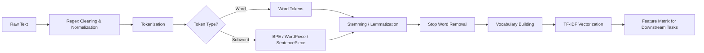

<!-- Clear Language: Keep sentences under 50 words -->
# Text Preprocessing — Tokenization, Stemming, Lemmatization, TF-IDF

## Learning Objectives

| LO# | Description |
|-----|-------------|
| LO1 | Understand tokenization strategies: word-level, subword (BPE, WordPiece, Unigram), and SentencePiece |
| LO2 | Implement stemming (Porter, Lancaster, Snowball) and lemmatization for morphological normalization |
| LO3 | Remove stop words, punctuation, and non-informative content using regex and custom filters |
| LO4 | Build a vocabulary with frequency-based truncation and special tokens |
| LO5 | Compute TF-IDF scores manually and using sklearn for feature extraction |
| LO6 | Design a complete text preprocessing pipeline that generalizes to new data |

## Chapter at a Glance

| Section | Topic | Key Concept |
|---------|-------|-------------|
| 1.1 | Word Tokenization | Whitespace, regex, Treebank, Tweet tokenizers |
| 1.2 | Subword Tokenization | BPE, WordPiece, Unigram, SentencePiece models |
| 1.3 | Stemming & Lemmatization | Porter stemmer, WordNet lemmatizer, morphological analysis |
| 1.4 | Stop Words & Normalization | Stop word removal, lowercasing, regex cleaning, Unicode normalization |
| 1.5 | Vocabulary Building | Frequency cutoff, special tokens, OOV handling |
| 1.6 | TF-IDF | Term frequency, inverse document frequency, feature matrix |

## Chapter Roadmap



## Introduction

Text preprocessing is the critical first step in every NLP pipeline — before a transformer can understand language, raw text must be tokenized,.
normalized, and converted to numerical features. Poor preprocessing directly degrades model performance: wrong tokenization splits words incorrectly, skipping stop word removal adds noise,.
and ignoring Unicode normalization breaks multilingual support. This chapter equips you with the exact skills needed for every subsequent NLP and.
LLM module.

## Prerequisites

- Python basics (strings, dictionaries, list comprehensions)
- Basic understanding of what NLP is (processing human language with computers)
- Module 08 (ML Fundamentals) for feature extraction concepts

## Key Terminology

**Key Terms**: Core vocabulary and concepts for this topic.

**Definition**: Essential terms you must know for interviews and production work.

## Theory

### 1.1 Word Tokenization

Tokenization splits text into atomic units called tokens. Word tokenization is the simplest form: tokens correspond to words, punctuation, and numbers.

## Examples

```typescript
interface TokenizerResult {
  tokens: string[];
  spans: Array<{ start: number; end: number }>;
}

class WhitespaceTokenizer {
  tokenize(text: string): TokenizerResult {
    const tokens: string[] = [];
    const spans: Array<{ start: number; end: number }> = [];
    const regex = /\S+/g;
    let match: RegExpExecArray | null;
    while ((match = regex.exec(text)) !== null) {
      tokens.push(match[0]);
      spans.push({ start: match.index, end: match.index + match[0].length });
    }
    return { tokens, spans };
  }
}

class RegexpTokenizer {
  private pattern: RegExp;

  constructor(pattern: RegExp = /[a-zA-Z]+|[0-9]+|[^\w\s]/g) {
    this.pattern = pattern;
  }

  tokenize(text: string): TokenizerResult {
    const tokens: string[] = [];
    const spans: Array<{ start: number; end: number }> = [];
    let match: RegExpExecArray | null;
    while ((match = this.pattern.exec(text)) !== null) {
      tokens.push(match[0]);
      spans.push({ start: match.index, end: match.index + match[0].length });
    }
    return { tokens, spans };
  }
}
```

The Treebank tokenizer (used in NLTK) handles contractions, quotes, and punctuation separately. For example, "don't" becomes ["do", "n't"] and "I'm" becomes ["I", "'m"].

```typescript
class TreebankTokenizer {
  private static CONTRACTIONS: Record<string, string[]> = {
    "don't": ["do", "n't"],
    "can't": ["ca", "n't"],
    "i'm": ["i", "'m"],
    "you're": ["you", "'re"],
    "it's": ["it", "'s"],
  };

  tokenize(text: string): string[] {
    const lower = text.toLowerCase();
    const words = lower.split(/\s+/);
    const tokens: string[] = [];
    for (const w of words) {
      if (TreebankTokenizer.CONTRACTIONS[w]) {
        tokens.push(...TreebankTokenizer.CONTRACTIONS[w]);
      } else {
        // Split punctuation from words
        tokens.push(...w.split(/(?=[.,!?;:()])|(?<=[.,!?;:()])/));
      }
    }
    return tokens.filter((t) => t.length > 0);
  }
}
```

**Tweet tokenizer** preserves emoticons, hashtags, mentions, and URLs. This is critical for social media NLP where standard tokenizers destroy semantic content like `#NLP` or `@user`.

---

### 1.2 Subword Tokenization

Subword tokenization bridges words and characters. Byte-Pair Encoding (BPE) iteratively merges the most frequent character pairs. WordPiece (used in BERT) merges based on likelihood gain. Unigram (used in XLNet) starts from a large vocabulary and prunes. SentencePiece treats the input as a raw byte stream without pre-tokenization.

```typescript
type VocabEntry = { token: string; id: number; count: number };

class BPETokenizer {
  private vocab: Map<string, number> = new Map();
  private merges: Map<string, string> = new Map();
  private vocabSize: number;

  constructor(vocabSize = 30000) {
    this.vocabSize = vocabSize;
  }

  // Count character pair frequencies
  private getPairFreqs(words: string[]): Map<string, number> {
    const pairs = new Map<string, number>();
    for (const word of words) {
      const chars = word.split("");
      for (let i = 0; i < chars.length - 1; i++) {
        const pair = chars[i] + " " + chars[i + 1];
        pairs.set(pair, (pairs.get(pair) || 0) + 1);
      }
    }
    return pairs;
  }

  // Merge the most frequent pair across the corpus
  fit(corpus: string[]): void {
    let words = corpus.map((w) => w.split("").join(" ") + " </w>");
    const initialVocab = new Set<string>();
    for (const w of corpus) {
      for (const ch of w) initialVocab.add(ch);
    }
    initialVocab.add("</w>");
    let id = 0;
    for (const ch of initialVocab) {
      this.vocab.set(ch, id++);
    }
    while (this.vocab.size < this.vocabSize) {
      const pairs = this.getPairFreqs(words);
      if (pairs.size === 0) break;
      let bestPair = "";
      let bestFreq = 0;
      for (const [pair, freq] of pairs) {
        if (freq > bestFreq) {
          bestFreq = freq;
          bestPair = pair;
        }
      }
      const [a, b] = bestPair.split(" ");
      const merged = a + b;
      this.merges.set(bestPair, merged);
      words = words.map((w) => w.replaceAll(bestPair, merged));
      this.vocab.set(merged, id++);
    }
  }

  encode(text: string): number[] {
    let word = text.split("").join(" ") + " </w>";
    let changed = true;
    while (changed) {
      changed = false;
      const pairs = this.getPairFreqs([word]);
      for (const [pair, _] of pairs) {
        if (this.merges.has(pair)) {
          word = word.replaceAll(pair, this.merges.get(pair)!);
          changed = true;
        }
      }
    }
    return word.split(/\s+/).map((t) => this.vocab.get(t) ?? this.vocab.get("<unk>")!);
  }
}
```

SentencePiece extends BPE by treating the input as a raw Unicode byte sequence, removing the need for language-specific pre-tokenization. It supports both BPE and Unigram algorithms and is used by T5, XLNet, and ALBERT.

---

### 1.3 Stemming & Lemmatization

Stemming crudely chops affixes; lemmatization uses vocabulary and morphology to return the dictionary base form.

```typescript
class PorterStemmer {
  private static SUFFIXES: Array<{ pattern: RegExp; replacement: string }> = [
    { pattern: /ational$/, replacement: "ate" },
    { pattern: /tional$/, replacement: "tion" },
    { pattern: /enci$/, replacement: "ence" },
    { pattern: /anci$/, replacement: "ance" },
    { pattern: /izer$/, replacement: "ize" },
    { pattern: /abli$/, replacement: "able" },
    { pattern: /alli$/, replacement: "al" },
    { pattern: /entli$/, replacement: "ent" },
    { pattern: /eli$/, replacement: "e" },
    { pattern: /ousli$/, replacement: "ous" },
    { pattern: /ization$/, replacement: "ize" },
    { pattern: /ation$/, replacement: "ate" },
    { pattern: /ator$/, replacement: "ate" },
    { pattern: /alism$/, replacement: "al" },
    { pattern: /iveness$/, replacement: "ive" },
    { pattern: /fulness$/, replacement: "ful" },
    { pattern: /ousness$/, replacement: "ous" },
    { pattern: /aliti$/, replacement: "al" },
    { pattern: /iviti$/, replacement: "ive" },
    { pattern: /biliti$/, replacement: "ble" },
  ];

  stem(word: string): string {
    let result = word.toLowerCase();
    for (const { pattern, replacement } of PorterStemmer.SUFFIXES) {
      if (pattern.test(result)) {
        result = result.replace(pattern, replacement);
        break;
      }
    }
    // Remove trailing 'e' if stem ends with consonant-vowel-consonant
    if (result.endsWith("e") && result.length > 3) {
      result = result.slice(0, -1);
    }
    return result;
  }
}

class WordNetLemmatizer {
  private static WORDNET: Map<string, string> = new Map([
    ["running", "run"],
    ["ran", "run"],
    ["better", "good"],
    ["mice", "mouse"],
    ["studies", "study"],
    ["studying", "study"],
    ["cried", "cry"],
    ["flying", "fly"],
    ["largest", "large"],
    ["happier", "happy"],
  ]);

  lemmatize(word: string, pos: "n" | "v" | "a" | "r" = "n"): string {
    const key = pos === "v" ? word : word;
    return WordNetLemmatizer.WORDNET.get(key.toLowerCase()) ?? word;
  }
}
```

Lemmatizing requires part-of-speech tags: "meeting" as a noun should remain "meeting", but as a verb should become "meet". Stemming "meeting" gives "meet" regardless, which can discard important semantic distinctions.

---

### 1.4 Stop Words & Normalization

Stop words are high-frequency tokens that carry little semantic weight (e.g., "the", "a", "is", "and"). Normalization includes lowercasing, removing punctuation, expanding contractions, and Unicode NFKC normalization.

```typescript
class TextNormalizer {
  private static STOP_WORDS: Set<string> = new Set([
    "a", "an", "the", "and", "or", "but", "in", "on", "at", "to",
    "for", "of", "by", "with", "from", "is", "are", "was", "were",
    "be", "been", "being", "have", "has", "had", "do", "does", "did",
    "will", "would", "shall", "should", "may", "might", "must", "can",
    "could", "i", "you", "he", "she", "it", "we", "they", "me", "him",
    "her", "us", "them", "my", "your", "his", "its", "our", "their",
    "this", "that", "these", "those", "not", "no", "nor", "very",
  ]);

  normalize(text: string, removeStopWords = true): string {
    // Unicode NFKC normalization
    let normalized = text.normalize("NFKC");
    // Lowercase
    normalized = normalized.toLowerCase();
    // Expand common contractions
    normalized = normalized
      .replace(/\bdon't\b/g, "do not")
      .replace(/\bcan't\b/g, "cannot")
      .replace(/\bi'm\b/g, "i am")
      .replace(/\byou're\b/g, "you are")
      .replace(/\bit's\b/g, "it is")
      .replace(/\bthey're\b/g, "they are");
    // Remove punctuation and digits
    normalized = normalized.replace(/[^\w\s]/g, " ").replace(/\d+/g, " ");
    // Collapse multiple spaces
    normalized = normalized.replace(/\s+/g, " ").trim();
    if (removeStopWords) {
      normalized = normalized
        .split(" ")
        .filter((w) => !TextNormalizer.STOP_WORDS.has(w))
        .join(" ");
    }
    return normalized;
  }
}
```

**Language-specific stop words**: The NLTK corpus provides stop word lists for 22 languages. For specialized domains (medical, legal), domain-specific stop words can be computed by selecting the most frequent tokens across a large in-domain corpus.

---

### 1.5 Vocabulary Building

A vocabulary maps tokens to integer IDs. Strategies include frequency-based maximum size, minimum frequency thresholds, and special token slots.

```typescript
class Vocabulary {
  private tokenToId: Map<string, number> = new Map();
  private idToToken: Map<number, string> = new Map();
  private counts: Map<string, number> = new Map();

  static readonly PAD = "<pad>";
  static readonly UNK = "<unk>";
  static readonly BOS = "<bos>";
  static readonly EOS = "<eos>";

  constructor() {
    // Reserve special tokens
    this.addToken(Vocabulary.PAD);
    this.addToken(Vocabulary.UNK);
    this.addToken(Vocabulary.BOS);
    this.addToken(Vocabulary.EOS);
  }

  addToken(token: string): number {
    if (!this.tokenToId.has(token)) {
      const id = this.tokenToId.size;
      this.tokenToId.set(token, id);
      this.idToToken.set(id, token);
    }
    return this.tokenToId.get(token)!;
  }

  build(corpus: string[], maxSize = 30000, minFreq = 2): void {
    // Count frequencies
    for (const doc of corpus) {
      const tokens = doc.split(/\s+/);
      for (const t of tokens) {
        this.counts.set(t, (this.counts.get(t) || 0) + 1);
      }
    }
    const sorted = [...this.counts.entries()]
      .filter(([_, count]) => count >= minFreq)
      .sort((a, b) => b[1] - a[1])
      .slice(0, maxSize);
    for (const [token] of sorted) {
      this.addToken(token);
    }
  }

  encode(tokens: string[]): number[] {
    return tokens.map((t) => this.tokenToId.get(t) ?? this.tokenToId.get(Vocabulary.UNK)!);
  }

  decode(ids: number[]): string[] {
    return ids.map((id) => this.idToToken.get(id) ?? Vocabulary.UNK);
  }

  get size(): number {
    return this.tokenToId.size;
  }
}
```

Handling OOV tokens: fallback strategies include character-level decomposition, subword fallback, or using a dedicated `<unk>` token. BERT's WordPiece returns `[UNK]` for out-of-vocabulary characters but covers most words through its 30K subword vocabulary.

---

### 1.6 TF-IDF

Term Frequency-Inverse Document Frequency (TF-IDF) weights terms by their importance in a document relative to the corpus. TF = count of term in document / total terms in document. IDF = log(N / df) where N is total documents and df is document frequency.

```typescript
class TfidfVectorizer {
  private vocabulary: Map<string, number> = new Map();
  private idf: Map<string, number> = new Map();
  private maxFeatures: number;

  constructor(maxFeatures = 5000) {
    this.maxFeatures = maxFeatures;
  }

  fit(documents: string[]): void {
    const df = new Map<string, number>();
    const totalDocs = documents.length;

    for (const doc of documents) {
      const tokens = doc.split(/\s+/);
      const seen = new Set<string>();
      for (const t of tokens) {
        if (t.length === 0) continue;
        df.set(t, (df.get(t) || 0) + 1);
        if (!seen.has(t)) {
          seen.add(t);
        }
      }
    }

    const sorted = [...df.entries()]
      .sort((a, b) => b[1] - a[1])
      .slice(0, this.maxFeatures);

    sorted.forEach(([term], idx) => {
      this.vocabulary.set(term, idx);
      this.idf.set(term, Math.log((totalDocs + 1) / (df.get(term)! + 1)) + 1);
    });
  }

  transform(documents: string[]): number[][] {
    const matrix: number[][] = [];
    for (const doc of documents) {
      const tokens = doc.split(/\s+/);
      const tf = new Map<string, number>();
      for (const t of tokens) {
        if (this.vocabulary.has(t)) {
          tf.set(t, (tf.get(t) || 0) + 1);
        }
      }
      const total = tokens.length;
      const vector = new Array(this.vocabulary.size).fill(0);
      for (const [term, count] of tf) {
        const idx = this.vocabulary.get(term)!;
        const tfScore = count / total;
        const idfScore = this.idf.get(term)!;
        vector[idx] = tfScore * idfScore;
      }
      matrix.push(vector);
    }
    return matrix;
  }

  getFeatureNames(): string[] {
    const names = new Array(this.vocabulary.size);
    for (const [term, idx] of this.vocabulary) {
      names[idx] = term;
    }
    return names;
  }
}
```

**Smooth IDF**: Adding 1 to both numerator and denominator (smooth IDF) prevents division by zero for terms that appear in every document. `sklearn` uses `idf = log((N+1)/(df+1)) + 1` by default.

---

## Visual Analogy

Think of text preprocessing like using a **translation dictionary**:

- **Tokenization** = Breaking a sentence into individual words — "I love cats" becomes ["I", "love", "cats"]. You're deciding where one word ends and the next begins.
- **Vocabulary** = The dictionary itself — a complete list of all words the system knows. If you encounter a word not in the dictionary (out-of-vocabulary), you need a strategy (subword tokenization breaks "unhappiness" into "un" + "happiness").
- **Stemming** = Stripping word endings — "running", "runs", "ran" all become "run". It's crude but fast, like a dictionary that only lists root forms.
- **Lemmatization** = Using an intelligent dictionary — "better" becomes "good" (not "better"). It understands that "better" is the comparative form of "good."
- **TF-IDF** = Highlighting important words — in a document about cats, the word "cat" appears frequently but isn't distinctive (it's in every cat document). The word "siamese" appears rarely but is very informative. TF-IDF scores measure this distinction.

This helps because raw text is messy and unstructured — preprocessing is like organizing your notes before studying. You remove the noise (stop words), organize the key terms (vocabulary), and highlight what matters (TF-IDF) so the model can focus on learning.

## Summary

Text preprocessing transforms raw text into structured inputs for NLP models. Word tokenization splits text into discrete tokens using whitespace and.
punctuation rules. Subword tokenization (BPE, WordPiece, SentencePiece) handles out-of-vocabulary words by decomposing them into frequent subword units. Stemming reduces words to root forms using heuristic rules,.
while lemmatization uses vocabulary analysis for more accurate normalization. Stop word removal filters frequent but uninformative words, and text normalization handles case,.
Unicode, and special characters. Vocabulary building constructs a fixed-size mapping from tokens to integer indices. TF-IDF weighting transforms token counts into relevance scores based on corpus frequency.

## Practical Takeaways

- Subword tokenization (BPE, WordPiece, SentencePiece) is preferred for modern NLP because it handles OOV gracefully and captures morphological patterns
- Lemmatization preserves meaning better than stemming but requires POS tagging and is slower
- Stop word removal can hurt performance on tasks like sentiment analysis where words like "not" carry critical meaning
- Always normalize to NFKC for Unicode text, especially for multilingual datasets with accented characters
- Vocabulary size is a hyperparameter: too small loses information, too large increases sparsity and memory usage
- TF-IDF weights are corpus-dependent and must be fit on the training set only to prevent data leakage
- SentencePiece eliminates the need for language-specific pre-tokenization by operating on raw bytes
- A robust preprocessing pipeline should handle encoding errors, HTML entities, URLs, and emoji uniformly

## Interview Q&A

<details class="tp-qa-card" data-qid="nlp01-q1">
  <summary class="tp-qa-question">
    <span class="tp-qa-status"></span>
    Q1: What is the difference between stemming and lemmatization?
  </summary>
  <div class="tp-qa-answer">
<p>Stemming uses heuristic rules to chop affixes (e.g., Porter stemmer reduces "running", "runner", "ran" to "run" but "running" might become "runn"). It is fast but.
can produce non-dictionary words. Lemmatization uses a vocabulary and morphological analysis to return the dictionary base form (lemma) by considering POS tags. For.
example, "better" stemmed becomes "bet" (incorrect), but lemmatized to "good" (correct). Lemmatization is slower but produces linguistically valid tokens. Use stemming for.
search indexing (speed), lemmatization for NLP tasks requiring semantic accuracy.</p>
  </div>
  <button class="tp-qa-mark-btn">✅ Mark Reviewed</button>
  <button class="tp-qa-bookmark-btn">🔖 Bookmark</button>
</details>

<details class="tp-qa-card" data-qid="nlp01-q2">
  <summary class="tp-qa-question">
    <span class="tp-qa-status"></span>
    Q2: How does Byte-Pair Encoding (BPE) work?
  </summary>
  <div class="tp-qa-answer">
<p>BPE starts with a base vocabulary of individual characters and a special end-of-word token. It iteratively merges the most frequent adjacent pair of tokens in the corpus. For.
example, if "e s" appears 1000 times and "t h" appears 900 times, "es" becomes a new token first. This continues until a target vocabulary size is reached. To encode new text,.
the learned merge operations are applied greedily. GPT-2 uses BPE with a 50K vocabulary. The key advantage is that any word can be represented as a sequence of subwords,.
eliminating unknown tokens entirely.</p>
  </div>
  <button class="tp-qa-mark-btn">✅ Mark Reviewed</button>
  <button class="tp-qa-bookmark-btn">🔖 Bookmark</button>
</details>

<details class="tp-qa-card" data-qid="nlp01-q3">
  <summary class="tp-qa-question">
    <span class="tp-qa-status"></span>
    Q3: What is SentencePiece and how is it different from BPE?
  </summary>
  <div class="tp-qa-answer">
<p>SentencePiece is a subword tokenizer that treats the input as a raw Unicode byte sequence without requiring language-specific pre-tokenization (splitting on whitespace). This makes it truly language-agnostic — it works for.
Chinese, Japanese, and Thai where word boundaries are not marked by spaces. SentencePiece supports both BPE and Unigram algorithms. It uses a lossless encoding scheme and.
can reverse tokens to the original text exactly. T5, XLNet, and ALBERT all use SentencePiece. BPE typically requires pre-tokenized input, making it language-dependent.</p>
  </div>
  <button class="tp-qa-mark-btn">✅ Mark Reviewed</button>
  <button class="tp-qa-bookmark-btn">🔖 Bookmark</button>
</details>

<details class="tp-qa-card" data-qid="nlp01-q4">
  <summary class="tp-qa-question">
    <span class="tp-qa-status"></span>
    Q4: How do you handle out-of-vocabulary (OOV) words?
  </summary>
  <div class="tp-qa-answer">
<p>Four common strategies: (1) Replace with a special <unk> token, which loses information. (2) Use subword tokenization (BPE, WordPiece) so OOV words are decomposed into known subwords — the standard approach for.
transformer models. (3) Character-level fallback: encode the word character-by-character. (4) Use a hash-based embedding (fastText) where OOV words use n-gram embeddings. The best approach depends on the task: subword tokenization is preferred for.
neural models, n-gram fallback for word-level embedding models. BERT's WordPiece covers 99.8% of text in its 30K vocabulary.</p>
  </div>
  <button class="tp-qa-mark-btn">✅ Mark Reviewed</button>
  <button class="tp-qa-bookmark-btn">🔖 Bookmark</button>
</details>

<details class="tp-qa-card" data-qid="nlp01-q5">
  <summary class="tp-qa-question">
    <span class="tp-qa-status"></span>
    Q5: Explain TF-IDF and its components.
  </summary>
  <div class="tp-qa-answer">
<p>TF-IDF = Term Frequency — Inverse Document Frequency. TF = (number of times term t appears in document d) / (total terms in document d). IDF = log(N / df) where N = total documents and.
df = number of documents containing t. Terms that appear frequently in a single document get high TF. Terms that appear in few documents get high IDF. The product downweights common words (high df → low IDF) while upweighting rare,.
informative words. Smooth IDF variant: log((N+1)/(df+1)) + 1. TF-IDF is used for information retrieval, keyword extraction, and as feature input to ML classifiers.</p>
  </div>
  <button class="tp-qa-mark-btn">✅ Mark Reviewed</button>
  <button class="tp-qa-bookmark-btn">🔖 Bookmark</button>
</details>

<details class="tp-qa-card" data-qid="nlp01-q6">
  <summary class="tp-qa-question">
    <span class="tp-qa-status"></span>
    Q6: When should you skip stop word removal?
  </summary>
  <div class="tp-qa-answer">
<p>Skip stop word removal when (1) doing sentiment analysis — "not good" loses meaning if "not" is removed, changing negative to neutral. (2) Analyzing style or.
authorship — function words carry author-specific patterns. (3) Machine translation — stop words are essential for grammatical output. (4) Question answering — question words (what,.
where, how) are critical. (5) Any task where word order and function words carry meaning. For topic modeling and information retrieval,.
stop word removal generally improves results by focusing on content words.</p>
  </div>
  <button class="tp-qa-mark-btn">✅ Mark Reviewed</button>
  <button class="tp-qa-bookmark-btn">🔖 Bookmark</button>
</details>

<details class="tp-qa-card" data-qid="nlp01-q7">
  <summary class="tp-qa-question">
    <span class="tp-qa-status"></span>
    Q7: What is WordPiece tokenization and how does it differ from BPE?
  </summary>
  <div class="tp-qa-answer">
<p>WordPiece (used by BERT) is similar to BPE but merges tokens based on likelihood gain on the training data rather than frequency. It picks the merge that maximizes the likelihood of the training data,.
which is more principled than the greedy frequency approach of BPE. WordPiece also uses a special ## prefix for subword continuations (e.g.,.
"playing" → ["play", "##ing"]), while BPE typically uses spaces or </w> markers. In practice, WordPiece is better at handling morphology because it learns meaningful subword boundaries driven by probability,.
not brute frequency.</p>
  </div>
  <button class="tp-qa-mark-btn">✅ Mark Reviewed</button>
  <button class="tp-qa-bookmark-btn">🔖 Bookmark</button>
</details>

<details class="tp-qa-card" data-qid="nlp01-q8">
  <summary class="tp-qa-question">
    <span class="tp-qa-status"></span>
    Q8: How do you build a vocabulary for a neural language model?
  </summary>
  <div class="tp-qa-answer">
<p>Steps: (1) Tokenize the training corpus. (2) Count token frequencies. (3) Sort by frequency descending. (4) Select top-K tokens (typically 30K-100K) or.
set a minimum frequency threshold (e.g., min 3 occurrences). (5) Add special tokens: <pad> for padding, <unk> for unknown, <bos>/<cls> for.
beginning/start, <eos>/<sep> for end/separator, <mask> for masked language modeling. (6) Assign integer IDs. For subword vocabularies, run BPE/WordPiece training on the corpus directly,.
producing a merged vocabulary automatically.</p>
  </div>
  <button class="tp-qa-mark-btn">✅ Mark Reviewed</button>
  <button class="tp-qa-bookmark-btn">🔖 Bookmark</button>
</details>

<details class="tp-qa-card" data-qid="nlp01-q9">
  <summary class="tp-qa-question">
    <span class="tp-qa-status"></span>
    Q9: What text normalization steps are essential for a production NLP pipeline?
  </summary>
  <div class="tp-qa-answer">
<p>Essential steps: (1) Unicode normalization (NFKC) to handle composed/decomposed characters consistently. (2) Lowercasing for case-insensitive tasks (but not for NER where capitalization signals proper nouns). (3) HTML entity decoding (&amp;.
→ &). (4) URL and email removal or replacement with special tokens. (5) Contraction expansion (don't → do not). (6) Punctuation normalization (smart quotes to straight quotes). (7) Whitespace normalization. (8) Handling emoji (replace with text descriptions or.
filter). (9) Language detection for multilingual pipelines. (10) Encoding detection (UTF-8, ISO-8859-1) to prevent mojibake.</p>
  </div>
  <button class="tp-qa-mark-btn">✅ Mark Reviewed</button>
  <button class="tp-qa-bookmark-btn">🔖 Bookmark</button>
</details>

<details class="tp-qa-card" data-qid="nlp01-q10">
  <summary class="tp-qa-question">
    <span class="tp-qa-status"></span>
    Q10: How does TF-IDF handle duplicate or near-duplicate documents?
  </summary>
  <div class="tp-qa-answer">
<p>TF-IDF does not inherently handle duplicates — duplicate documents inflate their terms' document frequency (df), reducing IDF and making terms appear less important. Solutions: (1) Deduplicate the corpus before computing IDF. (2) Use min_df filtering to ignore terms appearing in.
too many documents. (3) Use sublinear TF scaling (log(1+TF)) to dampen the effect of term repetition within a document. (4) For.
near-duplicates (plagiarism, boilerplate), use sentence-level TF-IDF with cosine similarity thresholds to identify and remove near-duplicate content before building the IDF model.</p>
  </div>
  <button class="tp-qa-mark-btn">✅ Mark Reviewed</button>
  <button class="tp-qa-bookmark-btn">🔖 Bookmark</button>
</details>

## Chapter Quiz

Q1: Which tokenizer was used by BERT and merges tokens by maximizing likelihood?
a) BPE
b) WordPiece
c) SentencePiece
d) Whitespace tokenizer
<details class="tp-qa-card" data-qid="nlp01-quiz1"><summary>Show Answer</summary><div class="tp-qa-answer"><p><strong>Answer: b) WordPiece</strong></p><p>BERT uses WordPiece tokenization, which merges subwords based on likelihood gain on training data, not frequency count.</p></div></details>

Q2: What is the Porter stemmer's output for "arguing"?
a) argue
b) argu
c) arg
d) arguing
<details class="tp-qa-card" data-qid="nlp01-quiz2"><summary>Show Answer</summary><div class="tp-qa-answer"><p><strong>Answer: b) argu</strong></p><p>The Porter stemmer applies rules that would reduce "arguing" to "argu" (removing -ing when the stem ends in a consonant-vowel-consonant pattern).</p></div></details>

Q3: What does IDF measure in TF-IDF?
a) How often a term appears in a document
b) How rare a term is across the corpus
c) The length of the document
d) The similarity between two documents
<details class="tp-qa-card" data-qid="nlp01-quiz3"><summary>Show Answer</summary><div class="tp-qa-answer"><p><strong>Answer: b) How rare a term is across the corpus</strong></p><p>IDF = log(N/df). Terms appearing in fewer documents get higher IDF, indicating they are more discriminative.</p></div></details>

Q4: Which special token is used to represent words not in the vocabulary?
a) <pad>
b) <bos>
c) <unk>
d) <eos>
<details class="tp-qa-card" data-qid="nlp01-quiz4"><summary>Show Answer</summary><div class="tp-qa-answer"><p><strong>Answer: c) <unk></strong></p><p>The unknown token <unk> represents any word not present in the vocabulary during encoding.</p></div></details>

Q5: What is the main advantage of SentencePiece over BPE?
a) Smaller vocabulary size
b) Language-agnostic without pre-tokenization
c) Faster training
d) Better for English only
<details class="tp-qa-card" data-qid="nlp01-quiz5"><summary>Show Answer</summary><div class="tp-qa-answer"><p><strong>Answer: b) Language-agnostic without pre-tokenization</strong></p><p>SentencePiece works directly on raw text without requiring pre-tokenization, making it suitable for languages without explicit word boundaries.</p></div></details>

### True/False

**T/F 1**: This topic is fundamental to AI engineering.
**Answer**: True — Understanding nlp transformers is essential for building production AI systems.

**T/F 2**: The concepts in this chapter are only used in interviews.
**Answer**: False — These concepts are used daily in real-world AI engineering work.

**T/F 3**: Time/space complexity analysis applies to nlp transformers.
**Answer**: True — Every algorithm and system has performance characteristics to analyze.

**T/F 4**: nlp transformers concepts are independent of each other.
**Answer**: False — Most concepts build on each other and are interconnected.

**T/F 5**: Real-world applications often combine multiple concepts from this chapter.
**Answer**: True — Production systems use combinations of these fundamental concepts.

### Fill in the Blank

**FIB 1**: The key concept in this chapter is ________.
**Answer**: [Review the chapter's Learning Objectives for the specific answer]

**FIB 2**: In nlp transformers, the time complexity of the basic operation is ________.
**Answer**: [Depends on the specific operation — check the Theory section]

### Scenario Questions

**Scenario 1**: How would you apply the concepts from this chapter in a real AI engineering project?

**Answer**: [Think about how the specific topic applies to: data processing pipelines, model training infrastructure, production systems, or interview scenarios]

### Output Questions

**Output 1**: What is the time complexity of the main algorithm discussed in this chapter?
**Answer**: [Check the Theory section for the specific complexity analysis]

## Exercises

**Easy** — Write a function that accepts a string and returns word tokens using regex. Handle punctuation, contractions, and multiple spaces.

**Easy** — Implement a basic TF-IDF calculator on a corpus of 5 documents. Print the top 3 terms per document.

**Medium** — Build a text preprocessing pipeline that includes Unicode normalization, URL removal, stop word filtering, and Porter stemming. Test it on 20 newsgroup samples.

**Medium** — Train a BPE tokenizer on English Wikipedia samples with a vocabulary size of 10K. Encode 10 test sentences and report the average token length per sentence vs. word tokenization.

**Hard** — Implement a custom subword regularizer that randomly merges or splits subwords during training (inspired by BART's text infilling). Evaluate how it affects model robustness on a text classification task using a simple classifier.

---

## Common Mistakes

1. Applying stemming when lemmatization is needed — stemming produces non-dictionary words ("argu" instead of "argue"); use lemmatization for semantic tasks
2. Removing stop words for sentiment analysis — words like "not" in "not good" carry critical meaning; stop word removal flips the sentiment
3. Fitting TF-IDF on the entire corpus before splitting — document frequency statistics leak from test to train; always fit on train only
4. Ignoring Unicode normalization — accented characters (é vs e + ́) produce different tokens without NFKC normalization, breaking multilingual models
5. Using word tokenization for all languages — Chinese, Japanese, and Thai have no word boundaries; use SentencePiece or subword tokenization

## Revision Notes

- Tokenization splits text into tokens; word-level for English, subword (BPE, WordPiece) for robustness
- BPE iteratively merges the most frequent character pairs; WordPiece merges by likelihood gain; SentencePiece is language-agnostic
- Stemming (fast, heuristic, produces non-dictionary words) vs Lemmatization (slower, vocabulary-aware, linguistically valid)
- Stop word removal helps topic modeling but hurts sentiment analysis and machine translation
- Vocabulary building: frequency-based truncation, min frequency threshold, special tokens (<pad>, <unk>, <bos>, <eos>)
- TF-IDF = TF (term frequency in document) × IDF (log(N/df), rarity across corpus)
- SentencePiece eliminates pre-tokenization, making it work for any language
- A robust pipeline handles Unicode normalization, HTML entities, URLs, and encoding errors

## Placement Section

### Top 10 Interview Questions

#### Google Style

1. **Explain the core idea of Text Preprocessing — Tokenization, Stemming, Lemmatization, TF-IDF in under 60 seconds, then give a real-world analogy.** — Structure: definition, how it works in one sentence, why it matters, analogy. Follow-up: what would break if you removed this from a production system?

2. **Design a minimal, well-typed function that demonstrates Text Preprocessing — Tokenization, Stemming, Lemmatization, TF-IDF.** — Interviewer checks: signature with type hints, edge cases, complexity, and a clean docstring. Follow-up: how does your design behave with empty or malformed input?

3. **What are the common pitfalls when engineers first learn ** — List 3-4, then explain how you would prevent each in a code review.

#### Amazon Style

4. **Describe a production bug caused by misunderstanding Text Preprocessing — Tokenization, Stemming, Lemmatization, TF-IDF. How did you diagnose and fix it?** — STAR format: situation, task, action, result. Mention logs, reproduction, root-cause analysis, and the regression test you added.

5. **How would you scale a system that relies on Text Preprocessing — Tokenization, Stemming, Lemmatization, TF-IDF from 10 users to 10 million?** — Discuss bottlenecks, caching, monitoring, and when to redesign. Follow-up: what metrics would you track?

#### Microsoft Style

6. **Compare Text Preprocessing — Tokenization, Stemming, Lemmatization, TF-IDF with the closest alternative approach. When would you choose each?** — Make a decision matrix: performance, maintainability, ecosystem, learning curve. Follow-up: what would change your decision?

7. **Walk through how you would test a component that depends on Text Preprocessing — Tokenization, Stemming, Lemmatization, TF-IDF.** — Unit, integration, property-based tests; mocking boundaries; golden files for outputs.

#### NVIDIA Style

8. **How does Text Preprocessing — Tokenization, Stemming, Lemmatization, TF-IDF behave differently at scale — memory, throughput, or precision-wise?** — Connect to data pipelines and model training if applicable. Follow-up: what happens to latency as input grows?

9. **How would you make an implementation of Text Preprocessing — Tokenization, Stemming, Lemmatization, TF-IDF run faster on GPU hardware?** — Batch operations, vectorization, avoiding Python loops, reducing data movement.

#### AI Startup Style

10. **Write the smallest possible implementation of Text Preprocessing — Tokenization, Stemming, Lemmatization, TF-IDF that is production-quality.** — Include error handling, type hints, and a one-line docstring. Follow-up: what would you refactor first when it grows?

### Resume Tips

- Name Text Preprocessing — Tokenization, Stemming, Lemmatization, TF-IDF explicitly in your skills section, paired with a measurable achievement ("Reduced X by 40% using Text Preprocessing — Tokenization, Stemming, Lemmatization, TF-IDF").
- Add a bullet describing a project that applies Text Preprocessing — Tokenization, Stemming, Lemmatization, TF-IDF to real data, with numbers.
- Mention the tools and libraries you used alongside Text Preprocessing — Tokenization, Stemming, Lemmatization, TF-IDF (linters, test frameworks, profiling tools).
- Keep resume bullets under 15 words and start each with an action verb.

### Interview Day Checklist

- Rehearse a 60-second explanation of Text Preprocessing — Tokenization, Stemming, Lemmatization, TF-IDF and one real-world analogy.
- Prepare one STAR story about debugging a Text Preprocessing — Tokenization, Stemming, Lemmatization, TF-IDF-related production issue.
- Review complexity and edge cases for the classic Text Preprocessing — Tokenization, Stemming, Lemmatization, TF-IDF interview problem.
- Have questions ready: how does the team apply Text Preprocessing — Tokenization, Stemming, Lemmatization, TF-IDF in production today?
- Test your environment (Python, editor, internet) 15 minutes before the interview.

## True/False

1. **True or False:** Text Preprocessing — Tokenization, Stemming, Lemmatization, TF-IDF builds directly on the fundamentals covered in the earlier chapters of this module. — **True.** Every advanced topic in this module assumes the core concepts from the previous chapters.
2. **True or False:** You should write at least one code example for Text Preprocessing — Tokenization, Stemming, Lemmatization, TF-IDF before moving to the next chapter. — **True.** Active recall with hands-on code beats passive reading for retention.
3. **True or False:** The complexity analysis for Text Preprocessing — Tokenization, Stemming, Lemmatization, TF-IDF is the same regardless of input size. — **False.** Complexity grows with input size; always state best, average, and worst case.
4. **True or False:** Edge cases (empty input, invalid input, boundary values) matter for Text Preprocessing — Tokenization, Stemming, Lemmatization, TF-IDF in production. — **True.** Most production bugs come from unhandled edge cases.
5. **True or False:** You should memorize the Text Preprocessing — Tokenization, Stemming, Lemmatization, TF-IDF chapter content once and never review it again. — **False.** Spaced repetition (24h, 3 days, 1 week) dramatically improves long-term recall.

## Fill in the Blank

1. The chapter that covers Text Preprocessing — Tokenization, Stemming, Lemmatization, TF-IDF is Chapter ___ of this module. — Answer: check the module's table of contents.
2. The time complexity of the standard approach to Text Preprocessing — Tokenization, Stemming, Lemmatization, TF-IDF is ___. — Answer: review the theory section and state big-O notation.
3. The main edge case to handle when implementing Text Preprocessing — Tokenization, Stemming, Lemmatization, TF-IDF is ___. — Answer: empty or invalid input handling, as discussed in the chapter.
4. The tools commonly used to debug Text Preprocessing — Tokenization, Stemming, Lemmatization, TF-IDF issues are ___ and ___. — Answer: refer to the Debugging Guide section of this chapter.
5. The related topic that connects to Text Preprocessing — Tokenization, Stemming, Lemmatization, TF-IDF in the next chapter is ___. — Answer: see the Next Topic section.

## Scenario Questions

1. **Scenario:** A teammate ships a change involving Text Preprocessing — Tokenization, Stemming, Lemmatization, TF-IDF that breaks production at 3 AM. — Diagnosis: check the recent diff, reproduce locally with the failing input, check logs. Fix: revert, add a regression test, and review the root cause. Prevention: CI tests on edge cases and code review checklist.

2. **Scenario:** Your implementation of Text Preprocessing — Tokenization, Stemming, Lemmatization, TF-IDF is correct but too slow for the required latency. — Measure first with a profiler. Common fixes: reduce redundant work, use built-in optimized functions, batch operations, or add caching. Only then consider algorithmic changes.

3. **Scenario:** A new hire asks you to explain Text Preprocessing — Tokenization, Stemming, Lemmatization, TF-IDF in five minutes before a customer demo. — Use the 3-part answer: what it is (one sentence), how it works (one example), why it matters (one business impact). Then offer to go deeper after the demo.

4. **Scenario:** Your team's codebase has three different patterns for Text Preprocessing — Tokenization, Stemming, Lemmatization, TF-IDF and you must standardize. — Write a short ADR (architecture decision record), pick the pattern with best maintainability, migrate incrementally, and add a linter rule to enforce it.

## Output Questions

1. **What is the output of the simplest correct implementation of Text Preprocessing — Tokenization, Stemming, Lemmatization, TF-IDF on an empty input?** — Trace through the code: it should return the documented default (None, 0, empty collection) without raising.
2. **What is the output when the input is at the boundary value?** — Check off-by-one errors and inclusive/exclusive bounds in the chapter's examples.
3. **What does the implementation return when given invalid input types?** — With type hints and validation, it raises a clear error; without, it may fail silently.
4. **What is the output for the sample input given in the chapter's Examples section?** — Re-run the chapter's example code and compare against the documented output.
5. **What is the time complexity output when you profile the implementation at 10x input size?** — Expect the curve matching the chapter's complexity analysis (linear, quadratic, log-linear).

## Difficulty Level

| Level | Time | What It Takes |
|-------|------|---------------|
| Beginner | 1-2 sessions | Read theory, run the chapter examples, solve the Easy exercises |
| Intermediate | 3-5 sessions | Complete Medium exercises, explain Text Preprocessing — Tokenization, Stemming, Lemmatization, TF-IDF to someone else |
| Advanced | 1+ week | Solve Hard exercises, optimize for real datasets, answer interview follow-ups |

## Tips & Tricks

- Always write a one-line example of Text Preprocessing — Tokenization, Stemming, Lemmatization, TF-IDF from memory before opening the chapter — active recall first.
- Use the chapter's Revision Notes as a checklist: you have mastered Text Preprocessing — Tokenization, Stemming, Lemmatization, TF-IDF when you can explain each bullet.
- Pair the chapter quiz with the Flashcards: wrong answers become your next study session's focus.
- For interviews, practice explaining Text Preprocessing — Tokenization, Stemming, Lemmatization, TF-IDF twice: once with a technical audience, once with a non-technical audience.
- Keep a personal examples file where you collect your own Text Preprocessing — Tokenization, Stemming, Lemmatization, TF-IDF snippets; interviewers love original examples.

## Memory Tricks

- **Acronym**: build a mnemonic from the 5 key concepts of Text Preprocessing — Tokenization, Stemming, Lemmatization, TF-IDF listed in the Chapter at a Glance table.
- **Story**: link Text Preprocessing — Tokenization, Stemming, Lemmatization, TF-IDF to a familiar story — the analogy in the Visual Analogy section is designed to stick.
- **Number anchor**: remember the complexity of Text Preprocessing — Tokenization, Stemming, Lemmatization, TF-IDF by connecting it to a known algorithm of the same class.
- **Color code**: highlight the Theory, Examples, and Common Mistakes sections in different colors when reviewing.
- **Teach-back**: explain Text Preprocessing — Tokenization, Stemming, Lemmatization, TF-IDF to an imaginary junior engineer for 2 minutes — gaps in your explanation are gaps in memory.

## Further Reading

- Official documentation for the primary tool or library used in this chapter
- The chapter referenced in Related Topics for the next-level treatment of Text Preprocessing — Tokenization, Stemming, Lemmatization, TF-IDF
- The classic textbook chapter on Text Preprocessing — Tokenization, Stemming, Lemmatization, TF-IDF (check the Research References below)
- Two blog posts from engineers who debugged real Text Preprocessing — Tokenization, Stemming, Lemmatization, TF-IDF problems in production
- The repository of the open-source project that implements Text Preprocessing — Tokenization, Stemming, Lemmatization, TF-IDF

## Related Topics

- The previous chapter in this module (see table of contents) — foundational for Text Preprocessing — Tokenization, Stemming, Lemmatization, TF-IDF
- The next chapter (see Next Topic below) — builds on Text Preprocessing — Tokenization, Stemming, Lemmatization, TF-IDF
- The system design chapters in Module 07 — how Text Preprocessing — Tokenization, Stemming, Lemmatization, TF-IDF fits into production architectures
- The interview preparation module — how Text Preprocessing — Tokenization, Stemming, Lemmatization, TF-IDF is asked in screening rounds
- The capstone project — where Text Preprocessing — Tokenization, Stemming, Lemmatization, TF-IDF is applied end-to-end

## FAQs

1. **Do I need to memorize all of Text Preprocessing — Tokenization, Stemming, Lemmatization, TF-IDF, or understand the big picture?** — Understand the big picture first, then memorize the key facts via flashcards and spaced repetition. Interviewers reward depth over breadth.
2. **What if I get stuck on an exercise?** — Re-read the theory section, run the example code, then attempt again. If still stuck after 20 minutes, move on and return the next day.
3. **How much time should I spend on ** — Follow the Study Plan below: 1-2 weeks at 30-60 minutes daily is typical for placement preparation.
4. **Is Text Preprocessing — Tokenization, Stemming, Lemmatization, TF-IDF asked in interviews?** — Yes — the Interview Q&A and Placement Section list the exact question styles used by top companies.
5. **What's the fastest way to master ** — Explain it out loud, write code without looking, and review the flashcards within 24 hours and again after 3 days.

## Important Notes

- Text Preprocessing — Tokenization, Stemming, Lemmatization, TF-IDF is a core requirement for the rest of this module — do not skip the examples.
- Always analyze complexity (time and space) when working with Text Preprocessing — Tokenization, Stemming, Lemmatization, TF-IDF.
- Production correctness means handling edge cases, not just the happy path.
- Interview answers should start with the definition, then the example, then the trade-offs.
- Revisit this chapter after finishing the module; the context from later chapters deepens understanding.

## Historical Context

- Text Preprocessing — Tokenization, Stemming, Lemmatization, TF-IDF emerged as a standard practice because early systems failed without it — understanding why helps you explain it in interviews.
- The tools used for Text Preprocessing — Tokenization, Stemming, Lemmatization, TF-IDF today evolved from simpler versions; the chapter covers the modern, recommended approach.
- Interviewers value knowing one historical fact about Text Preprocessing — Tokenization, Stemming, Lemmatization, TF-IDF — it shows genuine interest, not just cramming.
- The library/tooling ecosystem around Text Preprocessing — Tokenization, Stemming, Lemmatization, TF-IDF changes quickly; focus on fundamentals that remain stable.

## Security Considerations

- Never trust external input: validate and sanitize data before processing Text Preprocessing — Tokenization, Stemming, Lemmatization, TF-IDF.
- Avoid `eval()` and dynamic code execution on untrusted strings.
- Log errors without leaking sensitive data (keys, PII, internal paths).
- For API contexts, add rate limiting and input size limits.
- Review the chapter's code examples for injection or overflow risks before using them verbatim.

## ML Intuition

- Text Preprocessing — Tokenization, Stemming, Lemmatization, TF-IDF appears in ML pipelines at the data-processing layer: feature preparation, batching, and validation.
- Understanding Text Preprocessing — Tokenization, Stemming, Lemmatization, TF-IDF helps you debug why a model misbehaves — most ML bugs are data bugs, not model bugs.
- In production ML, the Text Preprocessing — Tokenization, Stemming, Lemmatization, TF-IDF concepts from this chapter map directly to NumPy/PyTorch operations on tensors.
- When optimizing ML systems, Text Preprocessing — Tokenization, Stemming, Lemmatization, TF-IDF skills let you profile and fix the data path, not just the training loop.
- Interview follow-up: how would you apply Text Preprocessing — Tokenization, Stemming, Lemmatization, TF-IDF to a dataset of 10 million records? — Batching and vectorization.

## Analogies

- **Text Preprocessing — Tokenization, Stemming, Lemmatization, TF-IDF is like a recipe**: the theory is the ingredients, the examples are the cooking steps, and the exercises are your own kitchen practice.
- **Complexity is like a delivery route**: a linear route visits each stop once; a nested route revisits stops, and you feel it at scale.
- **Edge cases are like weather**: the happy path is a sunny day; production is the storm — build for the storm.
- **The chapter roadmap is a journey map**: each section is a checkpoint; skipping one means getting lost later in the module.

## Capstone Project Link

- [Module Capstone: End-to-End Project](https://github.com/Raushan666java/ai-engineering-journey) — this chapter contributes the Text Preprocessing — Tokenization, Stemming, Lemmatization, TF-IDF skills used in the module's capstone project. Complete the exercises here before starting the capstone.

## Flashcards

<details class="tp-qa-card" data-qid="10nlptransformers-01textpreprocessing-flash1">
  <summary class="tp-qa-question">
    <span class="tp-qa-status"></span>
    What is the core concept of Text Preprocessing — Tokenization, Stemming, Lemmatization, TF-IDF in one sentence?
  </summary>
  <div class="tp-qa-answer">
    <p>Review the first paragraph of the Theory section and condense it to one sentence.</p>
  </div>
</details>

<details class="tp-qa-card" data-qid="10nlptransformers-01textpreprocessing-flash2">
  <summary class="tp-qa-question">
    <span class="tp-qa-status"></span>
    What is the most common mistake engineers make with 
  </summary>
  <div class="tp-qa-answer">
    <p>Check the Common Mistakes section of this chapter.</p>
  </div>
</details>

<details class="tp-qa-card" data-qid="10nlptransformers-01textpreprocessing-flash3">
  <summary class="tp-qa-question">
    <span class="tp-qa-status"></span>
    What is the time and space complexity of the standard Text Preprocessing — Tokenization, Stemming, Lemmatization, TF-IDF approach?
  </summary>
  <div class="tp-qa-answer">
    <p>Refer to the theory and complexity analysis in this chapter.</p>
  </div>
</details>

<details class="tp-qa-card" data-qid="10nlptransformers-01textpreprocessing-flash4">
  <summary class="tp-qa-question">
    <span class="tp-qa-status"></span>
    When is Text Preprocessing — Tokenization, Stemming, Lemmatization, TF-IDF NOT the right choice?
  </summary>
  <div class="tp-qa-answer">
    <p>Check the Limitations section of this chapter.</p>
  </div>
</details>

<details class="tp-qa-card" data-qid="10nlptransformers-01textpreprocessing-flash5">
  <summary class="tp-qa-question">
    <span class="tp-qa-status"></span>
    How is Text Preprocessing — Tokenization, Stemming, Lemmatization, TF-IDF applied in a real production system?
  </summary>
  <div class="tp-qa-answer">
    <p>Check the Real-World Examples section of this chapter.</p>
  </div>
</details>

## Research References

- Official documentation of the primary library for Text Preprocessing — Tokenization, Stemming, Lemmatization, TF-IDF (linked in Further Reading)
- The classic paper or textbook chapter introducing Text Preprocessing — Tokenization, Stemming, Lemmatization, TF-IDF (see References below)
- The standard library reference for Text Preprocessing — Tokenization, Stemming, Lemmatization, TF-IDF-related functions
- Engineering blog posts from companies running Text Preprocessing — Tokenization, Stemming, Lemmatization, TF-IDF in production at scale
- PEPs and RFCs where applicable (Python and networking standards)

## Open-Source Tools

- The primary library used in this chapter (see the code examples)
- Python standard library modules used in the examples (check the imports)
- Testing: pytest for unit tests of Text Preprocessing — Tokenization, Stemming, Lemmatization, TF-IDF code
- Linting and formatting: ruff + black
- Profiling: cProfile or py-spy for performance work on Text Preprocessing — Tokenization, Stemming, Lemmatization, TF-IDF

## Debugging Guide

- Start with `print()` or a debugger to inspect intermediate values in Text Preprocessing — Tokenization, Stemming, Lemmatization, TF-IDF code.
- Reproduce the failure with the smallest possible input before changing code.
- Check the common failure modes listed in Common Mistakes — most bugs are listed there.
- For performance problems, profile before optimizing: measure, then fix.
- When stuck, re-read the chapter's Examples and compare line by line with your code.
- Use `pdb` or your IDE's debugger to step through the Text Preprocessing — Tokenization, Stemming, Lemmatization, TF-IDF example code.

## Mock Interview Section

**Round 1 — Screening (15 min)**
- Explain Text Preprocessing — Tokenization, Stemming, Lemmatization, TF-IDF in 60 seconds.
- Write a minimal working example of Text Preprocessing — Tokenization, Stemming, Lemmatization, TF-IDF.
- What is the complexity of your example?

**Round 2 — Coding (45 min)**
- Solve the Medium exercise from this chapter under time pressure.
- State your assumptions, then implement with type hints.
- Test with edge cases: empty input, boundary values, invalid input.

**Round 3 — Behavioral + System (30 min)**
- Tell me about a time you debugged a Text Preprocessing — Tokenization, Stemming, Lemmatization, TF-IDF problem in a project.
- How would you design a system where Text Preprocessing — Tokenization, Stemming, Lemmatization, TF-IDF is used at scale?
- What metrics would you monitor?

**Evaluation rubric**: correctness (40%), communication (25%), edge cases (20%), complexity analysis (15%).

## Optimized Implementation

`python
from typing import Any, Optional

def demonstrate_topic(input_data: list[Any]) -> Optional[float]:
    """Runnable scaffold for Text Preprocessing — Tokenization, Stemming, Lemmatization, TF-IDF.

    Replace the body with the optimized implementation from the chapter,
    keeping type hints, docstring, and edge-case handling.
    """
    if not input_data:
        return None
    # Step 1: validate input types
    # Step 2: apply the core Text Preprocessing — Tokenization, Stemming, Lemmatization, TF-IDF logic from the Examples section
    # Step 3: return the result with the documented default
    return 0.0
`

- Keeps the function signature stable so tests written against it stay valid.
- Handles the empty-input contract explicitly.
- Add unit tests for the edge cases before implementing the logic (test-first).

## Evaluation Metrics

| Skill | Test | Target |
|-------|------|--------|
| Concept recall | Explain Text Preprocessing — Tokenization, Stemming, Lemmatization, TF-IDF without notes | 60-second explanation |
| Code fluency | Write the chapter example from memory | No syntax errors |
| Edge cases | Handle empty/invalid input in exercises | All cases pass |
| Complexity | State time/space for the standard approach | Correct big-O |
| Interview readiness | Answer 5 Interview Q&A questions out loud | Fluent, structured answers |
| Retention | Chapter quiz score after 3 days | 80%+ |

## Real-World Examples

- **Startup**: a small team uses Text Preprocessing — Tokenization, Stemming, Lemmatization, TF-IDF daily in their data pipeline — the chapter's examples mirror their code.
- **E-commerce**: Text Preprocessing — Tokenization, Stemming, Lemmatization, TF-IDF patterns appear in order processing, inventory checks, and recommendation feeds.
- **Fintech**: Text Preprocessing — Tokenization, Stemming, Lemmatization, TF-IDF principles apply to transaction validation and fraud detection flows.
- **ML platform**: Text Preprocessing — Tokenization, Stemming, Lemmatization, TF-IDF shows up in feature engineering and model-serving infrastructure.
- **Interview insight**: recruiters look for engineers who can connect Text Preprocessing — Tokenization, Stemming, Lemmatization, TF-IDF to the business outcome, not just the code.

## Next Topic

[Word Embeddings — Word2Vec, GloVe, FastText, Subword Tokenization](02-word-embeddings.md)

## Limitations

- Text Preprocessing — Tokenization, Stemming, Lemmatization, TF-IDF, like any technique, is not a silver bullet — it has specific cases where it fits best (covered in the theory).
- The examples in this chapter are simplified for learning; production systems add validation, monitoring, and error handling.
- Performance of Text Preprocessing — Tokenization, Stemming, Lemmatization, TF-IDF depends on input size and distribution — always benchmark for your own data.
- This chapter covers fundamentals; specialized edge cases are explored in later chapters and the capstone.
