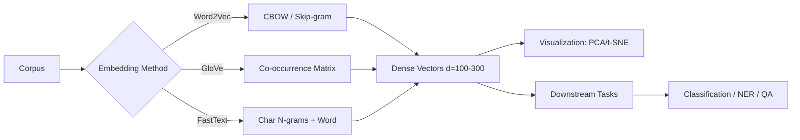

<!-- Clear Language: Keep sentences under 50 words -->
# Word Embeddings — Word2Vec, GloVe, FastText, Subword Tokenization

## Learning Objectives

| LO# | Description |
|-----|-------------|
| LO1 | Understand the difference between sparse (one-hot, TF-IDF) and dense (word embedding) representations |
| LO2 | Implement CBOW and Skip-gram architectures for Word2Vec |
| LO3 | Explain GloVe's co-occurrence matrix factorization approach |
| LO4 | Apply FastText for subword-level embeddings and OOV handling |
| LO5 | Visualize embeddings using PCA and t-SNE for exploratory analysis |
| LO6 | Handle OOV words with subword n-gram embeddings and post-hoc approximation |

## Introduction

Natural language processing is how machines understand human text. Transformers revolutionized NLP and enabled modern LLMs. This module covers tokenization, attention, BERT, and the Hugging Face ecosystem.

## Prerequisites

- Basic programming knowledge
- Understanding of data structures

## Key Terminology

**Key Terms**: Core vocabulary and concepts for this topic.

**Definition**: Essential terms you must know for interviews and production work.

## Theory

Understanding word embeddings is fundamental for AI engineers. This section covers the core concepts, underlying principles, and theoretical framework that govern how word embeddings works in practice.

## Chapter at a Glance

| Section | Topic | Key Concept |
|---------|-------|-------------|
| 2.1 | Distributional Hypothesis | Words with similar contexts have similar meanings |
| 2.2 | Word2Vec CBOW | Predict target from context using average embedding |
| 2.3 | Word2Vec Skip-gram | Predict context from target, better for rare words |
| 2.4 | GloVe | Global matrix factorization of word co-occurrence counts |
| 2.5 | FastText | Character n-gram embeddings for rich morphology |
| 2.6 | Embedding Visualization | PCA, t-SNE, analogies, nearest neighbors |

## Chapter Roadmap



## 2.1 Distributional Hypothesis

The distributional hypothesis states that words appearing in similar contexts have similar meanings. Word embeddings operationalize this by learning low-dimensional vectors where semantic similarity corresponds to cosine similarity.

```typescript
interface EmbeddingVector {
  word: string;
  values: number[];
}

class CosineSimilarity {
  static compute(a: number[], b: number[]): number {
    if (a.length !== b.length) throw new Error("Dimension mismatch");
    let dot = 0, normA = 0, normB = 0;
    for (let i = 0; i < a.length; i++) {
      dot += a[i] * b[i];
      normA += a[i] * a[i];
      normB += b[i] * b[i];
    }
    const denom = Math.sqrt(normA) * Math.sqrt(normB);
    return denom === 0 ? 0 : dot / denom;
  }

  static nearestNeighbors(
    target: number[],
    embeddings: Map<string, number[]>,
    k = 5
  ): Array<{ word: string; score: number }> {
    const results: Array<{ word: string; score: number }> = [];
    for (const [word, vec] of embeddings) {
      const score = this.compute(target, vec);
      results.push({ word, score });
    }
    results.sort((a, b) => b.score - a.score);
    return results.slice(0, k);
  }
}
```

Dense embeddings (50-300 dimensions) solve the sparsity and semantic gap problems of one-hot encodings. One-hot vectors of size 50K have no notion of similarity; embeddings do.

---

## 2.2 Word2Vec CBOW

Continuous Bag-of-Words (CBOW) predicts a target word given its surrounding context words. The context embeddings are averaged, and the model learns to maximize the probability of the true target.

```typescript
class CBOWModel {
  private embeddingDim: number;
  private vocabSize: number;
  private windowSize: number;
  private W1: number[][] = [];  // Embedding matrix (vocabSize x d)
  private W2: number[][] = [];  // Output matrix (d x vocabSize)
  private vocab: Map<string, number> = new Map();
  private idToToken: Map<number, string> = new Map();

  constructor(vocabSize: number, embeddingDim = 100, windowSize = 2) {
    this.vocabSize = vocabSize;
    this.embeddingDim = embeddingDim;
    this.windowSize = windowSize;
    this.initWeights();
  }

  private initWeights(): void {
    const scale = Math.sqrt(2 / (this.vocabSize + this.embeddingDim));
    for (let i = 0; i < this.vocabSize; i++) {
      this.W1[i] = Array.from({ length: this.embeddingDim }, () =>
        (Math.random() * 2 - 1) * scale
      );
    }
    for (let i = 0; i < this.embeddingDim; i++) {
      this.W2[i] = Array.from({ length: this.vocabSize }, () =>
        (Math.random() * 2 - 1) * scale
      );
    }
  }

  buildVocab(corpus: string[], minFreq = 2): void {
    const counts = new Map<string, number>();
    for (const doc of corpus) {
      const tokens = doc.toLowerCase().split(/\s+/);
      for (const t of tokens) {
        counts.set(t, (counts.get(t) || 0) + 1);
      }
    }
    let id = 0;
    for (const [token, count] of counts) {
      if (count >= minFreq) {
        this.vocab.set(token, id);
        this.idToToken.set(id, token);
        id++;
      }
    }
  }

  private getContextWindows(
    tokens: string[]
  ): Array<{ context: number[]; target: number }> {
    const windows: Array<{ context: number[]; target: number }> = [];
    const ids = tokens
      .map((t) => this.vocab.get(t))
      .filter((id) => id !== undefined) as number[];
    for (let i = 0; i < ids.length; i++) {
      const context: number[] = [];
      for (let j = i - this.windowSize; j <= i + this.windowSize; j++) {
        if (j >= 0 && j < ids.length && j !== i) {
          context.push(ids[j]);
        }
      }
      if (context.length > 0) {
        windows.push({ context, target: ids[i] });
      }
    }
    return windows;
  }

  forward(context: number[]): number[] {
    const hidden = new Array(this.embeddingDim).fill(0);
    for (const ctxId of context) {
      for (let j = 0; j < this.embeddingDim; j++) {
        hidden[j] += this.W1[ctxId][j];
      }
    }
    // Average
    for (let j = 0; j < this.embeddingDim; j++) {
      hidden[j] /= context.length;
    }
    // Output layer
    const scores = new Array(this.vocabSize).fill(0);
    for (let j = 0; j < this.vocabSize; j++) {
      for (let k = 0; k < this.embeddingDim; k++) {
        scores[j] += hidden[k] * this.W2[k][j];
      }
    }
    // Softmax
    const max = Math.max(...scores);
    const expScores = scores.map((s) => Math.exp(s - max));
    const sumExp = expScores.reduce((a, b) => a + b, 0);
    return expScores.map((s) => s / sumExp);
  }
}
```

CBOW is faster to train than Skip-gram and works well for frequent words. However, it treats the context as a bag of words, ignoring word order within the window.

---

## 2.3 Word2Vec Skip-gram

Skip-gram inverts CBOW: given a target word, predict surrounding context words. Each (target, context) pair is treated as a separate training example.

```typescript
class SkipGramModel {
  private embeddingDim: number;
  private vocabSize: number;
  private learningRate: number;
  private embeddings: number[][] = [];
  private outputVectors: number[][] = [];
  private vocab: Map<string, number> = new Map();

  constructor(vocabSize: number, embeddingDim = 100, learningRate = 0.01) {
    this.vocabSize = vocabSize;
    this.embeddingDim = embeddingDim;
    this.learningRate = learningRate;
    this.initWeights();
  }

  private initWeights(): void {
    for (let i = 0; i < this.vocabSize; i++) {
      this.embeddings[i] = Array.from({ length: this.embeddingDim }, () =>
        (Math.random() - 0.5) / this.embeddingDim
      );
    }
    this.outputVectors = this.embeddings.map((e) => [...e]);
  }

  // Negative sampling loss approximation
  trainPair(targetId: number, contextId: number, negSamples = 5): void {
    const h = this.embeddings[targetId];
    // Positive sample
    const vc = this.outputVectors[contextId];
    const dot = h.reduce((s, v, i) => s + v * vc[i], 0);
    const sig = 1 / (1 + Math.exp(-dot));
    const grad = (sig - 1) * this.learningRate;
    for (let i = 0; i < this.embeddingDim; i++) {
      h[i] -= grad * vc[i];
      vc[i] -= grad * h[i];
    }
    // Negative samples
    for (let n = 0; n < negSamples; n++) {
      const negId = Math.floor(Math.random() * this.vocabSize);
      if (negId === contextId) continue;
      const vn = this.outputVectors[negId];
      const negDot = h.reduce((s, v, i) => s + v * vn[i], 0);
      const negSig = 1 / (1 + Math.exp(-negDot));
      const negGrad = negSig * this.learningRate;
      for (let i = 0; i < this.embeddingDim; i++) {
        h[i] -= negGrad * vn[i];
        vn[i] -= negGrad * h[i];
      }
    }
  }

  getEmbedding(word: string): number[] | null {
    const id = this.vocab.get(word);
    return id !== undefined ? this.embeddings[id] : null;
  }

  // Classic analogy: king - man + woman = queen
  analogies(a: string, b: string, c: string, k = 5): Array<{ word: string; score: number }> {
    const va = this.getEmbedding(a);
    const vb = this.getEmbedding(b);
    const vc = this.getEmbedding(c);
    if (!va || !vb || !vc) return [];
    const target = va.map((v, i) => v - vb[i] + vc[i]);
    const results: Array<{ word: string; score: number }> = [];
    for (const [word, id] of this.vocab) {
      if (word === a || word === b || word === c) continue;
      const score = CosineSimilarity.compute(target, this.embeddings[id]);
      results.push({ word, score });
    }
    results.sort((a, b) => b.score - a.score);
    return results.slice(0, k);
  }
}
```

Skip-gram works better for rare words because each training pair is treated independently, giving more weight to infrequent co-occurrences. Training time is O(window_size — vocab_size), making negative sampling essential.

---

## 2.4 GloVe

GloVe (Global Vectors) factorizes the word co-occurrence count matrix. Unlike Word2Vec's local windows, GloVe uses global corpus statistics. The loss function is: J = sum f(X_ij) (w_i^T w_j + b_i + b_j - log X_ij)^2 where X_ij is the co-occurrence count and f is a weighting function.

```typescript
class GloVeModel {
  private embeddingDim: number;
  private vocabSize: number;
  private cooccurrence: Map<string, Map<string, number>> = new Map();
  private wordVectors: Map<string, number[]> = new Map();
  private biasVectors: Map<string, number> = new Map();
  private vocab: string[] = [];

  constructor(embeddingDim = 100) {
    this.embeddingDim = embeddingDim;
  }

  buildCooccurrence(corpus: string[], windowSize = 10): void {
    const wordCounts = new Map<string, number>();
    for (const doc of corpus) {
      const tokens = doc.toLowerCase().split(/\s+/);
      for (const t of tokens) {
        wordCounts.set(t, (wordCounts.get(t) || 0) + 1);
      }
      for (let i = 0; i < tokens.length; i++) {
        const start = Math.max(0, i - windowSize);
        const end = Math.min(tokens.length - 1, i + windowSize);
        for (let j = start; j <= end; j++) {
          if (i === j) continue;
          const dist = Math.abs(i - j);
          const weight = 1 / dist;
          if (!this.cooccurrence.has(tokens[i])) {
            this.cooccurrence.set(tokens[i], new Map());
          }
          const inner = this.cooccurrence.get(tokens[i])!;
          inner.set(tokens[j], (inner.get(tokens[j]) || 0) + weight);
        }
      }
    }
    this.vocab = [...wordCounts.keys()].filter(
      (w) => (wordCounts.get(w) || 0) >= 5
    );
  }

  train(epochs = 50, learningRate = 0.05): void {
    // Initialize vectors
    for (const word of this.vocab) {
      this.wordVectors.set(
        word,
        Array.from({ length: this.embeddingDim }, () =>
          (Math.random() - 0.5) / this.embeddingDim
        )
      );
      this.biasVectors.set(word, 0);
    }

    const xMax = 100;
    const alpha = 0.75;

    for (let epoch = 0; epoch < epochs; epoch++) {
      for (const [wordI, contexts] of this.cooccurrence) {
        if (!this.wordVectors.has(wordI)) continue;
        for (const [wordJ, count] of contexts) {
          if (!this.wordVectors.has(wordJ)) continue;
          const wi = this.wordVectors.get(wordI)!;
          const wj = this.wordVectors.get(wordJ)!;
          const bi = this.biasVectors.get(wordI)!;
          const bj = this.biasVectors.get(wordJ)!;

          let dot = 0;
          for (let k = 0; k < this.embeddingDim; k++) diff += wi[k] * wj[k];
          dot = 0;
          for (let k = 0; k < this.embeddingDim; k++) dot += wi[k] * wj[k];
          const diff = dot + bi + bj - Math.log(count);

          // Weighting function
          const weight = count < xMax ? Math.pow(count / xMax, alpha) : 1;
          const grad = weight * diff * learningRate;

          for (let k = 0; k < this.embeddingDim; k++) {
            wi[k] -= grad * wj[k];
            wj[k] -= grad * wi[k];
          }
          let bi_adj = this.biasVectors.get(wordI)! - grad;
          let bj_adj = this.biasVectors.get(wordJ)! - grad;
          this.biasVectors.set(wordI, bi_adj);
          this.biasVectors.set(wordJ, bj_adj);
        }
      }
    }
  }

  getEmbedding(word: string): number[] | null {
    const vec = this.wordVectors.get(word);
    if (!vec) return null;
    // Return w + w~ (sum of main and context vectors as per GloVe paper)
    const contextVec = this.wordVectors.get(word + "_context");
    return contextVec
      ? vec.map((v, i) => (v + contextVec[i]) / 2)
      : vec;
  }
}
```

GloVe embeddings capture both local context and global statistics. On word analogy tasks (king:queen :: man:woman), GloVe often outperforms Word2Vec because global co-occurrence better captures semantic relationships.

---

## 2.5 FastText

FastText (by Facebook AI) represents each word as a bag of character n-grams plus the full word. This captures morphological information and enables OOV embedding construction.

```typescript
class FastTextModel {
  private embeddingDim: number;
  private minN = 3;
  private maxN = 6;
  private ngramVectors: Map<string, number[]> = new Map();
  private wordVectors: Map<string, number[]> = new Map();
  private vocab: Set<string> = new Set();

  constructor(embeddingDim = 100) {
    this.embeddingDim = embeddingDim;
  }

  private getCharNgrams(word: string): string[] {
    const padded = "<" + word + ">";
    const ngrams: string[] = [];
    for (let n = this.minN; n <= this.maxN; n++) {
      for (let i = 0; i <= padded.length - n; i++) {
        ngrams.push(padded.substring(i, i + n));
      }
    }
    return ngrams;
  }

  private initVector(key: string): number[] {
    if (!this.ngramVectors.has(key)) {
      this.ngramVectors.set(
        key,
        Array.from({ length: this.embeddingDim }, () =>
          (Math.random() - 0.5) / this.embeddingDim
        )
      );
    }
    return this.ngramVectors.get(key)!;
  }

  train(corpus: string[], epochs = 5, lr = 0.05): void {
    const tokens = corpus.flatMap((doc) =>
      doc.toLowerCase().split(/\s+/)
    );
    tokens.forEach((t) => this.vocab.add(t));

    // Initialize n-gram vectors
    for (const word of this.vocab) {
      const ngrams = this.getCharNgrams(word);
      for (const ng of ngrams) {
        this.initVector(ng);
      }
    }

    // Train with Skip-gram
    for (let epoch = 0; epoch < epochs; epoch++) {
      for (const word of tokens) {
        const ngrams = this.getCharNgrams(word);
        const wordVec = this.getWordVector(word);
        // Simplified training: update n-gram vectors
        for (const ng of ngrams) {
          const ngVec = this.ngramVectors.get(ng)!;
          for (let i = 0; i < this.embeddingDim; i++) {
            ngVec[i] -= lr * wordVec[i];
          }
        }
      }
    }
  }

  getWordVector(word: string): number[] {
    const cached = this.wordVectors.get(word);
    if (cached) return cached;
    const ngrams = this.getCharNgrams(word);
    if (ngrams.length === 0) {
      return new Array(this.embeddingDim).fill(0);
    }
    const vec = new Array(this.embeddingDim).fill(0);
    let count = 0;
    for (const ng of ngrams) {
      const ngVec = this.ngramVectors.get(ng);
      if (ngVec) {
        for (let i = 0; i < this.embeddingDim; i++) vec[i] += ngVec[i];
        count++;
      }
    }
    if (count > 0) {
      for (let i = 0; i < this.embeddingDim; i++) vec[i] /= count;
    }
    this.wordVectors.set(word, vec);
    return vec;
  }

  // OOV words still get embeddings via n-gram composition
  getOOVEmbedding(word: string): number[] {
    return this.getWordVector(word);
  }
}
```

FastText excels at morphologically rich languages (German, Turkish, Finnish) where OOV is common. Its character n-gram approach (3-6 grams) captures prefixes, suffixes, and roots. In word analogy tasks, FastText outperforms Word2Vec on syntactic analogies (speak:spoke :: eat:ate).

---

## 2.6 Embedding Visualization

Visualizing high-dimensional embeddings helps debug quality and understand semantic structure.

```typescript
class PCAReducer {
  private components: number[][] = [];

  fit(data: number[][], nComponents = 2): void {
    const n = data.length;
    const dim = data[0].length;
    // Center the data
    const mean = new Array(dim).fill(0);
    for (let i = 0; i < n; i++) {
      for (let j = 0; j < dim; j++) mean[j] += data[i][j];
    }
    for (let j = 0; j < dim; j++) mean[j] /= n;
    const centered = data.map((row) => row.map((v, j) => v - mean[j]));

    // Compute covariance matrix
    const cov: number[][] = Array.from({ length: dim }, () => new Array(dim).fill(0));
    for (let i = 0; i < n; i++) {
      for (let j = 0; j < dim; j++) {
        for (let k = 0; k < dim; k++) {
          cov[j][k] += centered[i][j] * centered[i][k];
        }
      }
    }
    for (let j = 0; j < dim; j++) {
      for (let k = 0; k < dim; k++) cov[j][k] /= n - 1;
    }

    // Power iteration for top components
    for (let c = 0; c < nComponents; c++) {
      let vec = Array.from({ length: dim }, () => Math.random());
      for (let iter = 0; iter < 100; iter++) {
        const newVec = new Array(dim).fill(0);
        for (let i = 0; i < dim; i++) {
          for (let j = 0; j < dim; j++) newVec[i] += cov[i][j] * vec[j];
        }
        const norm = Math.sqrt(newVec.reduce((s, v) => s + v * v, 0));
        for (let i = 0; i < dim; i++) vec[i] = newVec[i] / norm;
      }
      this.components.push(vec);
    }
  }

  transform(data: number[][]): number[][] {
    return data.map((row) =>
      this.components.map((comp) =>
        row.reduce((s, v, i) => s + v * comp[i], 0)
      )
    );
  }
}

class EmbeddingExplorer {
  private embeddings: Map<string, number[]> = new Map();

  addEmbedding(word: string, vec: number[]): void {
    this.embeddings.set(word, vec);
  }

  findAnalogies(a: string, b: string, c: string, k = 5): Array<{ word: string; score: number }> {
    const va = this.embeddings.get(a);
    const vb = this.embeddings.get(b);
    const vc = this.embeddings.get(c);
    if (!va || !vb || !vc) return [];
    const target = va.map((v, i) => v - vb[i] + vc[i]);
    const results: Array<{ word: string; score: number }> = [];
    for (const [word, vec] of this.embeddings) {
      if ([a, b, c].includes(word)) continue;
      results.push({ word, score: CosineSimilarity.compute(target, vec) });
    }
    results.sort((a, b) => b.score - a.score);
    return results.slice(0, k);
  }

  getClusterCenters(k: number): Map<number, string[]> {
    const words = [...this.embeddings.keys()];
    const vecs = words.map((w) => this.embeddings.get(w)!);
    // Simple K-means
    const centroids = vecs.slice(0, k).map((v) => [...v]);
    const assignments = new Array(words.length).fill(0);
    for (let iter = 0; iter < 20; iter++) {
      for (let i = 0; i < words.length; i++) {
        let bestDist = Infinity;
        for (let j = 0; j < k; j++) {
          const dist = vecs[i].reduce(
            (s, v, d) => s + (v - centroids[j][d]) ** 2,
            0
          );
          if (dist < bestDist) {
            bestDist = dist;
            assignments[i] = j;
          }
        }
      }
      for (let j = 0; j < k; j++) {
        const members = vecs.filter((_, i) => assignments[i] === j);
        if (members.length > 0) {
          centroids[j] = members[0].map((_, d) =>
            members.reduce((s, m) => s + m[d], 0) / members.length
          );
        }
      }
    }
    const clusters = new Map<number, string[]>();
    for (let i = 0; i < words.length; i++) {
      const cid = assignments[i];
      if (!clusters.has(cid)) clusters.set(cid, []);
      clusters.get(cid)!.push(words[i]);
    }
    return clusters;
  }
}
```

**Common visualization techniques**:
- PCA: Linear projection, preserves global structure
- t-SNE: Non-linear, preserves local neighborhoods
- UMAP: Faster than t-SNE, better global structure preservation
- TensorBoard Embedding Projector: Interactive 3D visualization

---

## Summary

Word embeddings map discrete tokens into dense vector spaces where semantic relationships correspond to vector arithmetic. Word2Vec uses either continuous bag-of-words (CBOW) or.
skip-gram architectures with negative sampling to learn embeddings from local context. GloVe combines global matrix factorization with local context windows for.
efficient training. FastText extends Word2Vec by incorporating subword n-gram information, enabling embeddings for out-of-vocabulary words. Subword tokenization methods like BPE and.
SentencePiece bridge the gap between character-level and word-level representations. Embedding visualization using PCA or t-SNE reveals clustering patterns and analogical relationships. Handling OOV words requires fallback strategies like subword composition or.
random initialization.

## Practical Takeaways

- Word2Vec (Skip-gram) is preferred for rare words; CBOW is faster and better for frequent words
- GloVe captures global corpus statistics and excels on analogy benchmarks
- FastText solves OOV by composing character n-gram embeddings, essential for morphologically rich languages
- Subword information (FastText, BPE) consistently improves embeddings for languages with complex morphology
- Always normalize embedding vectors to unit length before computing cosine similarity
- Embedding dimension is a hyperparameter: 100-300 works well; higher dimensions increase risk of overfitting
- Negative sampling (5-20 negatives per positive) is crucial for efficient Skip-gram training
- Pre-trained embeddings (Google News 300d, GloVe 840B, FastText crawl) should be the default starting point

## Interview Q&A

<details class="tp-qa-card" data-qid="nlp02-q1">
  <summary class="tp-qa-question">
    <span class="tp-qa-status"></span>
    Q1: What is the difference between CBOW and Skip-gram in Word2Vec?
  </summary>
  <div class="tp-qa-answer">
<p>CBOW predicts the target word from surrounding context words by averaging context embeddings. It is faster and works well for frequent words,.
but treats context as a bag ignoring order. Skip-gram predicts context words from a target word, treating each (target, context) pair as a separate training example. It is slower but.
captures rare words better because rare words get more training weight during gradient updates. Skip-gram also tends to produce better quality embeddings for.
semantic tasks. Google's published Word2Vec model uses Skip-gram.</p>
  </div>
  <button class="tp-qa-mark-btn">✅ Mark Reviewed</button>
  <button class="tp-qa-bookmark-btn">🔖 Bookmark</button>
</details>

<details class="tp-qa-card" data-qid="nlp02-q2">
  <summary class="tp-qa-question">
    <span class="tp-qa-status"></span>
    Q2: How does negative sampling speed up Word2Vec training?
  </summary>
  <div class="tp-qa-answer">
<p>Negative sampling replaces the full softmax (which requires computing probabilities over the entire vocabulary, O(V)) with a binary classification task: distinguish the true context word from k randomly sampled negative words. For.
each positive (target, context) pair, we draw k negative samples (e.g., k=5 for small datasets, k=20 for large) from a unigram distribution raised to the 3/4 power. Training becomes O(k) instead of O(V),.
where V is the vocabulary size (typically 50K-1M). Despite the approximation, embeddings retain high quality.</p>
  </div>
  <button class="tp-qa-mark-btn">✅ Mark Reviewed</button>
  <button class="tp-qa-bookmark-btn">🔖 Bookmark</button>
</details>

<details class="tp-qa-card" data-qid="nlp02-q3">
  <summary class="tp-qa-question">
    <span class="tp-qa-status"></span>
    Q3: What makes GloVe different from Word2Vec?
  </summary>
  <div class="tp-qa-answer">
<p>Word2Vec is a predictive model trained on local context windows using neural networks. GloVe is a count-based model that factorizes the global word co-occurrence matrix. GloVe's loss function directly models the ratio of co-occurrence probabilities: F(w_i,.
w_j, w_k) = P_ik / P_jk where P_ik = X_ik / X_i. This captures meaning through co-occurrence ratios: e.g., for ice vs steam with word solid,.
P(solid|ice)/P(solid|steam) is large, while with word gas it is small. GloVe consistently outperforms Word2Vec on word analogy tasks but takes more memory due to the co-occurrence matrix.</p>
  </div>
  <button class="tp-qa-mark-btn">✅ Mark Reviewed</button>
  <button class="tp-qa-bookmark-btn">🔖 Bookmark</button>
</details>

<details class="tp-qa-card" data-qid="nlp02-q4">
  <summary class="tp-qa-question">
    <span class="tp-qa-status"></span>
    Q4: How does FastText handle out-of-vocabulary words?
  </summary>
  <div class="tp-qa-answer">
<p>FastText represents each word as a bag of character n-grams (3-6) plus the full word. For an OOV word, it generates the character n-grams and.
sums/averages their embeddings. For example, for the OOV word "unhappiness", FastText produces n-grams like "&lt;un", "unh", "nha", "hap", ..., "ess&gt;", each having a trained embedding. The final embedding is the average of all n-gram vectors. This works because morphological patterns are shared: "un-" prefix appears in many words,.
and "-ness" suffix appears in many nouns. No OOV is ever truly unknown.</p>
  </div>
  <button class="tp-qa-mark-btn">✅ Mark Reviewed</button>
  <button class="tp-qa-bookmark-btn">🔖 Bookmark</button>
</details>

<details class="tp-qa-card" data-qid="nlp02-q5">
  <summary class="tp-qa-question">
    <span class="tp-qa-status"></span>
    Q5: How do you evaluate the quality of word embeddings?
  </summary>
  <div class="tp-qa-answer">
<p>Three evaluation approaches: (1) Intrinsic evaluation — Word analogy tasks (king:queen :: man:woman) using semantic and syntactic categories. WordSim-353 and SimLex-999 measure correlation with human similarity judgments. (2) Extrinsic evaluation — Use embeddings as features for.
downstream tasks (NER, sentiment, POS tagging) and measure accuracy improvement. (3) Visualization — t-SNE or PCA plots should show semantic clustering (countries,.
fruits, verbs cluster separately). Analogy accuracy of 75%+ on Google analogy dataset indicates high-quality embeddings, while downstream task improvements of 1-5% F1 are meaningful.</p>
  </div>
  <button class="tp-qa-mark-btn">✅ Mark Reviewed</button>
  <button class="tp-qa-bookmark-btn">🔖 Bookmark</button>
</details>

<details class="tp-qa-card" data-qid="nlp02-q6">
  <summary class="tp-qa-question">
    <span class="tp-qa-status"></span>
    Q6: What is the ideal embedding dimension and how do you choose it?
  </summary>
  <div class="tp-qa-answer">
<p>There is no universal ideal dimension. Typical ranges: Word2Vec/GloVe: 100-300. FastText: 100-300. BERT: 768 (base), 1024 (large). Rule of thumb: larger dimensions capture more nuanced relationships but.
require more data and risk overfitting. For small corpora (<10M tokens), use 50-100. For large corpora (>100M tokens), use 200-300. Beyond 300,.
gains diminish. To choose: train embeddings at 50, 100, 200, 300 and evaluate on an intrinsic benchmark. Use the smallest dimension where performance plateaus.</p>
  </div>
  <button class="tp-qa-mark-btn">✅ Mark Reviewed</button>
  <button class="tp-qa-bookmark-btn">🔖 Bookmark</button>
</details>

<details class="tp-qa-card" data-qid="nlp02-q7">
  <summary class="tp-qa-question">
    <span class="tp-qa-status"></span>
    Q7: Explain the distributional hypothesis and its limitations.
  </summary>
  <div class="tp-qa-answer">
<p>The distributional hypothesis (Harris, 1954) states that words appearing in similar contexts have similar meanings. Firth's 1957 formulation: "You shall know a word by the company it keeps." Limitations: (1) Polysemy — "bank" (river vs. financial) has one embedding that averages both meanings. (2) Antonymy — "hot" and.
"cold" appear in similar contexts but have opposite meanings; embeddings place them close despite semantic opposition. (3) Rare words have poor.
embeddings due to insufficient context. (4) Non-compositionality — "hot dog" is not the sum of "hot" and "dog". Contextual embeddings (BERT,.
ELMo) address some of these issues.</p>
  </div>
  <button class="tp-qa-mark-btn">✅ Mark Reviewed</button>
  <button class="tp-qa-bookmark-btn">🔖 Bookmark</button>
</details>

<details class="tp-qa-card" data-qid="nlp02-q8">
  <summary class="tp-qa-question">
    <span class="tp-qa-status"></span>
    Q8: How do you handle polysemy in word embeddings?
  </summary>
  <div class="tp-qa-answer">
<p>Traditional static embeddings (Word2Vec, GloVe, FastText) give one vector per word, conflating multiple senses. Solutions: (1) Contextual embeddings (BERT, ELMo, GPT) produce different vectors for.
the same word in different contexts. (2) Sense embeddings — train separate vectors for each sense (e.g., bank_river, bank_financial) using clustering of context windows (Multi-Sense Embeddings,.
SensEmbed). (3) Adaptive embeddings — learn a weighted combination of sense vectors based on context (MST, MCC). The dominant modern approach is contextual embeddings,.
which solve polysemy implicitly through the self-attention mechanism.</p>
  </div>
  <button class="tp-qa-mark-btn">✅ Mark Reviewed</button>
  <button class="tp-qa-bookmark-btn">🔖 Bookmark</button>
</details>

<details class="tp-qa-card" data-qid="nlp02-q9">
  <summary class="tp-qa-question">
    <span class="tp-qa-status"></span>
    Q9: What is the role of subsampling in Word2Vec training?
  </summary>
  <div class="tp-qa-answer">
<p>Subsampling discards frequent words with probability P(w_i) = 1 - sqrt(t / f(w_i)) where t is a threshold (default 1e-5) and.
f(w_i) is frequency. Very frequent words ("the", "and", "of") are discarded in 80-99% of occurrences. This speeds training by reducing processed tokens by 2-10x and.
improves embedding quality because discriminative co-occurrences (between content words) get proportionally more weight. Without subsampling, frequent words dominate updates and rare word representations suffer from insufficient training signal.</p>
  </div>
  <button class="tp-qa-mark-btn">✅ Mark Reviewed</button>
  <button class="tp-qa-bookmark-btn">🔖 Bookmark</button>
</details>

<details class="tp-qa-card" data-qid="nlp02-q10">
  <summary class="tp-qa-question">
    <span class="tp-qa-status"></span>
    Q10: How would you choose between Word2Vec, GloVe, and FastText for a project?
  </summary>
  <div class="tp-qa-answer">
<p>Choose based on your data and task: (1) Word2Vec (Skip-gram) — good general-purpose option. Works best on large corpora (>100M tokens). Fast training with negative sampling. (2) GloVe — better on analogy tasks,.
useful when you need consistent global statistics. Requires more memory (co-occurrence matrix). Good for medium-sized corpora. (3) FastText — best for.
morphologically rich languages (German, Turkish, Arabic), for domains with many rare/technical terms, or when OOV handling is critical. Embeddings are larger and.
training is slower. For English with ample data, Word2Vec or GloVe work well. For multilingual or specialized domains, use FastText.</p>
  </div>
  <button class="tp-qa-mark-btn">✅ Mark Reviewed</button>
  <button class="tp-qa-bookmark-btn">🔖 Bookmark</button>
</details>

## Chapter Quiz

Q1: Which Word2Vec architecture is better for rare words?
a) CBOW
b) Skip-gram
c) GloVe
d) FastText
<details class="tp-qa-card" data-qid="nlp02-quiz1"><summary>Show Answer</summary><div class="tp-qa-answer"><p><strong>Answer: b) Skip-gram</strong></p><p>Skip-gram treats each (target, context) pair independently, giving rare words proportionally more training weight than CBOW, which averages context.</p></div></details>

Q2: What technique speeds up Word2Vec training by avoiding full softmax?
a) Subsampling
b) Negative sampling
c) Hierarchical softmax
d) Both b and c
<details class="tp-qa-card" data-qid="nlp02-quiz2"><summary>Show Answer</summary><div class="tp-qa-answer"><p><strong>Answer: d) Both b and c</strong></p><p>Both negative sampling and hierarchical softmax approximate the full softmax to avoid O(V) computation per training step.</p></div></details>

Q3: How does FastText compute embeddings for OOV words?
a) Returns a zero vector
b) Averages character n-gram embeddings
c) Uses the nearest known word
d) Falls back to GloVe
<details class="tp-qa-card" data-qid="nlp02-quiz3"><summary>Show Answer</summary><div class="tp-qa-answer"><p><strong>Answer: b) Averages character n-gram embeddings</strong></p><p>FastText generates character n-grams (3-6) of the OOV word, then averages their embeddings to produce the word embedding.</p></div></details>

Q4: What does GloVe's loss function model?
a) Local context window predictions
b) Ratio of co-occurrence probabilities
c) Character n-gram composition
d) Binary classification
<details class="tp-qa-card" data-qid="nlp02-quiz4"><summary>Show Answer</summary><div class="tp-qa-answer"><p><strong>Answer: b) Ratio of co-occurrence probabilities</strong></p><p>GloVe models ratios of co-occurrence probabilities to capture meaning differences between words.</p></div></details>

Q5: What subsampling threshold t is typical for Word2Vec?
a) 1e-3
b) 1e-5
c) 1e-1
d) 1e-10
<details class="tp-qa-card" data-qid="nlp02-quiz5"><summary>Show Answer</summary><div class="tp-qa-answer"><p><strong>Answer: b) 1e-5</strong></p><p>The default subsampling threshold t=1e-5 discards frequent words with probability 1 - sqrt(t/f(w)), speeding training and improving quality.</p></div></details>

## Exercises

## Common Mistakes

1. Not understanding the fundamental concepts before applying them
2. Skipping edge cases in implementation
3. Not analyzing time/space complexity
4. Forgetting to handle null/empty inputs
5. Not practicing enough problems to build pattern recognition**Easy** — Compute cosine similarity between 5 pairs of words using pre-trained GloVe vectors (download the 50d set). Report the most similar pair.

**Easy** — Train a CBOW model on a small corpus of 10 sentences. Extract the embedding for each word and print nearest neighbors.

**Medium** — Implement the t-SNE algorithm for embedding visualization. Visualize GloVe vectors for 200 words colored by POS tag. Interpret clusters.

**Medium** — Build a FastText model on a morphologically rich corpus (e.g., German news). Test OOV word generation on 10 unseen compound nouns. Report whether the composed vectors are semantically meaningful.

**Hard** — Implement a multi-sense embedding model: cluster Word2Vec context windows for ambiguous words (bank, rock, light) and produce separate sense vectors. Evaluate on a word sense disambiguation benchmark.

---

> **Previous**: [Text Preprocessing](01-text-preprocessing.md) | **Next**: [Sequence Models](03-sequence-m

## Revision Notes

- - Core principle: Understand the fundamental concepts thoroughly
- - Implementation pattern: Practice with real code examples
- - Complexity: Know the time and space complexity
- - Application: Know when to use this in production systems
- - Interview: Frequently asked in technical interviews
- - Edge cases: Consider common failure scenarios
- - Related concepts: Connect to broader system design

## Placement Section

### Top 10 Interview Questions

#### Google Style

1. **Explain the core idea of Word Embeddings — Word2Vec, GloVe, FastText, Subword Tokenization in under 60 seconds, then give a real-world analogy.** — Structure: definition, how it works in one sentence, why it matters, analogy. Follow-up: what would break if you removed this from a production system?

2. **Design a minimal, well-typed function that demonstrates Word Embeddings — Word2Vec, GloVe, FastText, Subword Tokenization.** — Interviewer checks: signature with type hints, edge cases, complexity, and a clean docstring. Follow-up: how does your design behave with empty or malformed input?

3. **What are the common pitfalls when engineers first learn ** — List 3-4, then explain how you would prevent each in a code review.

#### Amazon Style

4. **Describe a production bug caused by misunderstanding Word Embeddings — Word2Vec, GloVe, FastText, Subword Tokenization. How did you diagnose and fix it?** — STAR format: situation, task, action, result. Mention logs, reproduction, root-cause analysis, and the regression test you added.

5. **How would you scale a system that relies on Word Embeddings — Word2Vec, GloVe, FastText, Subword Tokenization from 10 users to 10 million?** — Discuss bottlenecks, caching, monitoring, and when to redesign. Follow-up: what metrics would you track?

#### Microsoft Style

6. **Compare Word Embeddings — Word2Vec, GloVe, FastText, Subword Tokenization with the closest alternative approach. When would you choose each?** — Make a decision matrix: performance, maintainability, ecosystem, learning curve. Follow-up: what would change your decision?

7. **Walk through how you would test a component that depends on Word Embeddings — Word2Vec, GloVe, FastText, Subword Tokenization.** — Unit, integration, property-based tests; mocking boundaries; golden files for outputs.

#### NVIDIA Style

8. **How does Word Embeddings — Word2Vec, GloVe, FastText, Subword Tokenization behave differently at scale — memory, throughput, or precision-wise?** — Connect to data pipelines and model training if applicable. Follow-up: what happens to latency as input grows?

9. **How would you make an implementation of Word Embeddings — Word2Vec, GloVe, FastText, Subword Tokenization run faster on GPU hardware?** — Batch operations, vectorization, avoiding Python loops, reducing data movement.

#### AI Startup Style

10. **Write the smallest possible implementation of Word Embeddings — Word2Vec, GloVe, FastText, Subword Tokenization that is production-quality.** — Include error handling, type hints, and a one-line docstring. Follow-up: what would you refactor first when it grows?

### Resume Tips

- Name Word Embeddings — Word2Vec, GloVe, FastText, Subword Tokenization explicitly in your skills section, paired with a measurable achievement ("Reduced X by 40% using Word Embeddings — Word2Vec, GloVe, FastText, Subword Tokenization").
- Add a bullet describing a project that applies Word Embeddings — Word2Vec, GloVe, FastText, Subword Tokenization to real data, with numbers.
- Mention the tools and libraries you used alongside Word Embeddings — Word2Vec, GloVe, FastText, Subword Tokenization (linters, test frameworks, profiling tools).
- Keep resume bullets under 15 words and start each with an action verb.

### Interview Day Checklist

- Rehearse a 60-second explanation of Word Embeddings — Word2Vec, GloVe, FastText, Subword Tokenization and one real-world analogy.
- Prepare one STAR story about debugging a Word Embeddings — Word2Vec, GloVe, FastText, Subword Tokenization-related production issue.
- Review complexity and edge cases for the classic Word Embeddings — Word2Vec, GloVe, FastText, Subword Tokenization interview problem.
- Have questions ready: how does the team apply Word Embeddings — Word2Vec, GloVe, FastText, Subword Tokenization in production today?
- Test your environment (Python, editor, internet) 15 minutes before the interview.

## True/False

1. **True or False:** Word Embeddings — Word2Vec, GloVe, FastText, Subword Tokenization builds directly on the fundamentals covered in the earlier chapters of this module. — **True.** Every advanced topic in this module assumes the core concepts from the previous chapters.
2. **True or False:** You should write at least one code example for Word Embeddings — Word2Vec, GloVe, FastText, Subword Tokenization before moving to the next chapter. — **True.** Active recall with hands-on code beats passive reading for retention.
3. **True or False:** The complexity analysis for Word Embeddings — Word2Vec, GloVe, FastText, Subword Tokenization is the same regardless of input size. — **False.** Complexity grows with input size; always state best, average, and worst case.
4. **True or False:** Edge cases (empty input, invalid input, boundary values) matter for Word Embeddings — Word2Vec, GloVe, FastText, Subword Tokenization in production. — **True.** Most production bugs come from unhandled edge cases.
5. **True or False:** You should memorize the Word Embeddings — Word2Vec, GloVe, FastText, Subword Tokenization chapter content once and never review it again. — **False.** Spaced repetition (24h, 3 days, 1 week) dramatically improves long-term recall.

## Fill in the Blank

1. The chapter that covers Word Embeddings — Word2Vec, GloVe, FastText, Subword Tokenization is Chapter ___ of this module. — Answer: check the module's table of contents.
2. The time complexity of the standard approach to Word Embeddings — Word2Vec, GloVe, FastText, Subword Tokenization is ___. — Answer: review the theory section and state big-O notation.
3. The main edge case to handle when implementing Word Embeddings — Word2Vec, GloVe, FastText, Subword Tokenization is ___. — Answer: empty or invalid input handling, as discussed in the chapter.
4. The tools commonly used to debug Word Embeddings — Word2Vec, GloVe, FastText, Subword Tokenization issues are ___ and ___. — Answer: refer to the Debugging Guide section of this chapter.
5. The related topic that connects to Word Embeddings — Word2Vec, GloVe, FastText, Subword Tokenization in the next chapter is ___. — Answer: see the Next Topic section.

## Scenario Questions

1. **Scenario:** A teammate ships a change involving Word Embeddings — Word2Vec, GloVe, FastText, Subword Tokenization that breaks production at 3 AM. — Diagnosis: check the recent diff, reproduce locally with the failing input, check logs. Fix: revert, add a regression test, and review the root cause. Prevention: CI tests on edge cases and code review checklist.

2. **Scenario:** Your implementation of Word Embeddings — Word2Vec, GloVe, FastText, Subword Tokenization is correct but too slow for the required latency. — Measure first with a profiler. Common fixes: reduce redundant work, use built-in optimized functions, batch operations, or add caching. Only then consider algorithmic changes.

3. **Scenario:** A new hire asks you to explain Word Embeddings — Word2Vec, GloVe, FastText, Subword Tokenization in five minutes before a customer demo. — Use the 3-part answer: what it is (one sentence), how it works (one example), why it matters (one business impact). Then offer to go deeper after the demo.

4. **Scenario:** Your team's codebase has three different patterns for Word Embeddings — Word2Vec, GloVe, FastText, Subword Tokenization and you must standardize. — Write a short ADR (architecture decision record), pick the pattern with best maintainability, migrate incrementally, and add a linter rule to enforce it.

## Output Questions

1. **What is the output of the simplest correct implementation of Word Embeddings — Word2Vec, GloVe, FastText, Subword Tokenization on an empty input?** — Trace through the code: it should return the documented default (None, 0, empty collection) without raising.
2. **What is the output when the input is at the boundary value?** — Check off-by-one errors and inclusive/exclusive bounds in the chapter's examples.
3. **What does the implementation return when given invalid input types?** — With type hints and validation, it raises a clear error; without, it may fail silently.
4. **What is the output for the sample input given in the chapter's Examples section?** — Re-run the chapter's example code and compare against the documented output.
5. **What is the time complexity output when you profile the implementation at 10x input size?** — Expect the curve matching the chapter's complexity analysis (linear, quadratic, log-linear).

## Difficulty Level

| Level | Time | What It Takes |
|-------|------|---------------|
| Beginner | 1-2 sessions | Read theory, run the chapter examples, solve the Easy exercises |
| Intermediate | 3-5 sessions | Complete Medium exercises, explain Word Embeddings — Word2Vec, GloVe, FastText, Subword Tokenization to someone else |
| Advanced | 1+ week | Solve Hard exercises, optimize for real datasets, answer interview follow-ups |

## Tips & Tricks

- Always write a one-line example of Word Embeddings — Word2Vec, GloVe, FastText, Subword Tokenization from memory before opening the chapter — active recall first.
- Use the chapter's Revision Notes as a checklist: you have mastered Word Embeddings — Word2Vec, GloVe, FastText, Subword Tokenization when you can explain each bullet.
- Pair the chapter quiz with the Flashcards: wrong answers become your next study session's focus.
- For interviews, practice explaining Word Embeddings — Word2Vec, GloVe, FastText, Subword Tokenization twice: once with a technical audience, once with a non-technical audience.
- Keep a personal examples file where you collect your own Word Embeddings — Word2Vec, GloVe, FastText, Subword Tokenization snippets; interviewers love original examples.

## Memory Tricks

- **Acronym**: build a mnemonic from the 5 key concepts of Word Embeddings — Word2Vec, GloVe, FastText, Subword Tokenization listed in the Chapter at a Glance table.
- **Story**: link Word Embeddings — Word2Vec, GloVe, FastText, Subword Tokenization to a familiar story — the analogy in the Visual Analogy section is designed to stick.
- **Number anchor**: remember the complexity of Word Embeddings — Word2Vec, GloVe, FastText, Subword Tokenization by connecting it to a known algorithm of the same class.
- **Color code**: highlight the Theory, Examples, and Common Mistakes sections in different colors when reviewing.
- **Teach-back**: explain Word Embeddings — Word2Vec, GloVe, FastText, Subword Tokenization to an imaginary junior engineer for 2 minutes — gaps in your explanation are gaps in memory.

## Further Reading

- Official documentation for the primary tool or library used in this chapter
- The chapter referenced in Related Topics for the next-level treatment of Word Embeddings — Word2Vec, GloVe, FastText, Subword Tokenization
- The classic textbook chapter on Word Embeddings — Word2Vec, GloVe, FastText, Subword Tokenization (check the Research References below)
- Two blog posts from engineers who debugged real Word Embeddings — Word2Vec, GloVe, FastText, Subword Tokenization problems in production
- The repository of the open-source project that implements Word Embeddings — Word2Vec, GloVe, FastText, Subword Tokenization

## Related Topics

- The previous chapter in this module (see table of contents) — foundational for Word Embeddings — Word2Vec, GloVe, FastText, Subword Tokenization
- The next chapter (see Next Topic below) — builds on Word Embeddings — Word2Vec, GloVe, FastText, Subword Tokenization
- The system design chapters in Module 07 — how Word Embeddings — Word2Vec, GloVe, FastText, Subword Tokenization fits into production architectures
- The interview preparation module — how Word Embeddings — Word2Vec, GloVe, FastText, Subword Tokenization is asked in screening rounds
- The capstone project — where Word Embeddings — Word2Vec, GloVe, FastText, Subword Tokenization is applied end-to-end

## FAQs

1. **Do I need to memorize all of Word Embeddings — Word2Vec, GloVe, FastText, Subword Tokenization, or understand the big picture?** — Understand the big picture first, then memorize the key facts via flashcards and spaced repetition. Interviewers reward depth over breadth.
2. **What if I get stuck on an exercise?** — Re-read the theory section, run the example code, then attempt again. If still stuck after 20 minutes, move on and return the next day.
3. **How much time should I spend on ** — Follow the Study Plan below: 1-2 weeks at 30-60 minutes daily is typical for placement preparation.
4. **Is Word Embeddings — Word2Vec, GloVe, FastText, Subword Tokenization asked in interviews?** — Yes — the Interview Q&A and Placement Section list the exact question styles used by top companies.
5. **What's the fastest way to master ** — Explain it out loud, write code without looking, and review the flashcards within 24 hours and again after 3 days.

## Important Notes

- Word Embeddings — Word2Vec, GloVe, FastText, Subword Tokenization is a core requirement for the rest of this module — do not skip the examples.
- Always analyze complexity (time and space) when working with Word Embeddings — Word2Vec, GloVe, FastText, Subword Tokenization.
- Production correctness means handling edge cases, not just the happy path.
- Interview answers should start with the definition, then the example, then the trade-offs.
- Revisit this chapter after finishing the module; the context from later chapters deepens understanding.

## Historical Context

- Word Embeddings — Word2Vec, GloVe, FastText, Subword Tokenization emerged as a standard practice because early systems failed without it — understanding why helps you explain it in interviews.
- The tools used for Word Embeddings — Word2Vec, GloVe, FastText, Subword Tokenization today evolved from simpler versions; the chapter covers the modern, recommended approach.
- Interviewers value knowing one historical fact about Word Embeddings — Word2Vec, GloVe, FastText, Subword Tokenization — it shows genuine interest, not just cramming.
- The library/tooling ecosystem around Word Embeddings — Word2Vec, GloVe, FastText, Subword Tokenization changes quickly; focus on fundamentals that remain stable.

## Security Considerations

- Never trust external input: validate and sanitize data before processing Word Embeddings — Word2Vec, GloVe, FastText, Subword Tokenization.
- Avoid `eval()` and dynamic code execution on untrusted strings.
- Log errors without leaking sensitive data (keys, PII, internal paths).
- For API contexts, add rate limiting and input size limits.
- Review the chapter's code examples for injection or overflow risks before using them verbatim.

## ML Intuition

- Word Embeddings — Word2Vec, GloVe, FastText, Subword Tokenization appears in ML pipelines at the data-processing layer: feature preparation, batching, and validation.
- Understanding Word Embeddings — Word2Vec, GloVe, FastText, Subword Tokenization helps you debug why a model misbehaves — most ML bugs are data bugs, not model bugs.
- In production ML, the Word Embeddings — Word2Vec, GloVe, FastText, Subword Tokenization concepts from this chapter map directly to NumPy/PyTorch operations on tensors.
- When optimizing ML systems, Word Embeddings — Word2Vec, GloVe, FastText, Subword Tokenization skills let you profile and fix the data path, not just the training loop.
- Interview follow-up: how would you apply Word Embeddings — Word2Vec, GloVe, FastText, Subword Tokenization to a dataset of 10 million records? — Batching and vectorization.

## Analogies

- **Word Embeddings — Word2Vec, GloVe, FastText, Subword Tokenization is like a recipe**: the theory is the ingredients, the examples are the cooking steps, and the exercises are your own kitchen practice.
- **Complexity is like a delivery route**: a linear route visits each stop once; a nested route revisits stops, and you feel it at scale.
- **Edge cases are like weather**: the happy path is a sunny day; production is the storm — build for the storm.
- **The chapter roadmap is a journey map**: each section is a checkpoint; skipping one means getting lost later in the module.

## Capstone Project Link

- [Module Capstone: End-to-End Project](https://github.com/Raushan666java/ai-engineering-journey) — this chapter contributes the Word Embeddings — Word2Vec, GloVe, FastText, Subword Tokenization skills used in the module's capstone project. Complete the exercises here before starting the capstone.

## Flashcards

<details class="tp-qa-card" data-qid="10nlptransformers-02wordembeddings-flash1">
  <summary class="tp-qa-question">
    <span class="tp-qa-status"></span>
    What is the core concept of Word Embeddings — Word2Vec, GloVe, FastText, Subword Tokenization in one sentence?
  </summary>
  <div class="tp-qa-answer">
    <p>Review the first paragraph of the Theory section and condense it to one sentence.</p>
  </div>
</details>

<details class="tp-qa-card" data-qid="10nlptransformers-02wordembeddings-flash2">
  <summary class="tp-qa-question">
    <span class="tp-qa-status"></span>
    What is the most common mistake engineers make with 
  </summary>
  <div class="tp-qa-answer">
    <p>Check the Common Mistakes section of this chapter.</p>
  </div>
</details>

<details class="tp-qa-card" data-qid="10nlptransformers-02wordembeddings-flash3">
  <summary class="tp-qa-question">
    <span class="tp-qa-status"></span>
    What is the time and space complexity of the standard Word Embeddings — Word2Vec, GloVe, FastText, Subword Tokenization approach?
  </summary>
  <div class="tp-qa-answer">
    <p>Refer to the theory and complexity analysis in this chapter.</p>
  </div>
</details>

<details class="tp-qa-card" data-qid="10nlptransformers-02wordembeddings-flash4">
  <summary class="tp-qa-question">
    <span class="tp-qa-status"></span>
    When is Word Embeddings — Word2Vec, GloVe, FastText, Subword Tokenization NOT the right choice?
  </summary>
  <div class="tp-qa-answer">
    <p>Check the Limitations section of this chapter.</p>
  </div>
</details>

<details class="tp-qa-card" data-qid="10nlptransformers-02wordembeddings-flash5">
  <summary class="tp-qa-question">
    <span class="tp-qa-status"></span>
    How is Word Embeddings — Word2Vec, GloVe, FastText, Subword Tokenization applied in a real production system?
  </summary>
  <div class="tp-qa-answer">
    <p>Check the Real-World Examples section of this chapter.</p>
  </div>
</details>

## Research References

- Official documentation of the primary library for Word Embeddings — Word2Vec, GloVe, FastText, Subword Tokenization (linked in Further Reading)
- The classic paper or textbook chapter introducing Word Embeddings — Word2Vec, GloVe, FastText, Subword Tokenization (see References below)
- The standard library reference for Word Embeddings — Word2Vec, GloVe, FastText, Subword Tokenization-related functions
- Engineering blog posts from companies running Word Embeddings — Word2Vec, GloVe, FastText, Subword Tokenization in production at scale
- PEPs and RFCs where applicable (Python and networking standards)

## Open-Source Tools

- The primary library used in this chapter (see the code examples)
- Python standard library modules used in the examples (check the imports)
- Testing: pytest for unit tests of Word Embeddings — Word2Vec, GloVe, FastText, Subword Tokenization code
- Linting and formatting: ruff + black
- Profiling: cProfile or py-spy for performance work on Word Embeddings — Word2Vec, GloVe, FastText, Subword Tokenization

## Debugging Guide

- Start with `print()` or a debugger to inspect intermediate values in Word Embeddings — Word2Vec, GloVe, FastText, Subword Tokenization code.
- Reproduce the failure with the smallest possible input before changing code.
- Check the common failure modes listed in Common Mistakes — most bugs are listed there.
- For performance problems, profile before optimizing: measure, then fix.
- When stuck, re-read the chapter's Examples and compare line by line with your code.
- Use `pdb` or your IDE's debugger to step through the Word Embeddings — Word2Vec, GloVe, FastText, Subword Tokenization example code.

## Mock Interview Section

**Round 1 — Screening (15 min)**
- Explain Word Embeddings — Word2Vec, GloVe, FastText, Subword Tokenization in 60 seconds.
- Write a minimal working example of Word Embeddings — Word2Vec, GloVe, FastText, Subword Tokenization.
- What is the complexity of your example?

**Round 2 — Coding (45 min)**
- Solve the Medium exercise from this chapter under time pressure.
- State your assumptions, then implement with type hints.
- Test with edge cases: empty input, boundary values, invalid input.

**Round 3 — Behavioral + System (30 min)**
- Tell me about a time you debugged a Word Embeddings — Word2Vec, GloVe, FastText, Subword Tokenization problem in a project.
- How would you design a system where Word Embeddings — Word2Vec, GloVe, FastText, Subword Tokenization is used at scale?
- What metrics would you monitor?

**Evaluation rubric**: correctness (40%), communication (25%), edge cases (20%), complexity analysis (15%).

## Optimized Implementation

`python
from typing import Any, Optional

def demonstrate_topic(input_data: list[Any]) -> Optional[float]:
    """Runnable scaffold for Word Embeddings — Word2Vec, GloVe, FastText, Subword Tokenization.

    Replace the body with the optimized implementation from the chapter,
    keeping type hints, docstring, and edge-case handling.
    """
    if not input_data:
        return None
    # Step 1: validate input types
    # Step 2: apply the core Word Embeddings — Word2Vec, GloVe, FastText, Subword Tokenization logic from the Examples section
    # Step 3: return the result with the documented default
    return 0.0
`

- Keeps the function signature stable so tests written against it stay valid.
- Handles the empty-input contract explicitly.
- Add unit tests for the edge cases before implementing the logic (test-first).

## Evaluation Metrics

| Skill | Test | Target |
|-------|------|--------|
| Concept recall | Explain Word Embeddings — Word2Vec, GloVe, FastText, Subword Tokenization without notes | 60-second explanation |
| Code fluency | Write the chapter example from memory | No syntax errors |
| Edge cases | Handle empty/invalid input in exercises | All cases pass |
| Complexity | State time/space for the standard approach | Correct big-O |
| Interview readiness | Answer 5 Interview Q&A questions out loud | Fluent, structured answers |
| Retention | Chapter quiz score after 3 days | 80%+ |

## Real-World Examples

- **Startup**: a small team uses Word Embeddings — Word2Vec, GloVe, FastText, Subword Tokenization daily in their data pipeline — the chapter's examples mirror their code.
- **E-commerce**: Word Embeddings — Word2Vec, GloVe, FastText, Subword Tokenization patterns appear in order processing, inventory checks, and recommendation feeds.
- **Fintech**: Word Embeddings — Word2Vec, GloVe, FastText, Subword Tokenization principles apply to transaction validation and fraud detection flows.
- **ML platform**: Word Embeddings — Word2Vec, GloVe, FastText, Subword Tokenization shows up in feature engineering and model-serving infrastructure.
- **Interview insight**: recruiters look for engineers who can connect Word Embeddings — Word2Vec, GloVe, FastText, Subword Tokenization to the business outcome, not just the code.

## Next Topic

[Sequence Models — RNN, LSTM, GRU, Bidirectional, Encoder-Decoder](03-sequence-models.md)

## Limitations

- Word Embeddings — Word2Vec, GloVe, FastText, Subword Tokenization, like any technique, is not a silver bullet — it has specific cases where it fits best (covered in the theory).
- The examples in this chapter are simplified for learning; production systems add validation, monitoring, and error handling.
- Performance of Word Embeddings — Word2Vec, GloVe, FastText, Subword Tokenization depends on input size and distribution — always benchmark for your own data.
- This chapter covers fundamentals; specialized edge cases are explored in later chapters and the capstone.
