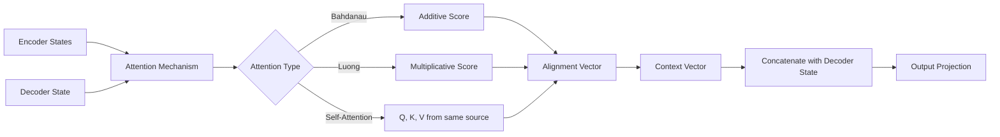

<!-- Clear Language: Keep sentences under 50 words -->
# Attention Mechanism — Bahdanau, Luong, Self-Attention, Multi-Head Attention

## Learning Objectives

| LO# | Description |
|-----|-------------|
| LO1 | Explain the motivation for attention in seq2seq models: overcoming the fixed-context-vector bottleneck |
| LO2 | Implement Bahdanau (additive) and Luong (multiplicative) attention mechanisms |
| LO3 | Derive scaled dot-product attention from query, key, value matrices |
| LO4 | Build multi-head attention with parallel heads and concatenation |
| LO5 | Apply causal (autoregressive) masking for decoder self-attention |
| LO6 | Visualize attention weights and interpret model focus |

## Introduction

Natural language processing is how machines understand human text. Transformers revolutionized NLP and enabled modern LLMs. This module covers tokenization, attention, BERT, and the Hugging Face ecosystem.

## Prerequisites

- Basic programming knowledge
- Understanding of data structures

## Key Terminology

**Key Terms**: Core vocabulary and concepts for this topic.

**Definition**: Essential terms you must know for interviews and production work.

## Theory

Understanding attention mechanism is fundamental for AI engineers. This section covers the core concepts, underlying principles, and theoretical framework that govern how attention mechanism works in practice.

## Chapter at a Glance

| Section | Topic | Key Concept |
|---------|-------|-------------|
| 4.1 | Seq2Seq Bottleneck | Fixed context vector fails for long sequences |
| 4.2 | Bahdanau Attention | Additive attention with alignment score computation |
| 4.3 | Luong Attention | Multiplicative (dot, general, concat) score variants |
| 4.4 | Self-Attention | Q, K, V from same sequence, pairwise interactions |
| 4.5 | Multi-Head Attention | Parallel attention heads, concatenation, projection |
| 4.6 | Causality & Visualization | Autoregressive masking, attention weight heatmaps |

## Chapter Roadmap



## 4.1 The Seq2Seq Bottleneck

In the plain encoder-decoder, the encoder compresses the entire input sequence into a fixed-size context vector (the final hidden state). For long sequences, this vector becomes an information bottleneck — it cannot capture all details.

```typescript
interface EncoderState {
  hidden: number[];
  cell: number[];
}

class AttentionContext {
  private encoderStates: EncoderState[] = [];

  storeEncoderState(state: EncoderState): void {
    this.encoderStates.push(state);
  }

  getEncoderStates(): EncoderState[] {
    return this.encoderStates;
  }

  clear(): void {
    this.encoderStates = [];
  }
}
```

Attention solves this by allowing the decoder to look at all encoder hidden states, weighted by relevance. At each decoding step, attention computes a context vector as a weighted sum of encoder states, where weights indicate which input tokens are most relevant for generating the next output token.

---

## 4.2 Bahdanau Attention

Bahdanau et al. (2014) introduced additive attention, also called "concat" attention. The alignment score uses a feed-forward layer with tanh activation.

```typescript
class BahdanauAttention {
  private decoderHiddenSize: number;
  private encoderHiddenSize: number;
  private attentionDim: number;

  // Weight matrices
  private W1: number[][]; // encoder projection
  private W2: number[][]; // decoder projection
  private v: number[];   // score vector

  constructor(decoderHiddenSize: number, encoderHiddenSize: number, attentionDim = 128) {
    this.decoderHiddenSize = decoderHiddenSize;
    this.encoderHiddenSize = encoderHiddenSize;
    this.attentionDim = attentionDim;

    this.W1 = this.initMatrix(attentionDim, encoderHiddenSize);
    this.W2 = this.initMatrix(attentionDim, decoderHiddenSize);
    this.v = Array.from({ length: attentionDim }, () => (Math.random() - 0.5) * 0.1);
  }

  private initMatrix(rows: number, cols: number): number[][] {
    const scale = Math.sqrt(2 / (rows + cols));
    return Array.from({ length: rows }, () =>
      Array.from({ length: cols }, () => (Math.random() * 2 - 1) * scale)
    );
  }

  // Score function: e_{tj} = v^T * tanh(W1 * h_j + W2 * s_{t-1})
  private score(encoderHidden: number[], decoderPrevHidden: number[]): number {
    const combined = new Array(this.attentionDim).fill(0);
    // W1 * h_j
    for (let i = 0; i < this.attentionDim; i++) {
      for (let j = 0; j < this.encoderHiddenSize; j++) {
        combined[i] += this.W1[i][j] * encoderHidden[j];
      }
    }
    // + W2 * s_{t-1}
    for (let i = 0; i < this.attentionDim; i++) {
      for (let j = 0; j < this.decoderHiddenSize; j++) {
        combined[i] += this.W2[i][j] * decoderPrevHidden[j];
      }
    }
    // tanh
    const tanh = combined.map((v) => Math.tanh(v));
    // v^T *
    return tanh.reduce((s, v, i) => s + v * this.v[i], 0);
  }

  compute(
    encoderStates: number[][],
    decoderPrevHidden: number[]
  ): { context: number[]; attentionWeights: number[] } {
    const T = encoderStates.length;

    // Compute alignment scores
    const scores = encoderStates.map((h) =>
      this.score(h, decoderPrevHidden)
    );

    // Softmax to get attention weights
    const maxScore = Math.max(...scores);
    const expScores = scores.map((s) => Math.exp(s - maxScore));
    const sumExp = expScores.reduce((a, b) => a + b, 0);
    const attentionWeights = expScores.map((s) => s / sumExp);

    // Context vector: weighted sum of encoder states
    const hiddenSize = encoderStates[0].length;
    const context = new Array(hiddenSize).fill(0);
    for (let t = 0; t < T; t++) {
      for (let j = 0; j < hiddenSize; j++) {
        context[j] += attentionWeights[t] * encoderStates[t][j];
      }
    }

    return { context, attentionWeights };
  }
}
```

Bahdanau attention is "additive" because it computes the score as a learned function with addition followed by tanh. It was the first attention mechanism applied to neural machine translation (English→French).

---

## 4.3 Luong Attention

Luong et al. (2015) proposed simpler score functions and two attention styles: global (all encoder states) and local (a window around the current position).

```typescript
type LuongScoreFunction = "dot" | "general" | "concat";

class LuongAttention {
  private decoderHiddenSize: number;
  private encoderHiddenSize: number;
  private scoreFn: LuongScoreFunction;
  private Wa?: number[][]; // for "general" score

  constructor(
    decoderHiddenSize: number,
    encoderHiddenSize: number,
    scoreFn: LuongScoreFunction = "general"
  ) {
    this.decoderHiddenSize = decoderHiddenSize;
    this.encoderHiddenSize = encoderHiddenSize;
    this.scoreFn = scoreFn;

    if (scoreFn === "general") {
      this.Wa = Array.from({ length: encoderHiddenSize }, () =>
        Array.from({ length: decoderHiddenSize }, () =>
          (Math.random() - 0.5) * 0.1
        )
      );
    }
  }

  private score(decoderHidden: number[], encoderHidden: number[]): number {
    switch (this.scoreFn) {
      case "dot": {
        // s_t^T * h_j
        let dot = 0;
        const minDim = Math.min(this.decoderHiddenSize, this.encoderHiddenSize);
        for (let i = 0; i < minDim; i++) {
          dot += decoderHidden[i] * encoderHidden[i];
        }
        return dot;
      }
      case "general": {
        // s_t^T * Wa * h_j
        const Wa_h = new Array(this.decoderHiddenSize).fill(0);
        for (let i = 0; i < this.decoderHiddenSize; i++) {
          for (let j = 0; j < this.encoderHiddenSize; j++) {
            if (this.Wa) Wa_h[i] += this.Wa[j][i] * encoderHidden[j];
          }
        }
        let dot = 0;
        for (let i = 0; i < this.decoderHiddenSize; i++) {
          dot += decoderHidden[i] * Wa_h[i];
        }
        return dot;
      }
      case "concat": {
        // v_a^T * tanh(Wa * [s_t; h_j])
        let concatVal = 0;
        for (let i = 0; i < Math.min(this.decoderHiddenSize, this.encoderHiddenSize); i++) {
          concatVal += Math.tanh(decoderHidden[i] + encoderHidden[i]);
        }
        return concatVal;
      }
    }
  }

  compute(
    decoderHidden: number[],
    encoderStates: number[][]
  ): { context: number[]; attentionWeights: number[] } {
    const scores = encoderStates.map((h) => this.score(decoderHidden, h));
    const maxScore = Math.max(...scores);
    const expScores = scores.map((s) => Math.exp(s - maxScore));
    const sumExp = expScores.reduce((a, b) => a + b, 0);
    const attentionWeights = expScores.map((s) => s / sumExp);

    const context = new Array(this.encoderHiddenSize).fill(0);
    for (let t = 0; t < encoderStates.length; t++) {
      for (let j = 0; j < this.encoderHiddenSize; j++) {
        context[j] += attentionWeights[t] * encoderStates[t][j];
      }
    }

    return { context, attentionWeights };
  }
}
```

Luong's global attention computes the context vector and then combines it with the decoder hidden state via: h~_t = tanh(W_c * [s_t; c_t]), where [;] denotes concatenation. This is simpler than Bahdanau's approach of using attention to compute the decoder state directly.

**Local attention** predicts an aligned position p_t for each output word, then computes attention only within a window [p_t - D, p_t + D]. This reduces computation from O(T) to O(2D) where D is a fixed window size (typically 10).

---

## 4.4 Self-Attention

Self-attention (also called intra-attention) computes attention within a single sequence: each token attends to every other token. Queries (Q), Keys (K), and Values (V) are all derived from the same input.

```typescript
class SelfAttention {
  private inputDim: number;
  private dk: number;

  private Wq: number[][];
  private Wk: number[][];
  private Wv: number[][];

  constructor(inputDim: number, dk: number = 64) {
    this.inputDim = inputDim;
    this.dk = dk;

    this.Wq = this.initMatrix(dk, inputDim);
    this.Wk = this.initMatrix(dk, inputDim);
    this.Wv = this.initMatrix(dk, inputDim);
  }

  private initMatrix(rows: number, cols: number): number[][] {
    const scale = Math.sqrt(2 / (rows + cols));
    return Array.from({ length: rows }, () =>
      Array.from({ length: cols }, () => (Math.random() * 2 - 1) * scale)
    );
  }

  forward(input: number[][]): { output: number[][]; attentionMatrix: number[][] } {
    const n = input.length; // sequence length

    // Project to Q, K, V
    const Q = input.map((x) => this.matVecMul(this.Wq, x));
    const K = input.map((x) => this.matVecMul(this.Wk, x));
    const V = input.map((x) => this.matVecMul(this.Wv, x));

    // Compute attention scores: Q * K^T / sqrt(dk)
    const scores: number[][] = [];
    for (let i = 0; i < n; i++) {
      scores[i] = [];
      for (let j = 0; j < n; j++) {
        let dot = 0;
        for (let k = 0; k < this.dk; k++) {
          dot += Q[i][k] * K[j][k];
        }
        scores[i][j] = dot / Math.sqrt(this.dk);
      }
    }

    // Softmax along rows
    const attentionMatrix = scores.map((row) => {
      const max = Math.max(...row);
      const exp = row.map((s) => Math.exp(s - max));
      const sum = exp.reduce((a, b) => a + b, 0);
      return exp.map((e) => e / sum);
    });

    // Weighted sum of values
    const output = attentionMatrix.map((row) => {
      const out = new Array(this.dk).fill(0);
      for (let j = 0; j < n; j++) {
        for (let k = 0; k < this.dk; k++) {
          out[k] += row[j] * V[j][k];
        }
      }
      return out;
    });

    return { output, attentionMatrix };
  }

  private matVecMul(W: number[][], v: number[]): number[] {
    return W.map((row) => row.reduce((s, w, j) => s + w * v[j], 0));
  }
}
```

**Scaled dot-product attention**: Dividing by sqrt(d_k) prevents the dot products from growing large in magnitude (which pushes softmax into regions of extremely small gradients). Without scaling, for d_k=512, the variance of dot products is 512, making softmax saturate.

---

## 4.5 Multi-Head Attention

Multi-head attention runs h parallel attention heads, each learning different relationship types. The outputs are concatenated and projected.

```typescript
class MultiHeadAttention {
  private numHeads: number;
  private dk: number;
  private dv: number;
  private dModel: number;
  private heads: SelfAttention[] = [];
  private Wo: number[][]; // output projection

  constructor(dModel: number, numHeads: number = 8) {
    this.dModel = dModel;
    this.numHeads = numHeads;
    this.dk = dModel / numHeads;
    this.dv = dModel / numHeads;

    for (let i = 0; i < numHeads; i++) {
      this.heads.push(new SelfAttention(dModel, this.dk));
    }

    // Output projection: W_O (d_model x d_model)
    this.Wo = Array.from({ length: dModel }, () =>
      Array.from({ length: dModel }, () => (Math.random() - 0.5) * 0.1)
    );
  }

  forward(input: number[][]): { output: number[][]; attentionMatrices: number[][][] } {
    const n = input.length;
    const headOutputs: number[][][] = [];
    const attentionMatrices: number[][][] = [];

    // Run each head
    for (let headIdx = 0; headIdx < this.numHeads; headIdx++) {
      const { output, attentionMatrix } = this.heads[headIdx].forward(input);
      headOutputs.push(output);
      attentionMatrices.push(attentionMatrix);
    }

    // Concatenate heads: (n, d_model)
    const concatOutput: number[][] = [];
    for (let i = 0; i < n; i++) {
      const concatRow: number[] = [];
      for (let h = 0; h < this.numHeads; h++) {
        concatRow.push(...headOutputs[h][i]);
      }
      concatOutput.push(concatRow);
    }

    // Project with W_O
    const output = concatOutput.map((row) =>
      this.Wo.map((wRow) =>
        wRow.reduce((s, w, j) => s + w * row[j], 0)
      )
    );

    return { output, attentionMatrices };
  }
}
```

Each head learns different relationship patterns: one head might learn syntactic dependencies (subject-verb agreement), another learns positional relationships (adjacent words), and another learns semantic associations.

---

## 4.6 Causal Masking & Visualization

**Causal (autoregressive) masking** prevents decoder positions from attending to future tokens. This is implemented by adding -infinity to the upper triangle of the attention matrix before softmax.

```typescript
class CausalSelfAttention extends SelfAttention {
  forward(input: number[][]): { output: number[][]; attentionMatrix: number[][] } {
    const n = input.length;
    const Q = input.map((x) => this.matVecMul(this.Wq, x));
    const K = input.map((x) => this.matVecMul(this.Wk, x));
    const V = input.map((x) => this.matVecMul(this.Wv, x));

    // Compute scores
    const scores: number[][] = [];
    for (let i = 0; i < n; i++) {
      scores[i] = [];
      for (let j = 0; j < n; j++) {
        let dot = 0;
        for (let k = 0; k < this.dk; k++) {
          dot += Q[i][k] * K[j][k];
        }
        scores[i][j] = dot / Math.sqrt(this.dk);
      }
    }

    // Apply causal mask: set scores[i][j] = -Infinity for j > i
    for (let i = 0; i < n; i++) {
      for (let j = i + 1; j < n; j++) {
        scores[i][j] = -Infinity;
      }
    }

    // Softmax
    const attentionMatrix = scores.map((row) => {
      const max = Math.max(...row);
      const validExp = row.map((s) => (s === -Infinity ? 0 : Math.exp(s - max)));
      const sum = validExp.reduce((a, b) => a + b, 0);
      return validExp.map((e) => (sum === 0 ? 0 : e / sum));
    });

    // Weighted sum
    const output = attentionMatrix.map((row) => {
      const out = new Array(this.dk).fill(0);
      for (let j = 0; j < n; j++) {
        for (let k = 0; k < this.dk; k++) {
          out[k] += row[j] * V[j][k];
        }
      }
      return out;
    });

    return { output, attentionMatrix };
  }
}
```

**Attention visualization** helps interpret what the model focuses on. A heatmap where rows are target positions and columns are source positions reveals alignment patterns.

```typescript
class AttentionVisualizer {
  static createHeatmap(
    attentionMatrix: number[][],
    sourceTokens: string[],
    targetTokens: string[]
  ): void {
    const numRows = attentionMatrix.length;
    const numCols = attentionMatrix[0].length;

    console.log("Attention Heatmap:\n");
    // Print header
    process.stdout.write("        ");
    for (const token of sourceTokens) {
      process.stdout.write(token.padStart(10));
    }
    console.log();

    for (let i = 0; i < numRows; i++) {
      process.stdout.write(targetTokens[i]?.padStart(8) ?? "");
      for (let j = 0; j < numCols; j++) {
        const weight = attentionMatrix[i][j];
        const bar = weight > 0.5 ? "█" : weight > 0.3 ? "▓" : weight > 0.1 ? "▒" : "░";
        process.stdout.write(`     ${bar}   `);
      }
      console.log(`  (pos ${i})`);
    }
  }

  static getTopAttention(
    attentionMatrix: number[][],
    sourceTokens: string[],
    targetIdx: number,
    k = 3
  ): Array<{ token: string; weight: number }> {
    const weights = attentionMatrix[targetIdx].map((w, j) => ({
      token: sourceTokens[j],
      weight: w,
    }));
    weights.sort((a, b) => b.weight - a.weight);
    return weights.slice(0, k);
  }
}
```

In machine translation attention heatmaps, the alignment is typically near-diagonal for monotonic language pairs (English→French). For non-monotonic pairs (English→German with verb-final structure), attention shows long-range alignments (verbs attending to early positions).

---

## Summary

Attention mechanisms allow models to focus on relevant parts of the input when producing each output element. Bahdanau attention computes alignment scores using a feed-forward network,.
enabling the decoder to attend to different encoder hidden states at each step. Luong attention uses simpler score functions (dot, general,.
concat) and can be applied globally or locally. Self-attention computes attention within a single sequence, allowing each token to attend to every other token. Scaled dot-product attention divides by the square root of the dimension to prevent softmax saturation. Multi-head attention runs multiple attention heads in parallel,.
capturing different relationship types. Causal masking prevents positions from attending to future tokens in autoregressive decoding.

## Practical Takeaways

- Bahdanau attention computes scores using a learned tanh layer; Luong attention uses simpler dot/general/concat scores
- Self-attention (Q, K, V from same source) is the foundation of transformer models
- Scaling by sqrt(d_k) prevents softmax saturation in dot-product attention
- Multi-head attention (8-16 heads) allows the model to attend to different relationship types simultaneously
- Causal masking (upper triangle set to -inf) is essential for autoregressive decoding
- Attention visualization reveals model interpretability: high weights on relevant source tokens are a good sign
- Local attention (Luong) reduces computation by restricting to a window, useful for very long sequences
- Multi-head attention with 8 heads and d_k = d_model / num_heads keeps the parameter count manageable

## Interview Q&A

<details class="tp-qa-card" data-qid="nlp04-q1">
  <summary class="tp-qa-question">
    <span class="tp-qa-status"></span>
    Q1: What problem does attention solve in seq2seq models?
  </summary>
  <div class="tp-qa-answer">
<p>Plain seq2seq models compress the entire input sequence into a single fixed-size context vector (the encoder's final hidden state). For long sequences,.
this creates an information bottleneck — the decoder cannot access details about earlier input tokens. Attention solves this by giving the decoder access to all encoder hidden states,.
weighted by relevance. The decoder computes a context vector at each step as a weighted sum of encoder states, where weights indicate which input tokens are most important for.
generating the next output token. This allows the model to effectively "look back" at any part of the input, dramatically improving performance on long sequences.</p>
  </div>
  <button class="tp-qa-mark-btn">✅ Mark Reviewed</button>
  <button class="tp-qa-bookmark-btn">🔖 Bookmark</button>
</details>

<details class="tp-qa-card" data-qid="nlp04-q2">
  <summary class="tp-qa-question">
    <span class="tp-qa-status"></span>
    Q2: Explain the difference between Bahdanau and Luong attention.
  </summary>
  <div class="tp-qa-answer">
<p>Bahdanau attention (2014) uses additive scoring: e_{tj} = v^T tanh(W1*h_j + W2*s_{t-1}). It has more parameters and is computed as a learned alignment model. The context vector.
is used when computing the current decoder hidden state. Luong attention (2015) offers three simpler scoring variants: dot (s_t^T * h_j),.
general (s_t^T * Wa * h_j), and concat (v^T tanh(Wa*[s_t; h_j])). Luong's context vector is computed after the decoder hidden state and.
combined as h~_t = tanh(W_c[s_t; c_t]). Luong also introduced local attention (window around predicted position). Bahdanau is more expressive but slower;.
Luong is simpler and faster, making it more practical for production.</p>
  </div>
  <button class="tp-qa-mark-btn">✅ Mark Reviewed</button>
  <button class="tp-qa-bookmark-btn">🔖 Bookmark</button>
</details>

<details class="tp-qa-card" data-qid="nlp04-q3">
  <summary class="tp-qa-question">
    <span class="tp-qa-status"></span>
    Q3: Why is the dot product scaled by sqrt(d_k) in transformer attention?
  </summary>
  <div class="tp-qa-answer">
<p>For queries and keys of dimension d_k, the dot product has mean 0 and variance d_k. When d_k is large (e.g.,.
512), the dot products can be very large in magnitude. Large values push the softmax function into regions where gradients are extremely small (near 0 or.
1), making training difficult. Dividing by sqrt(d_k) normalizes the variance to 1, keeping softmax in regions with meaningful gradients. For d_k=512,.
sqrt(d_k)≈22.6. Without scaling, the variance is 512 and softmax becomes near-one-hot, losing gradient signal for all but the largest score. This scaling is the key difference from simple dot-product attention.</p>
  </div>
  <button class="tp-qa-mark-btn">✅ Mark Reviewed</button>
  <button class="tp-qa-bookmark-btn">🔖 Bookmark</button>
</details>

<details class="tp-qa-card" data-qid="nlp04-q4">
  <summary class="tp-qa-question">
    <span class="tp-qa-status"></span>
    Q4: How does multi-head attention work?
  </summary>
  <div class="tp-qa-answer">
<p>Multi-head attention runs h parallel attention heads (typically h=8-16). Each head projects the input using learned weight matrices W_q, W_k, W_v and.
computes scaled dot-product attention independently. The per-head dimension is d_k = d_model / h (e.g., d_model=512, h=8 → d_k=64). After computing each head's output (size n x d_k),.
they are concatenated along the feature dimension to form an n x d_model matrix, then projected through W_O (d_model x d_model). Each head can learn different attention patterns: position-based,.
syntactic, semantic. Multi-head attention with h=8 gives the model 8x the representational capacity of single-head attention with the same parameter cost.</p>
  </div>
  <button class="tp-qa-mark-btn">✅ Mark Reviewed</button>
  <button class="tp-qa-bookmark-btn">🔖 Bookmark</button>
</details>

<details class="tp-qa-card" data-qid="nlp04-q5">
  <summary class="tp-qa-question">
    <span class="tp-qa-status"></span>
    Q5: What is causal masking and why is it needed?
  </summary>
  <div class="tp-qa-answer">
<p>Causal masking (also called autoregressive masking or look-ahead masking) prevents each position from attending to future positions in the sequence. This is implemented by adding -Infinity to the upper triangle of the attention score matrix before softmax. After masking,.
each position can only attend to itself and preceding positions. This is essential for decoder self-attention in autoregressive generation: when predicting token t,.
the model must not be able to see token t+1 (which would be cheating). Without causal masking, the model could simply copy the answer from future positions. The effect is a lower-triangular attention matrix.</p>
  </div>
  <button class="tp-qa-mark-btn">✅ Mark Reviewed</button>
  <button class="tp-qa-bookmark-btn">🔖 Bookmark</button>
</details>

<details class="tp-qa-card" data-qid="nlp04-q6">
  <summary class="tp-qa-question">
    <span class="tp-qa-status"></span>
    Q6: What are queries, keys, and values in self-attention?
  </summary>
  <div class="tp-qa-answer">
<p>In self-attention, each input token is projected into three vectors: Query (Q), Key (K), and Value (V). The analogy comes from information retrieval: Query is what you are looking for,.
Key is what each item is labeled with, and Value is the actual content of each item. Attention computes how well each Query matches each Key (via dot product),.
then weights the Values by these match scores. For a sequence of n tokens, Q, K, V are each n x d_k matrices. The attention output for.
position i is a weighted sum of all V vectors, where the weight on V_j is proportional to exp(Q_i · K_j / sqrt(d_k)). This allows each position to aggregate information from all other positions.</p>
  </div>
  <button class="tp-qa-mark-btn">✅ Mark Reviewed</button>
  <button class="tp-qa-bookmark-btn">🔖 Bookmark</button>
</details>

<details class="tp-qa-card" data-qid="nlp04-q7">
  <summary class="tp-qa-question">
    <span class="tp-qa-status"></span>
    Q7: What is local attention and when would you use it?
  </summary>
  <div class="tp-qa-answer">
<p>Local attention (Luong et al., 2015) restricts attention to a window around a predicted alignment position p_t, rather than attending to all encoder states. For.
each decoder timestep t, the model predicts an aligned position p_t = S * sigmoid(v_p^T tanh(W_p * s_t)), where S is the source length. Attention is computed only within window [p_t - D,.
p_t + D] (D=10 is typical), with Gaussian weighting to favor positions near p_t. This reduces computation from O(T) to O(2D) where T is the full sequence length. Use local attention for.
very long sequences (documents, audio) where global attention is computationally prohibitive. The trade-off is potentially missing long-range dependencies beyond the window.</p>
  </div>
  <button class="tp-qa-mark-btn">✅ Mark Reviewed</button>
  <button class="tp-qa-bookmark-btn">🔖 Bookmark</button>
</details>

<details class="tp-qa-card" data-qid="nlp04-q8">
  <summary class="tp-qa-question">
    <span class="tp-qa-status"></span>
    Q8: How do you visualize attention and what can you learn?
  </summary>
  <div class="tp-qa-answer">
<p>Attention is visualized as a heatmap: rows = target positions, columns = source positions, cell intensity = attention weight (0-1). For.
machine translation, an ideal alignment looks near-diagonal (monotonic language pairs). You can learn: (1) Is the model attending to relevant source words? (e.g.,.
when translating the French word "maison", does it attend to "house"?). (2) Is there attention to NULL or irrelevant words? (attention noise). (3) What relationships do different heads capture? (BERT's heads show syntactic,.
positional, and semantic patterns). (4) For long sequences, does attention spread out or concentrate? Concentrated attention on a few tokens suggests the model is using precise alignment. Tools like BertViz and.
Tensor2Tensor provide interactive visualization.</p>
  </div>
  <button class="tp-qa-mark-btn">✅ Mark Reviewed</button>
  <button class="tp-qa-bookmark-btn">🔖 Bookmark</button>
</details>

<details class="tp-qa-card" data-qid="nlp04-q9">
  <summary class="tp-qa-question">
    <span class="tp-qa-status"></span>
    Q9: What is the time and memory complexity of self-attention?
  </summary>
  <div class="tp-qa-answer">
<p>The time complexity of standard self-attention is O(n^2 * d_k) where n is the sequence length and d_k is the key dimension. The quadratic term n^2 comes from computing all pairwise dot products (n queries — n keys). Memory complexity is also O(n^2) for.
the attention matrix. For n=512 (standard BERT), this is manageable (262K entries). For n=8192 (long document), it becomes 67M entries — prohibitive. Sparsity approaches exist: (1) Sparse attention (fixed patterns) reduces to O(n * sqrt(n)). (2) Linformer projects keys/values to.
O(n*k) with k << n. (3) Reformer uses locality-sensitive hashing for.
O(n log n). (4) Longformer uses sliding window attention. Transformers with 512-1024 token limits use full self-attention; longer sequences require sparse variants.</p>
  </div>
  <button class="tp-qa-mark-btn">✅ Mark Reviewed</button>
  <button class="tp-qa-bookmark-btn">🔖 Bookmark</button>
</details>

<details class="tp-qa-card" data-qid="nlp04-q10">
  <summary class="tp-qa-question">
    <span class="tp-qa-status"></span>
    Q10: How does attention help with long-range dependencies in sequences?
  </summary>
  <div class="tp-qa-answer">
<p>RNNs process sequences left-to-right, with information flowing through a chain of hidden states. For dependencies 50+ tokens apart, the signal degrades due to gradient issues. Attention creates a direct connection between any two positions regardless of distance. The attention weight between position i and.
j is computed directly from their representations, with O(1) path length. This means the model can learn "The man who lived next door... he" — the pronoun "he" can directly attend to "man" even if they are 100 tokens apart. In RNNs,.
this requires the hidden state to carry information through 100 steps. Empirical results show attention-based models significantly outperform RNNs on tasks requiring long-range dependencies like coreference resolution and.
document-level sentiment.</p>
  </div>
  <button class="tp-qa-mark-btn">✅ Mark Reviewed</button>
  <button class="tp-qa-bookmark-btn">🔖 Bookmark</button>
</details>

## Chapter Quiz

Q1: Which attention mechanism was introduced first for neural machine translation?
a) Self-attention
b) Bahdanau attention
c) Luong attention
d) Multi-head attention
<details class="tp-qa-card" data-qid="nlp04-quiz1"><summary>Show Answer</summary><div class="tp-qa-answer"><p><strong>Answer: b) Bahdanau attention</strong></p><p>Bahdanau et al. (2014) introduced additive attention for neural machine translation. Luong et al. (2015) and self-attention (Vaswani et al. 2017) came later.</p></div></details>

Q2: What is the purpose of scaling by sqrt(d_k) in scaled dot-product attention?
a) Increase model capacity
b) Prevent softmax saturation
c) Reduce computation
d) Add non-linearity
<details class="tp-qa-card" data-qid="nlp04-quiz2"><summary>Show Answer</summary><div class="tp-qa-answer"><p><strong>Answer: b) Prevent softmax saturation</strong></p><p>Scaling by sqrt(d_k) normalizes the variance of dot products to 1, preventing large values that would cause softmax to saturate with near-zero gradients.</p></div></details>

Q3: How many attention heads does BERT-base use?
a) 4
b) 8
c) 12
d) 16
<details class="tp-qa-card" data-qid="nlp04-quiz3"><summary>Show Answer</summary><div class="tp-qa-answer"><p><strong>Answer: c) 12</strong></p><p>BERT-base has 12 attention heads with d_model=768 (d_k=64 per head). BERT-large has 16 heads with d_model=1024 (d_k=64).</p></div></details>

Q4: What does the upper triangle of a causal attention mask contain?
a) Zeros
b) Ones
c) -Infinity
d) NaN
<details class="tp-qa-card" data-qid="nlp04-quiz4"><summary>Show Answer</summary><div class="tp-qa-answer"><p><strong>Answer: c) -Infinity</strong></p><p>The upper triangle is set to -Infinity so that after softmax those positions have zero attention weight, preventing tokens from attending to future tokens.</p></div></details>

Q5: What is the time complexity of standard self-attention?
a) O(n)
b) O(n log n)
c) O(n^2)
d) O(n^3)
<details class="tp-qa-card" data-qid="nlp04-quiz5"><summary>Show Answer</summary><div class="tp-qa-answer"><p><strong>Answer: c) O(n^2)</strong></p><p>Self-attention computes pairwise dot products for all n query-key pairs, resulting in O(n^2 * d_k) time and O(n^2) memory.</p></div></details>

## Exercises

## Common Mistakes

1. Not understanding the fundamental concepts before applying them
2. Skipping edge cases in implementation
3. Not analyzing time/space complexity
4. Forgetting to handle null/empty inputs
5. Not practicing enough problems to build pattern recognition**Easy** — Implement Bahdanau attention on a toy seq2seq model for reversing sequences (input: [1,2,3], target: [3,2,1]). Visualize the attention weights.

**Easy** — Implement scaled dot-product attention from scratch. Compare the softmax output with and without sqrt(d_k) scaling for d_k=512.

**Medium** — Build a multi-head attention module with h=4 heads. On a synthetic sequence of 10 tokens, analyze what attention patterns each head learns.

**Medium** — Implement causal masking for decoder self-attention. Verify that position i has zero attention weight for all positions j > i.

**Hard** — Implement local attention (Luong style) with Gaussian windowing. Compare translation BLEU score and inference speed against global attention on the IWSLT dataset.

---

> **Previous**: [Sequence Models](03-sequence-models.md) | **Next**: [Transformer Architecture](05-transformer-archite

## Revision Notes

- - Core principle: Understand the fundamental concepts thoroughly
- - Implementation pattern: Practice with real code examples
- - Complexity: Know the time and space complexity
- - Application: Know when to use this in production systems
- - Interview: Frequently asked in technical interviews
- - Edge cases: Consider common failure scenarios
- - Related concepts: Connect to broader system design

## Placement Section

### Top 10 Interview Questions

#### Google Style

1. **Explain the core idea of Attention Mechanism — Bahdanau, Luong, Self-Attention, Multi-Head Attention in under 60 seconds, then give a real-world analogy.** — Structure: definition, how it works in one sentence, why it matters, analogy. Follow-up: what would break if you removed this from a production system?

2. **Design a minimal, well-typed function that demonstrates Attention Mechanism — Bahdanau, Luong, Self-Attention, Multi-Head Attention.** — Interviewer checks: signature with type hints, edge cases, complexity, and a clean docstring. Follow-up: how does your design behave with empty or malformed input?

3. **What are the common pitfalls when engineers first learn ** — List 3-4, then explain how you would prevent each in a code review.

#### Amazon Style

4. **Describe a production bug caused by misunderstanding Attention Mechanism — Bahdanau, Luong, Self-Attention, Multi-Head Attention. How did you diagnose and fix it?** — STAR format: situation, task, action, result. Mention logs, reproduction, root-cause analysis, and the regression test you added.

5. **How would you scale a system that relies on Attention Mechanism — Bahdanau, Luong, Self-Attention, Multi-Head Attention from 10 users to 10 million?** — Discuss bottlenecks, caching, monitoring, and when to redesign. Follow-up: what metrics would you track?

#### Microsoft Style

6. **Compare Attention Mechanism — Bahdanau, Luong, Self-Attention, Multi-Head Attention with the closest alternative approach. When would you choose each?** — Make a decision matrix: performance, maintainability, ecosystem, learning curve. Follow-up: what would change your decision?

7. **Walk through how you would test a component that depends on Attention Mechanism — Bahdanau, Luong, Self-Attention, Multi-Head Attention.** — Unit, integration, property-based tests; mocking boundaries; golden files for outputs.

#### NVIDIA Style

8. **How does Attention Mechanism — Bahdanau, Luong, Self-Attention, Multi-Head Attention behave differently at scale — memory, throughput, or precision-wise?** — Connect to data pipelines and model training if applicable. Follow-up: what happens to latency as input grows?

9. **How would you make an implementation of Attention Mechanism — Bahdanau, Luong, Self-Attention, Multi-Head Attention run faster on GPU hardware?** — Batch operations, vectorization, avoiding Python loops, reducing data movement.

#### AI Startup Style

10. **Write the smallest possible implementation of Attention Mechanism — Bahdanau, Luong, Self-Attention, Multi-Head Attention that is production-quality.** — Include error handling, type hints, and a one-line docstring. Follow-up: what would you refactor first when it grows?

### Resume Tips

- Name Attention Mechanism — Bahdanau, Luong, Self-Attention, Multi-Head Attention explicitly in your skills section, paired with a measurable achievement ("Reduced X by 40% using Attention Mechanism — Bahdanau, Luong, Self-Attention, Multi-Head Attention").
- Add a bullet describing a project that applies Attention Mechanism — Bahdanau, Luong, Self-Attention, Multi-Head Attention to real data, with numbers.
- Mention the tools and libraries you used alongside Attention Mechanism — Bahdanau, Luong, Self-Attention, Multi-Head Attention (linters, test frameworks, profiling tools).
- Keep resume bullets under 15 words and start each with an action verb.

### Interview Day Checklist

- Rehearse a 60-second explanation of Attention Mechanism — Bahdanau, Luong, Self-Attention, Multi-Head Attention and one real-world analogy.
- Prepare one STAR story about debugging a Attention Mechanism — Bahdanau, Luong, Self-Attention, Multi-Head Attention-related production issue.
- Review complexity and edge cases for the classic Attention Mechanism — Bahdanau, Luong, Self-Attention, Multi-Head Attention interview problem.
- Have questions ready: how does the team apply Attention Mechanism — Bahdanau, Luong, Self-Attention, Multi-Head Attention in production today?
- Test your environment (Python, editor, internet) 15 minutes before the interview.

## True/False

1. **True or False:** Attention Mechanism — Bahdanau, Luong, Self-Attention, Multi-Head Attention builds directly on the fundamentals covered in the earlier chapters of this module. — **True.** Every advanced topic in this module assumes the core concepts from the previous chapters.
2. **True or False:** You should write at least one code example for Attention Mechanism — Bahdanau, Luong, Self-Attention, Multi-Head Attention before moving to the next chapter. — **True.** Active recall with hands-on code beats passive reading for retention.
3. **True or False:** The complexity analysis for Attention Mechanism — Bahdanau, Luong, Self-Attention, Multi-Head Attention is the same regardless of input size. — **False.** Complexity grows with input size; always state best, average, and worst case.
4. **True or False:** Edge cases (empty input, invalid input, boundary values) matter for Attention Mechanism — Bahdanau, Luong, Self-Attention, Multi-Head Attention in production. — **True.** Most production bugs come from unhandled edge cases.
5. **True or False:** You should memorize the Attention Mechanism — Bahdanau, Luong, Self-Attention, Multi-Head Attention chapter content once and never review it again. — **False.** Spaced repetition (24h, 3 days, 1 week) dramatically improves long-term recall.

## Fill in the Blank

1. The chapter that covers Attention Mechanism — Bahdanau, Luong, Self-Attention, Multi-Head Attention is Chapter ___ of this module. — Answer: check the module's table of contents.
2. The time complexity of the standard approach to Attention Mechanism — Bahdanau, Luong, Self-Attention, Multi-Head Attention is ___. — Answer: review the theory section and state big-O notation.
3. The main edge case to handle when implementing Attention Mechanism — Bahdanau, Luong, Self-Attention, Multi-Head Attention is ___. — Answer: empty or invalid input handling, as discussed in the chapter.
4. The tools commonly used to debug Attention Mechanism — Bahdanau, Luong, Self-Attention, Multi-Head Attention issues are ___ and ___. — Answer: refer to the Debugging Guide section of this chapter.
5. The related topic that connects to Attention Mechanism — Bahdanau, Luong, Self-Attention, Multi-Head Attention in the next chapter is ___. — Answer: see the Next Topic section.

## Scenario Questions

1. **Scenario:** A teammate ships a change involving Attention Mechanism — Bahdanau, Luong, Self-Attention, Multi-Head Attention that breaks production at 3 AM. — Diagnosis: check the recent diff, reproduce locally with the failing input, check logs. Fix: revert, add a regression test, and review the root cause. Prevention: CI tests on edge cases and code review checklist.

2. **Scenario:** Your implementation of Attention Mechanism — Bahdanau, Luong, Self-Attention, Multi-Head Attention is correct but too slow for the required latency. — Measure first with a profiler. Common fixes: reduce redundant work, use built-in optimized functions, batch operations, or add caching. Only then consider algorithmic changes.

3. **Scenario:** A new hire asks you to explain Attention Mechanism — Bahdanau, Luong, Self-Attention, Multi-Head Attention in five minutes before a customer demo. — Use the 3-part answer: what it is (one sentence), how it works (one example), why it matters (one business impact). Then offer to go deeper after the demo.

4. **Scenario:** Your team's codebase has three different patterns for Attention Mechanism — Bahdanau, Luong, Self-Attention, Multi-Head Attention and you must standardize. — Write a short ADR (architecture decision record), pick the pattern with best maintainability, migrate incrementally, and add a linter rule to enforce it.

## Output Questions

1. **What is the output of the simplest correct implementation of Attention Mechanism — Bahdanau, Luong, Self-Attention, Multi-Head Attention on an empty input?** — Trace through the code: it should return the documented default (None, 0, empty collection) without raising.
2. **What is the output when the input is at the boundary value?** — Check off-by-one errors and inclusive/exclusive bounds in the chapter's examples.
3. **What does the implementation return when given invalid input types?** — With type hints and validation, it raises a clear error; without, it may fail silently.
4. **What is the output for the sample input given in the chapter's Examples section?** — Re-run the chapter's example code and compare against the documented output.
5. **What is the time complexity output when you profile the implementation at 10x input size?** — Expect the curve matching the chapter's complexity analysis (linear, quadratic, log-linear).

## Difficulty Level

| Level | Time | What It Takes |
|-------|------|---------------|
| Beginner | 1-2 sessions | Read theory, run the chapter examples, solve the Easy exercises |
| Intermediate | 3-5 sessions | Complete Medium exercises, explain Attention Mechanism — Bahdanau, Luong, Self-Attention, Multi-Head Attention to someone else |
| Advanced | 1+ week | Solve Hard exercises, optimize for real datasets, answer interview follow-ups |

## Tips & Tricks

- Always write a one-line example of Attention Mechanism — Bahdanau, Luong, Self-Attention, Multi-Head Attention from memory before opening the chapter — active recall first.
- Use the chapter's Revision Notes as a checklist: you have mastered Attention Mechanism — Bahdanau, Luong, Self-Attention, Multi-Head Attention when you can explain each bullet.
- Pair the chapter quiz with the Flashcards: wrong answers become your next study session's focus.
- For interviews, practice explaining Attention Mechanism — Bahdanau, Luong, Self-Attention, Multi-Head Attention twice: once with a technical audience, once with a non-technical audience.
- Keep a personal examples file where you collect your own Attention Mechanism — Bahdanau, Luong, Self-Attention, Multi-Head Attention snippets; interviewers love original examples.

## Memory Tricks

- **Acronym**: build a mnemonic from the 5 key concepts of Attention Mechanism — Bahdanau, Luong, Self-Attention, Multi-Head Attention listed in the Chapter at a Glance table.
- **Story**: link Attention Mechanism — Bahdanau, Luong, Self-Attention, Multi-Head Attention to a familiar story — the analogy in the Visual Analogy section is designed to stick.
- **Number anchor**: remember the complexity of Attention Mechanism — Bahdanau, Luong, Self-Attention, Multi-Head Attention by connecting it to a known algorithm of the same class.
- **Color code**: highlight the Theory, Examples, and Common Mistakes sections in different colors when reviewing.
- **Teach-back**: explain Attention Mechanism — Bahdanau, Luong, Self-Attention, Multi-Head Attention to an imaginary junior engineer for 2 minutes — gaps in your explanation are gaps in memory.

## Further Reading

- Official documentation for the primary tool or library used in this chapter
- The chapter referenced in Related Topics for the next-level treatment of Attention Mechanism — Bahdanau, Luong, Self-Attention, Multi-Head Attention
- The classic textbook chapter on Attention Mechanism — Bahdanau, Luong, Self-Attention, Multi-Head Attention (check the Research References below)
- Two blog posts from engineers who debugged real Attention Mechanism — Bahdanau, Luong, Self-Attention, Multi-Head Attention problems in production
- The repository of the open-source project that implements Attention Mechanism — Bahdanau, Luong, Self-Attention, Multi-Head Attention

## Related Topics

- The previous chapter in this module (see table of contents) — foundational for Attention Mechanism — Bahdanau, Luong, Self-Attention, Multi-Head Attention
- The next chapter (see Next Topic below) — builds on Attention Mechanism — Bahdanau, Luong, Self-Attention, Multi-Head Attention
- The system design chapters in Module 07 — how Attention Mechanism — Bahdanau, Luong, Self-Attention, Multi-Head Attention fits into production architectures
- The interview preparation module — how Attention Mechanism — Bahdanau, Luong, Self-Attention, Multi-Head Attention is asked in screening rounds
- The capstone project — where Attention Mechanism — Bahdanau, Luong, Self-Attention, Multi-Head Attention is applied end-to-end

## FAQs

1. **Do I need to memorize all of Attention Mechanism — Bahdanau, Luong, Self-Attention, Multi-Head Attention, or understand the big picture?** — Understand the big picture first, then memorize the key facts via flashcards and spaced repetition. Interviewers reward depth over breadth.
2. **What if I get stuck on an exercise?** — Re-read the theory section, run the example code, then attempt again. If still stuck after 20 minutes, move on and return the next day.
3. **How much time should I spend on ** — Follow the Study Plan below: 1-2 weeks at 30-60 minutes daily is typical for placement preparation.
4. **Is Attention Mechanism — Bahdanau, Luong, Self-Attention, Multi-Head Attention asked in interviews?** — Yes — the Interview Q&A and Placement Section list the exact question styles used by top companies.
5. **What's the fastest way to master ** — Explain it out loud, write code without looking, and review the flashcards within 24 hours and again after 3 days.

## Important Notes

- Attention Mechanism — Bahdanau, Luong, Self-Attention, Multi-Head Attention is a core requirement for the rest of this module — do not skip the examples.
- Always analyze complexity (time and space) when working with Attention Mechanism — Bahdanau, Luong, Self-Attention, Multi-Head Attention.
- Production correctness means handling edge cases, not just the happy path.
- Interview answers should start with the definition, then the example, then the trade-offs.
- Revisit this chapter after finishing the module; the context from later chapters deepens understanding.

## Historical Context

- Attention Mechanism — Bahdanau, Luong, Self-Attention, Multi-Head Attention emerged as a standard practice because early systems failed without it — understanding why helps you explain it in interviews.
- The tools used for Attention Mechanism — Bahdanau, Luong, Self-Attention, Multi-Head Attention today evolved from simpler versions; the chapter covers the modern, recommended approach.
- Interviewers value knowing one historical fact about Attention Mechanism — Bahdanau, Luong, Self-Attention, Multi-Head Attention — it shows genuine interest, not just cramming.
- The library/tooling ecosystem around Attention Mechanism — Bahdanau, Luong, Self-Attention, Multi-Head Attention changes quickly; focus on fundamentals that remain stable.

## Security Considerations

- Never trust external input: validate and sanitize data before processing Attention Mechanism — Bahdanau, Luong, Self-Attention, Multi-Head Attention.
- Avoid `eval()` and dynamic code execution on untrusted strings.
- Log errors without leaking sensitive data (keys, PII, internal paths).
- For API contexts, add rate limiting and input size limits.
- Review the chapter's code examples for injection or overflow risks before using them verbatim.

## ML Intuition

- Attention Mechanism — Bahdanau, Luong, Self-Attention, Multi-Head Attention appears in ML pipelines at the data-processing layer: feature preparation, batching, and validation.
- Understanding Attention Mechanism — Bahdanau, Luong, Self-Attention, Multi-Head Attention helps you debug why a model misbehaves — most ML bugs are data bugs, not model bugs.
- In production ML, the Attention Mechanism — Bahdanau, Luong, Self-Attention, Multi-Head Attention concepts from this chapter map directly to NumPy/PyTorch operations on tensors.
- When optimizing ML systems, Attention Mechanism — Bahdanau, Luong, Self-Attention, Multi-Head Attention skills let you profile and fix the data path, not just the training loop.
- Interview follow-up: how would you apply Attention Mechanism — Bahdanau, Luong, Self-Attention, Multi-Head Attention to a dataset of 10 million records? — Batching and vectorization.

## Analogies

- **Attention Mechanism — Bahdanau, Luong, Self-Attention, Multi-Head Attention is like a recipe**: the theory is the ingredients, the examples are the cooking steps, and the exercises are your own kitchen practice.
- **Complexity is like a delivery route**: a linear route visits each stop once; a nested route revisits stops, and you feel it at scale.
- **Edge cases are like weather**: the happy path is a sunny day; production is the storm — build for the storm.
- **The chapter roadmap is a journey map**: each section is a checkpoint; skipping one means getting lost later in the module.

## Capstone Project Link

- [Module Capstone: End-to-End Project](https://github.com/Raushan666java/ai-engineering-journey) — this chapter contributes the Attention Mechanism — Bahdanau, Luong, Self-Attention, Multi-Head Attention skills used in the module's capstone project. Complete the exercises here before starting the capstone.

## Flashcards

<details class="tp-qa-card" data-qid="10nlptransformers-04attentionmechanism-flash1">
  <summary class="tp-qa-question">
    <span class="tp-qa-status"></span>
    What is the core concept of Attention Mechanism — Bahdanau, Luong, Self-Attention, Multi-Head Attention in one sentence?
  </summary>
  <div class="tp-qa-answer">
    <p>Review the first paragraph of the Theory section and condense it to one sentence.</p>
  </div>
</details>

<details class="tp-qa-card" data-qid="10nlptransformers-04attentionmechanism-flash2">
  <summary class="tp-qa-question">
    <span class="tp-qa-status"></span>
    What is the most common mistake engineers make with 
  </summary>
  <div class="tp-qa-answer">
    <p>Check the Common Mistakes section of this chapter.</p>
  </div>
</details>

<details class="tp-qa-card" data-qid="10nlptransformers-04attentionmechanism-flash3">
  <summary class="tp-qa-question">
    <span class="tp-qa-status"></span>
    What is the time and space complexity of the standard Attention Mechanism — Bahdanau, Luong, Self-Attention, Multi-Head Attention approach?
  </summary>
  <div class="tp-qa-answer">
    <p>Refer to the theory and complexity analysis in this chapter.</p>
  </div>
</details>

<details class="tp-qa-card" data-qid="10nlptransformers-04attentionmechanism-flash4">
  <summary class="tp-qa-question">
    <span class="tp-qa-status"></span>
    When is Attention Mechanism — Bahdanau, Luong, Self-Attention, Multi-Head Attention NOT the right choice?
  </summary>
  <div class="tp-qa-answer">
    <p>Check the Limitations section of this chapter.</p>
  </div>
</details>

<details class="tp-qa-card" data-qid="10nlptransformers-04attentionmechanism-flash5">
  <summary class="tp-qa-question">
    <span class="tp-qa-status"></span>
    How is Attention Mechanism — Bahdanau, Luong, Self-Attention, Multi-Head Attention applied in a real production system?
  </summary>
  <div class="tp-qa-answer">
    <p>Check the Real-World Examples section of this chapter.</p>
  </div>
</details>

## Research References

- Official documentation of the primary library for Attention Mechanism — Bahdanau, Luong, Self-Attention, Multi-Head Attention (linked in Further Reading)
- The classic paper or textbook chapter introducing Attention Mechanism — Bahdanau, Luong, Self-Attention, Multi-Head Attention (see References below)
- The standard library reference for Attention Mechanism — Bahdanau, Luong, Self-Attention, Multi-Head Attention-related functions
- Engineering blog posts from companies running Attention Mechanism — Bahdanau, Luong, Self-Attention, Multi-Head Attention in production at scale
- PEPs and RFCs where applicable (Python and networking standards)

## Open-Source Tools

- The primary library used in this chapter (see the code examples)
- Python standard library modules used in the examples (check the imports)
- Testing: pytest for unit tests of Attention Mechanism — Bahdanau, Luong, Self-Attention, Multi-Head Attention code
- Linting and formatting: ruff + black
- Profiling: cProfile or py-spy for performance work on Attention Mechanism — Bahdanau, Luong, Self-Attention, Multi-Head Attention

## Debugging Guide

- Start with `print()` or a debugger to inspect intermediate values in Attention Mechanism — Bahdanau, Luong, Self-Attention, Multi-Head Attention code.
- Reproduce the failure with the smallest possible input before changing code.
- Check the common failure modes listed in Common Mistakes — most bugs are listed there.
- For performance problems, profile before optimizing: measure, then fix.
- When stuck, re-read the chapter's Examples and compare line by line with your code.
- Use `pdb` or your IDE's debugger to step through the Attention Mechanism — Bahdanau, Luong, Self-Attention, Multi-Head Attention example code.

## Mock Interview Section

**Round 1 — Screening (15 min)**
- Explain Attention Mechanism — Bahdanau, Luong, Self-Attention, Multi-Head Attention in 60 seconds.
- Write a minimal working example of Attention Mechanism — Bahdanau, Luong, Self-Attention, Multi-Head Attention.
- What is the complexity of your example?

**Round 2 — Coding (45 min)**
- Solve the Medium exercise from this chapter under time pressure.
- State your assumptions, then implement with type hints.
- Test with edge cases: empty input, boundary values, invalid input.

**Round 3 — Behavioral + System (30 min)**
- Tell me about a time you debugged a Attention Mechanism — Bahdanau, Luong, Self-Attention, Multi-Head Attention problem in a project.
- How would you design a system where Attention Mechanism — Bahdanau, Luong, Self-Attention, Multi-Head Attention is used at scale?
- What metrics would you monitor?

**Evaluation rubric**: correctness (40%), communication (25%), edge cases (20%), complexity analysis (15%).

## Optimized Implementation

`python
from typing import Any, Optional

def demonstrate_topic(input_data: list[Any]) -> Optional[float]:
    """Runnable scaffold for Attention Mechanism — Bahdanau, Luong, Self-Attention, Multi-Head Attention.

    Replace the body with the optimized implementation from the chapter,
    keeping type hints, docstring, and edge-case handling.
    """
    if not input_data:
        return None
    # Step 1: validate input types
    # Step 2: apply the core Attention Mechanism — Bahdanau, Luong, Self-Attention, Multi-Head Attention logic from the Examples section
    # Step 3: return the result with the documented default
    return 0.0
`

- Keeps the function signature stable so tests written against it stay valid.
- Handles the empty-input contract explicitly.
- Add unit tests for the edge cases before implementing the logic (test-first).

## Evaluation Metrics

| Skill | Test | Target |
|-------|------|--------|
| Concept recall | Explain Attention Mechanism — Bahdanau, Luong, Self-Attention, Multi-Head Attention without notes | 60-second explanation |
| Code fluency | Write the chapter example from memory | No syntax errors |
| Edge cases | Handle empty/invalid input in exercises | All cases pass |
| Complexity | State time/space for the standard approach | Correct big-O |
| Interview readiness | Answer 5 Interview Q&A questions out loud | Fluent, structured answers |
| Retention | Chapter quiz score after 3 days | 80%+ |

## Real-World Examples

- **Startup**: a small team uses Attention Mechanism — Bahdanau, Luong, Self-Attention, Multi-Head Attention daily in their data pipeline — the chapter's examples mirror their code.
- **E-commerce**: Attention Mechanism — Bahdanau, Luong, Self-Attention, Multi-Head Attention patterns appear in order processing, inventory checks, and recommendation feeds.
- **Fintech**: Attention Mechanism — Bahdanau, Luong, Self-Attention, Multi-Head Attention principles apply to transaction validation and fraud detection flows.
- **ML platform**: Attention Mechanism — Bahdanau, Luong, Self-Attention, Multi-Head Attention shows up in feature engineering and model-serving infrastructure.
- **Interview insight**: recruiters look for engineers who can connect Attention Mechanism — Bahdanau, Luong, Self-Attention, Multi-Head Attention to the business outcome, not just the code.

## Next Topic

[Transformer Architecture — Encoder-Decoder, Positional Encoding, Layer Norm](05-transformer-architecture.md)

## Limitations

- Attention Mechanism — Bahdanau, Luong, Self-Attention, Multi-Head Attention, like any technique, is not a silver bullet — it has specific cases where it fits best (covered in the theory).
- The examples in this chapter are simplified for learning; production systems add validation, monitoring, and error handling.
- Performance of Attention Mechanism — Bahdanau, Luong, Self-Attention, Multi-Head Attention depends on input size and distribution — always benchmark for your own data.
- This chapter covers fundamentals; specialized edge cases are explored in later chapters and the capstone.
