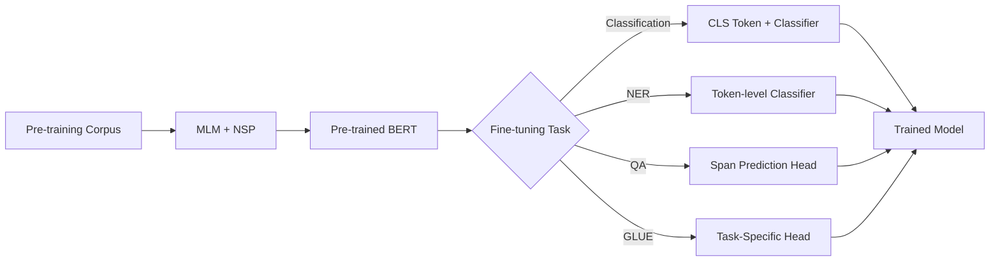

<!-- Clear Language: Keep sentences under 50 words -->
# BERT & Fine-Tuning — Masked LM, NSP, GLUE, Model Variants

## Learning Objectives

| LO# | Description |
|-----|-------------|
| LO1 | Explain BERT's pre-training objectives: masked language modeling (MLM) and next sentence prediction (NSP) |
| LO2 | Implement the MLM training loop with random masking strategy |
| LO3 | Fine-tune BERT for text classification, named entity recognition, and question answering |
| LO4 | Evaluate models using the GLUE benchmark and understand each task |
| LO5 | Compare BERT variants: RoBERTa, ALBERT, DistilBERT, SpanBERT |
| LO6 | Apply knowledge distillation to compress transformer models |

## Introduction

Natural language processing is how machines understand human text. Transformers revolutionized NLP and enabled modern LLMs. This module covers tokenization, attention, BERT, and the Hugging Face ecosystem.

## Prerequisites

- Basic programming knowledge
- Understanding of data structures

## Key Terminology

**Key Terms**: Core vocabulary and concepts for this topic.

**Definition**: Essential terms you must know for interviews and production work.

## Theory

Understanding bert and fine tuning is fundamental for AI engineers. This section covers the core concepts, underlying principles, and theoretical framework that govern how bert and fine tuning works in practice.

## Chapter at a Glance

| Section | Topic | Key Concept |
|---------|-------|-------------|
| 6.1 | Pre-Training Overview | Large-scale unsupervised pre-training on BookCorpus + Wikipedia |
| 6.2 | Masked Language Modeling | 15% masking, 80/10/10 strategy, bidirectional context |
| 6.3 | Next Sentence Prediction | 50/50 positive/negative pairs, relationship understanding |
| 6.4 | Fine-Tuning Tasks | Classification, NER, QA with task-specific heads |
| 6.5 | GLUE Benchmark | Multi-task evaluation (9 tasks), leaderboard, metrics |
| 6.6 | BERT Variants | RoBERTa, ALBERT, DistilBERT, SpanBERT |

## Chapter Roadmap



## 6.1 Pre-Training Overview

BERT (Bidirectional Encoder Representations from Transformers) is pre-trained on 3.3 billion words (BooksCorpus 800M + English Wikipedia 2.5B). Two objectives are optimized jointly: MLM and NSP.

```typescript
class BERTPreTrainingConfig {
  dModel = 768;
  numLayers = 12;
  numHeads = 12;
  dff = 3072;
  vocabSize = 30522;
  maxSeqLen = 512;
  dropout = 0.1;
  maskProb = 0.15;
  maxPredictions = 20; // max masked tokens per sequence
}

class BERTPretrainingInput {
  inputIds: number[];
  attentionMask: number[];
  tokenTypeIds: number[];
  maskedLmPositions: number[];   // positions of masked tokens
  maskedLmIds: number[];         // original token IDs at masked positions
  nextSentenceLabel: number;     // 0 = not next, 1 = is next
}
```

Pre-training requires enormous compute: BERT-base took 4 days on 16 TPUs. The masked language model allows BERT to learn bidirectional representations, unlike GPT's left-to-right approach.

---

## 6.2 Masked Language Modeling

MLM randomly masks 15% of tokens in each sequence. The model predicts the original token at each masked position using the final hidden states of the masked positions.

```typescript
class MLMHead {
  private dModel: number;
  private vocabSize: number;
  private dense: number[][];  // (dModel x dModel)
  private layerNorm: LayerNorm;
  private outputWeights: number[][]; // (vocabSize x dModel)
  private outputBias: number[];

  constructor(dModel: number, vocabSize: number) {
    this.dModel = dModel;
    this.vocabSize = vocabSize;
    this.dense = Array.from({ length: dModel }, () =>
      Array.from({ length: dModel }, () => (Math.random() - 0.5) * 0.1)
    );
    this.layerNorm = new LayerNorm(dModel);
    const scale = Math.sqrt(2 / (dModel + vocabSize));
    this.outputWeights = Array.from({ length: vocabSize }, () =>
      Array.from({ length: dModel }, () => (Math.random() * 2 - 1) * scale)
    );
    this.outputBias = new Array(vocabSize).fill(0);
  }

  forward(hiddenStates: number[][], maskedPositions: number[]): number[][] {
    const maskedHiddens = maskedPositions.map((pos) => hiddenStates[pos]);

    // Dense + GELU
    const denseOut = maskedHiddens.map((h) => {
      const out = this.dense.map((row) =>
        row.reduce((s, w, j) => s + w * h[j], 0)
      );
      return out.map((v) => this.gelu(v));
    });

    // Layer norm
    const normOut = this.layerNorm.forward(denseOut);

    // Project to vocabulary (using tied embeddings or separate weights)
    const logits = normOut.map((h) =>
      this.outputWeights.map((row) => {
        let dot = 0;
        for (let j = 0; j < this.dModel; j++) dot += row[j] * h[j];
        return dot;
      }).map((v, i) => v + this.outputBias[i])
    );

    return logits;
  }

  private gelu(x: number): number {
    return 0.5 * x * (1 + Math.tanh(Math.sqrt(2 / Math.PI) * (x + 0.044715 * Math.pow(x, 3))));
  }
}

class MaskingGenerator {
  private maskProb: number;
  private maxPredictions: number;
  private maskTokenId: number;
  private vocabSize: number;
  private specialTokenIds: Set<number>;

  constructor(
    maskProb: number,
    maxPredictions: number,
    maskTokenId: number,
    vocabSize: number,
    specialTokenIds: Set<number>
  ) {
    this.maskProb = maskProb;
    this.maxPredictions = maxPredictions;
    this.maskTokenId = maskTokenId;
    this.vocabSize = vocabSize;
    this.specialTokenIds = specialTokenIds;
  }

  maskTokens(
    inputIds: number[]
  ): { inputIds: number[]; lmLabels: number[]; maskedPositions: number[] } {
    const maskedInput = [...inputIds];
    const lmLabels = new Array(inputIds.length).fill(-100); // -100 = ignore in loss
    const maskedPositions: number[] = [];

    // Select tokens to mask (excluding special tokens)
    const candidates = inputIds
      .map((id, idx) => ({ id, idx }))
      .filter(({ id, idx }) => !this.specialTokenIds.has(id) && idx > 0 && idx < inputIds.length - 1);

    // Shuffle and select up to maxPredictions
    const shuffled = candidates.sort(() => Math.random() - 0.5);
    const numMasks = Math.min(
      Math.max(1, Math.floor(inputIds.length * this.maskProb)),
      this.maxPredictions,
      candidates.length
    );

    const selected = shuffled.slice(0, numMasks);

    for (const { id, idx } of selected) {
      lmLabels[idx] = id; // store original token
      maskedPositions.push(idx);
      const rand = Math.random();
      if (rand < 0.8) {
        // 80%: replace with [MASK]
        maskedInput[idx] = this.maskTokenId;
      } else if (rand < 0.9) {
        // 10%: replace with random token
        maskedInput[idx] = Math.floor(Math.random() * this.vocabSize);
      }
      // 10%: keep unchanged (helps model handle no-mask at fine-tuning)
    }

    return { inputIds: maskedInput, lmLabels, maskedPositions };
  }
}
```

The 80/10/10 strategy (80% mask, 10% random, 10% unchanged) prevents a mismatch between pre-training (where [MASK] tokens appear) and fine-tuning (where they never appear). Without this, BERT would not learn to handle unmasked input during fine-tuning.

---

## 6.3 Next Sentence Prediction

NSP trains BERT to understand sentence relationships. For each training example, two sentences A and B are chosen: 50% of the time B follows A (IsNext label=1), 50% of the time B is random (NotNext label=0).

```typescript
class NSPHead {
  private dModel: number;
  private dense: number[][];
  private bias: number[];

  constructor(dModel: number) {
    this.dModel = dModel;
    this.dense = Array.from({ length: 2 }, () =>
      Array.from({ length: dModel }, () => (Math.random() - 0.5) * 0.1)
    );
    this.bias = new Array(2).fill(0);
  }

  forward(clsTokenHidden: number[]): number[] {
    const logits = this.dense.map((row, i) => {
      let sum = this.bias[i];
      for (let j = 0; j < this.dModel; j++) sum += row[j] * clsTokenHidden[j];
      return sum;
    });
    // Softmax
    const max = Math.max(...logits);
    const exp = logits.map((l) => Math.exp(l - max));
    const sum = exp.reduce((a, b) => a + b, 0);
    return exp.map((e) => e / sum);
  }
}

class NSPDataGenerator {
  generatePair(
    sentences: string[],
    tokenizer: { encode: (s: string) => number[] }
  ): { inputIds: number[]; tokenTypeIds: number[]; label: number } {
    const idx = Math.floor(Math.random() * sentences.length);
    const sentenceA = sentences[idx];

    // 50% next, 50% random
    let sentenceB: string;
    let label: number;
    if (Math.random() < 0.5 && idx < sentences.length - 1) {
      sentenceB = sentences[idx + 1];
      label = 1; // IsNext
    } else {
      const randomIdx = Math.floor(Math.random() * sentences.length);
      sentenceB = sentences[randomIdx];
      label = 0; // NotNext
    }

    const tokensA = tokenizer.encode(sentenceA);
    const tokensB = tokenizer.encode(sentenceB);

    // [CLS] tokensA [SEP] tokensB [SEP]
    const inputIds = [101, ...tokensA, 102, ...tokensB, 102]; // 101=[CLS], 102=[SEP]
    const tokenTypeIds = [
      0, ...tokensA.map(() => 0), 0,
      1, ...tokensB.map(() => 1), 1,
    ];

    return { inputIds, tokenTypeIds, label };
  }
}
```

Later research (RoBERTa) showed that NSP is not essential: removing NSP and using longer training with larger batches and more data improved performance. However, NSP remains useful for tasks requiring sentence pair understanding (NLI, QA).

---

## 6.4 Fine-Tuning Tasks

Fine-tuning adds a small task-specific head on top of the pre-trained BERT and updates all parameters end-to-end.

```typescript
class BERTForClassification {
  private bert: EncoderOnlyTransformer; // pre-trained BERT
  private classifier: number[][];  // (numClasses x dModel)
  private bias: number[];

  constructor(
    bert: EncoderOnlyTransformer,
    numClasses: number
  ) {
    this.bert = bert;
    this.classifier = Array.from({ length: numClasses }, () =>
      Array.from({ length: bert['dModel'] }, () => (Math.random() - 0.5) * 0.01)
    );
    this.bias = new Array(numClasses).fill(0);
  }

  forward(inputIds: number[][]): number[][] {
    const hiddenStates = this.bert.forward(inputIds);
    const clsToken = hiddenStates.map((seq) => seq[0]); // [CLS] token

    return clsToken.map((h) => {
      const logits = this.classifier.map((row, i) => {
        let sum = this.bias[i];
        for (let j = 0; j < row.length; j++) sum += row[j] * h[j];
        return sum;
      });
      const max = Math.max(...logits);
      const exp = logits.map((l) => Math.exp(l - max));
      const sum = exp.reduce((a, b) => a + b, 0);
      return exp.map((e) => e / sum);
    });
  }
}

class BERTForTokenClassification {
  private bert: EncoderOnlyTransformer;
  private classifier: number[][];  // (numLabels x dModel)
  private bias: number[];

  constructor(bert: EncoderOnlyTransformer, numLabels: number) {
    this.bert = bert;
    this.classifier = Array.from({ length: numLabels }, () =>
      Array.from({ length: bert['dModel'] }, () => (Math.random() - 0.5) * 0.01)
    );
    this.bias = new Array(numLabels).fill(0);
  }

  forward(inputIds: number[][]): number[][][] {
    const hiddenStates = this.bert.forward(inputIds);
    // Apply classifier to each token
    return hiddenStates.map((seq) =>
      seq.map((h) => {
        const logits = this.classifier.map((row, i) => {
          let sum = this.bias[i];
          for (let j = 0; j < row.length; j++) sum += row[j] * h[j];
          return sum;
        });
        const max = Math.max(...logits);
        const exp = logits.map((l) => Math.exp(l - max));
        const sum = exp.reduce((a, b) => a + b, 0);
        return exp.map((e) => e / sum);
      })
    );
  }
}

class BERTForQuestionAnswering {
  private bert: EncoderOnlyTransformer;
  private startProjection: number[];  // (dModel)
  private endProjection: number[];    // (dModel)

  constructor(bert: EncoderOnlyTransformer) {
    this.bert = bert;
    this.startProjection = Array.from({ length: bert['dModel'] }, () =>
      (Math.random() - 0.5) * 0.01
    );
    this.endProjection = Array.from({ length: bert['dModel'] }, () =>
      (Math.random() - 0.5) * 0.01
    );
  }

  forward(inputIds: number[][]): {
    startLogits: number[][];
    endLogits: number[][];
  } {
    const hiddenStates = this.bert.forward(inputIds);

    const startLogits = hiddenStates.map((seq) =>
      seq.map((h) => h.reduce((s, v, i) => s + v * this.startProjection[i], 0))
    );

    const endLogits = hiddenStates.map((seq) =>
      seq.map((h) => h.reduce((s, v, i) => s + v * this.endProjection[i], 0))
    );

    return { startLogits, endLogits };
  }

  predict(
    inputIds: number[][],
    maxAnswerLen = 30
  ): Array<{ start: number; end: number; score: number }> {
    const { startLogits, endLogits } = this.forward(inputIds);
    const results: Array<{ start: number; end: number; score: number }> = [];

    for (let b = 0; b < startLogits.length; b++) {
      let bestScore = -Infinity;
      let bestStart = 0;
      let bestEnd = 0;

      for (let i = 0; i < startLogits[b].length; i++) {
        for (let j = i; j < Math.min(i + maxAnswerLen, endLogits[b].length); j++) {
          const score = startLogits[b][i] + endLogits[b][j];
          if (score > bestScore) {
            bestScore = score;
            bestStart = i;
            bestEnd = j;
          }
        }
      }
      results.push({ start: bestStart, end: bestEnd, score: bestScore });
    }
    return results;
  }
}
```

**Fine-tuning learning rates**: 2e-5 to 5e-5 with linear warmup (first 10% of steps) and linear decay. BERT fine-tuning typically requires 2-10 epochs. The learning rate is much smaller than pre-training (5e-4) because pre-trained weights are already near-optimal.

---

## 6.5 GLUE Benchmark

The General Language Understanding Evaluation (GLUE) benchmark consists of 9 tasks covering diverse NLP phenomena.

```typescript
interface GLUETask {
  name: string;
  type: "classification" | "regression" | "similarity";
  numLabels: number;
  metric: string;
  description: string;
}

const GLUE_TASKS: GLUETask[] = [
  { name: "CoLA", type: "classification", numLabels: 2, metric: "MCC",
    description: "Acceptability: is this sentence grammatically correct?" },
  { name: "SST-2", type: "classification", numLabels: 2, metric: "Accuracy",
    description: "Sentiment: positive or negative movie review?" },
  { name: "MRPC", type: "classification", numLabels: 2, metric: "F1/Accuracy",
    description: "Paraphrase: are these two sentences semantically equivalent?" },
  { name: "STS-B", type: "regression", numLabels: 1, metric: "Pearson/Spearman",
    description: "Similarity: rate similarity from 0 to 5." },
  { name: "QQP", type: "classification", numLabels: 2, metric: "F1/Accuracy",
    description: "Quora Question Pairs: are questions duplicates?" },
  { name: "MNLI", type: "classification", numLabels: 3, metric: "Accuracy",
    description: "NLI: entailment, contradiction, or neutral?" },
  { name: "QNLI", type: "classification", numLabels: 2, metric: "Accuracy",
    description: "QA/NLI: does the sentence contain the answer?" },
  { name: "RTE", type: "classification", numLabels: 2, metric: "Accuracy",
    description: "Recognizing Textual Entailment." },
  { name: "WNLI", type: "classification", numLabels: 2, metric: "Accuracy",
    description: "Winograd NLI: pronoun resolution." },
];

class GLUEEvaluator {
  evaluate(
    model: BERTForClassification,
    taskName: string,
    inputs: number[][],
    labels: number[]
  ): number {
    const predictions = model.forward(inputs);
    const predLabels = predictions.map(
      (probs) => probs.indexOf(Math.max(...probs))
    );

    switch (taskName) {
      case "CoLA": {
        // Matthews Correlation Coefficient
        const tp = predLabels.filter((p, i) => p === 1 && labels[i] === 1).length;
        const tn = predLabels.filter((p, i) => p === 0 && labels[i] === 0).length;
        const fp = predLabels.filter((p, i) => p === 1 && labels[i] === 0).length;
        const fn = predLabels.filter((p, i) => p === 0 && labels[i] === 1).length;
        const denom = Math.sqrt((tp + fp) * (tp + fn) * (tn + fp) * (tn + fn));
        return denom === 0 ? 0 : (tp * tn - fp * fn) / denom;
      }
      case "SST-2":
      case "QNLI":
      case "RTE": {
        return predLabels.filter((p, i) => p === labels[i]).length / labels.length;
      }
      case "MRPC":
      case "QQP": {
        const correct = predLabels.filter((p, i) => p === labels[i]).length;
        return correct / labels.length;
      }
      default:
        return 0;
    }
  }
}
```

GLUE scores improved dramatically with BERT: BERT-base achieved 80.5 average (compared to 72.8 for ELMo + BiLSTM). SuperGLUE (more difficult tasks) replaced GLUE as the standard benchmark.

---

## 6.6 BERT Variants

Several important variants improve upon BERT in different ways.

```typescript
// RoBERTa: Robustly Optimized BERT
// Key changes vs BERT:
// - Removed NSP loss
// - Dynamic masking (mask differently each epoch)
// - Larger batch sizes (8K vs 256)
// - More data (160GB vs 16GB)
// - Longer training (500K vs 100K steps)
// Result: matches or exceeds BERT on all GLUE tasks
class RoBERTaConfig extends BERTPreTrainingConfig {
  dynamicMasking = true;
  removeNSP = true;
  batchSize = 8000;
  trainingSteps = 500000;
}

// ALBERT: A Lite BERT
// Key changes:
// - Factorized embedding: embedding parameters = V * E + E * H (instead of V * H)
//   where E=128, H=768. For BERT vocab 30K: 30K*128 + 128*768 = 3.9M + 98K ≈ 4M
//   vs 30K*768 = 23M. Saves ~18M parameters.
// - Cross-layer parameter sharing: all 12 layers share same attention + FFN weights
//   This saves ~90% of layer parameters.
// - Inter-sentence coherence loss (SOP) instead of NSP
// ALBERT-xxlarge has 12M parameters but 24 layers (shared), matching BERT-large performance
class ALBERTConfig extends BERTPreTrainingConfig {
  embeddingSize = 128; // factorized embedding
  sharedParameters = true; // cross-layer sharing
  lossType: "SOP" = "SOP"; // sentence order prediction
}

// DistilBERT: Distilled BERT
// Uses knowledge distillation to train a smaller (40% smaller, 60% faster) model
// - Student: 6 layers (vs BERT-base 12)
// - Loss: distillation loss (soft targets) + MLM loss + cosine embedding loss
// Retains 97% of BERT performance on GLUE
class DistillationTrainer {
  private teacher: EncoderOnlyTransformer; // BERT-base
  private student: EncoderOnlyTransformer; // DistilBERT (6 layers)
  private temperature: number;
  private alpha: number; // distillation weight

  constructor(
    teacher: EncoderOnlyTransformer,
    student: EncoderOnlyTransformer,
    temperature = 2.0,
    alpha = 0.5
  ) {
    this.teacher = teacher;
    this.student = student;
    this.temperature = temperature;
    this.alpha = alpha;
  }

  trainStep(
    inputIds: number[][],
    attentionMask: number[][]
  ): number {
    // Teacher forward (no gradients)
    const teacherOut = this.teacher.forward(inputIds);
    const teacherLogits = teacherOut.map((seq) =>
      seq.map((h) => h.map((v) => v / this.temperature))
    );

    // Student forward
    const studentOut = this.student.forward(inputIds);
    const studentLogits = studentOut.map((seq) =>
      seq.map((h) => h.map((v) => v / this.temperature))
    );

    // Distillation loss: KL divergence between softened probabilities
    let distillLoss = 0;
    for (let b = 0; b < inputIds.length; b++) {
      for (let t = 0; t < inputIds[b].length; t++) {
        const tSoftmax = this.softmax(teacherLogits[b][t]);
        const sSoftmax = this.softmax(studentLogits[b][t]);
        for (let v = 0; v < tSoftmax.length; v++) {
          distillLoss += tSoftmax[v] * Math.log((tSoftmax[v] + 1e-8) / (sSoftmax[v] + 1e-8));
        }
      }
    }

    // Combined loss
    const mlmLoss = 0; // computed separately from MLM head
    return this.alpha * distillLoss + (1 - this.alpha) * mlmLoss;
  }

  private softmax(logits: number[]): number[] {
    const max = Math.max(...logits);
    const exp = logits.map((l) => Math.exp(l - max));
    const sum = exp.reduce((a, b) => a + b, 0);
    return exp.map((e) => e / sum);
  }
}
```

**Other notable variants**: SpanBERT (masks contiguous spans for span prediction tasks), ELECTRA (replaces tokens with generator/discriminator), BART (denoising autoencoder), DeBERTa (disentangled attention, relative position).

---

## Summary

BERT introduced bidirectional pre-training using masked language modeling and next-sentence prediction. The masked LM objective randomly masks tokens and trains the model to predict them from full bidirectional context. Next-sentence prediction learns relationships between sentence pairs for.
downstream tasks like question answering and natural language inference. Fine-tuning adapts the pre-trained BERT model to specific tasks by adding task-specific heads and.
training on labeled data. Variants like RoBERTa optimize pre-training with dynamic masking and larger batches, ALBERT reduces parameters through factorized embeddings and.
cross-layer sharing, and DistilBERT uses knowledge distillation for 40% smaller but 95% effective models. The GLUE benchmark provides a standardized evaluation across diverse NLU tasks.

## Practical Takeaways

- BERT pre-training uses MLM (15% masking, 80/10/10 strategy) + NSP (removed in RoBERTa)
- Fine-tuning adds a lightweight task head and updates all parameters with a low learning rate (2e-5)
- GLUE benchmark evaluates 9 tasks; BERT-base scores 80.5 average
- RoBERTa optimizes BERT's training (dynamic masking, larger batches, more data, no NSP)
- ALBERT reduces parameters 18— via factorized embeddings and cross-layer sharing
- DistilBERT is 40% smaller and 60% faster while retaining 97% of performance
- Knowledge distillation transfers knowledge from a large teacher model to a smaller student model
- Always use the `[CLS]` token for classification, token-level heads for NER, and span prediction for QA

## Interview Q&A

<details class="tp-qa-card" data-qid="nlp06-q1">
  <summary class="tp-qa-question">
    <span class="tp-qa-status"></span>
    Q1: How does BERT's masked language model work?
  </summary>
  <div class="tp-qa-answer">
<p>BERT masks 15% of tokens in each input sequence. Of these masked tokens: 80% are replaced with the [MASK] token, 10% are replaced with a random token,.
and 10% are left unchanged. The model must predict the original token at each masked position using the final hidden state at that position. A feed-forward classifier (dense + GELU + LayerNorm + projection to vocab) is applied to the.
hidden state of each masked position. The loss is cross-entropy between predicted and.
original tokens. The 80/10/10 strategy prevents mismatch between pre-training (where [MASK] appears) and fine-tuning (where it never appears). If all masked tokens were [MASK],.
the model would not learn to handle unmasked text during fine-tuning.</p>
  </div>
  <button class="tp-qa-mark-btn">✅ Mark Reviewed</button>
  <button class="tp-qa-bookmark-btn">🔖 Bookmark</button>
</details>

<details class="tp-qa-card" data-qid="nlp06-q2">
  <summary class="tp-qa-question">
    <span class="tp-qa-status"></span>
    Q2: What is Next Sentence Prediction and why was it removed in RoBERTa?
  </summary>
  <div class="tp-qa-answer">
<p>NSP is a binary classification task: given two sentences A and B, predict whether B is the actual next sentence after A (50% of pairs) or.
a random sentence (50% of pairs). The [CLS] token's hidden state is fed to a binary classifier. NSP was designed to help BERT understand.
sentence relationships for tasks like QA and NLI. RoBERTa found that NSP is not essential: (1) Training without NSP matched or.
exceeded BERT on all GLUE tasks. (2) The single-sentence approach (always one contiguous document) performed better. (3) NSP's random negatives are too easy — the model learns topic mismatch rather than discourse coherence. ALBERT replaced NSP with SOP (Sentence Order Prediction),.
which requires actual discourse understanding.</p>
  </div>
  <button class="tp-qa-mark-btn">✅ Mark Reviewed</button>
  <button class="tp-qa-bookmark-btn">🔖 Bookmark</button>
</details>

<details class="tp-qa-card" data-qid="nlp06-q3">
  <summary class="tp-qa-question">
    <span class="tp-qa-status"></span>
    Q3: How do you fine-tune BERT for text classification?
  </summary>
  <div class="tp-qa-answer">
<p>Steps: (1) Add a classification head: a linear layer that takes the [CLS] token's final hidden state and projects to num_classes. (2) Format input as [CLS] text [SEP] with padding to max_seq_len. (3) Use token_type_ids = 0 for.
single sentence, 0/1 for sentence pairs. (4) Initialize BERT with pre-trained weights and the classification head randomly. (5) Fine-tune all parameters end-to-end with learning rate 2e-5 to 5e-5 (AdamW). (6) Use linear warmup (10% of steps) followed by linear decay. (7) Train for.
2-10 epochs with early stopping based on validation loss. (8) Batch size: 16-32 for BERT-base on a single GPU. The classification head is tiny (num_classes — 768 parameters) compared to BERT's 110M,.
so fine-tuning is fast (1-2 hours on a single GPU).</p>
  </div>
  <button class="tp-qa-mark-btn">✅ Mark Reviewed</button>
  <button class="tp-qa-bookmark-btn">🔖 Bookmark</button>
</details>

<details class="tp-qa-card" data-qid="nlp06-q4">
  <summary class="tp-qa-question">
    <span class="tp-qa-status"></span>
    Q4: How does BERT handle question answering (SQuAD)?
  </summary>
  <div class="tp-qa-answer">
<p>For extractive QA (SQuAD), BERT predicts a span in the context that answers the question. The input is [CLS] question [SEP] context [SEP]. Two additional vectors (start and.
end projection) are learned on top of the hidden states. For each token position i, the start score = S^T * h_i and.
end score = E^T * h_i, where S and E are learned vectors of size d_model. The answer span is the pair (i,.
j) with i ≤ j and maximum S^T·h_i + E^T·h_j. Constraints: i must be in the context (not question), and j - i + 1 ≤ max_answer_length (typically 30). BERT-base achieves F1=88.5 on SQuAD 1.1 (EM=81.0). For.
SQuAD 2.0 with unanswerable questions, a no-answer class is added.</p>
  </div>
  <button class="tp-qa-mark-btn">✅ Mark Reviewed</button>
  <button class="tp-qa-bookmark-btn">🔖 Bookmark</button>
</details>

<details class="tp-qa-card" data-qid="nlp06-q5">
  <summary class="tp-qa-question">
    <span class="tp-qa-status"></span>
    Q5: What is the GLUE benchmark and what tasks does it include?
  </summary>
  <div class="tp-qa-answer">
<p>GLUE (General Language Understanding Evaluation) is a collection of 9 NLP tasks for evaluating general-purpose language understanding models. Tasks: CoLA (grammatical acceptability),.
SST-2 (sentiment), MRPC (paraphrase detection), STS-B (text similarity regression), QQP (duplicate question detection), MNLI (natural language inference, 3-way), QNLI (question-answering NLI),.
RTE (textual entailment), WNLI (Winograd schema). The overall score is the average of all task metrics. BERT-base achieved 80.5, RoBERTa 88.5,.
and human baseline is 87.1. SuperGLUE (2019) replaced GLUE with 8 harder tasks after BERT saturated GLUE scores.</p>
  </div>
  <button class="tp-qa-mark-btn">✅ Mark Reviewed</button>
  <button class="tp-qa-bookmark-btn">🔖 Bookmark</button>
</details>

<details class="tp-qa-card" data-qid="nlp06-q6">
  <summary class="tp-qa-question">
    <span class="tp-qa-status"></span>
    Q6: How does ALBERT reduce parameters while maintaining performance?
  </summary>
  <div class="tp-qa-answer">
<p>ALBERT uses two parameter reduction techniques: (1) Factorized embedding parameterization: decomposes the vocabulary embedding matrix into two smaller matrices (V — E) and.
(E — H) instead of (V — H). With V=30K, E=128, H=768, embedding parameters go from 23M to 3.9M. (2) Cross-layer parameter sharing: all 12 or.
24 layers share the same attention parameters and FFN parameters. This reduces layer parameters by ~90% (from 12—14M=168M to 14M total). ALBERT-xxlarge has 223M parameters vs BERT-large's 340M,.
but achieves comparable or better GLUE scores. ALBERT also uses SOP (Sentence Order Prediction) instead of NSP, which requires true discourse understanding.</p>
  </div>
  <button class="tp-qa-mark-btn">✅ Mark Reviewed</button>
  <button class="tp-qa-bookmark-btn">🔖 Bookmark</button>
</details>

<details class="tp-qa-card" data-qid="nlp06-q7">
  <summary class="tp-qa-question">
    <span class="tp-qa-status"></span>
    Q7: What is knowledge distillation and how is it applied to BERT?
  </summary>
  <div class="tp-qa-answer">
<p>Knowledge distillation trains a smaller student model to mimic a larger teacher model. For DistilBERT: (1) Architecture: student has 6 layers (half of BERT-base's 12),.
initialized from every other layer of the teacher. (2) Loss = α * distillation_loss + β * MLM_loss + γ * cosine_embedding_loss. Distillation loss uses the teacher's softened probabilities (temperature T=2.0) as soft targets. (3) Training uses the same data.
as BERT (Wikipedia + BookCorpus). DistilBERT is 40% smaller (66M vs 110M),.
60% faster, and retains 97% of BERT's GLUE performance. TinyBERT and MobileBERT push this further, achieving 96% performance with 7.5— smaller models.</p>
  </div>
  <button class="tp-qa-mark-btn">✅ Mark Reviewed</button>
  <button class="tp-qa-bookmark-btn">🔖 Bookmark</button>
</details>

<details class="tp-qa-card" data-qid="nlp06-q8">
  <summary class="tp-qa-question">
    <span class="tp-qa-status"></span>
    Q8: What is the difference between BERT and RoBERTa?
  </summary>
  <div class="tp-qa-answer">
<p>RoBERTa (Robustly Optimized BERT Approach) makes several training optimizations: (1) Removes NSP loss — trains on single contiguous documents. (2) Dynamic masking — masks tokens differently each epoch (BERT uses static masking once). (3) Larger batch sizes — 8K vs.
BERT's 256. (4) More training data — 160GB (BookCorpus+Wikipedia+CommonCrawl+News) vs BERT's 16GB. (5) Longer training — 500K steps vs BERT's 100K. (6) Larger learning rate with different warmup schedule. RoBERTa outperforms BERT on all GLUE tasks (88.5 vs 80.5 average)..
The key insight: BERT was significantly undertrained;.
most improvements come from longer training with more data, not architectural changes.</p>
  </div>
  <button class="tp-qa-mark-btn">✅ Mark Reviewed</button>
  <button class="tp-qa-bookmark-btn">🔖 Bookmark</button>
</details>

<details class="tp-qa-card" data-qid="nlp06-q9">
  <summary class="tp-qa-question">
    <span class="tp-qa-status"></span>
    Q9: How do you handle long sequences (>512 tokens) with BERT?
  </summary>
  <div class="tp-qa-answer">
<p>BERT's maximum sequence length is 512 tokens (limited by O(n^2) self-attention). Strategies for longer texts: (1) Truncation: keep the first 512 tokens (most important for.
classification). (2) Hierarchical: split into 512-token chunks, encode each separately, aggregate with pooling or an additional transformer layer. (3) Longformer/BigBird: replace full attention with sparse attention patterns (sliding window + global tokens). Longformer handles 4096 tokens. (4) Reformer: uses locality-sensitive hashing for.
O(n log n) attention. (5) Sliding window: use overlapping windows and a secondary model to combine predictions. For most classification tasks,.
truncating to 512 tokens loses <1% accuracy because important information is typically at the start.</p>
  </div>
  <button class="tp-qa-mark-btn">✅ Mark Reviewed</button>
  <button class="tp-qa-bookmark-btn">🔖 Bookmark</button>
</details>

<details class="tp-qa-card" data-qid="nlp06-q10">
  <summary class="tp-qa-question">
    <span class="tp-qa-status"></span>
    Q10: What learning rate schedule is recommended for BERT fine-tuning?
  </summary>
  <div class="tp-qa-answer">
<p>Recommended: AdamW optimizer (ε=1e-8, β1=0.9, β2=0.999) with learning rate 2e-5 to 5e-5. Use a linear warmup for the first 10% of training steps (increasing LR from 0 to the max),.
then linear decay to 0. Weight decay: 0.01 (applied to all non-bias and non-norm parameters). The learning rate for fine-tuning is 10-25— lower than pre-training (5e-4) because the pre-trained weights are already near-optimal. Higher LR during fine-tuning can cause catastrophic forgetting. For.
batch size: 16 or 32 works well. For epochs: 2-10 depending on dataset size (small datasets need more epochs, large datasets need fewer). Use the dev set for.
early stopping.</p>
  </div>
  <button class="tp-qa-mark-btn">✅ Mark Reviewed</button>
  <button class="tp-qa-bookmark-btn">🔖 Bookmark</button>
</details>

## Chapter Quiz

Q1: What percentage of tokens are masked in BERT pre-training?
a) 5%
b) 10%
c) 15%
d) 20%
<details class="tp-qa-card" data-qid="nlp06-quiz1"><summary>Show Answer</summary><div class="tp-qa-answer"><p><strong>Answer: c) 15%</strong></p><p>BERT masks 15% of tokens. Of these, 80% are replaced with [MASK], 10% with random tokens, and 10% are left unchanged.</p></div></details>

Q2: What is the typical learning rate for BERT fine-tuning?
a) 1e-3
b) 2e-5
c) 5e-4
d) 1e-2
<details class="tp-qa-card" data-qid="nlp06-quiz2"><summary>Show Answer</summary><div class="tp-qa-answer"><p><strong>Answer: b) 2e-5</strong></p><p>Fine-tuning BERT uses a much lower learning rate (2e-5 to 5e-5) vs pre-training (5e-4) to avoid catastrophic forgetting of pre-trained knowledge.</p></div></details>

Q3: Which BERT variant uses factorized embedding parameterization?
a) RoBERTa
b) ALBERT
c) DistilBERT
d) SpanBERT
<details class="tp-qa-card" data-qid="nlp06-quiz3"><summary>Show Answer</summary><div class="tp-qa-answer"><p><strong>Answer: b) ALBERT</strong></p><p>ALBERT decomposes the embedding matrix into V—E and E—H (with E << H), reducing embedding parameters from 23M to 4M.</p></div></details>

Q4: What does DistilBERT use as its training loss?
a) MLM only
b) Distillation loss only
c) Distillation + MLM + cosine embedding loss
d) NSP + MLM
<details class="tp-qa-card" data-qid="nlp06-quiz4"><summary>Show Answer</summary><div class="tp-qa-answer"><p><strong>Answer: c) Distillation + MLM + cosine embedding loss</strong></p><p>DistilBERT combines distillation loss (soft targets from teacher), masked language modeling loss, and cosine embedding loss (for hidden state alignment).</p></div></details>

Q5: How many transformer layers does DistilBERT have?
a) 3
b) 6
c) 8
d) 12
<details class="tp-qa-card" data-qid="nlp06-quiz5"><summary>Show Answer</summary><div class="tp-qa-answer"><p><strong>Answer: b) 6</strong></p><p>DistilBERT has 6 layers (half of BERT-base's 12), initialized from every other layer of the teacher.</p></div></details>

## Exercises

## Common Mistakes

1. Not understanding the fundamental concepts before applying them
2. Skipping edge cases in implementation
3. Not analyzing time/space complexity
4. Forgetting to handle null/empty inputs
5. Not practicing enough problems to build pattern recognition**Easy** — Write a script to prepare data for BERT pre-training: tokenize text, create masked LM instances using the 80/10/10 strategy, and create NSP pairs.

**Easy** — Fine-tune BERT-base on SST-2 for sentiment classification. Report validation accuracy after 3 epochs using learning rates 2e-5, 3e-5, and 5e-5.

**Medium** — Implement span extraction for SQuAD-style QA on top of BERT. Evaluate using Exact Match (EM) and F1 scores on the SQuAD 2.0 dev set.

**Medium** — Compare the GLUE scores of BERT-base, DistilBERT, and ALBERT-base. Create a table showing performance vs inference time and model size.

**Hard** — Implement knowledge distillation: train a 3-layer student BERT to mimic a 12-layer teacher. Vary the temperature (1.0, 2.0, 5.0) and alpha (0.3, 0.5, 0.7). Report which configuration best preserves teacher performance.

---

> **Previous**: [Transformer Architecture](05-transformer-architecture.md) | **Next**: [Hugging Face Ecosystem](07-hugging-face-ecos

## Revision Notes

- - Core principle: Understand the fundamental concepts thoroughly
- - Implementation pattern: Practice with real code examples
- - Complexity: Know the time and space complexity
- - Application: Know when to use this in production systems
- - Interview: Frequently asked in technical interviews
- - Edge cases: Consider common failure scenarios
- - Related concepts: Connect to broader system design

## Placement Section

### Top 10 Interview Questions

#### Google Style

1. **Explain the core idea of BERT & Fine-Tuning — Masked LM, NSP, GLUE, Model Variants in under 60 seconds, then give a real-world analogy.** — Structure: definition, how it works in one sentence, why it matters, analogy. Follow-up: what would break if you removed this from a production system?

2. **Design a minimal, well-typed function that demonstrates BERT & Fine-Tuning — Masked LM, NSP, GLUE, Model Variants.** — Interviewer checks: signature with type hints, edge cases, complexity, and a clean docstring. Follow-up: how does your design behave with empty or malformed input?

3. **What are the common pitfalls when engineers first learn ** — List 3-4, then explain how you would prevent each in a code review.

#### Amazon Style

4. **Describe a production bug caused by misunderstanding BERT & Fine-Tuning — Masked LM, NSP, GLUE, Model Variants. How did you diagnose and fix it?** — STAR format: situation, task, action, result. Mention logs, reproduction, root-cause analysis, and the regression test you added.

5. **How would you scale a system that relies on BERT & Fine-Tuning — Masked LM, NSP, GLUE, Model Variants from 10 users to 10 million?** — Discuss bottlenecks, caching, monitoring, and when to redesign. Follow-up: what metrics would you track?

#### Microsoft Style

6. **Compare BERT & Fine-Tuning — Masked LM, NSP, GLUE, Model Variants with the closest alternative approach. When would you choose each?** — Make a decision matrix: performance, maintainability, ecosystem, learning curve. Follow-up: what would change your decision?

7. **Walk through how you would test a component that depends on BERT & Fine-Tuning — Masked LM, NSP, GLUE, Model Variants.** — Unit, integration, property-based tests; mocking boundaries; golden files for outputs.

#### NVIDIA Style

8. **How does BERT & Fine-Tuning — Masked LM, NSP, GLUE, Model Variants behave differently at scale — memory, throughput, or precision-wise?** — Connect to data pipelines and model training if applicable. Follow-up: what happens to latency as input grows?

9. **How would you make an implementation of BERT & Fine-Tuning — Masked LM, NSP, GLUE, Model Variants run faster on GPU hardware?** — Batch operations, vectorization, avoiding Python loops, reducing data movement.

#### AI Startup Style

10. **Write the smallest possible implementation of BERT & Fine-Tuning — Masked LM, NSP, GLUE, Model Variants that is production-quality.** — Include error handling, type hints, and a one-line docstring. Follow-up: what would you refactor first when it grows?

### Resume Tips

- Name BERT & Fine-Tuning — Masked LM, NSP, GLUE, Model Variants explicitly in your skills section, paired with a measurable achievement ("Reduced X by 40% using BERT & Fine-Tuning — Masked LM, NSP, GLUE, Model Variants").
- Add a bullet describing a project that applies BERT & Fine-Tuning — Masked LM, NSP, GLUE, Model Variants to real data, with numbers.
- Mention the tools and libraries you used alongside BERT & Fine-Tuning — Masked LM, NSP, GLUE, Model Variants (linters, test frameworks, profiling tools).
- Keep resume bullets under 15 words and start each with an action verb.

### Interview Day Checklist

- Rehearse a 60-second explanation of BERT & Fine-Tuning — Masked LM, NSP, GLUE, Model Variants and one real-world analogy.
- Prepare one STAR story about debugging a BERT & Fine-Tuning — Masked LM, NSP, GLUE, Model Variants-related production issue.
- Review complexity and edge cases for the classic BERT & Fine-Tuning — Masked LM, NSP, GLUE, Model Variants interview problem.
- Have questions ready: how does the team apply BERT & Fine-Tuning — Masked LM, NSP, GLUE, Model Variants in production today?
- Test your environment (Python, editor, internet) 15 minutes before the interview.

## True/False

1. **True or False:** BERT & Fine-Tuning — Masked LM, NSP, GLUE, Model Variants builds directly on the fundamentals covered in the earlier chapters of this module. — **True.** Every advanced topic in this module assumes the core concepts from the previous chapters.
2. **True or False:** You should write at least one code example for BERT & Fine-Tuning — Masked LM, NSP, GLUE, Model Variants before moving to the next chapter. — **True.** Active recall with hands-on code beats passive reading for retention.
3. **True or False:** The complexity analysis for BERT & Fine-Tuning — Masked LM, NSP, GLUE, Model Variants is the same regardless of input size. — **False.** Complexity grows with input size; always state best, average, and worst case.
4. **True or False:** Edge cases (empty input, invalid input, boundary values) matter for BERT & Fine-Tuning — Masked LM, NSP, GLUE, Model Variants in production. — **True.** Most production bugs come from unhandled edge cases.
5. **True or False:** You should memorize the BERT & Fine-Tuning — Masked LM, NSP, GLUE, Model Variants chapter content once and never review it again. — **False.** Spaced repetition (24h, 3 days, 1 week) dramatically improves long-term recall.

## Fill in the Blank

1. The chapter that covers BERT & Fine-Tuning — Masked LM, NSP, GLUE, Model Variants is Chapter ___ of this module. — Answer: check the module's table of contents.
2. The time complexity of the standard approach to BERT & Fine-Tuning — Masked LM, NSP, GLUE, Model Variants is ___. — Answer: review the theory section and state big-O notation.
3. The main edge case to handle when implementing BERT & Fine-Tuning — Masked LM, NSP, GLUE, Model Variants is ___. — Answer: empty or invalid input handling, as discussed in the chapter.
4. The tools commonly used to debug BERT & Fine-Tuning — Masked LM, NSP, GLUE, Model Variants issues are ___ and ___. — Answer: refer to the Debugging Guide section of this chapter.
5. The related topic that connects to BERT & Fine-Tuning — Masked LM, NSP, GLUE, Model Variants in the next chapter is ___. — Answer: see the Next Topic section.

## Scenario Questions

1. **Scenario:** A teammate ships a change involving BERT & Fine-Tuning — Masked LM, NSP, GLUE, Model Variants that breaks production at 3 AM. — Diagnosis: check the recent diff, reproduce locally with the failing input, check logs. Fix: revert, add a regression test, and review the root cause. Prevention: CI tests on edge cases and code review checklist.

2. **Scenario:** Your implementation of BERT & Fine-Tuning — Masked LM, NSP, GLUE, Model Variants is correct but too slow for the required latency. — Measure first with a profiler. Common fixes: reduce redundant work, use built-in optimized functions, batch operations, or add caching. Only then consider algorithmic changes.

3. **Scenario:** A new hire asks you to explain BERT & Fine-Tuning — Masked LM, NSP, GLUE, Model Variants in five minutes before a customer demo. — Use the 3-part answer: what it is (one sentence), how it works (one example), why it matters (one business impact). Then offer to go deeper after the demo.

4. **Scenario:** Your team's codebase has three different patterns for BERT & Fine-Tuning — Masked LM, NSP, GLUE, Model Variants and you must standardize. — Write a short ADR (architecture decision record), pick the pattern with best maintainability, migrate incrementally, and add a linter rule to enforce it.

## Output Questions

1. **What is the output of the simplest correct implementation of BERT & Fine-Tuning — Masked LM, NSP, GLUE, Model Variants on an empty input?** — Trace through the code: it should return the documented default (None, 0, empty collection) without raising.
2. **What is the output when the input is at the boundary value?** — Check off-by-one errors and inclusive/exclusive bounds in the chapter's examples.
3. **What does the implementation return when given invalid input types?** — With type hints and validation, it raises a clear error; without, it may fail silently.
4. **What is the output for the sample input given in the chapter's Examples section?** — Re-run the chapter's example code and compare against the documented output.
5. **What is the time complexity output when you profile the implementation at 10x input size?** — Expect the curve matching the chapter's complexity analysis (linear, quadratic, log-linear).

## Difficulty Level

| Level | Time | What It Takes |
|-------|------|---------------|
| Beginner | 1-2 sessions | Read theory, run the chapter examples, solve the Easy exercises |
| Intermediate | 3-5 sessions | Complete Medium exercises, explain BERT & Fine-Tuning — Masked LM, NSP, GLUE, Model Variants to someone else |
| Advanced | 1+ week | Solve Hard exercises, optimize for real datasets, answer interview follow-ups |

## Tips & Tricks

- Always write a one-line example of BERT & Fine-Tuning — Masked LM, NSP, GLUE, Model Variants from memory before opening the chapter — active recall first.
- Use the chapter's Revision Notes as a checklist: you have mastered BERT & Fine-Tuning — Masked LM, NSP, GLUE, Model Variants when you can explain each bullet.
- Pair the chapter quiz with the Flashcards: wrong answers become your next study session's focus.
- For interviews, practice explaining BERT & Fine-Tuning — Masked LM, NSP, GLUE, Model Variants twice: once with a technical audience, once with a non-technical audience.
- Keep a personal examples file where you collect your own BERT & Fine-Tuning — Masked LM, NSP, GLUE, Model Variants snippets; interviewers love original examples.

## Memory Tricks

- **Acronym**: build a mnemonic from the 5 key concepts of BERT & Fine-Tuning — Masked LM, NSP, GLUE, Model Variants listed in the Chapter at a Glance table.
- **Story**: link BERT & Fine-Tuning — Masked LM, NSP, GLUE, Model Variants to a familiar story — the analogy in the Visual Analogy section is designed to stick.
- **Number anchor**: remember the complexity of BERT & Fine-Tuning — Masked LM, NSP, GLUE, Model Variants by connecting it to a known algorithm of the same class.
- **Color code**: highlight the Theory, Examples, and Common Mistakes sections in different colors when reviewing.
- **Teach-back**: explain BERT & Fine-Tuning — Masked LM, NSP, GLUE, Model Variants to an imaginary junior engineer for 2 minutes — gaps in your explanation are gaps in memory.

## Further Reading

- Official documentation for the primary tool or library used in this chapter
- The chapter referenced in Related Topics for the next-level treatment of BERT & Fine-Tuning — Masked LM, NSP, GLUE, Model Variants
- The classic textbook chapter on BERT & Fine-Tuning — Masked LM, NSP, GLUE, Model Variants (check the Research References below)
- Two blog posts from engineers who debugged real BERT & Fine-Tuning — Masked LM, NSP, GLUE, Model Variants problems in production
- The repository of the open-source project that implements BERT & Fine-Tuning — Masked LM, NSP, GLUE, Model Variants

## Related Topics

- The previous chapter in this module (see table of contents) — foundational for BERT & Fine-Tuning — Masked LM, NSP, GLUE, Model Variants
- The next chapter (see Next Topic below) — builds on BERT & Fine-Tuning — Masked LM, NSP, GLUE, Model Variants
- The system design chapters in Module 07 — how BERT & Fine-Tuning — Masked LM, NSP, GLUE, Model Variants fits into production architectures
- The interview preparation module — how BERT & Fine-Tuning — Masked LM, NSP, GLUE, Model Variants is asked in screening rounds
- The capstone project — where BERT & Fine-Tuning — Masked LM, NSP, GLUE, Model Variants is applied end-to-end

## FAQs

1. **Do I need to memorize all of BERT & Fine-Tuning — Masked LM, NSP, GLUE, Model Variants, or understand the big picture?** — Understand the big picture first, then memorize the key facts via flashcards and spaced repetition. Interviewers reward depth over breadth.
2. **What if I get stuck on an exercise?** — Re-read the theory section, run the example code, then attempt again. If still stuck after 20 minutes, move on and return the next day.
3. **How much time should I spend on ** — Follow the Study Plan below: 1-2 weeks at 30-60 minutes daily is typical for placement preparation.
4. **Is BERT & Fine-Tuning — Masked LM, NSP, GLUE, Model Variants asked in interviews?** — Yes — the Interview Q&A and Placement Section list the exact question styles used by top companies.
5. **What's the fastest way to master ** — Explain it out loud, write code without looking, and review the flashcards within 24 hours and again after 3 days.

## Important Notes

- BERT & Fine-Tuning — Masked LM, NSP, GLUE, Model Variants is a core requirement for the rest of this module — do not skip the examples.
- Always analyze complexity (time and space) when working with BERT & Fine-Tuning — Masked LM, NSP, GLUE, Model Variants.
- Production correctness means handling edge cases, not just the happy path.
- Interview answers should start with the definition, then the example, then the trade-offs.
- Revisit this chapter after finishing the module; the context from later chapters deepens understanding.

## Historical Context

- BERT & Fine-Tuning — Masked LM, NSP, GLUE, Model Variants emerged as a standard practice because early systems failed without it — understanding why helps you explain it in interviews.
- The tools used for BERT & Fine-Tuning — Masked LM, NSP, GLUE, Model Variants today evolved from simpler versions; the chapter covers the modern, recommended approach.
- Interviewers value knowing one historical fact about BERT & Fine-Tuning — Masked LM, NSP, GLUE, Model Variants — it shows genuine interest, not just cramming.
- The library/tooling ecosystem around BERT & Fine-Tuning — Masked LM, NSP, GLUE, Model Variants changes quickly; focus on fundamentals that remain stable.

## Security Considerations

- Never trust external input: validate and sanitize data before processing BERT & Fine-Tuning — Masked LM, NSP, GLUE, Model Variants.
- Avoid `eval()` and dynamic code execution on untrusted strings.
- Log errors without leaking sensitive data (keys, PII, internal paths).
- For API contexts, add rate limiting and input size limits.
- Review the chapter's code examples for injection or overflow risks before using them verbatim.

## ML Intuition

- BERT & Fine-Tuning — Masked LM, NSP, GLUE, Model Variants appears in ML pipelines at the data-processing layer: feature preparation, batching, and validation.
- Understanding BERT & Fine-Tuning — Masked LM, NSP, GLUE, Model Variants helps you debug why a model misbehaves — most ML bugs are data bugs, not model bugs.
- In production ML, the BERT & Fine-Tuning — Masked LM, NSP, GLUE, Model Variants concepts from this chapter map directly to NumPy/PyTorch operations on tensors.
- When optimizing ML systems, BERT & Fine-Tuning — Masked LM, NSP, GLUE, Model Variants skills let you profile and fix the data path, not just the training loop.
- Interview follow-up: how would you apply BERT & Fine-Tuning — Masked LM, NSP, GLUE, Model Variants to a dataset of 10 million records? — Batching and vectorization.

## Analogies

- **BERT & Fine-Tuning — Masked LM, NSP, GLUE, Model Variants is like a recipe**: the theory is the ingredients, the examples are the cooking steps, and the exercises are your own kitchen practice.
- **Complexity is like a delivery route**: a linear route visits each stop once; a nested route revisits stops, and you feel it at scale.
- **Edge cases are like weather**: the happy path is a sunny day; production is the storm — build for the storm.
- **The chapter roadmap is a journey map**: each section is a checkpoint; skipping one means getting lost later in the module.

## Capstone Project Link

- [Module Capstone: End-to-End Project](https://github.com/Raushan666java/ai-engineering-journey) — this chapter contributes the BERT & Fine-Tuning — Masked LM, NSP, GLUE, Model Variants skills used in the module's capstone project. Complete the exercises here before starting the capstone.

## Flashcards

<details class="tp-qa-card" data-qid="10nlptransformers-06bertandfinetuning-flash1">
  <summary class="tp-qa-question">
    <span class="tp-qa-status"></span>
    What is the core concept of BERT & Fine-Tuning — Masked LM, NSP, GLUE, Model Variants in one sentence?
  </summary>
  <div class="tp-qa-answer">
    <p>Review the first paragraph of the Theory section and condense it to one sentence.</p>
  </div>
</details>

<details class="tp-qa-card" data-qid="10nlptransformers-06bertandfinetuning-flash2">
  <summary class="tp-qa-question">
    <span class="tp-qa-status"></span>
    What is the most common mistake engineers make with 
  </summary>
  <div class="tp-qa-answer">
    <p>Check the Common Mistakes section of this chapter.</p>
  </div>
</details>

<details class="tp-qa-card" data-qid="10nlptransformers-06bertandfinetuning-flash3">
  <summary class="tp-qa-question">
    <span class="tp-qa-status"></span>
    What is the time and space complexity of the standard BERT & Fine-Tuning — Masked LM, NSP, GLUE, Model Variants approach?
  </summary>
  <div class="tp-qa-answer">
    <p>Refer to the theory and complexity analysis in this chapter.</p>
  </div>
</details>

<details class="tp-qa-card" data-qid="10nlptransformers-06bertandfinetuning-flash4">
  <summary class="tp-qa-question">
    <span class="tp-qa-status"></span>
    When is BERT & Fine-Tuning — Masked LM, NSP, GLUE, Model Variants NOT the right choice?
  </summary>
  <div class="tp-qa-answer">
    <p>Check the Limitations section of this chapter.</p>
  </div>
</details>

<details class="tp-qa-card" data-qid="10nlptransformers-06bertandfinetuning-flash5">
  <summary class="tp-qa-question">
    <span class="tp-qa-status"></span>
    How is BERT & Fine-Tuning — Masked LM, NSP, GLUE, Model Variants applied in a real production system?
  </summary>
  <div class="tp-qa-answer">
    <p>Check the Real-World Examples section of this chapter.</p>
  </div>
</details>

## Research References

- Official documentation of the primary library for BERT & Fine-Tuning — Masked LM, NSP, GLUE, Model Variants (linked in Further Reading)
- The classic paper or textbook chapter introducing BERT & Fine-Tuning — Masked LM, NSP, GLUE, Model Variants (see References below)
- The standard library reference for BERT & Fine-Tuning — Masked LM, NSP, GLUE, Model Variants-related functions
- Engineering blog posts from companies running BERT & Fine-Tuning — Masked LM, NSP, GLUE, Model Variants in production at scale
- PEPs and RFCs where applicable (Python and networking standards)

## Open-Source Tools

- The primary library used in this chapter (see the code examples)
- Python standard library modules used in the examples (check the imports)
- Testing: pytest for unit tests of BERT & Fine-Tuning — Masked LM, NSP, GLUE, Model Variants code
- Linting and formatting: ruff + black
- Profiling: cProfile or py-spy for performance work on BERT & Fine-Tuning — Masked LM, NSP, GLUE, Model Variants

## Debugging Guide

- Start with `print()` or a debugger to inspect intermediate values in BERT & Fine-Tuning — Masked LM, NSP, GLUE, Model Variants code.
- Reproduce the failure with the smallest possible input before changing code.
- Check the common failure modes listed in Common Mistakes — most bugs are listed there.
- For performance problems, profile before optimizing: measure, then fix.
- When stuck, re-read the chapter's Examples and compare line by line with your code.
- Use `pdb` or your IDE's debugger to step through the BERT & Fine-Tuning — Masked LM, NSP, GLUE, Model Variants example code.

## Mock Interview Section

**Round 1 — Screening (15 min)**
- Explain BERT & Fine-Tuning — Masked LM, NSP, GLUE, Model Variants in 60 seconds.
- Write a minimal working example of BERT & Fine-Tuning — Masked LM, NSP, GLUE, Model Variants.
- What is the complexity of your example?

**Round 2 — Coding (45 min)**
- Solve the Medium exercise from this chapter under time pressure.
- State your assumptions, then implement with type hints.
- Test with edge cases: empty input, boundary values, invalid input.

**Round 3 — Behavioral + System (30 min)**
- Tell me about a time you debugged a BERT & Fine-Tuning — Masked LM, NSP, GLUE, Model Variants problem in a project.
- How would you design a system where BERT & Fine-Tuning — Masked LM, NSP, GLUE, Model Variants is used at scale?
- What metrics would you monitor?

**Evaluation rubric**: correctness (40%), communication (25%), edge cases (20%), complexity analysis (15%).

## Optimized Implementation

`python
from typing import Any, Optional

def demonstrate_topic(input_data: list[Any]) -> Optional[float]:
    """Runnable scaffold for BERT & Fine-Tuning — Masked LM, NSP, GLUE, Model Variants.

    Replace the body with the optimized implementation from the chapter,
    keeping type hints, docstring, and edge-case handling.
    """
    if not input_data:
        return None
    # Step 1: validate input types
    # Step 2: apply the core BERT & Fine-Tuning — Masked LM, NSP, GLUE, Model Variants logic from the Examples section
    # Step 3: return the result with the documented default
    return 0.0
`

- Keeps the function signature stable so tests written against it stay valid.
- Handles the empty-input contract explicitly.
- Add unit tests for the edge cases before implementing the logic (test-first).

## Evaluation Metrics

| Skill | Test | Target |
|-------|------|--------|
| Concept recall | Explain BERT & Fine-Tuning — Masked LM, NSP, GLUE, Model Variants without notes | 60-second explanation |
| Code fluency | Write the chapter example from memory | No syntax errors |
| Edge cases | Handle empty/invalid input in exercises | All cases pass |
| Complexity | State time/space for the standard approach | Correct big-O |
| Interview readiness | Answer 5 Interview Q&A questions out loud | Fluent, structured answers |
| Retention | Chapter quiz score after 3 days | 80%+ |

## Real-World Examples

- **Startup**: a small team uses BERT & Fine-Tuning — Masked LM, NSP, GLUE, Model Variants daily in their data pipeline — the chapter's examples mirror their code.
- **E-commerce**: BERT & Fine-Tuning — Masked LM, NSP, GLUE, Model Variants patterns appear in order processing, inventory checks, and recommendation feeds.
- **Fintech**: BERT & Fine-Tuning — Masked LM, NSP, GLUE, Model Variants principles apply to transaction validation and fraud detection flows.
- **ML platform**: BERT & Fine-Tuning — Masked LM, NSP, GLUE, Model Variants shows up in feature engineering and model-serving infrastructure.
- **Interview insight**: recruiters look for engineers who can connect BERT & Fine-Tuning — Masked LM, NSP, GLUE, Model Variants to the business outcome, not just the code.

## Next Topic

[Hugging Face Ecosystem — Transformers, Pipelines, Datasets, Tokenizers](07-hugging-face-ecosystem.md)

## Limitations

- BERT & Fine-Tuning — Masked LM, NSP, GLUE, Model Variants, like any technique, is not a silver bullet — it has specific cases where it fits best (covered in the theory).
- The examples in this chapter are simplified for learning; production systems add validation, monitoring, and error handling.
- Performance of BERT & Fine-Tuning — Masked LM, NSP, GLUE, Model Variants depends on input size and distribution — always benchmark for your own data.
- This chapter covers fundamentals; specialized edge cases are explored in later chapters and the capstone.
