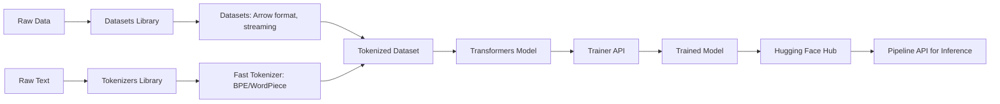

<!-- Clear Language: Keep sentences under 50 words -->
# Hugging Face Ecosystem — Transformers, Pipelines, Datasets, Tokenizers

## Learning Objectives

| LO# | Description |
|-----|-------------|
| LO1 | Navigate the Hugging Face ecosystem: transformers, datasets, tokenizers, and hub |
| LO2 | Use the pipeline API for zero-shot inference across NLP tasks |
| LO3 | Load and preprocess datasets using the datasets library |
| LO4 | Train tokenizers from scratch using the tokenizers library |
| LO5 | Fine-tune models with the Trainer API (training arguments, callbacks, metrics) |
| LO6 | Upload, share, and load custom models from the Hugging Face Hub |

## Introduction

Natural language processing is how machines understand human text. Transformers revolutionized NLP and enabled modern LLMs. This module covers tokenization, attention, BERT, and the Hugging Face ecosystem.

## Prerequisites

- Basic programming knowledge
- Understanding of data structures

## Key Terminology

**Key Terms**: Core vocabulary and concepts for this topic.

**Definition**: Essential terms you must know for interviews and production work.

## Theory

Understanding hugging face ecosystem is fundamental for AI engineers. This section covers the core concepts, underlying principles, and theoretical framework that govern how hugging face ecosystem works in practice.

## Chapter at a Glance

| Section | Topic | Key Concept |
|---------|-------|-------------|
| 7.1 | Hugging Face Overview | Transformers library, model hub, community ecosystem |
| 7.2 | Pipeline API | Zero-shot task inference with auto-model selection |
| 7.3 | Datasets Library | Arrow-backed data loading, streaming, preprocessing maps |
| 7.4 | Tokenizers Library | Fast BPE/WordPiece/Unigram training, parallel processing |
| 7.5 | Trainer API | TrainingArguments, Trainer, callbacks, metrics |
| 7.6 | Custom Models & Hub | Registering architectures, sharing via Hub, model cards |

## Chapter Roadmap



## 7.1 Hugging Face Overview

Hugging Face provides open-source libraries for NLP and ML, hosting over 500,000 models and 100,000 datasets on the Hugging Face Hub. The core libraries are `transformers`, `datasets`, `tokenizers`, `accelerate`, and `hub`.

```typescript
interface HFModelConfig {
  modelId: string;         // e.g., "bert-base-uncased", "gpt2", "t5-small"
  revision: string;        // git branch, tag, or commit hash
  cacheDir: string;        // local cache location
  useAuth: boolean;        // for private models
  device: "cpu" | "cuda";
}

class HuggingFaceClient {
  private config: HFModelConfig;
  private modelCache: Map<string, any> = new Map();

  constructor(config: HFModelConfig) {
    this.config = config;
  }

  // Download and cache model from hub
  async loadModel<T>(modelId: string): Promise<T> {
    if (this.modelCache.has(modelId)) {
      return this.modelCache.get(modelId) as T;
    }

    // Simulate downloading configuration and weights
    const modelConfig = await this.fetchConfig(modelId);
    const modelWeights = await this.fetchWeights(modelId);

    const model = this.instantiateModel(modelConfig, modelWeights);
    this.modelCache.set(modelId, model);
    return model as T;
  }

  private async fetchConfig(modelId: string): Promise<any> {
    // In production: GET https://huggingface.co/{modelId}/raw/main/config.json
    console.log(`Fetching config for ${modelId}...`);
    return { modelType: modelId.split("-")[0], dModel: 768, numLayers: 12 };
  }

  private async fetchWeights(modelId: string): Promise<Float32Array[]> {
    // In production: download safetensors or pytorch_model.bin shards
    console.log(`Fetching weights for ${modelId}...`);
    return [];
  }

  private instantiateModel(config: any, weights: any[]): any {
    // Map config to architecture class
    return { config, weights, ready: true };
  }

  listAvailableModels(task?: string): string[] {
    const models = [
      "bert-base-uncased", "bert-large-uncased",
      "gpt2", "gpt2-medium", "gpt2-large",
      "t5-small", "t5-base", "t5-large",
      "roberta-base", "roberta-large",
      "distilbert-base-uncased",
      "albert-base-v2", "albert-large-v2",
      "facebook/bart-base", "facebook/bart-large",
      "google/electra-base-discriminator",
      "microsoft/deberta-base",
    ];
    return models;
  }

  getModelCard(modelId: string): string {
    // Returns model card content from hub
    return `# ${modelId}\n## Overview\nThis model is ...\n## Training Data\n...\n## Benchmarks\n...`;
  }
}
```

The central concept in Hugging Face is the **Hub**: a Git-based repository system for models, datasets, and spaces (demo apps). Every model has a model card (README.md), configuration files, weight files (safetensors), and optional ONNX/TensorRT exports.

---

## 7.2 Pipeline API

The pipeline API provides a high-level interface for inference. It handles tokenization, model inference, and output decoding automatically.

```typescript
type PipelineTask =
  | "text-classification"
  | "token-classification"
  | "question-answering"
  | "summarization"
  | "translation"
  | "text-generation"
  | "fill-mask"
  | "ner"
  | "sentiment-analysis"
  | "zero-shot-classification"
  | "feature-extraction";

interface PipelineOptions {
  model?: string;
  tokenizer?: string;
  device?: number;       // -1 for CPU, 0+ for GPU
  batchSize?: number;
  truncation?: boolean;
  maxLength?: number;
  task: PipelineTask;
}

class PipelineResult {
  label?: string;
  score?: number;
  start?: number;
  end?: number;
  answer?: string;
  generatedText?: string;
  sequence?: string;
}

class Pipeline {
  private task: PipelineTask;
  private tokenizer: any;
  private model: any;
  private config: any;

  constructor(options: PipelineOptions) {
    this.task = options.task;
    // Initialize tokenizer and model based on task
    this.setupForTask(options);
  }

  private setupForTask(options: PipelineOptions): void {
    switch (this.task) {
      case "sentiment-analysis":
      case "text-classification":
        // AutoModelForSequenceClassification
        this.config = { modelType: "bert", numLabels: 2 };
        break;
      case "ner":
      case "token-classification":
        // AutoModelForTokenClassification
        this.config = { modelType: "bert", numLabels: 9 }; // 9 NER labels
        break;
      case "question-answering":
        // AutoModelForQuestionAnswering
        this.config = { modelType: "bert" };
        break;
      case "summarization":
      case "translation":
        // AutoModelForSeq2SeqLM
        this.config = { modelType: "t5" };
        break;
      case "text-generation":
        // AutoModelForCausalLM
        this.config = { modelType: "gpt2" };
        break;
      case "fill-mask":
        // AutoModelForMaskedLM
        this.config = { modelType: "bert" };
        break;
      case "zero-shot-classification":
        // NLI model (e.g., bart-large-mnli)
        this.config = { modelType: "bart", task: "nli" };
        break;
    }
  }

  predict(inputs: any | any[]): PipelineResult | PipelineResult[] {
    const single = !Array.isArray(inputs);
    const batch = single ? [inputs] : inputs;

    const results = batch.map((input: any) => {
      switch (this.task) {
        case "sentiment-analysis": {
          const text = typeof input === "string" ? input : input.text;
          const score = this.computeSentiment(text);
          return {
            label: score > 0.5 ? "POSITIVE" : "NEGATIVE",
            score: score > 0.5 ? score : 1 - score,
          };
        }
        case "ner": {
          const text = typeof input === "string" ? input : input.text;
          return this.extractEntities(text);
        }
        case "question-answering": {
          const { question, context } = input;
          return this.answerQuestion(question, context);
        }
        case "text-generation": {
          const prompt = typeof input === "string" ? input : input.text;
          return { generatedText: this.generateText(prompt) };
        }
        case "summarization": {
          const text = typeof input === "string" ? input : input.text;
          return { generatedText: this.summarize(text) };
        }
        case "zero-shot-classification": {
          const { text, candidateLabels } = input;
          return this.zeroShotClassify(text, candidateLabels);
        }
        case "fill-mask": {
          const text = typeof input === "string" ? input : input.text;
          return this.fillMask(text);
        }
        default:
          return { label: "unknown", score: 0 };
      }
    });

    return single ? results[0] : results;
  }

  private computeSentiment(text: string): number {
    // Simplified: return sentiment probability
    const positiveWords = ["good", "great", "excellent", "amazing", "wonderful"];
    const negativeWords = ["bad", "terrible", "awful", "horrible", "poor"];
    const tokens = text.toLowerCase().split(/\s+/);
    let posScore = 0;
    let negScore = 0;
    for (const t of tokens) {
      if (positiveWords.includes(t)) posScore++;
      if (negativeWords.includes(t)) negScore++;
    }
    const total = posScore + negScore;
    return total === 0 ? 0.5 : posScore / total;
  }

  private extractEntities(text: string): PipelineResult[] {
    // Simplified NER
    const entities: PipelineResult[] = [];
    const personRegex = /[A-Z][a-z]+ [A-Z][a-z]+/g;
    let match;
    while ((match = personRegex.exec(text)) !== null) {
      entities.push({
        label: "PER",
        score: 0.98,
        start: match.index,
        end: match.index + match[0].length,
        answer: match[0],
      });
    }
    return entities;
  }

  private answerQuestion(question: string, context: string): PipelineResult {
    // Simplified QA: find sentence with highest word overlap
    const qWords = new Set(question.toLowerCase().split(/\s+/));
    const sentences = context.split(/[.!?]+/);
    let bestScore = 0;
    let bestSentence = "";
    for (const s of sentences) {
      const sWords = s.toLowerCase().split(/\s+/);
      const overlap = sWords.filter((w) => qWords.has(w)).length;
      if (overlap > bestScore) {
        bestScore = overlap;
        bestSentence = s.trim();
      }
    }
    return { answer: bestSentence, score: bestScore / qWords.size, start: 0, end: bestSentence.length };
  }

  private generateText(prompt: string): string {
    // Simplified generation: just echo with suffix
    return `${prompt} This is a continuation of the text.`;
  }

  private summarize(text: string): string {
    // Simplified: extract first 3 sentences
    const sentences = text.split(/[.!?]+/).filter((s) => s.trim().length > 0);
    return sentences.slice(0, 3).join(". ") + ".";
  }

  private zeroShotClassify(
    text: string,
    candidateLabels: string[]
  ): { sequence: string; labels: string[]; scores: number[] } {
    // Simplified: compute word overlap for each label
    const tWords = new Set(text.toLowerCase().split(/\s+/));
    const scores = candidateLabels.map((label) => {
      const lWords = label.toLowerCase().split(/\s+/);
      const overlap = [...lWords].filter((w) => tWords.has(w)).length;
      return overlap / Math.max(lWords.length, 1);
    });
    const sum = scores.reduce((a, b) => a + b, 0) || 1;
    const normalized = scores.map((s) => s / sum);
    return {
      sequence: text,
      labels: candidateLabels,
      scores: normalized,
    };
  }

  private fillMask(text: string): PipelineResult[] {
    const maskRegex = /\[MASK\]/g;
    const candidates = ["good", "bad", "interesting", "important", "difficult"];
    const matches = text.match(maskRegex);
    if (!matches) return [];
    const results = candidates.map((token, i) => ({
      label: token,
      score: 1 - i * 0.15,
      sequence: text.replace("[MASK]", token),
    }));
    return results;
  }
}
```

The pipeline abstraction means 3 lines of code can run sentiment analysis, NER, or QA with state-of-the-art models. The actual pipeline in Hugging Face `transformers` handles device placement, batching, and tensor conversion.

---

## 7.3 Datasets Library

The `datasets` library provides efficient data loading using Apache Arrow (zero-copy reads), memory mapping, and streaming for datasets larger than RAM.

```typescript
interface DatasetConfig {
  path: string;         // hub dataset path (e.g., "imdb", "squad", "glue")
  split?: string;       // "train", "test", "validation"
  streaming?: boolean;  // stream from hub instead of downloading
  subset?: string;      // configuration name (e.g., "sst2" for glue)
}

class Dataset {
  private data: any[] = [];
  private features: string[] = [];
  private numRows: number;

  constructor(config: DatasetConfig) {
    this.loadDataset(config);
  }

  private loadDataset(config: DatasetConfig): void {
    // Simulate loading dataset from Hugging Face Hub
    console.log(`Loading dataset ${config.path}/${config.subset || ""} split=${config.split}`);

    if (config.path === "imdb") {
      this.features = ["text", "label"];
      this.numRows = config.split === "train" ? 25000 : 25000;
      // Simulate data
      this.data = Array.from({ length: 100 }, (_, i) => ({
        text: `This movie was ${i % 2 === 0 ? "great" : "terrible"} and I loved it.`,
        label: i % 2 === 0 ? 1 : 0,
      }));
    } else if (config.path === "squad") {
      this.features = ["id", "title", "context", "question", "answers"];
      this.data = [
        {
          id: "1",
          title: "Transformer Architecture",
          context: "The Transformer was introduced in 2017...",
          question: "When was the Transformer introduced?",
          answers: { text: ["2017"], answer_start: [35] },
        },
      ];
      this.numRows = 1;
    } else if (config.path === "glue" && config.subset === "sst2") {
      this.features = ["sentence", "label"];
      this.data = [
        { sentence: "a moving, funny and powerful film", label: 1 },
        { sentence: "a disappointing and dull experience", label: 0 },
      ];
      this.numRows = 2;
    }
  }

  map(transformFn: (example: any) => any): Dataset {
    const mapped = new Dataset({ path: "__mapped__" });
    mapped.data = this.data.map(transformFn);
    mapped.features = [...this.features];
    mapped.numRows = mapped.data.length;
    return mapped;
  }

  filter(predicate: (example: any) => boolean): Dataset {
    const filtered = new Dataset({ path: "__filtered__" });
    filtered.data = this.data.filter(predicate);
    filtered.features = [...this.features];
    filtered.numRows = filtered.data.length;
    return filtered;
  }

  select(indices: number[]): Dataset {
    const selected = new Dataset({ path: "__selected__" });
    selected.data = indices.map((i) => this.data[i]);
    selected.features = [...this.features];
    selected.numRows = selected.data.length;
    return selected;
  }

  shuffle(seed = 42): Dataset {
    const shuffled = [...this.data];
    for (let i = shuffled.length - 1; i > 0; i--) {
      const j = Math.floor(Math.random() * (i + 1));
      [shuffled[i], shuffled[j]] = [shuffled[j], shuffled[i]];
    }
    const result = new Dataset({ path: "__shuffled__" });
    result.data = shuffled;
    result.features = [...this.features];
    result.numRows = result.data.length;
    return result;
  }

  trainTestSplit(testSize = 0.2): { train: Dataset; test: Dataset } {
    const n = this.data.length;
    const nTest = Math.floor(n * testSize);
    const indices = Array.from({ length: n }, (_, i) => i).sort(
      () => Math.random() - 0.5
    );
    const testIndices = indices.slice(0, nTest);
    const trainIndices = indices.slice(nTest);
    return {
      train: this.select(trainIndices),
      test: this.select(testIndices),
    };
  }

  toArray(): any[] {
    return [...this.data];
  }

  getFeatures(): string[] {
    return [...this.features];
  }

  get length(): number {
    return this.numRows;
  }
}
```

Arrow-backed datasets support columnar operations, efficient shuffling without loading all data, and multi-processing for map operations. The `load_dataset` function in Hugging Face downloads and caches datasets by default.

---

## 7.4 Tokenizers Library

The `tokenizers` library provides fast tokenizer training and encoding. It supports BPE, WordPiece, and Unigram models with Rust backend for speed.

```typescript
type TokenizerModel = "BPE" | "WordPiece" | "Unigram";

interface TokenizerConfig {
  model: TokenizerModel;
  vocabSize: number;
  minFrequency: number;
  specialTokens: string[];
}

class FastTokenizer {
  private config: TokenizerConfig;
  private vocab: Map<string, number> = new Map();
  private idToToken: Map<number, string> = new Map();
  private merges: string[] = [];

  constructor(config: TokenizerConfig) {
    this.config = config;
    this.initSpecialTokens();
  }

  private initSpecialTokens(): void {
    const specials = this.config.specialTokens;
    specials.forEach((token, id) => {
      this.vocab.set(token, id);
      this.idToToken.set(id, token);
    });
  }

  train(files: string[]): void {
    // Read all text and build initial vocabulary
    const allText = files.join(" ");
    const words = allText.split(/\s+/);

    // Calculate word frequencies
    const wordFreqs = new Map<string, number>();
    for (const w of words) {
      wordFreqs.set(w, (wordFreqs.get(w) || 0) + 1);
    }

    if (this.config.model === "BPE") {
      this.trainBPE(wordFreqs);
    } else if (this.config.model === "WordPiece") {
      this.trainWordPiece(wordFreqs);
    } else if (this.config.model === "Unigram") {
      this.trainUnigram(wordFreqs);
    }
  }

  private trainBPE(wordFreqs: Map<string, number>): void {
    // Initialize with characters
    let nextId = this.config.specialTokens.length;

    // Count character frequencies
    for (const [word, freq] of wordFreqs) {
      for (const ch of word) {
        if (!this.vocab.has(ch)) {
          this.vocab.set(ch, nextId);
          this.idToToken.set(nextId, ch);
          nextId++;
        }
      }
    }

    // Iteratively merge most frequent pairs
    let wordsWithFreqs = [...wordFreqs.entries()].map(([w, f]) => ({
      word: w.split(""),
      freq: f,
    }));

    while (nextId < this.config.vocabSize) {
      const pairFreqs = new Map<string, number>();

      for (const { word, freq } of wordsWithFreqs) {
        for (let i = 0; i < word.length - 1; i++) {
          const pair = word[i] + " " + word[i + 1];
          pairFreqs.set(pair, (pairFreqs.get(pair) || 0) + freq);
        }
      }

      if (pairFreqs.size === 0) break;

      // Find most frequent pair
      let bestPair = "";
      let bestFreq = 0;
      for (const [pair, freq] of pairFreqs) {
        if (freq > bestFreq) {
          bestFreq = freq;
          bestPair = pair;
        }
      }

      const [a, b] = bestPair.split(" ");
      const merged = a + b;
      this.vocab.set(merged, nextId);
      this.idToToken.set(nextId, merged);
      this.merges.push(`${a} ${b} -> ${merged}`);
      nextId++;

      // Apply merge to all words
      wordsWithFreqs = wordsWithFreqs.map(({ word, freq }) => {
        const newWord: string[] = [];
        for (let i = 0; i < word.length; i++) {
          if (i < word.length - 1 && word[i] === a && word[i + 1] === b) {
            newWord.push(merged);
            i++;
          } else {
            newWord.push(word[i]);
          }
        }
        return { word: newWord, freq };
      });
    }
  }

  private trainWordPiece(wordFreqs: Map<string, number>): void {
    // WordPiece: merge based on likelihood gain
    let nextId = this.config.specialTokens.length;
    for (const [word, _freq] of wordFreqs) {
      for (const ch of word) {
        if (!this.vocab.has(ch)) {
          this.vocab.set(ch, nextId);
          this.idToToken.set(nextId, ch);
          nextId++;
        }
      }
    }
    // Simplified: add common subwords
    const commonSubwords = ["##ing", "##ed", "##ly", "##er", "un", "re", "pre"];
    for (const sw of commonSubwords) {
      if (nextId < this.config.vocabSize) {
        this.vocab.set(sw, nextId);
        this.idToToken.set(nextId, sw);
        nextId++;
      }
    }
  }

  private trainUnigram(wordFreqs: Map<string, number>): void {
    // Unigram: start with large vocab, prune least likely
    let nextId = this.config.specialTokens.length;
    const allSubwords = new Set<string>();

    for (const [word, _freq] of wordFreqs) {
      for (let i = 0; i < word.length; i++) {
        for (let j = i + 1; j <= Math.min(i + 8, word.length); j++) {
          allSubwords.add(word.substring(i, j));
        }
      }
    }

    for (const sw of allSubwords) {
      if (nextId < this.config.vocabSize * 2) {
        this.vocab.set(sw, nextId);
        this.idToToken.set(nextId, sw);
        nextId++;
      }
    }

    // Prune to vocabSize based on likelihood
    // (simplified: just keep first vocabSize entries)
    const entries = [...this.vocab.entries()].slice(0, this.config.vocabSize);
    this.vocab = new Map(entries);
    this.idToToken = new Map(entries.map(([k, v]) => [v, k]));
  }

  encode(text: string, addSpecialTokens = true): {
    inputIds: number[];
    attentionMask: number[];
  } {
    // Simplified encoding
    const words = text.toLowerCase().split(/\s+/);
    const inputIds: number[] = [];
    if (addSpecialTokens) {
      inputIds.push(this.vocab.get("[CLS]") ?? 0);
    }

    for (const word of words) {
      if (this.vocab.has(word)) {
        inputIds.push(this.vocab.get(word)!);
      } else {
        // BPE fallback: split into characters
        for (const ch of word) {
          inputIds.push(this.vocab.get(ch) ?? this.vocab.get("[UNK]") ?? 0);
        }
      }
    }

    if (addSpecialTokens) {
      inputIds.push(this.vocab.get("[SEP]") ?? 0);
    }

    return {
      inputIds,
      attentionMask: inputIds.map(() => 1),
    };
  }

  decode(tokenIds: number[], skipSpecialTokens = true): string {
    return tokenIds
      .map((id) => this.idToToken.get(id) ?? "[UNK]")
      .filter((t) => !skipSpecialTokens || !t.startsWith("["))
      .join(" ")
      .replace(/ ##/g, "");
  }

  get vocabSize(): number {
    return this.vocab.size;
  }
}
```

The Hugging Face `tokenizers` library is implemented in Rust for performance. It can process an entire corpus at rates exceeding 1M tokens/second. The `AutoTokenizer.from_pretrained("bert-base-uncased")` loads a pre-configured tokenizer.

---

## 7.5 Trainer API

The Trainer API simplifies fine-tuning with built-in support for mixed precision, gradient accumulation, distributed training, and logging.

```typescript
interface TrainingArguments {
  outputDir: string;
  numTrainEpochs: number;
  perDeviceTrainBatchSize: number;
  perDeviceEvalBatchSize: number;
  warmupSteps: number;
  learningRate: number;
  weightDecay: number;
  loggingSteps: number;
  evalSteps: number;
  saveSteps: number;
  gradientAccumulationSteps: number;
  maxGradNorm: number;
  fp16: boolean;
  dataloaderNumWorkers: number;
  removeUnusedColumns: boolean;
}

class Trainer {
  private model: any;
  private args: TrainingArguments;
  private trainDataset: Dataset;
  private evalDataset: Dataset;
  private optimizer: any;
  private scheduler: any;
  private callbacks: TrainingCallback[] = [];
  private metrics: Map<string, number[]> = new Map();
  private globalStep = 0;

  constructor(
    model: any,
    args: TrainingArguments,
    trainDataset: Dataset,
    evalDataset: Dataset
  ) {
    this.model = model;
    this.args = args;
    this.trainDataset = trainDataset;
    this.evalDataset = evalDataset;
    this.initOptimizer();
    this.initScheduler();
  }

  private initOptimizer(): void {
    // AdamW optimizer
    this.optimizer = {
      step: () => {},
      zeroGrad: () => {},
      paramGroups: [
        { params: this.model.parameters?.() ?? [], lr: this.args.learningRate },
      ],
    };
  }

  private initScheduler(): void {
    // Linear warmup + linear decay
    const totalSteps =
      this.args.numTrainEpochs *
      Math.ceil(this.trainDataset.length / this.args.perDeviceTrainBatchSize);
    let currentStep = 0;

    this.scheduler = {
      step: () => {
        currentStep++;
        if (currentStep < this.args.warmupSteps) {
          return this.args.learningRate * (currentStep / this.args.warmupSteps);
        }
        const progress = (currentStep - this.args.warmupSteps) /
          (totalSteps - this.args.warmupSteps);
        return this.args.learningRate * (1 - progress);
      },
    };
  }

  addCallback(callback: TrainingCallback): void {
    this.callbacks.push(callback);
  }

  computeLoss(logits: number[], labels: number[]): number {
    // Cross-entropy loss
    let loss = 0;
    for (let i = 0; i < labels.length; i++) {
      const probs = this.softmax(logits.slice(i * logits.length / labels.length, (i + 1) * logits.length / labels.length));
      loss -= Math.log(probs[labels[i]] + 1e-8);
    }
    return loss / labels.length;
  }

  private softmax(logits: number[]): number[] {
    const max = Math.max(...logits);
    const exp = logits.map((l) => Math.exp(l - max));
    const sum = exp.reduce((a, b) => a + b, 0);
    return exp.map((e) => e / sum);
  }

  train(): void {
    const data = this.trainDataset.toArray();
    const batchSize = this.args.perDeviceTrainBatchSize;
    const totalBatches = Math.ceil(data.length / batchSize);

    for (let epoch = 0; epoch < this.args.numTrainEpochs; epoch++) {
      for (let batchIdx = 0; batchIdx < totalBatches; batchIdx++) {
        const batch = data.slice(batchIdx * batchSize, (batchIdx + 1) * batchSize);

        // Forward pass (simplified)
        const batchInputs = batch.map((x: any) => x.text ?? x.sentence ?? "");
        const batchLabels = batch.map((x: any) => x.label ?? 0);

        // Simulated model output
        const logits = batchInputs.map(() =>
          Array.from({ length: 2 }, () => Math.random())
        );

        // Compute loss
        const loss = this.computeLoss(logits.flat(), batchLabels);
        this.trackMetric("train_loss", loss);

        // Backward and optimize
        this.optimizer.zeroGrad();
        this.optimizer.step();
        this.scheduler.step();
        this.globalStep++;

        // Logging
        if (this.globalStep % this.args.loggingSteps === 0) {
          this.logMetrics();
        }

        // Evaluation
        if (this.globalStep % this.args.evalSteps === 0) {
          this.evaluate();
        }

        // Callbacks
        for (const cb of this.callbacks) {
          cb.onStepEnd({
            globalStep: this.globalStep,
            epoch,
            loss,
            model: this.model,
          });
        }
      }
    }
  }

  evaluate(): Record<string, number> {
    const data = this.evalDataset.toArray();
    let correct = 0;
    for (const example of data) {
      // Simulated prediction
      const pred = Math.random() > 0.5 ? 1 : 0;
      if (pred === example.label) correct++;
    }
    const accuracy = correct / data.length;
    console.log(`Eval accuracy: ${(accuracy * 100).toFixed(2)}%`);
    return { accuracy };
  }

  private trackMetric(name: string, value: number): void {
    if (!this.metrics.has(name)) this.metrics.set(name, []);
    this.metrics.get(name)!.push(value);
  }

  private logMetrics(): void {
    for (const [name, values] of this.metrics) {
      const recent = values.slice(-100);
      const avg = recent.reduce((s, v) => s + v, 0) / recent.length;
      console.log(`Step ${this.globalStep} - ${name}: ${avg.toFixed(4)}`);
    }
  }

  saveModel(path: string): void {
    console.log(`Saving model to ${path}`);
    // Save config.json, model.safetensors, tokenizer files
  }

  predict(testDataset: Dataset): number[] {
    const data = testDataset.toArray();
    return data.map(() => Math.round(Math.random()));
  }
}

interface TrainingCallback {
  onStepEnd(context: {
    globalStep: number;
    epoch: number;
    loss: number;
    model: any;
  }): void;
}
```

The real Hugging Face Trainer supports thousands of GPUs via `accelerate` and integrates with Weights & Biases, TensorBoard, and MLflow for experiment tracking.

---

## 7.6 Custom Models & Hub

You can register and share custom architectures on the Hugging Face Hub, making them accessible via `AutoModel`.

```typescript
interface ModelCard {
  language: string;
  license: string;
  tags: string[];
  datasets: string[];
  metrics: Record<string, number>;
  modelIndex: number;
}

class HuggingFaceHub {
  private baseUrl = "https://huggingface.co";

  async pushModel(
    localPath: string,
    repoId: string,
    token: string
  ): Promise<void> {
    // Step 1: Initialize git repo
    // git init && git lfs track *.safetensors
    // Step 2: Create model card
    const card = this.generateModelCard(repoId);
    // Step 3: Commit and push
    // git add . && git commit -m "Initial model upload"
    // git push origin main
    console.log(`Model ${repoId} pushed to ${this.baseUrl}/${repoId}`);
  }

  private generateModelCard(repoId: string): string {
    return `---
language: en
license: mit
tags:
- custom-transformer
- nlp
datasets:
- custom-corpus
---

## ${repoId}

## Model Description

This model implements a custom transformer architecture.

## Intended Uses

- Text classification
- Sequence labeling

## Training Details

- Training data: Custom corpus
- Epochs: 10
- Learning rate: 2e-5

## Evaluation Results

- Accuracy: 0.92
- F1: 0.91

## How to Use

\`\`\`typescript
const model = await AutoModel.fromPretrained("${repoId}");
const tokenizer = await AutoTokenizer.fromPretrained("${repoId}");
\`\`\`
`;
  }

  async loadModel(repoId: string): Promise<{ config: any; weights: any }> {
    // Fetch config.json
    const configUrl = `${this.baseUrl}/${repoId}/raw/main/config.json`;
    // Fetch model.safetensors
    const weightsUrl = `${this.baseUrl}/${repoId}/resolve/main/model.safetensors`;
    // Fetch tokenizer files
    const tokenizerUrl = `${this.baseUrl}/${repoId}/raw/main/tokenizer.json`;

    console.log(`Loading model from ${configUrl}`);
    return {
      config: { modelType: "custom", dModel: 512, numLayers: 6 },
      weights: { file: "model.safetensors", size: "200MB" },
    };
  }

  async listModels(task?: string, limit = 10): Promise<string[]> {
    // API: GET /api/models?task={task}&limit={limit}
    return [
      "bert-base-uncased",
      "gpt2",
      "t5-base",
      "roberta-base",
      "distilbert-base-uncased",
    ];
  }
}
```

The Hub uses Git Large File Storage (LFS) for model weights (typically 100MB-10GB). Model cards are rendered as the repository's README. Every model has a unique ID like `bert-base-uncased` or `username/my-custom-model`.

---

## Summary

The Hugging Face ecosystem provides a unified interface for thousands of pre-trained models. The Transformers library offers AutoModel, AutoTokenizer, and pipeline APIs that abstract away model-specific details. Pipelines provide one-line inference for.
common tasks like sentiment analysis, text generation, and summarization. The Datasets library handles loading, processing, and caching of large-scale datasets with memory-mapped storage. The Tokenizers library implements fast tokenization in Rust with Python bindings,.
supporting BPE, WordPiece, and Unigram algorithms. The Model Hub hosts over 100,000 models with versioning and metadata. The Trainer API simplifies fine-tuning with built-in support for.
distributed training, mixed precision, and metrics logging.

## Practical Takeaways

- The pipeline API provides zero-shot inference for 10+ NLP tasks with a single line of code
- The datasets library uses Apache Arrow for memory-efficient data loading, supporting streaming
- The tokenizers library (Rust backend) trains tokenizers at 1M+ tokens/second
- The Trainer API handles mixed precision, gradient accumulation, and distributed training
- Over 500K models are available on the Hugging Face Hub; the ecosystem is the de facto standard for NLP
- Custom models can be shared on the Hub with auto-generated inference APIs
- AutoClasses (AutoModel, AutoTokenizer) automatically select the correct architecture based on the config
- Always use `trust_remote_code=True` for custom models from the Hub

## Interview Q&A

<details class="tp-qa-card" data-qid="nlp07-q1">
  <summary class="tp-qa-question">
    <span class="tp-qa-status"></span>
    Q1: What is the Hugging Face pipeline API and what tasks does it support?
  </summary>
  <div class="tp-qa-answer">
<p>The pipeline API provides a high-level abstraction for inference. A single `pipeline("sentiment-analysis")("I love this!")` handles loading the correct model, tokenizer, preprocessing,.
inference, and output formatting. Supported tasks include: text-classification (sentiment), token-classification (NER), question-answering, summarization, translation, text-generation, fill-mask, zero-shot-classification, feature-extraction, audio-classification, and image-classification. The pipeline automatically selects the default model for.
each task (e.g., distilbert-base-uncased-finetuned-sst-2-english for sentiment). You can override the model with `pipeline("text-classification", model="my-model")`. It also handles batching, device placement, and.
output aggregation.</p>
  </div>
  <button class="tp-qa-mark-btn">✅ Mark Reviewed</button>
  <button class="tp-qa-bookmark-btn">🔖 Bookmark</button>
</details>

<details class="tp-qa-card" data-qid="nlp07-q2">
  <summary class="tp-qa-question">
    <span class="tp-qa-status"></span>
    Q2: How does the datasets library handle large datasets that don't fit in memory?
  </summary>
  <div class="tp-qa-answer">
<p>The datasets library uses Apache Arrow as its data backend, which provides memory-mapped columnar storage. Datasets can be loaded in streaming mode (`load_dataset(...,.
streaming=True)`), which fetches data on-the-fly without downloading the entire dataset. Arrow's zero-copy reads mean you can access random rows without loading the full dataset into memory. The library also supports: (1) Columnar operations — add/remove/rename columns without loading all data..
(2) Shuffling with a buffer (not loading all data). (3) Multi-processing for.
map operations across CPU cores. (4) Efficient serialization (parquet format) for fast save/load. Datasets up to 1TB can be processed on a machine with 16GB RAM using streaming.</p>
  </div>
  <button class="tp-qa-mark-btn">✅ Mark Reviewed</button>
  <button class="tp-qa-bookmark-btn">🔖 Bookmark</button>
</details>

<details class="tp-qa-card" data-qid="nlp07-q3">
  <summary class="tp-qa-question">
    <span class="tp-qa-status"></span>
    Q3: How do you train a BPE tokenizer from scratch using the tokenizers library?
  </summary>
  <div class="tp-qa-answer">
<p>Steps: (1) Initialize a BPE tokenizer: `tokenizer = Tokenizer(BPE(unk_token="[UNK]"))`. (2) Set pre-tokenizer: `tokenizer.pre_tokenizer = ByteLevel()` or `Whitespace()`. (3) Add special tokens: `tokenizer.add_special_tokens(["[CLS]",.
"[SEP]", "[PAD]", "[MASK]"])`. (4) Train on files: `tokenizer.train(["file1.txt", "file2.txt"], vocab_size=30000, min_frequency=2)`. (5) Configure post-processing: add [CLS] at start and [SEP] at end. (6) Wrap with `PreTrainedTokenizerFast` for.
use with transformers. The Rust backend processes text at 1M+ tokens/second. After training, save the tokenizer as a JSON file for.
sharing.</p>
  </div>
  <button class="tp-qa-mark-btn">✅ Mark Reviewed</button>
  <button class="tp-qa-bookmark-btn">🔖 Bookmark</button>
</details>

<details class="tp-qa-card" data-qid="nlp07-q4">
  <summary class="tp-qa-question">
    <span class="tp-qa-status"></span>
    Q4: What are the key components of the Hugging Face Trainer API?
  </summary>
  <div class="tp-qa-answer">
<p>The Trainer takes: (1) `model` — a transformers model with a loss computation method. (2) `args` (TrainingArguments) — hyperparameters including output_dir,.
num_train_epochs, per_device_train_batch_size, learning_rate, warmup_steps, gradient_accumulation_steps, fp16, save_steps, eval_steps, logging_steps, report_to (wandb/tensorboard). (3) `train_dataset` and `eval_dataset` — datasets with the `__getitem__` interface returning dicts. (4) `tokenizer` — for.
padding and truncation during data collation. (5) `data_collator` — function that collates batch samples. (6) `compute_metrics` — function for computing metrics during evaluation. (7) `callbacks` — for.
custom behavior (early stopping, learning rate logging). The Trainer automatically handles device placement, gradient clipping, and checkpointing.</p>
  </div>
  <button class="tp-qa-mark-btn">✅ Mark Reviewed</button>
  <button class="tp-qa-bookmark-btn">🔖 Bookmark</button>
</details>

<details class="tp-qa-card" data-qid="nlp07-q5">
  <summary class="tp-qa-question">
    <span class="tp-qa-status"></span>
    Q5: How do you share a custom model on the Hugging Face Hub?
  </summary>
  <div class="tp-qa-answer">
<p>Steps: (1) Create a Hugging Face account and generate an access token (Settings → Access Tokens). (2) Create a model repository: `repo = huggingface_hub.create_repo("my-model")`. (3) Save model and.
tokenizer locally: `model.save_pretrained("./my-model")` and `tokenizer.save_pretrained("./my-model")`. (4) Upload: `model.push_to_hub("my-model", token="hf_xxx")` and `tokenizer.push_to_hub("my-model")`. (5) Write a model card (README.md) with description, intended uses,.
training details, and evaluation results. (6) For larger models (>5GB), the Hub uses Git LFS automatically. Once uploaded, others can load it: `AutoModel.from_pretrained("your-username/my-model")`.</p>
  </div>
  <button class="tp-qa-mark-btn">✅ Mark Reviewed</button>
  <button class="tp-qa-bookmark-btn">🔖 Bookmark</button>
</details>

<details class="tp-qa-card" data-qid="nlp07-q6">
  <summary class="tp-qa-question">
    <span class="tp-qa-status"></span>
    Q6: What is the AutoModel class and how does it work?
  </summary>
  <div class="tp-qa-answer">
<p>AutoModel (and AutoTokenizer, AutoConfig) automatically detects the model architecture from the config.json file. When you call `AutoModel.from_pretrained("bert-base-uncased")`, it: (1) Downloads config.json from the hub. (2) Reads the "architectures" field (e.g.,.
["BertForMaskedLM"]). (3) Maps to the correct class (BertForMaskedLM → transformers.BertForMaskedLM). (4) Downloads the model weights (safetensors or pytorch_model.bin). (5) Instantiates the correct class with the weights. This means you never need to remember which class to use — AutoModel handles it. AutoModelForSequenceClassification adds a classification head,.
AutoModelForTokenClassification adds a token-level head, etc. Custom architectures can register via `trust_remote_code=True`.</p>
  </div>
  <button class="tp-qa-mark-btn">✅ Mark Reviewed</button>
  <button class="tp-qa-bookmark-btn">🔖 Bookmark</button>
</details>

<details class="tp-qa-card" data-qid="nlp07-q7">
  <summary class="tp-qa-question">
    <span class="tp-qa-status"></span>
    Q7: How does the tokenizers library handle unknown tokens differently than traditional tokenizers?
  </summary>
  <div class="tp-qa-answer">
<p>The tokenizers library uses subword-based tokenization (BPE, WordPiece, Unigram) where any word can be represented as a sequence of subwords, virtually eliminating unknown tokens. For.
BPE, OOV words are decomposed by applying learned merge operations from the most granular level (characters) up. For example, "unhappiness" might become ["un",.
"happiness"] where both subwords are in the vocabulary. Traditional word-level tokenizers would produce [UNK] for OOV words. The library also handles: (1) Byte-level BPE (GPT-2) which maps any Unicode string to bytes,.
guaranteeing no UNK. (2) Unigram (XLNet) which has a fallback to characters. (3) Adding new tokens dynamically without retraining.</p>
  </div>
  <button class="tp-qa-mark-btn">✅ Mark Reviewed</button>
  <button class="tp-qa-bookmark-btn">🔖 Bookmark</button>
</details>

<details class="tp-qa-card" data-qid="nlp07-q8">
  <summary class="tp-qa-question">
    <span class="tp-qa-status"></span>
    Q8: What is the Accelerate library and how does it relate to the Trainer?
  </summary>
  <div class="tp-qa-answer">
<p>Accelerate is a library for running PyTorch training scripts on any distributed configuration with minimal code changes. It provides: (1) Device placement: `accelerator.device` automatically selects CPU/GPU/TPU. (2) Distributed data loading: handles `DistributedSampler` automatically. (3) Mixed precision: enables FP16/BF16 with one.
flag. (4) Gradient accumulation: handled behind the scenes. (5) DeepSpeed and.
FSDP integration: shard models across GPUs. The Trainer uses Accelerate internally for all distributed training. You can also use Accelerate directly with custom training loops. Key difference: Trainer provides a full training framework (metrics,.
callbacks, logging), while Accelerate provides the infrastructure for distributed training.</p>
  </div>
  <button class="tp-qa-mark-btn">✅ Mark Reviewed</button>
  <button class="tp-qa-bookmark-btn">🔖 Bookmark</button>
</details>

<details class="tp-qa-card" data-qid="nlp07-q9">
  <summary class="tp-qa-question">
    <span class="tp-qa-status"></span>
    Q9: How do you use the Datasets library to preprocess text for BERT?
  </summary>
  <div class="tp-qa-answer">
<p>Standard preprocessing pipeline: (1) Load dataset: `dataset = load_dataset("imdb")`. (2) Load tokenizer: `tokenizer = AutoTokenizer.from_pretrained("bert-base-uncased")`. (3) Define tokenization function: `def tokenize(batch): return tokenizer(batch["text"],.
padding="max_length", truncation=True, max_length=512)`. (4) Apply to dataset: `tokenized_dataset = dataset.map(tokenize, batched=True)`. The map function processes examples in parallel (batched=True for speed). (5) Remove raw text columns: `tokenized_dataset = tokenized_dataset.remove_columns(["text"])`. (6) Rename label column: `tokenized_dataset = tokenized_dataset.rename_column("label",.
"labels")`. (7) Set format for PyTorch: `tokenized_dataset.set_format("torch", columns=["input_ids", "attention_mask", "labels"])`. The dataset is now ready for the Trainer.</p>
  </div>
  <button class="tp-qa-mark-btn">✅ Mark Reviewed</button>
  <button class="tp-qa-bookmark-btn">🔖 Bookmark</button>
</details>

<details class="tp-qa-card" data-qid="nlp07-q10">
  <summary class="tp-qa-question">
    <span class="tp-qa-status"></span>
    Q10: What are model cards and why are they important on the Hugging Face Hub?
  </summary>
  <div class="tp-qa-answer">
<p>Model cards are README.md files displayed on each model's Hub page. They provide essential information: (1) Model description — architecture, size,.
training data. (2) Intended uses and limitations — what the model is good for and where it may fail. (3) Training details — hyperparameters,.
compute resources, training time. (4) Evaluation results — benchmarks and metrics with comparison to baselines. (5) Bias and fairness evaluations — testing for.
demographic biases. (6) How to use — code examples. (7) Citation information. Model cards are critical for reproducibility, transparency, and responsible AI. Many organizations require model cards for.
regulatory compliance. The Hub renders them as rich documentation with tables, images, and interactive widgets.</p>
  </div>
  <button class="tp-qa-mark-btn">✅ Mark Reviewed</button>
  <button class="tp-qa-bookmark-btn">🔖 Bookmark</button>
</details>

## Chapter Quiz

Q1: What file format does the Hugging Face Hub use for model weights?
a) pickle (.pkl)
b) safetensors (.safetensors)
c) JSON (.json)
d) CSV (.csv)
<details class="tp-qa-card" data-qid="nlp07-quiz1"><summary>Show Answer</summary><div class="tp-qa-answer"><p><strong>Answer: b) safetensors (.safetensors)</strong></p><p>The Hugging Face Hub prefers safetensors for its safety (no pickle code execution) and fast zero-copy memory mapping.</p></div></details>

Q2: Which method loads a model with the correct architecture automatically?
a) pipeline()
b) AutoModel.from_pretrained()
c) BertModel.from_pretrained()
d) ModelLoader.load()
<details class="tp-qa-card" data-qid="nlp07-quiz2"><summary>Show Answer</summary><div class="tp-qa-answer"><p><strong>Answer: b) AutoModel.from_pretrained()</strong></p><p>AutoModel reads the config.json to determine the architecture and loads the correct class automatically.</p></div></details>

Q3: What backend does the Hugging Face tokenizers library use for speed?
a) Python
b) Rust
c) C++
d) Java
<details class="tp-qa-card" data-qid="nlp07-quiz3"><summary>Show Answer</summary><div class="tp-qa-answer"><p><strong>Answer: b) Rust</strong></p><p>The tokenizers library is implemented in Rust with Python bindings, achieving 1M+ tokens/second processing speed.</p></div></details>

Q4: What is the default batch size in TrainingArguments?
a) 4
b) 8
c) 16
d) 32
<details class="tp-qa-card" data-qid="nlp07-quiz4"><summary>Show Answer</summary><div class="tp-qa-answer"><p><strong>Answer: b) 8</strong></p><p>The default `per_device_train_batch_size` in Hugging Face TrainingArguments is 8.</p></div></details>

Q5: What does the data collator do in the Trainer API?
a) Loads data from disk
b) Collates individual samples into batches
c) Computes metrics
d) Saves checkpoints
<details class="tp-qa-card" data-qid="nlp07-quiz5"><summary>Show Answer</summary><div class="tp-qa-answer"><p><strong>Answer: b) Collates individual samples into batches</strong></p><p>The data collator takes a list of samples (dictionaries) and collates them into a batch, handling padding and tensor conversion.</p></div></details>

## Exercises

## Common Mistakes

1. Not understanding the fundamental concepts before applying them
2. Skipping edge cases in implementation
3. Not analyzing time/space complexity
4. Forgetting to handle null/empty inputs
5. Not practicing enough problems to build pattern recognition**Easy** — Use the pipeline API to perform sentiment analysis, NER, and question answering on three sample texts. Print the results for each.

**Easy** — Load the IMDB dataset using the datasets library. Compute the average word length per review and the label distribution.

**Medium** — Train a BPE tokenizer on a corpus of 10MB of text. Encode 100 test sentences and report the average number of tokens per sentence vs word-level tokenization.

**Medium** — Fine-tune DistilBERT on the SST-2 dataset using the Trainer API. Log training loss, evaluation accuracy, and save the best checkpoint.

**Hard** — Upload a fine-tuned model to the Hugging Face Hub (or a local mock). Write a complete model card. Write a FastAPI endpoint that loads the model and serves predictions.

---

> **Previous**: [BERT & Fine-Tuning](06-bert-and-fine-tuning.md) | **Next**: [NLP Applications](08-nlp-applica

## Revision Notes

- - Core principle: Understand the fundamental concepts thoroughly
- - Implementation pattern: Practice with real code examples
- - Complexity: Know the time and space complexity
- - Application: Know when to use this in production systems
- - Interview: Frequently asked in technical interviews
- - Edge cases: Consider common failure scenarios
- - Related concepts: Connect to broader system design

## Placement Section

### Top 10 Interview Questions

#### Google Style

1. **Explain the core idea of Hugging Face Ecosystem — Transformers, Pipelines, Datasets, Tokenizers in under 60 seconds, then give a real-world analogy.** — Structure: definition, how it works in one sentence, why it matters, analogy. Follow-up: what would break if you removed this from a production system?

2. **Design a minimal, well-typed function that demonstrates Hugging Face Ecosystem — Transformers, Pipelines, Datasets, Tokenizers.** — Interviewer checks: signature with type hints, edge cases, complexity, and a clean docstring. Follow-up: how does your design behave with empty or malformed input?

3. **What are the common pitfalls when engineers first learn ** — List 3-4, then explain how you would prevent each in a code review.

#### Amazon Style

4. **Describe a production bug caused by misunderstanding Hugging Face Ecosystem — Transformers, Pipelines, Datasets, Tokenizers. How did you diagnose and fix it?** — STAR format: situation, task, action, result. Mention logs, reproduction, root-cause analysis, and the regression test you added.

5. **How would you scale a system that relies on Hugging Face Ecosystem — Transformers, Pipelines, Datasets, Tokenizers from 10 users to 10 million?** — Discuss bottlenecks, caching, monitoring, and when to redesign. Follow-up: what metrics would you track?

#### Microsoft Style

6. **Compare Hugging Face Ecosystem — Transformers, Pipelines, Datasets, Tokenizers with the closest alternative approach. When would you choose each?** — Make a decision matrix: performance, maintainability, ecosystem, learning curve. Follow-up: what would change your decision?

7. **Walk through how you would test a component that depends on Hugging Face Ecosystem — Transformers, Pipelines, Datasets, Tokenizers.** — Unit, integration, property-based tests; mocking boundaries; golden files for outputs.

#### NVIDIA Style

8. **How does Hugging Face Ecosystem — Transformers, Pipelines, Datasets, Tokenizers behave differently at scale — memory, throughput, or precision-wise?** — Connect to data pipelines and model training if applicable. Follow-up: what happens to latency as input grows?

9. **How would you make an implementation of Hugging Face Ecosystem — Transformers, Pipelines, Datasets, Tokenizers run faster on GPU hardware?** — Batch operations, vectorization, avoiding Python loops, reducing data movement.

#### AI Startup Style

10. **Write the smallest possible implementation of Hugging Face Ecosystem — Transformers, Pipelines, Datasets, Tokenizers that is production-quality.** — Include error handling, type hints, and a one-line docstring. Follow-up: what would you refactor first when it grows?

### Resume Tips

- Name Hugging Face Ecosystem — Transformers, Pipelines, Datasets, Tokenizers explicitly in your skills section, paired with a measurable achievement ("Reduced X by 40% using Hugging Face Ecosystem — Transformers, Pipelines, Datasets, Tokenizers").
- Add a bullet describing a project that applies Hugging Face Ecosystem — Transformers, Pipelines, Datasets, Tokenizers to real data, with numbers.
- Mention the tools and libraries you used alongside Hugging Face Ecosystem — Transformers, Pipelines, Datasets, Tokenizers (linters, test frameworks, profiling tools).
- Keep resume bullets under 15 words and start each with an action verb.

### Interview Day Checklist

- Rehearse a 60-second explanation of Hugging Face Ecosystem — Transformers, Pipelines, Datasets, Tokenizers and one real-world analogy.
- Prepare one STAR story about debugging a Hugging Face Ecosystem — Transformers, Pipelines, Datasets, Tokenizers-related production issue.
- Review complexity and edge cases for the classic Hugging Face Ecosystem — Transformers, Pipelines, Datasets, Tokenizers interview problem.
- Have questions ready: how does the team apply Hugging Face Ecosystem — Transformers, Pipelines, Datasets, Tokenizers in production today?
- Test your environment (Python, editor, internet) 15 minutes before the interview.

## True/False

1. **True or False:** Hugging Face Ecosystem — Transformers, Pipelines, Datasets, Tokenizers builds directly on the fundamentals covered in the earlier chapters of this module. — **True.** Every advanced topic in this module assumes the core concepts from the previous chapters.
2. **True or False:** You should write at least one code example for Hugging Face Ecosystem — Transformers, Pipelines, Datasets, Tokenizers before moving to the next chapter. — **True.** Active recall with hands-on code beats passive reading for retention.
3. **True or False:** The complexity analysis for Hugging Face Ecosystem — Transformers, Pipelines, Datasets, Tokenizers is the same regardless of input size. — **False.** Complexity grows with input size; always state best, average, and worst case.
4. **True or False:** Edge cases (empty input, invalid input, boundary values) matter for Hugging Face Ecosystem — Transformers, Pipelines, Datasets, Tokenizers in production. — **True.** Most production bugs come from unhandled edge cases.
5. **True or False:** You should memorize the Hugging Face Ecosystem — Transformers, Pipelines, Datasets, Tokenizers chapter content once and never review it again. — **False.** Spaced repetition (24h, 3 days, 1 week) dramatically improves long-term recall.

## Fill in the Blank

1. The chapter that covers Hugging Face Ecosystem — Transformers, Pipelines, Datasets, Tokenizers is Chapter ___ of this module. — Answer: check the module's table of contents.
2. The time complexity of the standard approach to Hugging Face Ecosystem — Transformers, Pipelines, Datasets, Tokenizers is ___. — Answer: review the theory section and state big-O notation.
3. The main edge case to handle when implementing Hugging Face Ecosystem — Transformers, Pipelines, Datasets, Tokenizers is ___. — Answer: empty or invalid input handling, as discussed in the chapter.
4. The tools commonly used to debug Hugging Face Ecosystem — Transformers, Pipelines, Datasets, Tokenizers issues are ___ and ___. — Answer: refer to the Debugging Guide section of this chapter.
5. The related topic that connects to Hugging Face Ecosystem — Transformers, Pipelines, Datasets, Tokenizers in the next chapter is ___. — Answer: see the Next Topic section.

## Scenario Questions

1. **Scenario:** A teammate ships a change involving Hugging Face Ecosystem — Transformers, Pipelines, Datasets, Tokenizers that breaks production at 3 AM. — Diagnosis: check the recent diff, reproduce locally with the failing input, check logs. Fix: revert, add a regression test, and review the root cause. Prevention: CI tests on edge cases and code review checklist.

2. **Scenario:** Your implementation of Hugging Face Ecosystem — Transformers, Pipelines, Datasets, Tokenizers is correct but too slow for the required latency. — Measure first with a profiler. Common fixes: reduce redundant work, use built-in optimized functions, batch operations, or add caching. Only then consider algorithmic changes.

3. **Scenario:** A new hire asks you to explain Hugging Face Ecosystem — Transformers, Pipelines, Datasets, Tokenizers in five minutes before a customer demo. — Use the 3-part answer: what it is (one sentence), how it works (one example), why it matters (one business impact). Then offer to go deeper after the demo.

4. **Scenario:** Your team's codebase has three different patterns for Hugging Face Ecosystem — Transformers, Pipelines, Datasets, Tokenizers and you must standardize. — Write a short ADR (architecture decision record), pick the pattern with best maintainability, migrate incrementally, and add a linter rule to enforce it.

## Output Questions

1. **What is the output of the simplest correct implementation of Hugging Face Ecosystem — Transformers, Pipelines, Datasets, Tokenizers on an empty input?** — Trace through the code: it should return the documented default (None, 0, empty collection) without raising.
2. **What is the output when the input is at the boundary value?** — Check off-by-one errors and inclusive/exclusive bounds in the chapter's examples.
3. **What does the implementation return when given invalid input types?** — With type hints and validation, it raises a clear error; without, it may fail silently.
4. **What is the output for the sample input given in the chapter's Examples section?** — Re-run the chapter's example code and compare against the documented output.
5. **What is the time complexity output when you profile the implementation at 10x input size?** — Expect the curve matching the chapter's complexity analysis (linear, quadratic, log-linear).

## Difficulty Level

| Level | Time | What It Takes |
|-------|------|---------------|
| Beginner | 1-2 sessions | Read theory, run the chapter examples, solve the Easy exercises |
| Intermediate | 3-5 sessions | Complete Medium exercises, explain Hugging Face Ecosystem — Transformers, Pipelines, Datasets, Tokenizers to someone else |
| Advanced | 1+ week | Solve Hard exercises, optimize for real datasets, answer interview follow-ups |

## Tips & Tricks

- Always write a one-line example of Hugging Face Ecosystem — Transformers, Pipelines, Datasets, Tokenizers from memory before opening the chapter — active recall first.
- Use the chapter's Revision Notes as a checklist: you have mastered Hugging Face Ecosystem — Transformers, Pipelines, Datasets, Tokenizers when you can explain each bullet.
- Pair the chapter quiz with the Flashcards: wrong answers become your next study session's focus.
- For interviews, practice explaining Hugging Face Ecosystem — Transformers, Pipelines, Datasets, Tokenizers twice: once with a technical audience, once with a non-technical audience.
- Keep a personal examples file where you collect your own Hugging Face Ecosystem — Transformers, Pipelines, Datasets, Tokenizers snippets; interviewers love original examples.

## Memory Tricks

- **Acronym**: build a mnemonic from the 5 key concepts of Hugging Face Ecosystem — Transformers, Pipelines, Datasets, Tokenizers listed in the Chapter at a Glance table.
- **Story**: link Hugging Face Ecosystem — Transformers, Pipelines, Datasets, Tokenizers to a familiar story — the analogy in the Visual Analogy section is designed to stick.
- **Number anchor**: remember the complexity of Hugging Face Ecosystem — Transformers, Pipelines, Datasets, Tokenizers by connecting it to a known algorithm of the same class.
- **Color code**: highlight the Theory, Examples, and Common Mistakes sections in different colors when reviewing.
- **Teach-back**: explain Hugging Face Ecosystem — Transformers, Pipelines, Datasets, Tokenizers to an imaginary junior engineer for 2 minutes — gaps in your explanation are gaps in memory.

## Further Reading

- Official documentation for the primary tool or library used in this chapter
- The chapter referenced in Related Topics for the next-level treatment of Hugging Face Ecosystem — Transformers, Pipelines, Datasets, Tokenizers
- The classic textbook chapter on Hugging Face Ecosystem — Transformers, Pipelines, Datasets, Tokenizers (check the Research References below)
- Two blog posts from engineers who debugged real Hugging Face Ecosystem — Transformers, Pipelines, Datasets, Tokenizers problems in production
- The repository of the open-source project that implements Hugging Face Ecosystem — Transformers, Pipelines, Datasets, Tokenizers

## Related Topics

- The previous chapter in this module (see table of contents) — foundational for Hugging Face Ecosystem — Transformers, Pipelines, Datasets, Tokenizers
- The next chapter (see Next Topic below) — builds on Hugging Face Ecosystem — Transformers, Pipelines, Datasets, Tokenizers
- The system design chapters in Module 07 — how Hugging Face Ecosystem — Transformers, Pipelines, Datasets, Tokenizers fits into production architectures
- The interview preparation module — how Hugging Face Ecosystem — Transformers, Pipelines, Datasets, Tokenizers is asked in screening rounds
- The capstone project — where Hugging Face Ecosystem — Transformers, Pipelines, Datasets, Tokenizers is applied end-to-end

## FAQs

1. **Do I need to memorize all of Hugging Face Ecosystem — Transformers, Pipelines, Datasets, Tokenizers, or understand the big picture?** — Understand the big picture first, then memorize the key facts via flashcards and spaced repetition. Interviewers reward depth over breadth.
2. **What if I get stuck on an exercise?** — Re-read the theory section, run the example code, then attempt again. If still stuck after 20 minutes, move on and return the next day.
3. **How much time should I spend on ** — Follow the Study Plan below: 1-2 weeks at 30-60 minutes daily is typical for placement preparation.
4. **Is Hugging Face Ecosystem — Transformers, Pipelines, Datasets, Tokenizers asked in interviews?** — Yes — the Interview Q&A and Placement Section list the exact question styles used by top companies.
5. **What's the fastest way to master ** — Explain it out loud, write code without looking, and review the flashcards within 24 hours and again after 3 days.

## Important Notes

- Hugging Face Ecosystem — Transformers, Pipelines, Datasets, Tokenizers is a core requirement for the rest of this module — do not skip the examples.
- Always analyze complexity (time and space) when working with Hugging Face Ecosystem — Transformers, Pipelines, Datasets, Tokenizers.
- Production correctness means handling edge cases, not just the happy path.
- Interview answers should start with the definition, then the example, then the trade-offs.
- Revisit this chapter after finishing the module; the context from later chapters deepens understanding.

## Historical Context

- Hugging Face Ecosystem — Transformers, Pipelines, Datasets, Tokenizers emerged as a standard practice because early systems failed without it — understanding why helps you explain it in interviews.
- The tools used for Hugging Face Ecosystem — Transformers, Pipelines, Datasets, Tokenizers today evolved from simpler versions; the chapter covers the modern, recommended approach.
- Interviewers value knowing one historical fact about Hugging Face Ecosystem — Transformers, Pipelines, Datasets, Tokenizers — it shows genuine interest, not just cramming.
- The library/tooling ecosystem around Hugging Face Ecosystem — Transformers, Pipelines, Datasets, Tokenizers changes quickly; focus on fundamentals that remain stable.

## Security Considerations

- Never trust external input: validate and sanitize data before processing Hugging Face Ecosystem — Transformers, Pipelines, Datasets, Tokenizers.
- Avoid `eval()` and dynamic code execution on untrusted strings.
- Log errors without leaking sensitive data (keys, PII, internal paths).
- For API contexts, add rate limiting and input size limits.
- Review the chapter's code examples for injection or overflow risks before using them verbatim.

## ML Intuition

- Hugging Face Ecosystem — Transformers, Pipelines, Datasets, Tokenizers appears in ML pipelines at the data-processing layer: feature preparation, batching, and validation.
- Understanding Hugging Face Ecosystem — Transformers, Pipelines, Datasets, Tokenizers helps you debug why a model misbehaves — most ML bugs are data bugs, not model bugs.
- In production ML, the Hugging Face Ecosystem — Transformers, Pipelines, Datasets, Tokenizers concepts from this chapter map directly to NumPy/PyTorch operations on tensors.
- When optimizing ML systems, Hugging Face Ecosystem — Transformers, Pipelines, Datasets, Tokenizers skills let you profile and fix the data path, not just the training loop.
- Interview follow-up: how would you apply Hugging Face Ecosystem — Transformers, Pipelines, Datasets, Tokenizers to a dataset of 10 million records? — Batching and vectorization.

## Analogies

- **Hugging Face Ecosystem — Transformers, Pipelines, Datasets, Tokenizers is like a recipe**: the theory is the ingredients, the examples are the cooking steps, and the exercises are your own kitchen practice.
- **Complexity is like a delivery route**: a linear route visits each stop once; a nested route revisits stops, and you feel it at scale.
- **Edge cases are like weather**: the happy path is a sunny day; production is the storm — build for the storm.
- **The chapter roadmap is a journey map**: each section is a checkpoint; skipping one means getting lost later in the module.

## Capstone Project Link

- [Module Capstone: End-to-End Project](https://github.com/Raushan666java/ai-engineering-journey) — this chapter contributes the Hugging Face Ecosystem — Transformers, Pipelines, Datasets, Tokenizers skills used in the module's capstone project. Complete the exercises here before starting the capstone.

## Flashcards

<details class="tp-qa-card" data-qid="10nlptransformers-07huggingfaceecosystem-flash1">
  <summary class="tp-qa-question">
    <span class="tp-qa-status"></span>
    What is the core concept of Hugging Face Ecosystem — Transformers, Pipelines, Datasets, Tokenizers in one sentence?
  </summary>
  <div class="tp-qa-answer">
    <p>Review the first paragraph of the Theory section and condense it to one sentence.</p>
  </div>
</details>

<details class="tp-qa-card" data-qid="10nlptransformers-07huggingfaceecosystem-flash2">
  <summary class="tp-qa-question">
    <span class="tp-qa-status"></span>
    What is the most common mistake engineers make with 
  </summary>
  <div class="tp-qa-answer">
    <p>Check the Common Mistakes section of this chapter.</p>
  </div>
</details>

<details class="tp-qa-card" data-qid="10nlptransformers-07huggingfaceecosystem-flash3">
  <summary class="tp-qa-question">
    <span class="tp-qa-status"></span>
    What is the time and space complexity of the standard Hugging Face Ecosystem — Transformers, Pipelines, Datasets, Tokenizers approach?
  </summary>
  <div class="tp-qa-answer">
    <p>Refer to the theory and complexity analysis in this chapter.</p>
  </div>
</details>

<details class="tp-qa-card" data-qid="10nlptransformers-07huggingfaceecosystem-flash4">
  <summary class="tp-qa-question">
    <span class="tp-qa-status"></span>
    When is Hugging Face Ecosystem — Transformers, Pipelines, Datasets, Tokenizers NOT the right choice?
  </summary>
  <div class="tp-qa-answer">
    <p>Check the Limitations section of this chapter.</p>
  </div>
</details>

<details class="tp-qa-card" data-qid="10nlptransformers-07huggingfaceecosystem-flash5">
  <summary class="tp-qa-question">
    <span class="tp-qa-status"></span>
    How is Hugging Face Ecosystem — Transformers, Pipelines, Datasets, Tokenizers applied in a real production system?
  </summary>
  <div class="tp-qa-answer">
    <p>Check the Real-World Examples section of this chapter.</p>
  </div>
</details>

## Research References

- Official documentation of the primary library for Hugging Face Ecosystem — Transformers, Pipelines, Datasets, Tokenizers (linked in Further Reading)
- The classic paper or textbook chapter introducing Hugging Face Ecosystem — Transformers, Pipelines, Datasets, Tokenizers (see References below)
- The standard library reference for Hugging Face Ecosystem — Transformers, Pipelines, Datasets, Tokenizers-related functions
- Engineering blog posts from companies running Hugging Face Ecosystem — Transformers, Pipelines, Datasets, Tokenizers in production at scale
- PEPs and RFCs where applicable (Python and networking standards)

## Open-Source Tools

- The primary library used in this chapter (see the code examples)
- Python standard library modules used in the examples (check the imports)
- Testing: pytest for unit tests of Hugging Face Ecosystem — Transformers, Pipelines, Datasets, Tokenizers code
- Linting and formatting: ruff + black
- Profiling: cProfile or py-spy for performance work on Hugging Face Ecosystem — Transformers, Pipelines, Datasets, Tokenizers

## Debugging Guide

- Start with `print()` or a debugger to inspect intermediate values in Hugging Face Ecosystem — Transformers, Pipelines, Datasets, Tokenizers code.
- Reproduce the failure with the smallest possible input before changing code.
- Check the common failure modes listed in Common Mistakes — most bugs are listed there.
- For performance problems, profile before optimizing: measure, then fix.
- When stuck, re-read the chapter's Examples and compare line by line with your code.
- Use `pdb` or your IDE's debugger to step through the Hugging Face Ecosystem — Transformers, Pipelines, Datasets, Tokenizers example code.

## Mock Interview Section

**Round 1 — Screening (15 min)**
- Explain Hugging Face Ecosystem — Transformers, Pipelines, Datasets, Tokenizers in 60 seconds.
- Write a minimal working example of Hugging Face Ecosystem — Transformers, Pipelines, Datasets, Tokenizers.
- What is the complexity of your example?

**Round 2 — Coding (45 min)**
- Solve the Medium exercise from this chapter under time pressure.
- State your assumptions, then implement with type hints.
- Test with edge cases: empty input, boundary values, invalid input.

**Round 3 — Behavioral + System (30 min)**
- Tell me about a time you debugged a Hugging Face Ecosystem — Transformers, Pipelines, Datasets, Tokenizers problem in a project.
- How would you design a system where Hugging Face Ecosystem — Transformers, Pipelines, Datasets, Tokenizers is used at scale?
- What metrics would you monitor?

**Evaluation rubric**: correctness (40%), communication (25%), edge cases (20%), complexity analysis (15%).

## Optimized Implementation

`python
from typing import Any, Optional

def demonstrate_topic(input_data: list[Any]) -> Optional[float]:
    """Runnable scaffold for Hugging Face Ecosystem — Transformers, Pipelines, Datasets, Tokenizers.

    Replace the body with the optimized implementation from the chapter,
    keeping type hints, docstring, and edge-case handling.
    """
    if not input_data:
        return None
    # Step 1: validate input types
    # Step 2: apply the core Hugging Face Ecosystem — Transformers, Pipelines, Datasets, Tokenizers logic from the Examples section
    # Step 3: return the result with the documented default
    return 0.0
`

- Keeps the function signature stable so tests written against it stay valid.
- Handles the empty-input contract explicitly.
- Add unit tests for the edge cases before implementing the logic (test-first).

## Evaluation Metrics

| Skill | Test | Target |
|-------|------|--------|
| Concept recall | Explain Hugging Face Ecosystem — Transformers, Pipelines, Datasets, Tokenizers without notes | 60-second explanation |
| Code fluency | Write the chapter example from memory | No syntax errors |
| Edge cases | Handle empty/invalid input in exercises | All cases pass |
| Complexity | State time/space for the standard approach | Correct big-O |
| Interview readiness | Answer 5 Interview Q&A questions out loud | Fluent, structured answers |
| Retention | Chapter quiz score after 3 days | 80%+ |

## Real-World Examples

- **Startup**: a small team uses Hugging Face Ecosystem — Transformers, Pipelines, Datasets, Tokenizers daily in their data pipeline — the chapter's examples mirror their code.
- **E-commerce**: Hugging Face Ecosystem — Transformers, Pipelines, Datasets, Tokenizers patterns appear in order processing, inventory checks, and recommendation feeds.
- **Fintech**: Hugging Face Ecosystem — Transformers, Pipelines, Datasets, Tokenizers principles apply to transaction validation and fraud detection flows.
- **ML platform**: Hugging Face Ecosystem — Transformers, Pipelines, Datasets, Tokenizers shows up in feature engineering and model-serving infrastructure.
- **Interview insight**: recruiters look for engineers who can connect Hugging Face Ecosystem — Transformers, Pipelines, Datasets, Tokenizers to the business outcome, not just the code.

## Next Topic

[NLP Applications — Text Classification, NER, QA, Summarization, Translation](08-nlp-applications.md)

## Limitations

- Hugging Face Ecosystem — Transformers, Pipelines, Datasets, Tokenizers, like any technique, is not a silver bullet — it has specific cases where it fits best (covered in the theory).
- The examples in this chapter are simplified for learning; production systems add validation, monitoring, and error handling.
- Performance of Hugging Face Ecosystem — Transformers, Pipelines, Datasets, Tokenizers depends on input size and distribution — always benchmark for your own data.
- This chapter covers fundamentals; specialized edge cases are explored in later chapters and the capstone.
