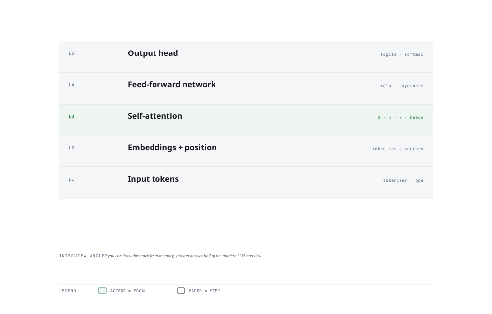

# Visual Notes — Transformer Anatomy

> One diagram, the full picture. This page is meant to be glanced at before reading the chapters, and again before interviews.

# What the diagram shows

1. **Input** — Text is tokenised, embedded, and given positional information so order is preserved.
1. **Attention** — Self-attention lets every token attend to every token; multi-head attention learns different relationships.
1. **Output** — Feed-forward layers refine, then an output head maps to the next-token distribution (or a classification label).

# Why this matters for placement

- The transformer is the single most asked architecture of the decade — know the flow, not just the name.
- Explaining how attention differs from RNN recurrence is a guaranteed warm-up question.

# Quick revision

- "Attention is all you need": no recurrence, parallelised, long range captured.
- Self-attention = Query × Key -> scores -> softmax -> weighted Value sum.
- Positional encoding injects token order since attention has none natively.
- Multi-head attention: parallel projections each specialise in one relationship type.
- Transformers are architecture; BERT (encoder) vs GPT (decoder) vs T5 (encoder-decoder).

# Related chapters

- [Attention mechanism](04-attention-mechanism.md)
- [Transformer architecture](05-transformer-architecture.md)
- [BERT and fine-tuning](06-bert-and-fine-tuning.md)
- [Word embeddings](02-word-embeddings.md)

---

**One-line answer for interviews:** *"Tokens → embeddings + positional encoding → self-attention → feed-forward → output head."*
