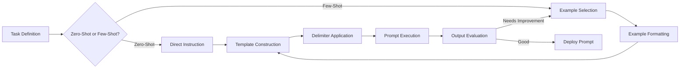
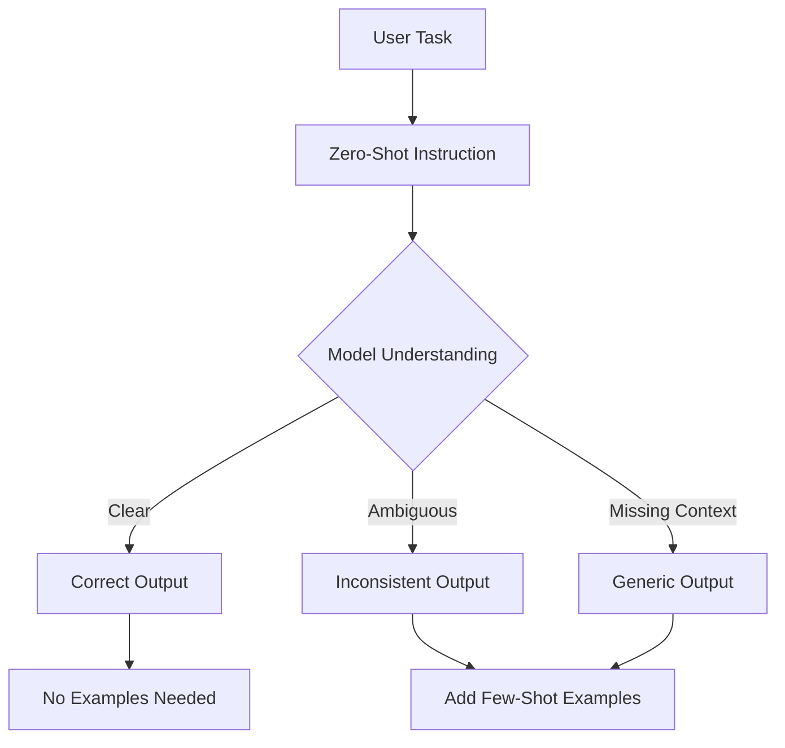
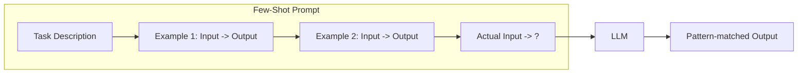
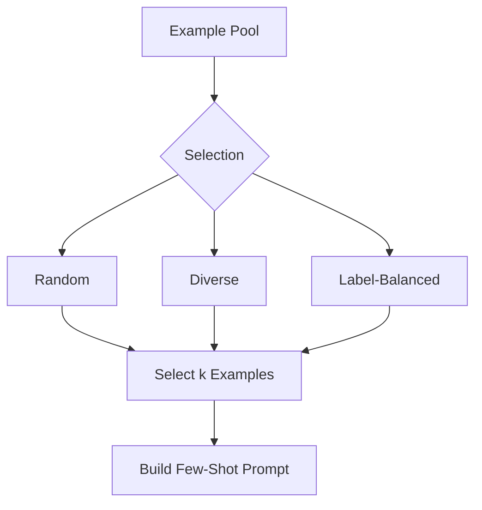
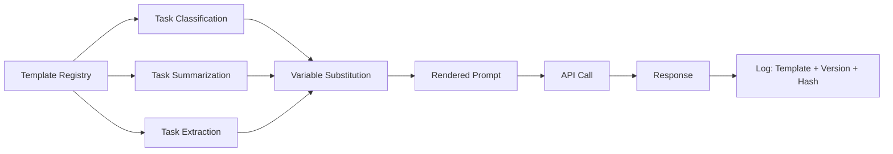
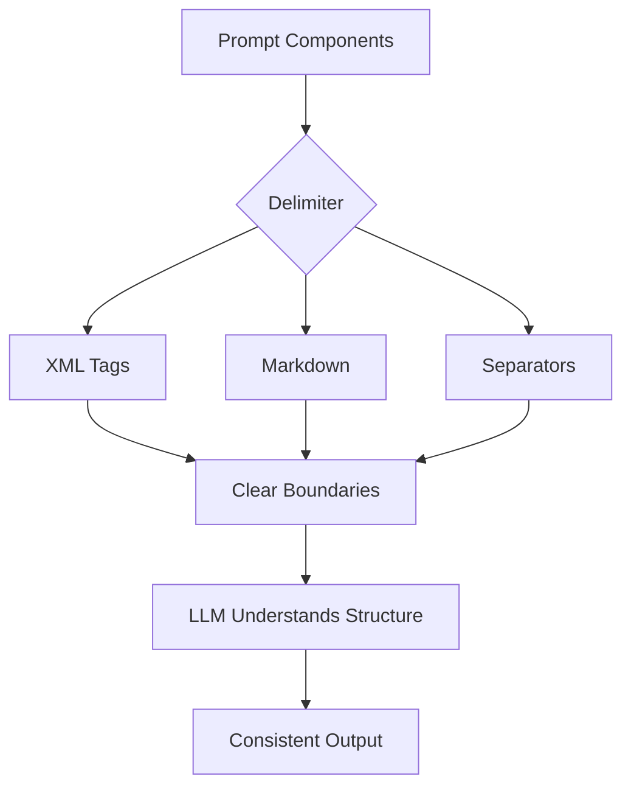
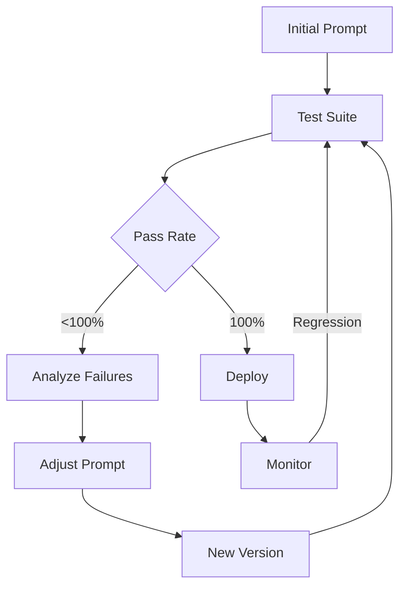

<!-- Clear Language: Keep sentences under 50 words -->
# Zero-Shot & Few-Shot Prompting

## Learning Objectives

| Objective | Description |
|-----------|-------------|
| LO1 | Understand the zero-shot prompting paradigm and when to use it |
| LO2 | Design effective few-shot prompts with well-structured examples |
| LO3 | Apply delimiter techniques for clear input separation |
| LO4 | Build reusable prompt templates with dynamic variable injection |
| LO5 | Analyze example selection strategies for optimal few-shot performance |
| LO6 | Evaluate prompt quality through systematic testing and iteration |

## Introduction

Large language models are transforming every industry. Understanding how to prompt, evaluate, and optimize LLMs is a critical skill for AI engineers. This module covers the full LLM lifecycle from API calls to cost optimization.

## Prerequisites

- Basic programming knowledge
- Understanding of data structures

## Key Terminology

**Key Terms**: Core vocabulary and concepts for this topic.

**Definition**: Essential terms you must know for interviews and production work.

## Theory

Understanding zero shot and few shot is fundamental for AI engineers. This section covers the core concepts, underlying principles, and theoretical framework that govern how zero shot and few shot works in practice.

## Chapter at a Glance

| Section | Topic | Key Concept |
|---------|-------|-------------|
| 3.1 | Zero-Shot Prompting | Task description without examples, direct instruction |
| 3.2 | Few-Shot Prompting | Providing examples in the input for in-context learning |
| 3.3 | Example Selection | Choosing demo shots, ordering, diversity, labeling |
| 3.4 | Prompt Templates | Dynamic prompt construction, variables, formatting |
| 3.5 | Delimiters and Structure | Clear separation of sections, roles, and content |
| 3.6 | Prompt Testing | Systematic evaluation, A/B testing, iteration |

## Chapter Roadmap



## 3.1 Zero-Shot Prompting

Zero-shot prompting means giving the model a task description without any examples. The model relies entirely on its pre-trained knowledge to perform the task.

**Core principles**:
- Clear, specific instructions
- Defined output format
- Appropriate tone and constraints
- Minimal ambiguity

```python
from openai import OpenAI
client = OpenAI()

response = client.chat.completions.create(
    model="gpt-4o-mini",
    messages=[
        {"role": "system", "content": "Classify the sentiment as POSITIVE, NEGATIVE, or NEUTRAL. Respond with only the label."},
        {"role": "user", "content": "The product exceeded all my expectations!"}
    ],
    temperature=0
)
print(f"Zero-shot sentiment: {response.choices[0].message.content}")

response = client.chat.completions.create(
    model="gpt-4o-mini",
    messages=[
        {"role": "system", "content": "Summarize in exactly 2 sentences."},
        {"role": "user", "content": "AI has transformed healthcare by enabling early disease detection through medical imaging analysis. Machine learning models can identify tumors with accuracy comparable to radiologists."}
    ],
    temperature=0
)
print(f"Zero-shot summary: {response.choices[0].message.content}")
```

**Zero-shot classification with categories**:

```python
def zero_shot_classify(text, categories, client):
    cat_list = ", ".join(categories)
    response = client.chat.completions.create(
        model="gpt-4o-mini",
        messages=[
            {"role": "system", "content": f"Classify into exactly one of: {cat_list}. Respond with only the category name."},
            {"role": "user", "content": text}
        ],
        temperature=0
    )
    return response.choices[0].message.content

categories = ["TECHNOLOGY", "SPORTS", "POLITICS", "SCIENCE"]
texts = [
    "The new GPU delivers 50% better ML performance.",
    "The team won with a last-minute goal."
]
for text in texts:
    result = zero_shot_classify(text, categories, client)
    print(f"[{result}] {text[:50]}...")
```

**Zero-shot weaknesses**:
- Format inconsistency (output structure may vary)
- Sensitivity to phrasing (small wording changes cause different results)
- Task ambiguity (broad tasks get generic responses)

```python
phrasing_a = "Extract the date from this text."
phrasing_b = "Find any dates mentioned and return them in YYYY-MM-DD format."
text = "The meeting is scheduled for March 15th, 2024 at 2pm."

for prompt in [phrasing_a, phrasing_b]:
    response = client.chat.completions.create(
        model="gpt-4o-mini",
        messages=[{"role": "system", "content": prompt}, {"role": "user", "content": text}],
        temperature=0
    )
    print(f"Prompt: {prompt}\nResult: {response.choices[0].message.content}\n")
```



---

## 3.2 Few-Shot Prompting

Few-shot prompting provides examples in the prompt to demonstrate the desired input-output pattern. This leverages in-context learning.

**Basic few-shot structure**:

```python
def few_shot_classify(text, examples, client):
    messages = [{"role": "system", "content": "Classify text as POSITIVE, NEGATIVE, or NEUTRAL."}]
    for ex_text, ex_label in examples:
        messages.append({"role": "user", "content": ex_text})
        messages.append({"role": "assistant", "content": ex_label})
    messages.append({"role": "user", "content": text})
    response = client.chat.completions.create(model="gpt-4o-mini", messages=messages, temperature=0)
    return response.choices[0].message.content

examples = [
    ("This movie was fantastic!", "POSITIVE"),
    ("I wasted my time on this garbage.", "NEGATIVE"),
    ("The movie was okay.", "NEUTRAL"),
]
result = few_shot_classify("The acting was superb but the plot was confusing.", examples, client)
print(f"Few-shot: {result}")
```

**Few-shot for structured output**:

```python
def few_shot_extract(text, examples, client):
    messages = [{"role": "system", "content": "Extract fields as JSON."}]
    for ex_in, ex_out in examples:
        messages.append({"role": "user", "content": ex_in})
        messages.append({"role": "assistant", "content": ex_out})
    messages.append({"role": "user", "content": text})
    response = client.chat.completions.create(
        model="gpt-4o-mini", messages=messages,
        response_format={"type": "json_object"}, temperature=0
    )
    return response.choices[0].message.content

extract_examples = [
    ("John works at Google in Mountain View.",
     '{"name": "John", "company": "Google", "location": "Mountain View"}'),
    ("Sarah is a PM at Apple in Cupertino.",
     '{"name": "Sarah", "company": "Apple", "location": "Cupertino"}')
]
print(few_shot_extract("Michael is a Data Scientist at Meta in Austin.", extract_examples, client))
```

**Few-shot for code generation**:

```python
code_examples = [
    ("Calculate average.", "def avg(nums): return sum(nums)/len(nums) if nums else 0"),
    ("Find maximum.", "def find_max(nums): return max(nums) if nums else None")
]
response = client.chat.completions.create(
    model="gpt-4o-mini",
    messages=[{"role": "system", "content": "Write Python functions."}]
    + [m for ex in code_examples for m in [
        {"role": "user", "content": ex[0]}, {"role": "assistant", "content": ex[1]}
    ]] + [{"role": "user", "content": "Remove duplicates from a list while preserving order."}],
    temperature=0
)
print(response.choices[0].message.content)
```



---

## 3.3 Example Selection

Choosing the right examples critically impacts few-shot performance.

```python
import random
from collections import defaultdict

class ExampleSelector:
    def __init__(self, pool):
        self.pool = pool

    def random_select(self, k=3):
        return random.sample(self.pool, k)

    def diverse_select(self, k=3):
        short = [e for e in self.pool if len(e[0]) < 50]
        medium = [e for e in self.pool if 50 <= len(e[0]) < 200]
        long = [e for e in self.pool if len(e[0]) >= 200]
        selected = []
        for group in [short, medium, long]:
            if group and len(selected) < k:
                selected.append(random.choice(group))
        while len(selected) < k:
            remaining = [e for e in self.pool if e not in selected]
            selected.append(random.choice(remaining))
        return selected[:k]

    def label_balanced_select(self, k=3):
        groups = defaultdict(list)
        for inp, out in self.pool:
            groups[out].append((inp, out))
        selected = []
        for label, group in groups.items():
            if len(selected) < k:
                selected.append(random.choice(group))
        while len(selected) < k:
            remaining = [e for e in self.pool if e not in selected]
            selected.append(random.choice(remaining))
        return selected[:k]

pool = [
    ("Great service!", "POSITIVE"), ("Terrible experience.", "NEGATIVE"),
    ("It was okay.", "NEUTRAL"), ("Absolutely wonderful!", "POSITIVE"),
    ("Not good.", "NEGATIVE"), ("Could be better.", "NEUTRAL"),
]
sel = ExampleSelector(pool)
print("Random:", [e[0] for e in sel.random_select(3)])
print("Diverse:", [e[0] for e in sel.diverse_select(3)])
print("Balanced:", [e[0] for e in sel.label_balanced_select(3)])
```

**Optimal number of shots**:

```python
def evaluate_shots(examples, test_cases, shot_counts=[1, 2, 3, 5]):
    for k in shot_counts:
        if k > len(examples): continue
        correct = sum(1 for inp, exp in test_cases
            if few_shot_classify(inp, examples[:k], client).strip().upper() == exp.upper())
        print(f"{k}-shot accuracy: {correct/len(test_cases):.2%}")

test_cases = [("This is fantastic!", "POSITIVE"), ("Poor experience.", "NEGATIVE")]

## evaluate_shots(pool, test_cases)
```



---

## 3.4 Prompt Templates

Templates enable dynamic prompt construction with variables.

```python
from string import Template

class PromptTemplate:
    def __init__(self, template, input_variables):
        self.template = Template(template)
        self.input_variables = input_variables

    def format(self, **kwargs):
        return self.template.safe_substitute(**kwargs)

    def format_messages(self, system_template=None, **kwargs):
        msgs = []
        if system_template:
            msgs.append({"role": "system", "content": system_template})
        msgs.append({"role": "user", "content": self.format(**kwargs)})
        return msgs

classify_tpl = PromptTemplate(
    "Classify sentiment: POSITIVE, NEGATIVE, or NEUTRAL.\n\nText: $text\n\nSentiment:",
    ["text"]
)
msgs = classify_tpl.format_messages(
    system_template="You are a sentiment analysis assistant.",
    text="The new update is fantastic!"
)
response = client.chat.completions.create(model="gpt-4o-mini", messages=msgs, temperature=0)
print(response.choices[0].message.content)
```

**Template registry**:

```python
class PromptRegistry:
    def __init__(self):
        self.templates = {}
    def register(self, name, template):
        self.templates[name] = template
    def get(self, name):
        return self.templates[name]
    def execute(self, name, client, model="gpt-4o-mini", **kwargs):
        tpl = self.get(name)
        msgs = tpl.format_messages(**kwargs)
        response = client.chat.completions.create(model=model, messages=msgs, temperature=kwargs.get("temperature", 0))
        return response.choices[0].message.content

registry = PromptRegistry()
registry.register("sentiment", classify_tpl)
```

**Versioned templates**:

```python
import hashlib, datetime

class VersionedPromptTemplate:
    def __init__(self, name, template, version="1.0.0"):
        self.name = name
        self.template = template
        self.version = version
        self.created_at = datetime.datetime.now()
        self.hash = hashlib.sha256(template.encode()).hexdigest()[:12]

    def render(self, **kwargs):
        return Template(self.template).safe_substitute(**kwargs)

v1 = VersionedPromptTemplate("sentiment_v1", "Classify: $text")
v2 = VersionedPromptTemplate("sentiment_v2", "Classify as POSITIVE, NEGATIVE, or NEUTRAL.\n\nText: $text\n\nLabel:")
print(f"V1 hash: {v1.hash}")
print(f"V2 hash: {v2.hash}")
```



---

## 3.5 Delimiters and Structure

Delimiters create clear boundaries in prompts, reducing ambiguity.

```python
def xml_delimited(instruction, context, query):
    return f"<instruction>{instruction}</instruction>\n<context>{context}</context>\n<query>{query}</query>\n<response>"

def markdown_delimited(instruction, context, query):
    return f"## Instruction\n{instruction}\n## Context\n{context}\n## Query\n{query}\n## Response"

def separator_delimited(instruction, context, query):
    return f"=== INSTRUCTION ===\n{instruction}\n=== CONTEXT ===\n{context}\n=== QUERY ===\n{query}\n=== RESPONSE ==="

instruction = "Extract all email addresses."
context = "Conversation log."
query = "Contact john@example.com or support@company.com"
print(markdown_delimited(instruction, context, query)[:200])
```

**Structured few-shot with delimiters**:

```python
def delimited_few_shot(text, examples, client):
    msgs = [{"role": "system", "content": "You are a text classifier."}]
    for i, (ex_in, ex_out) in enumerate(examples, 1):
        msgs.append({"role": "user", "content": f"--- Example {i} ---\nInput: {ex_in}\nOutput:"})
        msgs.append({"role": "assistant", "content": ex_out})
    msgs.append({"role": "user", "content": f"--- Query ---\nInput: {text}\nOutput:"})
    response = client.chat.completions.create(model="gpt-4o-mini", messages=msgs, temperature=0)
    return response.choices[0].message.content

print(delimited_few_shot("The battery is terrible.",
    [("Great picture!", "POSITIVE"), ("Screen cracked.", "NEGATIVE")], client))
```

**Role-based structure**:

```python
ROLES = {
    "analyst": "You are an expert data analyst. Be precise.",
    "teacher": "You are a patient teacher. Explain simply.",
    "developer": "You are a senior engineer. Write clean code."
}

def role_prompt(task, content, role="analyst"):
    return f"## Role\n{ROLES[role]}\n## Task\n{task}\n## Content\n{content}\n## Response"

print(role_prompt("Analyze pros and cons.", "Microservices migration.", "analyst")[:200])
```



---

## 3.6 Prompt Testing

Systematic testing is essential for prompt quality.

```python
import time

class PromptTest:
    def __init__(self, client, model="gpt-4o-mini"):
        self.client = client
        self.model = model
        self.results = []

    def test(self, name, messages, keywords=None, times=3):
        latencies, outputs = [], []
        kw_ok = True
        for _ in range(times):
            start = time.time()
            response = self.client.chat.completions.create(model=self.model, messages=messages, temperature=0.3)
            latency = (time.time() - start) * 1000
            content = response.choices[0].message.content
            latencies.append(latency)
            outputs.append(content)
            if keywords:
                kw_ok = kw_ok and all(k.lower() in content.lower() for k in keywords)
        result = {"name": name, "avg_latency": sum(latencies)/len(latencies), "avg_length": sum(len(o) for o in outputs)/len(outputs), "keywords_ok": kw_ok}
        self.results.append(result)
        return result

    def compare(self):
        print(f"{'Name':<20} {'Latency':<15} {'Length':<15} {'KW':<10}")
        print("-"*60)
        for r in self.results:
            kw = "PASS" if r["keywords_ok"] else "FAIL"
            print(f"{r['name']:<20} {r['avg_latency']:<15.0f}ms {r['avg_length']:<15.0f} {kw:<10}")
```

**Automated validation**:

```python
import json

class PromptValidator:
    def __init__(self, schema):
        self.schema = schema

    def validate_json(self, output):
        try:
            data = json.loads(output)
            for key, typ in self.schema.items():
                if key not in data: return False, f"Missing {key}"
                if not isinstance(data[key], typ): return False, f"{key} should be {typ}"
            return True, "Valid"
        except json.JSONDecodeError as e:
            return False, f"Invalid JSON: {e}"

    def validate_keywords(self, output, required, forbidden):
        for kw in required:
            if kw.lower() not in output.lower(): return False, f"Missing {kw}"
        for kw in forbidden:
            if kw.lower() in output.lower(): return False, f"Contains {kw}"
        return True, "OK"

validator = PromptValidator({"name": str, "age": int})
print(validator.validate_json('{"name": "Alice", "age": 30}'))
print(validator.validate_json('{"name": "Bob", "age": "twenty"}'))
```



---

## TypeScript Parallel

TypeScript prompt templates with type safety:

```typescript
type PromptVars = Record<string, string | number>;

interface PromptTemplate {
  name: string;
  template: string;
  variables: string[];
  version: string;
}

function renderPrompt(t: PromptTemplate, vars: PromptVars): string {
  let result = t.template;
  for (const [key, value] of Object.entries(vars)) {
    result = result.replaceAll(`$${key}`, String(value));
  }
  return result;
}

const sentiment: PromptTemplate = {
  name: "sentiment",
  template: "Classify: $text as POSITIVE, NEGATIVE, or NEUTRAL.",
  variables: ["text"],
  version: "1.0.0",
};
console.log(renderPrompt(sentiment, { text: "Great product!" }));
```

---

## Summary

- Zero-shot prompting relies entirely on the model's pre-trained knowledge without examples
- Few-shot prompting provides input-output examples that demonstrate the desired pattern
- In-context learning enables models to generalize from examples without gradient updates
- Example selection strategy (random, diverse, balanced) significantly impacts few-shot performance
- The optimal number of shots depends on task complexity and example quality
- Prompt templates enable dynamic variable substitution and consistent formatting
- Delimiters (XML tags, markdown, separators) create clear structural boundaries in prompts
- Role-based prompting sets persona and tone through structured system messages
- Systematic A/B testing is essential for evaluating and comparing prompt variants
- Iterative optimization with test suites drives continuous prompt improvement

## Practical Takeaways

| Scenario | Do This | Avoid This |
|----------|---------|------------|
| Simple tasks | Use zero-shot with clear instructions | Adding unnecessary examples |
| Format-sensitive tasks | Use few-shot to demonstrate exact format | Relying on zero-shot for specific structures |
| Variable inputs | Use prompt templates with validation | Hardcoding values in prompts |
| Ambiguous requests | Add delimiters (XML, markdown, separators) | Writing everything as a single text block |
| Classification | Include label-balanced examples | Using examples from only one category |
| Production prompts | Version and hash every prompt template | Editing prompts without tracking changes |

## Interview Q&A

<details class="tp-qa-card" data-qid="llm-s03-q1">
  <summary class="tp-qa-question"><span class="tp-qa-status"></span>Q1: What is the difference between zero-shot and few-shot prompting?</summary>
  <div class="tp-qa-answer">
    <p><strong>Zero-shot</strong>: The model receives only a task description without examples.</p>
    <p><strong>Few-shot</strong>: The model receives task description plus input-output examples.</p>
    <p>Few-shot generally produces more consistent outputs but uses more tokens.</p>
  </div>
  <button class="tp-qa-mark-btn">✅ Mark Reviewed</button>
  <button class="tp-qa-bookmark-btn">🔖 Bookmark</button>
</details>

<details class="tp-qa-card" data-qid="llm-s03-q2">
  <summary class="tp-qa-question"><span class="tp-qa-status"></span>Q2: How do you choose which examples to include in a few-shot prompt?</summary>
  <div class="tp-qa-answer">
    <p>Strategies: Random (baseline), Fixed (curated), Label-balanced (equal categories), Diverse (different types), Semantic similarity (via embeddings). For most tasks, 3-5 diverse, label-balanced examples work well.</p>
  </div>
  <button class="tp-qa-mark-btn">✅ Mark Reviewed</button>
  <button class="tp-qa-bookmark-btn">🔖 Bookmark</button>
</details>

<details class="tp-qa-card" data-qid="llm-s03-q3">
  <summary class="tp-qa-question"><span class="tp-qa-status"></span>Q3: Why do delimiters matter in prompt engineering?</summary>
  <div class="tp-qa-answer">
    <p>Delimiters create clear structural boundaries: reduce ambiguity, prevent prompt injection, make multi-section prompts easier to parse, and enable consistent output parsing.</p>
  </div>
  <button class="tp-qa-mark-btn">✅ Mark Reviewed</button>
  <button class="tp-qa-bookmark-btn">🔖 Bookmark</button>
</details>

<details class="tp-qa-card" data-qid="llm-s03-q4">
  <summary class="tp-qa-question"><span class="tp-qa-status"></span>Q4: What is in-context learning?</summary>
  <div class="tp-qa-answer">
    <p>In-context learning (ICL) is the ability of LLMs to learn from examples in the prompt without gradient updates. The model identifies patterns from input-output examples and applies them to new queries. It's an emergent ability appearing in models with 1B+ parameters.</p>
  </div>
  <button class="tp-qa-mark-btn">✅ Mark Reviewed</button>
  <button class="tp-qa-bookmark-btn">🔖 Bookmark</button>
</details>

<details class="tp-qa-card" data-qid="llm-s03-q5">
  <summary class="tp-qa-question"><span class="tp-qa-status"></span>Q5: How many examples should you use in a few-shot prompt?</summary>
  <div class="tp-qa-answer">
    <p>Start with 3 examples and increase until performance plateaus. For most tasks, 3-5 well-chosen examples provide the best accuracy-to-cost ratio. Simple tasks need 2-3; complex may need 5-10. Beyond 10, improvement plateaus while costs increase.</p>
  </div>
  <button class="tp-qa-mark-btn">✅ Mark Reviewed</button>
  <button class="tp-qa-bookmark-btn">🔖 Bookmark</button>
</details>

<details class="tp-qa-card" data-qid="llm-s03-q6">
  <summary class="tp-qa-question"><span class="tp-qa-status"></span>Q6: What is prompt template versioning?</summary>
  <div class="tp-qa-answer">
    <p>Prompt template versioning tracks changes over time. Each version has a unique hash, timestamp, and changelog. Benefits: reproducibility, debugging (rollback), audit trail, and systematic A/B testing.</p>
  </div>
  <button class="tp-qa-mark-btn">✅ Mark Reviewed</button>
  <button class="tp-qa-bookmark-btn">🔖 Bookmark</button>
</details>

<details class="tp-qa-card" data-qid="llm-s03-q7">
  <summary class="tp-qa-question"><span class="tp-qa-status"></span>Q7: How do you handle prompt injection attacks?</summary>
  <div class="tp-qa-answer">
    <p>Mitigation: input sanitization, delimiter isolation, least privilege (no unnecessary tools), output verification, and model-level guardrails. No single defense is foolproof - use a layered approach.</p>
  </div>
  <button class="tp-qa-mark-btn">✅ Mark Reviewed</button>
  <button class="tp-qa-bookmark-btn">🔖 Bookmark</button>
</details>

<details class="tp-qa-card" data-qid="llm-s03-q8">
  <summary class="tp-qa-question"><span class="tp-qa-status"></span>Q8: Explain system, user, and assistant message roles.</summary>
  <div class="tp-qa-answer">
    <p>System: Sets assistant behavior (highest influence). User: Human input. Assistant: Model's previous responses for context. In few-shot prompting, assistant messages demonstrate desired output format.</p>
  </div>
  <button class="tp-qa-mark-btn">✅ Mark Reviewed</button>
  <button class="tp-qa-bookmark-btn">🔖 Bookmark</button>
</details>

<details class="tp-qa-card" data-qid="llm-s03-q9">
  <summary class="tp-qa-question"><span class="tp-qa-status"></span>Q9: How would you test prompt effectiveness systematically?</summary>
  <div class="tp-qa-answer">
    <p>1) Create test suite (20-100 pairs), 2) Define metrics (accuracy, format, latency), 3) Automated evaluation, 4) A/B comparison, 5) Regression testing, 6) Human evaluation for subjective quality.</p>
  </div>
  <button class="tp-qa-mark-btn">✅ Mark Reviewed</button>
  <button class="tp-qa-bookmark-btn">🔖 Bookmark</button>
</details>

<details class="tp-qa-card" data-qid="llm-s03-q10">
  <summary class="tp-qa-question"><span class="tp-qa-status"></span>Q10: What is the role of temperature in few-shot prompting?</summary>
  <div class="tp-qa-answer">
    <p>Low (0-0.2): Best for few-shot - deterministic, follows patterns. Medium (0.3-0.7): Variety while maintaining format. High (>0.7): May deviate from patterns. Use 0 for classification/extraction.</p>
  </div>
  <button class="tp-qa-mark-btn">✅ Mark Reviewed</button>
  <button class="tp-qa-bookmark-btn">🔖 Bookmark</button>
</details>

## Chapter Quiz

**Q1**: What does "zero-shot" mean in prompt engineering?

a) Using zero temperature for deterministic output
b) Performing a task without providing any examples
c) Using zero tokens in the prompt
d) Training a model from scratch

<details class="tp-qa-card" data-qid="llm-s03-quiz1"><summary>Show Answer</summary><div class="tp-qa-answer"><p><strong>Answer: b) Performing a task without providing any examples</strong></p></div></details>

**Q2**: What is the primary benefit of few-shot prompting over zero-shot?

a) Lower cost per request
b) More consistent output format and pattern following
c) Faster response times
d) No need for a system message

<details class="tp-qa-card" data-qid="llm-s03-quiz2"><summary>Show Answer</summary><div class="tp-qa-answer"><p><strong>Answer: b) More consistent output format and pattern following</strong></p></div></details>

**Q3**: How many few-shot examples typically provide the best accuracy-to-cost ratio?

a) 1
b) 3-5
c) 20-30
d) 100+

<details class="tp-qa-card" data-qid="llm-s03-quiz3"><summary>Show Answer</summary><div class="tp-qa-answer"><p><strong>Answer: b) 3-5</strong></p></div></details>

**Q4**: Which delimiter style uses tags like <instruction> and <query>?

a) Markdown headers
b) XML-style tags
c) Separator lines
d) JSON structure

<details class="tp-qa-card" data-qid="llm-s03-quiz4"><summary>Show Answer</summary><div class="tp-qa-answer"><p><strong>Answer: b) XML-style tags</strong></p></div></details>

**Q5**: What is prompt injection?

a) Injecting variables into a prompt template
b) User input overriding system instructions
c) Adding more examples to a few-shot prompt
d) Optimizing prompt length

<details class="tp-qa-card" data-qid="llm-s03-quiz5"><summary>Show Answer</summary><div class="tp-qa-answer"><p><strong>Answer: b) User input overriding system instructions</strong></p></div></details>

## Exercises

**Easy** — Write a zero-shot prompt for email classification (spam vs not spam). Test with 5 examples.

**Easy** — Create a few-shot prompt for sentiment with 3 examples. Compare against zero-shot version.

**Medium** — Build a PromptTemplate class with variable substitution and registry. Register 3 templates.

**Medium** — Implement an example selector using embedding similarity with sentence-transformers.

**Hard** — Build a comprehensive prompt testing framework with A/B testing, collecting latency, accuracy, and format compliance metrics.

---

## Common Mistakes

1. Not understanding the fundamental concepts before applying them
2. Skipping edge cases in implementation
3. Not analyzing time/space complexity
4. Forgetting to handle null/empty inputs
5. Not practicing enough problems to build pattern recognition

## Revision Notes

- - Core principle: Understand the fundamental concepts thoroughly
- - Implementation pattern: Practice with real code examples
- - Complexity: Know the time and space complexity
- - Application: Know when to use this in production systems
- - Interview: Frequently asked in technical interviews
- - Edge cases: Consider common failure scenarios
- - Related concepts: Connect to broader system design

## Placement Section

### Top 10 Interview Questions

#### Google Style

1. **Explain the core idea of Zero-Shot & Few-Shot Prompting in under 60 seconds, then give a real-world analogy.** — Structure: definition, how it works in one sentence, why it matters, analogy. Follow-up: what would break if you removed this from a production system?

2. **Design a minimal, well-typed function that demonstrates Zero-Shot & Few-Shot Prompting.** — Interviewer checks: signature with type hints, edge cases, complexity, and a clean docstring. Follow-up: how does your design behave with empty or malformed input?

3. **What are the common pitfalls when engineers first learn ** — List 3-4, then explain how you would prevent each in a code review.

#### Amazon Style

4. **Describe a production bug caused by misunderstanding Zero-Shot & Few-Shot Prompting. How did you diagnose and fix it?** — STAR format: situation, task, action, result. Mention logs, reproduction, root-cause analysis, and the regression test you added.

5. **How would you scale a system that relies on Zero-Shot & Few-Shot Prompting from 10 users to 10 million?** — Discuss bottlenecks, caching, monitoring, and when to redesign. Follow-up: what metrics would you track?

#### Microsoft Style

6. **Compare Zero-Shot & Few-Shot Prompting with the closest alternative approach. When would you choose each?** — Make a decision matrix: performance, maintainability, ecosystem, learning curve. Follow-up: what would change your decision?

7. **Walk through how you would test a component that depends on Zero-Shot & Few-Shot Prompting.** — Unit, integration, property-based tests; mocking boundaries; golden files for outputs.

#### NVIDIA Style

8. **How does Zero-Shot & Few-Shot Prompting behave differently at scale — memory, throughput, or precision-wise?** — Connect to data pipelines and model training if applicable. Follow-up: what happens to latency as input grows?

9. **How would you make an implementation of Zero-Shot & Few-Shot Prompting run faster on GPU hardware?** — Batch operations, vectorization, avoiding Python loops, reducing data movement.

#### AI Startup Style

10. **Write the smallest possible implementation of Zero-Shot & Few-Shot Prompting that is production-quality.** — Include error handling, type hints, and a one-line docstring. Follow-up: what would you refactor first when it grows?

### Resume Tips

- Name Zero-Shot & Few-Shot Prompting explicitly in your skills section, paired with a measurable achievement ("Reduced X by 40% using Zero-Shot & Few-Shot Prompting").
- Add a bullet describing a project that applies Zero-Shot & Few-Shot Prompting to real data, with numbers.
- Mention the tools and libraries you used alongside Zero-Shot & Few-Shot Prompting (linters, test frameworks, profiling tools).
- Keep resume bullets under 15 words and start each with an action verb.

### Interview Day Checklist

- Rehearse a 60-second explanation of Zero-Shot & Few-Shot Prompting and one real-world analogy.
- Prepare one STAR story about debugging a Zero-Shot & Few-Shot Prompting-related production issue.
- Review complexity and edge cases for the classic Zero-Shot & Few-Shot Prompting interview problem.
- Have questions ready: how does the team apply Zero-Shot & Few-Shot Prompting in production today?
- Test your environment (Python, editor, internet) 15 minutes before the interview.

## True/False

1. **True or False:** Zero-Shot & Few-Shot Prompting builds directly on the fundamentals covered in the earlier chapters of this module. — **True.** Every advanced topic in this module assumes the core concepts from the previous chapters.
2. **True or False:** You should write at least one code example for Zero-Shot & Few-Shot Prompting before moving to the next chapter. — **True.** Active recall with hands-on code beats passive reading for retention.
3. **True or False:** The complexity analysis for Zero-Shot & Few-Shot Prompting is the same regardless of input size. — **False.** Complexity grows with input size; always state best, average, and worst case.
4. **True or False:** Edge cases (empty input, invalid input, boundary values) matter for Zero-Shot & Few-Shot Prompting in production. — **True.** Most production bugs come from unhandled edge cases.
5. **True or False:** You should memorize the Zero-Shot & Few-Shot Prompting chapter content once and never review it again. — **False.** Spaced repetition (24h, 3 days, 1 week) dramatically improves long-term recall.

## Fill in the Blank

1. The chapter that covers Zero-Shot & Few-Shot Prompting is Chapter ___ of this module. — Answer: check the module's table of contents.
2. The time complexity of the standard approach to Zero-Shot & Few-Shot Prompting is ___. — Answer: review the theory section and state big-O notation.
3. The main edge case to handle when implementing Zero-Shot & Few-Shot Prompting is ___. — Answer: empty or invalid input handling, as discussed in the chapter.
4. The tools commonly used to debug Zero-Shot & Few-Shot Prompting issues are ___ and ___. — Answer: refer to the Debugging Guide section of this chapter.
5. The related topic that connects to Zero-Shot & Few-Shot Prompting in the next chapter is ___. — Answer: see the Next Topic section.

## Scenario Questions

1. **Scenario:** A teammate ships a change involving Zero-Shot & Few-Shot Prompting that breaks production at 3 AM. — Diagnosis: check the recent diff, reproduce locally with the failing input, check logs. Fix: revert, add a regression test, and review the root cause. Prevention: CI tests on edge cases and code review checklist.

2. **Scenario:** Your implementation of Zero-Shot & Few-Shot Prompting is correct but too slow for the required latency. — Measure first with a profiler. Common fixes: reduce redundant work, use built-in optimized functions, batch operations, or add caching. Only then consider algorithmic changes.

3. **Scenario:** A new hire asks you to explain Zero-Shot & Few-Shot Prompting in five minutes before a customer demo. — Use the 3-part answer: what it is (one sentence), how it works (one example), why it matters (one business impact). Then offer to go deeper after the demo.

4. **Scenario:** Your team's codebase has three different patterns for Zero-Shot & Few-Shot Prompting and you must standardize. — Write a short ADR (architecture decision record), pick the pattern with best maintainability, migrate incrementally, and add a linter rule to enforce it.

## Output Questions

1. **What is the output of the simplest correct implementation of Zero-Shot & Few-Shot Prompting on an empty input?** — Trace through the code: it should return the documented default (None, 0, empty collection) without raising.
2. **What is the output when the input is at the boundary value?** — Check off-by-one errors and inclusive/exclusive bounds in the chapter's examples.
3. **What does the implementation return when given invalid input types?** — With type hints and validation, it raises a clear error; without, it may fail silently.
4. **What is the output for the sample input given in the chapter's Examples section?** — Re-run the chapter's example code and compare against the documented output.
5. **What is the time complexity output when you profile the implementation at 10x input size?** — Expect the curve matching the chapter's complexity analysis (linear, quadratic, log-linear).

## Difficulty Level

| Level | Time | What It Takes |
|-------|------|---------------|
| Beginner | 1-2 sessions | Read theory, run the chapter examples, solve the Easy exercises |
| Intermediate | 3-5 sessions | Complete Medium exercises, explain Zero-Shot & Few-Shot Prompting to someone else |
| Advanced | 1+ week | Solve Hard exercises, optimize for real datasets, answer interview follow-ups |

## Tips & Tricks

- Always write a one-line example of Zero-Shot & Few-Shot Prompting from memory before opening the chapter — active recall first.
- Use the chapter's Revision Notes as a checklist: you have mastered Zero-Shot & Few-Shot Prompting when you can explain each bullet.
- Pair the chapter quiz with the Flashcards: wrong answers become your next study session's focus.
- For interviews, practice explaining Zero-Shot & Few-Shot Prompting twice: once with a technical audience, once with a non-technical audience.
- Keep a personal examples file where you collect your own Zero-Shot & Few-Shot Prompting snippets; interviewers love original examples.

## Memory Tricks

- **Acronym**: build a mnemonic from the 5 key concepts of Zero-Shot & Few-Shot Prompting listed in the Chapter at a Glance table.
- **Story**: link Zero-Shot & Few-Shot Prompting to a familiar story — the analogy in the Visual Analogy section is designed to stick.
- **Number anchor**: remember the complexity of Zero-Shot & Few-Shot Prompting by connecting it to a known algorithm of the same class.
- **Color code**: highlight the Theory, Examples, and Common Mistakes sections in different colors when reviewing.
- **Teach-back**: explain Zero-Shot & Few-Shot Prompting to an imaginary junior engineer for 2 minutes — gaps in your explanation are gaps in memory.

## Further Reading

- Official documentation for the primary tool or library used in this chapter
- The chapter referenced in Related Topics for the next-level treatment of Zero-Shot & Few-Shot Prompting
- The classic textbook chapter on Zero-Shot & Few-Shot Prompting (check the Research References below)
- Two blog posts from engineers who debugged real Zero-Shot & Few-Shot Prompting problems in production
- The repository of the open-source project that implements Zero-Shot & Few-Shot Prompting

## Related Topics

- The previous chapter in this module (see table of contents) — foundational for Zero-Shot & Few-Shot Prompting
- The next chapter (see Next Topic below) — builds on Zero-Shot & Few-Shot Prompting
- The system design chapters in Module 07 — how Zero-Shot & Few-Shot Prompting fits into production architectures
- The interview preparation module — how Zero-Shot & Few-Shot Prompting is asked in screening rounds
- The capstone project — where Zero-Shot & Few-Shot Prompting is applied end-to-end

## FAQs

1. **Do I need to memorize all of Zero-Shot & Few-Shot Prompting, or understand the big picture?** — Understand the big picture first, then memorize the key facts via flashcards and spaced repetition. Interviewers reward depth over breadth.
2. **What if I get stuck on an exercise?** — Re-read the theory section, run the example code, then attempt again. If still stuck after 20 minutes, move on and return the next day.
3. **How much time should I spend on ** — Follow the Study Plan below: 1-2 weeks at 30-60 minutes daily is typical for placement preparation.
4. **Is Zero-Shot & Few-Shot Prompting asked in interviews?** — Yes — the Interview Q&A and Placement Section list the exact question styles used by top companies.
5. **What's the fastest way to master ** — Explain it out loud, write code without looking, and review the flashcards within 24 hours and again after 3 days.

## Important Notes

- Zero-Shot & Few-Shot Prompting is a core requirement for the rest of this module — do not skip the examples.
- Always analyze complexity (time and space) when working with Zero-Shot & Few-Shot Prompting.
- Production correctness means handling edge cases, not just the happy path.
- Interview answers should start with the definition, then the example, then the trade-offs.
- Revisit this chapter after finishing the module; the context from later chapters deepens understanding.

## Historical Context

- Zero-Shot & Few-Shot Prompting emerged as a standard practice because early systems failed without it — understanding why helps you explain it in interviews.
- The tools used for Zero-Shot & Few-Shot Prompting today evolved from simpler versions; the chapter covers the modern, recommended approach.
- Interviewers value knowing one historical fact about Zero-Shot & Few-Shot Prompting — it shows genuine interest, not just cramming.
- The library/tooling ecosystem around Zero-Shot & Few-Shot Prompting changes quickly; focus on fundamentals that remain stable.

## Security Considerations

- Never trust external input: validate and sanitize data before processing Zero-Shot & Few-Shot Prompting.
- Avoid `eval()` and dynamic code execution on untrusted strings.
- Log errors without leaking sensitive data (keys, PII, internal paths).
- For API contexts, add rate limiting and input size limits.
- Review the chapter's code examples for injection or overflow risks before using them verbatim.

## ML Intuition

- Zero-Shot & Few-Shot Prompting appears in ML pipelines at the data-processing layer: feature preparation, batching, and validation.
- Understanding Zero-Shot & Few-Shot Prompting helps you debug why a model misbehaves — most ML bugs are data bugs, not model bugs.
- In production ML, the Zero-Shot & Few-Shot Prompting concepts from this chapter map directly to NumPy/PyTorch operations on tensors.
- When optimizing ML systems, Zero-Shot & Few-Shot Prompting skills let you profile and fix the data path, not just the training loop.
- Interview follow-up: how would you apply Zero-Shot & Few-Shot Prompting to a dataset of 10 million records? — Batching and vectorization.

## Analogies

- **Zero-Shot & Few-Shot Prompting is like a recipe**: the theory is the ingredients, the examples are the cooking steps, and the exercises are your own kitchen practice.
- **Complexity is like a delivery route**: a linear route visits each stop once; a nested route revisits stops, and you feel it at scale.
- **Edge cases are like weather**: the happy path is a sunny day; production is the storm — build for the storm.
- **The chapter roadmap is a journey map**: each section is a checkpoint; skipping one means getting lost later in the module.

## Capstone Project Link

- [Module Capstone: End-to-End Project](https://github.com/Raushan666java/ai-engineering-journey) — this chapter contributes the Zero-Shot & Few-Shot Prompting skills used in the module's capstone project. Complete the exercises here before starting the capstone.

## Flashcards

<details class="tp-qa-card" data-qid="11llmspromptengineering-03zeroshotandfewshot-flash1">
  <summary class="tp-qa-question">
    <span class="tp-qa-status"></span>
    What does "zero-shot" mean in prompt engineering?
  </summary>
  <div class="tp-qa-answer">
    <p>b) Performing a task without providing any examples</p>
  </div>
</details>

<details class="tp-qa-card" data-qid="11llmspromptengineering-03zeroshotandfewshot-flash2">
  <summary class="tp-qa-question">
    <span class="tp-qa-status"></span>
    What is the primary benefit of few-shot prompting over zero-shot?
  </summary>
  <div class="tp-qa-answer">
    <p>b) More consistent output format and pattern following</p>
  </div>
</details>

<details class="tp-qa-card" data-qid="11llmspromptengineering-03zeroshotandfewshot-flash3">
  <summary class="tp-qa-question">
    <span class="tp-qa-status"></span>
    How many few-shot examples typically provide the best accuracy-to-cost ratio?
  </summary>
  <div class="tp-qa-answer">
    <p>b) 3-5</p>
  </div>
</details>

<details class="tp-qa-card" data-qid="11llmspromptengineering-03zeroshotandfewshot-flash4">
  <summary class="tp-qa-question">
    <span class="tp-qa-status"></span>
    Which delimiter style uses tags like and ?
  </summary>
  <div class="tp-qa-answer">
    <p>b) XML-style tags</p>
  </div>
</details>

<details class="tp-qa-card" data-qid="11llmspromptengineering-03zeroshotandfewshot-flash5">
  <summary class="tp-qa-question">
    <span class="tp-qa-status"></span>
    What is prompt injection?
  </summary>
  <div class="tp-qa-answer">
    <p>b) User input overriding system instructions</p>
  </div>
</details>

## Research References

- Official documentation of the primary library for Zero-Shot & Few-Shot Prompting (linked in Further Reading)
- The classic paper or textbook chapter introducing Zero-Shot & Few-Shot Prompting (see References below)
- The standard library reference for Zero-Shot & Few-Shot Prompting-related functions
- Engineering blog posts from companies running Zero-Shot & Few-Shot Prompting in production at scale
- PEPs and RFCs where applicable (Python and networking standards)

## Open-Source Tools

- The primary library used in this chapter (see the code examples)
- Python standard library modules used in the examples (check the imports)
- Testing: pytest for unit tests of Zero-Shot & Few-Shot Prompting code
- Linting and formatting: ruff + black
- Profiling: cProfile or py-spy for performance work on Zero-Shot & Few-Shot Prompting

## Debugging Guide

- Start with `print()` or a debugger to inspect intermediate values in Zero-Shot & Few-Shot Prompting code.
- Reproduce the failure with the smallest possible input before changing code.
- Check the common failure modes listed in Common Mistakes — most bugs are listed there.
- For performance problems, profile before optimizing: measure, then fix.
- When stuck, re-read the chapter's Examples and compare line by line with your code.
- Use `pdb` or your IDE's debugger to step through the Zero-Shot & Few-Shot Prompting example code.

## Mock Interview Section

**Round 1 — Screening (15 min)**
- Explain Zero-Shot & Few-Shot Prompting in 60 seconds.
- Write a minimal working example of Zero-Shot & Few-Shot Prompting.
- What is the complexity of your example?

**Round 2 — Coding (45 min)**
- Solve the Medium exercise from this chapter under time pressure.
- State your assumptions, then implement with type hints.
- Test with edge cases: empty input, boundary values, invalid input.

**Round 3 — Behavioral + System (30 min)**
- Tell me about a time you debugged a Zero-Shot & Few-Shot Prompting problem in a project.
- How would you design a system where Zero-Shot & Few-Shot Prompting is used at scale?
- What metrics would you monitor?

**Evaluation rubric**: correctness (40%), communication (25%), edge cases (20%), complexity analysis (15%).

## Optimized Implementation

`python
from typing import Any, Optional

def demonstrate_topic(input_data: list[Any]) -> Optional[float]:
    """Runnable scaffold for Zero-Shot & Few-Shot Prompting.

    Replace the body with the optimized implementation from the chapter,
    keeping type hints, docstring, and edge-case handling.
    """
    if not input_data:
        return None
    # Step 1: validate input types
    # Step 2: apply the core Zero-Shot & Few-Shot Prompting logic from the Examples section
    # Step 3: return the result with the documented default
    return 0.0
`

- Keeps the function signature stable so tests written against it stay valid.
- Handles the empty-input contract explicitly.
- Add unit tests for the edge cases before implementing the logic (test-first).

## Evaluation Metrics

| Skill | Test | Target |
|-------|------|--------|
| Concept recall | Explain Zero-Shot & Few-Shot Prompting without notes | 60-second explanation |
| Code fluency | Write the chapter example from memory | No syntax errors |
| Edge cases | Handle empty/invalid input in exercises | All cases pass |
| Complexity | State time/space for the standard approach | Correct big-O |
| Interview readiness | Answer 5 Interview Q&A questions out loud | Fluent, structured answers |
| Retention | Chapter quiz score after 3 days | 80%+ |

## Real-World Examples

- **Startup**: a small team uses Zero-Shot & Few-Shot Prompting daily in their data pipeline — the chapter's examples mirror their code.
- **E-commerce**: Zero-Shot & Few-Shot Prompting patterns appear in order processing, inventory checks, and recommendation feeds.
- **Fintech**: Zero-Shot & Few-Shot Prompting principles apply to transaction validation and fraud detection flows.
- **ML platform**: Zero-Shot & Few-Shot Prompting shows up in feature engineering and model-serving infrastructure.
- **Interview insight**: recruiters look for engineers who can connect Zero-Shot & Few-Shot Prompting to the business outcome, not just the code.

## Next Topic

[Chain-of-Thought Prompting](04-chain-of-thought.md)

## Limitations

- Zero-Shot & Few-Shot Prompting, like any technique, is not a silver bullet — it has specific cases where it fits best (covered in the theory).
- The examples in this chapter are simplified for learning; production systems add validation, monitoring, and error handling.
- Performance of Zero-Shot & Few-Shot Prompting depends on input size and distribution — always benchmark for your own data.
- This chapter covers fundamentals; specialized edge cases are explored in later chapters and the capstone.
