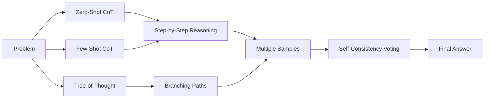
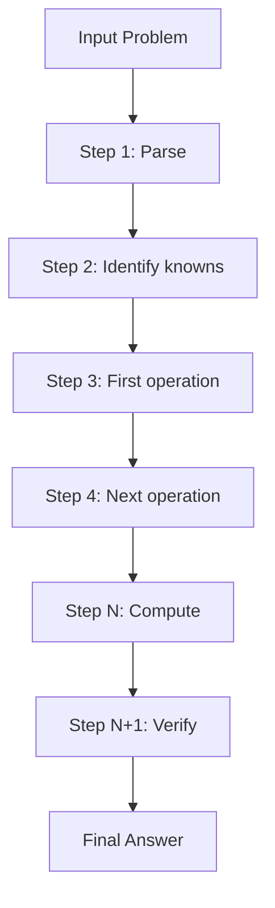
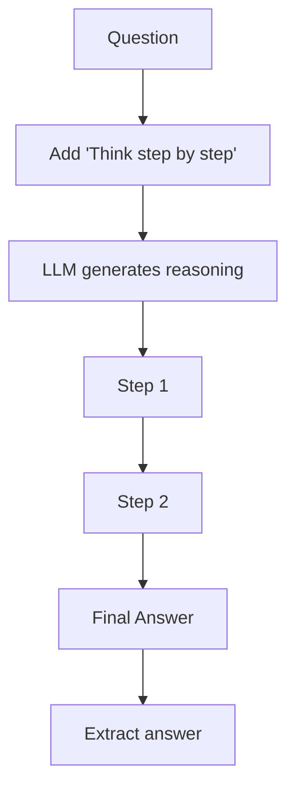
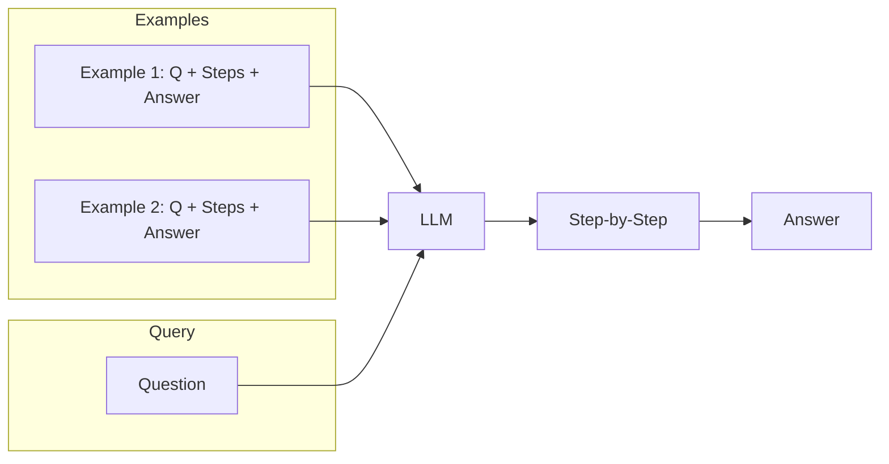
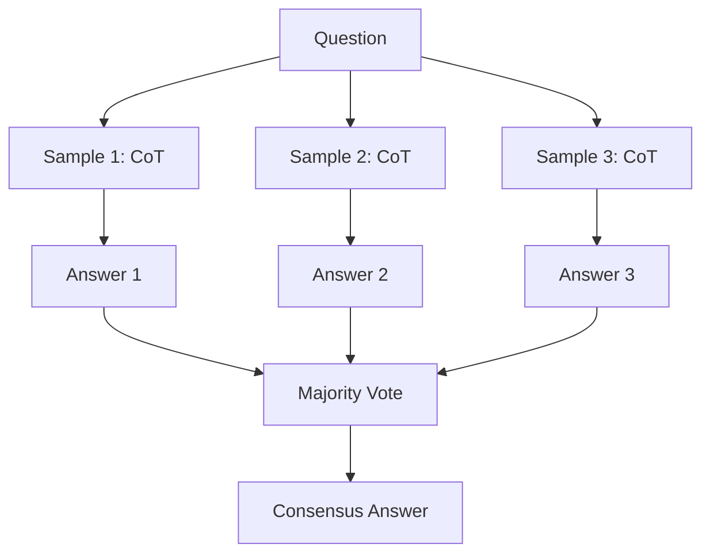
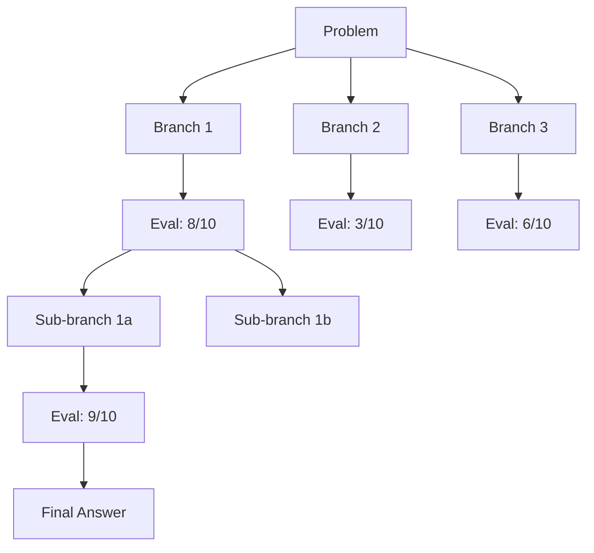
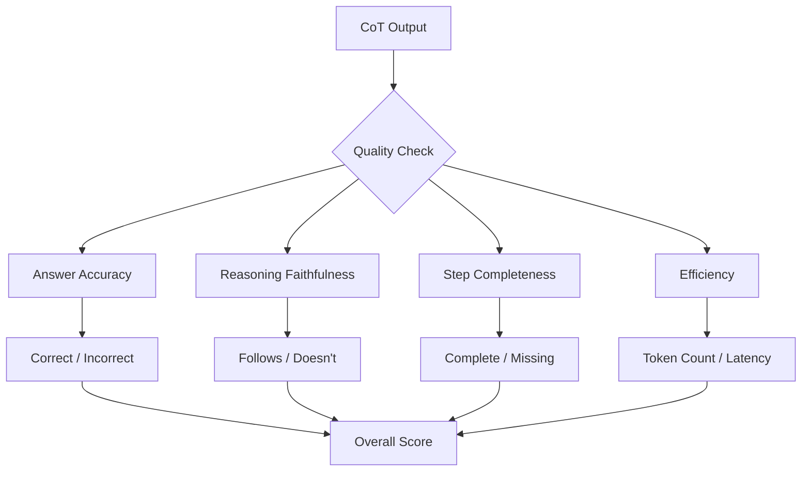

<!-- Clear Language: Keep sentences under 50 words -->
# Chain-of-Thought Prompting

## Learning Objectives

| Objective | Description |
|-----------|-------------|
| LO1 | Understand the chain-of-thought (CoT) reasoning paradigm and its benefits |
| LO2 | Implement zero-shot CoT using the "Let's think step by step" technique |
| LO3 | Apply few-shot CoT with step-by-step reasoning examples |
| LO4 | Use self-consistency to improve CoT accuracy through multiple sampling |
| LO5 | Explore tree-of-thought (ToT) for complex reasoning tasks |
| LO6 | Evaluate CoT performance across math, logic, and commonsense tasks |

## Introduction

Large language models are transforming every industry. Understanding how to prompt, evaluate, and optimize LLMs is a critical skill for AI engineers. This module covers the full LLM lifecycle from API calls to cost optimization.

## Prerequisites

- Basic programming knowledge
- Understanding of data structures

## Key Terminology

**Key Terms**: Core vocabulary and concepts for this topic.

**Definition**: Essential terms you must know for interviews and production work.

## Theory

Understanding chain of thought is fundamental for AI engineers. This section covers the core concepts, underlying principles, and theoretical framework that govern how chain of thought works in practice.

## Chapter at a Glance

| Section | Topic | Key Concept |
|---------|-------|-------------|
| 4.1 | What is Chain-of-Thought | Step-by-step reasoning, intermediate steps |
| 4.2 | Zero-Shot CoT | The "Let's think step by step" trigger |
| 4.3 | Few-Shot CoT | Demonstrating reasoning with examples |
| 4.4 | Self-Consistency | Multiple paths, majority voting |
| 4.5 | Tree-of-Thought | Branching exploration of reasoning paths |
| 4.6 | CoT Evaluation | Accuracy, faithfulness, efficiency |

## Chapter Roadmap



## 4.1 What is Chain-of-Thought

Chain-of-thought (CoT) prompting elicits step-by-step reasoning from LLMs by instructing them to show intermediate reasoning steps before producing the final answer. Introduced by Wei et al. (2022), CoT significantly improves performance on tasks requiring multi-step reasoning, especially in math, logic, and commonsense domains.

**Why CoT works**:
- Breaks complex problems into manageable intermediate steps
- Allows the model to "show its work" for verification
- Reduces error propagation compared to direct answers
- Leverages the model's ability to generate coherent sequences

```python
from openai import OpenAI
client = OpenAI()

direct = client.chat.completions.create(
    model="gpt-4o-mini",
    messages=[
        {"role": "user", "content": "If a store sells apples at $2 each and oranges at $3 each, and I buy 5 apples and 3 oranges, how much do I pay in total?"}
    ],
    temperature=0
)
print("Direct:", direct.choices[0].message.content)

cot = client.chat.completions.create(
    model="gpt-4o-mini",
    messages=[
        {"role": "system", "content": "Think step by step before answering. Show your reasoning."},
        {"role": "user", "content": "If a store sells apples at $2 each and oranges at $3 each, and I buy 5 apples and 3 oranges, how much do I pay in total?"}
    ],
    temperature=0
)
print("CoT:", cot.choices[0].message.content)
```

**The CoT process** follows a reasoning chain:

```python
def chain_of_thought(question, client):
    response = client.chat.completions.create(
        model="gpt-4o-mini",
        messages=[
            {"role": "system", "content": "You are a math tutor. Solve step by step, then give the final answer."},
            {"role": "user", "content": question}
        ],
        temperature=0
    )
    return response.choices[0].message.content

questions = [
    "John has 12 apples. He gives 1/3 to Mary and then eats 2. Left?",
    "Train at 60 mph for 2 hours, then 80 mph for 1.5 hours. Distance?",
    "3 workers build a wall in 8 hours. Time for 6 workers?"
]
for q in questions:
    print(f"Q: {q}\nA: {chain_of_thought(q, client)}\n")
```



---

## 4.2 Zero-Shot CoT

Zero-shot CoT triggers reasoning by simply adding "Let's think step by step".

```python
def zero_shot_cot(question, client):
    response = client.chat.completions.create(
        model="gpt-4o-mini",
        messages=[{"role": "user", "content": f"{question}\n\nLet's think step by step."}],
        temperature=0
    )
    return response.choices[0].message.content

questions = [
    "A bat and a ball cost $1.10. The bat costs $1.00 more. How much is the ball?",
    "If 5 machines take 5 min for 5 widgets, time for 100 machines for 100 widgets?"
]
for q in questions:
    print(f"Q: {q}\nA: {zero_shot_cot(q, client)}\n")
```

**Extracting the final answer**:

```python
import re

def zero_shot_cot_with_answer(question, client):
    text = client.chat.completions.create(
        model="gpt-4o-mini",
        messages=[{"role": "user", "content": f"{question}\n\nLet's think step by step."}],
        temperature=0
    ).choices[0].message.content

    match = re.search(r"answer is\s*(\S+)", text, re.IGNORECASE)
    return text, match.group(1) if match else "not found"

text, ans = zero_shot_cot_with_answer(
    "Pizza has 8 slices. I eat 3/8. Remaining slices?", client
)
print(f"Answer: {ans}")
```

**When zero-shot CoT fails**:

```python
def compare_methods(question, client):
    methods = [
        ("Direct", "Answer the question."),
        ("Zero-shot CoT", "Let's think step by step."),
    ]
    for name, instruction in methods:
        r = client.chat.completions.create(
            model="gpt-4o-mini",
            messages=[{"role": "system", "content": instruction},
                      {"role": "user", "content": question}],
            temperature=0
        ).choices[0].message.content
        print(f"=== {name} ===\n{r[:200]}\n")

compare_methods(
    "Alice has 3 brothers and 1 sister. How many sisters does Alice's brother have?",
    client
)
```



---

## 4.3 Few-Shot CoT

Few-shot CoT provides reasoning examples in the prompt.

```python
def few_shot_cot(question, client):
    messages = [
        {"role": "system", "content": "Solve step by step."},
        {"role": "user", "content": "Q: Roger has 5 tennis balls. He buys 2 cans of 3 each. How many?\nA: Start with 5. 2 cans x 3 = 6. 5+6=11. The answer is 11."},
        {"role": "assistant", "content": "11"},
        {"role": "user", "content": "Q: Cafeteria had 23 apples. Used 20, bought 6 more. How many?\nA: 23-20=3. 3+6=9. The answer is 9."},
        {"role": "assistant", "content": "9"},
        {"role": "user", "content": f"Q: {question}\nA:"}
    ]
    resp = client.chat.completions.create(model="gpt-4o-mini", messages=messages, temperature=0)
    return resp.choices[0].message.content

print(few_shot_cot("15 trees. Plant 3 more each day for 5 days. Total?", client))
```

**Math problem CoT**:

```python
math_examples = [
    ("Q: A farmer has 12 chickens. Each lays 2 eggs/day. Eggs in a week?\nA: 12*2=24/day. 24*7=168. The answer is 168.", "168"),
    ("Q: Rectangle 8cm x 5cm. Area?\nA: Area = 8*5 = 40. The answer is 40.", "40"),
]

def few_shot_math(question, client):
    msgs = [{"role": "system", "content": "Solve math step by step."}]
    for ex_q, ex_a in math_examples:
        msgs.append({"role": "user", "content": ex_q.split("A:")[0]})
        msgs.append({"role": "assistant", "content": ex_a})
    msgs.append({"role": "user", "content": f"Q: {question}\nA:"})
    resp = client.chat.completions.create(model="gpt-4o-mini", messages=msgs, temperature=0)
    return resp.choices[0].message.content

print(few_shot_math("Train at 50 mph for 3 hours. Distance?", client))
```

**Logical reasoning CoT**:

```python
logic_examples = [
    ("All humans are mortal. Socrates is human. Conclusion: Socrates is mortal.\nValid reasoning.", "Valid"),
    ("All birds can fly. Penguins are birds. Therefore penguins can fly.\nInvalid - penguins can't fly.", "Invalid"),
]

def few_shot_logic(premises, conclusion, client):
    msgs = [{"role": "system", "content": "Determine if conclusion follows. Reason step by step."}]
    for ex, label in logic_examples:
        msgs.append({"role": "user", "content": ex})
        msgs.append({"role": "assistant", "content": label})
    msgs.append({"role": "user", "content": f"Premises: {premises}\nConclusion: {conclusion}"})
    resp = client.chat.completions.create(model="gpt-4o-mini", messages=msgs, temperature=0)
    return resp.choices[0].message.content

print(few_shot_logic(
    "If it rains, ground gets wet. Ground is wet.", "Therefore it rained.", client
))
```



---

## 4.4 Self-Consistency

Self-consistency samples multiple reasoning paths and picks the most common answer.

```python
import re
from collections import Counter

class SelfConsistency:
    def __init__(self, client, model="gpt-4o-mini"):
        self.client = client
        self.model = model

    def sample(self, question, n=5, temperature=0.7):
        answers = []
        for _ in range(n):
            text = self.client.chat.completions.create(
                model=self.model,
                messages=[{"role": "user", "content": f"{question}\n\nLet's think step by step."}],
                temperature=temperature
            ).choices[0].message.content
            nums = re.findall(r"[-]?\d+\.?\d*", text)
            answers.append(nums[-1] if nums else None)
        return answers

    def solve(self, question, n=5):
        answers = self.sample(question, n)
        valid = [a for a in answers if a]
        final = Counter(valid).most_common(1)[0][0] if valid else None
        print(f"Question: {question}")
        print(f"Samples: {answers}")
        print(f"Final (majority): {final}")
        return final

sc = SelfConsistency(client)
sc.solve("Shirt costs $40 with 25% discount. Final price?")
```

**Self-consistency for complex math**:

```python
def self_consistency_math(problem, client, n=5):
    responses = []
    for i in range(n):
        r = client.chat.completions.create(
            model="gpt-4o-mini",
            messages=[
                {"role": "system", "content": "Solve step by step. End with 'The answer is X'."},
                {"role": "user", "content": problem}
            ],
            temperature=0.7
        ).choices[0].message.content
        responses.append(r)

    answers = []
    for text in responses:
        m = re.search(r"answer is\s*\$?(\d+[.,]?\d*)", text, re.IGNORECASE)
        if m:
            answers.append(m.group(1))

    if answers:
        final = Counter(answers).most_common(1)[0][0]
        print(f"Consensus: {final}")
    else:
        print("No consensus")

self_consistency_math(
    "45 apples. Sell 1/5. Receive 30 more. Total now?", client
)
```

**When to use self-consistency**:

```python
def benchmark(client):
    problems = [
        ("John is twice as old as Mary. Mary is 10. John's age?", "20"),
        ("Car travels 120 miles in 2 hours. Speed?", "60"),
    ]
    for prob, expected in problems:
        single = client.chat.completions.create(
            model="gpt-4o-mini",
            messages=[{"role": "user", "content": f"{prob}\nLet's think step by step."}],
            temperature=0
        ).choices[0].message.content

        answers = []
        for _ in range(5):
            r = client.chat.completions.create(
                model="gpt-4o-mini",
                messages=[{"role": "user", "content": f"{prob}\nLet's think step by step."}],
                temperature=0.7
            ).choices[0].message.content
            nums = re.findall(r"[-]?\d+\.?\d*", r)
            if nums:
                answers.append(nums[-1])

        consistent = Counter(answers).most_common(1)[0][0] if answers else "N/A"
        print(f"Problem: {prob}")
        print(f"  Expected: {expected}, Consistent: {consistent}")

benchmark(client)
```



---

## 4.5 Tree-of-Thought

Tree-of-thought (ToT) explores multiple reasoning branches with evaluation.

```python
class TreeOfThought:
    def __init__(self, client, model="gpt-4o-mini"):
        self.client = client
        self.model = model

    def generate_branches(self, problem, state, n=3):
        prompt = f"Problem: {problem}\nCurrent: {state}\n\nList {n} next steps numbered 1 to {n}:"
        text = self.client.chat.completions.create(
            model=self.model,
            messages=[{"role": "user", "content": prompt}],
            temperature=0.8
        ).choices[0].message.content

        branches = []
        for line in text.split("\n"):
            line = line.strip()
            if line and line[0].isdigit() and ". " in line:
                branches.append(line.split(". ", 1)[1])
        return branches[:n]

    def evaluate(self, problem, branch):
        prompt = f"Problem: {problem}\nStep: {branch}\n\nIs this on track? Answer PROCEED or BACKTRACK."
        r = self.client.chat.completions.create(
            model=self.model,
            messages=[{"role": "user", "content": prompt}],
            temperature=0
        )
        return r.choices[0].message.content.strip()

    def solve(self, problem, depth=2, breadth=3):
        queue = [("Initial state", ["Initial state"])]
        for d in range(depth):
            next_queue = []
            for state, path in queue:
                branches = self.generate_branches(problem, state, breadth)
                for branch in branches:
                    eval_result = self.evaluate(problem, branch)
                    if "PROCEED" in eval_result:
                        next_queue.append((branch, path + [branch]))
                    if len(next_queue) >= breadth:
                        break
            queue = next_queue
            if not queue:
                break

        best_path = queue[0][1] if queue else ["Initial"]
        final_prompt = f"Problem: {problem}\nSteps: {' -> '.join(best_path)}\n\nFinal answer?"
        r = self.client.chat.completions.create(
            model=self.model,
            messages=[{"role": "user", "content": final_prompt}],
            temperature=0
        )
        return r.choices[0].message.content

## tot = TreeOfThought(client)

## print(tot.solve("17 cows. All but 9 die. How many left?"))
```

**ToT evaluation**:

```python
def tot_evaluate(problem, candidates, client):
    results = []
    for cand in candidates:
        prompt = f"Problem: {problem}\n\nReasoning: {cand}\n\nScore 1-10 for correctness and logical flow. Score:"
        r = client.chat.completions.create(
            model="gpt-4o-mini",
            messages=[{"role": "user", "content": prompt}],
            temperature=0
        ).choices[0].message.content
        m = re.search(r"(\d+)/?10", r)
        results.append((cand[:80], int(m.group(1)) if m else 5))

    results.sort(key=lambda x: x[1], reverse=True)
    for cand, score in results:
        print(f"Score {score}/10: {cand}...")

candidates = [
    "Count white eggs then brown. White: 5*2=10. Brown: 3*1=3. Total: 13.",
    "Add all hens then multiply: (5+3)*2 = 16 eggs.",
    "Average eggs per hen: (2+1)/2=1.5. Total hens: 8. Total: 12.",
]
tot_evaluate("5 white hens (2 eggs/day), 3 brown hens (1 egg/day). Total eggs?", candidates, client)
```



---

## 4.6 CoT Evaluation

Evaluating CoT requires measuring both accuracy and reasoning quality.

```python
class CoTEvaluator:
    def __init__(self, client):
        self.client = client

    def accuracy(self, test_cases, cot_fn):
        correct = 0
        for q, expected in test_cases:
            ans = cot_fn(q)
            if expected.strip().lower() in ans.strip().lower():
                correct += 1
        return correct / len(test_cases)

    def faithfulness(self, reasoning, answer):
        prompt = f"Reasoning: {reasoning}\nAnswer: {answer}\n\nDoes the answer follow? YES or NO."
        r = self.client.chat.completions.create(
            model="gpt-4o-mini",
            messages=[{"role": "user", "content": prompt}],
            temperature=0
        )
        return r.choices[0].message.content

    def efficiency(self, cot_fn, question, n=3):
        import time
        latencies, lengths = [], []
        for _ in range(n):
            start = time.time()
            r = cot_fn(question)
            lat = (time.time() - start) * 1000
            latencies.append(lat)
            lengths.append(len(r.split()))
        return sum(latencies)/n, sum(lengths)/n

ev = CoTEvaluator(client)

def basic_cot(q):
    return client.chat.completions.create(
        model="gpt-4o-mini",
        messages=[{"role": "user", "content": f"{q}\nLet's think step by step."}],
        temperature=0
    ).choices[0].message.content

test_cases = [("What is 15 + 27?", "42"), ("1/4 of 36?", "9")]

## print(f"Accuracy: {ev.accuracy(test_cases, basic_cot):.2%}")
```

**Detecting flawed reasoning**:

```python
def analyze_errors(reasoning, client):
    prompt = f"Analyze this reasoning for errors:\n\n{reasoning}\n\nCheck for arithmetic, logic leaps, missing steps. List errors:"
    return client.chat.completions.create(
        model="gpt-4o-mini",
        messages=[{"role": "user", "content": prompt}],
        temperature=0
    ).choices[0].message.content

flawed = "Items cost $10 each. Bought 2. Tax 15%. Tax = $3. Total = $23."
print(analyze_errors(flawed, client))
```



---

## TypeScript Parallel

TypeScript CoT with self-consistency:

```typescript
async function chainOfThought(question: string, apiKey: string) {
  const res = await fetch("https://api.openai.com/v1/chat/completions", {
    method: "POST",
    headers: { Authorization: `Bearer ${apiKey}`, "Content-Type": "application/json" },
    body: JSON.stringify({
      model: "gpt-4o-mini",
      messages: [
        { role: "system", content: "Think step by step. End with 'The answer is X'." },
        { role: "user", content: question }
      ],
      temperature: 0
    })
  });
  const data = await res.json();
  const text = data.choices[0].message.content;
  const match = text.match(/answer is\s*(\S+)/i);
  return { reasoning: text, answer: match ? match[1] : "unknown" };
}

async function selfConsistency(question: string, apiKey: string, samples = 5) {
  const answers: string[] = [];
  for (let i = 0; i < samples; i++) {
    const result = await chainOfThought(question, apiKey);
    answers.push(result.answer);
  }
  const freq = new Map<string, number>();
  answers.forEach(a => freq.set(a, (freq.get(a) ?? 0) + 1));
  const [top] = [...freq.entries()].sort((a, b) => b[1] - a[1]);
  return { topAnswer: top[0], samples: answers };
}
```

---

## Summary

- Chain-of-thought prompting elicits step-by-step reasoning that improves accuracy on multi-step tasks
- Zero-shot CoT uses a simple trigger phrase like "Let's think step by step" without examples
- Few-shot CoT provides examples of step-by-step reasoning in the prompt
- Self-consistency samples multiple reasoning paths and uses majority voting for robust answers
- Tree-of-thought explores multiple reasoning branches with evaluation at each node
- CoT is most effective for math word problems, logical reasoning, and complex QA
- Reasoning faithfulness is critical - the answer must follow logically from the steps
- CoT increases token usage (typically 2-5x more tokens than direct answers)
- Temperature settings should be higher for self-consistency than single CoT
- Evaluation must cover both answer accuracy and reasoning quality

## Practical Takeaways

| Scenario | Do This | Avoid This |
|----------|---------|------------|
| Math word problems | Use few-shot CoT with worked examples | Expecting direct answers without reasoning |
| Logical reasoning | Add "Let's think step by step" | Relying on single-pass answers |
| Critical accuracy | Use self-consistency with 5+ samples | Using temperature=0 for consensus |
| Complex planning | Try tree-of-thought with evaluation | Linear CoT for branching decisions |
| Token budgets | Use zero-shot CoT (cheaper) | Few-shot CoT for simple problems |
| Quality assurance | Evaluate reasoning faithfulness | Only checking final answer accuracy |

## Interview Q&A

<details class="tp-qa-card" data-qid="llm-s04-q1">
  <summary class="tp-qa-question"><span class="tp-qa-status"></span>Q1: What is chain-of-thought prompting and why does it improve LLM performance?</summary>
  <div class="tp-qa-answer">
    <p>Chain-of-thought prompting instructs the LLM to show intermediate reasoning steps before giving the final answer. It improves performance by breaking complex problems into steps, reducing error propagation, allowing verification of reasoning, and giving the model more "computation time" through generated tokens.</p>
  </div>
  <button class="tp-qa-mark-btn">✅ Mark Reviewed</button>
  <button class="tp-qa-bookmark-btn">🔖 Bookmark</button>
</details>

<details class="tp-qa-card" data-qid="llm-s04-q2">
  <summary class="tp-qa-question"><span class="tp-qa-status"></span>Q2: How does self-consistency improve upon basic chain-of-thought?</summary>
  <div class="tp-qa-answer">
    <p>Self-consistency generates multiple reasoning paths (5-20 samples) with higher temperature, then selects the most common answer via majority voting. Benefits include reduced variance, handling of multiple valid approaches, and providing confidence estimates. Trade-off: 5-20x more API calls.</p>
  </div>
  <button class="tp-qa-mark-btn">✅ Mark Reviewed</button>
  <button class="tp-qa-bookmark-btn">🔖 Bookmark</button>
</details>

<details class="tp-qa-card" data-qid="llm-s04-q3">
  <summary class="tp-qa-question"><span class="tp-qa-status"></span>Q3: What is the difference between zero-shot and few-shot CoT?</summary>
  <div class="tp-qa-answer">
    <p><strong>Zero-shot CoT</strong>: Adds a trigger phrase like "Let's think step by step" without examples. Simple, cheap, effective for general reasoning.</p>
    <p><strong>Few-shot CoT</strong>: Provides 2-5 step-by-step reasoning examples. More consistent format, better for domain-specific tasks, uses more tokens.</p>
  </div>
  <button class="tp-qa-mark-btn">✅ Mark Reviewed</button>
  <button class="tp-qa-bookmark-btn">🔖 Bookmark</button>
</details>

<details class="tp-qa-card" data-qid="llm-s04-q4">
  <summary class="tp-qa-question"><span class="tp-qa-status"></span>Q4: How does tree-of-thought differ from chain-of-thought?</summary>
  <div class="tp-qa-answer">
    <p><strong>CoT</strong>: Single linear path from start to answer.</p>
    <p><strong>ToT</strong>: Tree structure with branching, evaluation at each node, pruning of dead ends. Better for exploration and creative problem-solving, but significantly more expensive.</p>
  </div>
  <button class="tp-qa-mark-btn">✅ Mark Reviewed</button>
  <button class="tp-qa-bookmark-btn">🔖 Bookmark</button>
</details>

<details class="tp-qa-card" data-qid="llm-s04-q5">
  <summary class="tp-qa-question"><span class="tp-qa-status"></span>Q5: What types of problems benefit most from CoT?</summary>
  <div class="tp-qa-answer">
    <p>CoT is most effective for math word problems, logical reasoning, multi-hop QA, commonsense reasoning, and complex code generation. It provides less benefit for simple factual recall, classification, or tasks where the answer is directly in training data.</p>
  </div>
  <button class="tp-qa-mark-btn">✅ Mark Reviewed</button>
  <button class="tp-qa-bookmark-btn">🔖 Bookmark</button>
</details>

<details class="tp-qa-card" data-qid="llm-s04-q6">
  <summary class="tp-qa-question"><span class="tp-qa-status"></span>Q6: What are main failure modes of CoT?</summary>
  <div class="tp-qa-answer">
    <p>Common failures: arithmetic errors despite correct logic, missing intermediate steps, circular reasoning, hallucinated facts in reasoning, over-thinking with unnecessary steps, and format non-compliance. Self-consistency helps mitigate most of these.</p>
  </div>
  <button class="tp-qa-mark-btn">✅ Mark Reviewed</button>
  <button class="tp-qa-bookmark-btn">🔖 Bookmark</button>
</details>

<details class="tp-qa-card" data-qid="llm-s04-q7">
  <summary class="tp-qa-question"><span class="tp-qa-status"></span>Q7: How do you extract final answer from CoT?</summary>
  <div class="tp-qa-answer">
    <p>Strategies: regex pattern matching for "answer is X", format instruction with markers like "[ANSWER]X[/ANSWER]", secondary LLM call to extract, or last number heuristic. Format instruction with regex is most reliable.</p>
  </div>
  <button class="tp-qa-mark-btn">✅ Mark Reviewed</button>
  <button class="tp-qa-bookmark-btn">🔖 Bookmark</button>
</details>

<details class="tp-qa-card" data-qid="llm-s04-q8">
  <summary class="tp-qa-question"><span class="tp-qa-status"></span>Q8: How does temperature affect CoT?</summary>
  <div class="tp-qa-answer">
    <p>Single CoT: temperature=0 for deterministic output. Self-consistency: 0.5-0.8 for diverse paths. Tree-of-thought: 0.7-0.9 for branch generation. Higher temperatures produce more diverse but potentially less reliable reasoning.</p>
  </div>
  <button class="tp-qa-mark-btn">✅ Mark Reviewed</button>
  <button class="tp-qa-bookmark-btn">🔖 Bookmark</button>
</details>

<details class="tp-qa-card" data-qid="llm-s04-q9">
  <summary class="tp-qa-question"><span class="tp-qa-status"></span>Q9: What is the token cost of CoT?</summary>
  <div class="tp-qa-answer">
    <p>Direct answer: 20-50 tokens. Zero-shot CoT: 100-500 tokens. Few-shot CoT: 500-2000+ tokens. Self-consistency with 5 samples: 5x zero-shot cost. Use CoT selectively for problems needing multi-step reasoning.</p>
  </div>
  <button class="tp-qa-mark-btn">✅ Mark Reviewed</button>
  <button class="tp-qa-bookmark-btn">🔖 Bookmark</button>
</details>

<details class="tp-qa-card" data-qid="llm-s04-q10">
  <summary class="tp-qa-question"><span class="tp-qa-status"></span>Q10: How would you evaluate CoT quality?</summary>
  <div class="tp-qa-answer">
    <p>Multiple dimensions: answer accuracy, reasoning faithfulness (does answer follow from steps?), step completeness, logical coherence, factual correctness of intermediate claims. Use automated metrics plus LLM-as-judge for reasoning quality.</p>
  </div>
  <button class="tp-qa-mark-btn">✅ Mark Reviewed</button>
  <button class="tp-qa-bookmark-btn">🔖 Bookmark</button>
</details>

## Chapter Quiz

**Q1**: What trigger phrase is used for zero-shot chain-of-thought?

a) "Answer directly"
b) "Let's think step by step"
c) "Provide options"
d) "Be concise"

<details class="tp-qa-card" data-qid="llm-s04-quiz1"><summary>Show Answer</summary><div class="tp-qa-answer"><p><strong>Answer: b) "Let's think step by step"</strong></p><p>This simple phrase triggers step-by-step reasoning in most LLMs.</p></div></details>

**Q2**: What is the main advantage of self-consistency?

a) Lower cost
b) Faster responses
c) Higher accuracy via majority voting
d) Shorter outputs

<details class="tp-qa-card" data-qid="llm-s04-quiz2"><summary>Show Answer</summary><div class="tp-qa-answer"><p><strong>Answer: c) Higher accuracy via majority voting</strong></p><p>Self-consistency samples multiple reasoning paths and selects the most common answer.</p></div></details>

**Q3**: Which technique explores multiple branches with evaluation?

a) Zero-shot CoT
b) Few-shot CoT
c) Self-consistency
d) Tree-of-thought

<details class="tp-qa-card" data-qid="llm-s04-quiz3"><summary>Show Answer</summary><div class="tp-qa-answer"><p><strong>Answer: d) Tree-of-thought</strong></p><p>Tree-of-thought explores multiple reasoning branches with evaluation at each node.</p></div></details>

**Q4**: Recommended temperature for self-consistency sampling?

a) 0.0
b) 0.5-0.8
c) 1.5-2.0
d) Doesn't matter

<details class="tp-qa-card" data-qid="llm-s04-quiz4"><summary>Show Answer</summary><div class="tp-qa-answer"><p><strong>Answer: b) 0.5-0.8</strong></p><p>Medium temperature creates diverse but reasonable reasoning paths.</p></div></details>

**Q5**: What does "reasoning faithfulness" mean?

a) Number of reasoning steps
b) Whether answer follows from reasoning
c) Speed of generation
d) Format compliance

<details class="tp-qa-card" data-qid="llm-s04-quiz5"><summary>Show Answer</summary><div class="tp-qa-answer"><p><strong>Answer: b) Whether answer follows from reasoning</strong></p><p>Faithfulness checks that the final answer is supported by the intermediate reasoning steps.</p></div></details>

## Exercises

**Easy** — Write a function for zero-shot CoT on math problems. Extract final answer with regex.

**Easy** — Compare direct vs CoT on 5 logic puzzles. Report accuracy for each.

**Medium** — Implement self-consistency with 5 samples. Compare accuracy against single CoT.

**Medium** — Build tree-of-thought solver for planning problems with 3 branches per level.

**Hard** — Create a CoT evaluator scoring reasoning quality on accuracy, faithfulness, and efficiency.

---

## Common Mistakes

1. Not understanding the fundamental concepts before applying them
2. Skipping edge cases in implementation
3. Not analyzing time/space complexity
4. Forgetting to handle null/empty inputs
5. Not practicing enough problems to build pattern recognition

## Revision Notes

- - Core principle: Understand the fundamental concepts thoroughly
- - Implementation pattern: Practice with real code examples
- - Complexity: Know the time and space complexity
- - Application: Know when to use this in production systems
- - Interview: Frequently asked in technical interviews
- - Edge cases: Consider common failure scenarios
- - Related concepts: Connect to broader system design

## Placement Section

### Top 10 Interview Questions

#### Google Style

1. **Explain the core idea of Chain-of-Thought Prompting in under 60 seconds, then give a real-world analogy.** — Structure: definition, how it works in one sentence, why it matters, analogy. Follow-up: what would break if you removed this from a production system?

2. **Design a minimal, well-typed function that demonstrates Chain-of-Thought Prompting.** — Interviewer checks: signature with type hints, edge cases, complexity, and a clean docstring. Follow-up: how does your design behave with empty or malformed input?

3. **What are the common pitfalls when engineers first learn ** — List 3-4, then explain how you would prevent each in a code review.

#### Amazon Style

4. **Describe a production bug caused by misunderstanding Chain-of-Thought Prompting. How did you diagnose and fix it?** — STAR format: situation, task, action, result. Mention logs, reproduction, root-cause analysis, and the regression test you added.

5. **How would you scale a system that relies on Chain-of-Thought Prompting from 10 users to 10 million?** — Discuss bottlenecks, caching, monitoring, and when to redesign. Follow-up: what metrics would you track?

#### Microsoft Style

6. **Compare Chain-of-Thought Prompting with the closest alternative approach. When would you choose each?** — Make a decision matrix: performance, maintainability, ecosystem, learning curve. Follow-up: what would change your decision?

7. **Walk through how you would test a component that depends on Chain-of-Thought Prompting.** — Unit, integration, property-based tests; mocking boundaries; golden files for outputs.

#### NVIDIA Style

8. **How does Chain-of-Thought Prompting behave differently at scale — memory, throughput, or precision-wise?** — Connect to data pipelines and model training if applicable. Follow-up: what happens to latency as input grows?

9. **How would you make an implementation of Chain-of-Thought Prompting run faster on GPU hardware?** — Batch operations, vectorization, avoiding Python loops, reducing data movement.

#### AI Startup Style

10. **Write the smallest possible implementation of Chain-of-Thought Prompting that is production-quality.** — Include error handling, type hints, and a one-line docstring. Follow-up: what would you refactor first when it grows?

### Resume Tips

- Name Chain-of-Thought Prompting explicitly in your skills section, paired with a measurable achievement ("Reduced X by 40% using Chain-of-Thought Prompting").
- Add a bullet describing a project that applies Chain-of-Thought Prompting to real data, with numbers.
- Mention the tools and libraries you used alongside Chain-of-Thought Prompting (linters, test frameworks, profiling tools).
- Keep resume bullets under 15 words and start each with an action verb.

### Interview Day Checklist

- Rehearse a 60-second explanation of Chain-of-Thought Prompting and one real-world analogy.
- Prepare one STAR story about debugging a Chain-of-Thought Prompting-related production issue.
- Review complexity and edge cases for the classic Chain-of-Thought Prompting interview problem.
- Have questions ready: how does the team apply Chain-of-Thought Prompting in production today?
- Test your environment (Python, editor, internet) 15 minutes before the interview.

## True/False

1. **True or False:** Chain-of-Thought Prompting builds directly on the fundamentals covered in the earlier chapters of this module. — **True.** Every advanced topic in this module assumes the core concepts from the previous chapters.
2. **True or False:** You should write at least one code example for Chain-of-Thought Prompting before moving to the next chapter. — **True.** Active recall with hands-on code beats passive reading for retention.
3. **True or False:** The complexity analysis for Chain-of-Thought Prompting is the same regardless of input size. — **False.** Complexity grows with input size; always state best, average, and worst case.
4. **True or False:** Edge cases (empty input, invalid input, boundary values) matter for Chain-of-Thought Prompting in production. — **True.** Most production bugs come from unhandled edge cases.
5. **True or False:** You should memorize the Chain-of-Thought Prompting chapter content once and never review it again. — **False.** Spaced repetition (24h, 3 days, 1 week) dramatically improves long-term recall.

## Fill in the Blank

1. The chapter that covers Chain-of-Thought Prompting is Chapter ___ of this module. — Answer: check the module's table of contents.
2. The time complexity of the standard approach to Chain-of-Thought Prompting is ___. — Answer: review the theory section and state big-O notation.
3. The main edge case to handle when implementing Chain-of-Thought Prompting is ___. — Answer: empty or invalid input handling, as discussed in the chapter.
4. The tools commonly used to debug Chain-of-Thought Prompting issues are ___ and ___. — Answer: refer to the Debugging Guide section of this chapter.
5. The related topic that connects to Chain-of-Thought Prompting in the next chapter is ___. — Answer: see the Next Topic section.

## Scenario Questions

1. **Scenario:** A teammate ships a change involving Chain-of-Thought Prompting that breaks production at 3 AM. — Diagnosis: check the recent diff, reproduce locally with the failing input, check logs. Fix: revert, add a regression test, and review the root cause. Prevention: CI tests on edge cases and code review checklist.

2. **Scenario:** Your implementation of Chain-of-Thought Prompting is correct but too slow for the required latency. — Measure first with a profiler. Common fixes: reduce redundant work, use built-in optimized functions, batch operations, or add caching. Only then consider algorithmic changes.

3. **Scenario:** A new hire asks you to explain Chain-of-Thought Prompting in five minutes before a customer demo. — Use the 3-part answer: what it is (one sentence), how it works (one example), why it matters (one business impact). Then offer to go deeper after the demo.

4. **Scenario:** Your team's codebase has three different patterns for Chain-of-Thought Prompting and you must standardize. — Write a short ADR (architecture decision record), pick the pattern with best maintainability, migrate incrementally, and add a linter rule to enforce it.

## Output Questions

1. **What is the output of the simplest correct implementation of Chain-of-Thought Prompting on an empty input?** — Trace through the code: it should return the documented default (None, 0, empty collection) without raising.
2. **What is the output when the input is at the boundary value?** — Check off-by-one errors and inclusive/exclusive bounds in the chapter's examples.
3. **What does the implementation return when given invalid input types?** — With type hints and validation, it raises a clear error; without, it may fail silently.
4. **What is the output for the sample input given in the chapter's Examples section?** — Re-run the chapter's example code and compare against the documented output.
5. **What is the time complexity output when you profile the implementation at 10x input size?** — Expect the curve matching the chapter's complexity analysis (linear, quadratic, log-linear).

## Difficulty Level

| Level | Time | What It Takes |
|-------|------|---------------|
| Beginner | 1-2 sessions | Read theory, run the chapter examples, solve the Easy exercises |
| Intermediate | 3-5 sessions | Complete Medium exercises, explain Chain-of-Thought Prompting to someone else |
| Advanced | 1+ week | Solve Hard exercises, optimize for real datasets, answer interview follow-ups |

## Tips & Tricks

- Always write a one-line example of Chain-of-Thought Prompting from memory before opening the chapter — active recall first.
- Use the chapter's Revision Notes as a checklist: you have mastered Chain-of-Thought Prompting when you can explain each bullet.
- Pair the chapter quiz with the Flashcards: wrong answers become your next study session's focus.
- For interviews, practice explaining Chain-of-Thought Prompting twice: once with a technical audience, once with a non-technical audience.
- Keep a personal examples file where you collect your own Chain-of-Thought Prompting snippets; interviewers love original examples.

## Memory Tricks

- **Acronym**: build a mnemonic from the 5 key concepts of Chain-of-Thought Prompting listed in the Chapter at a Glance table.
- **Story**: link Chain-of-Thought Prompting to a familiar story — the analogy in the Visual Analogy section is designed to stick.
- **Number anchor**: remember the complexity of Chain-of-Thought Prompting by connecting it to a known algorithm of the same class.
- **Color code**: highlight the Theory, Examples, and Common Mistakes sections in different colors when reviewing.
- **Teach-back**: explain Chain-of-Thought Prompting to an imaginary junior engineer for 2 minutes — gaps in your explanation are gaps in memory.

## Further Reading

- Official documentation for the primary tool or library used in this chapter
- The chapter referenced in Related Topics for the next-level treatment of Chain-of-Thought Prompting
- The classic textbook chapter on Chain-of-Thought Prompting (check the Research References below)
- Two blog posts from engineers who debugged real Chain-of-Thought Prompting problems in production
- The repository of the open-source project that implements Chain-of-Thought Prompting

## Related Topics

- The previous chapter in this module (see table of contents) — foundational for Chain-of-Thought Prompting
- The next chapter (see Next Topic below) — builds on Chain-of-Thought Prompting
- The system design chapters in Module 07 — how Chain-of-Thought Prompting fits into production architectures
- The interview preparation module — how Chain-of-Thought Prompting is asked in screening rounds
- The capstone project — where Chain-of-Thought Prompting is applied end-to-end

## FAQs

1. **Do I need to memorize all of Chain-of-Thought Prompting, or understand the big picture?** — Understand the big picture first, then memorize the key facts via flashcards and spaced repetition. Interviewers reward depth over breadth.
2. **What if I get stuck on an exercise?** — Re-read the theory section, run the example code, then attempt again. If still stuck after 20 minutes, move on and return the next day.
3. **How much time should I spend on ** — Follow the Study Plan below: 1-2 weeks at 30-60 minutes daily is typical for placement preparation.
4. **Is Chain-of-Thought Prompting asked in interviews?** — Yes — the Interview Q&A and Placement Section list the exact question styles used by top companies.
5. **What's the fastest way to master ** — Explain it out loud, write code without looking, and review the flashcards within 24 hours and again after 3 days.

## Important Notes

- Chain-of-Thought Prompting is a core requirement for the rest of this module — do not skip the examples.
- Always analyze complexity (time and space) when working with Chain-of-Thought Prompting.
- Production correctness means handling edge cases, not just the happy path.
- Interview answers should start with the definition, then the example, then the trade-offs.
- Revisit this chapter after finishing the module; the context from later chapters deepens understanding.

## Historical Context

- Chain-of-Thought Prompting emerged as a standard practice because early systems failed without it — understanding why helps you explain it in interviews.
- The tools used for Chain-of-Thought Prompting today evolved from simpler versions; the chapter covers the modern, recommended approach.
- Interviewers value knowing one historical fact about Chain-of-Thought Prompting — it shows genuine interest, not just cramming.
- The library/tooling ecosystem around Chain-of-Thought Prompting changes quickly; focus on fundamentals that remain stable.

## Security Considerations

- Never trust external input: validate and sanitize data before processing Chain-of-Thought Prompting.
- Avoid `eval()` and dynamic code execution on untrusted strings.
- Log errors without leaking sensitive data (keys, PII, internal paths).
- For API contexts, add rate limiting and input size limits.
- Review the chapter's code examples for injection or overflow risks before using them verbatim.

## ML Intuition

- Chain-of-Thought Prompting appears in ML pipelines at the data-processing layer: feature preparation, batching, and validation.
- Understanding Chain-of-Thought Prompting helps you debug why a model misbehaves — most ML bugs are data bugs, not model bugs.
- In production ML, the Chain-of-Thought Prompting concepts from this chapter map directly to NumPy/PyTorch operations on tensors.
- When optimizing ML systems, Chain-of-Thought Prompting skills let you profile and fix the data path, not just the training loop.
- Interview follow-up: how would you apply Chain-of-Thought Prompting to a dataset of 10 million records? — Batching and vectorization.

## Analogies

- **Chain-of-Thought Prompting is like a recipe**: the theory is the ingredients, the examples are the cooking steps, and the exercises are your own kitchen practice.
- **Complexity is like a delivery route**: a linear route visits each stop once; a nested route revisits stops, and you feel it at scale.
- **Edge cases are like weather**: the happy path is a sunny day; production is the storm — build for the storm.
- **The chapter roadmap is a journey map**: each section is a checkpoint; skipping one means getting lost later in the module.

## Capstone Project Link

- [Module Capstone: End-to-End Project](https://github.com/Raushan666java/ai-engineering-journey) — this chapter contributes the Chain-of-Thought Prompting skills used in the module's capstone project. Complete the exercises here before starting the capstone.

## Flashcards

<details class="tp-qa-card" data-qid="11llmspromptengineering-04chainofthought-flash1">
  <summary class="tp-qa-question">
    <span class="tp-qa-status"></span>
    What trigger phrase is used for zero-shot chain-of-thought?
  </summary>
  <div class="tp-qa-answer">
    <p>b) "Let's think step by step"</p>
  </div>
</details>

<details class="tp-qa-card" data-qid="11llmspromptengineering-04chainofthought-flash2">
  <summary class="tp-qa-question">
    <span class="tp-qa-status"></span>
    What is the main advantage of self-consistency?
  </summary>
  <div class="tp-qa-answer">
    <p>c) Higher accuracy via majority voting</p>
  </div>
</details>

<details class="tp-qa-card" data-qid="11llmspromptengineering-04chainofthought-flash3">
  <summary class="tp-qa-question">
    <span class="tp-qa-status"></span>
    Which technique explores multiple branches with evaluation?
  </summary>
  <div class="tp-qa-answer">
    <p>d) Tree-of-thought</p>
  </div>
</details>

<details class="tp-qa-card" data-qid="11llmspromptengineering-04chainofthought-flash4">
  <summary class="tp-qa-question">
    <span class="tp-qa-status"></span>
    Recommended temperature for self-consistency sampling?
  </summary>
  <div class="tp-qa-answer">
    <p>b) 0.5-0.8</p>
  </div>
</details>

<details class="tp-qa-card" data-qid="11llmspromptengineering-04chainofthought-flash5">
  <summary class="tp-qa-question">
    <span class="tp-qa-status"></span>
    What does "reasoning faithfulness" mean?
  </summary>
  <div class="tp-qa-answer">
    <p>b) Whether answer follows from reasoning</p>
  </div>
</details>

## Research References

- Official documentation of the primary library for Chain-of-Thought Prompting (linked in Further Reading)
- The classic paper or textbook chapter introducing Chain-of-Thought Prompting (see References below)
- The standard library reference for Chain-of-Thought Prompting-related functions
- Engineering blog posts from companies running Chain-of-Thought Prompting in production at scale
- PEPs and RFCs where applicable (Python and networking standards)

## Open-Source Tools

- The primary library used in this chapter (see the code examples)
- Python standard library modules used in the examples (check the imports)
- Testing: pytest for unit tests of Chain-of-Thought Prompting code
- Linting and formatting: ruff + black
- Profiling: cProfile or py-spy for performance work on Chain-of-Thought Prompting

## Debugging Guide

- Start with `print()` or a debugger to inspect intermediate values in Chain-of-Thought Prompting code.
- Reproduce the failure with the smallest possible input before changing code.
- Check the common failure modes listed in Common Mistakes — most bugs are listed there.
- For performance problems, profile before optimizing: measure, then fix.
- When stuck, re-read the chapter's Examples and compare line by line with your code.
- Use `pdb` or your IDE's debugger to step through the Chain-of-Thought Prompting example code.

## Mock Interview Section

**Round 1 — Screening (15 min)**
- Explain Chain-of-Thought Prompting in 60 seconds.
- Write a minimal working example of Chain-of-Thought Prompting.
- What is the complexity of your example?

**Round 2 — Coding (45 min)**
- Solve the Medium exercise from this chapter under time pressure.
- State your assumptions, then implement with type hints.
- Test with edge cases: empty input, boundary values, invalid input.

**Round 3 — Behavioral + System (30 min)**
- Tell me about a time you debugged a Chain-of-Thought Prompting problem in a project.
- How would you design a system where Chain-of-Thought Prompting is used at scale?
- What metrics would you monitor?

**Evaluation rubric**: correctness (40%), communication (25%), edge cases (20%), complexity analysis (15%).

## Optimized Implementation

`python
from typing import Any, Optional

def demonstrate_topic(input_data: list[Any]) -> Optional[float]:
    """Runnable scaffold for Chain-of-Thought Prompting.

    Replace the body with the optimized implementation from the chapter,
    keeping type hints, docstring, and edge-case handling.
    """
    if not input_data:
        return None
    # Step 1: validate input types
    # Step 2: apply the core Chain-of-Thought Prompting logic from the Examples section
    # Step 3: return the result with the documented default
    return 0.0
`

- Keeps the function signature stable so tests written against it stay valid.
- Handles the empty-input contract explicitly.
- Add unit tests for the edge cases before implementing the logic (test-first).

## Evaluation Metrics

| Skill | Test | Target |
|-------|------|--------|
| Concept recall | Explain Chain-of-Thought Prompting without notes | 60-second explanation |
| Code fluency | Write the chapter example from memory | No syntax errors |
| Edge cases | Handle empty/invalid input in exercises | All cases pass |
| Complexity | State time/space for the standard approach | Correct big-O |
| Interview readiness | Answer 5 Interview Q&A questions out loud | Fluent, structured answers |
| Retention | Chapter quiz score after 3 days | 80%+ |

## Real-World Examples

- **Startup**: a small team uses Chain-of-Thought Prompting daily in their data pipeline — the chapter's examples mirror their code.
- **E-commerce**: Chain-of-Thought Prompting patterns appear in order processing, inventory checks, and recommendation feeds.
- **Fintech**: Chain-of-Thought Prompting principles apply to transaction validation and fraud detection flows.
- **ML platform**: Chain-of-Thought Prompting shows up in feature engineering and model-serving infrastructure.
- **Interview insight**: recruiters look for engineers who can connect Chain-of-Thought Prompting to the business outcome, not just the code.

## Next Topic

[Structured Output](05-structured-output.md)

## Limitations

- Chain-of-Thought Prompting, like any technique, is not a silver bullet — it has specific cases where it fits best (covered in the theory).
- The examples in this chapter are simplified for learning; production systems add validation, monitoring, and error handling.
- Performance of Chain-of-Thought Prompting depends on input size and distribution — always benchmark for your own data.
- This chapter covers fundamentals; specialized edge cases are explored in later chapters and the capstone.
