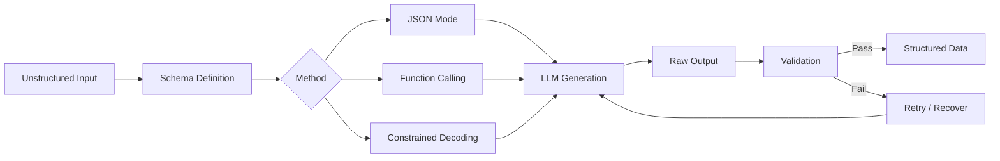
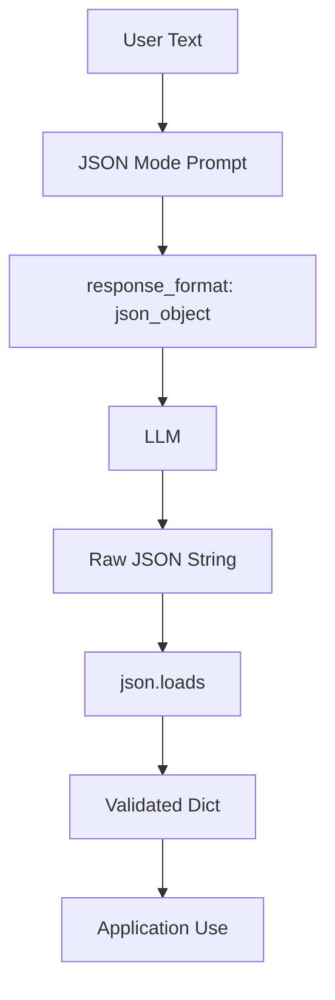
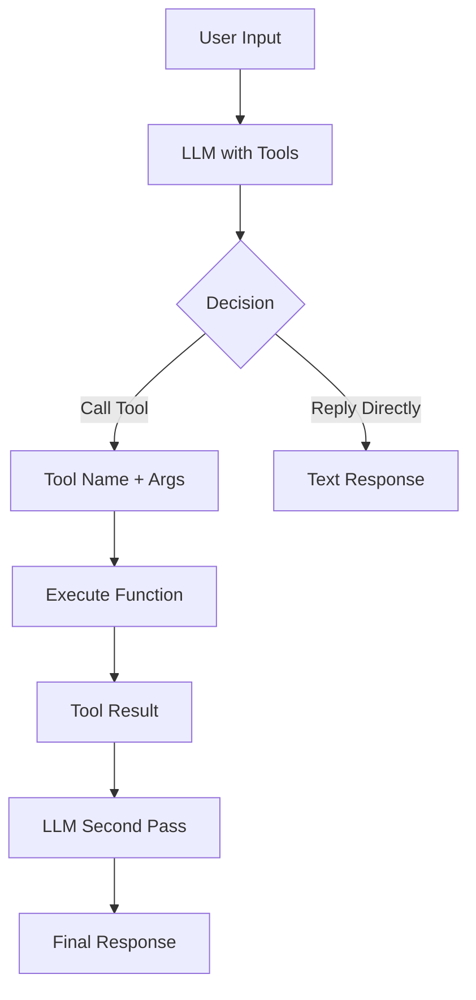
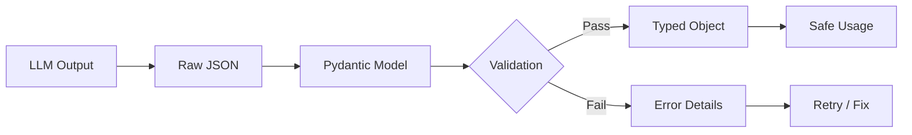
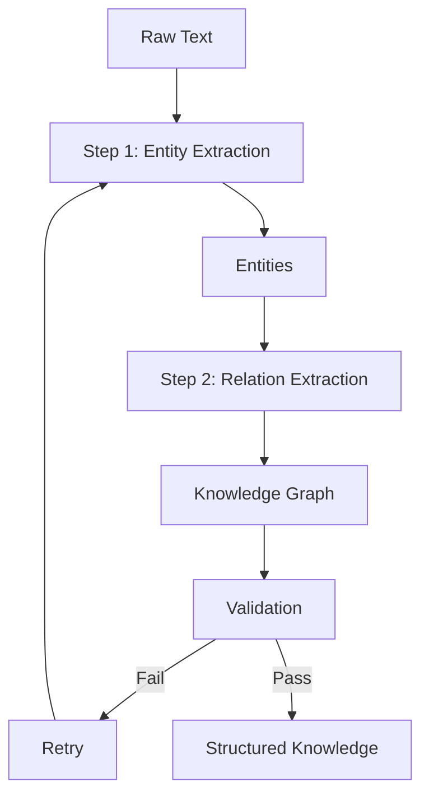
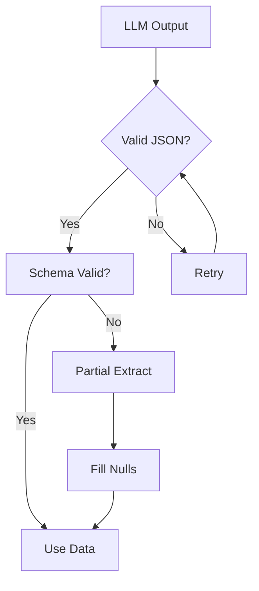

<!-- Clear Language: Keep sentences under 50 words -->
# Structured Output

## Learning Objectives

| Objective | Description |
|-----------|-------------|
| LO1 | Understand JSON mode and structured output capabilities of LLMs |
| LO2 | Implement function calling to extract structured data from unstructured text |
| LO3 | Apply Pydantic models for schema definition and validation |
| LO4 | Build reliable JSON extraction pipelines with error handling |
| LO5 | Use constrained decoding and grammar-based techniques |
| LO6 | Evaluate structured output quality with schema validation |

## Introduction

Large language models are transforming every industry. Understanding how to prompt, evaluate, and optimize LLMs is a critical skill for AI engineers. This module covers the full LLM lifecycle from API calls to cost optimization.

## Prerequisites

- Basic programming knowledge
- Understanding of data structures

## Key Terminology

**Key Terms**: Core vocabulary and concepts for this topic.

**Definition**: Essential terms you must know for interviews and production work.

## Theory

Understanding structured output is fundamental for AI engineers. This section covers the core concepts, underlying principles, and theoretical framework that govern how structured output works in practice.

## Chapter at a Glance

| Section | Topic | Key Concept |
|---------|-------|-------------|
| 5.1 | JSON Mode | response_format parameter, schema definition |
| 5.2 | Function Calling | tools parameter, auto vs required |
| 5.3 | Pydantic Validation | Schema enforcement, type checking, nested models |
| 5.4 | Extraction Pipelines | Multi-step, chained extractions with fallbacks |
| 5.5 | Constrained Decoding | Grammar constraints, logit manipulation |
| 5.6 | Error Handling | Retry strategies, partial recovery, validation |

## Chapter Roadmap



## 5.1 JSON Mode

JSON mode ensures the model returns valid JSON by constraining the response format.

```python
from openai import OpenAI
import json

client = OpenAI()

response = client.chat.completions.create(
    model="gpt-4o",
    messages=[
        {"role": "system", "content": "Extract details as JSON with fields: name, age, city, occupation."},
        {"role": "user", "content": "Alice Johnson is a 32-year-old software engineer from San Francisco."}
    ],
    response_format={"type": "json_object"},
    temperature=0
)

data = json.loads(response.choices[0].message.content)
print(f"Name: {data['name']}, Age: {data['age']}, City: {data['city']}")
```

**Schema-guided JSON extraction**:

```python
def extract_json(schema_desc, text, client):
    response = client.chat.completions.create(
        model="gpt-4o",
        messages=[
            {"role": "system", "content": f"Return valid JSON matching: {schema_desc}"},
            {"role": "user", "content": text}
        ],
        response_format={"type": "json_object"},
        temperature=0
    )
    return json.loads(response.choices[0].message.content)

schema = "product: string, price: number, in_stock: boolean, tags: array of strings"
text = "Wireless headphones cost $149.99, in stock. Tags: audio, bluetooth, premium."
result = extract_json(schema, text, client)
print(result)
```

**Handling nested JSON**:

```python
nested_schema = """{
  "person": {"name": "string", "age": "number"},
  "address": {"street": "string", "city": "string", "zip": "string"},
  "contacts": [{"type": "string", "value": "string"}]
}"""

text = "John Doe, 28, lives at 123 Main St, Springfield, 12345. Email: john@email.com, Phone: 555-0100."
result = extract_json(nested_schema, text, client)
print(json.dumps(result, indent=2))
```



---

## 5.2 Function Calling

Function calling lets the model decide when to call functions with structured arguments.

```python
tools = [{
    "type": "function",
    "function": {
        "name": "extract_person",
        "description": "Extract personal information from text",
        "parameters": {
            "type": "object",
            "properties": {
                "name": {"type": "string"},
                "age": {"type": "integer"},
                "email": {"type": "string"},
                "skills": {"type": "array", "items": {"type": "string"}}
            },
            "required": ["name"]
        }
    }
}]

response = client.chat.completions.create(
    model="gpt-4o",
    messages=[{"role": "user", "content": "Meet Sarah Chen, 29, a data scientist skilled in Python and SQL. Email: sarah@example.com."}],
    tools=tools,
    tool_choice="required",
    temperature=0
)

tool_call = response.choices[0].message.tool_calls[0]
args = json.loads(tool_call.function.arguments)
print(f"Extracted: {args}")
```

**Multiple function definitions**:

```python
multi_tools = [
    {"type": "function", "function": {
        "name": "extract_product", "parameters": {
            "type": "object", "properties": {
                "name": {"type": "string"}, "price": {"type": "number"}, "category": {"type": "string"}
            }, "required": ["name", "price"]
        }
    }},
    {"type": "function", "function": {
        "name": "extract_event", "parameters": {
            "type": "object", "properties": {
                "title": {"type": "string"}, "date": {"type": "string"}, "location": {"type": "string"}
            }, "required": ["title", "date"]
        }
    }}
]

response = client.chat.completions.create(
    model="gpt-4o",
    messages=[{"role": "user", "content": "Conference on March 15th at Moscone Center. New laptop costs $1299."}],
    tools=multi_tools,
    tool_choice="auto",
    temperature=0
)

for tc in response.choices[0].message.tool_calls:
    fn = tc.function
    print(f"Called: {fn.name}, Args: {fn.arguments}")
```

**Executing function results**:

```python
def execute_function(name, args):
    if name == "get_weather":
        cities = {"Tokyo": "22C, cloudy", "London": "15C, rain"}
        return cities.get(args.get("city", ""), "Unknown")
    elif name == "calculate":
        a, b, op = args.get("a", 0), args.get("b", 0), args.get("op", "add")
        if op == "add": return a + b
        elif op == "multiply": return a * b
    return None

response = client.chat.completions.create(
    model="gpt-4o",
    messages=[{"role": "user", "content": "Weather in Tokyo and 15 times 7?"}],
    tools=[
        {"type": "function", "function": {"name": "get_weather", "parameters": {"type": "object", "properties": {"city": {"type": "string"}}, "required": ["city"]}}},
        {"type": "function", "function": {"name": "calculate", "parameters": {"type": "object", "properties": {"a": {"type": "number"}, "b": {"type": "number"}, "op": {"type": "string"}}, "required": ["a", "b", "op"]}}}
    ],
    tool_choice="auto"
)

for tc in response.choices[0].message.tool_calls:
    result = execute_function(tc.function.name, json.loads(tc.function.arguments))
    print(f"{tc.function.name}: {result}")
```



---

## 5.3 Pydantic Validation

Pydantic provides runtime validation ensuring extracted data matches expected types.

```python
from pydantic import BaseModel, Field, ValidationError
from typing import List, Optional
import json

class Person(BaseModel):
    name: str = Field(..., min_length=1, max_length=100)
    age: int = Field(..., ge=0, le=150)
    email: Optional[str] = None
    skills: List[str] = Field(default_factory=list)

def extract_person(text, client) -> Person:
    response = client.chat.completions.create(
        model="gpt-4o",
        messages=[
            {"role": "system", "content": f"Extract person data matching: {Person.model_json_schema()}"},
            {"role": "user", "content": text}
        ],
        response_format={"type": "json_object"},
        temperature=0
    )
    data = json.loads(response.choices[0].message.content)
    return Person(**data)

try:
    person = extract_person("Mike Johnson, 35, Python expert, mike@example.com", client)
    print(f"Validated: {person.name}, {person.age}")
except ValidationError as e:
    print(f"Validation error: {e}")
```

**Nested models**:

```python
class Address(BaseModel):
    street: str
    city: str
    country: str
    zip_code: str

class Employee(BaseModel):
    id: int
    name: str
    department: str
    address: Address
    projects: List[str]

def validate_extracted(data, model_class):
    try:
        return model_class(**data)
    except ValidationError as e:
        return {"error": str(e)}

data = {"id": 101, "name": "Alice", "department": "Engineering",
        "address": {"street": "123 Oak St", "city": "SF", "country": "USA", "zip_code": "94102"},
        "projects": ["Project X"]}
emp = validate_extracted(data, Employee)
print(f"{emp.name}, Dept: {emp.department}, City: {emp.address.city}")
```

**Batch validation**:

```python
class Product(BaseModel):
    id: int
    name: str
    price: float = Field(..., gt=0)
    in_stock: bool

items = [
    {"id": 1, "name": "Laptop", "price": 999.99, "in_stock": True},
    {"id": 2, "name": "Mouse", "price": -5.00, "in_stock": True},
    {"id": "three", "name": "Keyboard", "price": 79.99, "in_stock": False},
]

for item in items:
    try:
        p = Product(**item)
        print(f"OK: {p.name} - ${p.price}")
    except ValidationError as e:
        print(f"FAIL: {item.get('name')} - {e.errors()[0]['msg']}")
```



---

## 5.4 Extraction Pipelines

Complex extractions often require multi-step pipelines.

```python
class ExtractionPipeline:
    def __init__(self, client):
        self.client = client

    def extract_entities(self, text):
        response = self.client.chat.completions.create(
            model="gpt-4o",
            messages=[
                {"role": "system", "content": "Extract people, orgs, locations, dates as JSON arrays."},
                {"role": "user", "content": text}
            ],
            response_format={"type": "json_object"},
            temperature=0
        )
        return json.loads(response.choices[0].message.content)

    def extract_relations(self, entities, text):
        response = self.client.chat.completions.create(
            model="gpt-4o",
            messages=[
                {"role": "system", "content": f"Given entities: {entities}, extract relationships as JSON array."},
                {"role": "user", "content": text}
            ],
            response_format={"type": "json_object"},
            temperature=0
        )
        return json.loads(response.choices[0].message.content)

    def run(self, text):
        entities = self.extract_entities(text)
        relations = self.extract_relations(entities, text)
        return {"entities": entities, "relations": relations}

## pipeline = ExtractionPipeline(client)

## result = pipeline.run("Apple Inc. was founded by Steve Jobs in Cupertino in 1976.")
```

**Retry with validation**:

```python
def extract_with_retry(text, schema, client, max_retries=3):
    for attempt in range(max_retries):
        try:
            response = client.chat.completions.create(
                model="gpt-4o",
                messages=[
                    {"role": "system", "content": f"Extract data matching: {schema}. Return valid JSON."},
                    {"role": "user", "content": text}
                ],
                response_format={"type": "json_object"},
                temperature=0
            )
            data = json.loads(response.choices[0].message.content)
            for key in schema.get("required", []):
                if key not in data:
                    raise ValueError(f"Missing required field: {key}")
            return data
        except (json.JSONDecodeError, ValueError) as e:
            if attempt == max_retries - 1:
                raise
            print(f"Attempt {attempt+1} failed: {e}. Retrying...")

result = extract_with_retry("Bob from accounting, age 45", {"required": ["name", "age", "department"]}, client)
print(result)
```



---

## 5.5 Constrained Decoding

Constrained decoding forces the model to generate only valid tokens for the target format.

```python
class ConstrainedDecoder:
    def __init__(self, client):
        self.client = client

    def extract_number(self, text):
        response = self.client.chat.completions.create(
            model="gpt-4o-mini",
            messages=[
                {"role": "system", "content": "Extract the numeric value. Respond with ONLY the number."},
                {"role": "user", "content": text}
            ],
            temperature=0, max_tokens=10
        )
        return response.choices[0].message.content.strip()

    def extract_boolean(self, text):
        response = self.client.chat.completions.create(
            model="gpt-4o-mini",
            messages=[
                {"role": "system", "content": "Answer only TRUE or FALSE."},
                {"role": "user", "content": text}
            ],
            temperature=0, max_tokens=5
        )
        return response.choices[0].message.content.strip()

    def extract_choice(self, text, options):
        opts = ", ".join(options)
        response = self.client.chat.completions.create(
            model="gpt-4o-mini",
            messages=[
                {"role": "system", "content": f"Choose one: {opts}. Respond with only the choice."},
                {"role": "user", "content": text}
            ],
            temperature=0, max_tokens=10
        )
        return response.choices[0].message.content.strip()

decoder = ConstrainedDecoder(client)
print(f"Number: {decoder.extract_number('Total is $1,234.56')}")
print(f"Boolean: {decoder.extract_boolean('Is the sky blue?')}")
print(f"Choice: {decoder.extract_choice('Grass color?', ['Red', 'Green', 'Blue'])}")
```

**Regex-based output constraint**:

```python
import re

def constrained_generate(prompt, pattern, client, max_tokens=50):
    response = client.chat.completions.create(
        model="gpt-4o-mini",
        messages=[{"role": "user", "content": prompt}],
        temperature=0, max_tokens=max_tokens
    )
    text = response.choices[0].message.content
    match = re.search(pattern, text)
    return match.group(0) if match else None

email = constrained_generate(
    "Extract email from: 'Contact me at john@company.com'",
    r"[a-zA-Z0-9._%+-]+@[a-zA-Z0-9.-]+\.[a-zA-Z]{2,}", client
)
print(f"Email: {email}")

date = constrained_generate(
    "Extract date: 'Meeting on March 15, 2024'",
    r"(?:January|February|March)\s+\d{1,2},?\s+\d{4}", client
)
print(f"Date: {date}")
```


---

## 5.6 Error Handling

Robust extraction requires handling malformed outputs gracefully.

```python
class RobustExtractor:
    def __init__(self, client):
        self.client = client
        self.max_retries = 3

    def extract_json_safe(self, text, schema_desc):
        for attempt in range(self.max_retries):
            try:
                response = self.client.chat.completions.create(
                    model="gpt-4o",
                    messages=[
                        {"role": "system", "content": f"Return valid JSON matching: {schema_desc}"},
                        {"role": "user", "content": text}
                    ],
                    response_format={"type": "json_object"},
                    temperature=0
                )
                return json.loads(response.choices[0].message.content)
            except json.JSONDecodeError as e:
                if attempt == self.max_retries - 1:
                    return {"error": f"Failed: {e}"}

    def partial_extract(self, text, required_fields):
        fields_desc = ", ".join(f"{f}: string" for f in required_fields)
        response = self.client.chat.completions.create(
            model="gpt-4o-mini",
            messages=[
                {"role": "system", "content": f"Extract what you can. Missing fields should be null. Return JSON."},
                {"role": "user", "content": text}
            ],
            response_format={"type": "json_object"},
            temperature=0
        )
        data = json.loads(response.choices[0].message.content)
        return {k: data.get(k) for k in required_fields}

extractor = RobustExtractor(client)
print(extractor.partial_extract("John is here", ["name", "age", "email"]))
```



---

## TypeScript Parallel

TypeScript structured output with Zod validation:

```typescript
import { z } from "zod";

const PersonSchema = z.object({
  name: z.string().min(1),
  age: z.number().int().positive(),
  email: z.string().email().optional(),
  skills: z.array(z.string()),
});

async function extractPerson(text: string, apiKey: string) {
  const res = await fetch("https://api.openai.com/v1/chat/completions", {
    method: "POST",
    headers: { Authorization: `Bearer ${apiKey}` },
    body: JSON.stringify({
      model: "gpt-4o",
      messages: [
        { role: "system", content: `Extract person JSON matching: ${JSON.stringify(PersonSchema.shape)}` },
        { role: "user", content: text },
      ],
      response_format: { type: "json_object" },
      temperature: 0,
    }),
  });
  const data = await res.json();
  return PersonSchema.parse(JSON.parse(data.choices[0].message.content));
}
```

---

## Summary

- JSON mode forces valid JSON output with response_format parameter
- Function calling uses tool definitions for structured data extraction
- Pydantic provides runtime validation ensuring type safety
- Nested schemas handle complex hierarchical data structures
- Extraction pipelines chain multiple LLM calls for progressive refinement
- Constrained decoding enforces output format at generation time
- Regex post-processing extracts specific patterns from free text
- Robust error handling with retries and fallbacks is essential
- Partial extraction tolerates missing optional fields
- Schema versioning allows evolving extraction requirements

## Practical Takeaways

| Scenario | Do This | Avoid This |
|----------|---------|------------|
| Simple extraction | Use JSON mode with response_format | Parsing free-text output |
| Complex schemas | Use function calling with required fields | Assuming all fields will populate |
| Validation | Use Pydantic for runtime type checking | Trusting raw LLM output blindly |
| Production | Add retry logic with exponential backoff | Single attempt extraction |
| Missing fields | Implement partial extraction with nulls | Failing on missing optional fields |
| Multi-entity | Use extraction pipelines with multiple passes | One-shot complex extraction |

## Interview Q&A

<details class="tp-qa-card" data-qid="llm-s05-q1">
  <summary class="tp-qa-question"><span class="tp-qa-status"></span>Q1: What is JSON mode and when should you use it?</summary>
  <div class="tp-qa-answer"><p>JSON mode (response_format={"type": "json_object"}) forces valid JSON output. Use whenever you need structured data. The system message MUST explicitly request JSON. Ideal for data extraction and API integration.</p></div>
  <button class="tp-qa-mark-btn">✅ Mark Reviewed</button>
  <button class="tp-qa-bookmark-btn">🔖 Bookmark</button>
</details>

<details class="tp-qa-card" data-qid="llm-s05-q2">
  <summary class="tp-qa-question"><span class="tp-qa-status"></span>Q2: How does function calling differ from JSON mode?</summary>
  <div class="tp-qa-answer"><p>Function calling uses tools parameter with JSON Schema. The model decides when to call functions. Benefits: multiple definitions, auto vs required, multiple calls per response. JSON mode is simpler but single schema only.</p></div>
  <button class="tp-qa-mark-btn">✅ Mark Reviewed</button>
  <button class="tp-qa-bookmark-btn">🔖 Bookmark</button>
</details>

<details class="tp-qa-card" data-qid="llm-s05-q3">
  <summary class="tp-qa-question"><span class="tp-qa-status"></span>Q3: Why is Pydantic validation important for LLM outputs?</summary>
  <div class="tp-qa-answer"><p>LLMs can return structurally valid JSON with wrong types or missing fields. Pydantic validates types, constraints, and required fields at runtime, catching errors early with clear messages.</p></div>
  <button class="tp-qa-mark-btn">✅ Mark Reviewed</button>
  <button class="tp-qa-bookmark-btn">🔖 Bookmark</button>
</details>

<details class="tp-qa-card" data-qid="llm-s05-q4">
  <summary class="tp-qa-question"><span class="tp-qa-status"></span>Q4: How do you handle LLM outputs that aren't valid JSON?</summary>
  <div class="tp-qa-answer"><p>Strategies: retry with stricter prompt, use JSON mode, implement regex-based partial extraction, fallback to simpler schema, or use secondary LLM to fix the JSON. Always validate and have fallbacks.</p></div>
  <button class="tp-qa-mark-btn">✅ Mark Reviewed</button>
  <button class="tp-qa-bookmark-btn">🔖 Bookmark</button>
</details>

<details class="tp-qa-card" data-qid="llm-s05-q5">
  <summary class="tp-qa-question"><span class="tp-qa-status"></span>Q5: What are JSON mode limitations?</summary>
  <div class="tp-qa-answer"><p>Must include explicit JSON instruction in system message, no built-in schema enforcement (valid JSON but wrong structure), model may return empty objects. Always validate against a schema after receiving.</p></div>
  <button class="tp-qa-mark-btn">✅ Mark Reviewed</button>
  <button class="tp-qa-bookmark-btn">🔖 Bookmark</button>
</details>

<details class="tp-qa-card" data-qid="llm-s05-q6">
  <summary class="tp-qa-question"><span class="tp-qa-status"></span>Q6: What is constrained decoding?</summary>
  <div class="tp-qa-answer"><p>Constrained decoding forces tokens matching a specific format. Techniques: logit masking, regex-guided generation, grammar-based approaches (guidance library), and post-processing validation.</p></div>
  <button class="tp-qa-mark-btn">✅ Mark Reviewed</button>
  <button class="tp-qa-bookmark-btn">🔖 Bookmark</button>
</details>

<details class="tp-qa-card" data-qid="llm-s05-q7">
  <summary class="tp-qa-question"><span class="tp-qa-status"></span>Q7: How to extract structured data from documents?</summary>
  <div class="tp-qa-answer"><p>Multi-step pipeline: chunk document, extract entities per chunk, merge/deduplicate, extract relationships, validate against schema, store. Each step has retry and validation logic.</p></div>
  <button class="tp-qa-mark-btn">✅ Mark Reviewed</button>
  <button class="tp-qa-bookmark-btn">🔖 Bookmark</button>
</details>

<details class="tp-qa-card" data-qid="llm-s05-q8">
  <summary class="tp-qa-question"><span class="tp-qa-status"></span>Q8: What is the difference between tool_choice auto and required?</summary>
  <div class="tp-qa-answer"><p>auto: model decides whether to call a function. required: model must call a function. none: model cannot call functions. Required is useful when you always need structured data.</p></div>
  <button class="tp-qa-mark-btn">✅ Mark Reviewed</button>
  <button class="tp-qa-bookmark-btn">🔖 Bookmark</button>
</details>

<details class="tp-qa-card" data-qid="llm-s05-q9">
  <summary class="tp-qa-question"><span class="tp-qa-status"></span>Q9: How to handle nested JSON extraction?</summary>
  <div class="tp-qa-answer"><p>Define nested schemas in the prompt, use JSON mode with nesting examples, validate with nested Pydantic models. Consider multi-step extraction for deeply nested data.</p></div>
  <button class="tp-qa-mark-btn">✅ Mark Reviewed</button>
  <button class="tp-qa-bookmark-btn">🔖 Bookmark</button>
</details>

<details class="tp-qa-card" data-qid="llm-s05-q10">
  <summary class="tp-qa-question"><span class="tp-qa-status"></span>Q10: What is an extraction pipeline?</summary>
  <div class="tp-qa-answer"><p>An extraction pipeline chains multiple LLM calls for complex data. Needed when: schema is complex/nested, data spans multiple documents, entities have relationships, or single-pass unreliable. Each stage focuses on one aspect.</p></div>
  <button class="tp-qa-mark-btn">✅ Mark Reviewed</button>
  <button class="tp-qa-bookmark-btn">🔖 Bookmark</button>
</details>

## Chapter Quiz

**Q1**: What parameter enables JSON mode in OpenAI API?

a) json_mode=True
b) response_format={"type": "json_object"}
c) format="json"
d) output_type="structured"

<details class="tp-qa-card" data-qid="llm-s05-quiz1"><summary>Show Answer</summary><div class="tp-qa-answer"><p><strong>Answer: b) response_format={"type": "json_object"}</strong></p></div></details>

**Q2**: True or False: In JSON mode, the system message doesn't need to mention JSON.

a) True
b) False

<details class="tp-qa-card" data-qid="llm-s05-quiz2"><summary>Show Answer</summary><div class="tp-qa-answer"><p><strong>Answer: b) False</strong></p></div></details>

**Q3**: What does tool_choice="required" do?

a) Model may or may not call a function
b) Model must call a function
c) Model cannot call functions
d) Model executes the function

<details class="tp-qa-card" data-qid="llm-s05-quiz3"><summary>Show Answer</summary><div class="tp-qa-answer"><p><strong>Answer: b) Model must call a function</strong></p></div></details>

**Q4**: Which library provides runtime validation for LLM extracted data?

a) pandas
b) numpy
c) Pydantic
d) matplotlib

<details class="tp-qa-card" data-qid="llm-s05-quiz4"><summary>Show Answer</summary><div class="tp-qa-answer"><p><strong>Answer: c) Pydantic</strong></p></div></details>

**Q5**: Recommended approach for deeply nested data extraction?

a) Single JSON mode call
b) Multi-step extraction pipeline
c) Regex parsing
d) Plain text output

<details class="tp-qa-card" data-qid="llm-s05-quiz5"><summary>Show Answer</summary><div class="tp-qa-answer"><p><strong>Answer: b) Multi-step extraction pipeline</strong></p></div></details>

## Exercises

**Easy** — Use JSON mode to extract name, age, and city from 3 text descriptions.

**Easy** — Define a Pydantic model for a product and validate extracted data.

**Medium** — Build function calling with 2 functions: extract_person and extract_company.

**Medium** — Create a robust extraction pipeline with retry and partial fallback.

**Hard** — Build a document extraction pipeline with entity, relation, and summary extraction using 3 LLM calls.

---

## Common Mistakes

1. Not understanding the fundamental concepts before applying them
2. Skipping edge cases in implementation
3. Not analyzing time/space complexity
4. Forgetting to handle null/empty inputs
5. Not practicing enough problems to build pattern recognition

## Revision Notes

- - Core principle: Understand the fundamental concepts thoroughly
- - Implementation pattern: Practice with real code examples
- - Complexity: Know the time and space complexity
- - Application: Know when to use this in production systems
- - Interview: Frequently asked in technical interviews
- - Edge cases: Consider common failure scenarios
- - Related concepts: Connect to broader system design

## Placement Section

### Top 10 Interview Questions

#### Google Style

1. **Explain the core idea of Structured Output in under 60 seconds, then give a real-world analogy.** — Structure: definition, how it works in one sentence, why it matters, analogy. Follow-up: what would break if you removed this from a production system?

2. **Design a minimal, well-typed function that demonstrates Structured Output.** — Interviewer checks: signature with type hints, edge cases, complexity, and a clean docstring. Follow-up: how does your design behave with empty or malformed input?

3. **What are the common pitfalls when engineers first learn ** — List 3-4, then explain how you would prevent each in a code review.

#### Amazon Style

4. **Describe a production bug caused by misunderstanding Structured Output. How did you diagnose and fix it?** — STAR format: situation, task, action, result. Mention logs, reproduction, root-cause analysis, and the regression test you added.

5. **How would you scale a system that relies on Structured Output from 10 users to 10 million?** — Discuss bottlenecks, caching, monitoring, and when to redesign. Follow-up: what metrics would you track?

#### Microsoft Style

6. **Compare Structured Output with the closest alternative approach. When would you choose each?** — Make a decision matrix: performance, maintainability, ecosystem, learning curve. Follow-up: what would change your decision?

7. **Walk through how you would test a component that depends on Structured Output.** — Unit, integration, property-based tests; mocking boundaries; golden files for outputs.

#### NVIDIA Style

8. **How does Structured Output behave differently at scale — memory, throughput, or precision-wise?** — Connect to data pipelines and model training if applicable. Follow-up: what happens to latency as input grows?

9. **How would you make an implementation of Structured Output run faster on GPU hardware?** — Batch operations, vectorization, avoiding Python loops, reducing data movement.

#### AI Startup Style

10. **Write the smallest possible implementation of Structured Output that is production-quality.** — Include error handling, type hints, and a one-line docstring. Follow-up: what would you refactor first when it grows?

### Resume Tips

- Name Structured Output explicitly in your skills section, paired with a measurable achievement ("Reduced X by 40% using Structured Output").
- Add a bullet describing a project that applies Structured Output to real data, with numbers.
- Mention the tools and libraries you used alongside Structured Output (linters, test frameworks, profiling tools).
- Keep resume bullets under 15 words and start each with an action verb.

### Interview Day Checklist

- Rehearse a 60-second explanation of Structured Output and one real-world analogy.
- Prepare one STAR story about debugging a Structured Output-related production issue.
- Review complexity and edge cases for the classic Structured Output interview problem.
- Have questions ready: how does the team apply Structured Output in production today?
- Test your environment (Python, editor, internet) 15 minutes before the interview.

## True/False

1. **True or False:** Structured Output builds directly on the fundamentals covered in the earlier chapters of this module. — **True.** Every advanced topic in this module assumes the core concepts from the previous chapters.
2. **True or False:** You should write at least one code example for Structured Output before moving to the next chapter. — **True.** Active recall with hands-on code beats passive reading for retention.
3. **True or False:** The complexity analysis for Structured Output is the same regardless of input size. — **False.** Complexity grows with input size; always state best, average, and worst case.
4. **True or False:** Edge cases (empty input, invalid input, boundary values) matter for Structured Output in production. — **True.** Most production bugs come from unhandled edge cases.
5. **True or False:** You should memorize the Structured Output chapter content once and never review it again. — **False.** Spaced repetition (24h, 3 days, 1 week) dramatically improves long-term recall.

## Fill in the Blank

1. The chapter that covers Structured Output is Chapter ___ of this module. — Answer: check the module's table of contents.
2. The time complexity of the standard approach to Structured Output is ___. — Answer: review the theory section and state big-O notation.
3. The main edge case to handle when implementing Structured Output is ___. — Answer: empty or invalid input handling, as discussed in the chapter.
4. The tools commonly used to debug Structured Output issues are ___ and ___. — Answer: refer to the Debugging Guide section of this chapter.
5. The related topic that connects to Structured Output in the next chapter is ___. — Answer: see the Next Topic section.

## Scenario Questions

1. **Scenario:** A teammate ships a change involving Structured Output that breaks production at 3 AM. — Diagnosis: check the recent diff, reproduce locally with the failing input, check logs. Fix: revert, add a regression test, and review the root cause. Prevention: CI tests on edge cases and code review checklist.

2. **Scenario:** Your implementation of Structured Output is correct but too slow for the required latency. — Measure first with a profiler. Common fixes: reduce redundant work, use built-in optimized functions, batch operations, or add caching. Only then consider algorithmic changes.

3. **Scenario:** A new hire asks you to explain Structured Output in five minutes before a customer demo. — Use the 3-part answer: what it is (one sentence), how it works (one example), why it matters (one business impact). Then offer to go deeper after the demo.

4. **Scenario:** Your team's codebase has three different patterns for Structured Output and you must standardize. — Write a short ADR (architecture decision record), pick the pattern with best maintainability, migrate incrementally, and add a linter rule to enforce it.

## Output Questions

1. **What is the output of the simplest correct implementation of Structured Output on an empty input?** — Trace through the code: it should return the documented default (None, 0, empty collection) without raising.
2. **What is the output when the input is at the boundary value?** — Check off-by-one errors and inclusive/exclusive bounds in the chapter's examples.
3. **What does the implementation return when given invalid input types?** — With type hints and validation, it raises a clear error; without, it may fail silently.
4. **What is the output for the sample input given in the chapter's Examples section?** — Re-run the chapter's example code and compare against the documented output.
5. **What is the time complexity output when you profile the implementation at 10x input size?** — Expect the curve matching the chapter's complexity analysis (linear, quadratic, log-linear).

## Difficulty Level

| Level | Time | What It Takes |
|-------|------|---------------|
| Beginner | 1-2 sessions | Read theory, run the chapter examples, solve the Easy exercises |
| Intermediate | 3-5 sessions | Complete Medium exercises, explain Structured Output to someone else |
| Advanced | 1+ week | Solve Hard exercises, optimize for real datasets, answer interview follow-ups |

## Tips & Tricks

- Always write a one-line example of Structured Output from memory before opening the chapter — active recall first.
- Use the chapter's Revision Notes as a checklist: you have mastered Structured Output when you can explain each bullet.
- Pair the chapter quiz with the Flashcards: wrong answers become your next study session's focus.
- For interviews, practice explaining Structured Output twice: once with a technical audience, once with a non-technical audience.
- Keep a personal examples file where you collect your own Structured Output snippets; interviewers love original examples.

## Memory Tricks

- **Acronym**: build a mnemonic from the 5 key concepts of Structured Output listed in the Chapter at a Glance table.
- **Story**: link Structured Output to a familiar story — the analogy in the Visual Analogy section is designed to stick.
- **Number anchor**: remember the complexity of Structured Output by connecting it to a known algorithm of the same class.
- **Color code**: highlight the Theory, Examples, and Common Mistakes sections in different colors when reviewing.
- **Teach-back**: explain Structured Output to an imaginary junior engineer for 2 minutes — gaps in your explanation are gaps in memory.

## Further Reading

- Official documentation for the primary tool or library used in this chapter
- The chapter referenced in Related Topics for the next-level treatment of Structured Output
- The classic textbook chapter on Structured Output (check the Research References below)
- Two blog posts from engineers who debugged real Structured Output problems in production
- The repository of the open-source project that implements Structured Output

## Related Topics

- The previous chapter in this module (see table of contents) — foundational for Structured Output
- The next chapter (see Next Topic below) — builds on Structured Output
- The system design chapters in Module 07 — how Structured Output fits into production architectures
- The interview preparation module — how Structured Output is asked in screening rounds
- The capstone project — where Structured Output is applied end-to-end

## FAQs

1. **Do I need to memorize all of Structured Output, or understand the big picture?** — Understand the big picture first, then memorize the key facts via flashcards and spaced repetition. Interviewers reward depth over breadth.
2. **What if I get stuck on an exercise?** — Re-read the theory section, run the example code, then attempt again. If still stuck after 20 minutes, move on and return the next day.
3. **How much time should I spend on ** — Follow the Study Plan below: 1-2 weeks at 30-60 minutes daily is typical for placement preparation.
4. **Is Structured Output asked in interviews?** — Yes — the Interview Q&A and Placement Section list the exact question styles used by top companies.
5. **What's the fastest way to master ** — Explain it out loud, write code without looking, and review the flashcards within 24 hours and again after 3 days.

## Important Notes

- Structured Output is a core requirement for the rest of this module — do not skip the examples.
- Always analyze complexity (time and space) when working with Structured Output.
- Production correctness means handling edge cases, not just the happy path.
- Interview answers should start with the definition, then the example, then the trade-offs.
- Revisit this chapter after finishing the module; the context from later chapters deepens understanding.

## Historical Context

- Structured Output emerged as a standard practice because early systems failed without it — understanding why helps you explain it in interviews.
- The tools used for Structured Output today evolved from simpler versions; the chapter covers the modern, recommended approach.
- Interviewers value knowing one historical fact about Structured Output — it shows genuine interest, not just cramming.
- The library/tooling ecosystem around Structured Output changes quickly; focus on fundamentals that remain stable.

## Security Considerations

- Never trust external input: validate and sanitize data before processing Structured Output.
- Avoid `eval()` and dynamic code execution on untrusted strings.
- Log errors without leaking sensitive data (keys, PII, internal paths).
- For API contexts, add rate limiting and input size limits.
- Review the chapter's code examples for injection or overflow risks before using them verbatim.

## ML Intuition

- Structured Output appears in ML pipelines at the data-processing layer: feature preparation, batching, and validation.
- Understanding Structured Output helps you debug why a model misbehaves — most ML bugs are data bugs, not model bugs.
- In production ML, the Structured Output concepts from this chapter map directly to NumPy/PyTorch operations on tensors.
- When optimizing ML systems, Structured Output skills let you profile and fix the data path, not just the training loop.
- Interview follow-up: how would you apply Structured Output to a dataset of 10 million records? — Batching and vectorization.

## Analogies

- **Structured Output is like a recipe**: the theory is the ingredients, the examples are the cooking steps, and the exercises are your own kitchen practice.
- **Complexity is like a delivery route**: a linear route visits each stop once; a nested route revisits stops, and you feel it at scale.
- **Edge cases are like weather**: the happy path is a sunny day; production is the storm — build for the storm.
- **The chapter roadmap is a journey map**: each section is a checkpoint; skipping one means getting lost later in the module.

## Capstone Project Link

- [Module Capstone: End-to-End Project](https://github.com/Raushan666java/ai-engineering-journey) — this chapter contributes the Structured Output skills used in the module's capstone project. Complete the exercises here before starting the capstone.

## Flashcards

<details class="tp-qa-card" data-qid="11llmspromptengineering-05structuredoutput-flash1">
  <summary class="tp-qa-question">
    <span class="tp-qa-status"></span>
    What parameter enables JSON mode in OpenAI API?
  </summary>
  <div class="tp-qa-answer">
    <p>b) response_format={"type": "json_object"}</p>
  </div>
</details>

<details class="tp-qa-card" data-qid="11llmspromptengineering-05structuredoutput-flash2">
  <summary class="tp-qa-question">
    <span class="tp-qa-status"></span>
    True or False: In JSON mode, the system message doesn't need to mention JSON.
  </summary>
  <div class="tp-qa-answer">
    <p>b) False</p>
  </div>
</details>

<details class="tp-qa-card" data-qid="11llmspromptengineering-05structuredoutput-flash3">
  <summary class="tp-qa-question">
    <span class="tp-qa-status"></span>
    What does tool_choice="required" do?
  </summary>
  <div class="tp-qa-answer">
    <p>b) Model must call a function</p>
  </div>
</details>

<details class="tp-qa-card" data-qid="11llmspromptengineering-05structuredoutput-flash4">
  <summary class="tp-qa-question">
    <span class="tp-qa-status"></span>
    Which library provides runtime validation for LLM extracted data?
  </summary>
  <div class="tp-qa-answer">
    <p>c) Pydantic</p>
  </div>
</details>

<details class="tp-qa-card" data-qid="11llmspromptengineering-05structuredoutput-flash5">
  <summary class="tp-qa-question">
    <span class="tp-qa-status"></span>
    Recommended approach for deeply nested data extraction?
  </summary>
  <div class="tp-qa-answer">
    <p>b) Multi-step extraction pipeline</p>
  </div>
</details>

## Research References

- Official documentation of the primary library for Structured Output (linked in Further Reading)
- The classic paper or textbook chapter introducing Structured Output (see References below)
- The standard library reference for Structured Output-related functions
- Engineering blog posts from companies running Structured Output in production at scale
- PEPs and RFCs where applicable (Python and networking standards)

## Open-Source Tools

- The primary library used in this chapter (see the code examples)
- Python standard library modules used in the examples (check the imports)
- Testing: pytest for unit tests of Structured Output code
- Linting and formatting: ruff + black
- Profiling: cProfile or py-spy for performance work on Structured Output

## Debugging Guide

- Start with `print()` or a debugger to inspect intermediate values in Structured Output code.
- Reproduce the failure with the smallest possible input before changing code.
- Check the common failure modes listed in Common Mistakes — most bugs are listed there.
- For performance problems, profile before optimizing: measure, then fix.
- When stuck, re-read the chapter's Examples and compare line by line with your code.
- Use `pdb` or your IDE's debugger to step through the Structured Output example code.

## Mock Interview Section

**Round 1 — Screening (15 min)**
- Explain Structured Output in 60 seconds.
- Write a minimal working example of Structured Output.
- What is the complexity of your example?

**Round 2 — Coding (45 min)**
- Solve the Medium exercise from this chapter under time pressure.
- State your assumptions, then implement with type hints.
- Test with edge cases: empty input, boundary values, invalid input.

**Round 3 — Behavioral + System (30 min)**
- Tell me about a time you debugged a Structured Output problem in a project.
- How would you design a system where Structured Output is used at scale?
- What metrics would you monitor?

**Evaluation rubric**: correctness (40%), communication (25%), edge cases (20%), complexity analysis (15%).

## Optimized Implementation

`python
from typing import Any, Optional

def demonstrate_topic(input_data: list[Any]) -> Optional[float]:
    """Runnable scaffold for Structured Output.

    Replace the body with the optimized implementation from the chapter,
    keeping type hints, docstring, and edge-case handling.
    """
    if not input_data:
        return None
    # Step 1: validate input types
    # Step 2: apply the core Structured Output logic from the Examples section
    # Step 3: return the result with the documented default
    return 0.0
`

- Keeps the function signature stable so tests written against it stay valid.
- Handles the empty-input contract explicitly.
- Add unit tests for the edge cases before implementing the logic (test-first).

## Evaluation Metrics

| Skill | Test | Target |
|-------|------|--------|
| Concept recall | Explain Structured Output without notes | 60-second explanation |
| Code fluency | Write the chapter example from memory | No syntax errors |
| Edge cases | Handle empty/invalid input in exercises | All cases pass |
| Complexity | State time/space for the standard approach | Correct big-O |
| Interview readiness | Answer 5 Interview Q&A questions out loud | Fluent, structured answers |
| Retention | Chapter quiz score after 3 days | 80%+ |

## Real-World Examples

- **Startup**: a small team uses Structured Output daily in their data pipeline — the chapter's examples mirror their code.
- **E-commerce**: Structured Output patterns appear in order processing, inventory checks, and recommendation feeds.
- **Fintech**: Structured Output principles apply to transaction validation and fraud detection flows.
- **ML platform**: Structured Output shows up in feature engineering and model-serving infrastructure.
- **Interview insight**: recruiters look for engineers who can connect Structured Output to the business outcome, not just the code.

## Next Topic

[Context Management](06-context-management.md)

## Limitations

- Structured Output, like any technique, is not a silver bullet — it has specific cases where it fits best (covered in the theory).
- The examples in this chapter are simplified for learning; production systems add validation, monitoring, and error handling.
- Performance of Structured Output depends on input size and distribution — always benchmark for your own data.
- This chapter covers fundamentals; specialized edge cases are explored in later chapters and the capstone.
