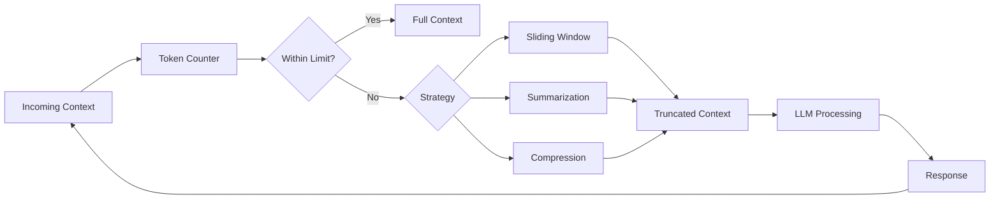
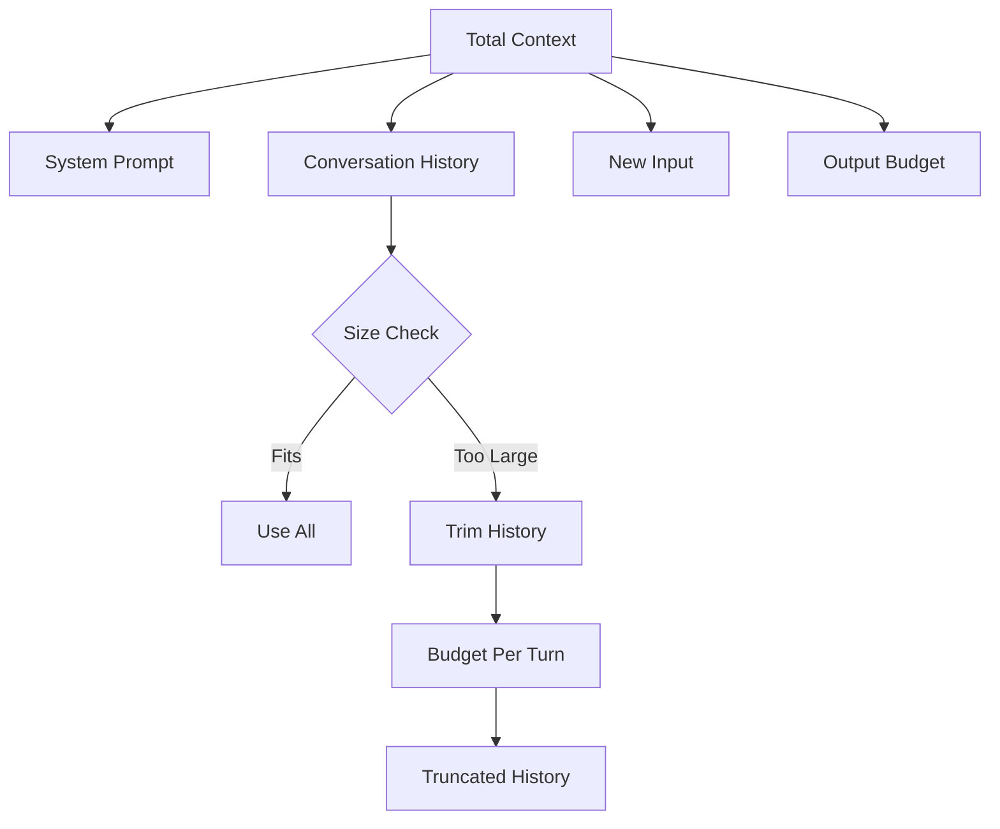
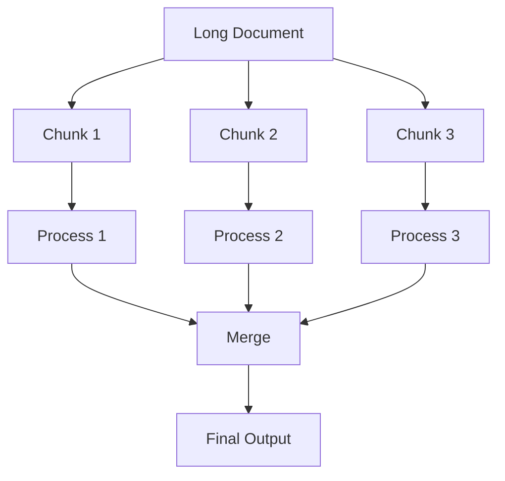
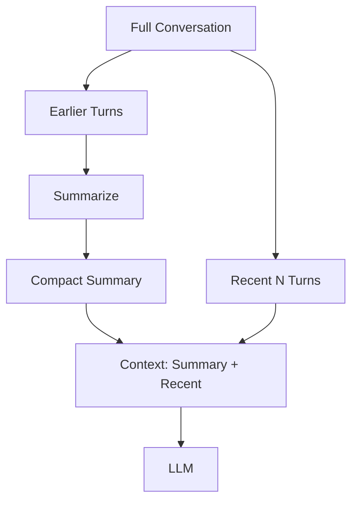
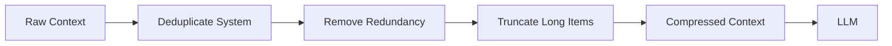
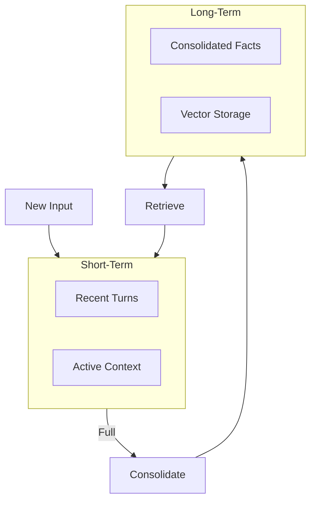
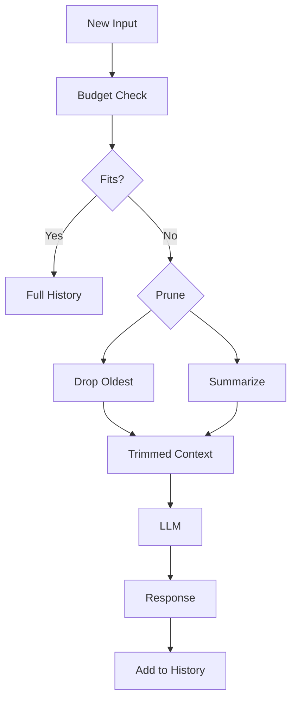

<!-- Clear Language: Keep sentences under 50 words -->
# Context Management

## Learning Objectives

| Objective | Description |
|-----------|-------------|
| LO1 | Understand token limits, context windows, and their practical implications |
| LO2 | Implement sliding window techniques for long document processing |
| LO3 | Apply conversation summarization for multi-turn chat memory |
| LO4 | Build context compression strategies to reduce token usage |
| LO5 | Design memory systems with short-term and long-term storage |
| LO6 | Manage context across multi-turn conversations efficiently |

## Introduction

Large language models are transforming every industry. Understanding how to prompt, evaluate, and optimize LLMs is a critical skill for AI engineers. This module covers the full LLM lifecycle from API calls to cost optimization.

## Prerequisites

- Basic programming knowledge
- Understanding of data structures

## Key Terminology

**Key Terms**: Core vocabulary and concepts for this topic.

**Definition**: Essential terms you must know for interviews and production work.

## Theory

Understanding context management is fundamental for AI engineers. This section covers the core concepts, underlying principles, and theoretical framework that govern how context management works in practice.

## Chapter at a Glance

| Section | Topic | Key Concept |
|---------|-------|-------------|
| 6.1 | Token Limits | Context windows, token counting, budget allocation |
| 6.2 | Sliding Window | Chunking, overlap, windowing strategies |
| 6.3 | Conversation Summarization | Rolling summaries, compression ratios |
| 6.4 | Context Compression | Pruning, prioritization, selective retention |
| 6.5 | Memory Systems | Short-term, long-term, vector-based retrieval |
| 6.6 | Multi-Turn Management | History pruning, token budgeting, state tracking |

## Chapter Roadmap



## 6.1 Token Limits

LLMs have maximum context windows limiting total input + output tokens.

```python
import tiktoken

MODEL_LIMITS = {
    "gpt-4o": 128000, "gpt-4o-mini": 128000,
    "gpt-4-turbo": 128000, "gpt-3.5-turbo": 16385,
    "claude-3-sonnet": 200000, "claude-3-haiku": 200000,
    "gemini-1.5-pro": 2000000,
}

def check_budget(messages, model="gpt-4o"):
    encoding = tiktoken.encoding_for_model(model)
    total = sum(len(encoding.encode(m.get("content", ""))) for m in messages)
    limit = MODEL_LIMITS.get(model, 128000)
    return {"tokens": total, "limit": limit, "remaining": limit - total, "ok": total <= limit}

messages = [{"role": "user", "content": "Hello " * 10000}]
budget = check_budget(messages)
print(f"Tokens: {budget['tokens']}, Limit: {budget['limit']}, OK: {budget['ok']}")
```

**Token budget allocation**:

```python
def allocate_budget(system_msg, history, new_input, max_output=4096, model="gpt-4o"):
    encoding = tiktoken.encoding_for_model(model)
    limit = MODEL_LIMITS[model]
    system_tokens = len(encoding.encode(system_msg))
    new_tokens = len(encoding.encode(new_input))
    available = limit - max_output - system_tokens - new_tokens
    history_tokens = sum(len(encoding.encode(h["content"])) for h in history)

    if history_tokens <= available:
        return history

    budget_per_turn = available // max(len(history), 1)
    trimmed = []
    for h in history:
        tokens = len(encoding.encode(h["content"]))
        if tokens <= budget_per_turn:
            trimmed.append(h)
        else:
            chars = int(len(h["content"]) * (budget_per_turn / tokens))
            trimmed.append({"role": h["role"], "content": h["content"][:chars]})
    return trimmed

history = [{"role": "user", "content": "Tell me about AI"}] * 50
trimmed = allocate_budget("You are helpful.", history, "What is ML?")
print(f"Original: {len(history)}, Trimmed: {len(trimmed)}")
```



---

## 6.2 Sliding Window

Sliding window processes long documents via overlapping chunks.

```python
class SlidingWindowProcessor:
    def __init__(self, client, model="gpt-4o-mini", max_tokens=12000):
        self.client = client
        self.model = model
        self.max_tokens = max_tokens

    def chunk(self, text, chunk_size=10000, overlap=2000):
        chunks = []
        start = 0
        while start < len(text):
            end = min(start + chunk_size, len(text))
            chunks.append(text[start:end])
            start += chunk_size - overlap
        return chunks

    def process_chunk(self, chunk, instruction):
        r = self.client.chat.completions.create(
            model=self.model,
            messages=[{"role": "system", "content": instruction}, {"role": "user", "content": chunk}],
            temperature=0
        )
        return r.choices[0].message.content

    def process(self, text, instruction, merge_instruction="Combine these into a coherent summary."):
        chunks = self.chunk(text)
        results = [self.process_chunk(c, instruction) for c in chunks]
        if len(results) > 1:
            combined = "\n\n".join(f"Part {i+1}: {r}" for i, r in enumerate(results))
            return self.process_chunk(combined, merge_instruction)
        return results[0]
```

**Overlap strategies**:

```python
class OverlapStrategies:
    @staticmethod
    def sentence_overlap(text, chunk_sentences=10, overlap=3):
        import re
        sents = re.split(r'(?<=[.!?])\s+', text)
        chunks, start = [], 0
        while start < len(sents):
            end = min(start + chunk_sentences, len(sents))
            chunks.append(" ".join(sents[start:end]))
            start += chunk_sentences - overlap
        return chunks

    @staticmethod
    def paragraph_overlap(text, chunk_paras=5, overlap=1):
        paras = [p for p in text.split("\n\n") if p.strip()]
        chunks, start = [], 0
        while start < len(paras):
            end = min(start + chunk_paras, len(paras))
            chunks.append("\n\n".join(paras[start:end]))
            start += chunk_paras - overlap
        return chunks

text = "This is sentence one. " * 100
chunks = OverlapStrategies.sentence_overlap(text, 10, 3)
print(f"Generated {len(chunks)} chunks")
```



---

## 6.3 Conversation Summarization

Summarization compresses long conversation history into compact representations.

```python
class ConversationSummarizer:
    def __init__(self, client, model="gpt-4o-mini"):
        self.client = client
        self.model = model
        self.summary = None
        self.turn_count = 0

    def add_turn(self, user_msg, assistant_msg):
        self.turn_count += 1

    def summarize(self, recent_turns):
        text = "\n".join(f"{t['role']}: {t['content'][:200]}" for t in recent_turns)
        r = self.client.chat.completions.create(
            model=self.model,
            messages=[
                {"role": "system", "content": "Summarize this conversation concisely. Capture key facts, decisions, and preferences."},
                {"role": "user", "content": text}
            ],
            temperature=0
        )
        self.summary = r.choices[0].message.content
        return self.summary

    def build_context(self, history, max_turns=10):
        if len(history) <= max_turns:
            return history
        summary = self.summarize(history[:-max_turns])
        context = [{"role": "system", "content": f"Previous summary: {summary}"}]
        context.extend(history[-max_turns:])
        return context

summarizer = ConversationSummarizer(client)
history = [{"role": "user", "content": f"Msg {i}"} for i in range(50)]
ctx = summarizer.build_context(history, max_turns=5)
print(f"Context: {len(ctx)} msgs, Has summary: {'summary' in ctx[0]['content']}")
```

**Compression ratios**:

```python
def measure_ratio(original, summary, model="gpt-4o-mini"):
    enc = tiktoken.encoding_for_model(model)
    orig_tokens = sum(len(enc.encode(m["content"])) for m in original)
    summ_tokens = len(enc.encode(summary))
    return {"original": orig_tokens, "summary": summ_tokens, "ratio": f"{summ_tokens/orig_tokens:.1%}"}

orig = [{"role": "user", "content": "Hello " * 100}] * 10
summary = "User greeted repeatedly."
print(measure_ratio(orig, summary))
```



---

## 6.4 Context Compression

Compression reduces token usage by removing redundant or low-value content.

```python
class Compressor:
    def __init__(self, client):
        self.client = client

    def prune_system(self, messages):
        seen, pruned = set(), []
        for m in messages:
            if m["role"] == "system":
                key = m["content"][:100]
                if key in seen:
                    continue
                seen.add(key)
            pruned.append(m)
        return pruned

    def truncate_long(self, messages, max_chars=1000):
        for m in messages:
            if len(m["content"]) > max_chars:
                m["content"] = m["content"][:max_chars] + "... [truncated]"
        return messages

    def remove_redundant(self, messages):
        condensed = []
        for m in messages:
            if condensed:
                sim = len(set(m["content"].split()) & set(condensed[-1]["content"].split()))
                union = len(set(m["content"].split()) | set(condensed[-1]["content"].split()))
                if union > 0 and sim / union > 0.9:
                    continue
            condensed.append(m)
        return condensed

    def compress(self, messages):
        messages = self.prune_system(messages)
        messages = self.remove_redundant(messages)
        messages = self.truncate_long(messages)
        return messages

c = Compressor(client)
msgs = [{"role": "system", "content": "Be helpful."}, {"role": "system", "content": "Be helpful."}] * 3
msgs.append({"role": "user", "content": "What is AI? " * 5000})
result = c.compress(msgs)
print(f"Before: {len(msgs)}, After: {len(result)}")
```



---

## 6.5 Memory Systems

Two-tier memory: short-term (conversation) and long-term (persistent facts).

```python
class MemorySystem:
    def __init__(self, client):
        self.short_term = []
        self.long_term = {}
        self.client = client
        self.max_short = 20

    def add(self, user_msg, assistant_msg):
        self.short_term.append({"role": "user", "content": user_msg})
        self.short_term.append({"role": "assistant", "content": assistant_msg})
        if len(self.short_term) > self.max_short:
            self._consolidate()

    def _consolidate(self):
        text = "\n".join(m["content"] for m in self.short_term[:-10])
        r = self.client.chat.completions.create(
            model="gpt-4o-mini",
            messages=[
                {"role": "system", "content": "Extract key facts about the user. Return as bullet points."},
                {"role": "user", "content": text}
            ],
            temperature=0
        )
        self.long_term["facts"] = r.choices[0].message.content
        self.short_term = self.short_term[-10:]

    def get_context(self):
        ctx = []
        if self.long_term:
            ctx.append({"role": "system", "content": f"Known facts: {self.long_term.get('facts', '')}"})
        ctx.extend(self.short_term)
        return ctx

    def store(self, key, value):
        self.long_term[key] = value

    def recall(self, key):
        return self.long_term.get(key)

mem = MemorySystem(client)
mem.add("My name is Alice", "Nice to meet you, Alice!")
mem.add("I work at Google", "Great!")
print(f"Short-term: {len(mem.short_term)} turns, Facts: {mem.long_term.get('facts', 'none')[:80]}")
```

**Vector-based memory**:

```python
import numpy as np

class VectorMemory:
    def __init__(self):
        self.texts = []
        self.vectors = []

    def add(self, text, vector):
        self.texts.append(text)
        self.vectors.append(vector)

    def search(self, query_vec, k=3):
        scores = []
        for vec in self.vectors:
            sim = np.dot(query_vec, vec) / (np.linalg.norm(query_vec) * np.linalg.norm(vec) + 1e-10)
            scores.append(sim)
        top_k = np.argsort(scores)[-k:][::-1]
        return [(self.texts[i], scores[i]) for i in top_k]

## vmem = VectorMemory()

## vmem.add("User likes Python", np.random.randn(384))

## result = vmem.search(np.random.randn(384))
```



---

## 6.6 Multi-Turn Management

Managing context across many turns requires careful token budgeting.

```python
class MultiTurnManager:
    def __init__(self, client, model="gpt-4o-mini", max_context=10000):
        self.client = client
        self.model = model
        self.max_context = max_context
        self.history = []
        self.system = "You are a helpful assistant."
        self.enc = tiktoken.encoding_for_model(model)

    def add(self, role, content):
        self.history.append({"role": role, "content": content})

    def build_context(self, new_input):
        ctx = [{"role": "system", "content": self.system}]
        available = self.max_context - len(self.enc.encode(new_input)) - 1000
        for msg in reversed(self.history):
            tokens = len(self.enc.encode(msg["content"]))
            if available - tokens < 0:
                break
            ctx.insert(1, msg)
            available -= tokens
        ctx.append({"role": "user", "content": new_input})
        return ctx

    def chat(self, user_input):
        ctx = self.build_context(user_input)
        r = self.client.chat.completions.create(model=self.model, messages=ctx, temperature=0.7)
        reply = r.choices[0].message.content
        self.add("user", user_input)
        self.add("assistant", reply)
        return reply

    def token_usage(self):
        total = sum(len(self.enc.encode(m["content"])) for m in self.history)
        return {"messages": len(self.history), "tokens": total}

## mgr = MultiTurnManager(client)

## print(mgr.chat("Hello!"))
```

**History pruning**:

```python
def prune(history, strategy="drop_oldest", max_tokens=8000):
    enc = tiktoken.encoding_for_model("gpt-4o-mini")
    if strategy == "drop_oldest":
        pruned, total = [], 0
        for msg in reversed(history):
            t = len(enc.encode(msg["content"]))
            if total + t > max_tokens:
                break
            pruned.insert(0, msg)
            total += t
        return pruned
    elif strategy == "summarize_old":
        total = sum(len(enc.encode(m["content"])) for m in history)
        if total <= max_tokens:
            return history
        recent = history[-4:]
        old = history[:-4]
        summary = {"role": "system", "content": f"Previous: {' '.join(m['content'] for m in old)[:500]}..."}
        return [summary] + recent

history = [{"role": "user", "content": f"Msg {i}" * 50} for i in range(20)]
p = prune(history, "drop_oldest", 3000)
print(f"Before: {len(history)}, After: {len(p)}")
```



---

## TypeScript Parallel

TypeScript context manager with token tracking:

```typescript
import { encoding_for_model } from "tiktoken";

interface Message { role: "system" | "user" | "assistant"; content: string }

class ContextManager {
  private history: Message[] = [];

  constructor(private maxTokens = 128000, private model = "gpt-4o") {}

  countTokens(text: string): number {
    const enc = encoding_for_model(this.model as any);
    const n = enc.encode(text).length;
    enc.free();
    return n;
  }

  buildContext(newInput: string): Message[] {
    const budget = this.maxTokens - this.countTokens(newInput) - 4096;
    const ctx: Message[] = [{ role: "system", content: "You are helpful." }];
    let used = 0;
    for (const msg of [...this.history].reverse()) {
      const t = this.countTokens(msg.content);
      if (used + t > budget) break;
      ctx.splice(1, 0, msg);
      used += t;
    }
    ctx.push({ role: "user", content: newInput });
    return ctx;
  }
}
```

---

## Summary

- Token limits determine maximum context size; different models offer 4K to 2M
- Sliding window processes long documents via overlapping chunks
- Conversation summarization compresses history for long-running chats
- Context compression removes duplicates, redundancies, truncates verbose messages
- Memory systems separate short-term (conversation) from long-term (persistent facts)
- Vector-based retrieval enables semantic memory lookups
- Multi-turn management requires careful token budgeting
- Pruning strategies: drop oldest, summarize old, drop low priority
- Chunk overlap (10-20%) ensures no information loss at boundaries
- Token counting with tiktoken enables precise context management

## Practical Takeaways

| Scenario | Do This | Avoid This |
|----------|---------|------------|
| Long documents | Sliding window with 10-20% overlap | Sending entire document at once |
| Long conversations | Summarize older turns periodically | Keeping every turn in context |
| Token management | Count tokens before sending | Guessing whether context fits |
| Memory | Separate short and long-term storage | Storing everything in context |
| Pruning | Keep recent, summarize older | Dropping recent context |
| Multi-turn | Budget: 10% system, 60% history, 20% input, 10% output | Ignoring output allocation |

## Interview Q&A

<details class="tp-qa-card" data-qid="llm-s06-q1">
  <summary class="tp-qa-question"><span class="tp-qa-status"></span>Q1: What is a context window and why does it matter?</summary>
  <div class="tp-qa-answer"><p>The context window is the max tokens a model processes in one request. It limits system prompt + history + input + output. Exceeding it causes truncation or errors. Sizes range from 4K to 2M tokens depending on model.</p></div>
  <button class="tp-qa-mark-btn">✅ Mark Reviewed</button>
  <button class="tp-qa-bookmark-btn">🔖 Bookmark</button>
</details>

<details class="tp-qa-card" data-qid="llm-s06-q2">
  <summary class="tp-qa-question"><span class="tp-qa-status"></span>Q2: How does sliding window work for long documents?</summary>
  <div class="tp-qa-answer"><p>Splits text into overlapping chunks processed independently. Overlap (10-20%) ensures no information loss at boundaries. Results are merged in a final step. Common: 4000-10000 token chunks with 500-2000 overlap.</p></div>
  <button class="tp-qa-mark-btn">✅ Mark Reviewed</button>
  <button class="tp-qa-bookmark-btn">🔖 Bookmark</button>
</details>

<details class="tp-qa-card" data-qid="llm-s06-q3">
  <summary class="tp-qa-question"><span class="tp-qa-status"></span>Q3: When to use conversation summarization?</summary>
  <div class="tp-qa-answer"><p>When history exceeds available context budget. Summarize every 5-10 turns to compress older parts while preserving key facts. Best for long-running chat, customer support, and multi-turn agent interactions.</p></div>
  <button class="tp-qa-mark-btn">✅ Mark Reviewed</button>
  <button class="tp-qa-bookmark-btn">🔖 Bookmark</button>
</details>

<details class="tp-qa-card" data-qid="llm-s06-q4">
  <summary class="tp-qa-question"><span class="tp-qa-status"></span>Q4: What are context compression techniques?</summary>
  <div class="tp-qa-answer"><p>Deduplicate system messages, remove redundant exchanges, truncate verbose messages, prune old turns, summarize older segments, remove low-importance content. Each trades off information retention for token savings.</p></div>
  <button class="tp-qa-mark-btn">✅ Mark Reviewed</button>
  <button class="tp-qa-bookmark-btn">🔖 Bookmark</button>
</details>

<details class="tp-qa-card" data-qid="llm-s06-q5">
  <summary class="tp-qa-question"><span class="tp-qa-status"></span>Q5: How to design a memory system for LLM apps?</summary>
  <div class="tp-qa-answer"><p>Two-tier: short-term (last 10-20 turns), long-term (consolidated facts, user preferences). Long-term can use key-value stores or vector databases. Consolidation happens when short-term exceeds capacity.</p></div>
  <button class="tp-qa-mark-btn">✅ Mark Reviewed</button>
  <button class="tp-qa-bookmark-btn">🔖 Bookmark</button>
</details>

<details class="tp-qa-card" data-qid="llm-s06-q6">
  <summary class="tp-qa-question"><span class="tp-qa-status"></span>Q6: Recommended token budget for chat?</summary>
  <div class="tp-qa-answer"><p>System: 5-10%, History: 50-60%, Input: 10-20%, Output: 10-20%. For 128K: system ~6K, history ~70K, input ~20K, output ~12K. Adjust per use case.</p></div>
  <button class="tp-qa-mark-btn">✅ Mark Reviewed</button>
  <button class="tp-qa-bookmark-btn">🔖 Bookmark</button>
</details>

<details class="tp-qa-card" data-qid="llm-s06-q7">
  <summary class="tp-qa-question"><span class="tp-qa-status"></span>Q7: How to handle context across multiple turns efficiently?</summary>
  <div class="tp-qa-answer"><p>Track token usage per message, prune oldest when budget exceeded, summarize batches periodically, use sliding window for long inputs, deduplicate system prompts. Count tokens before sending.</p></div>
  <button class="tp-qa-mark-btn">✅ Mark Reviewed</button>
  <button class="tp-qa-bookmark-btn">🔖 Bookmark</button>
</details>

<details class="tp-qa-card" data-qid="llm-s06-q8">
  <summary class="tp-qa-question"><span class="tp-qa-status"></span>Q8: Truncation vs summarization?</summary>
  <div class="tp-qa-answer"><p>Truncation drops old messages (fast, loses all info). Summarization compresses old messages into key facts (preserves info, costs extra LLM call). Use truncation for simple, summarization for complex contexts.</p></div>
  <button class="tp-qa-mark-btn">✅ Mark Reviewed</button>
  <button class="tp-qa-bookmark-btn">🔖 Bookmark</button>
</details>

<details class="tp-qa-card" data-qid="llm-s06-q9">
  <summary class="tp-qa-question"><span class="tp-qa-status"></span>Q9: How to prevent information loss at chunk boundaries?</summary>
  <div class="tp-qa-answer"><p>Use overlapping chunks with 10-20% overlap. For sentences: include last 2-3 sentences from previous chunk. For paragraphs: include last paragraph. Ensures context continuity.</p></div>
  <button class="tp-qa-mark-btn">✅ Mark Reviewed</button>
  <button class="tp-qa-bookmark-btn">🔖 Bookmark</button>
</details>

<details class="tp-qa-card" data-qid="llm-s06-q10">
  <summary class="tp-qa-question"><span class="tp-qa-status"></span>Q10: How does vector-based memory retrieval work?</summary>
  <div class="tp-qa-answer"><p>Past interactions embedded into vectors and stored. New input embedded and used to query similar past memories. Retrieved memories added to prompt as context. Enables long-term context without keeping everything in the window.</p></div>
  <button class="tp-qa-mark-btn">✅ Mark Reviewed</button>
  <button class="tp-qa-bookmark-btn">🔖 Bookmark</button>
</details>

## Chapter Quiz

**Q1**: Which model has the largest context window?

a) GPT-4o (128K)
b) Claude 3 Sonnet (200K)
c) Gemini 1.5 Pro (2M)
d) GPT-3.5 (16K)

<details class="tp-qa-card" data-qid="llm-s06-quiz1"><summary>Show Answer</summary><div class="tp-qa-answer"><p><strong>Answer: c) Gemini 1.5 Pro (2M)</strong></p></div></details>

**Q2**: Recommended overlap for sliding window chunking?

a) 0%
b) 1-5%
c) 10-20%
d) 50%

<details class="tp-qa-card" data-qid="llm-s06-quiz2"><summary>Show Answer</summary><div class="tp-qa-answer"><p><strong>Answer: c) 10-20%</strong></p></div></details>

**Q3**: Main trade-off of conversation summarization?

a) Faster responses
b) Extra LLM call for token savings
c) Better accuracy
d) Simpler implementation

<details class="tp-qa-card" data-qid="llm-s06-quiz3"><summary>Show Answer</summary><div class="tp-qa-answer"><p><strong>Answer: b) Extra LLM call for token savings</strong></p></div></details>

**Q4**: Which library counts tokens for OpenAI models?

a) tokenizers
b) tiktoken
c) transformers
d) sentencepiece

<details class="tp-qa-card" data-qid="llm-s06-quiz4"><summary>Show Answer</summary><div class="tp-qa-answer"><p><strong>Answer: b) tiktoken</strong></p></div></details>

**Q5**: Typical output budget percentage?

a) 1-5%
b) 10-20%
c) 40-50%
d) 70-80%

<details class="tp-qa-card" data-qid="llm-s06-quiz5"><summary>Show Answer</summary><div class="tp-qa-answer"><p><strong>Answer: b) 10-20%</strong></p></div></details>

## Exercises

**Easy** — Write a function counting tokens for message lists using tiktoken.

**Easy** — Implement a sliding window chunker with 20% overlap.

**Medium** — Build ConversationSummarizer summarizing every 5 turns.

**Medium** — Create ContextManager with drop_oldest and summarize strategies.

**Hard** — Build full memory system with short-term buffer, long-term vector storage, and automatic consolidation.

---

## Common Mistakes

1. Not understanding the fundamental concepts before applying them
2. Skipping edge cases in implementation
3. Not analyzing time/space complexity
4. Forgetting to handle null/empty inputs
5. Not practicing enough problems to build pattern recognition

## Revision Notes

- - Core principle: Understand the fundamental concepts thoroughly
- - Implementation pattern: Practice with real code examples
- - Complexity: Know the time and space complexity
- - Application: Know when to use this in production systems
- - Interview: Frequently asked in technical interviews
- - Edge cases: Consider common failure scenarios
- - Related concepts: Connect to broader system design

## Placement Section

### Top 10 Interview Questions

#### Google Style

1. **Explain the core idea of Context Management in under 60 seconds, then give a real-world analogy.** — Structure: definition, how it works in one sentence, why it matters, analogy. Follow-up: what would break if you removed this from a production system?

2. **Design a minimal, well-typed function that demonstrates Context Management.** — Interviewer checks: signature with type hints, edge cases, complexity, and a clean docstring. Follow-up: how does your design behave with empty or malformed input?

3. **What are the common pitfalls when engineers first learn ** — List 3-4, then explain how you would prevent each in a code review.

#### Amazon Style

4. **Describe a production bug caused by misunderstanding Context Management. How did you diagnose and fix it?** — STAR format: situation, task, action, result. Mention logs, reproduction, root-cause analysis, and the regression test you added.

5. **How would you scale a system that relies on Context Management from 10 users to 10 million?** — Discuss bottlenecks, caching, monitoring, and when to redesign. Follow-up: what metrics would you track?

#### Microsoft Style

6. **Compare Context Management with the closest alternative approach. When would you choose each?** — Make a decision matrix: performance, maintainability, ecosystem, learning curve. Follow-up: what would change your decision?

7. **Walk through how you would test a component that depends on Context Management.** — Unit, integration, property-based tests; mocking boundaries; golden files for outputs.

#### NVIDIA Style

8. **How does Context Management behave differently at scale — memory, throughput, or precision-wise?** — Connect to data pipelines and model training if applicable. Follow-up: what happens to latency as input grows?

9. **How would you make an implementation of Context Management run faster on GPU hardware?** — Batch operations, vectorization, avoiding Python loops, reducing data movement.

#### AI Startup Style

10. **Write the smallest possible implementation of Context Management that is production-quality.** — Include error handling, type hints, and a one-line docstring. Follow-up: what would you refactor first when it grows?

### Resume Tips

- Name Context Management explicitly in your skills section, paired with a measurable achievement ("Reduced X by 40% using Context Management").
- Add a bullet describing a project that applies Context Management to real data, with numbers.
- Mention the tools and libraries you used alongside Context Management (linters, test frameworks, profiling tools).
- Keep resume bullets under 15 words and start each with an action verb.

### Interview Day Checklist

- Rehearse a 60-second explanation of Context Management and one real-world analogy.
- Prepare one STAR story about debugging a Context Management-related production issue.
- Review complexity and edge cases for the classic Context Management interview problem.
- Have questions ready: how does the team apply Context Management in production today?
- Test your environment (Python, editor, internet) 15 minutes before the interview.

## True/False

1. **True or False:** Context Management builds directly on the fundamentals covered in the earlier chapters of this module. — **True.** Every advanced topic in this module assumes the core concepts from the previous chapters.
2. **True or False:** You should write at least one code example for Context Management before moving to the next chapter. — **True.** Active recall with hands-on code beats passive reading for retention.
3. **True or False:** The complexity analysis for Context Management is the same regardless of input size. — **False.** Complexity grows with input size; always state best, average, and worst case.
4. **True or False:** Edge cases (empty input, invalid input, boundary values) matter for Context Management in production. — **True.** Most production bugs come from unhandled edge cases.
5. **True or False:** You should memorize the Context Management chapter content once and never review it again. — **False.** Spaced repetition (24h, 3 days, 1 week) dramatically improves long-term recall.

## Fill in the Blank

1. The chapter that covers Context Management is Chapter ___ of this module. — Answer: check the module's table of contents.
2. The time complexity of the standard approach to Context Management is ___. — Answer: review the theory section and state big-O notation.
3. The main edge case to handle when implementing Context Management is ___. — Answer: empty or invalid input handling, as discussed in the chapter.
4. The tools commonly used to debug Context Management issues are ___ and ___. — Answer: refer to the Debugging Guide section of this chapter.
5. The related topic that connects to Context Management in the next chapter is ___. — Answer: see the Next Topic section.

## Scenario Questions

1. **Scenario:** A teammate ships a change involving Context Management that breaks production at 3 AM. — Diagnosis: check the recent diff, reproduce locally with the failing input, check logs. Fix: revert, add a regression test, and review the root cause. Prevention: CI tests on edge cases and code review checklist.

2. **Scenario:** Your implementation of Context Management is correct but too slow for the required latency. — Measure first with a profiler. Common fixes: reduce redundant work, use built-in optimized functions, batch operations, or add caching. Only then consider algorithmic changes.

3. **Scenario:** A new hire asks you to explain Context Management in five minutes before a customer demo. — Use the 3-part answer: what it is (one sentence), how it works (one example), why it matters (one business impact). Then offer to go deeper after the demo.

4. **Scenario:** Your team's codebase has three different patterns for Context Management and you must standardize. — Write a short ADR (architecture decision record), pick the pattern with best maintainability, migrate incrementally, and add a linter rule to enforce it.

## Output Questions

1. **What is the output of the simplest correct implementation of Context Management on an empty input?** — Trace through the code: it should return the documented default (None, 0, empty collection) without raising.
2. **What is the output when the input is at the boundary value?** — Check off-by-one errors and inclusive/exclusive bounds in the chapter's examples.
3. **What does the implementation return when given invalid input types?** — With type hints and validation, it raises a clear error; without, it may fail silently.
4. **What is the output for the sample input given in the chapter's Examples section?** — Re-run the chapter's example code and compare against the documented output.
5. **What is the time complexity output when you profile the implementation at 10x input size?** — Expect the curve matching the chapter's complexity analysis (linear, quadratic, log-linear).

## Difficulty Level

| Level | Time | What It Takes |
|-------|------|---------------|
| Beginner | 1-2 sessions | Read theory, run the chapter examples, solve the Easy exercises |
| Intermediate | 3-5 sessions | Complete Medium exercises, explain Context Management to someone else |
| Advanced | 1+ week | Solve Hard exercises, optimize for real datasets, answer interview follow-ups |

## Tips & Tricks

- Always write a one-line example of Context Management from memory before opening the chapter — active recall first.
- Use the chapter's Revision Notes as a checklist: you have mastered Context Management when you can explain each bullet.
- Pair the chapter quiz with the Flashcards: wrong answers become your next study session's focus.
- For interviews, practice explaining Context Management twice: once with a technical audience, once with a non-technical audience.
- Keep a personal examples file where you collect your own Context Management snippets; interviewers love original examples.

## Memory Tricks

- **Acronym**: build a mnemonic from the 5 key concepts of Context Management listed in the Chapter at a Glance table.
- **Story**: link Context Management to a familiar story — the analogy in the Visual Analogy section is designed to stick.
- **Number anchor**: remember the complexity of Context Management by connecting it to a known algorithm of the same class.
- **Color code**: highlight the Theory, Examples, and Common Mistakes sections in different colors when reviewing.
- **Teach-back**: explain Context Management to an imaginary junior engineer for 2 minutes — gaps in your explanation are gaps in memory.

## Further Reading

- Official documentation for the primary tool or library used in this chapter
- The chapter referenced in Related Topics for the next-level treatment of Context Management
- The classic textbook chapter on Context Management (check the Research References below)
- Two blog posts from engineers who debugged real Context Management problems in production
- The repository of the open-source project that implements Context Management

## Related Topics

- The previous chapter in this module (see table of contents) — foundational for Context Management
- The next chapter (see Next Topic below) — builds on Context Management
- The system design chapters in Module 07 — how Context Management fits into production architectures
- The interview preparation module — how Context Management is asked in screening rounds
- The capstone project — where Context Management is applied end-to-end

## FAQs

1. **Do I need to memorize all of Context Management, or understand the big picture?** — Understand the big picture first, then memorize the key facts via flashcards and spaced repetition. Interviewers reward depth over breadth.
2. **What if I get stuck on an exercise?** — Re-read the theory section, run the example code, then attempt again. If still stuck after 20 minutes, move on and return the next day.
3. **How much time should I spend on ** — Follow the Study Plan below: 1-2 weeks at 30-60 minutes daily is typical for placement preparation.
4. **Is Context Management asked in interviews?** — Yes — the Interview Q&A and Placement Section list the exact question styles used by top companies.
5. **What's the fastest way to master ** — Explain it out loud, write code without looking, and review the flashcards within 24 hours and again after 3 days.

## Important Notes

- Context Management is a core requirement for the rest of this module — do not skip the examples.
- Always analyze complexity (time and space) when working with Context Management.
- Production correctness means handling edge cases, not just the happy path.
- Interview answers should start with the definition, then the example, then the trade-offs.
- Revisit this chapter after finishing the module; the context from later chapters deepens understanding.

## Historical Context

- Context Management emerged as a standard practice because early systems failed without it — understanding why helps you explain it in interviews.
- The tools used for Context Management today evolved from simpler versions; the chapter covers the modern, recommended approach.
- Interviewers value knowing one historical fact about Context Management — it shows genuine interest, not just cramming.
- The library/tooling ecosystem around Context Management changes quickly; focus on fundamentals that remain stable.

## Security Considerations

- Never trust external input: validate and sanitize data before processing Context Management.
- Avoid `eval()` and dynamic code execution on untrusted strings.
- Log errors without leaking sensitive data (keys, PII, internal paths).
- For API contexts, add rate limiting and input size limits.
- Review the chapter's code examples for injection or overflow risks before using them verbatim.

## ML Intuition

- Context Management appears in ML pipelines at the data-processing layer: feature preparation, batching, and validation.
- Understanding Context Management helps you debug why a model misbehaves — most ML bugs are data bugs, not model bugs.
- In production ML, the Context Management concepts from this chapter map directly to NumPy/PyTorch operations on tensors.
- When optimizing ML systems, Context Management skills let you profile and fix the data path, not just the training loop.
- Interview follow-up: how would you apply Context Management to a dataset of 10 million records? — Batching and vectorization.

## Analogies

- **Context Management is like a recipe**: the theory is the ingredients, the examples are the cooking steps, and the exercises are your own kitchen practice.
- **Complexity is like a delivery route**: a linear route visits each stop once; a nested route revisits stops, and you feel it at scale.
- **Edge cases are like weather**: the happy path is a sunny day; production is the storm — build for the storm.
- **The chapter roadmap is a journey map**: each section is a checkpoint; skipping one means getting lost later in the module.

## Capstone Project Link

- [Module Capstone: End-to-End Project](https://github.com/Raushan666java/ai-engineering-journey) — this chapter contributes the Context Management skills used in the module's capstone project. Complete the exercises here before starting the capstone.

## Flashcards

<details class="tp-qa-card" data-qid="11llmspromptengineering-06contextmanagement-flash1">
  <summary class="tp-qa-question">
    <span class="tp-qa-status"></span>
    Which model has the largest context window?
  </summary>
  <div class="tp-qa-answer">
    <p>c) Gemini 1.5 Pro (2M)</p>
  </div>
</details>

<details class="tp-qa-card" data-qid="11llmspromptengineering-06contextmanagement-flash2">
  <summary class="tp-qa-question">
    <span class="tp-qa-status"></span>
    Recommended overlap for sliding window chunking?
  </summary>
  <div class="tp-qa-answer">
    <p>c) 10-20%</p>
  </div>
</details>

<details class="tp-qa-card" data-qid="11llmspromptengineering-06contextmanagement-flash3">
  <summary class="tp-qa-question">
    <span class="tp-qa-status"></span>
    Main trade-off of conversation summarization?
  </summary>
  <div class="tp-qa-answer">
    <p>b) Extra LLM call for token savings</p>
  </div>
</details>

<details class="tp-qa-card" data-qid="11llmspromptengineering-06contextmanagement-flash4">
  <summary class="tp-qa-question">
    <span class="tp-qa-status"></span>
    Which library counts tokens for OpenAI models?
  </summary>
  <div class="tp-qa-answer">
    <p>b) tiktoken</p>
  </div>
</details>

<details class="tp-qa-card" data-qid="11llmspromptengineering-06contextmanagement-flash5">
  <summary class="tp-qa-question">
    <span class="tp-qa-status"></span>
    Typical output budget percentage?
  </summary>
  <div class="tp-qa-answer">
    <p>b) 10-20%</p>
  </div>
</details>

## Research References

- Official documentation of the primary library for Context Management (linked in Further Reading)
- The classic paper or textbook chapter introducing Context Management (see References below)
- The standard library reference for Context Management-related functions
- Engineering blog posts from companies running Context Management in production at scale
- PEPs and RFCs where applicable (Python and networking standards)

## Open-Source Tools

- The primary library used in this chapter (see the code examples)
- Python standard library modules used in the examples (check the imports)
- Testing: pytest for unit tests of Context Management code
- Linting and formatting: ruff + black
- Profiling: cProfile or py-spy for performance work on Context Management

## Debugging Guide

- Start with `print()` or a debugger to inspect intermediate values in Context Management code.
- Reproduce the failure with the smallest possible input before changing code.
- Check the common failure modes listed in Common Mistakes — most bugs are listed there.
- For performance problems, profile before optimizing: measure, then fix.
- When stuck, re-read the chapter's Examples and compare line by line with your code.
- Use `pdb` or your IDE's debugger to step through the Context Management example code.

## Mock Interview Section

**Round 1 — Screening (15 min)**
- Explain Context Management in 60 seconds.
- Write a minimal working example of Context Management.
- What is the complexity of your example?

**Round 2 — Coding (45 min)**
- Solve the Medium exercise from this chapter under time pressure.
- State your assumptions, then implement with type hints.
- Test with edge cases: empty input, boundary values, invalid input.

**Round 3 — Behavioral + System (30 min)**
- Tell me about a time you debugged a Context Management problem in a project.
- How would you design a system where Context Management is used at scale?
- What metrics would you monitor?

**Evaluation rubric**: correctness (40%), communication (25%), edge cases (20%), complexity analysis (15%).

## Optimized Implementation

`python
from typing import Any, Optional

def demonstrate_topic(input_data: list[Any]) -> Optional[float]:
    """Runnable scaffold for Context Management.

    Replace the body with the optimized implementation from the chapter,
    keeping type hints, docstring, and edge-case handling.
    """
    if not input_data:
        return None
    # Step 1: validate input types
    # Step 2: apply the core Context Management logic from the Examples section
    # Step 3: return the result with the documented default
    return 0.0
`

- Keeps the function signature stable so tests written against it stay valid.
- Handles the empty-input contract explicitly.
- Add unit tests for the edge cases before implementing the logic (test-first).

## Evaluation Metrics

| Skill | Test | Target |
|-------|------|--------|
| Concept recall | Explain Context Management without notes | 60-second explanation |
| Code fluency | Write the chapter example from memory | No syntax errors |
| Edge cases | Handle empty/invalid input in exercises | All cases pass |
| Complexity | State time/space for the standard approach | Correct big-O |
| Interview readiness | Answer 5 Interview Q&A questions out loud | Fluent, structured answers |
| Retention | Chapter quiz score after 3 days | 80%+ |

## Real-World Examples

- **Startup**: a small team uses Context Management daily in their data pipeline — the chapter's examples mirror their code.
- **E-commerce**: Context Management patterns appear in order processing, inventory checks, and recommendation feeds.
- **Fintech**: Context Management principles apply to transaction validation and fraud detection flows.
- **ML platform**: Context Management shows up in feature engineering and model-serving infrastructure.
- **Interview insight**: recruiters look for engineers who can connect Context Management to the business outcome, not just the code.

## Next Topic

[LLM Evaluation](07-llm-evaluation.md)

## Limitations

- Context Management, like any technique, is not a silver bullet — it has specific cases where it fits best (covered in the theory).
- The examples in this chapter are simplified for learning; production systems add validation, monitoring, and error handling.
- Performance of Context Management depends on input size and distribution — always benchmark for your own data.
- This chapter covers fundamentals; specialized edge cases are explored in later chapters and the capstone.
