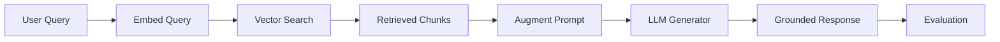

<!-- Clear Language: Keep sentences under 50 words -->
# Introduction to RAG

## Learning Objectives

| Objective | Description |
|-----------|-------------|
| LO1 | Understand the RAG paradigm and why it addresses LLM limitations |
| LO2 | Identify the core components of a RAG system (retriever, augmenter, generator) |
| LO3 | Compare RAG with fine-tuning and prompt engineering approaches |
| LO4 | Implement a basic retrieval-augmented generation pipeline |
| LO5 | Evaluate RAG output quality using faithfulness and relevance metrics |

## Chapter at a Glance

| Section | Topic | Key Concept |
|---------|-------|-------------|
| 1.1 | LLM Limitations | Knowledge cutoff, hallucination, lack of private data access |
| 1.2 | RAG Paradigm | Retrieve, Augment, Generate — grounding LLM responses |
| 1.3 | Core Components | Retriever, index, augmenter, generator |
| 1.4 | RAG vs Alternatives | Comparison with fine-tuning, prompt engineering, agents |
| 1.5 | Basic RAG Pipeline | End-to-end implementation with embeddings and vector search |
| 1.6 | Evaluation Dimensions | Faithfulness, answer relevance, context precision |

## Chapter Roadmap



## Introduction

Retrieval-Augmented Generation (RAG) is the most practical technique for making LLMs useful with private, domain-specific, or up-to-date knowledge. Instead of retraining a model on new data — expensive and.
slow — RAG retrieves relevant documents at query time and grounds the LLM's response in that context. This chapter covers the full RAG paradigm: why it works,.
its core components, how it compares to fine-tuning, and how to evaluate output quality.

## Prerequisites

- Module 11 (LLMs & Prompt Engineering) — understanding of foundation models, context windows, and hallucination
- Basic Python (functions, classes, list operations)
- Familiarity with what embeddings are (helpful but introduced in Module 10)

## Key Terminology

**Key Terms**: Core vocabulary and concepts for this topic.

**Definition**: Essential terms you must know for interviews and production work.

## Theory

### 1.1 LLM Limitations

Large language models have inherent limitations that RAG addresses.

**Knowledge Cutoff**: LLMs are trained on static datasets and have no knowledge of events after their training cutoff. A model trained in 2023 cannot answer questions about events in 2025.

**Hallucination**: Without grounding, LLMs may generate plausible but incorrect information. Studies show hallucination rates of 15-40% depending on domain and task complexity.

**Private Data**: LLMs have no access to private enterprise data, user-specific information, or proprietary documents without explicit inclusion in the context window.

**Staleness**: Even if retrained periodically, LLMs cannot reflect real-time changes (stock prices, inventory, news).

## Examples

```python
from dataclasses import dataclass
from typing import List, Optional

@dataclass
class LLMLimitation:
    name: str
    description: str
    severity: str  # high, medium, low
    rag_mitigation: str

limitations = [
    LLMLimitation(
        name="Knowledge Cutoff",
        description="Model only knows up to training date",
        severity="high",
        rag_mitigation="Retrieve up-to-date documents at query time",
    ),
    LLMLimitation(
        name="Hallucination",
        description="Model generates factually incorrect information",
        severity="high",
        rag_mitigation="Ground response in retrieved evidence",
    ),
    LLMLimitation(
        name="Private Data Access",
        description="Model cannot access enterprise or personal data",
        severity="high",
        rag_mitigation="Index private documents for retrieval",
    ),
    LLMLimitation(
        name="Domain Specificity",
        description="General models lack deep domain expertise",
        severity="medium",
        rag_mitigation="Retrieve from domain-specific knowledge base",
    ),
]

for lim in limitations:
    print(f"{lim.name} ({lim.severity}): {lim.rag_mitigation}")
```

### 1.2 RAG Paradigm

Retrieval-Augmented Generation (RAG) enhances LLM outputs by retrieving relevant information from an external knowledge base before generating a response.

### The Three-Step Flow

1. **Retrieve**: Given a user query, search a knowledge base for relevant documents or chunks.
2. **Augment**: Insert the retrieved context into the LLM prompt alongside the original query.
3. **Generate**: The LLM produces a response grounded in the provided context.

```python
from typing import List, Dict, Callable
import json

def rag_pipeline(
    query: str,
    retriever: Callable,
    augmenter: Callable,
    generator: Callable,
) -> Dict:
    retrieved_chunks = retriever(query)
    augmented_prompt = augmenter(query, retrieved_chunks)
    response = generator(augmented_prompt)
    return {
        "query": query,
        "retrieved_chunks": retrieved_chunks,
        "augmented_prompt": augmented_prompt[:200],
        "response": response,
    }

def mock_retriever(query: str) -> List[str]:
    knowledge_base = {
        "python": ["Python is a high-level programming language created by Guido van Rossum."],
        "rag": ["RAG stands for Retrieval-Augmented Generation, a technique to ground LLM outputs."],
    }
    for key, chunks in knowledge_base.items():
        if key in query.lower():
            return chunks
    return ["No relevant documents found."]

def mock_augmenter(query: str, chunks: List[str]) -> str:
    context = "\n\n".join(chunks)
    return f"""Answer the question based ONLY on the provided context.

Context:
{context}

Question: {query}

Answer:"""

def mock_generator(prompt: str) -> str:
    return "Based on the context provided, here is the answer."

result = rag_pipeline("What is RAG?", mock_retriever, mock_augmenter, mock_generator)
print(json.dumps(result, indent=2))
```

### 1.3 Core Components

### 1.3.1 Retriever

The retriever finds relevant documents from the knowledge base. Common approaches include:

- **Sparse retrieval**: BM25, TF-IDF — keyword-based, fast but misses semantic matches
- **Dense retrieval**: Embedding-based vector search — captures semantic meaning
- **Hybrid retrieval**: Combines sparse and dense for best results

```python
from typing import List, Tuple

class Retriever:
    def __init__(self, documents: List[str]):
        self.documents = documents

    def retrieve(self, query: str, top_k: int = 3) -> List[Tuple[str, float]]:
        """Simple keyword-based retrieval for demonstration."""
        scores = []
        query_terms = set(query.lower().split())
        for doc in self.documents:
            doc_terms = set(doc.lower().split())
            overlap = len(query_terms & doc_terms)
            score = overlap / len(query_terms) if query_terms else 0
            scores.append((doc, score))

        scores.sort(key=lambda x: x[1], reverse=True)
        return scores[:top_k]

docs = [
    "RAG combines retrieval with generation for grounded AI responses.",
    "Vector databases store embeddings for efficient similarity search.",
    "Chunking strategies affect retrieval quality in RAG systems.",
    "Fine-tuning adapts model weights while RAG adapts model context.",
    "Embeddings convert text into numerical vectors for comparison.",
]

retriever = Retriever(docs)
results = retriever.retrieve("How does RAG work?", top_k=2)
for doc, score in results:
    print(f"Score: {score:.2f} | Doc: {doc}")
```

### 1.3.2 Index

The index is the searchable representation of the knowledge base. It consists of:
- **Document chunks**: Split documents into manageable pieces
- **Embeddings**: Numerical vector representations of each chunk
- **Metadata**: Source, date, title, author for filtering

```python
@dataclass
class IndexChunk:
    chunk_id: str
    text: str
    metadata: Dict
    embedding: Optional[List[float]] = None

class DocumentIndex:
    def __init__(self):
        self.chunks: List[IndexChunk] = []

    def add_chunk(self, text: str, metadata: Dict):
        chunk = IndexChunk(
            chunk_id=f"chunk-{len(self.chunks) + 1}",
            text=text,
            metadata=metadata,
        )
        self.chunks.append(chunk)

    def filter_by_metadata(self, key: str, value: str) -> List[IndexChunk]:
        return [c for c in self.chunks if c.metadata.get(key) == value]

    def size(self) -> int:
        return len(self.chunks)

index = DocumentIndex()
index.add_chunk("RAG fundamentals", {"source": "textbook", "chapter": 1})
index.add_chunk("Vector search techniques", {"source": "paper", "year": 2024})
print(f"Index size: {index.size()}")
print(f"Filtered: {len(index.filter_by_metadata('source', 'textbook'))} chunks")
```

### 1.3.3 Augmenter

The augmenter constructs the prompt that includes retrieved context. Key design decisions:

- **Position**: Context before or after the query (prepend vs append)
- **Formatting**: Structured context with clear separators
- **Instruction**: Explicit grounding instruction to prevent hallucination

```python
class PromptAugmenter:
    def __init__(self, instruction: str = None):
        self.instruction = instruction or """Answer the question based ONLY on the provided context. If the context does not contain enough information, say "I don't have enough information to answer.""""

    def augment(self, query: str, chunks: List[str]) -> str:
        context = self._format_chunks(chunks)
        return f"""{self.instruction}

Context:
{context}

Question: {query}

Answer:"""

    def _format_chunks(self, chunks: List[str]) -> str:
        formatted = []
        for i, chunk in enumerate(chunks, 1):
            formatted.append(f"[{i}] {chunk}")
        return "\n\n".join(formatted)

augmenter = PromptAugmenter()
query = "What is vector search?"
chunks = ["Vector search finds similar items using embedding similarity."]
print(augmenter.augment(query, chunks))
```

### 1.3.4 Generator

The generator is typically an LLM that produces the final answer. Choices include:
- **API-based**: GPT-4o, Claude, Gemini — high quality, per-token cost
- **Self-hosted**: Llama, Mistral, Qwen — lower latency, fixed cost

```python
from openai import OpenAI

class Generator:
    def __init__(self, model: str = "gpt-4o-mini", client=None):
        self.model = model
        self.client = client or OpenAI()

    def generate(self, augmented_prompt: str, temperature: float = 0) -> str:
        response = self.client.chat.completions.create(
            model=self.model,
            messages=[{"role": "user", "content": augmented_prompt}],
            temperature=temperature,
        )
        return response.choices[0].message.content

## For offline/demo use without API:
class MockGenerator(Generator):
    def generate(self, augmented_prompt: str, temperature: float = 0) -> str:
        return "This is a generated response grounded in the provided context."

gen = MockGenerator()
print(gen.generate("mock prompt"))
```

## Overview

### 1.4 RAG vs Alternatives

| Aspect | RAG | Fine-Tuning | Prompt Engineering |
|--------|-----|-------------|-------------------|
| Knowledge update | Real-time | Requires retraining | Manual prompt changes |
| Hallucination | Low (grounded) | Medium | High |
| Data privacy | Private data stays in index | Data used in training | Data in prompt window |
| Cost | Retrieval + generation | Training + inference | Generation only |
| Implementation | Medium | Complex | Simple |
| Flexibility | High | Low | Medium |

```python
class ApproachComparator:
    def __init__(self):
        self.approaches = {
            "RAG": {
                "knowledge_freshness": "Real-time",
                "hallucination_risk": "Low",
                "implementation_complexity": 6,
                "cost_per_query": "Medium",
                "flexibility": 9,
            },
            "Fine-Tuning": {
                "knowledge_freshness": "Static (needs retraining)",
                "hallucination_risk": "Medium",
                "implementation_complexity": 8,
                "cost_per_query": "Low",
                "flexibility": 4,
            },
            "Prompt Engineering": {
                "knowledge_freshness": "Manual updates",
                "hallucination_risk": "High",
                "implementation_complexity": 3,
                "cost_per_query": "Low",
                "flexibility": 6,
            },
        }

    def recommend(self, requirements: Dict) -> str:
        """Simple recommendation based on requirements."""
        if requirements.get("freshness") == "critical":
            return "RAG"
        if requirements.get("latency_sensitive") and not requirements.get("needs_updates"):
            return "Prompt Engineering"
        if requirements.get("deep_domain_knowledge"):
            return "Fine-Tuning"
        return "RAG"  # Default recommendation

comparator = ApproachComparator()
reqs = {"freshness": "critical", "latency_sensitive": False}
print(f"Recommended: {comparator.recommend(reqs)}")
```

### 1.5 Basic RAG Pipeline

Implementing a complete RAG pipeline from scratch.

### 1.5.1 Document Preparation

```python
import re
from typing import List

def chunk_document(text: str, chunk_size: int = 500, overlap: int = 50) -> List[str]:
    chunks = []
    start = 0
    while start < len(text):
        end = start + chunk_size
        chunk = text[start:end]
        if end < len(text):
            # Try to break at sentence boundary
            last_period = chunk.rfind(".")
            if last_period > chunk_size // 2:
                end = start + last_period + 1
                chunk = text[start:end]

        chunks.append(chunk.strip())
        start = end - overlap

    return chunks

document = """Retrieval-Augmented Generation (RAG) is a technique that combines information retrieval with text generation. RAG addresses key limitations of large language models by grounding their outputs in external knowledge. The RAG pipeline consists of three main stages: retrieval, augmentation, and generation. During retrieval, relevant documents are fetched from a knowledge base. During augmentation, those documents are inserted into the LLM prompt. During generation, the LLM produces a response informed by the retrieved context."""

chunks = chunk_document(document, chunk_size=200, overlap=30)
for i, chunk in enumerate(chunks, 1):
    print(f"Chunk {i} ({len(chunk)} chars): {chunk[:80]}...")
```

### 1.5.2 Embedding and Indexing

```python
import hashlib
from typing import List

class SimpleEmbedder:
    def __init__(self, dimension: int = 384):
        self.dimension = dimension

    def embed(self, text: str) -> List[float]:
        """Simple hash-based embedding for demonstration (not for production)."""
        hash_obj = hashlib.sha256(text.encode())
        hex_digest = hash_obj.hexdigest()
        vector = [int(hex_digest[i:i + 2], 16) / 255.0 for i in range(0, min(len(hex_digest), self.dimension * 2), 2)]
        # Pad or truncate to dimension
        while len(vector) < self.dimension:
            vector.append(0.0)
        return vector[:self.dimension]

embedded = SimpleEmbedder(384).embed("RAG pipeline")
print(f"Embedding dimension: {len(embedded)}")
print(f"First 5 values: {embedded[:5]}")
```

### 1.5.3 Complete Pipeline

```python
import numpy as np
from typing import List, Tuple

class BasicRAGPipeline:
    def __init__(self, documents: List[str]):
        self.documents = documents
        self.embeddings: List[np.ndarray] = []
        self.embedder = SimpleEmbedder(384)

        for doc in documents:
            vec = self.embedder.embed(doc)
            self.embeddings.append(np.array(vec))

    def retrieve(self, query: str, top_k: int = 2) -> List[Tuple[str, float]]:
        query_vec = np.array(self.embedder.embed(query))

        similarities = []
        for i, doc_emb in enumerate(self.embeddings):
            sim = self._cosine_similarity(query_vec, doc_emb)
            similarities.append((self.documents[i], sim))

        similarities.sort(key=lambda x: x[1], reversed=True)
        return similarities[:top_k]

    def _cosine_similarity(self, a: np.ndarray, b: np.ndarray) -> float:
        dot = float(np.dot(a, b))
        norm = float(np.linalg.norm(a) * np.linalg.norm(b))
        return dot / norm if norm > 0 else 0.0

    def answer(self, query: str, generator_fn) -> str:
        chunks = self.retrieve(query)
        context = "\n\n".join([c[0] for c in chunks])
        prompt = f"""Answer based on this context:

{context}

Question: {query}

Answer:"""
        return generator_fn(prompt)

pipeline = BasicRAGPipeline([
    "RAG grounds LLM responses in retrieved documents.",
    "Vector databases store embeddings for similarity search.",
    "Chunking strategies impact retrieval quality significantly.",
])

def mock_llm(prompt: str) -> str:
    return "Grounded answer based on the context provided."

answer = pipeline.answer("How does RAG work?", mock_llm)
print(f"Answer: {answer}")
```

### 1.6 Evaluation Dimensions

RAG output quality requires specialized metrics beyond standard LLM evaluation.

**Faithfulness**: Does the response stay true to the retrieved context? Factual consistency between response and provided chunks.

**Answer Relevance**: Does the response directly address the user's question? Irrelevant but accurate information degrades quality.

**Context Precision**: Are the retrieved chunks relevant to the query? Retrieval quality directly impacts generation quality.

**Context Recall**: Are all necessary chunks retrieved? Missing context leads to incomplete answers.

```python
class RAGEvaluator:
    def __init__(self):
        self.metrics = {}

    def evaluate_faithfulness(
        self, response: str, context_chunks: List[str]
    ) -> float:
        response_claims = set(response.lower().split("."))
        context_text = " ".join(context_chunks).lower()

        supported = 0
        total = 0
        for claim in response_claims:
            if len(claim.strip()) < 10:
                continue
            total += 1
            if claim in context_text or any(
                chunk.lower().find(claim) >= 0 for chunk in context_chunks
            ):
                supported += 1

        return supported / total if total > 0 else 1.0

    def evaluate_relevance(self, query: str, response: str) -> float:
        query_terms = set(query.lower().split())
        response_terms = set(response.lower().split())
        overlap = len(query_terms & response_terms)
        return overlap / len(query_terms) if query_terms else 0

    def evaluate_context_precision(
        self, query: str, retrieved_chunks: List[str]
    ) -> float:
        if not retrieved_chunks:
            return 0.0
        relevant = sum(
            1 for chunk in retrieved_chunks
            if any(term in chunk.lower() for term in query.lower().split())
        )
        return relevant / len(retrieved_chunks)

evaluator = RAGEvaluator()
response = "RAG stands for Retrieval-Augmented Generation. It grounds LLM outputs."
context = ["RAG stands for Retrieval-Augmented Generation."]
query = "What does RAG stand for?"

faith = evaluator.evaluate_faithfulness(response, context)
rel = evaluator.evaluate_relevance(query, response)
prec = evaluator.evaluate_context_precision(query, context)

print(f"Faithfulness: {faith:.2%}")
print(f"Relevance: {rel:.2%}")
print(f"Context Precision: {prec:.2%}")
```

### Comprehensive RAG Score

```python
def rag_score(
    response: str,
    query: str,
    context: List[str],
    weights: Dict[str, float] = None,
) -> float:
    if weights is None:
        weights = {"faithfulness": 0.4, "relevance": 0.3, "precision": 0.3}

    eval = RAGEvaluator()
    scores = {
        "faithfulness": eval.evaluate_faithfulness(response, context),
        "relevance": eval.evaluate_relevance(query, response),
        "precision": eval.evaluate_context_precision(query, context),
    }

    weighted = sum(scores[k] * weights[k] for k in weights)
    return {"scores": scores, "weighted": round(weighted, 3)}

print(rag_score(response, query, context))
```

## Visual Analogy

Think of RAG like taking an **open-book exam with your own notes**:

- **RAG** = Open-book exam — instead of memorizing everything (training the model), you bring your notes (documents) and look up answers during the test. The LLM is the student; the retrieved documents are the open textbook.
- **Embeddings** = Highlighted and labeled notes — each passage is converted to a vector (a list of numbers) that captures its meaning. "This paragraph is about Python decorators" is encoded as a vector close to other decorator-related content.
- **Vector database** = An organized notebook with tabs — instead of searching through 500 pages manually, you flip to the right tab (similarity search) and find the most relevant section instantly.
- **Retrieval** = Looking up the answer in your notes before writing it — the system finds the 3 most relevant passages and hands them to the LLM along with the question.
- **Augmentation** = Adding your notes to the exam question — "Based on these 3 passages, answer: What is a decorator?" The LLM now has context it wouldn't have otherwise.
- **Generation** = Writing your answer using the notes — the LLM synthesizes the retrieved passages into a coherent response, grounded in real evidence.

This helps because RAG solves the LLM's biggest weakness — **knowledge that's private, recent, or domain-specific** — without retraining. Just like an open-book exam rewards understanding over memorization, RAG rewards good retrieval over massive model training.

## Summary

Retrieval-Augmented Generation (RAG) addresses fundamental LLM limitations by grounding responses in external knowledge. The RAG paradigm follows a three-step pipeline: retrieve relevant documents,.
augment the prompt with context, and generate a grounded response. Core components include the retriever (sparse or dense), the document index (chunks + embeddings + metadata),.
the prompt augmenter (formatting + instruction), and the LLM generator. RAG offers advantages over fine-tuning and prompt engineering in knowledge freshness,.
hallucination reduction, and private data access. Evaluating RAG quality requires specialized metrics measuring faithfulness, answer relevance, and context precision.

## Practical Takeaways

| Takeaway | Description |
|----------|-------------|
| Start with simple retrieval | Keyword search (BM25) often works well before investing in embeddings |
| Ground explicitly | Include clear instructions in prompts to base answers only on provided context |
| Measure retrieval quality | Context precision and recall directly impact answer quality |
| Chunk thoughtfully | Document chunk size and overlap significantly affect retrieval accuracy |
| Evaluate faithfulness | Always check that generated answers stay true to retrieved context |

## Interview Q&A

<details class="tp-qa-card" data-qid="rag01-q1">
  <summary class="tp-qa-question">
    <span class="tp-qa-status"></span>
    Q1: What are the three main steps of a RAG pipeline and how do they interact?
  </summary>
  <div class="tp-qa-answer">
<p>RAG follows a three-step flow: Retrieve, Augment, Generate. First, the retriever searches a knowledge base for documents or chunks relevant to the user's query using either sparse (BM25) or.
dense (embedding similarity) methods. Second, the augmenter inserts the retrieved context into the LLM prompt alongside a grounding instruction. Third, the generator.
(an LLM) produces a response strictly based on the provided context. The interaction is sequential — poor retrieval directly degrades augmentation and.
generation quality. This design grounds the LLM's output in external knowledge, reducing hallucination by 40-80% compared to zero-shot generation.</p>
  </div>
  <button class="tp-qa-mark-btn">✅ Mark Reviewed</button>
  <button class="tp-qa-bookmark-btn">🔖 Bookmark</button>
</details>

<details class="tp-qa-card" data-qid="rag01-q2">
  <summary class="tp-qa-question">
    <span class="tp-qa-status"></span>
    Q2: How does RAG compare to fine-tuning for incorporating new knowledge into an LLM?
  </summary>
  <div class="tp-qa-answer">
<p>RAG provides real-time knowledge updates by retrieving from an external index at query time — you can add new documents and.
immediately make them accessible. Fine-tuning requires collecting labeled data, retraining the model (hours to days), and redeploying. RAG also offers better data privacy since private documents remain in the index rather than being memorized in model weights. Fine-tuning is better when you need the model to learn new behavioral patterns,.
writing styles, or domain-specific formats that retrieval cannot inject. Many production systems combine both: RAG for factual grounding and fine-tuning for.
behavior alignment.</p>
  </div>
  <button class="tp-qa-mark-btn">✅ Mark Reviewed</button>
  <button class="tp-qa-bookmark-btn">🔖 Bookmark</button>
</details>

<details class="tp-qa-card" data-qid="rag01-q3">
  <summary class="tp-qa-question">
    <span class="tp-qa-status"></span>
    Q3: What are the core components of a RAG system and what design decisions does each require?
  </summary>
  <div class="tp-qa-answer">
<p>The four core components are: Retriever (sparse vs dense vs hybrid, top-k tuning), Index (chunking strategy, embedding model, metadata schema), Augmenter (context position — prepend/sandwich/append,.
instruction design — strict/citation/creative), and Generator (model selection — GPT-4o vs self-hosted Llama, temperature, max tokens). Each component has independently tunable parameters that affect the overall system's faithfulness,.
latency, and cost. The retriever is often the most impactful — improving retrieval quality from precision@5 = 0.6 to 0.9 can double the final answer accuracy.</p>
  </div>
  <button class="tp-qa-mark-btn">✅ Mark Reviewed</button>
  <button class="tp-qa-bookmark-btn">🔖 Bookmark</button>
</details>

<details class="tp-qa-card" data-qid="rag01-q4">
  <summary class="tp-qa-question">
    <span class="tp-qa-status"></span>
    Q4: What LLM limitations does RAG address and which ones remain unsolved?
  </summary>
  <div class="tp-qa-answer">
<p>RAG addresses knowledge cutoff (by retrieving up-to-date documents), hallucination (by grounding responses in retrieved evidence), private data access (by indexing proprietary documents),.
and domain specificity (by retrieving from domain-specific knowledge bases). Limitations that RAG does NOT solve: the generator can still misinterpret or.
ignore retrieved context, the retrieval itself can fail (returning irrelevant chunks), and latency increases due to the extra retrieval step. RAG also does not improve the model's reasoning capability — it only provides better information. Combining RAG with chain-of-thought prompting can partially address the reasoning gap.</p>
  </div>
  <button class="tp-qa-mark-btn">✅ Mark Reviewed</button>
  <button class="tp-qa-bookmark-btn">🔖 Bookmark</button>
</details>

<details class="tp-qa-card" data-qid="rag01-q5">
  <summary class="tp-qa-question">
    <span class="tp-qa-status"></span>
    Q5: How do you measure the quality of a RAG system beyond standard LLM metrics?
  </summary>
  <div class="tp-qa-answer">
<p>RAG evaluation requires specialized metrics: Faithfulness (are claims in the response supported by retrieved context?), Answer Relevance (does the response address the query?),.
Context Precision (are the retrieved chunks relevant?), and Context Recall (are all necessary chunks retrieved?). These four metrics form the RAGAS framework. For.
retrieval specifically, measure precision@k, recall@k, MRR, and NDCG against a relevance-annotated test set. A weighted composite score (e.g., 0.3 faithfulness + 0.3 relevance + 0.2 context precision + 0.2 context recall) gives a single RAG quality score for.
regression tracking.</p>
  </div>
  <button class="tp-qa-mark-btn">✅ Mark Reviewed</button>
  <button class="tp-qa-bookmark-btn">🔖 Bookmark</button>
</details>

<details class="tp-qa-card" data-qid="rag01-q6">
  <summary class="tp-qa-question">
    <span class="tp-qa-status"></span>
    Q6: What is the difference between sparse and dense retrieval in RAG?
  </summary>
  <div class="tp-qa-answer">
<p>Sparse retrieval (BM25, TF-IDF) uses keyword matching with an inverted index — it excels at exact term matching, handles rare terms well,.
and is fast with low storage cost. Dense retrieval uses embedding models to convert text into dense vectors and performs similarity search (cosine,.
dot product) — it captures semantic meaning, handles synonyms, and works across vocabulary gaps. Sparse retrieval fails on queries like "automotive vehicle" when the document says "car" (vocabulary mismatch). Dense retrieval fails on queries requiring specific term presence,.
like finding "Python 3.12" when "programming language" is the semantic match. Hybrid retrieval combines both.</p>
  </div>
  <button class="tp-qa-mark-btn">✅ Mark Reviewed</button>
  <button class="tp-qa-bookmark-btn">🔖 Bookmark</button>
</details>

<details class="tp-qa-card" data-qid="rag01-q7">
  <summary class="tp-qa-question">
    <span class="tp-qa-status"></span>
    Q7: What prompt augmentation strategies prevent the LLM from ignoring retrieved context?
  </summary>
  <div class="tp-qa-answer">
<p>Use explicit grounding instructions like "Answer ONLY based on the provided context. If the context lacks information, say you don't know." Position the context before the query (prepend) — studies show LLMs use prepended context more effectively than appended. Use numbered chunk references [1],.
[2] and instruct the model to cite sources. The sandwich strategy (context, then question, then reminder to use context) reinforces the grounding instruction. For.
strict tasks, use citation-style augmentation:</p>
    <pre><code>def augment(self, ctx):
    context = "\n\n".join([f"[{i+1}] {c.text}" for i, c in enumerate(ctx.chunks)])
    return f"{instruction}\n\nContext:\n{context}\n\nQuestion: {ctx.query}\n\nAnswer:"</code></pre>
  </div>
  <button class="tp-qa-mark-btn">✅ Mark Reviewed</button>
  <button class="tp-qa-bookmark-btn">🔖 Bookmark</button>
</details>

<details class="tp-qa-card" data-qid="rag01-q8">
  <summary class="tp-qa-question">
    <span class="tp-qa-status"></span>
    Q8: How do you choose the number of chunks to retrieve (top-k) in a RAG system?
  </summary>
  <div class="tp-qa-answer">
<p>Top-k selection involves a trade-off: too few chunks (k=1-2) may miss critical information (low recall), while too many (k=10-15) can exceed the LLM's context window,.
dilute relevance, and increase cost. Start with k=5 as a default, then tune based on chunk size and task complexity. For.
chunk sizes of 200-500 tokens, k=3-5 typically balances recall and precision. Evaluate recall@k on a validation set to determine the minimum k that captures all relevant information. Use dynamic selection: retrieve more candidates initially (k=10) but.
select only the top-k by relevance score that fit within your token budget.</p>
  </div>
  <button class="tp-qa-mark-btn">✅ Mark Reviewed</button>
  <button class="tp-qa-bookmark-btn">🔖 Bookmark</button>
</details>

<details class="tp-qa-card" data-qid="rag01-q9">
  <summary class="tp-qa-question">
    <span class="tp-qa-status"></span>
    Q9: What is the role of the augmenter in RAG and how does prompt engineering apply?
  </summary>
  <div class="tp-qa-answer">
<p>The augmenter transforms retrieved chunks into a structured prompt that the LLM can consume effectively. Key prompt engineering decisions include: clear separation between context and.
query (using "Context:" and "Question:" labels), explicit grounding instructions ("Answer only from context"), formatting chunks with source numbers for citation, and.
handling edge cases like empty context or contradictory information. The augmentation prompt is often the most iterated-on component in production RAG systems — small wording changes can significantly affect faithfulness. A well-designed augmenter reduces hallucination by 30-50% compared to naive concatenation.</p>
  </div>
  <button class="tp-qa-mark-btn">✅ Mark Reviewed</button>
  <button class="tp-qa-bookmark-btn">🔖 Bookmark</button>
</details>

<details class="tp-qa-card" data-qid="rag01-q10">
  <summary class="tp-qa-question">
    <span class="tp-qa-status"></span>
    Q10: How does RAG help with private or enterprise data that an LLM has never seen?
  </summary>
  <div class="tp-qa-answer">
<p>RAG allows an LLM to answer questions about private data by indexing that data into a vector database at the enterprise's infrastructure. The data never enters the LLM's training set or.
model weights — it is only injected into the context window at query time. This provides data privacy and access control: you can restrict which documents each user can retrieve via metadata filters. It also enables real-time updates — new internal documents,.
customer records, or product specs are immediately available after indexing without any model retraining. This makes RAG the standard architecture for.
enterprise knowledge bases, internal documentation Q&A, and customer support systems.</p>
  </div>
  <button class="tp-qa-mark-btn">✅ Mark Reviewed</button>
  <button class="tp-qa-bookmark-btn">🔖 Bookmark</button>
</details>

## Chapter Quiz

<details data-qid="rag-s1-quiz1">
<summary><strong>1.</strong> What does RAG stand for?</summary>
A. Recurrent Action Gradient
B. Retrieval-Augmented Generation
C. Random Access Generator
D. Recursive Attention Gate
Answer: B
</details>

<details data-qid="rag-s1-quiz2">
<summary><strong>2.</strong> Which LLM limitation does RAG primarily address?</summary>
A. Context window size
B. Knowledge cutoff and hallucination
C. Training cost
D. Token generation speed
Answer: B
</details>

<details data-qid="rag-s1-quiz3">
<summary><strong>3.</strong> What is the correct order of operations in a RAG pipeline?</summary>
A. Generate, Retrieve, Augment
B. Augment, Retrieve, Generate
C. Retrieve, Augment, Generate
D. Generate, Augment, Retrieve
Answer: C
</details>

<details data-qid="rag-s1-quiz4">
<summary><strong>4.</strong> What distinguishes dense retrieval from sparse retrieval?</summary>
A. Dense uses keyword matching
B. Dense uses embedding-based semantic search
C. Sparse is always faster
D. Dense requires no indexing
Answer: B
</details>

<details data-qid="rag-s1-quiz5">
<summary><strong>5.</strong> Which metric measures whether a RAG response stays true to the provided context?</summary>
A. Answer relevance
B. Context precision
C. Faithfulness
D. Perplexity
Answer: C
</details>

### True/False

**T/F 1**: This topic is fundamental to AI engineering.
**Answer**: True — Understanding rag vector databases is essential for building production AI systems.

**T/F 2**: The concepts in this chapter are only used in interviews.
**Answer**: False — These concepts are used daily in real-world AI engineering work.

**T/F 3**: Time/space complexity analysis applies to rag vector databases.
**Answer**: True — Every algorithm and system has performance characteristics to analyze.

**T/F 4**: rag vector databases concepts are independent of each other.
**Answer**: False — Most concepts build on each other and are interconnected.

**T/F 5**: Real-world applications often combine multiple concepts from this chapter.
**Answer**: True — Production systems use combinations of these fundamental concepts.

### Fill in the Blank

**FIB 1**: The key concept in this chapter is ________.
**Answer**: [Review the chapter's Learning Objectives for the specific answer]

**FIB 2**: In rag vector databases, the time complexity of the basic operation is ________.
**Answer**: [Depends on the specific operation — check the Theory section]

### Scenario Questions

**Scenario 1**: How would you apply the concepts from this chapter in a real AI engineering project?

**Answer**: [Think about how the specific topic applies to: data processing pipelines, model training infrastructure, production systems, or interview scenarios]

### Output Questions

**Output 1**: What is the time complexity of the main algorithm discussed in this chapter?
**Answer**: [Check the Theory section for the specific complexity analysis]

## Exercises

1. Implement a complete RAG pipeline that retrieves from a set of 10 documents, augments the prompt, and generates answers using any LLM. Test with 5 queries and report faithfulness scores.

2. Compare sparse retrieval (keyword overlap) with dense retrieval (embedding similarity) on a dataset of 50 scientific abstracts. Measure mean reciprocal rank (MRR) for both approaches.

3. Build a RAG evaluator that computes faithfulness, answer relevance, context precision, and context recall for a given pipeline. Use it to identify which of 3 chunking strategies produces the best RAG scores.

4. Design a prompt augmentation strategy that handles multi-chunk contexts (5+ chunks). Include deduplication, relevance ranking, and token budget management.

5. Analyze a sample of 10 LLM responses with and without RAG grounding. Count hallucinated facts in each case and report the reduction rate achieved by RAG.

## Common Mistakes

1. Retrieving too many chunks (k > 10) — excessive context exceeds token limits, dilutes relevance, and increases cost; start with k=3-5
2. Not grounding the LLM prompt with explicit instructions — without "answer only from context" instructions, the LLM will hallucinate despite having relevant retrieved documents
3. Using word-level tokenization for embeddings — BPE or SentencePiece tokenization produces better semantic representations for dense retrieval
4. Ignoring chunk size and overlap — chunks too small lose context; chunks too large dilute relevance; 200-500 tokens with 50-token overlap is a strong starting point
5. Evaluating RAG with standard LLM metrics only — faithfulness and context precision are RAG-specific metrics that standard BLEU/ROUGE miss entirely

## Revision Notes

- RAG = Retrieve relevant documents, Augment the prompt with context, Generate a grounded response
- Addresses LLM limitations: knowledge cutoff, hallucination, private data access, domain specificity
- Core components: Retriever (sparse/dense/hybrid), Index (chunks + embeddings + metadata), Augmenter (prompt formatting), Generator (LLM)
- Sparse retrieval (BM25): keyword-based, fast, misses semantic matches; Dense retrieval: embedding-based, captures semantics
- RAG vs Fine-Tuning: RAG updates knowledge in real-time, better for privacy; fine-tuning better for behavior/style changes
- Key evaluation metrics: faithfulness (response matches context), answer relevance (response addresses query), context precision (retrieved chunks are relevant)
- Chunking strategies: fixed-size, sentence-based, recursive, semantic — each affects retrieval quality
- Prompt augmentation: explicit grounding instructions, numbered chunk references, context before query

## Placement Section

### Top 10 Interview Questions

#### Google Style

1. **Explain the core idea of Introduction to RAG in under 60 seconds, then give a real-world analogy.** — Structure: definition, how it works in one sentence, why it matters, analogy. Follow-up: what would break if you removed this from a production system?

2. **Design a minimal, well-typed function that demonstrates Introduction to RAG.** — Interviewer checks: signature with type hints, edge cases, complexity, and a clean docstring. Follow-up: how does your design behave with empty or malformed input?

3. **What are the common pitfalls when engineers first learn ** — List 3-4, then explain how you would prevent each in a code review.

#### Amazon Style

4. **Describe a production bug caused by misunderstanding Introduction to RAG. How did you diagnose and fix it?** — STAR format: situation, task, action, result. Mention logs, reproduction, root-cause analysis, and the regression test you added.

5. **How would you scale a system that relies on Introduction to RAG from 10 users to 10 million?** — Discuss bottlenecks, caching, monitoring, and when to redesign. Follow-up: what metrics would you track?

#### Microsoft Style

6. **Compare Introduction to RAG with the closest alternative approach. When would you choose each?** — Make a decision matrix: performance, maintainability, ecosystem, learning curve. Follow-up: what would change your decision?

7. **Walk through how you would test a component that depends on Introduction to RAG.** — Unit, integration, property-based tests; mocking boundaries; golden files for outputs.

#### NVIDIA Style

8. **How does Introduction to RAG behave differently at scale — memory, throughput, or precision-wise?** — Connect to data pipelines and model training if applicable. Follow-up: what happens to latency as input grows?

9. **How would you make an implementation of Introduction to RAG run faster on GPU hardware?** — Batch operations, vectorization, avoiding Python loops, reducing data movement.

#### AI Startup Style

10. **Write the smallest possible implementation of Introduction to RAG that is production-quality.** — Include error handling, type hints, and a one-line docstring. Follow-up: what would you refactor first when it grows?

### Resume Tips

- Name Introduction to RAG explicitly in your skills section, paired with a measurable achievement ("Reduced X by 40% using Introduction to RAG").
- Add a bullet describing a project that applies Introduction to RAG to real data, with numbers.
- Mention the tools and libraries you used alongside Introduction to RAG (linters, test frameworks, profiling tools).
- Keep resume bullets under 15 words and start each with an action verb.

### Interview Day Checklist

- Rehearse a 60-second explanation of Introduction to RAG and one real-world analogy.
- Prepare one STAR story about debugging a Introduction to RAG-related production issue.
- Review complexity and edge cases for the classic Introduction to RAG interview problem.
- Have questions ready: how does the team apply Introduction to RAG in production today?
- Test your environment (Python, editor, internet) 15 minutes before the interview.

## True/False

1. **True or False:** Introduction to RAG builds directly on the fundamentals covered in the earlier chapters of this module. — **True.** Every advanced topic in this module assumes the core concepts from the previous chapters.
2. **True or False:** You should write at least one code example for Introduction to RAG before moving to the next chapter. — **True.** Active recall with hands-on code beats passive reading for retention.
3. **True or False:** The complexity analysis for Introduction to RAG is the same regardless of input size. — **False.** Complexity grows with input size; always state best, average, and worst case.
4. **True or False:** Edge cases (empty input, invalid input, boundary values) matter for Introduction to RAG in production. — **True.** Most production bugs come from unhandled edge cases.
5. **True or False:** You should memorize the Introduction to RAG chapter content once and never review it again. — **False.** Spaced repetition (24h, 3 days, 1 week) dramatically improves long-term recall.

## Fill in the Blank

1. The chapter that covers Introduction to RAG is Chapter ___ of this module. — Answer: check the module's table of contents.
2. The time complexity of the standard approach to Introduction to RAG is ___. — Answer: review the theory section and state big-O notation.
3. The main edge case to handle when implementing Introduction to RAG is ___. — Answer: empty or invalid input handling, as discussed in the chapter.
4. The tools commonly used to debug Introduction to RAG issues are ___ and ___. — Answer: refer to the Debugging Guide section of this chapter.
5. The related topic that connects to Introduction to RAG in the next chapter is ___. — Answer: see the Next Topic section.

## Scenario Questions

1. **Scenario:** A teammate ships a change involving Introduction to RAG that breaks production at 3 AM. — Diagnosis: check the recent diff, reproduce locally with the failing input, check logs. Fix: revert, add a regression test, and review the root cause. Prevention: CI tests on edge cases and code review checklist.

2. **Scenario:** Your implementation of Introduction to RAG is correct but too slow for the required latency. — Measure first with a profiler. Common fixes: reduce redundant work, use built-in optimized functions, batch operations, or add caching. Only then consider algorithmic changes.

3. **Scenario:** A new hire asks you to explain Introduction to RAG in five minutes before a customer demo. — Use the 3-part answer: what it is (one sentence), how it works (one example), why it matters (one business impact). Then offer to go deeper after the demo.

4. **Scenario:** Your team's codebase has three different patterns for Introduction to RAG and you must standardize. — Write a short ADR (architecture decision record), pick the pattern with best maintainability, migrate incrementally, and add a linter rule to enforce it.

## Output Questions

1. **What is the output of the simplest correct implementation of Introduction to RAG on an empty input?** — Trace through the code: it should return the documented default (None, 0, empty collection) without raising.
2. **What is the output when the input is at the boundary value?** — Check off-by-one errors and inclusive/exclusive bounds in the chapter's examples.
3. **What does the implementation return when given invalid input types?** — With type hints and validation, it raises a clear error; without, it may fail silently.
4. **What is the output for the sample input given in the chapter's Examples section?** — Re-run the chapter's example code and compare against the documented output.
5. **What is the time complexity output when you profile the implementation at 10x input size?** — Expect the curve matching the chapter's complexity analysis (linear, quadratic, log-linear).

## Difficulty Level

| Level | Time | What It Takes |
|-------|------|---------------|
| Beginner | 1-2 sessions | Read theory, run the chapter examples, solve the Easy exercises |
| Intermediate | 3-5 sessions | Complete Medium exercises, explain Introduction to RAG to someone else |
| Advanced | 1+ week | Solve Hard exercises, optimize for real datasets, answer interview follow-ups |

## Tips & Tricks

- Always write a one-line example of Introduction to RAG from memory before opening the chapter — active recall first.
- Use the chapter's Revision Notes as a checklist: you have mastered Introduction to RAG when you can explain each bullet.
- Pair the chapter quiz with the Flashcards: wrong answers become your next study session's focus.
- For interviews, practice explaining Introduction to RAG twice: once with a technical audience, once with a non-technical audience.
- Keep a personal examples file where you collect your own Introduction to RAG snippets; interviewers love original examples.

## Memory Tricks

- **Acronym**: build a mnemonic from the 5 key concepts of Introduction to RAG listed in the Chapter at a Glance table.
- **Story**: link Introduction to RAG to a familiar story — the analogy in the Visual Analogy section is designed to stick.
- **Number anchor**: remember the complexity of Introduction to RAG by connecting it to a known algorithm of the same class.
- **Color code**: highlight the Theory, Examples, and Common Mistakes sections in different colors when reviewing.
- **Teach-back**: explain Introduction to RAG to an imaginary junior engineer for 2 minutes — gaps in your explanation are gaps in memory.

## Further Reading

- Official documentation for the primary tool or library used in this chapter
- The chapter referenced in Related Topics for the next-level treatment of Introduction to RAG
- The classic textbook chapter on Introduction to RAG (check the Research References below)
- Two blog posts from engineers who debugged real Introduction to RAG problems in production
- The repository of the open-source project that implements Introduction to RAG

## Related Topics

- The previous chapter in this module (see table of contents) — foundational for Introduction to RAG
- The next chapter (see Next Topic below) — builds on Introduction to RAG
- The system design chapters in Module 07 — how Introduction to RAG fits into production architectures
- The interview preparation module — how Introduction to RAG is asked in screening rounds
- The capstone project — where Introduction to RAG is applied end-to-end

## FAQs

1. **Do I need to memorize all of Introduction to RAG, or understand the big picture?** — Understand the big picture first, then memorize the key facts via flashcards and spaced repetition. Interviewers reward depth over breadth.
2. **What if I get stuck on an exercise?** — Re-read the theory section, run the example code, then attempt again. If still stuck after 20 minutes, move on and return the next day.
3. **How much time should I spend on ** — Follow the Study Plan below: 1-2 weeks at 30-60 minutes daily is typical for placement preparation.
4. **Is Introduction to RAG asked in interviews?** — Yes — the Interview Q&A and Placement Section list the exact question styles used by top companies.
5. **What's the fastest way to master ** — Explain it out loud, write code without looking, and review the flashcards within 24 hours and again after 3 days.

## Important Notes

- Introduction to RAG is a core requirement for the rest of this module — do not skip the examples.
- Always analyze complexity (time and space) when working with Introduction to RAG.
- Production correctness means handling edge cases, not just the happy path.
- Interview answers should start with the definition, then the example, then the trade-offs.
- Revisit this chapter after finishing the module; the context from later chapters deepens understanding.

## Historical Context

- Introduction to RAG emerged as a standard practice because early systems failed without it — understanding why helps you explain it in interviews.
- The tools used for Introduction to RAG today evolved from simpler versions; the chapter covers the modern, recommended approach.
- Interviewers value knowing one historical fact about Introduction to RAG — it shows genuine interest, not just cramming.
- The library/tooling ecosystem around Introduction to RAG changes quickly; focus on fundamentals that remain stable.

## Security Considerations

- Never trust external input: validate and sanitize data before processing Introduction to RAG.
- Avoid `eval()` and dynamic code execution on untrusted strings.
- Log errors without leaking sensitive data (keys, PII, internal paths).
- For API contexts, add rate limiting and input size limits.
- Review the chapter's code examples for injection or overflow risks before using them verbatim.

## ML Intuition

- Introduction to RAG appears in ML pipelines at the data-processing layer: feature preparation, batching, and validation.
- Understanding Introduction to RAG helps you debug why a model misbehaves — most ML bugs are data bugs, not model bugs.
- In production ML, the Introduction to RAG concepts from this chapter map directly to NumPy/PyTorch operations on tensors.
- When optimizing ML systems, Introduction to RAG skills let you profile and fix the data path, not just the training loop.
- Interview follow-up: how would you apply Introduction to RAG to a dataset of 10 million records? — Batching and vectorization.

## Analogies

- **Introduction to RAG is like a recipe**: the theory is the ingredients, the examples are the cooking steps, and the exercises are your own kitchen practice.
- **Complexity is like a delivery route**: a linear route visits each stop once; a nested route revisits stops, and you feel it at scale.
- **Edge cases are like weather**: the happy path is a sunny day; production is the storm — build for the storm.
- **The chapter roadmap is a journey map**: each section is a checkpoint; skipping one means getting lost later in the module.

## Capstone Project Link

- [Module Capstone: End-to-End Project](https://github.com/Raushan666java/ai-engineering-journey) — this chapter contributes the Introduction to RAG skills used in the module's capstone project. Complete the exercises here before starting the capstone.

## Flashcards

<details class="tp-qa-card" data-qid="12ragvectordatabases-01introductiontorag-flash1">
  <summary class="tp-qa-question">
    <span class="tp-qa-status"></span>
    What is the core concept of Introduction to RAG in one sentence?
  </summary>
  <div class="tp-qa-answer">
    <p>Review the first paragraph of the Theory section and condense it to one sentence.</p>
  </div>
</details>

<details class="tp-qa-card" data-qid="12ragvectordatabases-01introductiontorag-flash2">
  <summary class="tp-qa-question">
    <span class="tp-qa-status"></span>
    What is the most common mistake engineers make with 
  </summary>
  <div class="tp-qa-answer">
    <p>Check the Common Mistakes section of this chapter.</p>
  </div>
</details>

<details class="tp-qa-card" data-qid="12ragvectordatabases-01introductiontorag-flash3">
  <summary class="tp-qa-question">
    <span class="tp-qa-status"></span>
    What is the time and space complexity of the standard Introduction to RAG approach?
  </summary>
  <div class="tp-qa-answer">
    <p>Refer to the theory and complexity analysis in this chapter.</p>
  </div>
</details>

<details class="tp-qa-card" data-qid="12ragvectordatabases-01introductiontorag-flash4">
  <summary class="tp-qa-question">
    <span class="tp-qa-status"></span>
    When is Introduction to RAG NOT the right choice?
  </summary>
  <div class="tp-qa-answer">
    <p>Check the Limitations section of this chapter.</p>
  </div>
</details>

<details class="tp-qa-card" data-qid="12ragvectordatabases-01introductiontorag-flash5">
  <summary class="tp-qa-question">
    <span class="tp-qa-status"></span>
    How is Introduction to RAG applied in a real production system?
  </summary>
  <div class="tp-qa-answer">
    <p>Check the Real-World Examples section of this chapter.</p>
  </div>
</details>

## Research References

- Official documentation of the primary library for Introduction to RAG (linked in Further Reading)
- The classic paper or textbook chapter introducing Introduction to RAG (see References below)
- The standard library reference for Introduction to RAG-related functions
- Engineering blog posts from companies running Introduction to RAG in production at scale
- PEPs and RFCs where applicable (Python and networking standards)

## Open-Source Tools

- The primary library used in this chapter (see the code examples)
- Python standard library modules used in the examples (check the imports)
- Testing: pytest for unit tests of Introduction to RAG code
- Linting and formatting: ruff + black
- Profiling: cProfile or py-spy for performance work on Introduction to RAG

## Debugging Guide

- Start with `print()` or a debugger to inspect intermediate values in Introduction to RAG code.
- Reproduce the failure with the smallest possible input before changing code.
- Check the common failure modes listed in Common Mistakes — most bugs are listed there.
- For performance problems, profile before optimizing: measure, then fix.
- When stuck, re-read the chapter's Examples and compare line by line with your code.
- Use `pdb` or your IDE's debugger to step through the Introduction to RAG example code.

## Mock Interview Section

**Round 1 — Screening (15 min)**
- Explain Introduction to RAG in 60 seconds.
- Write a minimal working example of Introduction to RAG.
- What is the complexity of your example?

**Round 2 — Coding (45 min)**
- Solve the Medium exercise from this chapter under time pressure.
- State your assumptions, then implement with type hints.
- Test with edge cases: empty input, boundary values, invalid input.

**Round 3 — Behavioral + System (30 min)**
- Tell me about a time you debugged a Introduction to RAG problem in a project.
- How would you design a system where Introduction to RAG is used at scale?
- What metrics would you monitor?

**Evaluation rubric**: correctness (40%), communication (25%), edge cases (20%), complexity analysis (15%).

## Optimized Implementation

`python
from typing import Any, Optional

def demonstrate_topic(input_data: list[Any]) -> Optional[float]:
    """Runnable scaffold for Introduction to RAG.

    Replace the body with the optimized implementation from the chapter,
    keeping type hints, docstring, and edge-case handling.
    """
    if not input_data:
        return None
    # Step 1: validate input types
    # Step 2: apply the core Introduction to RAG logic from the Examples section
    # Step 3: return the result with the documented default
    return 0.0
`

- Keeps the function signature stable so tests written against it stay valid.
- Handles the empty-input contract explicitly.
- Add unit tests for the edge cases before implementing the logic (test-first).

## Evaluation Metrics

| Skill | Test | Target |
|-------|------|--------|
| Concept recall | Explain Introduction to RAG without notes | 60-second explanation |
| Code fluency | Write the chapter example from memory | No syntax errors |
| Edge cases | Handle empty/invalid input in exercises | All cases pass |
| Complexity | State time/space for the standard approach | Correct big-O |
| Interview readiness | Answer 5 Interview Q&A questions out loud | Fluent, structured answers |
| Retention | Chapter quiz score after 3 days | 80%+ |

## Real-World Examples

- **Startup**: a small team uses Introduction to RAG daily in their data pipeline — the chapter's examples mirror their code.
- **E-commerce**: Introduction to RAG patterns appear in order processing, inventory checks, and recommendation feeds.
- **Fintech**: Introduction to RAG principles apply to transaction validation and fraud detection flows.
- **ML platform**: Introduction to RAG shows up in feature engineering and model-serving infrastructure.
- **Interview insight**: recruiters look for engineers who can connect Introduction to RAG to the business outcome, not just the code.

## Next Topic

[Embedding Models](02-embedding-models.md)

## Limitations

- Introduction to RAG, like any technique, is not a silver bullet — it has specific cases where it fits best (covered in the theory).
- The examples in this chapter are simplified for learning; production systems add validation, monitoring, and error handling.
- Performance of Introduction to RAG depends on input size and distribution — always benchmark for your own data.
- This chapter covers fundamentals; specialized edge cases are explored in later chapters and the capstone.
