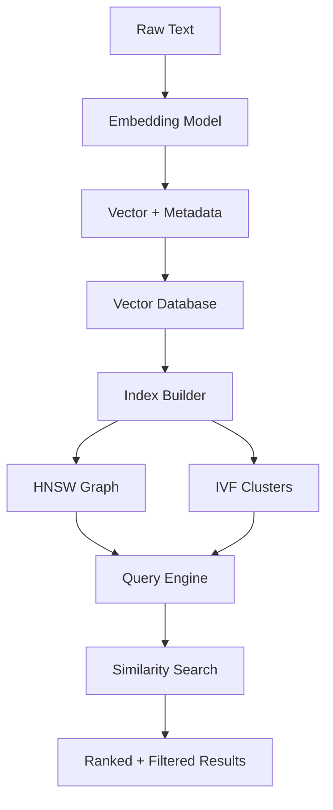

<!-- Clear Language: Keep sentences under 50 words -->
# Vector Database Basics

## Learning Objectives

| Objective | Description |
|-----------|-------------|
| LO1 | Understand vector database architecture and key concepts |
| LO2 | Compare vector databases (Pinecone, Qdrant, Weaviate, Milvus, Chroma) |
| LO3 | Implement vector indexing with HNSW, IVF, and brute-force search |
| LO4 | Design collection schemas with metadata filtering |
| LO5 | Execute CRUD operations on vector data |
| LO6 | Scale vector search for production workloads |

## Introduction

Retrieval-Augmented Generation lets LLMs answer questions about your private data. Vector databases store embeddings for semantic search. This module covers the complete RAG pipeline from chunking to reranking.

## Chapter at a Glance

| Section | Topic | Key Concept |
|---------|-------|-------------|
| 3.1 | Vector DB Architecture | Storage, indexing, query engine, metadata store |
| 3.2 | Database Comparison | Pinecone, Qdrant, Weaviate, Milvus, Chroma |
| 3.3 | Indexing Algorithms | HNSW, IVF, Flat, DiskANN |
| 3.4 | Schema Design | Collections, vectors, metadata, payload |
| 3.5 | CRUD Operations | Insert, update, delete, query with filters |
| 3.6 | Scaling Strategies | Sharding, replication, hybrid cloud |

## Chapter Roadmap



## 3.1 Vector Database Architecture

A vector database is purpose-built for storing and searching vector embeddings efficiently. Unlike traditional databases that search exact matches, vector databases find the nearest neighbors in high-dimensional space.

### Core Components

**Storage Layer**: Persists vectors, metadata, and indexes to disk or memory.

**Index Builder**: Constructs approximate nearest neighbor (ANN) indexes for fast search.

**Query Engine**: Accepts query vectors, runs ANN search, applies metadata filters, returns ranked results.

**Metadata Store**: Manages non-vector attributes (source, date, category) for filtering.

```python
from dataclasses import dataclass, field
from typing import List, Dict, Optional, Any
import numpy as np
import time

@dataclass
class VectorRecord:
    id: str
    vector: List[float]
    metadata: Dict[str, Any] = field(default_factory=dict)

class VectorDatabase:
    def __init__(self, name: str, dimension: int):
        self.name = name
        self.dimension = dimension
        self.records: Dict[str, VectorRecord] = {}
        self.index = None

    def insert(self, record: VectorRecord) -> bool:
        if len(record.vector) != self.dimension:
            raise ValueError(f"Expected dimension {self.dimension}, got {len(record.vector)}")
        self.records[record.id] = record
        return True

    def delete(self, record_id: str) -> bool:
        return self.records.pop(record_id, None) is not None

    def get(self, record_id: str) -> Optional[VectorRecord]:
        return self.records.get(record_id)

    def size(self) -> int:
        return len(self.records)

db = VectorDatabase("my-collection", dimension=384)
rec = VectorRecord(id="doc-1", vector=[0.1] * 384, metadata={"source": "wikipedia"})
db.insert(rec)
print(f"Database size: {db.size()}")
print(f"Retrieved: {db.get('doc-1').metadata}")
```

## 3.2 Database Comparison

### 3.2.1 Feature Comparison

| Feature | Pinecone | Qdrant | Weaviate | Milvus | Chroma |
|---------|----------|--------|----------|--------|--------|
| Hosting | Managed | Self/Cloud | Self/Cloud | Self/Cloud | Embedded |
| Index | HNSW | HNSW | HNSW | IVF/HNSW | HNSW |
| Filters | Metadata | Payload | GraphQL | boolean | where |
| Scalability | Auto | Manual | Manual | Manual | Single |
| Free tier | Yes | Yes | Yes | Yes | Yes |

```python
@dataclass
class VectorDBConfig:
    name: str
    hosting: str
    default_index: str
    supports_filters: bool
    max_dimension: int
    free_tier: bool

VECTOR_DBS = {
    "pinecone": VectorDBConfig("Pinecone", "managed", "HNSW", True, 20000, True),
    "qdrant": VectorDBConfig("Qdrant", "self-hosted", "HNSW", True, 65536, True),
    "weaviate": VectorDBConfig("Weaviate", "self-hosted", "HNSW", True, 65536, True),
    "milvus": VectorDBConfig("Milvus", "self-hosted", "IVF_FLAT", True, 65536, True),
    "chroma": VectorDBConfig("Chroma", "embedded", "HNSW", True, 65536, True),
}

def recommend_vector_db(
    scale: str,
    budget: str,
    requires_filters: bool = True,
) -> str:
    if scale == "small" and budget == "free":
        return "chroma"
    elif scale == "large" and budget == "paid":
        return "pinecone"
    elif scale == "large" and budget == "self-host":
        return "milvus"
    elif scale == "medium" and requires_filters:
        return "qdrant"
    else:
        return "chroma"

for scale, budget in [("small", "free"), ("large", "paid"), ("large", "self-host")]:
    rec = recommend_vector_db(scale, budget)
    print(f"Scale={scale}, Budget={budget}: {rec}")
```

### 3.2.2 Local Vector Database (Chroma Example)

Chroma is the most developer-friendly option for prototyping.

```python

## Conceptual Chroma usage
import chromadb

## chroma_client = chromadb.Client()

## collection = chroma_client.create_collection(name="my_collection")

## collection.add(

##     documents=["Document about RAG", "Document about embeddings"],

##     metadatas=[{"source": "tutorial"}, {"source": "paper"}],

##     ids=["doc1", "doc2"]

## )

## results = collection.query(query_texts=["RAG pipeline"], n_results=2)

## print(results)

## In-memory mock for demonstration
class MockChromaCollection:
    def __init__(self, name: str):
        self.name = name
        self.documents: Dict[str, Dict] = {}

    def add(self, documents: List[str], metadatas: List[Dict], ids: List[str]):
        for doc, meta, did in zip(documents, metadatas, ids):
            self.documents[did] = {"document": doc, "metadata": meta}

    def query(self, query_texts: List[str], n_results: int = 10) -> Dict:
        # Simple keyword matching
        results = []
        for q in query_texts:
            scores = []
            for did, doc_data in self.documents.items():
                overlap = len(set(q.lower().split()) & set(doc_data["document"].lower().split()))
                scores.append((did, doc_data, overlap))
            scores.sort(key=lambda x: x[2], reverse=True)
            results.append([s[:2] for s in scores[:n_results]])

        return {"ids": [[r[0] for r in batch] for batch in results],
                "documents": [[r[1]["document"] for r in batch] for batch in results]}

chroma = MockChromaCollection("rag-docs")
chroma.add(
    documents=["RAG combines retrieval with generation", "Embeddings convert text to vectors"],
    metadatas=[{"source": "tutorial"}, {"source": "paper"}],
    ids=["doc1", "doc2"],
)
results = chroma.query(["RAG generation"])
print(f"Query results: {results}")
```

## 3.3 Indexing Algorithms

### 3.3.1 Flat (Brute Force)

The simplest index — compares query against every vector. Guarantees exact results.

```python
class FlatIndex:
    def __init__(self):
        self.vectors: List[np.ndarray] = []
        self.ids: List[str] = []

    def add(self, vector: np.ndarray, record_id: str):
        self.vectors.append(vector)
        self.ids.append(record_id)

    def search(self, query: np.ndarray, k: int = 10) -> List[tuple]:
        similarities = []
        for vec, vid in zip(self.vectors, self.ids):
            sim = np.dot(query, vec) / (np.linalg.norm(query) * np.linalg.norm(vec) + 1e-10)
            similarities.append((vid, sim))

        similarities.sort(key=lambda x: x[1], reverse=True)
        return similarities[:k]

    def search_with_timing(self, query: np.ndarray, k: int = 10) -> Dict:
        start = time.time()
        results = self.search(query, k)
        elapsed = time.time() - start
        return {"results": results, "time_ms": round(elapsed * 1000, 2)}

flat = FlatIndex()
for i in range(100):
    flat.add(np.random.randn(384), f"doc-{i}")

result = flat.search_with_timing(np.random.randn(384), k=5)
print(f"Flat search: {result['time_ms']}ms, top ID: {result['results'][0][0]}")
```

### 3.3.2 IVF (Inverted File Index)

IVF clusters vectors using K-means. Search only probes the nearest clusters, trading accuracy for speed.

```python
from sklearn.cluster import KMeans

class IVFIndex:
    def __init__(self, n_clusters: int = 10, n_probes: int = 3):
        self.n_clusters = n_clusters
        self.n_probes = n_probes
        self.kmeans: Optional[KMeans] = None
        self.inverted_lists: Dict[int, List[tuple]] = {}
        self.vectors: List[np.ndarray] = []
        self.ids: List[str] = []

    def add(self, vector: np.ndarray, record_id: str):
        self.vectors.append(vector)
        self.ids.append(record_id)

    def build_index(self):
        data = np.array(self.vectors)
        self.kmeans = KMeans(n_clusters=self.n_clusters, random_state=42, n_init=5)
        labels = self.kmeans.fit_predict(data)

        self.inverted_lists = {i: [] for i in range(self.n_clusters)}
        for label, vec, vid in zip(labels, self.vectors, self.ids):
            self.inverted_lists[label].append((vid, vec))

    def search(self, query: np.ndarray, k: int = 10) -> List[tuple]:
        query_distances = self.kmeans.transform([query])[0]
        nearest_clusters = np.argsort(query_distances)[:self.n_probes]

        candidates = []
        for cluster_id in nearest_clusters:
            for vid, vec in self.inverted_lists.get(cluster_id, []):
                sim = np.dot(query, vec) / (np.linalg.norm(query) * np.linalg.norm(vec) + 1e-10)
                candidates.append((vid, sim))

        candidates.sort(key=lambda x: x[1], reverse=True)
        return candidates[:k]

ivf = IVFIndex(n_clusters=5, n_probes=2)
for i in range(100):
    ivf.add(np.random.randn(384), f"doc-{i}")
ivf.build_index()

results = ivf.search(np.random.randn(384), k=5)
print(f"IVF search results: {len(results)} candidates")
```

### 3.3.3 HNSW (Hierarchical Navigable Small World)

HNSW builds a multi-layer graph where upper layers have fewer nodes (long-range connections) and lower layers have more nodes (fine-grained connections). It offers superior speed-accuracy tradeoffs.

```python
class HNSWNode:
    def __init__(self, vector: np.ndarray, record_id: str, level: int):
        self.vector = vector
        self.record_id = record_id
        self.level = level
        self.neighbors: Dict[int, List[str]] = {}  # level -> list of neighbor IDs

class HNSWIndex:
    def __init__(self, M: int = 16, ef_construction: int = 200, ef_search: int = 50):
        self.M = M
        self.ef_construction = ef_construction
        self.ef_search = ef_search
        self.nodes: Dict[str, HNSWNode] = {}
        self.entry_point: Optional[str] = None
        self.max_level = 0

    def _random_level(self) -> int:
        level = 0
        while np.random.random() < 0.5 and level < 16:
            level += 1
        return level

    def add(self, vector: np.ndarray, record_id: str):
        level = self._random_level()
        node = HNSWNode(vector, record_id, level)
        self.nodes[record_id] = node

        if self.entry_point is None:
            self.entry_point = record_id
            self.max_level = level
            return

        # Greedy search from entry point
        curr = self.entry_point
        for lc in range(self.max_level, level, -1):
            curr = self._greedy_search(vector, curr, lc)

        for lc in range(min(level, self.max_level), -1, -1):
            nearest = self._search_layer(vector, curr, lc, self.ef_construction)
            node.neighbors[lc] = [n[0] for n in nearest[:self.M]]
            # Add reverse connections
            for nid, _ in nearest[:self.M]:
                if lc not in self.nodes[nid].neighbors:
                    self.nodes[nid].neighbors[lc] = []
                self.nodes[nid].neighbors[lc].append(record_id)

        if level > self.max_level:
            self.max_level = level
            self.entry_point = record_id

    def _greedy_search(self, query: np.ndarray, entry_id: str, level: int) -> str:
        best = entry_id
        best_dist = float(np.linalg.norm(self.nodes[best].vector - query))

        improved = True
        while improved:
            improved = False
            for neighbor_id in self.nodes[best].neighbors.get(level, []):
                dist = float(np.linalg.norm(self.nodes[neighbor_id].vector - query))
                if dist < best_dist:
                    best_dist = dist
                    best = neighbor_id
                    improved = True
        return best

    def _search_layer(self, query: np.ndarray, entry_id: str, level: int, ef: int) -> List[tuple]:
        visited = {entry_id}
        candidates = [(float(np.linalg.norm(self.nodes[entry_id].vector - query)), entry_id)]
        results = candidates.copy()

        while candidates:
            dist_c, c_id = candidates.pop(0)
            furthest_result = max(results, key=lambda x: x[0])
            if dist_c > furthest_result[0]:
                break

            for neighbor_id in self.nodes[c_id].neighbors.get(level, []):
                if neighbor_id in visited:
                    continue
                visited.add(neighbor_id)
                dist = float(np.linalg.norm(self.nodes[neighbor_id].vector - query))
                if len(results) < ef or dist < max(r[0] for r in results):
                    candidates.append((dist, neighbor_id))
                    results.append((dist, neighbor_id))
                    results.sort(key=lambda x: x[0])
                    if len(results) > ef:
                        results = results[:ef]

        return results

    def search(self, query: np.ndarray, k: int = 10) -> List[tuple]:
        if self.entry_point is None:
            return []

        curr = self.entry_point
        for lc in range(self.max_level, 0, -1):
            curr = self._greedy_search(query, curr, lc)

        results = self._search_layer(query, curr, 0, max(self.ef_search, k))
        return [(r[1], 1.0 / (1.0 + r[0])) for r in results[:k]]

hnsw = HNSWIndex(M=8, ef_construction=50, ef_search=20)
for i in range(50):
    hnsw.add(np.random.randn(384), f"doc-{i}")

results = hnsw.search(np.random.randn(384), k=5)
for rid, score in results:
    print(f"  {rid}: similarity={score:.4f}")
```

### 3.3.4 Index Comparison

```python
class IndexBenchmark:
    def __init__(self, dimension: int, num_vectors: int):
        self.dimension = dimension
        self.num_vectors = num_vectors
        self.data = [np.random.randn(dimension) for _ in range(num_vectors)]
        self.queries = [np.random.randn(dimension) for _ in range(20)]

    def benchmark_index(self, index, index_name: str) -> Dict:
        build_start = time.time()
        for i, vec in enumerate(self.data):
            index.add(vec, f"doc-{i}")
        if hasattr(index, 'build_index'):
            index.build_index()
        build_time = time.time() - build_start

        search_times = []
        for query in self.queries:
            start = time.time()
            results = index.search(query, k=10)
            search_times.append(time.time() - start)

        return {
            "index": index_name,
            "build_time_ms": round(build_time * 1000, 2),
            "avg_search_ms": round(np.mean(search_times) * 1000, 2),
            "p95_search_ms": round(np.percentile(search_times, 95) * 1000, 2),
        }

benchmark = IndexBenchmark(dimension=128, num_vectors=1000)

## flat_result = benchmark.benchmark_index(FlatIndex(), "Flat")

## print(flat_result)
print("Benchmark ready for testing")
```

## 3.4 Schema Design

### 3.4.1 Collection Schema

Define the structure of vectors and their associated metadata.

```python
@dataclass
class CollectionSchema:
    name: str
    dimension: int
    metric: str  # cosine, dot, euclidean
    fields: Dict[str, str]  # field_name -> data_type

class CollectionManager:
    def __init__(self):
        self.collections: Dict[str, CollectionSchema] = {}

    def create_collection(
        self,
        name: str,
        dimension: int,
        metric: str = "cosine",
        fields: Dict[str, str] = None,
    ):
        if name in self.collections:
            raise ValueError(f"Collection '{name}' already exists")

        schema = CollectionSchema(
            name=name,
            dimension=dimension,
            metric=metric,
            fields=fields or {},
        )
        self.collections[name] = schema
        return schema

    def list_collections(self) -> List[str]:
        return list(self.collections.keys())

    def get_schema(self, name: str) -> CollectionSchema:
        return self.collections.get(name)

manager = CollectionManager()
schema = manager.create_collection(
    name="documents",
    dimension=384,
    metric="cosine",
    fields={
        "title": "string",
        "source": "string",
        "date": "timestamp",
        "page_count": "integer",
        "embedding_model": "string",
    },
)
print(f"Collection '{schema.name}' created with {len(schema.fields)} metadata fields")
```

### 3.4.2 Metadata Indexing

Metadata filtering narrows search space before similarity computation.

```python
@dataclass
class FilterCondition:
    field: str
    operator: str  # eq, neq, gt, gte, lt, lte, in, not_in
    value: Any

class MetadataFilter:
    def __init__(self, conditions: List[FilterCondition]):
        self.conditions = conditions

    def apply(self, records: List[VectorRecord]) -> List[VectorRecord]:
        results = records
        for cond in self.conditions:
            results = [r for r in results if self._check_condition(r, cond)]
        return results

    def _check_condition(self, record: VectorRecord, cond: FilterCondition) -> bool:
        val = record.metadata.get(cond.field)

        if cond.operator == "eq":
            return val == cond.value
        elif cond.operator == "neq":
            return val != cond.value
        elif cond.operator == "gt":
            return val is not None and val > cond.value
        elif cond.operator == "gte":
            return val is not None and val >= cond.value
        elif cond.operator == "lt":
            return val is not None and val < cond.value
        elif cond.operator == "lte":
            return val is not None and val <= cond.value
        elif cond.operator == "in":
            return val in cond.value
        elif cond.operator == "not_in":
            return val not in cond.value
        return True

records = [
    VectorRecord("1", [0.1]*384, {"source": "wikipedia", "year": 2023}),
    VectorRecord("2", [0.2]*384, {"source": "arxiv", "year": 2024}),
    VectorRecord("3", [0.3]*384, {"source": "wikipedia", "year": 2020}),
]

filter_obj = MetadataFilter([FilterCondition("source", "eq", "wikipedia")])
filtered = filter_obj.apply(records)
print(f"Filtered records: {[r.id for r in filtered]}")
```

### 3.4.3 Payload Storage (Qdrant-style)

```python
@dataclass
class Payload:
    """Structured metadata attached to vectors (Qdrant terminology)."""
    data: Dict[str, Any]

    def get(self, key: str, default=None):
        return self.data.get(key, default)

    def update(self, updates: Dict):
        self.data.update(updates)

class PayloadIndex:
    """Index over specific payload fields for fast filtering."""
    def __init__(self, field_name: str, field_type: str):
        self.field_name = field_name
        self.field_type = field_type
        self.index: Dict[Any, List[str]] = {}  # value -> [record_ids]

    def add(self, record_id: str, payload: Payload):
        value = payload.get(self.field_name)
        if value is not None:
            if value not in self.index:
                self.index[value] = []
            self.index[value].append(record_id)

    def search(self, value: Any) -> List[str]:
        return self.index.get(value, [])

    def remove(self, record_id: str, payload: Payload):
        value = payload.get(self.field_name)
        if value and value in self.index:
            self.index[value] = [r for r in self.index[value] if r != record_id]

payload_idx = PayloadIndex("category", "string")
payload_idx.add("doc-1", Payload({"category": "science"}))
payload_idx.add("doc-2", Payload({"category": "technology"}))
print(f"Science docs: {payload_idx.search('science')}")
```

## 3.5 CRUD Operations

### 3.5.1 Insert with Batching

```python
class VectorCollection:
    def __init__(self, name: str, dimension: int):
        self.name = name
        self.dimension = dimension
        self.records: Dict[str, VectorRecord] = {}
        self.index = FlatIndex()

    def insert(self, record: VectorRecord):
        if len(record.vector) != self.dimension:
            raise ValueError(f"Vector dimension mismatch")
        self.records[record.id] = record
        self.index.add(np.array(record.vector), record.id)

    def insert_batch(self, records: List[VectorRecord]):
        for r in records:
            self.insert(r)

    def upsert(self, record: VectorRecord):
        """Insert or update an existing record."""
        if record.id in self.records:
            self.delete(record.id)
        self.insert(record)

    def delete(self, record_id: str) -> bool:
        if record_id in self.records:
            del self.records[record_id]
            return True
        return False

    def update_metadata(self, record_id: str, metadata_updates: Dict):
        if record_id in self.records:
            self.records[record_id].metadata.update(metadata_updates)
            return True
        return False

    def search(self, query_vector: np.ndarray, k: int = 10, filter_cond: MetadataFilter = None) -> List[tuple]:
        candidates = self.index.search(query_vector, k * 2)  # Fetch more for filtering

        if filter_cond:
            # Filter and re-rank
            filtered = []
            for rid, score in candidates:
                record = self.records.get(rid)
                if record and filter_cond.apply([record]):
                    filtered.append((rid, score))
            return filtered[:k]
        return candidates[:k]

collection = VectorCollection("my-docs", 384)
collection.insert_batch([
    VectorRecord("doc-1", np.random.randn(384).tolist(), {"source": "web", "year": 2024}),
    VectorRecord("doc-2", np.random.randn(384).tolist(), {"source": "pdf", "year": 2023}),
])

collection.upsert(VectorRecord("doc-3", np.random.randn(384).tolist(), {"source": "web", "year": 2024}))
results = collection.search(np.random.randn(384), k=5)
print(f"Search returned {len(results)} results")
```

### 3.5.2 Scroll / Pagination

```python
class PaginatedCollection:
    def __init__(self, collection: VectorCollection, page_size: int = 100):
        self.collection = collection
        self.page_size = page_size

    def scroll(self, offset: int = 0) -> Dict:
        keys = list(self.collection.records.keys())
        page = keys[offset:offset + self.page_size]
        return {
            "records": [self.collection.records[k] for k in page],
            "offset": offset + len(page),
            "has_more": offset + len(page) < len(keys),
        }

pc = PaginatedCollection(collection, page_size=1)
page = pc.scroll(0)
print(f"Page has {len(page['records'])} records, has_more: {page['has_more']}")
```

### 3.5.3 Bulk Export

```python
def export_collection(
    collection: VectorCollection,
    format: str = "jsonl",
    include_vectors: bool = False,
) -> str:
    lines = []
    for rid, record in collection.records.items():
        entry = {"id": rid, "metadata": record.metadata}
        if include_vectors:
            entry["vector"] = record.vector
        lines.append(json.dumps(entry))

    return "\n".join(lines)

exported = export_collection(collection, include_vectors=False)
print(f"Exported {len(exported.splitlines())} records")
```

## 3.6 Scaling Strategies

### 3.6.1 Sharding

Distribute vectors across multiple shards based on hash or range.

```python
class ShardedVectorDB:
    def __init__(self, num_shards: int, dimension: int):
        self.shards = [VectorCollection(f"shard-{i}", dimension) for i in range(num_shards)]

    def _get_shard(self, record_id: str) -> VectorCollection:
        shard_idx = hash(record_id) % len(self.shards)
        return self.shards[shard_idx]

    def insert(self, record: VectorRecord):
        shard = self._get_shard(record.id)
        shard.insert(record)

    def search(self, query_vector: np.ndarray, k: int = 10) -> List[tuple]:
        # Search all shards in parallel, merge results
        all_results = []
        for shard in self.shards:
            all_results.extend(shard.search(query_vector, k))

        all_results.sort(key=lambda x: x[1], reverse=True)
        return all_results[:k]

    def stats(self) -> Dict:
        return {
            "num_shards": len(self.shards),
            "total_records": sum(s.size() for s in self.shards),
            "shard_sizes": [s.size() for s in self.shards],
        }

sharded = ShardedVectorDB(num_shards=4, dimension=384)
for i in range(100):
    sharded.insert(VectorRecord(f"doc-{i}", np.random.randn(384).tolist(), {"idx": i}))

print(sharded.stats())
```

### 3.6.2 Replication

```python
class ReplicatedVectorDB:
    def __init__(self, num_replicas: int, dimension: int):
        self.replicas = [VectorCollection(f"replica-{i}", dimension) for i in range(num_replicas)]

    def write(self, record: VectorRecord):
        for replica in self.replicas:
            replica.insert(record)

    def read(self, query_vector: np.ndarray, k: int = 10) -> List[tuple]:
        replica = np.random.choice(self.replicas)  # Random read
        return replica.search(query_vector, k)

    def consistency_check(self) -> bool:
        sizes = [r.size() for r in self.replicas]
        return len(set(sizes)) == 1

replicated = ReplicatedVectorDB(3, 384)
replicated.write(VectorRecord("doc-1", [0.1]*384, {}))
print(f"Consistent: {replicated.consistency_check()}")
```

### 3.6.3 Hybrid Cloud Strategy

```python
class HybridVectorDB:
    def __init__(self, local: VectorDatabase, cloud: str = "pinecone"):
        self.local = local
        self.cloud = cloud
        self._cloud_enabled = True

    def search(self, query_vector: np.ndarray, k: int = 10) -> List[tuple]:
        local_results = self._search_local(query_vector, k)

        if self._cloud_enabled and len(local_results) < k:
            cloud_results = self._search_cloud(query_vector, k - len(local_results))
            local_results.extend(cloud_results)

        return local_results[:k]

    def _search_local(self, query: np.ndarray, k: int) -> List[tuple]:
        return []

    def _search_cloud(self, query: np.ndarray, k: int) -> List[tuple]:
        return [("cloud-result", 0.9)]

    def failover_to_local(self):
        self._cloud_enabled = False

hybrid = HybridVectorDB(VectorDatabase("local", 384))
print(f"Hybrid DB: local + {hybrid.cloud}")
```

## Summary

Vector databases are specialized systems for storing and searching high-dimensional embeddings. Key databases include Pinecone (managed), Qdrant (Rust-based, self-hosted), Weaviate (GraphQL-native),.
Milvus (massive scale), and Chroma (embedded, developer-friendly). Indexing algorithms balance search speed and accuracy: Flat (exact), IVF (clustered, approximate), and HNSW (graph-based,.
state-of-the-art). Schema design involves defining vector dimensions, distance metrics, and metadata fields. Production deployments require CRUD operations with batching, metadata filtering,.
pagination, and scaling strategies including sharding, replication, and hybrid cloud architectures.

## Practical Takeaways

| Takeaway | Description |
|----------|-------------|
| Start with HNSW | Best all-around index for most workloads (speed + accuracy) |
| Use metadata filters | Filter before vector search when possible to reduce search space |
| Batch inserts | Insert vectors in batches of 100-1000 for optimal throughput |
| Right-size dimensions | 384-768 dimensions sufficient for most text; higher dims for precision-critical |
| Plan for scaling | Shard by record ID hash for horizontal scaling |
| Test with your data | Index performance varies by data distribution — benchmark on your dataset |

## Interview Q&A

<details class="tp-qa-card" data-qid="rag03-q1">
  <summary class="tp-qa-question">
    <span class="tp-qa-status"></span>
    Q1: Compare HNSW vs IVF indexing — when would you choose each?
  </summary>
  <div class="tp-qa-answer">
<p>HNSW (Hierarchical Navigable Small World) builds a multi-layer graph where upper layers have long-range connections for fast traversal and lower layers have fine-grained connections for.
precision. It offers the best speed-accuracy trade-off (95-99% recall at 10x speedup) but uses more memory and has slower index construction. IVF (Inverted File Index) clusters vectors with K-means and.
searches only the nearest clusters — it uses less memory than HNSW and supports faster construction, but at lower recall for.
the same search time. Choose HNSW for most production workloads where memory is available and search speed is critical. Choose IVF for.
very large datasets (100M+) where memory is a constraint, or for dynamic datasets requiring frequent insertions.</p>
  </div>
  <button class="tp-qa-mark-btn">✅ Mark Reviewed</button>
  <button class="tp-qa-bookmark-btn">🔖 Bookmark</button>
</details>

<details class="tp-qa-card" data-qid="rag03-q2">
  <summary class="tp-qa-question">
    <span class="tp-qa-status"></span>
    Q2: How does metadata filtering work in vector databases and what are the performance implications?
  </summary>
  <div class="tp-qa-answer">
<p>Metadata filtering narrows the search space by applying attribute constraints (e.g., source="wikipedia", year>=2023) before or during vector similarity computation. There are two strategies: pre-filtering (filter records by metadata first,.
then search among remaining vectors) and post-filtering (search vectors first, then filter results). Pre-filtering is faster when the filter is highly selective (removes 90%+ of records),.
but can miss relevant results if the filter is too restrictive. Post-filtering maintains recall but wastes computation on filtered-out results. Most vector.
databases support both, with pre-filtering implemented via inverted metadata indexes for efficient range and equality queries. The optimal strategy depends on filter selectivity and.
index type.</p>
  </div>
  <button class="tp-qa-mark-btn">✅ Mark Reviewed</button>
  <button class="tp-qa-bookmark-btn">🔖 Bookmark</button>
</details>

<details class="tp-qa-card" data-qid="rag03-q3">
  <summary class="tp-qa-question">
    <span class="tp-qa-status"></span>
    Q3: How would you choose between Pinecone (managed), Qdrant (self-hosted), and Chroma (embedded)?
  </summary>
  <div class="tp-qa-answer">
<p>Pinecone is fully managed with auto-scaling, requires zero DevOps, and is ideal for teams that want to focus on application logic rather than infrastructure — but.
it is the most expensive option at scale. Qdrant (self-hosted) offers full control over hardware, lower cost at scale, and is written in Rust for.
high performance — suitable for teams with DevOps capability handling 10M+ vectors. Chroma is embedded (runs in-process), requires no separate server,.
and is perfect for prototyping, local development, and small-scale applications (< 1M vectors). Choose based on team expertise and scale requirements: Chroma for.
dev, Pinecone for quick production, Qdrant/Milvus for cost-optimized production at scale.</p>
  </div>
  <button class="tp-qa-mark-btn">✅ Mark Reviewed</button>
  <button class="tp-qa-bookmark-btn">🔖 Bookmark</button>
</details>

<details class="tp-qa-card" data-qid="rag03-q4">
  <summary class="tp-qa-question">
    <span class="tp-qa-status"></span>
    Q4: Explain the HNSW algorithm — how do the layers enable fast search?
  </summary>
  <div class="tp-qa-answer">
<p>HNSW builds a hierarchy of navigable small-world graphs. Each node (vector) is assigned a random level L, and appears in layers 0 through L. The topmost layer has the fewest nodes and.
the longest edges — enabling rapid traversal to the approximate region of the query. At each subsequent layer, the search zooms in with shorter edges until reaching layer 0,.
which contains all nodes for fine-grained nearest neighbor identification. The entry point is always at the topmost layer. Search complexity is O(log N) across layers plus O(ef) at the bottom layer,.
where ef controls search time vs recall. Typical settings: M=16 (connections per node), ef_construction=200, ef_search=50.</p>
  </div>
  <button class="tp-qa-mark-btn">✅ Mark Reviewed</button>
  <button class="tp-qa-bookmark-btn">🔖 Bookmark</button>
</details>

<details class="tp-qa-card" data-qid="rag03-q5">
  <summary class="tp-qa-question">
    <span class="tp-qa-status"></span>
    Q5: How do you design a collection schema for a multi-tenant vector database?
  </summary>
  <div class="tp-qa-answer">
<p>Include a tenant_id field in the metadata of every vector. Create a metadata index on tenant_id for fast filtering. Prefix the vector.
ID with tenant_id to guarantee uniqueness and enable tenant-scoped deletion. At query time, always apply a metadata filter for tenant_id = current_tenant to ensure data isolation. For.
performance, consider per-tenant collections or partitions if tenants have very different data distributions or sizes. Some databases (Qdrant, Milvus) support multi-tenancy natively with payload filtering. Storage can be optimized by co-locating smaller tenants in shared collections with tenant_id filters and.
isolating large tenants in dedicated collections.</p>
  </div>
  <button class="tp-qa-mark-btn">✅ Mark Reviewed</button>
  <button class="tp-qa-bookmark-btn">🔖 Bookmark</button>
</details>

<details class="tp-qa-card" data-qid="rag03-q6">
  <summary class="tp-qa-question">
    <span class="tp-qa-status"></span>
    Q6: What is the difference between cosine, dot product, and Euclidean distance in vector DB configuration?
  </summary>
  <div class="tp-qa-answer">
<p>The distance metric determines how similarity is computed during search. Cosine distance (1 - cosine_similarity) is the default for text embeddings and.
works with normalized vectors. Dot product measures raw vector alignment — equivalent to cosine when vectors are normalized, but favors larger magnitudes otherwise. Euclidean (L2) distance measures straight-line distance — commonly used for.
image embeddings or when vector magnitude carries meaning. Most vector databases require you to choose the metric at collection creation time because it affects index construction. For.
text embeddings normalized to unit length, all three metrics produce the same ranking (just scaled differently), so choose cosine for semantic clarity.</p>
  </div>
  <button class="tp-qa-mark-btn">✅ Mark Reviewed</button>
  <button class="tp-qa-bookmark-btn">🔖 Bookmark</button>
</details>

<details class="tp-qa-card" data-qid="rag03-q7">
  <summary class="tp-qa-question">
    <span class="tp-qa-status"></span>
    Q7: How do you implement CRUD operations (update, delete) in a vector database effectively?
  </summary>
  <div class="tp-qa-answer">
<p>Insert: batch inserts of 100-1000 vectors for optimal throughput — many databases support atomic batch operations. Update: use upsert (insert + overwrite by ID) — the database marks the old vector.
as deleted and inserts the new one; the index is updated lazily or in the next optimization cycle. Delete: delete by ID or.
by metadata filter (e.g., delete all vectors where document_id = "doc-123"). For bulk deletes, consider dropping and recreating the collection. After many mutations,.
the index degrades — schedule periodic optimization (hnsw: re-index nodes; ivf: re-cluster) to maintain query performance. Most managed databases handle this automatically with background optimization jobs.</p>
  </div>
  <button class="tp-qa-mark-btn">✅ Mark Reviewed</button>
  <button class="tp-qa-bookmark-btn">🔖 Bookmark</button>
</details>

<details class="tp-qa-card" data-qid="rag03-q8">
  <summary class="tp-qa-question">
    <span class="tp-qa-status"></span>
    Q8: How does sharding work for horizontal scaling of vector databases?
  </summary>
  <div class="tp-qa-answer">
<p>Sharding distributes vectors across multiple physical nodes based on a shard key — typically the vector ID hash. Each shard maintains its own index and.
serves queries independently. When a query arrives, it is broadcast to all shards, each returns its top-k results, and a coordinator.
merges and re-ranks the combined results. The number of shards determines write throughput (each shard handles its own writes) and memory capacity. For.
optimal performance, keep each shard's index in memory. Hash-based sharding ensures even distribution but requires searching all shards for every query. Range-based sharding (by metadata) can restrict queries to fewer shards but.
risks data skew.</p>
  </div>
  <button class="tp-qa-mark-btn">✅ Mark Reviewed</button>
  <button class="tp-qa-bookmark-btn">🔖 Bookmark</button>
</details>

<details class="tp-qa-card" data-qid="rag03-q9">
  <summary class="tp-qa-question">
    <span class="tp-qa-status"></span>
    Q9: What factors affect vector search latency and how do you optimize each?
  </summary>
  <div class="tp-qa-answer">
<p>Key latency factors: index type (HNSW: 1-5ms for 1M vectors, Flat: 100-500ms), number of vectors (logarithmic for HNSW, linear for Flat),.
vector dimensionality (384d vs 3072d: 8x more computation), ef_search parameter (higher = slower but more accurate), metadata filtering (complex filters slow down search),.
and hardware (SSD vs RAM, CPU vs GPU). Optimize by: choosing HNSW over Flat, reducing dimensionality (384d is sufficient for most text tasks),.
tuning ef_search to the minimum acceptable recall, pre-filtering with metadata indexes, and using quantization (binary -> 32x speed, scalar -> 4x speed) for.
memory-bound workloads.</p>
  </div>
  <button class="tp-qa-mark-btn">✅ Mark Reviewed</button>
  <button class="tp-qa-bookmark-btn">🔖 Bookmark</button>
</details>

<details class="tp-qa-card" data-qid="rag03-q10">
  <summary class="tp-qa-question">
    <span class="tp-qa-status"></span>
    Q10: How do you migrate vector data between different vector database providers?
  </summary>
  <div class="tp-qa-answer">
<p>Export vectors with their IDs, metadata, and payloads in a portable format like JSONL or Parquet. Most databases support bulk export/import. For.
cross-provider migration, write an adapter that reads from the source DB's export API and writes to the target DB's import endpoint. Key considerations: embedding models must be the same (same model,.
same dimensionality, same normalization) otherwise retrieved results will differ. If vectors are stored as float32, they can be directly transferred. Plan for.
downtime or dual-write during the cutover — write to both databases during migration, then switch reads to the new DB after verifying consistency. For.
large datasets (> 10M vectors), test migration on a sample first.</p>
  </div>
  <button class="tp-qa-mark-btn">✅ Mark Reviewed</button>
  <button class="tp-qa-bookmark-btn">🔖 Bookmark</button>
</details>

## Chapter Quiz

<details data-qid="rag-s3-quiz1">
<summary><strong>1.</strong> Which index type offers exact (not approximate) nearest neighbor search?</summary>
A. HNSW
B. IVF
C. Flat
D. DiskANN
Answer: C
</details>

<details data-qid="rag-s3-quiz2">
<summary><strong>2.</strong> What does HNSW stand for?</summary>
A. High Node Search Walk
B. Hierarchical Navigable Small World
C. Hybrid Neural Search Window
D. Heuristic Nearest Sample Weight
Answer: B
</details>

<details data-qid="rag-s3-quiz3">
<summary><strong>3.</strong> Which vector database is best suited for embedded/local development?</summary>
A. Pinecone
B. Milvus
C. Chroma
D. Weaviate
Answer: C
</details>

<details data-qid="rag-s3-quiz4">
<summary><strong>4.</strong> How does IVF index reduce search time?</summary>
A. By using GPU acceleration
B. By clustering vectors and searching only nearest clusters
C. By compressing vectors to binary
D. By caching frequent queries
Answer: B
</details>

<details data-qid="rag-s3-quiz5">
<summary><strong>5.</strong> What is the purpose of metadata filtering in vector search?</summary>
A. To reduce embedding dimension
B. To narrow search space before similarity computation
C. To encrypt vector data
D. To compress search results
Answer: B
</details>

## Exercises

## Common Mistakes

1. Not understanding the fundamental concepts before applying them
2. Skipping edge cases in implementation
3. Not analyzing time/space complexity
4. Forgetting to handle null/empty inputs
5. Not practicing enough problems to build pattern recognition1. Implement a Flat index for exact nearest neighbor search on 1000 randomly generated vectors. Benchmark search time for k=10 against an HNSW implementation (simplified). Report speedup and recall.

2. Design a collection schema for a knowledge base of technical documentation. Include fields for title, author, publish date, version, tags, and reading level. Create 20 sample records with proper metadata.

3. Build a metadata filtering system that supports AND/OR conditions. Test with filters like `(source == "wikipedia" AND year >= 2023) OR (source == "arxiv")`.

4. Implement a sharded vector database with 4 shards and a write-once-read-many workload. Insert 1000 vectors and measure query latency vs a single-shard baseline.

5. Create a paginated vector search that returns results in pages of 20, supports cursor-based pagination, and applies metadata filters. Test with 200 records and verify correct pagination across a

## Revision Notes

- - Core principle: Understand the fundamental concepts thoroughly
- - Implementation pattern: Practice with real code examples
- - Complexity: Know the time and space complexity
- - Application: Know when to use this in production systems
- - Interview: Frequently asked in technical interviews
- - Edge cases: Consider common failure scenarios
- - Related concepts: Connect to broader system design

## Placement Section

### Top 10 Interview Questions

#### Google Style

1. **Explain the core idea of Vector Database Basics in under 60 seconds, then give a real-world analogy.** — Structure: definition, how it works in one sentence, why it matters, analogy. Follow-up: what would break if you removed this from a production system?

2. **Design a minimal, well-typed function that demonstrates Vector Database Basics.** — Interviewer checks: signature with type hints, edge cases, complexity, and a clean docstring. Follow-up: how does your design behave with empty or malformed input?

3. **What are the common pitfalls when engineers first learn ** — List 3-4, then explain how you would prevent each in a code review.

#### Amazon Style

4. **Describe a production bug caused by misunderstanding Vector Database Basics. How did you diagnose and fix it?** — STAR format: situation, task, action, result. Mention logs, reproduction, root-cause analysis, and the regression test you added.

5. **How would you scale a system that relies on Vector Database Basics from 10 users to 10 million?** — Discuss bottlenecks, caching, monitoring, and when to redesign. Follow-up: what metrics would you track?

#### Microsoft Style

6. **Compare Vector Database Basics with the closest alternative approach. When would you choose each?** — Make a decision matrix: performance, maintainability, ecosystem, learning curve. Follow-up: what would change your decision?

7. **Walk through how you would test a component that depends on Vector Database Basics.** — Unit, integration, property-based tests; mocking boundaries; golden files for outputs.

#### NVIDIA Style

8. **How does Vector Database Basics behave differently at scale — memory, throughput, or precision-wise?** — Connect to data pipelines and model training if applicable. Follow-up: what happens to latency as input grows?

9. **How would you make an implementation of Vector Database Basics run faster on GPU hardware?** — Batch operations, vectorization, avoiding Python loops, reducing data movement.

#### AI Startup Style

10. **Write the smallest possible implementation of Vector Database Basics that is production-quality.** — Include error handling, type hints, and a one-line docstring. Follow-up: what would you refactor first when it grows?

### Resume Tips

- Name Vector Database Basics explicitly in your skills section, paired with a measurable achievement ("Reduced X by 40% using Vector Database Basics").
- Add a bullet describing a project that applies Vector Database Basics to real data, with numbers.
- Mention the tools and libraries you used alongside Vector Database Basics (linters, test frameworks, profiling tools).
- Keep resume bullets under 15 words and start each with an action verb.

### Interview Day Checklist

- Rehearse a 60-second explanation of Vector Database Basics and one real-world analogy.
- Prepare one STAR story about debugging a Vector Database Basics-related production issue.
- Review complexity and edge cases for the classic Vector Database Basics interview problem.
- Have questions ready: how does the team apply Vector Database Basics in production today?
- Test your environment (Python, editor, internet) 15 minutes before the interview.

## True/False

1. **True or False:** Vector Database Basics builds directly on the fundamentals covered in the earlier chapters of this module. — **True.** Every advanced topic in this module assumes the core concepts from the previous chapters.
2. **True or False:** You should write at least one code example for Vector Database Basics before moving to the next chapter. — **True.** Active recall with hands-on code beats passive reading for retention.
3. **True or False:** The complexity analysis for Vector Database Basics is the same regardless of input size. — **False.** Complexity grows with input size; always state best, average, and worst case.
4. **True or False:** Edge cases (empty input, invalid input, boundary values) matter for Vector Database Basics in production. — **True.** Most production bugs come from unhandled edge cases.
5. **True or False:** You should memorize the Vector Database Basics chapter content once and never review it again. — **False.** Spaced repetition (24h, 3 days, 1 week) dramatically improves long-term recall.

## Fill in the Blank

1. The chapter that covers Vector Database Basics is Chapter ___ of this module. — Answer: check the module's table of contents.
2. The time complexity of the standard approach to Vector Database Basics is ___. — Answer: review the theory section and state big-O notation.
3. The main edge case to handle when implementing Vector Database Basics is ___. — Answer: empty or invalid input handling, as discussed in the chapter.
4. The tools commonly used to debug Vector Database Basics issues are ___ and ___. — Answer: refer to the Debugging Guide section of this chapter.
5. The related topic that connects to Vector Database Basics in the next chapter is ___. — Answer: see the Next Topic section.

## Scenario Questions

1. **Scenario:** A teammate ships a change involving Vector Database Basics that breaks production at 3 AM. — Diagnosis: check the recent diff, reproduce locally with the failing input, check logs. Fix: revert, add a regression test, and review the root cause. Prevention: CI tests on edge cases and code review checklist.

2. **Scenario:** Your implementation of Vector Database Basics is correct but too slow for the required latency. — Measure first with a profiler. Common fixes: reduce redundant work, use built-in optimized functions, batch operations, or add caching. Only then consider algorithmic changes.

3. **Scenario:** A new hire asks you to explain Vector Database Basics in five minutes before a customer demo. — Use the 3-part answer: what it is (one sentence), how it works (one example), why it matters (one business impact). Then offer to go deeper after the demo.

4. **Scenario:** Your team's codebase has three different patterns for Vector Database Basics and you must standardize. — Write a short ADR (architecture decision record), pick the pattern with best maintainability, migrate incrementally, and add a linter rule to enforce it.

## Output Questions

1. **What is the output of the simplest correct implementation of Vector Database Basics on an empty input?** — Trace through the code: it should return the documented default (None, 0, empty collection) without raising.
2. **What is the output when the input is at the boundary value?** — Check off-by-one errors and inclusive/exclusive bounds in the chapter's examples.
3. **What does the implementation return when given invalid input types?** — With type hints and validation, it raises a clear error; without, it may fail silently.
4. **What is the output for the sample input given in the chapter's Examples section?** — Re-run the chapter's example code and compare against the documented output.
5. **What is the time complexity output when you profile the implementation at 10x input size?** — Expect the curve matching the chapter's complexity analysis (linear, quadratic, log-linear).

## Difficulty Level

| Level | Time | What It Takes |
|-------|------|---------------|
| Beginner | 1-2 sessions | Read theory, run the chapter examples, solve the Easy exercises |
| Intermediate | 3-5 sessions | Complete Medium exercises, explain Vector Database Basics to someone else |
| Advanced | 1+ week | Solve Hard exercises, optimize for real datasets, answer interview follow-ups |

## Tips & Tricks

- Always write a one-line example of Vector Database Basics from memory before opening the chapter — active recall first.
- Use the chapter's Revision Notes as a checklist: you have mastered Vector Database Basics when you can explain each bullet.
- Pair the chapter quiz with the Flashcards: wrong answers become your next study session's focus.
- For interviews, practice explaining Vector Database Basics twice: once with a technical audience, once with a non-technical audience.
- Keep a personal examples file where you collect your own Vector Database Basics snippets; interviewers love original examples.

## Memory Tricks

- **Acronym**: build a mnemonic from the 5 key concepts of Vector Database Basics listed in the Chapter at a Glance table.
- **Story**: link Vector Database Basics to a familiar story — the analogy in the Visual Analogy section is designed to stick.
- **Number anchor**: remember the complexity of Vector Database Basics by connecting it to a known algorithm of the same class.
- **Color code**: highlight the Theory, Examples, and Common Mistakes sections in different colors when reviewing.
- **Teach-back**: explain Vector Database Basics to an imaginary junior engineer for 2 minutes — gaps in your explanation are gaps in memory.

## Further Reading

- Official documentation for the primary tool or library used in this chapter
- The chapter referenced in Related Topics for the next-level treatment of Vector Database Basics
- The classic textbook chapter on Vector Database Basics (check the Research References below)
- Two blog posts from engineers who debugged real Vector Database Basics problems in production
- The repository of the open-source project that implements Vector Database Basics

## Related Topics

- The previous chapter in this module (see table of contents) — foundational for Vector Database Basics
- The next chapter (see Next Topic below) — builds on Vector Database Basics
- The system design chapters in Module 07 — how Vector Database Basics fits into production architectures
- The interview preparation module — how Vector Database Basics is asked in screening rounds
- The capstone project — where Vector Database Basics is applied end-to-end

## FAQs

1. **Do I need to memorize all of Vector Database Basics, or understand the big picture?** — Understand the big picture first, then memorize the key facts via flashcards and spaced repetition. Interviewers reward depth over breadth.
2. **What if I get stuck on an exercise?** — Re-read the theory section, run the example code, then attempt again. If still stuck after 20 minutes, move on and return the next day.
3. **How much time should I spend on ** — Follow the Study Plan below: 1-2 weeks at 30-60 minutes daily is typical for placement preparation.
4. **Is Vector Database Basics asked in interviews?** — Yes — the Interview Q&A and Placement Section list the exact question styles used by top companies.
5. **What's the fastest way to master ** — Explain it out loud, write code without looking, and review the flashcards within 24 hours and again after 3 days.

## Important Notes

- Vector Database Basics is a core requirement for the rest of this module — do not skip the examples.
- Always analyze complexity (time and space) when working with Vector Database Basics.
- Production correctness means handling edge cases, not just the happy path.
- Interview answers should start with the definition, then the example, then the trade-offs.
- Revisit this chapter after finishing the module; the context from later chapters deepens understanding.

## Historical Context

- Vector Database Basics emerged as a standard practice because early systems failed without it — understanding why helps you explain it in interviews.
- The tools used for Vector Database Basics today evolved from simpler versions; the chapter covers the modern, recommended approach.
- Interviewers value knowing one historical fact about Vector Database Basics — it shows genuine interest, not just cramming.
- The library/tooling ecosystem around Vector Database Basics changes quickly; focus on fundamentals that remain stable.

## Security Considerations

- Never trust external input: validate and sanitize data before processing Vector Database Basics.
- Avoid `eval()` and dynamic code execution on untrusted strings.
- Log errors without leaking sensitive data (keys, PII, internal paths).
- For API contexts, add rate limiting and input size limits.
- Review the chapter's code examples for injection or overflow risks before using them verbatim.

## ML Intuition

- Vector Database Basics appears in ML pipelines at the data-processing layer: feature preparation, batching, and validation.
- Understanding Vector Database Basics helps you debug why a model misbehaves — most ML bugs are data bugs, not model bugs.
- In production ML, the Vector Database Basics concepts from this chapter map directly to NumPy/PyTorch operations on tensors.
- When optimizing ML systems, Vector Database Basics skills let you profile and fix the data path, not just the training loop.
- Interview follow-up: how would you apply Vector Database Basics to a dataset of 10 million records? — Batching and vectorization.

## Analogies

- **Vector Database Basics is like a recipe**: the theory is the ingredients, the examples are the cooking steps, and the exercises are your own kitchen practice.
- **Complexity is like a delivery route**: a linear route visits each stop once; a nested route revisits stops, and you feel it at scale.
- **Edge cases are like weather**: the happy path is a sunny day; production is the storm — build for the storm.
- **The chapter roadmap is a journey map**: each section is a checkpoint; skipping one means getting lost later in the module.

## Capstone Project Link

- [Module Capstone: End-to-End Project](https://github.com/Raushan666java/ai-engineering-journey) — this chapter contributes the Vector Database Basics skills used in the module's capstone project. Complete the exercises here before starting the capstone.

## Flashcards

<details class="tp-qa-card" data-qid="12ragvectordatabases-03vectordatabasebasics-flash1">
  <summary class="tp-qa-question">
    <span class="tp-qa-status"></span>
    What is the core concept of Vector Database Basics in one sentence?
  </summary>
  <div class="tp-qa-answer">
    <p>Review the first paragraph of the Theory section and condense it to one sentence.</p>
  </div>
</details>

<details class="tp-qa-card" data-qid="12ragvectordatabases-03vectordatabasebasics-flash2">
  <summary class="tp-qa-question">
    <span class="tp-qa-status"></span>
    What is the most common mistake engineers make with 
  </summary>
  <div class="tp-qa-answer">
    <p>Check the Common Mistakes section of this chapter.</p>
  </div>
</details>

<details class="tp-qa-card" data-qid="12ragvectordatabases-03vectordatabasebasics-flash3">
  <summary class="tp-qa-question">
    <span class="tp-qa-status"></span>
    What is the time and space complexity of the standard Vector Database Basics approach?
  </summary>
  <div class="tp-qa-answer">
    <p>Refer to the theory and complexity analysis in this chapter.</p>
  </div>
</details>

<details class="tp-qa-card" data-qid="12ragvectordatabases-03vectordatabasebasics-flash4">
  <summary class="tp-qa-question">
    <span class="tp-qa-status"></span>
    When is Vector Database Basics NOT the right choice?
  </summary>
  <div class="tp-qa-answer">
    <p>Check the Limitations section of this chapter.</p>
  </div>
</details>

<details class="tp-qa-card" data-qid="12ragvectordatabases-03vectordatabasebasics-flash5">
  <summary class="tp-qa-question">
    <span class="tp-qa-status"></span>
    How is Vector Database Basics applied in a real production system?
  </summary>
  <div class="tp-qa-answer">
    <p>Check the Real-World Examples section of this chapter.</p>
  </div>
</details>

## Research References

- Official documentation of the primary library for Vector Database Basics (linked in Further Reading)
- The classic paper or textbook chapter introducing Vector Database Basics (see References below)
- The standard library reference for Vector Database Basics-related functions
- Engineering blog posts from companies running Vector Database Basics in production at scale
- PEPs and RFCs where applicable (Python and networking standards)

## Open-Source Tools

- The primary library used in this chapter (see the code examples)
- Python standard library modules used in the examples (check the imports)
- Testing: pytest for unit tests of Vector Database Basics code
- Linting and formatting: ruff + black
- Profiling: cProfile or py-spy for performance work on Vector Database Basics

## Debugging Guide

- Start with `print()` or a debugger to inspect intermediate values in Vector Database Basics code.
- Reproduce the failure with the smallest possible input before changing code.
- Check the common failure modes listed in Common Mistakes — most bugs are listed there.
- For performance problems, profile before optimizing: measure, then fix.
- When stuck, re-read the chapter's Examples and compare line by line with your code.
- Use `pdb` or your IDE's debugger to step through the Vector Database Basics example code.

## Mock Interview Section

**Round 1 — Screening (15 min)**
- Explain Vector Database Basics in 60 seconds.
- Write a minimal working example of Vector Database Basics.
- What is the complexity of your example?

**Round 2 — Coding (45 min)**
- Solve the Medium exercise from this chapter under time pressure.
- State your assumptions, then implement with type hints.
- Test with edge cases: empty input, boundary values, invalid input.

**Round 3 — Behavioral + System (30 min)**
- Tell me about a time you debugged a Vector Database Basics problem in a project.
- How would you design a system where Vector Database Basics is used at scale?
- What metrics would you monitor?

**Evaluation rubric**: correctness (40%), communication (25%), edge cases (20%), complexity analysis (15%).

## Optimized Implementation

`python
from typing import Any, Optional

def demonstrate_topic(input_data: list[Any]) -> Optional[float]:
    """Runnable scaffold for Vector Database Basics.

    Replace the body with the optimized implementation from the chapter,
    keeping type hints, docstring, and edge-case handling.
    """
    if not input_data:
        return None
    # Step 1: validate input types
    # Step 2: apply the core Vector Database Basics logic from the Examples section
    # Step 3: return the result with the documented default
    return 0.0
`

- Keeps the function signature stable so tests written against it stay valid.
- Handles the empty-input contract explicitly.
- Add unit tests for the edge cases before implementing the logic (test-first).

## Evaluation Metrics

| Skill | Test | Target |
|-------|------|--------|
| Concept recall | Explain Vector Database Basics without notes | 60-second explanation |
| Code fluency | Write the chapter example from memory | No syntax errors |
| Edge cases | Handle empty/invalid input in exercises | All cases pass |
| Complexity | State time/space for the standard approach | Correct big-O |
| Interview readiness | Answer 5 Interview Q&A questions out loud | Fluent, structured answers |
| Retention | Chapter quiz score after 3 days | 80%+ |

## Real-World Examples

- **Startup**: a small team uses Vector Database Basics daily in their data pipeline — the chapter's examples mirror their code.
- **E-commerce**: Vector Database Basics patterns appear in order processing, inventory checks, and recommendation feeds.
- **Fintech**: Vector Database Basics principles apply to transaction validation and fraud detection flows.
- **ML platform**: Vector Database Basics shows up in feature engineering and model-serving infrastructure.
- **Interview insight**: recruiters look for engineers who can connect Vector Database Basics to the business outcome, not just the code.

## Next Topic

[Chunking Strategies](04-chunking-strategies.md)

## Limitations

- Vector Database Basics, like any technique, is not a silver bullet — it has specific cases where it fits best (covered in the theory).
- The examples in this chapter are simplified for learning; production systems add validation, monitoring, and error handling.
- Performance of Vector Database Basics depends on input size and distribution — always benchmark for your own data.
- This chapter covers fundamentals; specialized edge cases are explored in later chapters and the capstone.
