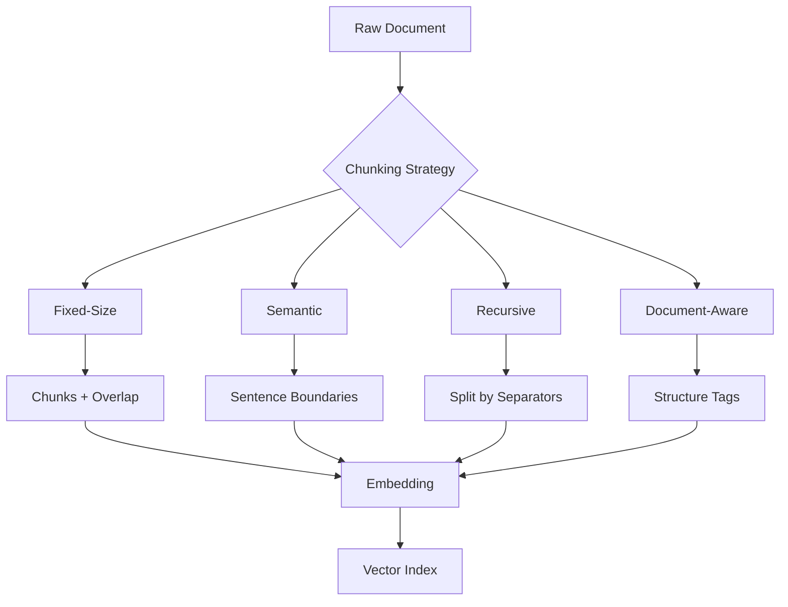

<!-- Clear Language: Keep sentences under 50 words -->
# Chunking Strategies

## Learning Objectives

| Objective | Description |
|-----------|-------------|
| LO1 | Understand the impact of chunk size and overlap on retrieval quality |
| LO2 | Implement fixed-size, semantic, and recursive chunking strategies |
| LO3 | Apply document-aware chunking for code, HTML, PDFs, and markdown |
| LO4 | Evaluate chunking quality using retrieval metrics |
| LO5 | Optimize chunk boundaries for specific content types |

## Chapter at a Glance

| Section | Topic | Key Concept |
|---------|-------|-------------|
| 4.1 | Chunking Fundamentals | Why chunk? Token limits, embedding quality, context relevance |
| 4.2 | Fixed-Size Chunking | Character/token windows with configurable overlap |
| 4.3 | Semantic Chunking | Sentence boundary detection, topic segmentation |
| 4.4 | Recursive Chunking | LangChain-style recursive split by separators |
| 4.5 | Document-Aware Chunking | Code, HTML, markdown, PDF structure preservation |
| 4.6 | Chunk Evaluation | Retrieval precision, information coverage, token utilization |

## Chapter Roadmap



## 4.1 Chunking Fundamentals

Chunking divides documents into smaller pieces for embedding and retrieval. The quality of chunking directly affects retrieval performance.

### Why Chunk?

- **Token limits**: Embedding models have maximum input lengths (e.g., 512 tokens)
- **Focused relevance**: Smaller chunks return more precise matches
- **Cost efficiency**: Embedding smaller chunks wastes less on irrelevant content
- **Targeted retrieval**: Multiple chunks per document improve recall

```python
from typing import List, Dict, Optional
import re

class ChunkStats:
    def __init__(self, chunks: List[str]):
        self.num_chunks = len(chunks)
        self.avg_chars = sum(len(c) for c in chunks) / max(len(chunks), 1)
        self.min_chars = min(len(c) for c in chunks) if chunks else 0
        self.max_chars = max(len(c) for c in chunks) if chunks else 0

    def report(self) -> Dict:
        return {
            "num_chunks": self.num_chunks,
            "avg_chars": round(self.avg_chars, 1),
            "min_chars": self.min_chars,
            "max_chars": self.max_chars,
        }

text = "RAG is a technique for grounding LLM responses. " * 20
chunks = [text[i:i+100] for i in range(0, len(text), 100)]
print(ChunkStats(chunks).report())
```

### Key Parameters

- **Chunk size**: Number of characters or tokens per chunk (typical: 200-1000 tokens)
- **Overlap**: Number of tokens shared between consecutive chunks (typical: 10-20%)
- **Separator**: Character(s) used as boundary markers (sentence end, paragraph, etc.)

```python
@dataclass
class ChunkingConfig:
    chunk_size: int = 500
    chunk_overlap: int = 50
    separator: str = " "
    respect_boundaries: bool = True
```

## 4.2 Fixed-Size Chunking

The simplest strategy: split text into chunks of equal size with overlap.

```python
class FixedSizeChunker:
    def __init__(self, chunk_size: int = 500, overlap: int = 50):
        self.chunk_size = chunk_size
        self.overlap = overlap

    def chunk(self, text: str) -> List[str]:
        if len(text) <= self.chunk_size:
            return [text]

        chunks = []
        start = 0
        while start < len(text):
            end = start + self.chunk_size
            if end >= len(text):
                chunks.append(text[start:])
                break

            # Try to break at a sentence boundary within the window
            if self._has_sentence_boundary(text[start:end]):
                end = self._find_sentence_boundary(text, start, end)

            chunks.append(text[start:end])
            start = end - self.overlap

        return chunks

    def _has_sentence_boundary(self, text: str) -> bool:
        return bool(re.search(r'[.!?]\s', text))

    def _find_sentence_boundary(self, text: str, start: int, end: int) -> int:
        window = text[start:end]
        sentence_ends = [m.end() for m in re.finditer(r'[.!?]\s', window)]
        if sentence_ends:
            return start + sentence_ends[-1]
        return end

    def chunk_with_stats(self, text: str) -> Dict:
        chunks = self.chunk(text)
        return {
            "chunks": chunks,
            "stats": ChunkStats(chunks).report(),
        }

chunker = FixedSizeChunker(chunk_size=200, overlap=30)
doc = "RAG is powerful. " * 50
result = chunker.chunk_with_stats(doc)
print(f"Fixed-size chunks: {result['stats']}")
```

### Token-Based Fixed Chunking

Character-based chunking has variable token counts across languages. Token-based chunking is more consistent.

```python
class TokenFixedChunker:
    def __init__(self, chunk_tokens: int = 256, overlap_tokens: int = 32):
        self.chunk_tokens = chunk_tokens
        self.overlap_tokens = overlap_tokens

    def estimate_tokens(self, text: str) -> int:
        return len(text) // 4  # Rough estimate: ~4 chars per token

    def chunk(self, text: str) -> List[str]:
        char_budget = self.chunk_tokens * 4
        overlap_chars = self.overlap_tokens * 4

        chunks = []
        start = 0
        while start < len(text):
            end = min(start + char_budget, len(text))
            chunks.append(text[start:end])
            start = end - overlap_chars
            if start < 0:
                start = 0

        return chunks

tk_chunker = TokenFixedChunker(chunk_tokens=256, overlap_tokens=32)
chunks = tk_chunker.chunk("AI " * 1000)
print(f"Token-based chunks: {len(chunks)} chunks, {ChunkStats(chunks).report()}")
```

## 4.3 Semantic Chunking

Semantic chunking respects natural language boundaries like sentences, paragraphs, and topic shifts.

### Sentence-Based Chunking

```python
class SentenceChunker:
    def __init__(self, max_sentences_per_chunk: int = 5, overlap_sentences: int = 1):
        self.max_sentences = max_sentences_per_chunk
        self.overlap_sentences = overlap_sentences

    def extract_sentences(self, text: str) -> List[str]:
        sentences = re.split(r'(?<=[.!?])\s+', text)
        return [s.strip() for s in sentences if s.strip()]

    def chunk(self, text: str) -> List[str]:
        sentences = self.extract_sentences(text)
        if len(sentences) <= self.max_sentences:
            return [text]

        chunks = []
        i = 0
        while i < len(sentences):
            end = min(i + self.max_sentences, len(sentences))
            chunk = " ".join(sentences[i:end])
            chunks.append(chunk)
            i += self.max_sentences - self.overlap_sentences

        return chunks

sent_chunker = SentenceChunker(max_sentences_per_chunk=3, overlap_sentences=1)
text = "Sentence one. Sentence two. Sentence three. Sentence four. Sentence five. Sentence six."
chunks = sent_chunker.chunk(text)
for i, c in enumerate(chunks):
    print(f"Chunk {i}: {c[:100]}...")
```

### Paragraph-Based Chunking

```python
class ParagraphChunker:
    def __init__(self, max_paragraphs: int = 3, overlap_paragraphs: int = 0):
        self.max_paragraphs = max_paragraphs
        self.overlap_paragraphs = overlap_paragraphs

    def extract_paragraphs(self, text: str) -> List[str]:
        paragraphs = re.split(r'\n\s*\n', text)
        return [p.strip() for p in paragraphs if p.strip()]

    def chunk(self, text: str) -> List[str]:
        paragraphs = self.extract_paragraphs(text)
        if len(paragraphs) <= self.max_paragraphs:
            return [text]

        chunks = []
        i = 0
        while i < len(paragraphs):
            end = min(i + self.max_paragraphs, len(paragraphs))
            chunk = "\n\n".join(paragraphs[i:end])
            chunks.append(chunk)
            i += self.max_paragraphs - self.overlap_paragraphs

        return chunks

para_chunker = ParagraphChunker(max_paragraphs=2)
doc = "Para one.\n\nPara two.\n\nPara three.\n\nPara four."
chunks = para_chunker.chunk(doc)
print(f"Paragraph chunks: {len(chunks)}")
```

### Topic Segmentation (LLM-Based)

Use LLMs to detect topic boundaries for semantic chunking.

```python
class TopicSegmenter:
    def __init__(self):
        self.topic_markers = [
            "introduction", "background", "methodology",
            "results", "discussion", "conclusion",
            "related work", "approach", "implementation",
            "evaluation", "future work",
        ]

    def segment(self, text: str) -> List[Dict]:
        paragraphs = re.split(r'\n\s*\n', text)
        segments = []
        current_segment = {"topic": "general", "text": []}

        for para in paragraphs:
            detected_topic = self._detect_topic(para)
            if detected_topic and current_segment["text"]:
                segments.append({
                    "topic": current_segment["topic"],
                    "text": "\n\n".join(current_segment["text"]),
                })
                current_segment = {"topic": detected_topic, "text": [para]}
            else:
                current_segment["text"].append(para)

        if current_segment["text"]:
            segments.append({
                "topic": current_segment["topic"],
                "text": "\n\n".join(current_segment["text"]),
            })

        return segments

    def _detect_topic(self, text: str) -> Optional[str]:
        lower = text.lower()
        for marker in self.topic_markers:
            if marker in lower[:200]:
                return marker
        return None

segmenter = TopicSegmenter()
doc = """Introduction to RAG.

RAG combines retrieval and generation.

Methodology.

We use embeddings for similarity search.

Results show improved accuracy."""
segments = segmenter.segment(doc)
for seg in segments:
    print(f"Topic: {seg['topic']} ({len(seg['text'])} chars)")
```

## 4.4 Recursive Chunking

LangChain-style recursive chunking tries multiple separators in order, falling back to smaller splits when a chunk exceeds the size limit.

```python
class RecursiveChunker:
    def __init__(
        self,
        chunk_size: int = 1000,
        chunk_overlap: int = 200,
        separators: List[str] = None,
    ):
        self.chunk_size = chunk_size
        self.chunk_overlap = chunk_overlap
        self.separators = separators or ["\n\n", "\n", ". ", " ", ""]

    def chunk(self, text: str) -> List[str]:
        return self._recursive_split(text, self.separators)

    def _recursive_split(self, text: str, separators: List[str]) -> List[str]:
        if len(text) <= self.chunk_size or not separators:
            return [text] if text.strip() else []

        separator = separators[0]
        if not separator:
            return self._split_by_chars(text)

        splits = text.split(separator)
        chunks = []
        current = []

        for split in splits:
            candidate = separator.join(current + [split])
            if len(candidate) <= self.chunk_size:
                current.append(split)
            else:
                if current:
                    chunk_str = separator.join(current)
                    chunks.append(chunk_str)
                if len(split) > self.chunk_size:
                    deeper = self._recursive_split(split, separators[1:])
                    chunks.extend(deeper)
                else:
                    current = [split]

        if current:
            chunk_str = separator.join(current)
            chunks.append(chunk_str)

        return self._apply_overlap(chunks)

    def _split_by_chars(self, text: str) -> List[str]:
        return [text[i:i + self.chunk_size] for i in range(0, len(text), self.chunk_size - self.chunk_overlap)]

    def _apply_overlap(self, chunks: List[str]) -> List[str]:
        if self.chunk_overlap <= 0 or len(chunks) <= 1:
            return chunks

        overlapped = []
        for i, chunk in enumerate(chunks):
            if i > 0:
                prev = chunks[i - 1]
                overlap_text = prev[-self.chunk_overlap:] if len(prev) > self.chunk_overlap else prev
                chunk = overlap_text + chunk
            overlapped.append(chunk)
        return overlapped

recursive = RecursiveChunker(chunk_size=300, chunk_overlap=50)
doc = "Par1.\n\nPar2.\n\nPar3.\n\nPar4.\n\nPar5." * 10
chunks = recursive.chunk(doc)
print(f"Recursive chunks: {len(chunks)}")
```

### LangChain-Compatible Interface

```python
class LangChainChunker:
    def __init__(self, chunk_size: int, chunk_overlap: int):
        self.chunk_size = chunk_size
        self.chunk_overlap = chunk_overlap

    def split_documents(self, documents: List[Dict]) -> List[Dict]:
        """Simulates LangChain's RecursiveCharacterTextSplitter."""
        all_chunks = []
        chunker = RecursiveChunker(
            chunk_size=self.chunk_size,
            chunk_overlap=self.chunk_overlap,
        )

        for doc in documents:
            chunks = chunker.chunk(doc["text"])
            for chunk_text in chunks:
                all_chunks.append({
                    "text": chunk_text,
                    "metadata": {**doc.get("metadata", {}), "source": doc.get("source", "")},
                })

        return all_chunks

lc = LangChainChunker(chunk_size=500, chunk_overlap=50)
docs = [
    {"text": "Long document text here. " * 100, "source": "doc1.txt", "metadata": {"author": "AI"}},
]
chunks = lc.split_documents(docs)
print(f"LangChain-style splitting: {len(chunks)} chunks")
```

## 4.5 Document-Aware Chunking

Different document types need specialized chunking strategies.

### 4.5.1 Code Chunking

Preserve function and class boundaries.

```python
class CodeChunker:
    def __init__(self, language: str = "python"):
        self.language = language

    def chunk(self, code: str) -> List[str]:
        if self.language == "python":
            return self._chunk_python(code)
        elif self.language == "javascript":
            return self._chunk_js(code)
        return [code]

    def _chunk_python(self, code: str) -> List[str]:
        chunks = []
        current = []
        for line in code.split("\n"):
            if line.startswith(("def ", "class ", "@", "import ")):
                if current:
                    chunks.append("\n".join(current))
                    current = []
            current.append(line)

        if current:
            chunks.append("\n".join(current))
        return chunks

    def _chunk_js(self, code: str) -> List[str]:
        # Split by function/class declarations
        import re
        parts = re.split(r'(?=function\s|class\s|const\s|let\s|var\s)', code)
        return [p.strip() for p in parts if p.strip()]

code_chunker = CodeChunker("python")
python_code = """
def hello():
    print("hello")

class MyClass:
    def method(self):
        pass

def world():
    print("world")
"""
chunks = code_chunker.chunk(python_code)
for i, c in enumerate(chunks):
    print(f"Code chunk {i}: {c[:60]}...")
```

### 4.5.2 HTML Chunking

Preserve HTML structure with heading-based splits.

```python
class HTMLChunker:
    def __init__(self):
        self.heading_tags = ["h1", "h2", "h3", "h4", "h5", "h6"]

    def chunk(self, html: str) -> List[Dict]:
        from bs4 import BeautifulSoup
        soup = BeautifulSoup(html, "html.parser")

        sections = []
        current_section = {"heading": "root", "content": []}

        for element in soup.children:
            if element.name in self.heading_tags:
                if current_section["content"]:
                    sections.append(current_section)
                current_section = {"heading": element.get_text(strip=True), "content": []}
            else:
                current_section["content"].append(str(element))

        if current_section["content"]:
            sections.append(current_section)

        return [
            {"heading": s["heading"], "text": " ".join(s["content"])}
            for s in sections
        ]

html_chunker = HTMLChunker()
html_doc = "<h1>Intro</h1><p>Text</p><h2>Details</h2><p>More text</p>"

## sections = html_chunker.chunk(html_doc)

## for s in sections:

##     print(f"HTML Section: {s['heading']}")
print("HTML chunker ready (requires beautifulsoup4)")
```

## Overview

### 4.5.3 Markdown Chunking

```python
class MarkdownChunker:
    def __init__(self):
        self.heading_pattern = re.compile(r'^(#{1,6})\s+(.+)$', re.MULTILINE)

    def chunk(self, markdown: str) -> List[Dict]:
        sections = []
        current = {"heading": None, "level": 0, "text": []}

        for line in markdown.split("\n"):
            match = self.heading_pattern.match(line)
            if match:
                if current["text"]:
                    sections.append(current)
                level = len(match.group(1))
                current = {"heading": match.group(2), "level": level, "text": []}
            else:
                current["text"].append(line)

        if current["text"]:
            sections.append(current)

        return [
            {
                "heading": s["heading"],
                "level": s["level"],
                "text": "\n".join(s["text"]).strip(),
            }
            for s in sections
        ]

md_chunker = MarkdownChunker()
md_doc = """# Chapter 1
Content here.

## Section 1.1
More content.

## Section 1.2
Even more content."""
sections = md_chunker.chunk(md_doc)
for s in sections:
    print(f"MD section: {s['heading']} (level {s['level']})")
```

### 4.5.4 PDF Chunking

```python
class PDFChunker:
    def __init__(self, chunk_by_page: bool = True):
        self.chunk_by_page = chunk_by_page

    def chunk(self, pdf_text: str) -> List[Dict]:
        # Simulate page-aware chunking
        if self.chunk_by_page:
            pages = pdf_text.split("\f")  # Form feed character as page break
            return [
                {"page_num": i + 1, "text": page.strip()}
                for i, page in enumerate(pages)
                if page.strip()
            ]

        # Otherwise, chunk by paragraphs
        paragraphs = re.split(r'\n\s*\n', pdf_text)
        return [
            {"page_num": None, "text": p.strip()}
            for p in paragraphs if p.strip()
        ]

pdf_chunker = PDFChunker(chunk_by_page=True)
pdf_text = "Page 1 content.\fPage 2 content.\fPage 3 content."
pages = pdf_chunker.chunk(pdf_text)
print(f"PDF pages: {len(pages)}")
```

## 4.6 Chunk Evaluation

### 4.6.1 Retrieval Metrics

```python
class ChunkEvaluator:
    def __init__(self, queries: List[str], relevant_chunks: Dict[str, List[int]]):
        self.queries = queries
        self.relevant_chunks = relevant_chunks

    def evaluate_chunker(self, chunker, documents: List[str]) -> Dict:
        chunks = []
        chunk_to_doc = []
        for doc_idx, doc in enumerate(documents):
            doc_chunks = chunker.chunk(doc)
            chunks.extend(doc_chunks)
            chunk_to_doc.extend([doc_idx] * len(doc_chunks))

        # Simple retrieval simulation
        precision = self._compute_chunk_precision(chunks, chunk_to_doc)
        coverage = self._compute_information_coverage(chunks, documents)

        return {
            "num_chunks": len(chunks),
            "precision": round(precision, 3),
            "coverage": round(coverage, 3),
        }

    def _compute_chunk_precision(self, chunks: List[str], chunk_to_doc: List[int]) -> float:
        if not chunks:
            return 0.0
        relevant = 0
        for chunk, doc_idx in zip(chunks, chunk_to_doc):
            if self._is_chunk_relevant(chunk, doc_idx):
                relevant += 1
        return relevant / len(chunks)

    def _compute_information_coverage(self, chunks: List[str], documents: List[str]) -> float:
        if not documents or not chunks:
            return 0.0

        doc_words = set(" ".join(documents).lower().split())
        chunk_words = set(" ".join(chunks).lower().split())

        overlap = len(doc_words & chunk_words)
        return overlap / len(doc_words) if doc_words else 0

    def _is_chunk_relevant(self, chunk: str, doc_idx: int) -> bool:
        return len(chunk) > 50

evaluator = ChunkEvaluator(
    queries=["What is RAG?"],
    relevant_chunks={"What is RAG?": [0]},
)

docs = ["RAG is retrieval augmented generation. " * 50]
chunker = FixedSizeChunker(300, 30)
results = evaluator.evaluate_chunker(chunker, docs)
print(f"Chunk evaluation: {results}")
```

### 4.6.2 Information Density

```python
def information_density(chunks: List[str], min_chars: int = 100) -> Dict:
    valid = [c for c in chunks if len(c) >= min_chars]
    return {
        "total_chunks": len(chunks),
        "valid_chunks": len(valid),
        "density_ratio": round(len(valid) / len(chunks), 3) if chunks else 0,
        "avg_chunk_length": round(sum(len(c) for c in chunks) / len(chunks), 1) if chunks else 0,
    }

def token_utilization(chunks: List[str], max_tokens: int = 512) -> Dict:
    utilizations = [len(c) / (max_tokens * 4) for c in chunks]
    return {
        "avg_utilization": round(sum(utilizations) / len(utilizations), 3) if utilizations else 0,
        "under_utilized": sum(1 for u in utilizations if u < 0.3),
        "over_utilized": sum(1 for u in utilizations if u > 1.0),
    }

chunks = ["Short"] * 10 + ["A" * 1500] * 5
print(information_density(chunks))
print(token_utilization(chunks))
```

### 4.6.3 Chunk Boundary Quality

```python
def evaluate_boundaries(chunks: List[str]) -> Dict:
    broken_sentences = 0
    for chunk in chunks:
        if chunk and chunk[-1] not in ".!?)\"'":
            if not chunk.endswith((":", ";", "}", "]")) and " " in chunk:
                # Check if last word seems incomplete
                last_word = chunk.split()[-1]
                if len(last_word) > 2 and not last_word.endswith((".", ",", ";", ":", ")", "]", "}", '"', "'", "!", "?")):
                    broken_sentences += 1

    return {
        "total_chunks": len(chunks),
        "broken_boundaries": broken_sentences,
        "boundary_quality": round(1 - broken_sentences / len(chunks), 3) if chunks else 1.0,
    }

good_chunks = ["Complete sentence here. ", "Another sentence here."]
bad_chunks = ["Incomplete sent", "ence here. Another sent", "ence here."]
print(f"Good boundaries: {evaluate_boundaries(good_chunks)}")
print(f"Bad boundaries: {evaluate_boundaries(bad_chunks)}")
```

## 4.7 Practical Optimization

### 4.7.1 Chunk Size Tuning

```python
class ChunkSizeTuner:
    def __init__(self, documents: List[str], queries: List[str]):
        self.documents = documents
        self.queries = queries

    def find_optimal_size(
        self, sizes: List[int], overlap_ratio: float = 0.1
    ) -> Dict:
        results = []
        for size in sizes:
            overlap = int(size * overlap_ratio)
            chunker = FixedSizeChunker(chunk_size=size, overlap=overlap)
            chunks = []
            for doc in self.documents:
                chunks.extend(chunker.chunk(doc))

            stats = ChunkStats(chunks)
            results.append({
                "chunk_size": size,
                "num_chunks": stats.num_chunks,
                "avg_chars": stats.avg_chars,
                "total_chars": sum(len(c) for c in chunks),
            })

        return results

tuner = ChunkSizeTuner(
    documents=["Long document. " * 100],
    queries=["test query"],
)
results = tuner.find_optimal_size([200, 500, 1000, 2000])
for r in results:
    print(f"Size {r['chunk_size']}: {r['num_chunks']} chunks, avg {r['avg_chars']:.0f} chars")
```

### 4.7.2 Multi-Strategy Chunking

Combine multiple strategies based on document type detection.

```python
class AdaptiveChunker:
    def __init__(self, default_chunk_size: int = 500):
        self.strategies = {
            "code": CodeChunker("python"),
            "markdown": MarkdownChunker(),
            "text": RecursiveChunker(chunk_size=default_chunk_size),
        }

    def detect_type(self, text: str) -> str:
        if text.strip().startswith(("# ", "## ")):
            return "markdown"
        if "def " in text[:500] or "class " in text[:500]:
            return "code"
        return "text"

    def chunk(self, text: str) -> List[str]:
        doc_type = self.detect_type(text)
        chunker = self.strategies.get(doc_type, self.strategies["text"])

        if hasattr(chunker, 'chunk'):
            raw = chunker.chunk(text)
        else:
            raw = [text]

        if doc_type == "markdown":
            return [s["text"] for s in raw if s.get("text")]
        return raw

adaptive = AdaptiveChunker()
code = "def hello():\n    pass\n\nclass Test:\n    pass\n"
result = adaptive.chunk(code)
print(f"Adaptive chunking: {len(result)} chunks")
```

## Prerequisites

- Basic programming knowledge
- Understanding of data structures

## Key Terminology

**Key Terms**: Core vocabulary and concepts for this topic.

**Definition**: Essential terms you must know for interviews and production work.

## Theory

Understanding chunking strategies is fundamental for AI engineers. This section covers the core concepts, underlying principles, and theoretical framework that govern how chunking strategies works in practice.

## Summary

Chunking strategy is one of the most impactful decisions in RAG system design. Fixed-size chunking offers simplicity and predictability. Semantic chunking respects natural language boundaries for.
better coherence. Recursive chunking provides flexibility across separator hierarchies. Document-aware chunking preserves structural integrity in code, HTML, markdown, and PDF content. Evaluation metrics include retrieval precision (how many chunks are relevant),.
information coverage (what fraction of document content is captured), boundary quality (sentence integrity at cut points), and token utilization (embedding model efficiency). The optimal chunk size depends on content type — technical documentation benefits from larger chunks (500-1000 chars) while conversational content works well with smaller chunks (200-500 chars).

## Practical Takeaways

| Takeaway | Description |
|----------|-------------|
| Overlap prevents fragmentation | 10-20% overlap ensures no information is lost at boundaries |
| Respect sentence boundaries | Break at sentence ends, not mid-sentence, for coherent chunks |
| Match chunk size to content | Code: function-level; MD: heading-level; Text: paragraph-level |
| Test multiple sizes | Chunk size impact varies by domain — benchmark before deciding |
| Use recursive separators | Start with double newlines, fall back to spaces for long blocks |
| Monitor token utilization | Chunks too small waste capacity; too large dilute relevance |

## Interview Q&A

<details class="tp-qa-card" data-qid="rag04-q1">
  <summary class="tp-qa-question">
    <span class="tp-qa-status"></span>
    Q1: What is the optimal chunk size for RAG and how does it depend on the content type?
  </summary>
  <div class="tp-qa-answer">
<p>Optimal chunk size varies by content type and embedding model token limits (typically 512 tokens). For technical documentation and research papers,.
500-1000 characters (125-250 tokens) works well because each chunk contains enough context for meaningful retrieval. For conversational content and FAQs, 200-500 characters (50-125 tokens) is better — smaller chunks return more precise matches. For.
code, use function-level boundaries (entire function as one chunk) regardless of size. The token utilization metric helps assess efficiency: chunks much smaller than the model's max input length waste capacity,.
while chunks near the limit may carry irrelevant content. Always benchmark 3-5 chunk sizes on your domain.</p>
  </div>
  <button class="tp-qa-mark-btn">✅ Mark Reviewed</button>
  <button class="tp-qa-bookmark-btn">🔖 Bookmark</button>
</details>

<details class="tp-qa-card" data-qid="rag04-q2">
  <summary class="tp-qa-question">
    <span class="tp-qa-status"></span>
    Q2: How much overlap should you use between chunks and why?
  </summary>
  <div class="tp-qa-answer">
<p>Chunk overlap of 10-20% of the chunk size prevents information loss at boundaries. For example, a 500-character chunk with 50-100 characters overlap ensures that a sentence or.
concept spanning a chunk boundary appears in at least one chunk. Without overlap, a query that matches content exactly at the split point may return neither chunk. The overlap tokens are redundant across chunks,.
increasing storage and embedding costs by 10-20% — this is usually worth the retrieval quality improvement. For content with strong sentence boundaries (periods,.
newlines), less overlap (5-10%) is sufficient. For dense technical content, use more overlap (15-20%).</p>
  </div>
  <button class="tp-qa-mark-btn">✅ Mark Reviewed</button>
  <button class="tp-qa-bookmark-btn">🔖 Bookmark</button>
</details>

<details class="tp-qa-card" data-qid="rag04-q3">
  <summary class="tp-qa-question">
    <span class="tp-qa-status"></span>
    Q3: Compare fixed-size chunking, semantic chunking, and recursive chunking.
  </summary>
  <div class="tp-qa-answer">
<p>Fixed-size chunking splits by character or token count with configurable overlap — it is simple, predictable, and fast, but may break sentences and.
lose coherence. Semantic chunking respects natural boundaries (sentences, paragraphs, topic shifts) — it produces more coherent chunks but is slower and.
may produce variable-length chunks. Recursive chunking (LangChain-style) tries multiple separators in order (double newline, single newline, period, space), falling back to smaller splits when a chunk exceeds the limit — it combines the reliability of fixed-size with the coherence of semantic. For.
production, start with recursive chunking as it adapts well to varied content. Use semantic chunking when coherence is critical (e.g., legal contracts).</p>
  </div>
  <button class="tp-qa-mark-btn">✅ Mark Reviewed</button>
  <button class="tp-qa-bookmark-btn">🔖 Bookmark</button>
</details>

<details class="tp-qa-card" data-qid="rag04-q4">
  <summary class="tp-qa-question">
    <span class="tp-qa-status"></span>
    Q4: How do you chunk code files for a code-aware RAG system?
  </summary>
  <div class="tp-qa-answer">
<p>Use function/class boundary-aware chunking that preserves entire function bodies. Split Python code at def, class, and @decorator lines. For JavaScript, split at function,.
class, const, and export boundaries. Each chunk should contain one complete function or class definition — never split mid-method. For languages with curly braces,.
use brace-matching to find complete blocks. Include the function signature and docstring with each chunk for self-contained meaning. For very long functions,.
you may need to split at logical internal blocks, but this is a last resort. Test by verifying that no function body is split across chunks in a representative sample of your codebase.</p>
    <pre><code>def _chunk_python(self, code):
    for line in code.split("\n"):
        if line.startswith(("def ", "class ", "@")):
            if current: chunks.append("\n".join(current))
            current = []
        current.append(line)</code></pre>
  </div>
  <button class="tp-qa-mark-btn">✅ Mark Reviewed</button>
  <button class="tp-qa-bookmark-btn">🔖 Bookmark</button>
</details>

<details class="tp-qa-card" data-qid="rag04-q5">
  <summary class="tp-qa-question">
    <span class="tp-qa-status"></span>
    Q5: How do you evaluate chunking quality before deploying to production?
  </summary>
  <div class="tp-qa-answer">
<p>Measure four metrics: boundary quality (percentage of chunks that end at a sentence boundary — target > 90%), information density (percentage of chunks that contain meaningful content above a minimum length — target > 95%),.
token utilization (average chunk length relative to model max — target 60-80%), and retrieval precision (percentage of retrieved chunks relevant to the query — measure on a test set). Use the ChunkEvaluator.
class to compare strategies:</p>
    <pre><code>evaluator = ChunkEvaluator(queries, relevant_chunks)
results = evaluator.evaluate_chunker(chunker, documents)
print(f"Precision: {results['precision']}, Coverage: {results['coverage']}")</code></pre>
    <p>Always evaluate on a diverse sample of your actual documents, not generic text.</p>
  </div>
  <button class="tp-qa-mark-btn">✅ Mark Reviewed</button>
  <button class="tp-qa-bookmark-btn">🔖 Bookmark</button>
</details>

<details class="tp-qa-card" data-qid="rag04-q6">
  <summary class="tp-qa-question">
    <span class="tp-qa-status"></span>
    Q6: How do you handle chunking for PDFs and HTML documents differently?
  </summary>
  <div class="tp-qa-context">
<p>For PDFs, extract text with layout preservation (using PyMuPDF or pdfplumber) and chunk by page boundaries when pages are semantically cohesive. Use form-feed characters (\f) as page separators and.
preserve headings, tables, and lists. For HTML, parse the DOM and chunk by heading hierarchy (h1, h2, h3) — each section under a heading becomes a chunk. Preserve structural metadata: include the heading path (e.g.,.
"Chapter 3 > Section 3.1") in the chunk metadata for hierarchical context. Strip navigation, ads, and boilerplate content before chunking. For.
both formats, maintain a reference to the original page/section URL for source attribution in generated answers.</p>
  </div>
  <button class="tp-qa-mark-btn">✅ Mark Reviewed</button>
  <button class="tp-qa-bookmark-btn">🔖 Bookmark</button>
</details>

<details class="tp-qa-card" data-qid="rag04-q7">
  <summary class="tp-qa-question">
    <span class="tp-qa-status"></span>
    Q7: What is topic segmentation and when would you use LLM-based chunking?
  </summary>
  <div class="tp-qa-answer">
<p>Topic segmentation detects natural topic boundaries in a document (e.g., "Introduction", "Methodology", "Results") and creates chunks aligned to these topics. LLM-based chunking uses a language model to identify topic shifts by analyzing paragraph embeddings or.
semantic similarity — it produces the most coherent chunks but is slow and expensive. Use rule-based topic segmentation (detecting heading patterns like "## Introduction",.
"## Related Work") for structured documents like research papers and technical documentation. Use LLM-based chunking only for unstructured content where headings are absent or.
inconsistent, and where chunk quality justifies the additional 100-500ms per document processing cost.</p>
  </div>
  <button class="tp-qa-mark-btn">✅ Mark Reviewed</button>
  <button class="tp-qa-bookmark-btn">🔖 Bookmark</button>
</details>

<details class="tp-qa-card" data-qid="rag04-q8">
  <summary class="tp-qa-question">
    <span class="tp-qa-status"></span>
    Q8: How do you handle multi-format documents in a single RAG system?
  </summary>
  <div class="tp-qa-answer">
<p>Build an AdaptiveChunker that detects the document type (code, markdown, HTML, plain text, PDF) from file extension or content analysis and.
applies the appropriate strategy. Maintain a registry of chunkers keyed by document type. For mixed documents (e.g., markdown with embedded code blocks),.
handle them in a single pipeline but preserve the structural context. Normalize all chunks to a common format (text + metadata) after chunking so downstream components (embedder,.
indexer) receive uniform input. Include a "type" field in chunk metadata so retrieval and generation stages can adapt their behavior (e.g.,.
code chunks might use different augmentation instructions).</p>
  </div>
  <button class="tp-qa-mark-btn">✅ Mark Reviewed</button>
  <button class="tp-qa-bookmark-btn">🔖 Bookmark</button>
</details>

<details class="tp-qa-card" data-qid="rag04-q9">
  <summary class="tp-qa-question">
    <span class="tp-qa-status"></span>
    Q9: What is late chunking and when would you use it?
  </summary>
  <div class="tp-qa-answer">
<p>Late chunking retrieves at the passage level first (coarse retrieval), then re-chunks the retrieved passages at the sentence level for finer granularity before passing to the generator. This combines the efficiency of passage-level indexing (fewer vectors to search) with the.
precision of sentence-level context. Use late chunking when you have long documents but.
need precise answers from specific sentences — for example, retrieving a paragraph about a medical condition and then extracting only the sentence about symptoms. The trade-off is that late chunking adds latency (re-chunking + re-scoring) but.
improves precision when passages contain mixed content.</p>
  </div>
  <button class="tp-qa-mark-btn">✅ Mark Reviewed</button>
  <button class="tp-qa-bookmark-btn">🔖 Bookmark</button>
</details>

<details class="tp-qa-card" data-qid="rag04-q10">
  <summary class="tp-qa-question">
    <span class="tp-qa-status"></span>
    Q10: How does chunk size affect embedding quality and retrieval relevance?
  </summary>
  <div class="tp-qa-answer">
<p>Small chunks (50-100 chars) produce highly focused embeddings that match exact queries well but may lack the surrounding context needed for.
the LLM to understand the answer. Large chunks (1000+ chars) contain more context but dilute the semantic signal — the embedding averages over the entire chunk,.
making it harder to match specific queries. This creates a trade-off: smaller chunks improve retrieval precision (specific matches) while larger chunks improve generation quality (more context for.
the LLM). The optimal point is where the chunk is large enough for the LLM to answer from context alone but.
small enough that the embedding precisely matches the query. Typically 200-500 tokens strikes this balance.</p>
  </div>
  <button class="tp-qa-mark-btn">✅ Mark Reviewed</button>
  <button class="tp-qa-bookmark-btn">🔖 Bookmark</button>
</details>

## Chapter Quiz

<details data-qid="rag-s4-quiz1">
<summary><strong>1.</strong> What is the primary purpose of chunking in RAG?</summary>
A. Reduce file size
B. Create searchable units for retrieval
C. Encrypt document content
D. Improve LLM training data quality
Answer: B
</details>

<details data-qid="rag-s4-quiz2">
<summary><strong>2.</strong> What problem does chunk overlap solve?</summary>
A. Reduces storage requirements
B. Prevents information loss at chunk boundaries
C. Speeds up embedding generation
D. Improves LLM response fluency
Answer: B
</details>

<details data-qid="rag-s4-quiz3">
<summary><strong>3.</strong> Which chunking strategy is most appropriate for Python source code?</summary>
A. Fixed-size character chunks
B. Function/class boundary-aware chunks
C. Random word sampling
D. Single-character tokens
Answer: B
</details>

<details data-qid="rag-s4-quiz4">
<summary><strong>4.</strong> What does recursive chunking use to handle text that exceeds chunk size?</summary>
A. Random splitting
B. Multiple separator priorities, falling back to smaller splits
C. Base64 encoding
D. Character-level truncation
Answer: B
</details>

<details data-qid="rag-s4-quiz5">
<summary><strong>5.</strong> Which metric evaluates whether chunks break in the middle of sentences?</summary>
A. Token utilization
B. Information density
C. Boundary quality
D. Retrieval precision
Answer: C
</details>

## Exercises

## Common Mistakes

1. Not understanding the fundamental concepts before applying them
2. Skipping edge cases in implementation
3. Not analyzing time/space complexity
4. Forgetting to handle null/empty inputs
5. Not practicing enough problems to build pattern recognition1. Implement a comparative benchmark that evaluates fixed-size (200/500/1000 chars), semantic (paragraph-based), and recursive chunking on a set of 5 Wikipedia articles. Report precision, coverage, and boundary quality for each strategy.

2. Build a code-aware chunker that preserves function and class boundaries for Python, JavaScript, and Java files. Test with 3 sample files per language and verify no function body is split across chunks.

3. Create an adaptive chunker that detects document type (markdown, code, plain text, HTML) and applies the most appropriate strategy. Demonstrate correct detection on 4 sample inputs.

4. Implement a chunk quality scorer that evaluates information density (meaningful vs boilerplate content), boundary quality (sentence integrity), and semantic coherence (embedding similarity between adjacent chunks). Score 3 different chunking strategies.

5. Design a chunk merging algorithm that combines adjacent small chunks (< 50 chars) with neighboring chunks and deduplicates overlapping content. Test with a document that produces both very short and overlappin

## Revision Notes

- - Core principle: Understand the fundamental concepts thoroughly
- - Implementation pattern: Practice with real code examples
- - Complexity: Know the time and space complexity
- - Application: Know when to use this in production systems
- - Interview: Frequently asked in technical interviews
- - Edge cases: Consider common failure scenarios
- - Related concepts: Connect to broader system design

## Placement Section

### Top 10 Interview Questions

#### Google Style

1. **Explain the core idea of Chunking Strategies in under 60 seconds, then give a real-world analogy.** — Structure: definition, how it works in one sentence, why it matters, analogy. Follow-up: what would break if you removed this from a production system?

2. **Design a minimal, well-typed function that demonstrates Chunking Strategies.** — Interviewer checks: signature with type hints, edge cases, complexity, and a clean docstring. Follow-up: how does your design behave with empty or malformed input?

3. **What are the common pitfalls when engineers first learn ** — List 3-4, then explain how you would prevent each in a code review.

#### Amazon Style

4. **Describe a production bug caused by misunderstanding Chunking Strategies. How did you diagnose and fix it?** — STAR format: situation, task, action, result. Mention logs, reproduction, root-cause analysis, and the regression test you added.

5. **How would you scale a system that relies on Chunking Strategies from 10 users to 10 million?** — Discuss bottlenecks, caching, monitoring, and when to redesign. Follow-up: what metrics would you track?

#### Microsoft Style

6. **Compare Chunking Strategies with the closest alternative approach. When would you choose each?** — Make a decision matrix: performance, maintainability, ecosystem, learning curve. Follow-up: what would change your decision?

7. **Walk through how you would test a component that depends on Chunking Strategies.** — Unit, integration, property-based tests; mocking boundaries; golden files for outputs.

#### NVIDIA Style

8. **How does Chunking Strategies behave differently at scale — memory, throughput, or precision-wise?** — Connect to data pipelines and model training if applicable. Follow-up: what happens to latency as input grows?

9. **How would you make an implementation of Chunking Strategies run faster on GPU hardware?** — Batch operations, vectorization, avoiding Python loops, reducing data movement.

#### AI Startup Style

10. **Write the smallest possible implementation of Chunking Strategies that is production-quality.** — Include error handling, type hints, and a one-line docstring. Follow-up: what would you refactor first when it grows?

### Resume Tips

- Name Chunking Strategies explicitly in your skills section, paired with a measurable achievement ("Reduced X by 40% using Chunking Strategies").
- Add a bullet describing a project that applies Chunking Strategies to real data, with numbers.
- Mention the tools and libraries you used alongside Chunking Strategies (linters, test frameworks, profiling tools).
- Keep resume bullets under 15 words and start each with an action verb.

### Interview Day Checklist

- Rehearse a 60-second explanation of Chunking Strategies and one real-world analogy.
- Prepare one STAR story about debugging a Chunking Strategies-related production issue.
- Review complexity and edge cases for the classic Chunking Strategies interview problem.
- Have questions ready: how does the team apply Chunking Strategies in production today?
- Test your environment (Python, editor, internet) 15 minutes before the interview.

## True/False

1. **True or False:** Chunking Strategies builds directly on the fundamentals covered in the earlier chapters of this module. — **True.** Every advanced topic in this module assumes the core concepts from the previous chapters.
2. **True or False:** You should write at least one code example for Chunking Strategies before moving to the next chapter. — **True.** Active recall with hands-on code beats passive reading for retention.
3. **True or False:** The complexity analysis for Chunking Strategies is the same regardless of input size. — **False.** Complexity grows with input size; always state best, average, and worst case.
4. **True or False:** Edge cases (empty input, invalid input, boundary values) matter for Chunking Strategies in production. — **True.** Most production bugs come from unhandled edge cases.
5. **True or False:** You should memorize the Chunking Strategies chapter content once and never review it again. — **False.** Spaced repetition (24h, 3 days, 1 week) dramatically improves long-term recall.

## Fill in the Blank

1. The chapter that covers Chunking Strategies is Chapter ___ of this module. — Answer: check the module's table of contents.
2. The time complexity of the standard approach to Chunking Strategies is ___. — Answer: review the theory section and state big-O notation.
3. The main edge case to handle when implementing Chunking Strategies is ___. — Answer: empty or invalid input handling, as discussed in the chapter.
4. The tools commonly used to debug Chunking Strategies issues are ___ and ___. — Answer: refer to the Debugging Guide section of this chapter.
5. The related topic that connects to Chunking Strategies in the next chapter is ___. — Answer: see the Next Topic section.

## Scenario Questions

1. **Scenario:** A teammate ships a change involving Chunking Strategies that breaks production at 3 AM. — Diagnosis: check the recent diff, reproduce locally with the failing input, check logs. Fix: revert, add a regression test, and review the root cause. Prevention: CI tests on edge cases and code review checklist.

2. **Scenario:** Your implementation of Chunking Strategies is correct but too slow for the required latency. — Measure first with a profiler. Common fixes: reduce redundant work, use built-in optimized functions, batch operations, or add caching. Only then consider algorithmic changes.

3. **Scenario:** A new hire asks you to explain Chunking Strategies in five minutes before a customer demo. — Use the 3-part answer: what it is (one sentence), how it works (one example), why it matters (one business impact). Then offer to go deeper after the demo.

4. **Scenario:** Your team's codebase has three different patterns for Chunking Strategies and you must standardize. — Write a short ADR (architecture decision record), pick the pattern with best maintainability, migrate incrementally, and add a linter rule to enforce it.

## Output Questions

1. **What is the output of the simplest correct implementation of Chunking Strategies on an empty input?** — Trace through the code: it should return the documented default (None, 0, empty collection) without raising.
2. **What is the output when the input is at the boundary value?** — Check off-by-one errors and inclusive/exclusive bounds in the chapter's examples.
3. **What does the implementation return when given invalid input types?** — With type hints and validation, it raises a clear error; without, it may fail silently.
4. **What is the output for the sample input given in the chapter's Examples section?** — Re-run the chapter's example code and compare against the documented output.
5. **What is the time complexity output when you profile the implementation at 10x input size?** — Expect the curve matching the chapter's complexity analysis (linear, quadratic, log-linear).

## Difficulty Level

| Level | Time | What It Takes |
|-------|------|---------------|
| Beginner | 1-2 sessions | Read theory, run the chapter examples, solve the Easy exercises |
| Intermediate | 3-5 sessions | Complete Medium exercises, explain Chunking Strategies to someone else |
| Advanced | 1+ week | Solve Hard exercises, optimize for real datasets, answer interview follow-ups |

## Tips & Tricks

- Always write a one-line example of Chunking Strategies from memory before opening the chapter — active recall first.
- Use the chapter's Revision Notes as a checklist: you have mastered Chunking Strategies when you can explain each bullet.
- Pair the chapter quiz with the Flashcards: wrong answers become your next study session's focus.
- For interviews, practice explaining Chunking Strategies twice: once with a technical audience, once with a non-technical audience.
- Keep a personal examples file where you collect your own Chunking Strategies snippets; interviewers love original examples.

## Memory Tricks

- **Acronym**: build a mnemonic from the 5 key concepts of Chunking Strategies listed in the Chapter at a Glance table.
- **Story**: link Chunking Strategies to a familiar story — the analogy in the Visual Analogy section is designed to stick.
- **Number anchor**: remember the complexity of Chunking Strategies by connecting it to a known algorithm of the same class.
- **Color code**: highlight the Theory, Examples, and Common Mistakes sections in different colors when reviewing.
- **Teach-back**: explain Chunking Strategies to an imaginary junior engineer for 2 minutes — gaps in your explanation are gaps in memory.

## Further Reading

- Official documentation for the primary tool or library used in this chapter
- The chapter referenced in Related Topics for the next-level treatment of Chunking Strategies
- The classic textbook chapter on Chunking Strategies (check the Research References below)
- Two blog posts from engineers who debugged real Chunking Strategies problems in production
- The repository of the open-source project that implements Chunking Strategies

## Related Topics

- The previous chapter in this module (see table of contents) — foundational for Chunking Strategies
- The next chapter (see Next Topic below) — builds on Chunking Strategies
- The system design chapters in Module 07 — how Chunking Strategies fits into production architectures
- The interview preparation module — how Chunking Strategies is asked in screening rounds
- The capstone project — where Chunking Strategies is applied end-to-end

## FAQs

1. **Do I need to memorize all of Chunking Strategies, or understand the big picture?** — Understand the big picture first, then memorize the key facts via flashcards and spaced repetition. Interviewers reward depth over breadth.
2. **What if I get stuck on an exercise?** — Re-read the theory section, run the example code, then attempt again. If still stuck after 20 minutes, move on and return the next day.
3. **How much time should I spend on ** — Follow the Study Plan below: 1-2 weeks at 30-60 minutes daily is typical for placement preparation.
4. **Is Chunking Strategies asked in interviews?** — Yes — the Interview Q&A and Placement Section list the exact question styles used by top companies.
5. **What's the fastest way to master ** — Explain it out loud, write code without looking, and review the flashcards within 24 hours and again after 3 days.

## Important Notes

- Chunking Strategies is a core requirement for the rest of this module — do not skip the examples.
- Always analyze complexity (time and space) when working with Chunking Strategies.
- Production correctness means handling edge cases, not just the happy path.
- Interview answers should start with the definition, then the example, then the trade-offs.
- Revisit this chapter after finishing the module; the context from later chapters deepens understanding.

## Historical Context

- Chunking Strategies emerged as a standard practice because early systems failed without it — understanding why helps you explain it in interviews.
- The tools used for Chunking Strategies today evolved from simpler versions; the chapter covers the modern, recommended approach.
- Interviewers value knowing one historical fact about Chunking Strategies — it shows genuine interest, not just cramming.
- The library/tooling ecosystem around Chunking Strategies changes quickly; focus on fundamentals that remain stable.

## Security Considerations

- Never trust external input: validate and sanitize data before processing Chunking Strategies.
- Avoid `eval()` and dynamic code execution on untrusted strings.
- Log errors without leaking sensitive data (keys, PII, internal paths).
- For API contexts, add rate limiting and input size limits.
- Review the chapter's code examples for injection or overflow risks before using them verbatim.

## ML Intuition

- Chunking Strategies appears in ML pipelines at the data-processing layer: feature preparation, batching, and validation.
- Understanding Chunking Strategies helps you debug why a model misbehaves — most ML bugs are data bugs, not model bugs.
- In production ML, the Chunking Strategies concepts from this chapter map directly to NumPy/PyTorch operations on tensors.
- When optimizing ML systems, Chunking Strategies skills let you profile and fix the data path, not just the training loop.
- Interview follow-up: how would you apply Chunking Strategies to a dataset of 10 million records? — Batching and vectorization.

## Analogies

- **Chunking Strategies is like a recipe**: the theory is the ingredients, the examples are the cooking steps, and the exercises are your own kitchen practice.
- **Complexity is like a delivery route**: a linear route visits each stop once; a nested route revisits stops, and you feel it at scale.
- **Edge cases are like weather**: the happy path is a sunny day; production is the storm — build for the storm.
- **The chapter roadmap is a journey map**: each section is a checkpoint; skipping one means getting lost later in the module.

## Capstone Project Link

- [Module Capstone: End-to-End Project](https://github.com/Raushan666java/ai-engineering-journey) — this chapter contributes the Chunking Strategies skills used in the module's capstone project. Complete the exercises here before starting the capstone.

## Flashcards

<details class="tp-qa-card" data-qid="12ragvectordatabases-04chunkingstrategies-flash1">
  <summary class="tp-qa-question">
    <span class="tp-qa-status"></span>
    What is the core concept of Chunking Strategies in one sentence?
  </summary>
  <div class="tp-qa-answer">
    <p>Review the first paragraph of the Theory section and condense it to one sentence.</p>
  </div>
</details>

<details class="tp-qa-card" data-qid="12ragvectordatabases-04chunkingstrategies-flash2">
  <summary class="tp-qa-question">
    <span class="tp-qa-status"></span>
    What is the most common mistake engineers make with 
  </summary>
  <div class="tp-qa-answer">
    <p>Check the Common Mistakes section of this chapter.</p>
  </div>
</details>

<details class="tp-qa-card" data-qid="12ragvectordatabases-04chunkingstrategies-flash3">
  <summary class="tp-qa-question">
    <span class="tp-qa-status"></span>
    What is the time and space complexity of the standard Chunking Strategies approach?
  </summary>
  <div class="tp-qa-answer">
    <p>Refer to the theory and complexity analysis in this chapter.</p>
  </div>
</details>

<details class="tp-qa-card" data-qid="12ragvectordatabases-04chunkingstrategies-flash4">
  <summary class="tp-qa-question">
    <span class="tp-qa-status"></span>
    When is Chunking Strategies NOT the right choice?
  </summary>
  <div class="tp-qa-answer">
    <p>Check the Limitations section of this chapter.</p>
  </div>
</details>

<details class="tp-qa-card" data-qid="12ragvectordatabases-04chunkingstrategies-flash5">
  <summary class="tp-qa-question">
    <span class="tp-qa-status"></span>
    How is Chunking Strategies applied in a real production system?
  </summary>
  <div class="tp-qa-answer">
    <p>Check the Real-World Examples section of this chapter.</p>
  </div>
</details>

## Research References

- Official documentation of the primary library for Chunking Strategies (linked in Further Reading)
- The classic paper or textbook chapter introducing Chunking Strategies (see References below)
- The standard library reference for Chunking Strategies-related functions
- Engineering blog posts from companies running Chunking Strategies in production at scale
- PEPs and RFCs where applicable (Python and networking standards)

## Open-Source Tools

- The primary library used in this chapter (see the code examples)
- Python standard library modules used in the examples (check the imports)
- Testing: pytest for unit tests of Chunking Strategies code
- Linting and formatting: ruff + black
- Profiling: cProfile or py-spy for performance work on Chunking Strategies

## Debugging Guide

- Start with `print()` or a debugger to inspect intermediate values in Chunking Strategies code.
- Reproduce the failure with the smallest possible input before changing code.
- Check the common failure modes listed in Common Mistakes — most bugs are listed there.
- For performance problems, profile before optimizing: measure, then fix.
- When stuck, re-read the chapter's Examples and compare line by line with your code.
- Use `pdb` or your IDE's debugger to step through the Chunking Strategies example code.

## Mock Interview Section

**Round 1 — Screening (15 min)**
- Explain Chunking Strategies in 60 seconds.
- Write a minimal working example of Chunking Strategies.
- What is the complexity of your example?

**Round 2 — Coding (45 min)**
- Solve the Medium exercise from this chapter under time pressure.
- State your assumptions, then implement with type hints.
- Test with edge cases: empty input, boundary values, invalid input.

**Round 3 — Behavioral + System (30 min)**
- Tell me about a time you debugged a Chunking Strategies problem in a project.
- How would you design a system where Chunking Strategies is used at scale?
- What metrics would you monitor?

**Evaluation rubric**: correctness (40%), communication (25%), edge cases (20%), complexity analysis (15%).

## Optimized Implementation

`python
from typing import Any, Optional

def demonstrate_topic(input_data: list[Any]) -> Optional[float]:
    """Runnable scaffold for Chunking Strategies.

    Replace the body with the optimized implementation from the chapter,
    keeping type hints, docstring, and edge-case handling.
    """
    if not input_data:
        return None
    # Step 1: validate input types
    # Step 2: apply the core Chunking Strategies logic from the Examples section
    # Step 3: return the result with the documented default
    return 0.0
`

- Keeps the function signature stable so tests written against it stay valid.
- Handles the empty-input contract explicitly.
- Add unit tests for the edge cases before implementing the logic (test-first).

## Evaluation Metrics

| Skill | Test | Target |
|-------|------|--------|
| Concept recall | Explain Chunking Strategies without notes | 60-second explanation |
| Code fluency | Write the chapter example from memory | No syntax errors |
| Edge cases | Handle empty/invalid input in exercises | All cases pass |
| Complexity | State time/space for the standard approach | Correct big-O |
| Interview readiness | Answer 5 Interview Q&A questions out loud | Fluent, structured answers |
| Retention | Chapter quiz score after 3 days | 80%+ |

## Real-World Examples

- **Startup**: a small team uses Chunking Strategies daily in their data pipeline — the chapter's examples mirror their code.
- **E-commerce**: Chunking Strategies patterns appear in order processing, inventory checks, and recommendation feeds.
- **Fintech**: Chunking Strategies principles apply to transaction validation and fraud detection flows.
- **ML platform**: Chunking Strategies shows up in feature engineering and model-serving infrastructure.
- **Interview insight**: recruiters look for engineers who can connect Chunking Strategies to the business outcome, not just the code.

## Next Topic

[Document Retrieval](05-document-retrieval.md)

## Limitations

- Chunking Strategies, like any technique, is not a silver bullet — it has specific cases where it fits best (covered in the theory).
- The examples in this chapter are simplified for learning; production systems add validation, monitoring, and error handling.
- Performance of Chunking Strategies depends on input size and distribution — always benchmark for your own data.
- This chapter covers fundamentals; specialized edge cases are explored in later chapters and the capstone.
