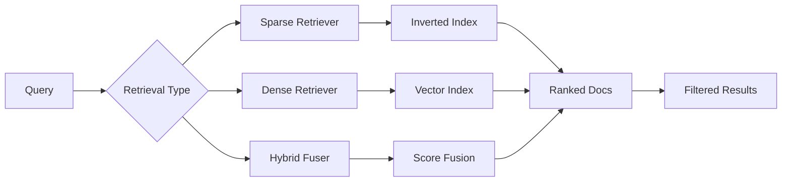

<!-- Clear Language: Keep sentences under 50 words -->
# Document Retrieval

## Learning Objectives

| Objective | Description |
|-----------|-------------|
| LO1 | Understand retrieval paradigms — sparse, dense, and hybrid |
| LO2 | Implement BM25 and TF-IDF for keyword-based retrieval |
| LO3 | Build dense retrieval systems with embedding similarity |
| LO4 | Design hybrid retrieval combining sparse and dense signals |
| LO5 | Apply query expansion and reformulation techniques |
| LO6 | Implement retrieval with metadata filtering and boosting |

## Introduction

Retrieval-Augmented Generation lets LLMs answer questions about your private data. Vector databases store embeddings for semantic search. This module covers the complete RAG pipeline from chunking to reranking.

## Prerequisites

- Basic programming knowledge
- Understanding of data structures

## Key Terminology

**Key Terms**: Core vocabulary and concepts for this topic.

**Definition**: Essential terms you must know for interviews and production work.

## Theory

Understanding document retrieval is fundamental for AI engineers. This section covers the core concepts, underlying principles, and theoretical framework that govern how document retrieval works in practice.

## Chapter at a Glance

| Section | Topic | Key Concept |
|---------|-------|-------------|
| 5.1 | Retrieval Paradigms | Sparse (keyword), dense (semantic), hybrid (combined) |
| 5.2 | Sparse Retrieval | BM25, TF-IDF, inverted index construction |
| 5.3 | Dense Retrieval | Embedding-based ANN search, encoding pipelines |
| 5.4 | Hybrid Retrieval | Score fusion, reciprocal rank fusion, weighted combination |
| 5.5 | Query Expansion | Generated synonyms, query reformulation, HyDE |
| 5.6 | Metadata Retrieval | Attribute filtering, boosting, faceted search |

## Chapter Roadmap



## 5.1 Retrieval Paradigms

Retrieval systems fall into three main paradigms: sparse (keyword-based), dense (semantic-based), and hybrid (combined).

```python
@dataclass
class RetrievalResult:
    document_id: str
    text: str
    score: float
    method: str

    def __repr__(self):
        return f"{self.document_id} ({self.method}, score={self.score:.3f})"
```

### Paradigm Comparison

| Aspect | Sparse | Dense | Hybrid |
|--------|--------|-------|--------|
| Matching | Exact keyword match | Semantic similarity | Both |
| Speed | Very fast | Fast (ANN) | Moderate |
| Vocabulary gap | Struggles with synonyms | Handles synonyms | Best |
| Storage | Inverted index | Vector index | Both |
| Cold start | Needs no training | Needs embedding model | Both |

```python
def select_retrieval_paradigm(
    num_documents: int,
    query_vocabulary_overlap: float,
    requires_semantic: bool,
) -> str:
    if num_documents > 10_000_000 and not requires_semantic:
        return "sparse"
    elif query_vocabulary_overlap < 0.3:
        return "dense"
    elif requires_semantic:
        return "hybrid"
    else:
        return "hybrid"

print(select_retrieval_paradigm(1000, 0.8, False))
print(select_retrieval_paradigm(100000, 0.2, True))
```

## 5.2 Sparse Retrieval

### 5.2.1 Inverted Index

The foundation of sparse retrieval — maps terms to document IDs and positions.

```python
from collections import defaultdict, Counter
import math
from typing import List, Dict, Set

class InvertedIndex:
    def __init__(self):
        self.index: Dict[str, Dict[str, int]] = defaultdict(lambda: defaultdict(int))
        self.doc_lengths: Dict[str, int] = {}
        self.total_docs = 0

    def add_document(self, doc_id: str, text: str):
        terms = text.lower().split()
        self.doc_lengths[doc_id] = len(terms)
        self.total_docs += 1

        term_counts = Counter(terms)
        for term, count in term_counts.items():
            self.index[term][doc_id] += count

    def get_df(self, term: str) -> int:
        """Document frequency — how many docs contain this term."""
        return len(self.index.get(term, {}))

    def get_tf(self, term: str, doc_id: str) -> int:
        """Term frequency in document."""
        return self.index.get(term, {}).get(doc_id, 0)

    def get_postings(self, term: str) -> List[str]:
        return list(self.index.get(term, {}).keys())

index = InvertedIndex()
index.add_document("doc1", "RAG combines retrieval with generation")
index.add_document("doc2", "Retrieval uses sparse and dense methods")
index.add_document("doc3", "Generation is powered by LLMs")

print(f"DF('retrieval'): {index.get_df('retrieval')}")
print(f"Postings('retrieval'): {index.get_postings('retrieval')}")
```

### 5.2.2 TF-IDF

Term Frequency-Inverse Document Frequency weights terms by importance.

```python
class TFIDF:
    def __init__(self):
        self.index = InvertedIndex()

    def add_document(self, doc_id: str, text: str):
        self.index.add_document(doc_id, text)

    def tf_idf(self, term: str, doc_id: str) -> float:
        tf = self.index.get_tf(term, doc_id)
        if tf == 0:
            return 0.0

        df = self.index.get_df(term)
        idf = math.log((self.index.total_docs + 1) / (df + 1)) + 1
        return (1 + math.log(tf)) * idf

    def retrieve(self, query: str, top_k: int = 5) -> List[RetrievalResult]:
        query_terms = query.lower().split()
        scores = defaultdict(float)

        for doc_id in self.index.doc_lengths.keys():
            for term in query_terms:
                scores[doc_id] += self.tf_idf(term, doc_id)

        sorted_docs = sorted(scores.items(), key=lambda x: x[1], reverse=True)
        return [
            RetrievalResult(doc_id, "", score, "tf-idf")
            for doc_id, score in sorted_docs[:top_k]
        ]

tfidf = TFIDF()
tfidf.add_document("doc1", "RAG combines retrieval with generation using LLMs")
tfidf.add_document("doc2", "Retrieval systems use BM25 and embedding search")
results = tfidf.retrieve("retrieval methods")
for r in results:
    print(r)
```

### 5.2.3 BM25

BM25 is the state-of-the-art sparse retrieval function. It improves on TF-IDF with saturation and length normalization.

```python
class BM25:
    def __init__(self, k1: float = 1.5, b: float = 0.75):
        self.k1 = k1
        self.b = b
        self.index = InvertedIndex()
        self.avg_doc_length = 0

    def add_document(self, doc_id: str, text: str):
        self.index.add_document(doc_id, text)

    def build(self):
        if self.index.doc_lengths:
            self.avg_doc_length = sum(self.index.doc_lengths.values()) / len(self.index.doc_lengths)

    def score(self, query_terms: List[str], doc_id: str) -> float:
        score = 0.0
        doc_len = self.index.doc_lengths.get(doc_id, 0)

        for term in query_terms:
            tf = self.index.get_tf(term, doc_id)
            if tf == 0:
                continue

            df = self.index.get_df(term)
            idf = math.log((self.index.total_docs - df + 0.5) / (df + 0.5) + 1)

            numerator = tf * (self.k1 + 1)
            denominator = tf + self.k1 * (1 - self.b + self.b * (doc_len / self.avg_doc_length))
            score += idf * (numerator / denominator)

        return score

    def retrieve(self, query: str, top_k: int = 5) -> List[RetrievalResult]:
        query_terms = query.lower().split()
        scores = {}

        for doc_id in self.index.doc_lengths.keys():
            s = self.score(query_terms, doc_id)
            if s > 0:
                scores[doc_id] = s

        sorted_docs = sorted(scores.items(), key=lambda x: x[1], reverse=True)
        return [
            RetrievalResult(doc_id, "", score, "bm25")
            for doc_id, score in sorted_docs[:top_k]
        ]

bm25 = BM25(k1=1.5, b=0.75)
bm25.add_document("doc1", "RAG combines retrieval with generation using LLMs")
bm25.add_document("doc2", "Retrieval systems use keyword matching and embedding search")
bm25.add_document("doc3", "Generation models produce natural language text")
bm25.build()

results = bm25.retrieve("how does retrieval work")
for r in results:
    print(r)
```

### 5.2.4 BM25 Variants

```python
class BM25Plus(BM25):
    def __init__(self, k1: float = 1.5, b: float = 0.75, delta: float = 1.0):
        super().__init__(k1, b)
        self.delta = delta

    def score(self, query_terms: List[str], doc_id: str) -> float:
        score = 0.0
        doc_len = self.index.doc_lengths.get(doc_id, 0)

        for term in query_terms:
            tf = self.index.get_tf(term, doc_id)
            df = self.index.get_df(term)
            idf = math.log((self.index.total_docs + 1) / df) if df > 0 else 0

            numerator = tf * (self.k1 + 1)
            denominator = tf + self.k1 * (1 - self.b + self.b * (doc_len / self.avg_doc_length))
            score += idf * (numerator / denominator + self.delta)

        return score

class BM25L(BM25):
    def __init__(self, k1: float = 1.5, b: float = 0.75, delta: float = 0.5):
        super().__init__(k1, b)
        self.delta = delta

    def score(self, query_terms: List[str], doc_id: str) -> float:
        score = 0.0
        doc_len = self.index.doc_lengths.get(doc_id, 0)

        for term in query_terms:
            tf = self.index.get_tf(term, doc_id)
            df = self.index.get_df(term)
            idf = math.log((self.index.total_docs + 1) / (df + 0.5))

            tf_prime = tf / (1 - self.b + self.b * (doc_len / self.avg_doc_length))
            numerator = (tf_prime + self.delta) * (self.k1 + 1)
            denominator = (tf_prime + self.delta) + self.k1
            score += idf * (numerator / denominator)

        return score

for name, model in [("BM25", bm25), ("BM25+", BM25Plus()), ("BM25L", BM25L())]:
    results = model.retrieve("retrieval systems")
    print(f"{name}: {[r.document_id for r in results]}")
```

## 5.3 Dense Retrieval

### 5.3.1 Embedding-Based Search

```python
class DenseRetriever:
    def __init__(self, dimension: int = 384):
        self.dimension = dimension
        self.documents: List[str] = []
        self.doc_ids: List[str] = []
        self.embeddings: List[np.ndarray] = []

    def add_document(self, doc_id: str, text: str, embedding_fn):
        self.documents.append(text)
        self.doc_ids.append(doc_id)
        emb = embedding_fn(text)
        self.embeddings.append(emb / np.linalg.norm(emb))

    def retrieve(self, query: str, embedding_fn, top_k: int = 5) -> List[RetrievalResult]:
        query_emb = embedding_fn(query)
        query_emb = query_emb / np.linalg.norm(query_emb)

        similarities = []
        for i, doc_emb in enumerate(self.embeddings):
            sim = float(np.dot(query_emb, doc_emb))
            similarities.append((i, sim))

        similarities.sort(key=lambda x: x[1], reverse=True)
        return [
            RetrievalResult(
                self.doc_ids[idx],
                self.documents[idx][:100],
                score,
                "dense",
            )
            for idx, score in similarities[:top_k]
        ]

def mock_embedder(text: str) -> np.ndarray:
    rng = np.random.RandomState(hash(text) % (2**31))
    vec = rng.randn(384)
    return vec / np.linalg.norm(vec)

dense = DenseRetriever()
dense.add_document("doc1", "RAG combines retrieval and generation", mock_embedder)
dense.add_document("doc2", "Embedding search uses semantic similarity", mock_embedder)
results = dense.retrieve("semantic search", mock_embedder)
for r in results:
    print(r)
```

### 5.3.2 Bi-Encoder vs Cross-Encoder

```python
class BiEncoder:
    """Encodes query and document independently."""
    def encode_query(self, query: str) -> np.ndarray:
        return mock_embedder(query)

    def encode_doc(self, doc: str) -> np.ndarray:
        return mock_embedder(doc)

class CrossEncoder:
    """Encodes query and document together for more accurate but slower scoring."""
    def score(self, query: str, document: str) -> float:
        combined = f"{query} [SEP] {document}"
        emb = mock_embedder(combined)
        return float(emb[0])  # Simulated relevance score

class CascadeRetriever:
    def __init__(self, bi_encoder: BiEncoder, cross_encoder: CrossEncoder):
        self.bi = bi_encoder
        self.cross = cross_encoder

    def retrieve(self, query: str, documents: List[str], top_k: int = 5) -> List[tuple]:
        # Stage 1: Fast bi-encoder retrieval
        query_emb = self.bi.encode_query(query)
        candidates = []
        for doc in documents:
            doc_emb = self.bi.encode_doc(doc)
            sim = float(np.dot(query_emb, doc_emb))
            candidates.append((doc, sim))

        candidates.sort(key=lambda x: x[1], reverse=True)
        top_candidates = candidates[:top_k * 2]

        # Stage 2: Accurate cross-encoder reranking
        reranked = []
        for doc, _ in top_candidates:
            score = self.cross.score(query, doc)
            reranked.append((doc, score))

        reranked.sort(key=lambda x: x[1], reverse=True)
        return reranked[:top_k]

bi = BiEncoder()
cross = CrossEncoder()
cascade = CascadeRetriever(bi, cross)
docs = ["RAG combines retrieval", "Dense retrieval uses embeddings"]
result = cascade.retrieve("retrieval methods", docs)
for doc, score in result:
    print(f"Cascade: {doc[:60]} -> {score:.3f}")
```

### 5.3.3 Late Interaction (ColBERT)

```python
class LateInteractionRetriever:
    """ColBERT-style: encode tokens, compare at token level, sum max sims."""
    def encode(self, text: str) -> np.ndarray:
        # Simulate token-level embeddings: (num_tokens, dim)
        rng = np.random.RandomState(hash(text) % (2**31))
        num_tokens = max(3, len(text) // 5)
        tokens = rng.randn(num_tokens, 128)
        return tokens / np.linalg.norm(tokens, axis=1, keepdims=True)

    def maxsim(self, query_tokens: np.ndarray, doc_tokens: np.ndarray) -> float:
        # For each query token, find max similarity with any doc token
        sim_matrix = np.dot(query_tokens, doc_tokens.T)
        max_scores = np.max(sim_matrix, axis=1)
        return float(np.mean(max_scores))

    def retrieve(self, query: str, documents: List[str], top_k: int = 3) -> List[tuple]:
        query_tokens = self.encode(query)
        results = []
        for doc in documents:
            doc_tokens = self.encode(doc)
            score = self.maxsim(query_tokens, doc_tokens)
            results.append((doc, score))

        results.sort(key=lambda x: x[1], reverse=True)
        return results[:top_k]

late = LateInteractionRetriever()
docs = ["RAG combines retrieval and generation", "Embedding search is fast"]
for doc, score in late.retrieve("retrieval generation", docs):
    print(f"ColBERT: {doc[:60]} -> {score:.3f}")
```

## 5.4 Hybrid Retrieval

### 5.4.1 Reciprocal Rank Fusion (RRF)

RRF combines multiple ranked lists by their reciprocal ranks.

```python
def reciprocal_rank_fusion(
    rankings: List[List[RetrievalResult]],
    k: int = 60,
    top_n: int = 10,
) -> List[RetrievalResult]:
    scores = defaultdict(float)

    for system_rankings in rankings:
        for rank, result in enumerate(system_rankings, 1):
            scores[result.document_id] += 1.0 / (k + rank)

    sorted_docs = sorted(scores.items(), key=lambda x: x[1], reverse=True)
    return [
        RetrievalResult(doc_id, "", score, "hybrid-rrf")
        for doc_id, score in sorted_docs[:top_n]
    ]

sparse_results = [
    RetrievalResult("doc1", "", 0.9, "bm25"),
    RetrievalResult("doc2", "", 0.8, "bm25"),
    RetrievalResult("doc3", "", 0.7, "bm25"),
]
dense_results = [
    RetrievalResult("doc2", "", 0.95, "dense"),
    RetrievalResult("doc1", "", 0.85, "dense"),
    RetrievalResult("doc4", "", 0.80, "dense"),
]

hybrid = reciprocal_rank_fusion([sparse_results, dense_results], k=60, top_n=3)
for r in hybrid:
    print(r)
```

### 5.4.2 Weighted Score Fusion

```python
class WeightedFusion:
    def __init__(self, sparse_weight: float = 0.3, dense_weight: float = 0.7):
        self.sparse_weight = sparse_weight
        self.dense_weight = dense_weight

    def normalize_scores(
        self, results: List[RetrievalResult]
    ) -> Dict[str, float]:
        if not results:
            return {}
        scores = [r.score for r in results]
        min_s, max_s = min(scores), max(scores)
        range_s = max_s - min_s if max_s > min_s else 1.0
        return {r.document_id: (r.score - min_s) / range_s for r in results}

    def fuse(
        self,
        sparse: List[RetrievalResult],
        dense: List[RetrievalResult],
        top_k: int = 10,
    ) -> List[RetrievalResult]:
        sparse_norm = self.normalize_scores(sparse)
        dense_norm = self.normalize_scores(dense)

        combined = defaultdict(float)
        for doc_id, score in sparse_norm.items():
            combined[doc_id] += score * self.sparse_weight
        for doc_id, score in dense_norm.items():
            combined[doc_id] += score * self.dense_weight

        sorted_docs = sorted(combined.items(), key=lambda x: x[1], reverse=True)
        return [
            RetrievalResult(doc_id, "", score, "hybrid-weighted")
            for doc_id, score in sorted_docs[:top_k]
        ]

fusion = WeightedFusion(sparse_weight=0.3, dense_weight=0.7)
hybrid_weighted = fusion.fuse(sparse_results, dense_results)
for r in hybrid_weighted:
    print(r)
```

### 5.4.3 Learning to Rank

```python
class LearningToRank:
    def __init__(self):
        self.feature_fns = []

    def add_feature(self, name: str, fn):
        self.feature_fns.append((name, fn))

    def rank(self, query: str, candidates: List[str]) -> List[tuple]:
        features = []
        for doc in candidates:
            doc_features = {}
            for name, fn in self.feature_fns:
                doc_features[name] = fn(query, doc)
            features.append(doc_features)

        # Simple linear combination for demonstration
        scores = []
        for doc, feats in zip(candidates, features):
            score = sum(feats.values())
            scores.append((doc, score))

        scores.sort(key=lambda x: x[1], reverse=True)
        return scores

def bm25_feature(query: str, doc: str) -> float:
    overlap = len(set(query.lower().split()) & set(doc.lower().split()))
    return overlap / max(len(query.split()), 1)

def length_feature(query: str, doc: str) -> float:
    return min(len(doc) / 500, 1.0)

ltr = LearningToRank()
ltr.add_feature("bm25_score", bm25_feature)
ltr.add_feature("doc_length", length_feature)
docs = ["Short doc", "A very long document with many words for testing purposes"]
ranking = ltr.rank("testing document", docs)
for doc, score in ranking:
    print(f"LTR: {doc[:60]} -> {score:.3f}")
```

## 5.5 Query Expansion

### 5.5.1 Synonym Expansion

```python
class QueryExpander:
    def __init__(self):
        self.synonyms = {
            "retrieval": ["search", "fetch", "recall", "access"],
            "generation": ["creation", "production", "synthesis"],
            "embedding": ["vector", "encoding", "representation"],
            "LLM": ["language model", "transformer", "neural network"],
        }

    def expand(self, query: str, max_terms: int = 3) -> List[str]:
        expansions = [query]
        terms = query.lower().split()

        expanded_terms = []
        for term in terms:
            syns = self.synonyms.get(term, [])
            expanded_terms.append([term] + syns[:max_terms])

        # Generate combinations
        from itertools import product
        for combo in product(*expanded_terms):
            expanded_query = " ".join(combo)
            if expanded_query != query:
                expansions.append(expanded_query)

        return expansions[:5]

expander = QueryExpander()
print(f"Original: 'retrieval generation'")
for i, eq in enumerate(expander.expand("retrieval generation", 2)):
    print(f"  {i}: {eq}")
```

### 5.5.2 HyDE (Hypothetical Document Embedding)

Generate a hypothetical document from the query, then retrieve using that document's embedding.

```python
class HyDERetriever:
    def __init__(self, dense_retriever: DenseRetriever, generator_fn):
        self.dense = dense_retriever
        self.generate = generator_fn

    def retrieve(self, query: str, top_k: int = 5) -> List[RetrievalResult]:
        hypothetical_doc = self.generate(
            f"Write a paragraph that answers: {query}"
        )
        hyde_emb = mock_embedder(hypothetical_doc)

        # Search using hypothetical document embedding
        similarities = []
        for i, doc_emb in enumerate(self.dense.embeddings):
            sim = float(np.dot(hyde_emb, doc_emb))
            similarities.append((i, sim))

        similarities.sort(key=lambda x: x[1], reverse=True)
        return [
            RetrievalResult(self.dense.doc_ids[idx], "", score, "hyde")
            for idx, score in similarities[:top_k]
        ]

def mock_generator(prompt: str) -> str:
    return "A hypothetical document about retrieval augmented generation systems."

hyde = HyDERetriever(dense, mock_generator)
results = hyde.retrieve("RAG systems")
print(f"HyDE results: {[r.document_id for r in results]}")
```

### 5.5.3 Multi-Query Retrieval

```python
class MultiQueryRetriever:
    def __init__(self, retriever, query_generator):
        self.retriever = retriever
        self.generate = query_generator

    def retrieve(self, query: str, num_queries: int = 3, top_k: int = 5) -> List[RetrievalResult]:
        variations = self.generate(query, num_queries)
        all_results = []

        for q in [query] + variations:
            results = self.retriever.retrieve(q, mock_embedder, top_k=top_k * 2)
            all_results.append(results)

        return reciprocal_rank_fusion(all_results, k=60, top_n=top_k)

def mock_query_generator(query: str, n: int) -> List[str]:
    return [
        query.lower(),
        f"information about {query.lower()}",
        f"explain {query.lower()} in simple terms",
    ]

multi = MultiQueryRetriever(dense, mock_query_generator)
results = multi.retrieve("RAG retrieval", num_queries=3)
for r in results:
    print(r)
```

## 5.6 Metadata Retrieval

### 5.6.1 Filtered Retrieval

```python
class FilteredRetriever:
    def __init__(self, base_retriever):
        self.base = base_retriever
        self.metadata: Dict[str, Dict] = {}

    def add_document(self, doc_id: str, text: str, metadata: Dict, embedding_fn):
        self.base.add_document(doc_id, text, embedding_fn)
        self.metadata[doc_id] = metadata

    def retrieve(
        self,
        query: str,
        embedding_fn,
        filters: Dict[str, Any] = None,
        top_k: int = 5,
    ) -> List[RetrievalResult]:
        results = self.base.retrieve(query, embedding_fn, top_k=top_k * 3)

        if filters:
            filtered = []
            for r in results:
                meta = self.metadata.get(r.document_id, {})
                match = all(
                    meta.get(key) == value for key, value in filters.items()
                )
                if match:
                    filtered.append(r)
            return filtered[:top_k]

        return results[:top_k]

filtered = FilteredRetriever(dense)
filtered.add_document("doc1", "RAG paper 2023", {"year": 2023, "type": "paper"}, mock_embedder)
filtered.add_document("doc2", "RAG tutorial 2024", {"year": 2024, "type": "tutorial"}, mock_embedder)

results = filtered.retrieve("RAG", mock_embedder, filters={"type": "paper"})
for r in results:
    print(f"Filtered: {r.document_id}")
```

### 5.6.2 Boosting

```python
class BoostedRetriever:
    def __init__(self, base_retriever):
        self.base = base_retriever
        self.boosts: Dict[str, float] = {}  # doc_id -> boost factor

    def set_boost(self, doc_id: str, factor: float):
        self.boosts[doc_id] = factor

    def retrieve(self, query: str, embedding_fn, top_k: int = 5) -> List[RetrievalResult]:
        results = self.base.retrieve(query, embedding_fn, top_k=top_k * 2)
        boosted = []
        for r in results:
            boost = self.boosts.get(r.document_id, 1.0)
            boosted.append(RetrievalResult(
                r.document_id, r.text, r.score * boost, "boosted"
            ))

        boosted.sort(key=lambda x: x.score, reverse=True)
        return boosted[:top_k]

boosted = BoostedRetriever(bm25)
boosted.set_boost("doc1", 1.5)

## Results will favor doc1 score
print("Boosted retriever ready")
```

## Overview

### 5.6.3 Faceted Search

```python
class FacetedRetriever:
    def __init__(self, documents: List[Dict]):
        self.documents = documents
        self.facets: Dict[str, Set[Any]] = defaultdict(set)

        for doc in documents:
            for key, value in doc.get("metadata", {}).items():
                self.facets[key].add(value)

    def get_facets(self) -> Dict[str, List[Any]]:
        return {k: list(v) for k, v in self.facets.items()}

    def retrieve(
        self,
        query: str,
        selected_facets: Dict[str, Any] = None,
    ) -> List[Dict]:
        results = []

        for doc in self.documents:
            text = doc.get("text", "")
            query_terms = set(query.lower().split())
            doc_terms = set(text.lower().split())
            relevance = len(query_terms & doc_terms)

            if relevance > 0:
                match = True
                if selected_facets:
                    meta = doc.get("metadata", {})
                    match = all(
                        meta.get(key) == value
                        for key, value in selected_facets.items()
                    )
                if match:
                    results.append((doc, relevance))

        results.sort(key=lambda x: x[1], reverse=True)
        return [r[0] for r in results]

faceted_docs = [
    {"text": "RAG paper", "metadata": {"year": 2023, "type": "paper"}},
    {"text": "RAG tutorial", "metadata": {"year": 2024, "type": "tutorial"}},
]
faceted = FacetedRetriever(faceted_docs)
print(f"Available facets: {faceted.get_facets()}")
print(f"Faceted query: {len(faceted.retrieve('RAG', {'type': 'paper'}))} results")
```

## Summary

Document retrieval in RAG encompasses three paradigms: sparse (BM25, TF-IDF) for exact keyword matching using inverted indexes, dense (embedding similarity, bi-encoders,.
ColBERT) for semantic matching, and hybrid fusion (RRF, weighted combination, learning-to-rank) for best overall performance. Query expansion techniques including synonym expansion,.
HyDE (hypothetical document embeddings), and multi-query retrieval improve recall by diversifying the search surface. Metadata filtering and boosting refine results through attribute constraints and.
relevance adjustments. The choice of retrieval paradigm depends on document scale, vocabulary overlap, semantic requirements, and latency constraints.

## Practical Takeaways

| Takeaway | Description |
|----------|-------------|
| Start with BM25 | Surprisingly effective baseline; easy to implement and fast |
| Add dense for semantic | Dense retrieval handles synonyms and conceptual matching |
| Hybrid beats either alone | RRF fusion reliably outperforms individual sparse or dense |
| Cascade for efficiency | Bi-encoder first pass, cross-encoder rerank for accuracy |
| Expand queries carefully | Too many expansion terms can introduce noise |
| Use metadata filters | Pre-filter before semantic search for better precision |

## Interview Q&A

<details class="tp-qa-card" data-qid="rag05-q1">
  <summary class="tp-qa-question">
    <span class="tp-qa-status"></span>
    Q1: How does BM25 work and what do the k1 and b parameters control?
  </summary>
  <div class="tp-qa-answer">
<p>BM25 computes a relevance score for each document given a query by summing over query terms. The k1 parameter controls term frequency saturation — with k1=0,.
BM25 becomes pure IDF (no term frequency effect); with k1→∞, BM25 becomes raw term frequency. The b parameter controls document length normalization — with b=0,.
no normalization; with b=1, full normalization. Typical defaults are k1=1.5, b=0.75. BM25 improves on TF-IDF by preventing a term from dominating when it appears many times (k1 saturation) and.
by penalizing long documents that may contain query terms by chance (b normalization). Tune these parameters on your corpus for optimal retrieval.</p>
    <pre><code>def score(self, query_terms, doc_id):
    for term in query_terms:
        idf = log((N - df + 0.5) / (df + 0.5) + 1)
        numerator = tf * (k1 + 1)
        denominator = tf + k1 * (1 - b + b * doc_len / avg_doc_len)
        score += idf * (numerator / denominator)</code></pre>
  </div>
  <button class="tp-qa-mark-btn">✅ Mark Reviewed</button>
  <button class="tp-qa-bookmark-btn">🔖 Bookmark</button>
</details>

<details class="tp-qa-card" data-qid="rag05-q2">
  <summary class="tp-qa-question">
    <span class="tp-qa-status"></span>
    Q2: What is reciprocal rank fusion (RRF) and why does it work well for hybrid search?
  </summary>
  <div class="tp-qa-answer">
<p>RRF combines multiple ranked lists by assigning each document a score equal to the sum of 1/(k + rank) across all rankings,.
where k is a constant (typically 60). It works well because it is rank-based rather than score-based — it doesn't require score normalization between different retrieval systems. This is crucial because BM25 scores (e.g.,.
0-30) and cosine similarity scores (e.g., 0.5-0.95) are on completely different scales. RRF is robust to outliers and consistently outperforms individual sparse or.
dense retrieval on recall@k. The k constant controls how much high rankings dominate — smaller k gives more weight to top-ranked items.</p>
  </div>
  <button class="tp-qa-mark-btn">✅ Mark Reviewed</button>
  <button class="tp-qa-bookmark-btn">🔖 Bookmark</button>
</details>

<details class="tp-qa-card" data-qid="rag05-q3">
  <summary class="tp-qa-question">
    <span class="tp-qa-status"></span>
    Q3: How does query expansion with HyDE (Hypothetical Document Embedding) improve retrieval?
  </summary>
  <div class="tp-qa-answer">
<p>HyDE generates a hypothetical document that answers the query (using an LLM), then uses that document's embedding for retrieval instead of the query embedding. The intuition is that a hypothetical answer lies closer in embedding space to real relevant documents than the original query does. For.
example, for the query "How does backpropagation work?", HyDE might generate "Backpropagation computes gradients by applying the chain rule through the network layers..." — this hypothetical document embedding will be closer to actual technical explanations of backpropagation than the short query embedding. HyDE particularly helps with short,.
ambiguous queries (under 5 words) and queries whose vocabulary differs from the target documents.</p>
  </div>
  <button class="tp-qa-mark-btn">✅ Mark Reviewed</button>
  <button class="tp-qa-bookmark-btn">🔖 Bookmark</button>
</details>

<details class="tp-qa-card" data-qid="rag05-q4">
  <summary class="tp-qa-question">
    <span class="tp-qa-status"></span>
    Q4: What is the cascade retriever architecture and when should you use it?
  </summary>
  <div class="tp-qa-answer">
<p>A cascade retriever uses a two-stage approach: a fast bi-encoder retrieves top-K candidates (e.g., top-100), then a slow but accurate cross-encoder reranks them to produce the final top-10. The bi-encoder stage pre-computes vector.
embeddings for all documents, enabling sub-100ms search over millions of documents. The cross-encoder stage processes query-document pairs individually, taking 10-100ms per pair but.
providing much more accurate relevance scoring. Use cascades when latency budget allows 100-500ms for retrieval and you need the highest possible precision at top-k. Typical configuration: bi-encoder retrieves top-100 in 50ms,.
cross-encoder reranks 100 candidates in 500ms (5ms each) for highly accurate top-10 results.</p>
  </div>
  <button class="tp-qa-mark-btn">✅ Mark Reviewed</button>
  <button class="tp-qa-bookmark-btn">🔖 Bookmark</button>
</details>

<details class="tp-qa-card" data-qid="rag05-q5">
  <summary class="tp-qa-question">
    <span class="tp-qa-status"></span>
    Q5: How does ColBERT's late interaction work and why is it more efficient than cross-encoders?
  </summary>
  <div class="tp-qa-answer">
<p>ColBERT encodes query and document separately into token-level embeddings (like a bi-encoder), but scores relevance by computing the maximum similarity (MaxSim) between each query token and.
all document tokens, then averaging. This late interaction captures fine-grained term matching without requiring query-document pairs to be processed together. It is more efficient than cross-encoders because document token embeddings can be pre-computed and.
stored, and the MaxSim operation is a simple matrix multiplication. ColBERT typically achieves 90-95% of cross-encoder accuracy at 10-100x lower latency,.
making it suitable for reranking 100-1000 candidates in real-time.</p>
  </div>
  <button class="tp-qa-mark-btn">✅ Mark Reviewed</button>
  <button class="tp-qa-bookmark-btn">🔖 Bookmark</button>
</details>

<details class="tp-qa-card" data-qid="rag05-q6">
  <summary class="tp-qa-question">
    <span class="tp-qa-status"></span>
    Q6: How do you implement metadata boosting in document retrieval?
  </summary>
  <div class="tp-qa-answer">
<p>Metadata boosting applies a multiplicative factor to retrieval scores based on metadata attributes. For example, boost documents with source="wiki" by 1.2x or.
documents published in the last year by 1.5x. Implement this in a BoostedRetriever wrapper that retrieves top-K results, then multiplies each result's score by the document's boost factor.
(default 1.0). Boosted scores may change the ranking order, so re-sort after applying boosts. Boosting is a soft signal — documents without the boost can still appear if their base score is high enough. Unlike hard filtering (which completely excludes documents),.
boosting preserves recall while favoring preferred documents.</p>
  </div>
  <button class="tp-qa-mark-btn">✅ Mark Reviewed</button>
  <button class="tp-qa-bookmark-btn">🔖 Bookmark</button>
</details>

<details class="tp-qa-card" data-qid="rag05-q7">
  <summary class="tp-qa-question">
    <span class="tp-qa-status"></span>
    Q7: What is learning-to-rank and how does it apply to RAG retrieval?
  </summary>
  <div class="tp-qa-answer">
<p>Learning-to-rank (LTR) trains a model to combine multiple retrieval signals (BM25 score, cosine similarity, document freshness, page rank, etc.) into a single relevance score. Feature engineering extracts signals like query-document term overlap,.
embedding similarity, document length, and metadata attributes. A ranking model (LambdaRank, XGBoost) is trained on relevance-judged query-document pairs. In RAG, LTR can fuse sparse and.
dense scores with learned weights rather than fixed heuristics like RRF. LTR typically achieves 5-15% improvement over RRF fusion but requires a large training set of relevance annotations (1000+ query-document pairs). For.
small collections, RRF fusion is usually sufficient.</p>
  </div>
  <button class="tp-qa-mark-btn">✅ Mark Reviewed</button>
  <button class="tp-qa-bookmark-btn">🔖 Bookmark</button>
</details>

<details class="tp-qa-card" data-qid="rag05-q8">
  <summary class="tp-qa-question">
    <span class="tp-qa-status"></span>
    Q8: How does multi-query retrieval improve recall and what are the trade-offs?
  </summary>
  <div class="tp-qa-answer">
<p>Multi-query retrieval generates multiple paraphrased versions of the original query (using an LLM or rule-based thesaurus), retrieves documents for each variant,.
and fuses the results using RRF. This improves recall because different query phrasings may match different documents — for example, "car repair",.
"automotive maintenance", and "fixing vehicles" each retrieve different subsets. The trade-off is linear cost increase: N queries means N retrieval calls and.
N times the embedding cost. Usually 3-5 query variants suffice. Multi-query works best for short, ambiguous queries where the user's exact phrasing may not match the document terminology.</p>
  </div>
  <button class="tp-qa-mark-btn">✅ Mark Reviewed</button>
  <button class="tp-qa-bookmark-btn">🔖 Bookmark</button>
</details>

<details class="tp-qa-card" data-qid="rag05-q9">
  <summary class="tp-qa-question">
    <span class="tp-qa-status"></span>
    Q9: How do you build an inverted index for sparse retrieval?
  </summary>
  <div class="tp-qa-answer">
<p>An inverted index maps each unique term to the list of document IDs containing it, along with term frequency. Construction involves: tokenizing each document into terms,.
recording the term frequency per document, and merging into a dictionary where keys are terms and values are postings lists. For.
BM25, also store each document's total term count for length normalization. Query processing involves: looking up each query term in the index,.
merging their postings lists, computing BM25 scores, and returning the top-K documents. The index can be compressed with techniques like variable-byte encoding or.
gamma codes to reduce memory footprint.</p>
    <pre><code>class InvertedIndex:
    def add_document(self, doc_id, text):
        for term, count in Counter(tokenize(text)).items():
            self.index[term][doc_id] += count
        self.doc_lengths[doc_id] = len(tokenize(text))</code></pre>
  </div>
  <button class="tp-qa-mark-btn">✅ Mark Reviewed</button>
  <button class="tp-qa-bookmark-btn">🔖 Bookmark</button>
</details>

<details class="tp-qa-card" data-qid="rag05-q10">
  <summary class="tp-qa-question">
    <span class="tp-qa-status"></span>
    Q10: How do you handle retrieval when there are no relevant documents for a query?
  </summary>
  <div class="tp-qa-answer">
<p>Implement a ReQueryDecider that checks if retrieval scores are below a threshold (e.g., all below 0.3) and triggers a reformulation: rephrase the query,.
expand with synonyms, or use HyDE to generate a hypothetical document. If after N reformulations the scores remain low, implement a graceful fallback: return "I don't have enough information to answer that question" rather than forcing the LLM to answer without context. In the augmentation prompt,.
include a no-context instruction: "If the context does not contain enough information, say you don't know." Always log low-score queries for.
analysis — they may indicate gaps in your knowledge base.</p>
  </div>
  <button class="tp-qa-mark-btn">✅ Mark Reviewed</button>
  <button class="tp-qa-bookmark-btn">🔖 Bookmark</button>
</details>

## Chapter Quiz

<details data-qid="rag-s5-quiz1">
<summary><strong>1.</strong> What does BM25 improve over TF-IDF?</summary>
A. Support for phrase queries
B. Term frequency saturation and document length normalization
C. Embedding computation
D. Metadata filtering
Answer: B
</details>

<details data-qid="rag-s5-quiz2">
<summary><strong>2.</strong> How does reciprocal rank fusion (RRF) combine multiple rankings?</summary>
A. Averages scores
B. Uses reciprocal ranks to weight items
C. Picks the highest score across rankings
D. Multiplies probabilities
Answer: B
</details>

<details data-qid="rag-s5-quiz3">
<summary><strong>3.</strong> What distinguishes a cross-encoder from a bi-encoder?</summary>
A. Cross-encoder processes query and document together for higher accuracy
B. Cross-encoder is faster than bi-encoder
C. Bi-encoder produces better scores
D. Cross-encoder uses binary representations
Answer: A
</details>

<details data-qid="rag-s5-quiz4">
<summary><strong>4.</strong> What is the main idea behind HyDE?</summary>
A. Use a hybrid of sparse and dense retrieval
B. Generate a hypothetical document from the query for better retrieval
C. Expand queries with hypernyms
D. Filter results by document type
Answer: B
</details>

<details data-qid="rag-s5-quiz5">
<summary><strong>5.</strong> Which approach combines sparse and dense retrieval signals?</summary>
A. ColBERT
B. HyDE
C. Hybrid retrieval
D. Query expansion
Answer: C
</details>

## Exercises

## Common Mistakes

1. Not understanding the fundamental concepts before applying them
2. Skipping edge cases in implementation
3. Not analyzing time/space complexity
4. Forgetting to handle null/empty inputs
5. Not practicing enough problems to build pattern recognition1. Implement a complete retrieval system with BM25 (sparse) and cosine similarity (dense) on a set of 20 documents. For 5 test queries, compute precision@5 for each method and report which method wins per query.

2. Build a hybrid retriever using Reciprocal Rank Fusion. Test with 3 sparse and 3 dense rankers, and show that RRF outperforms any single ranker on average precision.

3. Implement query expansion with synonym thesaurus. Compare retrieval recall@10 with and without expansion on 10 queries that contain domain-specific vocabulary.

4. Create a metadata-filtered retrieval system for a document collection with year, author, and category fields. Demonstrate filtering with (year >= 2023 AND category == "research") and show result counts.

5. Implement a cascade retriever (bi-encoder followed by cross-encoder reranking). Measure the latency-accuracy tradeoff against a pure bi-encoder and a pure cross-encoder. Report recall@10 for each confi

## Revision Notes

- - Core principle: Understand the fundamental concepts thoroughly
- - Implementation pattern: Practice with real code examples
- - Complexity: Know the time and space complexity
- - Application: Know when to use this in production systems
- - Interview: Frequently asked in technical interviews
- - Edge cases: Consider common failure scenarios
- - Related concepts: Connect to broader system design

## Placement Section

### Top 10 Interview Questions

#### Google Style

1. **Explain the core idea of Document Retrieval in under 60 seconds, then give a real-world analogy.** — Structure: definition, how it works in one sentence, why it matters, analogy. Follow-up: what would break if you removed this from a production system?

2. **Design a minimal, well-typed function that demonstrates Document Retrieval.** — Interviewer checks: signature with type hints, edge cases, complexity, and a clean docstring. Follow-up: how does your design behave with empty or malformed input?

3. **What are the common pitfalls when engineers first learn ** — List 3-4, then explain how you would prevent each in a code review.

#### Amazon Style

4. **Describe a production bug caused by misunderstanding Document Retrieval. How did you diagnose and fix it?** — STAR format: situation, task, action, result. Mention logs, reproduction, root-cause analysis, and the regression test you added.

5. **How would you scale a system that relies on Document Retrieval from 10 users to 10 million?** — Discuss bottlenecks, caching, monitoring, and when to redesign. Follow-up: what metrics would you track?

#### Microsoft Style

6. **Compare Document Retrieval with the closest alternative approach. When would you choose each?** — Make a decision matrix: performance, maintainability, ecosystem, learning curve. Follow-up: what would change your decision?

7. **Walk through how you would test a component that depends on Document Retrieval.** — Unit, integration, property-based tests; mocking boundaries; golden files for outputs.

#### NVIDIA Style

8. **How does Document Retrieval behave differently at scale — memory, throughput, or precision-wise?** — Connect to data pipelines and model training if applicable. Follow-up: what happens to latency as input grows?

9. **How would you make an implementation of Document Retrieval run faster on GPU hardware?** — Batch operations, vectorization, avoiding Python loops, reducing data movement.

#### AI Startup Style

10. **Write the smallest possible implementation of Document Retrieval that is production-quality.** — Include error handling, type hints, and a one-line docstring. Follow-up: what would you refactor first when it grows?

### Resume Tips

- Name Document Retrieval explicitly in your skills section, paired with a measurable achievement ("Reduced X by 40% using Document Retrieval").
- Add a bullet describing a project that applies Document Retrieval to real data, with numbers.
- Mention the tools and libraries you used alongside Document Retrieval (linters, test frameworks, profiling tools).
- Keep resume bullets under 15 words and start each with an action verb.

### Interview Day Checklist

- Rehearse a 60-second explanation of Document Retrieval and one real-world analogy.
- Prepare one STAR story about debugging a Document Retrieval-related production issue.
- Review complexity and edge cases for the classic Document Retrieval interview problem.
- Have questions ready: how does the team apply Document Retrieval in production today?
- Test your environment (Python, editor, internet) 15 minutes before the interview.

## True/False

1. **True or False:** Document Retrieval builds directly on the fundamentals covered in the earlier chapters of this module. — **True.** Every advanced topic in this module assumes the core concepts from the previous chapters.
2. **True or False:** You should write at least one code example for Document Retrieval before moving to the next chapter. — **True.** Active recall with hands-on code beats passive reading for retention.
3. **True or False:** The complexity analysis for Document Retrieval is the same regardless of input size. — **False.** Complexity grows with input size; always state best, average, and worst case.
4. **True or False:** Edge cases (empty input, invalid input, boundary values) matter for Document Retrieval in production. — **True.** Most production bugs come from unhandled edge cases.
5. **True or False:** You should memorize the Document Retrieval chapter content once and never review it again. — **False.** Spaced repetition (24h, 3 days, 1 week) dramatically improves long-term recall.

## Fill in the Blank

1. The chapter that covers Document Retrieval is Chapter ___ of this module. — Answer: check the module's table of contents.
2. The time complexity of the standard approach to Document Retrieval is ___. — Answer: review the theory section and state big-O notation.
3. The main edge case to handle when implementing Document Retrieval is ___. — Answer: empty or invalid input handling, as discussed in the chapter.
4. The tools commonly used to debug Document Retrieval issues are ___ and ___. — Answer: refer to the Debugging Guide section of this chapter.
5. The related topic that connects to Document Retrieval in the next chapter is ___. — Answer: see the Next Topic section.

## Scenario Questions

1. **Scenario:** A teammate ships a change involving Document Retrieval that breaks production at 3 AM. — Diagnosis: check the recent diff, reproduce locally with the failing input, check logs. Fix: revert, add a regression test, and review the root cause. Prevention: CI tests on edge cases and code review checklist.

2. **Scenario:** Your implementation of Document Retrieval is correct but too slow for the required latency. — Measure first with a profiler. Common fixes: reduce redundant work, use built-in optimized functions, batch operations, or add caching. Only then consider algorithmic changes.

3. **Scenario:** A new hire asks you to explain Document Retrieval in five minutes before a customer demo. — Use the 3-part answer: what it is (one sentence), how it works (one example), why it matters (one business impact). Then offer to go deeper after the demo.

4. **Scenario:** Your team's codebase has three different patterns for Document Retrieval and you must standardize. — Write a short ADR (architecture decision record), pick the pattern with best maintainability, migrate incrementally, and add a linter rule to enforce it.

## Output Questions

1. **What is the output of the simplest correct implementation of Document Retrieval on an empty input?** — Trace through the code: it should return the documented default (None, 0, empty collection) without raising.
2. **What is the output when the input is at the boundary value?** — Check off-by-one errors and inclusive/exclusive bounds in the chapter's examples.
3. **What does the implementation return when given invalid input types?** — With type hints and validation, it raises a clear error; without, it may fail silently.
4. **What is the output for the sample input given in the chapter's Examples section?** — Re-run the chapter's example code and compare against the documented output.
5. **What is the time complexity output when you profile the implementation at 10x input size?** — Expect the curve matching the chapter's complexity analysis (linear, quadratic, log-linear).

## Difficulty Level

| Level | Time | What It Takes |
|-------|------|---------------|
| Beginner | 1-2 sessions | Read theory, run the chapter examples, solve the Easy exercises |
| Intermediate | 3-5 sessions | Complete Medium exercises, explain Document Retrieval to someone else |
| Advanced | 1+ week | Solve Hard exercises, optimize for real datasets, answer interview follow-ups |

## Tips & Tricks

- Always write a one-line example of Document Retrieval from memory before opening the chapter — active recall first.
- Use the chapter's Revision Notes as a checklist: you have mastered Document Retrieval when you can explain each bullet.
- Pair the chapter quiz with the Flashcards: wrong answers become your next study session's focus.
- For interviews, practice explaining Document Retrieval twice: once with a technical audience, once with a non-technical audience.
- Keep a personal examples file where you collect your own Document Retrieval snippets; interviewers love original examples.

## Memory Tricks

- **Acronym**: build a mnemonic from the 5 key concepts of Document Retrieval listed in the Chapter at a Glance table.
- **Story**: link Document Retrieval to a familiar story — the analogy in the Visual Analogy section is designed to stick.
- **Number anchor**: remember the complexity of Document Retrieval by connecting it to a known algorithm of the same class.
- **Color code**: highlight the Theory, Examples, and Common Mistakes sections in different colors when reviewing.
- **Teach-back**: explain Document Retrieval to an imaginary junior engineer for 2 minutes — gaps in your explanation are gaps in memory.

## Further Reading

- Official documentation for the primary tool or library used in this chapter
- The chapter referenced in Related Topics for the next-level treatment of Document Retrieval
- The classic textbook chapter on Document Retrieval (check the Research References below)
- Two blog posts from engineers who debugged real Document Retrieval problems in production
- The repository of the open-source project that implements Document Retrieval

## Related Topics

- The previous chapter in this module (see table of contents) — foundational for Document Retrieval
- The next chapter (see Next Topic below) — builds on Document Retrieval
- The system design chapters in Module 07 — how Document Retrieval fits into production architectures
- The interview preparation module — how Document Retrieval is asked in screening rounds
- The capstone project — where Document Retrieval is applied end-to-end

## FAQs

1. **Do I need to memorize all of Document Retrieval, or understand the big picture?** — Understand the big picture first, then memorize the key facts via flashcards and spaced repetition. Interviewers reward depth over breadth.
2. **What if I get stuck on an exercise?** — Re-read the theory section, run the example code, then attempt again. If still stuck after 20 minutes, move on and return the next day.
3. **How much time should I spend on ** — Follow the Study Plan below: 1-2 weeks at 30-60 minutes daily is typical for placement preparation.
4. **Is Document Retrieval asked in interviews?** — Yes — the Interview Q&A and Placement Section list the exact question styles used by top companies.
5. **What's the fastest way to master ** — Explain it out loud, write code without looking, and review the flashcards within 24 hours and again after 3 days.

## Important Notes

- Document Retrieval is a core requirement for the rest of this module — do not skip the examples.
- Always analyze complexity (time and space) when working with Document Retrieval.
- Production correctness means handling edge cases, not just the happy path.
- Interview answers should start with the definition, then the example, then the trade-offs.
- Revisit this chapter after finishing the module; the context from later chapters deepens understanding.

## Historical Context

- Document Retrieval emerged as a standard practice because early systems failed without it — understanding why helps you explain it in interviews.
- The tools used for Document Retrieval today evolved from simpler versions; the chapter covers the modern, recommended approach.
- Interviewers value knowing one historical fact about Document Retrieval — it shows genuine interest, not just cramming.
- The library/tooling ecosystem around Document Retrieval changes quickly; focus on fundamentals that remain stable.

## Security Considerations

- Never trust external input: validate and sanitize data before processing Document Retrieval.
- Avoid `eval()` and dynamic code execution on untrusted strings.
- Log errors without leaking sensitive data (keys, PII, internal paths).
- For API contexts, add rate limiting and input size limits.
- Review the chapter's code examples for injection or overflow risks before using them verbatim.

## ML Intuition

- Document Retrieval appears in ML pipelines at the data-processing layer: feature preparation, batching, and validation.
- Understanding Document Retrieval helps you debug why a model misbehaves — most ML bugs are data bugs, not model bugs.
- In production ML, the Document Retrieval concepts from this chapter map directly to NumPy/PyTorch operations on tensors.
- When optimizing ML systems, Document Retrieval skills let you profile and fix the data path, not just the training loop.
- Interview follow-up: how would you apply Document Retrieval to a dataset of 10 million records? — Batching and vectorization.

## Analogies

- **Document Retrieval is like a recipe**: the theory is the ingredients, the examples are the cooking steps, and the exercises are your own kitchen practice.
- **Complexity is like a delivery route**: a linear route visits each stop once; a nested route revisits stops, and you feel it at scale.
- **Edge cases are like weather**: the happy path is a sunny day; production is the storm — build for the storm.
- **The chapter roadmap is a journey map**: each section is a checkpoint; skipping one means getting lost later in the module.

## Capstone Project Link

- [Module Capstone: End-to-End Project](https://github.com/Raushan666java/ai-engineering-journey) — this chapter contributes the Document Retrieval skills used in the module's capstone project. Complete the exercises here before starting the capstone.

## Flashcards

<details class="tp-qa-card" data-qid="12ragvectordatabases-05documentretrieval-flash1">
  <summary class="tp-qa-question">
    <span class="tp-qa-status"></span>
    What is the core concept of Document Retrieval in one sentence?
  </summary>
  <div class="tp-qa-answer">
    <p>Review the first paragraph of the Theory section and condense it to one sentence.</p>
  </div>
</details>

<details class="tp-qa-card" data-qid="12ragvectordatabases-05documentretrieval-flash2">
  <summary class="tp-qa-question">
    <span class="tp-qa-status"></span>
    What is the most common mistake engineers make with 
  </summary>
  <div class="tp-qa-answer">
    <p>Check the Common Mistakes section of this chapter.</p>
  </div>
</details>

<details class="tp-qa-card" data-qid="12ragvectordatabases-05documentretrieval-flash3">
  <summary class="tp-qa-question">
    <span class="tp-qa-status"></span>
    What is the time and space complexity of the standard Document Retrieval approach?
  </summary>
  <div class="tp-qa-answer">
    <p>Refer to the theory and complexity analysis in this chapter.</p>
  </div>
</details>

<details class="tp-qa-card" data-qid="12ragvectordatabases-05documentretrieval-flash4">
  <summary class="tp-qa-question">
    <span class="tp-qa-status"></span>
    When is Document Retrieval NOT the right choice?
  </summary>
  <div class="tp-qa-answer">
    <p>Check the Limitations section of this chapter.</p>
  </div>
</details>

<details class="tp-qa-card" data-qid="12ragvectordatabases-05documentretrieval-flash5">
  <summary class="tp-qa-question">
    <span class="tp-qa-status"></span>
    How is Document Retrieval applied in a real production system?
  </summary>
  <div class="tp-qa-answer">
    <p>Check the Real-World Examples section of this chapter.</p>
  </div>
</details>

## Research References

- Official documentation of the primary library for Document Retrieval (linked in Further Reading)
- The classic paper or textbook chapter introducing Document Retrieval (see References below)
- The standard library reference for Document Retrieval-related functions
- Engineering blog posts from companies running Document Retrieval in production at scale
- PEPs and RFCs where applicable (Python and networking standards)

## Open-Source Tools

- The primary library used in this chapter (see the code examples)
- Python standard library modules used in the examples (check the imports)
- Testing: pytest for unit tests of Document Retrieval code
- Linting and formatting: ruff + black
- Profiling: cProfile or py-spy for performance work on Document Retrieval

## Debugging Guide

- Start with `print()` or a debugger to inspect intermediate values in Document Retrieval code.
- Reproduce the failure with the smallest possible input before changing code.
- Check the common failure modes listed in Common Mistakes — most bugs are listed there.
- For performance problems, profile before optimizing: measure, then fix.
- When stuck, re-read the chapter's Examples and compare line by line with your code.
- Use `pdb` or your IDE's debugger to step through the Document Retrieval example code.

## Mock Interview Section

**Round 1 — Screening (15 min)**
- Explain Document Retrieval in 60 seconds.
- Write a minimal working example of Document Retrieval.
- What is the complexity of your example?

**Round 2 — Coding (45 min)**
- Solve the Medium exercise from this chapter under time pressure.
- State your assumptions, then implement with type hints.
- Test with edge cases: empty input, boundary values, invalid input.

**Round 3 — Behavioral + System (30 min)**
- Tell me about a time you debugged a Document Retrieval problem in a project.
- How would you design a system where Document Retrieval is used at scale?
- What metrics would you monitor?

**Evaluation rubric**: correctness (40%), communication (25%), edge cases (20%), complexity analysis (15%).

## Optimized Implementation

`python
from typing import Any, Optional

def demonstrate_topic(input_data: list[Any]) -> Optional[float]:
    """Runnable scaffold for Document Retrieval.

    Replace the body with the optimized implementation from the chapter,
    keeping type hints, docstring, and edge-case handling.
    """
    if not input_data:
        return None
    # Step 1: validate input types
    # Step 2: apply the core Document Retrieval logic from the Examples section
    # Step 3: return the result with the documented default
    return 0.0
`

- Keeps the function signature stable so tests written against it stay valid.
- Handles the empty-input contract explicitly.
- Add unit tests for the edge cases before implementing the logic (test-first).

## Evaluation Metrics

| Skill | Test | Target |
|-------|------|--------|
| Concept recall | Explain Document Retrieval without notes | 60-second explanation |
| Code fluency | Write the chapter example from memory | No syntax errors |
| Edge cases | Handle empty/invalid input in exercises | All cases pass |
| Complexity | State time/space for the standard approach | Correct big-O |
| Interview readiness | Answer 5 Interview Q&A questions out loud | Fluent, structured answers |
| Retention | Chapter quiz score after 3 days | 80%+ |

## Real-World Examples

- **Startup**: a small team uses Document Retrieval daily in their data pipeline — the chapter's examples mirror their code.
- **E-commerce**: Document Retrieval patterns appear in order processing, inventory checks, and recommendation feeds.
- **Fintech**: Document Retrieval principles apply to transaction validation and fraud detection flows.
- **ML platform**: Document Retrieval shows up in feature engineering and model-serving infrastructure.
- **Interview insight**: recruiters look for engineers who can connect Document Retrieval to the business outcome, not just the code.

## Next Topic

[RAG Pipeline Design](06-rag-pipeline-design.md)

## Limitations

- Document Retrieval, like any technique, is not a silver bullet — it has specific cases where it fits best (covered in the theory).
- The examples in this chapter are simplified for learning; production systems add validation, monitoring, and error handling.
- Performance of Document Retrieval depends on input size and distribution — always benchmark for your own data.
- This chapter covers fundamentals; specialized edge cases are explored in later chapters and the capstone.
